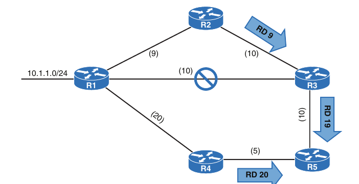
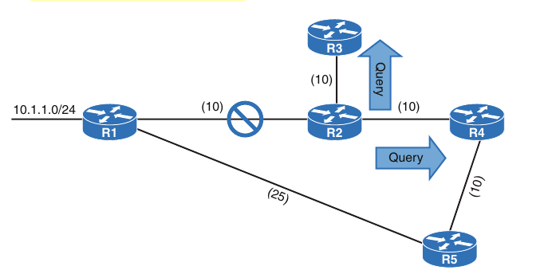
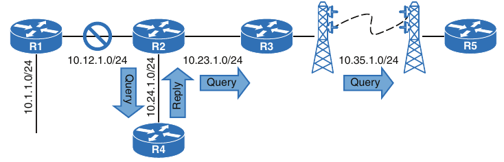

## Advanced EIGRP

1. Failure detection and timers

2. Route Summarization

3. WAN Considerations

4. Route Manipulation

### Failure Detection and Timers

- A secondary function of EIGRP Hello packets is to ensure that EIGRP neighbors are still healthy and available

- EIGRP hello packets are sent out at intervals according to the hello timer

- The default EIGRP hello timer is 5 seconds, but EIGRP uses 60 seconds on low-speed interfaces (T1 or lower)

- EIGRP uses a second timer, called the *hold timer*, which measures the amount of time EIGRP deems the router to be reachable and functioning

- The hold time value defaults to three times the hello interval

- The default value is 15 seconds (or 180 seconds on low-speed interfaces)

- The hold time decrements, and upon receipt of a hello packet, the hold time resets and restarts the countdown

- If the hold time reaches 0, EIGRP declares the neighbor unreachable and notifies the diffusing update algorithm (DUAL) of a topology change

- The hello timers and the hold timers are modified with the interface parameters commands as follows, for classic EIGRP mode

```
conf t
 interface <type/number>
  ip hello-interval eigrp <as-number> <seconds>
  ip hold-time eigrp <as-number> <seconds>
```

- For named mode configurations, the commands are placed under the `af-interface default` or under `af-interface <interface-name>`

- The command `hello-interval <seconds>` modifies the hello interval and the command `hold-time <seconds>` modifies the hold timer when using named mode configurations

- Below are shown examples to change the EIGRP hello interval to 3 seconds and the hold time to 15 seconds in R1 (in classic mode) and R2 (in named mode)

- R1:

```
conf t
 interface g0/1
  ip hello-interval eigrp 100 3
  ip hold-time eigrp 100 15
```

- R2:

```
conf t
 router eigrp EIGRP-NAMED
  address-family ipv4 autonomous-system 100
   af-interface g0/1
    hello-interval 3
    hold-time 15
```

- The EIGRP hello and hold timers are verified with the command `show ip eigrp interface detail <interface-id>` 

- R1:

```
R1#show ip eigrp interfaces detail e0/1 | i Hello|Hold
  Hello-interval is 3, Hold-time is 15
  Hello's sent/expedited: 297/2
```

- R2:

```
R2#show ip eigrp interfaces detail e0/1 | i Hello|Hold
  Hello-interval is 3, Hold-time is 15
  Hello's sent/expedited: 295/2
```

- EIGRP neighbors can still form an adjacency if the timers do not match, but the hellos must be received before the hold time reaches 0; that is, the hello interval must be less than the hold time

### Convergence

- When a link fails and the interface protocol moves to a down state, any neighbor attached to that interface moves to a down state, too

- When an EIGRP neighbor moves to a down state, path recomputation must occur for any prefix where the EIGRP neighbor was a successful (that is, an upstream router)

- When EIGRP detects that it has lost it's successfor for a path, the feasible successor, if one exists, instantly becomes the successor route, providing a backup route

- The router sends out an update packet for that path because of the new EIGRP path metrics

- Downstream routers run their own DUAL algorithm for any affected prefixes to account for the new EIGRP metrics

- It is possible for a change of the successor route or feasible succcessor to occur upon receipt of the new EIGRP metrics from a successor route for a prefix

- Below is demonstrated such a scenario, where the link between R1 and R3 fails

- When the link fails, R3 installs the feasible successor path advertised from R2 as the successor route

- R3 sends an update with a new reported distance (RD) of 19 for the 10.1.1.0/24 prefix

- R5 receives the update from R3 and calculates a feasible distance (FD) of 29 for the R3 - R2 - R1 path to 10.1.1.0/24

- R5 compares that path with the one received from R4, which has a path metric of 25

- R5 chooses the path through R4 as the successor route



- R2:

```
R2(config-if)#do sh ip eigrp topol 10.1.1.0/24
EIGRP-IPv4 VR(EIGRP-NAMED) Topology Entry for AS(100)/ID(192.168.2.2) for 10.1.1.0/24
  State is Passive, Query origin flag is 1, 1 Successor(s), FD is 8519680, RIB is 66560
  Descriptor Blocks:
  10.22.22.3 (GigabitEthernet0/2), from 10.22.22.3, Send flag is 0x0
      Composite metric is (8519680/7864320), route is Internal
      Vector metric:
        Minimum bandwidth is 1000000 Kbit
        Total delay is 120000000 picoseconds
        Reliability is 255/255
        Load is 1/255
        Minimum MTU is 1500
        Hop count is 2
        Originating router is 192.168.1.1
```

- If a feasible successor is not available for the prefix, DUAL must perform a new route calculation

- The route state changes from passive (P) to active (A) in the EIGRP topology table

- The router detecting the topology change sends out query packets to EIGRP neighbors for the route

- A query packet includes the network prefix with the delay set to infinity so that other routers are aware that it is now active

- When the router sends EIGRP query packets, it sets the reply status flag for each neighbor on a per-prefix basis

- The router tracks the reply status for each of the EIGRP query packets on a per-prefix basis

- Upon receipt of a query packet, an EIGRP router does one of the following:

    - It replies to the query that the router does not have a route to the prefix

    - If the query came from the successor for the route, the receiving router detects the delay set to infinity, sets the prefix as active in the EIGRP topology, and sends out a query packet to all downstream EIGRP neighbors for that route

    - If the query does not came from the successor for the route, it detects that the delay is set to infinity, but ignores it because it did not come from the successor. The receiving router replies with the EIGRP attributes for that route

- The query process continues from router to router until a query reaches a query boundary

- A query boundary is established when a router does not mark the prefix as active, meaning that it responds to the query as follows:

    - It says it does not have a route to the prefix

    - It replies with EIGRP attributes because the query did not come from the successor

- When a router receives a reply for every downstream query that was sent out, it completes the DUAL, changes the route to passive, and sends a reply packet to any upstream routers that sent a query packet to it

- Upon receiving the reply packet for a prefix, the router makes note of the reply packet for that neighbor and prefix

- The reply process continues upstream for the queries until the first router's queries are received

- Below is shown a topology where the link between R1 and R2 failed, and R2 has generated queries for the 10.1.1.0/24 network



- For the example shown above, the following steps are processed, in order from the perspective of R2 calculating a new route for the 10.1.1.0/24 network:

    1. R2 detects the link failure. R2 does not have a feasible successor for the route, sets the 10.1.1.0/24 prefix as active, and sends queries to R3 and R4

    2. R3 receives the query from R2 and processes the Delay field that is set to infinity. R3 does not have any other EIGRP neighbors and sends a reply to R2, saying that a route does not exist.
    - R4 receives the query from R2 and processes the Delay field that is set to infinity. Because the query has received from the successor, and a feasible successor for the route does not exist, R4 marks the route as active and sends a query to R5

    3. R5 receives the query from R4 and detects the Delay set to infinity. Because the query has received by a nonsuccessor, and a successor exist on a different interface, R5 sends a reply for the 10.1.1.0/24 network to R4 with the appropriate EIGRP attributes

    4. R4 receives R5's reply, acknowledges the packet, and computes a new path. Because this is the last outstanding query packet on R4, R4 sets the prefix as passive. With all queries satisfied, R4 responds to R2's query with the new EIGRP metrics

    5. R2 receives R4's reply, acknowledges the packet, and computes a new path. Because this is the last outstanding query packet on R2, R2 sets the prefix as passive

### Stuck In Active

- DUAL is very efficient at finding loop-free paths quickly, and it normally finds backup paths in seconds

- Ocasionally, an EIGRP query is delayed because of packet loss, slow neighbors, or a large hop count

- EIGRP maintains a timer, known as the active timer, which has a default value of 3 minutes, 180 seconds

- EIGRP waits half of the active timer value (90 seconds) for a reply

- If the router does not receive a response within 90 seconds, the originating router sends a *stuck in active* (SIA) query to EIGRP neighbors that did not respond

- Upon receipt of a SIA query, the router should repond within 90 seconds with a SIA reply

- An SIA reply contains the route information or provides information on the query process itself

- If a router fails to respond to a SIA query, by the time the active timer expires, EIGRP deems the router SIA

- If the SIA state is declared for a neighbor, DUAL deletes all routes from that neighbor, treating the situation as if the neighbor responded with unreachable messages for all routes

- Earlier versions of IOS terminated EIGRP neighbor sessions with routers that never replied to a SIA query

- You can troubleshoot active EIGRP prefixes only when the router is waiting for a reply

- You can show active queries with the command `show ip eigrp topology`

- To demonstrate the SIA process, below we see a scenario in which the link between R1 and R2 failed

- R2 sends out queries to R4 and R3

- R4 sends a reply back to R2, and R4 sends a reply back to R2, and R3 sends a query on to R5

- A network engineer who sees the syslog message and runs the `show ip eigrp topology active` command on R2, gets the output shown below

- The r next to the peer's IP address (10.23.1.3) indicates that R2 is still waiting on the reply from R3 and that R4 responded

- The command is then executed on R3, and R3 indicates that it is waiting on a respondse from R5

- When you execute the command on R5, you do not see any active prefixes, which implies that R5 never received a query from R3

- R3's query could have been dropped on the radio tower connection



- 