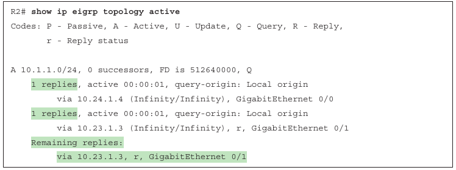
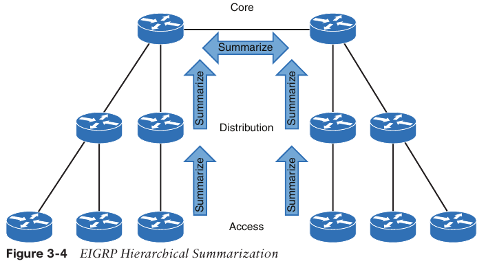
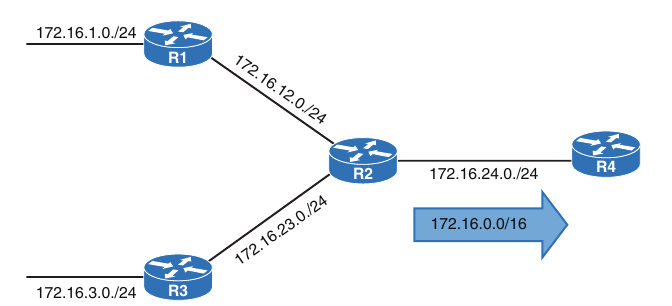
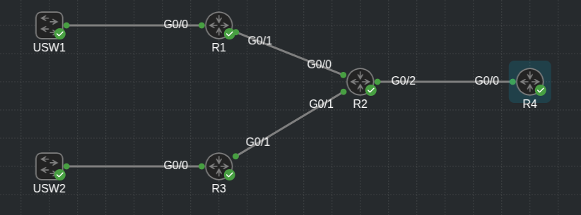
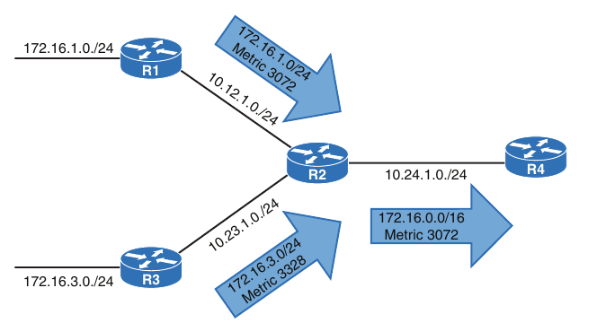
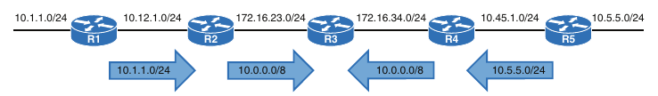
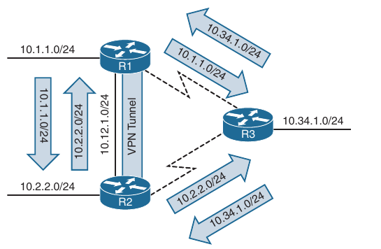

## Advanced EIGRP

1. Failure detection and timers

2. Route Summarization

3. WAN Considerations

4. Route Manipulation

### Failure Detection and Timers

- A secondary function of EIGRP Hello packets is to ensure that EIGRP neighbors are still healthy and available

- EIGRP hello packets are sent out at intervals according to the hello timer

- The default EIGRP hello timer is 5 seconds, but EIGRP uses 60 seconds on low-speed interfaces (T1 or lower)

- EIGRP uses a second timer, called the *hold timer*, which measures the amount of time EIGRP deems the router to be reachable and functioning

- The hold time value defaults to three times the hello interval

- The default value is 15 seconds (or 180 seconds on low-speed interfaces)

- The hold time decrements, and upon receipt of a hello packet, the hold time resets and restarts the countdown

- If the hold time reaches 0, EIGRP declares the neighbor unreachable and notifies the diffusing update algorithm (DUAL) of a topology change

- The hello timers and the hold timers are modified with the interface parameters commands as follows, for classic EIGRP mode

```
conf t
 interface <type/number>
  ip hello-interval eigrp <as-number> <seconds>
  ip hold-time eigrp <as-number> <seconds>
```

- For named mode configurations, the commands are placed under the `af-interface default` or under `af-interface <interface-name>`

- The command `hello-interval <seconds>` modifies the hello interval and the command `hold-time <seconds>` modifies the hold timer when using named mode configurations

- Below are shown examples to change the EIGRP hello interval to 3 seconds and the hold time to 15 seconds in R1 (in classic mode) and R2 (in named mode)

- R1:

```
conf t
 interface g0/1
  ip hello-interval eigrp 100 3
  ip hold-time eigrp 100 15
```

- R2:

```
conf t
 router eigrp EIGRP-NAMED
  address-family ipv4 autonomous-system 100
   af-interface g0/1
    hello-interval 3
    hold-time 15
```

- The EIGRP hello and hold timers are verified with the command `show ip eigrp interface detail <interface-id>` 

- R1:

```
R1#show ip eigrp interfaces detail e0/1 | i Hello|Hold
  Hello-interval is 3, Hold-time is 15
  Hello's sent/expedited: 297/2
```

- R2:

```
R2#show ip eigrp interfaces detail e0/1 | i Hello|Hold
  Hello-interval is 3, Hold-time is 15
  Hello's sent/expedited: 295/2
```

- EIGRP neighbors can still form an adjacency if the timers do not match, but the hellos must be received before the hold time reaches 0; that is, the hello interval must be less than the hold time

### Convergence

- When a link fails and the interface protocol moves to a down state, any neighbor attached to that interface moves to a down state, too

- When an EIGRP neighbor moves to a down state, path recomputation must occur for any prefix where the EIGRP neighbor was a successful (that is, an upstream router)

- When EIGRP detects that it has lost it's successfor for a path, the feasible successor, if one exists, instantly becomes the successor route, providing a backup route

- The router sends out an update packet for that path because of the new EIGRP path metrics

- Downstream routers run their own DUAL algorithm for any affected prefixes to account for the new EIGRP metrics

- It is possible for a change of the successor route or feasible succcessor to occur upon receipt of the new EIGRP metrics from a successor route for a prefix

- Below is demonstrated such a scenario, where the link between R1 and R3 fails

- When the link fails, R3 installs the feasible successor path advertised from R2 as the successor route

- R3 sends an update with a new reported distance (RD) of 19 for the 10.1.1.0/24 prefix

- R5 receives the update from R3 and calculates a feasible distance (FD) of 29 for the R3 - R2 - R1 path to 10.1.1.0/24

- R5 compares that path with the one received from R4, which has a path metric of 25

- R5 chooses the path through R4 as the successor route


- R2:

```
R2(config-if)#do sh ip eigrp topol 10.1.1.0/24
EIGRP-IPv4 VR(EIGRP-NAMED) Topology Entry for AS(100)/ID(192.168.2.2) for 10.1.1.0/24
  State is Passive, Query origin flag is 1, 1 Successor(s), FD is 8519680, RIB is 66560
  Descriptor Blocks:
  10.22.22.3 (GigabitEthernet0/2), from 10.22.22.3, Send flag is 0x0
      Composite metric is (8519680/7864320), route is Internal
      Vector metric:
        Minimum bandwidth is 1000000 Kbit
        Total delay is 120000000 picoseconds
        Reliability is 255/255
        Load is 1/255
        Minimum MTU is 1500
        Hop count is 2
        Originating router is 192.168.1.1
```

- If a feasible successor is not available for the prefix, DUAL must perform a new route calculation

- The route state changes from passive (P) to active (A) in the EIGRP topology table

- The router detecting the topology change sends out query packets to EIGRP neighbors for the route

- A query packet includes the network prefix with the delay set to infinity so that other routers are aware that it is now active

- When the router sends EIGRP query packets, it sets the reply status flag for each neighbor on a per-prefix basis

- The router tracks the reply status for each of the EIGRP query packets on a per-prefix basis

- Upon receipt of a query packet, an EIGRP router does one of the following:

    - It replies to the query that the router does not have a route to the prefix

    - If the query came from the successor for the route, the receiving router detects the delay set to infinity, sets the prefix as active in the EIGRP topology, and sends out a query packet to all downstream EIGRP neighbors for that route

    - If the query does not came from the successor for the route, it detects that the delay is set to infinity, but ignores it because it did not come from the successor. The receiving router replies with the EIGRP attributes for that route

- The query process continues from router to router until a query reaches a query boundary

- A query boundary is established when a router does not mark the prefix as active, meaning that it responds to the query as follows:

    - It says it does not have a route to the prefix

    - It replies with EIGRP attributes because the query did not come from the successor

- When a router receives a reply for every downstream query that was sent out, it completes the DUAL, changes the route to passive, and sends a reply packet to any upstream routers that sent a query packet to it

- Upon receiving the reply packet for a prefix, the router makes note of the reply packet for that neighbor and prefix

- The reply process continues upstream for the queries until the first router's queries are received

- Below is shown a topology where the link between R1 and R2 failed, and R2 has generated queries for the 10.1.1.0/24 network


- For the example shown above, the following steps are processed, in order from the perspective of R2 calculating a new route for the 10.1.1.0/24 network:

    1. R2 detects the link failure. R2 does not have a feasible successor for the route, sets the 10.1.1.0/24 prefix as active, and sends queries to R3 and R4

    2. R3 receives the query from R2 and processes the Delay field that is set to infinity. R3 does not have any other EIGRP neighbors and sends a reply to R2, saying that a route does not exist.
    - R4 receives the query from R2 and processes the Delay field that is set to infinity. Because the query has received from the successor, and a feasible successor for the route does not exist, R4 marks the route as active and sends a query to R5

    3. R5 receives the query from R4 and detects the Delay set to infinity. Because the query has received by a nonsuccessor, and a successor exist on a different interface, R5 sends a reply for the 10.1.1.0/24 network to R4 with the appropriate EIGRP attributes

    4. R4 receives R5's reply, acknowledges the packet, and computes a new path. Because this is the last outstanding query packet on R4, R4 sets the prefix as passive. With all queries satisfied, R4 responds to R2's query with the new EIGRP metrics

    5. R2 receives R4's reply, acknowledges the packet, and computes a new path. Because this is the last outstanding query packet on R2, R2 sets the prefix as passive

### Stuck In Active

- DUAL is very efficient at finding loop-free paths quickly, and it normally finds backup paths in seconds

- Ocasionally, an EIGRP query is delayed because of packet loss, slow neighbors, or a large hop count

- EIGRP maintains a timer, known as the active timer, which has a default value of 3 minutes, 180 seconds

- EIGRP waits half of the active timer value (90 seconds) for a reply

- If the router does not receive a response within 90 seconds, the originating router sends a *stuck in active* (SIA) query to EIGRP neighbors that did not respond

- Upon receipt of a SIA query, the router should repond within 90 seconds with a SIA reply

- An SIA reply contains the route information or provides information on the query process itself

- If a router fails to respond to a SIA query, by the time the active timer expires, EIGRP deems the router SIA

- If the SIA state is declared for a neighbor, DUAL deletes all routes from that neighbor, treating the situation as if the neighbor responded with unreachable messages for all routes

- Earlier versions of IOS terminated EIGRP neighbor sessions with routers that never replied to a SIA query

- You can troubleshoot active EIGRP prefixes only when the router is waiting for a reply

- You can show active queries with the command `show ip eigrp topology`

- To demonstrate the SIA process, below we see a scenario in which the link between R1 and R2 failed

- R2 sends out queries to R4 and R3

- R4 sends a reply back to R2, and R4 sends a reply back to R2, and R3 sends a query on to R5

- A network engineer who sees the syslog message and runs the `show ip eigrp topology active` command on R2, gets the output shown below

- The r next to the peer's IP address (10.23.1.3) indicates that R2 is still waiting on the reply from R3 and that R4 responded

- The command is then executed on R3, and R3 indicates that it is waiting on a respondse from R5

- When you execute the command on R5, you do not see any active prefixes, which implies that R5 never received a query from R3

- R3's query could have been dropped on the radio tower connection




- The active timer is set to 3 minutes by default

- The active timer can be disabled or modified with the following command under the EIGRP process:

```
conf t
 router eigrp 100
  timers active-time <disabled| 0-65535 minutes>
```

- With classic configuration mode the command runs directly under the EIGRP process, and with named mode configuration, the command runs under the topology base

- R1:

```
conf t
 router eigrp 100
  timers active-time 2
```

- R2:

```
conf t
 router eigrp eigrp-named
  address-family ipv4 unicast autonomous-system 100
   topology base
    timers active-time 2
```

- You can see the active timer by examining the IP protocols on a router with the command `show ip protocols`

- Filtering with the keyword Active, streamlines the information

- Below is the output on R2:

```
R2(config-router-af-topology)#do sh ip proto | i Active
      Active Timer: 2 min
```

- The SIA query now occurs after 1 minute, which is half of the configured SIA timer

### Route Summarization

- EIGRP works well with minimal optimization

- Scalability on an EIGRP autonomous system depends on route summarization

- As the size of an EIGRP autonomous system increases, convergence may take longer

- Scaling an EIGRP topology depends on summarizing routes in a hierarchical fashion

- Below is shown summarization occuring on the access, distribution and core layers of the network topology

- In addition to shrinking the routing tables of all the routers, route summarization creates a query boundary and shrinks the query domain when a route goes active during convergence, thereby reducing CIA scenarios



- Route summarization on this scale requires hierarchical deployment of an IP addressing scheme

#### Interface-specific summarization

- EIGRP summarizes routes on a per-interface basis

- Summarization is enabled by configuring a summary route address range under the EIGRP interface, where all routes that fall within the summary address range are referred to as component routes

- With summarization enabled, the component routes are suppressed (that is, not advertised), and only the summary route is advertised

- The summary route is not advertised until a component route matches it

- Interface-specific summarization can be performed in any portion of the network topology

- Below is illustrated the concept of EIGRP summarization

- Without summarization, R2 advertises the 172.16.1.0/24, 172.16.3.0/24, 172.16.12.0/24 and 172.16.23.0/24 routes toward R4

- R2 summarizes these network prefixes to the 172.16.0.0/16 summary route so that only one advertisement is sent to R4



- For classic EIGRP configuration mode, the following interface parameter command can be used to place an EIGRP summary route on an interface:

```
conf t
 interface <type/number>
  ip summary-address eigrp <as-nr> <network> <subnet-mask> [leak-map <route-map-name>]
```



- R2 - G0/2

```
conf t
 ip prefix-list EIGRP-SUMM seq 10 permit 172.16.1.0/24 
 ip prefix-list EIGRP-SUMM seq 20 permit 172.16.3.0/24
 ip prefix-list EIGRP-SUMM seq 30 permit 172.16.12.0/24
 ip prefix-list EIGRP-SUMM seq 40 permit 172.16.23.0/24

 route-map EIGRP-SUMM permit 10
  match ip address prefix-list EIGRP-SUMM
  set tag 10

 interface g0/2
  ip summary-address eigrp 100 172.16.0.0/16 leak-map EIGRP-SUMM

```

- Using the leak-map on the summary-address command, the parts of the leak-map are also present into the routing table on R4

```
R4#show ip route | b Gate
Gateway of last resort is not set

      172.16.0.0/16 is variably subnetted, 7 subnets, 3 masks
D        172.16.0.0/16 [90/3072] via 172.16.24.2, 00:02:03, GigabitEthernet0/0
D        172.16.1.0/24 [90/3328] via 172.16.24.2, 00:02:22, GigabitEthernet0/0
D        172.16.3.0/24 [90/3328] via 172.16.24.2, 00:02:22, GigabitEthernet0/0
D        172.16.12.0/24 
           [90/3072] via 172.16.24.2, 00:02:22, GigabitEthernet0/0
D        172.16.23.0/24 
           [90/3072] via 172.16.24.2, 00:02:22, GigabitEthernet0/0
C        172.16.24.0/24 is directly connected, GigabitEthernet0/0
L        172.16.24.4/32 is directly connected, GigabitEthernet0/0
```

- R2 - summary without leak-map:

```
conf t
 int g0/2
  ip summary-address eigrp 100 172.16.0.0/16
```

- R4 - viewing the routing table now:

```
R4#show ip route | b Gate
Gateway of last resort is not set

      172.16.0.0/16 is variably subnetted, 3 subnets, 3 masks
D        172.16.0.0/16 [90/3072] via 172.16.24.2, 00:00:08, GigabitEthernet0/0
C        172.16.24.0/24 is directly connected, GigabitEthernet0/0
L        172.16.24.4/32 is directly connected, GigabitEthernet0/0
```

- You perform summary-route configuration for named mode under af-interface <interface-id>, using the following command:

```
conf t 
 router eigrp <name>
  address-family ipv4 autonomous-system <number>
   af-interface <interface-id>
    summary-address <network> <subnet-mask> [leak-map <route-map-name>]
```

- The `leak-map` option allows the advertisement of the routes identified in the route-map

- Because suppression is avoided, the routes are considered leaked because they are advertised along with the summary route

- This allows for the use of longest-match routing to influence traffic patterns while suppressing most of the prefixes

- Below is shown R4's routing table before summarization is configured on R2

- Notice that only /24 networks exist in the routing table

- R4 routing table before summarization:

```
R4#show ip route | b Gate
Gateway of last resort is not set

      172.16.0.0/16 is variably subnetted, 6 subnets, 2 masks
D        172.16.1.0/24 [90/3328] via 172.16.24.2, 00:00:25, GigabitEthernet0/0
D        172.16.3.0/24 [90/3328] via 172.16.24.2, 00:00:25, GigabitEthernet0/0
D        172.16.12.0/24 
           [90/3072] via 172.16.24.2, 00:00:25, GigabitEthernet0/0
D        172.16.23.0/24 
           [90/3072] via 172.16.24.2, 00:00:25, GigabitEthernet0/0
C        172.16.24.0/24 is directly connected, GigabitEthernet0/0
L        172.16.24.4/32 is directly connected, GigabitEthernet0/0
```

- R2 - configuration of summary route for named mode:

```
router eigrp EIGRP-NAMED
 !
 address-family ipv4 unicast autonomous-system 200
  !
  af-interface GigabitEthernet0/2
   summary-address 172.16.0.0 255.255.0.0
  exit-af-interface
  !
  topology base
  exit-af-topology
 exit-address-family
```

- Summary routes are always advertised based on the outgoing interface

- The `af-interface default` command cannot be used with the `summary-address` command. It requires the use fo a specific interface

- Below is shown the R4's routing table after summarization is enabled on R2

```
R4#show ip ro | b Gate
Gateway of last resort is not set

      172.16.0.0/16 is variably subnetted, 3 subnets, 3 masks
D        172.16.0.0/16 [90/3072] via 172.16.24.2, 00:08:50, GigabitEthernet0/0
C        172.16.24.0/24 is directly connected, GigabitEthernet0/0
L        172.16.24.4/32 is directly connected, GigabitEthernet0/0
```

- The number of EIGRP routes has been drastically reduced, thereby reducing consumption of CPU and memory resources

- Notice that all the component routes are condensed into the 172.16.0.0/16 summary route

- Advertising a default route into EIGRP requires the summaryzation syntax described earlier, except that the network and subnet-mask uses 0.0.0.0 0.0.0.0, commonly referred to as `double-quad zeros`

```
conf t
 interface g0/2
  ip summary-address eigrp 100 0.0.0.0 0.0.0.0
```

#### Summary Discard Routes

- EIGRP installs a discard route on the summarizing routers as a loop-prevention mechanism

- A discard route is a route that matches the summary route with the destination to Null0

- This prevents routing loops where portions of the summarized network range do not have a more specific entry in the Routing Information Base (RIB) on the summarizing router

- The AD for the Null0 route is 5 by default

- We can view the discard route with the command `show ip route <network> <subnet-mask>` on the summarizing router

```
R2#show ip route 172.16.0.0 255.255.0.0
Routing entry for 172.16.0.0/16
  Known via "eigrp 100", distance 5, metric 2816, type internal
  Redistributing via eigrp 100
  Routing Descriptor Blocks:
  * directly connected, via Null0
      Route metric is 2816, traffic share count is 1
      Total delay is 10 microseconds, minimum bandwidth is 1000000 Kbit
      Reliability 255/255, minimum MTU 1500 bytes
      Loading 1/255, Hops 0
```

- Notice that the AD is set to 5, and is connected to Null0, which means the packets are discarded if a longer match is not made

#### Summarization Metrics

- The summarizing router uses the lowest metric of the component routes in the summary route

- The path metric for the summary route is based of the path attributes of the path with the lowest metric

- EIGRP path attributes such as total delay and minimum bandwidth are inserted into the summary route so that downstream routers can calculate the correct path metric for the summary route

- Below R2 has a path metric of 3072 for the 172.16.1.0/24 route and a path metric of 3328 for the 172.16.3.0/24 route

- The summary route 172.16.0.0/16 is advertised with the path metric 3072 and the EIGRP path attributes received by R2 from R1



- Every time a matching component route for the summary route is added or removed, EIGRP must verify that the summary route is still using the attributes for the path with the lowest metric

- If it is not, a new summary route is advertised with updated EIGRP attributes, and downstream routes must run the DUAL again

- The summary route hides the smaller prefixes from downstream routers, but downstream routers are still burdened with processing updates to the summary route

- The fluctuation in the path metric is resolved by statically setting the metric on the summary route with the command:

```
conf t 
 router eigrp <as-nr>
  summary-metric <network> </prefix-len|subnet-mask> <bandwidth> <delay> <reliability> <load> <mtu> [distance <distance>]
```

- R2:

```
conf t
 router eigrp 100
  summary-metric 172.16.0.0 255.255.0.0 1000000 1 255 1 1500 distance 50
```

```
R2(config-router)#do sh ip route 172.16.0.0 255.255.0.0
Routing entry for 172.16.0.0/16
  Known via "eigrp 100", distance 50, metric 2816, type internal
  Redistributing via eigrp 100
  Routing Descriptor Blocks:
  * directly connected, via Null0
      Route metric is 2816, traffic share count is 1
      Total delay is 10 microseconds, minimum bandwidth is 1000000 Kbit
      Reliability 255/255, minimum MTU 1500 bytes
      Loading 1/255, Hops 0
```

- Using `distance` also sets the AD of the summary route

- Bandwidth is in kilobits per second (Kbps), delay is in 10-microsecond us units, reliability and load are values between 1 and 255, and the MTU is the maximum transmission unit (MTU) for an interface

- Set summary metric for EIGRP named mode:

```
conf t
 router eigrp EIGRP-NAMED
  address-family ipv4 autonomous-system 100
   topology base
    summary-metric 172.16.0.0 255.255.0.0 1000000 1 255 1 1500 distance 50
```

#### Automatic Summarization

- EIGRP supports automatic summarization, automatically summarizing network advertisements when they cross a classful network boundary

- Below is shown the automatic summarization for the 10.1.1.0 network on R2 and the 10.5.5.0/24 network on R4

- R2 and R4 only advertise the classful network 10.0.0.0/8 toward R3



- Below is shown the routing table for R3

- Notice that there are no routes for the 10.1.1.0/24 or 10.5.5.0/24 networks; there is only a route for 10.0.0.0/8 with next hops of R2 and R4

- Traffic sent to either network could be sent to the wrong interface

- This problem affects network traffic traveling across the network in addition to traffic originating from R3

```
R3(config-router)#do sh ip ro | b Gate
Gateway of last resort is not set

D     10.0.0.0/8 [90/3072] via 172.16.34.4, 00:00:27, GigabitEthernet0/1
                 [90/3072] via 172.16.23.2, 00:00:27, GigabitEthernet0/0
      172.16.0.0/16 is variably subnetted, 4 subnets, 2 masks
C        172.16.23.0/24 is directly connected, GigabitEthernet0/0
L        172.16.23.3/32 is directly connected, GigabitEthernet0/0
C        172.16.34.0/24 is directly connected, GigabitEthernet0/1
L        172.16.34.3/32 is directly connected, GigabitEthernet0/1
```

- Below is displayed a similar behaviour for the 172.16.23.0/24 and 172.16.24.0/24 networks, as they are advertised as 172.16.0.0/16 networks from R1 and R2

```
R1(config-router)#do sh ip ro | b Gate
Gateway of last resort is not set

      10.0.0.0/8 is variably subnetted, 4 subnets, 2 masks
C        10.1.1.0/24 is directly connected, Loopback0
L        10.1.1.1/32 is directly connected, Loopback0
C        10.12.1.0/24 is directly connected, GigabitEthernet0/0
L        10.12.1.1/32 is directly connected, GigabitEthernet0/0
D     172.16.0.0/16 [90/3072] via 10.12.1.2, 00:02:51, GigabitEthernet0/0
```

```
R5(config-router)#do sh ip ro | b Gate
Gateway of last resort is not set

      10.0.0.0/8 is variably subnetted, 4 subnets, 2 masks
C        10.5.5.0/24 is directly connected, Loopback0
L        10.5.5.5/32 is directly connected, Loopback0
C        10.45.4.0/24 is directly connected, GigabitEthernet0/0
L        10.45.4.5/32 is directly connected, GigabitEthernet0/0
D     172.16.0.0/16 [90/3072] via 10.45.4.4, 00:03:18, GigabitEthernet0/0
```

- Current releases or IOS-XE disables EIGRP classful network automatic summarization by default

- You enable automatic summarization as follows:

- Classic mode:

```
conf t
 router eigrp 100
  auto-summary
```

- Named mode:

```
conf t
 router eigrp EIGRP-NAMED
  address-family ipv4 autonomous-system 100
   topology base
    auto-summary
```

- Disabling automatic summarization:

```
conf t
 router eigrp 100
  no auto-summary
```

```
conf t
 router eigrp EIGRP-NAMED
  address-family ipv4 autonomous-system 100
   topology base
    no auto-summary
```

## WAN considerations

- EIGRP does not change behavior based on the media type of an interface

- Serial and Ethernet interfaces are treated the same

- Some WAN topologies may require special consideration for bandwidth utilization, split horizon, or next-hop-self

### EIGRP Stub Router

- A proper network design provides redundancy where dictated by business requirements to ensure that a remote location always maintains network connectivity

- To overcome single points of failure, you can add additional routers at each site, add redundant circuits (possibly with different service providers), use different routing protocols, or use virtual private network (VPN) tunnels across the Internet for backup transport

- Below is shown a topology with R1 and R2 providing connectivity at two key data center locations

- R1 and R2 have three WAN circuits and a LAN interface

- The first circuit is a 10 Gbps dedicated point-to-point circuit (10.12.1.0/24), the second circuit is a T1 (1.5Mbps) serial link to R3, and the third circuit is an Internet connection that R1 and R2 use to maintain backup connectivity to each other through a backup VPN tunnel

- EIGRP is not enabled across the VPN tunnel, and traffic should be routed across the backup VPN tunnel using a simple static route for the 10.0.0.0/8 route if the 10Gbps circuit fails

- R1 advertises the 10.1.1.0/24 prefix directly to R2 and R3, and R2 advertises the 10.2.2.0/24 prefix to R1 and R3



- For the 10.1.1.0/24 and 10.2.2.0/24 the networks are not shown in the following snippets as they are advertised over the 10Gbps link

- 