## Advanced EIGRP

1. Failure detection and timers

2. Route Summarization

3. WAN Considerations

4. Route Manipulation

### Failure Detection and Timers

- A secondary function of EIGRP Hello packets is to ensure that EIGRP neighbors are still healthy and available

- EIGRP hello packets are sent out at intervals according to the hello timer

- The default EIGRP hello timer is 5 seconds, but EIGRP uses 60 seconds on low-speed interfaces (T1 or lower)

- EIGRP uses a second timer, called the *hold timer*, which measures the amount of time EIGRP deems the router to be reachable and functioning

- The hold time value defaults to three times the hello interval

- The default value is 15 seconds (or 180 seconds on low-speed interfaces)

- The hold time decrements, and upon receipt of a hello packet, the hold time resets and restarts the countdown

- If the hold time reaches 0, EIGRP declares the neighbor unreachable and notifies the diffusing update algorithm (DUAL) of a topology change

- The hello timers and the hold timers are modified with the interface parameters commands as follows, for classic EIGRP mode

```
conf t
 interface <type/number>
  ip hello-interval eigrp <as-number> <seconds>
  ip hold-time eigrp <as-number> <seconds>
```

- For named mode configurations, the commands are placed under the `af-interface default` or under `af-interface <interface-name>`

- The command `hello-interval <seconds>` modifies the hello interval and the command `hold-time <seconds>` modifies the hold timer when using named mode configurations

- Below are shown examples to change the EIGRP hello interval to 3 seconds and the hold time to 15 seconds in R1 (in classic mode) and R2 (in named mode)

- R1:

```
conf t
 interface g0/1
  ip hello-interval eigrp 100 3
  ip hold-time eigrp 100 15
```

- R2:

```
conf t
 router eigrp EIGRP-NAMED
  address-family ipv4 autonomous-system 100
   af-interface g0/1
    hello-interval 3
    hold-time 15
```

- The EIGRP hello and hold timers are verified with the command `show ip eigrp interface detail <interface-id>` 

- R1:

```
R1#show ip eigrp interfaces detail e0/1 | i Hello|Hold
  Hello-interval is 3, Hold-time is 15
  Hello's sent/expedited: 297/2
```

- R2:

```
R2#show ip eigrp interfaces detail e0/1 | i Hello|Hold
  Hello-interval is 3, Hold-time is 15
  Hello's sent/expedited: 295/2
```

- EIGRP neighbors can still form an adjacency if the timers do not match, but the hellos must be received before the hold time reaches 0; that is, the hello interval must be less than the hold time

### Convergence

- When a link fails and the interface protocol moves to a down state, any neighbor attached to that interface moves to a down state, too

- When an EIGRP neighbor moves to a down state, path recomputation must occur for any prefix where the EIGRP neighbor was a successful (that is, an upstream router)

- When EIGRP detects that it has lost it's successfor for a path, the feasible successor, if one exists, instantly becomes the successor route, providing a backup route

- The router sends out an update packet for that path because of the new EIGRP path metrics

- Downstream routers run their own DUAL algorithm for any affected prefixes to account for the new EIGRP metrics

- It is possible for a change of the successor route or feasible succcessor to occur upon receipt of the new EIGRP metrics from a successor route for a prefix

- Below is demonstrated such a scenario, where the link between R1 and R3 fails

- When the link fails, R3 installs the feasible successor path advertised from R2 as the successor route

- R3 sends an update with a new reported distance (RD) of 19 for the 10.1.1.0/24 prefix

- R5 receives the update from R3 and calculates a feasible distance (FD) of 29 for the R3 - R2 - R1 path to 10.1.1.0/24

- R5 compares that path with the one received from R4, which has a path metric of 25

- R5 chooses the path through R4 as the successor route

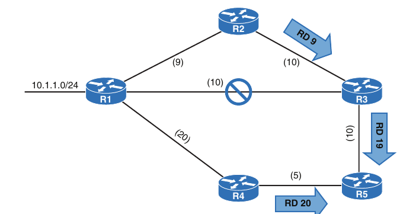

- R2:

```
R2(config-if)#do sh ip eigrp topol 10.1.1.0/24
EIGRP-IPv4 VR(EIGRP-NAMED) Topology Entry for AS(100)/ID(192.168.2.2) for 10.1.1.0/24
  State is Passive, Query origin flag is 1, 1 Successor(s), FD is 8519680, RIB is 66560
  Descriptor Blocks:
  10.22.22.3 (GigabitEthernet0/2), from 10.22.22.3, Send flag is 0x0
      Composite metric is (8519680/7864320), route is Internal
      Vector metric:
        Minimum bandwidth is 1000000 Kbit
        Total delay is 120000000 picoseconds
        Reliability is 255/255
        Load is 1/255
        Minimum MTU is 1500
        Hop count is 2
        Originating router is 192.168.1.1
```

- If a feasible successor is not available for the prefix, DUAL must perform a new route calculation

- The route state changes from passive (P) to active (A) in the EIGRP topology table

- The router detecting the topology change sends out query packets to EIGRP neighbors for the route

- A query packet includes the network prefix with the delay set to infinity so that other routers are aware that it is now active

- When the router sends EIGRP query packets, it sets the reply status flag for each neighbor on a per-prefix basis

- The router tracks the reply status for each of the EIGRP query packets on a per-prefix basis

- Upon receipt of a query packet, an EIGRP router does one of the following:

    - It replies to the query that the router does not have a route to the prefix

    - If the query came from the successor for the route, the receiving router detects the delay set to infinity, sets the prefix as active in the EIGRP topology, and sends out a query packet to all downstream EIGRP neighbors for that route

    - If the query does not came from the successor for the route, it detects that the delay is set to infinity, but ignores it because it did not come from the successor. The receiving router replies with the EIGRP attributes for that route

- The query process continues from router to router until a query reaches a query boundary

- A query boundary is established when a router does not mark the prefix as active, meaning that it responds to the query as follows:

    - It says it does not have a route to the prefix

    - It replies with EIGRP attributes because the query did not come from the successor

- When a router receives a reply for every downstream query that was sent out, it completes the DUAL, changes the route to passive, and sends a reply packet to any upstream routers that sent a query packet to it

- Upon receiving the reply packet for a prefix, the router makes note of the reply packet for that neighbor and prefix

- The reply process continues upstream for the queries until the first router's queries are received

- Below is shown a topology where the link between R1 and R2 failed, and R2 has generated queries for the 10.1.1.0/24 network

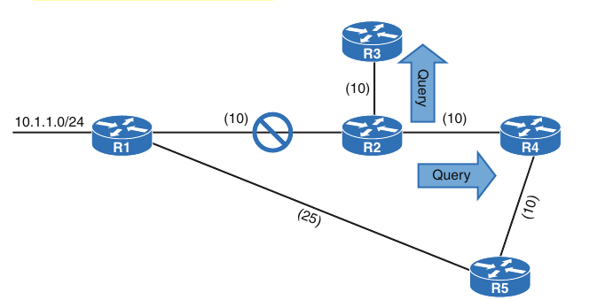

- For the example shown above, the following steps are processed, in order from the perspective of R2 calculating a new route for the 10.1.1.0/24 network:

    1. R2 detects the link failure. R2 does not have a feasible successor for the route, sets the 10.1.1.0/24 prefix as active, and sends queries to R3 and R4

    2. R3 receives the query from R2 and processes the Delay field that is set to infinity. R3 does not have any other EIGRP neighbors and sends a reply to R2, saying that a route does not exist.
    - R4 receives the query from R2 and processes the Delay field that is set to infinity. Because the query has received from the successor, and a feasible successor for the route does not exist, R4 marks the route as active and sends a query to R5

    3. R5 receives the query from R4 and detects the Delay set to infinity. Because the query has received by a nonsuccessor, and a successor exist on a different interface, R5 sends a reply for the 10.1.1.0/24 network to R4 with the appropriate EIGRP attributes

    4. R4 receives R5's reply, acknowledges the packet, and computes a new path. Because this is the last outstanding query packet on R4, R4 sets the prefix as passive. With all queries satisfied, R4 responds to R2's query with the new EIGRP metrics

    5. R2 receives R4's reply, acknowledges the packet, and computes a new path. Because this is the last outstanding query packet on R2, R2 sets the prefix as passive

### Stuck In Active

- DUAL is very efficient at finding loop-free paths quickly, and it normally finds backup paths in seconds

- Ocasionally, an EIGRP query is delayed because of packet loss, slow neighbors, or a large hop count

- EIGRP maintains a timer, known as the active timer, which has a default value of 3 minutes, 180 seconds

- EIGRP waits half of the active timer value (90 seconds) for a reply

- If the router does not receive a response within 90 seconds, the originating router sends a *stuck in active* (SIA) query to EIGRP neighbors that did not respond

- Upon receipt of a SIA query, the router should repond within 90 seconds with a SIA reply

- An SIA reply contains the route information or provides information on the query process itself

- If a router fails to respond to a SIA query, by the time the active timer expires, EIGRP deems the router SIA

- If the SIA state is declared for a neighbor, DUAL deletes all routes from that neighbor, treating the situation as if the neighbor responded with unreachable messages for all routes

- Earlier versions of IOS terminated EIGRP neighbor sessions with routers that never replied to a SIA query

- You can troubleshoot active EIGRP prefixes only when the router is waiting for a reply

- You can show active queries with the command `show ip eigrp topology`

- To demonstrate the SIA process, below we see a scenario in which the link between R1 and R2 failed

- R2 sends out queries to R4 and R3

- R4 sends a reply back to R2, and R4 sends a reply back to R2, and R3 sends a query on to R5

- A network engineer who sees the syslog message and runs the `show ip eigrp topology active` command on R2, gets the output shown below

- The r next to the peer's IP address (10.23.1.3) indicates that R2 is still waiting on the reply from R3 and that R4 responded

- The command is then executed on R3, and R3 indicates that it is waiting on a respondse from R5

- When you execute the command on R5, you do not see any active prefixes, which implies that R5 never received a query from R3

- R3's query could have been dropped on the radio tower connection

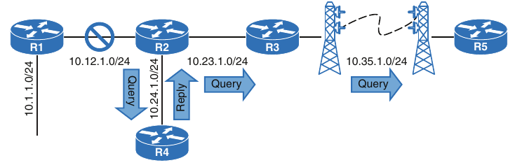

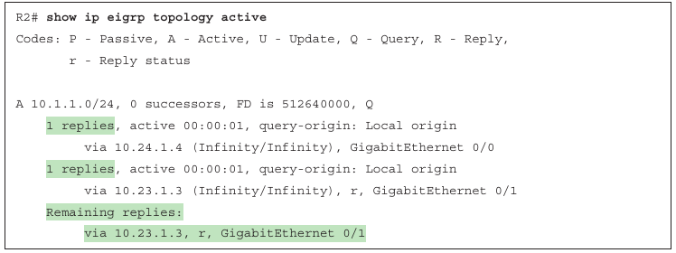

- The active timer is set to 3 minutes by default

- The active timer can be disabled or modified with the following command under the EIGRP process:

```
conf t
 router eigrp 100
  timers active-time <disabled| 0-65535 minutes>
```

- With classic configuration mode the command runs directly under the EIGRP process, and with named mode configuration, the command runs under the topology base

- R1:

```
conf t
 router eigrp 100
  timers active-time 2
```

- R2:

```
conf t
 router eigrp eigrp-named
  address-family ipv4 unicast autonomous-system 100
   topology base
    timers active-time 2
```

- You can see the active timer by examining the IP protocols on a router with the command `show ip protocols`

- Filtering with the keyword Active, streamlines the information

- Below is the output on R2:

```
R2(config-router-af-topology)#do sh ip proto | i Active
      Active Timer: 2 min
```

- The SIA query now occurs after 1 minute, which is half of the configured SIA timer

### Route Summarization

- EIGRP works well with minimal optimization

- Scalability on an EIGRP autonomous system depends on route summarization

- As the size of an EIGRP autonomous system increases, convergence may take longer

- Scaling an EIGRP topology depends on summarizing routes in a hierarchical fashion

- Below is shown summarization occuring on the access, distribution and core layers of the network topology

- In addition to shrinking the routing tables of all the routers, route summarization creates a query boundary and shrinks the query domain when a route goes active during convergence, thereby reducing CIA scenarios

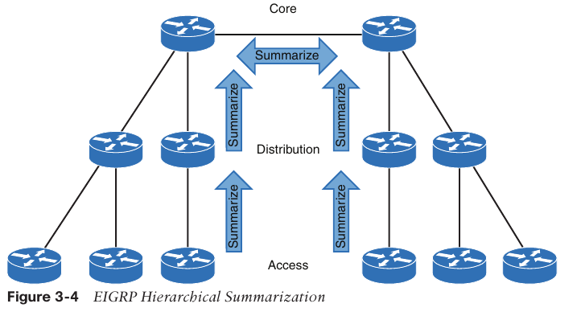

- Route summarization on this scale requires hierarchical deployment of an IP addressing scheme

#### Interface-specific summarization

- EIGRP summarizes routes on a per-interface basis

- Summarization is enabled by configuring a summary route address range under the EIGRP interface, where all routes that fall within the summary address range are referred to as component routes

- With summarization enabled, the component routes are suppressed (that is, not advertised), and only the summary route is advertised

- The summary route is not advertised until a component route matches it

- Interface-specific summarization can be performed in any portion of the network topology

- Below is illustrated the concept of EIGRP summarization

- Without summarization, R2 advertises the 172.16.1.0/24, 172.16.3.0/24, 172.16.12.0/24 and 172.16.23.0/24 routes toward R4

- R2 summarizes these network prefixes to the 172.16.0.0/16 summary route so that only one advertisement is sent to R4

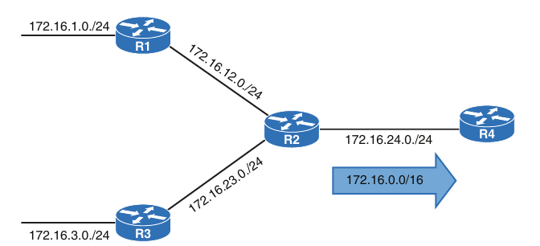

- For classic EIGRP configuration mode, the following interface parameter command can be used to place an EIGRP summary route on an interface:

```
conf t
 interface <type/number>
  ip summary-address eigrp <as-nr> <network> <subnet-mask> [leak-map <route-map-name>]
```

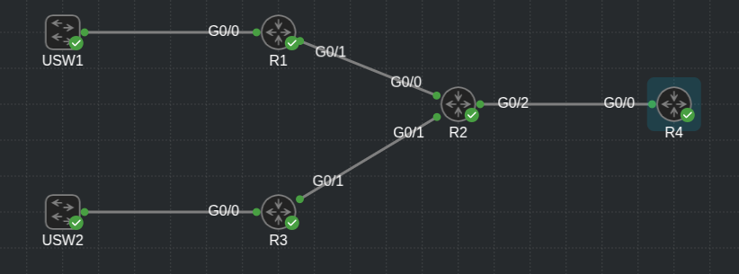

- R2 - G0/2

```
conf t
 ip prefix-list EIGRP-SUMM seq 10 permit 172.16.1.0/24 
 ip prefix-list EIGRP-SUMM seq 20 permit 172.16.3.0/24
 ip prefix-list EIGRP-SUMM seq 30 permit 172.16.12.0/24
 ip prefix-list EIGRP-SUMM seq 40 permit 172.16.23.0/24

 route-map EIGRP-SUMM permit 10
  match ip address prefix-list EIGRP-SUMM
  set tag 10

 interface g0/2
  ip summary-address eigrp 100 172.16.0.0/16 leak-map EIGRP-SUMM

```

- Using the leak-map on the summary-address command, the parts of the leak-map are also present into the routing table on R4

```
R4#show ip route | b Gate
Gateway of last resort is not set

      172.16.0.0/16 is variably subnetted, 7 subnets, 3 masks
D        172.16.0.0/16 [90/3072] via 172.16.24.2, 00:02:03, GigabitEthernet0/0
D        172.16.1.0/24 [90/3328] via 172.16.24.2, 00:02:22, GigabitEthernet0/0
D        172.16.3.0/24 [90/3328] via 172.16.24.2, 00:02:22, GigabitEthernet0/0
D        172.16.12.0/24 
           [90/3072] via 172.16.24.2, 00:02:22, GigabitEthernet0/0
D        172.16.23.0/24 
           [90/3072] via 172.16.24.2, 00:02:22, GigabitEthernet0/0
C        172.16.24.0/24 is directly connected, GigabitEthernet0/0
L        172.16.24.4/32 is directly connected, GigabitEthernet0/0
```

- R2 - summary without leak-map:

```
conf t
 int g0/2
  ip summary-address eigrp 100 172.16.0.0/16
```

- R4 - viewing the routing table now:

```
R4#show ip route | b Gate
Gateway of last resort is not set

      172.16.0.0/16 is variably subnetted, 3 subnets, 3 masks
D        172.16.0.0/16 [90/3072] via 172.16.24.2, 00:00:08, GigabitEthernet0/0
C        172.16.24.0/24 is directly connected, GigabitEthernet0/0
L        172.16.24.4/32 is directly connected, GigabitEthernet0/0
```

- You perform summary-route configuration for named mode under af-interface <interface-id>, using the following command:

```
conf t 
 router eigrp <name>
  address-family ipv4 autonomous-system <number>
   af-interface <interface-id>
    summary-address <network> <subnet-mask> [leak-map <route-map-name>]
```

- The `leak-map` option allows the advertisement of the routes identified in the route-map

- Because suppression is avoided, the routes are considered leaked because they are advertised along with the summary route

- This allows for the use of longest-match routing to influence traffic patterns while suppressing most of the prefixes

- Below is shown R4's routing table before summarization is configured on R2

- Notice that only /24 networks exist in the routing table

- R4 routing table before summarization:

```
R4#show ip route | b Gate
Gateway of last resort is not set

      172.16.0.0/16 is variably subnetted, 6 subnets, 2 masks
D        172.16.1.0/24 [90/3328] via 172.16.24.2, 00:00:25, GigabitEthernet0/0
D        172.16.3.0/24 [90/3328] via 172.16.24.2, 00:00:25, GigabitEthernet0/0
D        172.16.12.0/24 
           [90/3072] via 172.16.24.2, 00:00:25, GigabitEthernet0/0
D        172.16.23.0/24 
           [90/3072] via 172.16.24.2, 00:00:25, GigabitEthernet0/0
C        172.16.24.0/24 is directly connected, GigabitEthernet0/0
L        172.16.24.4/32 is directly connected, GigabitEthernet0/0
```

- R2 - configuration of summary route for named mode:

```
router eigrp EIGRP-NAMED
 !
 address-family ipv4 unicast autonomous-system 200
  !
  af-interface GigabitEthernet0/2
   summary-address 172.16.0.0 255.255.0.0
  exit-af-interface
  !
  topology base
  exit-af-topology
 exit-address-family
```

- Summary routes are always advertised based on the outgoing interface

- The `af-interface default` command cannot be used with the `summary-address` command. It requires the use fo a specific interface

- Below is shown the R4's routing table after summarization is enabled on R2

```
R4#show ip ro | b Gate
Gateway of last resort is not set

      172.16.0.0/16 is variably subnetted, 3 subnets, 3 masks
D        172.16.0.0/16 [90/3072] via 172.16.24.2, 00:08:50, GigabitEthernet0/0
C        172.16.24.0/24 is directly connected, GigabitEthernet0/0
L        172.16.24.4/32 is directly connected, GigabitEthernet0/0
```

- The number of EIGRP routes has been drastically reduced, thereby reducing consumption of CPU and memory resources

- Notice that all the component routes are condensed into the 172.16.0.0/16 summary route

- Advertising a default route into EIGRP requires the summaryzation syntax described earlier, except that the network and subnet-mask uses 0.0.0.0 0.0.0.0, commonly referred to as `double-quad zeros`

```
conf t
 interface g0/2
  ip summary-address eigrp 100 0.0.0.0 0.0.0.0
```

#### Summary Discard Routes

- EIGRP installs a discard route on the summarizing routers as a loop-prevention mechanism

- A discard route is a route that matches the summary route with the destination to Null0

- This prevents routing loops where portions of the summarized network range do not have a more specific entry in the Routing Information Base (RIB) on the summarizing router

- The AD for the Null0 route is 5 by default

- We can view the discard route with the command `show ip route <network> <subnet-mask>` on the summarizing router

```
R2#show ip route 172.16.0.0 255.255.0.0
Routing entry for 172.16.0.0/16
  Known via "eigrp 100", distance 5, metric 2816, type internal
  Redistributing via eigrp 100
  Routing Descriptor Blocks:
  * directly connected, via Null0
      Route metric is 2816, traffic share count is 1
      Total delay is 10 microseconds, minimum bandwidth is 1000000 Kbit
      Reliability 255/255, minimum MTU 1500 bytes
      Loading 1/255, Hops 0
```

- Notice that the AD is set to 5, and is connected to Null0, which means the packets are discarded if a longer match is not made

#### Summarization Metrics

- The summarizing router uses the lowest metric of the component routes in the summary route

- The path metric for the summary route is based of the path attributes of the path with the lowest metric

- EIGRP path attributes such as total delay and minimum bandwidth are inserted into the summary route so that downstream routers can calculate the correct path metric for the summary route

- Below R2 has a path metric of 3072 for the 172.16.1.0/24 route and a path metric of 3328 for the 172.16.3.0/24 route

- The summary route 172.16.0.0/16 is advertised with the path metric 3072 and the EIGRP path attributes received by R2 from R1

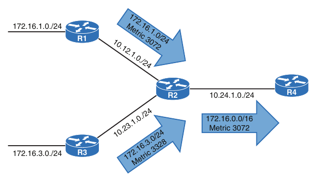

- Every time a matching component route for the summary route is added or removed, EIGRP must verify that the summary route is still using the attributes for the path with the lowest metric

- If it is not, a new summary route is advertised with updated EIGRP attributes, and downstream routes must run the DUAL again

- The summary route hides the smaller prefixes from downstream routers, but downstream routers are still burdened with processing updates to the summary route

- The fluctuation in the path metric is resolved by statically setting the metric on the summary route with the command:

```
conf t 
 router eigrp <as-nr>
  summary-metric <network> </prefix-len|subnet-mask> <bandwidth> <delay> <reliability> <load> <mtu> [distance <distance>]
```

- R2:

```
conf t
 router eigrp 100
  summary-metric 172.16.0.0 255.255.0.0 1000000 1 255 1 1500 distance 50
```

```
R2(config-router)#do sh ip route 172.16.0.0 255.255.0.0
Routing entry for 172.16.0.0/16
  Known via "eigrp 100", distance 50, metric 2816, type internal
  Redistributing via eigrp 100
  Routing Descriptor Blocks:
  * directly connected, via Null0
      Route metric is 2816, traffic share count is 1
      Total delay is 10 microseconds, minimum bandwidth is 1000000 Kbit
      Reliability 255/255, minimum MTU 1500 bytes
      Loading 1/255, Hops 0
```

- Using `distance` also sets the AD of the summary route

- Bandwidth is in kilobits per second (Kbps), delay is in 10-microsecond us units, reliability and load are values between 1 and 255, and the MTU is the maximum transmission unit (MTU) for an interface

- Set summary metric for EIGRP named mode:

```
conf t
 router eigrp EIGRP-NAMED
  address-family ipv4 autonomous-system 100
   topology base
    summary-metric 172.16.0.0 255.255.0.0 1000000 1 255 1 1500 distance 50
```

#### Automatic Summarization

- EIGRP supports automatic summarization, automatically summarizing network advertisements when they cross a classful network boundary

- Below is shown the automatic summarization for the 10.1.1.0 network on R2 and the 10.5.5.0/24 network on R4

- R2 and R4 only advertise the classful network 10.0.0.0/8 toward R3

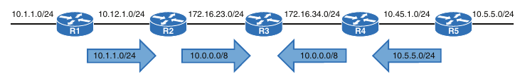

- Below is shown the routing table for R3

- Notice that there are no routes for the 10.1.1.0/24 or 10.5.5.0/24 networks; there is only a route for 10.0.0.0/8 with next hops of R2 and R4

- Traffic sent to either network could be sent to the wrong interface

- This problem affects network traffic traveling across the network in addition to traffic originating from R3

```
R3(config-router)#do sh ip ro | b Gate
Gateway of last resort is not set

D     10.0.0.0/8 [90/3072] via 172.16.34.4, 00:00:27, GigabitEthernet0/1
                 [90/3072] via 172.16.23.2, 00:00:27, GigabitEthernet0/0
      172.16.0.0/16 is variably subnetted, 4 subnets, 2 masks
C        172.16.23.0/24 is directly connected, GigabitEthernet0/0
L        172.16.23.3/32 is directly connected, GigabitEthernet0/0
C        172.16.34.0/24 is directly connected, GigabitEthernet0/1
L        172.16.34.3/32 is directly connected, GigabitEthernet0/1
```

- Below is displayed a similar behaviour for the 172.16.23.0/24 and 172.16.24.0/24 networks, as they are advertised as 172.16.0.0/16 networks from R1 and R2

```
R1(config-router)#do sh ip ro | b Gate
Gateway of last resort is not set

      10.0.0.0/8 is variably subnetted, 4 subnets, 2 masks
C        10.1.1.0/24 is directly connected, Loopback0
L        10.1.1.1/32 is directly connected, Loopback0
C        10.12.1.0/24 is directly connected, GigabitEthernet0/0
L        10.12.1.1/32 is directly connected, GigabitEthernet0/0
D     172.16.0.0/16 [90/3072] via 10.12.1.2, 00:02:51, GigabitEthernet0/0
```

```
R5(config-router)#do sh ip ro | b Gate
Gateway of last resort is not set

      10.0.0.0/8 is variably subnetted, 4 subnets, 2 masks
C        10.5.5.0/24 is directly connected, Loopback0
L        10.5.5.5/32 is directly connected, Loopback0
C        10.45.4.0/24 is directly connected, GigabitEthernet0/0
L        10.45.4.5/32 is directly connected, GigabitEthernet0/0
D     172.16.0.0/16 [90/3072] via 10.45.4.4, 00:03:18, GigabitEthernet0/0
```

- Current releases or IOS-XE disables EIGRP classful network automatic summarization by default

- You enable automatic summarization as follows:

- Classic mode:

```
conf t
 router eigrp 100
  auto-summary
```

- Named mode:

```
conf t
 router eigrp EIGRP-NAMED
  address-family ipv4 autonomous-system 100
   topology base
    auto-summary
```

- Disabling automatic summarization:

```
conf t
 router eigrp 100
  no auto-summary
```

```
conf t
 router eigrp EIGRP-NAMED
  address-family ipv4 autonomous-system 100
   topology base
    no auto-summary
```

## WAN considerations

- EIGRP does not change behavior based on the media type of an interface

- Serial and Ethernet interfaces are treated the same

- Some WAN topologies may require special consideration for bandwidth utilization, split horizon, or next-hop-self

### EIGRP Stub Router

- A proper network design provides redundancy where dictated by business requirements to ensure that a remote location always maintains network connectivity

- To overcome single points of failure, you can add additional routers at each site, add redundant circuits (possibly with different service providers), use different routing protocols, or use virtual private network (VPN) tunnels across the Internet for backup transport

- Below is shown a topology with R1 and R2 providing connectivity at two key data center locations

- R1 and R2 have three WAN circuits and a LAN interface

- The first circuit is a 10 Gbps dedicated point-to-point circuit (10.12.1.0/24), the second circuit is a T1 (1.5Mbps) serial link to R3, and the third circuit is an Internet connection that R1 and R2 use to maintain backup connectivity to each other through a backup VPN tunnel

- EIGRP is not enabled across the VPN tunnel, and traffic should be routed across the backup VPN tunnel using a simple static route for the 10.0.0.0/8 route if the 10Gbps circuit fails

- R1 advertises the 10.1.1.0/24 prefix directly to R2 and R3, and R2 advertises the 10.2.2.0/24 prefix to R1 and R3

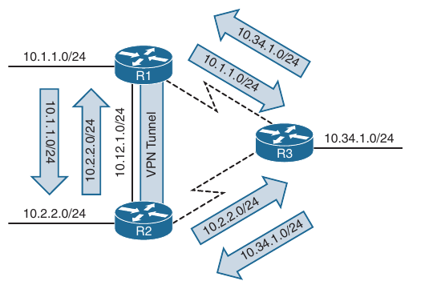

- For the 10.1.1.0/24 and 10.2.2.0/24 the networks are not shown in the following snippets as they are advertised over the 10Gbps link

- Proper network design considers traffic patterns during normal operations and throughout various failure scenarios to prevent suboptimal routing or routing loops

- Below is demonstrated the failure of the 10Gbps network link between R1 and R2

- This leaves R1 and R2 with the circuit to the Internet for the VPN tunnel and the T1 serial links to R3

- R3 continues to advertise the 10.1.1.0/24 prefix to R2 even though the design wants R1's traffic to take the VPN tunnel to reach R2

- This is because the 10.1.1.0/24 route learned via EIGRP is a longer match than the static route to 10.0.0.0/8 route via the VPN tunnel

- The scenario happens in the same fashion with 10.2.2.0/24 traffic transiting R3 instead of going across the VPN tunnel

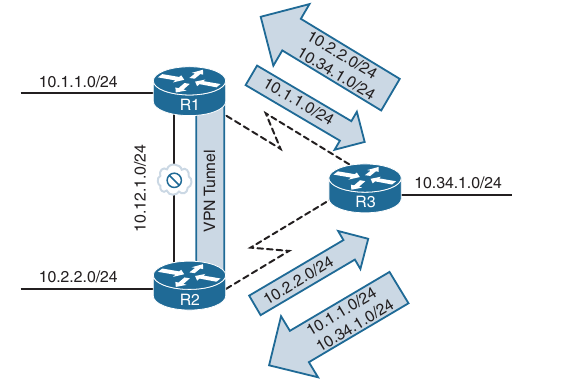

- The EIGRP stub functionality prevents scenarios like this from happening and allows an EIGRP router to conserve router resources

- An EIGRP stub router does not advertise routes that it learnes from other EIGRP peers

- By default, EIGRP stubs advertise only connected and summary routes, but they can be configured so that they only receives routes or advertise any combination of redistributed routes, connected routes, or summary routes

- In the figure below, R3 was been configured as stub router, and the 10Gbps link between R1 and R2 fails

- Traffic between R1 and R2 uses the backup VPN tunnel and does not traverse R3's T1 circuits because R3 is only advertising it's connected networks (10.34.1.0/24)

- The EIGRP stub router announces itself as a stub within the EIGRP hello packet

- Neighboring routers detect the stub field and update the EIGRP neighbor table to reflect the router's stub status

- If a route goes active, EIGRP does not send EIGRP queries to an EIGRP stub router 

- This provides faster convergence within an EIGRP autonomous system because it decreases the size of the query domain for that prefix

- Configuring an EIGRP stub router:

- Classic mode:

```
conf t
 router eigrp 65001
  eigrp stub [connected | receive-only | redistributed | static | summary]
```

- Named mode:

```
conf t
 router eigrp EIGRP-NAMED
  address-family ipv4 autonomous-system 65001
   eigrp stub [connected | receive-only | redistributed | static | summary]
```

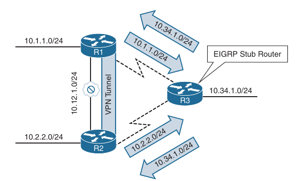

- R3:

```
conf t
 router eigrp 65001
  eigrp stub connected
```

- Config in named mode:

```
conf t
 router eigrp EIGRP-NAMED
  address-family ipv4 autonomous-system 65001
   eigrp stub connected
```

- The `receive-only` option cannot be combined with other EIGRP stub options as it does not advertise any networks to it's neighbors

- The network design should be given special consideration to ensure bidirectional connectivity for any networks connected to an EIGRP router with the `receive-only` stub option to ensure that routers know how to send return traffic

### Stub Site Functions

- A common problem with EIGRP stub routers is forgetting that they do not advertise EIGRP routes that they learn from another peer

- Below the branch topology is expanded with R4; R4 is attached to R3

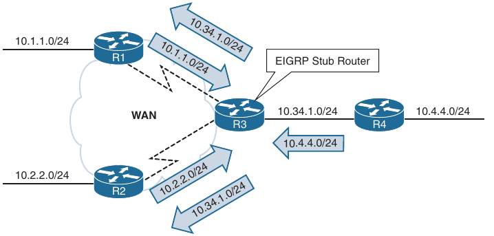

- Say that a junior network engineer recently learned about the EIGRP stub function and configured it on R3 to prevent transient routing and reduce the size of the query domain

- The users attached to R4's 10.4.4.0/24 network start to complain because they cannot access any resources attached to R1 and R2; however they can still communicate with devices attached to R3

- Below we can see the EIGRP learned routes on R1 and R4

- R1 is missing the 10.4.4.0/24 prefix, and R4 is missing the 10.1.1.0/24 prefix

- Both prefixes are missing because R3 is an EIGRP stub router

- R1:

```
R1#sh ip ro eigrp | b Gate
Gateway of last resort is not set

      10.0.0.0/8 is variably subnetted, 12 subnets, 3 masks
D        10.2.2.0/24 [90/156160] via 10.12.1.2, 01:06:20, Ethernet0/0
D        10.23.1.0/24 [90/2195456] via 10.12.1.2, 01:06:20, Ethernet0/0
D        10.34.1.0/24 [90/2195456] via 10.13.1.3, 01:06:20, Serial1/0
```

- R4:

```
R4(config-router)#do sh ip ro eigrp | b Gate
Gateway of last resort is not set

      10.0.0.0/8 is variably subnetted, 6 subnets, 2 masks
D        10.13.1.0/24 [90/2195456] via 10.34.1.3, 00:07:20, Ethernet0/0
D        10.23.1.0/24 [90/2195456] via 10.34.1.3, 00:07:20, Ethernet0/0
```

- The EIGRP stub site feature builds on EIGRP stub capabilities that allow a peer to advertise itself as a stub to peers only on the specified WAN interfaces but allow it to exchange routes learned on LAN interfaces

- EIGRP stub sites provides the following key benefits:

    - EIGRP neighbors on WAN links do not send EIGRP queries to the remote site when a route becomes active

    - The EIGRP stub site feature allows downstream routers to receive and advertise network prefixes across the WAN

    - The EIGRP stub site feature prevents the EIGRP *stub site route* from being a transit site

- The EIGRP stub site feature works by identifying the WAN interfaces and then setting an EIGRP stub site identifier

- Routes received from a peer on the WAN interface are tagged with an EIGRP stub site identifier attribute

- When EIGRP advertises network prefixes out a WAN-identified interface, it checks for an EIGRP stub site identifier

- If such an identifier is found, the route is not advertised; if an EIGRP stub site identifier is not found, the route is advertised

- Below the concept is illustrated further

- With R3 being configured as stub site router on the serial links configured as EIGRP WAN interfaces

- It shows this process:

    1. R1 advertises the 10.1.1.0/24 route to R3, and the 10.1.1.0/24 route is received on R3's WAN interface. R3 is then able to advertise that prefix to downstream router R4

    2. R2 advertises the 10.2.2.0/24 route to R3, and the 10.2.2.0/24 route is received on R3's other WAN interface. R3 is then able to advertise that prefix to the downstream neighbor R4

    3. R4 advertises the 10.4.4.0/24 route to R3. R3 checks the 10.4.4.0/24 route for the EIGRP stub site attribute before advertising that prefix out either WAN interface. R3 is able to advertise the prefix to R1 and R2 because it does not contain an EIGRP stub site identifier attribute

- Notice that R3 does not advertise the 10.1.1.0/24 prefix to R2 and that it does not advertise the 10.2.2.0/24 prefix to R1

- This is because the EIGRP stub site attribute was added upon receipt of the prefix and blocked during advertisement out other WAN interface

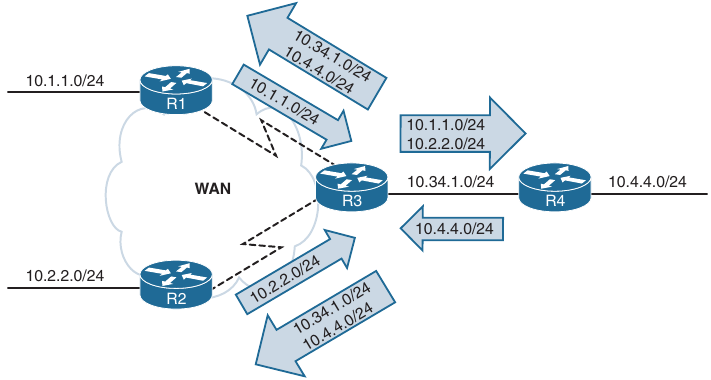

- The EIGRP stub site function is available only on EIGRP named mode configuration

- Transform EIGRP classic mode to EIGRP named mode configuration:

```
conf t
 router eigrp 65001
  eigrp upgrade-cli EIGRP-NAMED
```

- Show the config for EIGRP after conversion:

```
R3(config)#do sh run | s router eigrp 
router eigrp EIGRP-NAMED
 !
 address-family ipv4 unicast autonomous-system 65001
  !
  topology base
  exit-af-topology
  network 0.0.0.0
  eigrp stub connected
 exit-address-family
```

- The WAN interfaces are identified underneath the `af-interface <interface-id>` hierarchy and use the following command:

```
conf t
 router eigrp EIGRP-NAMED
  address-family ipv4 autonomous-system 65001
   af-interface s0/1
    stub-site wan interface
```

- The stub site function and identifier are enabled with the command `eigrp stub-site <as-number>:<identifier>` in address-family configuration mode

```
conf t
 router eigrp EIGRP-NAMED
  address-family ipv4 autonomous-system 65001
   stub site <as-number>:<identifier>
```

- The `<as-number>:<identifier>` must remain the same for all devices in a site

- Upon asociating an interface to the EIGRP stub site, the router resets the EIGRP neighbor for that interface

- Below is the EIGRP stub site configuration for R3 for both serial interfaces

```
conf t
 router eigrp EIGRP-NAMED
  address-family ipv4 autonomous-system 65001
   eigrp stub-site 65001:1
   af-interface s1/0
    stub-site wan-interface
   af-interface s1/1
    stub-site wan-interface
```

- R3 - running-config after the configuration:

```
R3(config-router-af)#do sh run | s router eigrp
router eigrp EIGRP-NAMED
 !
 address-family ipv4 unicast autonomous-system 65001
  !
  af-interface Serial1/0
   stub-site wan-interface
  exit-af-interface
  !
  af-interface Serial1/1
   stub-site wan-interface
  exit-af-interface
  !
  topology base
  exit-af-topology
  network 0.0.0.0
  eigrp stub-site 65001:1
 exit-address-family
```

- Verifying that the 10.1.1.0/24 route learned from R3's serial interface is tagged with the EIGRP stub site attribute:

```
R4#sh ip eigrp topology 10.1.1.0/24
EIGRP-IPv4 VR(EIGRP-NAMED) Topology Entry for AS(65001)/ID(10.4.4.1) for 10.1.1.0/24
  State is Passive, Query origin flag is 1, 1 Successor(s), FD is 1800793878, RIB is 14068702
  Descriptor Blocks:
  10.34.1.3 (Ethernet0/0), from 10.34.1.3, Send flag is 0x0
      Composite metric is (1800793878/1735257878), route is Internal
      Vector metric:
        Minimum bandwidth is 1544 Kbit
        Total delay is 21001250000 picoseconds
        Reliability is 255/255
        Load is 1/255
        Minimum MTU is 1500
        Hop count is 2
        Originating router is 10.1.1.1
      Extended Community: StubSite:65001:1
```

- A major benefit of the EIGRP stub site feature is that the stub functionality can be passed to a branch site that has multiple edge routers

- As long as each router is configured with the EIGRP stub site feature and maintains the same stub site identifier, the site does not become a transit routing site; however it still allows for all the routes to be easily advertised to other routers in the EIGRP autonomous system

- Below is shown how to verify that R1 recognizes R3 as an EIGRP stub router and does not send any queries when a route becomes active

```
R1#show ip eigrp neighbors detail s1/0 
EIGRP-IPv4 VR(EIGRP-NAMED) Address-Family Neighbors for AS(65001)
H   Address                 Interface              Hold Uptime   SRTT   RTO  Q  Seq
                                                   (sec)         (ms)       Cnt Num
1   10.13.1.3               Se1/0                    13 00:08:29   18   108  0  11
   Version 28.0/2.0, Retrans: 0, Retries: 0, Prefixes: 3
   Topology-ids from peer - 0 
   Topologies advertised to peer:   base

   Stub Peer Advertising (CONNECTED STATIC SUMMARY REDISTRIBUTED ) Routes
   Suppressing queries ! here we can see that it suppresses queries
Max Nbrs: 0, Current Nbrs: 0
```

- Although not required, configuring the EIGRP stub site feature on all branch routers keeps the configuration consistent and makes possible additional nondisruptive deployment of routers at that site in the future

- The same <as-number>:<identifier> could be used for all of the site's WAN interfaces because those networks would never be advertised to other EIGRP stub sites, with the exception of tunnels or backdoor network links, which helps prevent suboptimal routing

### IP Bandwidth Percentage

- Routing Information Protocol (RIP) and other routing protocols can consume all the bandwidth on slow circuits

- Although the routers may have accurate routing tables, a router is worthless if no bandwidth is available for sending data packets

- EIGRP overcomes this deficiency by setting the maximum available bandwidth for all circuits to 50%

- This allows EIGRP to use 50% of the bandwidth and reserves 50% of the bandwidth for data packets

- The interface parameter command `ip bandwidth percent eigrp <as-number> <percent>` changes the EIGRP available percent for a link on EIGRP classic configuration:

```
conf t
 interface <type/nr>
  ip bandwidth-percent eigrp 65002 30
```

- The available bandwidth for EIGRP is modified under the `af-interface default` or `af-interface <interface-id>` submode with the command `bandwidth-percent <percentage>` for EIGRP named configuration:

```
conf t
 router eigrp EIGRP-NAMED
  address-family ipv4 autonomous-system 65001
   af-interface e0/0
    bandwidth-percent 30
```

- You can see the EIGRP bandwidth settings by looking at the EIGRP interfaces with the `detail` option

```
R4(config-router-af-interface)#do sh ip eigrp int det e0/0  
EIGRP-IPv4 VR(EIGRP-NAMED) Address-Family Interfaces for AS(65001)
                              Xmit Queue   PeerQ        Mean   Pacing Time   Multicast    Pending
Interface              Peers  Un/Reliable  Un/Reliable  SRTT   Un/Reliable   Flow Timer   Routes
Et0/0                    1        0/0       0/0           2       0/5           50           0
  Hello-interval is 5, Hold-time is 15
  Split-horizon is enabled
  Next xmit serial <none>
  Packetized sent/expedited: 2/1
  Hello's sent/expedited: 677/2
  Un/reliable mcasts: 0/2  Un/reliable ucasts: 3/3
  Mcast exceptions: 0  CR packets: 0  ACKs suppressed: 0
  Retransmissions sent: 2  Out-of-sequence rcvd: 0
  Topology-ids on interface - 0 
  Interface BW percentage is 30 ! this is the bw percent
  Authentication mode is not set
  Topologies advertised on this interface:  base
  Topologies not advertised on this interface:

```

### Split Horizon

- The first routing protocols advertised network prefixes out all interfaces for all known routes

- Below is demonstrated this behaviour with three routers processing the advertisements

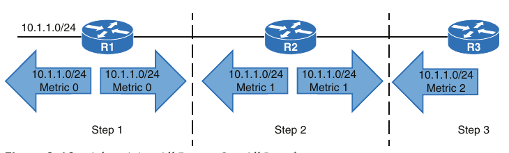

1. R1 advertises the 10.1.1.0/24 network out all of it's interfaces

2. R2 adds to the metric and re-advertises the network to R1 and R3. A route (in this case 10.1.1.0/24) advertised back to the originating router (R1) is known as a `reverse route`. Reverse routes wastes network resources. In this case R1 discards the route from R2 because 10.1.1.0/24 is the connected network and has a higher AD

3. R3 adds to the metric and advertises the reverse route to R2. R2 discards the route from R3 because it has a higher metric than the route from R1

- Below is demonstrated a link failure between R1 and R2

- R2 removes the 10.1.1.0/24 route learned from R1

- It is possible that before R2 announces that 10.1.1.0/24 network is unreachable, R3 advertises the 10.1.1.0/24 route with a metric of 2 out all interfaces

- R2 installs the route advertised by R3, which has the next-hop IP address 10.23.1.3. R3 still maintains the original route advertised from R2 with the next-hop IP address 10.23.1.2

- This causes a routing loop if a packet is sent from R2 or R3 to the 10.1.1.0/24 network. Eventually the route entries time out and end the routing loop

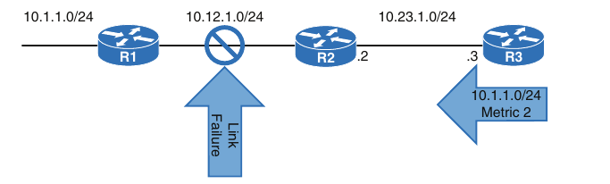

- *Split horizon* prevents the advertisement of reverse routes and prevents scenarios like the one just described from happening

- Below is shown the same scenario but with split horizon enabled

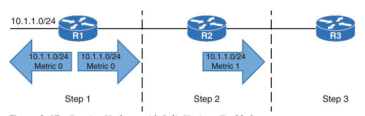

- The following steps occur as R1 advertises the 10.1.1.0/24 prefix with split horizon enabled:

    1. R1 advertises the 10.1.1.0/24 network out all of it's interfaces

    2. R2 adds to the metric and re-advertises the network to R3 but does not advertise the network back to R1 because of split horizon

    3. R3 receives the route from R2 but does not advertise the network back to R2 because of split horizon

- EIGRP enables split horizon on all interfaces by default

- When an interface connects to a multi-access medium that does not support full-mesh connectivity for all nodes, split horizon needs to be disabled

- This scenario is commonly found with hub-and-spoke topologies such as frame relay, Dynamic Multipoint Virtual Private Network (DMVPN), or Layer 2 Virtual Private Network (L2VPN)

- Below is shown an hub-and-spoke topology where R1 is the hub, and R2 and R3 are spoke routers that can only communicate with the hub router

- R1 uses the same interface for establishing the DMVPN tunnel, and split horizon prevents routes received from one spoke (R2) from being advertised to other spoke (R3)

- Notice that EIGRP routing table is not complete for all the routers

- R2 has only a remote route for R1's 10.1.1.0/24 network , and R3 only has a remote route for R1's 10.1.1.0/24 network

- Split horizon on R1 prevents routes received from one spoke from being advertised to the other spoke

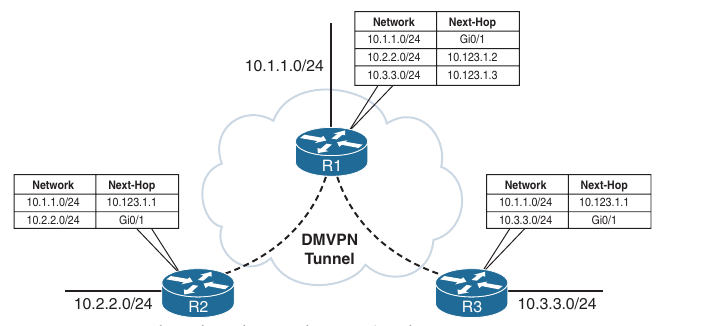

- Disabling EIGRP split horizon on a specific interface as follows in classic mode:

```
conf t
 interface tunnel 100
  no ip split-horizon eigrp <as-number>
```

- Disabling EIGRP split horizon on a specific interface as follows in named mode (`af-interface default` or `af-interface <interface-id>`)

```
conf t
 router eigrp EIGRP-NAMED
  address-family ipv4 autonomous-system 100
   af-interface tunnel 100
    no split-horizon
```

- Below is shown the the routing table of each router after split horizon is disabled on R1

- Notice that all routers have complete EIGRP routes

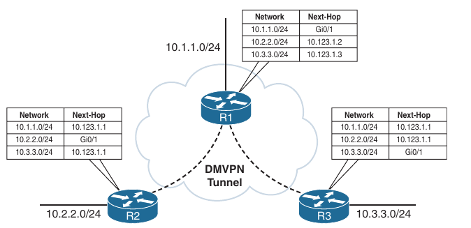

### Trigger an EIGRP SIA state for a prefix:

- Topology:

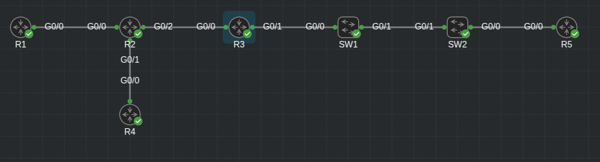

R1 - L0 - 10.1.1.0/24

- On R5 - increase the hold time for the g0/0 interface so that the neighbor does not age out to quickly

```
R5#sh run int g0/0
Building configuration...

Current configuration : 144 bytes
!
interface GigabitEthernet0/0
 ip address 10.35.1.5 255.255.255.0
 ip hold-time eigrp 100 10000
 duplex auto
 speed auto
 media-type rj45
end
```

- On R3 - g0/1 interface apply an ACL with `deny ip any any` in inbound direction

```
R3(config-if)#do sh access-lists
Extended IP access list 101
    10 deny ip any any (613 matches)
```

- On R1, shut down the l0 interface

```
conf t
 int l0
  shutdown
```

- Viewing the eigrp toplogy for active route on R3:

```
R3#show ip eigrp topology active 
EIGRP-IPv4 Topology Table for AS(100)/ID(10.35.1.3)
Codes: P - Passive, A - Active, U - Update, Q - Query, R - Reply,
       r - reply Status, s - sia Status 

A 10.1.1.0/24, 1 successors, FD is Infinity, Qqr
    1 replies, active 00:02:39, query-origin: Successor Origin, retries(1) 
        via 10.23.1.2 (Infinity/Infinity), GigabitEthernet0/0, serno 25
        via 10.35.1.5 (Infinity/Infinity), rs, q, GigabitEthernet0/1, serno 24, anchored

```

- Waiting 180 seconds - the neighor is declared stuck in active and deleted/cleaned

```
R3#show ip eigrp topology active 
EIGRP-IPv4 Topology Table for AS(100)/ID(10.35.1.3)
Codes: P - Passive, A - Active, U - Update, Q - Query, R - Reply,
       r - reply Status, s - sia Status 

A 10.1.1.0/24, 1 successors, FD is Infinity, Qqr
    1 replies, active 00:02:39, query-origin: Successor Origin, retries(1) 
        via 10.23.1.2 (Infinity/Infinity), GigabitEthernet0/0, serno 25
        via 10.35.1.5 (Infinity/Infinity), rs, q, GigabitEthernet0/1, serno 24, anchored

R3#
*May 16 20:30:56.051: %DUAL-3-SIA: Route 10.1.1.0/24 stuck-in-active state in base 100.  Cleaning up
R3#
*May 16 20:30:56.051: %DUAL-5-NBRCHANGE: EIGRP-IPv4 100: Neighbor 10.35.1.5 (GigabitEthernet0/1) is down: stuck in active
R3#
```

- Logs:

```
R3#
*May 16 20:28:27.229: EIGRP: Sending HELLO on Gi0/0 - paklen 20
*May 16 20:28:27.229:   AS 100, Flags 0x0:(NULL), Seq 0/0 interfaceQ 0/0 iidbQ un/rely 0/0
*May 16 20:28:28.161: EIGRP: Sending HELLO on Gi0/1 - paklen 20
*May 16 20:28:28.161:   AS 100, Flags 0x0:(NULL), Seq 0/0 interfaceQ 0/0 iidbQ un/rely 0/0
R3#
*May 16 20:28:28.383: EIGRP: Received HELLO on Gi0/0 - paklen 20 nbr 10.23.1.2
*May 16 20:28:28.383:   AS 100, Flags 0x0:(NULL), Seq 0/0 interfaceQ 0/0 iidbQ un/rely 0/0 peerQ un/rely 0/0
*May 16 20:28:29.321: EIGRP: Sending QUERY on Gi0/1 - paklen 44 nbr 10.35.1.5, retry 7, RTO 5000 tid 0
*May 16 20:28:29.321:   AS 100, Flags 0x0:(NULL), Seq 34/39 interfaceQ 0/0 iidbQ un/rely 0/0 peerQ un/rely 0/1 serno 23-23
R3#
*May 16 20:28:31.976: EIGRP: Sending HELLO on Gi0/0 - paklen 20
*May 16 20:28:31.976:   AS 100, Flags 0x0:(NULL), Seq 0/0 interfaceQ 0/0 iidbQ un/rely 0/0
*May 16 20:28:32.582: EIGRP: Sending HELLO on Gi0/1 - paklen 20
*May 16 20:28:32.582:   AS 100, Flags 0x0:(NULL), Seq 0/0 interfaceQ 0/0 iidbQ un/rely 0/0
R3#
*May 16 20:28:33.347: EIGRP: Received HELLO on Gi0/0 - paklen 20 nbr 10.23.1.2
*May 16 20:28:33.347:   AS 100, Flags 0x0:(NULL), Seq 0/0 interfaceQ 0/0 iidbQ un/rely 0/0 peerQ un/rely 0/0
*May 16 20:28:34.321: EIGRP: Sending QUERY on Gi0/1 - paklen 44 nbr 10.35.1.5, retry 8, RTO 5000 tid 0
*May 16 20:28:34.321:   AS 100, Flags 0x0:(NULL), Seq 34/39 interfaceQ 0/0 iidbQ un/rely 0/0 peerQ un/rely 0/1 serno 23-23
R3#
*May 16 20:28:36.652: EIGRP: Sending HELLO on Gi0/0 - paklen 20
*May 16 20:28:36.652:   AS 100, Flags 0x0:(NULL), Seq 0/0 interfaceQ 0/0 iidbQ un/rely 0/0
*May 16 20:28:37.568: EIGRP: Sending HELLO on Gi0/1 - paklen 20
*May 16 20:28:37.568:   AS 100, Flags 0x0:(NULL), Seq 0/0 interfaceQ 0/0 iidbQ un/rely 0/0
R3#
*May 16 20:28:37.734: EIGRP: Received HELLO on Gi0/0 - paklen 20 nbr 10.23.1.2
*May 16 20:28:37.734:   AS 100, Flags 0x0:(NULL), Seq 0/0 interfaceQ 0/0 iidbQ un/rely 0/0 peerQ un/rely 0/0
R3#
*May 16 20:28:39.321: EIGRP: Sending QUERY on Gi0/1 - paklen 44 nbr 10.35.1.5, retry 9, RTO 5000 tid 0
*May 16 20:28:39.321:   AS 100, Flags 0x0:(NULL), Seq 34/39 interfaceQ 0/0 iidbQ un/rely 0/0 peerQ un/rely 0/1 serno 23-23
R3#
*May 16 20:28:41.037: EIGRP: Sending HELLO on Gi0/0 - paklen 20
*May 16 20:28:41.037:   AS 100, Flags 0x0:(NULL), Seq 0/0 interfaceQ 0/0 iidbQ un/rely 0/0
R3#
*May 16 20:28:42.241: EIGRP: Received HELLO on Gi0/0 - paklen 20 nbr 10.23.1.2
*May 16 20:28:42.241:   AS 100, Flags 0x0:(NULL), Seq 0/0 interfaceQ 0/0 iidbQ un/rely 0/0 peerQ un/rely 0/0
*May 16 20:28:42.421: EIGRP: Sending HELLO on Gi0/1 - paklen 20
*May 16 20:28:42.421:   AS 100, Flags 0x0:(NULL), Seq 0/0 interfaceQ 0/0 iidbQ un/rely 0/0
R3#
*May 16 20:28:44.321: EIGRP: Sending QUERY on Gi0/1 - paklen 44 nbr 10.35.1.5, retry 10, RTO 5000 tid 0
*May 16 20:28:44.321:   AS 100, Flags 0x0:(NULL), Seq 34/39 interfaceQ 0/0 iidbQ un/rely 0/0 peerQ un/rely 0/1 serno 23-23
R3#
*May 16 20:28:45.605: EIGRP: Sending HELLO on Gi0/0 - paklen 20
*May 16 20:28:45.605:   AS 100, Flags 0x0:(NULL), Seq 0/0 interfaceQ 0/0 iidbQ un/rely 0/0
R3#
*May 16 20:28:46.724: EIGRP: Received HELLO on Gi0/0 - paklen 20 nbr 10.23.1.2
*May 16 20:28:46.724:   AS 100, Flags 0x0:(NULL), Seq 0/0 interfaceQ 0/0 iidbQ un/rely 0/0 peerQ un/rely 0/0
*May 16 20:28:47.074: EIGRP: Sending HELLO on Gi0/1 - paklen 20
*May 16 20:28:47.074:   AS 100, Flags 0x0:(NULL), Seq 0/0 interfaceQ 0/0 iidbQ un/rely 0/0
R3#
*May 16 20:28:49.321: EIGRP: Sending QUERY on Gi0/1 - paklen 44 nbr 10.35.1.5, retry 11, RTO 5000 tid 0
*May 16 20:28:49.321:   AS 100, Flags 0x0:(NULL), Seq 34/39 interfaceQ 0/0 iidbQ un/rely 0/0 peerQ un/rely 0/1 serno 23-23
*May 16 20:28:50.286: EIGRP: Sending HELLO on Gi0/0 - paklen 20
*May 16 20:28:50.286:   AS 100, Flags 0x0:(NULL), Seq 0/0 interfaceQ 0/0 iidbQ un/rely 0/0
R3#
*May 16 20:28:51.075: EIGRP: Received HELLO on Gi0/0 - paklen 20 nbr 10.23.1.2
*May 16 20:28:51.075:   AS 100, Flags 0x0:(NULL), Seq 0/0 interfaceQ 0/0 iidbQ un/rely 0/0 peerQ un/rely 0/0
*May 16 20:28:51.359: EIGRP: Sending HELLO on Gi0/1 - paklen 20
*May 16 20:28:51.359:   AS 100, Flags 0x0:(NULL), Seq 0/0 interfaceQ 0/0 iidbQ un/rely 0/0
R3#
*May 16 20:28:54.321: EIGRP: Sending QUERY on Gi0/1 - paklen 44 nbr 10.35.1.5, retry 12, RTO 5000 tid 0
*May 16 20:28:54.321:   AS 100, Flags 0x0:(NULL), Seq 34/39 interfaceQ 0/0 iidbQ un/rely 0/0 peerQ un/rely 0/1 serno 23-23
*May 16 20:28:54.778: EIGRP: Sending HELLO on Gi0/0 - paklen 20
*May 16 20:28:54.778:   AS 100, Flags 0x0:(NULL), Seq 0/0 interfaceQ 0/0 iidbQ un/rely 0/0
R3#
*May 16 20:28:55.424: EIGRP: Received HELLO on Gi0/0 - paklen 20 nbr 10.23.1.2
*May 16 20:28:55.424:   AS 100, Flags 0x0:(NULL), Seq 0/0 interfaceQ 0/0 iidbQ un/rely 0/0 peerQ un/rely 0/0
*May 16 20:28:56.004: EIGRP: Sending HELLO on Gi0/1 - paklen 20
*May 16 20:28:56.004:   AS 100, Flags 0x0:(NULL), Seq 0/0 interfaceQ 0/0 iidbQ un/rely 0/0
R3#
*May 16 20:28:59.172: EIGRP: Sending HELLO on Gi0/0 - paklen 20
*May 16 20:28:59.172:   AS 100, Flags 0x0:(NULL), Seq 0/0 interfaceQ 0/0 iidbQ un/rely 0/0
*May 16 20:28:59.321: EIGRP: Sending QUERY on Gi0/1 - paklen 44 nbr 10.35.1.5, retry 13, RTO 5000 tid 0
*May 16 20:28:59.321:   AS 100, Flags 0x0:(NULL), Seq 34/39 interfaceQ 0/0 iidbQ un/rely 0/0 peerQ un/rely 0/1 serno 23-23
R3#
*May 16 20:29:00.301: EIGRP: Received HELLO on Gi0/0 - paklen 20 nbr 10.23.1.2
*May 16 20:29:00.301:   AS 100, Flags 0x0:(NULL), Seq 0/0 interfaceQ 0/0 iidbQ un/rely 0/0 peerQ un/rely 0/0
*May 16 20:29:00.365: EIGRP: Sending HELLO on Gi0/1 - paklen 20
*May 16 20:29:00.365:   AS 100, Flags 0x0:(NULL), Seq 0/0 interfaceQ 0/0 iidbQ un/rely 0/0
R3#
*May 16 20:29:04.025: EIGRP: Sending HELLO on Gi0/0 - paklen 20
*May 16 20:29:04.025:   AS 100, Flags 0x0:(NULL), Seq 0/0 interfaceQ 0/0 iidbQ un/rely 0/0
*May 16 20:29:04.321: EIGRP: Sending QUERY on Gi0/1 - paklen 44 nbr 10.35.1.5, retry 14, RTO 5000 tid 0
*May 16 20:29:04.321:   AS 100, Flags 0x0:(NULL), Seq 34/39 interfaceQ 0/0 iidbQ un/rely 0/0 peerQ un/rely 0/1 serno 23-23
*May 16 20:29:04.833: EIGRP: Received HELLO on Gi0/0 - paklen 20 nbr 10.23.1.2
*May 16 20:29:04.833:   AS 100, Flags 0x0:(NULL), Seq 0/0 interfaceQ 0/0 iidbQ un/rely 0/0 peerQ un/rely 0/0
R3#
*May 16 20:29:05.055: EIGRP: Sending HELLO on Gi0/1 - paklen 20
*May 16 20:29:05.055:   AS 100, Flags 0x0:(NULL), Seq 0/0 interfaceQ 0/0 iidbQ un/rely 0/0
R3#
*May 16 20:29:08.589: EIGRP: Sending HELLO on Gi0/0 - paklen 20
*May 16 20:29:08.589:   AS 100, Flags 0x0:(NULL), Seq 0/0 interfaceQ 0/0 iidbQ un/rely 0/0
*May 16 20:29:09.321: EIGRP: Sending QUERY on Gi0/1 - paklen 44 nbr 10.35.1.5, retry 15, RTO 5000 tid 0
*May 16 20:29:09.321:   AS 100, Flags 0x0:(NULL), Seq 34/39 interfaceQ 0/0 iidbQ un/rely 0/0 peerQ un/rely 0/1 serno 23-23
*May 16 20:29:09.330: EIGRP: Sending HELLO on Gi0/1 - paklen 20
*May 16 20:29:09.330:   AS 100, Flags 0x0:(NULL), Seq 0/0 interfaceQ 0/0 iidbQ un/rely 0/0
*May 16 20:29:09.457: EIGRP: Received HELLO on Gi0/0 - paklen 20 nbr 10.23.1.2
R3#
*May 16 20:29:09.457:   AS 100, Flags 0x0:(NULL), Seq 0/0 interfaceQ 0/0 iidbQ un/rely 0/0 peerQ un/rely 0/0
R3#
*May 16 20:29:13.147: EIGRP: Sending HELLO on Gi0/0 - paklen 20
*May 16 20:29:13.147:   AS 100, Flags 0x0:(NULL), Seq 0/0 interfaceQ 0/0 iidbQ un/rely 0/0
R3#
*May 16 20:29:14.315: EIGRP: Sending HELLO on Gi0/1 - paklen 20
*May 16 20:29:14.315:   AS 100, Flags 0x0:(NULL), Seq 0/0 interfaceQ 0/0 iidbQ un/rely 0/0
*May 16 20:29:14.321: EIGRP: Sending QUERY on Gi0/1 - paklen 44 nbr 10.35.1.5, retry 16, RTO 5000 tid 0
*May 16 20:29:14.321:   AS 100, Flags 0x0:(NULL), Seq 34/39 interfaceQ 0/0 iidbQ un/rely 0/0 peerQ un/rely 0/1 serno 23-23
*May 16 20:29:14.451: EIGRP: Received HELLO on Gi0/0 - paklen 20 nbr 10.23.1.2
*May 16 20:29:14.451:   AS 100, Flags 0x0:(NULL), Seq 0/0 interfaceQ 0/0 iidbQ un/rely 0/0 peerQ un/rely 0/0
R3#
*May 16 20:29:17.598: EIGRP: Sending HELLO on Gi0/0 - paklen 20
*May 16 20:29:17.598:   AS 100, Flags 0x0:(NULL), Seq 0/0 interfaceQ 0/0 iidbQ un/rely 0/0
*May 16 20:29:18.581: EIGRP: Sending HELLO on Gi0/1 - paklen 20
*May 16 20:29:18.581:   AS 100, Flags 0x0:(NULL), Seq 0/0 interfaceQ 0/0 iidbQ un/rely 0/0
R3#
*May 16 20:29:19.276: EIGRP: Received HELLO on Gi0/0 - paklen 20 nbr 10.23.1.2
*May 16 20:29:19.276:   AS 100, Flags 0x0:(NULL), Seq 0/0 interfaceQ 0/0 iidbQ un/rely 0/0 peerQ un/rely 0/0
*May 16 20:29:19.321: EIGRP: Sending QUERY on Gi0/1 - paklen 44 nbr 10.35.1.5, retry 17, RTO 5000 tid 0
*May 16 20:29:19.321:   AS 100, Flags 0x0:(NULL), Seq 34/39 interfaceQ 0/0 iidbQ un/rely 0/0 peerQ un/rely 0/1 serno 23-23
R3#
*May 16 20:29:22.252: EIGRP: Sending HELLO on Gi0/0 - paklen 20
*May 16 20:29:22.252:   AS 100, Flags 0x0:(NULL), Seq 0/0 interfaceQ 0/0 iidbQ un/rely 0/0
R3#
*May 16 20:29:23.445: EIGRP: Sending HELLO on Gi0/1 - paklen 20
*May 16 20:29:23.445:   AS 100, Flags 0x0:(NULL), Seq 0/0 interfaceQ 0/0 iidbQ un/rely 0/0
*May 16 20:29:23.540: EIGRP: Received HELLO on Gi0/0 - paklen 20 nbr 10.23.1.2
*May 16 20:29:23.540:   AS 100, Flags 0x0:(NULL), Seq 0/0 interfaceQ 0/0 iidbQ un/rely 0/0 peerQ un/rely 0/0
*May 16 20:29:24.321: EIGRP: Sending QUERY on Gi0/1 - paklen 44 nbr 10.35.1.5, retry 18, RTO 5000 tid 0
*May 16 20:29:24.321:   AS 100, Flags 0x0:(NULL), Seq 34/39 interfaceQ 0/0 iidbQ un/rely 0/0 peerQ un/rely 0/1 serno 23-23
R3#
*May 16 20:29:25.761: EIGRP: Enqueueing SIAQUERY on Gi0/1 - paklen 0 nbr 10.35.1.5 tid 0 iidbQ un/rely 0/1 peerQ un/rely 0/1 serno 24-24
*May 16 20:29:25.762: EIGRP: Requeued unicast on GigabitEthernet0/1
*May 16 20:29:26.534: EIGRP: Received SIAQUERY on Gi0/0 - paklen 44 nbr 10.23.1.2
*May 16 20:29:26.534:   AS 100, Flags 0x0:(NULL), Seq 36/32 interfaceQ 0/0 iidbQ un/rely 0/0 peerQ un/rely 0/0
*May 16 20:29:26.534: EIGRP: Enqueueing ACK on Gi0/0 - paklen 0 nbr 10.23.1.2 tid 0
*May 16 20:29:26.534:   Ack seq 36 iidbQ un/rely 0/0 peerQ un/rely 1/0
*May 16 20:29:26.535: EIGRP: Sending ACK on Gi0/0 - paklen 0 nbr 10.23.1.2 tid 0
*May 16 20:29:26.535:   AS 100, Flags 0x0:(NULL), Seq 0/36 interfaceQ 0/0 iidbQ un/rely 0/0 peerQ un/rely 1/0
*May 16 20:29:26.544: EIGRP: Enqueueing SIAREPLY on Gi0/0 - paklen 0 nbr 10.23.1.2 tid 0 iidbQ un/rely 0/1 peerQ un/rely 0/0 serno 25-25
*May 16 20:29:26.545: EIGRP: Requeued unicast on GigabitEthernet0/0
*May 16 20:29:26.546: EIGRP: Sending SIAREPLY on Gi0/0 - paklen 44 nbr 10.23.1.2 tid 0
*May 16 20:29:26.546:   AS 100, Flags 0x0:(NULL), Seq 36/36 interfaceQ 0/0 iidbQ un/rely 0/0 peerQ un/rely 0/1 serno 25-25
*May 16 20:29:26.547: EIGRP: Received ACK on Gi0/0 - paklen 0 nbr 10.23.1.2
*May 16 20:29:26.547:   AS 100, Flags 0x0:(NULL), Seq 0/36 interfaceQ 0/0
R3# iidbQ un/rely 0/0 peerQ un/rely 0/1
*May 16 20:29:26.850: EIGRP: Sending HELLO on Gi0/0 - paklen 20
*May 16 20:29:26.850:   AS 100, Flags 0x0:(NULL), Seq 0/0 interfaceQ 0/0 iidbQ un/rely 0/0
R3#
*May 16 20:29:28.007: EIGRP: Received HELLO on Gi0/0 - paklen 20 nbr 10.23.1.2
*May 16 20:29:28.007:   AS 100, Flags 0x0:(NULL), Seq 0/0 interfaceQ 0/0 iidbQ un/rely 0/0 peerQ un/rely 0/0
*May 16 20:29:28.162: EIGRP: Sending HELLO on Gi0/1 - paklen 20
*May 16 20:29:28.162:   AS 100, Flags 0x0:(NULL), Seq 0/0 interfaceQ 0/0 iidbQ un/rely 0/0
R3#
*May 16 20:29:29.321: EIGRP: Sending QUERY on Gi0/1 - paklen 44 nbr 10.35.1.5, retry 19, RTO 5000 tid 0
*May 16 20:29:29.321:   AS 100, Flags 0x0:(NULL), Seq 34/39 interfaceQ 0/0 iidbQ un/rely 0/0 peerQ un/rely 0/2 serno 23-23
R3#
*May 16 20:29:31.349: EIGRP: Sending HELLO on Gi0/0 - paklen 20
*May 16 20:29:31.349:   AS 100, Flags 0x0:(NULL), Seq 0/0 interfaceQ 0/0 iidbQ un/rely 0/0
R3#
*May 16 20:29:32.573: EIGRP: Sending HELLO on Gi0/1 - paklen 20
*May 16 20:29:32.573:   AS 100, Flags 0x0:(NULL), Seq 0/0 interfaceQ 0/0 iidbQ un/rely 0/0
*May 16 20:29:32.763: EIGRP: Received HELLO on Gi0/0 - paklen 20 nbr 10.23.1.2
*May 16 20:29:32.763:   AS 100, Flags 0x0:(NULL), Seq 0/0 interfaceQ 0/0 iidbQ un/rely 0/0 peerQ un/rely 0/0
R3#
*May 16 20:29:34.321: EIGRP: Sending QUERY on Gi0/1 - paklen 44 nbr 10.35.1.5, retry 20, RTO 5000 tid 0
*May 16 20:29:34.321:   AS 100, Flags 0x0:(NULL), Seq 34/39 interfaceQ 0/0 iidbQ un/rely 0/0 peerQ un/rely 0/2 serno 23-23
R3#
*May 16 20:29:36.229: EIGRP: Sending HELLO on Gi0/0 - paklen 20
*May 16 20:29:36.229:   AS 100, Flags 0x0:(NULL), Seq 0/0 interfaceQ 0/0 iidbQ un/rely 0/0
*May 16 20:29:37.174: EIGRP: Received HELLO on Gi0/0 - paklen 20 nbr 10.23.1.2
*May 16 20:29:37.174:   AS 100, Flags 0x0:(NULL), Seq 0/0 interfaceQ 0/0 iidbQ un/rely 0/0 peerQ un/rely 0/0
R3#
*May 16 20:29:37.392: EIGRP: Sending HELLO on Gi0/1 - paklen 20
*May 16 20:29:37.392:   AS 100, Flags 0x0:(NULL), Seq 0/0 interfaceQ 0/0 iidbQ un/rely 0/0
R3#
*May 16 20:29:39.321: EIGRP: Sending QUERY on Gi0/1 - paklen 44 nbr 10.35.1.5, retry 21, RTO 5000 tid 0
*May 16 20:29:39.321:   AS 100, Flags 0x0:(NULL), Seq 34/39 interfaceQ 0/0 iidbQ un/rely 0/0 peerQ un/rely 0/2 serno 23-23
R3#
*May 16 20:29:40.669: EIGRP: Sending HELLO on Gi0/0 - paklen 20
*May 16 20:29:40.669:   AS 100, Flags 0x0:(NULL), Seq 0/0 interfaceQ 0/0 iidbQ un/rely 0/0
R3#
*May 16 20:29:41.919: EIGRP: Received HELLO on Gi0/0 - paklen 20 nbr 10.23.1.2
*May 16 20:29:41.919:   AS 100, Flags 0x0:(NULL), Seq 0/0 interfaceQ 0/0 iidbQ un/rely 0/0 peerQ un/rely 0/0
*May 16 20:29:41.955: EIGRP: Sending HELLO on Gi0/1 - paklen 20
*May 16 20:29:41.955:   AS 100, Flags 0x0:(NULL), Seq 0/0 interfaceQ 0/0 iidbQ un/rely 0/0
R3#
*May 16 20:29:44.321: EIGRP: Sending QUERY on Gi0/1 - paklen 44 nbr 10.35.1.5, retry 22, RTO 5000 tid 0
*May 16 20:29:44.321:   AS 100, Flags 0x0:(NULL), Seq 34/39 interfaceQ 0/0 iidbQ un/rely 0/0 peerQ un/rely 0/2 serno 23-23
R3#
*May 16 20:29:45.623: EIGRP: Sending HELLO on Gi0/0 - paklen 20
*May 16 20:29:45.623:   AS 100, Flags 0x0:(NULL), Seq 0/0 interfaceQ 0/0 iidbQ un/rely 0/0
*May 16 20:29:46.436: EIGRP: Received HELLO on Gi0/0 - paklen 20 nbr 10.23.1.2
*May 16 20:29:46.436:   AS 100, Flags 0x0:(NULL), Seq 0/0 interfaceQ 0/0 iidbQ un/rely 0/0 peerQ un/rely 0/0
*May 16 20:29:46.545: EIGRP: Sending HELLO on Gi0/1 - paklen 20
*May 16 20:29:46.545:   AS 100, Flags 0x0:(NULL), Seq 0/0 interfaceQ 0/0 iidbQ un/rely 0/0
R3#
*May 16 20:29:49.321: EIGRP: Sending QUERY on Gi0/1 - paklen 44 nbr 10.35.1.5, retry 23, RTO 5000 tid 0
*May 16 20:29:49.321:   AS 100, Flags 0x0:(NULL), Seq 34/39 interfaceQ 0/0 iidbQ un/rely 0/0 peerQ un/rely 0/2 serno 23-23
R3#
*May 16 20:29:50.368: EIGRP: Sending HELLO on Gi0/0 - paklen 20
*May 16 20:29:50.368:   AS 100, Flags 0x0:(NULL), Seq 0/0 interfaceQ 0/0 iidbQ un/rely 0/0
*May 16 20:29:51.271: EIGRP: Received HELLO on Gi0/0 - paklen 20 nbr 10.23.1.2
*May 16 20:29:51.271:   AS 100, Flags 0x0:(NULL), Seq 0/0 interfaceQ 0/0 iidbQ un/rely 0/0 peerQ un/rely 0/0
R3#
*May 16 20:29:51.509: EIGRP: Sending HELLO on Gi0/1 - paklen 20
*May 16 20:29:51.509:   AS 100, Flags 0x0:(NULL), Seq 0/0 interfaceQ 0/0 iidbQ un/rely 0/0
R3#
*May 16 20:29:54.321: EIGRP: Sending QUERY on Gi0/1 - paklen 44 nbr 10.35.1.5, retry 24, RTO 5000 tid 0
*May 16 20:29:54.321:   AS 100, Flags 0x0:(NULL), Seq 34/39 interfaceQ 0/0 iidbQ un/rely 0/0 peerQ un/rely 0/2 serno 23-23
*May 16 20:29:54.965: EIGRP: Sending HELLO on Gi0/0 - paklen 20
*May 16 20:29:54.965:   AS 100, Flags 0x0:(NULL), Seq 0/0 interfaceQ 0/0 iidbQ un/rely 0/0
R3#
*May 16 20:29:56.159: EIGRP: Sending HELLO on Gi0/1 - paklen 20
*May 16 20:29:56.159:   AS 100, Flags 0x0:(NULL), Seq 0/0 interfaceQ 0/0 iidbQ un/rely 0/0
*May 16 20:29:56.238: EIGRP: Received HELLO on Gi0/0 - paklen 20 nbr 10.23.1.2
*May 16 20:29:56.238:   AS 100, Flags 0x0:(NULL), Seq 0/0 interfaceQ 0/0 iidbQ un/rely 0/0 peerQ un/rely 0/0
R3#
*May 16 20:29:59.250: EIGRP: Sending HELLO on Gi0/0 - paklen 20
*May 16 20:29:59.250:   AS 100, Flags 0x0:(NULL), Seq 0/0 interfaceQ 0/0 iidbQ un/rely 0/0
*May 16 20:29:59.321: EIGRP: Sending QUERY on Gi0/1 - paklen 44 nbr 10.35.1.5, retry 25, RTO 5000 tid 0
*May 16 20:29:59.321:   AS 100, Flags 0x0:(NULL), Seq 34/39 interfaceQ 0/0 iidbQ un/rely 0/0 peerQ un/rely 0/2 serno 23-23
```

- Same for R4's 10.4.4.0/24

- First 90 sec:

```
R3#show ip eigrp topology active 
EIGRP-IPv4 Topology Table for AS(100)/ID(10.35.1.3)
Codes: P - Passive, A - Active, U - Update, Q - Query, R - Reply,
       r - reply Status, s - sia Status 

A 10.4.4.0/24, 1 successors, FD is Infinity, Q
    1 replies, active 00:01:21, query-origin: Successor Origin
        via 10.23.1.2 (Infinity/Infinity), GigabitEthernet0/0
      Remaining replies:
         via 10.35.1.5, r, GigabitEthernet0/1

R3#
```

- Remaining 90 seconds:

```
R3#show ip eigrp topology active 
EIGRP-IPv4 Topology Table for AS(100)/ID(10.35.1.3)
Codes: P - Passive, A - Active, U - Update, Q - Query, R - Reply,
       r - reply Status, s - sia Status 

A 10.4.4.0/24, 1 successors, FD is Infinity, Qqr
    1 replies, active 00:01:35, query-origin: Successor Origin, retries(1) 
        via 10.23.1.2 (Infinity/Infinity), GigabitEthernet0/0, serno 30
        via 10.35.1.5 (Infinity/Infinity), rs, q, GigabitEthernet0/1, serno 29, anchored

R3#
```

- Cleared after 180 seconds:

```
R3#
*May 16 20:48:57.697: EIGRP: Sending QUERY on Gi0/1 - paklen 44 nbr 10.35.1.5, retry 35, RTO 5000 tid 0
*May 16 20:48:57.697:   AS 100, Flags 0x0:(NULL), Seq 44/63 interfaceQ 0/0 iidbQ un/rely 0/0 peerQ un/rely 0/2 serno 28-28
R3#
*May 16 20:49:02.697: EIGRP: Sending QUERY on Gi0/1 - paklen 44 nbr 10.35.1.5, retry 36, RTO 5000 tid 0
*May 16 20:49:02.697:   AS 100, Flags 0x0:(NULL), Seq 44/63 interfaceQ 0/0 iidbQ un/rely 0/0 peerQ un/rely 0/2 serno 28-28
R3#
*May 16 20:49:07.697: EIGRP: Sending QUERY on Gi0/1 - paklen 44 nbr 10.35.1.5, retry 37, RTO 5000 tid 0
*May 16 20:49:07.697:   AS 100, Flags 0x0:(NULL), Seq 44/63 interfaceQ 0/0 iidbQ un/rely 0/0 peerQ un/rely 0/2 serno 28-28
R3#
*May 16 20:49:11.697: %DUAL-3-SIA: Route 10.4.4.0/24 stuck-in-active state in base 100.  Cleaning up
R3#
*May 16 20:49:11.697: %DUAL-5-NBRCHANGE: EIGRP-IPv4 100: Neighbor 10.35.1.5 (GigabitEthernet0/1) is down: stuck in active
R3#
```

```
debug eigrp packets query
```

### Route Manipulation

- Route manipulation involves selectively identifying routes that are advertised and received from neighbor routers

- The routes can be modified to alter traffic patterns or removed to reduce memory utilization or to improve security

- Below is explained how the routes are removed with filtering or modified with an EIGRP offset list

#### Route Filtering

- EIGRP supports filtering of routes as they are received or advertised from an interface

- With filtering, routes can be matched against:

    - Access control lists (ACLs) (named or numbered)

    - IP prefix lists

    - Route maps

    - Gateway IP addresses

- As shown below, inbound route filtering drops routes prior to the DUAL processing, which results in the routes not being installed into the RIB because they are not known

- However, if the filtering occurs during outbound route advertisement, the routes are processed by DUAL and are installed into the local RIB of the advertising router

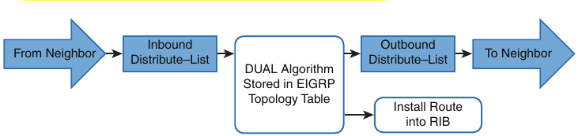

- Filtering is accomplished with the following command:

```
conf t
 router eigrp 100
  distribute-list <acl-number | acl-name> [prefix] <prefix-list-name> [route-map] <route-map name> [gateway] <prefix-list-name> <in|out> <interface-id>
```

- With the topology from above - filter the 10.1.1.0/24 prefix before entering on R4:

```
conf t
 ip prefix-list DENY-10.1.1.0 seq 5 deny 10.1.1.0/24
 ip prefix-list DENY-10.1.1.0 seq 10 permit 0.0.0.0/0 le 32
 router eigrp 100
  distribute-list prefix DENY-10.1.1.0 in
```

- Result - the subnet is not in the routing table or EIGRP topology table:

```
R4(config-router)#do sh ip ro 10.1.1.0 255.255.255.0
% Subnet not in table
R4(config-router)#
R4(config-router)#
R4(config-router)#do sh ip eigrp to
EIGRP-IPv4 Topology Table for AS(100)/ID(10.24.1.4)
Codes: P - Passive, A - Active, U - Update, Q - Query, R - Reply,
       r - reply Status, s - sia Status 

P 10.12.1.0/24, 1 successors, FD is 3072
        via 10.24.1.2 (3072/2816), GigabitEthernet0/0
P 10.24.1.0/24, 1 successors, FD is 2816
        via Connected, GigabitEthernet0/0
P 10.4.4.0/24, 1 successors, FD is 128256
        via Connected, Loopback0
P 10.35.1.0/24, 1 successors, FD is 3328
        via 10.24.1.2 (3328/3072), GigabitEthernet0/0
P 10.23.1.0/24, 1 successors, FD is 3072
        via 10.24.1.2 (3072/2816), GigabitEthernet0/0
```

- EIGRP classic configuration places the command under the EIGRP process, while named mode configuration places the command under the topology base

- Prefixes that match against a `deny` statement are filtered, and prefixes that are matched against a `permit` are passed

- The `gateway` command can be used by itself or combined with a prefix list, an ACL, or a route map to restrict prefixes based on the next-hop forwarding address

- Specifying an interface restricts the filtering to the interface that the route was received or advertised out of

- Below there is an EIGRP network for demonstating inbound and outbound route filtering on R2

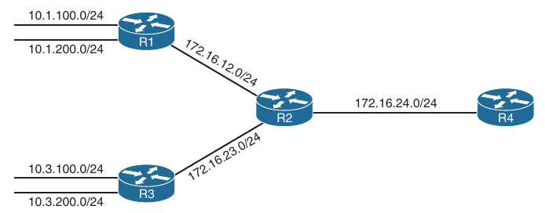

- EIGRP routing table on R2:

```
R2#show ip route eigrp | b Gate
Gateway of last resort is not set

      10.0.0.0/24 is subnetted, 4 subnets
D        10.1.100.0 [90/130816] via 172.16.12.1, 00:06:55, GigabitEthernet1
D        10.1.200.0 [90/130816] via 172.16.12.1, 00:06:55, GigabitEthernet1
D        10.3.100.0 [90/130816] via 172.16.23.3, 00:06:53, GigabitEthernet2
D        10.3.200.0 [90/130816] via 172.16.23.3, 00:06:53, GigabitEthernet2
```

- EIGRP routing table on R4:

```
R4#show ip ro eigrp | b Gate
Gateway of last resort is not set

      10.0.0.0/24 is subnetted, 4 subnets
D        10.1.100.0 [90/131072] via 172.16.24.2, 00:07:07, GigabitEthernet1
D        10.1.200.0 [90/131072] via 172.16.24.2, 00:07:07, GigabitEthernet1
D        10.3.100.0 [90/131072] via 172.16.24.2, 00:07:07, GigabitEthernet1
D        10.3.200.0 [90/131072] via 172.16.24.2, 00:07:07, GigabitEthernet1
      172.16.0.0/16 is variably subnetted, 4 subnets, 2 masks
D        172.16.12.0/24 [90/3072] via 172.16.24.2, 00:07:07, GigabitEthernet1
D        172.16.23.0/24 [90/3072] via 172.16.24.2, 00:07:07, GigabitEthernet1
```

- Below is shown the configuration on R2 to demonstrate inbound filtering of 10.1.100.0/24 network and outbound filtering of 10.3.100.0/24 network

- Inbound filter uses a standard ACL to filter inbound routes and a prefix list to filter outbound advertisements

- The `prefix` keyword must be used when referencing a prefix list

- R2 - classic mode:

```
conf t
 ip access-list standard FILTER-R1-10.1.100.X
  deny 10.1.100.0
  permit any

 ip prefix-list FILTER-R3-10.3.100.x seq 5 deny 10.3.100.0/24
 ip prefix-list FILTER-R3-10.3.100.x seq 10 permit 0.0.0.0/0 le 32

 router eigrp 65001
  distribute-list FILTER-R1-10.1.100.X in
  distribute-list prefix FILTER-R3-10.3.100.x out
```

- With named mode:

```
conf t
 ip access-list standard FILTER-R1-10.1.100.X
  deny 10.1.100.0
  permit any

 ip prefix-list FILTER-R3-10.3.100.x seq 5 deny 10.3.100.0/24
 ip prefix-list FILTER-R3-10.3.100.x seq 10 permit 0.0.0.0/0 le 32

 router eigrp EIGRP-NAMED
  address-family ipv4 autonomous-system 65001
   topology base
    distribute-list FILTER-R1-10.1.100.X in
    distribute-list prefix FILTER-R3-10.3.100.x out
```

- Viewing the filters applied:

```
R2(config-router)#do sh ip protocols
*** IP Routing is NSF aware ***

Routing Protocol is "application"
  Sending updates every 0 seconds
  Invalid after 0 seconds, hold down 0, flushed after 0
  Outgoing update filter list for all interfaces is not set
  Incoming update filter list for all interfaces is not set
  Maximum path: 32
  Routing for Networks:
  Routing Information Sources:
    Gateway         Distance      Last Update
  Distance: (default is 4)

Routing Protocol is "eigrp 65001"
  Outgoing update filter list for all interfaces is (prefix-list) FILTER-R3-10.3.100.x
  Incoming update filter list for all interfaces is FILTER-R1-10.1.100.X
  Default networks flagged in outgoing updates
  Default networks accepted from incoming updates
  EIGRP-IPv4 Protocol for AS(65001)
    Metric weight K1=1, K2=0, K3=1, K4=0, K5=0
    Soft SIA disabled
    NSF-aware route hold timer is 240
  EIGRP NSF disabled
     NSF signal timer is 20s
     NSF converge timer is 120s
    Router-ID: 172.16.24.2
    Topology : 0 (base) 
      Active Timer: 3 min
      Distance: internal 90 external 170
      Maximum path: 4
      Maximum hopcount 100
      Maximum metric variance 1

  Automatic Summarization: disabled
  Maximum path: 4
  Routing for Networks:
    172.16.12.0/24
    172.16.23.0/24
    172.16.24.0/24
  Routing Information Sources:
    Gateway         Distance      Last Update
    172.16.24.4           90      00:13:54
    172.16.23.3           90      00:13:54
    172.16.12.1           90      00:13:54
  Distance: internal 90 external 170
          
```

- Below is shown the EIGRP routing table on R2 and R4 after EIGRP filtering is enabled on the routers

- The 10.1.100.0/24 prefix is filtered upon receipt by R2, and is not present in the EIGRP topology to advertise to R4

- R2 still has 10.3.100.0/24 prefix installed in the RIB, but the route is not advertised to R4

- R2 does not have the 10.1.100.0/24 prefix or the 10.3.100.0/24 prefix in the routing table

- R2:

```
R2#show ip route eigrp | b Gate
Gateway of last resort is not set

      10.0.0.0/24 is subnetted, 3 subnets
D        10.1.200.0 [90/130816] via 172.16.12.1, 00:52:47, GigabitEthernet1
D        10.3.100.0 [90/130816] via 172.16.23.3, 00:52:45, GigabitEthernet2
D        10.3.200.0 [90/130816] via 172.16.23.3, 00:52:45, GigabitEthernet2
```

- R4:

```
R4#show ip route eigrp | b Gateway
Gateway of last resort is not set

      10.0.0.0/24 is subnetted, 2 subnets
D        10.1.200.0 [90/131072] via 172.16.24.2, 00:52:09, GigabitEthernet1
D        10.3.200.0 [90/131072] via 172.16.24.2, 00:52:09, GigabitEthernet1
      172.16.0.0/16 is variably subnetted, 4 subnets, 2 masks
D        172.16.12.0/24 [90/3072] via 172.16.24.2, 00:52:09, GigabitEthernet1
D        172.16.23.0/24 [90/3072] via 172.16.24.2, 00:52:09, GigabitEthernet1
```

#### Traffic Steering with EIGRP offset Lists

- Modifying the EIGRP path metric provides traffic engineering in EIGRP

- Modifying the delay setting for an interface modifies all routes that are received and advertised from that router's interface

- *Offset lists* allow for the modification of path attributes based on direction of the update, a specific prefix, or a combination of direction or prefix

- An offset list is configured as follows, to modify the metric value for a route

```
conf t
 router eigrp 65001
  offset-list <acl-number> <acl-name> <in|out> <offset-value> [interface-id] 
```

- Specifying an interface restricts the conditional match for the offset list to the interface that the route is received or advertised of

- EIGRP classic mode places the command under the EIGRP process, while named mode configuration places the command under the topology base 

- R2 configuration - increase the metric for the 10.1.200.0/24 route as it is advertised to R4 with 5.000.000

```
conf t
 ip access-list standard OFFSET-10.1.200.X
  10 permit 10.1.200.0
  20 deny   any

 router eigrp 65001
  offset-list OFFSET-10.1.200.X out 5000000
```

- On R4, the metric for the prefix increased with 5.000.000

```
R4#show ip route eigrp | b Gate
Gateway of last resort is not set

      10.0.0.0/24 is subnetted, 2 subnets
D        10.1.200.0 [90/5131072] via 172.16.24.2, 00:03:11, GigabitEthernet1
D        10.3.200.0 [90/131072] via 172.16.24.2, 01:23:28, GigabitEthernet1
      172.16.0.0/16 is variably subnetted, 4 subnets, 2 masks
D        172.16.12.0/24 [90/3072] via 172.16.24.2, 01:23:28, GigabitEthernet1
D        172.16.23.0/24 [90/3072] via 172.16.24.2, 01:23:28, GigabitEthernet1
```

- As you can see, the 10.1.200.0/24 network has a metric increased by 5000000

- On the downstream neighbor, the path metric increases by the offset value specified in the offset list

- The offset value is calculated from an additional delay value that was added to the existing delay in the EIGRP path attribute

- Below is shown the modified EIGRP path metric formula when an offset delay is included

- Below is shown the same EIGRP topology from above and will be used to demonstrate the offset lists

- R1 is advertising the 10.1.100.0/24 and 10.1.200.0/24 networks and R3 is advertising the 10.3.100.0/24 and 10.3.200.0/24 networks

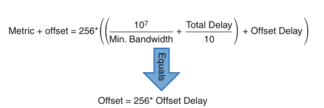

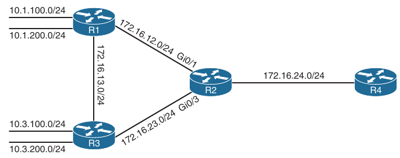

- Below is shown the EIGRP routing tables for R2 and R4 before any path specific manipulation is performed

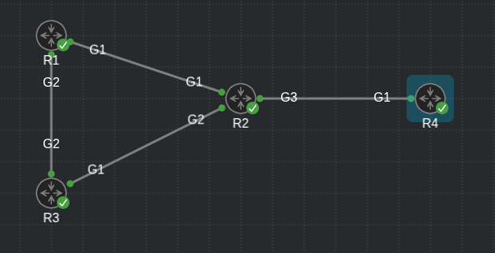

- Routing table of R2 before route manipulation:

```
R2(config-router)#do sh ip ro eigrp | b Gate
Gateway of last resort is not set

      10.0.0.0/24 is subnetted, 4 subnets
D        10.1.100.0 [90/130816] via 172.16.12.1, 00:00:17, GigabitEthernet1
D        10.1.200.0 [90/130816] via 172.16.12.1, 00:01:34, GigabitEthernet1
D        10.3.100.0 [90/130816] via 172.16.23.3, 00:00:04, GigabitEthernet2
D        10.3.200.0 [90/130816] via 172.16.23.3, 00:01:31, GigabitEthernet2
      172.16.0.0/16 is variably subnetted, 7 subnets, 2 masks
D        172.16.13.0/24 [90/3072] via 172.16.23.3, 00:01:36, GigabitEthernet2
                        [90/3072] via 172.16.12.1, 00:01:36, GigabitEthernet1
```

- R4's EIGRP routing table before offset-list applying:

```
R4#show ip ro eigrp | b Gate
Gateway of last resort is not set

      10.0.0.0/24 is subnetted, 4 subnets
D        10.1.100.0 [90/131072] via 172.16.24.2, 00:00:48, GigabitEthernet1
D        10.1.200.0 [90/131072] via 172.16.24.2, 00:30:14, GigabitEthernet1
D        10.3.100.0 [90/131072] via 172.16.24.2, 00:00:35, GigabitEthernet1
D        10.3.200.0 [90/131072] via 172.16.24.2, 00:40:16, GigabitEthernet1
      172.16.0.0/16 is variably subnetted, 5 subnets, 2 masks
D        172.16.12.0/24 [90/3072] via 172.16.24.2, 00:40:16, GigabitEthernet1
D        172.16.13.0/24 [90/3328] via 172.16.24.2, 00:02:53, GigabitEthernet1
D        172.16.23.0/24 [90/3072] via 172.16.24.2, 00:40:16, GigabitEthernet1
```

- To demonstrate how an offset list is used to steer traffic, the path metric for the 10.1.100.0/24 network is incremented on R2's G1 interface so that R2 forwards packets towards R3 for that network

- In addition, the 10.3.100.0/24 network is incremented on R2's G2 interface so that R2 forwards packets towards R1 for that network

- Below is displayed the configuration of R2 for classic and named modes

- Classsic configuration:

```
conf t
 ip access-list standard R1
  permit 10.1.100.0
 ip access-list standard R3
  permit 10.1.200.0
 
 router eigrp 65001
  offset-list R1 in 200000 g1
  offset-list R3 in 200000 g2
```

- Named-mode configuration:

```
conf t
 router eigrp EIGRP-NAMED
  address-family ipv4 autonomous-system 65001
   topology base
    offset-list R1 in 200000 g1
    offset-list R3 in 200000 g2
```

- Below is shown R2's routing table after the offset list is implemented

- Notice how the path metrics and next-hops changed for the 10.1.100.0/24 and 10.3.100.0/24 networks, while the metrics for the other routes remained the same

```
R2(config-router)#do sh ip ro eigrp | b Gate
Gateway of last resort is not set

      10.0.0.0/24 is subnetted, 4 subnets
D        10.1.100.0 [90/131072] via 172.16.23.3, 00:00:24, GigabitEthernet2
D        10.1.200.0 [90/130816] via 172.16.12.1, 00:03:12, GigabitEthernet1
D        10.3.100.0 [90/131072] via 172.16.12.1, 00:00:16, GigabitEthernet1
D        10.3.200.0 [90/130816] via 172.16.23.3, 00:03:09, GigabitEthernet2
      172.16.0.0/16 is variably subnetted, 7 subnets, 2 masks
D        172.16.13.0/24 [90/3072] via 172.16.23.3, 00:03:14, GigabitEthernet2
                        [90/3072] via 172.16.12.1, 00:03:14, GigabitEthernet1
```

- R4:

```
R4#show ip ro eigrp | b Gate
Gateway of last resort is not set

      10.0.0.0/24 is subnetted, 4 subnets
D        10.1.100.0 [90/131328] via 172.16.24.2, 00:01:15, GigabitEthernet1
D        10.1.200.0 [90/131072] via 172.16.24.2, 00:32:12, GigabitEthernet1
D        10.3.100.0 [90/131328] via 172.16.24.2, 00:01:07, GigabitEthernet1
D        10.3.200.0 [90/131072] via 172.16.24.2, 00:42:14, GigabitEthernet1
      172.16.0.0/16 is variably subnetted, 5 subnets, 2 masks
D        172.16.12.0/24 [90/3072] via 172.16.24.2, 00:42:14, GigabitEthernet1
D        172.16.13.0/24 [90/3328] via 172.16.24.2, 00:04:51, GigabitEthernet1
D        172.16.23.0/24 [90/3072] via 172.16.24.2, 00:42:14, GigabitEthernet1
```
