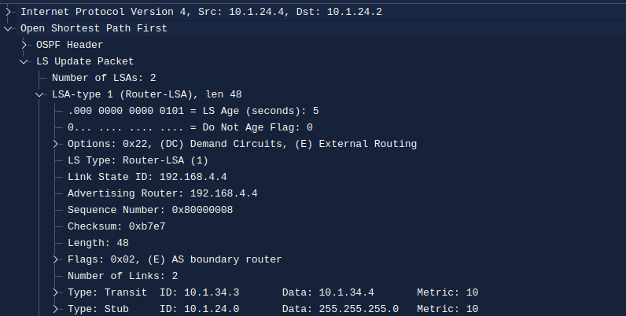
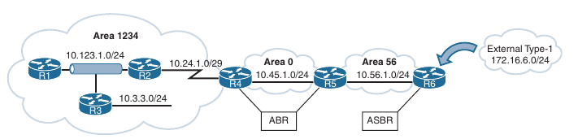
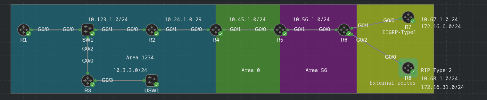
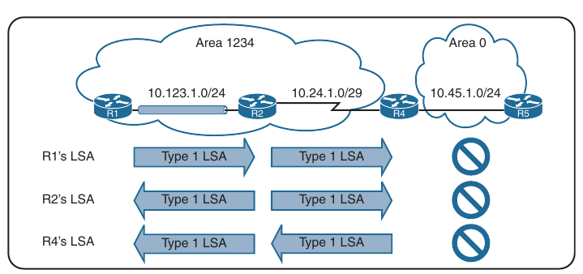
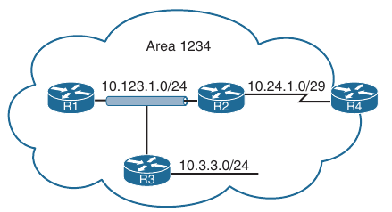
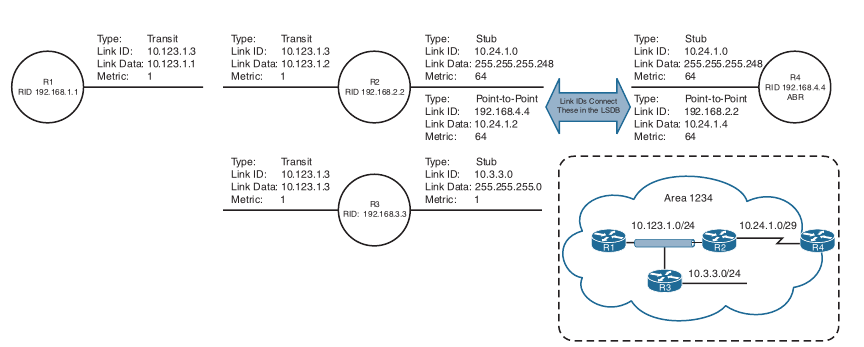
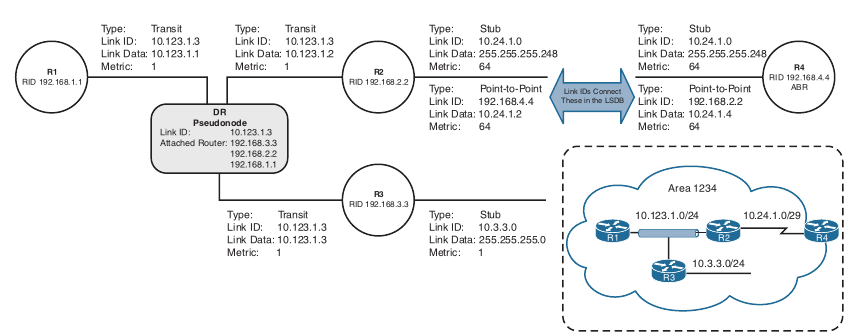
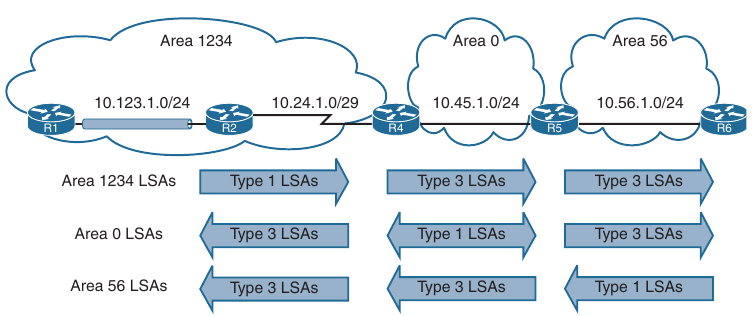
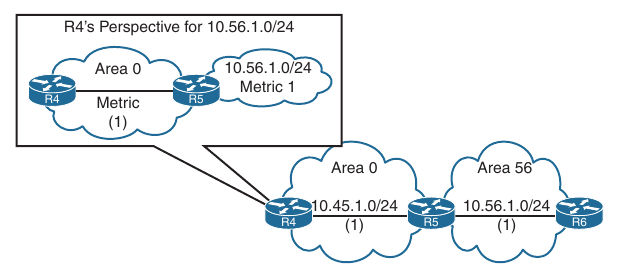
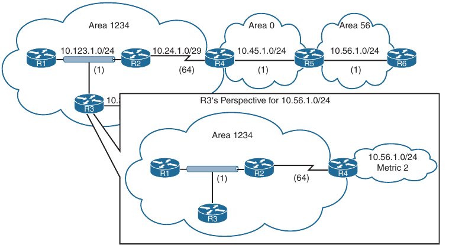

## Advanced OSPF

1. Link-State Advertisements

2. OSPF Stubby Areas

3. OSPF Path Selection

4. Summarization of Routes

5. Discontiguous Network

6. Virtual Links

- Solid understanding of the route advertisements within a multi-area OSPF domain, path selection and techniques to optimize the OSPF environment

### Link-State Advertisements

- An OSPF link-state advertisement (LSA) contains the link state and link metric to a neighboring router

- Received LSAs are stored in a local dababase called the link-state database (LSDB); the LSDB advertises the link-state information to neighboring routers exactly as the original advertising router advertises it

- This process floods the LSA through the OSPF routing domain, just as the advertising router advertised it

- All OSPF routers in the same area maintain a synchronized identical copy of the LSDB for that area

- The LSDB provides the topology of the network, in essence providing the router the complete map of the network

- All OSPF routers run Dijkstra's shortest path first (SPF) algorithm to construct a loop-free topology of shortest paths

- OSPF dynamically detects topology changes within the routing domain and calculates loop-free paths in a short amount of time with minimal routing protocol traffic

- When OSPF routers become adjacent, the LSDBs synchronize between the OSPF routers

- As an OSPF router adds or removes a directly connected network link to or from it's database, the router floods the LSA out all active OSPF interfaces

- The OSPF LSA contains a complete list of networks advertised from that router

- OSPF uses six LSA types for IPv4 routing:

    - **Type 1, router**: LSAs that advertise prefixes within an area

    - **Type 2, network**: LSAs that indicate the routers attached to a broadcast segment within an area

    - **Type 3, summary**: LSAs that advertise prefixes that originate from a different area

    - **Type 4, ASBR summary**: LSA used to locate the ASBR from a different area

    - **Type 5, AS external**: LSA that advertises prefixes that were redistributed in to OSPF

    - **Type 7, NSSA external**: LSA for external prefixes that were redistributed in a local NSSA area

- LSA types 1, 2 and 3 are used for building the SPF tree for inter-area and intra-area route routes

- LSA types 4, 5 and 7 are related to external OSPF routes (that is, routes that were redistributed into the OSPF routing domain)

- Below we can see a packet capture of an OSPF update LSA and shows the important components of the LSA: The LSA type, the LSA age, the sequence, and the advertising router

- Because this is a Type 1 LSA, the link IDs add relevance as they list the attached networks and the associated OSPF cost for each interface



- Below is shown a sample topology to demonstrate the different LSA types

- In this topology:

    - R1, R2 and R3 are nembers (internal) routers

    - R4 and R5 are area border routers (ABRs)

    - R6 is the ASBR which is redistributing the 172.16.6.0/24 network into OSPF



#### LSA Sequences

- OSPF uses the sequence number to overcome problems caused by delays in LSA propagation in a network

- The LSA sequence number is a 32-bit number used to control versioning

- When the originating router sends out LSAs, the LSA sequence number is incremented

- If a router receives an LSA sequence, that is greater than the one in the LSDB, it processes the LSA

- If the LSA sequence number is lower than the one in the LSDB, the router deems the LSA old and discards it

#### LSA Age and Flooding

- Every OSPF LSA includes an age that is entered into the local LSDB that increments by 1 every second

- When a router's OSPF LSA exceeds 1800 seconds (that is, 30 minutes), for it's prefixes, the originating router advertises a new LSA with the LSA age set to 0

- As each router forwards the LSA, the LSA age is incremented with a calculated delay that reflects the link (which is minimal)

- If the LSA age reaches 3600, the LSA is deemed invalid and is purged from the LSDB

- The repetitive flooding of LSAs is a secondary safety mechanism to ensure that all routers maintain a consistent LSDB within an area

#### LSA Types



- All routers within an OSPF area have an identical set of LSAs for that area

- The ABRs maintain a separate set of LSAs for each OSPF area

- Most LSAs in one area are different from the LSAs in another area

- You can see generic router LSA output by using the command `show ip ospf database`

```
R1#show ip ospf database 

            OSPF Router with ID (192.168.1.1) (Process ID 1)

                Router Link States (Area 1234)

Link ID         ADV Router      Age         Seq#       Checksum Link count
192.168.1.1     192.168.1.1     1142        0x80000006 0x007456 2
192.168.2.2     192.168.2.2     856         0x80000007 0x0082EB 3
192.168.3.3     192.168.3.3     1142        0x80000005 0x00514B 3
192.168.4.4     192.168.4.4     856         0x80000002 0x00A9E3 2

                Net Link States (Area 1234)

Link ID         ADV Router      Age         Seq#       Checksum
10.123.1.2      192.168.2.2     1151        0x80000002 0x004FA7

                Summary Net Link States (Area 1234)

Link ID         ADV Router      Age         Seq#       Checksum
10.45.1.0       192.168.4.4     859         0x80000001 0x00A7EA
10.56.1.0       192.168.4.4     805         0x80000001 0x002D59
10.67.1.0       192.168.4.4     799         0x80000001 0x00B2C7
10.68.1.0       192.168.4.4     799         0x80000001 0x00A6D2
192.168.5.5     192.168.4.4     805         0x80000001 0x004214
192.168.6.6     192.168.4.4     799         0x80000001 0x00371C

                Summary ASB Link States (Area 1234)

Link ID         ADV Router      Age         Seq#       Checksum
192.168.6.6     192.168.4.4     799         0x80000001 0x001F34

                Type-5 AS External Link States

Link ID         ADV Router      Age         Seq#       Checksum Tag
172.16.6.0      192.168.6.6     795         0x80000001 0x006AD8 0
172.16.31.0     192.168.6.6     796         0x80000001 0x00D53B 0
```

##### LSA Type 1: Router Link

- Every OSPF router advertises a Type 1 LSA (Router LSA)

- Type 1 LSAs are the essential building blocks in the LSDB

- A Type 1 OSPF LSA entry exists for each OSPF-enabled link (that is an interface and it's attached networks)

- Below is shown that the Type 1 LSAs are not advertised outside Area 1234, thus making the underlying topology in an area invisible to other areas



- For a summary view of Type 1 LSAs for an area, look under Router Link States column within the LSDB (output from above)

```
R1#show ip ospf database        

            OSPF Router with ID (192.168.1.1) (Process ID 1)

                Router Link States (Area 1234)

Link ID         ADV Router      Age         Seq#       Checksum Link count
192.168.1.1     192.168.1.1     835         0x80000007 0x007257 2
192.168.2.2     192.168.2.2     603         0x80000008 0x0080EC 3
192.168.3.3     192.168.3.3     830         0x80000006 0x004F4C 3
192.168.4.4     192.168.4.4     478         0x80000003 0x00A7E4 2
```

- Below is an overview of the fields in the LSDB output

```
Field                           Description

Link ID                         Identifies the object that the link connects to. It can refer to the neighboring router's RID, the IP address
                                of the DRs interface, or the IP network address

ADV Router                      The OSPF Router ID for this LSA

Age                             The age of the LSA on the router on which the command is being run. Values over 1800 are expected to refresh soon

Seq #                           The sequence number for the LSA to protect out-of-order LSAs

Checksum                        The checksum of the LSA to verify integrity during flooding

Link count                      The number of links on this router in the Type 1 LSA
```



- You can examine the Type 1 OSPF LSAs by using the command `show ip ospf database router` as shown below

- Notice in the output that entries exist for all four routers in an area

```
R1#show ip ospf database router 

            OSPF Router with ID (192.168.1.1) (Process ID 1)

                Router Link States (Area 1234)

  LS age: 332
  Options: (No TOS-capability, DC)
  LS Type: Router Links
  Link State ID: 192.168.1.1
  Advertising Router: 192.168.1.1
  LS Seq Number: 80000008
  Checksum: 0x7058
  Length: 48
  Number of Links: 2

    Link connected to: a Stub Network
     (Link ID) Network/subnet number: 192.168.1.1
     (Link Data) Network Mask: 255.255.255.255
      Number of MTID metrics: 0
       TOS 0 Metrics: 1

    Link connected to: a Transit Network
     (Link ID) Designated Router address: 10.123.1.2
     (Link Data) Router Interface address: 10.123.1.1
      Number of MTID metrics: 0
       TOS 0 Metrics: 1


  LS age: 71
  Options: (No TOS-capability, DC)
  LS Type: Router Links
  Link State ID: 192.168.2.2
  Advertising Router: 192.168.2.2
  LS Seq Number: 80000009
  Checksum: 0x7EED
  Length: 60
  Number of Links: 3

    Link connected to: a Transit Network
     (Link ID) Designated Router address: 10.123.1.2
     (Link Data) Router Interface address: 10.123.1.2
      Number of MTID metrics: 0
       TOS 0 Metrics: 1

    Link connected to: another Router (point-to-point)
     (Link ID) Neighboring Router ID: 192.168.4.4
     (Link Data) Router Interface address: 10.24.1.2
      Number of MTID metrics: 0
       TOS 0 Metrics: 1

    Link connected to: a Stub Network
     (Link ID) Network/subnet number: 10.24.1.0
     (Link Data) Network Mask: 255.255.255.248
      Number of MTID metrics: 0
       TOS 0 Metrics: 1


  LS age: 315
  Options: (No TOS-capability, DC)
  LS Type: Router Links
  Link State ID: 192.168.3.3
  Advertising Router: 192.168.3.3
  LS Seq Number: 80000007
  Checksum: 0x4D4D
  Length: 60
  Number of Links: 3

    Link connected to: a Stub Network
     (Link ID) Network/subnet number: 192.168.3.3
     (Link Data) Network Mask: 255.255.255.255
      Number of MTID metrics: 0
       TOS 0 Metrics: 1

    Link connected to: a Stub Network
     (Link ID) Network/subnet number: 10.3.3.0
     (Link Data) Network Mask: 255.255.255.0
      Number of MTID metrics: 0
       TOS 0 Metrics: 1

    Link connected to: a Transit Network
     (Link ID) Designated Router address: 10.123.1.2
     (Link Data) Router Interface address: 10.123.1.3
      Number of MTID metrics: 0
       TOS 0 Metrics: 1


  LS age: 1977
  Options: (No TOS-capability, DC)
  LS Type: Router Links
  Link State ID: 192.168.4.4
  Advertising Router: 192.168.4.4
  LS Seq Number: 80000003
  Checksum: 0xA7E4
  Length: 48
  Area Border Router
  Number of Links: 2

    Link connected to: another Router (point-to-point)
     (Link ID) Neighboring Router ID: 192.168.2.2
     (Link Data) Router Interface address: 10.24.1.4
      Number of MTID metrics: 0
       TOS 0 Metrics: 1

    Link connected to: a Stub Network
     (Link ID) Network/subnet number: 10.24.1.0
     (Link Data) Network Mask: 255.255.255.248
      Number of MTID metrics: 0
       TOS 0 Metrics: 1
```

- The initial fields of each Type 1 LSA are the same as explained above

- If a router is functioning as an ABR, an ASBR or a virtual-link endpoint, the function is listed between the Length field and the Number of Links field

- In the output from above we can see that R4 (192.168.4.4) is an ABR

- Each OSPF-enabled interface is listed under the number of links for each router

- Each network link on a router contains the following information, in this order:

    - Link type that appears after "Link connected to:". The fields can be corelated with the table from below

    - Link ID, using the values based on the link type listed in the table below

    - Link Data, when applicable

    - Metric for the interface

- OSPF Neighbor states for Type 1 LSA

```
Description                 Link Type                   Link ID Value                       Link Data

Point-to-point (IP          1                           Neighbor RID                        Interface IP address
address assigned)

Point-to-point (IP          1                           Neighbor RID                        MIB II IfIndex value
unnumbered)

Link to transit network     2                           Interface address of DR             Interface IP address

Link to stub network        3                           Network address                     Subnet mask

Virtual link                4                           Neighbor RID                        Interface IP address
```

- During the SPF tree calculation, the network link type is one of the following:

    - **Transit**: A transit network indicates that an adjacency was formed and that a DR was elected on that link

    - **Point-to-point**: A point-to-point link indicates that an adjacency was formed on a network type that does not use a DR

    - Interfaces using point-to-point network type advertise two links: One link is the point-to-point link type that identifies the 
    OSPF neighbor RID for that segment, and the other link is a stub network link that provides the subnet mask for that network

    - **Stub**: A stub network indicates that no neighbor adjacencies were established on that link

    - Point-to-point and transit link types that did not become adjacent with another OSPF router are classified as a stub network link type

    - When an OSPF neighbor adjacency forms, the link type changes to the appropriate type: point-to-point or transit

- Secondary connected networks are always advertised as stub link types because OSPF adjacencies can never form on them

- If you correlate just the Type 1 LSAs from our reference topology, then we can see the topology built by all routers in Area 1234, using the LSA attributes for Area 1234 from all four routers

- Using only Type 1 LSAs, a connection is made between R2 and R4 because they point to each other's RID in the point-to-point LSA

- Notice that the three router links on R1, R2 and R3 (10.123.1.0) have not been directly connected yet

- Type 1 LSA view:



##### LSA Type 2: Network Link

- A Type 2 LSA (Network LSA) represents a multi-access network segment that uses a DR

- The DR always advertises the Type 2 LSA and identifies all the routers attached to that network segment

- If a DR has not been elected, a type 2 LSA is not present in the LSDB because the corresponding Type 1 transit link type LSA is a stub

- Type 2 LSAs are not flooded outside of the originating OSPF area in an identical fashion to Type 1 LSAs

- A brief summary view of the Type 2 LSAs is shown in the LSDB under Net Link States

- Below we can see the output for Type 2 LSAs in Area 1234 from our reference topology

```
R2#show ip ospf database        

            OSPF Router with ID (192.168.2.2) (Process ID 1)
(...)

                Net Link States (Area 1234)

Link ID         ADV Router      Age         Seq#       Checksum
10.123.1.3      192.168.3.3     88          0x80000002 0x0028CB

(...)
```

- Area 1234 has only one DR segment that connects R1, R2 and R3, because R3 has not formed an OSPF adjacency on the 10.3.3.0/24 network segment

- To see detailed Type 2 LSA information, you use the command `show ip ospf database network` 

- Below is shown the Type 2 LSA that is advertised by R3 and shows that the link state ID 10.123.1.3 attaches to R1, R2 and R3 (by listing their RIDs at the bottom)

- The network mask for the subnet is included in the Type 2 LSA

```
R1#show ip ospf database network 

            OSPF Router with ID (192.168.1.1) (Process ID 1)

                Net Link States (Area 1234)

  LS age: 346
  Options: (No TOS-capability, DC)
  LS Type: Network Links
  Link State ID: 10.123.1.3 (address of Designated Router)
  Advertising Router: 192.168.3.3
  LS Seq Number: 80000002
  Checksum: 0x28CB
  Length: 36
  Network Mask: /24
        Attached Router: 192.168.3.3
        Attached Router: 192.168.1.1
        Attached Router: 192.168.2.2

```

- Now that you have the Type 2 LSA for Area 1234, all the network links are connected

- Below we can see a visualization of the Type 1 and Type 2 LSAs; it corresponds with Area 1234 perfectly

- When the DR changes for the network segment, a new Type 2 LSA is created, causing SPF to run again within the OSPF area



##### LSA Type 3: Summary Link

- Type 3 LSAs, (summary LSAs) represent networks from other areas

- The role of the ABRs is to participate in multiple OSPF areas and ensures that the networks associated with Type 1 LSAs are reachable in the nonoriginating OSPF areas

- As explained earlier, ABRs do not forward Type 1 or Type 2 LSAs into other areas

- When an ABR receives a Type 1 LSA, it creates a Type 3 LSA referencing the network in the original Type 1 LSA

- (The Type 2 LSA is used to determine the network mask of the multi-access network)

- The ABR then advertises the Type 3 LSA into other areas

- If an ABR receives a Type 3 LSA from Area 0 (backbone area), it regenerates a Type 3 LSA for the non-backbone area and lists itself as the advertising router with the additional cost metric

- Below we can see the Type 3 LSA interaction with Type 1 LSAs

- Notice that the Type 1 LSAs exist only in the area of origination and convert to Type 3 when they cross the ABRs (R4 and R5)



- For a summary view of the Type 3 LSAs, look under Summary Net Link States

- The Type 3 LSAs show up under the appropriate area where they exist in the OSPF domain

```
R2#show ip ospf database 

            OSPF Router with ID (192.168.2.2) (Process ID 1)

(...)

                Summary Net Link States (Area 1234)

Link ID         ADV Router      Age         Seq#       Checksum
10.45.1.0       192.168.4.4     1461        0x80000002 0x00A5EB
10.56.1.0       192.168.4.4     1461        0x80000002 0x002B5A
10.67.1.0       192.168.4.4     1461        0x80000002 0x00B0C8
10.68.1.0       192.168.4.4     1461        0x80000002 0x00A4D3
192.168.5.5     192.168.4.4     1461        0x80000002 0x004015
192.168.6.6     192.168.4.4     1461        0x80000002 0x00351D

(...)
```

- R4 - the ABR:

```
R4#show ip ospf database 

            OSPF Router with ID (192.168.4.4) (Process ID 1)

(...)
                Summary Net Link States (Area 0)

Link ID         ADV Router      Age         Seq#       Checksum
10.3.3.0        192.168.4.4     1443        0x80000002 0x009D1A
10.24.1.0       192.168.4.4     1443        0x80000002 0x007835
10.56.1.0       192.168.5.5     1494        0x80000002 0x001470
10.67.1.0       192.168.5.5     1494        0x80000002 0x0099DE
10.68.1.0       192.168.5.5     1494        0x80000002 0x008DE9
10.123.1.0      192.168.4.4     1443        0x80000002 0x00043E
192.168.1.1     192.168.4.4     1443        0x80000002 0x009EBD
192.168.3.3     192.168.4.4     1443        0x80000002 0x0074E3
192.168.5.5     192.168.5.5     1494        0x80000002 0x00292B
192.168.6.6     192.168.5.5     1494        0x80000002 0x001E33

(...)
                Summary Net Link States (Area 1234)

Link ID         ADV Router      Age         Seq#       Checksum
10.45.1.0       192.168.4.4     1443        0x80000002 0x00A5EB
10.56.1.0       192.168.4.4     1443        0x80000002 0x002B5A
10.67.1.0       192.168.4.4     1443        0x80000002 0x00B0C8
10.68.1.0       192.168.4.4     1443        0x80000002 0x00A4D3
192.168.5.5     192.168.4.4     1443        0x80000002 0x004015
192.168.6.6     192.168.4.4     1443        0x80000002 0x00351D

```

- For example, the 10.56.1.0 Type 3 LSA exists only in Area 0 and Area 1234 on R4

- R5 contains the 10.56.1.0 Type 3 LSA only for Area 0, but not for Area 56 because Area 56 has a Type 1 LSA

```
R5#show ip ospf database 

            OSPF Router with ID (192.168.5.5) (Process ID 1)

(...)
                Summary Net Link States (Area 0)

Link ID         ADV Router      Age         Seq#       Checksum
10.3.3.0        192.168.4.4     1873        0x80000002 0x009D1A
10.24.1.0       192.168.4.4     1873        0x80000002 0x007835
10.56.1.0       192.168.5.5     1922        0x80000002 0x001470
10.67.1.0       192.168.5.5     1922        0x80000002 0x0099DE
10.68.1.0       192.168.5.5     1922        0x80000002 0x008DE9
10.123.1.0      192.168.4.4     1873        0x80000002 0x00043E
192.168.1.1     192.168.4.4     1873        0x80000002 0x009EBD
192.168.3.3     192.168.4.4     1873        0x80000002 0x0074E3
192.168.5.5     192.168.5.5     1922        0x80000002 0x00292B
192.168.6.6     192.168.5.5     1922        0x80000002 0x001E33

(...)

                Router Link States (Area 56)

Link ID         ADV Router      Age         Seq#       Checksum Link count
192.168.5.5     192.168.5.5     1922        0x80000006 0x006CC3 2
192.168.6.6     192.168.6.6     1864        0x80000006 0x00B5B2 4

                Net Link States (Area 56)

Link ID         ADV Router      Age         Seq#       Checksum
10.56.1.6       192.168.6.6     1864        0x80000002 0x008B06

                Summary Net Link States (Area 56)

Link ID         ADV Router      Age         Seq#       Checksum
10.3.3.0        192.168.5.5     1922        0x80000002 0x009A1A
10.24.1.0       192.168.5.5     1922        0x80000002 0x007535
10.45.1.0       192.168.5.5     1922        0x80000002 0x0098F6
10.123.1.0      192.168.5.5     1922        0x80000002 0x00013E
192.168.1.1     192.168.5.5     1922        0x80000002 0x009BBD
192.168.3.3     192.168.5.5     1922        0x80000002 0x0071E3

(...)
```

- To see detailed Type 3 LSA information, you use the command `show ip ospf database summary`

- You can restrict the output to a specific LSA by adding the prefix at the end of the command

- The advertising router for Type 3 LSAs is the last ABR that advertises the prefix

- The metric in the Type 3 LSA uses the following logic:

    - If the Type 3 LSA is created from a Type 1 LSA, is the total path metric to reach the originating router in the Type 1 LSA

    - If the Type 3 LSA is created from a Type 3 LSA from Area 0, it is the total path metric to the ABR plus the metric in the original Type 3 LSA

- Below is shown the Type 3 LSA for Area 56 prefix 10.56.1.0 (10.56.1.0/24) from R4's LSDB

- R4 is an ABR, and the information is shown for both Area 1234 and Area 0

- Notice that the metric increases in Area 1234's LSA compared to in Area 0's LSA

```
R4#show ip ospf database summary 10.56.1.0 

            OSPF Router with ID (192.168.4.4) (Process ID 1)

                Summary Net Link States (Area 0)

  LS age: 608
  Options: (No TOS-capability, DC, Upward)
  LS Type: Summary Links(Network)
  Link State ID: 10.56.1.0 (summary Network Number)
  Advertising Router: 192.168.5.5
  LS Seq Number: 80000003
  Checksum: 0x1271
  Length: 28
  Network Mask: /24
        MTID: 0         Metric: 1 


                Summary Net Link States (Area 1234)

  LS age: 599
  Options: (No TOS-capability, DC, Upward)
  LS Type: Summary Links(Network)
  Link State ID: 10.56.1.0 (summary Network Number)
  Advertising Router: 192.168.4.4
  LS Seq Number: 80000003
  Checksum: 0x295B
  Length: 28
  Network Mask: /24
        MTID: 0         Metric: 2 

```

- Below is an explanation of the fields in a Type 3 LSA

```
Field                                   Description

Link ID                                 Network number

Advertising Router                      RID of the router advertising the route (ABR)

Network Mask                            Prefix length of the advertising network

Metric                                  Metric for the LSA
```

- Understanding the metric in Type 3 LSAs is an important concept

- Below we can see R4's perspective of the Type 3 LSA creared by ABR (R5) for the 10.56.1.0/24 network

- R4 does not know if the 10.56.1.0/24 network is directly attached to the ABR (R5) or if it is multiple hops away

- R4 knows that it's metric to reach the ABR (R5) is 1 and the Type 3 LSA already has a metric of 1, so it's total path metric to reach the 10.56.1.0/24 network is 2

```
R3(config)#do sh ip ospf dat summ 10.56.1.0

            OSPF Router with ID (192.168.3.3) (Process ID 1)

                Summary Net Link States (Area 1234)

  LS age: 56
  Options: (No TOS-capability, DC, Upward)
  LS Type: Summary Links(Network)
  Link State ID: 10.56.1.0 (summary Network Number)
  Advertising Router: 192.168.4.4
  LS Seq Number: 80000004
  Checksum: 0x275C
  Length: 28
  Network Mask: /24
        MTID: 0         Metric: 2 

R3(config)#do sh ip ro 10.56.1.0
Routing entry for 10.56.1.0/24
  Known via "ospf 1", distance 110, metric 67, type inter area
  Last update from 10.123.1.2 on GigabitEthernet0/0, 00:00:34 ago
  Routing Descriptor Blocks:
  * 10.123.1.2, from 192.168.4.4, 00:00:34 ago, via GigabitEthernet0/0
      Route metric is 67, traffic share count is 1
```



- Below we can see R3's perspective of the Type 3 LSA created by the ABR (R4) for the 10.56.1.0/24 network

- R3 does not know if the 10.56.1.0/24 is directly attached to the ABR (R4) or if it is multiple hops away

- R3 knows that it's metric to the ABR (R4) is 65 and that the Type 3 LSA already has a metric of 2, so the total path metric is 67 to reach the 10.56.1.0/24 network



- **IMPORTANT**: The ABR advertises only **ONE** Type 3 LSA for a prefix, even if it's aware of multiple paths from within it's area (Type 1 LSAs) or from outside it's area (Type 3 LSAs). The metric for the best path is used when the LSA is advertised into a different area

##### LSA Type 5: External Routes

- When a route is redistributed into OSPF, the router is known as an *autonomous system boundary router* (ASBR)

- The external route is flooded throughout the entire OSPF domain as a Type 5 LSA (external LSAs)

- Type 5 LSAs are not associated with a specific area and are flooded throughout the OSPF domain

- Only the LSA age is modified during flooding for Type 2 external OSPF routes

- 