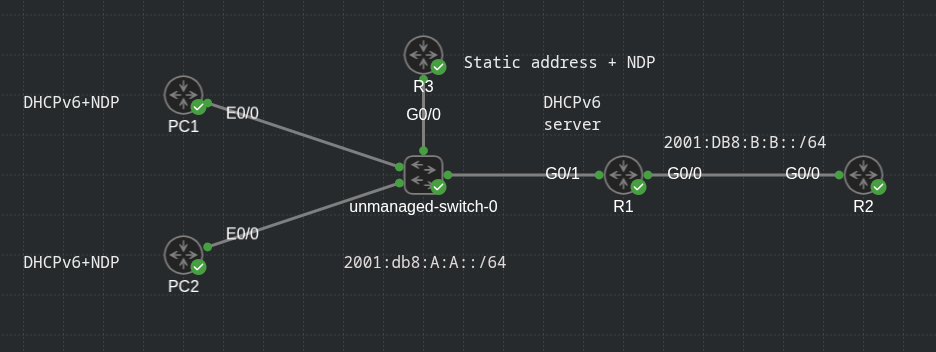
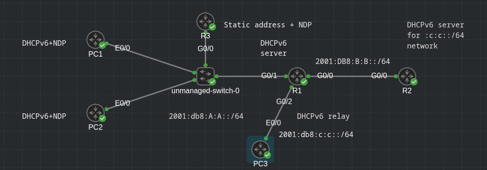

## DHCPv6 Operation

- DHCPv6 has a four-step negotiation process, like IPv4

- However, DHCPv6 uses the following messages:

    1. *SOLICIT message*: A client sends this message to locate DHCPv6 servers using the multicast address FF02::1:2, which is the all-DHCPv6-servers multicast address

    2. *ADVERTISE message*: Servers respond to SOLICIT messages with a unicast ADVERTISE message, offering addressing information to the client

    3. *REQUEST message*: The client sends this message to the server, confirming addresses provided and any other parameters

    4. *REPLY message*: The server finalizes the process with this message

- Below is a reference of DHCPv6 messages that can be encountered while troubleshooting an DHCPv6 issue:

```
DHCP message                    DESCRIPTION

SOLICIT                         A client sends this message in an attempt to locate a DHCPv6 server

ADVERTISE                       A DHCPv6 server sends this message in response to a SOLICIT to indicate that it is available

REQUEST                         A client sends this message to a specific DHCPv6 server to request IP configuration parameters

CONFIRM                         A client sends this message to a server to determine whether the address it was assigned is still appropriate

RENEW                           A client sends this message to the server that that assigned the address in order to extend the lifetime of the addresses assigned

REBIND                          Where there is no response to a RENEW, a client sends a REBIND message to a server to extend the lifetime of the address assigned

REPLY                           A server sends a client this message, which contains assigned address and configuration parameters, in response to a SOLICIT,
                                REQUEST, RENEW or REBIND message received from a client

RELEASE                         A client sends this message to a server to inform the server that the assigned address is no longer needed

DECLINE                         A client sends this message to a server to inform the server that the assigned address is already in use

RECONFIGURE                     A server sends this message to a client when the server has new or updated information

INFORMATION-REQUEST             A client sends this message to a server when the client needs only additional configuration information without any 
                                IP address assignment

RELAY-FORW                      A relay agent uses this server to forward messages to a DHCP server

RELAY-REPL                      A DHCP server uses this message to reply to the relay agent
```

- DHCPv6 server configuration - get the subnet and info from the dhcp server and get default gateway information from NDP

- Also suppress the clients from advertising default gateway information between each other (the only default gateway is on the router)

- Topology:



- Router DHCP pool configuration:

```
R1(config-if)#do sh run | s dhcp
ipv6 dhcp pool TEST
 address prefix 2001:DB8:A:A::/64 lifetime infinite infinite
 dns-server 2001:DB8:A:A::1
 domain-name test

 R1(config-if)#do sh run int g0/1           
Building configuration...

Current configuration : 257 bytes
!
interface GigabitEthernet0/1
 ip address 10.1.1.1 255.255.255.0
 duplex auto
 speed auto
 media-type rj45
 ipv6 address 2001:DB8:A:A::1/64
 ipv6 address autoconfig
 ipv6 nd autoconfig default-route ! notice default route in autoconfig
 ipv6 nd managed-config-flag ! use dhcpv6 to get information
 ipv6 dhcp server TEST ! use pool TEST on this interface
end
```

- Verifying IPv6 interface configuration:

```
R1(config-if)#do sh ipv6 int g0/1
GigabitEthernet0/1 is up, line protocol is up
  IPv6 is enabled, link-local address is FE80::5054:FF:FE78:529D 
  No Virtual link-local address(es):
  Stateless address autoconfig enabled
  Global unicast address(es):
    2001:DB8:A:A::1, subnet is 2001:DB8:A:A::/64 
    2001:DB8:A:A:5054:FF:FE78:529D, subnet is 2001:DB8:A:A::/64 [EUI/CAL/PRE]
      valid lifetime 2586263 preferred lifetime 599063
  Joined group address(es):
    FF02::1
    FF02::2
    FF02::1:2
    FF02::1:FF00:1
    FF02::1:FF78:529D
    FF05::1:3
  MTU is 1500 bytes
  ICMP error messages limited to one every 100 milliseconds
  ICMP redirects are enabled
  ICMP unreachables are sent
  ND DAD is enabled, number of DAD attempts: 1
  ND reachable time is 30000 milliseconds (using 30000)
  ND advertised reachable time is 0 (unspecified)
  ND advertised retransmit interval is 0 (unspecified)
  ND router advertisements are sent every 200 seconds
  ND router advertisements live for 1800 seconds
  ND advertised default router preference is Medium ! advertised default router
  Hosts use DHCP to obtain routable addresses. ! use dhcpv6
```

- Client configuration:

- PC1:

```
PC1(config-if)#do sh run int e0/0
Building configuration...

Current configuration : 167 bytes
!
interface Ethernet0/0
 no ip address
 ipv6 dhcp client request vendor
 ipv6 address dhcp
 ipv6 address autoconfig default
 ipv6 enable
 ipv6 nd ra suppress all ! suppress all nd generation from this client
end

```

- IPv6 routing table on the client (IOL):

```
PC1(config-if)#do sh ipv6 ro
IPv6 Routing Table - default - 5 entries
Codes: C - Connected, L - Local, S - Static, U - Per-user Static route
       B - BGP, R - RIP, H - NHRP, HG - NHRP registered
       Hg - NHRP registration summary, HE - NHRP External, I1 - ISIS L1
       I2 - ISIS L2, IA - ISIS interarea, IS - ISIS summary, D - EIGRP
       EX - EIGRP external, ND - ND Default, NDp - ND Prefix, DCE - Destination
       NDr - Redirect, RL - RPL, O - OSPF Intra, OI - OSPF Inter
       OE1 - OSPF ext 1, OE2 - OSPF ext 2, ON1 - OSPF NSSA ext 1
       ON2 - OSPF NSSA ext 2, la - LISP alt, lr - LISP site-registrations
       ld - LISP dyn-eid, lA - LISP away, le - LISP extranet-policy
       lp - LISP publications, ls - LISP destinations-summary, a - Application
       m - OMP
ND  ::/0 [2/0]
     via FE80::5054:FF:FE78:529D, Ethernet0/0
NDp 2001:DB8:A:A::/64 [2/0]
     via Ethernet0/0, directly connected
LC  2001:DB8:A:A:68BB:D541:6BA7:6395/128 [0/0]
     via Ethernet0/0, receive
L   2001:DB8:A:A:A8BB:CCFF:FE00:1600/128 [0/0]
     via Ethernet0/0, receive
L   FF00::/8 [0/0]
     via Null0, receive
```

- PC2:

```
PC2(config-if)#do sh run int e0/0
Building configuration...

Current configuration : 167 bytes
!
interface Ethernet0/0
 no ip address
 ipv6 dhcp client request vendor
 ipv6 address dhcp
 ipv6 address autoconfig default
 ipv6 enable
 ipv6 nd ra suppress all ! suppress all nd generation from this client
end
```

- PC2 IPv6 routing table:

```
PC2(config-if)#do sh ipv6 ro
IPv6 Routing Table - default - 5 entries
Codes: C - Connected, L - Local, S - Static, U - Per-user Static route
       B - BGP, R - RIP, H - NHRP, HG - NHRP registered
       Hg - NHRP registration summary, HE - NHRP External, I1 - ISIS L1
       I2 - ISIS L2, IA - ISIS interarea, IS - ISIS summary, D - EIGRP
       EX - EIGRP external, ND - ND Default, NDp - ND Prefix, DCE - Destination
       NDr - Redirect, RL - RPL, O - OSPF Intra, OI - OSPF Inter
       OE1 - OSPF ext 1, OE2 - OSPF ext 2, ON1 - OSPF NSSA ext 1
       ON2 - OSPF NSSA ext 2, la - LISP alt, lr - LISP site-registrations
       ld - LISP dyn-eid, lA - LISP away, le - LISP extranet-policy
       lp - LISP publications, ls - LISP destinations-summary, a - Application
       m - OMP
ND  ::/0 [2/0]
     via FE80::5054:FF:FE78:529D, Ethernet0/0
NDp 2001:DB8:A:A::/64 [2/0]
     via Ethernet0/0, directly connected
LC  2001:DB8:A:A:399C:71D0:28AA:C687/128 [0/0]
     via Ethernet0/0, receive
L   2001:DB8:A:A:A8BB:CCFF:FE00:2A00/128 [0/0]
     via Ethernet0/0, receive
L   FF00::/8 [0/0]
     via Null0, receive
```

#### DHCPv6 Relay Agents

- All the DHCPv6 examples until now have included the DHCP server within the same local subnet

- However, in most networks, the DHCP server is located in a different network, which creates an issue

- If you review the multicast address of the SOLICIT message, notice that it is a link-local multicast address. It starts with FF02

- Therefore, the multicast does not leave the local network, and the client is not able to reach the DHCPv6 server

- To relay the DHCPv6 messages to a DHCPv6 server in another network, the local router interface in the network the client belongs to, needs to be configured as DHCPv6 relay agent, using the following interface-configuration mode command:

```
conf t
 interface g0/1
  ipv6 dhcp relay destination 2001:db8:b:b::7
```

- The above command is used to forward SOLICIT messages to a DHCPv6 server at the address listed



- R1 G0/2 interface is acting as DHCP relay for 2001:db8:c:c::/64 network

- R2 is the DHCPv6 server for this network

- R1 (DHCP relay configuration):

```
R1(config-if)#do sh run int g0/2
Building configuration...

Current configuration : 275 bytes
!
interface GigabitEthernet0/2
 no ip address
 duplex auto
 speed auto
 media-type rj45
 ipv6 address 2001:DB8:C:C::1/64
 ipv6 address autoconfig
 ipv6 nd autoconfig default-route
 ipv6 nd managed-config-flag
 ipv6 dhcp relay destination  2001:DB8:B:B:5054:FF:FE6E:87FD
end
```

```
R1(config-if)#do sh ipv6 int g0/2
GigabitEthernet0/2 is up, line protocol is up
  IPv6 is enabled, link-local address is FE80::5054:FF:FE6A:25EC 
  No Virtual link-local address(es):
  Stateless address autoconfig enabled
  Global unicast address(es):
    2001:DB8:C:C::1, subnet is 2001:DB8:C:C::/64 
  Joined group address(es):
    FF02::1
    FF02::2
    FF02::1:2
    FF02::1:FF00:1
    FF02::1:FF6A:25EC
  MTU is 1500 bytes
  ICMP error messages limited to one every 100 milliseconds
  ICMP redirects are enabled
  ICMP unreachables are sent
  ND DAD is enabled, number of DAD attempts: 1
  ND reachable time is 30000 milliseconds (using 30000)
  ND advertised reachable time is 0 (unspecified)
  ND advertised retransmit interval is 0 (unspecified)
  ND router advertisements are sent every 200 seconds
  ND router advertisements live for 1800 seconds
  ND advertised default router preference is Medium
  Hosts use DHCP to obtain routable addresses.
```

- R2 - DHCPv6 server config:

```
R2#sh run | s dhcp
ipv6 dhcp pool LAN2
 address prefix 2001:DB8:C:C::/64 lifetime infinite infinite
 dns-server 2001:DB8:B:B::1
 domain-name test2

R2#sh run int g0/0
Building configuration...

Current configuration : 222 bytes
!
interface GigabitEthernet0/0
 ip address 10.2.2.2 255.255.255.0
 duplex auto
 speed auto
 media-type rj45
 ipv6 address 2001:DB8:B:B::/64 eui-64
 ipv6 enable
 ipv6 nd autoconfig default-route
 ipv6 dhcp server LAN2
end
```

- PC3 - client in this network - interface config:

```
PC3(config-if)#do sh run int e0/0
Building configuration...

Current configuration : 134 bytes
!
interface Ethernet0/0
 no ip address
 ipv6 address dhcp
 ipv6 address autoconfig default
 ipv6 enable
 ipv6 nd ra suppress all
end
```

- IPv6 interface information

```
PC3(config-if)#do sh ipv6 int e0/0
Ethernet0/0 is up, line protocol is up
  IPv6 is enabled, link-local address is FE80::A8BB:CCFF:FE00:2B00 
  No Virtual link-local address(es):
  Stateless address autoconfig enabled
  Global unicast address(es):
    2001:DB8:C:C:68F5:718B:35DB:2840, subnet is 2001:DB8:C:C:68F5:718B:35DB:2840/128 
    2001:DB8:C:C:A8BB:CCFF:FE00:2B00, subnet is 2001:DB8:C:C::/64 [EUI/CAL/PRE]
      valid lifetime 2591994 preferred lifetime 604794
  Joined group address(es):
    FF02::1
    FF02::2
    FF02::1:FF00:2B00
    FF02::1:FFDB:2840
  MTU is 1500 bytes
  ICMP error messages limited to one every 100 milliseconds
  ICMP redirects are enabled
  ICMP unreachables are sent
  ND DAD is enabled, number of DAD attempts: 1
  ND reachable time is 30000 milliseconds (using 30000)
  ND RAs are suppressed (all)
  Hosts use stateless autoconfig for addresses.
```

- IPv6 routing table

```
PC3(config-if)#do sh ipv6 ro
IPv6 Routing Table - default - 5 entries
Codes: C - Connected, L - Local, S - Static, U - Per-user Static route
       B - BGP, R - RIP, H - NHRP, HG - NHRP registered
       Hg - NHRP registration summary, HE - NHRP External, I1 - ISIS L1
       I2 - ISIS L2, IA - ISIS interarea, IS - ISIS summary, D - EIGRP
       EX - EIGRP external, ND - ND Default, NDp - ND Prefix, DCE - Destination
       NDr - Redirect, RL - RPL, O - OSPF Intra, OI - OSPF Inter
       OE1 - OSPF ext 1, OE2 - OSPF ext 2, ON1 - OSPF NSSA ext 1
       ON2 - OSPF NSSA ext 2, la - LISP alt, lr - LISP site-registrations
       ld - LISP dyn-eid, lA - LISP away, le - LISP extranet-policy
       lp - LISP publications, ls - LISP destinations-summary, a - Application
       m - OMP
ND  ::/0 [2/0]
     via FE80::5054:FF:FE6A:25EC, Ethernet0/0
NDp 2001:DB8:C:C::/64 [2/0]
     via Ethernet0/0, directly connected
LC  2001:DB8:C:C:68F5:718B:35DB:2840/128 [0/0]
     via Ethernet0/0, receive
L   2001:DB8:C:C:A8BB:CCFF:FE00:2B00/128 [0/0]
     via Ethernet0/0, receive
L   FF00::/8 [0/0]
     via Null0, receive
```
