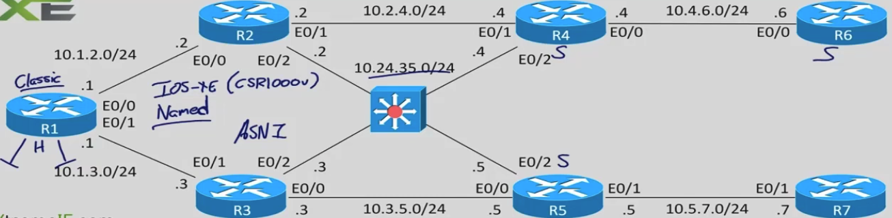
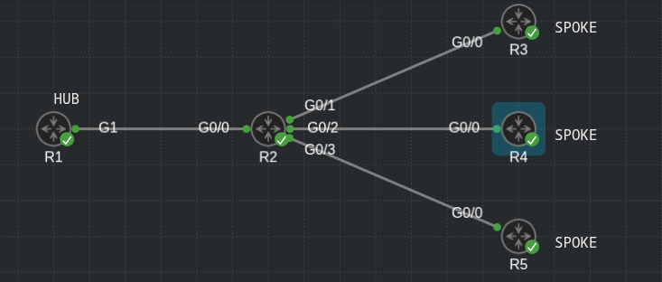

## DMVPN config - Hub side - tunnel interface

- Topology:



- Hub router - interface config

```
conf t
 interface tunnel 1
  ip address 172.16.1.1 255.255.255.0
  no ip redirects
  ip nhrp map multicast 4.4.4.4
  ip nhrp map multicast 5.5.5.5
  ip nhrp map multicast 6.6.6.6
  ip nhrp network-id 1
  ip nhrp redirect
  tunnel source loopback 0
  tunnel mode gre multipoint
```

- Disable split horizon for EIGRP - classic mode

```
conf t
 interface tunnel 1
  no ip split-horizon eigrp 65001
  no ip next-hop-self eigrp 65001
```

- EIGRP classic config:

```
conf t
 router eigrp 65001
  network 172.16.1.1 0.0.0.0
```

- Upgrade from classic eigrp to named eigrp mode:

```
conf t
 router eigrp 65001
  eigrp upgrade-cli DMVPN
```

- on R4 - enable EIGRP for LAN segment - 10.24.35.0/24

```
conf t
 router eigrp 65001
  network 10.24.35.0 0.0.0.255
```

- on R5 - do the same thing

```
conf t
 router eigrp 65001
  network 10.24.35.0 0.0.0.255
```

- Now R1 sees an ECMP path towards the 10.24.35.0/24 network

- On R6 only has one path to the 10.24.35.0/24 network

- Configuring addpath on R1:

```
conf t
 router eigrp DMVPN
  address-family ipv4 autonomous-system 65001
   af-interface tunnel 1
    add-paths 2
```

- Not recommended to use the variance command in configuration with add-paths because can cause problems with metrics

- Now we have 2 paths to 10.24.35.0/24 network also on R6

### Configure DMVPN single HUB - only the GRE tunnels

- CML topology:



- OSPF is used as the underlying routing protocol

- EIGRP is used for tunnel interfaces

- R1:

```
R1#sh run int g1
Building configuration...

Current configuration : 106 bytes
!
interface GigabitEthernet1
 ip address 10.1.12.1 255.255.255.0
 ip ospf 1 area 0
 negotiation auto
end

R1#sh run int l0
Building configuration...

Current configuration : 81 bytes
!
interface Loopback0
 ip address 1.1.1.1 255.255.255.255
 ip ospf 1 area 0
end

R1#sh run int l1
Building configuration...

Current configuration : 67 bytes
!
interface Loopback1
 ip address 192.168.1.1 255.255.255.255
end

R1#sh run int l2
Building configuration...

Current configuration : 67 bytes
!
interface Loopback2
 ip address 192.168.1.2 255.255.255.255
end

R1#sh run int l3
Building configuration...

Current configuration : 67 bytes
!
interface Loopback3
 ip address 192.168.1.3 255.255.255.255
end

R1#sh run | s router ospf
router ospf 1
 router-id 1.1.1.1
 passive-interface Loopback0

R1#sh run | s router eigrp
router eigrp 65001
 network 172.16.1.1 0.0.0.0
 network 192.168.1.0

interface Tunnel1
 ip address 172.16.1.1 255.255.255.0
 no ip redirects
 ip mtu 1400
 no ip next-hop-self eigrp 65001
 no ip split-horizon eigrp 65001
 ip nhrp authentication cisco
 ip nhrp network-id 1
 ip tcp adjust-mss 1360
 tunnel source Loopback0
 tunnel mode gre multipoint
 tunnel key 123
end
```

- R2 - just OSPF - ISP router

```
R2#sh run int g0/0
Building configuration...

Current configuration : 132 bytes
!
interface GigabitEthernet0/0
 ip address 10.1.12.2 255.255.255.0
 ip ospf 1 area 0
 duplex auto
 speed auto
 media-type rj45
end

R2#sh run int g0/1
Building configuration...

Current configuration : 132 bytes
!
interface GigabitEthernet0/1
 ip address 10.2.23.2 255.255.255.0
 ip ospf 1 area 0
 duplex auto
 speed auto
 media-type rj45
end

R2#sh run int g0/2
Building configuration...

Current configuration : 132 bytes
!
interface GigabitEthernet0/2
 ip address 10.2.24.2 255.255.255.0
 ip ospf 1 area 0
 duplex auto
 speed auto
 media-type rj45
end

R2#sh run int g0/3
Building configuration...

Current configuration : 132 bytes
!
interface GigabitEthernet0/3
 ip address 10.2.25.2 255.255.255.0
 ip ospf 1 area 0
 duplex auto
 speed auto
 media-type rj45
end

R2#sh run int l0  
Building configuration...

Current configuration : 81 bytes
!
interface Loopback0
 ip address 2.2.2.2 255.255.255.255
 ip ospf 1 area 0
end

R2#sh run | s router ospf
router ospf 1
 router-id 2.2.2.2
 passive-interface Loopback0

```

- R3 - Spoke configuration:

```
R3#sh run int g0/0
Building configuration...

Current configuration : 132 bytes
!
interface GigabitEthernet0/0
 ip address 10.2.23.3 255.255.255.0
 ip ospf 1 area 0
 duplex auto
 speed auto
 media-type rj45
end

R3#sh run int l0  
Building configuration...

Current configuration : 81 bytes
!
interface Loopback0
 ip address 3.3.3.3 255.255.255.255
 ip ospf 1 area 0
end

R3#sh run int l1
Building configuration...

Current configuration : 67 bytes
!
interface Loopback1
 ip address 192.168.3.1 255.255.255.255
end

R3#sh run int l2
Building configuration...

Current configuration : 67 bytes
!
interface Loopback2
 ip address 192.168.3.2 255.255.255.255
end

R3#sh run int l3
Building configuration...

Current configuration : 67 bytes
!
interface Loopback3
 ip address 192.168.3.3 255.255.255.255
end

R3#sh run | s router ospf
router ospf 1
 router-id 3.3.3.3
 passive-interface Loopback0

R3#sh run | s router eigrp
router eigrp 65001
 network 172.16.1.3 0.0.0.0
 network 192.168.3.0

R3#sh run int tunn 1
Building configuration...

Current configuration : 324 bytes
!
interface Tunnel1
 ip address 172.16.1.3 255.255.255.0
 no ip redirects
 ip mtu 1400
 ip nhrp authentication cisco
 ip nhrp map multicast 1.1.1.1
 ip nhrp map 172.16.1.1 1.1.1.1
 ip nhrp network-id 1
 ip nhrp nhs 172.16.1.1
 ip tcp adjust-mss 1360
 tunnel source Loopback0
 tunnel mode gre multipoint
 tunnel key 123
end

```

- R4 - spoke 2 config:

```
R4#sh run int g0/0
Building configuration...

Current configuration : 132 bytes
!
interface GigabitEthernet0/0
 ip address 10.2.24.4 255.255.255.0
 ip ospf 1 area 0
 duplex auto
 speed auto
 media-type rj45
end

R4#sh run int l0  
Building configuration...

Current configuration : 81 bytes
!
interface Loopback0
 ip address 4.4.4.4 255.255.255.255
 ip ospf 1 area 0
end

R4#sh run int l1
Building configuration...

Current configuration : 67 bytes
!
interface Loopback1
 ip address 192.168.4.1 255.255.255.255
end

R4#sh run int l2
Building configuration...

Current configuration : 67 bytes
!
interface Loopback2
 ip address 192.168.4.2 255.255.255.255
end

R4#sh run int l3
Building configuration...

Current configuration : 67 bytes
!
interface Loopback3
 ip address 192.168.4.3 255.255.255.255
end

R4#sh run | s router ospf
router ospf 1
 router-id 4.4.4.4
 passive-interface Loopback0

R4#sh run | s router eigrp
router eigrp 65001
 network 172.16.1.4 0.0.0.0
 network 192.168.4.0

R4#sh run int tunn 1
Building configuration...

Current configuration : 324 bytes
!
interface Tunnel1
 ip address 172.16.1.4 255.255.255.0
 no ip redirects
 ip mtu 1400
 ip nhrp authentication cisco
 ip nhrp map multicast 1.1.1.1
 ip nhrp map 172.16.1.1 1.1.1.1
 ip nhrp network-id 1
 ip nhrp nhs 172.16.1.1
 ip tcp adjust-mss 1360
 tunnel source Loopback0
 tunnel mode gre multipoint
 tunnel key 123
end
```

- R5 - spoke 3 configuration

```
R5#sh run int g0/0
Building configuration...

Current configuration : 132 bytes
!
interface GigabitEthernet0/0
 ip address 10.2.25.5 255.255.255.0
 ip ospf 1 area 0
 duplex auto
 speed auto
 media-type rj45
end

R5#sh run int l0  
Building configuration...

Current configuration : 81 bytes
!
interface Loopback0
 ip address 5.5.5.5 255.255.255.255
 ip ospf 1 area 0
end

R5#sh run int l1
Building configuration...

Current configuration : 67 bytes
!
interface Loopback1
 ip address 192.168.5.1 255.255.255.255
end

R5#sh run int l1
Building configuration...

Current configuration : 67 bytes
!
interface Loopback1
 ip address 192.168.5.1 255.255.255.255
end

R5#sh run int l2
Building configuration...

Current configuration : 67 bytes
!
interface Loopback2
 ip address 192.168.5.2 255.255.255.255
end

R5#sh run int l3
Building configuration...

Current configuration : 67 bytes
!
interface Loopback3
 ip address 192.168.5.3 255.255.255.255
end

R5#sh run | s router ospf
router ospf 1
 router-id 5.5.5.5
 passive-interface Loopback0

R5#sh run | s router eigrp
router eigrp 65001
 network 172.16.1.5 0.0.0.0
 network 192.168.5.0

R5#sh run int tunn 1
Building configuration...

Current configuration : 324 bytes
!
interface Tunnel1
 ip address 172.16.1.5 255.255.255.0
 no ip redirects
 ip mtu 1400
 ip nhrp authentication cisco
 ip nhrp map multicast 1.1.1.1
 ip nhrp map 172.16.1.1 1.1.1.1
 ip nhrp network-id 1
 ip nhrp nhs 172.16.1.1
 ip tcp adjust-mss 1360
 tunnel source Loopback0
 tunnel mode gre multipoint
 tunnel key 123
end
```

```
R3#show dmvpn 
Legend: Attrb --> S - Static, D - Dynamic, I - Incomplete
        N - NATed, L - Local, X - No Socket
        T1 - Route Installed, T2 - Nexthop-override
        C - CTS Capable, I2 - Temporary
        # Ent --> Number of NHRP entries with same NBMA peer
        NHS Status: E --> Expecting Replies, R --> Responding, W --> Waiting
        UpDn Time --> Up or Down Time for a Tunnel
==========================================================================

Interface: Tunnel1, IPv4 NHRP Details 
Type:Spoke, NHRP Peers:1, 

 # Ent  Peer NBMA Addr Peer Tunnel Add State  UpDn Tm Attrb
 ----- --------------- --------------- ----- -------- -----
     1 1.1.1.1              172.16.1.1    UP 00:32:26     S

```

```
R4#show dmvpn 
Legend: Attrb --> S - Static, D - Dynamic, I - Incomplete
        N - NATed, L - Local, X - No Socket
        T1 - Route Installed, T2 - Nexthop-override
        C - CTS Capable, I2 - Temporary
        # Ent --> Number of NHRP entries with same NBMA peer
        NHS Status: E --> Expecting Replies, R --> Responding, W --> Waiting
        UpDn Time --> Up or Down Time for a Tunnel
==========================================================================

Interface: Tunnel1, IPv4 NHRP Details 
Type:Spoke, NHRP Peers:1, 

 # Ent  Peer NBMA Addr Peer Tunnel Add State  UpDn Tm Attrb
 ----- --------------- --------------- ----- -------- -----
     1 1.1.1.1              172.16.1.1    UP 00:30:35     S

```

```
R3#show ip nhrp 
172.16.1.1/32 via 172.16.1.1
   Tunnel1 created 00:34:22, never expire 
   Type: static, Flags: used 
   NBMA address: 1.1.1.1 
```

```
R5#traceroute 192.168.3.3 source l2
Type escape sequence to abort.
Tracing the route to 192.168.3.3
VRF info: (vrf in name/id, vrf out name/id)
  1 172.16.1.1 0 msec
    172.16.1.3 1 msec 1 msec

R5#show ip nhrp 
172.16.1.1/32 via 172.16.1.1
   Tunnel1 created 00:32:54, never expire 
   Type: static, Flags: used 
   NBMA address: 1.1.1.1 
172.16.1.3/32 via 172.16.1.3
   Tunnel1 created 00:00:30, expire 00:09:29
   Type: dynamic, Flags: router used nhop 
   NBMA address: 3.3.3.3

```

```
R3#show ip nhrp 
172.16.1.1/32 via 172.16.1.1
   Tunnel1 created 00:38:58, never expire 
   Type: static, Flags: used 
   NBMA address: 1.1.1.1 
172.16.1.3/32 via 172.16.1.3
   Tunnel1 created 00:01:42, expire 00:08:17
   Type: dynamic, Flags: router unique local 
   NBMA address: 3.3.3.3 
    (no-socket) 
172.16.1.5/32 via 172.16.1.5
   Tunnel1 created 00:01:42, expire 00:08:17
   Type: dynamic, Flags: router implicit used nhop 
   NBMA address: 5.5.5.5 
```
