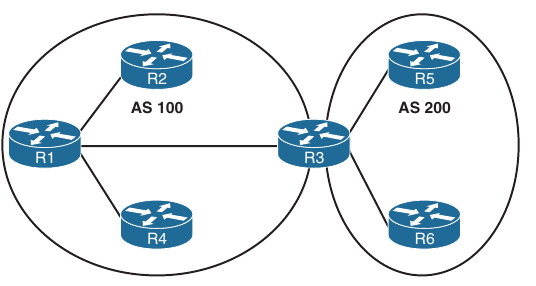
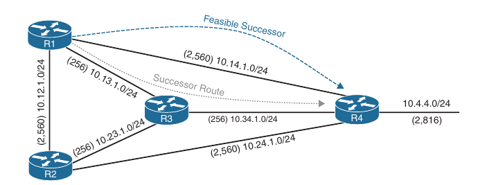
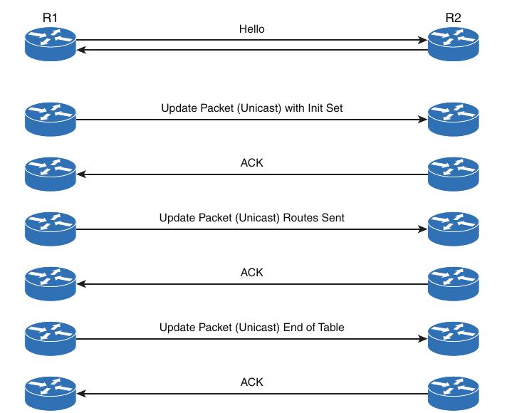
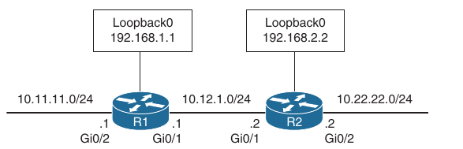
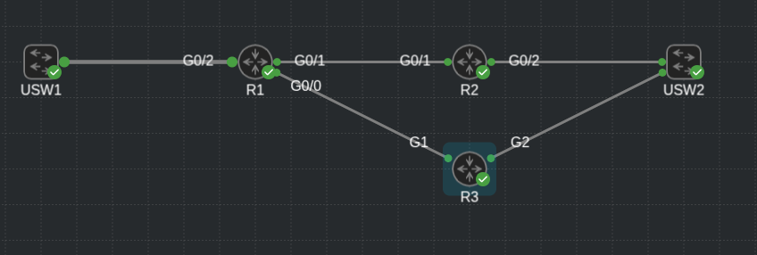

## EIGRP ENARSI

- EIGRP Fundamentals

- EIGRP Configuration Modes

- Path Metric Calculation

- *Enhanced Interior Gateway Routing Protocol (EIGRP)* is an enhanced distance vector routing protocol commonly found in enterprise networks

- EIGRP is a derivative of Interior Gateway Routing Protocol (IGRP) but includes support for variable length subnet masking (VLSM) and metrics capable of supporting higher speed interfaces

- Initially, EIGRP was a Cisco proprietary protocol, but it was released to the Internet Engineering Task Force (IETF) through RFC 7868, which was ratified in May 2016

- Here we will see the underlying mechanics of the EIGRP routing protocol and the path metric calculations, and it demonstrates how to configure EIGRP on a router

- Following chapters:

    - Advanced EIGRP

    - Troubleshooting EIGRP for IPv4

    - EIGRPv6

### EIGRP Fundamentals

- EIGRP overcomes the deficiencies of other distance vector routing protocols, such as Routing Information Protocol (RIP), with features such as unequal-cost load balancing, support for networks 255 hops away, and rapid convergence features

- EIGRP uses a *diffusing update algorithm* (DUAL) to identify network paths and provides for fast convergence using precalculated loop-free backup paths

- Most distance vector routing protocols use hop count as the metric for routing decisions

- However, a route selection algorithm that uses only hop count for path selection does not take into account link speed and total delay

- EIGRP adds logic to the route-selection algorithm to use factors other than hop count alone

#### Autonomous Systems

- A router can run multiple EIGRP processes

- Each process operates under the context of an autonomous system, which represents a common routing domain

- Routers within the same domain use the same metric calculation formula and exchange routes only with members of the same *autonomous system* (AS)

- Do not confuse an EIGRP Autonomous System with a Border Gateway Protocol (BGP) autonomous system

- Below, EIGRP AS 100 consists of R1, R2, R3 and R4 and EIGRP AS 200 consists of R3, R5 and R6

- Each EIGRP process correlates to a specific autonomous system and maintains an independent topology table

- R1 does not have knowledge of routes from AS 200 because it is different from it's own autonomous system, AS 100

```
R1(config)#do sh ip ro eigrp | b Gate
Gateway of last resort is not set

      2.0.0.0/32 is subnetted, 1 subnets
D        2.2.2.2 [90/130816] via 10.1.12.2, 00:09:31, GigabitEthernet0/0
      3.0.0.0/32 is subnetted, 1 subnets
D        3.3.3.3 [90/130816] via 10.1.13.2, 00:07:46, GigabitEthernet0/1
      4.0.0.0/32 is subnetted, 1 subnets
D        4.4.4.4 [90/130816] via 10.1.14.2, 00:04:40, GigabitEthernet0/2
```

- R3 is able to participate in both autonomous systems and, by default, does not transfer routes learned from one autonomous system into a different autonomous system



- EIGRP uses *protocol dependent modules (PDMs)* to support multiple network protocols, such as IPv4, IPv6, AppleTalk and IPX

- EIGRP is written so that the PDM is responsible for the functions to handle the route selection criteria for each communication protocol

- In theory, new PDMs can be written as new communication protocols are created

- Current implementations of EIGRP support only IPv4 and IPv6

##### EIGRP Terminology

- Some of the core concepts of EIGRP, along with the path selection process

- Below is a reference topology, showing R1 calculating the best path and alternative loop-free paths to the 10.4.4.0/24 network

- A value in parantheses represents the link's calculated metric 



- Important terms related to EIGRP

```
Term                                        Definition

Successor route                             The route with the lowest path metric to reach a destination.
                                            The successor route for R4 to reach 10.4.4.0/24 network is R1-> R3 -> R4

Successor                                   The first next-hop router for the successor route.
                                            R1's successor for 10.4.4.0/24 is R3

Feasible distance (FD)                      The metric value for the lowest path metric to reach a destination.
                                            The feasible distance is calculated locally using the formula shown later.
                                            The FD calculated by R1 for the 10.4.4.0/24 destination network is 3328
                                            (that is, 256 + 256 + 2816)

Reported distance (RD)                      Distance reported by a router to reach a destination. The reported distance value
                                            is the feasible distance for the advertising router.
                                            R3 advertises the 10.4.4.0/24 destination network to R1 and R2 with an RD of 3072.
                                            R4 advertises the 10.4.4.0/24 destination netwotk to R1, R2 and R3 with an RD of 2816

Feasibility condition                       For a route to be considered a backup route, the RD received for that route must be less 
                                            than the FD calculated locally (for the primary route). This logic guarantees a
                                            loop-free path
                                        
Feasible successor                          A route that satisfies the feasibility condition is maintained as a backup route.
                                            The feasibility condition ensures that the backup route is loop-free.
                                            The route R1 -> R4 is the feasible successor because the RD of 2816 is lower than the FD of 3318 for the
                                            R1 -> R3 -> R4 path 
```

#### Topology Table

- EIGRP contains a *topology table*, which makes it different from a true distance vector routing protocol

- EIGRP's topology table is a vital component of DUAL and contains information to identify loop-free backup routes

- The topology table contains all the network prefixes advertised within an EIGRP autonomous system

- Each entry in the table contains the following:

    - Network prefix

    - EIGRP neighbors that have advertised that prefix

    - Metrics for each neighbor (reported distance and hop count)

    - Values used for calculating the metric (load, reliability, total delay, and minimum bandwidth)

- The following command provides the topology table

```
show ip eigrp topology [all-links]
```

- By default, only the successor and feasible successor routes are displayed, but the optional **all-links** keyword shows the paths that did not pass the feasibility condition

- Below is shown the topology table for R1 from our topology

- We will focus on the 10.4.4.0/24 network when explaining the topology table

```
R1#show ip eigrp topology all-links 
EIGRP-IPv4 Topology Table for AS(100)/ID(192.168.1.1)
Codes: P - Passive, A - Active, U - Update, Q - Query, R - Reply,
       r - reply Status, s - sia Status 

P 10.34.1.0/24, 1 successors, FD is 3072, serno 41
        via 10.13.1.3 (3072/2816), GigabitEthernet0/0
        via 10.14.1.4 (28416/2816), GigabitEthernet0/2
        via 10.12.1.2 (28672/3072), GigabitEthernet0/1
P 192.168.4.4/32, 1 successors, FD is 131072, serno 47
        via 10.13.1.3 (131072/130816), GigabitEthernet0/0
        via 10.14.1.4 (156160/128256), GigabitEthernet0/2
        via 10.12.1.2 (156672/131072), GigabitEthernet0/1
P 10.12.1.0/24, 1 successors, FD is 28160, serno 53
        via Connected, GigabitEthernet0/1
P 10.24.1.0/24, 1 successors, FD is 28672, serno 54
        via 10.13.1.3 (28672/28416), GigabitEthernet0/0, serno 23
        via 10.12.1.2 (53760/28160), GigabitEthernet0/1
        via 10.14.1.4 (53760/28160), GigabitEthernet0/2
P 192.168.1.1/32, 1 successors, FD is 128256, serno 4
        via Connected, Loopback0
P 10.4.4.0/24, 1 successors, FD is 131072, serno 48 (feasible distance)
        via 10.13.1.3 (131072/130816), GigabitEthernet0/0  - Successor route
        via 10.14.1.4 (156160/128256), GigabitEthernet0/2  - Feasible successor - passes feasibility condition
        via 10.12.1.2 (156672/131072), GigabitEthernet0/1
                      -> Path metric
                              -> Reported distance  
P 192.168.3.3/32, 1 successors, FD is 130816, serno 10
        via 10.13.1.3 (130816/128256), GigabitEthernet0/0
        via 10.14.1.4 (156416/130816), GigabitEthernet0/2
        via 10.12.1.2 (156416/130816), GigabitEthernet0/1
P 10.14.1.0/24, 1 successors, FD is 28160, serno 45
        via Connected, GigabitEthernet0/2
P 192.168.2.2/32, 1 successors, FD is 131072, serno 55
        via 10.13.1.3 (131072/130816), GigabitEthernet0/0
        via 10.12.1.2 (156160/128256), GigabitEthernet0/1
        via 10.14.1.4 (156672/131072), GigabitEthernet0/2, serno 21
P 10.13.1.0/24, 1 successors, FD is 2816, serno 1
        via Connected, GigabitEthernet0/0
        via 10.12.1.2 (28672/3072), GigabitEthernet0/1
        via 10.14.1.4 (28672/3072), GigabitEthernet0/2
P 10.23.1.0/24, 1 successors, FD is 3072, serno 52
        via 10.13.1.3 (3072/2816), GigabitEthernet0/0
        via 10.12.1.2 (28416/2816), GigabitEthernet0/1
        via 10.14.1.4 (28672/3072), GigabitEthernet0/2

```

- Below we can see that R1 calculates a FD of 131072 for the successor route

- The successor (upstream router) advertises the successor route with an RD of 130816

- The second path entry has a metric of 156160 and has an RD of 128256

- Because 128256 is less than 130816, the second entry passes the feasibility condition, which means the second entry is classified as a feasible successor for the 10.4.4.0/24 prefix

- The 10.4.4.0 route is passive (P), which means the topology is stable

- During a topology change, routes go into an active (A) state when computing a new path

#### EIGRP Neighbors

- Unlike a number of routing protocols - such as Routing Information Protocol (RIP), Open Shortest Path First (OSPF), and Intermediate-system-to-Intermediate-system (IS-IS) - EIGRP does not rely on periodic advertisement of all the network prefixes in an autonomous system

- EIGRP neighbors exchange the entire routing table when forming an adjacency, and they advertise incremental updates only as topology changes occur within a network

- The neighbor adjacency table is vital for tracking neighbor status and the updates sent to each neighbor

##### Inter-Router Communication

- EIGRP uses 5 different packet types to communicate with other routers, as shown below

- EIGRP uses IP protocol number (88) and uses multicast packets where possible; it uses unicast packets when necessary

- Communication between routers is made with multicast using the group address 224.0.0.10 or the MAC address 01:00:5e:00:00:0a when possible

- EIGRP packet types

```
Opcode value                    Packet type                         Function

1                               Update                              Used to transmit routing and reachability information
                                                                    with other EIGRP neighbors

2                               Request                             Used to get specific information from one or more neighbors

3                               Query                               Sent out to search for another path during convergence

4                               Reply                               Sent in response to a query packet

5                               Hello                               Used for discovery of EIGRP neighbors and for detecting when a 
                                                                    neighbor is no longer available
```

- EIGRP uses multicast packets to reduce bandwidth consumed per link; that is, it uses one packet to reach multiple devices

- While broadcast packets are used in the same general way, all nodes on a network segment process broadcast packets, whereas with multicast, only nodes listening for the particular multicast group process the multicast packets

- EIGRP uses *Reliable Transport Protocol (RTP)* to ensure that packets are delivered in order and to ensure that routers receive specific packets

- A sequence number is included in each EIGRP packet

- The sequence value zero do not require a response from the receiving EIGRP router; all other values require an ACK packet that includes the original sequence number

- Ensuring the packets are received makes the transport method reliable

- All update, query and reply packets are deemed reliable, and hello and ACK packets do not require acknowledgement and could be unreliable

- If the originating router does not receive an ACK packet from the neighbor before the retransmit timeout expires, it notifies the non-acknowledging router to stop processing the multicast packets

- The originating router sends all traffic by unicast until the neighbor is fully synchronized

- Upon complete synchronization, the originating router notifies the destination router to start processing multicast packets again

- All unicast packets require acknowledgement

- EIGRP retries up to 16 times for each packet that requires confirmation, and it resets the neighbor relationship when the neighbor reaches the retry limit of 16

- NOTE: In the context of EIGRP, do not confuse RTP with the Real-Time Transport Protocol (RTP), which is used for carrying audio or video over an IP network

- EIGRP's RTP allows for confirmation of packets while supporting multicast

- Other protocols that require reliable connection-oriented communication, such as TCP, cannot use multicast addressing

##### Forming EIGRP Neighbors

- Unlike other distance vector routing protocols, EIGRP requires a neighbor relationship to form before routes are processed and and added to the Routing Information Base (RIB)

- Upon hearing an EIGRP hello packet, a router attempts to become the neighbor of the other router

- The following parameters must match for the two routers to become neighbors:

    - Metric formula K values

    - Primary subnet matches

    - Autonomous system number (ASN) matches

    - Authentication matches

- Below is shown the process EIGRP uses for forming neighbor adjacencies



1. R1 and R2 send hello to each other

2. R1 sends Update packet (Unicast), with Init Set

3. R2 replies with ACK

4. R1 sends Update packet (Unicast), Routes sent

5. R2 replies with ACK

6. R1 sends Update packet (Unicast), End of table

7. R2 replies with ACK

### EIGRP Configuration Modes

- There are two methods for EIGRP configuration: classic mode and named mode

#### Classic Configuration Mode

- With Classic EIGRP Configuration mode, most of the configuration takes place in the EIGRP process, but some settings are configured under the interface configuration submode

- This can add complexity for deployment and troubleshooting as users must scroll back and forth between the EIGRP process and individual network interfaces

- Some of the settings that are set individually are hello advertisement interval, split-horizon, authentication, and summary-route advertisements

- Classic configuration requires the initialization of the routing process with the global configuration command:

```
conf t
 router eigrp <as-number>
```

- This is used to identify the ASN and initialize the EIGRP process

- The second step is to identify the network interfaces with the following command:

```
conf t
 router eigrp <as-number>
  network <ip-address> <wildcard-mask>
```

- The network command is explained later

#### EIGRP Named Mode

- EIGRP named mode configuration was released to overcome some of the dificulties network engineers have with classic EIGRP autonomous system configuration, including scattered configurations and unclear scope of commands

- EIGRP named configuration provides the following benefits:

    - All the EIGRP configuration occurs in one location

    - It supports current EIGRP features and future developments

    - It supports multiple address families (including virtual routing and forwarding [VRF] instances)

    - EIGRP named configuration is also known as multi-address family configuration mode

    - Commands are clear in terms of the scope of their configuration

- EIGRP named mode provides a hierarchical configuration and stores settings in three subsections:

    - **Address family**: This submode contains settings that are relevant to the global EIGRP AS operations, such as selection of network interfaces, EIGRP K values, and stub settings

    - **Interface**: This submode contains settings that are relevant to the interface, such as hello advertisement interval, split-horizon, authentication, and summary route advertisements

    - In actuality, there are two methods of EIGRP interface section's configuration

    - Commands can be assigned to a specific interface or to a `default` interface, in which case those settings are placed on all EIGRP-enabled interfaces

    - If there is a conflict between the default interface and a specific interface, the specific interface takes priority over the default interface

    - **Topology**: This submode contains settings regarding the EIGRP topology database and how routes are presented to the router's RIB

    - This section also contains route redistribution and administrative distance settings

- EIGRP named configuration makes it possible to run multiple instances under the same EIGRP process

- The process for enabling EIGRP interfaces on a specific instance is as follows:

1. Initialize the EIGRP process by using the following command:

```
conf t
 router eigrp <process-name>
```

- If a number is used for process-name, the number does not correlate to the autonomous system number

2. Initialize the EIGRP instance for the appropriate address family with the command:

```
conf t
 router eigrp <process-name>
  address-family <IPv4|IPv6> <unicast | vrf name> autonomous-system <as-number>
```

3. Enable EIGRP on interfaces using the `network` command

```
conf t
 router eigrp <process-name>
  address-family <IPv4|IPv6> <unicast | vrf name> autonomous-system <as-number>
   network <network> <wildcard-mask>
```

#### EIGRP Network Statement

- Both configuration modes use a `network` statement to identify the interfaces that EIGRP will use

- The `network` statement use a wildcard mask, which allows the configuration to be as specific or as ambiguous as necessary

- The two styles of EIGRP configuration are independent

- Using the configuration options for classic EIGRP autonomous system configuration does not modify settings on a router running EIGRP named configuration

- The syntax for the `network` statement, which exists under the EIGRP process, is:

```
conf t
 router eigrp <as-number>
  network <ip-address> [wildcard-mask]
```

- The optional wildcard-mask can be omitted to enable interfaces that fail within the classful boundaries for that `network` statement

- A common misconception is that the `network` statements adds prefixes to the EIGRP topology table

- In reality, the `network` statement identifies the interface to enable EIGRP on, and it adds the interface's connected network to the EIGRP topology table

- EIGRP then advertises the topology table to other routers in the EIGRP autonomous system

- EIGRP does not add an interface's secondary connected network to the topology table

- For secondary connected networks to be installed in the EIGRP routing table, they must be redistributed into the EIGRP process

- To help illustrate the concept of wildcard mask, below is provided a set of IP addresses and interfaces for a router

- The examples that follow provide configurations to match specific scenarios

```
Router Interface                                                IP address

Gigabit Ethernet 0/0                                            10.0.0.10/24

Gigabit Ethernet 0/1                                            10.0.10.10/24

Gigabit Ethernet 0/2                                            192.0.0.10/24

Gigabit Ethernet 0/3                                            192.10.0.10/24
```

- The configuration from below example enables EIGRP only on interfaces that explicitly match the IP addresses from our table

```
conf t
 router eigrp 1
  network 10.0.0.10 0.0.0.0
  network 10.0.10.10 0.0.0.0
  network 192.0.0.10 0.0.0.0
  network 192.10.0.10 0.0.0.0
```

- Below is shown the EIGRP configuration using `network` statements that match the subnets used in our table:

```
conf t
 router eigrp 1
  network 10.0.0.0 0.0.0.255
  network 10.0.10.0 0.0.0.255
  network 192.0.0.0 0.0.0.255
  network 192.10.0.0 0.0.0.255
```

- The following example shows the EIGRP configuration using `network` statements for interfaces that are within 10.0.0.0/8 or 192.0.0.0/8

```
conf t
 router eigrp 1
 network 10.0.0.0 0.255.255.255
 network 192.0.0.0 0.255.255.255
```

- The follwing snippet shows the configuration to enable all interfaces with EIGRP:

```
conf t
 router eigrp 1
  network 0.0.0.0 255.255.255.255
```

- A key topic with wildcard `network` statements is that large ranges simplify configuration; however they may possibly enable EIGRP on interfaces where not intended

#### Sample Topology and Configuration

- Below is shown a sample topology for demonstrating EIGRP configuration in classic mode for R1 and named mode for R2



- R1 and R2 enable EIGRP on all their interfaces

- R1 configures EIGRP using multiple specific interface addresses, and R2 enables EIGRP on all network interfaces with one command

- Below is provided the configuration that is applied to R1 and R2

- R1 - classic configuration:

```
conf t
 interface l0
  ip address 192.168.1.1 255.255.255.255

 interface g0/1
  ip address 10.12.1.1 255.255.255.0

 interface g0/2
  ip address 10.11.11.1 255.255.255.0

 router eigrp 100
  network 10.11.11.1 0.0.0.0
  network 10.12.1.1 0.0.0.0
  network 192.168.1.1 0.0.0.0
```

- R2 - named configuration mode:

```
conf t
 interface l0
  ip address 192.168.2.2 255.255.255.255

 interface g0/1
  ip address 10.12.1.2 255.255.255.0

 interface g0/2
  ip address 10.22.22.2 255.255.255.0

 router eigrp EIGRP-NAMED
  address-family ipv4 unicast autonomous-system 100
   network 0.0.0.0 255.255.255.255
```

- As mentioned, EIGRP named mode has three configuration submodes

- The configuration in our example uses only the EIGRP address-family submode section, which uses the `network` statement

- The EIGRP topology base submode is created automatically with the command `topology base`, and exited with the command `exit-af-topology`

```
conf t
 router eigrp EIGRP-NAMED
  address-family ipv4 unicast autonomous-system 100
   topology base
   exit-af-topology
```

- Settings for the topology submode are listed between the two commands

- Below is demonstrated the slight difference in how the configuration is stored on the router between EIGRP classic and named mode configurations

- R1:

```
R1#sh run | s router eigrp
router eigrp 100
 network 10.11.11.1 0.0.0.0
 network 10.12.1.1 0.0.0.0
 network 192.168.1.1 0.0.0.0
```

- R2:

```
R2#sh run | s router eigrp
router eigrp EIGRP-NAMED
 !
 address-family ipv4 unicast autonomous-system 100
  !
  topology base
  exit-af-topology
  network 0.0.0.0
 exit-address-family
```

- The EIGRP interface submode configurations contains the command `af-interface <interface-id>` or `af-interface default`, with any specific commands listed immediately

- The EIGRP interface submode configuration is exited with the command `exit-af-interface`

```
conf t
 router eigrp EIGRP-NAMED
  address-family ipv4 unicast autonomous-system 100
   af-interface g0/1
   exit-af-interface
```

#### Confirming Interfaces

- Upon configuring EIGRP, it is a good practice to verify that only the intended interfaces are running EIGRP

- The command `show ip eigrp interfaces [interface-id]| [detail] [interface-id]` shows active EIGRP interfaces

- Appending the optional `detail` keyword provides additional information such as authentication, EIGRP timers, split horizon, and various packet counts

- Below we can see R1's non-detailed EIGRP interface and R2's detailed information for the G0/1 interface

- CML lab topology



- R1:

```
R1#show ip eigrp interfaces 
EIGRP-IPv4 Interfaces for AS(100)
                              Xmit Queue   PeerQ        Mean   Pacing Time   Multicast    Pending
Interface              Peers  Un/Reliable  Un/Reliable  SRTT   Un/Reliable   Flow Timer   Routes
Gi0/2                    0        0/0       0/0           0       0/0            0           0
Gi0/1                    1        0/0       0/0        1678       0/0         7996           0
Lo0                      0        0/0       0/0           0       0/0            0           0
```

- R2:

```
R2#show ip eigrp interfaces detail g0/1
EIGRP-IPv4 VR(EIGRP-NAMED) Address-Family Interfaces for AS(100)
                              Xmit Queue   PeerQ        Mean   Pacing Time   Multicast    Pending
Interface              Peers  Un/Reliable  Un/Reliable  SRTT   Un/Reliable   Flow Timer   Routes
Gi0/1                    1        0/0       0/0         128       0/0          640           0
  Hello-interval is 5, Hold-time is 15
  Split-horizon is enabled
  Next xmit serial <none>
  Packetized sent/expedited: 4/0
  Hello's sent/expedited: 380/2
  Un/reliable mcasts: 0/4  Un/reliable ucasts: 4/2
  Mcast exceptions: 0  CR packets: 0  ACKs suppressed: 0
  Retransmissions sent: 1  Out-of-sequence rcvd: 0
  Topology-ids on interface - 0 
  Authentication mode is not set
  Topologies advertised on this interface:  base
  Topologies not advertised on this interface:

```

- R3

```
R3#show ip eigrp interfaces detail g1
EIGRP-IPv4 VR(EIGRP-NAMED) Address-Family Interfaces for AS(100)
                              Xmit Queue   PeerQ        Mean   Pacing Time   Multicast    Pending
Interface              Peers  Un/Reliable  Un/Reliable  SRTT   Un/Reliable   Flow Timer   Routes
Gi1                      1        0/0       0/0           1       0/0           50           0
  Hello-interval is 5, Hold-time is 15
  Split-horizon is enabled
  Next xmit serial <none>
  Packetized sent/expedited: 2/0
  Hello's sent/expedited: 9/2
  Un/reliable mcasts: 0/2  Un/reliable ucasts: 2/1
  Mcast exceptions: 0  CR packets: 0  ACKs suppressed: 0
  Retransmissions sent: 0  Out-of-sequence rcvd: 0
  Topology-ids on interface - 0 
  Authentication mode is not set
  Topologies advertised on this interface:  base
  Topologies not advertised on this interface:

```

- Below is shown a brief explanation to the key fields shown with EIGRP interfaces

```
Field                               Description

Interface                           Interfaces running EIGRP

Peers                               Number of peers detected on the interface

XMT Queue                           Number of unreliable/reliable packets remaining in the transmit queue
Un/Reliable                         The value 0 is an indication of a stable network

Mean SRTT                           Average time for a packet to be sent to a neighbor and a reply from that neighbor to be received, in miliseconds

Multicast Flow Timer                Maximum time (seconds) that the router sent multicast packets

Pending Routes                      Number of routes in the transmit queue that need to be sent
```

#### Verifying EIGRP Neighbor Adjacencies

- Each EIGRP process maintains a table of neighbors to ensure they are alive and processing updates properly

- If EIGRP didn't keep track of neighbor states, an autonomous system could contain incorrect data and could potentially route traffic improperly

- EIGRP must form a neighbor relationship before a router advertises update packets containing network prefixes

- The command `show ip eigrp neighbors [interface-id]` displays the EIGRP neighbors for a router

- Below is shown the EIGRP neighbor information obtained using this command

```
R1#show ip eigrp neighbors 
EIGRP-IPv4 Neighbors for AS(100)
H   Address                 Interface              Hold Uptime   SRTT   RTO  Q  Seq
                                                   (sec)         (ms)       Cnt Num
1   10.13.1.3               Gi0/0                    11 00:31:04    1   100  0  3
0   10.12.1.2               Gi0/1                    10 00:59:28 1073  5000  0  5
```

- Below is provided a brief explanation of the key fields shown above

```
Field                               Description

Address                             IP address of the EIGRP neighbor

Interface                           Interface the neighor was detected on

Holdtime                            Time left to receive a packet from this neighbor to ensure that it is still alive

SRTT                                Time for a packet to be sent to a neighbor and a reply to be received from that neighbor, in miliseconds

RTO                                 Timeout for transmission (waiting for ACK)

Q cnt                               Number of packets (Update, Query, Reply) in queue for sending

Seq Num                             Sequence number that was last received from this router
```

#### Displaying Installed EIGRP Routes

- You can see EIGRP routes that are installed into the RIB by using the following command:

```
show ip route eigrp
```

- EIGRP routes that originate within the autonomous system have an administrative distace (AD) of 90 and are indicated in the routing table with a D

- Routes that originate from outside the autonomous system are external EIGRP routes

- External EIGRP routes have an AD of 170 and are indicated in the routing table with D EX

- Placing external EIGRP routes into the RIB with a higher AD acts as a loop-prevention mechanism

- Below are displayed the EIGRP routes from our topology

- The metric for the selected route is the second number in brackets

- R1:

```
R1#show ip route eigrp 
Codes: L - local, C - connected, S - static, R - RIP, M - mobile, B - BGP
       D - EIGRP, EX - EIGRP external, O - OSPF, IA - OSPF inter area 
       N1 - OSPF NSSA external type 1, N2 - OSPF NSSA external type 2
       E1 - OSPF external type 1, E2 - OSPF external type 2
       i - IS-IS, su - IS-IS summary, L1 - IS-IS level-1, L2 - IS-IS level-2
       ia - IS-IS inter area, * - candidate default, U - per-user static route
       o - ODR, P - periodic downloaded static route, H - NHRP, l - LISP
       a - application route
       + - replicated route, % - next hop override, p - overrides from PfR

Gateway of last resort is not set

      10.0.0.0/8 is variably subnetted, 9 subnets, 2 masks
D        10.22.22.0/24 [90/3072] via 10.13.1.3, 00:19:38, GigabitEthernet0/0
                       [90/3072] via 10.12.1.2, 00:19:38, GigabitEthernet0/1
      192.168.2.0/32 is subnetted, 1 subnets
D        192.168.2.2 [90/2848] via 10.12.1.2, 00:18:23, GigabitEthernet0/1
      192.168.3.0/32 is subnetted, 1 subnets
D        192.168.3.3 [90/2848] via 10.13.1.3, 00:18:18, GigabitEthernet0/0
```

- R2:

```
R2#show ip route eigrp 
Codes: L - local, C - connected, S - static, R - RIP, M - mobile, B - BGP
       D - EIGRP, EX - EIGRP external, O - OSPF, IA - OSPF inter area 
       N1 - OSPF NSSA external type 1, N2 - OSPF NSSA external type 2
       E1 - OSPF external type 1, E2 - OSPF external type 2
       i - IS-IS, su - IS-IS summary, L1 - IS-IS level-1, L2 - IS-IS level-2
       ia - IS-IS inter area, * - candidate default, U - per-user static route
       o - ODR, P - periodic downloaded static route, H - NHRP, l - LISP
       a - application route
       + - replicated route, % - next hop override, p - overrides from PfR

Gateway of last resort is not set

      10.0.0.0/8 is variably subnetted, 7 subnets, 2 masks
D        10.11.11.0/24 [90/15360] via 10.12.1.1, 00:19:10, GigabitEthernet0/1
D        10.13.1.0/24 [90/15360] via 10.22.22.3, 00:19:10, GigabitEthernet0/2
                      [90/15360] via 10.12.1.1, 00:19:10, GigabitEthernet0/1
D EX     10.111.111.0/24 
           [170/15360] via 10.12.1.1, 00:12:32, GigabitEthernet0/1
      192.168.1.0/32 is subnetted, 1 subnets
D        192.168.1.1 [90/2570240] via 10.12.1.1, 00:19:10, GigabitEthernet0/1
      192.168.3.0/32 is subnetted, 1 subnets
D        192.168.3.3 [90/10880] via 10.22.22.3, 00:19:10, GigabitEthernet0/2
```

- R3:

```
R3#show ip route eigrp 
Codes: L - local, C - connected, S - static, R - RIP, M - mobile, B - BGP
       D - EIGRP, EX - EIGRP external, O - OSPF, IA - OSPF inter area 
       N1 - OSPF NSSA external type 1, N2 - OSPF NSSA external type 2
       E1 - OSPF external type 1, E2 - OSPF external type 2, m - OMP
       n - NAT, Ni - NAT inside, No - NAT outside, Nd - NAT DIA
       i - IS-IS, su - IS-IS summary, L1 - IS-IS level-1, L2 - IS-IS level-2
       ia - IS-IS inter area, * - candidate default, U - per-user static route
       H - NHRP, G - NHRP registered, g - NHRP registration summary
       o - ODR, P - periodic downloaded static route, l - LISP
       a - application route
       + - replicated route, % - next hop override, p - overrides from PfR
       & - replicated local route overrides by connected

Gateway of last resort is not set

      10.0.0.0/8 is variably subnetted, 7 subnets, 2 masks
D        10.11.11.0/24 [90/15360] via 10.13.1.1, 00:19:48, GigabitEthernet1
D        10.12.1.0/24 [90/15360] via 10.22.22.2, 00:19:48, GigabitEthernet2
                      [90/15360] via 10.13.1.1, 00:19:48, GigabitEthernet1
D EX     10.111.111.0/24 [170/15360] via 10.13.1.1, 00:13:05, GigabitEthernet1
      192.168.1.0/32 is subnetted, 1 subnets
D        192.168.1.1 [90/2570240] via 10.13.1.1, 00:19:48, GigabitEthernet1
      192.168.2.0/32 is subnetted, 1 subnets
D        192.168.2.2 [90/10880] via 10.22.22.2, 00:19:48, GigabitEthernet2
```

- The metrics from R2's routes are different from the metrics from R1's routes

- This is because R1's classic EIGRP mode uses classic metrics, and R2's named mode uses wide metrics by default

#### Router ID

- The Router ID (RID) is a 32-bit number that uniquely identifies an EIGRP router and is used as a loop-prevention mechanism

- The RID can be set dynamically, which is the default or manually

- The algorithm for dynamically choosing the EIGRP RID uses the highest IPv4 address of any up loopback interfaces

- If there are not any up loopback interfaces, the highest IPv4 address of any active up physical interfaces becomes the RID when the EIGRP process initializes

- IPv4 addresses are commonly used for the RID because they are 32-bits and are maintained in dotted-decimal format

- Use the following command to set the RID of the EIGRP process

```
eigrp router-id <router-id>
```

- Classic configuration mode (R1):

```
conf t
 router eigrp 100
  eigrp router-id 192.168.1.1
```

- Named mode (R2):

```
conf t
 router eigrp EIGRP-NAMED
  address-family ipv4 unicast autonomous-system 100
   eigrp router-id 192.168.2.2
```

- R1:

```
R1(config-router)#do sh run | s router eigrp
router eigrp 100
 network 10.11.11.1 0.0.0.0
 network 10.12.1.1 0.0.0.0
 network 10.13.1.1 0.0.0.0
 network 10.112.1.0 0.0.0.255
 network 192.168.1.1 0.0.0.0
 redistribute rip metric 1000000 1 255 1 1500
 eigrp router-id 192.168.1.1
```

- R2:

```
R2(config-router-af)#do sh run | s router eigrp
router eigrp EIGRP-NAMED
 !
 address-family ipv4 unicast autonomous-system 100
  !
  topology base
  exit-af-topology
  network 0.0.0.0
  eigrp router-id 192.168.2.2
 exit-address-family
```

#### Passive Interfaces

