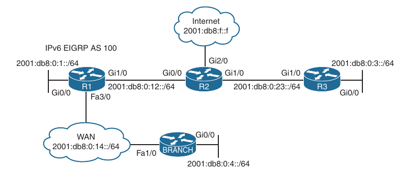
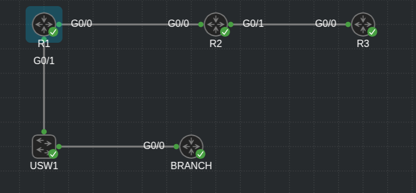
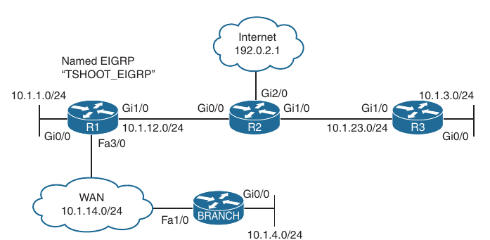
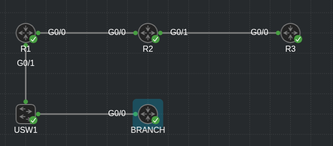

## EIGRPv6

1. EIGRPv6 Fundamentals

2. Troubleshoot EIGRPv6 neighbor issues

3. Troubleshooting IPv6 routes

4. Troubleshooting Named EIGRP

5. EIGRPv6 and Named EIGRP Trouble Tickets

- The original EIGRP routing protocol supports multiple protocol suites

- Protocol-dependent modules (PDMs) provides unique neighbor and topology tables for each protocol

- When the IPv6 address family is enabled, the routing protocol is commonly referred to as EIGRPv6

- The fundamentals of EIGRPv6 and guide through configuring and verifying it

- Examine how to troubleshoot common EIGRPv6 neighbor and route issues

- Exploring Named EIGRP

### EIGRPv6 Fundamentals

- EIGRP's functional behaviour is unchanged between IPv4 and IPv6

- The same adminstrative distance, metrics, timers and DUAL mechanisms are in place to build the routing table

- A detailed overview of the operation of the EIGRP protocol along with it's common features

- Discussing the components of the routing protocol that are unique to IPv6

#### EIGRPv6 Inter-Router Communication

- EIGRP packets are identified using the well-known protocol ID 88 for both IPv4 and IPv6

- When EIGRPv6 is enabled, the routers communicate with each other using the interface's IPv6 link-local address or the multicast link-local scoped address FF02::A

- Below is shown the source and destination addresses for the EIGRP packet types

```
EIGRP Packet            Source                      Destination                 Purpose

Hello                   Link-local address          FF02::A                     Neighbor discovery and keepalive

Acknowledgement         Link-local address          Link-local address          Acknowledges receipt of an update

Query                   Link-local address          FF02::A                     Request for route information during a topology change event

Reply                   Link-local address          Link-local address          A response to a query message

Update                  Link-local address          Link-local address          Adjacency forming

Update                  Link-local address          FF02::A                     Topology change
```

#### EIGRPv6 Configuration

- There are two methods for configuring IPv6 for EIGRP on IOS and IOS XE routers:

    - Classic AS mode

    - Named mode

##### EIGRPv6 Classic Mode configuration

- Classic mode is the original IOS method for enabling IPv6 on EIGRP

- In this mode, the routing process is configured using an autonomous system number

- The steps for configuring EIGRPv6 on an IOS router are as follows:

    1. Configure the EIGRPv6 process by using the global configuration command `ipv6 router eigrp <as-number>`

    2. Configure the router ID by using the IPv6 address family command `eigrp router-id <router-id>`

    The router ID should be manually assigned to ensure proper operation of the routing process

    The default behaviour of EIGRP is to locally assign a router ID based on the highest IPv4 loopback address or, if that is not available, the highest IPv4 address

    The router ID does not need to map to an IPv4 address; the ID value could be any 32-bit unique dotted-decimal identifier

    If an IPv4 address is not defined or if the router ID is not manually configured, the routing process does not initiate

    3. Enable the process on the interface by using the interface parameter command `ipv6 eigrp <as-number>`


- R1:

```
conf t
 ipv6 router eigrp 65001
  eigrp router-id 10.1.1.1
  exit
 interface GigabitEthernet1
  ip address 10.1.12.1 255.255.255.0
  negotiation auto
  ipv6 address 2001:DB8:0:1::1/64
  ipv6 eigrp 65001

 interface Loopback0
  ip address 10.1.1.1 255.255.255.255
  ipv6 address 2002:1:1:1::1/128
  ipv6 eigrp 65001
```

- R2:

```
conf t
 ipv6 router eigrp 65001
  eigrp router-id 10.2.2.2
  exit
 interface GigabitEthernet1
  ip address 10.1.12.2 255.255.255.0
  negotiation auto
  ipv6 address 2001:DB8:0:1::2/64
  ipv6 eigrp 65001

 interface Loopback0
  ip address 10.2.2.2 255.255.255.255
  ipv6 address 2002:1:2:2::2/128
  ipv6 eigrp 65001
```

- Nearly all EIGRP IPv6 features are configured in the same manner as in IPv4 EIGRP classic mode

- The primary difference is that the IPv6 keyword, rather than the IP keyword, precedes most of the commands

- One noticeable exception is the familiar IPv4 network statement in the EIGRP routing configuration mode

- The `network` statement does not exist within EIGRPv6

- The protocol must be enabled directly on the interface when using the classic IPv6 EIGRP AS configuration method

##### EIGRPv6 Named Mode Configuration

- EIGRP named mode configuration is a newer method for configuring the protocol on IOS and IOS XE routers

- Named mode provides support for IPv4, IPv6, and virtual routing and forwarding (VRF), all within a single EIGRP instance

- The steps for configuring EIGRP named mode are as follows:

    1. Configure the EIGRPv6 routing process in global configuration mode by using the command `router eigrp <process-name>`

    Unlike in classic mode, you specify a name instead of an autonomous system number

    2. Define the address family and autonomous system number (ASN) to the routing process by using the command `address-family ipv6 autonomous-system <as-number>`

    3. Assign the router ID by using the IPv6 address family command `eigrp router-id <router-id>`

- EIGRP Named mode uses a hierarchical configuration

- Most of the command structure is identical with that of EIGRP IPv4 named mode; this mode simplifies configuration and improves CLI usability

- All of the EIGRP-specific interface parameters are configured in the `af-interface default` or `af-interface <interface-id>` submode within the IPv6 address family of the named EIGRP process

- When the IPv6 address family is configured for the EIGRP named process, all the IPv6-enabled interfaces immediately start participating in routing

- To disable the routing process on the interface, the interface needs to be shut down in the af-interface configuration mode

- R1:

```
conf t
 router eigrp EIGRP-NAMED
  !
  address-family ipv6 unicast autonomous-system 65002
   !
   af-interface GigabitEthernet1
    shutdown
   exit-af-interface
   !
   af-interface Loopback0
    shutdown
   exit-af-interface
   !
   af-interface Loopback2
    passive-interface
   exit-af-interface
   !
   topology base
   exit-af-topology
   eigrp router-id 10.2.12.1
  exit-address-family
```

R2:

```
router eigrp EIGRP-NAMED
 !
 address-family ipv6 unicast autonomous-system 65002
  !
  af-interface Loopback0
   shutdown
  exit-af-interface
  !
  af-interface GigabitEthernet1
   shutdown
  exit-af-interface
  !
  af-interface Loopback2
   passive-interface
  exit-af-interface
  !
  topology base
  exit-af-topology
  eigrp router-id 10.2.12.2
 exit-address-family
```

- EIGRPv6 Verification:

- EIGRPv6 uses the same verification commands as for IPv4 EIGRP

- The only difference is that `ipv6` keyword is included in the command syntax

- Below are the IPv6 versions of show commands:

```
Command                                                         Description

show ipv6 eigrp interfaces [interface-id] [detail]              Displays the EIGRPv6 interfaces

show ipv6 eigrp neighbors                                       Displays the EIGRPv6 neighbors

show ipv6 route eigrp                                           Displays only EIGRP IPv6 routes in the routing table

show ipv6 protocols                                             Displays the current state of the active routing protocol processes
```

- Below is a simple topology in which EIGRPv6 AS 100 is enabled on routers R1 and R2 to provide connectivity between the networks


- Below is shown the full EIGRPv6 configuration for the sample topology

- Both EIGRPv6 classic AS and named mode are provided

- Notice in IOS classic mode that the routing protocol is applied to each physical interface

- In named mode, the protocol is automatically enabled on all interfaces

- R1 - classic configuration:

```
conf t
 ipv6 unicast-routing
 interface GigabitEthernet1
  ipv6 address FE80::1 link-local
  ipv6 address 2001:DB8:0:12::1/64
  ipv6 eigrp 100

 interface GigabitEthernet2
  ipv6 address FE80::1 link-local
  ipv6 address 2001:DB8:1:1::1/64
  ipv6 eigrp 100

 interface Loopback0
  ipv6 address 2001:DB8:1::1/128
  ipv6 eigrp 100

 ipv6 router eigrp 100
  passive-interface Loopback0
  eigrp router-id 192.168.1.1
```

- R2 - named mode configuration:

```
conf t
 interface GigabitEthernet1
  ipv6 address FE80::2 link-local
  ipv6 address 2001:DB8:0:12::2/64

 interface GigabitEthernet2
  ipv6 address FE80::2 link-local
  ipv6 address 2001:DB8:2:2::2/64

 interface Loopback0
  ipv6 address 2001:DB8:2::2/128

 router eigrp NAMED-MODE
  address-family ipv6 unicast autonomous-system 100
   af-interface Loopback0
    passive-interface
    exit
   eigrp router-id 192.168.2.2
```

- Below is provided the verification of the EIGRPv6 neighbor adjacency

- Notice that the adjacency uses the link-local addressing

```
R1#sh ipv6 eigrp neighbors 
EIGRP-IPv6 Neighbors for AS(100)
H   Address                 Interface              Hold Uptime   SRTT   RTO  Q  Seq
                                                   (sec)         (ms)       Cnt Num
0   Link-local address:     Gi1                      13 00:25:40    4   100  0  3
    FE80::2
```

```
R2#show ipv6 eigrp neighbors 
EIGRP-IPv6 VR(NAMED-MODE) Address-Family Neighbors for AS(100)
H   Address                 Interface              Hold Uptime   SRTT   RTO  Q  Seq
                                                   (sec)         (ms)       Cnt Num
0   Link-local address:     Gi1                      10 00:26:12 1599  5000  0  3
    FE80::1
```

- Below are shown the routing table entries for R1 and R2:

```
R1#sh ipv6 route eigrp 
IPv6 Routing Table - default - 8 entries
Codes: C - Connected, L - Local, S - Static, U - Per-user Static route
       B - BGP, R - RIP, H - NHRP, I1 - ISIS L1
       I2 - ISIS L2, IA - ISIS interarea, IS - ISIS summary, D - EIGRP
       EX - EIGRP external, ND - ND Default, NDp - ND Prefix, DCE - Destination
       NDr - Redirect, RL - RPL, O - OSPF Intra, OI - OSPF Inter
       OE1 - OSPF ext 1, OE2 - OSPF ext 2, ON1 - OSPF NSSA ext 1
       ON2 - OSPF NSSA ext 2, la - LISP alt, lr - LISP site-registrations
       ld - LISP dyn-eid, lA - LISP away, le - LISP extranet-policy
       lp - LISP publications, a - Application, m - OMP
D   2001:DB8:2::2/128 [90/2848]
     via FE80::2, GigabitEthernet1
D   2001:DB8:2:2::/64 [90/3072]
     via FE80::2, GigabitEthernet1

```

```
R2#show ipv6 route eigrp 
IPv6 Routing Table - default - 8 entries
Codes: C - Connected, L - Local, S - Static, U - Per-user Static route
       B - BGP, R - RIP, H - NHRP, I1 - ISIS L1
       I2 - ISIS L2, IA - ISIS interarea, IS - ISIS summary, D - EIGRP
       EX - EIGRP external, ND - ND Default, NDp - ND Prefix, DCE - Destination
       NDr - Redirect, RL - RPL, O - OSPF Intra, OI - OSPF Inter
       OE1 - OSPF ext 1, OE2 - OSPF ext 2, ON1 - OSPF NSSA ext 1
       ON2 - OSPF NSSA ext 2, la - LISP alt, lr - LISP site-registrations
       ld - LISP dyn-eid, lA - LISP away, le - LISP extranet-policy
       lp - LISP publications, a - Application, m - OMP
D   2001:DB8:1::1/128 [90/2570240]
     via FE80::1, GigabitEthernet1
D   2001:DB8:1:1::/64 [90/15360]
     via FE80::1, GigabitEthernet1

```

#### IPv6 Route Summarization

- There is no concept of classful or classless routing in IPv6, and therefore autosummarization is not possible

- EIGRPv6 summarization for IPv6 is manually configured on a per-interface basis using the same rules as for IPv4:

    1. The summary aggregate prefix is not advertised until a prefix matches it

    2. More specific prefixes are suppressed

    3. A Null0 route with an administrative distance of 5 is added to the routing table as a loop-prevention mechanism

    4. A leak map can be used to advertise more specific prefixes while advertising a summary address

- Network summarization is configured at the interface level in classic mode using the command `ipv6 summary-address eigrp <as-number> <ipv6-prefix/ipv6-prefix-length>` or in named mode with the command `summary-address <ipv6-prefix/ipv6-prefix-length>` under the af-interface

- Below is demonstrated how to configure R1 to advertise a 2001:db8:1::/48 summary route to R2 and how to configure R2 to advertise a 2001:db8:2::/48 summary route to R1

- It shows both classic and named mode summary configurations

- R1:

```
conf t
 interface g1
  ipv6 summary-address eigrp 100 2001:db8:1::/48
```

- R2:

```
conf t
 router eigrp NAMED-MODE
  address-family ipv6 autonomous-system 100
   af-interface g1
    summary-address 2001:db8:2::/48
```

- Below are shown the routing tables for R1 and R2

- R1:

```
R1#sh ipv6 route eigrp      
IPv6 Routing Table - default - 8 entries
Codes: C - Connected, L - Local, S - Static, U - Per-user Static route
       B - BGP, R - RIP, H - NHRP, I1 - ISIS L1
       I2 - ISIS L2, IA - ISIS interarea, IS - ISIS summary, D - EIGRP
       EX - EIGRP external, ND - ND Default, NDp - ND Prefix, DCE - Destination
       NDr - Redirect, RL - RPL, O - OSPF Intra, OI - OSPF Inter
       OE1 - OSPF ext 1, OE2 - OSPF ext 2, ON1 - OSPF NSSA ext 1
       ON2 - OSPF NSSA ext 2, la - LISP alt, lr - LISP site-registrations
       ld - LISP dyn-eid, lA - LISP away, le - LISP extranet-policy
       lp - LISP publications, a - Application, m - OMP
D   2001:DB8:1::/48 [5/2816]
     via Null0, directly connected
D   2001:DB8:2::/48 [90/2848]
     via FE80::2, GigabitEthernet1

```

- R2:

```
R2#show ipv6 route eigrp 
IPv6 Routing Table - default - 8 entries
Codes: C - Connected, L - Local, S - Static, U - Per-user Static route
       B - BGP, R - RIP, H - NHRP, I1 - ISIS L1
       I2 - ISIS L2, IA - ISIS interarea, IS - ISIS summary, D - EIGRP
       EX - EIGRP external, ND - ND Default, NDp - ND Prefix, DCE - Destination
       NDr - Redirect, RL - RPL, O - OSPF Intra, OI - OSPF Inter
       OE1 - OSPF ext 1, OE2 - OSPF ext 2, ON1 - OSPF NSSA ext 1
       ON2 - OSPF NSSA ext 2, la - LISP alt, lr - LISP site-registrations
       ld - LISP dyn-eid, lA - LISP away, le - LISP extranet-policy
       lp - LISP publications, a - Application, m - OMP
D   2001:DB8:1::/48 [90/15360]
     via FE80::1, GigabitEthernet1
D   2001:DB8:2::/48 [5/1280]
     via Null0, directly connected

```

- Notice that only the /48 summary prefix is received from the neighbor router and that the more specific /64 and /128 route entries are suppressed

- A Null0 route is populated on the router for the local /48 summary route advertisement

#### Default Route Advertising

- You advertise a default route into the EIGRPv6 topology by placing the default prefix (::/0) as a summary address at the interface level

- When you use the summary method, all prefix advertisements are suppressed by the router except for the ::/0 default route entry

- Below we can see the two configuration methods for injecting a default route into EIGRPv6

- R1 - classic mode:

```
conf t
 interface g1
  ipv6 summary-address eigrp 100 ::/0 
```

- R2 - named mode:

```
conf t
 router eigrp NAMED-MODE
  address-family ipv6 autonomous-system 100
   af-interface g1
    summary-address ::/0
```

- IPv6 EIGRP routing tables:

- R1:

```
R1#show ipv6 route eigrp 
IPv6 Routing Table - default - 9 entries
Codes: C - Connected, L - Local, S - Static, U - Per-user Static route
       B - BGP, R - RIP, H - NHRP, I1 - ISIS L1
       I2 - ISIS L2, IA - ISIS interarea, IS - ISIS summary, D - EIGRP
       EX - EIGRP external, ND - ND Default, NDp - ND Prefix, DCE - Destination
       NDr - Redirect, RL - RPL, O - OSPF Intra, OI - OSPF Inter
       OE1 - OSPF ext 1, OE2 - OSPF ext 2, ON1 - OSPF NSSA ext 1
       ON2 - OSPF NSSA ext 2, la - LISP alt, lr - LISP site-registrations
       ld - LISP dyn-eid, lA - LISP away, le - LISP extranet-policy
       lp - LISP publications, a - Application, m - OMP
D   ::/0 [5/2816]
     via Null0, directly connected
D   2001:DB8:1::/48 [5/2816]
     via Null0, directly connected
D   2001:DB8:2::/48 [90/2848]
     via FE80::2, GigabitEthernet1

```

- R2:

```
R2#sh ipv6 route eigrp 
IPv6 Routing Table - default - 9 entries
Codes: C - Connected, L - Local, S - Static, U - Per-user Static route
       B - BGP, R - RIP, H - NHRP, I1 - ISIS L1
       I2 - ISIS L2, IA - ISIS interarea, IS - ISIS summary, D - EIGRP
       EX - EIGRP external, ND - ND Default, NDp - ND Prefix, DCE - Destination
       NDr - Redirect, RL - RPL, O - OSPF Intra, OI - OSPF Inter
       OE1 - OSPF ext 1, OE2 - OSPF ext 2, ON1 - OSPF NSSA ext 1
       ON2 - OSPF NSSA ext 2, la - LISP alt, lr - LISP site-registrations
       ld - LISP dyn-eid, lA - LISP away, le - LISP extranet-policy
       lp - LISP publications, a - Application, m - OMP
D   ::/0 [5/1280]
     via Null0, directly connected
D   2001:DB8:1::/48 [90/15360]
     via FE80::1, GigabitEthernet1
D   2001:DB8:2::/48 [5/1280]
     via Null0, directly connected

```

#### Route Filtering

- On IOS and IOS XE you use prefix lists to match IPv6 routes in route maps and distribute lists

- Below is demonstrated how to use a distribute list for filtering the default route ::/0 advertisements from an upstream neighbor connected to the interface g1

- The associate prefix-list BLOCK-DEFAULT with sequence 5 is a deny statement that filters the exact match for the default route prefix ::/0

- Sequence 10 is a permit any match statement that allows a prefix of any length to be received

- R2:

```
conf t
 ipv6 prefix-list BLOCK-DEFAULT seq 5 deny ::/0
 ipv6 prefix-list BLOCK-DEFAULT seq 10 permit ::/0 le 128
 router eigrp NAMED-MODE
  address-family ipv6 autonomous-system 100
   topology base
    distribute-list prefix-list BLOCK-DEFAULT in G1
    exit

```

- Now looking at the routing table, the default route is missing:

```
R2(config-router-af-topology)#do sh ipv6 route eigrp
IPv6 Routing Table - default - 8 entries
Codes: C - Connected, L - Local, S - Static, U - Per-user Static route
       B - BGP, R - RIP, H - NHRP, I1 - ISIS L1
       I2 - ISIS L2, IA - ISIS interarea, IS - ISIS summary, D - EIGRP
       EX - EIGRP external, ND - ND Default, NDp - ND Prefix, DCE - Destination
       NDr - Redirect, RL - RPL, O - OSPF Intra, OI - OSPF Inter
       OE1 - OSPF ext 1, OE2 - OSPF ext 2, ON1 - OSPF NSSA ext 1
       ON2 - OSPF NSSA ext 2, la - LISP alt, lr - LISP site-registrations
       ld - LISP dyn-eid, lA - LISP away, le - LISP extranet-policy
       lp - LISP publications, a - Application, m - OMP
D   2001:DB8:1::/48 [90/15360]
     via FE80::1, GigabitEthernet1
D   2001:DB8:2::/48 [5/1280]
     via Null0, directly connected
```

- R1 - classic mode:

```
conf t
 ipv6 prefix-list BLOCK-DEFAULT seq 5 deny ::/0
 ipv6 prefix-list BLOCK-DEFAULT seq 10 permit ::/0 le 128
 ipv6 router eigrp 100
  distribute-list prefix-list BLOCK-DEFAULT in g1
```

- Routing table of R1:

```
R1(config)#do sh ipv6 route eigrp
IPv6 Routing Table - default - 8 entries
Codes: C - Connected, L - Local, S - Static, U - Per-user Static route
       B - BGP, R - RIP, H - NHRP, I1 - ISIS L1
       I2 - ISIS L2, IA - ISIS interarea, IS - ISIS summary, D - EIGRP
       EX - EIGRP external, ND - ND Default, NDp - ND Prefix, DCE - Destination
       NDr - Redirect, RL - RPL, O - OSPF Intra, OI - OSPF Inter
       OE1 - OSPF ext 1, OE2 - OSPF ext 2, ON1 - OSPF NSSA ext 1
       ON2 - OSPF NSSA ext 2, la - LISP alt, lr - LISP site-registrations
       ld - LISP dyn-eid, lA - LISP away, le - LISP extranet-policy
       lp - LISP publications, a - Application, m - OMP
D   2001:DB8:1::/48 [5/2816]
     via Null0, directly connected
D   2001:DB8:2::/48 [90/2848]
     via FE80::2, GigabitEthernet1
```

- CAREFUL: The prefix list does not block the route to Null0 (summary route) to be added into the routing table

- R1:

```
conf t
 int g1
  ipv6 summary-address eigrp 100 ::/0
```

- Routing table:

```
R1(config-if)#do sh ipv6 ro eigrp
IPv6 Routing Table - default - 9 entries
Codes: C - Connected, L - Local, S - Static, U - Per-user Static route
       B - BGP, R - RIP, H - NHRP, I1 - ISIS L1
       I2 - ISIS L2, IA - ISIS interarea, IS - ISIS summary, D - EIGRP
       EX - EIGRP external, ND - ND Default, NDp - ND Prefix, DCE - Destination
       NDr - Redirect, RL - RPL, O - OSPF Intra, OI - OSPF Inter
       OE1 - OSPF ext 1, OE2 - OSPF ext 2, ON1 - OSPF NSSA ext 1
       ON2 - OSPF NSSA ext 2, la - LISP alt, lr - LISP site-registrations
       ld - LISP dyn-eid, lA - LISP away, le - LISP extranet-policy
       lp - LISP publications, a - Application, m - OMP
D   ::/0 [5/2816]
     via Null0, directly connected
D   2001:DB8:1::/48 [5/2816]
     via Null0, directly connected
D   2001:DB8:2::/48 [90/2848]
     via FE80::2, GigabitEthernet1
```

#### Troubleshooting IPv6 Neighbor Issues

- Because EIGRPv6 is based on EIGRP for IPv4, it involves similar issues when it comes to troubleshooting, although there are a few differences for IPv6

- The great news is that you do not have to learn a large amount of new information for EIGRPv6

- You basically need to know the show commands that display the information you need to troubleshoot any given EIGRPv6 related issue

- Below the focus will be on the show commands that are used when troubleshooting EIGRPv6-related issues

- The neighbor issues with EIGRPv6 are mostly the same as with EIGRP for IPv4, except a few differences based on the way EIGRPv6 is enabled on an interface

- To identify EIGRPv6 neighbors, use the `show ipv6 eigrp neighbors` command, as shown below

- Notice that EIGRPv6 neighbors are identified by their link-local addresses

```
R2#show ipv6 eigrp neighbors 
EIGRP-IPv6 VR(EIGRP-NAMED) Address-Family Neighbors for AS(65002)
H   Address                 Interface              Hold Uptime   SRTT   RTO  Q  Seq
                                                   (sec)         (ms)       Cnt Num
1   Link-local address:     Gi3                      14 00:39:34    1   100  0  6
    FE80::5054:FF:FE21:A5CC
0   Link-local address:     Gi2                      12 00:46:44  654  3924  0  7
    FE80::5054:FF:FE22:34F6
```

- In this case R2 is a neighbor of two different routers

- One is reachable out G2 and the other is reachable out G3

##### Interface is Down

- With EIGRPv6, to verify that an interface is up, you use the `show ipv6 interface brief` command 

```
R2#sh ipv6 int br
GigabitEthernet1       [up/up]
    FE80::5054:FF:FE74:75E4
    2001:DB8:0:1::2
GigabitEthernet2       [up/up]
    FE80::5054:FF:FEE0:E9B2
    2012:2:12:1::2
GigabitEthernet3       [up/up]
    FE80::5054:FF:FEAB:37BE
    2002:2:2:3::2
GigabitEthernet4       [administratively down/down]
    unassigned
Loopback0              [up/up]
    FE80::21E:49FF:FE0A:CC00
    2002:1:2:2::2
Loopback2              [up/up]
    FE80::21E:49FF:FE0A:CC00
    2012:2:13:3::3
```

- In this case, G1, G2 and G3 are up/up, and G4 is administratively down/down

- This indicates that G4 has been configured with the `shutdown` command

##### Mismatched Autonomous System Numbers

- With EIGRPv6, to verify the autonomous system number being used, you can use the `show ipv6 protocols` command

```
R2#show ipv6 protocols 
IPv6 Routing Protocol is "connected"
IPv6 Routing Protocol is "application"
IPv6 Routing Protocol is "ND"
IPv6 Routing Protocol is "eigrp 65002"
EIGRP-IPv6 VR(EIGRP-NAMED) Address-Family Protocol for AS(65002)
  Metric weight K1=1, K2=0, K3=1, K4=0, K5=0 K6=0
  Metric rib-scale 128
  Metric version 64bit
  Soft SIA disabled
  NSF-aware route hold timer is 240
  EIGRP NSF disabled
     NSF signal timer is 20s
     NSF converge timer is 120s
  Router-ID: 10.2.12.2
  Topology : 0 (base) 
    Active Timer: 3 min
    Distance: internal 90 external 170
    Maximum path: 16
    Maximum hopcount 100
    Maximum metric variance 1
    Total Prefix Count: 5
    Total Redist Count: 0

  Interfaces:
    GigabitEthernet2
    GigabitEthernet3
    Loopback2 (passive)
  Redistribution:
    None
```

- In this example the EIGRP autonomous system is 65002

##### Mismatched K Values

- You verify the EIGRPv6 K values with the command `show ipv6 protocols`

```
R2#show ipv6 protocols 
IPv6 Routing Protocol is "connected"
IPv6 Routing Protocol is "application"
IPv6 Routing Protocol is "ND"
IPv6 Routing Protocol is "eigrp 65002"
EIGRP-IPv6 VR(EIGRP-NAMED) Address-Family Protocol for AS(65002)
  Metric weight K1=1, K2=0, K3=1, K4=0, K5=0 K6=0
  Metric rib-scale 128
  Metric version 64bit
  Soft SIA disabled
  NSF-aware route hold timer is 240
  EIGRP NSF disabled
     NSF signal timer is 20s
     NSF converge timer is 120s
  Router-ID: 10.2.12.2
  Topology : 0 (base) 
    Active Timer: 3 min
    Distance: internal 90 external 170
    Maximum path: 16
    Maximum hopcount 100
    Maximum metric variance 1
    Total Prefix Count: 5
    Total Redist Count: 0

  Interfaces:
    GigabitEthernet2
    GigabitEthernet3
    Loopback2 (passive)
  Redistribution:
    None
```

- In this example the K values are: 1=1, K2=0, K3=1, K4=0, K5=0, K6=0 which are the defaults

##### Passive Interfaces

- To verify the router interfaces participating in an EIGRPv6 autonomous system that are passive, you use the `show ipv6 protocols` command

```
R2#show ipv6 protocols 
IPv6 Routing Protocol is "connected"
IPv6 Routing Protocol is "application"
IPv6 Routing Protocol is "ND"
IPv6 Routing Protocol is "eigrp 65002"
EIGRP-IPv6 VR(EIGRP-NAMED) Address-Family Protocol for AS(65002)
  Metric weight K1=1, K2=0, K3=1, K4=0, K5=0 K6=0
  Metric rib-scale 128
  Metric version 64bit
  Soft SIA disabled
  NSF-aware route hold timer is 240
  EIGRP NSF disabled
     NSF signal timer is 20s
     NSF converge timer is 120s
  Router-ID: 10.2.12.2
  Topology : 0 (base) 
    Active Timer: 3 min
    Distance: internal 90 external 170
    Maximum path: 16
    Maximum hopcount 100
    Maximum metric variance 1
    Total Prefix Count: 5
    Total Redist Count: 0

  Interfaces:
    GigabitEthernet2
    GigabitEthernet3
    Loopback2 (passive)
  Redistribution:
    None
```

- In this example, Loopback2 is a passive interface

##### Mismatched Authentication

- If authentication is being used with EIGRPv6, the key ID and key string must match and if the valid timers are configured, they must match between neighbors as well

- Below is shown how to verify whether an interface is enabled for EIGRPv6 authentication with `show ipv6 eigrp interfaces detail` command and how to verify the configuration of the keychain that is being used with the `show key chain` command

- In this example the authentication mode is MD5, and the keychain TEST is being used

- R1:

```
conf t
 key chain TEST
  key 1
   key-string TEST
   exit
 int g1
  ipv6 authentication key-chain eigrp 100 TEST
  ipv6 authentication mode eigrp 100 md5
```

```
R1(config-if)#do sh ipv6 eigrp int det g1
EIGRP-IPv6 Interfaces for AS(100)
                              Xmit Queue   PeerQ        Mean   Pacing Time   Multicast    Pending
Interface              Peers  Un/Reliable  Un/Reliable  SRTT   Un/Reliable   Flow Timer   Routes
Gi1                      1        0/0       0/0           1       0/0           50           0
  Hello-interval is 5, Hold-time is 15
  Split-horizon is enabled
  Next xmit serial <none>
  Packetized sent/expedited: 4/2
  Hello's sent/expedited: 108/3
  Un/reliable mcasts: 0/4  Un/reliable ucasts: 7/4
  Mcast exceptions: 0  CR packets: 0  ACKs suppressed: 0
  Retransmissions sent: 2  Out-of-sequence rcvd: 0
  Topology-ids on interface - 0 
  Authentication mode is md5,  key-chain is "TEST"
  Topologies advertised on this interface:  base
  Topologies not advertised on this interface:

```

- R2 - named mode:

```
conf t
 key chain TEST
  key 1
   key-string TEST
   exit
 router eigrp NAMED-MODE
  address-family ipv6 unicast autonomous-system 100
   af-interface g1
    authentication key-chain TEST
    authentication mode md5 
```

```
R2#show ipv6 eigrp interfaces detail g1
EIGRP-IPv6 VR(NAMED-MODE) Address-Family Interfaces for AS(100)
                              Xmit Queue   PeerQ        Mean   Pacing Time   Multicast    Pending
Interface              Peers  Un/Reliable  Un/Reliable  SRTT   Un/Reliable   Flow Timer   Routes
Gi1                      1        0/0       0/0           1       0/0           50           0
  Hello-interval is 5, Hold-time is 15
  Split-horizon is enabled
  Next xmit serial <none>
  Packetized sent/expedited: 4/0
  Hello's sent/expedited: 140/3
  Un/reliable mcasts: 0/5  Un/reliable ucasts: 4/4
  Mcast exceptions: 0  CR packets: 0  ACKs suppressed: 0
  Retransmissions sent: 2  Out-of-sequence rcvd: 0
  Topology-ids on interface - 0 
  Authentication mode is md5,  key-chain is "TEST"
  Topologies advertised on this interface:  base
  Topologies not advertised on this interface:
```

##### Timers

- With EIGRPv6 timers do not have to match; however, if they are not configured appropriately, neighbor relationships may flap

- You can verify timers by using the `show ipv6 eigrp interfaces detail` command, as shown above

- In this case, the hello interval is configured as 5 seconds, and the hold time is 15. These are the defaults

##### Interface Not Participating in Routing Process

- With EIGRPv6, interfaces are enabled for the routing process with the `ipv6 eigrp <as-number>` interface configuration command

- You can use two show commands `show ipv6 eigrp interfaces` and `show ipv6 protocols` to verify the interfaces that are participating in the routing process

- As with EIGRP for IPv4, the `show ipv6 eigrp interfaces` does not show the passive interfaces

- However, `show ipv6 protocols` does show them

```
R1#show ipv6 eigrp interfaces 
EIGRP-IPv6 Interfaces for AS(100)
                              Xmit Queue   PeerQ        Mean   Pacing Time   Multicast    Pending
Interface              Peers  Un/Reliable  Un/Reliable  SRTT   Un/Reliable   Flow Timer   Routes
Gi1                      1        0/0       0/0           1       0/0           50           0
Gi2                      0        0/0       0/0           0       0/0            0           0


R1#show ipv6 protocols 
IPv6 Routing Protocol is "connected"
IPv6 Routing Protocol is "application"
IPv6 Routing Protocol is "omp"
  Redistribution:
    None
IPv6 Routing Protocol is "ND"
IPv6 Routing Protocol is "eigrp 100"
EIGRP-IPv6 Protocol for AS(100)
  Metric weight K1=1, K2=0, K3=1, K4=0, K5=0
  Soft SIA disabled
  NSF-aware route hold timer is 240
  EIGRP NSF disabled
     NSF signal timer is 20s
     NSF converge timer is 120s
  Router-ID: 192.168.1.1
  Topology : 0 (base) 
    Active Timer: 3 min
    Distance: internal 90 external 170
    Maximum path: 16
    Maximum hopcount 100
    Maximum metric variance 1

  Interfaces:
    GigabitEthernet1
    GigabitEthernet2
    Loopback0 (passive)
  Redistribution:
    None
  Address Summarization:
    2001:DB8:1::/48 for Gi1
      Summarizing 2 components with metric 2816
```

##### ACLs

- EIGRPv6 uses the IPv6 multicast address FF02::A to form neighbor adjacencies

- If an IPv6 access control list (ACL) is denying packets destined to the multicast address FF02::A, neighbor adjacencies do not form

- In addition, because neighbor adjacencies are formed with link-local addresses, if the link-local address range is denied based on the source or destination IPv6 address on an interface with an IPv6 ACL, neighbor relationships do not form

### Troubleshooting EIGRPv6 routes

- The reasons a route might be missing and the steps used to troubleshoot them with EIGRPv6 are similar to those used for EIGRPv4

- Identify the most common issues and the show commands used to detect then for EIGRPv6

- EIGRP routes might be missing either from the topology table or the routing table

#### Interface Not Participating in the Routing Process

- For a network to be advertised by the EIGRPv6 process, the interface associated with that network must be participating in the routing process

- You can use the commands `show ipv6 eigrp interfaces` and `show ipv6 protocols` to verify the interfaces participating in the process

```
R1#show ipv6 eigrp interfaces 
EIGRP-IPv6 Interfaces for AS(100)
                              Xmit Queue   PeerQ        Mean   Pacing Time   Multicast    Pending
Interface              Peers  Un/Reliable  Un/Reliable  SRTT   Un/Reliable   Flow Timer   Routes
Gi1                      1        0/0       0/0         407       0/0         1992           0
Gi2                      0        0/0       0/0           0       0/0            0           0


R1#show ipv6 protocols 
IPv6 Routing Protocol is "connected"
IPv6 Routing Protocol is "application"
IPv6 Routing Protocol is "omp"
  Redistribution:
    None
IPv6 Routing Protocol is "ND"
IPv6 Routing Protocol is "eigrp 100"
EIGRP-IPv6 Protocol for AS(100)
  Metric weight K1=1, K2=0, K3=1, K4=0, K5=0
  Soft SIA disabled
  NSF-aware route hold timer is 240
  EIGRP NSF disabled
     NSF signal timer is 20s
     NSF converge timer is 120s
  Router-ID: 192.168.1.1
  Topology : 0 (base) 
    Active Timer: 3 min
    Distance: internal 90 external 170
    Maximum path: 16
    Maximum hopcount 100
    Maximum metric variance 1

  Interfaces:
    GigabitEthernet1
    GigabitEthernet2
    Loopback0 (passive)
  Redistribution:
    None
  Address Summarization:
    2001:DB8:1::/48 for Gi1
      Summarizing 2 components with metric 2816
```

#### Better Source of Information

- If exactly the same network is learned from a more reliable source, it is used instead of EIGRPv6-learned information

- To verify the AD associated with the route in the routing table, you can issue the `show ipv6 route <ipv6-prefix/prefix-length>`

- Below the route to the 2001:db8:2::/48 has an AD of 90 and it was learned from the EIGRP autonomous system 100

```
R1#show ipv6 route 2001:db8:2::/48
Routing entry for 2001:DB8:2::/48
  Known via "eigrp 100", distance 90, metric 2848, type internal
  Route count is 1/1, share count 0
  Routing paths:
    FE80::2, GigabitEthernet1
      From FE80::2
      Last updated 00:20:36 ago

```

#### Route Filtering

- A filter might be preventing a route from being advertised or learned

- With EIGRPv6, the `distribute-list prefix-list` command is used to configure a route filter

- To verify the filter applied, use the `show run | s ipv6 router eigrp` command

```
R1#sh run | s ipv6 router eigrp
ipv6 router eigrp 100
 distribute-list prefix-list BLOCK-DEFAULT in GigabitEthernet1
 passive-interface Loopback0
 eigrp router-id 192.168.1.1


```

- In the output above, R1 is using a prefix list called `BLOCK-DEFAULT` to filter routes inbound of the G1 interface

- To suceessfully troubleshoot route filtering issues, you also need to verify the IPv6 prefix list by using the `show ipv6 prefix-list` command

```
R1#sh ipv6 prefix-list 
ipv6 prefix-list BLOCK-DEFAULT: 2 entries
   seq 5 deny ::/0
   seq 10 permit ::/0 le 128
```

#### Stub Configuration

- If the wrong router is configured as a stub router, or if the wrong setting is chosen during stub router configuration, it might prevent a router from being advertised when it should be advertised

- When troubleshooting EIGRPv6 stub configurations, you can use either the `show ipv6 protocols` command to verify whether the local router is is a stub router and the networks that it is advertising

- On a remote router (linked with the stub-configured router), you can use the the `show ipv6 eigrp neighbors detail` command

- In this case R2 is a stub advertising only the connected and summary routes

```
R2(config-router-af)#do sh ipv6 protoc
IPv6 Routing Protocol is "connected"
IPv6 Routing Protocol is "application"
IPv6 Routing Protocol is "ND"
IPv6 Routing Protocol is "eigrp 65002"
EIGRP-IPv6 VR(EIGRP-NAMED) Address-Family Protocol for AS(65002)
  Metric weight K1=1, K2=0, K3=1, K4=0, K5=0 K6=0
  Metric rib-scale 128
  Metric version 64bit
  Soft SIA disabled
  NSF-aware route hold timer is 240
  EIGRP NSF disabled
     NSF signal timer is 20s
     NSF converge timer is 120s
  Router-ID: 10.2.12.2
  Stub, connected, summary
  Topology : 0 (base) 
    Active Timer: 3 min
    Distance: internal 90 external 170
    Maximum path: 16
    Maximum hopcount 100
    Maximum metric variance 1
    Total Prefix Count: 5
    Total Redist Count: 0
          
  Interfaces:
    GigabitEthernet2
    GigabitEthernet3
    Loopback2 (passive)
  Redistribution:
    None
```

```
R1#show ipv6 eigrp neighbors detail 
EIGRP-IPv6 VR(EIGRP-NAMED) Address-Family Neighbors for AS(65002)
H   Address                 Interface              Hold Uptime   SRTT   RTO  Q  Seq
                                                   (sec)         (ms)       Cnt Num
0   Link-local address:     Gi2                      12 00:01:03    1   100  0  25
    FE80::5054:FF:FEE0:E9B2
   Version 28.0/2.0, Retrans: 0, Retries: 0, Prefixes: 3
   Topology-ids from peer - 0 
   Topologies advertised to peer:   base

   Stub Peer Advertising (CONNECTED SUMMARY ) Routes
   Suppressing queries
Max Nbrs: 0, Current Nbrs: 0
```

#### Split Horizon

- Split horizon is a loop prevention feature that prevents a router from advertising routes out the same interface on which they were learned 

- You can verify whether split horizon is enabled or disabled by using the `show ipv6 eigrp interfaces detail` command

```
R1#show ipv6 eigrp interfaces detail 
EIGRP-IPv6 VR(EIGRP-NAMED) Address-Family Interfaces for AS(65002)
                              Xmit Queue   PeerQ        Mean   Pacing Time   Multicast    Pending
Interface              Peers  Un/Reliable  Un/Reliable  SRTT   Un/Reliable   Flow Timer   Routes
Gi2                      1        0/0       0/0           1       0/0           50           0
  Hello-interval is 5, Hold-time is 15
  Split-horizon is enabled
  Next xmit serial <none>
  Packetized sent/expedited: 10/1
  Hello's sent/expedited: 234/5
  Un/reliable mcasts: 0/10  Un/reliable ucasts: 9/5
  Mcast exceptions: 0  CR packets: 0  ACKs suppressed: 0
  Retransmissions sent: 1  Out-of-sequence rcvd: 1
  Interface has all stub peers
  Topology-ids on interface - 0 
  Authentication mode is not set
  Topologies advertised on this interface:  base
  Topologies not advertised on this interface:

```

- As with EIGRP for IPv4, split horizon is an issue in EIGRPv6 network designs that need routes to be advertised out interfaces on which they were learned

- An example of this type of network design is a Dynamic Multipoint Virtual Private Network (DMVPN), which uses a multipoint interface on the hub router

- Therefore, split horizon needs to be disabled on the hub router interface of a DMVPN network so routes learned from the spoke routers can be advertised back out that interface to the other spoke routers

- EIGRPv6 named mode configuration for disabling split horizon:

```
conf t
 router eigrp EIGRP-NAMED
  address-family ipv6 autonomous-system 65002
   af-interface g2
    no split-horizon
```

- EIGRPv6 classic mode 

```
conf t
 interface g1
  no ipv6 split-horizon eigrp 65001
```

- Verifying eigrp split horizon on interfaces:

```
R2#show ipv6 eigrp interfaces detail 
EIGRP-IPv6 VR(EIGRP-NAMED) Address-Family Interfaces for AS(65002)
                              Xmit Queue   PeerQ        Mean   Pacing Time   Multicast    Pending
Interface              Peers  Un/Reliable  Un/Reliable  SRTT   Un/Reliable   Flow Timer   Routes
Gi2                      1        0/0       0/0           2       0/0           50           0
  Hello-interval is 5, Hold-time is 15
  Split-horizon is disabled
  Next xmit serial <none>
  Packetized sent/expedited: 12/3
  Hello's sent/expedited: 443/5
  Un/reliable mcasts: 0/8  Un/reliable ucasts: 14/9
  Mcast exceptions: 0  CR packets: 0  ACKs suppressed: 0
  Retransmissions sent: 4  Out-of-sequence rcvd: 0
  Topology-ids on interface - 0 
  Authentication mode is not set
  Topologies advertised on this interface:  base
  Topologies not advertised on this interface:


EIGRP-IPv6 Interfaces for AS(65001)
                              Xmit Queue   PeerQ        Mean   Pacing Time   Multicast    Pending
Interface              Peers  Un/Reliable  Un/Reliable  SRTT   Un/Reliable   Flow Timer   Routes
Lo0                      0        0/0       0/0           0       0/0            0           0
  Hello-interval is 5, Hold-time is 15
  Split-horizon is enabled
  Next xmit serial <none>
  Packetized sent/expedited: 0/0
  Hello's sent/expedited: 0/1
  Un/reliable mcasts: 0/0  Un/reliable ucasts: 0/0
  Mcast exceptions: 0  CR packets: 0  ACKs suppressed: 0
  Retransmissions sent: 0  Out-of-sequence rcvd: 0
  Topology-ids on interface - 0 
  Authentication mode is not set
  Topologies advertised on this interface:  base
  Topologies not advertised on this interface:

Gi1                      1        0/0       0/0        1280       0/0         8000           0
  Hello-interval is 5, Hold-time is 15
  Split-horizon is disabled
  Next xmit serial <none>
  Packetized sent/expedited: 2/0
  Hello's sent/expedited: 444/2
  Un/reliable mcasts: 0/2  Un/reliable ucasts: 4/3
  Mcast exceptions: 0  CR packets: 0  ACKs suppressed: 0
  Retransmissions sent: 1  Out-of-sequence rcvd: 1
  Topology-ids on interface - 0 
  Authentication mode is not set
  Topologies advertised on this interface:  base
  Topologies not advertised on this interface:
          
```

### Troubleshooting Named EIGRP

- The purpose of EIGRP named configuration is to provide a central location on the local router to perform all EIGRP for IPv4 and IPv6 configuration

- Below we can see a sample named EIGRP configuration called EIGRP_ENARSI

- This named EIGRP configuration includes an IPv4 unicast address family and an IPv6 unicast address family

- They are both using autonomous system 100; however, that is not mandatory and does not cause conflict as these are separated routing processes

```
R3#sh run | s router eigrp
router eigrp EIGRP_ENARSI
 !
 address-family ipv4 unicast autonomous-system 100
  !
  af-interface default
   passive-interface
  exit-af-interface
  !
  af-interface GigabitEthernet1
   no passive-interface
  exit-af-interface
  !
  topology base
  exit-af-topology
  network 3.3.3.3 0.0.0.0
  network 10.2.3.0 0.0.0.255
  eigrp router-id 3.3.3.3
  eigrp stub connected summary
 exit-address-family
 !
 address-family ipv6 unicast autonomous-system 100
  !
  af-interface default
   passive-interface
  exit-af-interface
  !
  af-interface GigabitEthernet1
   no passive-interface
  exit-af-interface
  !
  topology base
   maximum-paths 2
   variance 3
  exit-af-topology
  eigrp router-id 3.3.3.3
  eigrp stub connected summary
 exit-address-family
```

- Because the configuration is the only thing that is different, all the issues already discussed for EIGRP for IPv4 and EIGRPv6 apply here as well

- However you need to know which `show` commands can help you successfully troubleshoot named EIGRP deployments

- The show commands that can be used to troubleshoot named EIGRP deployments

- With named EIGRP, you can use all the same EIGRP show commands that you can use for classic EIGRP for IPv4 and classic EIGRPv6, as seen until now

- However, there is also a new set of `show` commands for named EIGRP that you might want to learn

- The command `show eigrp protocols` shows both the EIGRP for IPv4 and the EIGRPv6 address family, along with the autonomous system number associated with each

- It also displays the K values, the router ID, whether the router is a stub router, the AD, the maximum paths and the variance

```
R3#show eigrp protocols 
EIGRP-IPv4 VR(EIGRP_ENARSI) Address-Family Protocol for AS(100)
  Metric weight K1=1, K2=0, K3=1, K4=0, K5=0 K6=0
  Metric rib-scale 128
  Metric version 64bit
  Soft SIA disabled
  NSF-aware route hold timer is 240
  EIGRP NSF disabled
     NSF signal timer is 20s
     NSF converge timer is 120s
  Router-ID: 3.3.3.3
  Stub, connected, summary
  Topology : 0 (base) 
    Active Timer: 3 min
    Distance: internal 90 external 170
    Maximum path: 4
    Maximum hopcount 100
    Maximum metric variance 1
    Total Prefix Count: 5
    Total Redist Count: 0

EIGRP-IPv6 VR(EIGRP_ENARSI) Address-Family Protocol for AS(100)
  Metric weight K1=1, K2=0, K3=1, K4=0, K5=0 K6=0
  Metric rib-scale 128
  Metric version 64bit
  Soft SIA disabled
  NSF-aware route hold timer is 240
  EIGRP NSF disabled
     NSF signal timer is 20s
     NSF converge timer is 120s
  Router-ID: 3.3.3.3
  Stub, connected, summary
  Topology : 0 (base) 
    Active Timer: 3 min
    Distance: internal 90 external 170
    Maximum path: 2
    Maximum hopcount 100
    Maximum metric variance 3
    Total Prefix Count: 5
    Total Redist Count: 0

```

- This is similar to the output of `show ip protocols` and `show ipv6 protocols` commands

- However, it is missing the interfaces that are participating in the routing process, along with the passive interfaces

- Therefore, `show ip protocols` and `show ipv6 protocols` are better options than `show eigrp protocols`, at least for now

```
R3#show ip protocols 
*** IP Routing is NSF aware ***

Routing Protocol is "application"
  Sending updates every 0 seconds
  Invalid after 0 seconds, hold down 0, flushed after 0
  Outgoing update filter list for all interfaces is not set
  Incoming update filter list for all interfaces is not set
  Maximum path: 32
  Routing for Networks:
  Routing Information Sources:
    Gateway         Distance      Last Update
  Distance: (default is 4)

Routing Protocol is "eigrp 100"
  Outgoing update filter list for all interfaces is not set
  Incoming update filter list for all interfaces is not set
  Default networks flagged in outgoing updates
  Default networks accepted from incoming updates
  EIGRP-IPv4 VR(EIGRP_ENARSI) Address-Family Protocol for AS(100)
    Metric weight K1=1, K2=0, K3=1, K4=0, K5=0 K6=0
    Metric rib-scale 128
    Metric version 64bit
    Soft SIA disabled
    NSF-aware route hold timer is 240
  EIGRP NSF disabled
     NSF signal timer is 20s
     NSF converge timer is 120s
    Router-ID: 3.3.3.3
    Stub, connected, summary
    Topology : 0 (base) 
      Active Timer: 3 min
      Distance: internal 90 external 170
      Maximum path: 4
      Maximum hopcount 100
      Maximum metric variance 1
      Total Prefix Count: 5
      Total Redist Count: 0

  Automatic Summarization: disabled
  Maximum path: 4
  Routing for Networks:
    3.3.3.3/32
    10.2.3.0/24
  Passive Interface(s):
    Loopback0
  Routing Information Sources:
    Gateway         Distance      Last Update
    10.2.3.2              90      00:25:54
  Distance: internal 90 external 170

```

```
R3#show ipv6 protocols 
IPv6 Routing Protocol is "connected"
IPv6 Routing Protocol is "application"
IPv6 Routing Protocol is "ND"
IPv6 Routing Protocol is "eigrp 100"
EIGRP-IPv6 VR(EIGRP_ENARSI) Address-Family Protocol for AS(100)
  Metric weight K1=1, K2=0, K3=1, K4=0, K5=0 K6=0
  Metric rib-scale 128
  Metric version 64bit
  Soft SIA disabled
  NSF-aware route hold timer is 240
  EIGRP NSF disabled
     NSF signal timer is 20s
     NSF converge timer is 120s
  Router-ID: 3.3.3.3
  Stub, connected, summary
  Topology : 0 (base) 
    Active Timer: 3 min
    Distance: internal 90 external 170
    Maximum path: 2
    Maximum hopcount 100
    Maximum metric variance 3
    Total Prefix Count: 5
    Total Redist Count: 0
          
  Interfaces:
    GigabitEthernet1
    Loopback0 (passive)
  Redistribution:
    None
```

- To verify the interfaces that are participating in the routing process for each address family, you can issue the `show eigrp address-family ipv4 interfaces` and the `show eigrp address-family ipv6 interfaces` as shown below

- Note that passive interfaces do not show up in this output

- Using the classic `show ip protocols` or `show ipv6 protocols` you would be able to verify the passive interfaces

```
R3#show eigrp address-family ipv4 interfaces 
EIGRP-IPv4 VR(EIGRP_ENARSI) Address-Family Interfaces for AS(100)
                              Xmit Queue   PeerQ        Mean   Pacing Time   Multicast    Pending
Interface              Peers  Un/Reliable  Un/Reliable  SRTT   Un/Reliable   Flow Timer   Routes
Gi1                      1        0/0       0/0           2       0/0           50           0

R3#show eigrp address-family ipv6 interfaces 
EIGRP-IPv6 VR(EIGRP_ENARSI) Address-Family Interfaces for AS(100)
                              Xmit Queue   PeerQ        Mean   Pacing Time   Multicast    Pending
Interface              Peers  Un/Reliable  Un/Reliable  SRTT   Un/Reliable   Flow Timer   Routes
Gi1                      1        0/0       0/0           1       0/0           50           0
```

- When you use the `detail` keyword with the commands from above, you can verify additional interface parameters (for example hello interval, and hold time, whether split horizon is enabled, whether authentication is set, and statistics about hellos and packets)

```
R3#show eigrp address-family ipv4 interfaces detail 
EIGRP-IPv4 VR(EIGRP_ENARSI) Address-Family Interfaces for AS(100)
                              Xmit Queue   PeerQ        Mean   Pacing Time   Multicast    Pending
Interface              Peers  Un/Reliable  Un/Reliable  SRTT   Un/Reliable   Flow Timer   Routes
Gi1                      1        0/0       0/0           2       0/0           50           0
  Hello-interval is 5, Hold-time is 15
  Split-horizon is enabled
  Next xmit serial <none>
  Packetized sent/expedited: 5/1
  Hello's sent/expedited: 581/3
  Un/reliable mcasts: 0/4  Un/reliable ucasts: 5/3
  Mcast exceptions: 0  CR packets: 0  ACKs suppressed: 0
  Retransmissions sent: 1  Out-of-sequence rcvd: 0
  Topology-ids on interface - 0 
  Authentication mode is not set
  Topologies advertised on this interface:  base
  Topologies not advertised on this interface:


R3#show eigrp address-family ipv6 interfaces detail 
EIGRP-IPv6 VR(EIGRP_ENARSI) Address-Family Interfaces for AS(100)
                              Xmit Queue   PeerQ        Mean   Pacing Time   Multicast    Pending
Interface              Peers  Un/Reliable  Un/Reliable  SRTT   Un/Reliable   Flow Timer   Routes
Gi1                      1        0/0       0/0           1       0/0           50           0
  Hello-interval is 5, Hold-time is 15
  Split-horizon is enabled
  Next xmit serial <none>
  Packetized sent/expedited: 6/1
  Hello's sent/expedited: 538/4
  Un/reliable mcasts: 0/5  Un/reliable ucasts: 7/4
  Mcast exceptions: 0  CR packets: 0  ACKs suppressed: 0
  Retransmissions sent: 1  Out-of-sequence rcvd: 0
  Topology-ids on interface - 0 
  Authentication mode is not set
  Topologies advertised on this interface:  base
  Topologies not advertised on this interface:

```

- You can verify neighbors with `show eigrp address-family ipv4 neighbors` and `show eigrp address-family ipv6 neighbors` commands

- Just as you saw with the classic commands, if you want to verify whether a neighbor is a stub router, you can add the `detail` keyword to these commands

```
R3#show eigrp address-family ipv4 neighbors 
EIGRP-IPv4 VR(EIGRP_ENARSI) Address-Family Neighbors for AS(100)
H   Address                 Interface              Hold Uptime   SRTT   RTO  Q  Seq
                                                   (sec)         (ms)       Cnt Num
0   10.2.3.2                Gi1                      14 00:48:14    2   150  0  13

R3#show eigrp address-family ipv6 neighbors 
EIGRP-IPv6 VR(EIGRP_ENARSI) Address-Family Neighbors for AS(100)
H   Address                 Interface              Hold Uptime   SRTT   RTO  Q  Seq
                                                   (sec)         (ms)       Cnt Num
0   Link-local address:     Gi1                      14 00:44:17    1   150  0  19
    FE80::5054:FF:FED0:E8BA


R3#show eigrp address-family ipv4 neighbors detail 
EIGRP-IPv4 VR(EIGRP_ENARSI) Address-Family Neighbors for AS(100)
H   Address                 Interface              Hold Uptime   SRTT   RTO  Q  Seq
                                                   (sec)         (ms)       Cnt Num
0   10.2.3.2                Gi1                      13 00:49:00    2   150  0  13
   Version 28.0/2.0, Retrans: 1, Retries: 0, Prefixes: 3
   Topology-ids from peer - 0 
   Topologies advertised to peer:   base

Max Nbrs: 0, Current Nbrs: 0

R3#show eigrp address-family ipv6 neighbors detail 
EIGRP-IPv6 VR(EIGRP_ENARSI) Address-Family Neighbors for AS(100)
H   Address                 Interface              Hold Uptime   SRTT   RTO  Q  Seq
                                                   (sec)         (ms)       Cnt Num
0   Link-local address:     Gi1                      13 00:45:18    1   150  0  19
    FE80::5054:FF:FED0:E8BA
   Version 28.0/2.0, Retrans: 1, Retries: 0, Prefixes: 4
   Topology-ids from peer - 0 
   Topologies advertised to peer:   base

Max Nbrs: 0, Current Nbrs: 0
```

- To display the topology table, you can use the commands `show eigrp address-family ipv4 topology` and `show eigrp address-family ipv6 topology`

```
R3#show eigrp address-family ipv4 topology 
EIGRP-IPv4 VR(EIGRP_ENARSI) Topology Table for AS(100)/ID(3.3.3.3)
Codes: P - Passive, A - Active, U - Update, Q - Query, R - Reply,
       r - reply Status, s - sia Status 

P 10.1.2.0/24, 1 successors, FD is 1966080
        via 10.2.3.2 (1966080/1310720), GigabitEthernet1
P 2.2.2.2/32, 1 successors, FD is 1392640
        via 10.2.3.2 (1392640/163840), GigabitEthernet1
P 10.2.3.0/24, 1 successors, FD is 1310720
        via Connected, GigabitEthernet1
P 3.3.3.3/32, 1 successors, FD is 163840
        via Connected, Loopback0
P 1.1.1.1/32, 1 successors, FD is 2048000
        via 10.2.3.2 (2048000/1392640), GigabitEthernet1


R3#show eigrp address-family ipv6 topology 
EIGRP-IPv6 VR(EIGRP_ENARSI) Topology Table for AS(100)/ID(3.3.3.3)
Codes: P - Passive, A - Active, U - Update, Q - Query, R - Reply,
       r - reply Status, s - sia Status 

P 2001:DB8:2:2::2/128, 1 successors, FD is 1392640
        via FE80::5054:FF:FED0:E8BA (1392640/163840), GigabitEthernet1
P 2001:DB8:3:3::3/128, 1 successors, FD is 163840
        via Connected, Loopback0
P 2001:DB8:1:2::/64, 1 successors, FD is 1966080
        via FE80::5054:FF:FED0:E8BA (1966080/1310720), GigabitEthernet1
P 2001:DB8:2:3::/64, 1 successors, FD is 1310720
        via Connected, GigabitEthernet1
P 2001:DB8:1:1::1/128, 1 successors, FD is 2048000
        via FE80::5054:FF:FED0:E8BA (2048000/1392640), GigabitEthernet1

```

### EIGRPv6 and Named EIGRP Trouble Tickets

- Two trouble tickets related to EIGRPv6 and Named EIGRP

- These tickets show a process that you can follow when troubleshooting in the real world or in the exam environment

- Topology first ticket





#### Trouble Ticket 5-1

- **Problem**: Users at the branch network 2001:db8:0:4::/64 have indicated that they are not able to access the internet

- To verify the problem you ping 2001:db8:0:f::f using a source address 2001:db8:0:4::4

- As shown below the ping fails

```
BRANCH#ping 2001:db8:0:f::f source 2001:db8:0:4::4
Type escape sequence to abort.
Sending 5, 100-byte ICMP Echos to 2001:DB8:0:F::F, timeout is 2 seconds:
Packet sent with a source address of 2001:DB8:0:4::4
.....
Success rate is 0 percent (0/5)
```

- Next you issue the `show ipv6 route 2001:db8:0:f::f` command on BRANCH to determine whether there is a route in the ipv6 routing table to reach the address

- As you can see, the route is not found:

```
BRANCH#show ipv6 route 2001:db8:0:f::f
% Route not found
```

- Next, you visit R1 to determine whether R1 has a route to reach 2001:db8:0:f::f.

- In this example you can see that the internet address is reachable using a default route (::/0) that was learned through EIGRP

```
R1#show ipv6 route 2001:db8:0:f::f
Routing entry for ::/0
  Known via "eigrp 100", distance 90, metric 3072, type internal
  Route count is 1/1, share count 0
  Routing paths:
    FE80::5054:FF:FE7A:74A2, GigabitEthernet0/0
      From FE80::5054:FF:FE7A:74A2
      Last updated 00:01:13 ago

```

- You conclude from the output that BRANCH is not learning the default route from R1, which would be used to reach the internet

- You believe that it might be due to a neighbor relationship issue

- Back on BRANCH you issue the `show ipv6 eigrp neighbors` command, and the output indicates that there is a neighbor relationship with a device out g0/0, that has the link-local address FE80::5054:FF:FE36:ADF

- You are pretty sure that is R1's link-local address on g0/1, but just to be sure, you issue the `show ipv6 interface brief` command on R1

- 

```
BRANCH#sh ipv6 eigrp neighbors 
EIGRP-IPv6 Neighbors for AS(100)
H   Address                 Interface              Hold Uptime   SRTT   RTO  Q  Seq
                                                   (sec)         (ms)       Cnt Num
0   Link-local address:     Gi0/0                    13 00:32:57    9   100  0  21
    FE80::5054:FF:FE36:ADF
```

```
R1#show ipv6 interface br g0/1
GigabitEthernet0/1     [up/up]
    FE80::5054:FF:FE36:ADF
    2001:DB8:0:14::1
```

- The link-local address of R1's G0/1 matches the address expected as neighbor

- You decide to look in the ipv6 topology table on R1 to see whether it is learning any IPV6 routes from R1

- As you can see, BRANCH is learning EIGRP routes from R1

```
BRANCH#show ipv6 eigrp topology 
EIGRP-IPv6 Topology Table for AS(100)/ID(4.4.4.4)
Codes: P - Passive, A - Active, U - Update, Q - Query, R - Reply,
       r - reply Status, s - sia Status 

P 2001:DB8:0:4::/64, 1 successors, FD is 128256
        via Connected, Loopback0
P 2001:DB8:0:1::/64, 1 successors, FD is 130816
        via FE80::5054:FF:FE36:ADF (130816/128256), GigabitEthernet0/0
P 2001:DB8:0:14::/64, 1 successors, FD is 2816
        via Connected, GigabitEthernet0/0
P 2001:DB8:0:12::/64, 1 successors, FD is 3072
        via FE80::5054:FF:FE36:ADF (3072/2816), GigabitEthernet0/0

```

- It has learned about 2001:db8:0:1::/64 and 2001:db8:0:12::/64

- You quickly realize that those are only the connected routes on R1

- You visit R1 again and issue `show ipv6 eigrp topology` command and notice R1 knows about other IPv6 routes

- However it is not advertising them to BRANCH

```
R1(config-if)#do sh ipv6 eigrp topology
EIGRP-IPv6 Topology Table for AS(100)/ID(1.1.1.1)
Codes: P - Passive, A - Active, U - Update, Q - Query, R - Reply,
       r - reply Status, s - sia Status 

P 2001:DB8:0:4::/64, 1 successors, FD is 130816
        via FE80::5054:FF:FE5A:273C (130816/128256), GigabitEthernet0/1
P 2001:DB8:0:1::/64, 1 successors, FD is 128256
        via Connected, Loopback0
P ::/0, 1 successors, FD is 3328
        via FE80::5054:FF:FE7A:74A2 (3328/3072), GigabitEthernet0/0
P 2001:DB8:0:14::/64, 1 successors, FD is 2816
        via Connected, GigabitEthernet0/1
P 2001:DB8:0:F::F/128, 1 successors, FD is 130816
        via FE80::5054:FF:FE7A:74A2 (130816/128256), GigabitEthernet0/0
P 2001:DB8:0:12::/64, 1 successors, FD is 2816
        via Connected, GigabitEthernet0/0
P 2001:DB8:0:23::/64, 1 successors, FD is 3072
        via FE80::5054:FF:FE7A:74A2 (3072/2816), GigabitEthernet0/0

```

- You believe that a route filter has been applied

- Back on BRANCH, you issue the command `show run | s ipv6 router eigrp`

```
BRANCH#show run | s ipv6 router eigrp
ipv6 router eigrp 100
 passive-interface Loopback0
 eigrp router-id 4.4.4.4
```

- As shown, there is no distribute list (route filter) applied

- Only the EIGRP router ID is configured

- You jump back to R1 you issue the same `show` command and there is no distribute list (route filter applied here either)

```
R1(config-rtr)#do sh run | s ipv6 router eigrp                      
ipv6 router eigrp 100
 passive-interface default
 no passive-interface GigabitEthernet0/0
 no passive-interface GigabitEthernet0/1
 eigrp router-id 1.1.1.1
 eigrp stub connected summary
```

- However, you notice in the output that R1 is configured as an EIGRP stub router that is advertising only connected and summary routes

- This is the problem. The wrong router was configured as a stub router

- The Spoke (BRANCH) - not the Hub (R1) in HQ is supposed to be the stub router

- To solve the issue, you remove the stub configuration on R1 with the `no eigrp stub` command in the `ipv6 router eigrp 100` configuration mode

```
conf t
 ipv6 router eigrp 100
  no eigrp stub
```

- You the issue the command `eigrp stub` on the BRANCH router in `ipv6 router eigrp 100` configuration mode

```
conf t
 ipv6 router eigrp 100
  eigrp stub
```

- To verify that the problem is solved, you issue the `show ipv6 route 2001:db8:0:f::f` command to determine whether there is an entry in the routing table now. 
The output shows that the default route is used

```
BRANCH(config-rtr)#do sh ipv6 route 2001:db8:0:f::f
Routing entry for ::/0
  Known via "eigrp 100", distance 170, metric 3328, type external
  Route count is 1/1, share count 0
  Routing paths:
    FE80::5054:FF:FE36:ADF, GigabitEthernet0/0
      From FE80::5054:FF:FE36:ADF
      Last updated 00:00:59 ago

```

- Next you issue the ipv6 ping again, and it is sucessful.

```
BRANCH#ping 2001:db8:0:f::f source 2001:db8:0:4::4
Type escape sequence to abort.
Sending 5, 100-byte ICMP Echos to 2001:DB8:0:F::F, timeout is 2 seconds:
Packet sent with a source address of 2001:DB8:0:4::4
!!!!!
Success rate is 100 percent (5/5), round-trip min/avg/max = 4/4/7 ms
```

#### Trouble Ticket 5-2

- Trouble Ticket 5-2 is based on the topology shown below





- **Problem**: Users in the 10.1.4.0/24 network indicate that they are not able to access resources outside their LAN

- On BRANCH you verify the connectivity by pinging a few different IP addresses and source the packets from 10.1.4.4

- As shown, the pings all fail

```
BRANCH#ping 10.1.3.3 source 10.1.4.4
Type escape sequence to abort.
Sending 5, 100-byte ICMP Echos to 10.1.3.3, timeout is 2 seconds:
Packet sent with a source address of 10.1.4.4 
.....
Success rate is 0 percent (0/5)

BRANCH#ping 192.0.2.1 source 10.1.4.4
Type escape sequence to abort.
Sending 5, 100-byte ICMP Echos to 192.0.2.1, timeout is 2 seconds:
Packet sent with a source address of 10.1.4.4 
.....
Success rate is 0 percent (0/5)

BRANCH#ping 10.1.1.1 source 10.1.4.4
Type escape sequence to abort.
Sending 5, 100-byte ICMP Echos to 10.1.1.1, timeout is 2 seconds:
Packet sent with a source address of 10.1.4.4 
.....
Success rate is 0 percent (0/5)
```

- Next, you issue the `show ip route` command to verify whether any routes are installed in the routing table 

- As shown. Only local and directly connected routes are in the routing table

```
BRANCH#sh ip route | b Gate
Gateway of last resort is not set

      10.0.0.0/8 is variably subnetted, 4 subnets, 2 masks
C        10.1.4.0/24 is directly connected, Loopback0
L        10.1.4.4/32 is directly connected, Loopback0
C        10.1.14.0/24 is directly connected, GigabitEthernet0/0
L        10.1.14.4/32 is directly connected, GigabitEthernet0/0
```

- You hypothesize that BRANCH is not a neighbor with R1 across the WAN

- You issue the `show eigrp address-family ipv4 neighbors` command and confirm that R1 is not a neighbor because the address family table is empty

```
BRANCH#show eigrp address-family ipv4 neighbors 
EIGRP-IPv4 VR(TSHOOT_EIGRP) Address-Family Neighbors for AS(100)
```

- Next, you hypothesize that G0/0 (the interface that will form an adjacency with R1) is not participating in the named EIGRP process

- You issue the command `show eigrp address-family ipv4 interfaces`, and the output confirms your hypothesis

```
BRANCH#show eigrp address-family ipv4 interfaces 
EIGRP-IPv4 VR(TSHOOT_EIGRP) Address-Family Interfaces for AS(100)
                              Xmit Queue   PeerQ        Mean   Pacing Time   Multicast    Pending
Interface              Peers  Un/Reliable  Un/Reliable  SRTT   Un/Reliable   Flow Timer   Routes
Lo0                      0        0/0       0/0           0       0/0            0           0
```

- As shown below, the output of `show ip interface brief` indicates that G0/0 has the IPv4 address 10.1.14.4. Therefore a `network` statement is needed to enable the EIGRP process on that interface

```
BRANCH#show ip interface brief 
Interface                  IP-Address      OK? Method Status                Protocol
GigabitEthernet0/0         10.1.14.4       YES manual up                    up      
GigabitEthernet0/1         unassigned      YES unset  administratively down down    
GigabitEthernet0/2         unassigned      YES unset  administratively down down    
GigabitEthernet0/3         unassigned      YES unset  administratively down down    
Loopback0                  10.1.4.4        YES manual up                    up      
```

- Armed with the information you have, you issue the `show running-config | s router eigrp` command on BRANCH to confirm that the network statement is missing

- Below you see that there is a valid `network` statement for 10.1.14.4. It is `network 10.1.14.4 0.0.0.0` and would successfully enable EIGRP process on the interface

- Therefore you now know that your hypothesis was incorrect

```
BRANCH(config-router-af)#do sh run | s router eigrp
router eigrp TSHOOT_EIGRP
 !
 address-family ipv4 unicast autonomous-system 100
  !
  af-interface default
   passive-interface
  exit-af-interface
  !
  af-interface Loopback0
   no passive-interface
  exit-af-interface
  !
  topology base
  exit-af-topology
  network 10.1.4.0 0.0.0.255
  network 10.1.14.4 0.0.0.0
  eigrp router-id 4.4.4.4
  eigrp stub connected summary
 exit-address-family
```

- What would cause a neighbor relationship to fail to form? A few possibilities are authentication, passive interface, and incorrect subnet

- In the output above you spotted there is no authentication configurations

- However you spot a passive-interface configuration on L0

- The command listed in the output is `no passive-interface` command

- You also notice that *af-interface default* has the `passive-interface` command and recall that all interfaces inherit configurations under the `af-interface default`

- You also recall that they can be overriden with commands at the interface level

- Reviewing the topology you come to the conclusion that the wrong interface was configured with the `no passive-interface` command

- It should have been G0/0, and not L0

- Below are the commands you use to fix the issue. Notice that once the issue is fixed, the neighbor relationship is formed with R1 at 10.1.14.1

```
router eigrp TSHOOT_EIGRP
 address-family ipv4 autonomous-system 100
  af-interface l0
   passive-interface
   exit
  af-interface g0/0
   no passive-interface
  exit

*Sep  5 17:07:38.575: %DUAL-5-NBRCHANGE: EIGRP-IPv4 100: Neighbor 10.1.14.1 (GigabitEthernet0/0) is up: new adjacency
```

- You then review the IPv4 routing table, and notice all the EIGRP-learned routes

```
BRANCH(config-router-af-interface)#do sh ip ro | b Gate
Gateway of last resort is 10.1.14.1 to network 0.0.0.0

D*EX  0.0.0.0/0 [170/20480] via 10.1.14.1, 00:03:14, GigabitEthernet0/0
      10.0.0.0/8 is variably subnetted, 8 subnets, 2 masks
D        10.1.1.0/24 [90/10880] via 10.1.14.1, 00:03:14, GigabitEthernet0/0
D        10.1.3.0/24 [90/21120] via 10.1.14.1, 00:03:14, GigabitEthernet0/0
C        10.1.4.0/24 is directly connected, Loopback0
L        10.1.4.4/32 is directly connected, Loopback0
D        10.1.12.0/24 [90/15360] via 10.1.14.1, 00:03:14, GigabitEthernet0/0
C        10.1.14.0/24 is directly connected, GigabitEthernet0/0
L        10.1.14.4/32 is directly connected, GigabitEthernet0/0
D        10.1.23.0/24 [90/20480] via 10.1.14.1, 00:03:14, GigabitEthernet0/0
```

- Next, you reissue the same pings that were used to confirm the problem

- As shown below, they succeeed

```
BRANCH#ping 10.1.3.3 source 10.1.4.4
Type escape sequence to abort.
Sending 5, 100-byte ICMP Echos to 10.1.3.3, timeout is 2 seconds:
Packet sent with a source address of 10.1.4.4 
!!!!!
Success rate is 100 percent (5/5), round-trip min/avg/max = 5/6/11 ms
BRANCH#ping 10.1.1.1 source 10.1.4.4
Type escape sequence to abort.
Sending 5, 100-byte ICMP Echos to 10.1.1.1, timeout is 2 seconds:
Packet sent with a source address of 10.1.4.4 
!!!!!
Success rate is 100 percent (5/5), round-trip min/avg/max = 3/4/6 ms
BRANCH#ping 192.0.2.1 source 10.1.4.4
Type escape sequence to abort.
Sending 5, 100-byte ICMP Echos to 192.0.2.1, timeout is 2 seconds:
Packet sent with a source address of 10.1.4.4 
!!!!!
Success rate is 100 percent (5/5), round-trip min/avg/max = 5/6/8 ms
```
