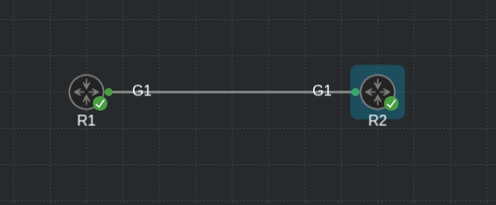
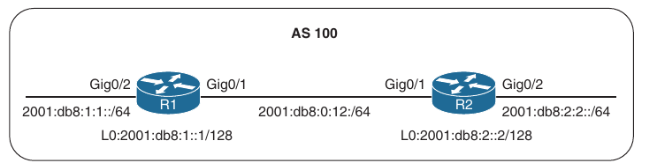
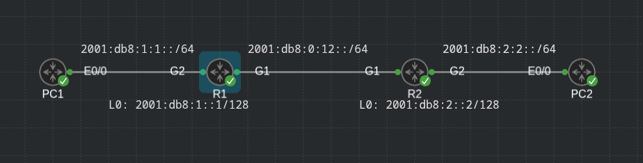

## EIGRPv6

1. EIGRPv6 Fundamentals

2. Troubleshoot EIGRPv6 neighbor issues

3. Troubleshooting IPv6 routes

4. Troubleshooting Named EIGRP

5. EIGRPv6 and Named EIGRP Trouble Tickets

- The original EIGRP routing protocol supports multiple protocol suites

- Protocol-dependent modules (PDMs) provides unique neighbor and topology tables for each protocol

- When the IPv6 address family is enabled, the routing protocol is commonly referred to as EIGRPv6

- The fundamentals of EIGRPv6 and guide through configuring and verifying it

- Examine how to troubleshoot common EIGRPv6 neighbor and route issues

- Exploring Named EIGRP

### EIGRPv6 Fundamentals

- EIGRP's functional behaviour is unchanged between IPv4 and IPv6

- The same adminstrative distance, metrics, timers and DUAL mechanisms are in place to build the routing table

- A detailed overview of the operation of the EIGRP protocol along with it's common features

- Discussing the components of the routing protocol that are unique to IPv6

#### EIGRPv6 Inter-Router Communication

- EIGRP packets are identified using the well-known protocol ID 88 for both IPv4 and IPv6

- When EIGRPv6 is enabled, the routers communicate with each other using the interface's IPv6 link-local address or the multicast link-local scoped address FF02::A

- Below is shown the source and destination addresses for the EIGRP packet types

```
EIGRP Packet            Source                      Destination                 Purpose

Hello                   Link-local address          FF02::A                     Neighbor discovery and keepalive

Acknowledgement         Link-local address          Link-local address          Acknowledges receipt of an update

Query                   Link-local address          FF02::A                     Request for route information during a topology change event

Reply                   Link-local address          Link-local address          A response to a query message

Update                  Link-local address          Link-local address          Adjacency forming

Update                  Link-local address          FF02::A                     Topology change
```

#### EIGRPv6 Configuration

- There are two methods for configuring IPv6 for EIGRP on IOS and IOS XE routers:

    - Classic AS mode

    - Named mode

##### EIGRPv6 Classic Mode configuration

- Classic mode is the original IOS method for enabling IPv6 on EIGRP

- In this mode, the routing process is configured using an autonomous system number

- The steps for configuring EIGRPv6 on an IOS router are as follows:

    1. Configure the EIGRPv6 process by using the global configuration command `ipv6 router eigrp <as-number>`

    2. Configure the router ID by using the IPv6 address family command `eigrp router-id <router-id>`

    The router ID should be manually assigned to ensure proper operation of the routing process

    The default behaviour of EIGRP is to locally assign a router ID based on the highest IPv4 loopback address or, if that is not available, the highest IPv4 address

    The router ID does not need to map to an IPv4 address; the ID value could be any 32-bit unique dotted-decimal identifier

    If an IPv4 address is not defined or if the router ID is not manually configured, the routing process does not initiate

    3. Enable the process on the interface by using the interface parameter command `ipv6 eigrp <as-number>`



- R1:

```
conf t
 ipv6 router eigrp 65001
  eigrp router-id 10.1.1.1
  exit
 interface GigabitEthernet1
  ip address 10.1.12.1 255.255.255.0
  negotiation auto
  ipv6 address 2001:DB8:0:1::1/64
  ipv6 eigrp 65001

 interface Loopback0
  ip address 10.1.1.1 255.255.255.255
  ipv6 address 2002:1:1:1::1/128
  ipv6 eigrp 65001
```

- R2:

```
conf t
 ipv6 router eigrp 65001
  eigrp router-id 10.2.2.2
  exit
 interface GigabitEthernet1
  ip address 10.1.12.2 255.255.255.0
  negotiation auto
  ipv6 address 2001:DB8:0:1::2/64
  ipv6 eigrp 65001

 interface Loopback0
  ip address 10.2.2.2 255.255.255.255
  ipv6 address 2002:1:2:2::2/128
  ipv6 eigrp 65001
```

- Nearly all EIGRP IPv6 features are configured in the same manner as in IPv4 EIGRP classic mode

- The primary difference is that the IPv6 keyword, rather than the IP keyword, precedes most of the commands

- One noticeable exception is the familiar IPv4 network statement in the EIGRP routing configuration mode

- The `network` statement does not exist within EIGRPv6

- The protocol must be enabled directly on the interface when using the classic IPv6 EIGRP AS configuration method

##### EIGRPv6 Named Mode Configuration

- EIGRP named mode configuration is a newer method for configuring the protocol on IOS and IOS XE routers

- Named mode provides support for IPv4, IPv6, and virtual routing and forwarding (VRF), all within a single EIGRP instance

- The steps for configuring EIGRP named mode are as follows:

    1. Configure the EIGRPv6 routing process in global configuration mode by using the command `router eigrp <process-name>`

    Unlike in classic mode, you specify a name instead of an autonomous system number

    2. Define the address family and autonomous system number (ASN) to the routing process by using the command `address-family ipv6 autonomous-system <as-number>`

    3. Assign the router ID by using the IPv6 address family command `eigrp router-id <router-id>`

- EIGRP Named mode uses a hierarchical configuration

- Most of the command structure is identical with that of EIGRP IPv4 named mode; this mode simplifies configuration and improves CLI usability

- All of the EIGRP-specific interface parameters are configured in the `af-interface default` or `af-interface <interface-id>` submode within the IPv6 address family of the named EIGRP process

- When the IPv6 address family is configured for the EIGRP named process, all the IPv6-enabled interfaces immediately start participating in routing

- To disable the routing process on the interface, the interface needs to be shut down in the af-interface configuration mode

- R1:

```
conf t
 router eigrp EIGRP-NAMED
  !
  address-family ipv6 unicast autonomous-system 65002
   !
   af-interface GigabitEthernet1
    shutdown
   exit-af-interface
   !
   af-interface Loopback0
    shutdown
   exit-af-interface
   !
   af-interface Loopback2
    passive-interface
   exit-af-interface
   !
   topology base
   exit-af-topology
   eigrp router-id 10.2.12.1
  exit-address-family
```

R2:

```
router eigrp EIGRP-NAMED
 !
 address-family ipv6 unicast autonomous-system 65002
  !
  af-interface Loopback0
   shutdown
  exit-af-interface
  !
  af-interface GigabitEthernet1
   shutdown
  exit-af-interface
  !
  af-interface Loopback2
   passive-interface
  exit-af-interface
  !
  topology base
  exit-af-topology
  eigrp router-id 10.2.12.2
 exit-address-family
```

- EIGRPv6 Verification:

- EIGRPv6 uses the same verification commands as for IPv4 EIGRP

- The only difference is that `ipv6` keyword is included in the command syntax

- Below are the IPv6 versions of show commands:

```
Command                                                         Description

show ipv6 eigrp interfaces [interface-id] [detail]              Displays the EIGRPv6 interfaces

show ipv6 eigrp neighbors                                       Displays the EIGRPv6 neighbors

show ipv6 route eigrp                                           Displays only EIGRP IPv6 routes in the routing table

show ipv6 protocols                                             Displays the current state of the active routing protocol processes
```

- Below is a simple topology in which EIGRPv6 AS 100 is enabled on routers R1 and R2 to provide connectivity between the networks





- Below is shown the full EIGRPv6 configuration for the sample topology

- Both EIGRPv6 classic AS and named mode are provided

- Notice in IOS classic mode that the routing protocol is applied to each physical interface

- In named mode, the protocol is automatically enabled on all interfaces

- R1 - classic configuration:

```
conf t
 ipv6 unicast-routing
 interface GigabitEthernet1
  ipv6 address FE80::1 link-local
  ipv6 address 2001:DB8:0:12::1/64
  ipv6 eigrp 100

 interface GigabitEthernet2
  ipv6 address FE80::1 link-local
  ipv6 address 2001:DB8:1:1::1/64
  ipv6 eigrp 100

 interface Loopback0
  ipv6 address 2001:DB8:1::1/128
  ipv6 eigrp 100

 ipv6 router eigrp 100
  passive-interface Loopback0
  eigrp router-id 192.168.1.1
```

- R2 - named mode configuration:

```
conf t
 interface GigabitEthernet1
  ipv6 address FE80::2 link-local
  ipv6 address 2001:DB8:0:12::2/64

 interface GigabitEthernet2
  ipv6 address FE80::2 link-local
  ipv6 address 2001:DB8:2:2::2/64

 interface Loopback0
  ipv6 address 2001:DB8:2::2/128

 router eigrp NAMED-MODE
  address-family ipv6 unicast autonomous-system 100
   af-interface Loopback0
    passive-interface
    exit
   eigrp router-id 192.168.2.2
```

