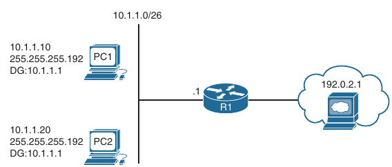
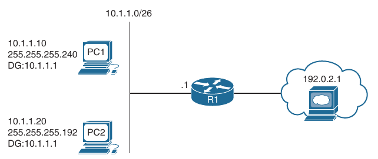
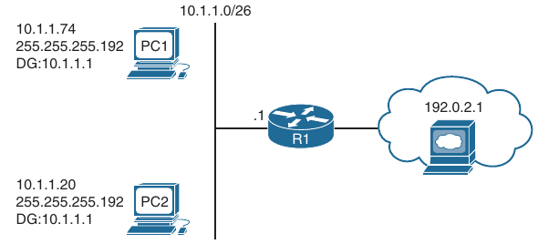
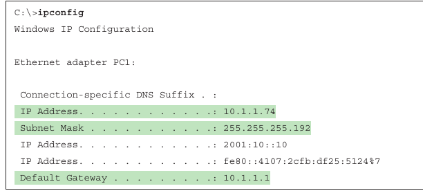
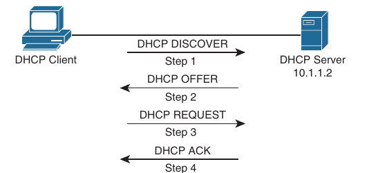
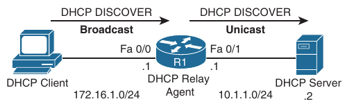
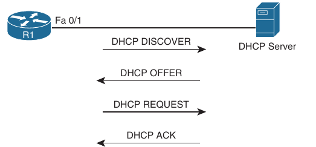
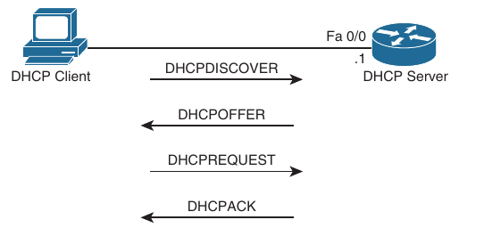
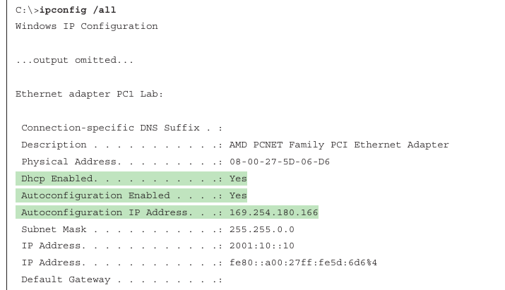

## IPv4/IPv6 Addressing and Routing review

1. IPv4 Addressing

2. DHCP for IPv4

3. IPv6 Addressing

4. IPv6 SLAAC, Stateful DHCPv6, Stateless DHCPv6

5. Packet Forwarding Process

6. Routing Information Sources

7. Static Routes

8. Trouble Tickets

- IPv6 is currently being deployed, but that deployment is occurring at a slow peace

- Most networks still rely on IPv4, and many new networks and network additions are being deployed only with IPv4

- Therefore you still need to the skills to successfully configure, verify and troubleshoot IPv4 addressing

- Typically when deploying IPv4 addresses, Dynamic Host Configuration Protocol (DHCP) is used so that addresses can be automatically assigned

- However, with this dynamic process, issues may arise that prevent a device from successfully obtaining an IPv4 address from a DHCP server

- How DHCP server operates and how to identify the issues that may prevent a client from obtaining an IP address from a DHCP server

- How IPv6-enabled devices determines whether a destination is local or remote and explores the various options for address assignment and what to look out for when troubleshooting

- Review the packet delivery process (also known as the routing process)

- This is the process that a router goes through when a packet arrives at an egress interface and needs to be packet switched to an egress interface

- It does not matter whether the packet is an IPv4 or IPv6 packet

- Either way, the router goes through the same steps to successfully take a packet from an ingress interface and packet switch it to the egress interface

- Review how a router populates the routing table with "the best" routes

- What classifies those routes as the best?

- Is an EIGRP-learned route better than a static route?

- What about an OSPF-learned route or a BGP-learned route?

- How do they compare with the other sources of routing information?

- Be able to identify why the router made the decision it made

- Static routes are part of every network

- However, because they are manually configured, they are prone to human error, which may lead to suboptimal routing or routing loops

- Review IPv4 and IPv6 static routing configuration and verification

### IPv4 Addressing

- Just as your personal street address uniquely defines where you live, an IPv4 address uniquely defines where a device resides in a network

- Your street address is made of two parts - the number of your residence and the street name - and the combination of those is unique to your city/town

- As a result, a pizza delivery person can bring your pizza to your house in 30 minutes, or it is free

- If your house is addressed incorrectly, you may not get your pizza, and you do not want that to happen

- Similarly with IPv4 addressing, if devices are addressed incorrectly, they may not receive the packets that are intended for them

- Therefore, it is imperative that you have a solid understanding of IPv4 addressing and how to verify that devices are addressed correctly on a network

- Review of IPv4 addressing and issues that can appear and how to troubleshoot them

### IPv4 Addressing issues

- An IPv4 address is made up of two parts: a network/subnet portion and a host portion

- It is imperative that all devices in the same network/subnet share exactly the same network/subnet portion

- If they are not the same, the PC could end up addressing the Layer 2 frame incorrectly and sending the packet in the wrong direction

- Below is shown a sample subnet (10.1.1.0/26) with two PCs and their default gateway - R1



- When PC1 needs to communicate with PC2, it does a DNS lookup for the IP address of PC2

- The IP address 10.1.1.20 is returned

- Now PC1 needs to determine whether PC2 is located in the same subnet because this determines whether the frame has the MAC address of PC2 of PC2, or the MAC address of the default gateway (DG)

- PC1 determines it's network/subnet portion by comparing it's IP address to it's subnet mask in in binary as follows:

```
00001010.00000001.00000001.00001010     PC1's IP address in binary
11111111.11111111.11111111.11000000     PC1's subnet mask in binary

-----------------------------------
00001010.00000001.00000001.00       PC1's network/subnet ID
```

- The 1's in the subnet mask identify the network portion

- Now PC1 compares exactly the same binary bits to those binary bits in PC2's address, as follows:

```
00001010.00000001.00000001.00       PC1's network - subnet ID
00001010.00000001.00000001.00010100     PC2's IP address in binary
```

- Because the binary bits are the same, PC1 concludes that PC2 is in the same network/subnet; therefore it communicates directly with it and does not need to send the data to it's default gateway

- PC1 creates a frame with it's own source MAC address and the MAC address of PC2 as destination

- Consider what occurs when PC1 needs to communicate with the web server at 192.0.2.1

- It does a DNS lookup for the IP address of the web server

- The IP address 192.0.2.1 is returned

- Now PC1 needs to determine whether the web server is located in the same network/subnet

- This determines whether the frame has the MAC address of the web server or the MAC address of the DG

- PC1 determines it's network/subnet portion by comparing it's IP address to it's subnet mask in binary, as follows:

```
00001010.00000001.00000001.00001010     (PC1's IP address in binary)
11111111.11111111.11111111.11000000     (PC1's subnet mask in binary)

-------------------------------------

00001010.00000001.00000001.00       (PC1's network/subnet ID)
```

- The 1's in the subnet mask identify the network portion

- Now PC1 compares exactly the same binary bits to those binary bits in the web server's address as follows:

```
00001010.00000001.00000001.00           PC1's network/subnet ID
11000000.00000000.00000010.00000001     Web server's IP address in binary
```

- PC1 concludes that the web server is on a different network/subnet because the bits are not the same; therefore, to communicate with the web server, it needs to send the data to it's default gateway

- PC1 creates a frame with it's own source MAC address and the MAC address of R1 as destination

- As you can see, accurate IP addressing is paramount for successful communication

- Let's look at what happens if PC1 is configured with the wrong subnet mask (255.255.255.240):



- PC1 determines it's network/subnet portion by comparing it's IP address to it's subnet mask in binary as follows:

```
00001010.00000001.00000001.00001010     (PC1's IP address in binary)
11111111.11111111.11111111.11110000     (PC1's subnet mask in binary)

-----------------------------------

00001010.00000001.00000001.0000         (PC1's network/subnet ID)
```

- Now PC1 compares the same binary bits with PC2's address as follows:

```
00001010.00000001.00000001.0000         (PC1's network/subnet ID)
00001010.00000001.00000001.00010100     (PC2's IP address in binary)

-----------------------------------
```

- PC1 concludes that PC2 is not in the same network/subnet because the binary bits are not the same

- Therefore it cannot communicate directly with it and needs to send the frame to the router so that the router can route the packet to the subnet PC2 is in

- Here, the PCs are actually connected to the same subnet, and as a result, there is an IPv4 addressing and connectivity issue

- Not only does an `improper subnet mask` cause issues, but an `innapropriate IP address combined with the correct subnet mask` also cause issues

- In addition, if the default gateway is not configured correctly, on the PCs, packets are not forwarded to the correct device when packets need to be sent to to a different subnet

- As a troubleshooter, you must quickly recognize these issues and eliminate them as possible issues

- You verify the IP addressing information as follows:

    - Windows PC - `ipconfig` command

    - Linux PC - `ip address` command

    - Cisco IOS router or switch: `show ip interface <intf-type intf-nr>`

#### Determining IP addresses Within a subnet

- A quick way to determine all the IP addresses that will be in a particular subnet



- To use this method, you need to find the most interesting octet in the subnet mask

- In binary, it's the octet with the last binary 1

- In decimal, is the last octet that is greater than 0

- In this case, for **255.255.255.192**, the fourth octet is the last octet with a value greater than 0

- The value of this octet is 192

- If your subnet mask were 255.255.192.0, then it would be the third octet

- Consider the subnet mask 255.255.255.0

- Because the forth octet is 0, it would be the third octet, and it's the last octet with a value greater than 0

- Now substract **192** from **256**

- The result is 64

- The number 64 represents the block size or the number you are counting by in that octet

- The subnet in this case is 10.1.1.0/26, and because the block size is 64, the subnet begins at 10.1.1.0/24 and ends at 10.1.1.63/26

- The next subnet is 10.1.1.64/26 to 10.1.1.127/26

- The third subnet is 10.1.1.128/26 to 10.1.1.191/26 and so on

- Now compare the addresses of devices with the subnet ranges you just identified

- In this case, PC1, PC2 and an interface on R1 are supposed to be in the same subnet

- As a result, they better will be addressed correctly, or communication will not occur correctly

- For example, if you are reviewing the output of `ipconfig` on PC1, now that you have the ranges, you can easily see that R1 is not on the same subnet as R1 and PC2

- Although they have the same subnet mask, in this case PC1 fails in the range 10.1.1.64/26 to 10.1.1.127/26, whereas PC2 and the default gateway fall in the range 10.1.1.0/26 to 10.1.1.63/26

- PC1 is in a different network/subnet, but it should be in the same subnet, according to the above figure

- You must fix the address on PC1 so that it is within the correct network/subnet



### DHCP for IPv4

- Dynamic Host Configuration Protocol (DHCP) is commonly used for assigning IPv4 address information to a network host

- Specifically, DHCP allows a DHCP client to obtain an IP address, subnet mask, default gateway IP address, DNS server IP address, and other types of IP addressing information from a DHCP server

- The DHCP server can be local within the subnet or in a remote subnet, or it can be the same device that is also the default gateway

- Because using DHCP is the most common way to deploy IPv4 addresses, you need to be well versed in the DHCP process and able to recognize issues related to DHCP

- How DHCP operates and focus on how to identify DHCP related issues

### Reviewing DHCP operations

- If you have a cable modem, Digital Subscriber Line (DSL), or fiber connection to your home, your router most likely obtains it's IP address from your service provider through DHCP

- The router is also acting as a DHCP server for the devices in your home

- In corporate networks, when a PC boots, that PC receives it's IP address range configuration information from a corporate DHCP server

- Below is illustrated the exchange of messages that occurs as a DHCP client obtains IP addressing information from a DHCP server

- This exchange is known as the DORA process because it involves Discover, Offer, Request and Acknowledgement messages



- The DORA process works as follows:

    1. When a DHCP client initially boots, it has no IP address, default gateway, or such configuration information

    - Therefore, the way a DHCP client initially communicates by sending a broadcast message (that is DHCPDISCOVER message) to destination IP address 255.255.255.255 and destination MAC address FFFF:FFFF:FFFF in an attempt to discover a DHCP server

    - The source IP address is 0.0.0.0 and the source MAC address is the MAC address of the sending device

    2. When a DHCP server receives a DHCPDISCOVER message, it can respond with a DHCPOFFER message with an unleased IP address, subnet mask, and default gateway information

    - Because the DHCPDISCOVER message is sent as broadcast, more than one DHCP server might respond to this Discover message with a DHCPOFFER

    - However, the client typically selects the server that sends the first DHCPOFFER response it received 

    3. The DHCP client communicates with the selected server by sending a broadcast DHCPREQUEST message indicating that it will be using the address provided in the DHCPOFFER and, as a result wants the associated address leased to itself

    4. Finally, the DHCP server responds to the client with a DHCPACK message indicating that the IP address is leased to the client and includes any additional DHCP options that might be needed at this point, such as the lease duration

- Notice that in step 1, the DHCPDISCOVER message is sent as broadcast

- The broadcast cannot cross a router boundary

- Therefore, if a client resides on a different network from the DHCP server, you need to configure the default gateway of the client as a DHCP relay agent to forward the broadcast packets as unicast packets to the server

- For this the following command can be used:

```
conf t
 interface f0/1
  ip helper-address <ip_address>
```

- This configures the router to relay DHCP messages to a DHCP server in the organization

- Below we can see that the DHCP client belongs to the 172.16.1.0/24 network and the DHCP server belongs to the 10.1.1.0/24 network

- Router R1 is configured as a DHCP relay agent



- R1 - configure DHCP relay agent:

```
conf t
 service dhcp
 interface f0/0
  ip helper-address 10.1.1.2
```

- In the configuration, also note the `service dhcp` command

- This command enables the DHCP service on the router, which must be enabled for the DHCP service to function

- This command is usually not required because the DHCP service is enabled by default; however when troubleshooting a DHCP relay agent issue, you might want to confirm that the service is enabled

- Also the `ip helper-address 10.1.1.2` command specifies the IP address of the DHCP server

- If the wrong IP address is specified, the DHCP messages are relayed to the wrong device

- In addition, the `ip helper-address` command must be configured on the interface that is receiving the DHCPDISCOVER message from the client

- If it isn't the router cannot relay the DHCP messages

- When you configure a router to act as as a DHCP relay agent, realize that it relays a few other broadcast types in addition to a DHCP message

- Other protocols that are forwarded by a DHCP relay agent include the following:

    - TFTP

    - Domain Name System (DNS)

    - Internet Time Service (ITS)

    - NetBIOS name server

    - NetBIOS datagram server

    - BootP

    - TACACS

- As a reference, below is a list of DHCP message types you might encounter while troubleshooting a DHCP issue

```
DHCP message                            Description

DHCPDISCOVER                            A client sends this message in an attempt to locate a DHCP server
                                        This message is sent to broadcast IP address IP address 255.255.255.255, using UDP port 67

DHCPOFFER                               A DHCP server sends this message in response to a DHCPDISCOVER message,
                                        using UDP port 68

DHCPREQUEST                             This broadcast message is a request from the client to the DHCP server for the IP addressing
                                        information and options that were received in the DHCPOFFER message

DHCPDECLINE                             This message is sent from a client to a DHCP server to inform the server that an IP address is
                                        already in use in the network

DHCPACK                                 A DHCP server sends this message to the client and includes IP configuration parameters

DHCPNACK                                A DHCP server sends this message to a client to inform the client declines to provide the client
                                        with the requested IP configuration information

DHCPRELEASE                             A client sends this message to a DHCP server and informs the DHCP server that the client has
                                        released it's DHCP lease, thus allowing the DHCP server to reassign the client IP address to another client

DHCPINFORM                              A client sends this message to the DHCP server and requests IP configuration parameters. Such a
                                        message might be sent from an access server requesting IP configuration information for a remote client
                                        attaching to the access server
```

- In addition to acting as a DHCP relay agent, a router might act as a DHCP client

- Specifically, the interface of a router might obtain it's IP address from a DHCP server

- Below is shown a router acting as a DHCP client, where the router's f0/1 interface obtains it's IP address from a DHCP server

- The following snippet provides the configuration for the router in the topology (that is R1)

- Notice that the **dhcp** option is used in the `ip address` command, instead of the usual ip address and subnet mask combination



```
conf t
 interface f0/1
  ip address dhcp
```

- A router and multilayer switch can also act as an DHCP server

- Below is shown a router acting as a DHCP server and after it is the router configuration



- R1 configuration

```
conf t
 ip dhcp excluded-address 10.8.8.1 10.8.8.10

 ip dhcp pool POOL-A
  network 10.8.8.0 255.255.255.0
  default-router 10.8.8.1
  dns-server 192.168.1.1
  netbios-name-server 192.168.1.2
  option 150 10.150.150.150
```

- The `ip dhcp excluded-address 10.8.8.1 10.8.8.10` command prevents DHCP from assigning those IP addresses to a client

- Note that you don't have to include the IP address of the router interface in this exclusion because the router never hands out it's own interface IP address

- The `ip dhcp pool POOL-A` command creates a DHCP pool named POOL-A

- This pool hands out IP addresses from the 10.8.8.0/24 network with a default gateway of 10.8.8.1, a DNS server of 192.168.1.1, a WINS server of 192.168.1.2, and the IP address of a TFTP server with option 150

- (Note that option 66 can also be used to hand out the address of a TFTP server)

- If your device is configured to receive an IP address from a DHCP server but the IP address shown on the client is an Automatic Private IP Addressing (APIPA) address (169.254.x.x) because of autoconfiguration, you can conclude that the client could not obtain an IP address from the DHCP server

- However, do not immediately assume that DHCP is the problem

- It is quite possible that you have a Layer 3 Routing problem, or you might have a Layer 2 problem, such as VLANs, trunks, Spanning Tree Protocol (STP), or security preventing the client's DHCPDISCOVER to reach the DHCP server



#### Potential DHCP Troubleshooting Issues

- When troubleshooting what you suspect might be a DHCP issue, consider the following potential issues:

    - **Router failing to forward broadcasts**: By default, a router does not forward broadcasts, including DHCPDISCOVER broadcast messages

    - Therefore, a router needs to be explicitly configured to act as DHCP relay agent if the DHCP client and DHCP server are on different subnets

    - **DHCP pool out of IP addresses**: A DHCP pool contains a finite number of addresses

    - Once a pool becomes depleted, new DHCP requests are rejected

    - **Misconfiguration**: The configuration of a DHCP server might be incorrect

    - For example, the range of network addresses given out by a particular pool might be incorrect, or the exclusion of addresses statically assigned to routers or DNS servers might be incorrect

    - Even the lease could be too high or too low

    - For example, a lease duration that is too high may cause pool exhaustion if you have more clients than the pool can support

    - Consider a wireless network at an airport

    - Let's say there are 4096 addresses in the pool with a lease duration of 12 hours

    - Since users are typically not in an airport for more than 4 hours, this lease duration is too long, and the IP addresses will still be leased to that user until the lease expires, even if the user is no longer in the airport

    - Therefore, as the day progresses, more addresses are leased until the pool is exhausted

    - So setting a lower lease duration, such as 2 hours, would ensure that the lease expires sooner that later and helps prevent pool exhaustion

    - **Duplicate IP Addresses**: A DHCP server might hand out an IP address to a client that is already statically assigned to another host on the network

    - These duplicate IP addresses can cause connectivity issues for both the DHCP client and the host that was statically configured for the IP address

    - **Redundant services not communicating**: Some DHCP servers coexist with other DHCP servers for redundancy

    - For such redundancy to function, these DHCP servers need to communicate with one another

    - If the interserver communication fails, the DHCP servers hand out overlapping IP addresses to their clients

    - **The "pull" nature of DHCP**: When a DHCP client wants an IP address, it requests an IP address from the DHCP server

    - However, the DHCP server has no ability to initiate a change in the client's IP address after the client obtains an IP address

    - In other words, the DHCP client pulls information from the DHCP server; the DHCP server cannot push information changes to the DHCP client

    - **Interface not configured with IP address in DHCP pool**: A router or a multilayer switch that is acting as a DHCP server must have an interface with an IP address that is part of the pool/subnet for which it is handing out IP addresses

    - The router only hands the addresses in the pool to clients reachable out that interface

    - This ensures that the router interface and the clients are in the same subnet

    - However, note that this is not the case if a relay agent is forwarding DHCP messages between the client and the router that is the DHCP server

    - In this case, the DHCP server does not have an IP address on an interface that is part of the pool for which is handing out addresses

#### DHCP Troubleshooting Commands

- The following snippet provides sample output from the `show ip dhcp conflict` command

```
R1#show ip dhcp conflict 
IP address        Detection method   Detection time          VRF
172.16.1.3        Ping               Oct 15 2025 8:56 PM
```

- The output indicates a duplicate 172.16.1.3 IP address on the network, which the router discovered via ping

- You clear the information displayed after resolving the duplicate address issue on the network as follows:

```
clear ip dhcp conflict *
```

