## IPv4/IPv6 Addressing and Routing review

1. IPv4 Addressing

2. DHCP for IPv4

3. IPv6 Addressing

4. IPv6 SLAAC, Stateful DHCPv6, Stateless DHCPv6

5. Packet Forwarding Process

6. Routing Information Sources

7. Static Routes

8. Trouble Tickets

- IPv6 is currently being deployed, but that deployment is occurring at a slow peace

- Most networks still rely on IPv4, and many new networks and network additions are being deployed only with IPv4

- Therefore you still need to the skills to successfully configure, verify and troubleshoot IPv4 addressing

- Typically when deploying IPv4 addresses, Dynamic Host Configuration Protocol (DHCP) is used so that addresses can be automatically assigned

- However, with this dynamic process, issues may arise that prevent a device from successfully obtaining an IPv4 address from a DHCP server

- How DHCP server operates and how to identify the issues that may prevent a client from obtaining an IP address from a DHCP server

- How IPv6-enabled devices determines whether a destination is local or remote and explores the various options for address assignment and what to look out for when troubleshooting

- Review the packet delivery process (also known as the routing process)

- This is the process that a router goes through when a packet arrives at an egress interface and needs to be packet switched to an egress interface

- It does not matter whether the packet is an IPv4 or IPv6 packet

- Either way, the router goes through the same steps to successfully take a packet from an ingress interface and packet switch it to the egress interface

- Review how a router populates the routing table with "the best" routes

- What classifies those routes as the best?

- Is an EIGRP-learned route better than a static route?

- What about an OSPF-learned route or a BGP-learned route?

- How do they compare with the other sources of routing information?

- Be able to identify why the router made the decision it made

- Static routes are part of every network

- However, because they are manually configured, they are prone to human error, which may lead to suboptimal routing or routing loops

- Review IPv4 and IPv6 static routing configuration and verification

### IPv4 Addressing

- Just as your personal street address uniquely defines where you live, an IPv4 address uniquely defines where a device resides in a network

- Your street address is made of two parts - the number of your residence and the street name - and the combination of those is unique to your city/town

- As a result, a pizza delivery person can bring your pizza to your house in 30 minutes, or it is free

- If your house is addressed incorrectly, you may not get your pizza, and you do not want that to happen

- Similarly with IPv4 addressing, if devices are addressed incorrectly, they may not receive the packets that are intended for them

- Therefore, it is imperative that you have a solid understanding of IPv4 addressing and how to verify that devices are addressed correctly on a network

- Review of IPv4 addressing and issues that can appear and how to troubleshoot them

### IPv4 Addressing issues

- An IPv4 address is made up of two parts: a network/subnet portion and a host portion

- It is imperative that all devices in the same network/subnet share exactly the same network/subnet portion

- If they are not the same, the PC could end up addressing the Layer 2 frame incorrectly and sending the packet in the wrong direction

- Below is shown a sample subnet (10.1.1.0/26) with two PCs and their default gateway - R1

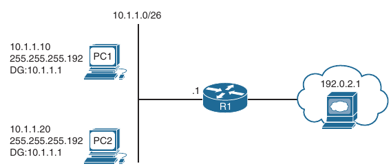

- When PC1 needs to communicate with PC2, it does a DNS lookup for the IP address of PC2

- The IP address 10.1.1.20 is returned

- Now PC1 needs to determine whether PC2 is located in the same subnet because this determines whether the frame has the MAC address of PC2 of PC2, or the MAC address of the default gateway (DG)

- PC1 determines it's network/subnet portion by comparing it's IP address to it's subnet mask in in binary as follows:

```
00001010.00000001.00000001.00001010     PC1's IP address in binary
11111111.11111111.11111111.11000000     PC1's subnet mask in binary

-----------------------------------
00001010.00000001.00000001.00       PC1's network/subnet ID
```

- The 1's in the subnet mask identify the network portion

- Now PC1 compares exactly the same binary bits to those binary bits in PC2's address, as follows:

```
00001010.00000001.00000001.00       PC1's network - subnet ID
00001010.00000001.00000001.00010100     PC2's IP address in binary
```

- Because the binary bits are the same, PC1 concludes that PC2 is in the same network/subnet; therefore it communicates directly with it and does not need to send the data to it's default gateway

- PC1 creates a frame with it's own source MAC address and the MAC address of PC2 as destination

- Consider what occurs when PC1 needs to communicate with the web server at 192.0.2.1

- It does a DNS lookup for the IP address of the web server

- The IP address 192.0.2.1 is returned

- Now PC1 needs to determine whether the web server is located in the same network/subnet

- This determines whether the frame has the MAC address of the web server or the MAC address of the DG

- PC1 determines it's network/subnet portion by comparing it's IP address to it's subnet mask in binary, as follows:

```
00001010.00000001.00000001.00001010     (PC1's IP address in binary)
11111111.11111111.11111111.11000000     (PC1's subnet mask in binary)

-------------------------------------

00001010.00000001.00000001.00       (PC1's network/subnet ID)
```

- The 1's in the subnet mask identify the network portion

- Now PC1 compares exactly the same binary bits to those binary bits in the web server's address as follows:

```
00001010.00000001.00000001.00           PC1's network/subnet ID
11000000.00000000.00000010.00000001     Web server's IP address in binary
```

- PC1 concludes that the web server is on a different network/subnet because the bits are not the same; therefore, to communicate with the web server, it needs to send the data to it's default gateway

- PC1 creates a frame with it's own source MAC address and the MAC address of R1 as destination

- As you can see, accurate IP addressing is paramount for successful communication

- Let's look at what happens if PC1 is configured with the wrong subnet mask (255.255.255.240):

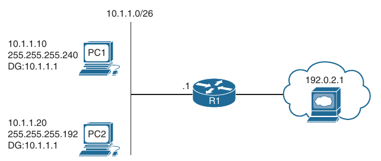

- PC1 determines it's network/subnet portion by comparing it's IP address to it's subnet mask in binary as follows:

```
00001010.00000001.00000001.00001010     (PC1's IP address in binary)
11111111.11111111.11111111.11110000     (PC1's subnet mask in binary)

-----------------------------------

00001010.00000001.00000001.0000         (PC1's network/subnet ID)
```

- Now PC1 compares the same binary bits with PC2's address as follows:

```
00001010.00000001.00000001.0000         (PC1's network/subnet ID)
00001010.00000001.00000001.00010100     (PC2's IP address in binary)

-----------------------------------
```

- PC1 concludes that PC2 is not in the same network/subnet because the binary bits are not the same

- Therefore it cannot communicate directly with it and needs to send the frame to the router so that the router can route the packet to the subnet PC2 is in

- Here, the PCs are actually connected to the same subnet, and as a result, there is an IPv4 addressing and connectivity issue

- Not only does an `improper subnet mask` cause issues, but an `innapropriate IP address combined with the correct subnet mask` also cause issues

- In addition, if the default gateway is not configured correctly, on the PCs, packets are not forwarded to the correct device when packets need to be sent to to a different subnet

- As a troubleshooter, you must quickly recognize these issues and eliminate them as possible issues

- You verify the IP addressing information as follows:

    - Windows PC - `ipconfig` command

    - Linux PC - `ip address` command

    - Cisco IOS router or switch: `show ip interface <intf-type intf-nr>`

#### Determining IP addresses Within a subnet

- A quick way to determine all the IP addresses that will be in a particular subnet

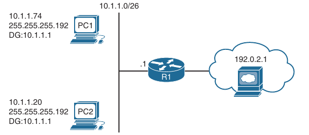

- To use this method, you need to find the most interesting octet in the subnet mask

- In binary, it's the octet with the last binary 1

- In decimal, is the last octet that is greater than 0

- In this case, for **255.255.255.192**, the fourth octet is the last octet with a value greater than 0

- The value of this octet is 192

- If your subnet mask were 255.255.192.0, then it would be the third octet

- Consider the subnet mask 255.255.255.0

- Because the forth octet is 0, it would be the third octet, and it's the last octet with a value greater than 0

- Now substract **192** from **256**

- The result is 64

- The number 64 represents the block size or the number you are counting by in that octet

- The subnet in this case is 10.1.1.0/26, and because the block size is 64, the subnet begins at 10.1.1.0/24 and ends at 10.1.1.63/26

- The next subnet is 10.1.1.64/26 to 10.1.1.127/26

- The third subnet is 10.1.1.128/26 to 10.1.1.191/26 and so on

- Now compare the addresses of devices with the subnet ranges you just identified

- In this case, PC1, PC2 and an interface on R1 are supposed to be in the same subnet

- As a result, they better will be addressed correctly, or communication will not occur correctly

- For example, if you are reviewing the output of `ipconfig` on PC1, now that you have the ranges, you can easily see that R1 is not on the same subnet as R1 and PC2

- Although they have the same subnet mask, in this case PC1 fails in the range 10.1.1.64/26 to 10.1.1.127/26, whereas PC2 and the default gateway fall in the range 10.1.1.0/26 to 10.1.1.63/26

- PC1 is in a different network/subnet, but it should be in the same subnet, according to the above figure

- You must fix the address on PC1 so that it is within the correct network/subnet

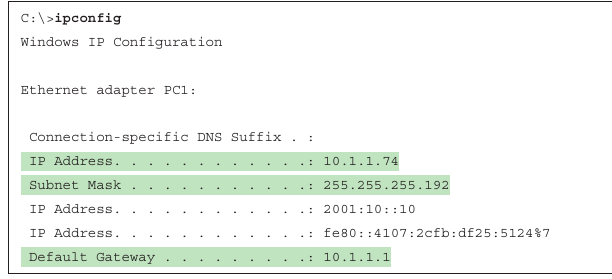

### DHCP for IPv4

- Dynamic Host Configuration Protocol (DHCP) is commonly used for assigning IPv4 address information to a network host

- Specifically, DHCP allows a DHCP client to obtain an IP address, subnet mask, default gateway IP address, DNS server IP address, and other types of IP addressing information from a DHCP server

- The DHCP server can be local within the subnet or in a remote subnet, or it can be the same device that is also the default gateway

- Because using DHCP is the most common way to deploy IPv4 addresses, you need to be well versed in the DHCP process and able to recognize issues related to DHCP

- How DHCP operates and focus on how to identify DHCP related issues

### Reviewing DHCP operations

- If you have a cable modem, Digital Subscriber Line (DSL), or fiber connection to your home, your router most likely obtains it's IP address from your service provider through DHCP

- The router is also acting as a DHCP server for the devices in your home

- In corporate networks, when a PC boots, that PC receives it's IP address range configuration information from a corporate DHCP server

- Below is illustrated the exchange of messages that occurs as a DHCP client obtains IP addressing information from a DHCP server

- This exchange is known as the DORA process because it involves Discover, Offer, Request and Acknowledgement messages

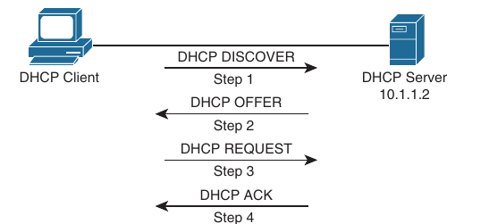

- The DORA process works as follows:

    1. When a DHCP client initially boots, it has no IP address, default gateway, or such configuration information

    - Therefore, the way a DHCP client initially communicates by sending a broadcast message (that is DHCPDISCOVER message) to destination IP address 255.255.255.255 and destination MAC address FFFF:FFFF:FFFF in an attempt to discover a DHCP server

    - The source IP address is 0.0.0.0 and the source MAC address is the MAC address of the sending device

    2. When a DHCP server receives a DHCPDISCOVER message, it can respond with a DHCPOFFER message with an unleased IP address, subnet mask, and default gateway information

    - Because the DHCPDISCOVER message is sent as broadcast, more than one DHCP server might respond to this Discover message with a DHCPOFFER

    - However, the client typically selects the server that sends the first DHCPOFFER response it received 

    3. The DHCP client communicates with the selected server by sending a broadcast DHCPREQUEST message indicating that it will be using the address provided in the DHCPOFFER and, as a result wants the associated address leased to itself

    4. Finally, the DHCP server responds to the client with a DHCPACK message indicating that the IP address is leased to the client and includes any additional DHCP options that might be needed at this point, such as the lease duration

- Notice that in step 1, the DHCPDISCOVER message is sent as broadcast

- The broadcast cannot cross a router boundary

- Therefore, if a client resides on a different network from the DHCP server, you need to configure the default gateway of the client as a DHCP relay agent to forward the broadcast packets as unicast packets to the server

- For this the following command can be used:

```
conf t
 interface f0/1
  ip helper-address <ip_address>
```

- This configures the router to relay DHCP messages to a DHCP server in the organization

- Below we can see that the DHCP client belongs to the 172.16.1.0/24 network and the DHCP server belongs to the 10.1.1.0/24 network

- Router R1 is configured as a DHCP relay agent

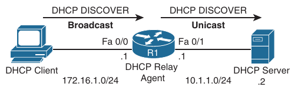

- R1 - configure DHCP relay agent:

```
conf t
 service dhcp
 interface f0/0
  ip helper-address 10.1.1.2
```

- In the configuration, also note the `service dhcp` command

- This command enables the DHCP service on the router, which must be enabled for the DHCP service to function

- This command is usually not required because the DHCP service is enabled by default; however when troubleshooting a DHCP relay agent issue, you might want to confirm that the service is enabled

- Also the `ip helper-address 10.1.1.2` command specifies the IP address of the DHCP server

- If the wrong IP address is specified, the DHCP messages are relayed to the wrong device

- In addition, the `ip helper-address` command must be configured on the interface that is receiving the DHCPDISCOVER message from the client

- If it isn't the router cannot relay the DHCP messages

- When you configure a router to act as as a DHCP relay agent, realize that it relays a few other broadcast types in addition to a DHCP message

- Other protocols that are forwarded by a DHCP relay agent include the following:

    - TFTP

    - Domain Name System (DNS)

    - Internet Time Service (ITS)

    - NetBIOS name server

    - NetBIOS datagram server

    - BootP

    - TACACS

- As a reference, below is a list of DHCP message types you might encounter while troubleshooting a DHCP issue

```
DHCP message                            Description

DHCPDISCOVER                            A client sends this message in an attempt to locate a DHCP server
                                        This message is sent to broadcast IP address IP address 255.255.255.255, using UDP port 67

DHCPOFFER                               A DHCP server sends this message in response to a DHCPDISCOVER message,
                                        using UDP port 68

DHCPREQUEST                             This broadcast message is a request from the client to the DHCP server for the IP addressing
                                        information and options that were received in the DHCPOFFER message

DHCPDECLINE                             This message is sent from a client to a DHCP server to inform the server that an IP address is
                                        already in use in the network

DHCPACK                                 A DHCP server sends this message to the client and includes IP configuration parameters

DHCPNACK                                A DHCP server sends this message to a client to inform the client declines to provide the client
                                        with the requested IP configuration information

DHCPRELEASE                             A client sends this message to a DHCP server and informs the DHCP server that the client has
                                        released it's DHCP lease, thus allowing the DHCP server to reassign the client IP address to another client

DHCPINFORM                              A client sends this message to the DHCP server and requests IP configuration parameters. Such a
                                        message might be sent from an access server requesting IP configuration information for a remote client
                                        attaching to the access server
```

- In addition to acting as a DHCP relay agent, a router might act as a DHCP client

- Specifically, the interface of a router might obtain it's IP address from a DHCP server

- Below is shown a router acting as a DHCP client, where the router's f0/1 interface obtains it's IP address from a DHCP server

- The following snippet provides the configuration for the router in the topology (that is R1)

- Notice that the **dhcp** option is used in the `ip address` command, instead of the usual ip address and subnet mask combination

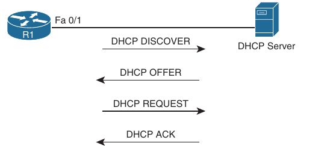

```
conf t
 interface f0/1
  ip address dhcp
```

- A router and multilayer switch can also act as an DHCP server

- Below is shown a router acting as a DHCP server and after it is the router configuration

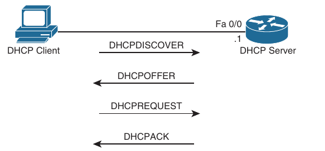

- R1 configuration

```
conf t
 ip dhcp excluded-address 10.8.8.1 10.8.8.10

 ip dhcp pool POOL-A
  network 10.8.8.0 255.255.255.0
  default-router 10.8.8.1
  dns-server 192.168.1.1
  netbios-name-server 192.168.1.2
  option 150 10.150.150.150
```

- The `ip dhcp excluded-address 10.8.8.1 10.8.8.10` command prevents DHCP from assigning those IP addresses to a client

- Note that you don't have to include the IP address of the router interface in this exclusion because the router never hands out it's own interface IP address

- The `ip dhcp pool POOL-A` command creates a DHCP pool named POOL-A

- This pool hands out IP addresses from the 10.8.8.0/24 network with a default gateway of 10.8.8.1, a DNS server of 192.168.1.1, a WINS server of 192.168.1.2, and the IP address of a TFTP server with option 150

- (Note that option 66 can also be used to hand out the address of a TFTP server)

- If your device is configured to receive an IP address from a DHCP server but the IP address shown on the client is an Automatic Private IP Addressing (APIPA) address (169.254.x.x) because of autoconfiguration, you can conclude that the client could not obtain an IP address from the DHCP server

- However, do not immediately assume that DHCP is the problem

- It is quite possible that you have a Layer 3 Routing problem, or you might have a Layer 2 problem, such as VLANs, trunks, Spanning Tree Protocol (STP), or security preventing the client's DHCPDISCOVER to reach the DHCP server

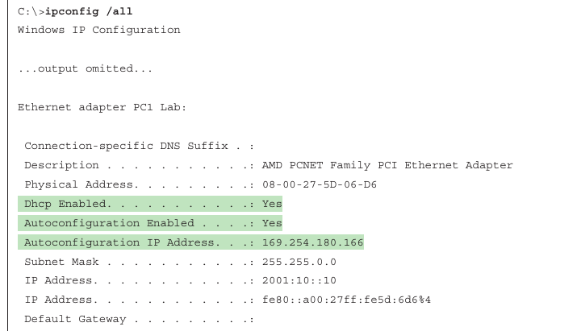

#### Potential DHCP Troubleshooting Issues

- When troubleshooting what you suspect might be a DHCP issue, consider the following potential issues:

    - **Router failing to forward broadcasts**: By default, a router does not forward broadcasts, including DHCPDISCOVER broadcast messages

    - Therefore, a router needs to be explicitly configured to act as DHCP relay agent if the DHCP client and DHCP server are on different subnets

    - **DHCP pool out of IP addresses**: A DHCP pool contains a finite number of addresses

    - Once a pool becomes depleted, new DHCP requests are rejected

    - **Misconfiguration**: The configuration of a DHCP server might be incorrect

    - For example, the range of network addresses given out by a particular pool might be incorrect, or the exclusion of addresses statically assigned to routers or DNS servers might be incorrect

    - Even the lease could be too high or too low

    - For example, a lease duration that is too high may cause pool exhaustion if you have more clients than the pool can support

    - Consider a wireless network at an airport

    - Let's say there are 4096 addresses in the pool with a lease duration of 12 hours

    - Since users are typically not in an airport for more than 4 hours, this lease duration is too long, and the IP addresses will still be leased to that user until the lease expires, even if the user is no longer in the airport

    - Therefore, as the day progresses, more addresses are leased until the pool is exhausted

    - So setting a lower lease duration, such as 2 hours, would ensure that the lease expires sooner that later and helps prevent pool exhaustion

    - **Duplicate IP Addresses**: A DHCP server might hand out an IP address to a client that is already statically assigned to another host on the network

    - These duplicate IP addresses can cause connectivity issues for both the DHCP client and the host that was statically configured for the IP address

    - **Redundant services not communicating**: Some DHCP servers coexist with other DHCP servers for redundancy

    - For such redundancy to function, these DHCP servers need to communicate with one another

    - If the interserver communication fails, the DHCP servers hand out overlapping IP addresses to their clients

    - **The "pull" nature of DHCP**: When a DHCP client wants an IP address, it requests an IP address from the DHCP server

    - However, the DHCP server has no ability to initiate a change in the client's IP address after the client obtains an IP address

    - In other words, the DHCP client pulls information from the DHCP server; the DHCP server cannot push information changes to the DHCP client

    - **Interface not configured with IP address in DHCP pool**: A router or a multilayer switch that is acting as a DHCP server must have an interface with an IP address that is part of the pool/subnet for which it is handing out IP addresses

    - The router only hands the addresses in the pool to clients reachable out that interface

    - This ensures that the router interface and the clients are in the same subnet

    - However, note that this is not the case if a relay agent is forwarding DHCP messages between the client and the router that is the DHCP server

    - In this case, the DHCP server does not have an IP address on an interface that is part of the pool for which is handing out addresses

#### DHCP Troubleshooting Commands

- The following snippet provides sample output from the `show ip dhcp conflict` command

```
R1#show ip dhcp conflict  
IP address        Detection method   Detection time          VRF
10.2.2.11         Ping               Feb 09 2026 07:41 PM                             
```

```
R1#
*Feb  8 20:37:52.943: %DHCPD-4-DECLINE_CONFLICT: DHCP address conflict:  client 0063.6973.636f.2d35.3235.342e.3030.3534.2e37.3935.652d.4769.302f.30 declined 10.2.2.11.

R1#show ip dhcp conflict 
IP address        Detection method   Detection time          VRF
10.2.2.11         Gratuitous ARP     Feb 08 2026 08:37 PM              
```

- The output indicates a duplicate 172.16.1.3 IP address on the network, which the router discovered via ping

- You clear the information displayed after resolving the duplicate address issue on the network as follows:

```
clear ip dhcp conflict *
```

- Below we can see the output of `show ip dhcp binding` command

```
R1#show ip dhcp binding 
Bindings from all pools not associated with VRF:
IP address          Client-ID/              Lease expiration        Type
                    Hardware address/
                    User name
10.1.4.11           0063.6973.636f.2d35.    Feb 10 2026 07:42 PM    Automatic
                    3235.342e.3030.6234.
                    2e37.3766.332d.4769.
                    302f.30
10.2.2.12           0063.6973.636f.2d61.    Feb 10 2026 07:41 PM    Automatic
                    6162.622e.6363.3830.
                    2e31.3530.302d.566c.
                    31
10.2.2.13           0063.6973.636f.2d35.    Feb 10 2026 07:41 PM    Automatic
                    3235.342e.3030.3534.
                    2e37.3935.652d.4769.
                    302f.30
```

- Below is shown the output of `debug ip dhcp server events` command

- The output shows updates to the DHCP database

```
R1#debug ip dhcp server events 
DHCP server event debugging is on.
R1#
R1#
R1#
*Feb 11 20:09:18.955: DHCPD: Sending notification of TERMINATION:
*Feb 11 20:09:18.955:  DHCPD: address 10.2.2.11 mask 255.255.255.0
*Feb 11 20:09:18.956:  DHCPD: reason flags: RELEASE 
*Feb 11 20:09:18.956:   DHCPD: htype 1 chaddr aabb.cc80.1500
*Feb 11 20:09:18.957:   DHCPD: lease time remaining (secs) = 85909
*Feb 11 20:09:18.958: DHCPD: returned 10.2.2.11 to address pool LAN-RELAY.
R1#
*Feb 11 20:09:20.713: DHCPD: Seeing if there is an internally specified pool class:
*Feb 11 20:09:20.714:   DHCPD: htype 1 chaddr aabb.cc80.1500
*Feb 11 20:09:20.714:   DHCPD: remote id 020a00000a01020100000000
*Feb 11 20:09:20.715:   DHCPD: circuit id 00000000
*Feb 11 20:09:20.715: DHCPD: there is no pool for 10.1.2.1.
R1#
*Feb 11 20:09:57.732: DHCPD: Sending notification of DISCOVER:
*Feb 11 20:09:57.733:   DHCPD: htype 1 chaddr aabb.cc80.1500
*Feb 11 20:09:57.733:   DHCPD: remote id 020a00000a01020100000000
*Feb 11 20:09:57.734:   DHCPD: circuit id 00000000
*Feb 11 20:09:57.734: DHCPD: Seeing if there is an internally specified pool class:
*Feb 11 20:09:57.735:   DHCPD: htype 1 chaddr aabb.cc80.1500
*Feb 11 20:09:57.735:   DHCPD: remote id 020a00000a01020100000000
*Feb 11 20:09:57.735:   DHCPD: circuit id 00000000
*Feb 11 20:09:57.738: DHCPD: Allocated binding FFF2368
*Feb 11 20:09:57.738: DHCPD: Adding binding to radix tree (10.2.2.14)
R1#
*Feb 11 20:09:57.739: DHCPD: Adding binding to hash tree
*Feb 11 20:09:57.740: DHCPD: assigned IP address 10.2.2.14 to client 0063.6973.636f.2d61.6162.622e.6363.3830.2e31.3530.302d.566c.31.
R1#
*Feb 11 20:09:59.742: DHCPD: Sending notification of DISCOVER:
*Feb 11 20:09:59.743:   DHCPD: htype 1 chaddr aabb.cc80.1500
*Feb 11 20:09:59.743:   DHCPD: remote id 020a00000a01020100000000
*Feb 11 20:09:59.744:   DHCPD: circuit id 00000000
*Feb 11 20:09:59.744: DHCPD: Seeing if there is an internally specified pool class:
*Feb 11 20:09:59.745:   DHCPD: htype 1 chaddr aabb.cc80.1500
*Feb 11 20:09:59.745:   DHCPD: remote id 020a00000a01020100000000
*Feb 11 20:09:59.746:   DHCPD: circuit id 00000000
*Feb 11 20:09:59.754: DHCPD: Sending notification of ASSIGNMENT:
*Feb 11 20:09:59.755:  DHCPD: address 10.2.2.14 mask 255.255.255.0
R1#
*Feb 11 20:09:59.755:   DHCPD: htype 1 chaddr aabb.cc80.1500
*Feb 11 20:09:59.756:   DHCPD: lease time remaining (secs) = 86400
R1#
*Feb 11 20:10:06.999: DHCPD: Sending notification of DISCOVER:
*Feb 11 20:10:07.000:   DHCPD: htype 1 chaddr aabb.cc00.1400
*Feb 11 20:10:07.000:   DHCPD: remote id 020a00000a01020100000000
*Feb 11 20:10:07.001:   DHCPD: circuit id 00000000
*Feb 11 20:10:07.001: DHCPD: Seeing if there is an internally specified pool class:
*Feb 11 20:10:07.002:   DHCPD: htype 1 chaddr aabb.cc00.1400
*Feb 11 20:10:07.002:   DHCPD: remote id 020a00000a01020100000000
*Feb 11 20:10:07.003:   DHCPD: circuit id 00000000
*Feb 11 20:10:07.003: DHCPD: Found previous server binding
*Feb 11 20:10:07.013: DHCPD: Sending notification of ASSIGNMENT:
R1#
*Feb 11 20:10:07.014:  DHCPD: address 10.2.2.13 mask 255.255.255.0
*Feb 11 20:10:07.014:   DHCPD: htype 1 chaddr aabb.cc00.1400
*Feb 11 20:10:07.015:   DHCPD: lease time remaining (secs) = 86400
```

- Below is shown the sample output of `debug ip dhcp server packet` command

- The output shows a DHCPRELEASE message being received when a DHCP client with IP address 10.2.2.13 is shut down

```
R1#debug ip dhcp server packet 
DHCP server packet debugging is on.
R1#
R1#
R1#
*Feb 11 20:14:49.900: DHCPD: client's VPN is .
*Feb 11 20:14:49.901: DHCPD: No option 125
*Feb 11 20:14:49.901: DHCPD: DHCPRELEASE message received from client 0063.6973.636f.2d61.6162.622e.6363.3030.2e31.3430.302d.4574.302f.30 (10.2.2.13).
*Feb 11 20:14:49.902: DHCPD: Option 125 not present in the msg.
*Feb 11 20:14:49.902: DHCPD: removing ARP entry (10.2.2.13 vrf default).
R1#
*Feb 11 20:14:51.077: DHCPD: client's VPN is .
*Feb 11 20:14:51.078: DHCPD: No option 125
*Feb 11 20:14:51.078: DHCPD: DHCPRELEASE message received from client 0063.6973.636f.2d61.6162.622e.6363.3030.2e31.3430.302d.4574.302f.30 (10.2.2.13).
*Feb 11 20:14:51.079: DHCPD: Finding a relay for client 0063.6973.636f.2d61.6162.622e.6363.3030.2e31.3430.302d.4574.302f.30 on interface GigabitEthernet0/0.
*Feb 11 20:14:51.080: DHCPD: Option 125 not present in the msg.
R1#
*Feb 11 20:14:58.787: DHCPD: client's VPN is .
*Feb 11 20:14:58.788: DHCPD: No option 125
*Feb 11 20:14:58.789: DHCPD: Option 125 not present in the msg.
*Feb 11 20:14:58.789: DHCPD: DHCPDISCOVER received from client 0063.6973.636f.2d61.6162.622e.6363.3030.2e31.3430.302d.4574.302f.30 through relay 10.2.2.1.
*Feb 11 20:14:58.790: DHCPD: Option 125 not present in the msg.
*Feb 11 20:14:58.790: DHCPD: Allocate an address without class information (10.2.2.0)
*Feb 11 20:14:58.794: DHCPD: Saving workspace (ID=0x59000006)
R1#
*Feb 11 20:15:00.794: DHCPD: Reprocessing saved workspace (ID=0x59000006)
*Feb 11 20:15:00.795: DHCPD: Option 125 not present in the msg.
*Feb 11 20:15:00.795: DHCPD: DHCPDISCOVER received from client 0063.6973.636f.2d61.6162.622e.6363.3030.2e31.3430.302d.4574.302f.30 through relay 10.2.2.1.
*Feb 11 20:15:00.796: DHCPD: Option 125 not present in the msg.
*Feb 11 20:15:00.796: DHCPD: Sending DHCPOFFER to client 0063.6973.636f.2d61.6162.622e.6363.3030.2e31.3430.302d.4574.302f.30 (10.2.2.15).DHCPD: Setting only requested parameters

*Feb 11 20:15:00.798: DHCPD: Option 125 not present in the msg.
*Feb 11 20:15:00.798: DHCPD: no option 125
*Feb 11 20:15:00.798: DHCPD: unicasting BOOTREPLY for client aabb.cc00.1400 to relay 10.2.2.1.
*Feb 11 20:15:00.812: DHCPD: New packet workspace 0x117A1988 (ID=0x8B000007)
*Feb 11 20:15:00.813: DHCPD: client's VPN is .
*Feb 11 20:15:00.813: DHCPD: No option 125
*Feb 11 20:15:00.814: DHCPD: DHCPREQUEST received from client 0063.6973.636f.2d61.6162.622e.6363.3030.2e31.3430.302d.4574.302f.30.
*Feb 11 20:15:00.814: DHCPD: Option 125 not present in the msg.
*Feb 11 20:15:00.815: DHCPD: No default domain to append - abort update
*Feb 11 20:15:00.815: DHCPD: Sending DHCPACK to client 0063.6973.636f.2d61.6162.622e.6363.3030.2e31.3430.302d.4574.302f.30 (10.2.2.15).
R1#DHCPD: Setting only requested parameters

*Feb 11 20:15:00.816: DHCPD: Option 125 not present in the msg.
*Feb 11 20:15:00.816: DHCPD: no option 125
*Feb 11 20:15:00.817: DHCPD: unicasting BOOTREPLY for client aabb.cc00.1400 to relay 10.2.2.1.
```

- You can see the four-step process of a DHCP client obtaining IP address 10.2.2.15 with the following messages: DHCPDISCOVER, DHCPOFFER, DHCPREQUEST and DHCPACK

### IPv6 Addressing

- Just as your personal street address uniquely defines where you live, an IPv6 address uniquely identifies where a device resides

- As mentioned earlier, your street address is made of two parts - the number of your residence and the street name - and the combination of these parts is unique

- Similarly, an IPv6 address is made up of two parts

- The first 64 bits usually represent the subnet prefix (the network you belong to), and the last 64 bits usually represent the interface ID/host ID (who you are in the network)

- IPv6 addressing and the knowledge needed for troubleshooting IPv6 addressing issues

### IPv6 Addressing Review

- As with IPv4, it is important that devices are configured with the appropriate IPv6 address based on where they reside so that packets are successfully routed to and from them

- Below is a network that depicts an IPv6 network 2001:db8:a:a::/64 represents the first 64 bits of the IPv6 address, which is the network prefix

- This is the IPv6 network the nodes resides in

- Router1 has interface IPv6 address 2001:db8:a:a::1, where the last 64 bits, which are ::1 in this case, represent the interface/host ID (or who R1 is in the ipv6 network)

- PC1 is ::10 and PC2 is ::20 

- All the devices in 2001:db8:a:a::/64 are configured with the default gateway address of R1's g0/0 interface, which is 2001:db8:a:a::1

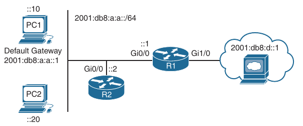

- Just as with IPv4, when a host wants to communicate with another host, it compares it's network bits to exactly the same bits in the destination IP address

- If they match the devices are in the same network; if they do not match, the devices are in different networks

- If both devices are in the same network, they can communicate directly with each other, and if they are in different networks, they need to communicate through the default gateway

- For example, when PC1 needs to communicate with the server at 2001:db8:d::1, it realizes that the web server is in a different network

- Therefore, PC1 has to send the frame to the default gateway, using the default gateway's MAC address

- If PC1 wants to communicate with PC2, it determines it is in the same network and communicates directly with it

- You can verify the IPv6 address of a Windows PC using the `ipconfig` command or `ip addr` in linux, as shown below

- In this example, PC1 has the link-local address fe80::a00:27ff:fe5d:6d6 and the global unicast address 2001:db8:a:a::10, which was statically configured

- Notice the %11 at the end of the link local address in this case

- This is the interface identification number and it is needed so that the system knows which interface to sent the packets out of; keep in mind that you can have multiple interfaces on the same device with the same link-local address assigned to them

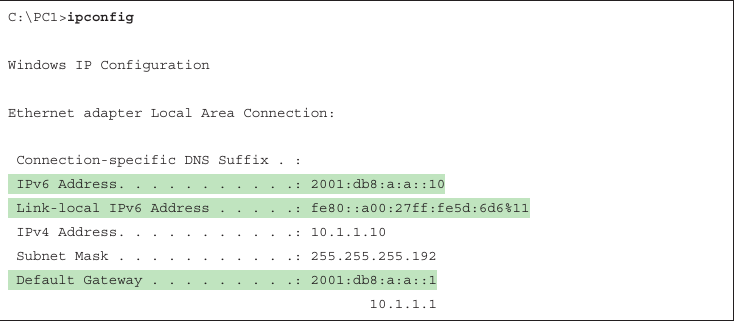

#### EUI-64

- Recall that an IPv6 address consist of two parts: the subnet ID and the interface/host ID

- The host ID is usually 64-bits long, and as a result, it is not something you might want to be configuring manually in your organization

- Although you can statically define the interface ID, the best approach is to allow your end devices to automatically assign their own interface ID for global unicast and link-local addresses randomly based on the IEEE EUI-64 standard

- EUI-64 takes the client's MAC address, which is 48 bits, splits it in half, and adds the hex values FFFE in the middle

- In addition, it takes the seventh bit from the left and flips it

- So, if it is a 1, it becomes a 0, and if it is a 0, it becomes a 1

- Looking at the example from above, notice that the link-local address is fe80::a00:27ff:fe5d:6d6

- The subnet ID is fe80::, and the interface id is a00:27ff:fe5d:6d6

- If you fill in the missing leading 0's, the address is 0a00:27ff:fe5d:06d6

- This is an EUI-64 interface ID because it has FFFE in it

- Let's look at how it is derived

- Below is shown the output of `ipconfig /all` on PC1

- Notice that the MAC address is 08-00-27-5d-06-d6

- Split it in half and add FFFE in the middle to get: 08-00-27-ff-fe-5d-06-d6

- Now group the hex values into groups of four and replace each dash (-) with a colon like this: 0800:27ff:fe5d:06d6

- This looks very close to what is listed in the link-local address, but it is not exactly the same

- The interface ID in the link-local address starts with 0a, and ours start with 08

- This is because the seventh bit is flipped, as seen earlier

- 08 hex in binary is 00001000

- The seventh bit from left to right is a 0, so make it a 1. Now you have 00001010

- Convert to hex and you get 0a

- So your interface ID is 0a00:27ff:fe5d:06d6

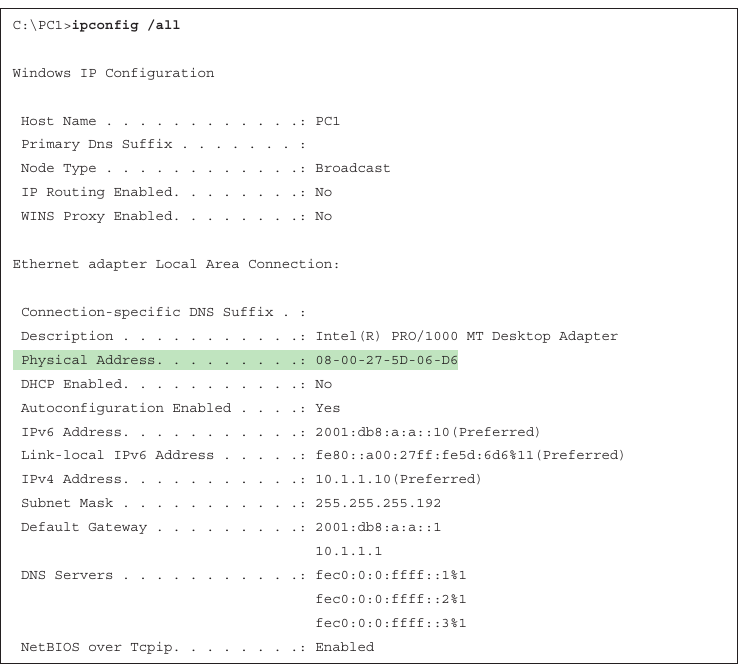

- By default, routers use EUI-64 when generating the interface portion of the link-local address of an interface

- Modern Windows PCs randomly generate the interface portion by default for the link-local address, and the global unicast address when autoconfiguring their IPv6 addresses

- When you statically configure an IPv6 address on a PC, the interface portion is manually assigned

- However, on a router, if you want to use EUI-64 for a statically configured global unicast address, use the eui-64 keyword as shown below

```
conf t
 interface g0/0
  ipv6 address 2001:db8:a:a::/64 eui-64
```

- You can verify the global unicast address and the EUI-64 interface ID assigned to an interface by using `show ipv6 interface` command as shown below

- In this case, R2's G0/0 interface has a global unicast address that obtained the interface ID from EUI-64 standard

```
R2#show ipv6 interface g0/0
GigabitEthernet0/0 is up, line protocol is up
  IPv6 is enabled, link-local address is FE80::5054:FF:FE6E:87FD 
  No Virtual link-local address(es):
  Global unicast address(es):
    2001:DB8:B:B:5054:FF:FE6E:87FD, subnet is 2001:DB8:B:B::/64 [EUI]
  Joined group address(es):
    FF02::1
    FF02::2
    FF02::1:FF6E:87FD
  MTU is 1500 bytes
  ICMP error messages limited to one every 100 milliseconds
  ICMP redirects are enabled
  ICMP unreachables are sent
  ND DAD is enabled, number of DAD attempts: 1
  ND reachable time is 30000 milliseconds (using 30000)
  ND advertised reachable time is 0 (unspecified)
  ND advertised retransmit interval is 0 (unspecified)
  ND router advertisements are sent every 200 seconds
  ND router advertisements live for 1800 seconds
  ND advertised default router preference is Medium
  Hosts use stateless autoconfig for addresses.
```

### IPv6 SLAAC, Stateful DHCPv6, and Stateless DHCPv6

- Manually assigning IP addresses (either IPv4 or IPv6) is not a scalable option

- With IPv4, DHCP is a dynamic addressing option

- With IPv6, you have three dynamic options to choose from: *stateless addresss autoconfiguration (SLAAC), stateful DHCPv6, or stateless DHCPv6*

- Issues that might arise for each of these options and how to troubleshoot them

#### SLAAC

- SLAAC is designed to enable a device to configure it's own IPv6 address, prefix and default gateway without a DHCPv6 server

- Windows PCs automatically have SLAAC enabled and generate their own IPv6 addresses as show below - in the `ipconfig /all` output on PC1

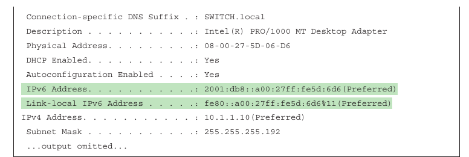

- On Cisco routers, if you want to take advantage of SLAAC, you need to enable it manually on an interface as follows:

```
conf t
 interface g0/0
  ipv6 address autoconfig
```

- When a Windows PC and router interface are enabled for SLAAC, they sent a Router Solicitation (RS) message to determine whether they are any routers connected to the local link

- Then they wait for a router to send a Router Advertisement (RA) that identifies the prefix used by the router (the default gateway) connected to the same network they are on

- They then use the same prefix information to generate their own IPv6 address in the same network as the router interface that generated the RA

- The router use EUI-64 for the interface portion, and the PC randomly generates the interface portion

- In addition, the PC uses the IPv6 link-local address of the device that sent the RA as the default gateway address

- Below is shown the RA process. PC1 sends an RA out of it's g0/0 interface

- The source IPv6 address is the g0/0 link-local address, and the source MAC address is the MAC address of the interface g0/0

- The destination IPv6 address is the all-nodes link-local multicast address FF02::1

- The destination MAC address is the all-nodes destination MAC address 33:33:00:00:00:01, which is associated with the all-nodes link-local multicast address FF02::1

- By default, all IPv6-enabled interfaces listen for packets and frames destined for these two addresses

- When PC1 in the image below receives the RA, it takes the prefix included in the RA, which is 2001:db8:a:a::/64, and then randomly creates the interface portion of it's IPv6 address

- It also takes the link-local address from the source of the RA and uses it as the default gateway address, as shown below, in the output of `ipconfig` command

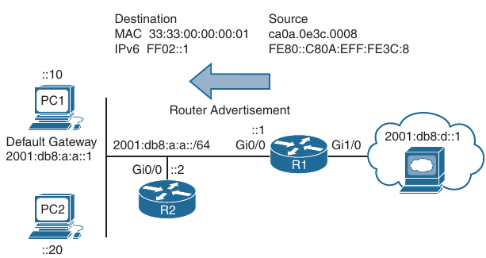

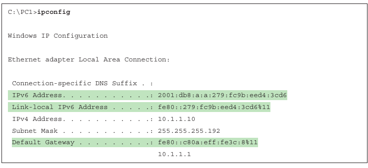

- To verify an IPv6 address has been generated by SLAAC on a router interface, use the following command:

```
show ipv6 interface <interface-name>
```

```
PC1#show ipv6 int e0/0
Ethernet0/0 is up, line protocol is up
  IPv6 is enabled, link-local address is FE80::A8BB:CCFF:FE00:1600 
  No Virtual link-local address(es):
  Stateless address autoconfig enabled
  Global unicast address(es):
    2001:DB8:A:A:A8BB:CCFF:FE00:1600, subnet is 2001:DB8:A:A::/64 [EUI/CAL/PRE] (SLAAC address)
      valid lifetime 2591870 preferred lifetime 604670
  Joined group address(es):
    FF02::1
    FF02::1:FF00:1600
  MTU is 1500 bytes
  ICMP error messages limited to one every 100 milliseconds
  ICMP redirects are enabled
  ICMP unreachables are sent
  ND DAD is enabled, number of DAD attempts: 1
  ND reachable time is 30000 milliseconds (using 30000)
  ND NS retransmit interval is 1000 milliseconds
  Default router is FE80::5054:FF:FE78:529D on Ethernet0/0 (This line is present only if IPv6 unicast routing is disabled on the host)
```

- Look for "Stateless address autoconfig enabled"

- As shown above, the global unicast address was generated using SLAAC

- Also notice at the bottom of the example that the default router is listed as the link local address of R1

- However, note that this occurs only if IPv6 unicast routing was not enabled on the router and, as a result, the router is acting as an end device

- PC1 when IPv6 unicast routing is enabled:

```
PC1#show ipv6 interface e0/0
Ethernet0/0 is up, line protocol is up
  IPv6 is enabled, link-local address is FE80::A8BB:CCFF:FE00:1600 
  No Virtual link-local address(es):
  Stateless address autoconfig enabled
  Global unicast address(es):
    2001:DB8:A:A:A8BB:CCFF:FE00:1600, subnet is 2001:DB8:A:A::/64 [EUI/CAL/PRE]
      valid lifetime 2591944 preferred lifetime 604744
  Joined group address(es):
    FF02::1
    FF02::2
    FF02::1:FF00:1600
  MTU is 1500 bytes
  ICMP error messages limited to one every 100 milliseconds
  ICMP redirects are enabled
  ICMP unreachables are sent
  ND DAD is enabled, number of DAD attempts: 1
  ND reachable time is 30000 milliseconds (using 30000)
  ND advertised reachable time is 0 (unspecified)
  ND advertised retransmit interval is 0 (unspecified)
  ND router advertisements are sent every 200 seconds
  ND router advertisements live for 1800 seconds
  ND advertised default router preference is Medium
  Hosts use stateless autoconfig for addresses.
```

- It is important to realize that RAs are generated by default on a router interface only if the router interface is enabled for IPv6, IPv6 unicast routing is enabled, and RAs are not being suppressed on an interface

- Therefore, if SLAAC is not working check the following:

    - Make sure the IPv6 unicast routing is enabled on the router that should be generating the RAs as follows:

    ```
    show run | i ipv6 unicast-routing
    ```

    - Make sure the appropriate interface is enabled for IPv6 using the `show ipv6 interface <interface>` command

    - Make sure that the router interface advertising RAs has a /64 prefix by using the `show ipv6 interface <interface>` command

    - Make sure that RAs are not being suppressed on the interface by using the `show ipv6 interface <interface>` command

- R1 - Interface IPv6 information:

```
R1#sh ipv6 int g0/1
GigabitEthernet0/1 is up, line protocol is up
  IPv6 is enabled, link-local address is FE80::5054:FF:FE78:529D 
  No Virtual link-local address(es):
  Stateless address autoconfig enabled
  Global unicast address(es):
    2001:DB8:A:A::1, subnet is 2001:DB8:A:A::/64 
  Joined group address(es):
    FF02::1
    FF02::2
    FF02::1:FF00:1
    FF02::1:FF78:529D
  MTU is 1500 bytes
  ICMP error messages limited to one every 100 milliseconds
  ICMP redirects are enabled
  ICMP unreachables are sent
  ND DAD is enabled, number of DAD attempts: 1
  ND reachable time is 30000 milliseconds (using 30000)
  ND advertised reachable time is 0 (unspecified)
  ND advertised retransmit interval is 0 (unspecified)
  ND router advertisements are sent every 200 seconds
  ND router advertisements live for 1800 seconds
  ND advertised default router preference is Medium
  Hosts use stateless autoconfig for addresses.
```

- R1 - interface IPv6 information with RAs suppressed:

```
R1(config-if)#do sh ipv6 int g0/1     
GigabitEthernet0/1 is up, line protocol is up
  IPv6 is enabled, link-local address is FE80::5054:FF:FE78:529D 
  No Virtual link-local address(es):
  Stateless address autoconfig enabled
  Global unicast address(es):
    2001:DB8:A:A::1, subnet is 2001:DB8:A:A::/64 
  Joined group address(es):
    FF02::1
    FF02::2
    FF02::1:FF00:1
    FF02::1:FF78:529D
  MTU is 1500 bytes
  ICMP error messages limited to one every 100 milliseconds
  ICMP redirects are enabled
  ICMP unreachables are sent
  ND DAD is enabled, number of DAD attempts: 1
  ND reachable time is 30000 milliseconds (using 30000)
  ND RAs are suppressed (all) - (Here we can see all ND RAs are suppressed)
  Hosts use stateless autoconfig for addresses.
```

- Enabling or disabling ND RA suppression on the interface:

```
conf t
 interface g0/1
  ipv6 nd ra suppress all 
```

- In addition, if you have more than one router on a subnet generating RAs, which is normal when you have redundant default gateways, the client learns about multiple default gateways from the RAs as shown below

- The top default gateway is R2's link local address, and the bottom gateway is R1's link-local address

- Now, this might seem like a benefit; however, it is a benefit if both default gateways can reach the same networks
