## OSPF

1. OSPF Fundamentals

2. OSPF Configuration

3. The Designated Router and Backup Designated Router

4. OSPF Network Types

5. Failure Detection

6. Authentication

- The Open Shortest Path First (OSPF) protocol is a link-state routing protocol

- OSPF is a nonproprietary Interior Gateway Protocol (IGP) that overcomes the deficiencies of other distance vector routing protocols

- It distributes routing information within a single OSPF routing domain

- OSPF introduced the concept of variable-length subnet masking (VLSM), which supports classless routing, summarization, authentication, and external route tagging

- There are two main versions of OSPF in production networks today:

    - **OSPFv2**: Originally defined in RFC 2328 with IPv4 support

    - **OSPFv3**: Modifies the original structure to support IPv6

- The core concepts of OSPF and the basics of establishing neighborships and exchanging routes with other OSPF routers

- The fundamentals of OSPF and common optimizations in networks of any size

### OSPF Fundamentals

- OSPF sends Link State Advertisements (LSAs) to neighboring routers

- An LSA contains information on the link state and link metric, and OSPF advertises this information to neighboring routers exactly as the original advertising router advertises it

- Received LSAs are stored in a local database called the link-state database (LSDB)

- This process floods the LSA throughout the OSPF routing domain just as the neighboring router advertised it

- All OSPF routers maintain a synchronized identical copy of the LSDB within an area

- The LSDB provides the topology of the network, in essence providing the router the complete map of the network

- All OSPF routers run Dijkstra's shortest path first (SPF) algorithm to construct a loop-free topology of shortest paths

- OSPF dynamically detects topology changes within the network and calculates loop-free paths in a short amount of time with minimal routing protocol traffic

- Each router sees itself as the root or top of the SPF tree (SPT) and SPT contains all network destinations within the OSPF domain

- The SPT differs for each OSPF router, but the LSDB used to calculate the SPT is identical for all OSPF routers

- Below is an example of a simple OSPF topology and the SPT from R1's and R4's perspective

- Notice that the local router's perspective is always that of the root (or top of the tree)

- There is a difference in connectivity to the 10.3.3.0/24 network from R1's and R4's SPT's

- From R1's perspective, the serial link between R3 and R4 is missing; from R4's perspective, the ethernet link between R1 and R3 is missing

- The SPT's give the illusion that no redundancy exists to the networks, but remember that an SPT shows the shortest path to reach a network and is built from the LSDB, which contains all the links from an area

- During a topology change, the SPT is rebuilt and may change

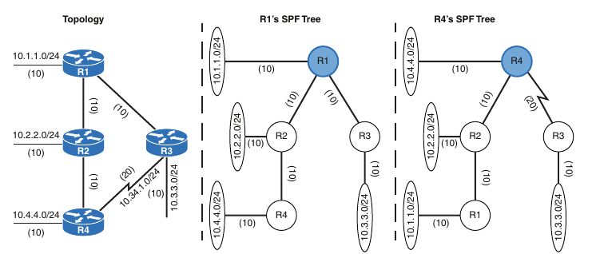

- A router can run multiple OSPF processes

- Each process maintains it's own unique database, and routes learned in one OSPF process are not available to a different OSPF process without redistribution of routes between processes

- The OSPF process numbers are locally significant and do not have to match among routers

- If OSPF process number 1 is running on one router and OSPF process number 1234 is running on another, the two routers can become neighbors

#### Areas

- OSPF provides scalability for the routing table by splitting segments of the topology into multiple OSPF areas within the routing domain

- An OSPF area is a logical grouping of routers or, more specifically, a logical grouping of router interfaces

- Area membership is set at the interface level, and the area ID is included in the OSPF hello packet

- An interface can belong to only one area

- All routers within the same OSPF area maintain an identical copy of the LSDB

- An OSPF area grows in size as the number of network links and the number of routers increase in the area

- While using a single area simplifies the topology, there are trade-offs:

    - A full SPT calculation run when a link flap within the area

    - With a single area, the LSDB increases in size and becomes unmanageable

    - The LSDB for the single area grows, consumes more memory, and takes longer during the SPF computation process

    - With a single area, no summarization of route information occurs

- Proper design addresses each of these issues by segmenting the OSPF routing domain into multiple OSPF areas, thereby keeping the LSDB a manageable size

- Sizing and design of OSPF networks should account for the hardware constraints of the smallest router in that area

- If a router has interfaces in multiple areas, the router has multiple LSDBs (one for each area)

- The internal topology of one area is invisible from outside that area

- If a topology change occurs (such as a link flap or an additional network added) within an area, all routers in the same OSPF area calculate the SPT again

- Routers outside that area do not calculate the full SPT again but do perform partial SPT calculation if the metrics have changed or a prefix is removed

- In essence, an OSPF area hides the the topology from another area but allows the networks to be visible in other areas within the OSPF domain

- Segmenting the OSPF domain into multiple areas reduce the size of the LSDB for each area, making SPT calculations faster and decreasing LSDB flooding between routers when a link flaps

- Just because a router connects to multiple OSPF areas does not mean that routes from one area will be injected into another area

- Below is shown router R1 connected to Area 1 and Area 2. Routes from Area 1 do not advertise into Area 2 and vice versa

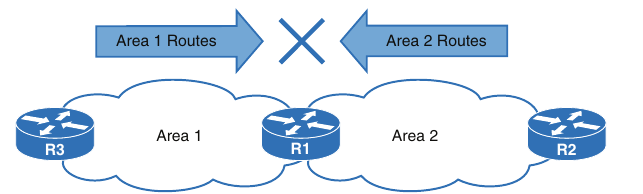

- Area 0 is a special area called *the backbone* or *backbone area*

- By design, OSPF uses a two-tier hierarchy in which all areas must connect to the upper tier, Area 0, because OSPF expects all areas to inject routing information into Area 0

- Area 0 advertises the routes into other nonbackbone areas

- The backbone is crucial to preventing routing loops

- The area identifier (also known as the area ID) is a 32-bit field that can be formatted in simple decimal (0 through 4294967295) or dotted decimal (0.0.0.0 through 255.255.255.255)

- When configuring routers in an area, even if you use decimal format on one router and dotted-decimal format on a different router, the routers will be able to form an adjacency

- OSPF advertises the area ID in OSPF packets

- *Area Border Routers (ABRs)* are OSPF routers connected to Area 0 and another OSPF area as per Cisco definition and according to RFC 3509

- ABRs are responsible for advertising routes from one area and injecting them into a different OSPF area

- Every ABR needs to participate in Area 0 to allow for the advertisement of routes into another area

- ABRs compute an SPT for every area they participate in

- Below is shown that R1 is connected to Area 0, Area 1 and Area 2

- R1 is a proper ABR router because it participates in Area 0

- The following occurs on R1:

    - Routes from Area 1 advertise into Area 0

    - Routes from Area 2 advertise into Area 0

    - Routes from Area 0 advertise into Areas 1 and 2. This includes the local Area 0 routes, in addition to the routes that were advertised into Area 0 from Area 1 and Area 2

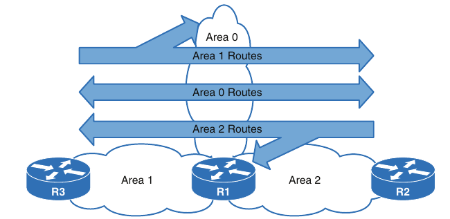

#### Inter-Router Communication

- OSPF runs directly over IPv4, using protocol 89 in the IP header, which the Internet Assigned Numbers Authority (IANA) reserves for OSPF

- OSPF uses multicast where possible to reduce unnecessary traffic

- There are 2 OSPF multicast addresses:

    - **AllSPFRouters**: IPv4 address 224.0.0.5 or MAC address 01:00:5e:00:00:05. All routers running OSPF must be able to receive packets with this address

    - **AllDRouters**: IPv4 address 224.0.0.6 or MAC address 01:00:5e:00:00:06. Communication with designated routers (DRs) uses this address

- Within the OSPF protocol, five types of packets are communicated

- Brief description of OSPF packet types:

```
Type        Packet Name                 Functional Overview

1           Hello                       Packets are sent out periodically on all OSPF interfaces to discover new neighbors while ensuring that other
                                        neighbors are still online

2           Database Description        Packets are exchanged when an OSPF adjacency is first being formed. These packets are used to describe the contents
            (DBD or DDP)                of the LSDB

3           Link-state Request          When a router thinks that part of it's LSDB is stale, it may request a portion of a neighbor's database by
            (LSR)                       using this packet type

4           Link-state Update           This is an explicit LSA for a specific network link, and normally it is sent in direct response to an LSR
            (LSU)

5           Link-state Acknowledgement  These packets are sent in response to the flooding of LSAs, thus making the flooding a reliable transport feature
            (LSAck)
```

#### Router ID

- The OSPF router ID (RID) is a 32-bit number that uniquely identifies an OSPF router

- The OSPF RID is an essential component in building an OSPF topology

- The output of some OSPF commands uses the term neighbor ID as synonim for RID

- The RID must be unique for each OSPF process in an OSPF domain and must be unique between OSPF processes on a router

- The RID is dynamically allocated by default, using the highest IP address of any loopback interfaces

- If there are no up loopback interfaces, the highest IP address of any up physical interfaces becomes the RID when the OSPF process initializes

- The OSPF process selects the RID when the OSPF process initializes, and it does not change until the process restarts

- This means that the RID can change if a higher loopback address has been added and the process (or router) is restared

- Setting a static RID helps with troubleshooting and reduces LSAs when an RID changes in an OSPF environment

- The RID is four octets in length and is configured with the command `router-id <router-id>` under the OSPF process:

```
conf t
 router ospf 1
  router-id 1.1.1.1
```

#### OSPF Hello Packets

- OSPF Hello Packets are responsible for discovering and maintaining neighbors

- In most instances, a router sends hello packets to the AllSPFRouters address (224.0.0.5) 

- Below is listed some data contained within an OSPF hello packet

```
Data Field                                  Description

Router ID (RID)                             A unique 32-bit ID within an OSPF domain that is used to build the topology

Authentication Options                      A field that allows secure communication between OSPF routers to prevent malicious activity
                                            Options are plaintext, or Message Digest 5 (MD5) authentication

Area ID                                     The OSPF area that the OSPF interface belongs to. It is a 32-bit number
                                            that can be written in dotted-decimal format (0.0.1.0) or decimal (256)

Interface Address Mask                      The network mask for the primary IP address for the interface out which
                                            the hello is sent

Interface Priority                          The router interface priority for DR elections

Hello Interval                              The time interval, in seconds, at which a router sends out hello packets on the interface

Dead Interval                               The time interval, in seconds, that a router waits to hear a hello from a neighbor router before it declares that
                                            router down

Designated Router and                       The IP address of the DR and backup DR (BDR) for that network link
Backup Designated Router

Active Neighbor                             A list of OSPF neighbors seen on that network segment
                                            A router must have received a hello from the neighbor within the dead interval
```

#### Neighbors

- An OSPF neighbor is a router that shares a common OSPF-enabled network link

- OSPF routers discover other neighbors through the OSPF hello packets

- An adjacent OSPF neighbor is an OSPF neighbor that shares a synchronized OSPF database between two neighbors

- Each OSPF process maintains a table for adjacent OSPF neighbors and the state of each router

- Below is the description of OSPF neighbor states

```
State                   Description

Down                    The initial state of a neighbor relationship. It indicates that the router has not received any OSPF hello packets

Attempt                 A state that is relevant to nonbroadcast multi-access (NBMA) networks that do not support broadcast and that require explicit neighbor 
                        configuration. This state indicates that that no recent information has been received, but the router is still attempting communication

Init                    A state in which a hello packet has been received from another router, but bidirectional communication has not been established

2-Way                   A state in which bidirectional communication has been established. If a DR or BDR is needed, the ellection occurs during this state

ExStart                 The first state in forming an adjancency. Routers identify which router will be the primary or secondary for
                        the LSDB synchronization

Exchange                A state during which routers are exchanging link states by using DBD packets

Loading                 A state in which LSR packets are sent to the neighbor, asking for the more recent LSAs that have been discovered (but not received) in
                        the Exchange state

Full                    A state in which neighboring routers are fully adjacent
```

#### Requirements for Neighbor Adjacency

- The following list of requirements must be met for an OSPF neighborship to be formed:

    - The RIDs must be unique between the two devices. To prevent errors, they should be unique for the entire OSPF routing domain

    - The interfaces must share a common subnet. OSPF uses the interface's primary IP address when sending out OSPF hellos

    - The network mask (netmask) in the hello packet is used to extract the network ID of the hello packet

    - The interface maximum transmission unit (MTU) must match because the OSPF protocol do not support fragmentation

    - The area ID must match for that segment

    - The need for a DR must match for that segment

    - OSPF hello and dead timers must match for that segment

    - The authentication type and credentials (if any) must match for that segment

    - Area type flags must be identical for that segment (stub, NSSA, and so on)

- Below we can see the states and packets exchanged when two routers, R1 and R2, form an OSPF adjancency

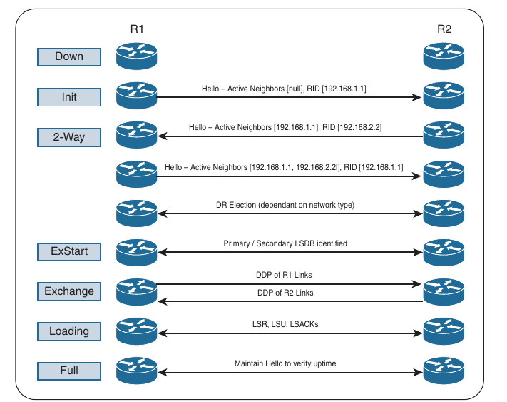

- Below are shown each of the steps performed when an adjacency forms

- When you enable OSPF adjacency debugging, you get detailed information for all of the states

- R1:

```
R1(config-router)#no shutdown  
R1(config-router)#
*Sep 19 09:54:22.289: OSPF-1 ADJ   Lo0: Interface going Up
*Sep 19 09:54:22.289: OSPF-1 ADJ   Gi0/0: Interface going Up
R1(config-router)#
*Sep 19 09:54:25.846: OSPF-1 ADJ   Gi0/0: 2 Way Communication to 192.168.2.2, state 2WAY
R1(config-router)#
*Sep 19 09:54:56.820: OSPF-1 ADJ   Gi0/0: Rcv DBD from 192.168.2.2 seq 0x10DD opt 0x52 flag 0x7 len 32  mtu 1500 state 2WAY
*Sep 19 09:54:56.820: OSPF-1 ADJ   Gi0/0: Nbr state is 2WAY
R1(config-router)#
*Sep 19 09:55:01.666: OSPF-1 ADJ   Gi0/0: Rcv DBD from 192.168.2.2 seq 0x10DD opt 0x52 flag 0x7 len 32  mtu 1500 state 2WAY
*Sep 19 09:55:01.666: OSPF-1 ADJ   Gi0/0: Nbr state is 2WAY
*Sep 19 09:55:02.289: OSPF-1 ADJ   Gi0/0: end of Wait on interface
*Sep 19 09:55:02.289: OSPF-1 ADJ   Gi0/0: DR/BDR election
*Sep 19 09:55:02.289: OSPF-1 ADJ   Gi0/0: Elect BDR 192.168.2.2
*Sep 19 09:55:02.289: OSPF-1 ADJ   Gi0/0: Elect DR 192.168.2.2
*Sep 19 09:55:02.289: OSPF-1 ADJ   Gi0/0: DR: 192.168.2.2 (Id)
*Sep 19 09:55:02.289: OSPF-1 ADJ   Gi0/0:    BDR: 192.168.2.2 (Id)
*Sep 19 09:55:02.289: OSPF-1 ADJ   Gi0/0: Nbr 192.168.2.2: Prepare dbase exchange
R1(config-router)#
*Sep 19 09:55:02.289: OSPF-1 ADJ   Gi0/0: Send DBD to 192.168.2.2 seq 0x2238 opt 0x52 flag 0x7 len 32
R1(config-router)#
*Sep 19 09:55:04.688: OSPF-1 ADJ   Gi0/0: Neighbor change event
*Sep 19 09:55:04.688: OSPF-1 ADJ   Gi0/0: DR/BDR election
*Sep 19 09:55:04.688: OSPF-1 ADJ   Gi0/0: Elect BDR 192.168.1.1
*Sep 19 09:55:04.688: OSPF-1 ADJ   Gi0/0: Elect DR 192.168.2.2
*Sep 19 09:55:04.688: OSPF-1 ADJ   Gi0/0: Elect BDR 192.168.1.1
*Sep 19 09:55:04.688: OSPF-1 ADJ   Gi0/0: Elect DR 192.168.2.2
*Sep 19 09:55:04.688: OSPF-1 ADJ   Gi0/0: DR: 192.168.2.2 (Id)
*Sep 19 09:55:04.688: OSPF-1 ADJ   Gi0/0:    BDR: 192.168.1.1 (Id)
*Sep 19 09:55:04.688: OSPF-1 ADJ   Gi0/0: Neighbor change event
*Sep 19 09:55:04.688: OSPF-1 ADJ   Gi0/0: DR/BDR election
R1(config-router)#
*Sep 19 09:55:04.688: OSPF-1 ADJ   Gi0/0: Elect BDR 192.168.1.1
*Sep 19 09:55:04.688: OSPF-1 ADJ   Gi0/0: Elect DR 192.168.2.2
*Sep 19 09:55:04.688: OSPF-1 ADJ   Gi0/0: DR: 192.168.2.2 (Id)
*Sep 19 09:55:04.688: OSPF-1 ADJ   Gi0/0:    BDR: 192.168.1.1 (Id)
R1(config-router)#
*Sep 19 09:55:06.560: OSPF-1 ADJ   Gi0/0: Rcv DBD from 192.168.2.2 seq 0x10DD opt 0x52 flag 0x7 len 32  mtu 1500 state EXSTART
*Sep 19 09:55:06.560: OSPF-1 ADJ   Gi0/0: NBR Negotiation Done. We are the SLAVE
*Sep 19 09:55:06.560: OSPF-1 ADJ   Gi0/0: Nbr 192.168.2.2: Summary list built, size 1
*Sep 19 09:55:06.560: OSPF-1 ADJ   Gi0/0: Send DBD to 192.168.2.2 seq 0x10DD opt 0x52 flag 0x2 len 52
*Sep 19 09:55:06.561: OSPF-1 ADJ   Gi0/0: Rcv DBD from 192.168.2.2 seq 0x10DE opt 0x52 flag 0x1 len 52  mtu 1500 state EXCHANGE
*Sep 19 09:55:06.561: OSPF-1 ADJ   Gi0/0: Exchange Done with 192.168.2.2
*Sep 19 09:55:06.561: OSPF-1 ADJ   Gi0/0: Send LS REQ to 192.168.2.2 length 36
*Sep 19 09:55:06.561: OSPF-1 ADJ   Gi0/0: Send DBD to 192.168.2.2 seq 0x10DE opt 0x52 flag 0x0 len 32
*Sep 19 09:55:06.562: OSPF-1 ADJ   Gi0/0: Rcv LS UPD from Nbr ID 192.168.2.2 length 76 LSA count 1
*Sep 19 09:55:06.562: OSPF-1 ADJ   Gi0/0: Synchronized with 192.168.2.2, state FULL
*Sep 19 09:55:06.562: %OSPF-5-ADJCHG: Process 1, Nbr 192.168.2.2 on GigabitEthernet0/0 from LOADING to FULL, Loading Done
R1(config-router)#
*Sep 19 09:55:06.562: OSPF-1 ADJ   Gi0/0: Rcv LS REQ from 192.168.2.2 length 36 LSA count 1
R1(config-router)#
*Sep 19 09:55:46.561: OSPF-1 ADJ   Gi0/0: Nbr 192.168.2.2: Clean-up dbase exchange
```

- R2:

```
R2(config-router)#no shutdown 
R2(config-router)#
*Sep 19 09:54:17.079: OSPF-1 ADJ   Lo0: Interface going Up
*Sep 19 09:54:17.079: OSPF-1 ADJ   Gi0/0: Interface going Up
R2(config-router)#
*Sep 19 09:54:26.105: OSPF-1 ADJ   Gi0/0: 2 Way Communication to 192.168.1.1, state 2WAY
R2(config-router)#
*Sep 19 09:54:57.079: OSPF-1 ADJ   Gi0/0: end of Wait on interface
*Sep 19 09:54:57.079: OSPF-1 ADJ   Gi0/0: DR/BDR election
*Sep 19 09:54:57.079: OSPF-1 ADJ   Gi0/0: Elect BDR 192.168.2.2
*Sep 19 09:54:57.079: OSPF-1 ADJ   Gi0/0: Elect DR 192.168.2.2
*Sep 19 09:54:57.079: OSPF-1 ADJ   Gi0/0: Elect BDR 192.168.1.1
*Sep 19 09:54:57.079: OSPF-1 ADJ   Gi0/0: Elect DR 192.168.2.2
*Sep 19 09:54:57.079: OSPF-1 ADJ   Gi0/0: DR: 192.168.2.2 (Id)
*Sep 19 09:54:57.079: OSPF-1 ADJ   Gi0/0:    BDR: 192.168.1.1 (Id)
*Sep 19 09:54:57.079: OSPF-1 ADJ   Gi0/0: Nbr 192.168.1.1: Prepare dbase exchange
R2(config-router)#
*Sep 19 09:54:57.079: OSPF-1 ADJ   Gi0/0: Send DBD to 192.168.1.1 seq 0x10DD opt 0x52 flag 0x7 len 32
R2(config-router)#
*Sep 19 09:55:01.925: OSPF-1 ADJ   Gi0/0: Send DBD to 192.168.1.1 seq 0x10DD opt 0x52 flag 0x7 len 32
*Sep 19 09:55:01.925: OSPF-1 ADJ   Gi0/0: Retransmitting DBD to 192.168.1.1 [1]
*Sep 19 09:55:02.548: OSPF-1 ADJ   Gi0/0: Rcv DBD from 192.168.1.1 seq 0x2238 opt 0x52 flag 0x7 len 32  mtu 1500 state EXSTART
*Sep 19 09:55:02.548: OSPF-1 ADJ   Gi0/0: First DBD and we are not SLAVE
R2(config-router)#
*Sep 19 09:55:06.819: OSPF-1 ADJ   Gi0/0: Send DBD to 192.168.1.1 seq 0x10DD opt 0x52 flag 0x7 len 32
*Sep 19 09:55:06.819: OSPF-1 ADJ   Gi0/0: Retransmitting DBD to 192.168.1.1 [2]
*Sep 19 09:55:06.819: OSPF-1 ADJ   Gi0/0: Rcv DBD from 192.168.1.1 seq 0x10DD opt 0x52 flag 0x2 len 52  mtu 1500 state EXSTART
*Sep 19 09:55:06.819: OSPF-1 ADJ   Gi0/0: NBR Negotiation Done. We are the MASTER
*Sep 19 09:55:06.819: OSPF-1 ADJ   Gi0/0: Nbr 192.168.1.1: Summary list built, size 1
*Sep 19 09:55:06.819: OSPF-1 ADJ   Gi0/0: Send DBD to 192.168.1.1 seq 0x10DE opt 0x52 flag 0x1 len 52
*Sep 19 09:55:06.820: OSPF-1 ADJ   Gi0/0: Rcv LS REQ from 192.168.1.1 length 36 LSA count 1
*Sep 19 09:55:06.820: OSPF-1 ADJ   Gi0/0: Send LS UPD to 10.1.2.1 length 76 LSA count 1
*Sep 19 09:55:06.820: OSPF-1 ADJ   Gi0/0: Rcv DBD from 192.168.1.1 seq 0x10DE opt 0x52 flag 0x0 len 32  mtu 1500 state EXCHANGE
*Sep 19 09:55:06.821: OSPF-1 ADJ   Gi0/0: Exchange Done with 192.168.1.1
*Sep 19 09:55:06.821: OSPF-1 ADJ   Gi0/0: Send LS REQ to 192.168.1.1 length 36
*Sep 19 09:55:06.821: OSPF-1 ADJ   Gi0/0: Rcv LS UPD from Nbr ID 192.168.1.1 length 76 LSA count 1
*Sep 19 09:55:06.821: OSPF-1 ADJ   Gi0/0: Synchronized with 192.168.1.1, state FULL
R2(config-router)#
*Sep 19 09:55:06.821: %OSPF-5-ADJCHG: Process 1, Nbr 192.168.1.1 on GigabitEthernet0/0 from LOADING to FULL, Loading Done
R2(config-router)#
*Sep 19 09:55:10.291: OSPF-1 ADJ   Gi0/0: Neighbor change event
*Sep 19 09:55:10.291: OSPF-1 ADJ   Gi0/0: DR/BDR election
*Sep 19 09:55:10.291: OSPF-1 ADJ   Gi0/0: Elect BDR 192.168.1.1
*Sep 19 09:55:10.291: OSPF-1 ADJ   Gi0/0: Elect DR 192.168.2.2
*Sep 19 09:55:10.291: OSPF-1 ADJ   Gi0/0: DR: 192.168.2.2 (Id)
*Sep 19 09:55:10.291: OSPF-1 ADJ   Gi0/0:    BDR: 192.168.1.1 (Id)
*Sep 19 09:55:10.291: OSPF-1 ADJ   Gi0/0: Neighbor change event
*Sep 19 09:55:10.291: OSPF-1 ADJ   Gi0/0: DR/BDR election
*Sep 19 09:55:10.291: OSPF-1 ADJ   Gi0/0: Elect BDR 192.168.1.1
*Sep 19 09:55:10.291: OSPF-1 ADJ   Gi0/0: Elect DR 192.168.2.2
R2(config-router)#
*Sep 19 09:55:10.291: OSPF-1 ADJ   Gi0/0: DR: 192.168.2.2 (Id)
*Sep 19 09:55:10.291: OSPF-1 ADJ   Gi0/0:    BDR: 192.168.1.1 (Id)
R2(config-router)#
*Sep 19 09:55:46.821: OSPF-1 ADJ   Gi0/0: Nbr 192.168.1.1: Clean-up dbase exchange
```

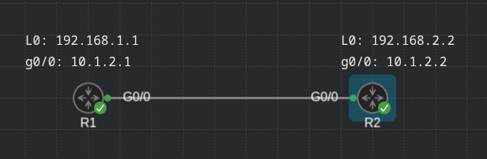

### OSPF Configuration

- The configuration process for OSPF occurs mostly under the OSPF processs, but some OSPF options go directly on the interface configuration submode

- The OSPF process ID is locally significant but is generally kept the same for operational consistency

- OSPF can be enabled on an interface using two methods:

    - OSPF `network` statement

    - Interface-specific configuration

#### OSPF Network Statement

- The command `router ospf <process-id>` defines and initializes the OSPF process

- The OSPF `network` statement identifies the interfaces that OSPF process will use and the area that those interfaces participate in

- The `network` statements match against the primary IPv4 address and netmask associated to an interface

- A common misconception is that `network` statement advertises the networks into OSPF; in reality, though, the `network` statement selects and enables OSPF on the interface

- The interface is then advertised in OSPF through the LSA

- The `network` statement use a wildcard mask, which allows the configuration to be as specific or vague as necessary

- The selection of interfaces within the OSPF process is accomplished by using the command `network <ip-address> <wildcard-mask> area <area-id>`

```
conf t
 router ospf 1
  network 10.1.2.1 0.0.0.0 area 0
  network 192.168.1.1 0.0.0.0 area 0
```

#### Interface-Specific Configuration

- The second method for enabling OSPF on an interface for IOS is to configure it specifically for an interface with the command `ip ospf <process-id> area <area-id> [secondaries none]`

- This method also adds secondary connected networks to the LSDB unless the `secondaries none` option is used

- This method provides explicit control for enabling OSPF; however the configuration is not centralized, and the complexity increases as the number of interfaces on the router increases

- Interface-specific settings takes precedence over the `network` statement with the assignment of the areas if a hybrid configuration exists on the router

```
conf t
 interface g0/0
  ip ospf 1 area 0
 interface l0
  ip ospf 1 area 0
```

#### Passive Interfaces

- Enabling an interface with OSPF is the quickest way to advertise the network segment to other OSPF routers

- Making the network interface passive still adds the network segment to the LSDB but prevents the interface from forming OSPF adjacencies

- A passive interface does not send out OSPF hellos and does not process any received OSPF packets

- The command `passive-interface <interface-id>` under the OSPF process makes the interface passive, and the command `passive-interface default` makes all interfaces passive

- To allow an inteface to process OSPF packets, the command `no passive-interface <interface-id>` is used

- (The topology used is the same from the above picture)

```
conf t
 router ospf 1
  passive-interface l0

!or
 router ospf 1
  passive-inteface default
  no passive-interface g0/0
```

#### Sample Topology and Configuration

- Below is a reference topology for a basic multi-area OSPF configuration and will be referenced more in what follows

- R1, R2, R3 and R4 belong to Area 1234

- R4 and R5 belong to Area 0

- R5 and R6 belong to Area 56

- R1, R2 and R3 are members (internal routers)

- R4 and R5 are ABRs

- Area 1234 connects to Area 0, and Area 56 connects to Area 0

- Routers in Area 1234 can se routes from routers in Area 0 (R4 and R5) and Area 56 (R5 and R6) and vice versa

- Basic OSPF multi area topology:

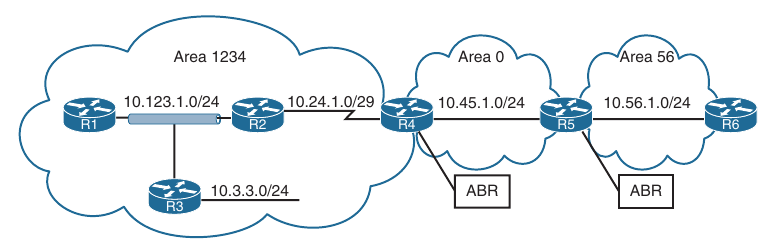

- To demonstrate the different methods of OSPF configuration, the routers are configured as follows:

    - R1 is configured to enable OSPF on all interfaces with one `network` statement

    - R2 is configured to enable OSPF on all interfaces with two explicit `network` statements

    - R3 is configured to enable OSPF on all interfaces with one `network` statement but sets the 10.3.3.0/24 LAN interface as passive to prevent forming an OSPF adjacency on it

    - R4 is configured to enable OSPF using an interface-specific OSPF configuration

    - R5 is configured to place all interfaces in the 10.45.1.0/24 network segment into Area 0 and all other network interfaces into Area 56

    - R6 is configured to place all interfaces into Area 56 with one `network` statement

    - On R1 and R2, OSPF is enabled on all interfaces with one command, R3 uses specific *network-based* statements, and R4 uses interface-specific commands

- Below is the OSPF configuration for all six routers

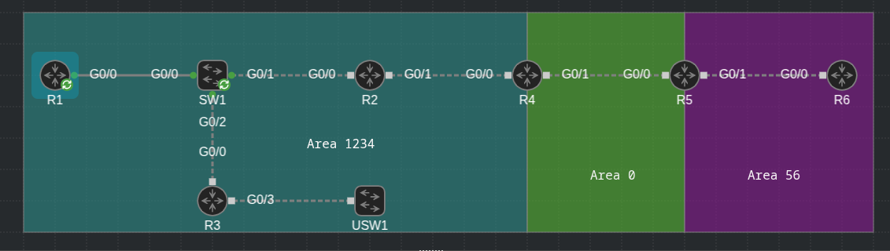

- R1:

```
conf t
 router ospf 1
  router-id 192.168.1.1
  network 0.0.0.0 255.255.255.255 area 1234
```

- R2:

```
conf t
 router ospf 1
  router-id 192.168.2.2
  network 10.24.1.2 0.0.0.0 area 1234
  network 10.123.1.2 0.0.0.0 area 1234
 interface g0/1
  ip ospf network point-to-point ! to imitate the serial link from original topology
```

- R3:

```
conf t
 router ospf 1
  router-id 192.168.3.3
  passive-interface GigabitEthernet0/3
  network 0.0.0.0 255.255.255.255 area 1234
```

- R4:

```
conf t
 router ospf 1
  router-id 192.168.4.4
 interface g0/0
  ip ospf network point-to-point ! to imitate the serial link from original topology
  ip ospf 1 area 1234
 interface g0/1
  ip ospf 1 area 0
```

- R5:

```
conf t
 router ospf 1
  router-id 192.168.5.5
  network 10.45.1.0 0.0.0.255 area 0
  network 0.0.0.0 255.255.255.255 area 56
```

- R6:

```
conf t
 router ospf 1
  router-id 192.168.6.6
  network 0.0.0.0 255.255.255.255 area 56
```

#### Confirmation of Interfaces

- You view OSPF-enabled interfaces by using the command `show ip ospf interface [brief | interface-id]` 

- Below is shown the output of `show ip ospf interface` command on R4:

```
R4#show ip ospf interface 
GigabitEthernet0/1 is up, line protocol is up 
  Internet Address 10.45.1.4/24, Area 0, Attached via Interface Enable
  Process ID 1, Router ID 192.168.4.4, Network Type BROADCAST, Cost: 1
  Topology-MTID    Cost    Disabled    Shutdown      Topology Name
        0           1         no          no            Base
  Enabled by interface config, including secondary ip addresses
  Transmit Delay is 1 sec, State BDR, Priority 1
  Designated Router (ID) 192.168.5.5, Interface address 10.45.1.5
  Backup Designated router (ID) 192.168.4.4, Interface address 10.45.1.4
  Timer intervals configured, Hello 10, Dead 40, Wait 40, Retransmit 5
    oob-resync timeout 40
    Hello due in 00:00:06
  Supports Link-local Signaling (LLS)
  Cisco NSF helper support enabled
  IETF NSF helper support enabled
  Index 1/1/2, flood queue length 0
  Next 0x0(0)/0x0(0)/0x0(0)
  Last flood scan length is 1, maximum is 1
  Last flood scan time is 0 msec, maximum is 0 msec
  Neighbor Count is 1, Adjacent neighbor count is 1 
    Adjacent with neighbor 192.168.5.5  (Designated Router)
  Suppress hello for 0 neighbor(s)
GigabitEthernet0/0 is up, line protocol is up 
  Internet Address 10.24.1.4/29, Area 1234, Attached via Interface Enable
  Process ID 1, Router ID 192.168.4.4, Network Type POINT_TO_POINT, Cost: 1
  Topology-MTID    Cost    Disabled    Shutdown      Topology Name
        0           1         no          no            Base
  Enabled by interface config, including secondary ip addresses
  Transmit Delay is 1 sec, State POINT_TO_POINT
  Timer intervals configured, Hello 10, Dead 40, Wait 40, Retransmit 5
    oob-resync timeout 40
    Hello due in 00:00:07
  Supports Link-local Signaling (LLS)
  Cisco NSF helper support enabled
  IETF NSF helper support enabled
  Index 1/1/1, flood queue length 0
  Next 0x0(0)/0x0(0)/0x0(0)
  Last flood scan length is 1, maximum is 2
  Last flood scan time is 0 msec, maximum is 0 msec
  Neighbor Count is 1, Adjacent neighbor count is 1 
    Adjacent with neighbor 192.168.2.2
  Suppress hello for 0 neighbor(s)
```

- The output lists all the OSPF-enabled interfaces, the IP address associated with each interface, the RIDs for the DR and BDR (and their associated interface IP address for that segment), and the OSPF timers for that interface

- Below is shown the output with `brief` keyword for R1, R2, R3 and R4

- R1:

```
R1#show ip ospf interface brief 
Interface    PID   Area            IP Address/Mask    Cost  State Nbrs F/C
Lo0          1     1234            192.168.1.1/32     1     LOOP  0/0
Gi0/0        1     1234            10.123.1.1/24      1     DROTH 2/2
```

- R2:

```
R2#show ip ospf interface brief 
Interface    PID   Area            IP Address/Mask    Cost  State Nbrs F/C
Gi0/0        1     1234            10.123.1.2/24      1     BDR   2/2
Gi0/1        1     1234            10.24.1.2/29       1     P2P   1/1
```

- R3:

```
R3#sh ip ospf interface br
Interface    PID   Area            IP Address/Mask    Cost  State Nbrs F/C
Lo0          1     1234            192.168.3.3/32     1     LOOP  0/0
Gi0/3        1     1234            10.3.3.3/24        1     DOWN  0/0
Gi0/0        1     1234            10.123.1.3/24      1     DR    2/2
```

- R4:

```
R4#show ip ospf interface brief 
Interface    PID   Area            IP Address/Mask    Cost  State Nbrs F/C
Gi0/1        1     0               10.45.1.4/24       1     BDR   1/1
Gi0/0        1     1234            10.24.1.4/29       1     P2P   1/1
```

- The State field provides useful information that helps you understand whether the interface is classified as broadcast or point-to-point, the area associated with the interface, and the process associated with the interface

- Below is provided an overview of the fields in the output shown above

```
Field                                       Description

Interface                                   Interfaces with OSPF enabled

PID                                         The OSPF process ID associated with this interface

Area                                        The area that this interface is associated with

IP Address/Mask                             The IP address and subnet mask of the interface

Cost                                        A factor the SPF algorithm uses to calculate a metric for the path

State                                       The current interface state for segments with a designated router (DR, BDR or DROTHER), P2P, LOOP or Down

Nbrs F                                      The number of neighbor OSPF routers for a segment that are fully adjacent

Nbrs C                                      The number of neighbors OSPF routers for a segment that have been detected and are in a 2-Way state
```

- The DROTHER is a router on the DR-enabled segment that is not the DR or the BDR; it is simply the other router

- DROTHERs do not establish full adjacency with other DROTHERs

#### Verification of OSPF Neighbor Adjacencies

- The command `show ip ospf neighbor [detail]` provides the OSPF neighbor table

- Below are displayed the OSPF neighbors for R1 and R2

- Notice that the state on R2's g0/1 interface does not reflect a DR status with it's peering with R4 (192.168.4.4) because a DR does not exist on a point-to-point link (or serial link)

```
R1#show ip ospf neighbor 

Neighbor ID     Pri   State           Dead Time   Address         Interface
192.168.2.2       1   FULL/BDR        00:00:38    10.123.1.2      GigabitEthernet0/0
192.168.3.3       1   FULL/DR         00:00:36    10.123.1.3      GigabitEthernet0/0
```

```
R2#show ip ospf neighbor 

Neighbor ID     Pri   State           Dead Time   Address         Interface
192.168.1.1       1   FULL/DROTHER    00:00:38    10.123.1.1      GigabitEthernet0/0
192.168.3.3       1   FULL/DR         00:00:38    10.123.1.3      GigabitEthernet0/0
192.168.4.4       0   FULL/  -        00:00:37    10.24.1.4       GigabitEthernet0/1
```

- Below is provided a brief overview of the fields used in the above example

- The neighbor state on R1 identifies R3 as the DR and R2 as the BDR for the 10.123.1.0 network segment

- R2 identifies R1 as DROTHER for that network segment

```
Field                           Description

Neighbor ID                     The router ID (RID) of the neighboring router

Pri                             The priority for the neighbor's interface, which is used for DR/BDR elections

State                           The first state is the neighbor state, as described above. The second State field is the DR, BDR, or DROTHER role 
                                if the interface requires a DR. For non-DR network links, the second field shows just a hyphen (-)

Dead Time                       The dead time left until the router is declared unreachable

Address                         The primary IP address for the OSPF neighbor

Interface                       The local interface to which the OSPF neighbor is attached
```

#### Viewing OSPF Installed Routes

- You display the OSPF routes installed in the Routing Information Base (RIB) by using the command `show ip route ospf`

- In the output, two sets of numbers are present in brackets (for example [110/2]) 

- The first number is the administrative distance (AD), which is 110 by default for OSPF, and the second number is the metric of the path used for that network along with the next-hop IP address

- The output from below provides the routing table for R1

- Notice that R1's OSPF routing table shows routes from within Area 1234 (10.24.1.0/29, 10.3.3.0/24) as *intra-area* (O routes) and routes from Area 0 and Area 56 (10.45.1.0/24 and 10.56.1.0/24) as *inter-area* (O IA routes) 

- Below are shown the inter-area and intra-area routes from R1's perspective of the topology

```
R1#show ip route ospf | b Gate
Gateway of last resort is not set

      10.0.0.0/8 is variably subnetted, 6 subnets, 3 masks
O        10.3.3.0/24 [110/2] via 10.123.1.3, 00:00:10, GigabitEthernet0/0
O        10.24.1.0/29 [110/2] via 10.123.1.2, 01:35:24, GigabitEthernet0/0
O IA     10.45.1.0/24 [110/3] via 10.123.1.2, 01:35:10, GigabitEthernet0/0
O IA     10.56.1.0/24 [110/4] via 10.123.1.2, 01:34:25, GigabitEthernet0/0
      192.168.3.0/32 is subnetted, 1 subnets
O        192.168.3.3 [110/2] via 10.123.1.3, 01:22:58, GigabitEthernet0/0
      192.168.5.0/32 is subnetted, 1 subnets
O IA     192.168.5.5 [110/4] via 10.123.1.2, 01:22:27, GigabitEthernet0/0
      192.168.6.0/32 is subnetted, 1 subnets
O IA     192.168.6.6 [110/5] via 10.123.1.2, 01:22:07, GigabitEthernet0/0
```

- The terms path cost and path metric are synonimous from OSPF perspective

- Below is provided the routing table for R4

- Notice that R4's OSPF routing table shows the routes from within Area 1234 and Area 0 as intra-area and routes from Area 56 as inter-area because R4 does not connect to Area 56

```
R4#show ip route ospf | b Gate
Gateway of last resort is not set

      10.0.0.0/8 is variably subnetted, 7 subnets, 3 masks
O        10.3.3.0/24 [110/3] via 10.24.1.2, 00:05:35, GigabitEthernet0/0
O IA     10.56.1.0/24 [110/2] via 10.45.1.5, 01:39:50, GigabitEthernet0/1
O        10.123.1.0/24 [110/2] via 10.24.1.2, 01:40:32, GigabitEthernet0/0
      192.168.1.0/32 is subnetted, 1 subnets
O        192.168.1.1 [110/3] via 10.24.1.2, 01:29:47, GigabitEthernet0/0
      192.168.3.0/32 is subnetted, 1 subnets
O        192.168.3.3 [110/3] via 10.24.1.2, 01:28:23, GigabitEthernet0/0
      192.168.5.0/32 is subnetted, 1 subnets
O IA     192.168.5.5 [110/2] via 10.45.1.5, 01:27:52, GigabitEthernet0/1
      192.168.6.0/32 is subnetted, 1 subnets
O IA     192.168.6.6 [110/3] via 10.45.1.5, 01:27:32, GigabitEthernet0/1
```

- Below are provided the routing tables for R5 and R6

- R5 and R6 contain only inter-area routes in the OSPF routing table because intra-area routes are directly connected (except loopbaks of the other routers in the area)

```
R5#show ip route ospf | b Gate
Gateway of last resort is not set

      10.0.0.0/8 is variably subnetted, 7 subnets, 3 masks
O IA     10.3.3.0/24 [110/4] via 10.45.1.4, 00:08:01, GigabitEthernet0/0
O IA     10.24.1.0/29 [110/2] via 10.45.1.4, 01:42:20, GigabitEthernet0/0
O IA     10.123.1.0/24 [110/3] via 10.45.1.4, 01:42:20, GigabitEthernet0/0
      192.168.1.0/32 is subnetted, 1 subnets
O IA     192.168.1.1 [110/4] via 10.45.1.4, 01:32:12, GigabitEthernet0/0
      192.168.3.0/32 is subnetted, 1 subnets
O IA     192.168.3.3 [110/4] via 10.45.1.4, 01:30:48, GigabitEthernet0/0
      192.168.6.0/32 is subnetted, 1 subnets
O        192.168.6.6 [110/2] via 10.56.1.6, 01:29:58, GigabitEthernet0/1
```

```
R6#show ip route ospf | b Gate 
Gateway of last resort is not set

      10.0.0.0/8 is variably subnetted, 6 subnets, 3 masks
O IA     10.3.3.0/24 [110/5] via 10.56.1.5, 00:08:39, GigabitEthernet0/0
O IA     10.24.1.0/29 [110/3] via 10.56.1.5, 01:42:53, GigabitEthernet0/0
O IA     10.45.1.0/24 [110/2] via 10.56.1.5, 01:42:53, GigabitEthernet0/0
O IA     10.123.1.0/24 [110/4] via 10.56.1.5, 01:42:53, GigabitEthernet0/0
      192.168.1.0/32 is subnetted, 1 subnets
O IA     192.168.1.1 [110/5] via 10.56.1.5, 01:32:51, GigabitEthernet0/0
      192.168.3.0/32 is subnetted, 1 subnets
O IA     192.168.3.3 [110/5] via 10.56.1.5, 01:31:27, GigabitEthernet0/0
      192.168.5.0/32 is subnetted, 1 subnets
O        192.168.5.5 [110/2] via 10.56.1.5, 01:30:56, GigabitEthernet0/0
```

#### External OSPF Routes

- OSPF routes to networks learned from outside the OSPF domain that are injected into an OSPF domain through redistribution are known as *external OSPF routes*

- When a router redistributes prefixes into an OSPF domain, the router is called an *autonomous system boundary router* (ASBR) 

- An ASBR can be any OSPF router, and the ASBR function is independent of the ABR function

- An OSPF domain can have an ASBR without having an ABR

- An OSPF router can be an ASBR and an ABR at the same time

- External routes are classified as Type 1 or Type 2

- The main differences between Type 1 and Type 2 external OSPF routes are as follows:

    - Type 1 routes are preferred over Type 2 routes

    - The Type 1 metric equals the redistribution metric plus the total path metric to the ASBR. In other words, as the LSA propagates away from the originating ASBR, the metric increases

    - The Type 2 metric equals only the the redistribution metric. The metric is the same for the router next to the ASBR as the router 30 hops away from the originating ASBR. This is the default external metric type used by OSPF

- Below there is our topology, where R6 is redistributing two networks into the OSPF domain

- In this topology:

    - R1, R2 and R3 are members (internal routers)

    - R4 and R5 are ABRs

    - R6 is the ASBR

    - 172.16.6.0/24 is redistributed as OSPF external Type 1 route

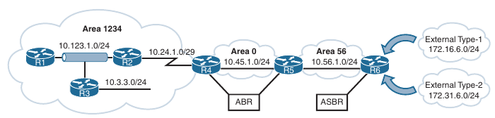

- Below we can see only the OSPF routes in the routing table from R1 and R2

- The 172.16.6.0/24 network is redistributed as a Type 1 route, and the 172.31.6.0/24 network is redistributed as a Type 2 route

- External OSPF network routes are marked as O E1 and O E2 in the routing table and correlate with OSPF Type 1 and Type 2 external routes

- Notice that the metric for the 172.31.6.0/24 network is the same on R1 as it is on R2, but the metric for the 172.16.6.0/24 network differs on the two routers because Type 1 external metrics includes the path metric to the ASBR

```
R1#show ip route ospf | b Gate
Gateway of last resort is not set

      10.0.0.0/8 is variably subnetted, 8 subnets, 3 masks
O        10.3.3.0/24 [110/2] via 10.123.1.3, 01:16:03, GigabitEthernet0/0
O        10.24.1.0/29 [110/2] via 10.123.1.2, 01:15:53, GigabitEthernet0/0
O IA     10.45.1.0/24 [110/3] via 10.123.1.2, 01:08:45, GigabitEthernet0/0
O IA     10.56.1.0/24 [110/4] via 10.123.1.2, 01:07:57, GigabitEthernet0/0
O IA     10.67.1.0/24 [110/5] via 10.123.1.2, 00:25:53, GigabitEthernet0/0
O IA     10.68.1.0/24 [110/5] via 10.123.1.2, 00:25:17, GigabitEthernet0/0
      172.16.0.0/24 is subnetted, 2 subnets
O E1     172.16.6.0 [110/105] via 10.123.1.2, 00:07:13, GigabitEthernet0/0
O E2     172.16.31.0 [110/250] via 10.123.1.2, 00:07:01, GigabitEthernet0/0
      192.168.3.0/32 is subnetted, 1 subnets
O        192.168.3.3 [110/2] via 10.123.1.3, 01:16:03, GigabitEthernet0/0
      192.168.5.0/32 is subnetted, 1 subnets
O IA     192.168.5.5 [110/4] via 10.123.1.2, 01:07:57, GigabitEthernet0/0
      192.168.6.0/32 is subnetted, 1 subnets
O IA     192.168.6.6 [110/5] via 10.123.1.2, 01:07:51, GigabitEthernet0/0
```

```
R2#show ip route ospf | b Gate
Gateway of last resort is not set

      10.0.0.0/8 is variably subnetted, 9 subnets, 3 masks
O        10.3.3.0/24 [110/2] via 10.123.1.3, 01:16:56, GigabitEthernet0/0
O IA     10.45.1.0/24 [110/2] via 10.24.1.4, 01:09:45, GigabitEthernet0/1
O IA     10.56.1.0/24 [110/3] via 10.24.1.4, 01:08:56, GigabitEthernet0/1
O IA     10.67.1.0/24 [110/4] via 10.24.1.4, 00:26:52, GigabitEthernet0/1
O IA     10.68.1.0/24 [110/4] via 10.24.1.4, 00:26:17, GigabitEthernet0/1
      172.16.0.0/24 is subnetted, 2 subnets
O E1     172.16.6.0 [110/104] via 10.24.1.4, 00:08:13, GigabitEthernet0/1
O E2     172.16.31.0 [110/250] via 10.24.1.4, 00:08:01, GigabitEthernet0/1
      192.168.1.0/32 is subnetted, 1 subnets
O        192.168.1.1 [110/2] via 10.123.1.1, 01:16:56, GigabitEthernet0/0
      192.168.3.0/32 is subnetted, 1 subnets
O        192.168.3.3 [110/2] via 10.123.1.3, 01:16:56, GigabitEthernet0/0
      192.168.5.0/32 is subnetted, 1 subnets
O IA     192.168.5.5 [110/3] via 10.24.1.4, 01:08:56, GigabitEthernet0/1
      192.168.6.0/32 is subnetted, 1 subnets
O IA     192.168.6.6 [110/4] via 10.24.1.4, 01:08:51, GigabitEthernet0/1
```

- Configuration for redistribution on R6:

```
R6#show run | s router ospf
router ospf 1
 router-id 192.168.6.6
 redistribute eigrp 65001 metric 100 metric-type 1 subnets
 redistribute rip metric 250 subnets
 passive-interface Loopback0
 network 0.0.0.0 255.255.255.255 area 56

! NOT really needed in our scenario yet
R6#show run | s router eigrp
router eigrp 65001
 network 10.67.1.6 0.0.0.0
 redistribute ospf 1 metric 1000000 1 255 1 1500

! NOT really needed in our scenario yet

R6#show run | s router rip  
router rip
 version 2
 redistribute ospf 1
 network 10.0.0.0
 no auto-summary
```

#### Default Route Advertisement

- OSPF supports advertising the default route into the OSPF domain

- The advertising router must have a default route in it's routing table (unless the `always` keyword is specified) for the default route to be advertised

- To advertise the default route, you use the command `default-information originate [always] [metric metric-value] [metric-type type-value]` underneath the OSPF process

- The `always` optional keyword advertises the default route regardless whether a default route exists in the RIB

- In addition, the route metric can be changed with the `metric <metric-value>`, and the metric type can be changed with the `metric-type [type-value]` option

- Below we can see a common situation, where R1 has a static default route to the firewall, which is connected to the Internet

- To provide connectivity to other parts of the network (that is, R2 and R3), R1 advertises a default route into OSPF

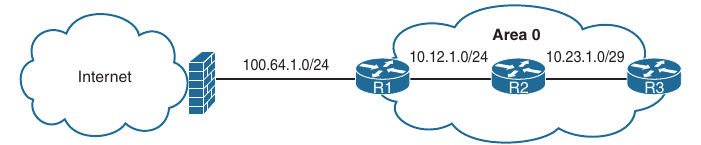

- Below is provided the relevant configuration on R1

- Notice that R1 has a static default route to the firewall (100.64.1.2) to satisfy the requirement of having the default route in the RIB

```
conf t
 ip route 0.0.0.0 0.0.0.0 100.64.1.2
 router ospf 1
  network 10.0.0.0 0.255.255.255 area 0
  default-information originate 
```

- Below is shown the routing table of R2

- Notice that OSPF advertises the default route as an external OSPF route

- R2:

```
R2#show ip route ospf | b Gate
Gateway of last resort is 10.1.2.1 to network 0.0.0.0

O*E2  0.0.0.0/0 [110/1] via 10.1.2.1, 00:00:25, GigabitEthernet0/0
      192.168.1.0/32 is subnetted, 1 subnets
O        192.168.1.1 [110/2] via 10.1.2.1, 00:05:11, GigabitEthernet0/0
```

#### The Designated Router and Backup Designated Router

- Multi-access networks such as Ethernet (LANs) and Frame Relay networks allow more than two routers to exist on a network segment

- This could cause scalability issues with OSPF as the number of routers on a segment increases

- Additional routers flood more LSAs on the segment, and the OSPF traffic becomes excessive as OSPF neighbor adjacencies increase

- If four routers share the same multi-access network, six OSPF adjacencies form, along with six occurences of database flooding on a network

- Using the number of edges formula, n (n - 1) / 2, where n represents the number of routers, if 5 routers were present on a segment - that is 5 (5 - 1) / 2 = 10, then 10 OSPF adjacencies would exist for that segment

- Continuing the logic, adding 1 additional router would make 15 OSPF adjacencies on a network segment

- Having so many adjacencies per segment consumes more bandwidth, more CPU processing, and more memory to maintain each of the neighbor states

- OSPF overcomes this inefficiency by creating a pseudonode (that is, a virtual router) to manage the adjacency state with all the other routers on that broadcast network segment

- A router on the broadcast segment, known as the designated router (DR), assumes the role of the pseudonode

- The DR reduces the number of OSPF adjacencies on a multi-access network segment because routers form full OSPF adjacencies only with the DR and not with each other

- The DR is then responsible for flooding the updates to all OSPF routers on that segment as updates occur

- Below is shown how this simplifies a four-router topology using only three neighbor adjacencies

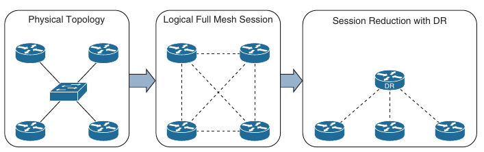

- If the DR were to fail, OSPF would need to form new adjacencies, invoking all new LSAs, and could potentially cause a temporary loss of routes

- In the event of DR failure, a backup designated router (BDR) becomes the new DR; then an ellection occurs to replace the BDR

- To minimize transition time, the BDR also forms a full OSPF adjacency with all OSPF routers on that segment

- The DR/BDR process distributes LSAs in the following manner, assuming that all OSPF routers (DR, BDR or DROTHER) on a segment form full OSPF adjacency with the DR and BDR:

    - **Step 1**: As an OSPF router learns of a new route, it sends the updated LSA to the All-DRouters (224.0.0.6) address, which only the DR and BDR accept and process

    - **Step 2**: The DR sends a unicast acknowledgement to the router that sent initial LSA udpdate

    - **Step 3**: The DR floods the LSA to all the routers on that segment via the AllSPFRouters (224.0.0.5) address as shown below

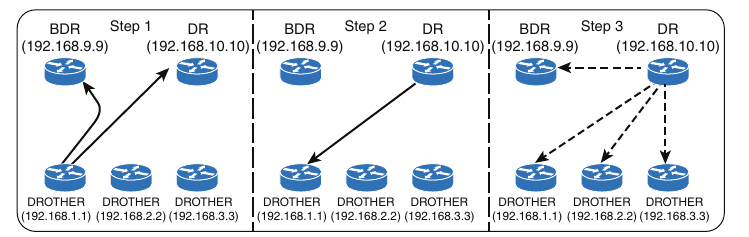

#### Designated Router Elections

- The DR/BDR election occurs with OSPF neighborship - specifically, during the last phase of the 2-Way neighbor state and just before the ExStart state

- When a router enters the 2-Way state, it has already received a hello from the neighbor

- If the hello packet includes a RID, other than 0.0.0.0 for the DR and BDR, the new router assumes that the current routers are the actual DR and BDR

- Any router with the OSPF priority of 1 to 255 on it's OSPF interface attempts to become the DR

- By default, all OSPF interfaces use a priority of 1

- The routers place their RID and OSPF priority in their OSPF hellos for that segment

- Routers then receive and examine OSPF hellos from neighboring routers

- If a router identifies itself as a more favorable router than the OSPF hellos it receives, it continue to send out hellos with it's RID and priority listed

- If the hello received is more favorable, the router updates it's OSPF hello packet to use the more preferable RID in the DR field

- OSPF deems a router more preferable if the priority for the interface is the highest for the segment for that segment

- If the OSPF priority is the same, the higher RID is more favorable

- When all the routers have agreed on the same DR, all routers for that segment become adjacent with the DR

- Then the election for the BDR takes place

- The election follows the same logic as the DR election, except that the DR does not add it's RID to the BDR field of the hello packet

- The OSPF DR and BDR roles cannot be preempted after the DR/BDR election

- Only upon the failure (or process restart) the DR or BDR does the election start to replace the role that is missing

- To ensure that all routers on a segment have fully initialized, OSPF initiates a wait timer when OSPF hello packets do not contain a DR/BDR router for a segment

- The default value for the wait timer is the dead interval timer

- When the wait timer has expired, a router participates in the DR election 

- The wait timer starts when OSPF first starts on an interface, so a router can still elect itself as the DR for a segment without other OSPF routers; it waits until the wait timer expired

- In our OSPF topology, the 10.123.1.0/24 network requires a DR between R1, R2 and R3

- The interface role is determined by viewing the OSPF interface with the command `show ip ospf interface brief`

- R3's interface G0/0 is elected as the DR, R2's G0/0 interface is elected as the BDR, and R1's G0/0 interface is DROTHER for the 10.123.1.0/24 network

- R3's G0/3 interface is the DR because no other router exists on that segment

- R2's G0/1 interface is a point-to-point link and has no DR

- The neighbor's full adjacency field reflects the number of routers that have become adjacent on that network segment; the neighbor's count field is the number of other OSPF routers on that segment

- The first assumption is that all routers will become adjacent with each other, but that defeats the purpose of using a DR

- Only the DR and BDR become adjacent with routers on a network segment

#### BR and BDR Placement

- In our topology R3 wins the DR election, and R2 is elected as the BDR because all the OSPF routers have the same OSPF priority, and the next decision is to use the highest RID

- The RIDs match the Loopback 0 interface IP addresses, and R3's loopback address is the highest on that segment; R2 is the second highest

```
R1#show ip ospf interface  br
Interface    PID   Area            IP Address/Mask    Cost  State Nbrs F/C
Lo0          1     1234            192.168.1.1/32     1     LOOP  0/0
Gi0/0        1     1234            10.123.1.1/24      1     DROTH 2/2
```

```
R2#show ip ospf interface brief 
Interface    PID   Area            IP Address/Mask    Cost  State Nbrs F/C
Gi0/0        1     1234            10.123.1.2/24      1     BDR   2/2
Gi0/1        1     1234            10.24.1.2/29       1     P2P   1/1
```

```
R3#show ip ospf interface brief 
Interface    PID   Area            IP Address/Mask    Cost  State Nbrs F/C
Lo0          1     1234            192.168.3.3/32     1     LOOP  0/0
Gi0/3        1     1234            10.3.3.3/24        1     DR    0/0
Gi0/0        1     1234            10.123.1.3/24      1     DR    2/2
```

- Modifying a router's RID for DR placement is a bad design strategy

- A better technique involves modifying the interface's priority to a higher value than that of the existing DR

- Changing the priority to a value higher than that of the other routers (which have a default value of 1) increases the chance of that router becoming the DR for that segment on that node

- Remember that OSPF does not preempt the DR or BDR roles, and it might be necessary to restart the OSPF process on on the current DR/BDR for the changes to take effect

- The priority can be set manually under the interface configuration with the command `ip ospf priority <0-255>` for IOS nodes

```
conf t
 interface g0/0
  ip ospf priority 120
```

- Setting an interface priority to 0 removes that interface from the DR/BDR election immediately

- Raising the priority above the default value (1) makes that interface more favorable than interfaces with the default value

- Raising the priority on R2 to 120 and setting the priority to 0 on R3

- R2:

```
conf t
 interface g0/0
  ip ospf priority 120
```

- R3:

```
conf t
 interface g0/0
  ip ospf priority 0
```

- How the neighbors are seen now:

```
R1(config)#do sh ip ospf nei

Neighbor ID     Pri   State           Dead Time   Address         Interface
192.168.2.2     120   FULL/DR         00:00:32    10.123.1.2      GigabitEthernet0/0
192.168.3.3       0   FULL/DROTHER    00:00:32    10.123.1.3      GigabitEthernet0/0

R1(config)#do sh ip ospf int br
Interface    PID   Area            IP Address/Mask    Cost  State Nbrs F/C
Lo0          1     1234            192.168.1.1/32     1     LOOP  0/0
Gi0/0        1     1234            10.123.1.1/24      1     BDR   2/2
```

```
R2(config-if)#do sh ip ospf nei

Neighbor ID     Pri   State           Dead Time   Address         Interface
192.168.1.1       1   FULL/BDR        00:00:32    10.123.1.1      GigabitEthernet0/0
192.168.3.3       0   FULL/DROTHER    00:00:30    10.123.1.3      GigabitEthernet0/0
192.168.4.4       0   FULL/  -        00:00:36    10.24.1.4       GigabitEthernet0/1

R2(config-if)#do sh ip ospf int br
Interface    PID   Area            IP Address/Mask    Cost  State Nbrs F/C
Gi0/0        1     1234            10.123.1.2/24      1     DR    2/2
Gi0/1        1     1234            10.24.1.2/29       1     P2P   1/1
```

```
R3#show ip ospf neighbor 

Neighbor ID     Pri   State           Dead Time   Address         Interface
192.168.1.1       1   FULL/BDR        00:00:35    10.123.1.1      GigabitEthernet0/0
192.168.2.2     120   FULL/DR         00:00:30    10.123.1.2      GigabitEthernet0/0

R3#show ip ospf interface brief  
Interface    PID   Area            IP Address/Mask    Cost  State Nbrs F/C
Lo0          1     1234            192.168.3.3/32     1     LOOP  0/0
Gi0/3        1     1234            10.3.3.3/24        1     DR    0/0
Gi0/0        1     1234            10.123.1.3/24      1     DROTH 2/2
```

#### OSPF Network Types

- Different media can provide different characteristics or might limit the number of nodes allowed on a segment

- Frame Relay and Ethernet are common multi-access media, and because they support more than two nodes on a network segment, there is a need for a DR

- Other network circuits, such as serial links, do not require a DR and would just waste router CPU cycles

- The default OSPF network type is set based on the media used for the connection and can be changed independently of the actual media type used

- Cisco's implementation of OSPF considers the various media and provides five OSPF network types

```
Type                    Description                                 DR/BDR field in                         Timers
                                                                    OSPF hellos

Broadcast               Default setting on OSPF-enabled ethernet    Yes                                     Hello: 10
                        links                                                                               Wait: 40
                                                                                                            Dead: 40

Nonbroadcast            Default setting on enabled OSPF Frame       Yes                                     Hello: 30
                        Relay main interface or Frame Relay                                                 Wait: 120
                        multipoint subinterfaces                                                            Dead: 120

Point-to-point          Default setting on enabled OSPF Frame       No                                      Hello: 10
                        Relay point-to-point subinterfaces                                                  Wait: 40
                                                                                                            Dead: 40

Point-to-multipoint     Not enabled by default on any interface     No                                      Hello: 30
                        type. Interface is advertised as a host                                             Wait: 120
                        route (/32), and sets the next-hop-address                                          Dead: 120
                        to the outbound interface. Primarily used
                        for hub-and-spoke topologies

Loopback                Default setting on OSPF-enabled loopback    N/A                                     N/A                                   
                        interfaces. Interface is advertised as a
                        host route (/32)
```

##### Broadcast network type

- Broadcast media such as Ethernet are defined as broadcast multi-access to distinguish them from non-broadcast multi-access (NBMA) networks

- Broadcast networks are multiaccess in that they are capable of connecing more than two devices, and broadcasts sent out one interface are capable of reaching all interfaces attached to that segment

- The OSPF network type is set to broadcast by default for Ethernet interfaces

- A DR is required for this OSPF network type because of the possibility that multiple nodes can exist on a segment and LSA flooding needs to be controlled

- The hello timer defaults to 10 seconds, as defined by RFC 2328

- The interface parameter command `ip ospf network broadcast` overrides the automatically configured setting and statically sets an interface as an OSPF broadcast network type

```
conf t
 interface g0/0
  ip ospf network broadcast
```

##### Nonbroadcast

- Frame Relay, ATM, and X.25 are considered NBMA in that they can connect more than two devices, and broadcasts sent out one interface might not always be capable of reaching all the interfaces attached to that segment

- Dynamic virtual circuits may provide connectivity, but the topology might not be a full mesh and might only provide a hub-and-spoke topology

- Frame Relay interfaces set the OSPF network type to nonbroadcast by default

- The hello protocol interval takes 30 seconds for this OSPF network type

- Multiple routers can exist on a segment so that DR functionality can be used

- Neighbors are statically defined with the `neighbor <ip-address>` command because multicast and broadcast functionality do not exist on this type of circuit

- Configuring a static neighbor causes OSPF hellos to be sent unicast 

- The interface parameter command `ip ospf network non-broadcast` manually sets an interface as an OSPF nonbroadcast network type

```
conf t
 interface s0/0
  ip ospf network non-broadcast
```

- Example of a Frame Relay topology

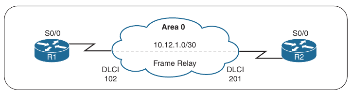

```
conf t
 interface s1/0
  ip address 10.1.12.1 255.255.255.252
  encapsulation frame-relay
  no frame-relay inverse-arp
  frame-relay map ip 10.1.12.2 102

 router ospf 1
  router-id 192.168.1.1
  neighbor 10.1.12.2
  network 0.0.0.0 255.255.255.255 area 0
```

- The nonbroadcast network type is identified by filtering the output of the `show ip ospf interface` command with the Type keyword

```
R1(config)#do sh ip ospf int s1/0 | i Type
  Process ID 1, Router ID 192.168.1.1, Network Type NON_BROADCAST, Cost: 64
```

##### Point-to-Point networks

- A network circuit that allows only two devices to communicate is considered a point-to-point (P2P) network

- Because of the nature of the medium, point-to-point networks do not use Address Resolution Protocol (ARP), and broadcast traffic do not become the limiting factor

- The OSPF network type is set to point-to-point by default for serial interfaces (HDLC or PPP encapsulation), Generic Routing Encapsulation (GRE) tunnels, and point-to-point Frame Relay subinterfaces

- Only two nodes can exist on this type of network medium, so OSPF does not waste CPU cycles on DR functionality

- The hello timer is set to 10 seconds on OSPF point-to-point network types

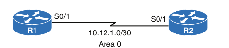

- Below there are R1's and R2 serial interface and OSPF configuration

- R1:

``` 
R1(config-router)#do sh run int s1/0
Building configuration...

Current configuration : 89 bytes
!
interface Serial1/0
 ip address 10.1.12.1 255.255.255.252
 serial restart-delay 0
end

R1(config-router)#do sh run | s router ospf
router ospf 1
 router-id 192.168.1.1
 network 0.0.0.0 255.255.255.255 area 0
```

- R2:

```
R2(config-router)#do sh run int s1/0
Building configuration...

Current configuration : 89 bytes
!
interface Serial1/0
 ip address 10.1.12.2 255.255.255.252
 serial restart-delay 0
end

R2(config-router)#do sh run | s router ospf 
router ospf 2
 router-id 192.168.2.2
 network 0.0.0.0 255.255.255.255 area 0
```

- Notice that there are not any special commands in the configuration

- Below we can see that the OSPF network type is set to POINT_TO_POINT, indicating the OSPF point-to-point network type

```
R1(config-router)#do sh ip ospf int s1/0 | i Type
  Process ID 1, Router ID 192.168.1.1, Network Type POINT_TO_POINT, Cost: 64
```

```
R2(config-router)#do sh ip ospf int s1/0 | i Type
  Process ID 2, Router ID 192.168.2.2, Network Type POINT_TO_POINT, Cost: 64
```

- Below is shown that point-to-point OSPF network types do not use a DR. Notice the hyphen (-) in the State field

```
R1(config-router)#do sh ip ospf neig

Neighbor ID     Pri   State           Dead Time   Address         Interface
192.168.2.2       0   FULL/  -        00:00:35    10.1.12.2       Serial1/0
```

- Interfaces using an OSPF point-to-point network type form an OSPF adjacency quickly because the DR election is bypassed, and there is no wait timer

- Ethernet interfaces that are directly connected with only two OSPF speakers in the subnet could be changed to the OSPF point-to-point network type to form adjacencies more quickly and to simplify the SPF computation

- The interface parameter command `ip ospf network point-to-point` manually sets an interface as an OSPF point-to-point network type

##### Point-to-multipoint networks

- The OSPF network type point-to-multipoint is not enabled by default on any medium

- It requires manual configuration

- A DR is not enabled for this OSPF network type, and the hello timer is set to 30 seconds

- A point-to-multipoint OSPF network type supports hub-and-spoke connectivity while the same IP subnet is commonly found in Frame Relay and Layer 2 VPN (L2VPN) topologies

- Interfaces set for the OSPF point-to-multipoint network type add the interface's IP address to the OSPF LSDB as a /32 network

- When advertising routes to OSPF peers on that interface, the next-hop address is set to the IP address of the interface even if the next-hop IP address resides in the same IP subnet

- The IOS interface parameter command `ip ospf network point-to-multipoint` manually sets an interface as an OSPF point-to-multipoint network type

- Below is a topology with 3 routers R1, R2 and R3 all using Frame Relay point-to-multipoint sub-interfaces using the same subnet

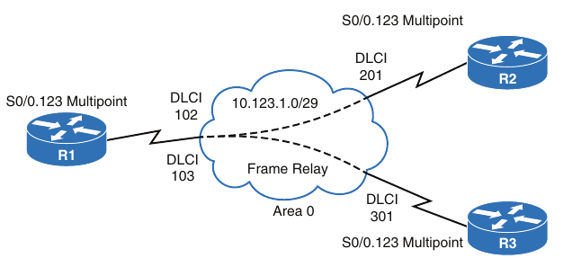

- R1:

```
interface Serial 0/0
encapsulation frame-relay
no frame-relay inverse-arp
!
interface Serial 0/0.123 multipoint
ip address 10.123.1.1 255.255.255.248
frame-relay map ip 10.123.1.2 102 broadcast
frame-relay map ip 10.123.1.3 103 broadcast
ip ospf network point-to-multipoint

router ospf 1
 ip ospf router-id 192.168.1.1
```

- R2:

```
interface Serial 0/0
encapsulation frame-relay
no frame-relay inverse-arp
!
interface Serial 0/1/0/0.123 multipoint
ip address 10.123.1.2 255.255.255.248
frame-relay map ip 10.123.1.1 201 broadcast
ip ospf network point-to-multipoint
!
router ospf 1
router-id 192.168.2.2
network 0.0.0.0 255.255.255.255 area 0
```

- R3:

```
interface Serial 0/0
encapsulation frame-relay
no frame-relay inverse-arp
!
interface Serial 0/0.123 multipoint
ip address 10.123.1.3 255.255.255.248
frame-relay map ip 10.123.1.1 301 broadcast
ip ospf network point-to-multipoint
!
router ospf 1
router-id 192.168.3.3
network 0.0.0.0 255.255.255.255 area 0
```

- Below the interfaces are verified that they are point-to-multipoint network type

```
R1#sh ip ospf interface s1/0 | i Type
  Process ID 1, Router ID 192.168.1.1, Network Type POINT_TO_MULTIPOINT, Cost: 64

R2(config-router)#do sh ip ospf int s1/0 | i Type
  Process ID 1, Router ID 192.168.2.2, Network Type POINT_TO_MULTIPOINT, Cost: 64
```

- Below is shown that OSPF do not use a DR for the OSPF point-to-multipoint network type

- Notice that the routers are on the same subnet, but R2 and R3 do not establish an adjacency with each other

```
R1#sh ip ospf neighbor 

Neighbor ID     Pri   State           Dead Time   Address         Interface
192.168.2.2       0   FULL/  -        00:01:38    10.1.12.2       Serial1/0

R2(config-router)#do sh ip ospf neigh

Neighbor ID     Pri   State           Dead Time   Address         Interface
192.168.1.1       0   FULL/  -        00:01:32    10.1.12.1       Serial1/0
```

- Below is shown that all serial0/0.123 interfaces are advertised in OSPF as a /32 network and that the next-hop address is set (by R1) where advertised to the spoke nodes

- R1:

```
R1# show ip route ospf | begin Gateway
Gateway of last resort is not set
10.0.0.0/8 is variably subnetted, 4 subnets, 2 masks
O
 10.123.1.2/32 [110/64] via 10.123.1.2, 00:07:32, Serial0/0.123
O
 10.123.1.3/32 [110/64] via 10.123.1.3, 00:03:58, Serial0/0.123
192.168.2.0/32 is subnetted, 1 subnets
O
 192.168.2.2 [110/65] via 10.123.1.2, 00:07:32, Serial0/0.123
192.168.3.0/32 is subnetted, 1 subnets
O
 192.168.3.3 [110/65] via 10.123.1.3, 00:03:58, Serial0/0.123
```

- R2:

```
R2# show ip route ospf | begin Gateway
Gateway of last resort is not set
10.0.0.0/8 is variably subnetted, 4 subnets, 2 masks
O 10.123.1.1/32 [110/64] via 10.123.1.1, 00:07:17, Serial0/0.123
O 10.123.1.3/32 [110/128] via 10.123.1.1, 00:03:39, Serial0/0.123
192.168.1.0/32 is subnetted, 1 subnets
O 192.168.1.1 [110/65] via 10.123.1.1, 00:07:17, Serial0/0.123
192.168.3.0/32 is subnetted, 1 subnets
O 192.168.3.3 [110/129] via 10.123.1.1, 00:03:39, Serial0/0.123
```

- R3:

```
R3# show ip route ospf | begin Gateway
Gateway of last resort is not set

10.0.0.0/8 is variably subnetted, 4 subnets, 2 masks
O 10.123.1.1/32 [110/64] via 10.123.1.1, 00:04:27, Serial0/0.123
O 10.123.1.2/32 [110/128] via 10.123.1.1, 00:04:27, Serial0/0.123
192.168.1.0/32 is subnetted, 1 subnets
O 192.168.1.1 [110/65] via 10.123.1.1, 00:04:27, Serial0/0.123
192.168.2.0/32 is subnetted, 1 subnets
O 192.168.2.2 [110/129] via 10.123.1.1, 00:04:27, Serial0/0.123
```

##### Loopback networks

- The OSPF network type loopback is enabled by default for loopback interfaces and can be used only on loopback interfaces

- The OSPF network type loopback indicates that the IP address is always advertised with a /32 prefix length, even if the IP address configured on the loopback interface does not have a /32 prefix length

- You can see this behaviour by looking below, where Loopback 0 interface is now being advertised in to OSPF

- Below is provided the updated configuration

- Notice that R2's loopback interface is set to the OSPF point-to-point network type to ensure that R2's loopback interface advertises the network prefix 192.168.2.0/24 and not 192.168.2.2/32

- R1:

```
conf t
 interface Serial1/0
  ip address 10.1.12.1 255.255.255.252

 interface Loopback0
 ip address 192.168.1.1 255.255.255.255

 router ospf 1
  router-id 192.168.1.1
  network 0.0.0.0 255.255.255.255 a 0
```

- R2:

```
conf t
 int s 1/0
  ip address 10.1.12.2 255.255.255.252

 int l0
  ip address 192.168.2.2 255.255.255.0
  ip ospf network point-to-point

 router ospf 1
  router-id 192.168.2.2 
  network 0.0.0.0 255.255.255.255 a 0 
```

- You should check the network types for R1 and R2 loopback interfaces to verify that they are changed and are different

- R1:

```
R1#sh ip ospf int l0 | i Type
  Process ID 1, Router ID 192.168.1.1, Network Type LOOPBACK, Cost: 1
```

- R2:

```
R2#sh ip ospf int l0 | i Type
  Process ID 1, Router ID 192.168.2.2, Network Type POINT_TO_POINT, Cost: 1
```

- Below is shown the OSPF database, where you can see that R1's loopback address is a /32 network, and R2's loopback address is a /24 network

- Both loopbacks were configured with a /24 network, but because R1's L0 interface is an OSPF network type of loopback, it is advertised as a /32 network

```
R1#show ip ospf database router | i Advertising|Network|Mask
  Advertising Router: 192.168.1.1
    Link connected to: a Stub Network
     (Link ID) Network/subnet number: 192.168.1.1
     (Link Data) Network Mask: 255.255.255.255
    Link connected to: a Stub Network
     (Link ID) Network/subnet number: 10.1.12.0
     (Link Data) Network Mask: 255.255.255.252
  Advertising Router: 192.168.2.2
    Link connected to: a Stub Network
     (Link ID) Network/subnet number: 192.168.2.0
     (Link Data) Network Mask: 255.255.255.0
    Link connected to: a Stub Network
     (Link ID) Network/subnet number: 10.1.12.0
     (Link Data) Network Mask: 255.255.255.252
```

#### Failure Detection

- A secondary function of OSPF hello packets is to ensure that adjacent OSPF neighbors are still healthy and available

- OSPF sends hello packets at set intervals, according to the `hello timer`

- OSPF uses a second timer called `the OSPF dead interval timer`, which defaults to four times the hello timer

- Upon receipt of the hello packet from a neighboring router, the OSPF dead timer resets to the initial value, and then it starts decrementing again

- If a router does not receive a hello before the OSPF dead interval timer reaches 0, the neighbor state is changed to down

- The OSPF router immediately sends out the appropriate LSA, reflecting the topology change, and the SPF algorithm processes on all routers within the area

##### Hello Timer

- The default OSPF hello timer interval is based on the OSPF network type

- OSPF allows modification to the hello timer interval with values between 1 and 65535 seconds

- Changing the hello timer interval modifies the default dead interval too

- The OSPF hello timer is modified with the interface configuration submode command `ip ospf hello-interval <1-65535>`

```
conf t
 interface g0/1
  ip ospf hello-interval 10
```
##### Dead Interval Timer

- You can change the dead interval timer to a value between 1 and 65535

- You can change the OSPF dead interval timer by using the command `ip ospf dead-interval <1-65535>` under the interface configuration submode

```
conf t
 interface g0/1
  ip ospf dead-interval 40
```

##### Verifying OSPF timers

- You view the timers for an OSPF interface by using the command `show ip ospf interface`, as shown below

- Notice the hello and dead timers in our case:

```
R1#sh ip ospf interface s1/0 | i line|Timer
Serial1/0 is up, line protocol is up 
  Timer intervals configured, Hello 10, Dead 40, Wait 40, Retransmit 5

R2(config-if)#do sh ip ospf int l0 | i line|Timer
Loopback0 is up, line protocol is up 
  Timer intervals configured, Hello 10, Dead 40, Wait 40, Retransmit 5

R3#show ip ospf interface e0/0 | i line|Timer
Ethernet0/0 is up, line protocol is up 
  Timer intervals configured, Hello 10, Dead 40, Wait 40, Retransmit 5
```

#### Authentication

- An attacker can forge OSPF packets or gain physical access to a network

- After manipulating the routing table, the attacker can send traffic down links that allow for traffic interception, create denial of service attack, or perform some other malicious behaviour

- OSPF authentication is enabled on an interface-by-interface basis for all interfaces in an area

- You can set the password only as an interface parameter, and you must set it on every interface

- If you miss an interface, the default password is set to a null value

- OSPF supports two types of authentication:

    - **Plaintext**: This type of authentication provides little security, as anyone with access to the link can see the password by using a network sniffer

    - You enable plaintext authentication for an OSPF area with the command `area <area-id> authentication` to set plaintext authentication only on that interface

    - You configure the plaintext password using the interface parameter command `ip ospf authentication-key <password>`

    ```
    conf t
     router ospf 1
      area 0 authentication
     exit
     interface g0/1
      ip ospf authentication-key MARIUS
    ``` 

    - **MD5 cryptographic hash**: This type of authentication uses a hash, so the password is never sent out the wire

    - This technique is widely accepted as being the more secure mode

    - You enable MD5 authentication for an OSPF area by using the command `area <area-id> authentication message-digest`, and you use the interface parameter command `ip ospf authentication message-digest` to set MD5 authentication for that interface

    - You configure the MD5 password with the interface parameter command `ip ospf message-digest key <key-nr> md5 <password>`

    - MD5 authentication is a hash of the key number and the password combined. If the keys do not match, the hash differs between the node

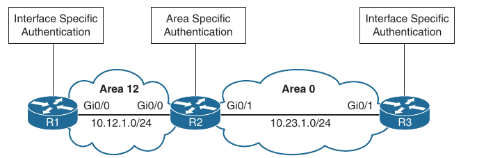

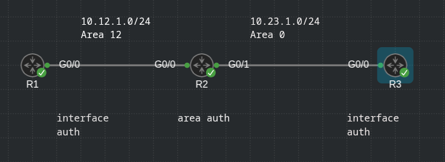

- Above we can see a simple topology to demonstrate the OSPF authentication configuration

- Area 12 uses plaintext authentication, and Area 0 uses MD5 authentication

- R1 and R3 uses interface-based authentication, and R2 uses area-specific authentication

- The password for all areas is CISCO

- R1:

```
conf t
 interface GigabitEthernet0/0
  ip address 10.12.1.1 255.255.255.0
  ip ospf authentication
  ip ospf authentication-key CISCO 
  ip ospf 1 area 12
```

- R2:

```
conf t
 interface GigabitEthernet0/0
  ip address 10.12.1.2 255.255.255.0
  ip ospf authentication
  ip ospf authentication-key CISCO
  ip ospf 1 area 12

 interface GigabitEthernet0/1
  ip address 10.23.1.2 255.255.255.0
  ip ospf message-digest-key 1 md5 CISCO 
  ip ospf 1 area 0

 router ospf 1
  router-id 192.168.2.2
  area 0 authentication message-digest
  area 12 authentication
```

- R3:

```
conf t
 interface GigabitEthernet0/0
  ip address 10.23.1.3 255.255.255.0
  ip ospf authentication message-digest
  ip ospf message-digest-key 1 md5 CISCO
  ip ospf 1 area 0
```

- You verify the authentication settings by examining the OSPF interface without the `brief` option

- Below are shown the output from R1, R2 and R3

- MD5 authentication also identifies the key number that the interface uses

- R1:

```
R1(config-router)#do sh ip ospf int | i line|authentication|key
Loopback0 is up, line protocol is up 
GigabitEthernet0/0 is up, line protocol is up 
  Simple password authentication enabled
```

- R2:

```
R2(config-router)#do sh ip ospf interf | i line|authentication|key
Loopback0 is up, line protocol is up 
GigabitEthernet0/1 is up, line protocol is up 
  Cryptographic authentication enabled
    Youngest key id is 1
GigabitEthernet0/0 is up, line protocol is up 
  Simple password authentication enabled
```

- R3:

```
R3(config-router)#do sh ip ospf interf | i line|authentication|key 
Loopback0 is up, line protocol is up 
GigabitEthernet0/0 is up, line protocol is up 
  Cryptographic authentication enabled
    Youngest key id is 1
```
