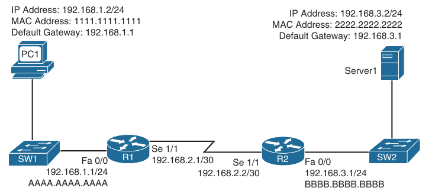
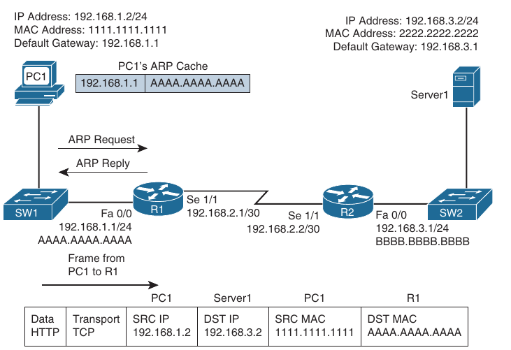
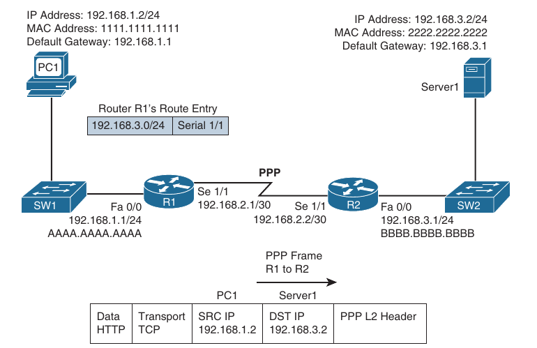
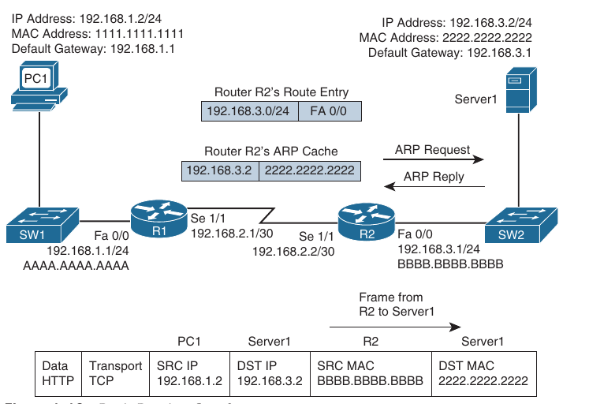
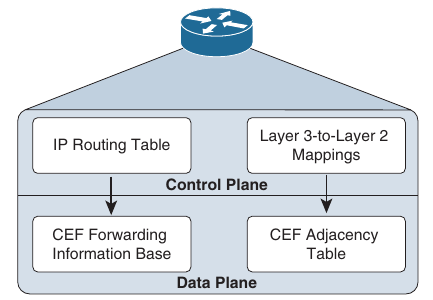
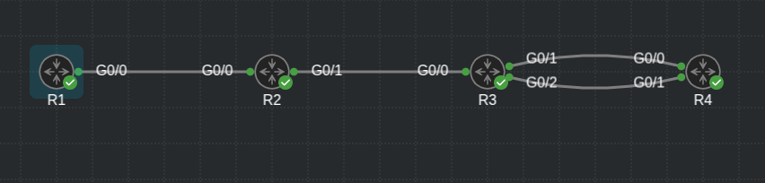
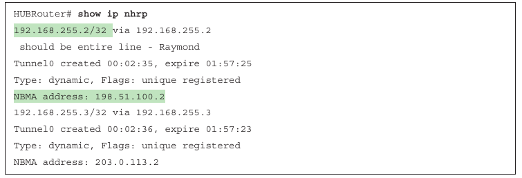
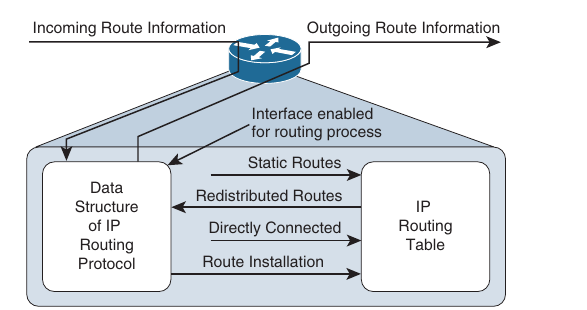
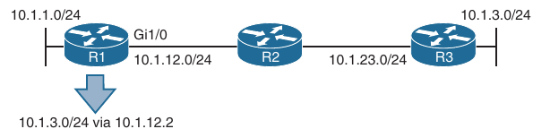
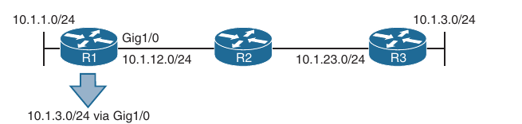

## Packet-Forwarding Process

- When troubleshooting connectivity issues for an IP-based network, the network layer (Layer3) of the OSI reference model is often an appropriate place to begin your troubleshooting efforts; this is referred to as the *divide-and-conquer method* 

- For example, if you are experiencing connectivity issues between two hosts on a network, you could check Layer 3 by pinging between the hosts

- If the pings are successful, you can conclude that the issue resides at upper layers of the OSI reference model (Layers 4 through 7)

- However, if the ping fails, you should focus your troubleshooting efforts on Layers 1 through 3

- If you ultimately define that there is a problem at Layer 3, your efforts might be centered on a router's *packet-forwarding* process

- The packet forwarding process and the commands used to verify the entries in the data structures that are used for this process

- It also provides you with a collection of Cisco IOS software commands that are useful when troubleshooting related issues

### Reviewing the Layer3 Packet-Forwarding Process

- To review basic routing process, look at the topology below

- PC1 needs to access HTTP resources on Server1

- Notice that PC1 and Server1 are on different networks

- So how does a packet from source IP address 192.168.1.2 gets routed to destination IP address 192.168.3.2



- Step-by-step walkthrough of this process:

**Step 1**:

PC1 compares it's IP address and subnet mask 192.168.1.2/24 with the destination IP address 192.168.3.2

PC1 determines the network portion of it's own IP address

It then compares these binary bits with the same binary bits of the destination address

If they are the same, then it knows the destination is on the same subnet

If they differ, then it knows the destination is on a remote subnet

PC1 concludes that the destination IP address is on a remote subnet in this example

Therefore, PC1 needs to send the frame to it's default gateway, which could have been manually configured on PC1 or dynamically learned via DHCP

In this example, PC1 has the default gateway address 192.168.1.1 (that is, router R1)

To construct a proper Layer 2 frame, PC1 needs the MAC address of the frame's destination, which is PC1's default gateway in this example

If the MAC address is not in PC1's Address Resolution Protocol (ARP) cache, PC1 uses ARP to discover it

Once PC1 receives an ARP reply from router R1, PC1 adds R1's MAC address to it's ARP cache

PC1 then sends it's data destined for Server1 in a frame addressed to R1



**Step 2**:

- R1 receives the frame sent from PC1, and because the destination MAC address is R1's, R1 tears off the Layer 2 header and interrogates the IP (Layer 3 header)

- An IP header contains a time-to-live (TTL) field, which is decremented once for each router hop

- Therefore, router R1 decrements the packet's TTL field

- If the value in the TTL field is reduced to zero, the router discards the packet and sends a *time-exceeded* Internet Control Message Protocol (ICMP) message back to the source

- If the TTL field is not decremented to zero, router R1 checks it's *routing table* to determine the best path to reach the IP address 192.168.3.2

- In this example, R1's routing table has an entry stating that network 192.168.3.0/24 is accessible through interface serial 1/1

- Note that ARP is not required for serial interfaces because these interface types do not have MAC addresses

- Therefore, R1 forwards the frame out of it's Serial 1/1 interface, using the Point-to-Point Protocol (PPP) Layer 2 framing header



- **Step 3**:

- When router R2 receives the frame, it removes the PPP header and then decrements the TTL field in the IP header, just as router R1 did

- Again, if the TTL header did not get decremented to 0, router R2 interogates the IP header to determine the destination network

- In this case, the destination network 192.168.3.0/24 is directly attached to router R2's Fast Ethernet 0/0 interface

- Much the way PC1 send out an ARP request to determine the MAC address of Server1 if it is not already known in the ARP cache

- Once an ARP reply is received from Server1, router 2 stores the results of the ARP reply in the ARP cache and forwards the frame out it's Fast Ethernet 0/0 interface to Server1



- The previous steps identified two router data structures:

    - **IP routing table**: When a router needs to route an IP packet it consults its IP routing table to find the best match

    - The best match is the route that has the longest prefix

    - For example, suppose that a router has a routing entry for networks 10.0.0.0/8, 10.1.1.0/24, and 10.1.1.0/26

    - Also suppose that the router is trying to forward a packet with the destination IP address 10.1.1.10

    - The router selects the 10.1.1.0/26 route entry as the best match for 10.1.1.10 because that route has the longest prefix, /26 (so it matches the largest number of bits)

    - **Layer 3-to-Layer 2 mapping table**: In the last image, router R2's ARP cache contains Layer 3-to-Layer 2 mapping information

    - Specifically, the ARP cache has a mapping that says MAC address 2222.2222.2222 corresponds to IP address 192.168.3.2

    - An ARP cache is the Layer 3-to-Layer 2 mapping data structure used for Ethernet-based networks, but similar data structures are used for Multipoint Frame Relay networks and Dynamic Multipoint Virtual Private Netwoks (DMVPNs)

    - However, for point-to-point links such as PPP or High-Level Data Link Control (HDLC), because there is only one other possible device connected to the other end of the link, no mapping information is needed to determine the next-hop device

- Continually querying a router's routing table and it's Layer 3-to-Layer 2 mapping data structure (for example, the ARP cache) is less than efficient

- Fortunately, Cisco Express Forwarding (CEF) gleans it's information from the router's IP routing table and Layer 3-to-Layer 2 mapping tables

- Then, CEF's data structures in hardware can be referenced when forwarding packets

- The two primary CEF data structures are as follows:

    - **Forwarding Information Base (FIB)**: The FIB contains Layer 3 information, similar to the information found in an IP routing table

    - In addition, FIB contains information about multicast routes and directly connected hosts

    - **Adjacency Table**: When a router is performing a route lookup using CEF, the FIB references an entry in the adjacency table

    - The adjacency table entry contains the frame header information required by the router to properly form a frame

    - Therefore, an egress interface and a next-hop MAC address is in an adjacency entry for a multipoint Ethernet interface, whereas a point-to-point interface requires only egress interface information



#### Troubleshooting the Packet-Forwarding process

- When troubleshooting packet-forwarding issues, you need to examine a router's IP routing table

- If the observed behavior of the traffic is not conforming to information in the IP routing table, remember that the IP routing table is maintained by a router's control plane and is used to build the tables in the data plane

- CEF is operating in the data plane and uses the FIB

- You need to view the CEF data structures (that is the FIB and the adjacency table) that contains all the information required to make packet-forwarding decisions

- Below is provided an sample output of the `show ip route <ip_address>` command

- The output shows that the next-hop IP address to reach the IP address 192.168.1.11 is 192.168.0.11, which is accessible via Gigabit Ethernet 0/0 interface

- Because this information is coming from the control plane, it includes information about the routing protocol, which is OSPF in this case

```
R1#show ip route 192.168.1.11
Routing entry for 192.168.1.0/24
  Known via "ospf 1", distance 110, metric 3, type intra area
  Last update from 192.168.0.11 on GigabitEthernet0/0, 00:00:26 ago
  Routing Descriptor Blocks:
  * 192.168.0.11, from 10.0.0.1, 00:00:26 ago, via GigabitEthernet0/0
      Route metric is 3, traffic share count is 1
```



- Below is shown an example of `show ip route <ip_address> <subnet_mask>` command 

- The output shows that the entire network 192.168.1.0/24 is accessible out interface G0/0, with next-hop IP address 192.168.0.11

```
R1#show ip route 192.168.1.0 255.255.255.0
Routing entry for 192.168.1.0/24
  Known via "ospf 1", distance 110, metric 3, type intra area
  Last update from 192.168.0.11 on GigabitEthernet0/0, 00:05:20 ago
  Routing Descriptor Blocks:
  * 192.168.0.11, from 10.0.0.1, 00:05:20 ago, via GigabitEthernet0/0
      Route metric is 3, traffic share count is 1
```

- Below is provided the output of `show ip route <ip_address> <subnet_mask> [longer-prefixes]` command, with and without the `longer-prefixes` option

- Notice that the router responds that the subnet 172.16.0.0 255.255.0.0 is not in the IP routing table

- However, with the `longer-prefixes` option added, two routes are displayed because these routes are subnets of the 172.16.0.0/16 network

```
R1#show ip route 172.16.0.0 255.255.0.0    
% Subnet not in table

R1#show ip route 172.16.0.0 255.255.0.0 longer-prefixes 
Codes: L - local, C - connected, S - static, R - RIP, M - mobile, B - BGP
       D - EIGRP, EX - EIGRP external, O - OSPF, IA - OSPF inter area 
       N1 - OSPF NSSA external type 1, N2 - OSPF NSSA external type 2
       E1 - OSPF external type 1, E2 - OSPF external type 2
       i - IS-IS, su - IS-IS summary, L1 - IS-IS level-1, L2 - IS-IS level-2
       ia - IS-IS inter area, * - candidate default, U - per-user static route
       o - ODR, P - periodic downloaded static route, H - NHRP, l - LISP
       a - application route
       + - replicated route, % - next hop override, p - overrides from PfR

Gateway of last resort is not set

      172.16.0.0/24 is subnetted, 2 subnets
O        172.16.1.0 [110/4] via 192.168.0.11, 00:06:04, GigabitEthernet0/0
O        172.16.2.0 [110/4] via 192.168.0.11, 00:06:14, GigabitEthernet0/0
```

- Below is shown the sample output of `show ip cef <ip_address>` command

- The output indicates that, according to CEF, IP address 192.168.1.11 is accessible out interface G0/0, with the next-hop IP address 192.168.0.11

```
R1#sh ip cef 192.168.1.11
192.168.1.0/24
  nexthop 192.168.0.11 GigabitEthernet0/0
```

- Below is provided the output of `show ip cef <ip_address> <subnet_mask>` command

- The output indicates that network 192.168.1.0/24 is accessible of interface G0/0, with the next-hop IP address 192.168.0.11

```
R1#sh ip cef 192.168.1.0 255.255.255.0
192.168.1.0/24
  nexthop 192.168.0.11 GigabitEthernet0/0
```

- Below we can see the output of `show ip cef exact-route <source_ip_address> <dest_ip_address>` command

- The output indicates that a packet sourced from IP address 192.168.0.1 and destined for IP address 172.16.1.1 will be sent out interface g0/0 to next-hop IP address 192.168.0.11

```
R1#show ip cef exact-route 192.168.0.1 172.16.1.1
192.168.0.1 -> 172.16.1.1 =>IP adj out of GigabitEthernet0/0, addr 192.168.0.11
```

- For a multipoint interface, such as Ethernet, when a router knows the next-hop address for a packet, it needs appropriate Layer2 information to properly construct a frame

- Below is provided a sample output of `show ip arp` command, which displays the ARP cache that is stored in the control plane on a router

- The output shows the learned or configured MAC addresses along with their associated IP addresses

```
R2#show ip arp 
Protocol  Address          Age (min)  Hardware Addr   Type   Interface
Internet  10.1.1.1                -   5254.00c7.6ac6  ARPA   GigabitEthernet0/1
Internet  10.1.1.2               14   5254.00c9.359d  ARPA   GigabitEthernet0/1
Internet  192.168.0.1            16   5254.00fd.c9e6  ARPA   GigabitEthernet0/0
Internet  192.168.0.11            -   5254.00a6.05b1  ARPA   GigabitEthernet0/0
```

- Below we can see the output of `show ip nhrp` command

- This command displays the Next Hop Resolution Protocol cache that is used with DMVPN networks



- Below is provided the output of `show adjacency detail` command

- This output shows the CEF information used to construct frame headers used to reach the next-hop IP addresses through the various router interfaces

- Notice the value 525400C9359D525400C76AC60800 for G0/1 interface

```
R2#show adjacency detail 
Protocol Interface                 Address
IP       GigabitEthernet0/0        192.168.0.1(12)
                                   77 packets, 9154 bytes
                                   epoch 0
                                   sourced in sev-epoch 0
                                   Encap length 14
                                   525400FDC9E6525400A605B10800
                                   ARP
IP       GigabitEthernet0/1        10.1.1.2(10)
                                   85 packets, 10070 bytes
                                   epoch 0
                                   sourced in sev-epoch 0
                                   Encap length 14
                                   525400C9359D525400C76AC60800
                                   ARP
```

- These are the destination MAC address, the source MAC address and the EtherType code for an Ethernet frame

- The first 12 hex values are the destination MAC address, the next 12 are the source MAC address, and 0800 is the IPv4 EtherType code

### Administrative Distance

- When designing a routed network and determining what will be the source of routing information, you have many options to choose from: connected, static, EIGRP, OSPF, and BGP, to name a few

- With all these different options, you need to be able to recognize what is most trustworthy (that is believable)

- This is extremely important when you are using multiple sources because only one source of information can be used to populate the routing table for any given route

- As a result, it is important as a troubleshooter, to understand how the best source of routing information is determined and how that source's information is placed in the routing table

- Which sources of routing information are the most believable and how the routing table interacts with various data structures to populate itself with the best information

#### Data Structures and the Routing Table

- To better troubleshoot routing information sources, consider generally, how the data structures of dynamic routing protocols interact with a router's IP routing table

- Below is shown the interaction between the data structures of an IP routing protocol and a router's IP routing table



- As a router receives routing information from a neighboring router, the information is stored in the data structures of the IP routing protocol and analyzed by the routing protocol to determine the best path, based on metrics

- An IP routing protocol's data structure can also be populated by the local router

- For example, a router might be configured for route redistribution, where routing information is redistributed from the routing table into the routing protocol's data structure

- The router might be configured to have specific interfaces participate in an IP routing protocol process

- In that case, the network that the interface belongs to is placed into the routing protocol data structure as well

- But what goes into the routing table?

- Looking at the above figure again and notice that the routing protocol data structure can populate the routing table, a directly connected route can populate the routing table, and static routes can populate the routing table

- These are all known as sources of routing information

#### Sources of Routing Information

- A router could conceivably receive routing information from the following routing sources, all at the same time:

    - Connected interface

    - Static route

    - RIP

    - EIGRP

    - OSPF

    - BGP

- If the routing information received from all these sources is for different destination networks, each one is used for the respectively learned destination networks and placed in the routing table

- However, what if the route received from Routing Information Protocol (RIP) and OSPF is exactly the same?

- For example, say that both protocols have informed the router about the 10.1.1.0/24 network

- How does the router choose which is the most believable, or the best source of routing information

- It cannot use both; it must pick one and install that information in the routing table

- Routing information sources are each assigned an *administrative distance* (AD)

- Think of an administrative distance of a routing information source as the *believability* or *trustworthiness* of that routing source compared to the other routing information sources

- Below are listed the default ADs of routing information sources

- The lower the AD, the more preffered the source of information

- For instance, RIP has a default AD of 120, whereas OSPF has a default AD of 110

- Therefore, if both RIP and OSPF have knowledge of a route to a specific network (for example 10.1.1.0/24), the OSPF route is injected into the router's routing table, because OSPF has a more believable AD

- Therefore, the best route selected by an IP routing protocol's data structure, is only a *candidate* to be injected into the router's IP routing table

- The route is injected into the routing table only if the router concludes that it came from the best routing source

- When you troubleshoot specific routing protocols, routes from a specific routing protocol might be missing in the routing table, or suboptimal routing may be occurring because different routing source with a lower AD is being used

```
Source of Routing Information                           AD

Connected Interface                                     0

Static Route                                            1

EIGRP Summary Route                                     5

eBGP (External Border Gateway Protocol)                 20

EIGRP (internal)                                        90

OSPF                                                    110

IS-IS (Intermediate System to Intermediate System)      115

RIP                                                     120

ODR (On-Demand Routing)                                 160

EIGRP (External)                                        170

iBGP (Interior Border Gateway Protocol)                 200

Unknown (not believable)                                255
```

- You can verify the AD of a route in a routing table with the following command:

```
show ip route <ip_address>
```

- Notice that the route to 10.1.1.0 has an AD of 0, and the route to 10.1.23.0 has an AD of 90

- TIP: If you ever need to make sure that the routing information or subset of routing information received from a particular source is never used, change the AD of specific routes or all routes from that source to 255, which means, do not believe

- AD is also used to manipulate path selection

- For example, you might have two different paths to the same destination, learned from two different sources, such as EIGRP and a static route

- In this case, the static route is preferred

- However, this static route may be pointing to a backup link that is slower than the EIGRP path

- Therefore, you want the EIGRP path to be installed in the routing table because the static route is causing suboptimal routing

- But you are not allowed to remove the static route

- To solve this issue, create a floating static route

- This static route has a higher AD than the preferred route

- Because you want EIGRP to be preferred, modify the static route so that it has an AD higher than EIGRP, which is 90

- As a result, the EIGRP-learned route is installed in the routing table, and the static route is installed only if the EIGRP-learned route goes away

### Static Routes

- Administrators manually configure static routes, and by default these routes are the second-most-trustworthy source of routing information, with an AD of 1

- They allow an administrator to precisely control how to route packets for a particular destination

- The syntax for IPv4 and IPv6 static routes and explains what to look for while troubleshooting

#### IPv4 Static Routes

- To create an IPv4 static route, use the following command:

```
conf t
 ip route <prefix> <netmask> {ip_address | interface_type interface_number} [distance]
```

- Below is shown the configuration of a static route on R1

- The static route is learning R1 about the 10.1.3.0/24 network:

- R1:

```
conf t
 ip route 10.1.3.0 255.255.255.0 10.1.12.2 8
```

- The network is reachable via the next-hop address 10.1.12.2, which is R2, and is assigned an AD of 8 (default is 1)

- Below is shown the output of `show ip route static` on R1, and indicates that the 10.1.3.0/24 network was learned by a static route, and is reachable via the next-hop IP address 10.1.12.2, it has an AD of 8, and the metric is 0 because there is no way to know how far away the destination truly is (as there is with a dynamic routing protocol)

```
R1(config)#do sh ip ro static 
Codes: L - local, C - connected, S - static, R - RIP, M - mobile, B - BGP
       D - EIGRP, EX - EIGRP external, O - OSPF, IA - OSPF inter area 
       N1 - OSPF NSSA external type 1, N2 - OSPF NSSA external type 2
       E1 - OSPF external type 1, E2 - OSPF external type 2
       i - IS-IS, su - IS-IS summary, L1 - IS-IS level-1, L2 - IS-IS level-2
       ia - IS-IS inter area, * - candidate default, U - per-user static route
       o - ODR, P - periodic downloaded static route, H - NHRP, l - LISP
       a - application route
       + - replicated route, % - next hop override, p - overrides from PfR

Gateway of last resort is not set

      10.0.0.0/8 is variably subnetted, 8 subnets, 3 masks
S        10.1.3.0/24 [8/0] via 10.1.12.2
```

- When troubleshooting IPv4 static routes, you need to be able to recognize why a static route may not be providing the results you want

- For example, are the network and mask accurate?

- If either of them is incorrect, your static route will not route the packets you are expecting it to route

- The router might drop packets because the route used does not match the static route or any other route

- It might end up forwarding packets using the default route, which might be pointing the wrong way

- In addition, if the static route includes networks that it should not, you could be routing packets the wrong way

- Consider this: If you were to configure the static route `ip route 10.1.3.0 255.255.255.0 10.1.12.1` on R2, packets destined to 10.1.3.0/24 network would be sent to R1, which is the wrong way

- However, notice that from the example above, that R1 points to R2 (10.1.12.2) for the network 10.1.3.0

- Therefore, R1 and R2 simply bounce packets that are destined for 10.1.3.0/24 back and forth until the TTL expires



- Notice that next-hop IP address is a very important parameter for the static route

- It tells the local router where to send the packets

- For instance, in the example from above, the next-hop is 10.1.12.2

- Therefore, a packet destined to 10.1.3.0/24 has to go to 10.1.12.2 next

- R1 now does a recursive lookup in the routing table for 10.1.12.2 to determine how to reach it

- Below is shown the output of `show ip route 10.1.12.2` command on R1

- Notice that 10.1.12.2 is directly connected out Gi0/0

```
R1#show ip route 10.1.3.0
Routing entry for 10.1.3.0/24
  Known via "static", distance 8, metric 0
  Routing Descriptor Blocks:
  * 10.1.12.2
      Route metric is 0, traffic share count is 1

R1#show ip route 10.1.12.2
Routing entry for 10.1.12.0/30
  Known via "connected", distance 0, metric 0 (connected, via interface)
  Routing Descriptor Blocks:
  * directly connected, via GigabitEthernet0/0
      Route metric is 0, traffic share count is 1
```

- Because the exit interface to reach 10.1.12.2 is G0/0, the Ethernet frame requires source and destination MAC address

- As a result, R1 looks in it's ARP cache, as shown below, and finds that the MAC address for the 10.1.12.2 is 5254.00a6.05b1

```
R1#show ip arp 
Protocol  Address          Age (min)  Hardware Addr   Type   Interface
Internet  10.1.12.1               -   5254.00fd.c9e6  ARPA   GigabitEthernet0/0
Internet  10.1.12.2              22   5254.00a6.05b1  ARPA   GigabitEthernet0/0
Internet  192.168.0.1             -   5254.00fd.c9e6  ARPA   GigabitEthernet0/0
Internet  192.168.0.11           22   5254.00a6.05b1  ARPA   GigabitEthernet0/0
```

- Notice that in this case the MAC address of the next-hop address is used for the Layer 2 frame

- It is not the MAC address of the IP address of the packet

- The benefit of this is that the router only has to find the MAC address of the next-hop when using the ARP process, and then it can store the results in the ARP cache

- Then, any packet that has to go to the next-hop address 10.1.12.2 do not require an ARP request to be sent; it needs just a lookup in the ARP cache, which makes the overall routing process more efficient

- Now that you understand the next-hop IP address, there is another option you need to know about

- As you saw earlier, you can specify an exit interface for the static route instead of a next-hop IP address

- There is the right time to use the exit interface; there is also a wrong time to use it

- The right time is when it's a pure point-to-point interface, such as DSL or serial

- Point-to-point Ethernet links are not pure point-to-point links; they are still multiaccess, and because they are Ethernet, they require source and destination MAC addresses

- If you specify an Ethernet interface as the next hop, you will be making your router use ARP for the MAC address of every destination IP address in every packet

- Let's look at this:

- Say that you configure the following static route on R1: `ip route 10.1.3.0 255.255.255.0 ge0/0`

- Below is shown how the static route appears in the routing table

- It states that 10.1.3.0/24 is directly conected to Gi0/0. But is it?

- Refer to the topology to know for sure

- It is clear that 10.1.3.0/24 is not directly connected

```
R1(config)#do sh ip ro static
Codes: L - local, C - connected, S - static, R - RIP, M - mobile, B - BGP
       D - EIGRP, EX - EIGRP external, O - OSPF, IA - OSPF inter area 
       N1 - OSPF NSSA external type 1, N2 - OSPF NSSA external type 2
       E1 - OSPF external type 1, E2 - OSPF external type 2
       i - IS-IS, su - IS-IS summary, L1 - IS-IS level-1, L2 - IS-IS level-2
       ia - IS-IS inter area, * - candidate default, U - per-user static route
       o - ODR, P - periodic downloaded static route, H - NHRP, l - LISP
       a - application route
       + - replicated route, % - next hop override, p - overrides from PfR

Gateway of last resort is not set

      10.0.0.0/8 is variably subnetted, 10 subnets, 3 masks
S        10.1.3.0/24 is directly connected, GigabitEthernet0/0
S        10.23.1.0/30 [8/0] via 10.1.12.2
```

- But because of the way the static route is configured, R1 thinks that it is directly connected



- Imagine that users in the 10.1.1.0/24 network are trying to access resources in the 10.1.3.0/24 network

- Specifically, they are accessing resources on devices with IP addresses 10.1.3.1 through 10.1.3.8

- R1 receives the packets, and it looks in the routing table and finds that the longest match is the following entry:

```
S        10.1.3.0/24 is directly connected, GigabitEthernet0/0
```

- R1 believes the network is directly connected; therefore, the destination IP address in the packet is on the network connected to G0/0

- However, you know better because the figure from the above shows that it is not

- So, because it is an Ethernet interface, R1 uses ARP to determine the MAC address of the IP address in the destination field of the packet

- (This is different from what occured when the next-hop IP address was specified. When the next-hop was specified, the MAC address of the next-hop address was used)

- Below is shown the ARP cache on R1

- Notice that every destination IP address has an entry in the ARP cache

```
R1(config)#do sh ip arp
Protocol  Address          Age (min)  Hardware Addr   Type   Interface
Internet  10.1.3.1                0   5254.00a6.05b1  ARPA   GigabitEthernet0/0
Internet  10.1.12.1               -   5254.00fd.c9e6  ARPA   GigabitEthernet0/0
Internet  10.1.12.2               4   5254.00a6.05b1  ARPA   GigabitEthernet0/0
Internet  192.168.0.1             -   5254.00fd.c9e6  ARPA   GigabitEthernet0/0
Internet  192.168.0.11            4   5254.00a6.05b1  ARPA   GigabitEthernet0/0
```

- How can this be if ARP requests are not forwarded by routers?

- It is because of *proxy ARP*, which is on by default on routers

- Proxy ARP allows a router to respond to ARP requests with it's own MAC address if it has a route in the routing table to the IP address of the ARP request

- Notice that for IPs that are not configured on the local router, the MAC address is the same

- In addition they match the MAC address of thr 10.1.12.2 entry

- Therefore, because R2 has a route to reach the IP address of the ARP request, it responds back with it's MAC address

```
R1#show ip arp  
Protocol  Address          Age (min)  Hardware Addr   Type   Interface
Internet  10.1.3.1               24   5254.00a6.05b1  ARPA   GigabitEthernet0/0
Internet  10.1.3.2                0   5254.00a6.05b1  ARPA   GigabitEthernet0/0
Internet  10.1.3.3                0   5254.00a6.05b1  ARPA   GigabitEthernet0/0
Internet  10.1.3.4                0   5254.00a6.05b1  ARPA   GigabitEthernet0/0
Internet  10.1.3.5                0   5254.00a6.05b1  ARPA   GigabitEthernet0/0
Internet  10.1.3.6                0   5254.00a6.05b1  ARPA   GigabitEthernet0/0
Internet  10.1.3.7                0   5254.00a6.05b1  ARPA   GigabitEthernet0/0
Internet  10.1.12.1               -   5254.00fd.c9e6  ARPA   GigabitEthernet0/0
Internet  10.1.12.2              28   5254.00a6.05b1  ARPA   GigabitEthernet0/0
Internet  192.168.0.1             -   5254.00fd.c9e6  ARPA   GigabitEthernet0/0
Internet  192.168.0.11           28   5254.00a6.05b1  ARPA   GigabitEthernet0/0
```

- Below is shown how to use the `show ip interface` command to verify whether proxy ARP is enabled

```
R1#sh ip int g0/0                                                        
GigabitEthernet0/0 is up, line protocol is up
  Internet address is 192.168.0.1/24
  Broadcast address is 255.255.255.255
  Address determined by non-volatile memory
  MTU is 1500 bytes
  Helper address is not set
  Directed broadcast forwarding is disabled
  Secondary address 10.1.12.1/30
  Multicast reserved groups joined: 224.0.0.5
  Outgoing access list is not set
  Inbound  access list is not set
  **Proxy ARP is enabled**
  Local Proxy ARP is disabled
  Security level is default
  Split horizon is enabled
  ICMP redirects are always sent
  ICMP unreachables are always sent
  ICMP mask replies are never sent
  IP fast switching is enabled
  IP fast switching on the same interface is disabled
  IP Flow switching is disabled
  IP CEF switching is enabled
  IP CEF switching turbo vector
  IP multicast fast switching is enabled
  IP multicast distributed fast switching is disabled
  IP route-cache flags are Fast, CEF
  Router Discovery is disabled
  IP output packet accounting is disabled
  IP access violation accounting is disabled
  TCP/IP header compression is disabled
  RTP/IP header compression is disabled
  Policy routing is disabled
  Network address translation is disabled
  BGP Policy Mapping is disabled
  Input features: MCI Check
  IPv4 WCCP Redirect outbound is disabled
  IPv4 WCCP Redirect inbound is disabled
  IPv4 WCCP Redirect exclude is disabled
```

- If proxy ARP is not enabled, the ARP cache on R1 appears as shown below

- Notice that R1 is still sending ARP requests, however, it is not getting any ARP replies

- Therefore, it cannot build the Layer 2 frame, and the result is an `encapsulation failure`, which you would be able to see if you were debugging packets

- 