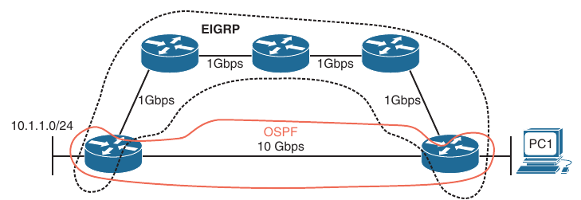
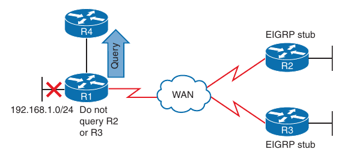
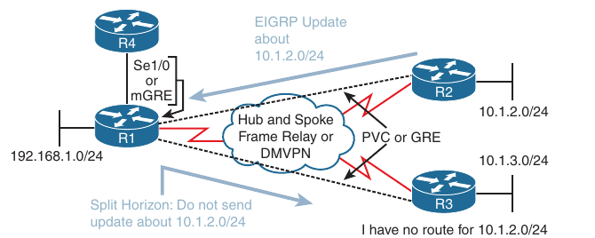
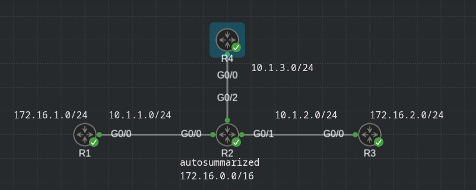
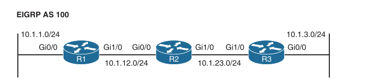
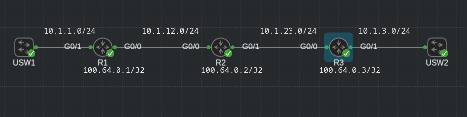

## Troubleshooting EIGRP for IPv4

1. Troubleshooting EIGRP for IPv4 Neighbor Adjacencies

2. Troubleshooting EIGRP for IPv4 routes

3. Troubleshooting Miscellaneous EIGRP for IPv4 issues

4. EIGRP for IPv4 Trouble Tickets

- Before any routes can be exchanged between EIGRP routers on the same LAN or across a WAN, an EIGRP neighbor relationship must be formed

- Neighbor relationships may not form for many reasons, and as a troubleshooter, you need to be aware of them

- This chapter deeps into these issues and gives you the tools needed to identify them and successfully solve neighbor issues

- Once neighbor relationships are formed, neighboring routers exchange EIGRP routes

- In various cases, routes may end up missing, and you need to be able to determine why the routes are missing

- The various ways that routes could go missing and how you can identify them and solve route-related issues

- How to troubleshoot issues related to load balancing, summarization, discontiguous networks, and feasible successors

### Troubleshooting EIGRP for IPv4 Neighbor Adjacencies

- EIGRP establishes neighbor relationships by sending hello packets to the multicast address 224.0.0.10, out interfaces participating in the EIGRP process

- To enable the EIGRP process on an interface, you use the `network <ip-address> <wildcard-mask>` command in `router eigrp` configuration mode

- For example, the command `network 10.1.1.0 0.0.0.255` enables EIGRP on all interfaces with an IP address from 10.1.1.0 through 10.1.1.255

- The command `network 10.1.1.65 0.0.0.0` enables the EIGRP process on only the interface with the IP address 10.1.1.65

- It seems rather simple, and it is; however, for various reasons, neighbor relationships may not form, and all you need to be aware of all of them if you plan to successfully troubleshoot EIGRP-related problems

- Below will be discussed the reasons EIGRP neighbor relationships may not form and how to identify them during the troubleshooting process

- To verify the EIGRP neighbors, you use the `show ip eigrp neighbors` command

- Below is an example of `show ip eigrp neighbors` command:

```
R2#show ip eigrp neighbors 
EIGRP-IPv4 Neighbors for AS(65001)
H   Address                 Interface              Hold Uptime   SRTT   RTO  Q  Seq
                                                   (sec)         (ms)       Cnt Num
2   172.16.23.3             Gi2                      12 00:04:12  112   672  0  6
1   172.16.24.4             Gi3                      11 00:04:12    7   100  0  3
0   172.16.12.1             Gi1                      13 00:04:12  228  1368  0  9
EIGRP-IPv4 VR(EIGRP-NAMED) Address-Family Neighbors for AS(65002)
R2#
```

- It lists the IPv4 address of the neighboring device's interface that sent the hello packet, the local interface on the router used to reach that neighbor, how long the local router will consider the neighboring router to be a neighbor, how long the routers has been neighbors, the amount of time it takes for the neighbors to communicate (on average), the number of EIGRP packets in a queue waiting to be sent to a neighbor (which should always be zero since you want up-to-date routing information), and a sequence number to keep track of the EIGRP packets received from the neighbor to ensure that only newer packets are accepted and processed

- EIGRP neighbor relationships may not form for a variety of reasons, including the following:

    - **Interface is down**: The interface must be up/up

    - **Mistmatched Autonomous System Numbers**: Both routers need to be using the same *autonomous system* number

    - **Incorrect network statement**: The `network` statement must identify the IP address of the interface you want to include in the EIGRP process 

    - **Mismatched K values**: Both routers must use exactly the same K values

    - **Passive Interface**: The `passive interface` feature suppresses sending and receiving of hello packets while still allowing the interface's network to be advertised

    - **Different subnets**: The exchange of hello packets should be made on the same subnet; if it isn't, the hello packets are ignored

    - **Authentication**: If authentication is being used, the key ID and the key string must match, and the key must be valid (if valid times has been configured)

    - **ACLs**: An access control list (ACL) may be denying packets to the EIGRP multicast address 224.0.0.10

    - **Timers**: Timers do not have to match; however, if they are not configured correctly, neighbor adjacencies could flap

- When an EIGRP neighbor relationship does not form, the neighbor is not listed in the neighbor table

- In such a case, you need the assistance of an accurate physical and logical network diagram and the `show cdp neighbors` command to verify who should be the neighbors

- When troubleshooting EIGRP, you need to be aware on how to verify the parameters associated with each of the reasons listed here

- A look at them individually

#### Interface is Down

- The interface must be up if you plan on forming an EIGRP neighbor adjacency

- You can verify the status of an interface with the `show ip interface brief` command

- The status should be listed as `up`, and the protocol should be listed as `up`

#### Mismatched Autonomous System Numbers

- For an EIGRP neighbor relationship to be formed, both routers need to be in the same autonomous system

- You specify the autonomous system number when you issue the command `router eigrp <autonomous-system-number>` command in global configuration mode

- If the two routers are not in the same autonomous systems, they will not form EIGRP neighbor relationship

- Most EIGRP `show` commands display the autonomous system number in the output

- However, the best one is `show ip protocols`, which displays an incredible amount of information for troubleshooting as shown below

- In this example, you can see that R1 is participating in EIGRP autonomous system 65001

- Using the `spot-the-difference` troubleshooting method, you can compare the autonomous system value listed to the value of a neighboring router to determine whether they differ

```
R1#show ip protocols 
*** IP Routing is NSF aware ***

Routing Protocol is "application"
  Sending updates every 0 seconds
  Invalid after 0 seconds, hold down 0, flushed after 0
  Outgoing update filter list for all interfaces is not set
  Incoming update filter list for all interfaces is not set
  Maximum path: 32
  Routing for Networks:
  Routing Information Sources:
    Gateway         Distance      Last Update
  Distance: (default is 4)

Routing Protocol is "eigrp 65001"
  Outgoing update filter list for all interfaces is not set
  Incoming update filter list for all interfaces is not set
  Default networks flagged in outgoing updates
  Default networks accepted from incoming updates
  EIGRP-IPv4 Protocol for AS(65001)
    Metric weight K1=1, K2=0, K3=1, K4=0, K5=0
    Soft SIA disabled
    NSF-aware route hold timer is 240
  EIGRP NSF disabled
     NSF signal timer is 20s
     NSF converge timer is 120s
    Router-ID: 10.1.200.1
    Topology : 0 (base) 
      Active Timer: 3 min
      Distance: internal 90 external 170
      Maximum path: 4
      Maximum hopcount 100
      Maximum metric variance 1

  Automatic Summarization: disabled
  Maximum path: 4
  Routing for Networks:
    10.1.100.0/24
    10.1.200.0/24
    172.16.12.0/24
    172.16.13.0/24
  Routing Information Sources:
    Gateway         Distance      Last Update
    172.16.12.2           90      00:02:15
    172.16.13.3           90      00:02:15
  Distance: internal 90 external 170
```

- R4

```
R4(config-router)#do debug eigrp packets
    (UPDATE, REQUEST, QUERY, REPLY, HELLO, UNKNOWN, PROBE, ACK, STUB, SIAQUERY, SIAREPLY)
EIGRP Packet debugging is on
R4(config-router)#
*May 24 09:32:28.368: EIGRP: Sending HELLO on Gi1 - paklen 20
*May 24 09:32:28.368:   AS 65002, Flags 0x0:(NULL), Seq 0/0 interfaceQ 0/0 iidbQ un/rely 0/0
R4(config-router)#
*May 24 09:32:33.161: EIGRP: Sending HELLO on Gi1 - paklen 20
*May 24 09:32:33.162:   AS 65002, Flags 0x0:(NULL), Seq 0/0 interfaceQ 0/0 iidbQ un/rely 0/0
R4(config-router)#
*May 24 09:32:37.774: EIGRP: Sending HELLO on Gi1 - paklen 20
*May 24 09:32:37.774:   AS 65002, Flags 0x0:(NULL), Seq 0/0 interfaceQ 0/0 iidbQ un/rely 0/0
R4(config-router)#
*May 24 09:32:42.050: EIGRP: Sending HELLO on Gi1 - paklen 20
*May 24 09:32:42.050:   AS 65002, Flags 0x0:(NULL), Seq 0/0 interfaceQ 0/0 iidbQ un/rely 0/0
R4(config-router)#
*May 24 09:32:46.856: EIGRP: Sending HELLO on Gi1 - paklen 20
*May 24 09:32:46.857:   AS 65002, Flags 0x0:(NULL), Seq 0/0 interfaceQ 0/0 iidbQ un/rely 0/0
R4(config-router)#do un all
```

- The output of `debug eigrp packets` command shown that the router is not receiving any hello packets from the neighbors with the mismatched autonomous system number

- In this example R1 is sending hello packets out G1

- However is not receiving any hello packets on this interface

- This could be because of an autonomous system mismatch

- The local router could have the wrong autonomous system number, or the remote router could have the wrong autonomous system number

#### Incorrect Network Statement

- If the network command is misconfigured, EIGRP may not be enabled on proper interfaces, and as a result, hello packets will not be sent and neighbor relationships will not be formed

- You can determine which interfaces are participating in the EIGRP process with the command `show ip eigrp interfaces`

- In our example for instance, you can see that two interfaces are participating in the EIGRP process for autonomous system 65001

- Gi0/1 does not have an EIGRP peer and Gi0/0 does have an EIGRP peer

```
R1(config-router)#do sh ip eigrp interf
EIGRP-IPv4 Interfaces for AS(65001)
                              Xmit Queue   PeerQ        Mean   Pacing Time   Multicast    Pending
Interface              Peers  Un/Reliable  Un/Reliable  SRTT   Un/Reliable   Flow Timer   Routes
Gi0/0                    1        0/0       0/0           1       0/0           50           0
Lo1                      0        0/0       0/0           0       0/0            0           0
Gi0/1                    0        0/0       0/0           0       0/0            0           0
```

- This is expected because no other routers can be reached out G0/1 for this scenario

- However, if you expect an EIGRP peer out the interface based on your documentation, you need to troubleshoot why the peering/neighbor relationship is not forming

- Shift your attention to the `Pending Routes` column

- Notice that all interfaces are listed as 0

- This is expected

- Any other value in this column means that some issue on the network (such as congestion) is preventing the interface from sending the necessary updates to the neighbor

- Remember that EIGRP passive interfaces do not show up in this output

- Therefore, you shouldn't jump to the conclusion that the network command is incorrect or missing if the interface does not show up in this output

- It is possible that the interface is passive

- The output of `show ip protocols` displays the interfaces that are running EIGRP as a result of the network command

- It is not obvious at first unless someone tells you

- The reason is not obvious is that it' not displayed properly

- Notice in output `Routing for Networks`

- Those are not the networks you are routing for

```
R1(config-router)#do sh ip protocols
*** IP Routing is NSF aware ***

Routing Protocol is "application"
  Sending updates every 0 seconds
  Invalid after 0 seconds, hold down 0, flushed after 0
  Outgoing update filter list for all interfaces is not set
  Incoming update filter list for all interfaces is not set
  Maximum path: 32
  Routing for Networks:
  Routing Information Sources:
    Gateway         Distance      Last Update
  Distance: (default is 4)

Routing Protocol is "eigrp 65001"
  Outgoing update filter list for all interfaces is not set
  Incoming update filter list for all interfaces is not set
  Default networks flagged in outgoing updates
  Default networks accepted from incoming updates
  EIGRP-IPv4 Protocol for AS(65001)
    Metric weight K1=1, K2=0, K3=1, K4=0, K5=0
    Soft SIA disabled
    NSF-aware route hold timer is 240
    Router-ID: 1.1.1.1
    Topology : 0 (base) 
      Active Timer: 3 min
      Distance: internal 90 external 170
      Maximum path: 4
      Maximum hopcount 100
      Maximum metric variance 1

  Automatic Summarization: disabled
  Maximum path: 4
  Routing for Networks:
    1.1.1.1/32
    10.1.1.1/32
    10.1.12.1/32
  Passive Interface(s):
    Loopback1
  Routing Information Sources:
    Gateway         Distance      Last Update
    10.1.1.2              90      00:01:09
  Distance: internal 90 external 170

```

- Rather, you are routing for the networks associated with the interface on which the EIGRP will be enabled, based on network commands

- In this case, network 10.1.1.1/32 really means network 10.1.1.1 0.0.0.0, and network 10.1.12.1/32 really means network 10.1.12.1 0.0.0.0

- Therefore, a better option is to use `show run | s router eigrp` command, as shown below

```
R1(config-router)#do sh run | s router eigrp
router eigrp 65001
 network 1.1.1.1 0.0.0.0
 network 10.1.1.1 0.0.0.0
 network 10.1.12.1 0.0.0.0
 passive-interface Loopback1
```

- Notice that the `network` statement is extremely important

- If it is misconfigured, interfaces that should be participating in the EIGRP process might not be, and interfaces that should not be participating in the EIGRP process, might be

- So, you should be able to recognize issues related to the `network` statement

- When using the `debug eigrp packets` command on the router with the misconfigured or missing network statement, you will notice that hello packets not being sent out the interface properly

- For example, if you expect hello packets to be sent out G0/1, but the `debug eigrp packets` command is not indicating that this is happening, it is possible that the interface is not participating in the EIGRP process because of a bad network statement or the interface is passive and suppressing hello packets

#### Mismatched K Values

- The K values used for metric calculation must match between neighbors in order for an adjacency to form

- You can verify either K values match by using `show ip protocols` as shown below

- The default K values are highlighted in our example

- Usually there is no need to change the K values

- However, if they are changed, you need to make them match on every router in the autonomous system

- You can use the `spot-the-difference` method when determining K values do not match between routers

- In addition, if you are logging syslog messages with a severity level of 5, you receive a message similar with the following:

```
logging console notification
logging buffered notification

R2(config-router)#metric weights 0 1 1 3 3 1 
R2(config-router)#
R2(config-router)#
*May 24 18:15:59.131: %DUAL-5-NBRCHANGE: EIGRP-IPv4 65001: Neighbor 10.1.12.1 (GigabitEthernet2) is down: K-value mismatch
*May 24 18:15:59.682: %DUAL-5-NBRCHANGE: EIGRP-IPv4 65001: Neighbor 10.1.1.1 (GigabitEthernet1) is down: K-value mismatch
R2(config-router)#
*May 24 18:16:04.233: %DUAL-5-NBRCHANGE: EIGRP-IPv4 65001: Neighbor 10.1.1.1 (GigabitEthernet1) is down: K-value mismatch
R2(config-router)#
*May 24 18:16:08.674: %DUAL-5-NBRCHANGE: EIGRP-IPv4 65001: Neighbor 10.1.12.1 (GigabitEthernet2) is down: K-value mismatch
R2(config-router)#
*May 24 18:16:13.304: %DUAL-5-NBRCHANGE: EIGRP-IPv4 65001: Neighbor 10.1.12.1 (GigabitEthernet2) is down: K-value mismatch
*May 24 18:16:13.829: %DUAL-5-NBRCHANGE: EIGRP-IPv4 65001: Neighbor 10.1.1.1 (GigabitEthernet1) is down: K-value mismatch
R2(config-router)#
*May 24 18:16:17.755: %DUAL-5-NBRCHANGE: EIGRP-IPv4 65001: Neighbor 10.1.12.1 (GigabitEthernet2) is down: K-value mismatch
*May 24 18:16:18.553: %DUAL-5-NBRCHANGE: EIGRP-IPv4 65001: Neighbor 10.1.1.1 (GigabitEthernet1) is down: K-value mismatch
```

- Viewing K values on `show ip protocols` output

```
R2(config-router)#do sh ip protoc
*** IP Routing is NSF aware ***

Routing Protocol is "application"
  Sending updates every 0 seconds
  Invalid after 0 seconds, hold down 0, flushed after 0
  Outgoing update filter list for all interfaces is not set
  Incoming update filter list for all interfaces is not set
  Maximum path: 32
  Routing for Networks:
  Routing Information Sources:
    Gateway         Distance      Last Update
  Distance: (default is 4)

Routing Protocol is "eigrp 65001"
  Outgoing update filter list for all interfaces is not set
  Incoming update filter list for all interfaces is not set
  Default networks flagged in outgoing updates
  Default networks accepted from incoming updates
  EIGRP-IPv4 Protocol for AS(65001)
    Metric weight K1=1, K2=1, K3=3, K4=3, K5=1
    Soft SIA disabled
    NSF-aware route hold timer is 240
  EIGRP NSF disabled
     NSF signal timer is 20s
     NSF converge timer is 120s
    Router-ID: 2.2.2.2
    Topology : 0 (base) 
      Active Timer: 3 min
      Distance: internal 90 external 170
      Maximum path: 4
      Maximum hopcount 100
      Maximum metric variance 1

  Automatic Summarization: disabled
  Maximum path: 4
  Routing for Networks:
    2.2.2.2/32
    10.1.1.2/32
    10.1.12.2/32
  Routing Information Sources:
    Gateway         Distance      Last Update
    10.1.12.1             90      00:00:05
    10.1.1.1              90      00:00:05
  Distance: internal 90 external 170

```

#### Passive Interface

- The passive interface feature is a must-have for all organizations

- It does two things:

    1. Reduces the EIGRP-related traffic on a network

    2. Improves EIGRP security

- The passive interface feature turns off the sending and receiving of EIGRP packets on an interface while still allowing the interface's network ID to be injected into the EIGRP process and advertised to other EIGRP neighbors

- This ensures that rogue routers attached to the LAN will not be able to form an adjacency with your legitimate router on that interface because it is not sending or receiving EIGRP packets on the interface

- However, if you configure the wrong interface as passive, a legitimate neighbor relationship will not be formed

- As shown in the output of `show ip protocols` below, Gigabit Ethernet 0/1 and Loopback1 are passive interfaces

- If there are no passive interfaces, the passive inteface section does not appear in the `show ip protocols` output

```
R1(config-router)#do sh ip protocols
*** IP Routing is NSF aware ***

Routing Protocol is "application"
  Sending updates every 0 seconds
  Invalid after 0 seconds, hold down 0, flushed after 0
  Outgoing update filter list for all interfaces is not set
  Incoming update filter list for all interfaces is not set
  Maximum path: 32
  Routing for Networks:
  Routing Information Sources:
    Gateway         Distance      Last Update
  Distance: (default is 4)

Routing Protocol is "eigrp 65001"
  Outgoing update filter list for all interfaces is not set
  Incoming update filter list for all interfaces is not set
  Default networks flagged in outgoing updates
  Default networks accepted from incoming updates
  EIGRP-IPv4 Protocol for AS(65001)
    Metric weight K1=1, K2=0, K3=1, K4=0, K5=0
    Soft SIA disabled
    NSF-aware route hold timer is 240
    Router-ID: 1.1.1.1
    Topology : 0 (base) 
      Active Timer: 3 min
      Distance: internal 90 external 170
      Maximum path: 4
      Maximum hopcount 100
      Maximum metric variance 1

  Automatic Summarization: disabled
  Maximum path: 4
  Routing for Networks:
    1.1.1.1/32
    10.1.1.1/32
    10.1.12.1/32
  Passive Interface(s):
    GigabitEthernet0/1
    Loopback1
  Routing Information Sources:
    Gateway         Distance      Last Update
    10.1.12.2             90      00:11:54
    10.1.1.2              90      00:00:14
  Distance: internal 90 external 170

```

- Remember for EIGRP, passive interfaces do not appear in the EIGRP interface table

- Therefore, before you jump to the conclusion that the wrong network command was used and the interface was not enabled for EIGRP, you need to check to see if whether the interface is passive

- When using the `debug eigrp packets` command on the router with the passive interface, notice that hello packets are not being sent out that interface

- For example if you expect hello packets to be sent out G0/1 but the `debug eigrp packets` command is not indicating that this is happening, it is possible that the interface is participating in the EIGRP process but is configured as a passive interface

#### Different subnets

- To form an EIGRP neighbor adjacency, the router interfaces must be on the same subnet

- You can confirm this in many ways

- The simplest way is to look at the interface configuration with the `show run interface <type><number>` command

- You can also use the `show ip interface <type> <number>` command or the `show interface <type><number>` command

- Below are shown the running-config for R1 and R2's G0/0 interfaces

- R1:

```
R1#sh run int g0/0
Building configuration...

Current configuration : 114 bytes
!
interface GigabitEthernet0/0
 ip address 10.1.12.1 255.255.255.0
 duplex auto
 speed auto
 media-type rj45
end
```

- R2:

```
R2(config-if)#do sh run int g0/0
Building configuration...

Current configuration : 114 bytes
!
interface GigabitEthernet0/0
 ip address 10.1.12.2 255.255.255.0
 duplex auto
 speed auto
 media-type rj45
end

```

- Are they in the same subnet? Yes!

- Based on the IP address and subnet mask, they are both in the 10.1.12.0/24 subnet

- However if they are not in the same subnet and you have a syslog set up for a severity level of 6, you will get a message similar to the following:

```
R1(config)#logging console informational 
R1(config)#log
*May 31 16:55:10.570: %SYS-5-LOG_CONFIG_CHANGE: Console logging: level informational, xml disabled, filtering disabled

R1(config)#logging buffered informational 

*May 31 16:55:15.649: %SYS-5-LOG_CONFIG_CHANGE: Buffer logging: level informational, xml disabled, filtering disabled, size (8192)
R1(config)#
*May 31 16:55:34.174: %DUAL-6-NBRINFO: EIGRP-IPv4 65001: Neighbor 10.1.21.1 (GigabitEthernet0/0) is blocked: not on common subnet (10.1.12.1/24)
R1(config)#
*May 31 16:55:44.292: %DUAL-5-NBRCHANGE: EIGRP-IPv4 65001: Neighbor 10.1.12.2 (GigabitEthernet0/0) is down: holding time expired
R1(config)#
```

#### Authentication

- Authentication is used to ensure that EIGRP routers form neighbor relationships only with legitimate routers and that they only accept EIGRP packets from legitimate routers

- Therefore, if authentication is implemented, both routers must agree on the settings for a neighbor relationship to form

- With the authentication, you can use the `spot-the-difference` method

- Below is shown the output of `show run interface <type> <number>` and `show ip eigrp interfaces detail <type> <number>`

- According to the output it is using authentication

```
R1(config-if)#do sh run int g0/0
Building configuration...

Current configuration : 206 bytes
!
interface GigabitEthernet0/0
 ip address 10.1.12.1 255.255.255.0
 ip authentication mode eigrp 65001 md5
 ip authentication key-chain eigrp 65001 EIGRP_AUTH
 duplex auto
 speed auto
 media-type rj45
end

```

```
R1(config-if)#do sh ip eigrp int detail g0/0
EIGRP-IPv4 Interfaces for AS(65001)
                              Xmit Queue   PeerQ        Mean   Pacing Time   Multicast    Pending
Interface              Peers  Un/Reliable  Un/Reliable  SRTT   Un/Reliable   Flow Timer   Routes
Gi0/0                    0        0/0       0/0           0       0/0          932           0
  Hello-interval is 5, Hold-time is 15
  Split-horizon is enabled
  Next xmit serial <none>
  Packetized sent/expedited: 2/0
  Hello's sent/expedited: 92/2
  Un/reliable mcasts: 0/2  Un/reliable ucasts: 3/4
  Mcast exceptions: 0  CR packets: 0  ACKs suppressed: 0
  Retransmissions sent: 3  Out-of-sequence rcvd: 1
  Topology-ids on interface - 0 
  Authentication mode is md5,  key-chain is "EIGRP_AUTH"
  Topologies advertised on this interface:  base
  Topologies not advertised on this interface:

```

- Verifying the key used

```
R1(config-if)#do sh key chain
Key-chain EIGRP_AUTH:
    key 1 -- text "ENARSI"
        accept lifetime (always valid) - (always valid) [valid now]
        send lifetime (always valid) - (always valid) [valid now]
```

- Notice that the authentication must be configured on the correct interface and that it must be tied to the correct autonomous system number

- If you put in the wrong autonomous system number, authentication will not be enabled for the correct autonomous system

- In addition, make sure that you specify the correct keychain to be used for the Message Digest Key 5 (MD5) hash

- You can verify the key chain with the command `show key chain`, as shown above

- The keys in these example do not expire

- However, if you have implemented rotating keys, the key must be valid for authentication to be successful

- Inside the key chain you will find the key ID (1 in this case) and the key string (ENARSI in this case)

- It is mandatory that the key ID and the key string match between neighbors

- Therefore, if you have multiple keys and key strings in a key chain, the same key and the same string must be used at the same time by both routers (meaning they must be valid and in use); otherwise the authentication will fail

- When using the `debug eigrp packets` command for troubleshooting authentication, you receive output based on the authentication issue

- Below is the message that is shown when a neighbor is not configured for authentication:

```
R2(config-if)#do debug eigrp pack
    (UPDATE, REQUEST, QUERY, REPLY, HELLO, UNKNOWN, PROBE, ACK, STUB, SIAQUERY, SIAREPLY)
EIGRP Packet debugging is on
R2(config-if)#
*May 31 18:50:42.318: EIGRP: Gi0/0: ignored packet from 10.1.12.1, opcode = 5 (authentication off)
*May 31 18:50:42.771: EIGRP: Sending HELLO on Gi0/0 - paklen 20
*May 31 18:50:42.771:   AS 65001, Flags 0x0:(NULL), Seq 0/0 interfaceQ 0/0 iidbQ un/rely 0/0
R2(config-if)#
R2(config-if)#
R2(config-if)#
*May 31 18:50:46.783: EIGRP: Gi0/0: ignored packet from 10.1.12.1, opcode = 5 (authentication off)
*May 31 18:50:47.408: EIGRP: Sending HELLO on Gi0/0 - paklen 20
*May 31 18:50:47.408:   AS 65001, Flags 0x0:(NULL), Seq 0/0 interfaceQ 0/0 iidbQ un/rely 0/0
R2(config-if)#
R2(config-if)#do un all
All possible debugging has been turned off
```

- It ignores the packet and states (authentication off)

- When an incorrect key ID is used for authentication:

```
*May 31 18:44:28.122: EIGRP: pkt authentication key id = 1, key not defined
*May 31 18:44:28.123: EIGRP: Gi0/0: ignored packet from 10.1.12.1, opcode = 5 (invalid authentication)
*May 31 18:44:28.420: EIGRP: Sending HELLO on Gi0/0 - paklen 60
*May 31 18:44:28.420:   AS 65001, Flags 0x0:(NULL), Seq 0/0 interfaceQ 0/0 iidbQ un/rely 0/0
R2(config-if)#end
R2#
*May 31 18:44:30.509: %SYS-5-CONFIG_I: Configured from console by console
R2#
*May 31 18:44:33.009: EIGRP: pkt authentication key id = 1, key not defined
*May 31 18:44:33.010: EIGRP: Gi0/0: ignored packet from 10.1.12.1, opcode = 5 (invalid authentication)
*May 31 18:44:33.243: EIGRP: Sending HELLO on Gi0/0 - paklen 60
*May 31 18:44:33.243:   AS 65001, Flags 0x0:(NULL), Seq 0/0 interfaceQ 0/0 iidbQ un/rely 0/0
R2#
```

- When the key IDs or key strings do not match between the neighbors, the debug output states 'invalid authentication'

#### ACLs

- Access control lists (ACLs) are extremely powerful

- How they are implemented determines what they control in the network

- If there is an ACL applied to an interface, and the ACL is denying EIGRP packets, or if an EIGRP packet falls victim to the implicit deny all at the end of the ACL, a neighbor relationship does not form

- To determine whether an ACL is applied to an interface, use the `show ip interface <type> <number>` command

- Notice that ACL 100 is applied inbound on interface g0/0

- To verify ACL 100 entries, issue the command `show access-lists 100`

```
R1(config-if)#do sh ip int g0/0
GigabitEthernet0/0 is up, line protocol is up
  Internet address is 10.1.12.1/24
  Broadcast address is 255.255.255.255
  Address determined by non-volatile memory
  MTU is 1500 bytes
  Helper address is not set
  Directed broadcast forwarding is disabled
  Multicast reserved groups joined: 224.0.0.10
  Outgoing access list is not set
  Inbound  access list is 100 ! ACL 100 applied inbound
  Proxy ARP is enabled
  Local Proxy ARP is disabled
  Security level is default
  Split horizon is enabled
  ICMP redirects are always sent
  ICMP unreachables are always sent
  ICMP mask replies are never sent
  IP fast switching is enabled
  IP fast switching on the same interface is disabled
  IP Flow switching is disabled
  IP CEF switching is enabled
  IP CEF switching turbo vector
  IP multicast fast switching is enabled
  IP multicast distributed fast switching is disabled
  IP route-cache flags are Fast, CEF
  Router Discovery is disabled
  IP output packet accounting is disabled
  IP access violation accounting is disabled
  TCP/IP header compression is disabled
  RTP/IP header compression is disabled
  Policy routing is disabled
  Network address translation is disabled
  BGP Policy Mapping is disabled
  Input features: Access List, MCI Check
  IPv4 WCCP Redirect outbound is disabled
  IPv4 WCCP Redirect inbound is disabled
  IPv4 WCCP Redirect exclude is disabled
```

```
R1(config-if)# do sh access-lists 100
Extended IP access list 100
    10 deny eigrp any any (13 matches)
    20 permit ip any any
```

- In this case you can see that ACL 100 is denying EIGRP traffic; this prevents a neighbor relationship from forming

- Notice that outbound ACLs do not affect EIGRP packets; only inbound ACLs do

```
R1(config-if)#ip access-group 100 in
R1(config-if)#
*May 31 19:18:39.348: EIGRP: Sending HELLO on Gi0/0 - paklen 60
*May 31 19:18:39.348:   AS 65001, Flags 0x0:(NULL), Seq 0/0 interfaceQ 0/0 iidbQ un/rely 0/0
*May 31 19:18:39.406: EIGRP: received packet with MD5 authentication, key id = 1
*May 31 19:18:39.406: EIGRP: Received HELLO on Gi0/0 - paklen 60 nbr 10.1.12.2
*May 31 19:18:39.407:   AS 65001, Flags 0x0:(NULL), Seq 0/0 interfaceQ 0/0 iidbQ un/rely 0/0 peerQ un/rely 0/0
R1(config-if)#
*May 31 19:18:43.693: EIGRP: Sending HELLO on Gi0/0 - paklen 60
*May 31 19:18:43.693:   AS 65001, Flags 0x0:(NULL), Seq 0/0 interfaceQ 0/0 iidbQ un/rely 0/0
R1(config-if)#
*May 31 19:18:48.538: EIGRP: Sending HELLO on Gi0/0 - paklen 60
*May 31 19:18:48.539:   AS 65001, Flags 0x0:(NULL), Seq 0/0 interfaceQ 0/0 iidbQ un/rely 0/0
R1(config-if)#
*May 31 19:18:52.901: EIGRP: Sending HELLO on Gi0/0 - paklen 60
*May 31 19:18:52.902:   AS 65001, Flags 0x0:(NULL), Seq 0/0 interfaceQ 0/0 iidbQ un/rely 0/0
R1(config-if)#
*May 31 19:18:54.409: %DUAL-5-NBRCHANGE: EIGRP-IPv4 65001: Neighbor 10.1.12.2 (GigabitEthernet0/0) is down: holding time expired
R1(config-if)#
*May 31 19:18:54.412: EIGRP: Sending HELLO on Gi0/0 - paklen 60
*May 31 19:18:54.412:   AS 65001, Flags 0x0:(NULL), Seq 0/0 interfaceQ 0/0 iidbQ un/rely 0/0
*May 31 19:18:54.414: EIGRP: Lost Peer: Total 1 (5/0/0/0/0)
R1(config-if)#
*May 31 19:18:58.695: EIGRP: Sending HELLO on Gi0/0 - paklen 60
*May 31 19:18:58.695:   AS 65001, Flags 0x0:(NULL), Seq 0/0 interfaceQ 0/0 iidbQ un/rely 0/0
R1(config-if)#
*May 31 19:19:03.216: EIGRP: Sending HELLO on Gi0/0 - paklen 60
*May 31 19:19:03.217:   AS 65001, Flags 0x0:(NULL), Seq 0/0 interfaceQ 0/0 iidbQ un/rely 0/0
R1(config-if)#un  
*May 31 19:19:07.564: EIGRP: Sending HELLO on Gi0/0 - paklen 60
*May 31 19:19:07.564:   AS 65001, Flags 0x0:(NULL), Seq 0/0 interfaceQ 0/0 iidbQ un/rely 0/ 
R1(config-if)#ip access-group 100 in
*May 31 19:19:12.506: EIGRP: Sending HELLO on Gi0/0 - paklen 60
*May 31 19:19:12.506:   AS 65001, Flags 0x0:(NULL), Seq 0/0 interfaceQ 0/0 iidbQ un/rely 0/0
R1(config-if)#no ip access-group 100 in
R1(config-if)#u
*May 31 19:19:16.846: EIGRP: received packet with MD5 authentication, key id = 1
*May 31 19:19:16.847: EIGRP: Received HELLO on Gi0/0 - paklen 70 nbr 10.1.12.2
*May 31 19:19:16.848:   AS 65001, Flags 0x0:(NULL), Seq 0/0 interfaceQ 0/0
*May 31 19:19:16.848: EIGRP: Add Peer: Total 1 (6/0/0/0/0)
*May 31 19:19:16.849: EIGRP: Add Peer: Total 1 (6/0/1/0/0)
*May 31 19:19:16.849: %DUAL-5-NBRCHANGE: EIGRP-IPv4 65001: Neighbor 10.1.12.2 (GigabitEthernet0/0) is up: new adjacency
R1(config-if)#ub 
```

- Therefore, any outbound ACLs that deny EIGRP packets have no effect on your EIGRP troubleshooing efforts

#### Timers

- Although EIGRP timers do not have to match, if the timers are skewed enough, an adjacency will flap

- For example, suppose that R1 is using the default timers 5 and 15, while R2 is sending hello packets every 20 seconds

- R1's hold time will expire before it receives another hello packet from R2; this terminates the neighbor relationship

- Five seconds later, the neighbor relationship is formed, but it is then terminated again 15 seconds later

- Although timers do not have to match, it is important that routers send hello packets at a rate that is faster than the hold time

```
R2#sh ip eigrp int det g0/0 
EIGRP-IPv4 Interfaces for AS(65001)
                              Xmit Queue   PeerQ        Mean   Pacing Time   Multicast    Pending
Interface              Peers  Un/Reliable  Un/Reliable  SRTT   Un/Reliable   Flow Timer   Routes
Gi0/0                    1        0/0       0/0          12       0/0           52           0
  Hello-interval is 20, Hold-time is 15
  Split-horizon is enabled
  Next xmit serial <none>
  Packetized sent/expedited: 19/0
  Hello's sent/expedited: 934/11
  Un/reliable mcasts: 0/18  Un/reliable ucasts: 21/47
  Mcast exceptions: 0  CR packets: 0  ACKs suppressed: 0
  Retransmissions sent: 37  Out-of-sequence rcvd: 5
  Topology-ids on interface - 0 
  Authentication mode is md5,  key-chain is "EIGRP_AUTH"
  Topologies advertised on this interface:  base
  Topologies not advertised on this interface:

```

```
*May 31 19:34:43.865: %DUAL-5-NBRCHANGE: EIGRP-IPv4 65001: Neighbor 10.1.12.1 (GigabitEthernet0/0) is down: Interface PEER-TERMINATION received
R2#debug eigrp ti
R2#debug eigrp timers 
EIGRP Timers debugging is on
R2#debuy
R2#debuy
*May 31 19:34:48.144: EIGRP-Timer: Hello (Gi0/0) Getting Context
*May 31 19:34:48.145: EIGRP-Timer: NSF RS Send Timer IS NOT running
*May 31 19:34:48.148: EIGRP-Timer: NSF RS Send Timer IS NOT running
*May 31 19:34:48.149: EIGRP-Timer: Hello (Gi0/0) Start Jittered in (20000:15)
*May 31 19:34:48.161: EIGRP-Timer: Peer holding Timer IS NOT running
*May 31 19:34:48.162: EIGRP-Timer: Peer holding Start in 15000
*May 31 19:34:48.163: EIGRP-Timer: Hello (Gi0/0) Start in 0
*May 31 19:34:48.164: %DUAL-5-NBRCHANGE: EIGRP-IPv4 65001: Neighbor 10.1.12.1 (GigabitEthernet0/0) is up: new adjacency
*May 31 19:34:48.165: EIGRP-Timer: Pacing (Gi0/0) Timer IS NOT running
*May 31 19:34:48.166: EIGRP-Timer: Pacing (Gi0/0) Start in 0
*May 31 19:34:48.167: EIGRP-Timer: (parent) is Not Expired
*May 31 19:34:48.168: EIGRP-Timer: (parent) is Expired
*May 31 19:34:48.169: EIGRP-Timer: Pacing (Gi0/0) Getting Context
*May 31 19:34:48.170: EIGRP-Timer: Pacing (Gi0/0) Stop Timer
*May 31 19:34:48.171: EIGRP-Timer: Pacing (Gi0/0) Timer IS NOT running
*May 31 19:34:48.172: EIGRP-Timer: Peer transmission Start in 0
*May 31 19:34:48.173: EIGRP-Timer: Peer transmission Getting Context
*May 31 19:34:48.174: EIGRP-Timer: Pacing (Gi0/0) Timer IS NOT running
*May 31 19:34:48.175: EIGRP-Timer: Peer transmission Timer IS running
*May 31 19:34:48.176: EIGRP-Timer: Peer transmission Stop Timer
*May 31 19:34:48.178: EIGRP-Timer: Pacing (Gi0/0) Timer IS NOT running
*May 31 19:34:48.178: EIGRP-Timer: Peer transmission Set Exptime 584942417y18w
*May 31 19:34:48.187: EIGRP-Timer: Hello (Gi0/0) Getting Context
*May 31 19:34:48.188: EIGRP-Timer: NSF RS Send Timer IS NOT running
*May 31 19:34:48.190: EIGRP-Timer: NSF RS Send Timer IS NOT running
*May 31 19:34:48.191: EIGRP-Timer: Hello (Gi0/0) Start Jittered in (20000:15)
*May 31 19:34:48.193: EIGRP-Timer: Peer holding Start in 15000
(...)
R2#debug eigrp neighbors 
EIGRP Static Neighbor debugging is on
R2#
*May 31 19:35:09.162: EIGRP-Timer: Peer holding Start in 15000
*May 31 19:35:09.165: EIGRP-Timer: Peer holding Timer IS running
*May 31 19:35:09.166: EIGRP-Timer: Peer holding Start in 15000
*May 31 19:35:09.168: EIGRP-Timer: (parent) is Not Expired
*May 31 19:35:09.168: EIGRP-Timer: (parent) is Not Expired
*May 31 19:35:10.257: EIGRP-Timer: Peer holding Start in 15000
*May 31 19:35:10.260: %DUAL-5-NBRCHANGE: EIGRP-IPv4 65001: Neighbor 10.1.12.1 (GigabitEthernet0/0) is down: Interface PEER-TERMINATION received
R2#
*May 31 19:35:10.262: EIGRP-Timer: Active Check Timer IS NOT running
*May 31 19:35:10.263: EIGRP-Timer: Peer transmission Stop Timer
*May 31 19:35:10.264: EIGRP-Timer: Peer holding Stop Timer
*May 31 19:35:10.265: EIGRP-Timer: NSF route hold Stop Timer
*May 31 19:35:10.266: EIGRP-Timer: (parent) is Not Expired
*May 31 19:35:10.267: EIGRP-Timer: (parent) is Not Expired
R2#
*May 31 19:35:15.048: EIGRP-Timer: Peer holding Timer IS NOT running
*May 31 19:35:15.048: EIGRP-Timer: Peer holding Start in 15000
*May 31 19:35:15.049: EIGRP-Timer: Hello (Gi0/0) Start in 0
*May 31 19:35:15.050: %DUAL-5-NBRCHANGE: EIGRP-IPv4 65001: Neighbor 10.1.12.1 (GigabitEthernet0/0) is up: new adjacency
*May 31 19:35:15.051: EIGRP-Timer: Pacing (Gi0/0) Timer IS NOT running
*May 31 19:35:15.052: EIGRP-Timer: Pacing (Gi0/0) Start in 0
*May 31 19:35:15.053: EIGRP-Timer: (parent) is Not Expired
*May 31 19:35:15.054: EIGRP-Timer: (parent) is Expired
*May 31 19:35:15.055: EIGRP-Timer: Pacing (Gi0/0) Getting Context
*May 31 19:35:15.056: EIGRP-Timer: Pacing (Gi0/0) Stop Timer
*May 31 19:35:15.057: EIGRP-Timer: Pacing (Gi0/0) Timer IS NOT running
*May 31 19:35:15.058: EIGRP-Timer: Peer transmission Start in 0
*May 31 19:35:15.059: EIGRP-Timer: Peer transmission Getting Context
*May 31 19:35:15.060: EIGRP-Timer: Pacing (Gi0/0) Timer IS NOT running
*May 31 19:35:15.060: EIGRP-Timer: Peer transmission Timer IS running
*May 31 19:35:15.061: EIGRP-Timer: Peer transmission Stop Timer
*May 31 19:35:15.064: EIGRP-Timer: Pacing (Gi0/0) Timer IS NOT running
*May 31 19:35:15.065: EIGRP-Timer: Peer transmission Set Exptime 584942417y18w
*May 31 19:35:15.069: EIGRP-Timer: Hello (Gi0/0) Getting Context
*May 31 19:35:15.071: EIGRP-Timer: NSF RS Send Timer IS NOT running
*May 31 19:35:15.073: EIGRP-Timer: NSF RS Send Timer IS NOT running
*May 31 19:35:15.074: EIGRP-Timer: Hello (Gi0/0) Start Jittered in (20000:15)
*May 31 19:35:15.086: EIGRP-Timer: Peer holding Start in 15000
*May 31 19:35:15.087: EIGRP-Timer: Peer holding
R2# Start in 15000
*May 31 19:35:15.090: EIGRP-Timer: Peer holding Timer IS running
*May 31 19:35:15.091: EIGRP-Timer: Peer holding Start in 15000
*May 31 19:35:15.093: EIGRP-Timer: (parent) is Not Expired
*May 31 19:35:15.093: EIGRP-Timer: (parent) is Not Expired
R2#
*May 31 19:35:17.106: EIGRP-Timer: (parent) is Not Expired
*May 31 19:35:17.107: EIGRP-Timer: (parent) is Expired
*May 31 19:35:17.107: EIGRP-Timer: Peer transmission Getting Context
*May 31 19:35:17.108: EIGRP-Timer: Pacing (Gi0/0) Timer IS NOT running
*May 31 19:35:17.109: EIGRP-Timer: Peer transmission Timer IS running
*May 31 19:35:17.110: EIGRP-Timer: Peer transmission Stop Timer
*May 31 19:35:17.114: EIGRP-Timer: Pacing (Gi0/0) Timer IS NOT running
*May 31 19:35:17.114: EIGRP-Timer: Peer transmission Set Exptime 584942417y18w
*May 31 19:35:17.125: EIGRP-Timer: Peer holding Start in 15000
*May 31 19:35:17.131: EIGRP-Timer: (parent) is Not Expired
*May 31 19:35:17.132: EIGRP-Timer: (parent) is Not Expired
*May 31 19:35:17.133: EIGRP-Timer: Peer holding Start in 15000
*May 31 19:35:17.134: EIGRP-Timer: Peer holding Start in 15000
*May 31 19:35:17.137: EIGRP-Timer: Packetization (Gi0/0) Timer IS NOT running
*May 31 19:35:17.138: EIGRP-Timer: Packetization (Gi0/0) Start in 10
*May 31 19:35:17.139: EIGRP-Timer: Pacing (Gi0/0) Timer IS NOT running
*May 31 19:35:17.140: EIGRP-Timer: Pacing (Gi0/0) Start in 0
*May 31 19:35:17.141: EIGRP-Timer: Peer transmission Timer IS running
*May 31 19:35:17.142: EIGRP-Timer: Peer transmission Stop Timer
*May 31 19:35:17.143: EIGRP-Timer: Pacing (Gi0/0) Timer IS running
*May 31 19:35:17.144: EIGRP-Timer: (parent) is Not Expired
*May 31 19:35:17.145: EIGRP-Timer: (parent) is Expired
(...)
R2#
R2#
R2#
R2#unb 
*May 31 19:35:29.758: EIGRP-Timer: Peer holding Start in 15000
*May 31 19:35:29.763: EIGRP-Timer: Peer holding Timer IS running
*May 31 19:35:29.764: EIGRP-Timer: Peer holding Start in 15000
*May 31 19:35:29.765: EIGRP-Timer: (parent) is Not Expired
*May 31 19:35:29.766: EIGRP-Timer: (parent) is Not Expire 
R2#un all
All possible debugging has been turned off
R2#
R2#
R2#
R2#
*May 31 19:35:35.176: %DUAL-5-NBRCHANGE: EIGRP-IPv4 65001: Neighbor 10.1.12.1 (GigabitEthernet0/0) is down: Interface PEER-TERMINATION received
R2#s          
*May 31 19:35:40.165: %DUAL-5-NBRCHANGE: EIGRP-IPv4 65001: Neighbor 10.1.12.1 (GigabitEthernet0/0) is up: new adjacency
R2#sh ip eigrp int det g0/0 
EIGRP-IPv4 Interfaces for AS(65001)
                              Xmit Queue   PeerQ        Mean   Pacing Time   Multicast    Pending
Interface              Peers  Un/Reliable  Un/Reliable  SRTT   Un/Reliable   Flow Timer   Routes
Gi0/0                    1        0/0       0/0          12       0/0           52           0
  Hello-interval is 20, Hold-time is 15
  Split-horizon is enabled
  Next xmit serial <none>
  Packetized sent/expedited: 19/0
  Hello's sent/expedited: 934/11
  Un/reliable mcasts: 0/18  Un/reliable ucasts: 21/47
  Mcast exceptions: 0  CR packets: 0  ACKs suppressed: 0
  Retransmissions sent: 37  Out-of-sequence rcvd: 5
  Topology-ids on interface - 0 
  Authentication mode is md5,  key-chain is "EIGRP_AUTH"
  Topologies advertised on this interface:  base
  Topologies not advertised on this interface:

R2# 
*May 31 19:35:55.324: %DUAL-5-NBRCHANGE: EIGRP-IPv4 65001: Neighbor 10.1.12.1 (GigabitEthernet0/0) is down: Interface PEER-TERMINATION received
R2#
*May 31 19:36:00.322: %DUAL-5-NBRCHANGE: EIGRP-IPv4 65001: Neighbor 10.1.12.1 (GigabitEthernet0/0) is up: new adjacency
R2#
*May 31 19:36:15.465: %DUAL-5-NBRCHANGE: EIGRP-IPv4 65001: Neighbor 10.1.12.1 (GigabitEthernet0/0) is down: Interface PEER-TERMINATION received
R2#
*May 31 19:36:20.196: %DUAL-5-NBRCHANGE: EIGRP-IPv4 65001: Neighbor 10.1.12.1 (GigabitEthernet0/0) is up: new adjacency
R2#
*May 31 19:36:35.353: %DUAL-5-NBRCHANGE: EIGRP-IPv4 65001: Neighbor 10.1.12.1 (GigabitEthernet0/0) is down: Interface PEER-TERMINATION received
R2#
*May 31 19:36:39.859: %DUAL-5-NBRCHANGE: EIGRP-IPv4 65001: Neighbor 10.1.12.1 (GigabitEthernet0/0) is up: new adjacency
R2#
```

- You can verify the configured timers with the command `show ip eigrp interfaces detail <name> <number>`

### Troubleshooting EIGRP for IPv4 Routes

- After establishing a neighbor relationship, an EIGRP router performs a full exchange of routing information with the newly established neighbor

- After the full exchange, only updates to route information are exchanged with that neighbor

- Routing information learned from EIGRP neighbors is inserted into the EIGRP topology table

- If the EIGRP information happens to be the best source of information, it is installed in the routing table

- There are various reasons EIGRP routes might be missing from either the topology table or the routing table, and you need to be aware of them if you plan on successfully troubleshooting EIGRP route-related problems

- The reasons EIGRP routes might be missing and how to determine why they are missing

- EIGRP only learns from directly connected neighbors, which makes it easy to follow the path of routes when troubleshooting

- For example, if R1 does not known about a route but it's neighbor does, it is probably something wrong between the neighbors

- However, if the neighbor does not have it either, you can focus on the neighbor's neighbor and so on

- Neighbor relationships are foundation of EIGRP information sharing

- If there are no neighbors, you do not learn any routes

- So, besides the lack of a neighbor, what would be the reasons for missing routes in an EIGRP network?

- The following are some common reasons EIGRP routes might be missing from either the topology table or the routing table:

    1. **Bad or missing network command**: The `network` command enables the EIGRP process on an interface and injects the prefix of the network the interface is part of into the EIGRP process

    2. **Better source of information**: If exactly the same network prefix is learned from a more reliable source, it is used instead of the EIGRP learned prefix

    3. **Route filtering**: A filter might be preventing a network prefix from being advertised or learned

    4. **Stub configuration**: If the wrong setting is chosen during the stub router configuration, or if the wrong router is chosen as the stub router, it might prevent a network prefix from being advertised

    5. **Interface is shut down**: The EIGRP-enabled interface must be up/up for the network associated with the interface to be advertised

    6. **Split horizon**: A loop-prevention feature that keeps a router from advertising routes out the same interface on which they were learned might be enab;ed

- A look on each of these reasons individually and explores how to recognize them during troubleshooting process

#### Bad or Missing network Command

- When you use the `network` command, the EIGRP process is enabled on the interfaces that fall within the range of IP addresses identified by the command

- EIGRP then takes the network/subnet the interface is part of and injects it into the topology table so that it can be advertised to other routers in the autonomous system

- Therefore, even the interfaces that do not form neighbor relationships with other routers need a valid `network` statement that enables EIGRP on these interfaces so the networks the interface belongs to are injected into the EIGRP process and advertised

- If the `network` statement is missing or is configured incorrectly, EIGRP is not enabled on the interface, and the network the interface belongs to is never advertised and is therefore unreachable by other routers

- As seen before, the output of `show ip protocols` displays the `network` statements in a nonintuitive way

```
R1#show ip protocols 
*** IP Routing is NSF aware ***

Routing Protocol is "application"
  Sending updates every 0 seconds
  Invalid after 0 seconds, hold down 0, flushed after 0
  Outgoing update filter list for all interfaces is not set
  Incoming update filter list for all interfaces is not set
  Maximum path: 32
  Routing for Networks:
  Routing Information Sources:
    Gateway         Distance      Last Update
  Distance: (default is 4)

Routing Protocol is "eigrp 65001"
  Outgoing update filter list for all interfaces is not set
  Incoming update filter list for all interfaces is not set
  Default networks flagged in outgoing updates
  Default networks accepted from incoming updates
  EIGRP-IPv4 Protocol for AS(65001)
    Metric weight K1=1, K2=0, K3=1, K4=0, K5=0
    Soft SIA disabled
    NSF-aware route hold timer is 240
    Router-ID: 1.1.1.1
    Topology : 0 (base) 
      Active Timer: 3 min
      Distance: internal 90 external 170
      Maximum path: 4
      Maximum hopcount 100
      Maximum metric variance 1

  Automatic Summarization: disabled
  Address Summarization:
    0.0.0.0/0 for Gi0/0
      Summarizing 5 components with metric 2816
  Maximum path: 4
  Routing for Networks:
    1.1.1.1/32
    10.1.1.1/32
    10.1.12.1/32
    10.250.1.0/24
  Passive Interface(s):
    Loopback1
  Routing Information Sources:
    Gateway         Distance      Last Update
    10.1.12.2             90      00:01:01
    10.1.1.2              90      00:01:01
  Distance: internal 90 external 170

```

- Focus on "Routing for Networks" section

- These are not the networks you are routing for

- You are routing for the networks associated with the interface on which EIGRP will be enabled, based on the network statement

- In this case, 10.1.1.1/32 really means network 10.1.1.1 0.0.0.0, and 10.1.12.1/32 really means network 10.1.12.1 0.0.0.0

- So what networks are you actually routing for?

- You are routing for the networks associated with the interfaces that are now enabled for EIGRP

- Below you can see the output of `show ip interfaces` command on R1 for G0/1 and G0/2, which was piped to include only the Internet address

- Notice that these two interfaces are in a /24 network

- As a result, the network IDs would be 10.1.1.0/24 and 10.1.12.0/24

- Those are the networks you are routing for

```
R1#show ip int g0/0 | i Internet
  Internet address is 10.1.1.1/24

R1#show ip int g0/1 | i Internet
  Internet address is 10.1.12.1/24
```

- Therefore, if you expect to route for the network 10.1.1.0/24 or 10.1.12.0/24, as in this case, you better have a `network` statement that enables the EIGRP process on the router interfaces in those networks

- You can confirm which interfaces are participating in the EIGRP process by using the `show ip eigrp interfaces` command

```
R1#show ip eigrp interfaces 
EIGRP-IPv4 Interfaces for AS(65001)
                              Xmit Queue   PeerQ        Mean   Pacing Time   Multicast    Pending
Interface              Peers  Un/Reliable  Un/Reliable  SRTT   Un/Reliable   Flow Timer   Routes
Gi0/0                    1        0/0       0/0           1       0/0           50           0
Gi0/1                    1        0/0       0/0           1       0/0           50           0
```

#### Better Source of Information

- For an EIGRP-learned route to be installed into the routing table, it must be the most trusted routing source

- Recall that the trustworthiness of a source is based on administrative distance (AD)

- EIGRP's AD is 90 for internally learned routes (networks outside the autonomous system) and 170 for externally learned routes (routes outside the autonomous system)

- Therefore, if there is another source has a better AD, the source with the better AD wins, and it's information is installed into the routing table

- Compare the below pictures, the EIGRP topology table and the routing table displaying only the EIGRP installed routes on the router

```
R1(config-router)#do sh ip eigrp topology
EIGRP-IPv4 Topology Table for AS(65001)/ID(1.1.1.1)
Codes: P - Passive, A - Active, U - Update, Q - Query, R - Reply,
       r - reply Status, s - sia Status 

P 10.250.3.1/32, 1 successors, FD is 2816
        via Redistributed (2816/0)
P 10.1.12.0/24, 1 successors, FD is 2816
        via Connected, GigabitEthernet0/1
P 0.0.0.0/0, 1 successors, FD is 2816
        via Rstatic (2816/0)
P 10.250.2.1/32, 1 successors, FD is 2816
        via Redistributed (2816/0)
P 2.2.2.2/32, 2 successors, FD is 130816
        via 10.1.1.2 (130816/128256), GigabitEthernet0/0
        via 10.1.12.2 (130816/128256), GigabitEthernet0/1
P 10.250.1.0/24, 1 successors, FD is 2816
        via Connected, GigabitEthernet0/2
P 10.1.1.0/24, 1 successors, FD is 2816
        via Connected, GigabitEthernet0/0
P 1.1.1.1/32, 1 successors, FD is 128256
        via Connected, Loopback1

```

```
R1#show ip route eigrp
Codes: L - local, C - connected, S - static, R - RIP, M - mobile, B - BGP
       D - EIGRP, EX - EIGRP external, O - OSPF, IA - OSPF inter area 
       N1 - OSPF NSSA external type 1, N2 - OSPF NSSA external type 2
       E1 - OSPF external type 1, E2 - OSPF external type 2
       i - IS-IS, su - IS-IS summary, L1 - IS-IS level-1, L2 - IS-IS level-2
       ia - IS-IS inter area, * - candidate default, U - per-user static route
       o - ODR, P - periodic downloaded static route, H - NHRP, l - LISP
       a - application route
       + - replicated route, % - next hop override, p - overrides from PfR

Gateway of last resort is not set

      2.0.0.0/32 is subnetted, 1 subnets
D        2.2.2.2 [90/130816] via 10.1.12.2, 01:01:49, GigabitEthernet0/1
                 [90/130816] via 10.1.1.2, 01:01:49, GigabitEthernet0/0
```

- As you can see some networks are listed in the EIGRP topology table but are not part of the routing table as EIGRP routes (10.250.3.1/32, 10.250.2.1/32, 10.250.1.0/24, 10.1.1.0/24, 1.1.1.1/32)

- In this casem there is a better source for the same information

- Below we can see the output of `show ip route 10.250.1.0 255.255.255.0` command identifies that this network is directly connected and has an AD of 0

```
R1#show ip route 10.250.1.0 255.255.255.0
Routing entry for 10.250.1.0/24
  Known via "connected", distance 0, metric 0 (connected, via interface)
  Redistributing via eigrp 65001, ospf 1
  Routing Descriptor Blocks:
  * directly connected, via GigabitEthernet0/2
      Route metric is 0, traffic share count is 1
```

- Because a directly connected route has an AD of 0, and an internal EIGRP route has an AD of 90, the directly connected source is installed in the routing table

- Now focus on 0.0.0.0/0 route from the topology table

- Notice that it says Rstatic, which means that the route was redistributed from a static route on this router

- Therefore, there is a static default route on the local router with a better AD than the EIGRP default route, which would have an AD of 170

- As a result, the EIGRP 0.0.0.0/0 route would not be installed in the routing table, and the static default route would be

- Using a suboptimal source of routing information may not cause users to to complain or submit a trouble ticket because they will probably still be able to access the resources they need

- However, it may cause suboptimal routing in their network

- Below is shown a network with 2 different routing protocols

- In this case which path will be used to send traffic from PC1 to 10.1.1.0/24?

- If you said the longer EIGRP path, you are correct

- Even though it is quicker to use the Open Shortest Path First (OSPF) path, EIGRP wins by default because it has the lower AD, and suboptimal routing occurs



- Being able to recognize when a certain routing source should be used or when it should not be used is key to optimizing your network and reducing the number of troubleshooting instances related to the network being perceived as low

- In this case you might want to consider increasing the AD of EIGRP or lowering the AD of OSPF to optimize routing

#### Route Filtering

- A distribute list applied applied to an EIGRP process controls which routes are advertised to neighbors and which routes are received from neighbors

- The distribute list is applied in EIGRP configuration mode either inbound or outbound, and the routes sent or received are controlled by ACLs, prefix lists or route maps

- So when troubleshooting route filtering, you need to consider the following:

    1. Is the distribute list applied in the correct direction

    2. Is the distribute list applied to the correct interface

    3. If the distribute list is using an ACL, is the ACL correct

    4. If the distribute list is using a prefix list, is the prefix list correct?

    5. If the distribute list is using a route map, is the route map correct?

- The `show ip protocols` command identifies whether a distribute list is applied to all interfaces or to an individual interface


```
R2(config)#do sh ip protoc
*** IP Routing is NSF aware ***

Routing Protocol is "application"
  Sending updates every 0 seconds
  Invalid after 0 seconds, hold down 0, flushed after 0
  Outgoing update filter list for all interfaces is not set
  Incoming update filter list for all interfaces is not set
  Maximum path: 32
  Routing for Networks:
  Routing Information Sources:
    Gateway         Distance      Last Update
  Distance: (default is 4)

Routing Protocol is "eigrp 65001"
  Outgoing update filter list for all interfaces is (prefix-list) FILTER-R3-10.3.100.x
  Incoming update filter list for all interfaces is FILTER-R1-10.1.100.X
  Incoming routes in GigabitEthernet1 will have 200000 added to metric if on list R1
  Incoming routes in GigabitEthernet2 will have 200000 added to metric if on list R3
  Default networks flagged in outgoing updates
  Default networks accepted from incoming updates
  EIGRP-IPv4 Protocol for AS(65001)
    Metric weight K1=1, K2=0, K3=1, K4=0, K5=0
    Soft SIA disabled
    NSF-aware route hold timer is 240
  EIGRP NSF disabled
     NSF signal timer is 20s
     NSF converge timer is 120s
    Router-ID: 172.16.24.2
    Topology : 0 (base) 
      Active Timer: 3 min
      Distance: internal 90 external 170
      Maximum path: 4
      Maximum hopcount 100
      Maximum metric variance 1

  Automatic Summarization: disabled
  Maximum path: 4
  Routing for Networks:
    172.16.12.0/24
    172.16.23.0/24
    172.16.24.0/24
  Routing Information Sources:
    Gateway         Distance      Last Update
    Gateway         Distance      Last Update
    172.16.24.4           90      00:02:12
    172.16.23.3           90      00:00:08
    172.16.12.1           90      00:00:08
  Distance: internal 90 external 170

```

- The example indicate that there is an outgoing filter for all interfaces using a prefix list, and an incoming filter for all interfaces using an access list

- It also shows that interfaces G1 and G2 will have 200000 added to thei route metric if the routes are on list R1 or R3 respectively

- The inbound filter list is using the filter with ACL FILTER-R1-10.1.100.X

- To verify the entries in the ACL, you must issue the `show access-lists FILTER-R1-10.1.100.X` command

```
R2#show access-lists FILTER-R1-10.1.100.X
Standard IP access list FILTER-R1-10.1.100.X
    10 deny   10.1.100.0 (2 matches)
    20 permit any (14 matches)
```

- If a prefix list has been applied, you issue the `show ip prefix-lists` command

```
R2#show ip prefix-list 
ip prefix-list FILTER-R3-10.3.100.x: 2 entries
   seq 5 deny 10.3.100.0/24
   seq 10 permit 0.0.0.0/0 le 32
```

- If a route map has been applied, you issue the `show route-map` command

```
R2(config-route-map)#do sh route-map
route-map FILTER-R3, permit, sequence 10
  Match clauses:
    ip address prefix-lists: FILTER-R3-10.3.100.x 
  Set clauses:
    tag 10 
  Policy routing matches: 0 packets, 0 bytes
```

- Filtering outgoing routes on R2 G3 interface with a route map and set tag for routes:

```
R2(config-router)#do sh ip protocols
*** IP Routing is NSF aware ***

Routing Protocol is "application"
  Sending updates every 0 seconds
  Invalid after 0 seconds, hold down 0, flushed after 0
  Outgoing update filter list for all interfaces is not set
  Incoming update filter list for all interfaces is not set
  Maximum path: 32
  Routing for Networks:
  Routing Information Sources:
    Gateway         Distance      Last Update
  Distance: (default is 4)

Routing Protocol is "eigrp 65001"
  Outgoing update filter list for all interfaces is not set
    GigabitEthernet3 filtered by  (per-user), default is not set
  Incoming update filter list for all interfaces is FILTER-R1-10.1.100.X
  Incoming routes in GigabitEthernet1 will have 200000 added to metric if on list R1
  Incoming routes in GigabitEthernet2 will have 200000 added to metric if on list R3
  Default networks flagged in outgoing updates
  Default networks accepted from incoming updates
  EIGRP-IPv4 Protocol for AS(65001)
    Metric weight K1=1, K2=0, K3=1, K4=0, K5=0
    Soft SIA disabled
    NSF-aware route hold timer is 240
  EIGRP NSF disabled
     NSF signal timer is 20s
     NSF converge timer is 120s
    Router-ID: 172.16.24.2
    Topology : 0 (base) 
      Active Timer: 3 min
      Distance: internal 90 external 170
      Maximum path: 4
      Maximum hopcount 100
      Maximum metric variance 1

  Automatic Summarization: disabled
  Maximum path: 4
  Routing for Networks:
    172.16.12.0/24
    172.16.23.0/24
    172.16.24.0/24
  Routing Information Sources:
    Gateway         Distance      Last Update
    Gateway         Distance      Last Update
    172.16.24.4           90      00:14:25
    172.16.23.3           90      00:01:09
    172.16.12.1           90      00:01:09
  Distance: internal 90 external 170

```

```
route-map FILTER-R3 permit 10 
 match ip address prefix-list FILTER-R3-10.3.100.x
 set tag 10

R2(config-router)#do sh ip prefix-list 
ip prefix-list FILTER-R3-10.3.100.x: 2 entries
   seq 5 deny 10.3.100.0/24
   seq 10 permit 0.0.0.0/0 le 32

R2(config-router)#do sh run | s router eigrp
router eigrp 65001
 distribute-list FILTER-R1-10.1.100.X in 
 distribute-list route-map FILTER-R3 out GigabitEthernet3
 network 172.16.12.0 0.0.0.255
 network 172.16.23.0 0.0.0.255
 network 172.16.24.0 0.0.0.255
 offset-list R1 in 200000 GigabitEthernet1 
 offset-list R3 in 200000 GigabitEthernet2 
```

- Look on the EIGRP topology table on R4:

```
R4#show ip eigrp topology 
EIGRP-IPv4 Topology Table for AS(65001)/ID(172.16.24.4)
Codes: P - Passive, A - Active, U - Update, Q - Query, R - Reply,
       r - reply Status, s - sia Status 

P 172.16.24.0/24, 1 successors, FD is 2816
        via Connected, GigabitEthernet1
P 172.16.13.0/24, 1 successors, FD is 3328, tag is 10
        via 172.16.24.2 (3328/3072), GigabitEthernet1
P 172.16.12.0/24, 1 successors, FD is 3072, tag is 10
        via 172.16.24.2 (3072/2816), GigabitEthernet1
P 10.1.200.0/24, 1 successors, FD is 131072, tag is 10
        via 172.16.24.2 (131072/130816), GigabitEthernet1
P 10.3.200.0/24, 1 successors, FD is 131072, tag is 10
        via 172.16.24.2 (131072/130816), GigabitEthernet1
P 172.16.23.0/24, 1 successors, FD is 3072, tag is 10
        via 172.16.24.2 (3072/2816), GigabitEthernet1

```

- We can see that tag 10 have been applied to the routes matching the route map

- As shown below, you verify the command that was used to apply the distribute list in the running configuration by viewing the EIGRP configuration section

```
R2(config-router)#do sh run | s router eigrp
router eigrp 65001
 distribute-list FILTER-R1-10.1.100.X in 
 distribute-list route-map FILTER-R3 out GigabitEthernet3
 network 172.16.12.0 0.0.0.255
 network 172.16.23.0 0.0.0.255
 network 172.16.24.0 0.0.0.255
 offset-list R1 in 200000 GigabitEthernet1 
 offset-list R3 in 200000 GigabitEthernet2 
```

#### Stub Configuration

- The EIGRP stub feature allows you to control the scope of EIGRP queries in the network

- Below is shown the failure of network 192.168.1.0/24 on R1 that causes a query to be sent to R2 and then a query from R2 to be sent to R3 and R4

- However the query to R3 is not needed because R3 will never have alternative information about the 192.168.1.0/24 network

- The query wastes resources and slows convergence

- As shown below, configuring the EIGRP stub feature on R3 with the `eigrp stub` command ensures that R2 never sends a query to R3

[query-scope-no-eigrp-stub](./query-scope-no-eigrp-stub.png)

[query-scope-eigrp-stub](./query-scope-eigrp-stub.png)

- This feature comes in handy over slow hub-and-spoke WAN links, as seen below

- The stub feature prevents the hub from querying the spokes, which reduces the amount of EIGRP traffic sent over the link

- In addition, it reduces the chance of a route being stuck in active (SIA)

- SIA happens when a router does not receive a reply to a query that is sent

- Over WANs this can happen due to congestion, and it can result in the reestablishment of neighbor relationships, causing convergence and generating even more EIGRP traffic

- Therefore, if you do not query the spokes, you do not have to worry about these issues



- When configuring the EIGRP stub feature, you can control what routes the stub router advertises to it's neighbor

- By default, it advertises connected and summary routes

- However, you have the option of advertising connected, static, redistributed, or static - or a combination of those

- The other option is to sent no routes (called receive only)

- If the wrong option is chosen, the stub routers do not advertise the correct routes to their neighbors, resulting in missing routes on the hub or on other routers in the topology

- In addition, if you configure the wrong router as a stub router (for example R1 in our topology), R1 never fully shares all routes it knows about to R4, R2, and R3, resulting in missing routes in the topology

- To verify whether a router is a stub router and and determine the routes it advertise, issue the `show ip protocols` command, as shown below

```
R4(config-router-af)#do sh ip protocols
*** IP Routing is NSF aware ***

Routing Protocol is "application"
  Sending updates every 0 seconds
  Invalid after 0 seconds, hold down 0, flushed after 0
  Outgoing update filter list for all interfaces is not set
  Incoming update filter list for all interfaces is not set
  Maximum path: 32
  Routing for Networks:
  Routing Information Sources:
    Gateway         Distance      Last Update
  Distance: (default is 4)

Routing Protocol is "eigrp 65001"
  Outgoing update filter list for all interfaces is not set
  Incoming update filter list for all interfaces is not set
  Default networks flagged in outgoing updates
  Default networks accepted from incoming updates
  EIGRP-IPv4 VR(EIGRP-NAMED) Address-Family Protocol for AS(65001)
    Metric weight K1=1, K2=0, K3=1, K4=0, K5=0 K6=0
    Metric rib-scale 128
    Metric version 64bit
    Soft SIA disabled
    Gateway         Distance      Last Update
    NSF-aware route hold timer is 240
    Router-ID: 10.4.4.1
    Stub, connected, summary
    Topology : 0 (base) 
      Active Timer: 3 min
      Distance: internal 90 external 170
      Maximum path: 4
      Maximum hopcount 100
      Maximum metric variance 1
      Total Prefix Count: 7
      Total Redist Count: 0

  Automatic Summarization: disabled
  Maximum path: 4
  Routing for Networks:
    10.4.4.1/32
    10.34.1.4/32
  Routing Information Sources:
    Gateway         Distance      Last Update
    10.34.1.3             90      00:00:06
  Distance: internal 90 external 170
```

- To determine whether a neighbor is a stub router and the types of routes it advertises, issue the command `show ip eigrp neighbors detail`

- Below is shown the output of `show ip eigrp neighbors detail` on R2, which indicates that the neighbor is a stub router advertising connected, static, summary and redistributed routes

```
R2#show ip eigrp neighbors detail 
EIGRP-IPv4 VR(EIGRP-NAMED) Address-Family Neighbors for AS(65001)
H   Address                 Interface              Hold Uptime   SRTT   RTO  Q  Seq
                                                   (sec)         (ms)       Cnt Num
1   10.23.1.3               Se1/1                    11 00:03:26   20   120  0  10
   Version 28.0/2.0, Retrans: 0, Retries: 0, Prefixes: 3
   Topology-ids from peer - 0 
   Topologies advertised to peer:   base

   Stub Peer Advertising (CONNECTED STATIC SUMMARY REDISTRIBUTED ) Routes
   Suppressing queries
0   10.12.1.1               Et0/0                    11 00:03:29 1279  5000  0  10
   Version 28.0/2.0, Retrans: 1, Retries: 0, Prefixes: 4
   Topology-ids from peer - 0 
   Topologies advertised to peer:   base

Max Nbrs: 0, Current Nbrs: 0
```

#### Interface is Shut Down

- The network command enables the routing process on an interface

- Once the EIGRP process is enabled on the interface, the network the interface is part of (that is, the directly connected entry in the routing table) is injected into the eigrp process

- If the interface is shut down, there is no directly connected entry for the network in the routing table

- Therefore, the network does not exist, and there is no network that can be injected into the EIGRP process

- The interface must be up/up for routes to be advertised or for neighbor relationships to be formed

#### Split Horizon

- The EIGRP split-horizon rule states that any routes learned inbound on an interface will not be advertised out the same interface

- This rule is designed to prevent routing loops

- However, this rule presents an issue in certain topologies

- Below is shown an older nonbroadcast multi-access (NBMA) Frame Relay hub and spoke topology over a newer Dynamic Multipoint Virtual Private Network (DMVPN) network, which both use multipoint interfaces on the hub

- The multipoint interface (a single physical interface or a mGRE tunnel interface) provides connectivity to multiple routers in the same subnet out the single interface, as does Ethernet

- In this figure R2 is sending an EIGRP update to R1 on the permanent virtual circuit (PVC) or Generic Routing Encapsulation (GRE) tunnel

- Because split horizon is enabled on the Se1/0 interface or the multipoint GRE tunnel interface on R1, R1 does not advertise the 10.1.2.0/24 network back on that interface

- Therefore, R3 never learns about 10.1.2.0/24

- To verify whether split horizon is enabled on an interface, issue the command `show interface <type> <number>`

- In this case you can see that split horizon is enabled:

```
R2#show ip int g0/0
GigabitEthernet0/0 is up, line protocol is up
  Internet address is 10.1.12.2/30
  Broadcast address is 255.255.255.255
  Address determined by setup command
  MTU is 1500 bytes
  Helper address is not set
  Directed broadcast forwarding is disabled
  Multicast reserved groups joined: 224.0.0.10
  Outgoing access list is not set
  Inbound  access list is not set
  Proxy ARP is enabled
  Local Proxy ARP is disabled
  Security level is default
  Split horizon is enabled
  ICMP redirects are always sent
  ICMP unreachables are always sent
  ICMP mask replies are never sent
  IP fast switching is enabled
  IP fast switching on the same interface is disabled
  IP Flow switching is disabled
  IP CEF switching is enabled
  IP CEF switching turbo vector
  IP multicast fast switching is enabled
  IP multicast distributed fast switching is disabled
  IP route-cache flags are Fast, CEF
  Router Discovery is disabled
  IP output packet accounting is disabled
  IP access violation accounting is disabled
  TCP/IP header compression is disabled
  RTP/IP header compression is disabled
  Policy routing is disabled
  Network address translation is disabled
  BGP Policy Mapping is disabled
  Input features: MCI Check
  IPv4 WCCP Redirect outbound is disabled
  IPv4 WCCP Redirect inbound is disabled
  IPv4 WCCP Redirect exclude is disabled
```



- To completely disable split horizon on an interface, issue the `no ip split-horizon` command in interface configuration mode

- If you only want to disable it for EIGRP process on the interface, issue the command `no ip split-horizon eigrp <as-number>`

- If you disable split horizon for the EIGRP process, it still shows as enabled on the `show ip interface <type> <number>` output as above

- To verify whether split horizon is enabled or disabled for the EIGRP process on an interface, issue the command `show ip eigrp interfaces detail <intf-type> <intf-nr>` command

- Below is shown that it is disabled for EIGRP on interface g0/0

```
R2(config-if)#do sh run int g0/0
Building configuration...

Current configuration : 149 bytes
!
interface GigabitEthernet0/0
 ip address 10.1.12.2 255.255.255.252
 no ip split-horizon eigrp 65001
 duplex auto
 speed auto
 media-type rj45
end

```

```
R2(config-if)#do sh ip eigrp int det g0/0
EIGRP-IPv4 Interfaces for AS(65001)
                              Xmit Queue   PeerQ        Mean   Pacing Time   Multicast    Pending
Interface              Peers  Un/Reliable  Un/Reliable  SRTT   Un/Reliable   Flow Timer   Routes
Gi0/0                    1        0/0       0/0           1       0/0           50           0
  Hello-interval is 5, Hold-time is 15
  Split-horizon is disabled
  Next xmit serial <none>
  Packetized sent/expedited: 8/0
  Hello's sent/expedited: 166/2
  Un/reliable mcasts: 0/7  Un/reliable ucasts: 7/2
  Mcast exceptions: 0  CR packets: 0  ACKs suppressed: 0
  Retransmissions sent: 0  Out-of-sequence rcvd: 0
  Topology-ids on interface - 0 
  Authentication mode is not set
  Topologies advertised on this interface:  base
  Topologies not advertised on this interface:


R2(config-if)#do sh ip int g0/0 | i Split
  Split horizon is enabled
```

### Troubleshooting Miscellaneous EIGRP for IPv4 issues

- Troubleshooting issues related to feasible successors, discontiguous networks and autosummarization, route summarization and equal- and unequal- and unequal-metric load balancing

#### Feasible Successors

- The best route (based on the lowest feasible distance [FD] metric) for a specific network in the EIGRP topology table becomes a candidate to be injected into the router's routing table

- (The term candidate is used because even though it is the best EIGRP route, a better source of the same information might be used instead)

- If that route is indeed injected into the routing table, that routes becomes known as the *successor* (best) route

- This is the route that is then advertised to neighboring routers

- Below is an example of `show ip eigrp topology` command output

- Focus on the entry for 172.16.32.192/29

- Notice that there are three paths to reach that network

- However, based on the fact that it states 1 successors, only one path is being used as the best path

- It is the one with the lowest FD, 2174976, which is the path through 172.16.33.5, reachable out interface G0/3

```
R1#show ip eigrp topology 
EIGRP-IPv4 Topology Table for AS(65001)/ID(1.1.1.1)
Codes: P - Passive, A - Active, U - Update, Q - Query, R - Reply,
       r - reply Status, s - sia Status 

P 10.250.3.1/32, 1 successors, FD is 2816
        via Redistributed (2816/0)
P 10.1.12.0/24, 1 successors, FD is 15360
        via Connected, GigabitEthernet0/1
P 172.16.30.192/29, 1 successors, FD is 130816
        via 172.16.33.6 (130816/128256), GigabitEthernet0/3
        via 10.1.12.2 (143360/128256), GigabitEthernet0/1
        via 10.1.1.2 (156160/128256), GigabitEthernet0/0
P 0.0.0.0/0, 1 successors, FD is 2816
        via Rstatic (2816/0)
P 10.250.2.1/32, 1 successors, FD is 2816
        via Redistributed (2816/0)
P 2.2.2.2/32, 1 successors, FD is 130816
        via 172.16.33.6 (130816/128256), GigabitEthernet0/3
        via 10.1.12.2 (143360/128256), GigabitEthernet0/1
        via 10.1.1.2 (156160/128256), GigabitEthernet0/0
P 10.250.1.0/24, 1 successors, FD is 2816
        via Redistributed (2816/0)
P 172.16.33.0/28, 1 successors, FD is 2816
        via Connected, GigabitEthernet0/3
P 10.1.1.0/24, 1 successors, FD is 28160
        via Connected, GigabitEthernet0/0
P 1.1.1.1/32, 1 successors, FD is 128256
        via Connected, Loopback1

```

- In the brackets after the next hop IP address is the FD followed by the *reported distance* (RD):

    - **Feasible Distance** (FD): The RD plus the metric to reach the neighbor at the next-hop address that is advertising the RD

    - **Reported Distance** (RD): The distance from the neighbor at the next-hop address to the destination network

- The successor is the path with the lowest FD

- However, EIGRP also pre-calculates paths that could be used if the successor dissapeared

- These are known as *feasible successors*

- To be a feasible successor, the RD to become a feasible successor must be less than the FD of the successor

- The path through 172.16.33.6 is the successor

- However, are the paths via 10.1.12.2 and 10.1.1.2 feasible successors (backups)?

- To determine this, take the RD of these paths (in this case is the same 128256) and compare it to the FD of the successor (130816)

- Is the RD less than the FD?

- Yes! Therefore, they are feasible successors

- For troubleshooting, it is important to note that the output of `show ip eigrp topology` only displays the successors and the feasible successors

- If you need to verify the FD or RD of other paths to the same destination that are not feasible successors, yes you can use the `show ip eigrp topology all-links` command

- Below is displayed the output of `show ip eigrp topology` and `show ip eigrp topology all-links`

```
R1(config-router)#do sh ip eigrp top
EIGRP-IPv4 Topology Table for AS(65001)/ID(1.1.1.1)
Codes: P - Passive, A - Active, U - Update, Q - Query, R - Reply,
       r - reply Status, s - sia Status 

P 10.250.3.1/32, 1 successors, FD is 2816
        via Redistributed (2816/0)
P 10.1.12.0/24, 1 successors, FD is 15360
        via Connected, GigabitEthernet0/1
P 172.16.30.192/29, 1 successors, FD is 130816
        via 172.16.33.6 (130816/128256), GigabitEthernet0/3
        via 10.1.12.2 (143360/128256), GigabitEthernet0/1
        via 10.1.1.2 (156160/128256), GigabitEthernet0/0
P 0.0.0.0/0, 1 successors, FD is 2816
        via Rstatic (2816/0)
P 10.250.2.1/32, 1 successors, FD is 2816
        via Redistributed (2816/0)
P 2.2.2.2/32, 1 successors, FD is 130816
        via 172.16.33.6 (130816/128256), GigabitEthernet0/3
        via 10.1.12.2 (143360/128256), GigabitEthernet0/1
P 10.250.1.0/24, 1 successors, FD is 2816
        via Redistributed (2816/0)
P 172.16.33.0/28, 1 successors, FD is 2816
        via Connected, GigabitEthernet0/3
P 10.1.1.0/24, 1 successors, FD is 28160
        via Connected, GigabitEthernet0/0
P 1.1.1.1/32, 1 successors, FD is 128256
        via Connected, Loopback1

R1(config-router)#
*Jun  7 19:14:14.235: %DUAL-5-NBRCHANGE: EIGRP-IPv4 65001: Neighbor 10.1.12.2 (GigabitEthernet0/1) is resync: intf route configuration changed
R1(config-router)#do sh ip eigrp top
EIGRP-IPv4 Topology Table for AS(65001)/ID(1.1.1.1)
Codes: P - Passive, A - Active, U - Update, Q - Query, R - Reply,
       r - reply Status, s - sia Status 

P 10.250.3.1/32, 1 successors, FD is 2816
        via Redistributed (2816/0)
P 10.1.12.0/24, 1 successors, FD is 15360
        via Connected, GigabitEthernet0/1
P 172.16.30.192/29, 1 successors, FD is 130816
        via 172.16.33.6 (130816/128256), GigabitEthernet0/3
        via 10.1.12.2 (143360/128256), GigabitEthernet0/1
        via 10.1.1.2 (156160/128256), GigabitEthernet0/0
P 0.0.0.0/0, 1 successors, FD is 2816
        via Rstatic (2816/0)
P 10.250.2.1/32, 1 successors, FD is 2816
        via Redistributed (2816/0)
P 2.2.2.2/32, 1 successors, FD is 130816
        via 172.16.33.6 (130816/128256), GigabitEthernet0/3
P 10.250.1.0/24, 1 successors, FD is 2816
        via Redistributed (2816/0)
P 172.16.33.0/28, 1 successors, FD is 2816
        via Connected, GigabitEthernet0/3
P 10.1.1.0/24, 1 successors, FD is 28160
        via Connected, GigabitEthernet0/0
P 1.1.1.1/32, 1 successors, FD is 128256
        via Connected, Loopback1
```

```
R1(config-router)#do sh ip eigrp top all-links
EIGRP-IPv4 Topology Table for AS(65001)/ID(1.1.1.1)
Codes: P - Passive, A - Active, U - Update, Q - Query, R - Reply,
       r - reply Status, s - sia Status 

P 10.250.3.1/32, 1 successors, FD is 2816, serno 8
        via Redistributed (2816/0)
P 10.1.12.0/24, 1 successors, FD is 15360, serno 22
        via Connected, GigabitEthernet0/1
        via 172.16.33.6 (15616/15360), GigabitEthernet0/3
        via 10.1.1.2 (40960/15360), GigabitEthernet0/0
P 172.16.30.192/29, 1 successors, FD is 130816, serno 29
        via 172.16.33.6 (130816/128256), GigabitEthernet0/3
        via 10.1.12.2 (143360/128256), GigabitEthernet0/1
        via 10.1.1.2 (156160/128256), GigabitEthernet0/0
P 0.0.0.0/0, 1 successors, FD is 2816, serno 5
        via Rstatic (2816/0)
P 10.250.2.1/32, 1 successors, FD is 2816, serno 9
        via Redistributed (2816/0)
P 2.2.2.2/32, 1 successors, FD is 130816, serno 28
        via 172.16.33.6 (130816/128256), GigabitEthernet0/3
        via 10.1.12.2 (443360/428256), GigabitEthernet0/1
        via 10.1.1.2 (356160/328256), GigabitEthernet0/0
P 10.250.1.0/24, 1 successors, FD is 2816, serno 4
        via Redistributed (2816/0)
P 172.16.33.0/28, 1 successors, FD is 2816, serno 10
        via Connected, GigabitEthernet0/3
        via 10.1.1.2 (28416/2816), GigabitEthernet0/0
        via 10.1.12.2 (15616/2816), GigabitEthernet0/1
P 10.1.1.0/24, 1 successors, FD is 28160, serno 32
        via Connected, GigabitEthernet0/0
        via 172.16.33.6 (28416/28160), GigabitEthernet0/3
        via 10.1.12.2 (40960/28160), GigabitEthernet0/1
P 1.1.1.1/32, 1 successors, FD is 128256, serno 1
        via Connected, Loopback1

```

- Focus on the entry for 2.2.2.2/32

- In the output of `show ip eigrp topology` there is only one path listed; in the output of `show ip eigrp topology all-links`, notice that there are three paths listed

- This is because the neht hops 10.1.12.2 and 10.1.1.2 has an RD greater than the FD of the successor and therefore cannot be a feasible successor

- The EIGRP topology table contains not only the routes learned from other routers but also routes that have been redistributed into the EIGRP process and the local connected networks whose interfaces are participating in the EIGRP process as shown below, with the 0.0.0.0/0 route

```
R1(config-router)#do sh ip eigrp top          
EIGRP-IPv4 Topology Table for AS(65001)/ID(1.1.1.1)
Codes: P - Passive, A - Active, U - Update, Q - Query, R - Reply,
       r - reply Status, s - sia Status 

P 10.250.3.1/32, 1 successors, FD is 2816
        via Redistributed (2816/0)
P 10.1.12.0/24, 1 successors, FD is 15360
        via Connected, GigabitEthernet0/1
P 172.16.30.192/29, 1 successors, FD is 130816
        via 172.16.33.6 (130816/128256), GigabitEthernet0/3
        via 10.1.12.2 (143360/128256), GigabitEthernet0/1
        via 10.1.1.2 (156160/128256), GigabitEthernet0/0
P 0.0.0.0/0, 1 successors, FD is 2816
        via Rstatic (2816/0)
P 10.250.2.1/32, 1 successors, FD is 2816
        via Redistributed (2816/0)
P 2.2.2.2/32, 1 successors, FD is 130816
        via 172.16.33.6 (130816/128256), GigabitEthernet0/3
P 10.250.1.0/24, 1 successors, FD is 2816
        via Redistributed (2816/0)
P 172.16.33.0/28, 1 successors, FD is 2816
        via Connected, GigabitEthernet0/3
P 10.1.1.0/24, 1 successors, FD is 28160
        via Connected, GigabitEthernet0/0
P 1.1.1.1/32, 1 successors, FD is 128256
        via Connected, Loopback1

```

#### Discontiguous Networks and Autosummarization

- EIGRP supports variable length subnet masking (VLSM)

- In earlier releases of Cisco IOS, EIGRP automatically performed route summarization at classful network boundaries

- This was an issue in netorks containing *discontiguous networks*

- As a result, it was necessary when configuring EIGRP to turn off automatic summarization (or autosummarization) by using the `no auto-summary` command in router configuration mode for an EIGRP autonomous system

- However, from IOS 15.0 onward, autosummarization is off by default for EIGRP

- Therefore, you do not have to worry about issue-ing the ``no auto-summary` command anymore

- However you should be able to recognize a discontiguous network when reviewing a network topology and understand that if someone manually enabled autosummarization in your EIGRP autonomous system, routing would be broken

- Below is an example of a discontiguous network

- The 172.16.0.0/16 Class B classful network is considered discontiguous because it is subnetted as 172.16.1.0/24 and 172.16.2.0/24, and the subnets are separated from each other by a different classful network, which is 10.0.0.0.

- With automatic summarization turned on, when R3 advertises the 172.16.2.0/24 network to R2, it is summarized to 172.16.0.0/16 because it is being sent out an interface in a different classful network

- So instead of 172.16.2.0/24 being sent, 172.16.0.0/16 is sent

- Likewise, the same thing happens when R1 advertises the 172.16.1.0/24 network to R2; it is advertised as 172.16.0.0/16

- If you reviewed R2's routing table, you would see an entry for 172.16.0.0/16 with two next hops (if everything else is is equal): one through R3 using Fa0/1 and the other through R1 using Fa0/0

- Now picture a packet arriving at R2 from R4, with the destination IP address 172.16.2.5. Which way does R2 send it?

- You see the problem? Should it send it out on left side or on the right side?

- There is an 50/50 chance it gets it correct

```
R2#show ip route eigrp | b Gate
Gateway of last resort is not set

      10.0.0.0/8 is variably subnetted, 7 subnets, 2 masks
D        10.4.4.4/32 [90/130816] via 10.1.3.4, 00:00:46, GigabitEthernet0/2
D     172.16.0.0/16 [90/130816] via 10.1.2.2, 00:02:50, GigabitEthernet0/1
                    [90/130816] via 10.1.1.1, 00:02:50, GigabitEthernet0/0
```

- The moral of this story is this: If you have a discontiguous network, autosummarization has to be off, and you must take care when performing manual summarization

```
R4#traceroute 172.16.2.5 source l0
Type escape sequence to abort.
Tracing the route to 172.16.2.5
VRF info: (vrf in name/id, vrf out name/id)
  1 10.1.3.1 0 msec 0 msec 1 msec
  2 10.1.2.2 1 msec 0 msec 1 msec
  3  *  *  * 
  4  * 
R4#
R4#
R4#traceroute 172.16.2.5 source l0
Type escape sequence to abort.
Tracing the route to 172.16.2.5
VRF info: (vrf in name/id, vrf out name/id)
  1 10.1.3.1 0 msec 0 msec 1 msec
  2 10.1.2.2 0 msec 0 msec 1 msec
  3  *  *  * 
  4  *  *  * 
  5  *  *  * 
  6 
```



- To verify whether autosummarization is enabled or disabled, use the `show ip protocols` command

- R1:

```
R1#show ip protocols 
*** IP Routing is NSF aware ***

Routing Protocol is "application"
  Sending updates every 0 seconds
  Invalid after 0 seconds, hold down 0, flushed after 0
  Outgoing update filter list for all interfaces is not set
  Incoming update filter list for all interfaces is not set
  Maximum path: 32
  Routing for Networks:
  Routing Information Sources:
    Gateway         Distance      Last Update
  Distance: (default is 4)

Routing Protocol is "eigrp 65001"
  Outgoing update filter list for all interfaces is not set
  Incoming update filter list for all interfaces is not set
  Default networks flagged in outgoing updates
  Default networks accepted from incoming updates
  EIGRP-IPv4 Protocol for AS(65001)
    Metric weight K1=1, K2=0, K3=1, K4=0, K5=0
    Soft SIA disabled
    NSF-aware route hold timer is 240
    Router-ID: 172.16.1.1
    Topology : 0 (base) 
      Active Timer: 3 min
      Distance: internal 90 external 170
      Maximum path: 4
      Maximum hopcount 100
      Maximum metric variance 1

  Automatic Summarization: enabled ! here we see autosummary is enabled
    172.16.0.0/16 for Gi0/0
      Summarizing 1 component with metric 128256
    10.0.0.0/8 for Lo0
      Summarizing 4 components with metric 2816
  Maximum path: 4
  Routing for Networks:
    10.1.1.0/24
    172.16.1.0/24
  Routing Information Sources:
    Gateway         Distance      Last Update
    10.1.1.2              90      00:12:40
  Distance: internal 90 external 170

```

- R3:

```
R3#show ip protocols 
*** IP Routing is NSF aware ***

Routing Protocol is "application"
  Sending updates every 0 seconds
  Invalid after 0 seconds, hold down 0, flushed after 0
  Outgoing update filter list for all interfaces is not set
  Incoming update filter list for all interfaces is not set
  Maximum path: 32
  Routing for Networks:
  Routing Information Sources:
    Gateway         Distance      Last Update
  Distance: (default is 4)

Routing Protocol is "eigrp 65001"
  Outgoing update filter list for all interfaces is not set
  Incoming update filter list for all interfaces is not set
  Default networks flagged in outgoing updates
  Default networks accepted from incoming updates
  EIGRP-IPv4 Protocol for AS(65001)
    Metric weight K1=1, K2=0, K3=1, K4=0, K5=0
    Soft SIA disabled
    NSF-aware route hold timer is 240
    Router-ID: 172.16.2.1
    Topology : 0 (base) 
      Active Timer: 3 min
      Distance: internal 90 external 170
      Maximum path: 4
      Maximum hopcount 100
      Maximum metric variance 1

  Automatic Summarization: enabled
    172.16.0.0/16 for Gi0/0
      Summarizing 1 component with metric 128256
    10.0.0.0/8 for Lo0
      Summarizing 4 components with metric 2816
  Maximum path: 4
  Routing for Networks:
    10.1.2.0/24
    172.16.2.0/24
  Routing Information Sources:
    Gateway         Distance      Last Update
    10.1.2.1              90      00:13:37
  Distance: internal 90 external 170

```

#### Route Summarization

- By default, with IOS 15.0 or later, autosummarization is off

- Therefore, you can either turn it on (which is not recommended) or perform manual route summarization (which is recommended)

- With EIGRP, manual route summarization is enabled on an interface-by-interface basis

- Therefore, when troubleshooting route summarization, consider the following:

    1. Did you enable route summarization on the correct interface?

    2. Did you associate the summary route with the correct EIGRP autonomous system?

    3. Did you create the appropriate summary route?

- You determine answers to all these questions by using the `show ip protocols` command

- In our example, autosummarization is disabled, and manual summarization is enabled for EIGRP AS 100 on interface g0/2 for 172.16.0.0/16

- It is important that you create accurate summary routes to ensure that your router is not advertising networks in the summary route that it does not truly know how to reach

- If it does, it is possible that it might receive packets to destinations that fall within the summary that it really does not know how to reach

- If this is the case, it means that the packets will get dropped because of the route to null 0

- When a summary route is created on a router, so is a summary route to null 0, as shown below

```
R2#show ip route | i Null0
D        172.16.0.0/16 is a summary, 00:01:55, Null0
```

```
R2#show run int g0/2
Building configuration...

Current configuration : 169 bytes
!
interface GigabitEthernet0/2
 ip address 172.16.24.2 255.255.255.0
 ip summary-address eigrp 100 172.16.0.0 255.255.0.0
 duplex auto
 speed auto
 media-type rj45
end

R2#show run int g0/3
Building configuration...

Current configuration : 167 bytes
!
interface GigabitEthernet0/3
 ip address 10.25.1.2 255.255.255.0
 ip summary-address eigrp 100 172.16.0.0 255.255.0.0
 duplex auto
 speed auto
 media-type rj45
end

```

- This route to null 0 is created to prevent routing loops

- It is imperative that this route exists in the table to ensure that when a packet is received by the router with a destination address that falls within the summary, and a more specific route does not exist, the packet will be dropped

- If the route to null 0 does not exist, and there was a default route on the router, the router would forward the packet using the default route

- The next hop router would then end up forwarding the packet back to this router because it would be using the summary route

- The local router would then forward it based on the default route again, and then it would come back

- This is a routing loop

- The route to null 0 has an AD of 5, as shown below, to ensure that it is more trustworthy than most of the other sources of routing information

```
R2#show ip route 172.16.0.0 255.255.0.0
Routing entry for 172.16.0.0/16
  Known via "eigrp 100", distance 5, metric 2816, type internal
  Redistributing via eigrp 100
  Routing Descriptor Blocks:
  * directly connected, via Null0
      Route metric is 2816, traffic share count is 1
      Total delay is 10 microseconds, minimum bandwidth is 1000000 Kbit
      Reliability 255/255, minimum MTU 1500 bytes
      Loading 1/255, Hops 0
```

- Therefore, the only way this route would not be in the routing table is if you had a source with a lower AD (for example if someone creates a static route for the same summary network and pointed it to a next-hop IP address instead of null0)

- This would cause a routing loop

### Load Balancing

- By default, EIGRP does load balancing on four equal-metric paths

- You can change this with the `maximum paths` command in router configuration mode for EIGRP

- However, EIGRP also supports load balancing across unequal-metric paths, using the `variance` feature

- By default, the variance value for an EIGRP process is 1, which means the load balancing will occur only over equal-metric paths

- You issue the `variance <multiplier>` command in router configuration mode to specify a range of metrics over which load balancing will occur

- For example, suppose that a route has a metric of 2000000, and you configure the `variance 2` command for the EIGRP routing process

- This causes load balancing to occur over any route with a metric in the range of 2000000 through 4000000 (that is 2 x 2000000)

- As you can see, a route could have a metric as high as 4000000 (that is, the variance multiplier multiplied by the best metric) and still be used

- However, even with unequal-metric load balancing, you are still governed by the `maximum-paths` command

- Therefore, if you have five unequal-metric paths that you want to use, and you configure the correct variance multiplier, but the `maximum-paths` is set to 2, you use only two of the five paths

- To use all 5 paths, you will also need to make sure that `maximum-paths` is set to 5

- Also, remember that the feasibility condition plays a huge role in unequal-path load balancing to prevent routing loops

- If the path is not a feasible successor, it cannot be used for unequal-path load balancing

- There is no exception to this rule

- Recall the feasibility condition: *To be a feasible successor, the RD must be less than the FD of the successor*

```
R2#show ip protocols 
*** IP Routing is NSF aware ***

Routing Protocol is "application"
  Sending updates every 0 seconds
  Invalid after 0 seconds, hold down 0, flushed after 0
  Outgoing update filter list for all interfaces is not set
  Incoming update filter list for all interfaces is not set
  Maximum path: 32
  Routing for Networks:
  Routing Information Sources:
    Gateway         Distance      Last Update
  Distance: (default is 4)

Routing Protocol is "eigrp 100"
  Outgoing update filter list for all interfaces is not set
  Incoming update filter list for all interfaces is not set
  Default networks flagged in outgoing updates
  Default networks accepted from incoming updates
  EIGRP-IPv4 Protocol for AS(100)
    Metric weight K1=1, K2=0, K3=1, K4=0, K5=0
    Soft SIA disabled
    NSF-aware route hold timer is 240
    Router-ID: 172.16.24.2
    Topology : 0 (base) 
      Active Timer: 3 min
      Distance: internal 90 external 170
      Maximum path: 4 ! - maximum paths
      Maximum hopcount 100
      Maximum metric variance 1 ! - variance

  Automatic Summarization: disabled
  Address Summarization:
    172.16.0.0/16 for Gi0/3, Gi0/2
      Summarizing 5 components with metric 2816
  Maximum path: 4
  Routing for Networks:
    10.25.1.0/24
    172.16.12.0/24
    172.16.23.0/24
    172.16.24.0/24
  Routing Information Sources:
    Gateway         Distance      Last Update
    172.16.23.3           90      00:34:05
    172.16.12.1           90      00:34:02
  Distance: internal 90 external 170

```

```
R2(config)#router eigrp 100
R2(config-router)#variance 3

R2(config-router)#maximum-paths 6
R2(config-router)#
R2(config-router)#
R2(config-router)#do sh ip protoc | s eigrp
Routing Protocol is "eigrp 100"
  Outgoing update filter list for all interfaces is not set
  Incoming update filter list for all interfaces is not set
  Default networks flagged in outgoing updates
  Default networks accepted from incoming updates
  EIGRP-IPv4 Protocol for AS(100)
    Metric weight K1=1, K2=0, K3=1, K4=0, K5=0
    Soft SIA disabled
    NSF-aware route hold timer is 240
    Router-ID: 172.16.24.2
    Topology : 0 (base) 
      Active Timer: 3 min
      Distance: internal 90 external 170
      Maximum path: 6
      Maximum hopcount 100
      Maximum metric variance 3
```

### EIGRP for IPv4 Trouble Tickets

- Trouble tickets related to EIGRP for IPv4

- The purpose of these trouble tickets is to show a process that you can follow when troubleshooting in the real world or in an exam environment

- Topology for these trouble tickets:





- All the trouble tickets in this section are based on the topology shown above

#### Trouble Ticket 4-1

- Problem: Users in the 10.1.1.0/24 network indicate that they are not able to access resources in the 10.1.3.0/24 network

- As always, the first item in the list for troubleshooting is to verify the problem

- You access the PC in the 10.1.1.0/24 network and ping an IP address in the 10.1.3.0/24 network, and it is successful (0% loss) as shown below

- However notice that the reply is from the default gateway at 10.1.1.1, and it states "Destination host unreachable"

- Therefore, it was technically not successful

```
PC1#ping 10.1.3.10      
Type escape sequence to abort.
Sending 5, 100-byte ICMP Echos to 10.1.3.10, timeout is 2 seconds:
U
*Jun 21 10:22:17.382: ICMP: dst (10.1.1.10) host unreachable rcv from 10.1.1.1 .U
*Jun 21 10:22:19.399: ICMP: dst (10.1.1.10) host unreachable rcv from 10.1.1.1 .U
Success rate is 0 percent (0/5)
PC1#
*Jun 21 10:22:21.407: ICMP: dst (10.1.1.10) host unreachable rcv from 10.1.1.1 
PC1#un all
All possible debugging has been turned off
```

- Therefore you can focus your attention on R1 and work from there

- On R1 you issue the same ping but it fails:

```
R1#ping 10.1.3.10   
Type escape sequence to abort.
Sending 5, 100-byte ICMP Echos to 10.1.3.10, timeout is 2 seconds:
.....
Success rate is 0 percent (0/5)
```

- Next, you check R1's routing table with the `show ip route` command and notice that there are only connected routes in the routing table

```
R1#sh ip route | b Gate
Gateway of last resort is not set

      10.0.0.0/8 is variably subnetted, 4 subnets, 2 masks
C        10.1.1.0/24 is directly connected, GigabitEthernet0/1
L        10.1.1.1/32 is directly connected, GigabitEthernet0/1
C        10.1.12.0/24 is directly connected, GigabitEthernet0/0
L        10.1.12.1/32 is directly connected, GigabitEthernet0/0
      100.0.0.0/32 is subnetted, 1 subnets
C        100.64.0.1 is directly connected, Loopback0
```

- You conclude that R1 is not learning any routes from R2

- According with our topology, EIGRP is the routing protocol in use

- Therefore, you issue `show ip protocols` command to verify that EIGRP is using the correct autonomous system number

- Below is the output of `show ip protocols` on R1, which confirms that EIGRP 100 is in operation on R1

```
R1#sh ip protocols | s eigrp
Routing Protocol is "eigrp 100"
  Outgoing update filter list for all interfaces is not set
  Incoming update filter list for all interfaces is not set
  Default networks flagged in outgoing updates
  Default networks accepted from incoming updates
  EIGRP-IPv4 Protocol for AS(100)
    Metric weight K1=1, K2=0, K3=1, K4=0, K5=0
    Soft SIA disabled
    NSF-aware route hold timer is 240
    Router-ID: 10.1.12.1
    Topology : 0 (base) 
      Active Timer: 3 min
      Distance: internal 90 external 170
      Maximum path: 4
      Maximum hopcount 100
      Maximum metric variance 1
```

- Next, you check to see whether R1 has any EIGRP neighbors

- According to the topology, R2 should be a neighbor

- To verify EIGRP neighbors, you issue the `show ip eigrp neighbors` command on R1:

```
R1#sh ip eigrp neighbors 
EIGRP-IPv4 Neighbors for AS(100)
```

- According to the output, R1 has no neighbors

- Next you verify whether there are any interfaces participating in the EIGRP process by using the `show ip eigrp interfaces` command

- The output indicates that there are two interfaces participating in the EIGRP process, g0/0 and g0/1

```
R1(config-router)#do sh ip eigrp interf
EIGRP-IPv4 Interfaces for AS(100)
                              Xmit Queue   PeerQ        Mean   Pacing Time   Multicast    Pending
Interface              Peers  Un/Reliable  Un/Reliable  SRTT   Un/Reliable   Flow Timer   Routes
Gi0/0                    0        0/0       0/0           0       0/0           50           0
Gi0/1                    0        0/0       0/0           0       0/0            0           0
```

- The output of `show cdp neighbors` shown, indicates that R1 is connected to R2 using G0/0 and that R2 is using G0/0 interface

- Therefore, you expect a peering between the two, using these interfaces

```
R1(config-router)#do sh cdp nei 
Capability Codes: R - Router, T - Trans Bridge, B - Source Route Bridge
                  S - Switch, H - Host, I - IGMP, r - Repeater, P - Phone, 
                  D - Remote, C - CVTA, M - Two-port Mac Relay 

Device ID        Local Intrfce     Holdtme    Capability  Platform  Port ID
PC1              Gig 0/1           152               R    Linux Uni Eth 0/0
R2               Gig 0/0           177              R B             Gig 0/0

Total cdp entries displayed : 2
```

- Now is a great time to verify whether g0/0 on R2 is participating in the EIGRP process or not

- On R2, you issue the command `show ip eigrp interfaces` command as shown below

```
R2(config-router)#do sh ip eigrp interfaces
EIGRP-IPv4 Interfaces for AS(100)
                              Xmit Queue   PeerQ        Mean   Pacing Time   Multicast    Pending
Interface              Peers  Un/Reliable  Un/Reliable  SRTT   Un/Reliable   Flow Timer   Routes
Gi0/1                    1        0/0       0/0           1       0/0           50           0
Lo0                      0        0/0       0/0           0       0/0            0           0
```

- As you can see above, G0/0 on R2 is not participating in the EIGRP process

- You review the output of `show run | s router eigrp` and `show ip interface brief` on R2 

```
R2(config-router)#do sh run | s router eigrp
router eigrp 100
 network 10.1.21.2 0.0.0.0
 network 10.1.23.0 0.0.0.255
 network 100.64.0.2 0.0.0.0
(...)
R2(config-router)#do sh ip int br
Interface                  IP-Address      OK? Method Status                Protocol
GigabitEthernet0/0         10.1.12.2       YES manual up                    up      
GigabitEthernet0/1         10.1.23.2       YES manual up                    up      
GigabitEthernet0/2         unassigned      YES unset  administratively down down    
GigabitEthernet0/3         unassigned      YES unset  administratively down down    
Loopback0                  100.64.0.2      YES manual up                    up      
```

- The output confirm that a wrong network statement was issued on R2

- The network statement `network 10.1.21.2 0.0.0.0` enables the EIGRP process on the interface with that IP address

- According to the output of `show ip interface brief`, the network statement should be `network 10.1.12.2 0.0.0.0`, based on the IP address 10.1.12.2 of the interface g0/0

- To fix this issue, you issue the following commands on R2:

```
conf t
 router eigrp 100
  no network 10.1.21.2 0.0.0.0
  network 10.1.12.2 0.0.0.0
```

- After you have done this, the neighbor relationship forms, as in with the following syslog message:

- R1:

```
*Jun 21 12:47:54.377: %DUAL-5-NBRCHANGE: EIGRP-IPv4 100: Neighbor 10.1.12.2 (GigabitEthernet0/0) is up: new adjacency
```

- R2:

```
*Jun 21 12:47:53.643: %DUAL-5-NBRCHANGE: EIGRP-IPv4 100: Neighbor 10.1.12.1 (GigabitEthernet0/0) is up: new adjacency
```

```
R2(config-router)#do sh ip eigrp interf
EIGRP-IPv4 Interfaces for AS(100)
                              Xmit Queue   PeerQ        Mean   Pacing Time   Multicast    Pending
Interface              Peers  Un/Reliable  Un/Reliable  SRTT   Un/Reliable   Flow Timer   Routes
Gi0/1                    1        0/0       0/0           1       0/0           50           0
Gi0/0                    1        0/0       0/0           1       0/0           50           0
```

- You go back to the PC and ping the same IP address to confirm that the problem is solved, and you receive the same result

- R1 still does not know about the 10.1.3.0/24 network

```
PC1#ping 10.1.3.10
Type escape sequence to abort.
Sending 5, 100-byte ICMP Echos to 10.1.3.10, timeout is 2 seconds:
U
*Jun 21 12:55:33.916: ICMP: dst (10.1.1.10) host unreachable rcv from 10.1.1.1 .U
*Jun 21 12:55:35.926: ICMP: dst (10.1.1.10) host unreachable rcv from 10.1.1.1 .U
Success rate is 0 percent (0/5)
PC1#
*Jun 21 12:55:37.929: ICMP: dst (10.1.1.10) host unreachable rcv from 10.1.1.1 
PC1#un all
All possible debugging has been turned off
```

- Back on R1, you issue the `show ip route` command

- R1 is receiving EIGRP routes because now it is an EIGRP route in the routing table, as indicated by D

- However R1 still does not know about 10.1.3.0/24

```
R1#show ip route | b Gate
Gateway of last resort is not set

      10.0.0.0/8 is variably subnetted, 5 subnets, 2 masks
C        10.1.1.0/24 is directly connected, GigabitEthernet0/1
L        10.1.1.1/32 is directly connected, GigabitEthernet0/1
C        10.1.12.0/24 is directly connected, GigabitEthernet0/0
L        10.1.12.1/32 is directly connected, GigabitEthernet0/0
D        10.1.23.0/24 [90/3072] via 10.1.12.2, 00:11:31, GigabitEthernet0/0
      100.0.0.0/32 is subnetted, 2 subnets
C        100.64.0.1 is directly connected, Loopback0
D        100.64.0.2 [90/130816] via 10.1.12.2, 00:11:31, GigabitEthernet0/0
```

- Does R2 know about the 10.1.3.0/24 network? As we can see below, R2 is missing the 10.1.3.0/24 network too

```
R2#show ip route | b Gate
Gateway of last resort is not set

      10.0.0.0/8 is variably subnetted, 5 subnets, 2 masks
D        10.1.1.0/24 [90/3072] via 10.1.12.1, 00:13:16, GigabitEthernet0/0
C        10.1.12.0/24 is directly connected, GigabitEthernet0/0
L        10.1.12.2/32 is directly connected, GigabitEthernet0/0
C        10.1.23.0/24 is directly connected, GigabitEthernet0/1
L        10.1.23.2/32 is directly connected, GigabitEthernet0/1
      100.0.0.0/32 is subnetted, 2 subnets
D        100.64.0.1 [90/130816] via 10.1.12.1, 00:13:16, GigabitEthernet0/0
C        100.64.0.2 is directly connected, Loopback0
```

- For R2 to learn about the network, it has to be neighbors with R3

- The output of `show ip eigrp neighbors` command, indicates that R3 is not a neighbor. Only R1 is:

```
R2#sh ip eigrp neighbors 
EIGRP-IPv4 Neighbors for AS(100)
H   Address                 Interface              Hold Uptime   SRTT   RTO  Q  Seq
                                                   (sec)         (ms)       Cnt Num
1   10.1.12.1               Gi0/0                    12 00:15:19    1   100  0  21
```

- Previously we have saw that g0/1 on R2 is participating in the EIGRP process

- Therefore, you should look at the interfaces on R3

- According to the output, both interfaces on R3 are participating in the EIGRP process for autonomous system 10

```
R3#show ip eigrp interfaces 
EIGRP-IPv4 Interfaces for AS(10)
                              Xmit Queue   PeerQ        Mean   Pacing Time   Multicast    Pending
Interface              Peers  Un/Reliable  Un/Reliable  SRTT   Un/Reliable   Flow Timer   Routes
Gi0/1                    0        0/0       0/0           0       0/0            0           0
Gi0/0                    0        0/0       0/0           0       0/0            0           0
```

- Can you see the issue?

- The autonomous system numbers do not match, and to form an EIGRP neighbor relationship, the autonomous system must match

- To solve this issue, you must enable EIGRP autonomous system 100 on R3and then provide the correct network statements to enable EIGRP on the required interfaces for EIGRP autonomous system 100

- You should also remove any EIGRP configuration that is not needed, such as the EIGRP autonomous system 10

- Below are the commands needed for this:

```
conf t
 no router eigrp 10
 router eigrp 100
  network 10.1.3.0 0.0.0.255
  network 10.1.23.3 0.0.0.0
```

- Notice that the neighbor relationship is now successful

```
R3(config-router)#
*Jun 21 18:28:39.221: %DUAL-5-NBRCHANGE: EIGRP-IPv4 100: Neighbor 10.1.23.2 (GigabitEthernet0/0) is up: new adjacency
```

- Now it is time to verify that all the issues have been solved

- On R2 you issue the `show ip route` command and notice that the 10.1.3.0/24 network is present

```
R2(config)#do sh ip ro | b Gate
Gateway of last resort is not set

      10.0.0.0/8 is variably subnetted, 6 subnets, 2 masks
D        10.1.1.0/24 [90/3072] via 10.1.12.1, 00:34:12, GigabitEthernet0/0
D        10.1.3.0/24 [90/3072] via 10.1.23.3, 00:03:49, GigabitEthernet0/1
C        10.1.12.0/24 is directly connected, GigabitEthernet0/0
L        10.1.12.2/32 is directly connected, GigabitEthernet0/0
C        10.1.23.0/24 is directly connected, GigabitEthernet0/1
L        10.1.23.2/32 is directly connected, GigabitEthernet0/1
      100.0.0.0/32 is subnetted, 3 subnets
D        100.64.0.1 [90/130816] via 10.1.12.1, 00:34:12, GigabitEthernet0/0
C        100.64.0.2 is directly connected, Loopback0
D        100.64.0.3 [90/130816] via 10.1.23.3, 00:03:49, GigabitEthernet0/1
```

- You also issue the same command on R1 and notice that 10.1.3.0/24 is present, as shown below:

```
R1#show ip route | b Gate
Gateway of last resort is not set

      10.0.0.0/8 is variably subnetted, 6 subnets, 2 masks
C        10.1.1.0/24 is directly connected, GigabitEthernet0/1
L        10.1.1.1/32 is directly connected, GigabitEthernet0/1
D        10.1.3.0/24 [90/3328] via 10.1.12.2, 00:04:28, GigabitEthernet0/0
C        10.1.12.0/24 is directly connected, GigabitEthernet0/0
L        10.1.12.1/32 is directly connected, GigabitEthernet0/0
D        10.1.23.0/24 [90/3072] via 10.1.12.2, 00:34:56, GigabitEthernet0/0
      100.0.0.0/32 is subnetted, 3 subnets
C        100.64.0.1 is directly connected, Loopback0
D        100.64.0.2 [90/130816] via 10.1.12.2, 00:34:56, GigabitEthernet0/0
D        100.64.0.3 [90/131072] via 10.1.12.2, 00:04:28, GigabitEthernet0/0
```

- You then ping from the PC again, and the ping is truly successful

```
PC1#debug ip icmp 
ICMP packet debugging is on
PC1#ping 10.1.3.10
Type escape sequence to abort.
Sending 5, 100-byte ICMP Echos to 10.1.3.10, timeout is 2 seconds:
!!!!!
Success rate is 100 percent (5/5), round-trip min/avg/max = 1/1/1 ms
PC1#
*Jun 21 19:00:24.605: ICMP: echo reply rcvd, src 10.1.3.10, dst 10.1.1.10, topology BASE, dscp 0 topoid 0
*Jun 21 19:00:24.605: ICMP: echo reply rcvd, src 10.1.3.10, dst 10.1.1.10, topology BASE, dscp 0 topoid 0
*Jun 21 19:00:24.606: ICMP: echo reply rcvd, src 10.1.3.10, dst 10.1.1.10, topology BASE, dscp 0 topoid 0
*Jun 21 19:00:24.607: ICMP: echo reply rcvd, src 10.1.3.10, dst 10.1.1.10, topology BASE, dscp 0 topoid 0
*Jun 21 19:00:24.607: ICMP: echo reply rcvd, src 10.1.3.10, dst 10.1.1.10, topology BASE, dscp 0 topoid 0
```

#### Trouble Ticket 4-2

- Problem: Users in the 10.1.1.0/24 network have indicated that they are not able to access resources in 10.1.3.0/24 network

- To begin, you verify the problem by pinging from a PC in 10.1.1.0/24 network to a PC in 10.1.3.0/24 network, and it fails

- Notice that the reply is from the default gateway, and it states "Destination host unreachable"

- Therefore it is technically not successful

```
PC1#ping 10.1.3.10
Type escape sequence to abort.
Sending 5, 100-byte ICMP Echos to 10.1.3.10, timeout is 2 seconds:
U
*Jun 21 19:05:56.473: ICMP: dst (10.1.1.10) host unreachable rcv from 10.1.1.1 .U
*Jun 21 19:05:58.480: ICMP: dst (10.1.1.10) host unreachable rcv from 10.1.1.1 .U
Success rate is 0 percent (0/5)
PC1#
*Jun 21 19:06:00.486: ICMP: dst (10.1.1.10) host unreachable rcv from 10.1.1.1 
PC1#un all
All possible debugging has been turned off
```

- The result of this ping tells you two important things

- The PC can reach the default gateway, and the default gateway does not know how to get to the 10.1.3.0/24 network

- Therefore, you can focus your attention on R1 and work from there

- On R1, you issue the same ping but it fails

```
R1#debug ip packet 
IP packet debugging is on

R1#ping 10.1.3.10
Type escape sequence to abort.
Sending 5, 100-byte ICMP Echos to 10.1.3.10, timeout is 2 seconds:

*Jun 21 19:09:39.438: IP: s=10.1.1.1 (local), d=10.1.3.10, len 100, unroutable.
*Jun 21 19:09:41.438: IP: s=10.1.1.1 (local), d=10.1.3.10, len 100, unroutable.
*Jun 21 19:09:43.438: IP: s=10.1.1.1 (local), d=10.1.3.10, len 100, unroutable.
*Jun 21 19:09:45.438: IP: s=10.1.1.1 (local), d=10.1.3.10, len 100, unroutable.
*Jun 21 19:09:47.438: IP: s=10.1.1.1 (local), d=10.1.3.10, len 100, unroutable.
Success rate is 0 percent (0/5)

R1#un all
All possible debugging has been turned off
```

- Next, you check the routing table on R1 with the command `show ip route 10.1.3.0 255.255.255.0`. This is the output:

```
R1#show ip route 10.1.3.0 255.255.255.0
% Subnet not in table
```

- Does R2 know about it? You go to R2 and issue the same command

```
R2#show ip route 10.1.3.0 255.255.255.0
% Subnet not in table
```

- Next, you go to R3 and issue the same command. Notice that the 10.1.3.0/24 is in the routing table as a connected route

```
R3#show ip route 10.1.3.0 255.255.255.0
Routing entry for 10.1.3.0/24
  Known via "connected", distance 0, metric 0 (connected, via interface)
  Routing Descriptor Blocks:
  * directly connected, via GigabitEthernet0/1
      Route metric is 0, traffic share count is 1
```

- 