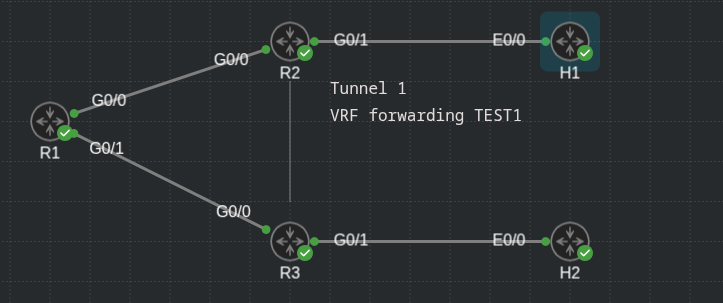
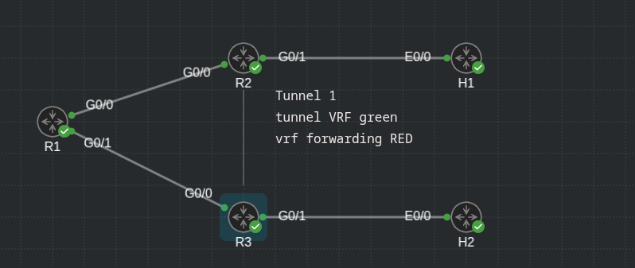

## VRF forwarding and Tunnel VRF 

### VRF forwarding



- VRF config: R2 and R3

```
R2#sh run | s vrf def 
vrf definition TEST1
 !
 address-family ipv4
 exit-address-family
```

```
R3#show run | s vrf def
vrf definition TEST1
 !
 address-family ipv4
 exit-address-family
```

- Tunnel1 interface config: R2 and R3

```
R2#sh run int tunn 1
Building configuration...

Current configuration : 150 bytes
!
interface Tunnel1
 vrf forwarding TEST1
 ip address 10.111.111.2 255.255.255.0
 tunnel source GigabitEthernet0/0
 tunnel destination 10.1.13.2
end

```

```
R3#sh run int tunn 1
Building configuration...

Current configuration : 150 bytes
!
interface Tunnel1
 vrf forwarding TEST1
 ip address 10.111.111.3 255.255.255.0
 tunnel source GigabitEthernet0/0
 tunnel destination 10.1.12.2
end

```

- R2 and R3 routing table (global)

```
R2#show ip route 
Codes: L - local, C - connected, S - static, R - RIP, M - mobile, B - BGP
       D - EIGRP, EX - EIGRP external, O - OSPF, IA - OSPF inter area 
       N1 - OSPF NSSA external type 1, N2 - OSPF NSSA external type 2
       E1 - OSPF external type 1, E2 - OSPF external type 2
       i - IS-IS, su - IS-IS summary, L1 - IS-IS level-1, L2 - IS-IS level-2
       ia - IS-IS inter area, * - candidate default, U - per-user static route
       o - ODR, P - periodic downloaded static route, H - NHRP, l - LISP
       a - application route
       + - replicated route, % - next hop override, p - overrides from PfR

Gateway of last resort is not set

      10.0.0.0/8 is variably subnetted, 3 subnets, 2 masks
C        10.1.12.0/30 is directly connected, GigabitEthernet0/0
L        10.1.12.2/32 is directly connected, GigabitEthernet0/0
S        10.1.13.0/30 [1/0] via 10.1.12.1
```

```
R3#show  ip route 
Codes: L - local, C - connected, S - static, R - RIP, M - mobile, B - BGP
       D - EIGRP, EX - EIGRP external, O - OSPF, IA - OSPF inter area 
       N1 - OSPF NSSA external type 1, N2 - OSPF NSSA external type 2
       E1 - OSPF external type 1, E2 - OSPF external type 2
       i - IS-IS, su - IS-IS summary, L1 - IS-IS level-1, L2 - IS-IS level-2
       ia - IS-IS inter area, * - candidate default, U - per-user static route
       o - ODR, P - periodic downloaded static route, H - NHRP, l - LISP
       a - application route
       + - replicated route, % - next hop override, p - overrides from PfR

Gateway of last resort is not set

      10.0.0.0/8 is variably subnetted, 3 subnets, 2 masks
S        10.1.12.0/30 [1/0] via 10.1.13.1
C        10.1.13.0/30 is directly connected, GigabitEthernet0/0
L        10.1.13.2/32 is directly connected, GigabitEthernet0/0
```

- The routes that are on the **underlying tunnel** source/destination are in the **global routing table**

- The tunnel itself and G0/1 interfaces are forwarding on the VRF, the static routes are added on the the vrf instance (for networks between R2 -> H1/R3 -> H2)

```
R2#show vrf
  Name                             Default RD            Protocols   Interfaces
  TEST1                            <not set>             ipv4        Tu1
                                                                     Gi0/1
R2#sh
R2#show ip route vrf TEST1

Routing Table: TEST1
Codes: L - local, C - connected, S - static, R - RIP, M - mobile, B - BGP
       D - EIGRP, EX - EIGRP external, O - OSPF, IA - OSPF inter area 
       N1 - OSPF NSSA external type 1, N2 - OSPF NSSA external type 2
       E1 - OSPF external type 1, E2 - OSPF external type 2
       i - IS-IS, su - IS-IS summary, L1 - IS-IS level-1, L2 - IS-IS level-2
       ia - IS-IS inter area, * - candidate default, U - per-user static route
       o - ODR, P - periodic downloaded static route, H - NHRP, l - LISP
       a - application route
       + - replicated route, % - next hop override, p - overrides from PfR

Gateway of last resort is not set

      10.0.0.0/8 is variably subnetted, 5 subnets, 2 masks
C        10.2.12.0/24 is directly connected, GigabitEthernet0/1
L        10.2.12.1/32 is directly connected, GigabitEthernet0/1
S        10.2.13.0/24 [1/0] via 10.111.111.3
C        10.111.111.0/24 is directly connected, Tunnel1
L        10.111.111.2/32 is directly connected, Tunnel1
```

```
R3#sh vrf
  Name                             Default RD            Protocols   Interfaces
  TEST1                            <not set>             ipv4        Tu1
                                                                     Gi0/1
R3#sh
R3#show ip route vrf TEST1

Routing Table: TEST1
Codes: L - local, C - connected, S - static, R - RIP, M - mobile, B - BGP
       D - EIGRP, EX - EIGRP external, O - OSPF, IA - OSPF inter area 
       N1 - OSPF NSSA external type 1, N2 - OSPF NSSA external type 2
       E1 - OSPF external type 1, E2 - OSPF external type 2
       i - IS-IS, su - IS-IS summary, L1 - IS-IS level-1, L2 - IS-IS level-2
       ia - IS-IS inter area, * - candidate default, U - per-user static route
       o - ODR, P - periodic downloaded static route, H - NHRP, l - LISP
       a - application route
       + - replicated route, % - next hop override, p - overrides from PfR

Gateway of last resort is not set

      10.0.0.0/8 is variably subnetted, 5 subnets, 2 masks
S        10.2.12.0/24 [1/0] via 10.111.111.2
C        10.2.13.0/24 is directly connected, GigabitEthernet0/1
L        10.2.13.1/32 is directly connected, GigabitEthernet0/1
C        10.111.111.0/24 is directly connected, Tunnel1
L        10.111.111.3/32 is directly connected, Tunnel1
```

- R2 and R3 routes:

```
R2#sh run | i ip route
ip route 10.1.13.0 255.255.255.252 10.1.12.1
ip route vrf TEST1 10.2.13.0 255.255.255.0 10.111.111.3
```

```
R3#sh run | i ip route
ip route 10.1.12.0 255.255.255.252 10.1.13.1
ip route vrf TEST1 10.2.12.0 255.255.255.0 10.111.111.2
```

- Routing table of R1:

```
R1#show vrf

R1#show ip route 
Codes: L - local, C - connected, S - static, R - RIP, M - mobile, B - BGP
       D - EIGRP, EX - EIGRP external, O - OSPF, IA - OSPF inter area 
       N1 - OSPF NSSA external type 1, N2 - OSPF NSSA external type 2
       E1 - OSPF external type 1, E2 - OSPF external type 2
       i - IS-IS, su - IS-IS summary, L1 - IS-IS level-1, L2 - IS-IS level-2
       ia - IS-IS inter area, * - candidate default, U - per-user static route
       o - ODR, P - periodic downloaded static route, H - NHRP, l - LISP
       a - application route
       + - replicated route, % - next hop override, p - overrides from PfR

Gateway of last resort is not set

      10.0.0.0/8 is variably subnetted, 4 subnets, 2 masks
C        10.1.12.0/30 is directly connected, GigabitEthernet0/0
L        10.1.12.1/32 is directly connected, GigabitEthernet0/0
C        10.1.13.0/30 is directly connected, GigabitEthernet0/1
L        10.1.13.1/32 is directly connected, GigabitEthernet0/1
```

### Tunnel VRF

- Using `tunnel vrf` on the interface, we tell the tunnel to search for the **underlay routes** in the vrf specified

- Using the `vrf forwarding` command on the interface, we tell to the tunnel to put it's routes (**overlay**) in the specified tunnel




- VRF config on R2 and R3:

```
R2(config)#do sh run | s vrf def
vrf definition GREEN
 !
 address-family ipv4
 exit-address-family
vrf definition RED
 !
 address-family ipv4
 exit-address-family
```

```
R3(config)#do sh run | s vrf def
vrf definition GREEN
 !
 address-family ipv4
 exit-address-family
vrf definition RED
 !
 address-family ipv4
 exit-address-family
```

- R2:

```
R2#sh ip route 
Codes: L - local, C - connected, S - static, R - RIP, M - mobile, B - BGP
       D - EIGRP, EX - EIGRP external, O - OSPF, IA - OSPF inter area 
       N1 - OSPF NSSA external type 1, N2 - OSPF NSSA external type 2
       E1 - OSPF external type 1, E2 - OSPF external type 2
       i - IS-IS, su - IS-IS summary, L1 - IS-IS level-1, L2 - IS-IS level-2
       ia - IS-IS inter area, * - candidate default, U - per-user static route
       o - ODR, P - periodic downloaded static route, H - NHRP, l - LISP
       a - application route
       + - replicated route, % - next hop override, p - overrides from PfR

Gateway of last resort is not set

R2#sh
R2#show ip ro vrf GREEN

Routing Table: GREEN
Codes: L - local, C - connected, S - static, R - RIP, M - mobile, B - BGP
       D - EIGRP, EX - EIGRP external, O - OSPF, IA - OSPF inter area 
       N1 - OSPF NSSA external type 1, N2 - OSPF NSSA external type 2
       E1 - OSPF external type 1, E2 - OSPF external type 2
       i - IS-IS, su - IS-IS summary, L1 - IS-IS level-1, L2 - IS-IS level-2
       ia - IS-IS inter area, * - candidate default, U - per-user static route
       o - ODR, P - periodic downloaded static route, H - NHRP, l - LISP
       a - application route
       + - replicated route, % - next hop override, p - overrides from PfR

Gateway of last resort is not set

      10.0.0.0/8 is variably subnetted, 3 subnets, 2 masks
C        10.1.12.0/30 is directly connected, GigabitEthernet0/0
L        10.1.12.2/32 is directly connected, GigabitEthernet0/0
S        10.1.13.0/30 [1/0] via 10.1.12.1
R2#sh vrf
  Name                             Default RD            Protocols   Interfaces
  GREEN                            <not set>             ipv4        Gi0/0
  RED                              <not set>             ipv4        Tu1
                                                                     Gi0/1
R2#sh
R2#show ip route vrf RED

Routing Table: RED
Codes: L - local, C - connected, S - static, R - RIP, M - mobile, B - BGP
       D - EIGRP, EX - EIGRP external, O - OSPF, IA - OSPF inter area 
       N1 - OSPF NSSA external type 1, N2 - OSPF NSSA external type 2
       E1 - OSPF external type 1, E2 - OSPF external type 2
       i - IS-IS, su - IS-IS summary, L1 - IS-IS level-1, L2 - IS-IS level-2
       ia - IS-IS inter area, * - candidate default, U - per-user static route
       o - ODR, P - periodic downloaded static route, H - NHRP, l - LISP
       a - application route
       + - replicated route, % - next hop override, p - overrides from PfR

Gateway of last resort is not set

      10.0.0.0/8 is variably subnetted, 5 subnets, 2 masks
C        10.2.12.0/24 is directly connected, GigabitEthernet0/1
L        10.2.12.1/32 is directly connected, GigabitEthernet0/1
S        10.2.13.0/24 [1/0] via 10.111.111.3
C        10.111.111.0/24 is directly connected, Tunnel1
L        10.111.111.2/32 is directly connected, Tunnel1
```

```
R2#sh run int tunn 1
Building configuration...

Current configuration : 166 bytes
!
interface Tunnel1
 vrf forwarding RED
 ip address 10.111.111.2 255.255.255.0
 tunnel source GigabitEthernet0/0
 tunnel destination 10.1.13.2
 tunnel vrf GREEN
end

```

```
R2#sh run | i ip route
ip route vrf GREEN 10.1.13.0 255.255.255.252 10.1.12.1
ip route vrf RED 10.2.13.0 255.255.255.0 10.111.111.3
```

- R3:

```
R3#sh ip route 
Codes: L - local, C - connected, S - static, R - RIP, M - mobile, B - BGP
       D - EIGRP, EX - EIGRP external, O - OSPF, IA - OSPF inter area 
       N1 - OSPF NSSA external type 1, N2 - OSPF NSSA external type 2
       E1 - OSPF external type 1, E2 - OSPF external type 2
       i - IS-IS, su - IS-IS summary, L1 - IS-IS level-1, L2 - IS-IS level-2
       ia - IS-IS inter area, * - candidate default, U - per-user static route
       o - ODR, P - periodic downloaded static route, H - NHRP, l - LISP
       a - application route
       + - replicated route, % - next hop override, p - overrides from PfR

Gateway of last resort is not set

R3#sh ip route vrf GREEN

Routing Table: GREEN
Codes: L - local, C - connected, S - static, R - RIP, M - mobile, B - BGP
       D - EIGRP, EX - EIGRP external, O - OSPF, IA - OSPF inter area 
       N1 - OSPF NSSA external type 1, N2 - OSPF NSSA external type 2
       E1 - OSPF external type 1, E2 - OSPF external type 2
       i - IS-IS, su - IS-IS summary, L1 - IS-IS level-1, L2 - IS-IS level-2
       ia - IS-IS inter area, * - candidate default, U - per-user static route
       o - ODR, P - periodic downloaded static route, H - NHRP, l - LISP
       a - application route
       + - replicated route, % - next hop override, p - overrides from PfR

Gateway of last resort is not set

      10.0.0.0/8 is variably subnetted, 3 subnets, 2 masks
S        10.1.12.0/30 [1/0] via 10.1.13.1
C        10.1.13.0/30 is directly connected, GigabitEthernet0/0
L        10.1.13.2/32 is directly connected, GigabitEthernet0/0
R3#sh vrf
  Name                             Default RD            Protocols   Interfaces
  GREEN                            <not set>             ipv4        Gi0/0
  RED                              <not set>             ipv4        Tu1
                                                                     Gi0/1
R3#sh ip route vrf RED

Routing Table: RED
Codes: L - local, C - connected, S - static, R - RIP, M - mobile, B - BGP
       D - EIGRP, EX - EIGRP external, O - OSPF, IA - OSPF inter area 
       N1 - OSPF NSSA external type 1, N2 - OSPF NSSA external type 2
       E1 - OSPF external type 1, E2 - OSPF external type 2
       i - IS-IS, su - IS-IS summary, L1 - IS-IS level-1, L2 - IS-IS level-2
       ia - IS-IS inter area, * - candidate default, U - per-user static route
       o - ODR, P - periodic downloaded static route, H - NHRP, l - LISP
       a - application route
       + - replicated route, % - next hop override, p - overrides from PfR

Gateway of last resort is not set

      10.0.0.0/8 is variably subnetted, 5 subnets, 2 masks
S        10.2.12.0/24 [1/0] via 10.111.111.2
C        10.2.13.0/24 is directly connected, GigabitEthernet0/1
L        10.2.13.1/32 is directly connected, GigabitEthernet0/1
C        10.111.111.0/24 is directly connected, Tunnel1
L        10.111.111.3/32 is directly connected, Tunnel1
```

```
R3#sh run int tunn 1
Building configuration...

Current configuration : 166 bytes
!
interface Tunnel1
 vrf forwarding RED
 ip address 10.111.111.3 255.255.255.0
 tunnel source GigabitEthernet0/0
 tunnel destination 10.1.12.2
 tunnel vrf GREEN
end

```

```
R3#sh run | i ip route
ip route vrf GREEN 10.1.12.0 255.255.255.252 10.1.13.1
ip route vrf RED 10.2.12.0 255.255.255.0 10.111.111.2
```
