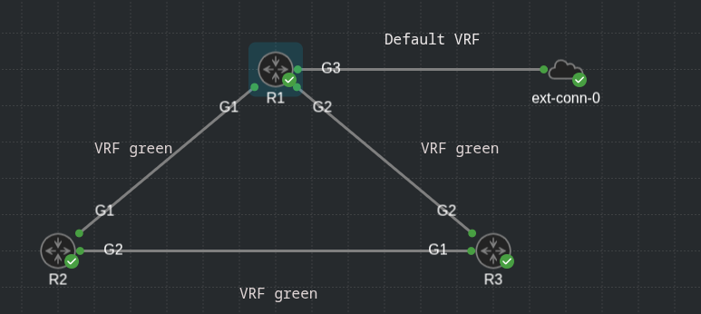

## Set a default route in a vrf to an interface that is in default routing table

- Lab topology:



- R1:

```
R1#sh vrf
  Name                             Default RD            Protocols   Interfaces
  GREEN                            <not set>             ipv4        Gi1
                                                                     Gi2
```

```
R1#sh run int g1
Building configuration...

Current configuration : 157 bytes
!
interface GigabitEthernet1
 vrf forwarding GREEN
 ip address 10.1.12.1 255.255.255.252
 ip nat inside
 negotiation auto
 no mop enabled
 no mop sysid
end

```

```
R1#sh run int g2
Building configuration...

Current configuration : 157 bytes
!
interface GigabitEthernet2
 vrf forwarding GREEN
 ip address 10.1.13.1 255.255.255.252
 ip nat inside
 negotiation auto
 no mop enabled
 no mop sysid
end

```

```
R1#sh run int g3
Building configuration...

Current configuration : 144 bytes
!
interface GigabitEthernet3
 ip address dhcp
 ip nat outside
 ip policy route-map SET-VRF
 negotiation auto
 no mop enabled
 no mop sysid
end

```

- G3 is in the default VRF

- Inject a default route into the vrf GREEN table to point to the default vrf:

```
R1#sh run | i ip route
ip route vrf GREEN 0.0.0.0 0.0.0.0 172.16.29.1 global
ip route vrf GREEN 10.1.23.0 255.255.255.252 10.1.12.2
ip route vrf GREEN 10.1.23.0 255.255.255.252 10.1.13.2
```

- For return traffic, it needs to be put back in the VRF, as in the default routing table there is no route for that subnets, as seen below:

```
R1#sh ip ro | b Gate
Gateway of last resort is 172.16.29.1 to network 0.0.0.0

S*    0.0.0.0/0 [254/0] via 172.16.29.1
      172.16.0.0/16 is variably subnetted, 2 subnets, 2 masks
C        172.16.29.0/24 is directly connected, GigabitEthernet3
L        172.16.29.16/32 is directly connected, GigabitEthernet3
```

```
R1#sh ip ro vrf GREEN | b Gate
Gateway of last resort is 172.16.29.1 to network 0.0.0.0

S*    0.0.0.0/0 [1/0] via 172.16.29.1
      10.0.0.0/8 is variably subnetted, 5 subnets, 2 masks
C        10.1.12.0/30 is directly connected, GigabitEthernet1
L        10.1.12.1/32 is directly connected, GigabitEthernet1
C        10.1.13.0/30 is directly connected, GigabitEthernet2
L        10.1.13.1/32 is directly connected, GigabitEthernet2
S        10.1.23.0/30 [1/0] via 10.1.13.2
                      [1/0] via 10.1.12.2
```

- To do that, set a route map to match an access list for desired networks, and set the correct vrf

```
R1#sh run | s access-list
ip access-list extended ICMP-IN-VRF
 10 permit icmp any 10.1.12.0 0.0.0.3
 20 permit icmp any 10.1.13.0 0.0.0.3
 30 permit icmp any 10.1.23.0 0.0.0.3
```

```
R1#sh run | s route-map
route-map SET-VRF permit 10 
 match ip address ICMP-IN-VRF
 set vrf GREEN
```

- Apply the route-map to the interface:

```
R1#sh run int g3
Building configuration...

Current configuration : 144 bytes
!
interface GigabitEthernet3
 ip address dhcp
 ip nat outside
 ip policy route-map SET-VRF
 negotiation auto
 no mop enabled
 no mop sysid
end

```
