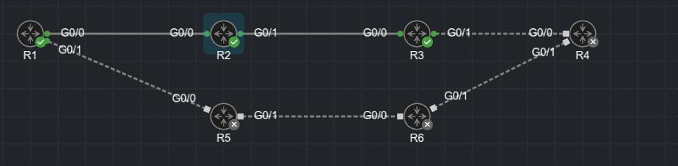

## Advanced BGP

1. BGP Multihoming

2. Conditional Matching

3. Route Maps

4. BGP Route Filtering and Manipulation

5. BGP Communities

6. Understanding BGP path selection

- Border Gateway Protocol (BGP) can support hundreds of thousands of routes, making it the ideal choice for the Internet

- Organizations also use BGP for it's flexibility and traffic engineering properties

- BGP advanced features and concepts involved with the BGP routing protocol. such as BGP multihoming, route filtering, BGP communities, and the logic for identifying the best path for a specific network prefix

- The Internet has become a vital component for businesses today. Internet connectivity is required for email and research at a minimum

- In addition, some organizations host e-commerce servers, use Voice over IP (VoIP) telephony, or terminate VPN tunnels through private MPLS connections

- An organization must incorporate redundancies in network architecture to ensure that they are not any single points of failure (SPOF) with network connectivity to support the needs of the businesses

- A company can connect to the Internet with a single default route using a single connection

- However if a company wants to use multiple service providers (SPs) for redundancy or additional throughput, BGP is required

- BGP is the routing protocol used on the internet


### Conditional Matching

- Standard ACLs

- Process for defining standard ACLs:

    - Step 1: Define the ACL:

    ```
    ip acccess-list standard <number | name>
    ```

    - Place the CLI in ACL configuration mode

    - Step 2:

    - Place the ACE entry with the following command:

    ```
    [sequence] [permit | deny] <source> <source-wildcard>
    ```

- Extended ACLs

- Process for defining extended ACLs:

    - Step 1: Define the ACL:

    ```
    ip access-list extended <number | name>
    ```

    - Step 2:

    - Place the ACE entries:

    ```
    [sequence] [permit | deny] <protocol> <source> <source-wildcard> <destination> <destination-wildcard>
    ```

- The source and source wildcard match for network prefix

- The destination and destination wildcard match for subnet masks

- For IGPs, they only match a range of networks to be advertised

- For BGP they match exactly the IP address prefix and what subnet mask or subnet masks should be allowed

### Standard ACLs syntax:

```
permit any - Permits all networks
permit 172.16.0.0 0.0.255.255 - Permits all networks in the 172.16.0.0 range
permit host 192.168.1.1 - Permits only the 192.168.1.1/32 network
```

### Extended ACLs match:

```
permit ip any any - Permits all networks
permit ip host 172.16.0.0 host 255.240.0.0 - Permits all networks in the 172.16.0.0/12 range
permit ip host 172.16.0.0 host 255.255.0.0 - Permits all networks in the 172.16.0.0/16 range
permit host 192.168.1.1 - Permits only the 192.168.1.1/32 network
```

```
permit ip 10.0.0.0 0.0.0.0 255.255.0.0 0.0.0.0 - Permits only the 10.0.0.0/16 network
permit ip 10.0.0.0 0.0.255.0 255.255.255.0 0.0.0.0 - Permits any 10.0.x.0 network with a /24 prefix length
permit ip 172.16.0.0 0.0.255.255 255.255.255.0 0.0.0.255 - Permits any 172.16.x.x network with a /24 to /32 prefix length
permit ip 172.16.0.0 0.0.255.255 255.255.255.128 0.0.0.127 - Permits any 172.16.x.x network with a /25 to /32 prefix length
```

### Prefix Matching

- Configuring prefix lists:

```
ip prefix-list [name] [seq <seq number>] [permit | deny] [high-order bit pattern/high-order bit count] [ge <ge-value>] [le <le-value>]
```

- Example for blocking /32 networks to a BGP neighbor:

```
R2(config)#do sh ip prefix-list
ip prefix-list BLOCK-32: 3 entries
   seq 5 deny 192.168.0.0/16 ge 32
   seq 10 permit 172.16.0.0/12 ge 26 le 30
   seq 15 permit 10.0.0.0/8 ge 24
```

```
R2(config)#do sh run | s router bgp
router bgp 65002
 bgp router-id 192.168.2.2
 bgp log-neighbor-changes
 network 10.12.1.0 mask 255.255.255.0
 network 10.23.1.0 mask 255.255.255.0
 network 172.16.66.64 mask 255.255.255.240
 network 192.168.2.2 mask 255.255.255.255
 network 192.168.22.22 mask 255.255.255.255
 neighbor 10.12.1.1 remote-as 65001
 neighbor 10.23.1.3 remote-as 65003
 neighbor 10.23.1.3 prefix-list BLOCK-32 out
```

- Topology:



- Verifying the topology on R3:

```
R3(config)#do sh bgp ipv4 uni | b Net 
     Network          Next Hop            Metric LocPrf Weight Path
 *>   10.12.1.0/24     10.23.1.2                0             0 65002 i
 *>   10.15.1.0/24     10.23.1.2                              0 65002 65001 i
 *    10.23.1.0/24     10.23.1.2                0             0 65002 i
 *>                    0.0.0.0                  0         32768 i
 *>   10.34.1.0/24     0.0.0.0                  0         32768 i
 *>   172.16.66.64/28  10.23.1.2                0             0 65002 i
```

- No prefixes in the 192.168.x.x with /32 length are advertised to this router

- Applying the same filter using an extended access-list:

```
R2(config)#do sh access-lists
Extended IP access list TEST-acl
    10 deny ip 192.168.0.0 0.0.255.255 host 255.255.255.255 (4 matches)
    20 permit ip 172.0.0.0 0.240.255.255 255.255.255.0 0.0.0.255 (2 matches)
    30 permit ip 10.0.0.0 0.255.255.255 255.255.255.0 0.0.0.255 (6 matches)
```

- Distribute list applied to a neighbor:

```
R2(config)#do sh run | s router bgp
router bgp 65002
 bgp router-id 192.168.2.2
 bgp log-neighbor-changes
 network 10.12.1.0 mask 255.255.255.0
 network 10.23.1.0 mask 255.255.255.0
 network 172.16.66.64 mask 255.255.255.240
 network 192.168.2.2 mask 255.255.255.255
 network 192.168.22.22 mask 255.255.255.255
 neighbor 10.12.1.1 remote-as 65001
 neighbor 10.23.1.3 remote-as 65003
 neighbor 10.23.1.3 distribute-list TEST-acl out
```

