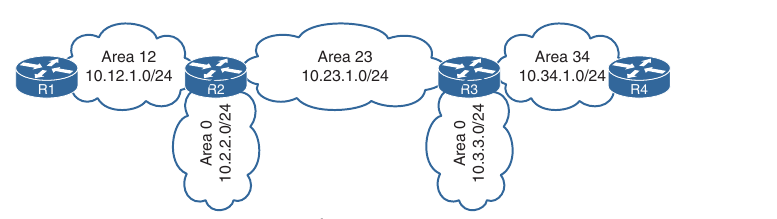

## Advanced OSPF

1. Areas

2. Link-state Announcements (Advertisements)

3. Discontiguous Networks

4. OSPF Path Selection

5. Summarization of Routes

6. Route Filtering

- The Open Shortest Path First (OSPF) protocol scales well with proper network planning

- IP addressing schemes, area segmentation, address summarization and hardware capabilities for each area should all be taken into consideration for a network design

- OSPF in large networks and multi-area OSPF domain, path selection and techniques to optimize the OSPF environment

### Areas

- An OSPF area is a logical grouping of routers or, more specifically, a logical grouping of router interfaces

- Area membership is set at the interface level, and the area ID is included in the OSPF hello packet

- An interface can belong to only one area. All routers within the same OSPF area maintain an identical copy of the link-state database (LSDB)

- An OSPF area grows in size as network links and the number of links increase in the area

- While using a single area simplifies the topology, there are trade-offs:

	- Full shortest path first (SPF) tree calculation runs when a link flaps within the area

	- The LSDB increases the size and becomes unmanageable

	- The LSDB for the area grows, consuming more memory, and taking longer during the SPF computation process

	- No summarization of route information occurs

- Proper design addresses each of these issues by segmenting the routers into multiple OSPF areas, thereby keeping the LSDB to a manageable size

- Sizing and design of OSPF networks should account for the hardware constraints of the smallest router in that area

- If a router has interfaces in multiple areas, the router has multiple LSDBs (one for each area)

- The internal topology of one area is invisible from outside that area

- If a topology change occurs (such as a link flap or an additional network being added) within an area, all routers in the same OSPF area calculate the SPF tree again

- Routers outside that area do not calculate the full SPF tree again but perform a partial SPF calculation if the metric have changed or a prefix is removed

- In essence an OSPF area hides the topology from another area but enables the networks to be visible in other areas within the OSPF domain

- Segmenting the OSPF domain into multiple areas reduces the size of the LSDB for each area, making SPF tree calculations faster, and decreasing LSDB flooding between routers when a link flaps

- Just because a router connects to multiple OSPF areas does not mean the routes from one area will be injected into another area


- In the above topology R1 is connected to Area 1 and Area 2. Routes from Area 1 will not advertise into Area 2 and viceversa

- Area 0 is a special area called *the backbone*

- By design, all areas must connect to Area 0 because OSPF expects all areas to inject routing information into the backbone, and Area 0 advertises the routes into other areas

- The backbone design is crucial to preventing routing loops

- *Area Border Routers (ABRs)* are OSPF routers connected to Area 0 and another OSPF area, per Cisco definition and according to RFC 3509

- Every ABR needs to participate in Area 0; otherwise, routes will not advertise into another area

- ABRs compute an SPF tree for every area that they participate in


- In the above topology R1 is connected to Area 0, Area 1 and Area 2

- R1 is a proper ABR because it now participates in Area 0

- The following occurs on R1:

	- Routes from Area 1 advertise into Area 0

	- Routes from Area 2 advertise into Area 0

	- Routes from Area 0 advertise into Area 1 and 2. This includes the local Area 0 routes, in addition to routes that were advertised into Area 0 from Area 1 and Area 2


- In the above large scale topology:

	- R1, R2, R3 and R4 belong to Area 1234

	- R4 and R5 belong to Area 0

	- R5 and R6 belong to Area 56

	- R4 and R5 are ABRs

	- Area 1234 connects to Area 0, and Area 56 connects to Area 0

	- Routers in Area 1234 can see routes from routers in Area 0, Area 56 and vice versa

- OSPF configuration for ABRs R4 and R5

- Notice that multiple interfaces in the configuration have Area 0 as one of the areas:

- R4:

```
conf t
 router ospf 1
  router-id 192.168.4.4
  network 10.24.1.0 0.0.0.255 area 1234
  network 10.45.1.0 0.0.0.255 area 0
```

- R5:

```
conf t
 router ospf 1
  router-id 192.168.5.5
  network 10.45.1.0 0.0.0.255 area 0
  network 10.56.1.0 0.0.0.255 area 56
```

- Verifying that interfaces on R4 belong to Area 1234 and Area 0, and that interfaces on R5 belong to Area 0 and Area 56

- R4:

```
show ip ospf interface brief

Interface		PID		Area		IP Address/Mask		Cost	State		Nbrs f/c
Gi0/0			1		0			10.45.1.4/24		1		DR			1/1
Se1/0			1		1234		10.24.1.4/29		64		P2P			1/1
```

- R5

```
show ip ospf interface brief

Interface		PID		Area		IP Address/Mask		Cost	State		Nbrs f/c
Gi0/0			1		0			10.45.1.5/24		1		DR			1/1
Gi0/1			1		1234		10.56.1.5/29		1		BDR			1/1
```

#### Area ID

- The Area ID is a 32-bit field and can be formatted in simple decimal (0 through 4,294,976,295) or dotted decimal (0.0.0.0 through 255.255.255.255)

- During router configuration, the area can use decimal format on one router and and dotted-decimal format on a different router, and the routers can still form an adjacency

- OSPF advertises the area ID in dotted-decimal format in the OSPF hello packet

#### OSPF Route Types

- Network routes that are learned from other OSPF routers within the same area are known as *intra-area routes*

- In our topology, the network link between R2 and R4 (10.24.1.0/29) is an intra-area route for R1

- The IP routing table displays OSPF intra-area routes with an O

- Network routes that are learned from other OSPF routers from different area using an ABR are known as *interarea routes*

- On our topology, the network link between R4 and R5 (10.45.1.0/24) is an interarea route to R1

- The IP routing table displays OSPF interarea routes with *O IA*

- Routing table for R1 from our topology. Notice that R1's OSPF routing table shows routes from within Area 1234 as intra-area routes (O routes) and routes from Area 0 and Area 56 as interarea (O IA routes)

- R1:

```
show ip route

(...)
O		10.3.3.0/24 [110/20] via 10.123.1.3, 00:12:07, GigabitEthernet0/0
O		10.24.1.0/29 [110/74] via 10.123.1.2, 00:12:07, GigabitEthernet0/0
(...)
O IA	10.45.1.0/24 [110/84] via 10.123.1.2, 00:12:07, GigabitEthernet0/0
O IA	10.56.1.0/24 [110/94] via 10.123.1.2, 00:12:07, GigabitEthernet0/0
```

- Routing table of R4 from our topology. Notice that R4's routing table shows the routes from within Area 1234 and Area 0 as intra-area routes and routes from Area 56 as interarea because R4 does not connect to Area 56

- Notice that the metric for the 10.123.1.0/24 and 10.3.3.0/24 networks has drastically increased compared to the metric for the 10.56.1.0/24 network. This is because it must cross the slow serial link, which has an interface cost of 64

- R4:

```
show ip route

(...)
O		10.3.3.0/24 [110/66] via 10.24.1.2, 00:03:45, Serial1/0
(...)
O IA	10.56.1.0/24 [110/2] via 10.45.1.5, 00:04:56, GigabitEthernet0/0
O		10.123.1.0/24 [110/65] via 10.24.1.2, 00:13:19, Serial 1/0 	

(...)
```

- Routing tables for R5 and R6. R5 and R6 only contain interarea routes because intra-area routes are directly connected

- R5:

```
show ip route ospf

O IA     10.3.3.0/24 [110/67] via 10.45.1.4, 01:08:01, GigabitEthernet0/0
O IA     10.24.1.0/29 [110/65] via 10.45.1.4, 01:11:55, GigabitEthernet0/0
O IA     10.123.1.0/24 [110/66] via 10.45.1.4, 01:08:06, GigabitEthernet0/0
```

- R6:

```
show ip route ospf

O IA     10.3.3.0/24 [110/68] via 10.56.1.5, 01:09:54, Ethernet0/0
O IA     10.24.1.0/29 [110/66] via 10.56.1.5, 01:13:48, Ethernet0/0
O IA     10.45.1.0/24 [110/2] via 10.56.1.5, 01:13:57, Ethernet0/0
O IA     10.123.1.0/24 [110/67] via 10.56.1.5, 01:09:59, Ethernet0/0
```

- External routes are routes learned from outside of the OSPF domain but injected into an OSPF domain through redistribution

- External OSPF routes can come from a different OSPF domain or from a different routing protocol

### Link-State Announcements (Advertisements)

- When OSPF neighbors become adjacent, the LSDBs synchronize between the OSPF routers

- As an OSPF router adds or removes a directly connected network link to or from it's database, the router floods the link state advertisement (LSA) out all active OSPF interfaces

- OSPF LSA contains a complete list of networks advertised from that router

- OSPF uses six LSA types for IPv4 routing:

	- **Type 1, router LSA**: Advertises the LSAs that originate within an area

	- **Type 2, network LSA**: Advertises a multi-access network segment attached to a DR

	- **Type 3, summary LSA**: Advertises network prefixes that originated from a different area

	- **Type 4, ASBR summary LSA**: Advertises a summary LSA for a specific ASBR (this contains the IP address of the ASBR)

	- **Type 5, AS external LSA**: Advertises LSAs for routes that have been redistributed and is generated by an ASBR

	- **Type 7, NSSA external LSA**: Advertises redistributed routes in NSSA areas

- LSA types 1, 2 and 3 are used for building the SPF tree from interarea and intra-area routes


- The above packet capture shows an OSPF update LSA and outlines the important components of the LSA: the LSA type, LSA age, sequence number, and advertising router

- Because this is a type 1 LSA, the link IDs add relevance as they list the attached network and the associated OSPF cost for each interface

#### LSA Sequences

- OSPF uses the sequence number to overcome problems caused by delays in LSA propagation in a network

- The LSA sequence number is a 32-bit number for controlling versioning

- When the originating router sends out LSAs, the LSA sequence number is incremented 

- If a router receives an LSA sequence that is greater than the one in the LSDB, it processes the LSA

- If the LSA sequence number is lower than the one in the LSDB, the router deems the LSA old and discards the LSA

#### LSA Age and Flooding

- Every OSPF LSA includes an age that is entered into the local LSDB and that will increment by 1 every second

- When a router's OSPF LSA age exceeds 1800 seconds (30 minutes) for it's networks, the originating router advertises a new LSA with the LSA age set to 0

- As each router forwards the LSA, the LSA age is incremented with a calculated (minimal) delay that reflects the link

- If the LSA age reaches 3600, the LSA is deemed invalid and is purged from the LSDB

- The repetitive flooding of LSAs is a secondary safety mechanism to ensure all routers maintain a consistent LSDB within an area

#### LSA Types

- All routers within an OSPF area have an identical set of LSAs for that area

- The ABRs maintains a separate set of LSAs for each OSPF area

- Most LSAs in one area will be different from the LSAs in another area

- Displaying the generic router LSA output:

```
show ip ospf database
```

##### LSA Type 1: Router Link

- Every OSPF router advertises a type 1 LSA

- Type 1 LSAs are the essential building blocks within the LSDB

- A type 1 LSA entry exists for each OSPF-enabled link (that is every interface and it's attached networks)

- Refering to our topology we can see that the type 1 LSAs are not advertised outside Area 1234, which means the underlying topology in an area is invisible to other areas

- Displaying the type 1 LSAs for an area:

```
show ip ospf database router
```


- The initial fields of each type 1 LSA indicate the RID for the LSA's advertising router, age, sequence, link count and link ID

- Each OSPF-enabled interface is listed under the number of links for each router

- Each network link on a router contains the link type, correlating information for neighbor router identification, and interface metric

- The correlating information for neighbor router identification is often the neighbor RID, with the exception of multi-access network segments that contain designated routers (DRs)

- In those scenarios, the interface address of the DR identifies the neighbor router

- If we correlate just type 1 LSAs from our sample topology, then the topology build by all routers in Area 1234 using the LSA attributes for Area 1234 from all four routers will be the following:


##### LSA Type 2: Network Link

- The type 2 LSA represents a multi-access network segment that used a DR

- The DR always advertises the type 2 LSA and identifies all the routers attached to that network segment

- If a DR has not been elected, a type 2 LSA is not present in the LSDB because the corresponding type 1 transit link type 1 LSA is a stub

- Like type 1 LSAs, Type 2 LSAs are not flooded outside the originating OSPF area

- Area 1234 has only one DR segment that connects to R1, R2 and R3 because R3 has not formed an OSPF adjacency on the 10.3.3.0/24 segment

- On the 10.123.1.0/24 network segment, R3 is elected as the DR, and R2 is elected as the BDR because of the order of the RIDs

- Showing detailed type 2 LSA information:

```
show ip ospf database network
```

- Now that we have the type 2 LSA for Area 1234, all the network links are connected

- Visualization of the type 1 and type 2 LSAs, which corresponds with Area 1234:


- When the DR changes for a network segment, a new type 2 LSA is created, causing SPF to run again within the OSPF area

##### LSA Type 3: Summary Link

- Type 3 LSAs represent networks from other areas

- The role of the ABRs is to participate in multiple OSPF areas and ensure the networks associated with type 1 LSAs are reachable in the non-originating OSPF areas

- ABRs do not forward type 1 and type 2 LSAs into other areas

- When an ABR receive a type 1 LSA, it creates a type 3 LSA referencing the network in the original type 1 LSA; the type 2 LSA is used to determine the network mask of the multi-access network

- The ABR then advertises the type 3 LSA into other areas

- If an ABR receives a type 3 LSA from Area 0 (the backbone), it regenerates a new type 3 LSA for the nonbackbone area and lists itself as the advertising router, with the additional cost metric

- Type 3 LSA interaction with type 1 LSAs is shown below


- The type 3 LSAs show up under the appropriate areas where they exists in the OSPF domain

- For example, the 10.56.1.0 Type 3 LSA is in Area 0 and Area 1234 on R4; however, on R5 the type 3 LSA exists only on Area 0 because the 10.56.1.0 network is a type 1 LSA in Area 56

- Showing the type 3 LSA information:

```
show ip ospf database summary
```

- The output can be restricted to a specific LSA by appending the network prefix to the end of the command

```
show ip ospf database summary 10.3.3.0
```

- View the IP summary for a prefix and for a specific advertising router

```
show ip ospf database summary 10.3.3.0 adv-router 192.168.4.4
```

- The advertising router for the type 3 LSAs is the last ABR that advertises the prefix. The metric within the type 3 LSA uses the following logic:

	- If the type 3 LSA is created from a type 1 LSA, it is the total path metric to reach the originating router in the type 1 LSA

	- If the type 3 LSA is created from a type 3 LSA from Area 0, it is the total path metric to the ABR plus the metric in the original type 3 LSA

- When R2 advertises the 10.123.1.0/24 network the following happens:

	- R4 receive R2's type 1 LSA and creates a new type 3 LSA by using the metric 65: The cost of 1 of R2's LAN interface and 64 for the serial link between R2 and R4

	- R4 advertises the type 3 LSA with the metric 65 into Area 0

	- R5 receive the type 3 LSA and creates a new type 3 LSA for Area 56, using the metric 66: The cost of 1 for the link between R4 and R5 plus the original LSA type 3 metric 65

	- R6 receives the type 3 LSA. Part of R6's calculation is the metric to reach the ABR (R5), which is 1 plus the metric in the type 3 LSA (66). R6 therefore calculates the metric 67 to reach 10.123.1.0/24

- The type 3 LSA contains the link-state ID (network number), the subnet mask, the IP address of the advertising ABR, and the metric for the network prefix

- R4 does not know if the 10.56.1.0/24 network is directly attached to the ABR (R5) or multiple hops away

- R4 knows that it's metric to the ABR (R5) is 1 and that the type 3 LSA already has a metric of 1, so it's total path metric to reach the 10.56.1.0/24 network is 2

- R4's perspective of the type 3 LSA created by ABR (R5) for the 10.56.1.0/24 network


- R3's perspective of the type 3 LSA created by ABR (R4) for the 10.56.1.0/24 network


- R3 does not know if the 10.56.1.0/24 network is directly attached to the ABR (R4) or multiple hops away

- R3 knows that it's metric to reach the ABR (R4) is 65 and that the type 3 LSA already has a metric of 2, so it's total path metric to reach the 10.56.1.0/24 network is 67

- An ABR advertises only one type 3 LSA for a prefix, even if it is aware of multiple paths from within it's area (type 1 LSAs) or from outside it's area (type 3 LSAs)

- The metric for the best path will be used when the LSA is advertised into a different area

### Discontiguous Networks

- Network engineers that do not fully understand OSPF design may create a topology such as the following:



- While R2 and R3 have OSPF interfaces in Area 0, traffic from Area 12 must cross Area 23 to reach Area 34

- An OSPF network with this design is discontiguous because interarea traffic is trying to cross a nonbackbone area


- At first glance it looks like routes in the routing table of R2 and R3 are being advertised across area 23

- The 10.34.1.0/24 network was advertised into OSPF by R3 and R4 as type 1 LSA

- R3 is an ABR and converts Area 34's 10.34.1.0/24 type 1 LSA into a type 3 LSA in Area 0

- R3 uses the type 3 LSA from Area 0 to generate the type 3 LSA for area 23

- R2 is able to install the type 3 LSA from Area 23 into it's routing table

- Most people would assume that the 10.34.1.0/24 route learned by area 23 would then be advertised into R2's Area 0 and then propagate to Area 12

- However, they would be wrong. There are three fundamental rules ABRs use for creating type 3 LSAs:

	- Type 1 LSAs received from an area, create type 3 LSAs into the backbone area and nonbackbone areas

	- Type 3 LSAs received from Area 0 are created for the nonbackbone area

	- Type 3 LSAs received from a nonbackbone area only insert into the LSDB for the source area. ABRs do not create a type 3 LSA for the other areas (including a segmented Area 0)

- The simplest fix for a discontiguous network is to ensure that Area 0 is contiguous

- There are other functions, like virtual link or usage of GRE tunnels, but they complicate the setup in these situations

- Real life scenarios of discontiguous networks involves Area 0 becoming partitioned due to hardware failures

- Ensuring that multiple paths exist to keep the backbone contiguous is an important factor in OSPF design

### OSPF Path Selection

- OSPF executes Dijikstra's shortest path first (SPF) algorithm to create a loop free topology of shortest paths

- All routers use the same logic to calculate the shortest path for each network

- Path selection prioritizes paths by using the following logic:

	1. Intra-area

	2. Interarea

	3. External routes

#### Intra-Area Routes

- Routes advertised via a type 1 LSA for an area are always preferred over type 3 LSAs

- If multiple intra-area routes exist, the path with the lowest total path metric is installed in the OSPF Routing Information Base (RIB), which is then presented to the router's global RIB

- If there is a tie in metric, both routes install into the OSPF RIB


- In the above topology R1 is computing the route to 10.4.4.0/24 

- Instead of taking the fastest Ethernet connection (R1-R2-R4), R1 takes the path across the slower serial link (R1-R3-R4) to R4 because that is the intra-area path

- R1's routing table entry for 10.4.4.0/24:

```
show ip route 10.4.4.0
Routing entry for 10.4.4.0/24
	Known via "ospf 1", distance 110, metric 111, type intra area
	Last update from 10.13.1.3 on GigabitEthernet0/1, 00:00:42 ago
	Routing Descriptor Blocks:
	*	10.13.1.3 from 10.34.1.4, 00:00:42 ago, via GigabitEthernet0/1
		Route metric is 111, traffic share count is 1
```

- Notice that the metric is 111, and that the intra-area path was selected over the interarea path with a lower total path metric

#### Interarea Routes

- The next priority for selecting a path to a network is selection of the path with the lowest total path metric to the destination

- If there is a tie in metric both routes will install into the OSPF RIB

- All interarea paths for a route must go through Area 0 to be considered


- In the above picture R1 is computing the path to R6

- R1 uses the path R1-R3-R5-R6 because it's total path metric is 35 versus R1-R2-R4-R6 path, with a metric of 40

#### Equal-Cost Multipathing

- If OSPF identifies multiple paths in the path selection algorithms, these routes are installed into the routing table as equal-cost multipathing (ECMP) routes

- The default maximum number of ECMP paths is four paths

- Modifying the default ECMP setting:

```
conf t
 router ospf 1
 maximum-paths <number>
```

### Summarization of Routes

- Route scalability is a large factor for IGP routing protocols used by service providers because there can be thousands of routers running on a network

- Splitting up an OSPF routing domain into multiple areas reduce the size of the LSDB for each area

- While the number of routers and networks remain the same within the OSPF routing domain, the detailed type 1 and type 2 LSAs are exchanged for simpler type 3 LSAs

- For example, in our multiarea topology (Area 1234, Area 0, Area 56), for Area 1234 there are three type 1 LSAs and one type 2 LSA for the 10.123.1.0/24 network

- These four LSAs become one type 3 LSA outside of Area 1234


- The above scheme illustrates the reduction of LSAs through area segmentation for the 10.123.1.0/24 network

#### Summarization Fundamentals

- Another method of shrinking the LSDB involves summarizing network prefixes

- Newer routers have more memory and faster processors than those in the past, but because all routers have an identical copy of the LSDB, an OSPF area needs to accomodate the smallest and slowest router in that area

- Summarization of routes also helps SPF calculations run faster

- A router that has 10000 network entries will take longer to run the SPF calculation than a router with 500 network entries

- Because all routers within an area must maintain an identical copy of the LSDB, summarization occurs between areas on the ABRs

- Summarization can eliminate the SPF calculation outside the area for the summarized prefixes because the smaller prefixes are hidden


- In the above topology where the serial link between R3 and R5 adds to the path metric, and all traffic uses the other path to reach the 172.16.46.0/24 network

- If the 10.1.12.0/24 link fails, all routers in Area 1 have to run SPF calculation

- R4 identifies that the 10.1.13.0/24 and 10.1.34.0/24 networks will change their next hop through the serial link

- Both the type 3 LSAs for these networks need to be updated with the new path metric and advertised into Area 0

- The routers in Area 0 run an SPF calculation only on those two prefixes


- The above diagram shows the networks in Area 1 being summarized at the ABR into the aggregate 10.1.0.0/18 prefix

- If the 10.1.12.0/24 link fails, all the routers in Area 1 still needs to run the SPF calculation, but routers in Area 0 are not impacted because the 10.1.13.0/24 and 10.1.34.0/24 networks are not known outside Area 1

- This concept applies to networks of various sizes but is beneficial for networks with carefully developed IP addressing scheme and proper summarization

#### Interarea Summarization

- Interarea summarization reduces the number of type 3 LSAs that an ABR advertises into an area when it receives type 1 LSA

- The network summarization range is associated with a specific source area for type 1 LSAs

- When a type 1 LSA within the summarization range reaches the ABR from the source area, the ABR creates a type 3 LSA for the summarized network range

- The ABR suppresses the more specific type 3 LSAs thereby preventing the generation of the subordinate route's type 3 LSAs

- Interarea summarization does not impact the type 1 LSAs in the source area


- In the above scheme, 15 type 1 LSAs (172.16.1.0/24 through 172.16.15.0/24) being summarized into one type 3 LSA (the 172.16.0.0/20 network)

- Summarization works only on type 1 LSAs and is normally configured (or designed) so that summarization occurs as routers enter the backbone from nonbackbone areas

#### Summarization Metrics

- The default metric for the summary LSA is the smallest metric associated with an LSA; however, it can be set as part of the configuration


- In the above topology R1 summarizes three prefixes with various path costs

- The 172.16.3.0/24 prefix has the lowest metric so that metric is used for the summarized route

- OSPF behaves identically to Enhanced Interior Gateway Routing Protocol (EIGRP) and checks every prefix within the summarization range when a matching type 1 LSA is added or removed

- If a lower metric is available, the summary LSA is advertised with the newer metric; if the lower metric is removed, a newer and higher metric is identified, and a new summary LSA is advertised with the higher metric

#### Configuration of Interarea Summarization

- Defining the summarization range and associated area under the OSPF process on the ABR:

```
conf t
 router ospf 1
  area <id> range <network> <subnet_mask> [advertise | not-advertise] [cost <metric>]
```

- The default behaviour is to advertise the summary prefix so the keyword `advertise` is not necessary

- Appending the `cost <metric>` keyword to the command statically sets the metric on the summary route


- In the above topology R1 advertises the 172.16.1.0/24, 172.16.2.0/24 and 172.16.3.0/24 prefixes

- Routing table of router R3 before summarization. Notice that 172.16.1.0/24, 172.16.2.0/24 and 172.16.3.0/24 networks are all present

```
show ip route ospf | b Gateway

O IA		10.12.1.0/24 [110/20] via 10.23.1.2, 00:02:22, GigabitEthernet0/1

O IA		172.16.1.0 [110/3] via 10.23.1.2, 00:02:12, GigabitEthernet0/1
O IA		172.16.2.0 [110/3] via 10.23.1.2, 00:02:12, GigabitEthernet0/1
O IA		172.16.3.0 [110/3] via 10.23.1.2, 00:02:12, GigabitEthernet0/1
```

- R2 summarizes the 172.16.1.0/24, 172.16.2.0/24 and 172.16.3.0/24 networks into a single summary network 172.16.0.0/16, as those networks are advertised into Area 0

- R2's configuration for interarea summarization into an aggregate route of 172.16.0.0/16. A static cost of 45 is added to the summary route to reduce CPU load if any of the three networks flap

```
conf t
 router ospf 1
  router-id 192.168.2.2
  area 12 range 172.16.0.0 255.255.0.0 cost 45
  network 10.12.0.0 0.0.255.255 area 12
  network 10.23.0.0 0.0.255.255 area 0
```

- Verifying on R3 that the smaller routes were supressed while the summary route was aggregated:

```
show ip route ospf | begin Gateway

O IA		10.12.1.0/24 [110/2] via 10.23.1.2, 00:02:04, GigabitEthernet0/1
O IA	    172.16.0.0/16 [110/46] via 10.23.1.2, 00:00:22, GigabitEthernet0/1
```

- Notice that the path metric is 46, whereas previously the metric for the 172.16.1.0/24 network was 3

- The ABR performing interarea summarization installs a discard route -- that is, a route to the Null0 interface that matched the summarized network range

- Discard routes prevent routing loops where portions of the summarized network range do not have a more specific route in the RIB

- The AD for OSPF summary discard route for internal networks is 110, and it is 254 for external networks

### Route Filtering

- Route filtering is a method for selectively identifying routes that are advertised or received from neighbor routers

- Route filtering may be used to manipulate traffic flows, reduce memory utilization or improve security

- Filtering of routes with vector-based routing protocols is straightforward as the route are filtered as the routing updates are advertised to downstream neighbors

- However, with link-state routing protocols such as OSPF, every router in an area shares a complete copy of the link-state database

- Therefore, filtering of routes generally occurs as routes enter the area on the ABR

- Three techniques to filter routes with OSPF

#### Filtering with Summarization

- One of the easiest methodologies for filtering routes is to use the **not-advertise** keyword during prefix summarization

- Using this keyword prevents creation of any type 3 LSAs for any networks in that range, thus making the subordonate routes visible only within the area where the route originates

- The full command structure:

```
conf t
 router ospf 1
  area <id> range <network> <subnet-mask> not-advertise
```

- In our previous topology, where R1 is advertising 172.16.1.0/24, 172.16.2.0/24, and 172.16.3.0/24 networks we can see that R2 can filter out any of the type 1 LSAs that are generated in area 12 from being advertised into Area 0

- The configuration for R2:

```
conf t
 router ospf 1
  area 12 range 172.16.2.0 255.255.255.0 not-advertise
```

- R3's routing table after the area filtering configuration has been placed on R2:

```
show ip route ospf | begin Gateway

O IA		10.12.1.0/24 [110/3] via 10.34.1.3: 00:02:24, GigabitEthernet0/0
O IA		172.16.1.0/24 [110/4] via 10.34.1.3, 00:00:17, GigabitEhernet0/0
O IA		172.16.3.0/24 [110/4] via 10.34.1.3, 00:00:17, GigabitEthernet0/0 
```

#### Area filtering

- Although filtering via summarization is very easy, it is limited in it's ability

- For example:


- In the above scenario if the 172.16.1.0/24 network needs to be present in Area 0, but removed in Area 34, it is not possible to filter the route using summarization

- Other network designs require filtering of OSPF routes based on other criteria

- OSPF supports filtering when type 3 LSA generation occurs

- This allows the original route to to be installed in the LSDB for the source area so that the route can be installed in the RIB of the ABR

- Filtering can occur in either direction on the ABR


- The ABR can filter routes as they advertise out of an area or into an area


- R2 is able to filter routes (LSAs) outbound as they leave Area 12 or inbound as they enter Area 0

- In addition, R3 can filter routes as they leave Area 0 or enter Area 34

- The same logic applies with routes advertised in the opposite direction

- OSPF area filtering on the ABR:

```
conf t
 router ospf 1
  area <id> filter-list prefix <prefix-list-name> {in | out}
```

- Say that R1 is advertising the 172.16.1.0/24, 172.16.2.0/24, and 172.16.3.0/24 network prefixes

- R2 is configured to filter the 172.16.1.0/24 prefix as it enters Area 0

- R3 is configured to filter the 172.16.2.0/24 prefix as it leaves Area 0

- Configuration example on R2:

```
conf t
 ip prefix-list PREFIX-FILTER seq 5 deny 172.16.1.0/24
 ip prefix-list PREFIX-FILTER seq 10 permit 0.0.0.0/0 le 32

 router ospf 1
  router-id 192.168.2.2
  network 10.12.1.0 0.0.0.255 area 12
  network 10.23.1.0 0.0.0.255 area 0
  area 0 filter-list prefix PREFIX-FILTER in
```

- Configuration on R3:

```
conf t
 ip prefix-list PREFIX-FILTER seq 5 deny 172.16.2.0/24
 ip prefix-list PREFIX-FILTER seq 10 permit 0.0.0.0/0 le 32

 router ospf 1
 router-id 192.168.3.3
 network 10.23.1.0 0.0.0.255 area 0
 network 10.34.1.0 0.0.0.255 area 34
 area 0 filter-list prefix PREFIX-FILTER out
```

- **Filter list or area range filtering DOES NOT WORK for OSPF external type 1 or type 2 routes. That needs to be done on the ASBR while redistributing the networks**

- Routing table of R3 after the route to 172.16.1.0/24 network has been filtered from all routers in Area 0

- The 172.16.2.0/24 network has been filtered from all the routers in Area 34

- This verifies that the area filtering was successfull for routes entering the backbone and leaving the backbone

- R3:

```
show ip route ospf | begin Gateway

O IA		10.12.1.0 [110/2] via 10.23.1.2, 00:17:39, GigabitEthernet0/1

O IA		172.16.2.0 [110/3] via 10.23.1.2, 00:16:30, GigabitEthernet0/1
O IA		172.16.3.0 [110/3] via 10.23.1.2, 00:16:30, GigabitEthernet0/1
```

- R4:

```
show ip route ospf | begin Gateway

O IA 		10.12.1.0/24 [110/3] via 10.14.1.3, 00:19:41, GigabitEthernet0/0
O IA		10.23.1.0/24 [110/2] via 10.34.1.3, 00:19:41, GigabitEthernet0/0
O IA		172.16.3.0 [110/4] via 10.34.1.3, 00:17:07, GigabitEthernet0/0
```

#### Local OSPF Filtering

- In some scenarios routes need to be removed only on specific routers in an area

- OSPF is a link-state protocol and requires all routers in the same area to maintain an identical copy of the LSDB for that area

- A route can exist in the OSPF LSDB, but it could be prevented from being installed in the local RIB

- This is accomplished by using a Distribute List


- A distribute list on an ABR does not prevent the type 1 LSAs from becoming type 3 LSAs in a different area because the type 3 LSA generation occurs before the distribute list is processed

- However, a distribute list on an ABR prevents the type 3 LSAs coming from the backbone from being regenerated into nonbackbone areas because this regeneration process happens after the distribute list is processed

- A distribute list should not be used for filtering of prefixes between areas; the following lines identifies more preferred techniques

- Configuring a distribute list under the OSPF process:

```
conf t
 router ospf 1
  distribute-list <acl-number|acl-name> | prefix <prefix-list-name> | route-map <route-map-name> in
```

- Say that R1 is advertising the 172.16.1.0/24, 172.16.2.0/24, and 172.16.3.0/24 network prefixes

- R2 filters the 172.16.3.0/24 from entering it's RIB

- Configuration on R2:

```
conf t
 ip access-list standard ACL-OSPF-FILTER
  deny 172.16.3.0
  permit any
 
 router ospf 1
  router-id 192.168.2.2
  network 10.12.1.0 0.0.0.255 area 12
  network 10.23.1.0 0.0.0.255 area 0
  distribute-list ACL-OSPF-FILTER in
```

- Routing tables for R2 and R3. The 172.16.3.0/24 network is removed from R2's RIB but is present on R3's RIB

- R2:

```
show ip route ospf | begin Gateway

O IA		10.34.1.0/24 [110/2] via 10.23.1.3, 00:02:21, GigabitEthernet0/1
O IA		172.16.1.0 [110/2] via 10.12.1.1, 00:02:21, GigabitEthernet0/0
O IA		172.16.2.0 [110/2] via 10.12.1.1, 00:02:21, GigabitEthernet0/0
```

- R3:

```
show ip route ospf | begin Gateway

O IA		10.12.1.0/24 [110/2] via 10.23.1.2, 00:24:11, GigabitEthernet0/1
O IA		172.16.1.0 [110/3] via 10.23.1.2, 00:01:54, GigabitEthernet0/1
O IA		172.16.2.0 [110/3] via 10.23.1.2, 00:23:02, GigabitEthernet0/1
O IA		172.16.3.0 [110/3] via 10.23.1.2, 00:23:02, GigabitEthernet0/1
```

- Ignore MTU mismatch while establishing OSPF neighborship:

```
conf t
 interface g0/1
  ip ospf mtu-ignore
  ip mtu 1350
```

- Route filtering with distribute-list using a prefix-list

```
conf t
 ip prefix-list DENY_10.2.2.0 seq 10 deny 10.2.2.0/24
 ip prefix-list DENY_10.2.2.0 seq 20 permit 0.0.0.0/0 le 32

 router ospf 1
  network 10.1.1.0 0.0.0.255 area 0
  network 172.16.1.0 0.0.0.3 area 0
  distribute-list prefix DENY_10.2.2.0 in
```

- Summarizing some networks at the ASBR (as they are redistributed from other protocol into OSPF)

```
conf t
 router ospf 1
  summary-address 172.18.0.0 255.255.252.0 
```

- Summarizing some networks at the ABR (as they come from one area into another)

```
conf t
 router ospf 1
  area 1 range 172.17.0.0 255.255.252.0
```

- Configure OSPF virtual link across Area 1 for routers in Area 2


- The transit area (Area 1) must not be a stub area (or any form of stub area)

- We specify the transit area in the command:

- R2:

```
conf t
 router ospf 1
  area 1 virtual-link 3.3.3.3
```

- R3:

```
conf t
 router ospf 1
  area 1 virtual-link 2.2.2.2
```

### Configuring OSPFv3 "Traditional" mode


- Configure IPv4 first:

- R1:

```
conf t
 router ospf 1
  network 0.0.0.0 255.255.255.255 area 0
```

- R2:

```
conf t
 router ospf 1
  network 172.16.1.0 0.0.0.3 area 0
  network 2.2.2.2 0.0.0.0 area 1
  network 192.168.1.0 0.0.0.3 area 1
```

- R3:

```
conf t
 router ospf 1
  network 0.0.0.0 255.255.255.255 area 1
```

- Configure IPv6 OSPF over the IPv4 already existing configuration:

- R1:

```
conf t
 ipv6 unicast-routing
 ipv6 cef
 ipv6 router ospf 1
  router-id 1.1.1.1
  passive-interface g0/1
  passive-interface lo 0
 
 int g0/1
  ipv6 ospf 1 area 0
 int g0/2
  ipv6 ospf 1 area 0
 int l0
  ipv6 ospf 1 area 0
```

- R2:

```
conf t
 ipv6 unicast-routing
 ipv6 cef
 ipv6 router ospf 1
  router-id 2.2.2.2

 interface g0/1
  ipv6 ospf 1 area 0
 interface g0/2
  ipv6 ospf 1 area 1
 interface lo0
  ipv6 ospf 1 area 1
```

- R3:

```
conf t
 ipv6 unicast-routing
 ipv6 cef
 ipv6 router ospf 1
  router-id 3.3.3.3
  passive-interface g0/2
  passive-interface lo0

 interface g0/1
  ipv6 ospf 1 area 1
 interface g0/2
  ipv6 ospf 1 area 1
 interface lo0
  ipv6 ospf 1 area 1
```

- Verification:

```
show ipv6 ospf neighbor
show ipv6 ospf interface g0/1
show ipv6 ospf database
show ipv6 route
```

### OSPFv3 IPv6 Address Families Configuration

- First get rid of both IPv4 and IPv6 OSPF configuration on all the routers:

```
conf t
 no router ospf 1
 no ipv6 router ospf 1
```

- Configure OSPFv3:

- R3:

```
conf t
 router ospfv3 1
  router-id 3.3.3.3
  passive-interface g0/2
  address-family ipv4
  address-family ipv6

 interface g0/1
  ospfv3 1 ipv4 area 1
  ospfv3 1 ipv6 area 1

 interface g0/2
  ospfv3 1 ipv4 area 1
  ospfv3 1 ipv6 area 1

 interface lo 0
  ospfv3 1 ipv4 area 1
  ospfv3 1 ipv6 area 1
```

- R2:

```
conf t
 router ospfv3 1
  router-id 2.2.2.2
  address-family ipv4
  address-family ipv6

 interface g0/1
  ospfv3 1 ipv4 area 0
  ospfv3 1 ipv6 area 0

 interface g0/2
  ospfv3 1 ipv4 area 1
  ospfv3 1 ipv6 area 1

 interface lo 0
  ospfv3 1 ipv4 area 1
  ospfv3 1 ipv6 area 1
```

- R1:

```
conf t
 router ospfv3 1
  router-id 1.1.1.1
  address-family ipv4
  address-family ipv6
  passive-interface g0/1
  passive-inteface lo 0

 interface g0/1
  ospfv3 1 ipv4 area 0
  ospfv3 1 ipv6 area 0
  
 interface g0/2
  ospfv3 1 ipv4 area 0
  ospfv3 1 ipv6 area 0

 interface lo 0
  ospfv3 1 ipv4 area 0
  ospfv3 1 ipv6 area 0
```

- Verification:

```
show ospfv3 neighbor
show ospfv3 database
show ipv6 route
show ip route
```

### OSPFv3 authentication

1. Authentication for an interface

2. Authentication for an area

#### Authentication for an interface using IPsec 

- R2 - R3 authentication for interfaces:

- R2:

```
conf t
 interface g0/2
  ospfv3 authentication ipsec spi 256 sha1 0123456789012345678901234567890123456789 # this is a 40 characters sha hash
```

- R3:

```
conf t
 interface g0/1
  ospfv3 authentication ipsec spi 256 sha1 0123456789012345678901234567890123456789
```

- Verification:

```
show ospfv3 neighbor
show ipv6 ospf interface | i auth 
```

#### Authentication for an area using IPsec in OSPFv3

- Area 0 authentication on R1 and R2:

- R2:

```
conf t
 router ospfv3 1
  area 0 authentication ipsec spi 512 sha1 0123456789012345678901234567890123456789
```

- R1:

```
conf t
 router ospfv3 1
  area 0 authentication ipsec spi 512 sha1 0123456789012345678901234567890123456789
```

- Verification:

```
show ospfv3 1 neighbor
show ipv6 ospf interface | include auth
show crypto ipsec sa interface g0/1
```

#### Authentication for interface using a key chain in OSPFv2 (Lab with FRR in linux)


- Alma1 + Alma2 + Alma3:

```
conf t
 key chain TEST
  key 1
   key-string TEST
   cryptographic-algorithm hmac-sha-256

 interface eth0
  ip ospf authentication key-chain TEST
```

From Cisco docs:

```
The former OSPF implementation for sending update packets needed to be more efficient. Some update packets were getting lost in cases where the link was slow, a neighbor could not receive the updates quickly enough, or the router was out of buffer space. For example, packets might be dropped if either of the following topologies existed:

A fast router was connected to a slower router over a point-to-point link.

During flooding, several neighbors sent updates to a single router at the same time.

OSPF update packets are now automatically paced so they are not sent less than 33 milliseconds apart. Pacing is also added between resends to increase efficiency and minimize lost retransmissions. Also, you can display the LSAs waiting to be sent out an interface. The benefit of pacing is that OSPF update and retransmission packets are sent more efficiently. There are no configuration tasks for this feature; it occurs automatically.
```

Source: [cisco-docs](https://www.cisco.com/c/en/us/td/docs/ios-xml/ios/iproute_ospf/configuration/xe-16/iro-xe-16-book/iro-cfg.html)

#### OSPF authentication - plain text and MD5 - CML lab


- R1 - Plain text auth:

```
conf t
 router ospf 1
  router-id 10.1.1.1
  area 0 authentication

  interface Ethernet0/0
   ip address 10.12.1.1 255.255.255.252
   ip ospf authentication-key cisco
   ip ospf 1 area 0
```

- R2 plain text auth - area 0, md5 auth area 1

```
conf t
 router ospf 1
  router-id 10.2.2.2
  area 0 authentication
  area 1 authentication message-digest

 interface Ethernet0/0
  ip address 10.12.1.2 255.255.255.252
  ip ospf authentication-key cisco
  ip ospf 1 area 0

 interface Ethernet0/1
  ip address 10.23.1.1 255.255.255.252
  ip ospf message-digest-key 1 md5 cisco
  ip ospf 1 area 1
```

- R3 - MD5 authentication:

```
conf t
 router ospf 1
  router-id 10.3.3.3
  area 1 authentication message-digest

 interface Ethernet0/0
  ip address 10.23.1.2 255.255.255.252
  ip ospf message-digest-key 1 md5 cisco
  ip ospf 1 area 1
```

- Verification:

```
show ip ospf neighbor

R1#show ip ospf int e0/0 | i auth 
  Simple password authentication enabled

R2#show ip ospf int e0/1 | i auth
  Cryptographic authentication enabled

show ip route
```

- Documentation for OSPF authentication:

[cisco-docs](https://www.cisco.com/c/en/us/support/docs/ip/open-shortest-path-first-ospf/13697-25.html)

