## Authenticating Wireless Clients

1. Open Authentication

2. Authenticating with Pre-Shared Key

3. Authenticating with EAP

4. Authenticating with WebAuth

- Wireless networks can leverage many technologies and protocols and protect the information that is sent over the air

- For example, the WPA, WPA2 and WPA3 security suites can be used to protect data privacy and integrity

- Beyond that, it is also important to identify the two endpoints (the AP and the client device) that use a wireless connection, as well as the end user

- To join and use a wireless network, wireless clients must first discover a basic service set (BSS) and then request permission to associate with it

- At that point, clients should be authenticated by some means before they can become functioning members of a wireless LAN. Why?

- Suppose that your wireless network connects to corporate resources where confidential information can be accessed

- In that case, only devices known to be trusted and expected should be given access

- Guest users, if they are permitted at all, should be allowed to join a different guest WLAN where they can access nonconfidential or public resources

- Rogue clients, which are not expected or welcomed, should not be permitted to associate at all

- After all, they are not affiliated with the corporate network and are likely to be unknown devices that happens to be within range of your network

- To control access, wireless networks can authenticate the client devices before they are allowed to associate

- Potential clients must identify themselves by presenting some form of credentials to the APs

- Below is shown a basic client authentication process

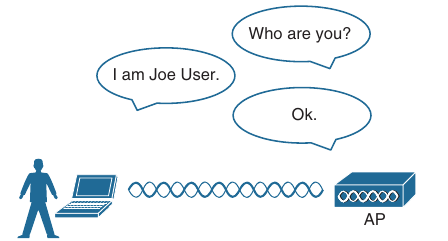

- Wireless authentication can take many forms

- Some methods require only a static text string that is common across all trusted clients and APs

- The text string is stored on the client device and is presented directly to the AP when needed

- What might happen if the device is stolen or lost?

- Most likely, any user who possesses the device would still be able to authenticate to the network

- One more stringent authentication methods require interaction with a corporate user database

- In those cases, the end user must enter a valid username and password - something that would not be known to a thief or an imposter

- Below are presented four types of client authentication that can be enountered in the real world

- With each type, you can begin by creating a new WLAN on the wireless LAN controller, assigning a controller interface and enabling the WLAN

- Because wireless security is configured on a per-WLAN basis, all of the configuration tasks will occur in the WLAN -> Edit security tab

### Open Authentication

- Recall that a wireless client device must send 802.11 authentication request and association request frames to an AP when it asks to join a wireless network

- The original 802.11 standard offered only two choices to authenticate a client: Open Authentication and WEP

- Open Authentication is true to it's name; it offers open access to a WLAN 

- The only requirement is that a client must use an 802.11 authentication request before it attempts to associate with an AP

- No other credentials are needed

- When would you want to use open authentication? 

- After all it does not sound very secure (and it is not)

- With no challenge, any 802.11 client may authenticate to access the network

- That is, in fact the whole purpose of Open Authentication - to validate that a client is a valid 802.11 device by authenticating the wireless hardware and the protocol

- Authenticating the user's identity is handled as a true security process through other means

- You have probably seen a WLAN with Open Authentication when you have visited a public location

- If any client screening is used at all, it comes in the form of Web Authentication (WebAuth) which is described later

- A client can associate right away but must open a web browser to see and accept the terms for use and enter basic credentials

- From that point, network access is opened up for the client

- To create a WLAN with Open Authentication on a IOS XE WLC, you can navigate to Configuration -> Wireless Setup -> WLAN wizard

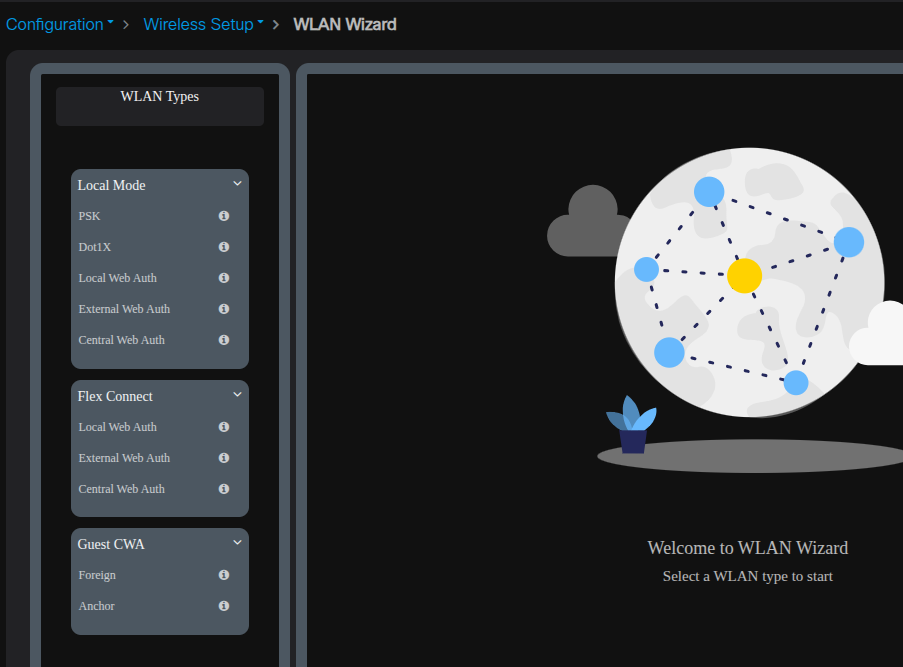

- You can also create a WLAN directly from Configuration -> Tags and profiles -> WLANs -> Add

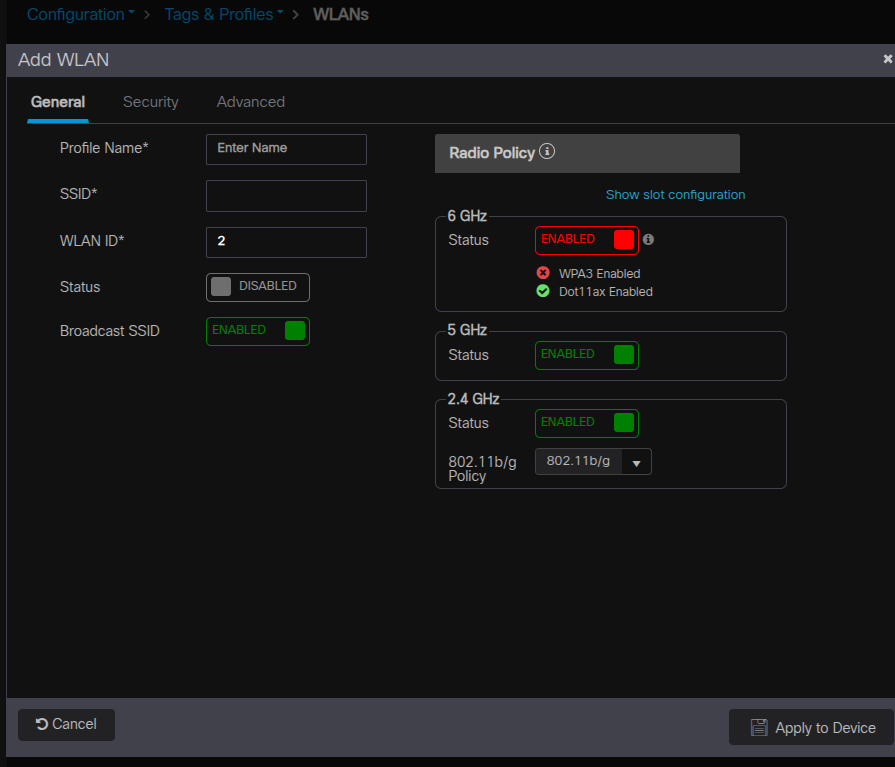

- Under the General tab enter the SSID string, then select the Security tab to configure WLAN security and user authentication parameters

- Select Layer 2 and then use the Layer 2 Security Mode dropdown menu to select None for Open Authentication, as shown below

- In this example the WLAN is named 'guest' and the SSID is 'Guest'

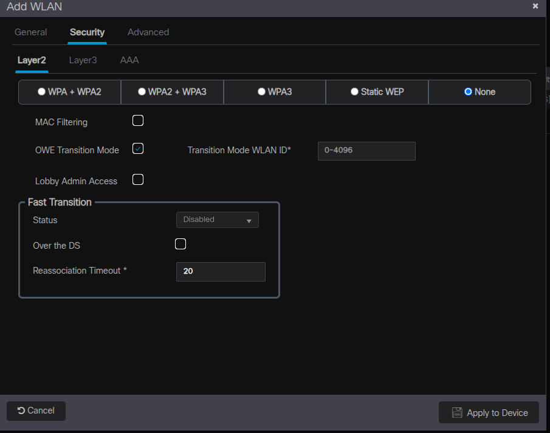

- Then click the 'Apply to device' button

- Don't forget that you still have to configure a policy profile to identify the appropriate VLAN number that the WLAN will map to and then apply the WLAN an Policy profiles to the AP

- You can verify the WLAN and it's security settings from the list of of WLANs shown under Configuration -> Tags and profiles -> WLANs

- The security is shown as [open]

- You can also verify the WLAN status is enabled and active

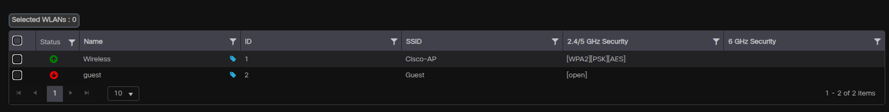

- Set a policy profile and associate it with a WLAN

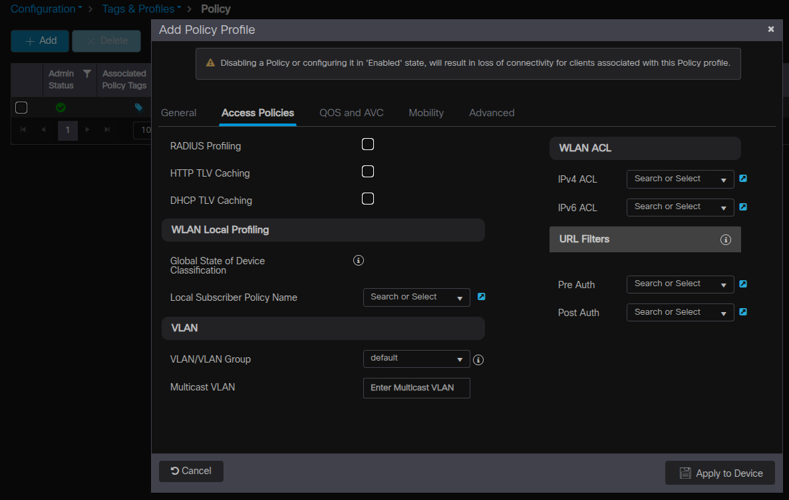

- Add site tag

- Configuration -> Tags and Profiles -> Tags -> Site

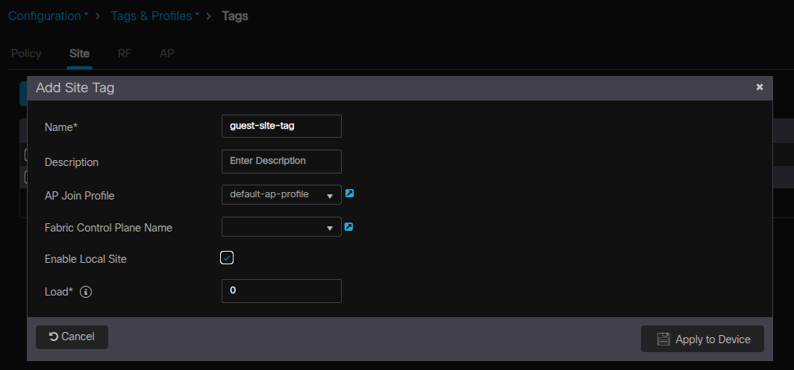

- Add a policy tag

- Configuration -> Tags and Profiles -> Tags -> Policy

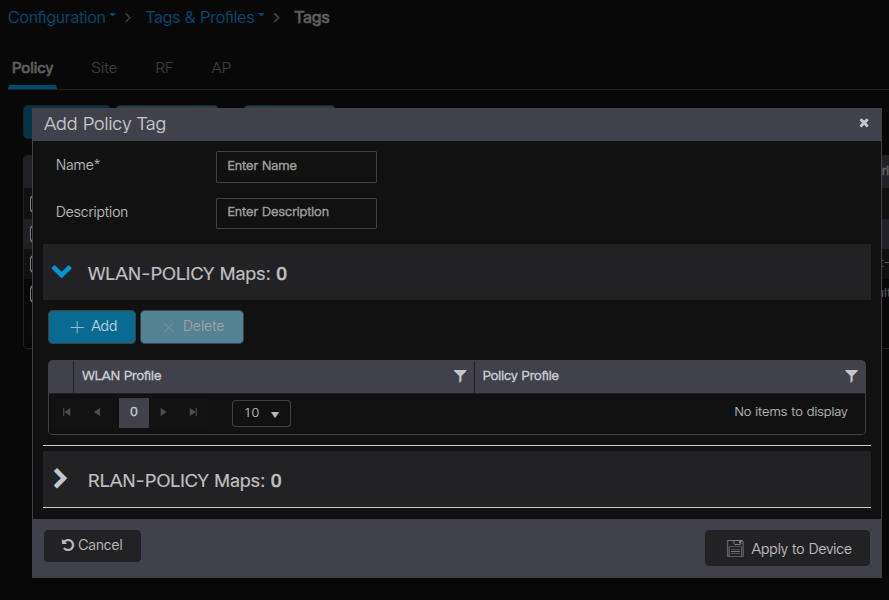

- (click on the check mark to add it to the AP)

- Assign policy tag to the policy profile added early

- Configuration -> Tags and Profiles -> Tags -> Edit a tag -> Set WLAN profile and Policy profile

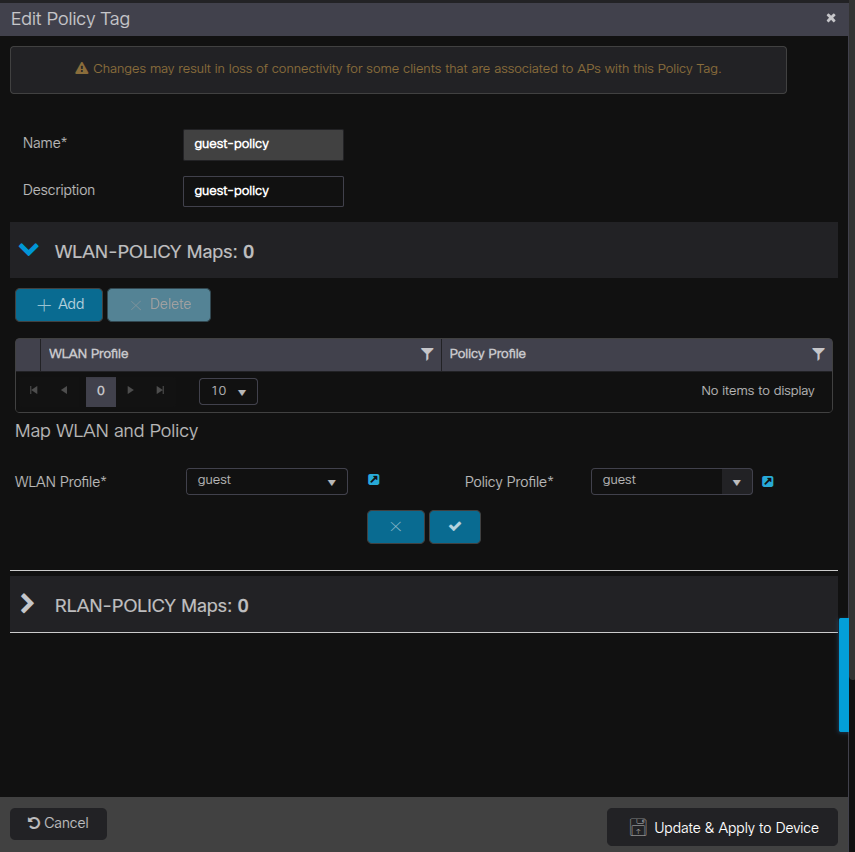

- Assign the profiles to the AP

- Configuration -> Tags and profiles -> Tags -> AP -> Assign policy tag, site tag and the RF tag to the AP

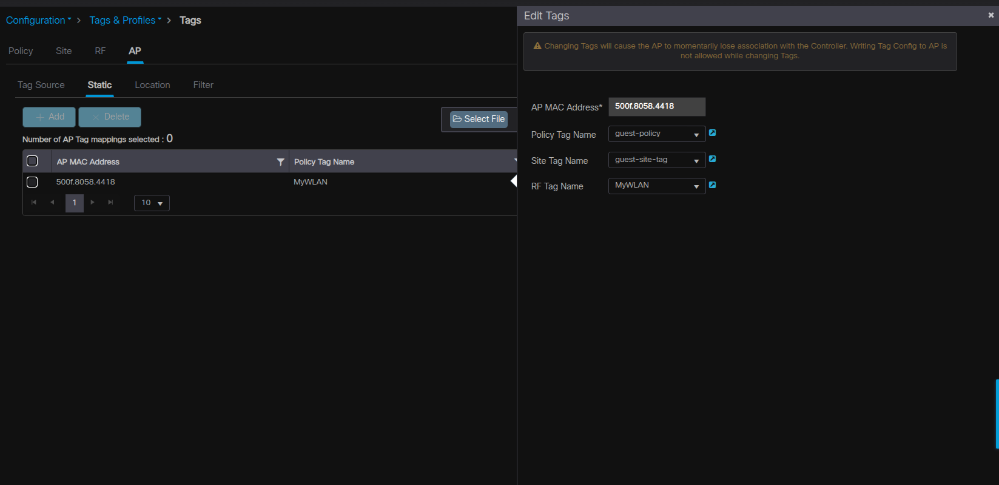

- Do not forget to "save configuration"


- UPDATE- To set this WLAN correctly you have to configure the VLAN in the Policy profile -> Access Policy tab as the VLAN you want the Clients to be part on

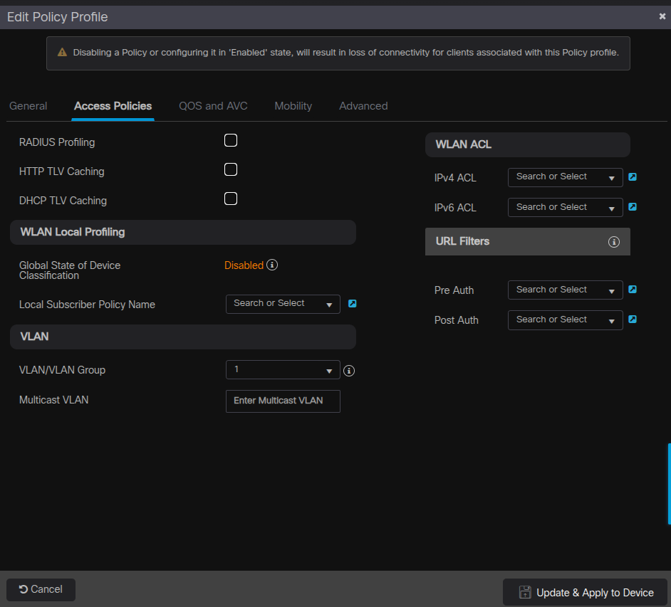

- Network topology

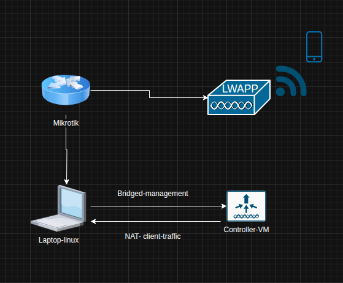


### Authenticating with Pre-Shared Key

- To secure wireless connections on a WLAN, you can leverage one of Wi-Fi Protected Access (WPA) versions - WPA (also known as WPA1), WPA2 or WPA3

- Each version is certified by the Wi-Fi Aliance so that wireless clients and APs using the same version are known to be compatible

- The WPA versions also specify encryption and data integrity methods to protect data passing over the wireless connections

- All three WPA versions support two client authentication modes, preshared key (PSK) or 802.1X, depending on the scale of the deployment

- These are also known as Personal mode and Enterprise mode, respectively

- With personal mode, a key string must be shared or configured on every client and AP before the clients can connect to the wireless network

- The pre-shared key is normally kept confidential so that unauthorized users have no knowledge of it

- The key string is never sent over the air

- Instead, clients and APs work through a four-way handshake procedure that uses the pre-shared key string to construct and exchange encryption key material that can be openly exchanged 

- When that process is successful, the AP can authenticate the client, and the two can secure data frames that are sent over the air

- With WPA-Personal and WPA2-Personal modes, a malicious user can eavesdrop and capture the four-way handshake between a client and an AP

- That user then can use a dictionary attack to automate the guessing of the pre-shared key

- If the malicious user is successful, that user can then decrypt the wireless data or even join the network, posing as a legitimate user

- WPA3-Personal avoids such an attack by strengthening the key exchange between the clients and APs through a method known as Simultaneous Authentication of Equals (SAE)

- Rather than a client authenticating against a server or AP, the client and AP can initiate the authentication process equally and even simultaneously

- Even if a password or key is compromised, WPA3-Personal offers forward secrecy which prevents attackers from being able to use a key to unencrypt data that has already been transmitted over the air

- The personal mode of any WPA version is usually easy to deploy in a small environment or with clients that are embedded in certain devices because a simple key string is all that is needed to authenticate the clients

- Be aware that every device using the WLAN must be configured with an identical pre-shared key, unless PSK with Identity Services Engine (ISE) is used

- If you ever need to update or change the key, you must touch every device to do so

- In addition, the pre-shared key should remain a well-kept secret; you should never divulge the pre-shared key to any unauthorized person

- To maximize security, you should use the highest WPA version available on the WLCs, APs and client devices in your network

- You can configure WPA2 or WPA3 personal mode and the pre-shared key in one step

- Configuration -> Tags and Profiles -> WLANs and select Add or select an existing WLAN to edit

- Make sure the parameters on the General tab are set appropriately

- Next, select the Security -> Layer 2 in tabs 

- In the Layer 2 security mode drop-down menu, select the appropriate WPA version for the WLAN

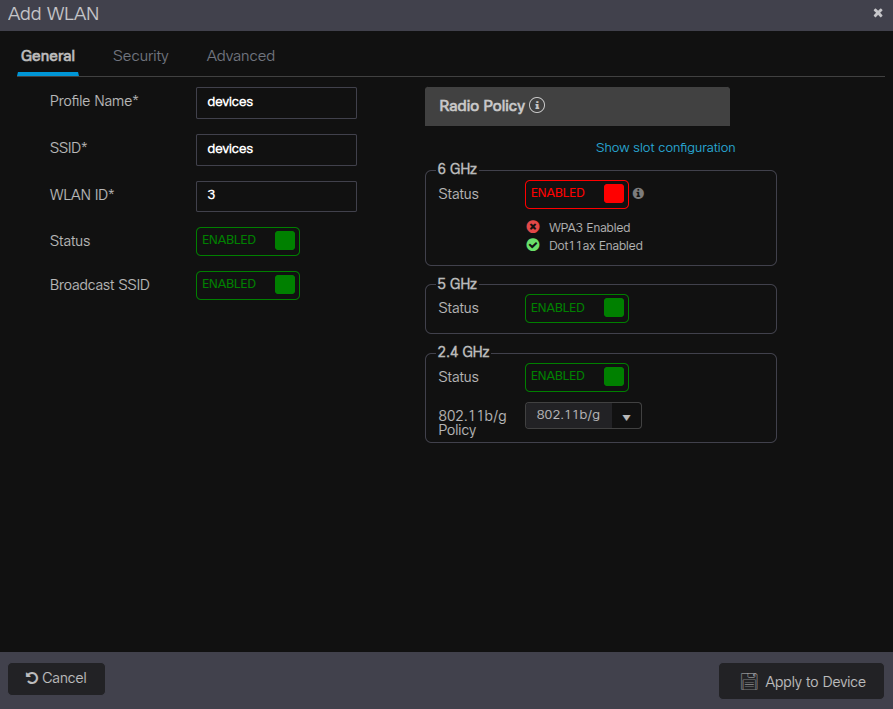

- Under WPA + WPA2 parameters, the WPA version has been narrowed down to only WPA2 by unchecking the box next to WPA policy and checking both WPA2 policy and WPA2 encryption AES

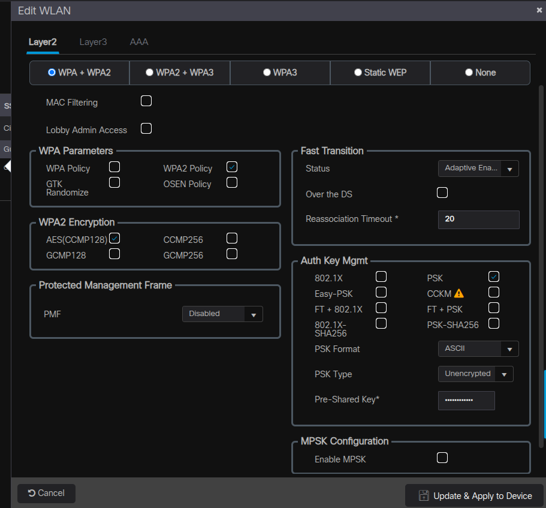

- Next add devices policy tag and map it to WLAN and policy profile

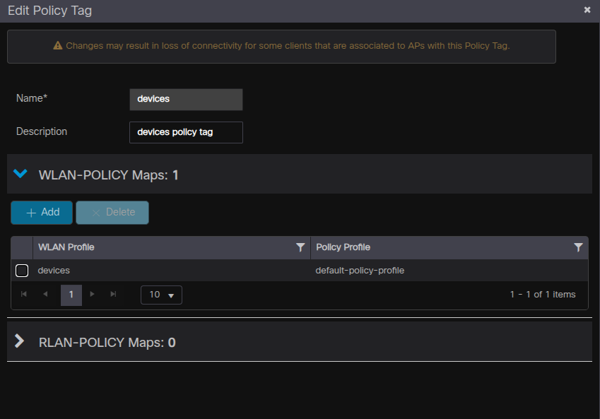

- Next assign tags to AP

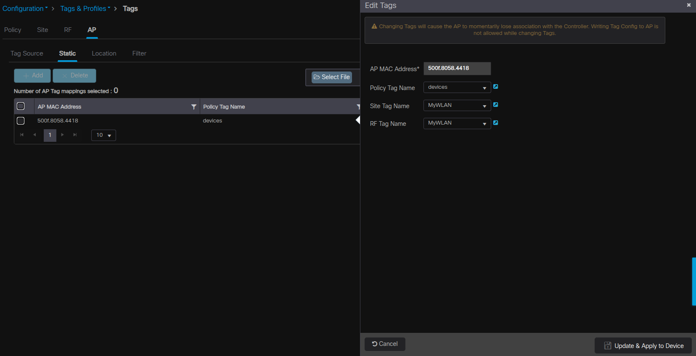

- For WPA2 personal mode, look under the Auth Key Mgmt section and check only the box next to PSK

- You should then enter the Pre-Shared key string in the box next to Pre-Shared key

- An ASCII text string has been entered

- Be sure to click the "Apply to device" button to apply the WLAN changes you have made

- Settings on a WLAN for WPA2 and WPA3 policy with SAE

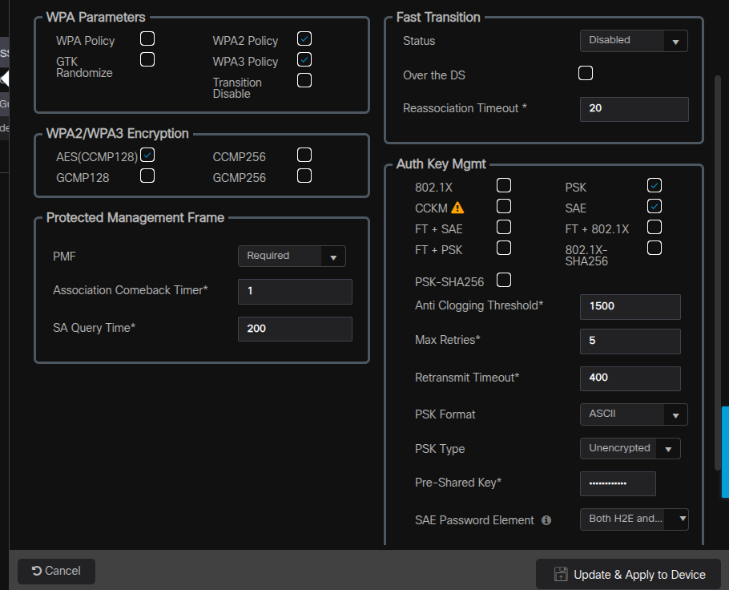

- The controller allows you to enable both WPA and WPA2 checkboxes

- You should do that only if you have legacy clients that require WPA support and are mixed in with newer WPA2 clients

- Be aware that the WLAN will only be as secure as the weakest security suite you configure on it

- Ideally, you should use WPA2 or WPA3 with AES/CCMP and try to avoid any other hybrid mode

- Hybrid modes such as WPA with AES and WPA2 with TKIP can cause compatibility issues; in addition, they have been deprecated

- You can verify the WLANs and their security settings from Configuration -> Tags and Policies -> WLANs

- The security column for the "devices" WLAN is shown as `[WPA2][PSK][AES]`

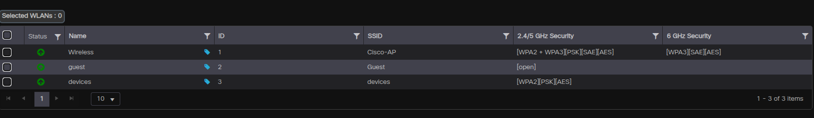

- For the WPA2+WPA3 authentication the security is shown as `[WPA2 + WPA3][PSK][SAE][AES]`

- You can also verify the WLAN status is enabled and active

### Authenticating with EAP

- Client authentication generally involves some sort of challenge, a response, and then a decision to grant access

- Behind the scenes, it can also involve an exchange of session or encryption keys, in addition to other parameters needed for client access

- Each authentication method might have unique requirements as a unique way to pass information between the client and the AP

- Rather than build aditional authentication methods into the 802.11 standard, Extensible Authentication Protocol (EAP) offers a more flexible and scalable authentication framework

- As it name implies, EAP is extensible, and does not consist of any one authentication method

- Instead, EAP defines a set of common functions that actual authentication methods can use to authenticate users

- EAP has another interesting quality: it can integrate with the IEEE 802.1x port-based access control standard

- When 802.1x is enabled, it limits access to a network medium until a client authenticates

- This means that a wireless client might be able to associate with an AP but will not be able to pass data to any other part of the network until it successfully authenticates

- With Open Authentication and PSK authentication, wireless clients are authenticated locally at the AP without further intervention

- The scenario changes with 802.1x; the client uses Open Authentication to associate with the AP, and then the actual client authentication process occurs at a dedicated authentication server

- Below is shown the three-party 802.1x arrangement, which consists on the following entities:

    - **Supplicant**: The client device that is requesting access

    - **Authenticator**: The network device that provides access to the network (usually a wireless LAN controller[WLC])

    - **Authentication Server (AS)**: The device that takes user or client credentials and permits or denies network access based on a user database and policies (usually a RADIUS server)

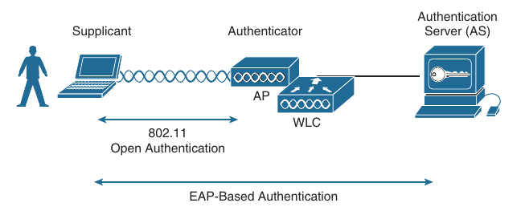 

- The controller becomes a middleman in the client authentication process, controlling user access with 802.1x and comunicating with the authentication server using the EAP framework

- For wired and wireless networks, this process uses EAP over LAN (EAPOL)

- After the client is successfully authenticated, the over-the-air connection between the client and AP must be encrypted and protected

- The two must build a set of encryption keys in a hierarchical fashion, beginning with a Pairwise Master Key (PMK) and a Groupwise Master Key (GMK) that get generated and distributed during the EAP authentication

- Pairwise keys are used to protect unicast traffic across the air, whereas Groupwise keys are used to protect broadcast and multicast traffic

- You might be wondering how WLANs using PSK are secured, because EAP is not used at all

- In that case the PSK itself is already known to both the client and the AP, so the PMK is derived from it

- Following that, the client and AP take part in a four-way EAPOL handshake to exchange the rest of dynamic encryption key information

- In a nutshell, the PMK is used to derive a Pairwise Transient Key (PTK), which is used to secure unicast traffic

- The PTK is also used with the GMK to derive a Groupwise Transient Key (GTK) that is used to secure broadcast and multicast traffic

- Below is shown the EAPOL handshake process 

- Notice the back-and-forth message exchange that begins with the AP and ends with the client, and also how the encryption keys are derived and installed along the way

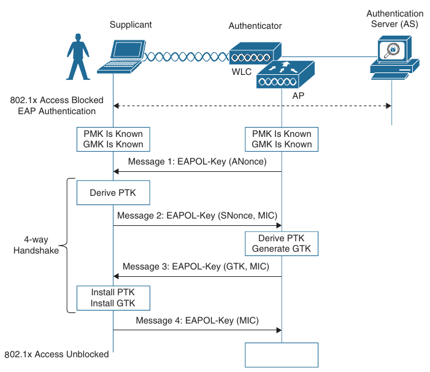

- The first two messages in the four-way handshake involve the AP and the client exchanging enough information to derive a PTK

- The last two messages involve exchanging the GTK that the AP generates and the client acknowledges

- If all four messages are successful, the client's association can be protected and the 802.1x process unblock wireless access for the client to use

- To use EAP-based authentication and 802.1x, you should leverage the enterprise modes of WPA, WPA2 and WPA3

- (As always you should use the highest WPA version that is supported on your WLCs, APs and wireless clients)

- The enterprise mode supports many EAP methods, such as LEAP, EAP-FAST, PEAP, EAP-TLS, EAP-TTLS, and EAP-SIM, but you do not have to configure any specific method on a WLC

- Instead, specific EAP methods must be configured on the authentication server and supported on the wireless client devices

- Remember that the WLC acts as an EAP middleman between the clients and the AP

- Cisco WLCs can use either external RADIUS servers located somewhere on the wired network or a local EAP server located on the WLC

- Below are discussed the configuration tasks for each of them

#### Configure EAP-Based Authentication with External RADIUS servers

- You should begin by configuring one or more external RADIUS servers on the controller

- Navigate to Configuration -> Security -> AAA and select the Servers/Groups tab

- Click the Add button to define a new server or select an existing server definition to edit

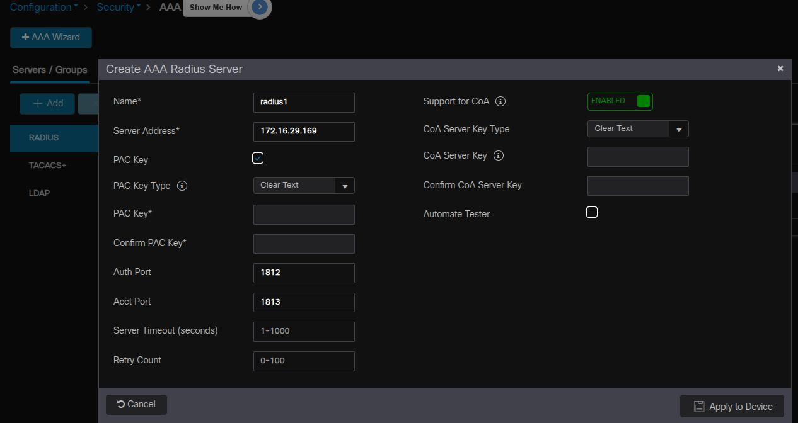

- Enter the server's name and IP address, along with the shared secret key that the controller will use to communicate with the server

- Make sure that the RADIUS port number is correct; if it isn't, a different port number

- Next, navigate to Configuration -> Security -> AAA and select the AAA method list tab to define the order that various authentication and authorization methods will be used 

- You can select the 'default' list or click the Add button to define a new one

- In the Type drop-down menu, select dot1x to use external RADIUS servers

- Then you define the order of server groups to use during authentication

- Under the Available Server Groups, select radius and click the > button to add radius to the Assigned Server groups list

- Below, a new method list called radius-auth is being configured

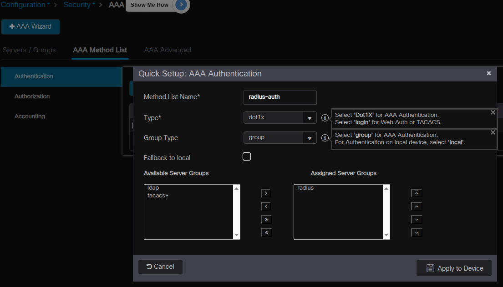

- Click on the "Apply to device" button to commit the change

- Viewing the method list after modifications

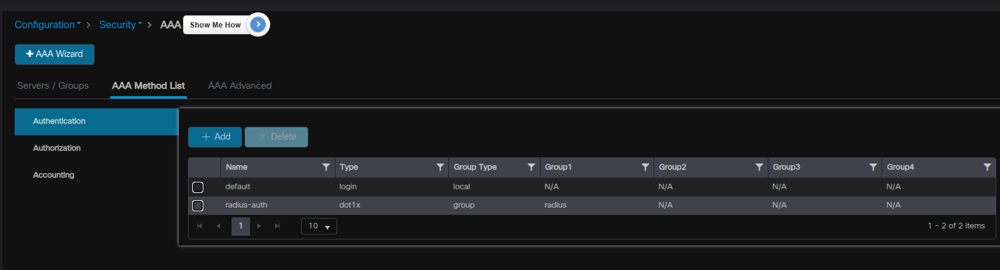

- Next, you need to enable 802.1x authentication on the WLAN

- Navigate to Configuration -> Tags and Policies -> WLANs and click "Add" to add a new WLAN

- On Layer 2 security check 802.1X and 802.1X-SHA256

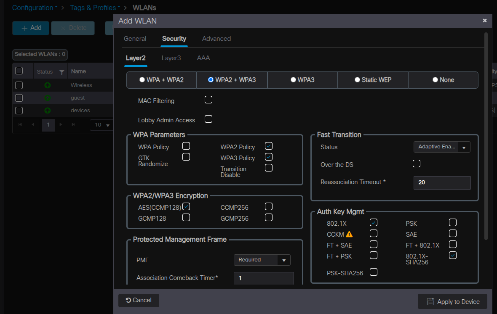

- On the AAA tab set the authentication list to be used

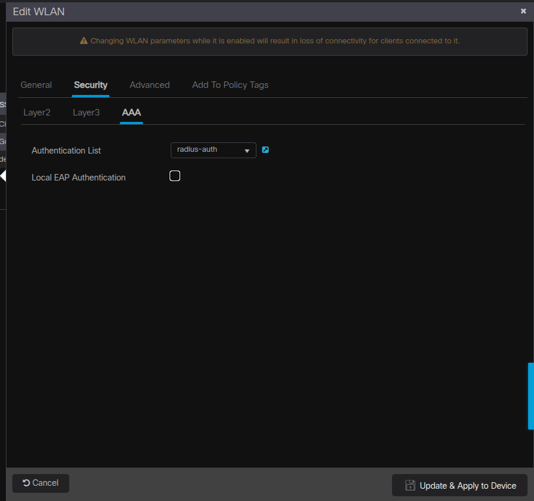

- Above is shown how to configure the WLAN security to use WPA2 and WPA3 enterprise

- Under the Layer 2 tab make sure that WPA2 and WPA3 policies are checked 

- For encryption check the box next to the AES (CCMP128) to use the most robust encryption

- Select 802.1X and 802.1X-SHA256 under the Authentication Key Management to enable the enterprise mode for WPA2/WPA3

- Make sure that PSK is not checked so that personal mode will remain disabled

- Next under the Security -> AAA tab select the desired authentication group list in the Authentication List drop-down menu

- Click the "Apply to device" button to apply the changes to the WLAN

- Setting up the radius server to perform the client authentication using freeradius (debian13)

```
sudo apt install mariadb-server
mariadb-secure-installation # set a root password for mardiadb database
sudo apt -y install freeradius freeradius-mysql freeradius-utils -y
systemctl stop freeradius.service 
freeradius -X
systemctl enable --now freeradius.service 
systemctl status freeradius.service 
```

- Create radius db

```
mysql -u root -p
create database radius;
GRANT ALL ON radius.* TO radius@localhost IDENTIFIED BY "<pass>";
FLUSH PRIVILEGES;
exit;
```

- Import SQL schema

```
mysql -u root -p radius < /etc/freeradius/3.0/mods-config/sql/main/mysql/schema.sql
```

- Add users in the database

```
INSERT INTO radcheck (id, username, attribute, op, value) VALUES (2,'<user>','User-Password',':=','<pass>');
INSERT INTO radcheck (username,attribute,value,op) VALUES ('<user>','Simultaneous-Use','6',':=')
```

- Verify tables in the database

```
sudo mysql -u root -p -e "use radius;show tables;"
ln -s /etc/freeradius/3.0/mods-available/sql /etc/freeradius/3.0/mods-enabled/
```

- Set the settings for the SQL module

```
vim /etc/freeradius/3.0/mods-enabled/sql


```

- Set ownership

```
chgrp -h freerad /etc/freeradius/3.0/mods-available/sql

sudo chown -R freerad:freerad /etc/freeradius/3.0/mods-enabled/sql

systemctl restart freeradius.service 
sql {
        #
        #  The dialect of SQL being used.
        #
        #  Allowed dialects are:
        #
        #       mssql
        #       mysql
        #       oracle
        #       postgresql
        #       sqlite
        #       mongo
        #
        dialect = "mysql"

        driver = "rlm_sql_${dialect}"

# comment tls settings
        mysql {
                # If any of the files below are set, TLS encryption is enabled
                # tls {
                #       ca_file = "/etc/ssl/certs/my_ca.crt"
                #       ca_path = "/etc/ssl/certs/"
                #       certificate_file = "/etc/ssl/certs/private/client.crt"
                #       private_key_file = "/etc/ssl/certs/private/client.key"
                #       cipher = "DHE-RSA-AES256-SHA:AES128-SHA"

                #       tls_required = yes
                #       tls_check_cert = no
                #       tls_check_cert_cn = no
                #}

                # If yes, (or auto and libmysqlclient reports warnings are
                # available), will retrieve and log additional warnings from
                # the server if an error has occured. Defaults to 'auto'
                warnings = auto
        }


        # Connection info:
        #
        server = "localhost"
        port = 3306
        login = "radius"
        password = "<pass>"

        # Database table configuration for everything except Oracle
        radius_db = "radius"
        # read the clients from the database
        read_clients = yes

        # Table to keep radius client info
        client_table = "nas"

}
```

- Set the clients that can communicate with the server

```
vim /etc/freeradius/3.0/clients.conf

client WLC {
        ipaddr          = 172.16.29.100
        secret          = <secret>
}

# Restart radius service

systemctl restart freeradius.service
```

- As you worked through the WPA2 enterprise configuration, did you notice that you never saw an option to use a specific authentication method like PEAP or EAP-TLS?

- The controller only has to know that 802.1x will be in use

- The actual authentication methods are configured on the RADIUS server 

- The client's supplicant must also be configured to match what the server is using

#### Verifying EAP-based Authentication Configuration

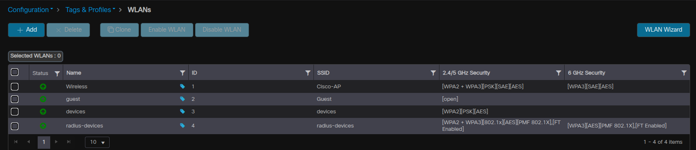

- You can verify the WLAN and it's security settings from the list of WLANs by selecting Configuration -> Tags and Profiles -> WLANs as shown above

### Authenticating with WebAuth

- You might have noticed that none of the authentication methods described so far involve direct interaction with the end user

- For example, Open Authentication requires nothing from the user or the device

- PSK authentication involves a pre-shared key that is exchanged between the device and the AP

- EAP-based authentication can present the end user with a prompt for credentials, but only if the EAP method supports it

- Even so, the end user does not see any information about the network or it's provider

- Web Authentication (WebAuth) is different because it presents the end user with content to read and interact with before granting access to the network

- For example, it can present an Acceptable Use Policy (AUP) that the user must accept before accessing the network

- It can also prompt for user credentials, display information about the enterprise and so on

- Naturally, the user must open a web browser to see the WebAuth content

- WebAuth can be used in concert with Open Authentication, PSK-based authentication, and EAP-based authentication

- Web authentication can be handled locally on the WLC for smaller environments through Local Web Authentication (LWA) 

- You can configure LWA in the following modes:

    - LWA with an internal database on the WLC

    - LWA with an external database on a RADIUS or LDAP server

    - LWA with an external redirect after the authentication

    - LWA with an external splash page redirect, using an internal database on the WLC

    - LWA with passthrough, requiring user acknowledgement

- Where there are many controllers providing Web Authentication, it makes sense to use an LWA with an external database on a RADIUS server, such as ISE, and keep the user database centralized

- The next logical progression is to move the web authentication page onto the central server too

- This is called Central Web Authentication (CWA)

- To configure WebAuth on a WLAN, first navigate to Configuration -> Security -> WebAuth and select the Add button to create a parameter map that contains the global and custom parameters that WebAuth will use

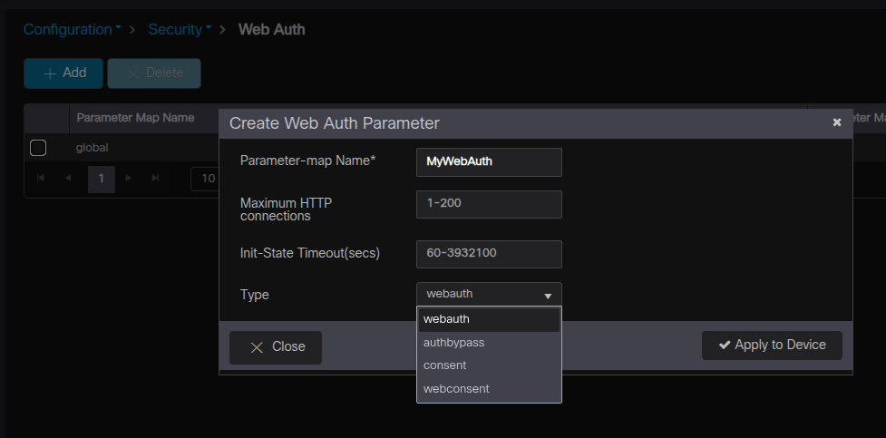

- Above, a WebAuth parameter map named MyWebAuth has been created

- After selecting the "Apply to Device" button, you can select the newly created parameter map and edit any of it's parameters

- Below, a WebAuth banner has been configured

- You can also select the Advanced tab to define any WebAuth redirects and customized login success and failure pages

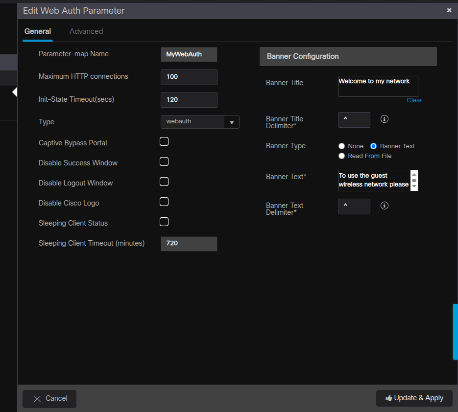

- Next, navigate to Configuration -> Security -> AAA and define an authentication method list that WebAuth will use by selecting the AAA Method List tab

- In this case, the method list Type must be set to "Login" to interact with the end user attempting to authenticate

- Below, a method list named webauth has been created with type "Login" and only radius added to the Assigned Server Groups

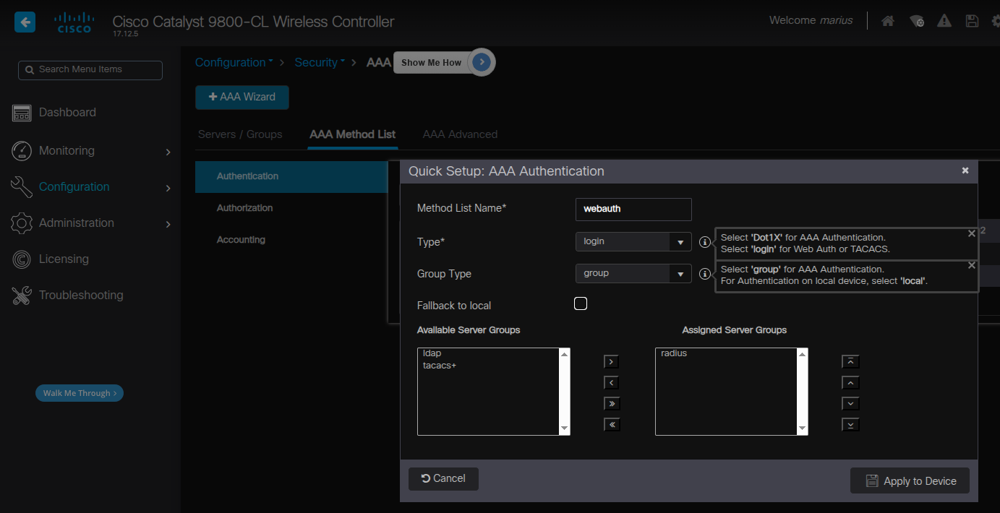

- Finally, configure WebAuth for a WLAN by navigating to Configuration -> Tags and Profiles -> WLANs

- Name the WLAN and SSID in the General tab; then select the Security tab and define the Layer 2 parameters

- Select the Layer 3 tab to configure the WebAuth operation, as shown below

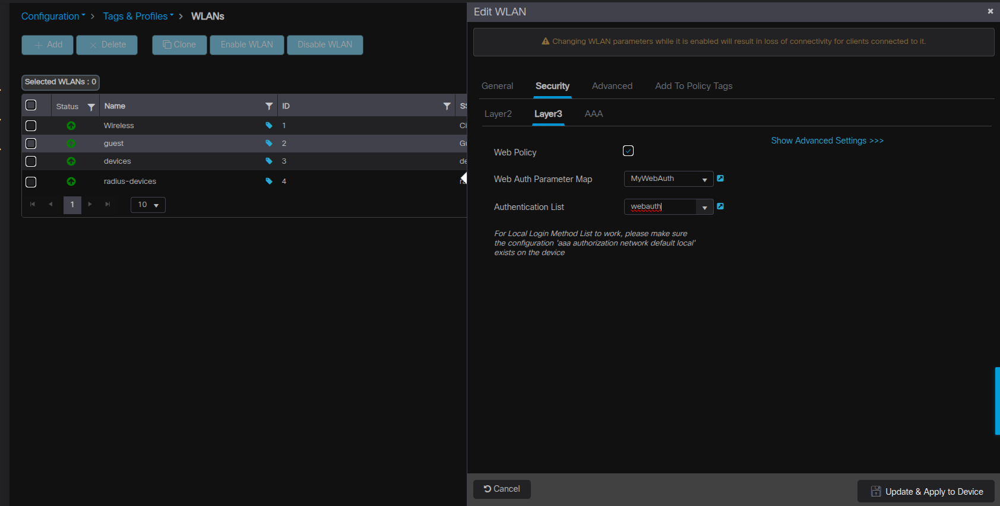

- Don't forget to complete the WLAN creation process by linking the WLAN profile to a policy profile via a policy tag and then apply the tag to some APs

- You can verify the WebAuth Security Settings from the list of WLANs by selecting Configuration -> Tags and Profiles -> WLANs

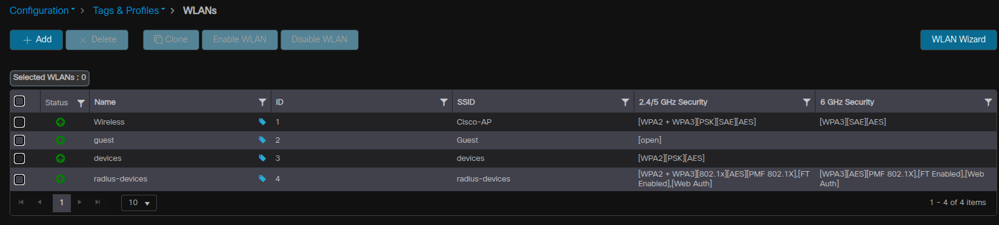

- Above, the WLAN named "radius-devices" is shown with "[web-auth]" in the Security column

- To configure a flex profile and assign it to a site tag go to Configuration -> Tags and Profiles -> Site and add/edit a site tag

- Deselect "Enable local site" in order to set enable the flex connect mode - disabling this will allow you to select the flex profile also

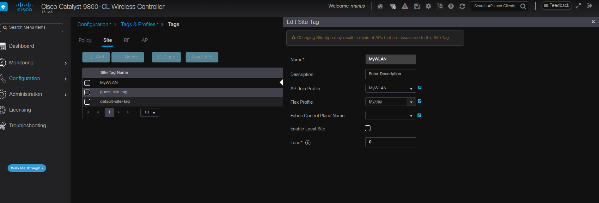

