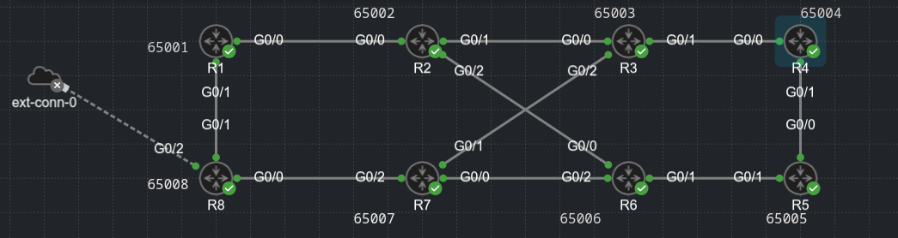
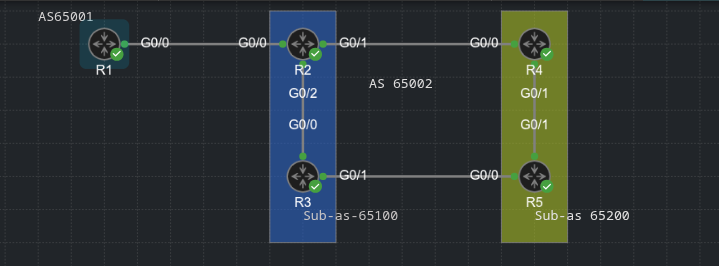
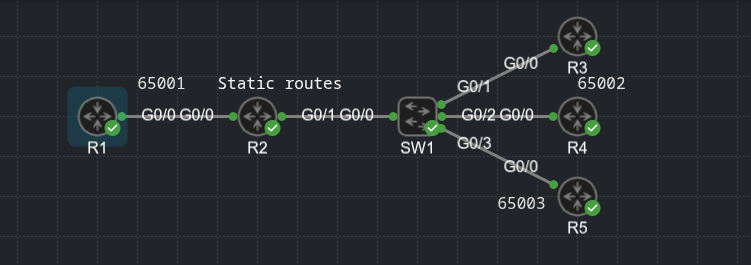

## BGP Communities

1. BGP Communities

2. BGP path selection

### BGP Communities

- BGP communities - 32 bit numbers in the following format:

    - 0 - 4294967295 (full 32-bit number)

    - 0 - 65535:0 - 65535 - formely as newer format

- Private BGP communities follow the format:

    - AS_number:Community_number

- Recently BGP can also support extended communities - more than 32-bit numbers

#### Well-Known Communities

- These are in range 4294901760 - 4294967295 (0xFFFF0000 - 0xFFFFFFFF)

- Internet: Routes with this community are advertised and accepted by the edge routers on the internet

- No_Advertise: These routes should not be advertised to any eBGP or iBGP peer

- No_Export: This routes should only be advertised to iBGP peers, not eBGP peers

#### Enabling BGP Communities

- These are not enabled by default on IOS and IOS-XE routers

- Enabling BGP communities on a neighbor by neighbor basis:

```
conf t
 router bgp 65100
  neighbor 10.12.1.2 remote-as 65200
  no bgp default ipv4-unicast
  address-family ipv4
   neighbor 10.12.1.2 activate
   neighbor 10.12.1.2 send-community [standard | extended | both]
```

- If a keyword is not specified standard communities are send by default




- R1's BGP table:

```
R1#show bgp ipv4 uni | b Net
     Network          Next Hop            Metric LocPrf Weight Path
 *>   10.1.1.1/32      0.0.0.0                  0         32768 i
 *>   10.2.2.2/32      10.12.1.2                0             0 65002 i
 *    10.3.3.3/32      10.18.1.2                              0 65008 65007 65003 i
 *>                    10.12.1.2                              0 65002 65003 i
 *    10.4.4.4/32      10.18.1.2                              0 65008 65007 65003 65004 i
 *>                    10.12.1.2                              0 65002 65003 65004 i
 *    10.5.5.5/32      10.18.1.2                              0 65008 65007 65006 65005 i
 *>                    10.12.1.2                              0 65002 65006 65005 i
 *    10.6.6.6/32      10.18.1.2                              0 65008 65007 65006 i
 *>                    10.12.1.2                              0 65002 65006 i
 *>   10.7.7.7/32      10.18.1.2                              0 65008 65007 i
 *                     10.12.1.2                              0 65002 65003 65007 i
 *>   10.8.8.8/32      10.18.1.2                0             0 65008 i
```

- Communities can be set with outbound route maps:

```
conf t
 route-map TEST permit 10
  set community 65001:333

 router bgp 65001
  address-family ipv4
   neighbor 10.12.1.2 route-map TEST out
```

- Set the new format for BGP communities:

```
conf t
 ip bgp-community new-format
```

- Creating a community list and use it in a route map (R4):

```
conf t
 ip community-list 1 permit 65002:444

 route-map PERMIT-444, permit, sequence 10
  match community 1
  set local-preference 444

 router bgp 65004
  address-family ipv4
   neighbor 10.45.1.2 route-map PERMIT-444 out
```

- R4 advertised to R5 only these routes:

```
R4(config)#do sh bgp ipv4 uni nei 10.45.1.2 advertised-routes | b Net
     Network          Next Hop            Metric LocPrf Weight Path
 *>   10.1.1.1/32      10.34.1.1                              0 65003 65002 65001 i
 *>   10.2.2.2/32      10.34.1.1                              0 65003 65002 i
 *>   10.12.1.0/30     10.34.1.1                              0 65003 65002 65001 i
 *>   10.18.1.0/30     10.34.1.1                              0 65003 65002 65001 i

Total number of prefixes 4 
```

#### Setting Private BGP Communities

- Setting a private BGP community:

```
conf t
 route-map TEST permit 10
  set community <pattern> additive
```

- Example - on R4:

```
conf t
 ip prefix-list ALLOW44 permit 10.4.4.0/24 ge 28 
 route-map ADD-COMMUNITY permit 10
  match ip address prefix-list ALLOW-44
  set community 65003:333
  set community 65004:444 additive

 router bgp 65004
  address-family ipv4
   neighbor 10.34.1.1 route-map ADD-COMMUNITY out 
```

- On R3:

```
R3#show bgp ipv4 uni 10.4.4.4/32
BGP routing table entry for 10.4.4.4/32, version 11
Paths: (1 available, best #1, table default)
  Advertised to update-groups:
     1         
  Refresh Epoch 1
  65004
    10.34.1.2 from 10.34.1.2 (10.4.4.4)
      Origin IGP, metric 0, localpref 100, valid, external, best
      Community: 65003:333 65004:444
      rx pathid: 0, tx pathid: 0x0
```

- On R2- take the network 10.6.6.6/32 advertised by R6 and add communities 66:66 65006:66 65006:666 to it as it is advertised to R1:

```
ip prefix-list ALLOW66: 1 entries
   seq 5 permit 10.6.6.0/24 ge 28

route-map SET-COMMUNITY, permit, sequence 10
  Match clauses:
    ip address prefix-lists: ALLOW66 
  Set clauses:
    community 66:66 65006:66 65006:666 additive
  Policy routing matches: 0 packets, 0 bytes
route-map SET-COMMUNITY, permit, sequence 20
  Match clauses:
  Set clauses:
  Policy routing matches: 0 packets, 0 bytes

router bgp 65002
 bgp log-neighbor-changes
 no bgp default ipv4-unicast
 neighbor 10.12.1.1 remote-as 65001
 !
 address-family ipv4
  network 10.2.2.2 mask 255.255.255.255
  neighbor 10.12.1.1 activate
  neighbor 10.12.1.1 send-community both
  neighbor 10.12.1.1 route-map SET-COMMUNITY out
```

- Viewing the network prefix on R1:

```
R1#show bgp ipv4 uni 10.6.6.6/32
BGP routing table entry for 10.6.6.6/32, version 22
Paths: (1 available, best #1, table default)
  Not advertised to any peer
  Refresh Epoch 1
  65002 65006
    10.12.1.2 from 10.12.1.2 (10.2.2.2)
      Origin IGP, localpref 100, valid, external, best
      Community: 66:66 65006:66 65006:666
      rx pathid: 0, tx pathid: 0x0
```

- R8 - set communities 33:123 333:123 65003:33 for the route 10.3.3.3/32 as it comes from R7 into my AS

- Before:

```
R8#show bgp 10.3.3.3
BGP routing table entry for 10.3.3.3/32, version 4
Paths: (2 available, best #1, table default)
  Advertised to update-groups:
     1         
  Refresh Epoch 2
  65007 65003
    10.78.1.1 from 10.78.1.1 (10.7.7.7)
      Origin IGP, localpref 100, valid, external, best
      rx pathid: 0, tx pathid: 0x0
  Refresh Epoch 2
  65001 65002 65003
    10.18.1.1 from 10.18.1.1 (10.1.1.1)
      Origin IGP, localpref 100, valid, external
      Community: 65001:333
      rx pathid: 0, tx pathid: 0
```

- R8 configuration:

```
ip prefix-list ALLOW33: 1 entries
   seq 5 permit 10.3.3.0/24 ge 28

route-map SET-COMMUNITY33, permit, sequence 10
  Match clauses:
    ip address prefix-lists: ALLOW33 
  Set clauses:
    community 33:123 333:123 65003:33 additive
  Policy routing matches: 0 packets, 0 bytes
route-map SET-COMMUNITY33, permit, sequence 20
  Match clauses:
  Set clauses:
  Policy routing matches: 0 packets, 0 bytes

router bgp 65008
 bgp log-neighbor-changes
 no bgp default ipv4-unicast
 neighbor 10.78.1.1 remote-as 65007
 !
 address-family ipv4
  network 10.8.8.8 mask 255.255.255.255
  neighbor 10.78.1.1 activate
  neighbor 10.78.1.1 send-community both
  neighbor 10.78.1.1 route-map SET-COMMUNITY33 in
 exit-address-family
```

- The communities after modification:

```
R8#show bgp ipv4 uni 10.3.3.3/32
BGP routing table entry for 10.3.3.3/32, version 4
Paths: (2 available, best #1, table default)
  Advertised to update-groups:
     1         
  Refresh Epoch 2
  65007 65003
    10.78.1.1 from 10.78.1.1 (10.7.7.7)
      Origin IGP, localpref 100, valid, external, best
      Community: 33:123 333:123 65003:33
      rx pathid: 0, tx pathid: 0x0
  Refresh Epoch 2
  65001 65002 65003
    10.18.1.1 from 10.18.1.1 (10.1.1.1)
      Origin IGP, localpref 100, valid, external
      Community: 65001:333
      rx pathid: 0, tx pathid: 0
```

### BGP Confederations

- Confederations are used to solve the need for full mesh iBGP peerings within an AS

- Basically the routers get an additional AS number as part of their internal AS (not advertised to eBGP peers)

- The BGP peerings are made using the loopback addresses on the routers, which are shared via OSPF



- R1 - AS 65001 - configuration - eBGP peer:

```
router bgp 65001
 bgp log-neighbor-changes
 no bgp default ipv4-unicast
 neighbor 10.2.2.2 remote-as 65002
 neighbor 10.2.2.2 ebgp-multihop 5
 neighbor 10.2.2.2 update-source Loopback0
 !
 address-family ipv4
  network 10.1.1.1 mask 255.255.255.255
  neighbor 10.2.2.2 activate
 exit-address-family
```

- R2 - AS 65002, confederation AS 65100:

```
router bgp 65100
 bgp log-neighbor-changes
 bgp confederation identifier 65002
 bgp confederation peers 65200 
 no bgp default ipv4-unicast
 neighbor 10.1.1.1 remote-as 65001
 neighbor 10.1.1.1 ebgp-multihop 5
 neighbor 10.1.1.1 update-source Loopback0
 neighbor 10.3.3.3 remote-as 65100
 neighbor 10.3.3.3 update-source Loopback0
 neighbor 10.4.4.4 remote-as 65200
 neighbor 10.4.4.4 ebgp-multihop 2
 neighbor 10.4.4.4 update-source Loopback0
 !
 address-family ipv4
  neighbor 10.1.1.1 activate
  neighbor 10.3.3.3 activate
  neighbor 10.4.4.4 activate
 exit-address-family

router ospf 1
 network 10.2.2.2 0.0.0.0 area 0
 network 10.23.1.0 0.0.0.3 area 0
 network 10.24.1.0 0.0.0.3 area 0
```

- R3 - AS 65002, confederation AS 65100:

```
router bgp 65100
 bgp log-neighbor-changes
 bgp confederation identifier 65002
 bgp confederation peers 65200 
 no bgp default ipv4-unicast
 neighbor 10.2.2.2 remote-as 65100
 neighbor 10.2.2.2 update-source Loopback0
 neighbor 10.5.5.5 remote-as 65200
 neighbor 10.5.5.5 ebgp-multihop 2
 neighbor 10.5.5.5 update-source Loopback0
 !
 address-family ipv4
  neighbor 10.2.2.2 activate
  neighbor 10.5.5.5 activate
 exit-address-family

! OSPF enabled per interfaces:

show run | i ospf 1
 ip ospf 1 area 0
 ip ospf 1 area 0
 ip ospf 1 area 0
router ospf 1
```

- R4 - AS 65002 - confederation AS 65200:

```
router bgp 65200
 bgp log-neighbor-changes
 bgp confederation identifier 65002
 bgp confederation peers 65100 
 no bgp default ipv4-unicast
 neighbor 10.2.2.2 remote-as 65100
 neighbor 10.2.2.2 ebgp-multihop 2
 neighbor 10.2.2.2 update-source Loopback0
 neighbor 10.5.5.5 remote-as 65200
 neighbor 10.5.5.5 update-source Loopback0
 !
 address-family ipv4
  neighbor 10.2.2.2 activate
  neighbor 10.5.5.5 activate
 exit-address-family

! OSPF still on interfaces

R4#show running-config | i ospf 1     
 ip ospf 1 area 0
 ip ospf 1 area 0
 ip ospf 1 area 0
router ospf 1
```

- R5 - AS 65002, confederation AS 65200 - a network advertised into BGP

```
router bgp 65200
 bgp log-neighbor-changes
 bgp confederation identifier 65002
 bgp confederation peers 65100 
 no bgp default ipv4-unicast
 neighbor 10.3.3.3 remote-as 65100
 neighbor 10.3.3.3 ebgp-multihop 2
 neighbor 10.3.3.3 update-source Loopback0
 neighbor 10.4.4.4 remote-as 65200
 neighbor 10.4.4.4 update-source Loopback0
 !
 address-family ipv4
  network 10.128.70.5 mask 255.255.255.255
  neighbor 10.3.3.3 activate
  neighbor 10.4.4.4 activate
 exit-address-family

! OSPF on interfaces

show run | i  ospf      
 ip ospf 1 area 0
 ip ospf 1 area 0
 ip ospf 1 area 0
router ospf 1
```

- Verifying the BGP routes on R2 and R3

- R2:

```
show bgp ipv4 uni | b Net
     Network          Next Hop            Metric LocPrf Weight Path
 r>   10.1.1.1/32      10.1.1.1                 0             0 65001 i
 *>   10.128.70.5/32   10.5.5.5                 0    100      0 (65200) i

R2#show bgp ipv4 uni 10.128.70.5
BGP routing table entry for 10.128.70.5/32, version 22
Paths: (1 available, best #1, table default)
  Advertised to update-groups:
     7          9         
  Refresh Epoch 1
  (65200)
    10.5.5.5 (metric 3) from 10.4.4.4 (10.4.4.4)
      Origin IGP, metric 0, localpref 100, valid, confed-external, best
      rx pathid: 0, tx pathid: 0x0
```

- R3:

```
R3#show ip bgp | b Net
     Network          Next Hop            Metric LocPrf Weight Path
 r>i  10.1.1.1/32      10.1.1.1                 0    100      0 65001 i
 *>i  10.128.70.5/32   10.5.5.5                 0    100      0 (65200) i
 *                     10.5.5.5                 0    100      0 (65200) i

 R3#show ip bgp 10.128.70.5
BGP routing table entry for 10.128.70.5/32, version 23
Paths: (2 available, best #1, table default)
  Advertised to update-groups:
     4         
  Refresh Epoch 1
  (65200)
    10.5.5.5 (metric 2) from 10.2.2.2 (10.2.2.2)
      Origin IGP, metric 0, localpref 100, valid, confed-internal, best
      rx pathid: 0, tx pathid: 0x0
  Refresh Epoch 1
  (65200)
    10.5.5.5 (metric 2) from 10.5.5.5 (10.5.5.5)
      Origin IGP, metric 0, localpref 100, valid, confed-external
      rx pathid: 0, tx pathid: 0
```

- R1:

```
R1#show ip bgp | b Net      
     Network          Next Hop            Metric LocPrf Weight Path
 *>   10.1.1.1/32      0.0.0.0                  0         32768 i
 *>   10.128.70.5/32   10.2.2.2                               0 65002 i
```

### BGP Dynamic neighbors

- Can be done with peer groups, we define a limit and a range of IP addresses for BGP peers



- R1:

```
router bgp 65001
 bgp log-neighbor-changes
 bgp listen range 10.23.45.0/24 peer-group BGP-PEER
 bgp listen limit 10
 no bgp default ipv4-unicast
 neighbor BGP-PEER peer-group
 neighbor BGP-PEER remote-as 65002 alternate-as 65003 
 neighbor BGP-PEER ebgp-multihop 5
 !
 address-family ipv4
  network 10.1.1.1 mask 255.255.255.255
  neighbor BGP-PEER activate
 exit-address-family
```

- R2 - Only static routes to carry loopback traffic, no BGP:

```
R2#show ip route static | b Gate 
Gateway of last resort is not set

      10.0.0.0/8 is variably subnetted, 8 subnets, 2 masks
S        10.1.1.1/32 [1/0] via 10.12.1.1
S        10.4.4.4/32 [1/0] via 10.23.45.4
S        10.5.5.5/32 [1/0] via 10.23.45.5
```

- R3:

```
router bgp 65002
 bgp log-neighbor-changes
 no bgp default ipv4-unicast
 neighbor 10.12.1.1 remote-as 65001
 neighbor 10.12.1.1 ebgp-multihop 5
 !
 address-family ipv4
  neighbor 10.12.1.1 activate
 exit-address-family

 R3#show ip route static | b Gate
Gateway of last resort is not set

      10.0.0.0/8 is variably subnetted, 7 subnets, 2 masks
S        10.12.1.0/24 [1/0] via 10.23.45.1
```

- R4:

```
router bgp 65002
 bgp log-neighbor-changes
 no bgp default ipv4-unicast
 neighbor 10.12.1.1 remote-as 65001
 neighbor 10.12.1.1 ebgp-multihop 5
 !
 address-family ipv4
  network 10.4.4.4 mask 255.255.255.255
  neighbor 10.12.1.1 activate
 exit-address-family
R4#sh ip route static | b Gate
Gateway of last resort is not set

      10.0.0.0/8 is variably subnetted, 6 subnets, 2 masks
S        10.12.1.0/24 [1/0] via 10.23.45.1
```

- R5:

```
router bgp 65003
 bgp log-neighbor-changes
 no bgp default ipv4-unicast
 neighbor 10.12.1.1 remote-as 65001
 neighbor 10.12.1.1 ebgp-multihop 5
 !
 address-family ipv4
  network 10.5.5.5 mask 255.255.255.255
  neighbor 10.12.1.1 activate
 exit-address-family
R5#sh ip route static | b Gate
Gateway of last resort is not set

      10.0.0.0/8 is variably subnetted, 6 subnets, 2 masks
S        10.12.1.0/24 [1/0] via 10.23.45.1
```

