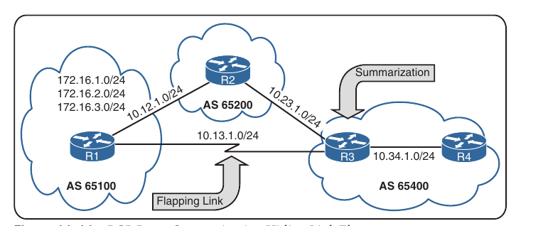

## BGP

1. BGP fundamentals

2. Basic BGP configuration

3. Route Summarization

4. Multiprotocol BGP for IPv6

- RFC 1654 defines BGP(*Border Gateway Protocol*) as an EGP standardized path vector routing protocol that provides scalability, flexibility and network stability

- When BGP was created, the primary design consideration was IPv4 inter-organization connectivity on public networks like the Internet and on private dedicated networks

- BPG is the only protocol used to exchange networks on the Internet, which has more than 780000 IPv4 routes and continues to grow

- Due to the large size of BGP tables, BGP does not advertise incremental updates or refresh network advertisements as OSPF and IS-IS do

- BGP prefers stability within the network, as a link flap could result in route computation for thousands of routes

- Fundamentals of BGP: path attributes, address families, inter-router communication, BGP communication, route summarization and support for IPv6

### BGP Fundamentals

- From the perspective of BGP, an *autonomous system* (AS) is a collection of routers under a single organization's control, using one or more IGPs and common metrics to route packets within the AS

- If multiple IGPs or metrics are used within an AS, the AS must appear consistent to external ASs in routing policy

- An IGP is not required within the AS; an AS could use BGP as the only routing protocol

#### Autonomous System Numbers

- An organization requiring connectivity to the Internet must obtain an autonomous system number (ASN)

- ASNs were originally 2 bytes (16-bit range), which made 65535 ASNs possible

- Due to exhaustion, RFC 4893 expands the ASN field to accomodate 4 bytes (32-bit range)

- This allows for 4.294.967.295 unique ASNs, providing quite an increase from the original 65535 ASNs

- Two blocks of private ASNs are available for any organization to use, as long as they are never exchanged publicly on the Internet

- ASNs 64512 - 65535 are private ASNs in the 16-bit ASN range, and 4.200.000.000 4.294.967.294 are private ASNs within the extended 32-bit range

- The *Internet Assignment Numbers Authority* (IANA) is responsible for assigning all public ASNs to ensure that they are globally unique

- IANA requires the following items when requesting a public ASN:

    - Proof of a publicly allocated network range

    - Proof that Internet connectivity is provided through multiple connections

    - Need for a unique routing policy from providers

- In the event that an organization cannot provide this information, it should use the ASN provided by it's service provider

- It is imperative to use only the ASN assigned by IANA, the ASN assigned by your service provider or a private ASN

- Using another organization's ASN without permission could result in traffic loss and cause havoc on the Internet

#### Path Attributes

- BGP uses path attributes (PAs) associated with each path

- The PAs provide BGP with granularity and control of routing policies with BGP

- The BGP prefix PAs are classified as follows:

    - Well-known mandatory

    - Well-known discretionary

    - Optional transitive

    - Optional non-transitive

- Per RFC 4271, well-known attributes must be recognized by all BGP implementations

- Well-known mandatory attributes must be included with every prefix advertisement; well-known discretionary attributes may or may not be included with a prefix advertisement

- Optional attributes do not have to be recognized by all BGP implementations

- Optional attributes can be set so that they are transitive and stay with route advertisement from AS to AS

- Other PAs are *non-transitive* and cannot be shared from AS to AS

- In BGP, the *Network Layer Reachability Information (NLRI)* is a routing update that consists of the network prefix, prefix length and any BGP PAs for the specific route

#### Loop Prevention

- BGP is a path vector routing protocol and does not contain a complete topology of the network, as link-state routing protocols do

- BGP behaves like distance vector protocols, ensuring that the path is loop free

- The BGP attribute AS_Path is a well-known mandatory attribute and include a complete list of all the ASNs that the prefix advertisement has traversed from it's source AS

- AS_Path is used as a loop prevention mechanism in BGP

- If a BGP router receives a prefix advertisement with it's AS listed in the AS_Path attribute, it discards the prefix because the router thinks the advertisement forms a loop


    - AS 100 advertises the prefix 172.16.1.0/24 prefix to AS 200

    - AS 200 advertises the prefix to AS 400, which then advertises the prefix to AS 300

    - AS 300 advertises the prefix back to AS 100 with an AS_Path of 300 400 200 100. AS 100 sees itself in the AS_Path variable and discards the prefix

#### Address Families

- Originally, BGP was intended for routing of IPv4 prefixes between organizations, but RFC 2858 added Multi-Protocol BGP (MP-BGP) capability by adding an extension called the address family identifier (AFI)

- An address family correlates to a specific network protocol, such as IPv4 or IPv6, and additional granularity is provided through a subsequent address-family identifier (SAFI) such as unicast or multicast

- MBGP achieves this separation by using the BGP path attributes (PAs) MP_REACH_NLRI and MP_UNREACH_NLRI

- These attributes are carried inside BGP update messages and are used to query network reachability information for different address families

- Some network engineers refer to Multiprotocol BGP as MP-BGP, and other engineers use the term MBGP. Both terms refer to the same thing

- Every address family maintains a separate database and configuration for each protocol (address-family + sub-address family) in BGP

- This allow for a routing policy in one address family to be different from a routing policy in a different address family, even through the router uses the same BGP session with the other router

- BGP includes an AFI and SAFI with every route advertisement to differentiate between AFI and SAFI databases

#### Inter-Router Communication

- BGP does not use hello packets to discover neighbors as do IGP protocols, and it cannot discover neighbors automatically

- BGP was designed as an inter-autonomous routing protocol, implying that neighbor adjacencies should not change frequently and are coordinated 

- BGP neighbors are defined by IP addresses

- BGP uses TCP port 179 to communicate with the other routers

- TCP allows for handling of fragmentation, sequencing and reliability (acknowledgement and retransmission) of communication packets

- Most recent implementations of BGP set the do-not-fragment (DF) bit to prevent fragmentation and rely on path MTU discovery

- IGPs follow the physical topology because the sessions are formed with hellos that cannot cross boundaries (that is, single hop only)

- BGP uses TCP, which is capable of crossing network boundaries (that is, multi-hop capable)

- While BGP can form neighbor adjacencies that are directly connected, it can also form adjacencies that are multiple hops away

- A BGP session refers to the established adjacency between 2 BGP routers

- Multi-hop sessions require that the router use an underlying route installed in the RIB (static or from any routing protocol) to establish the TCP session to the remote endpoint


- In the above figure, R1 is able to establish a direct BGP session with R2

- In addition, R2 is able to establish a BGP session with R4, even though it passes through R3

- R1 and R2 use a directly connected route to locate each other

- R2 uses a static route to reach the 10.34.1.0/24 network, and R4 has a static route to reach the 10.23.1.0/24 network

- R3 is unaware that R2 and R4 have established a BGP session even though the packets flow through R3

- BGP neighbors connected to the same network use the ARP table to locate the IP address of the peer

- Multi-hop BGP sessions require routing table information for finding the IP address of the peer

- It is common to have a static route or an IGP running between iBGP neighbors for providing the topology path information to establish the BGP TCP session

- A default route is not sufficient to establish a multi-hop BGP session

- BGP can be thought of as a control plane routing protocol or as an application because it allows for the exchange of routes with a peer that is multiple hops away

- BGP routers do not have to be in the data plane (path) to exchange prefixes, but all routers in the data path need to know all the routes that will be forwarded through them

#### BGP Session Types

- BGP sessions are categorized into two types:

    - **Internal BGP (iBGP)**: Session established with an iBGP router that are in the same AS or that participate in the same BGP confederation. iBGP prefixes are assigned an administrative distance (AD) of 200 upon installation in the router's RIB

    - **External BGP (eBGP)**: Session established with a BGP router that is in a different AS. eBGP prefixes are assigned an AD of 20 upon installation in the router's RIB

#### iBGP

- The need for BGP within an AS typically occurs when multiple routing policies are required or when transit connectivity is provided between autonomous systems


- In our figure, AS 65200 provides transit connectivity to AS 65100 and AS 65300. AS 65100 connects at R2 and AS 65300 connects at R4

- R2 could form an iBGP session directly with R4, but R3 would not know where to route traffic from AS 65100 or AS 65300 when traffic from either AS reaches R3, because R3 would not have the appropriate forwarding information for the destination traffic, as seen below:


- You might assume that redistributing the BGP table into an IGP overcomes the problem but this is not a viable solution for the following reasons:

    - **Scalability**: The internet has over 780000 + IPv4 network prefixes and continues to increase in size. IGPs cannot scale to that level of routes

    - **Custom Routing**: Link-state protocols and distance vector routing protocols use metric as the primary method for route selection. IGP protocols always use this routing pattern for path selection. BGP uses multiple steps to identify the best path and allows for BGP path attributes to manipulate the path for a specific prefix (NLRI). The path could be longer, and that would normally be deemed suboptimal from an IGPs perspective

    - **Path Attributes**: All the BGP path attributes cannot be maintained within IGP protocols. Only BGP is capable of maintaining the path attribute as the prefix is advertised from one edge of the AS to the other edge

- Establishing iBGP sessions between all the same routers (R2, R3 and R4) in a full mesh allows for proper forwarding between autonomous systems

- Service providers provide transit connectivity. Enterprise organizations are consumers and should not provide transit connectivity between autonomous systems across the Internet

#### eBGP

- eBGP peerings are the core components of BGP on the Internet

- eBGP involves exchaning of network prefixes between autonomous systems

- The following behaviors are different on eBGP sessions than on iBGP sessions:

    - Time to live (TTL) on eBGP packets is set to 1 by default. eBGP packets drop in transit if a multi-hop BGP session is attempted. (TTL on iBGP packets is set to 255, which allows for multihop sessions)

    - The advertising router modifies the BGP next-hop address to the IP address sourcing the BGP connection

    - The advertising router prepends it's ASN to the existing AS_Path variable

    - The receiving router verifies that the AS_Path variable does not contain an ASN that matches the local routers. BGP discards the NLRI if it fails the AS_Path loop prevention check

- The configurations for eBGP and iBGP sessions are fundamentally the same except that the ASN in the **remote-as** statement is different from the ASN defined in the BGP process


- The above figure shows the eBGP and iBGP sessions that would be needed between the routers to allow connectivity between AS 65100 and 65300

- Notice that AS 65200 R2 establishes an iBGP session with R4 to overcome the loop-prevention behaviour of iBGP learned routes

#### BGP messages

- BGP communication uses four message types:

1. OPEN - Sets up and establishes BGP adjacency

2. UPDATE - Advertises, updates or withdrawns routes

3. NOTIFICATION - Indicates an error condition to a BGP neighbor

4. KEEPALIVE - Ensures that BGP neighbors are still active

- **OPEN**: An OPEN message is used to establish a BGP adjacency. Both sides negotiate session capabilities before BGP peering is established. The OPEN message contains the BGP version number, the ASN of the originating router, the hold time, the BGP identifier, and other optional parameters that establish the session capabilities

    - **Hold Time**: The hold time attribute sets the hold timer, in seconds for each BGP neighbor. Upon receipt of an UPDATE or KEEPALIVE, the hold timer resets to the initial value. If the hold timer reaches 0, the BGP session is torn down, routes from that neighbor are removed, and an appropriate update route withdraw message is sent to other BGP neighbors for the affected prefixes. The hold time is a heartbeat mechanism for BGP neighbors to ensure that a neighbor is healthy and alive

    - When establishing a BGP session, the routers use the smallest hold time value contained in two routers'OPEN messages. The hold time value must be at least 3 seconds, or is set to 0 to disable keepalive messages. For Cisco routers the default hold timer is 180 seconds

    - **BGP identifier**: The *BGP router ID (RID)* is a 32-bit unique number that identifies the BGP router in the advertised prefixes. The RID can be used as a loop-prevention mechanism for routers advertised within an autonomous system. The RID can be set manually or dynamically for BGP. A non-zero value must be set in order for routers to become neighbors

- **KEEPALIVE**: BGP does not rely on TCP connection state to ensure that the neighbors are still alive. KEEPALIVE messages are exchanged every one-third of the hold timer agreed upon between two BGP routers
- Cisco devices have a default hold timer of 180 seconds, so the default keepalive interval is 60 seconds

- If the hold time is set to 0, then no keepalive messages are sent between the BGP neighbors

- **UPDATE**: An UPDATE message advertises any feasible routes, withdraws previously advertised routes, or can do both. An UPDATE message includes the Network Layer Reachability Information (NLRI), such as prefix and associated BGP PAs, when advertising prefixes. Withdrawn NLRIs include only the prefix. An UPDATE message can act as a keepalive to reduce unnecessary traffic

- **NOTIFICATION**: A NOTIFICATION message is sent when an error is detected with the BGP session, such as hold timer expiring, neighbor capabilities changing, or a BGP session reset being requested. This causes the BGP connection to close

#### BGP Neighbor States

- BGP forms a TCP session with neighbor routers called *peers*. BGP uses the finite-state machine (FSM) to maintain a table of all BGP peers and their operational status

- The BGP session may report the following states:

    - Idle

    - Connect

    - Active

    - OpenSent

    - OpenConfirm

    - Established


- The above scheme shows the BGP FSM and the states listed in the order used to establish a BGP session

##### Idle

- Idle is the first state of the BGP FSM. BGP detects a start event and tries to initiate a TCP connection to the BGP peer and also listens for a new connection from a peer router

- If an error causes BGP to go back to the Idle state, for a second time, the ConnectRetryTimer is set to 60 seconds and must decrement to 0 before the connection can be initiated again

- Further failures to leave the Idle state result in the ConnectRetryTimer doubling in length from the previous time

##### Connect

- In the Connect state, BGP initiates the TCP session. If the three-way TCP handshake is completed, the established BGP session process resets the ConnectRetryTimer and sends the Open message to the neighbor; then it changes to the OpenSent state

- If the ConnectRetryTimer depletes before this stage is complete, a new TCP connection is attempted, the ConnectRetryTimer is reset and the state is moved to Active. If any other input is received, the state is changed to Idle

- During this stage, the neighbor with the higher IP address manages the connection

- The router initiating the request uses a dynamic source port, but the destination port is always 179


- The above output shows an established BGP session

- Displaying the TCP sessions active on a router:

```
show tcp brief
```

- Notice that the TCP source port is 179 and the destination port is 59884 on R1; the ports are opposite on R2

##### Active

- In the Active state, BGP starts a new 3-way TCP handshake. If a connection is established, an Open message is sent, the hold timer is set to 4 minutes and the state moves to OpenSent. If this attempt for TCP connection fails, the state moves back to the Connect state and the ConnectRetryTimer is reset

##### OpenSent

- In the OpenSent state an Open message has been sent from the originating router and is awaiting an Open message from the other router

- Once the originating router receives the Open message from the other router, both Open messages are checked for errors 

- The following items are examined:

    - BGP versions must match

    - The source IP address of the Open message must match IP address that is configured for the neighbor

    - The AS number in the OPEN message must match what is configured for the neighbor

    - BGP identifiers (RIDs) must be unique. If a RID does not exist, this condition is not met

    - Security parameters (such as password and TTL) must be set appropriately

- If the OPEN message does not have any errors, the hold time is negotiated (using the lower value), and a KEEPALIVE message is sent (assuming that the value is not set to 0). The connection state is then moved to OpenConfirm. If an error is seen in the OPEN message, a NOTIFICATION message is sent, and the state is moved back to Idle

- If TCP receives a disconnect message, BGP closes the connection, resets the ConnectRetryTimer and sets the state to Active. Any other input in this process results in the state moving to Idle

##### OpenConfirm

- In the OpenConfirm state, BGP waits for a KEEPALIVE or NOTIFICATION message

- Upon receipt of a neighbor's KEEPALIVE message, the state is moved to Established

- If the hold timer expires, a stop event occurs or if a NOTIFICATION message is received, the state is moved to Idle

##### Established

- In the Established state, the BGP connection is established

- BGP neighbors exchange routes using UPDATE messages

- As UPDATE and KEEPALIVE messages are received, the hold timer is reset

- If the hold timer expires, an error is detected, and BGP moves the neighbor back to the Idle state

### Basic BGP Configuration

- BGP router configuration requires the following components:

    - **BGP Session Parameters**: BGP session parameters provide settings that involve establishing communication to the remote BGP neighbor. Session settings include the ASN of the BGP peer, authentication and keepalive timers

    - **Address family initialization**: The address family is initialized under the BGP router configuration mode. Network advertisement and summarization occur within the address family

    - **Activate the address family on the BGP peer**: In order for a session to initiate, one address family for a neighbor must be activated. The router's IP address is added to the neighbor table, and BGP attempts to establish a BGP session or accepts a BGP session initiated from the peer router

- Steps to configure BGP:

    - **Step 1**: Initialize the BGP routing process:

    ```
    conf t
     router bgp <as-number>
    ```

    - **Step 2**: Optional - Statically define the BGP router ID (RID). The dynamic RID allocation logic uses the highest IP address on any up loopback interface. If there is not an up loopback interface, then the highest IP address of any up interface becomes the RID when the BGP process initializes

    - To ensure that the RID does not change, a static RID is assigned (typically representing an IPv4 address that resides on the router(such as a loopback address). Any IPv4 address can be used, including IP addresses not configured on the router

    - When the BGP router ID changes, the BGP sessions reset and need to be reestablished

    - Configuring a static BGP router ID:

    ```
    conf t
     router bgp <as-number>
      bgp router-id <router-id>
    ```

    - **Step 3**: Identify the BGP neighbor's IP address and autonomous system number within the BGP router configuration:

    ```
    router bgp <as-number>
     neighbor <ip-address> remote-as <as-number>
    ```

    - It is important to understand the traffic flow of the BGP packets within the peers

    - The source IP address of the BGP packets still reflects the IP address of the outbound interface. When a BGP packet is received, the router correlates the source IP address of the packet with the IP address configured for that neighbor. If the BGP packet source does not match an entry in the neighbor table, the packet cannot be associated to a neighbor and it is discarded

    - Cisco IOS activates IPv4 address family by default. This can simplify the configuration in IPv4 endvironments as step 4 and step 5 are optional but may cause confusion when working with other address families

    - Disabling the defaul IPv4 address family configuration:

    ```
    conf t
     router bgp <as-number>
      no bgp default ipv4 unicast
    ```

    - **Step 4**: Initialize the address family with the BGP router configuration:

    ```
    conf t
     router bgp <as-number>
      address-family <afi> <safi>
    ```

    - AFI values are IPv4 or IPv6, SAFI values are unicast or multicast

    - **Step 5**: Activate the address family for the BGP neighbor on the BGP address family configuration:

    ```
    conf t
     router bgp <as-number>
      addresss-family <afi> <safi>
       neighbor <ip-address> activate
    ```

    - On IOS and IOS XE devices, the default subsequent address family identifier (SAFI) for IPv4 and IPv6 address families is unicast and is optional


- Configuration for R1 and R2 using the IOS default and optimal IPv4 AFI modifier CLI syntax:

- R1 - with default IPv4 address-family enabled:

```
conf t 
 router bgp 65100
  neighbor 10.12.1.2 remote-as 65200
```

- R2 - with default IPv4 address-family disabled:

```
conf t
 router bgp 65200
  no bgp default ipv4-unicast
  neighbor 10.12.1.1 remote-as 65100
  address-family ipv44
   neighbor 10.12.1.1 activate
```

####  Verification of BGP sessions

- Verifying the BGP session:

```
show bgp <afi> <safi> summary
show bgp ipv4 unicast summary
```

- Notice that the BGP RID and table version are the first components shown. The Up/Down column indicates that the BGP session is up for over 5 minutes

- Earlier commands that do not have a structure for the current multiprotocol capabilities within BGP. Example:

```
show ip bgp summary
```

- Using the AFI and SAFI syntax ensures consistency for the commands, regardless of information exchaged by BGP

- This will become more apparent as engineers work with address families as IPv6, VPNv4, and VPNv6

```
R1#show bgp ipv4 unicast summary 
BGP router identifier 10.1.1.1, local AS number 65000
BGP table version is 5, main routing table version 5
4 network entries using 576 bytes of memory
5 path entries using 420 bytes of memory
2/2 BGP path/bestpath attribute entries using 320 bytes of memory
1 BGP AS-PATH entries using 24 bytes of memory
0 BGP route-map cache entries using 0 bytes of memory
0 BGP filter-list cache entries using 0 bytes of memory
BGP using 1340 total bytes of memory
BGP activity 4/0 prefixes, 5/0 paths, scan interval 60 secs

Neighbor        V           AS MsgRcvd MsgSent   TblVer  InQ OutQ Up/Down  State/PfxRcd
10.12.1.2       4        65001       6       5        4    0    0 00:01:14        0
```

- BGP summary fields:

    - Neighbor: IP address of the BGP peer

    - V: BGP version spoken by the BGP peer

    - AS: Autonomous system number of the BGP peer

    - MsgRcvd: Count of messages received from the BGP peer

    - MsgSent: Count of messages sent by the BGP peer

    - TblVer: Last version of the BGP database sent to the peer

    - InQ: Number of messages queued to be processed by the peer

    - Out: Number of messages queued to be sent to the peer

    - Up/Down: Length of time the BGP session is established, or the current status if the session is not in an established state

    - State/PfxRcd: Current state of the BGP peer or the number of prefixes received from the peer

- Viewing the BGP session state, timers and and other essential peering information:

```
R2#show bgp ipv4 unicast neighbors 10.12.1.1
BGP neighbor is 10.12.1.1,  remote AS 65000, external link
  BGP version 4, remote router ID 10.1.1.1
  BGP state = Established, up for 00:11:18
  Last read 00:00:07, last write 00:00:27, hold time is 180, keepalive interval is 60 seconds
  Neighbor sessions:
    1 active, is not multisession capable (disabled)
  Neighbor capabilities:
    Route refresh: advertised and received(new)
    Four-octets ASN Capability: advertised and received
    Address family IPv4 Unicast: advertised and received
    Enhanced Refresh Capability: advertised and received
    Multisession Capability: 
    Stateful switchover support enabled: NO for session 1
  Message statistics:
    InQ depth is 0
    OutQ depth is 0
    
                         Sent       Rcvd
    Opens:                  1          1
    Notifications:          0          0
    Updates:                4          2
    Keepalives:            12         13
    Route Refresh:          0          0
    Total:                 17         16
  Do log neighbor state changes (via global configuration)
  Default minimum time between advertisement runs is 30 seconds

 For address family: IPv4 Unicast
  Session: 10.12.1.1
  BGP table version 7, neighbor version 7/0
  Output queue size : 0
  Index 1, Advertise bit 0
  1 update-group member
  Slow-peer detection is disabled
  Slow-peer split-update-group dynamic is disabled
                                 Sent       Rcvd
  Prefix activity:               ----       ----
    Prefixes Current:               6          3 (Consumes 252 bytes)
    Prefixes Total:                 6          3
    Implicit Withdraw:              0          0
    Explicit Withdraw:              0          0
    Used as bestpath:             n/a          2
    Used as multipath:            n/a          0
    Used as secondary:            n/a          0
          
                                   Outbound    Inbound
  Local Policy Denied Prefixes:    --------    -------
    Total:                                0          0
  Number of NLRIs in the update sent: max 2, min 0
  Last detected as dynamic slow peer: never
  Dynamic slow peer recovered: never
  Refresh Epoch: 1
  Last Sent Refresh Start-of-rib: never
  Last Sent Refresh End-of-rib: never
  Last Received Refresh Start-of-rib: never
  Last Received Refresh End-of-rib: never
                                       Sent       Rcvd
        Refresh activity:              ----       ----
          Refresh Start-of-RIB          0          0
          Refresh End-of-RIB            0          0

  Address tracking is enabled, the RIB does have a route to 10.12.1.1
  Route to peer address reachability Up: 1; Down: 0
    Last notification 00:11:24
  Connections established 1; dropped 0
  Last reset never
  External BGP neighbor configured for connected checks (single-hop no-disable-connected-check)
  Interface associated: GigabitEthernet0/0 (peering address in same link)
  Transport(tcp) path-mtu-discovery is enabled
  Graceful-Restart is disabled
  SSO is disabled
Connection state is ESTAB, I/O status: 1, unread input bytes: 0            
Connection is ECN Disabled, Mininum incoming TTL 0, Outgoing TTL 1
Local host: 10.12.1.2, Local port: 179
Foreign host: 10.12.1.1, Foreign port: 59050
Connection tableid (VRF): 0
Maximum output segment queue size: 50

Enqueued packets for retransmit: 0, input: 0  mis-ordered: 0 (0 bytes)

Event Timers (current time is 0xAF6A7):
Timer          Starts    Wakeups            Next
Retrans            15          0             0x0
TimeWait            0          0             0x0
AckHold            15         14             0x0
SendWnd             0          0             0x0
KeepAlive           0          0             0x0
GiveUp              0          0             0x0
PmtuAger            0          0             0x0
DeadWait            0          0             0x0
Linger              0          0             0x0
ProcessQ            0          0             0x0

iss:  935483408  snduna:  935483890  sndnxt:  935483890
irs: 1939448070  rcvnxt: 1939448462

sndwnd:  15903  scale:      0  maxrcvwnd:  16384
rcvwnd:  15993  scale:      0  delrcvwnd:    391

SRTT: 865 ms, RTTO: 1866 ms, RTV: 1001 ms, KRTT: 0 ms
minRTT: 158 ms, maxRTT: 1000 ms, ACK hold: 200 ms
uptime: 679522 ms, Sent idletime: 7605 ms, Receive idletime: 7806 ms 
Status Flags: passive open, gen tcbs
Option Flags: nagle, path mtu capable
IP Precedence value : 6

Datagrams (max data segment is 1460 bytes):
Rcvd: 30 (out of order: 0), with data: 15, total data bytes: 391
Sent: 31 (retransmit: 0, fastretransmit: 0, partialack: 0, Second Congestion: 0), with data: 15, total data bytes: 481

 Packets received in fast path: 0, fast processed: 0, slow path: 0
 fast lock acquisition failures: 0, slow path: 0
TCP Semaphore      0x0FFF0EB4  FREE 
```

#### Prefix advertisement

- BGP network statement does not enable BGP for a specific interface; instead they identify specific network prefixes to be installed into the BGP table, known as *Loc-RIB table*

- After configuring the BGP network statement, the BGP process searches the global RIB for an exact prefix match

- The network prefix can be for a connected network, a secondary connected network, or any route from a routing protocol

- After verifying that the network statement matches a prefix in the global RIB, the prefix is installed into the BGP Loc-RIB table

- As the BGP prefix is installed into the Loc-RIB table, the following BGP PAs are set, depending on the RIB prefix type:

    - **Connected network**: The next-hop BGP attribute is set to 0.0.0.0, the BGP origin attribute is set to i (IGP), and the BGP weight is set to 32768

    - **Static route or routing protocol**: The next hop BGP attribute is set to the next-hop IP address in the RIB, the BGP origin attribute is set to i (IGP), the BGP weight is set to 32768, and the MED is set to the IGP metric

- Not every route in the Loc-RIB table is advertised to a BGP peer

- All routes in the Loc-RIB table use the following process for advertisement to BGP peers:

    - **Step 1**: Pass a validity check. Verify that the NLRI is valid and that the next-hop address is resolvable in the global RIB. If the NLRI fails, the NLRI remains but does not process further

    - **Step 2**: Process outbound neighbor route policies. After processing, if a route was not denied by the outbound policies, the route is maintained in the Adj-RIB-Out table for later reference

    - **Step 3**: Advertise the NLRI to BGP peers. If the NLRI's next-hop BGP PA is 0.0.0.0, then the next-hop address is changed to the IP address of the BGP session

- Installing the prefix from the localized BGP network advertisements to the BGP table:


- BGP only advertises the best path to other BGP peers, regardless of the number of routes (NLRIs) in the BGP Loc-RIB table

- The network statement is configured under the appropriate address family within the BGP router configuration:

```
conf t
 router bgp 65100
  address-family ipv4 unicast
   network <network-prefix> mask <subnet-mask> [route-map <route-map-name>]
```

- The optional `route-map` provides a method for setting specific BGP PAs when the prefix installs into the Loc-RIB table

- In our BGP topology, R1 and R2 connected through the 10.12.1.0/24 network 

- Configuration for both routers to advertise the Loopback 0 interfaces (192.168.1.1/32 and 192.168.2.2/32) and the 10.12.1.0 network within BGP

- Notice that R1 uses the default IPv4 address family, and R2 explicitly specifies the IPv4 address family

- R1:

```
router bgp 65100
 !no bgp default ipv4-unicast
 neighbor 10.12.1.2 remote-as 65200
 network 10.12.1.0 maks 255.255.255.0
 network 192.168.1.1 mask 255.255.255.255
```

- R2:

```
conf t
 router bgp 65200
 no bgp default ipv4-unicast
 neighbor 10.12.1.1 remote-as 65100
 address-family ipv4 unicast
  network 10.12.1.0 maks 255.255,.255.0
  network 192.168.2.2 mask 255.255.255.255
```

#### Receiving and Viewing routes

- BGP uses three tables to maintain the network prefix and path attributes (PAs) for a route:

    - **Adj-RIB-In**: Contains the NLRIs in original form (that is, from before inbound route policies are processed). To save memory the table is purged after all route policies are processed

    - **Loc-RIB**: Contains all the NLRIs that originated locally or were received from other BGP peers. After NLRIs pass the validity and next-hop reachability check, the BGP best-path algorithm selects the best NLRI for a specific prefix. The Loc-RIB table is the table used for presenting routes to the IP routing table

    - **Adj-RIB-Out**: Contains the NLRIs after outbound route policies have been processed

- Not every prefix in the Loc-RIB table is advertised to a BGP peer or installed into the global RIB when received from a BGP peer

- BGP route processing steps:

    - **Step 1**: Store the route in the Adj-RIB-In table in the original state and apply the inbound route policy based on the neighbor on which the route was received

    - **Step 2**: Update the Loc-RIB with the latest entry. The Adj-RIB in table is cleared to save memory

    - **Step 3**: Pass a validity check to verify that a route is valid and the next-hop address is resolvable in the global RIB. If the route fails, the route remains in the Loc-RIB table but is not processed further

    - **Step 4**: Identify the BGP best path and pass only the best path and it's path attributes to step 5

    - **Step 5**: Install the best-path route into the global RIB, process the outbound route policy, store the non-discarded routes into the Adj-RIB-Out table and advertise to BGP peers

- Complete BGP route processing logic. It includes the receipt of a route from a BGP peer and the BGP best-path algorithm:


- Display the content of the BGP database (Loc-RIB):

```
show bgp <afi> <safi>
show bgp ipv4 unicast
```

- Every entry in the BGP Loc-RIB table contains at least one path but could contain multiple paths to the same network prefix

- BGP table on R1:

```
R1#show bgp ipv4 unicast 
BGP table version is 9, local router ID is 10.1.1.1
Status codes: s suppressed, d damped, h history, * valid, > best, i - internal, 
              r RIB-failure, S Stale, m multipath, b backup-path, f RT-Filter, 
              x best-external, a additional-path, c RIB-compressed, 
              t secondary path, 
Origin codes: i - IGP, e - EGP, ? - incomplete
RPKI validation codes: V valid, I invalid, N Not found

     Network          Next Hop            Metric LocPrf Weight Path
 *    10.12.1.0/30     10.12.1.2                0             0 65200 i
 *>                    0.0.0.0                  0         32768 i
 *>   192.168.1.1/32   0.0.0.0                  0         32768 i
 *>   192.168.2.2/32   10.12.1.2                0             0 65200 i
```

- BGP table on R2:

```
R2#show bgp ipv4 unicast | b Net
     Network          Next Hop            Metric LocPrf Weight Path
 *    10.12.1.0/30     10.12.1.1                0             0 65100 i
 *>                    0.0.0.0                  0         32768 i
 *>   192.168.1.1/32   10.12.1.1                0             0 65100 i
 *>   192.168.2.2/32   0.0.0.0                  0         32768 i
```

- BGP table fields:

    - Network: A list of network prefixes installed in BGP. If multiple NLRIs exist for the same network prefix, only the first prefix is identified and the others are blank. Valid NLRIs are indicated by the *. The NLRI selected as the best path is indicated by an angle bracket (>)

    - Next Hop: A well-known mandatory BGP path attribute that defines the IP address for the next hop for that specific NLRI

    - Metric: *Multi Exit Discriminator* (MED): An optional non-trasitive BGP path attribute used in BGP for the specific NLRI

    - LocPrf: *Local Preference*: A well-known discretionary BGP path attribute used in the BGP best-path algorithm for the specific NLRI

    - Weight: A locally significant Cisco-defined attribute used in the BGP best-path algorithm for the specific NLRI

    - Path and Origin: *AS-Path* A well-known mandatory BGP path attribute used for loop prevention and in the BGP best-path algorithm for the specific NLRI

                        *Origin* A well-known mandatory BGP path attribute used in BGP best-path algorithm. The value of *i* represents an IGP, *e* indicates EGP and ? indicates a route that was redistributed into BGP

- Displaying all the paths for a specific route and the BGP path attributes for that route:

```
show bgp <afi> <safi> <network>
show bgp ipv4 unicast 192.168.2.2
```

- R1:

```
R1#show bgp ipv4 unicast 192.168.2.2
BGP routing table entry for 192.168.2.2/32, version 9
Paths: (1 available, best #1, table default)
  Not advertised to any peer
  Refresh Epoch 1
  65001, (received & used)
    10.12.1.2 from 10.12.1.2 (10.2.2.2)
      Origin IGP, metric 0, localpref 100, valid, external, best
      rx pathid: 0, tx pathid: 0x0
```

- Displaying the path for the 10.12.1.0/24 network:

```
R1#show bgp ipv4 unicast 10.12.1.0
BGP routing table entry for 10.12.1.0/30, version 4
Paths: (2 available, best #2, table default)
  Advertised to update-groups:
     1         
  Refresh Epoch 1
  65200, (received & used)
    10.12.1.2 from 10.12.1.2 (10.2.2.2)
      Origin IGP, metric 0, localpref 100, valid, external
      rx pathid: 0, tx pathid: 0
  Refresh Epoch 1
  Local
    0.0.0.0 from 0.0.0.0 (10.1.1.1)
      Origin IGP, metric 0, localpref 100, weight 32768, valid, sourced, local, best
      rx pathid: 0, tx pathid: 0x0
```

- The output includes the number of paths and which path is the best path

- Displaying the entire BGP table with all path attributes:

```
show bgp <afi> <safi> detail
show bgp ipv4 unicast detail
```

- R1:

```
R1#show bgp ipv4 unicast det 
BGP routing table entry for 10.1.1.1/32, version 2
  Paths: (1 available, best #1, table default)
  Advertised to update-groups:
     1         
  Refresh Epoch 1
  Local
    0.0.0.0 from 0.0.0.0 (10.1.1.1)
      Origin IGP, metric 0, localpref 100, weight 32768, valid, sourced, local, best
      rx pathid: 0, tx pathid: 0x0
BGP routing table entry for 10.2.2.2/32, version 5
  Paths: (1 available, best #1, table default)
  Not advertised to any peer
  Refresh Epoch 1
  65001, (received & used)
    10.12.1.2 from 10.12.1.2 (10.2.2.2)
      Origin IGP, metric 0, localpref 100, valid, external, best
      rx pathid: 0, tx pathid: 0x0
BGP routing table entry for 10.3.3.3/32, version 6
  Paths: (1 available, best #1, table default)
  Not advertised to any peer
  Refresh Epoch 1
```

- The Adj-RIB-Out table is a unique table maintained for each BGP peer. It enables a network engineer to view the routes advertised to a specific router 

- Displaying the Adj-RIB-Out table for a neighbor:

```
show bgp <afi> <safi> neighbor <ip address> advertised-routes

show bgp ipv4 unicast neighbor 10.12.1.2 advertised-routes
```

- R1:

```
R1#show bgp ipv4 unicast neighbors 10.12.1.2 advertised-routes 
BGP table version is 11, local router ID is 10.1.1.1
Status codes: s suppressed, d damped, h history, * valid, > best, i - internal, 
              r RIB-failure, S Stale, m multipath, b backup-path, f RT-Filter, 
              x best-external, a additional-path, c RIB-compressed, 
              t secondary path, 
Origin codes: i - IGP, e - EGP, ? - incomplete
RPKI validation codes: V valid, I invalid, N Not found

     Network          Next Hop            Metric LocPrf Weight Path
 *>   10.12.1.0/30     0.0.0.0                  0         32768 i
 *>   192.168.1.1/32   0.0.0.0                  0         32768 i
```

- R2:

```
R2#sh bgp ipv4 un neighbors 10.12.1.1 advertised-routes 
BGP table version is 11, local router ID is 10.2.2.2
Status codes: s suppressed, d damped, h history, * valid, > best, i - internal, 
              r RIB-failure, S Stale, m multipath, b backup-path, f RT-Filter, 
              x best-external, a additional-path, c RIB-compressed, 
              t secondary path, 
Origin codes: i - IGP, e - EGP, ? - incomplete
RPKI validation codes: V valid, I invalid, N Not found

     Network          Next Hop            Metric LocPrf Weight Path
 *>   10.12.1.0/30     0.0.0.0                  0         32768 i
 *>   192.168.2.2/32   0.0.0.0                  0         32768 i
```

- Notice that the next-hop address reflects the local router and will be changed as the route advertises to the peer

- Verify the exchange of NLRIs between nodes:

```
show bgp <afi> <safi> summary
show bgp ipv4 unicast summary
```

- R1:

```
R1#sh bgp ipv4 unicast summ 
BGP router identifier 10.1.1.1, local AS number 65000
BGP table version is 11, main routing table version 11
10 network entries using 1440 bytes of memory
11 path entries using 924 bytes of memory
4/4 BGP path/bestpath attribute entries using 640 bytes of memory
2 BGP AS-PATH entries using 48 bytes of memory
0 BGP route-map cache entries using 0 bytes of memory
0 BGP filter-list cache entries using 0 bytes of memory
BGP using 3052 total bytes of memory
BGP activity 10/0 prefixes, 11/0 paths, scan interval 60 secs

Neighbor        V           AS MsgRcvd MsgSent   TblVer  InQ OutQ Up/Down  State/PfxRcd
10.12.1.2       4        65001     181     178       11    0    0 02:37:37        7
```

- Displaying the BGP routes from the routing table:

```
show ip route bgp
```

- R1:

```
R1#show ip route bgp | b Gate
Gateway of last resort is not set

      192.168.2.0/32 is subnetted, 1 subnets
B        192.168.2.2 [20/0] via 10.12.1.2, 01:00:17
```

- The prefixes are from an eBGP session and have an AD of 20, and no metric is present

#### BGP Route Advertisement from Indirect Sources

- BGP should be thought as a routing application as the BGP session and route advertisement are two separate components


- In the above topology R1 installs multiple routes learned from static routing, EIGRP and OSPF

- R1 can advertise these routes to R2

- Routing table of R1. Notice that R3's loopback was learned via EIGRP, R4's loopback is reached using a static route, and R5's loopback is learned from OSPF

```
R1#show ip route  | b Gate
Gateway of last resort is not set

      10.0.0.0/8 is variably subnetted, 8 subnets, 2 masks
C        10.12.1.0/24 is directly connected, GigabitEthernet0/0
L        10.12.1.1/32 is directly connected, GigabitEthernet0/0
C        10.13.1.0/24 is directly connected, GigabitEthernet0/1
L        10.13.1.1/32 is directly connected, GigabitEthernet0/1
C        10.14.1.0/24 is directly connected, GigabitEthernet0/2
L        10.14.1.1/32 is directly connected, GigabitEthernet0/2
C        10.15.1.0/24 is directly connected, GigabitEthernet0/3
L        10.15.1.1/32 is directly connected, GigabitEthernet0/3
      192.168.1.0/32 is subnetted, 1 subnets
C        192.168.1.1 is directly connected, Loopback0
      192.168.2.0/32 is subnetted, 1 subnets
B        192.168.2.2 [20/0] via 10.12.1.2, 00:24:57
      192.168.3.0/32 is subnetted, 1 subnets
D        192.168.3.3 [90/130816] via 10.13.1.3, 00:31:30, GigabitEthernet0/1
      192.168.4.0/32 is subnetted, 1 subnets
S        192.168.4.4 [1/0] via 10.14.1.4
      192.168.5.0/32 is subnetted, 1 subnets
O        192.168.5.5 [110/2] via 10.15.1.5, 00:22:15, GigabitEthernet0/3
```

- Installing R3 and R4 using a network statement:

```
R1(config)#router bgp 65100
R1(config-router)#network 192.168.4.4 mask 255.255.255.255
R1(config-router)#network 192.168.3.3 mask 255.255.255.255
R1(config-router)#redistribute ospf 1
```

- Specifying any network prefix that should be advertised may be tedious

- R5's loopback address was learned by redistributing OSPF straight into BGP

- Redistributing routes learned from an IGP into BGP is completely safe; however redistributing routes learned from BGP should be done with caution

- BGP is designed for large scale and can handle a routing table with the size of the internet (780000+ prefixes), whereas IGPs could have stability problems with fewer than 20000 routes

- BGP routing tables on R1 and R2:

```
R1#show bgp ipv4 unicast 
BGP table version is 8, local router ID is 192.168.1.1
Status codes: s suppressed, d damped, h history, * valid, > best, i - internal, 
              r RIB-failure, S Stale, m multipath, b backup-path, f RT-Filter, 
              x best-external, a additional-path, c RIB-compressed, 
              t secondary path, 
Origin codes: i - IGP, e - EGP, ? - incomplete
RPKI validation codes: V valid, I invalid, N Not found

     Network          Next Hop            Metric LocPrf Weight Path
 *    10.12.1.0/24     10.12.1.2                0             0 65200 i
 *>                    0.0.0.0                  0         32768 i
 *>   10.15.1.0/24     0.0.0.0                  0         32768 ?
 *>   192.168.1.1/32   0.0.0.0                  0         32768 i
 *>   192.168.2.2/32   10.12.1.2                0             0 65200 i
 *>   192.168.3.3/32   10.13.1.3           130816         32768 i
 *>   192.168.4.4/32   10.14.1.4                0         32768 i
 *>   192.168.5.5/32   10.15.1.5                2         32768 ?
```

```
R2#show bgp ipv4 unicast 
BGP table version is 8, local router ID is 192.168.2.2
Status codes: s suppressed, d damped, h history, * valid, > best, i - internal, 
              r RIB-failure, S Stale, m multipath, b backup-path, f RT-Filter, 
              x best-external, a additional-path, c RIB-compressed, 
              t secondary path, 
Origin codes: i - IGP, e - EGP, ? - incomplete
RPKI validation codes: V valid, I invalid, N Not found

     Network          Next Hop            Metric LocPrf Weight Path
 *    10.12.1.0/24     10.12.1.1                0             0 65100 i
 *>                    0.0.0.0                  0         32768 i
 *>   10.15.1.0/24     10.12.1.1                0             0 65100 ?
 *>   192.168.1.1/32   10.12.1.1                0             0 65100 i
 *>   192.168.2.2/32   0.0.0.0                  0         32768 i
 *>   192.168.3.3/32   10.12.1.1           130816             0 65100 i
 *>   192.168.4.4/32   10.12.1.1                0             0 65100 i
 *>   192.168.5.5/32   10.12.1.1                2             0 65100 ?
```

- Notice that on R1 the next-hip matches the next-hop learned from the RIB, the AS_Path is blank and the origin codes is IGP (for routes learned from network statement) or incomplete (redistributed)

- The metric is carried from R3's and R5's IGP routing protocols and is reflected as the MED. R2 learnes the routes strictly from eBGP and sees only the MED and the origin codes

### Route Summarization

- Summarizing prefixes conserves router resources and accelerates best-path calculation by reducing the size of the table

- Summarization also provides the benefit of stability by hiding route flaps from downstream routers, thereby reducing routing churn

- While most service providers do not accept prefixes larger than /24 for IPv4 (/25 through /32), the internet still haves more than 780000 routes and continues to grow

- Route summarization is required to reduce the size of the BGP table for Internet routers

- BGP route summarization on BGP edge routers reduce cumputation on routers in the core for received routes or for advertised routes



- In our topology R3 summarizes all the eBGP routes received from AS 65100 and AS 65200 to reduce route computation on R4 during link flaps

- In the event of a link flap on the 10.13.1.0/24 network, R3 remove all the AS 65100 routes learned directly from R1 and identifies the same network prefixes via R2 with different path atributes (a longer AS_Path)

- R3 has to advertise new routes to R4 because of these flaps, which is a waste of CPU cycles because R4 only receives connectivity from R3

- If R3 summarized the network prefix range, R4 will execute the best-path algorithm once and not need to run during link flaps of the 10.13.1.0/24 link

- There are two techniques for BGP summarization:

    - **Static**: Create a summary route to Null0 for the summary network prefix and then advertise the prefix with a **network** statement. The downfall of this technique is that the summary route is always advertised, even if the networks are not available

    - **Dynamic**: Configure an aggregate network prefix. When viable component routes that matches the aggregate network prefix enter the BGP table, then the aggregate prefix is created. The originating router sets the next-hop to Null0 as a discard route for the aggregated prefix for loop prevention

- In both methods of route aggregation, a new network prefix with a shorter prefix length is advertised into BGP

- Because the aggregate prefix is a new route, the summarizing router is the originator for the new aggregate route

#### Aggregate Address

- Dynamic route aggregation is configured as follows:

```
conf t
 router bgp <as>
  address-family ipv4
   aggregate-address <network> <subnet-mask> [summary-only] [as-set]
```


- BGP route aggregation and the effect of the commands

- BGP tables on R1, R2 and R3 before aggregation:

R1:

```
R1#show bgp ipv4 unicast 
BGP table version is 9, local router ID is 192.168.1.1
Status codes: s suppressed, d damped, h history, * valid, > best, i - internal, 
              r RIB-failure, S Stale, m multipath, b backup-path, f RT-Filter, 
              x best-external, a additional-path, c RIB-compressed, 
              t secondary path, L long-lived-stale,
Origin codes: i - IGP, e - EGP, ? - incomplete
RPKI validation codes: V valid, I invalid, N Not found

     Network          Next Hop            Metric LocPrf Weight Path
 *    10.12.1.0/24     10.12.1.2                0             0 65200 i
 *>                    0.0.0.0                  0         32768 i
 *>   10.23.1.0/24     10.12.1.2                0             0 65200 i
 *>   172.16.1.0/24    0.0.0.0                  0         32768 i
 *>   172.16.2.0/24    0.0.0.0                  0         32768 i
 *>   172.16.3.0/24    0.0.0.0                  0         32768 i
 *>   192.168.1.1/32   0.0.0.0                  0         32768 i
 *>   192.168.2.2/32   10.12.1.2                0             0 65200 i
 *>   192.168.3.3/32   10.12.1.2                              0 65200 65300 i
```

- R2:

```
R2(config-router-af)#do sh bgp ipv4 uni
BGP table version is 10, local router ID is 192.168.2.2
Status codes: s suppressed, d damped, h history, * valid, > best, i - internal, 
              r RIB-failure, S Stale, m multipath, b backup-path, f RT-Filter, 
              x best-external, a additional-path, c RIB-compressed, 
              t secondary path, L long-lived-stale,
Origin codes: i - IGP, e - EGP, ? - incomplete
RPKI validation codes: V valid, I invalid, N Not found

     Network          Next Hop            Metric LocPrf Weight Path
 *>   10.12.1.0/24     0.0.0.0                  0         32768 i
 *                     10.12.1.1                0             0 65100 i
 *    10.23.1.0/24     10.23.1.2                0             0 65300 i
 *>                    0.0.0.0                  0         32768 i
 *>   172.16.1.0/24    10.12.1.1                0             0 65100 i
 *>   172.16.2.0/24    10.12.1.1                0             0 65100 i
 *>   172.16.3.0/24    10.12.1.1                0             0 65100 i
 *>   192.168.1.1/32   10.12.1.1                0             0 65100 i
 *>   192.168.2.2/32   0.0.0.0                  0         32768 i
 *>   192.168.3.3/32   10.23.1.2                0             0 65300 i
```

- R3:

```
R3#show bgp ipv4 unicast 
BGP table version is 10, local router ID is 192.168.3.3
Status codes: s suppressed, d damped, h history, * valid, > best, i - internal, 
              r RIB-failure, S Stale, m multipath, b backup-path, f RT-Filter, 
              x best-external, a additional-path, c RIB-compressed, 
              t secondary path, L long-lived-stale,
Origin codes: i - IGP, e - EGP, ? - incomplete
RPKI validation codes: V valid, I invalid, N Not found

     Network          Next Hop            Metric LocPrf Weight Path
 *>   10.12.1.0/24     10.23.1.1                0             0 65200 i
 *>   10.23.1.0/24     0.0.0.0                  0         32768 i
 *                     10.23.1.1                0             0 65200 i
 *>   172.16.1.0/24    10.23.1.1                              0 65200 65100 i
 *>   172.16.2.0/24    10.23.1.1                              0 65200 65100 i
 *>   172.16.3.0/24    10.23.1.1                              0 65200 65100 i
 *>   192.168.1.1/32   10.23.1.1                              0 65200 65100 i
 *>   192.168.2.2/32   10.23.1.1                0             0 65200 i
 *>   192.168.3.3/32   0.0.0.0                  0         32768 i
```

- R1's stub networks (172.16.1.0/24, 172.16.2.0/24 and 172.16.3.0/24) are advertised throughout all the autonomous systems, along with the router's loopback addresses (192.168.1.1/32, 192.168.2.2/32 and 192.168.3.3/32) and the peering links (10.12.1.0/24 and 10.23.1.0/24)

- R1 aggregates all the stub networks (172.16.1.0/24, 172.16.2.0/24, 172.16.3.0/24) into a 172.16.0.0/20 network prefix

- R2 aggregates all of the router's loopback addresses into a 192.168.0.0/16 network prefix

- Configuration on R1 using the default IPv4 address family and R2 not using the default address family:

- R1:

```
conf t
 router bgp 65100
  neighbor 10.12.1.2 remote-as 65200
  aggregate-address 172.16.0.0 255.255.240.0
  redistribute connected
```

- R2:

```
conf t
 router bgp 65200
  no bgp default ipv4-unicast
  neighbor 10.12.1.1 remote-as 65100
  neighbor 10.23.1.2 remote-as 65300
  address-family ipv4
   aggregate-address 192.168.0.0 255.255.0.0
   redistribute connected
   neighbor 10.12.1.1 activate
   neighbor 10.23.1.2 activate
```

- BGP tables with aggregation:

- R1:

```
R1(config-router)#do sh bgp ipv4 uni | b Net
     Network          Next Hop            Metric LocPrf Weight Path
 *    10.12.1.0/24     10.12.1.2                0             0 65200 i
 *>                    0.0.0.0                  0         32768 i
 *>   10.23.1.0/24     10.12.1.2                0             0 65200 i
 *>   172.16.0.0/20    0.0.0.0                            32768 i
 *>   172.16.1.0/24    0.0.0.0                  0         32768 i
 *>   172.16.2.0/24    0.0.0.0                  0         32768 i
 *>   172.16.3.0/24    0.0.0.0                  0         32768 i
 *>   192.168.0.0/16   10.12.1.2                0             0 65200 i
 *>   192.168.1.1/32   0.0.0.0                  0         32768 i
 *>   192.168.2.2/32   10.12.1.2                0             0 65200 i
 *>   192.168.3.3/32   10.12.1.2                              0 65200 65300 i
```

- R2:

```
R2(config-router-af)#do sh bgp ipv4 uni | b Net
     Network          Next Hop            Metric LocPrf Weight Path
 *>   10.12.1.0/24     0.0.0.0                  0         32768 i
 *                     10.12.1.1                0             0 65100 i
 *    10.23.1.0/24     10.23.1.2                0             0 65300 i
 *>                    0.0.0.0                  0         32768 i
 *>   172.16.0.0/20    10.12.1.1                0             0 65100 i
 *>   172.16.1.0/24    10.12.1.1                0             0 65100 i
 *>   172.16.2.0/24    10.12.1.1                0             0 65100 i
 *>   172.16.3.0/24    10.12.1.1                0             0 65100 i
 *>   192.168.0.0/16   0.0.0.0                            32768 i
 *>   192.168.1.1/32   10.12.1.1                0             0 65100 i
 *>   192.168.2.2/32   0.0.0.0                  0         32768 i
 *>   192.168.3.3/32   10.23.1.2                0             0 65300 i
```

- R3:

```
R3#show bgp ipv4 un | b Net
     Network          Next Hop            Metric LocPrf Weight Path
 *>   10.12.1.0/24     10.23.1.1                0             0 65200 i
 *>   10.23.1.0/24     0.0.0.0                  0         32768 i
 *                     10.23.1.1                0             0 65200 i
 *>   172.16.0.0/20    10.23.1.1                              0 65200 65100 i
 *>   172.16.1.0/24    10.23.1.1                              0 65200 65100 i
 *>   172.16.2.0/24    10.23.1.1                              0 65200 65100 i
 *>   172.16.3.0/24    10.23.1.1                              0 65200 65100 i
 *>   192.168.0.0/16   10.23.1.1                0             0 65200 i
 *>   192.168.1.1/32   10.23.1.1                              0 65200 65100 i
 *>   192.168.2.2/32   10.23.1.1                0             0 65200 i
 *>   192.168.3.3/32   0.0.0.0                  0         32768 i
```

- Notice that the 172.16.0.0/20 and 192.168.0.0/16 prefixes are visible but the smaller component network prefixes still exist on all the routers

- The `aggregate-address` command advertises the aggregate route in addition to the original component network prefixes

- Using the `summary-only` keyword suppresses the component network prefixes in the summary network range

- Configuration with the `summary-only` keyword:

- R1:

```
R1(config-router)#do sh run | s router bgp
router bgp 65100
 bgp log-neighbor-changes
 network 10.12.1.0 mask 255.255.255.0
 network 172.16.1.0 mask 255.255.255.0
 network 172.16.2.0 mask 255.255.255.0
 network 172.16.3.0 mask 255.255.255.0
 network 192.168.1.1 mask 255.255.255.255
 aggregate-address 172.16.0.0 255.255.240.0 summary-only
 redistribute connected
 neighbor 10.12.1.2 remote-as 65200
```

- R2:

```
R2(config-router-af)#do sh run | s router bgp
router bgp 65200
 bgp log-neighbor-changes
 no bgp default ipv4-unicast
 neighbor 10.12.1.1 remote-as 65100
 neighbor 10.23.1.2 remote-as 65300
 !
 address-family ipv4
  network 10.12.1.0 mask 255.255.255.0
  network 10.23.1.0 mask 255.255.255.0
  network 192.168.2.2 mask 255.255.255.255
  aggregate-address 192.168.0.0 255.255.0.0 summary-only
  redistribute connected
  neighbor 10.12.1.1 activate
  neighbor 10.23.1.2 activate
 exit-address-family
```

- BGP table for R3 after the summary-only keyword is added to the aggregation command:

```
R3#show bgp ipv4 unicast | b Net
     Network          Next Hop            Metric LocPrf Weight Path
 *>   10.12.1.0/24     10.23.1.1                0             0 65200 i
 *>   10.23.1.0/24     0.0.0.0                  0         32768 i
 *                     10.23.1.1                0             0 65200 i
 *>   172.16.0.0/20    10.23.1.1                              0 65200 65100 i
 *>   192.168.0.0/16   10.23.1.1                0             0 65200 i
 *>   192.168.3.3/32   0.0.0.0                  0         32768 i
```

- R1's stub networks have been aggregated in the 172.16.0.0/20 network prefix while R1's and R2's loopback has been aggregated into 192.168.0.0/16 network prefix

- None of R1's stub networks or the loopback addresses from R1 or R2 are visible on R3

- BGP table on R2:

```
R2#show bgp ipv4 unicast | b Net
     Network          Next Hop            Metric LocPrf Weight Path
 *>   10.12.1.0/24     0.0.0.0                  0         32768 i
 *                     10.12.1.1                0             0 65100 i
 *    10.23.1.0/24     10.23.1.2                0             0 65300 i
 *>                    0.0.0.0                  0         32768 i
 *>   172.16.0.0/20    10.12.1.1                0             0 65100 i
 *>   192.168.0.0/16   0.0.0.0                            32768 i
 s>   192.168.1.1/32   10.12.1.1                0             0 65100 i
 s>   192.168.2.2/32   0.0.0.0                  0         32768 i
 s>   192.168.3.3/32   10.23.1.2                0             0 65300 i
```

- Notice that the component loopback networks have been supressed by BGP and are not advertised by R2. In addition a summary discard route has been installed to Null0 as a loop-prevention mechanism

```
R2#show ip route bgp | b Gate
Gateway of last resort is not set

      172.16.0.0/20 is subnetted, 1 subnets
B        172.16.0.0 [20/0] via 10.12.1.1, 00:15:29
B     192.168.0.0/16 [200/0], 00:14:28, Null0
      192.168.1.0/32 is subnetted, 1 subnets
B        192.168.1.1 [20/0] via 10.12.1.1, 00:14:28
      192.168.3.0/32 is subnetted, 1 subnets
B        192.168.3.3 [20/0] via 10.23.1.2, 00:14:28
```

- R1's BGP table

```
R1#sh bgp ipv4 uni | b Net
     Network          Next Hop            Metric LocPrf Weight Path
 *    10.12.1.0/24     10.12.1.2                0             0 65200 i
 *>                    0.0.0.0                  0         32768 i
 *>   10.23.1.0/24     10.12.1.2                0             0 65200 i
 *>   172.16.0.0/20    0.0.0.0                            32768 i
 s>   172.16.1.0/24    0.0.0.0                  0         32768 i
 s>   172.16.2.0/24    0.0.0.0                  0         32768 i
 s>   172.16.3.0/24    0.0.0.0                  0         32768 i
 *>   192.168.0.0/16   10.12.1.2                0             0 65200 i
 *>   192.168.1.1/32   0.0.0.0                  0         32768 i
```

- R1's routing table:

```
R1#show ip route bgp | b Gate
Gateway of last resort is not set

      10.0.0.0/8 is variably subnetted, 3 subnets, 2 masks
B        10.23.1.0/24 [20/0] via 10.12.1.2, 01:09:29
      172.16.0.0/16 is variably subnetted, 7 subnets, 3 masks
B        172.16.0.0/20 [200/0], 00:17:07, Null0
B     192.168.0.0/16 [20/0] via 10.12.1.2, 00:16:06
```

- Notice that R1's stub networks have been supressed, and the summary discard route for the 172.16.0.0/20 network has been installed in the RIB as well

