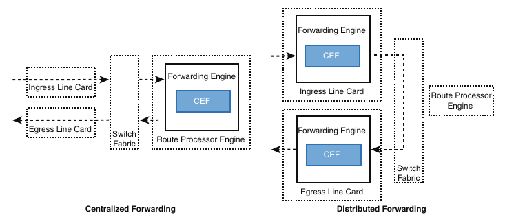
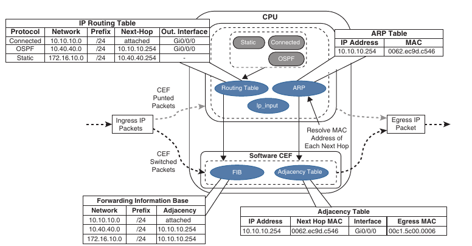

## Forwarding architectures for CCNP ENCOR

1. Process switching

2. Cisco Express Forwarding (CEF)

3. Ternary Content Addressable Memory (TCAM)

4. Centralised Forwarding

5. Distributed Forwarding

6. Software CEF

7. Hardware CEF

8. Stateful Switchover (SSO)

9. SDM templates

### Forwarding architectures

- The first Cisco routers would receive a packet, **remove** the layer2 information, and verify that a route for the destination address exist in the routing table. 

- If the route does not exist the packet would be **dropped**

- If a route was found, the router will **add** the layer2 information to the packet and forward it

- Advancements in technologies have streamlined the process so that routers do not **remove and add** Layer 2 addressing but simply **rewrite** the addresses

- IP packet switching or IP packet forwarding is a faster process for receiving an IP packet on an interface and making a decision to forward it or to drop it

- This process is simple and streamlined so that a router can forward a large number of packets

- First routers used a mechanism called process switching to switch the packets through the routers

- As network devices evolved, Cisco created **fast switching** and **Cisco Express Forwarding (CEF)** in order to improve the switching process for the routers to be able to handle large packet volumes

### Process swithing 

- Also reffered to as software switching or slow path

- Is a switching mechanism on which the general purpose CPU of a router is in charge for packet switching

- In IOS the ip_input process runs on the general purpose CPU to process incoming packets

- Process switching is the fallback for CEF because it is dedicated to process punted IP packets when they cannot be switched by CEF

- Types of packets requiring software handle:

	- Packets destined to the router (control traffic or routing protocols)
	
	- Packets that are too complex for hardware to handle (IP packets with IP options)
	
	- Packets that require extra information that is not currently known (ARP)
	
- Software switching is significantly slower than switching made in hardware

- NetIO(IOS ip_input) process is designed to handle a very small percentage of traffic handled by the system.

- Packets are hardware switched whenever possible

- The routing table is also known as Routing Information Base (RIB) and it is build from information obtained by routing protocols, connected and static routes 

- The ARP table is build from the information obtained from ARP protocol (IP address, MAC address)

### Cisco Express Forwarding

- CEF (Cisco Express Forwarding) is a Cisco proprietary switching mechanism developed to keep up with the evolving network infrastructures.

- It has been the default switching mechanism on Cisco routers since the 1990s

- Is the default switching mechanism used by all Cisco platforms that uses ASICs(Application Specific Integrated Circuits) and NPUs (Network Processing Units) for high packet throughput

- The general purpose CPUs on software-based and hardware-based routers are similar and perform all the same functions

- In software-based routers the CPU is in charge for all operations (including CEF - software CEF)

- In hardware-based routers CEF switching is made using the specialized forwarding engines implemented in the ASICs, Ternary Content Addressable Memory (TCAM) and NPUs (hardware CEF)

- Forwarding engines provides packet switching, forwarding and route lookup capabilities to the router.

### Ternary Content Addressable Memory

- The TCAM memory of a switch allows for matching and evaluation of a packet in more than one field

- TCAM is an extension of the CAM architecture, enhanced to allow upper layer processing (identifying Layer2 and Layer3 addresses), protocol, QoS markings and so on

- TCAM provides more flexibility that CAM does. CAM is binary(return result 0 or 1 in searches)

- TCAM provides the following search results:

	- 0 for true
	
	- 1 for false
	
	- X for do not care 

- TCAM entries are stored in Value, Mask, and Result format (VMR format) 

- The **Value** indicates the fields that should be searched (as IP addresses or protocol fields)

- The **Mask** indicates the field that is of interest and should be searched

- The **Result** indicates what action should be taken with a match on the value and mask

- Actions that can be selected:

	- Allow traffic
	
	- Drop traffic
	
	- Redirecting the flow to a QoS policer
	
	- Specifying a pointer to a different entry in the routing table
	
- Most switches maintain multiple TCAM entries so that all inbound/outbound/security and Layer2 and Layer3 forwarding decisisons occur all at once

- TCAM operates in hardware, providing faster processing and scalability than process switching

- This allows some features like ACLs to be processed at the same speed even if they have 10 entries or 500 entries

- Show the TCAM utilisation:

```
show platform tcam utilisation
```

### Centralised forwarding

- Given the low cost of general purpose CPUs, the price for sofrware-based routers become more affordable but at the expense of the total throughput

- When a route processor (RP) is equiped with a forwarding engine so that it can make all packet switching decisions - this is known as a **centralised forwarding architecture** 

- If the line cards are equiped with forwarding engines so that they can make packet swithing decisions without the intervention of the RP, this is known as **distributed forwarding architecture**

- For a centralised forwarding architecture, when the packet is received on the ingress line card it is transmitted to the forwarding engine on the RP

- The forwarding engine examines the packet headers end determines the packet should be forwarded out a port on the eggress line card, and sends the packet to the egress line card to be forwarded

### Distributed forwarding

- For a distributed forwarding architecture when a packet is received on an ingress line card it is forwarded to the local forwarding engine

- The forwarding engine performs packet lookup and if it determines that the outbound interface is local, the packet is forwarded out of a local interface

- If the outbound interface is located on a different line card the packet is send out of the switch fabric(also known as the backplane), directly to the egress line card baypassing the RP.

- See the image for comparison between centralised or distributed forwarding



### Software CEF 

- Software CEF (also known as **software Forwarding Information Base**) consists of the following components:

	- **Forwarding Information Base** 
	
		- The FIB is build from the routing table and contains the next hop IP address for each destination in the network
		
		- It keeps a mirror image of the forwarding information contained into the IP routing table
		
		- When a routing or topology change occur in the network these are reflected into the routing table, and the changes are reflected into the FIB
		
		- CEF uses the FIB to make IP destination prefix-based switching decisions
		
	- **Adjacency table**
	
		- Adjacency table - also known as Adjacency Information Base (AIB) contains the directly connected next hop IP addresses and their corresponding next-hop MAC addresses, as well as the ingress interface's MAC address
		
		- The Adjacency table is populated with data from the ARP table or other Layer 2 protocol tables
		
- Steps to build the CEF table from the routing table:



- First the FIB is build from the routing table

	- Routing table:
		```
		Connected	172.16.10.0/24	attached	g0/0/0
		OSPF	10.40.40.0/14	10.10.10.254	g0/0/0
		Static	172.16.10.0/24	10.40.40.254	- 
		```
- The 172.16.10.0/24 is a static route with the next hop 10.40.40.254 and depends on the OSPF route for prefix 10.40.40.0/24

- The Adjacency pointer in the FIB for 172.16.10.0/24 prefix is exactly the same OSPF uses for prefix 10.40.40.0/24 - 10.10.10.254

- The Adjacency table is then build using the ARP table and cross-referencing the MAC address in the MAC address table to identify the outbound interface

	- ARP table
	```
	10.10.10.254	0062.ec9d.c546
	```
- When an IP packet is received, the FIB is checked for a valid entry. If an entry is missing, it is a "glean" adjacency in CEF, which means that the packet should go to the CPU because CEF is unable to handle it - Only first packet in the series go to the CPU, in order to fill in the adjacency table

- Valid FIB entries continue processing by checking the adjacency table for each packet's destination IP address

- Missing adjacency entry invoke the ARP process. Once ARP is resolved, the complete CEF entry can be created

- As part of the packet forwarding process the packet's headers are rewritten:

	- The router overwrites the destination MAC address of the packet with the next hop router's MAC address from the adjacency table
	
	- Overwrites the source MAC address with the MAC address of the outgoing Layer3 interface
	
	- Decrements the IP time-to-live (TTL) field
	
	- Recomputes the IP header checksum
	
	- Delivers the packet to the next-hop router

- Packets processed by the CPU are subject to a rate-limiter or an invalid or incomplete adjacency exists, to prevent the starving of CPU cycles from other essential processes

- The TTL is a Layer3 loop prevention mechanism that reduce the packet's TTL by 1 for every Layer3 hop

- If a router receives a packet with TTL 0, the packet is discarded

### Hardware CEF

- The ASICs in hardware-based routers are expensive to design, produce and troubleshoot

- ASICs allow for very high packet rates but they are limited in their functionality because they are hardwired to perform specific tasks

- The routers are equiped with NPUs that are designed to overcome the inflexibility of the ASICs

- NPUs are programmable in their hardware, and their firmware can be changed with relative ease

- The main advantage of distributed forwarding architectures is that packet throughput performance is greatly improved by offloading the packet swithing responsabilities to the line cards

- Packet switching in distributed architecture platforms is done via distributed CEF (dCEF)

- dCEF is a mechanism in which the CEF data structures are downloaded to forwarding ASICs and the CPUs of all line cards so that they can participate in packet switching

- This allows the switching to be done at the distributed level thus increasing the packet throughput of the router

- Software CEF is not used in hardware-based platforms to perform packet swithing, as in software-based platforms, but it is used to program hardware CEF

### Stateful Swithover(SSO)

- Routers designed for high availability include hardware redundancy such as dual power supplies and route processors (RPs)

- An RP is responsible for learning the network topology and building the routing table (RIB)

- An RP failure can trigger routing protocol adjacencies to reset resulting in packet loss and network instability

- During an RP failure it may be more desirable to hide the failure and allow the router to continue forwarding packets using the previously programmed CEF table entries rather than temporarly drop packets while waiting for the secondary RP to reestablish the routing protocol adjacencies and rebuild the forwarding table

- *Stateful switchover (SSO)* is a redundancy feature that allows a Cisco router with 2 RPs to synchronize router configuration and control plane state information

- The process of mirroring information between RPs is referred to as *checkpointing*

- SSO-enabled routers always checkpoint line card operation and Layer 2 protocol states

- During a switchover, the standby RP imediately takes control and prevents basic problems such as interface link flaps

- However Layer 3 packet forwarding is disrupted without additional configuration

- The RP switchover triggers a routing protocol adjacency flap that clears the routing table

- When the routing table is cleared the CEF entries are purged, and traffic is no longer routed until the network topology is relearned and the forwarding table is reprogrammed

- Enabling **nonstop forwarding (NSF)** or **nonstop routing (NSR)** high availability capabilities informs the routers to maintain CEF entries for a short duration and continue forwarding packets through an RP until the control plane recovers

### SDM templates

- The capacity of MAC addresses that a switch needs compared with the number of routes that it holds depends on where it is deployed into the network

- The memory used for TCAM table is limited and statically allocated during the bootup sequence of the switch

- When a section of a hardware resource is full all processing overflow is send to the CPU, which seriously impact the performance on the switch

- The allocation ratios between various TCAM tables are stored and can be modified with Switching Database Manager (SDM) templates

- Multiple Cisco switches exist, and the SDM template can be configured on Catalyst 9000 series switches with the following command:

```
sdm prefer ?
	vlan
	advanced
	access
	default
	dual-ipv4-and-ipv6
```

- The switch must then be restarted with the `reload` command

- Every switch in the stack must be configured with the same SDM templates

- View the current SDM template

```
show sdm prefer
```
