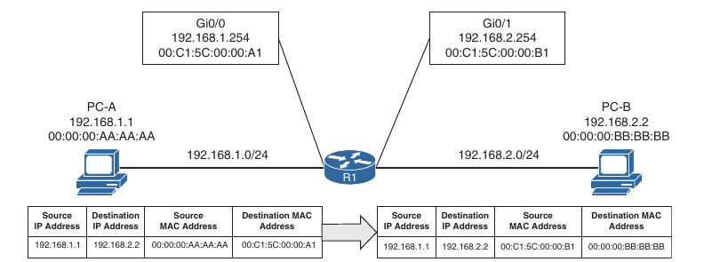

## VLANs for CCNP ENCOR

- Creating VLANs

```
conf t
 vlan 10
  name PCs
 vlan 20
  name Phones
 vlan 99
  name Guests
```

- Show commands for VLANs

```
show vlan
show vlan brief
show vlan id 10
show vlan summary
show vlan name PCs
```

- Assigning access ports to VLANs. Assignment can be done using VLAN ID or VLAN name

```
conf t
 interface g1/0/15
  switchport mode access
  switchport access vlan 10
 interface g1/0/16
  switchport mode access
  switchport access vlan name PCs
```

- Trunk ports carry traffic in multiple VLANs from a switch to another switch

```
conf t
 int g1/0/2
  switchport mode trunk
 int g1/0/3
  switchport mode trunk
```

- Show commands for trunks

```
show interfaces trunk
show run interface g1/0/3
```

- Native VLAN

```
conf t
 int g1/0/3
  switchport mode trunk
  switchport trunk native vlan 10
```

- Allowed VLANs

```
swithport trunk allowed vlan ?
 vlan_ids # comma separated
 add vlan_ids # comma separated
 none
 remove vlan_ids # comma separated
 except vlan_ids # comma separated
```

- View the MAC address table

```
show mac address-table
show mac address-table address mac_address
show mac address-table dynamic
show mac address-table vlan vlan_id 
```

- Define a static MAC address table for a port 

```
conf t
 mac address-table static 52:54:00:e7:ac:ff vlan 10 interface e0/1
```

- Configure MAC address table aging-time (default 300 seconds)

- If aging-time is set to 0, the entries never expire. They are removed only manually

```
conf t 
 mac address-table aging-time 150
```

- Disable MAC address dynamic learning on a switch

```
conf t
 no mac-address learning vlan 10,12-14
 exit
 
show mac address-table learning
```

- Clear the dynamic MAC address table

```
clear mac address-table dynamic ?
 interface <id>
 <mac_address>
 vlan <id>
```

- The MAC address table resides in the CAM table

- CAM uses high speed memory, faster than typical computer RAM, due to it's search techniques

- The CAM table provides a binary result for any query:

    - 0 for true
    
    - 1 for false

- Display switchport information for switch ports

```
show interface g0/1 switchport
```

- Show switchports information for all ports in the switch

```
show interfaces switchport
```

- Show status of all the switch ports

```
show interfaces status
```

## Layer 3 forwarding

- There are 2 methodologies for forwarding at layer 3

    - Forwarding traffic to devices on the same subnet
    
    - Forwarding traffic to devices on different subnets
    
### Local network forwarding

- Two devices on the same subnet communicate locally

- When data is encapsulated with it's Ip addresses information the device detects the destination is on the same network.

- Now it still needs to encapsulate the layer2 information. The source MAC address is known but the destination MAC address is not known

- Address Resolution Protocol(ARP) provides a method to map layer 3 IP addresses to layer 2 MAC addresses

- ARP stores the IP address of a host and it's corresponding MAC address

- ARP table contains entries for remote devices that the host communicated recently and that are on the same network

- It does not contain entries for devices in the remote networks, but contains an entry for the IP address of the next hop to reach the remote networks

- After a period of time the entries are removed from the ARP table

- The ARP response is unicast and includes the MAC and IP address of the requestor

- Viewing the ARP table on Cisco switches

```
show ip arp ?
    <mac address>
    <ip address>
    vlan <id>
    interface <interface>
```

### Packet routing

- Packets must be routed when they are on different networks

- As the data is encapsulated with the IP address, the device detects that the destination IP address is on a different subnet and must be routed

- The device checks it's local routing table to identify the next hop IP address which can be learned:

    - From a static route entry
    
    - From a default gateway route
    
    - Routes learned from a routing protocol
    
- The source device adds the source and destination layer 2 addresses

- The destination MAC address is needed, so the host adds the MAC address of the next hop device

- The next step is to send the packet at layer 2 to be processed

    - TODO: WHY is the Layer2 encapsulation taking place at Layer 3, shouldn't be the layer 2 who adds the MAC addresses to the packets?

- The next router receive the packet based on the destination MAC address, analyzes the destination IP address 

- Locates the network entry in it's routing table, identifies the exit interface

- Finds the destination MAC address for the destination device or for the next hop if the packet needs to be routed further

- The router modifies the source MAC address to the MAC address of it's outbound interface and modifies the destination MAC address to the one of the outgoing router (or next hop address)



### IP address assignment

- IPv4 address (32bits) or IPv6 addresses (128 bits) 

- For a device to route packets, IPv4 or IPv6 addresses must be configured on router or multilayer switch interfaces

- Configuring IPv4 addresses on the router interfaces

```
conf t
 interface g0/1
  ip address 192.168.0.1 255.255.255.0
  no shut
```

- Configuring multiple IPv4 addresses on an interface

    - The first command adds the primary IP address, you can add a secondary address with:
    ```
    conf t
     interface g0/1
     ip address 192.168.1.1 255.255.255.0 secondary
    ```
    - You can also add a secondary address to a vrf on the same interface
    ```
    conf t
     ip vrf test
     exit
    interface g0/1
     ip address 192.168.2.1 255.255.255.0 secondary vrf test
    ```
- Show commands

```
show ip interface g0/1
```

- Disable proxy arp on the interface

```
conf t
 interface g0/1
 no ip proxy-arp
```
- Assigning IPv6 addresses on an router interface

- You can assign multiple IPv6 addresses on the router interfaces without using the `secondary` keyword

```
conf t
 ipv6 unicast-routing
 int g0/1
  ipv6 address 2001:db8:10::254/64
  ipv6 address 2001:db8:10:172::254/64
```
- A routed interface is basically every interface on a router

### Routed subinterfaces

- It is possible to use only one router interface with multiple subinterfaces in order to route the traffic between multiple VLANs

- On the other side (on the switch), the port should be configured as a trunk port

- A subinterface is created by appending the period (.) and a numeric value after the period, after the interface name: `interface g1/0.30`

- Then the VLAN id is associated to the interface `encapsulation dot1q 30`

- Configuration:

```
conf t
 int g1/0
  no shutdown
 int g1/0.30
  encapsulation dot1q 30
```
- The subinterface number does not have to match with the VLAN ID, but if it does, it helps with the operational support

### Switched virtual interfaces

- Catalyst switches have the possibility to configure IP addresses on SVIs (switched virtual interfaces), also known as VLAN interfaces

- The SVI is defined by defining a VLAN on the switch and then creating an interface on that VLAN (interface vlan 10)

- The switch should have at least one interface in that VLAN in up state in order for the SVI interface to come up

- If a switch is a multilayer switch then the SVI can be used for routing packets without the need for an external router

- Creating and configuring a VLAN (SVI) interface

```
conf t
 vlan 10
  name PCS
 interface vlan 10
  ip address 10.0.0.100 255.255.255.0
  ipv6 address 2001:db8:10::1/64
  no shutdown
 interface vlan 99
  ip address 10.0.99.100 255.255.255.0
  ipv6 address 2001:db8:99::1/64
  no shutdown
```

### Routed switch ports

- Some network designs require point-to-point links between switches for routing

- Example:
    
    - Connecting a switch to a router using a transit VLAN, associate the port on the switch with vlan 2001, and then install a SVI for vlan 2001
    
- Possible problems:

    - Spanning tree may impact the topology
    
    - VLAN 2001 may exist somewhere else in the switched realm
    
- On a multilayer switch, switch port can be converted to a routed port

```
conf t
 interface g0/1
  no switchport
  ip address 10.20.20.1 255.255.255.0
  ipv6 address 2001:db8:20::1/64
  no shutdown
```

### Verification of IP addresses

- Verify the IP addresses on the interfaces:

```
show ip interface <interface ID>
show ip interface brief
show ip interface vlan <vlan id>
show ip interface brief | exclude unassigned # Exclude the ports that do not have IP addresses assigned
```

- Viewing the IPv6 addresses on the interfaces:

```
show ipv6 interface <interface ID>
show ipv6 interface brief
show ipv6 interface vlan <vlan id>
show ipv6 interface brief | exclude unassinged|GigabitEthernet # to exclude unassigned addresses
```
