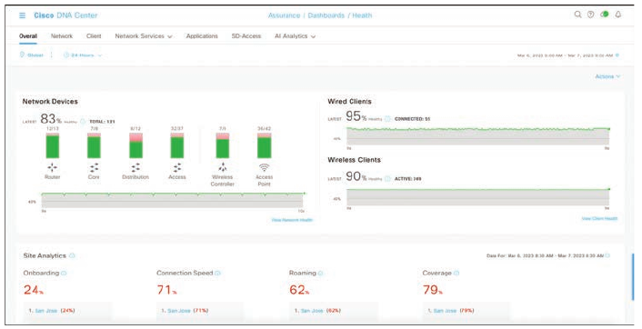
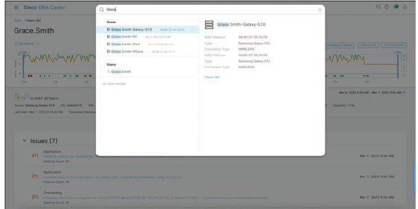
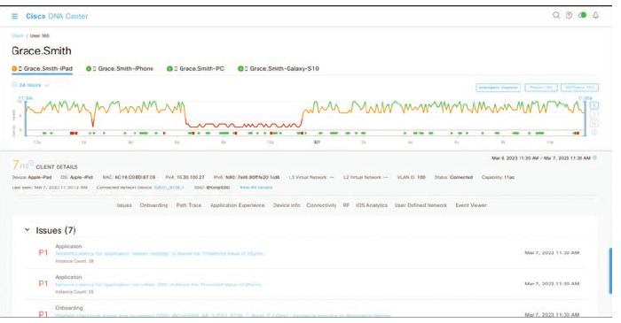
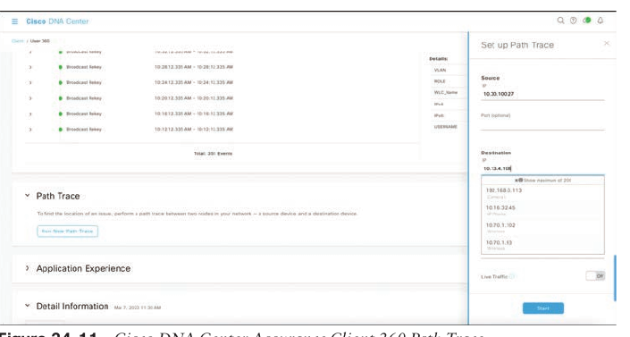
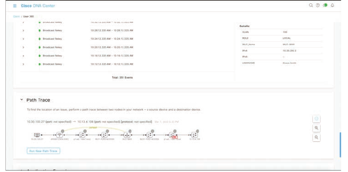
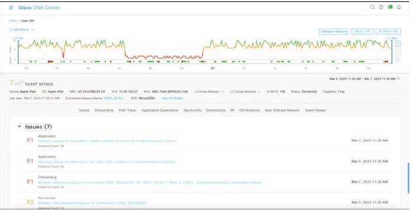
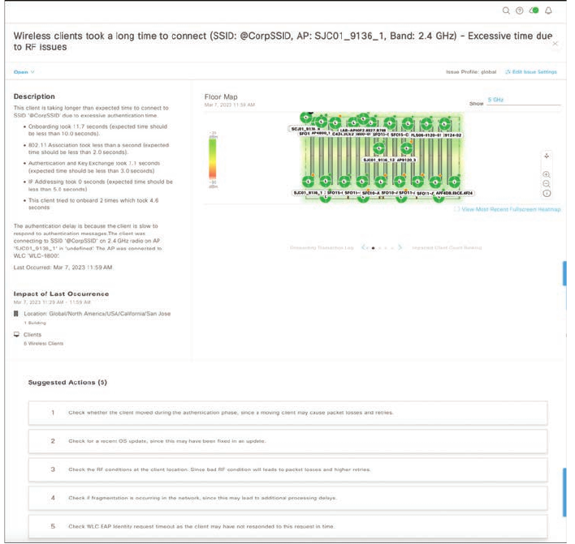

## Cisco DNA Center Assurance

- Networks have grown very complex

- The influx of mobile devices strains network resources and network operations staff

- Security has become one of the most important pieces of the network, and users expect a better experience

- Customers demand a simple way to manage Day 0 - 2 operations and require a scalable and simple approach to running the network

- Cisco DNA Center Assurance provides a tool for handling the most relevant customer requirements

- Traditionally, multiple management tools were required to meet the needs the needs of the business in terms of managing, operating and troubleshooting the network

- This all changes with Cisco DNA Center Assurance

- From a high level, Cisco DNA Center Assurance offers some of the following capabilities (as well as many more):

    - Cisco SD-Access Fabric Configuration

    - Software image management (SWIM)

    - Simplified provisioning for devices

    - Wireless network management

    - Simplified security policies

    - Configuration templates

    - Third-party integration

    - Network assurance

    - Plug and Play

- Workflows that Cisco DNA Center Assurance is designed to help businesses with

- Typically, when an issue arises in the network, a helpdesk ticket is created

- However, by the time the network operations team gets the ticket assigned, the issue is either resolved on it's own, or the information provided in the ticket to assist with troubleshooting the issue is stale or out of date

- Another typical scenario is that users say things like "last Tuesday, at 3 PM I wasn't able to get on the wireless network"

- In a traditional network, if someone says she had an issue last week, there isn't much that can be done about it.

- However, Cisco DNA Center Assurance has *Network Time Travel*, and it is as cool as it sounds

- Network Time Travel acts as a digital video recorder (DVR) for the network

- But rather than recording television and enabling the user to play back shows at later time, Network Time Travel records what is going on on the environment using streaming telemetry and can play back something that happened in the past

- It can also show how the network is performing now

- More information on Cisco DNA Center web interface can be found here: [DNA-Center-doc](https://www.cisco.com/c/en/us/td/docs/cloud-systems-management/network-automation-and-management/dna-center/2-3-5/user_guide/b_cisco_dna_center_ug_2_3_5/b_cisco_dna_center_ug_2_3_5_chapter_01.html)

- Cisco DNA Assurance is part of Cisco DNA Center

- Assurance takes 30+ years of Cisco Technical Assistance Center (TAC) experience and puts it into a tool that uses machine learning to diagnoze issues within a network

- In addition to finding and diagnosis the issues, Assurance gives guided remediation steps to fix the issue

- The Assurance tab is shown below

- Notice that it provides an overview of how the network is performing from an overall health perspective to a client perspective

- It includes both wired and wireless clients

- It also shows the top issues that are impacting the network

- The health scores for each section enable you to see how the network is performing at quick glance

- If a user walks up and has an issue, the typical approach is to ask the user's IP address or MAC address so that the network operations staff can jump from device to device, issuing multiple `show` commands to try to track down where the user is connected, as well as what issue might be causing the poor user experience

- With Assurance, if a user walks in or a helpdesk ticket comes in, a simple search of the user's name yields all the information necessary

- Cisco DNA Center integrates with many other tools, such as Active Directory, Identity Services Engine (ISE), ServiceNow and Infoblox

- This is possible because of the open APIs and SDKs available for Cisco DNA Center

- Because of the integration with Active Directory and ISE, all the context of the user is searchable in Cisco DNA Center

- Say that a user named Grace has a problem

- To search for Grace, you click the magnifying glass in the top right corner and type her name in the search box

- Because Cisco DNA Center is integrated with AD, all names populate as the search term is being typed

- As you type Grace's name, all users whose names start with G come up, then all users whose names start with GR, and so on

- Below is shown the search box, and Grace Smith as the matching user

- It also shows all the devices on the network associated with Grace Smith - in this case, a PC, an iPad, and an iPhone

- From this view you can do many different things

- You can click the user's name to see details related to that specific user

- You can click each device to see specifics about that device in the Client 360 view

- Below is shown the entire Client 360 view for the user Grace Smith

- Notice that all three of Grace's devices can be seen in this view, along with color-coded health scores for the devices

- The amount of information that this screen provides is thremendous

- Just for the selected iPad, you can see that the following pieces of information have been gathered automatically:

    - Device type

    - OS version

    - MAC address

    - IPv4 address

    - VLAN ID

    - Connectivity status

    - When the device was last seen on the network

    - What device it is connected to

    - Wireless SSID

    - Last known location

- Remember that all you have to do to get this information si search for Grace's name

- The timeline in the Client 360 view shows issues that have impacted Grace

- This is also a Network Time Travel capability

- Assurance records the telemetry, it is possible to search back in time to see exactly what has affected Grace

- The issues listed correlate with the timeline

- The issue list changes based on the timeline and what time period is being investigated

- Hovering over different times on the timeline allows you to see all the different issues that happened at various specific points in time

- At first glance, it is easy to see some application latency issues are impacting Grace's user experience

- Assurance has a tool called **Path Trace**, similar with ping or traceroute; the Run New Path Trace button is just underneath the issues listed in the client 360 view

- Path trace is a visual traceroute and diagnostic tool that can be run periodically or continuously with a specific referesh interval

- Below is shown a path trace being set up for Grace's iPad to John's PC, which are both wirelessly connected to the network

- This path trace is set to refresh every 30 seconds

- The path trace output shows a topology view of the traceroute, and in this instance, Path Trace has also detected that there is an Access Control List (ACL) blocking the traffic from Grace's iPad to John's PC

- By hovering over the ACL entry, the following information can be seen:

    - The ACL's name

    - The interface the ACL is applied to

    - The direction (ingress or egress)

    - The ACL result (permit or deny)

- Below is shown the ACL information found in this example

- By clicking on one of the issues found under Grace's 360 view, such as the P1 Onboarding issue, a user can investigate the root cause of the issue

- Below are shown the issues that are impacting Grace

- Below is shown a huge amount of useful information

- The impact of Last Occurence states that this issue is impacting one building and seven wireless clients

- There is also a detailed description of what is actually happening, along with suggested remediation steps to fix the issue

- A user can click the arrows to see options such as average client onboarding times and impacted clients along with names, MAC address information, and the access points they are connected to

- Remember the traditional flow that network operations teams use to troubleshoot - logging in to multiple devices and trying to track down the root cause of an issue using traceroute, ping, and show?

- In less than the time it takes those teams to log in to a single device and issue all those commands, you can use Cisco DNA Center Assurance to quickly see the root cause of an issue and how to fix it

- Thanks to open APIs and integration with helpdesk ticketing platforms such as ServiceNow, you can have all these issues, impacted locations, path trace information, and remediation steps automatically added to the helpdesk tickets so that when the network operations staff gets a ticket, they already know what the issue is and how to fix it - without having to chase down the issue by using `show` commands on multiple devices in the network environment
