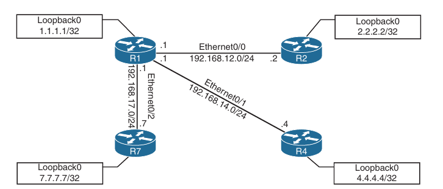

## Debugging

- Debugging can be a powerfull part of troubleshooting complex issues on a network

- Debugging is also informational

- Here we will see some basic OSPF debugging examples and see how to use debugging when trying to narrow down issues in a network

- One of the most common use case for debugging is when there is a need to see things at a deeper level (such as when routing protocols are having adjacency issues)

- There is a normal flow that is taken from a troubleshooting perspective, depending on the routing protocol

- However, there are times when these steps have been taken, and the issue is not evident

- With OSPF for example, when you're troubleshooting adjacency issues, it is very helpful to have debugging experience

- Using the simple topology shown below, debugging is used to fix a couple of issues in the OSPF area 0



- Some of the common OSPF adjacency issues can be resolved by using debugging:

    - MTU issues

    - Incorrect interface types

    - Improperly configured network mask

- From the output of the `show ip ospf neighbor` command on R1, it can be seen that the neighbor adjacency to R4 is in the INIT state

- It can be seen that the neighbor adjacency to R4 is in INIT state

- If the command is run after a few seconds, the state changes to EXCHANGE but quickly cycles back to the INIT state when the command is run again

```
R1#show ip ospf neighbor 

Neighbor ID     Pri   State           Dead Time   Address         Interface
7.7.7.7           1   FULL/BDR        00:00:36    192.168.17.7    Ethernet0/2
4.4.4.4           1   INIT/BDR        00:00:36    192.168.14.4    Ethernet0/1
2.2.2.2           1   FULL/BDR        00:00:37    192.168.12.2    Ethernet0/0
```

```
R1#show ip ospf neighbor 

Neighbor ID     Pri   State           Dead Time   Address         Interface
7.7.7.7           1   FULL/BDR        00:00:32    192.168.17.7    Ethernet0/2
4.4.4.4           1   EXCHANGE/BDR    00:00:38    192.168.14.4    Ethernet0/1
2.2.2.2           1   FULL/BDR        00:00:36    192.168.12.2    Ethernet0/0
```

```
R1#show ip ospf neighbor 

Neighbor ID     Pri   State           Dead Time   Address         Interface
7.7.7.7           1   FULL/BDR        00:00:36    192.168.17.7    Ethernet0/2
4.4.4.4           1   INIT/BDR        00:00:36    192.168.14.4    Ethernet0/1
2.2.2.2           1   FULL/BDR        00:00:37    192.168.12.2    Ethernet0/0
```

- A typical aproach to this line of troubleshooting is to log in to both devices and look at the logs or the running configuration

- Although this approach may reveal the issue at hand, it may not be the most efficient way to troubleshoot

- For example, a considerable amount of time is needed to log in to multiple devices and start combining through the configurations to see what may be missing or misconfigured

- Below, debugging is used on R1 to try to determine what the issue is

- Below is shown the output after the `debug ip ospf adj` command is issued

```
*Oct 25 19:24:13.559: OSPF-1 ADJ   Et0/1: Rcv DBD from 4.4.4.4 seq 0x2424 opt 0x52 flag 0x7 len 32  mtu 1300 state EXCHANGE
*Oct 25 19:24:13.559: OSPF-1 ADJ   Et0/1: Nbr 4.4.4.4 has smaller interface MTU
*Oct 25 19:24:13.559: OSPF-1 ADJ   Et0/1: Send DBD to 4.4.4.4 seq 0x2424 opt 0x52 flag 0x2 len 132
```

- This command is used to reveal messages that are exchanged during the OSPF adjacency process

- With one `debug` command, it was easy to determine the root cause of the failed adjacency

- The output of the `debug ip ospf adj` command on R1 clearly states that it received a Database Descriptor (DBD) packet from neighbor 4.4.4.4, and that the neighbor 4.4.4.4 has a smaller interface MTU of 1300

- If the same `debug` command were run on R4, the output would be similar but show the reverse

- Below is shown the output after the command `debug ip ospf adj` on R4

```
*Oct 25 19:38:46.135: OSPF-1 ADJ   Et0/0: Send DBD to 1.1.1.1 seq 0x15F opt 0x52 flag 0x7 len 32
*Oct 25 19:38:46.135: OSPF-1 ADJ   Et0/0: Retransmitting DBD to 1.1.1.1 [5]
*Oct 25 19:38:46.136: OSPF-1 ADJ   Et0/0: Rcv DBD from 1.1.1.1 seq 0x15F opt 0x52 flag 0x2 len 132  mtu 1500 state EXSTART
*Oct 25 19:38:46.136: OSPF-1 ADJ   Et0/0: Nbr 1.1.1.1 has larger interface MTU
```

- The output of the `debug` command shwos that R1 has an MTU size of 1500, which is larger that the locally configured MTU of 1300 on R4

- This is a really quick way of troubleshooting this type of issue with adjacency formation

- The second issue to cover with adjacency formation is OSPF network type mismatch, which is a common reason for neighbor adjacency issues

- Often this is simply a misconfiguration issue when setting up the network

- When the `debug ip ospf hello` command is used on R1, everything appears to be normal

- Hellos are sent to the multicast group 224.0.0.5 every 10 seconds

- Examples of the output of the command on R1:

```
R1#debug ip ospf hello 
OSPF hello debugging is on
R1#
*Oct 25 19:57:40.311: OSPF-1 HELLO Et0/0: Rcv hello from 2.2.2.2 area 0 192.168.12.2
R1#
*Oct 25 19:57:43.760: OSPF-1 HELLO Et0/2: Rcv hello from 7.7.7.7 area 0 192.168.17.7
R1#
*Oct 25 19:57:45.065: OSPF-1 HELLO Et0/1: Rcv hello from 4.4.4.4 area 0 192.168.14.4
R1#
*Oct 25 19:57:46.673: OSPF-1 HELLO Et0/0: Send hello to 224.0.0.5 area 0 from 192.168.12.1
*Oct 25 19:57:47.178: OSPF-1 HELLO Et0/1: Send hello to 224.0.0.5 area 0 from 192.168.14.1
*Oct 25 19:57:47.240: OSPF-1 HELLO Et0/2: Send hello to 224.0.0.5 area 0 from 192.168.17.1
R1#
*Oct 25 19:57:49.964: OSPF-1 HELLO Et0/0: Rcv hello from 2.2.2.2 area 0 192.168.12.2
R1#
*Oct 25 19:57:53.150: OSPF-1 HELLO Et0/2: Rcv hello from 7.7.7.7 area 0 192.168.17.7
R1#
*Oct 25 19:57:54.934: OSPF-1 HELLO Et0/1: Rcv hello from 4.4.4.4 area 0 192.168.14.4
R1#
*Oct 25 19:57:56.378: OSPF-1 HELLO Et0/1: Send hello to 224.0.0.5 area 0 from 192.168.14.1
*Oct 25 19:57:56.459: OSPF-1 HELLO Et0/0: Send hello to 224.0.0.5 area 0 from 192.168.12.1
*Oct 25 19:57:56.960: OSPF-1 HELLO Et0/2: Send hello to 224.0.0.5 area 0 from 192.168.17.1
R1#un all
All possible debugging has been turned off
```

- However, the situation is different if you issue the same `debug` command on R4

- Below is the output of the `debug` command on R4

```
*Oct 25 20:02:44.727: OSPF-1 HELLO Et0/0: Rcv hello from 1.1.1.1 area 0 192.168.14.1
*Oct 25 20:02:44.727: OSPF-1 HELLO Et0/0: Mismatched hello parameters from 192.168.14.1
*Oct 25 20:02:44.727: OSPF-1 HELLO Et0/0: Dead R 40 C 120, Hello R 10 C 30
R4(config-if)#
*Oct 25 20:02:53.714: OSPF-1 HELLO Et0/0: Send hello to 224.0.0.5 area 0 from 192.168.14.4
*Oct 25 20:02:53.916: OSPF-1 HELLO Et0/0: Rcv hello from 1.1.1.1 area 0 192.168.14.1
*Oct 25 20:02:53.916: OSPF-1 HELLO Et0/0: Mismatched hello parameters from 192.168.14.1
*Oct 25 20:02:53.916: OSPF-1 HELLO Et0/0: Dead R 40 C 120, Hello R 10 C 30
R4(config-if)#
*Oct 25 20:02:55.750: %OSPF-5-ADJCHG: Process 1, Nbr 1.1.1.1 on Ethernet0/0 from FULL to DOWN, Neighbor Down: Dead timer expired
```

- Based on the output you can see that the hello parameters are mismatched

- The output shows that R4 is receiving a dead interval of 40, while it has a configured dead interval of 120

- You can also see that the hello interval R4 is receiving is 10, and the configured hello interval is 30

- By default, the dead interval is 4 times the hello interval

- Different network types have different hello intervals and dead intervals

- Below table hightlights the different hello and dead interval times based on the different OSPF network types

```
Network Type                Hello Interval (in seconds)                         Dead interval (in seconds)

Broadcast                   10                                                  40

Non-broacast                30                                                  120

Point-to-point              10                                                  40

Point-to-multipoint         30                                                  120
```

- The issue could be simply mismatched network types or mismatched hello or dead intervals

- The `show ip ospf interface e0/1` shows that the configured network types and hello and dead intervals are:

```
R4(config-if)#do sh ip ospf int e0/0
Ethernet0/0 is up, line protocol is up 
  Internet Address 192.168.14.4/24, Interface ID 2, Area 0
  Attached via Network Statement
  Process ID 1, Router ID 4.4.4.4, Network Type POINT_TO_MULTIPOINT, Cost: 10
  Topology-MTID    Cost    Disabled    Shutdown      Topology Name
        0           10        no          no            Base
  Transmit Delay is 1 sec, State POINT_TO_MULTIPOINT
  Timer intervals configured, Hello 30, Dead 120, Wait 120, Retransmit 5
    oob-resync timeout 120
    Hello due in 00:00:23
  Supports Link-local Signaling (LLS)
  Cisco NSF helper support enabled
  IETF NSF helper support enabled
  Can be protected by per-prefix Loop-Free FastReroute
  Can be used for per-prefix Loop-Free FastReroute repair paths
  Not Protected by per-prefix TI-LFA
  Index 1/2/2, flood queue length 0
  Next 0x0(0)/0x0(0)/0x0(0)
  Last flood scan length is 0, maximum is 0
  Last flood scan time is 0 msec, maximum is 0 msec
  Neighbor Count is 0, Adjacent neighbor count is 0 
  Suppress hello for 0 neighbor(s)
```

- Simply changing the network type to broadcast on R4 interface e0/0 back to the default of broadcast fixes the adjacency issue in this case

- The reason is that R1 is configured as broadcast, and now the hello and dead intervals will match

- Below is shown the `ip ospf network broadcast` command issued to change the network type to broadcast on the Ethernet 0/0 interface and the neighbor adjacency coming up

- It is also verified with `do show ip ospf neighbor` command

```
R4(config)#int e0/0
R4(config-if)#ip ospf network broadcast
*Oct 26 14:11:34.729: %OSPF-5-ADJCHG: Process 1, Nbr 1.1.1.1 on Ethernet0/0 from LOADING to FULL, Loading Done
```

```
R1(config-if)#do sh ip ospf nei

Neighbor ID     Pri   State           Dead Time   Address         Interface
7.7.7.7           0   FULL/  -        00:00:30    192.168.17.7    Ethernet0/2
4.4.4.4           1   FULL/BDR        00:00:30    192.168.14.4    Ethernet0/1
2.2.2.2           0   FULL/  -        00:00:39    192.168.12.2    Ethernet0/0
```

- The final case for using debugging to solve OSPF adjacency issues involves improper configuration of IP addresses and subnet masks on an OSPF interface

- To troubleshoot this without having to look through running configurations or at a specific interface, you can use the same `show ip ospf hello` command covered earlier

- It indicates that there is no OSPF adjacency to R4, when there certainly should be one

```
R1#show ip ospf neighbor 

Neighbor ID     Pri   State           Dead Time   Address         Interface
7.7.7.7           0   FULL/  -        00:00:39    192.168.17.7    Ethernet0/2
2.2.2.2           0   FULL/  -        00:00:39    192.168.12.2    Ethernet0/0
```

- `debug ip ospf hello` and `debug ip ospf adj` commands have been enabled on R1

```
1#
*Oct 26 14:29:36.224: OSPF-1 HELLO Et0/0: Rcv hello from 2.2.2.2 area 0 192.168.12.2
R1#
*Oct 26 14:29:38.628: OSPF-1 HELLO Et0/2: Send hello to 224.0.0.5 area 0 from 192.168.17.1
*Oct 26 14:29:39.441: OSPF-1 HELLO Et0/2: Rcv hello from 7.7.7.7 area 0 192.168.17.7
R1#
*Oct 26 14:29:39.937: OSPF-1 HELLO Et0/1: Send hello to 224.0.0.5 area 0 from 192.168.14.1
*Oct 26 14:29:40.533: OSPF-1 HELLO Et0/0: Send hello to 224.0.0.5 area 0 from 192.168.12.1
R1#
*Oct 26 14:29:41.942: OSPF-1 HELLO Et0/1: Rcv hello from 4.4.4.4 area 0 192.168.14.4
*Oct 26 14:29:41.942: OSPF-1 HELLO Et0/1: Mismatched hello parameters from 192.168.14.4
*Oct 26 14:29:41.942: OSPF-1 HELLO Et0/1: Dead R 40 C 40, Hello R 10 C 10 Mask R 255.255.255.248 C 255.255.255.0
R1#
*Oct 26 14:29:46.100: OSPF-1 HELLO Et0/0: Rcv hello from 2.2.2.2 area 0 192.168.12.2
R1#
*Oct 26 14:29:48.386: OSPF-1 HELLO Et0/2: Send hello to 224.0.0.5 area 0 from 192.168.17.1
*Oct 26 14:29:49.337: OSPF-1 HELLO Et0/2: Rcv hello from 7.7.7.7 area 0 192.168.17.7
R1#
*Oct 26 14:29:49.440: OSPF-1 HELLO Et0/1: Send hello to 224.0.0.5 area 0 from 192.168.14.1
R1#
*Oct 26 14:29:50.505: OSPF-1 HELLO Et0/0: Send hello to 224.0.0.5 area 0 from 192.168.12.1
R1#
*Oct 26 14:29:51.914: OSPF-1 HELLO Et0/1: Rcv hello from 4.4.4.4 area 0 192.168.14.4
*Oct 26 14:29:51.914: OSPF-1 HELLO Et0/1: Mismatched hello parameters from 192.168.14.4
*Oct 26 14:29:51.914: OSPF-1 HELLO Et0/1: Dead R 40 C 40, Hello R 10 C 10 Mask R 255.255.255.248 C 255.255.255.0
R1#un all
```

- `Mismatched hello parameters from 192.168.14.4` message can indicate that something is wrong between R1 and R4

- Issuing the same `debug` commands on R4, we can see the issue is mismatched hello parameters

```
R4#
*Oct 26 14:32:51.546: OSPF-1 HELLO Et0/0: Rcv hello from 1.1.1.1 area 0 192.168.14.1
*Oct 26 14:32:51.546: OSPF-1 HELLO Et0/0: Mismatched hello parameters from 192.168.14.1
*Oct 26 14:32:51.546: OSPF-1 HELLO Et0/0: Dead R 40 C 40, Hello R 10 C 10 Mask R 255.255.255.0 C 255.255.255.248
R4#
*Oct 26 14:32:52.638: OSPF-1 HELLO Et0/0: Send hello to 224.0.0.5 area 0 from 192.168.14.4
R4#
*Oct 26 14:33:01.532: OSPF-1 HELLO Et0/0: Rcv hello from 1.1.1.1 area 0 192.168.14.1
*Oct 26 14:33:01.532: OSPF-1 HELLO Et0/0: Mismatched hello parameters from 192.168.14.1
*Oct 26 14:33:01.532: OSPF-1 HELLO Et0/0: Dead R 40 C 40, Hello R 10 C 10 Mask R 255.255.255.0 C 255.255.255.248
*Oct 26 14:33:02.503: OSPF-1 HELLO Et0/0: Send hello to 224.0.0.5 area 0 from 192.168.14.4
```

- R4 is receiving a network prefix of 255.255.255.0, but it has a network mask of 255.255.255.248 locally configured

- This causes an adjacency issue even if the hello and dead intervals are configured to match

- To resolve this issue, the network mask on the E0/0 interface on R4 needs to be changed to match the one that R1 has configured and is sending to R4 through ODPF hellos

- Below we can see the network mask being changed on R4's E0/0 interface and the OSPF adjacency coming up

- This is then verified with the `do show ip ospf neighbor` command

```
R4#conf t
Enter configuration commands, one per line.  End with CNTL/Z.
R4(config)#int e0/0
R4(config-if)#ip add
R4(config-if)#ip address 192.168.14.4 255.255.255.0
R4(config-if)#
*Oct 26 14:39:30.960: %OSPF-5-ADJCHG: Process 1, Nbr 1.1.1.1 on Ethernet0/0 from LOADING to FULL, Loading Done
R4(config-if)#
R4(config-if)#
R4(config-if)#
R4(config-if)#do sh ip ospf nei

Neighbor ID     Pri   State           Dead Time   Address         Interface
1.1.1.1           1   FULL/DR         00:00:34    192.168.14.1    Ethernet0/0
R4(config-if)#
```

#### Conditional Debugging

- Debugging can be very informational

- Sometimes, there is too much information, and there is important to know how to restrict the `debug` commands and limit the messages to what is appropriate for troubleshooting the issue at hand

- Often, network engineers or operators are intimidated by the sheer number of messages that can be seen while debugging

- In the past, routers and switches didn't have as much memory and CPU as they do today, and running `debug` (especially running multiple `debug` commands simultaneously) could cause a network device to become unresponsive or crash, and it could even cause an outage

- Conditional debugging can be used to limit the scope of the messages that are being returned to the console or syslog server

- A great example of this is the `debug ip packet` command

- Issuing this command on a router that is in production, could send back a tremendous number of messages

- One way to alleviate this issue is to attach an access list to the `debug` command to limit the scope of messages to the source and destination specified within the access list

- For example, say that you configure an access list that focuses on any traffic to or from the 192.168.14.0/24 network

- This can be done using standard or extended access lists

- The options for the `debug ip packet` command are as follows:

    - <1-199>: access list 

    - <1300-2699>: access list with expanded range

    - detail: more debugging detail

- To showcase the power of conditional debugging, below is used an access list to limit the messages to the console and filter solely on traffic to and from the 192.168.14.0/24 subnet

```
R1(config)#access-list 100 permit ip any 192.168.14.0 0.0.0.255
R1(config)#access-list 100 permit ip 192.168.14.0 0.0.0.255 any

R1(config)#do debug ip packet 100
IP packet debugging is on for access list 100
R1(config)#
*Oct 26 15:01:09.389: IP: s=192.168.14.1 (local), d=224.0.0.5 (Ethernet0/1), len 100, sending broad/multicast
*Oct 26 15:01:09.389: IP: s=192.168.14.1 (local), d=224.0.0.5 (Ethernet0/1), len 100, sending full packet
R1(config)#
*Oct 26 15:01:11.253: IP: s=192.168.14.4 (Ethernet0/1), d=224.0.0.5 (nil), len 100, rcvd 0
*Oct 26 15:01:11.253: IP: s=192.168.14.4 (Ethernet0/1), d=224.0.0.5 (nil), len 100, input feature, packet consumed, MCI Check(110), rtype 0, forus FALSE, sendself FALSE, mtu 0, fwdchk FALSE
R1(config)#
*Oct 26 15:01:19.041: IP: s=192.168.14.1 (local), d=224.0.0.5 (Ethernet0/1), len 100, sending broad/multicast
*Oct 26 15:01:19.041: IP: s=192.168.14.1 (local), d=224.0.0.5 (Ethernet0/1), len 100, sending full packet
R1(config)#
*Oct 26 15:01:20.611: IP: s=192.168.14.4 (Ethernet0/1), d=224.0.0.5 (nil), len 100, rcvd 0
*Oct 26 15:01:20.612: IP: s=192.168.14.4 (Ethernet0/1), d=224.0.0.5 (nil), len 100, input feature, packet consumed, MCI Check(110), rtype 0, forus FALSE, sendself FALSE, mtu 0, fwdchk FALSE
R1(config)#
*Oct 26 15:01:28.643: IP: s=192.168.14.1 (local), d=224.0.0.5 (Ethernet0/1), len 100, sending broad/multicast
*Oct 26 15:01:28.643: IP: s=192.168.14.1 (local), d=224.0.0.5 (Ethernet0/1), len 100, sending full packet
R1(config)#
*Oct 26 15:01:30.357: IP: s=192.168.14.4 (Ethernet0/1), d=224.0.0.5 (nil), len 100, rcvd 0
*Oct 26 15:01:30.357: IP: s=192.168.14.4 (Ethernet0/1), d=224.0.0.5 (nil), len 100, input feature, packet consumed, MCI Check(110), rtype 0, forus FALSE, sendself FALSE, mtu 0, fwdchk FALSE
R1(config)#
*Oct 26 15:01:37.105: IP: s=192.168.14.4 (Ethernet0/1), d=192.168.14.1 (nil), len 100, input feature, MCI Check(110), rtype 0, forus FALSE, sendself FALSE, mtu 0, fwdchk FALSE
*Oct 26 15:01:37.106: IP: s=192.168.14.4 (Ethernet0/1), d=192.168.14.1 (nil), len 100, rcvd 2
*Oct 26 15:01:37.106: IP: s=192.168.14.4 (Ethernet0/1), d=192.168.14.1 (nil), len 100, stop process pak for forus packet
*Oct 26 15:01:37.106: IP: tableid=0, s=192.168.14.4 (Ethernet0/1), d=192.168.14.1 (Ethernet0/1) nexthop=192.168.14.1, routed via RIB
*Oct 26 15:01:37.106: IP: tableid=0, s=192.168.14.1 (local), d=192.168.14.4 (Ethernet0/1) nexthop=192.168.14.4, routed via FIB
*Oct 26 15:01:37.106: IP: s=192.168.14.1 (local), d=192.168.14.4 (Ethernet0/1), len 100, sending
*Oct 26 15:01:37.106: IP: s=192.168.14.1 (local), d=192.168.14.4 (Ethernet0/1), len 100, sending full packet
*Oct 26 15:01:37.107: IP: s=192.168.14.4 (Ethernet0/1), d=192.168.14.1 (nil), len 100, input feature, MCI Check(110), rtype 0, forus FALSE, sendself FALSE, mtu 0, fwdchk FALSE
*Oct 26 15:01:37.107: IP: s=192.168.14.4 (Ethernet0/1), d=192.168.14.1 (nil), len 100, rcvd 2
*Oct 26 15:01:37.107: IP: s=192.168.14.4 (Ethernet0/1), d=192.168.14.1 (nil), len 100, stop process pak for forus packet
*Oct 26 15:01:37.107: IP: tableid=0, s=192.168.14.4 (Ethernet0/1), d=192.168.14.1 (Ethernet0/1) nexthop=192.168.14.1, routed via RIB
*Oct 26 15:01:37.107: IP: tableid=0, s=192.168.14.1 (local), d=192.168.14.4 (Ethernet0/1) nexthop=192.168.14.4, routed via FIB
*Oct 26 15:01:37.107: IP: s=192.168.14.1 (local), d=192.168.14.4 (Ethernet0/1), len 100, sending
*Oct 26 15:01:37.107: IP: s=192.168.14.1 (local), d=192.168.14.4 (Ethernet0/1), len 100, sending full packet
*Oct 26 15:01:37.109: IP: s=192.168.14.4 (Ethernet0/1), d=192.168.14.1 (nil), len 100, input feature, MCI Check(110), rtype 0, forus FALSE, sendself FALSE, mtu 0, fwdchk FALSE
*Oct 26 15:01:37.109: IP: s=192.168.14.4 (Ethernet0/1), d=192.168.14.1 (nil), len 100, rcvd 2
*Oct 26 15:01:37.109: IP: s=192.168.14.4 (Ethernet0/1), d=192.168.14.1 (nil), len 100, stop process pak for forus packet
*Oct 26 15:01:37.109: IP: tableid=0, s=192.168.14.4 (Ethernet0/1), d=192.168.14.1 (Ethernet0/1) nexthop=192.168.14.1, routed via RIB
*Oct 26 15:01:37.109: IP: tableid=0, s=192.168.14.1 (local), d=192.168.14.4 (Ethernet0/1) nexthop=192.168.14.4, routed via FIB
*Oct 26 15:01:37.109: IP: s=192.168.14.1 (local), d=192.168.14.4 (Ethernet0/1), len 100, sending
*Oct 26 15:01:37.109: IP: s=192.168.14.1 (local), d=192.168.14.4 (Ethernet0/1), len 100, sending full packet
*Oct 26 15:01:37.110: IP: s=192.168.14.4 (Ethernet0/1), d=192.168.14.1 (nil), len 100, input feature, MCI Check(110), rtype 0, forus FALSE, sendself FALSE, mtu 0, fwdchk FALSE
*Oct 26 15:01:37.110: IP: s=192.168.14.4 (Ethernet0/1), d=192.168.14.1 (nil), len 100, rcvd 2
*Oct 26 15:01:37.110: IP: s=192.168.14.4 (Ethernet0/1), d=192.168.14.1 (nil), len 100, stop process pak for forus packet
*Oct 26 15:01:37.110: IP: tableid=0, s=192.168.14.4 (Ethernet0/1), d=192.168.14.1 (Ethernet0/1) nexthop=192.168.14.1, routed via RIB
*Oct 26 15:01:37.110: IP: tableid=0, s=192.168.14.1 (local), d=192.168.14.4 (Ethernet0/1) nexthop=192.168.14.4, routed via FIB
*Oct 26 15:01:37.110: IP: s=192.168.14.1 (local), d=192.168.14.4 (Ethernet0/1), len 100, sending
*Oct 26 15:01:37.110: IP: s=192.168.14.1 (local), d=192.168.14.4 (Ethernet0/1), len 100, sending full packet
*Oct 26 15:01:37.111: IP: s=192.168.14.4 (Ethernet0/1), d=192.168.14.1 (nil), len 100, input feature, MCI Check(110), rtype 0, forus FALSE, sendself FALSE, mtu 0, fwdchk FALSE
*Oct 26 15:01:37.111: IP: s=192.168.14.4 (Ethernet0/1), d=192.168.14.1 (nil), len 100, rcvd 2
*Oct 26 15:01:37.111: IP: s=192.168.14.4 (Ethernet0/1), d=192.168.14.1 (nil), len 100, stop process pak for forus packet
R1(config)#
*Oct 26 15:01:37.111: IP: tableid=0, s=192.168.14.4 (Ethernet0/1), d=192.168.14.1 (Ethernet0/1) nexthop=192.168.14.1, routed via RIB
*Oct 26 15:01:37.112: IP: tableid=0, s=192.168.14.1 (local), d=192.168.14.4 (Ethernet0/1) nexthop=192.168.14.4, routed via FIB
*Oct 26 15:01:37.112: IP: s=192.168.14.1 (local), d=192.168.14.4 (Ethernet0/1), len 100, sending
*Oct 26 15:01:37.112: IP: s=192.168.14.1 (local), d=192.168.14.4 (Ethernet0/1), len 100, sending full packet
R1(config)#
*Oct 26 15:01:38.257: IP: s=192.168.14.1 (local), d=224.0.0.5 (Ethernet0/1), len 100, sending broad/multicast
*Oct 26 15:01:38.257: IP: s=192.168.14.1 (local), d=224.0.0.5 (Ethernet0/1), len 100, sending full packet
R1(config)#
*Oct 26 15:01:39.568: IP: s=192.168.14.4 (Ethernet0/1), d=224.0.0.5 (nil), len 100, rcvd 0
*Oct 26 15:01:39.568: IP: s=192.168.14.4 (Ethernet0/1), d=224.0.0.5 (nil), len 100, input feature, packet consumed, MCI Check(110), rtype 0, forus FALSE, sendself FALSE, mtu 0, fwdchk FALSE
R1(config)#
*Oct 26 15:01:48.109: IP: s=192.168.14.1 (local), d=224.0.0.5 (Ethernet0/1), len 100, sending broad/multicast
*Oct 26 15:01:48.109: IP: s=192.168.14.1 (local), d=224.0.0.5 (Ethernet0/1), len 100, sending full packet
R1(config)#
*Oct 26 15:01:49.560: IP: s=192.168.14.4 (Ethernet0/1), d=224.0.0.5 (nil), len 100, rcvd 0
*Oct 26 15:01:49.560: IP: s=192.168.14.4 (Ethernet0/1), d=224.0.0.5 (nil), len 100, input feature, packet consumed, MCI Check(110), rtype 0, forus FALSE, sendself FALSE, mtu 0, fwdchk FALSE
*Oct 26 15:01:57.503: IP: s=192.168.14.1 (local), d=224.0.0.5 (Ethernet0/1), len 100, sending broad/multicast
*Oct 26 15:01:57.503: IP: s=192.168.14.1 (local), d=224.0.0.5 (Ethernet0/1), len 100, sending full packet
R1(config)#do un all
All possible debugging has been turned off
R1(config)#
*Oct 26 15:01:59.036: IP: s=192.168.14.4 (Ethernet0/1), d=224.0.0.5 (nil), len 100, rcvd 0
*Oct 26 15:01:59.036: IP: s=192.168.14.4 (Ethernet0/1), d=224.0.0.5 (nil), len 100, input feature, packet consumed, MCI Check(110), rtype 0, forus FALSE, sendself FALSE, mtu 0, fwdchk FALSE
R1(config)#
```

- Another common method of conditional debugging is to debug on a specific interface

- This capability is extremely useful when trying to narrow down the packet flow between two hosts

- Imagine that a network engineer is trying to debug a traffic flow between R1's E0/1 interface with source IP address 192.168.14.1/24 that is destined to R4's L0 interface with IP address 4.4.4.4/32

- One way to do this would certainly be to change the access list 100 to reflect these source and destination IP addresses

- However, because the access list is looking for any traffic sourced or destined to the 192.168.14.0/24 network, this traffic flow would fail into matching that access list

- Using conditional debugging on the L0 interface of R4 would be a simple way of meeting these requirements

- Below is shown the conditional debugging on R4

- When that is in place, a ping on R1 sourced from E0/1 interface matches the conditions set to R4

```
R4(config)#access-list 100 permit ip any 192.168.14.0 0.0.0.255
R4(config)#access-list 100 permit ip 192.168.14.0 0.0.0.255 any

R4#debug interface l0
Condition 1 set

R4#debug ip packet 100

R4#show debug
Generic IP:
  IP packet debugging is on for access list 100
Packet Infra debugs:

Ip Address                                               Port
------------------------------------------------------|----------


Condition 1: interface Lo0 (1 flags triggered)
        Flags: Lo0

R4#
*Oct 26 15:39:58.684: IP: s=192.168.14.1 (Ethernet0/0), d=4.4.4.4 (nil), len 100, stop process pak for forus packet
*Oct 26 15:39:58.684: IP: tableid=0, s=192.168.14.1 (Ethernet0/0), d=4.4.4.4 (Loopback0) nexthop=4.4.4.4, routed via RIB
*Oct 26 15:39:58.685: IP: s=192.168.14.1 (Ethernet0/0), d=4.4.4.4 (nil), len 100, stop process pak for forus packet
*Oct 26 15:39:58.685: IP: tableid=0, s=192.168.14.1 (Ethernet0/0), d=4.4.4.4 (Loopback0) nexthop=4.4.4.4, routed via RIB
*Oct 26 15:39:58.686: IP: s=192.168.14.1 (Ethernet0/0), d=4.4.4.4 (nil), len 100, stop process pak for forus packet
R4#
*Oct 26 15:39:58.686: IP: tableid=0, s=192.168.14.1 (Ethernet0/0), d=4.4.4.4 (Loopback0) nexthop=4.4.4.4, routed via RIB
*Oct 26 15:39:58.687: IP: s=192.168.14.1 (Ethernet0/0), d=4.4.4.4 (nil), len 100, stop process pak for forus packet
*Oct 26 15:39:58.687: IP: tableid=0, s=192.168.14.1 (Ethernet0/0), d=4.4.4.4 (Loopback0) nexthop=4.4.4.4, routed via RIB
*Oct 26 15:39:58.687: IP: s=192.168.14.1 (Ethernet0/0), d=4.4.4.4 (nil), len 100, stop process pak for forus packet
*Oct 26 15:39:58.687: IP: tableid=0, s=192.168.14.1 (Ethernet0/0), d=4.4.4.4 (Loopback0) nexthop=4.4.4.4, routed via RIB
R4#

R4#un all
All possible debugging has been turned off
R4#undebug interface l123
This condition is the last interface condition set.
Removing all conditions may cause a flood of debugging
messages to result, unless specific debugging flags
are first removed.

Proceed with removal? [yes/no]: yes
Condition 1 has been removed
```

- It is important to note that even if all debugging has been turned off using the `undebug all` command, the interface conditions set for L0 on R4 remain

- The way to remove this condition is to use `undebug interface l0` command on R4

- When this is executed, the user is asked to confirm whether to proceed with removing the condition (on IOSv this happens, on IOL, it removes the condition automatically without asking)

```
R4#debug int l0
Condition 1 set

R4#debug ip packet 

R4#un all
1 conditions have been removed
All possible debugging has been turned off
```

- Although many more debug operations are available, understanding the fundamental steps outlined here, helps take the fear out of using this powerful diagnostic tool when troubleshooting issues that arise in the network environment

- When you're issuing debugging commands, it is best to practice within a test environment prior to using them in production

- When you are confortable with these outcomes, you can take these commands in production
