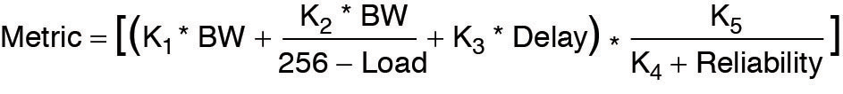

## EIGRP - Enhanced Interior Gateway Routing Protocol

1. EIGRP fundamentals

2. Path Metric Calculation

3. Failure Detection and Timers

4. Route Summarization

- *Enhanced Interior Gateway Routing Protocol (EIGRP)* is an enhanced distance vector routing protocol commonly used in enterprise networks

- Initially, it was a Cisco proprietary protocol, but is was released to the Internet Engineering Task Force (IETF) through RFC 7868, which was ratified in May 2016

### EIGRP Fundamentals

- EIGRP overcomes the deficiencies of other distance vector routing protocols like RIP with features such as unequal-cost load balancing, support for networks 255 hops away, and rapid convergence features

- EIGRP uses a *diffusing update algorithm (DUAL)* to identify network paths and enable fast convergence using precalculated loop-free backup paths

- Most distance vector routing protocols use hop count as metric for routing decisions 

- However, using hop count for path selection does not take into account link speed and total delay

- EIGRP adds to the route selection algorithm logic that uses factors outside of hop count

#### Autonomous Systems

- A router can run multiple EIGRP processes. Each process operates under the context of an *autonomous system*, which represents a common routing domain

- Routers with the same domain use the same metric calculation formula and exchange routes with members of the same autonomous system

- An EIGRP autonomous system should not be confused with a Border Gateway Protocol (BGP) autonomous system


- In the above figure, EIGRP autonomous system (AS) 100 consists of R1, R2, R3 and R4, and EIGRP AS 200 consists of R3, R5 and R6

- Each EIGRP process correlates to a specific autonomous system and maintains an independent EIGRP topology table

- R1 does not have knowledge of routes from AS 200 because it is different from it's own autonomous system, AS 100

- R3 is able to participate in both autonomous systems and by default does not transfer routes learned from one autonomous system into a different autonomous system

#### EIGRP Terminology

- Core concepts of EIGRP and the path selection process in EIGRP


- The above topology shows R1 calculating the best path and alternative loop-free paths to the 10.4.4.0/24 network

- Each value written on the links represents a particular link's calculated metric for a segment, based on the bandwidth and delay

- EIGRP terminology

- **Successor route**: The route with the lowest path metric to reach a destination. The successor route for R1 to reach 10.4.4.0/24 on R4 is R1-> R3 -> R4

- **Successor**: The first next-hop router for the successor route. The successor for 10.4.4.0/24 network is R3

- **Feasible Distance (FD)**: The metric value for the lowest-metric path to reach the destination. The feasible distance is calculated locally using the formula shown in the "Path Metric Calculation" section - later

- The FD calculated by R1 for 10.4.4.0/24 network is 3328 (that is, 256 + 256 + 2816)

- **Reported Distance (RD)**: The distance reported by a router to reach a prefix. The reported distance value is the feasible distance for the advertising router (the cost of the path as it is reported by my neighbor and can be seen in the captured packets). R3 advertises the 10.4.4.0/24 prefix with an RD of 3072. R4 advertises the 10.4.4.0/24 prefix to R1 and R2 with an RD of 2816

- **Feasibility condition**: A condition under which, for a route to be considered a backup route, the reported distance received for that route must be less than the feasible distance calculated locally. This logic guarantees a loop-free path

- **Feasible successor**: A route that satisfies the feasibility condition and is maintained as a backup route. The feasibility condition ensures that the backup path is loop-free

- The route R1->R4 is the feasible successor because RD 2816 is lower than the FD 3328 for the R1 -> R3 -> R4 path

#### Topology Table

- EIGRP contains a topology table that makes it different from a "true" distance vector routing protocol

- EIGRP's topology table is a vital component to DUAL and contains information to identify loop-free backup routes

- The topology table contains all the network prefixes advertised within an EIGRP autonomous system. Each entry in the table contains the following:

    - Network prefix

    - EIGRP neighbors that have advertised that prefix

    - Metrics from each neighbor (for example, reported distance, hop count)

    - Values used to calculate the metric (for example load, reliability, total delay, maximum bandwidth)

- Topology table for the 10.4.4.0/24 network and explaining the topology table

```
show ip eigrp topology
EIGRP-IPv4 Topology Table for AS(100)/ID(192.168.1.1)
Codes: P - Passive, A - Active, U - Update, Q - Query, R - Reply
    r - reply Status, s - sia Status

P 10.12.1.0/24, 1 successors, FD is 2816
    via Connected, GigabitEthernet0/3
P 10.13.1.0/24, 1 successors, FD is 2816
    via Connected, GigabitEthernet0/1
P 10.14.1.0/24, 1 successors, FD is 5120
    via Connected, GigabitEthernet0/2
P 10.23.1.0/24, 2 successors, FD is 3072
    via 10.12.1.2 (3072/2816), GigabitEthernet0/3
    via 10.13.1.3 (3072/2816), GigabitEthernet0/1
P 10.34.1.0/24, 1 successors, FD is 3072
    via 10.13.1.3 (3072/2816), GigabitEthernet0/1
    via 10.14.1.4 (5376/2816), GigabitEthernet0/2
P 10.24.1.0/24, 1 successors, FD is 5376
    via 10.12.1.2 (5376/5120), GigabitEthernet0/3
    via 10.14.1.4 (7680/5120), GigabitEthernet0/2
P 10.4.4.0/24, 1 successors, FD is 3328 ---> Feasible distance
    via 10.13.1.3 (3328/3072), GigabitEthernet0/1 ---> Successor Route
    via 10.14.1.4 (5376/2816), GigabitEthernet0/2 ---> Feasible Successor - Passes feasibility condition: 2816 < 3328
                5376 = Feasible distance
                2816 = Reported distance  
```

- Upon examining the network 10.4.4.0/24, notice that R1 calculates FD of 3328 for the successor route

- The successor (upstream router) advertises the successor route with an RD of 3072

- The second path entry has a metric of 5376 and has an RD of 2816

- Because 2816 is less than 3328 the second entry passes the feasibility condition, which means the second entry is classified as the feasible successor for the prefix

- The 10.4.4.0/24 route is passive (P), which means the topology is stable. During a topology change, routes go into an active (A) state when computing a new path

### EIGRP Neighbors

- EIGRP neighbors exchange the entire routing table when forming an adjacency, and they advertise only incremental updates as topology changes occur within a network

- The neighbor adjacency table is vital for tracking neighbor status and the updates send to each neighbor

- EIGRP uses five different packet types to communicate with other routers

- EIGRP uses it's own IP number (88); it uses multicast packets where possible and unicast packets when necessary

- Communication between routers is done with multicast, using group address 224.0.0.10 when possible 

- EIGRP packet types:

- Type: 1, Packet name: **Hello** - Used for discovery of EIGRP neighbors and for detecting when a neighbor is no longer available

- Type: 2, Packet name: **Request** - Used to get specific information from one or more neighbors

- Type: 3, Packet name: **Update** - Used to transmit routing and reachability information with other EIGRP neighbors

- Type: 4, Packet name: **Query** - Sent out to search for another path during convergence

- Type: 5, Packet name: **Reply** - Send in response to a Query packet

### Path Metric Calculation

- Metric calculation is a critical component for any routing protocol

- EIGRP uses multiple factors to calculate the metric for a path

- Metric calculation uses *bandwidth* and *delay* by default, but it can include interface load and reliability, too

- EIGRP metric formula:

```
Metric = [(K1 * BW + (K2 * BW / 256 - load) + K3 * delay) * K5 / (K4 + reliability)]
```



- EIGRP uses K values to define which factors the formula uses and the associate impact of a factor when calculating the metric

- A common misconception is that K values directly apply to bandwidth, load, delay or reliability; this is not accurate

- For example, K1 and K2 both reference bandwidth (BW)

- BW represents the slowest link in the path scaled to a 10 Gbps link (10^7)

- Link speed is collected from the configured interface bandwidth on an interface

- Delay is the total measure of delay in the path, measured in tens of microseconds (us)

- The EIGRP formula is based on IGRP metric formula, except the output is multiplied by 256 to change the metric from 24 bits to 32 bits

- Taking these definitions into consideration, the formula for EIGRP is:


```
Metric = 256 *[(K1 * 10^7/Min_bandwidth) + ((10^7 / K2 * Min_bandwidth)/ 256 - Load + (K3 * Total_delay) / 10) * K5 / (K4 + Reliability)]
```

- By default K1 and K3 have the value 1, and K2, K4 and K5 are set to 0

- Placing the default K values in the formula it becomes:

```
Metric = 256 * [(1 * 10^7/Min_bandwidth + 10^7/(0 * Min_bandwidth)/(256 - load)) + (1 * Total_delay / 10) * 0/ 0 + Reliability]

Metric = 256 * (10^7 / Min_bandwidth + Total_delay / 10)
```


- The EIGRP update packet includes path attributes associated with each prefix

- The EIGRP path attributes can include hop count, cumulative delay, minimum bandwidth link speed, and RD

- The attributes are updated each hop along the way, allowing each router to independently identify the shortest path


- The above picture displays the information in the EIGRP update packets for the 10.1.1.0/24 propagating through the autonomous system

- Notice that the hop count increments, minimum bandwidth decreases, total delay increases, and RD changes with each router in the AS

- Common network types, link speeds, delay, and EIGRP metrics, using the streamlined formula from above:

```
Interface Type      Link Speed (kbps)       Delay           Metric
Serial              64                      20000 us        40.512.000
T1                  1544                    20000 us        2.170.031
Ethernet            10.000                  1000 us         281.600
FastEthernet        100.000                 100 us          28.160
GigabitEthernet     1.000.000               10 us           2.816
10 GigabitEthernet  10.000.000              10 us           512
```

- On this topology:

[topology](./EIGRP-network-topology.png)

the metric from R1 and R2 metric for the 10.4.4.0/24 network can be calculated using the following formula:


- The link speed for both routers is 1 Gbps, and the total delay is 30 us (10 us for the 10.4.4.0/24 link, 10 us for the 10.34.1.0/24 link, and 10 us for the 10.13.1.0/24 link)

#### Wide Metrics

- The original EIGRP specification measured delay in 10 us units and bandwidth in kilobytes per second, which did not scale well with higher speed interfaces

- Notice that the delay is the same for the GigabitEthernet and 10 GigabitEthernet interfaces 

- The above examples provide some metric calculation for common LAN interface speeds

- Notice that there is not a differenciation between an 11 Gbps interface and 20 Gbps interface

- The composite metric stays at 256 despite having different bandwidth rates

- Metrics calculated for common LAN interface speeds:

```
GigabitEthernet:
Scaled Bandwidth: 10.000.000 / 1.000.000
Scaled Delay: 10 / 10
Composite Metric: 10 + 1 * 256 = 2816

10 GigabitEthernet:
Scaled Bandwidth: 10.000.000 / 10.000.000
Scaled Delay: 10 / 10
Composite Metric: 1 + 1 * 256 = 512

11 GigabitEthernet:
Scaled Bandwidth: 10.000.000 / 11.000.000
Scaled Delay: 10 / 10
Composite Metric: 0 + 1 * 256 = 256

20 GigabitEthernet:
Scaled Bandwidth: 10.000.000 / 20.000.000
Scaled Delay: 10 / 10
Composite Metric: 0 + 1 * 256 = 256
```

- EIGRP includes support for a second set of metrics, known as *wide metrics*, that addresses the issue of scalability with higher-capacity interfaces

- The original formula from above refers to EIGRP *classic metrics*


- The above shows the EIGRP wide metrics formula. Notice that an additional K value (K6) is included that adds an extended attribute to measure jitter, energy or other future attributes

- Just as EIGRP scaled by 256 to accomodate IGRP, EIGRP wide metrics scale by 65535 to accomodate higher-speed links

- This provides support for interface speeds up to 655 Tbps (65535 * 10^7) without any scalability issues

- Latency is the total interface delay measured in picoseconds (10^-12) instead of measuring in microseconds (10^-6)

- Below is the updated formula that takes into account the conversions in latency and scalability


#### Metric Backward Compatibility

- EIGRP wide metrics were designed with backward compatibility in mind

- With EIGRP wide metrics, K1 and K3 are set to a value of 1, and K2, K4, K5, and K6 are set to 0

- As long as K1 to K5 are the same and K6 is not set, the two metrics styles allow adjacency between routers

- EIGRP is able to detect when peering with a router is using clasic metrics, and it unscales a metric from the formula:


#### Load Balancing

- EIGRP allows multiple successor routes (using the same metric) to be installed into the RIB

- Installing multiple paths into the RIB for the same prefix is called *equal-cost multipathing (ECMP)* 

- EIGRP supports unequal-cost load balancing, which allows installation of both successor routes and feasible successors into the EIGRP RIB

- EIGRP supports unequal-cost load balancing by changing EIGRP's *variance multiplier* 

- The EIGRP *variance value* is the feasible distance (FD) for a route multiplied by the EIGRP variance multiplier

- Any feasible successor's FD with a metric below the EIGRP variance value is installed into the RIB

- EIGRP installs multiple routes where the FD for the routes is less than the EIGRP multiplier value up to the maximum number of ECMP routes

- Dividing the feasible successor metric by the successor route metric provides the variance multiplier

- The variance multiplier is a whole number, so any remainders should always round up

- Into our example topology (the one showing the route calculation for the 10.4.4.0/24 subnet) and the output of the EIGRP topology table, the minimum EIGRP variance multiplier can be calculated so that the direct path from R1 to R4 can be installed into the RIB

- The FD for the successor route is 3328, and the FD for the feasible successor is 5376

- The formula provides a value of about 1.6 and is always rounded up to the nearest whole number to provide an EIGRP variance multiplier of 2


- Verifying that both paths have been installed into the RIB

```
show ip route eigrp | begin Gateway
D   10.4.4.0/24 [90/5376] via 10.14.1.4, 00:00:03, GigabitEthernet0/2
                [90/3328] via 10.13.1.3, 00:00:03, GigabitEthernet0/1


show ip route 10.4.4.0
Routing entry for 10.4.4.0/24
    Known via "eigrp 100", distance 90, metric 3328, type internal
    Redistributing via EIGRP 100
    Last update from 10.13.1.3 on GigabitEthernet0/1, 00:00:35 ago
    Routing Descriptor Blocks:
    * 10.14.1.4, from 10.14.1.4, 00:00:35 ago, via GigabitEthernet0/2
        Route metric is 5376, traffic share count is 149
        Total delay is 110 microseconds, minimum bandwidth is 1000000 Kbit
        Reliability 255/255, minimum MTU 1500 bytes
        Loading 1/255, Hops 1
    
     10.13.1.3, from 10.13.1.3, 00:00:39 ago, via GigabitEthernet0/1
        Route metric is 3328, traffic share count is 240
        Total delay is 30 microseconds, minimum bandwidth is 1000000 Kbit
        Reliability 254/255, minimum MTU 1500 bytes
        Loading 1/255, Hops 2
```

- Notice that the metrics for the paths are different. One path metric is 3328, and the other path metric is 5376. The *traffic share count* setting correlates to the ratio of traffic sent across each path

#### Failure detection and timers

- A secondary function for the EIGRP hello packets is to ensure that EIGRP neighbors are still healthy and available

- EIGRP hello packets are sent out in intervals determined by the hello timer

- The default EIGRP hello timer is 5 seconds, but it is 60 seconds on slow-speed interfaces (T1 or lower)

- EIGRP uses a second timer for the *hold time* which is the ammount of time EIGRP deems the router reachable and functioning

(How much my neighbor tells me to wait for him before considering it down)

- The hold time defaults to 3 times hello interval

- The default value is 15 seconds, and it is 180 seconds on slow speed interfaces

- The hold time decrements, and upon receipt of a hello packet, the hold time resets and restarts the countdown

- If the hold time reaches 0, EIGRP declares the neighbor unreachable and notifies DUAL of a topology change

- Timers between neighbors does not have to match at all. It is recommended to match but they can be different

#### Convergence

- When a link fails, and an interface protocol moves to a down state, any neighbor attached to that interface moves to a down state too

- When an EIGRP neighbor moves to a down state, path recomputation must occur for any prefixes where that EIGRP neighbor was a successor (upstream router)

- When EIGRP detects that it has lost it's successor for a path, the feasible successor instantly becomes the successor route, providing a backup route

- The router sends out an update packet for that path because of the new EIGRP path metrics

- Downstream routers run their own DUAL for any impacted prefixes to account the new EIGRP metrics

- It is possible that a change of the successor route or feasible successor may occur upon receipt of new EIGRP metrics from a successor router for a prefix


- In above figure it is demonstrated when the link between R1 and R3 fails

- R3 installs the feasible successor path advertised from R2 as the successor route

- R3 sends an update with a new RD 19 for the 10.1.1.0/24 prefix

- R5 receives the update packet from R3 and calculates an FD of 29 for the R1-R2-R3 path to 10.1.1.0/24 

- R5 compares that path to the one received from R4, which has a path metric of 25

- R5 chooses the path via R4 as the successor route

- If a feasible successor is not available for a prefix, DUAL must perform a new route calculation 

- The route changes from passive (P) to active (A) in the EIGRP topology table

- The router detecting the topology change sends out query packets to EIGRP neighbors for the route

- The query packet includes the network prefix with the delay set to infinity so that other routers are aware that it has gone active

- When the router sends the EIGRP query packets, it sets the reply status flag set for each neighbor on a prefix basis

- Upon receipt of a query packet, an EIGRP router does one of the following:

    - It may reply to a query that the router does not have a route to the prefix

    - If the query did not come from the successor for that route, it detects the delay set for infinity but ignores it because it did not come from the successor. The receiving router replies with the EIGRP attributes for that route

    - If the query came from the successor for the route, the receiving router detects the delay set for infinity, sets the prefix as active in the EIGRP topology, and sends out a query packet to all downstream EIGRP neighbors for that route

- The query process continues from router to router until a router establishes the query boundary

- A query boundary is established when a router does not mark the prefix as active, meaning that it responds to a query as follows:

    - It says it does not have a route to the prefix

    - It replies with EIGRP attributes because the query did not come from the successor

- When e router receives a reply for every downstream that was sent out, it completes the DUAL, changes the route to passive, and sends a reply packet to any upstream routers that send a query packet to it

- Upon receiving the reply packet for a prefix, the reply packet is notated for that neighbor and prefix

- The reply process continues upstream for the queries until the first router's queries are received


- In the above topology the link between R1 and R2 has failed

- The following steps are processed in order from the perspective of R2 calculating a new route to the 10.1.1.0/24 network

    - **Step 1**: R2 detects the link failure. R2 does not have a feasible successor for the route, sets the 10.1.1.0/24 network as active, and sends queries to R3 and R4

    - **Step 2**: R3 receives the query from R2 and processes the Delay field which is set to infinity. R3 does not have any other EIGRP neighbors and sends a reply to R2 saying that a route does not exist

    - R4 receives the query from R2 and processes the Delay field which is set to infinity. Because the query was received by the successor, and a feasible successor for the prefix does not exist, R4 marks the route as active and sends a query to R5

    - **Step 3**: R5 receives the query from R4 and detects the Delay field set to infinity. Because the query was received by a nonsuccessor and a successor exists on a different interface, a reply for the 10.1.1.0/24 network is sent back to R2 with the appropriate EIGRP attributes

    - **Step 4**: R4 receives R5's reply, acknowledges the packet, and computes a new path. Because this is the last outstanding query packet on R4, R4 sets the prefix as passive. With all query satisfied, R4 responds to R2's query with the new EIGRP metrics

    - **Step 5**: R2 receives R4's reply, acknowledges the packet, and computes a new path. Because this is the last outstanding query packet on R4, R2 sets the prefix as passive

### Route Summarization

- EIGRP works well with minimal optimizations. Scalability of an EIGRP autonomous system depends on summarization

- As the size of an EIGRP autonomous system increases, convergence may take longer. Scaling an EIGRP topology requires summarizing routes in a hierarchical fashion

- EIGRP summarizes network prefixes on an interface basis. A summary aggregate is configured for the EIGRP interface

- Prefixes within the summary aggregate are suppressed, and the summary aggregate prefix is advertised in lieu of the original prefixes

- The summary aggregate prefix is not advertised until a prefix matches it. Interface-specific summarization can be performed in any portion of the network topology

- In addition to shrinking the routing table of all the routers, summarization creates a query boundary and shrinks the query domain when a route goes active during convergence


- The above topology illustrates the concept of EIGRP summarization

- Without summarization, R2 advertises the 172.16.1.0/24, 172.16.3.0/24, 172.16.12.0/24, and 172.16.23.0/24 towards R4

- R2 can summarize these network prefixes to the summary aggregate 172.16.0.0/16 prefix so that only one advertisement is sent to R4

### EIGRP configurations

#### EIGRP for IPv4 traditional configuration

- Topology:


- R1

```
conf t
 router eigrp 1
  network 192.168.1.0 0.0.0.255
  network 192.0.2.0 0.0.0.3
  no auto-summary 
```

- R2 (with classic mode)

```
conf t
 router eigrp 1
  network 192.0.2.0 0.0.0.3
  network 203.0.113.0 0.0.0.3
  no auto-summary
```

- R3

```
conf t
 router eigrp 1
  network 203.0.113.0 0.0.0.3
  network 172.16.1.0 0.0.0.255
  no auto-summary
```

- Verification commands:

- R1:

```
show ip eigrp neighbors
show ip eigrp interfaces
show ip eigrp topology
```

#### EIGRP stub

- A stub router is not queried in case of a link failure. It is recommended to configure stub router on routers that are not connected to other routers (like at the edge of the network)

- Configure stub routing on R1 and R3 in our topology:

- R1

```
conf t
 router eigrp 1
  eigrp stub connected
```

- Configure stub in EIGRP named mode:

```
conf t
 router eigrp TEST
  address-family ipv4 autonomous-system 65001
   eigrp stub connected
```

- You can use only `eigrp stub` command but it will not advertise any networks to neighbors. To advertise the connected networks use `eigrp stub connected`

- The `eigrp stub` commands do not work well with summary addresses. When using stub the summary route is not advertised to EIGRP peers, but only present as a Null0 route on the local router

#### Configuring timers on interfaces

- R1

```
conf t
 interface range e0/0 - 1
  ip hello-interval eigrp 1 10
  ip hold-time eigrp 1 30
```

#### Passive interface

- Passive interfaces do not sent EIGRP hellos

- R1:

```
conf t
 router eigrp 1
  passive-interface e0/0
```

#### Route summarization

- Summary topology


- On R5, interface g0/5 we can do summarization for 172.16.0.0/22

```
conf t
 interface g0/5
  ip summary address eigrp 1 172.16.0.0 255.255.252.0
```

- With named mode summarization is made in af-interface mode:

```
conf t
 router eigrp TEST
  address-family ipv4 autonomous-system 65001
   af-interface g0/1
    summary-address 0.0.0.0 0.0.0.0
```

- Verifying on R6 there is only one network now in the routing table for the range 172.16.0.0/22

```
show ip route
```

- Summarization can also be used for default route advertisement, as in the EIGRP named mode example above

- Automatically summarize routes:

- By default summarization to the classful boundary is enabled by default for IPv4

```
conf t
 router eigrp 1
  auto-summary
```

#### EIGRP for IPv6 traditional configuration

- On R1:

```
conf t
 ipv6 unicast-routing
 ipv6 router eigrp 65000
 interface range e0/0 - 1
  ipv6 eigrp 65000
```

- R2:

```
conf t
 ipv6 unicast-routing
 ipv6 router eigrp 65000
 interface range e0/0 - 1
  ipv6 eigrp 65000
```

- R3:

```
conf t
 ipv6 unicast-routing
 ipv6 router eigrp 65000
 interface range e0/0 - 1
  ipv6 eigrp 65000
```

#### EIGRP Named mode configuration

- We will enable this only on R2. It should be able to establish the neighborship with the other routers anyway

- First get rid of the normal configuration

```
conf t
 no router eigrp 1
 no ipv6 router eigrp 65000
```

- Configuring Named mode

```
router eigrp TEST
 !
 address-family ipv4 unicast autonomous-system 1
  !
  topology base
   variance 2
  exit-af-topology
  network 192.0.2.0 0.0.0.3
  network 203.0.113.0 0.0.0.3
 exit-address-family
 !
 address-family ipv6 unicast autonomous-system 65000
  !
  topology base
   variance 2
  exit-af-topology
 exit-address-family
```

- With named mode, for IPv6 EIGRP, once you enable address family, the interfaces get already enabled

- EIGRP uses link local IPv6 addresses as next hops for routes

- For named EIGRP there is a K6 value used for wide metrics

#### EIGRP authentication

- EIGRP authentication using a keychain

1. The creation of the keychain and key

2. The configuration of EIGRP authentication to use that keychain and key

- Creating a key chain:

```
conf t
 key-chain R1KEYCHAIN
  key 1
   key-string securetraffic

 int e0/0
  ip authentication mode eigrp 1 md5
  ip authentication key-chain eigrp 1 R1KEYCHAIN

 int e0/1
  ip authentication mode eigrp 1 md5
  ip authentication key-chain eigrp 1 R1KEYCHAIN 
```

- Verifying that the authentication take place by debugging EIGRP packets:

```
debug eigrp packets

debug eigrp notifications
```

- More on EIGRP authentication: [Documentation-cisco](https://www.cisco.com/c/en/us/support/docs/ip/enhanced-interior-gateway-routing-protocol-eigrp/82110-eigrp-authentication.html)


#### Set K values for metric calculation

- On R1:

```
router eigrp 1
 metric weights 0 1 0 1 0 0 
```

- First "0" is the TOS value and is always 0


- On R2, with named mode EIGRP:

```
conf t
 router eigrp TEST
  address-family ipv4 unicast autonomous-system 1
   metric weights 0 1 0 1 0 0
```

#### Set metric version (32bit or 64bit metrics)

- On my IOL router is only possible to set it for named mode eigrp (not possible on IOSv)

- R2:

```
conf t
 router eigrp TEST
  address-family ipv4 unicast autonomous-system 1
   metric version ?
                  32bit # normal metrics
                  64bit # wide metrics
```


#### Set the maximum percent of packets that can be used on an interface

- Maximum is 50 percent

- R1:

```
conf t
 interface e0/1
  ip bandwidth-percent eigrp 2 50
                            # range <1 - 999999> 
```

- R2 - EIGRP named mode:

```
conf t
 router eigrp TEST
  address-family ipv4 unicast autonomous-system 1
   af-interface e0/1
    bandwidth-percent 50
```

#### EIGRP route filtering in named mode

- This can be done using distribute lists

- Distribute lists can match access-lists, prefix-lists or route-maps

- Route filtering using a distribute list matching a prefix list:

```
conf t
 ip prefix-list DROP-LOOP seq 3 deny 10.2.2.2/32
 ip prefix-list DROP-LOOP seq 5 deny 10.1.1.1/32
 ip prefix-list DROP-LOOP seq 10 deny 10.1.1.2/32
 ip prefix-list DROP-LOOP seq 15 deny 10.3.3.3/32
 ip prefix-list DROP-LOOP seq 20 deny 10.4.4.4/32
 ip prefix-list DROP-LOOP seq 25 deny 10.5.5.5/32
 ip prefix-list DROP-LOOP seq 30 permit 0.0.0.0/0 le 32

 router eigrp TEST
  address-family ipv4 unicast autonomous-system 65001
   topology base
    distribute-list prefix DROP-LOOP in
```

- This does not work for routes originated from other protocols (example OSPF External or OSPF inter area routes) - these need to be filtered from redistribution with a route map

