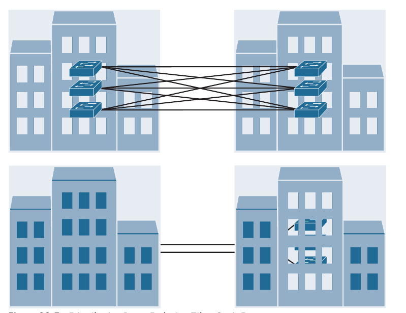

## Enterprise Network Architecture

1. Hierarchical LAN Design Model

2. High Availability Network Design

3. Enterprise Network Architecture Options

- Enterprise campus networks provide access to network services and resources to end users and endpoints spread over a single geographical location

- Campus networks typically support many different kinds of endpoint connectivity for workers and guest users, such as laptops, PCs, mobile phones, IP phones, printers, and video conferencing systems

- A small campus network environment might span a single floor or a single building, while a larger campus network might span a large group of buildings spread over an extended geographic area

- Large campus networks must have a core or backbone for interconnectivity to other networks, such as the campus end-user/endpoint access, the data center, the private cloud, the public cloud, the WAN, and the Internet edge

- The largest enterprises might have multiple campus networks distributed worldwide, each providing the end-user access and core network connectivity

- The enterprise campus architecture is designed to meet the needs of organizations that range from small single building or remote site to a large, multibuilding location

### Hierarchical LAN Design Model

- A hierarchical LAN design model divides the enterprise network architecture into modular layers

- By breaking up the design into modular layers, you can have each layer to implement specific functions

- These modular layers can be easily replicated throughout the network, which simplifies the network design and provides an easy way to scale the network as well as a consistent deployment method

- A hierarchical LAN design avoids the need for a flat and fully meshed network in which all nodes are interconnected

- In fully meshed network architectures, network changes tend to affect a large number of systems

- Hierarchical design provides fault containment by constraining the network changes to a subset of the network, which affects fewer systems and makes it easy to manage as well as improve resiliency

- In a modular layer design, network components can be placed or taken out of service with little or no impact to the rest of the network; this facilitates troubleshooting, problem isolation and network management

- The hierarchical LAN design divides networks or their modular blocks into the following three layers:

    - **Access Layer**: Gives endpoints and users direct access to the network

    - **Distribution Layer**: Provides an aggregation point for the access layer and acts as a services and control boundary between the access layer and the core layer

    - **Core Layer (also referred to as the backbone)**: Provides connections between distribution layers for large environments

- Each layer provides different functionalities and capabilities to the network

- The number of layers needed depends on the characteristics of the network deployment site

- As illustrated below, a small campus in a single building might require only access and distribution layers, whereas a campus that spans multiple buildings will most likely require all three layers

- Regardless of how many layers are implemented at a geographic location, the modularity of this design ensures that each layer will provide the same services and the same design methods

#### Access Layer

- The *access layer*, also commonly referred as the *network edge*, is where end user devices or endpoints connect to the network 

- It provides high-bandwidth device connectivity using wired and wireless access technologies such as GigabitEthernet and 802.11n, 802.11ac, and 802.11ax wireless

- While endpoints in most cases will not use the full capacity of these connections for extended periods of time, the ability to burst up to these high bandwidths when required helps improve the quality of experience (QoE) and productivity of the end user

- Below, the different types of endpoints that connect to the access layer, such as personal computers (PCs), IP phones, printers, wireless access points, personal telepresence devices, and IP video surveillance cameras

- Wireless access points and IP phones are prime examples of devices that can be used to extend the access layer one more layer out from the access switch

- The access layer can be segmented (for example, by using VLANs) so that different devices can be placed into different logical networks for performance, management and security reasons

- In the hierarchical LAN design, the access layer switches are not interconnected to each other

- Communication between endpoints on different access layer switches occurs through the distribution layer

- Because the access layer is the connection point for endpoints, it plays a big role in ensuring that the network is protected from malicious attacks

- This protection includes making sure the end users and endpoints connecting to the network are prevented from accessing services for which they are not authorized

- Furthermore, the quality of service (QoS) trust boundary and QoS mechanisms are typically enabled on this layer to ensure that QoS is provided end-to-end to satisfy the end user's QoE

- For business-critical endpoints that can connect to only a single access switch, it is recommended to use access switches with redundant supervisor engines to prevent service outages

#### Distribution Layer

- The primary function of the distribution layer is to aggregate access layer switches in a given building or campus

- The distribution layer provides a boundary between the Layer 2 domain of the access layer and the core's Layer 3 domain

- This boundary provides two key functions on the LAN:

- On the Layer 2 side, the distribution layer creates a boundary for Spanning Tree Protocol (STP), limiting propagation of Layer 2 faults, and on the Layer 3 side, the distribution layer provides a logical point to summarize IP routing information when it enters the core of the network 

- The summarization reduces IP routing tables for easier troubleshooting and reduces protocol overhead for faster recovery from failures

- Below is illustrated the distribution layer

- The distribution switches need to be deployed in pairs for redundancy

- The distribution layer switch pairs should be interconnected to each other using either a Layer 2 or Layer 3 link

- In a large campus environment, multiple distribution layer switches are often required when access layer switches are located in multiple geographically dispersed buildings to reduce the number of fiber-optic runs (which are costly) between buildings

- Distribution layer switches can be located in various buildings, as illustrated below

#### Core Layer

- As networks grow beyond three distribution layers in a single location, organizations should consider using a core layer to optimize the design

- The core layer is the backbone and aggregation point for multiple networks and provides scalability, high availability, and fast convergence to the network

- The core can provide high-speed connectivity for large enterprises with multiple campus networks distributed worldwide, and it can also provide interconnectivity between the end-user/endpoint campus access layer and other network blocks, such as the data center, the private cloud, the public cloud, the WAN, the Internet edge, and network services

- The core layer reduces the network complexity, from N (N - 1) to N links for N distributions, as shown below

### High Availability Network Design

- In networking, high availability refers to a resilient network that can operate with continuous uptime without failure, for a given period of time, to ensure business continuity

- High availability can be achieved by designing a network that takes into consideration network- and system-level components

- The following guidelines can be used in the network design for network-level high availability:

    - Adding redundant devices and links at different layers of the network architecture

    - Ensuring the design has no single points of failure and it is fault tolerant

    - Simplifying the network design by using virtual network clustering technologies

    - Implementing network monitoring systems to analyze all aspects of the network, such as network capacity, faulty hardware, and security threats to prevent low network performance, network failures and outages

- The following guidelines can be used in the network design for system-level high availability:

    - Using routers that support redundant hardware components, such as redundant power supplies, redundant fans, redundant fan trays, modular line cards, and dual route processor (RP), or supervisor engines

    - Using routers that support hot-swappable and/or online insertion or removal (OIR) capable hardware components

    - Enabling high availability technologies such as Stateful Switchover (SSO) and NonStop Forwarding (NSF) with Graceful Restart (GR) or Nonstop Routing (NSR)

    - Enabling protocols that can detect link failures, such as BFD and UDLD

    - Enabling first-hop redundancy (FHRP) protocols such as HSRP, VRRP, and GLBP

#### High Availability Technologies

- In a router with redundant RPs (also known as supervisor engines in some Cisco platforms), one of the RPs is designated as "active" and the other one as "standby"

- The active RP handles the control plane, the routing table (RIB), and in centralized forwarding architectures, it also handles the Forwarding Information Base (FIB) and adjacency table

- For this reason, an active RP failure can cause routing protocol adjacencies to go down, which can result in packet loss and network instability

- To solve this problem, high availability technologies are used that allow the router to continue forwarding packets nonstop using the current Cisco Express Forwarding (CEF) entries in the FIB, versus dropping packets while waiting for the standby RP (new active RP) to re-establish routing protocol adjacencies and rebuild the routing table and the FIB

- The following are different combinations of high availability technologies that allow the network to continue forwarding traffic during an RP switchover

- SSO and NSF

- SSO and NSF with GR

- SSO and NSF with NSR

- SSO and NSF with NSR and GR

##### SSO and NSF

- SSO is an internal router redundancy feature that allows the router with redundant RPs to checkpoint (synchronize or mirror) the router configuration, line card operation and Layer 2 protocol state information from the active RP to the standby RP

- NSF is an internal Layer 3 data forwarding plane redundancy feature that checkpoints and frequently updates the FIB from the active to the standby RP

- During a switchover, the standby RP takes over as the new active RP

- The new active RP uses the SSO-learned checkpoint information and keeps the interfaces on the router from flapping and the router and/or linecards from reloading;

- However, SSO doesnt checkpoint any Layer 3 control plane information about any neighbor router, and due to this, the existing routing protocol adjacencies go down and begin to re-establish

- During this time, because the FIB has been checkpointed by NSF, the data plane is not affected by the Layer 3 control plane going down, and traffic continues to be forwarded while the routing protocol adjacencies re-establish

- After routing convergence is completed, the FIB is updated with new routing or topology information from the RIB if necessary

- Using SSO and NSF without GR or NSF has a downside

- When the routing adjacencies go down during the RP switchover, the neighbor routers only see the routing adjacencies going down, which causes them to stop forwarding traffic to the failing router

- To prevent this from happening, GR, NSR or both need to be used with SSO and NSF

- NSF is not a configurable feature; it is enabled when SSO is enabled

- This is the reason why SSO and NSF are typically referred to as SSO/NSF

#### SSO with NSF and GR

- GR is a standard-based feature defined in RFC 4724, and it is the only one that interacts with neighbor routers

- GR is deployed with SSO/NSF to protect the Layer 3 forwarding plane during an RP switchover

- For neighbor routers to continue forwarding traffic to the router undergoing an RP switchover, the neighbor routers need to support the GR routing protocol extensions

- The GR extensions allow a neighbor router to be aware in advance that the router undergoing the RP switchover can continue to forward packets but may bring down it's routing adjacency for a brief period of time

- There are three categories of GR routers:

    - **SSO/NSF capable router**: A router that has dual RPs and is configured to use SSO/NSF to preserve the FIB through an RP switchover

    - The routing protocol adjacencies are re-established upon completion of RP switchover

    - An SSO/NSF-capable router is also GR-aware

    - **GR-aware router (also referred to as GR helper, or the misnomer NSF-aware)**: A neighbor router that supports GR routing protocol extensions and that continues to forward traffic to the SSO/NSF capable router during the RP switchover by preserving the routes and adjacency state

    - A GR-aware router does not require dual RP's, and it doesn't need to be SSO/NSF aware

    - **GR-unaware router**: A neighbor router that doesn't support GR routing protocol extensions and is not GR-aware

- NSF (SSO/NSF) is the term initially used by Cisco to refer to Graceful Restart, which is still prevalent in Cisco documentation and the IOS XE command line

- SSO/NSF is not a configurable feature; it is enabled by default when SSO is enabled

- This means that any NSF command or keyword found in the documentation or the command line is referring to Graceful Restart

- Another differentiator is that SSO/NSF is an internal capability, whereas Graceful Restart is an external capability that interacts with neighbor routers

##### SSO/NSF with NSR

- NSR is an internal Cisco router feature that does not use routing protocol extensions to signal neighbor routers that an RP switchover has taken place

- Instead, the active RP is responsible for constantly checkpointing all relevant routing control plane information to the standby RP, including routing adjacency and TCP sockets

- During an RP switchover, the new RP uses the "checkpoint" state information to maintain the current routing adjacencies and recalculate the routing table without having to alert the neighbor router that a switchover has occured

- NSR's primary benefit over GR is that it is a completely self-contained "in box" high availability solution

- There is no disruption in the routing protocol adjacencies, so the neighboring router does not need to be NSR-aware or GR-aware

- It can be used in cases where the neighbor router is GR-unaware

##### SSO/NSF with NSR and GR

- A downside to NSR is that it increases the workload on the router due to the consistent checkpointing of the routing and forwarding information to the standby RP

- For scaled deployments it is recommended to use GR for neighbor routers that are GR-aware and NSR for peers that are GR-unaware

### Enterprise Network Architecture Options

- Multiple network architecture design options are available for deploying a campus network, depending on the size of the campus as well as the reliability, resiliency, reliability, performance, security, and scalability required for it

- Each possible option should be evaluated against business requirements

- Because campus networks are modular, an enterprise network could have a mixture of all of these options deployed:

    - Two-tier design (collapsed core)

    - Three-tier design

    - Layer 2 access layer (STP-based)

    - Layer 3 access layer (routed access)

    - Simplified campus design

    - Software-defined access (SD-Access)

#### Two-Tier design (Collapsed Core)

- Smaller campus networks may have multiple departments spread across multiple floors within a building

- In these environments, a core layer may not be needed, and collapsing the core function into the distribution layer can be a cost-effective solution (because no core layer means no core layer devices) that requires no sacrifice of most of the benefits of the three-tier hierarchical model

- Prior to selecting a two-tier collapsed core and distribution layers, future scale, expansion, and manageability factors need to be considered

- Below is illustrated the two-tier design with the distribution layer acting as a collapsed core

- In the picture below, the distribution/core layer provides connectivity to the WAN edge block, the Internet edge block, the network services block, and so on, and the same pair of core/distribution switches also provides LAN aggregation to the end-user access layer

- The WAN edge block is used to connect to remote data centers, remote branches or other campus networks or for cloud connectivity to cloud providers such as the "big three" cloud service providers (Amazon Web Services, Microsoft Azure, and Google Cloud Platform) using dedicated interconnections

- The data center/server room block is where business-critical servers are placed to serve up websites, corporate email, business applications, storage, big data processing, backup services, e-commerce transactions and so on

- The Internet edge block is used for regular Internet access, e-commerce, connection to remote branches, remote VPN access, and cloud provider connectivity that does not require dedicated interconnections

- The network services edge is where devices providing network services reside, such as the Wireless LAN Controllers (WLCs), Cisco Identity Services Engine (ISE), Cisco Telepresence Manager, and Cisco Unified Communications Manager (CUCM)

#### Three-Tier design

- Three-tier designs separate the core and distribution layers and are recommended when more than two pairs of distribution switches are required

- Multiple pairs of distribution switches are typically required for the following reasons:

    - When implementing a network for a large enterprise campus composed of multiple buildings, where each building requires a dedicated distribution layer

    - When the density of WAN routers, Internet edge devices, data center servers, and network services is growing to the point where they can affect network performance and throughput

    - When geographic dispersion of the LAN access switches across many buildings in a larger facility will require more fiber-optic interconnects back to a single collapsed core

- When multiple distribution layers need to be interconnected, it becomes necessary to use a core layer

- In the below figure, the **building blocks** or **places in the network (PINs)** are each using the hierarchical design model, where each is deployed with a pair of distribution switches connected to the core block

- The data center block is an exception because it is using the newer spine-leaf design, which is a common alternative to the three-tier for modern data centers that have predominantly east-west traffic patterns between servers within the data centers

- The hierarchical LAN design is more appropriate for north-south traffic flows, such as endpoints communicating with the WAN edge, data center, Internet, or network services block

#### Layer 2 Access Layer (STP-based)

- Traditional LAN designs use a Layer 2 Access layer and a Layer 3 distribution layer

- The distribution layer is the Layer 3 IP gateway for access layer hosts

- Whenever possible, it is recommended to restrict a VLAN to a single access layer switch to elimiate topology loops, which are common points of failure in the LAN, even when STP is enabled in the network

- Restricting a VLAN to a single switch provides a loop-free design, but at the cost of network flexibility because all hosts within a VLAN are restricted to a single access switch

- Some organizations require that the same Layer 2 VLAN be extended to multiple access layer switches to accomodate an application or a service

- The looped design causes STP to block links, which reduces the bandwidth from the rest of the network and can cause slower network convergence

- Below is illustrated a loop-free topology where a VLAN is constrained to a single switch as well as a looped topology where a VLAN spans multiple access switches

- To create a highly available IP gateway at the distribution layer, the distribution layer should have a pair of standalone switches configured with first-hop redundancy protocols (FHRPs) to provide hosts with a redundant MAC address and virtual IP address for each configured VLAN

- Hot Standby Router Protocol (HSRP) and Virtual Router Redundancy Protocol (VRRP) are the most common first-hop redundancy protocols; a downside to these protocols is that they only allow a host to send data out to the active first-hop redundancy protocol router through a single access uplink, which leaves one of the access layer to distribution layer uplinks unutilized

- Manual configuration of the distribution layer is necessary to be able to load balance VLAN traffic across uplinks; this configuration involves making one of the distribution switches active for odd VLANs and the others active for even VLANs

- Gateway Load Balancing Protocol (GLBP) provides greater uplink utilization for access layer to distribution layer traffic by load balancing the load from hosts across multiple uplinks; the downside is that it works only on loop-free topologies

- All these redundancy protocols require fine-tunning the default settings in order to allow for sub-second network convergence, which can impact switch CPU resources

#### Layer 3 Access Layer (Routed Access)

- Routed access is an alternative configuration in which Layer 3 is extended all the way to the access layer switches

- In this design, access layer switches act as full Layer 3 routed nodes (providing both Layer 2 and Layer 3 switching) and the access to distribution Layer 2 uplink trunks are replaced with Layer 3 point-to-point routed links

- Consequently, the Layer 2/Layer 3 demarcation is moved from the distribution switch to the access switch, as seen below

- The routed access-to-distribution block design has a number of advantages over the Layer 2 access layer design:

    - **No first-hop redundancy protocol required**: It eliminates the need for first-hop redundancy protocols such as HSRP and VRRP

    - **No STP required**: Because there are no Layer 2 links to block, the design eliminates the need for STP

    - **Increased Uplink Utilization**: Both uplinks from access to distribution can be used, increasing the effective bandwidth available to end users and endpoints connected to the access layer switches

    - **Easier troubleshooting**: It offers common end-to-end troubleshooting tools (such as **ping** and **traceroute**)

    - **Faster Convergence**: It uses fast-converging routing protocols such as Enhanced Interior Gateway Routing Protocol (EIGRP) and Open Shortest Path First (OSPF)

- While this is an excelent design for many environments, it has the same limitation as the Layer 2 access loop-free design: It does not support spanning VLANs across multiple access switches

- In addition, it might not be the most cost-effective solution because access layer switches with Layer 3 routing capability might cost more than Layer 2 switches

#### Simplified Campus Design

- The simplified campus design relies on switch clustering technologies, such as Virtual Switching System (VSS) and StackWise Virtual (SWV), in which two physical switches are clustered into a single logical switch, and StackWise, in which two or more switches (the maximum number depends on the platform) are stacked into a single logical switch, with a single management and control plane, which allows them to be logically managed as if it were a single physical switch

- The ability to deploy VSS, SWV, or StackWise depends on the platform

- StackWise is supported on switches that are targeted for the distribution and core layers; however any of these technologies can be used for any layer as necessary

- VSS and SWV support EtherChannels that span across the two physical switches in the stack, referred to as cross-stack EtherChannels 

- MEC and cross-stack EtherChannels allow devices to connect across all the physical switches using EtherChannel in the same way as if they were connecting to a single switch

- VSS, SWV, and StackWise, along with MEC and cross-stack EtherChannels, can be applied to any of the campus building blocks to simplify them even further

- Using this design offers the following advantages:

    - **Simplified Design**: There are fewer boxes to manage, which reduces the amount of time spent on ongoing provisioning and maintenance

    - **No first hop redundancy protocol required**: It eliminates the need for first-hop redundancy protocols such as HSRP and VRRP because the default IP gateway is on a single logical interface

    - **Reduced STP dependence**: Because EtherChannel is used, it eliminates the need for STP for a Layer 2 access design; however STP is still required as a failsave in case multiple access switches are interconnected

    - **Increased uplink utilization**: With EtherChannel, all uplinks from access to distribution can be used, increasing the effective bandwidth available to the end users and endpoints connected to the access layer switches

    - **Easier troubleshooting**: The topology of the network from the distribution layer to the access layer is logically an hub-and-spoke topology, which reduces the complexity of the design and troubleshooting

    - **Faster convergence**: With EtherChannel all links are in a forwarding state, and this significantly optimizes the convergence time following a node or link failure event because EtherChannel provides fast sub-second failover between links in an uplink bundle

    - **Distributed VLANs**: With this design, VLANs can span multiple access switches without the need to block any links

    - **High Availability**: There is seamless traffic failover when one of the switches in the cluster fails by using interchassis SSO/NSF

- The simplified campus design is loop free, highly available, flexible, resilient and easy to manage

- Below we can see how the network can be simplified by introducing VSS and SWV into the design

- In addition, using this design approach across all the campus blocks (when possible) can provide an optimized architecture that is easy to manage, resilient, and more flexible, with higher aggregated uplink bandwidth capacity

- Below is illustrated what the end-to-end campus design would look like with VSS and SWV used across the different building blocks and layers

#### Software-Defined Access (SD-Access) Design

- SD-Access, the industry's first intent-based networking solution for the enterprise, is built on the principles of the Cisco Digital Network Architecture (DNA)

- It is a combination of the campus fabric design and the Digital Network Architecture Center (Cisco DNA or DNAC)

- SD-Access adds fabric capabilities to the enterprise network through automation using SD-Access technology, and it provides automated end-to-end segmentation to separate user, device, and application traffic without requiring a network redesign

- With it's fabric capabilities, SD-Access provides services such as host mobility and enhanced security in addition to the normal switching and routing capabilities
