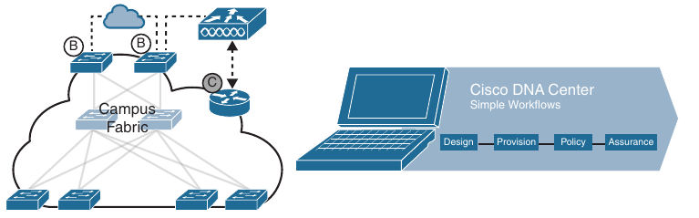
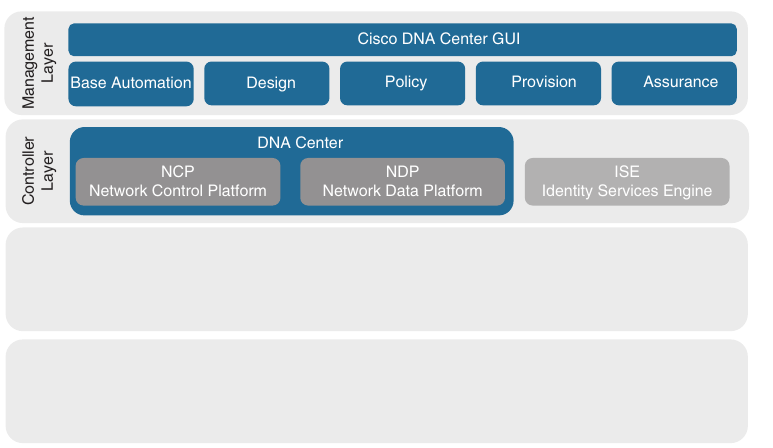
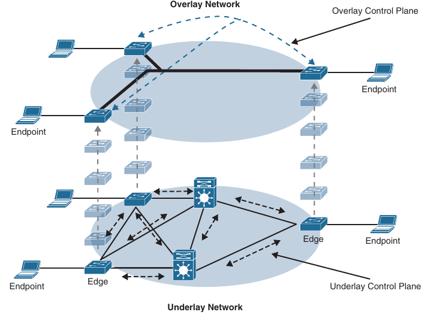
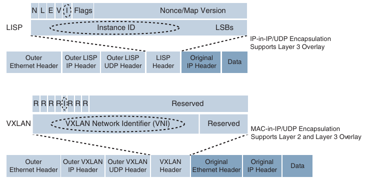
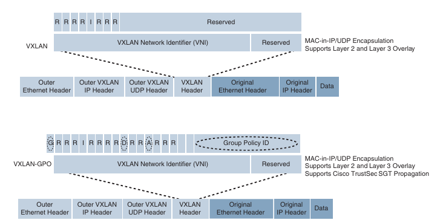
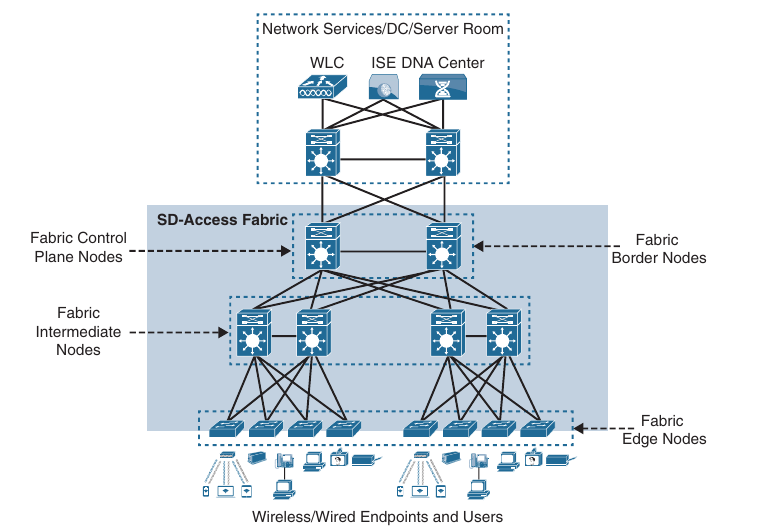
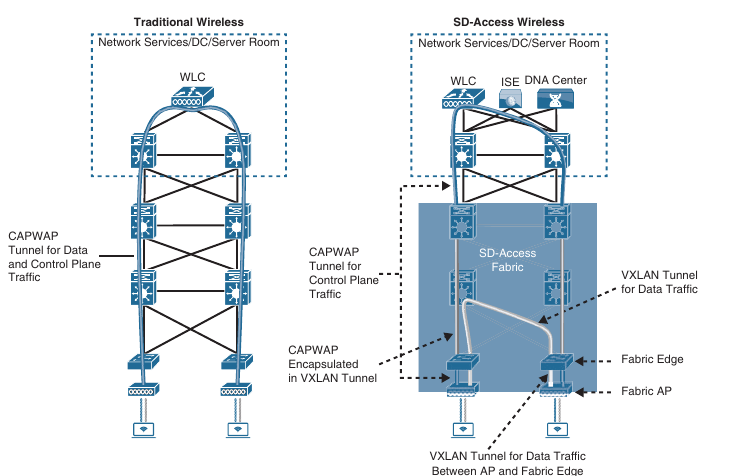
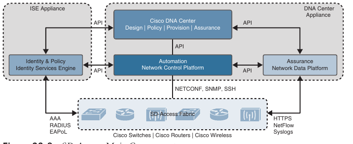

## Fabric Technologies

1. Software-Defined Access (SD-Access)

2. Software-Defined WAN (SD-WAN)

- A fabric network is an overlay network (virtual network [VN]) built over an underlay network (physical network) using overlay tunneling technologies such as VXLAN

- Fabric networks overcome shortcomings of traditional physical network by enabling host mobility, network automation, network virtualization and segmentation, and they are more manageable, flexible, secure (by means of encryption), and scalable than traditional networks

- The next generation fabric technologies:

    - Software-Defined Access (SD-Access) for campus networks

    - Software-Defined WAN (SD-WAN) for WAN networks

- The Cisco SD-Access fabric is one of the main components of the Cisco Digital Network Architecture (Cisco DNA)

- Cisco DNA is the solution for the future of intent-based networking in Cisco Enterprise Networks

- SD-Access provides policy-based network segmentation, host mobility for wired and wireless hosts, and enhanced security as well as other benefits in a fully automated fashion

- Cisco SD-Access was designed for enterprise campus and branch network environments and not for other types of network environments, such as data center, service provider, and WAN environments

- Traditional WANs are typically designed using MPLS or other overlay solutions, such as Dynamic Multipoint Virtual Private Network (DMVPN) or Intelligent WAN (IWAN) to provide connectivity between different campus and branch sites

- However, with the rise of Software as a Service (SaaS) such as Microsoft Office 365 and salesforce.com, and Infrastruture as a Service (IaaS) cloud services from Amazon Web Services (AWS), Google Compute Engine (GCE), and Microsoft Azure, traffic patterns are changing so that the majority of enterprise traffic flows to public clouds and the Internet

- Such changes are creating new requirements for security, application performance, cloud connectivity, WAN management, and operations that traditional WAN solutions were not designed to address

- The Cisco SD-WAN fabric is a cloud-based WAN solution for enterprise and data center networks that was developed to address all the new WAN requirements

### Software-Defined Access (SD-Access)

- There are many operational challenges in enterprise campus networks due to manual configuration of network devices

- Manual network configuration are slow and lead to misconfigurations that cause service disruptions in the network, and the situation is exacerbated in a constantly changing environment where more users, endpoints and applications are constantly being added

- The constant grouth in users and endpoints makes configuring user credentials and maintaining a consistent policy across the network very complex

- If policies are inconsistent, there is an added complexity involved in maintaining separate policies between wired and wireless networks that leaves the network vulnerable to security breaches

- As users move around the campus network, locating the users and troubleshooting issues also become more difficult

- In other words, traditional campus networks do not address the existing campus network needs

- With SD-Access, an evolved campus network can be built that addresses the needs of existing campus networks by leveraging the following capabilities, features and functionalities

    - **Network Automation**: SD-Access replaces manual network devices configurations with network device management through a single point of automation, orchestration, and management of network functions through the use of Cisco DNA center

    - This simplifies network design and provisioning and allows for very fast, lower-risk deployment of network devices and services using best-practice configurations

    - **Network assurance and analytics**: SD-Access enables proactive prediction of network-related and security-related risks by using telemetry to improve the performance of the network, endpoints and applications, including encrypted traffic

    - **Host mobility**: SD-Access provides host mobility for both wired and wireless clients

    - **Identity services**: Cisco Identity Services Engine (ISE) identifies users and devices connecting to the network and provides the contextual information required for users and devices to implement security policies for network access control and network segmentation

    - **Policy enforcement**: Traditional access control lists (ACLs) can be difficult to deploy, maintain, and scale because they rely on IP addresses and subnets

    - Creating access and application policies based on group-based policies using **Security Group Access Control Lists (SGACLs)** provides a much simpler and more scalable form of policy enforcement based on identity instead of an IP address

    - **Secure Segmentation**: With SD-Access, it is easier to **segment** the network to support guest, corporate, facilities and IOT-enabled infrastructure

    - **Network Virtualization**: SD-Access makes it possible to leverage a single phyisical infrastructure to support multiple virtual routing and forwarding (VRF) instances, referred to as virtual networks [VNs], which with a distinct set of access policies

#### What is SD-Access?

- SD-Access has two main components:

    1. Cisco Campus Fabric Solution

    2. Cisco DNA Center

- The campus fabric is a Cisco-validated fabric overlay solution that includes all the features and protocols (control plane, data plane, management plane, and policy plane) to operate the network infrastructure

- When the campus fabric solution is managed using the command line interface (CLI) or an **application programming interface (API)** using **Network Configuration Protocol (NETCONF)/YANG**, the solution is considered to be a campus fabric solution

- When the campus fabric solution is managed via the Cisco DNA Center, the solution is considered to be SD-Access

- SD-Access = Campus Fabric + Cisco DNA Center

#### SD-Access Architecture

- Cisco SD-Access is based on existing hardware and software technologies

- What makes Cisco SD-Access special is how these technologies are integrated and managed together

- The Cisco SD-Access fabric architecture can be divided into four basic layers, as illustrated below

#### Physical Layer

- While Cisco SD-Access is designed for user simplicity, abstraction, and virtual environments everything runs on top of physical network devices - namely switches, routers, servers, wireless LAN controllers (WLCs), and wireless access points (APs)

- All Cisco network devices that actively participate in the SD-Access fabric must support all of the hardware application-specific integrated circuits (ASICs) and field-programable gate arrays (FPGAs) and software requirements described in the "Network Layer", below

- Cisco Access Layer switches that do not actively participate in the SD-Access fabric but that are part of it because of automation are referred to as SD-Access extension nodes

- The following are the physical layer devices of the SD-Access fabric:

    - **Cisco switches**: Switches provide wired (LAN) access to fabric. Multiple types of Cisco Catalyst switches are supported, as well as Nexus switches

    - **Cisco routers**: Routers provide WAN and branch access to the fabric

    - **Cisco wireless**: Cisco WLCs and APs provide wireless (WLAN) access to the fabric

    - **Cisco controller appliances**: Cisco DNA Center and Cisco ISE are the two controller appliances required

#### Network Layer

- The network layer consists of the underlay network and the overlay network

- These two sublayers work together to deliver data packets to and from the network devices participating in SD-Access

- All this network layer information is made available to the controller layer

- The network underlay is the underlaying physical layer, and it's sole purpose is to transport data packets between network devices for the SD-Access fabric overlay

- The overlay network is a virtual (tunneled) network that virtually interconnects all of the network devices forming a fabric of interconnected nodes

- It abstracts the inherent complexities and limitations of the underlay network

- Below is shown a visual representation of a relationship between an overlay network and the network underlay

#### Underlay Network

- The underlay network for SD-Access should be configured to ensure performance, scalability, and high availability because any problems with the underlay, can affect the operation of the fabric overlay

- While it is possible to use a Layer 2 network underlay design running Spanning Tree Protocol (STP), it is not recommended

- The recommended design for the network underlay is to use a Layer 3 routed access campus design using IS-IS as the IGP

- IS-IS offers operational advantages such as neighbor establishment without IP dependencies, peering capability using loopback addresses, and agnostic treatment of IPv4, IPv6, an non-IP traffic

- Two models of underlay are supported:

    - **Manual underlay**: This type of underlay network is configured and managed manually (such as with a CLI or an API), rather than through Cisco DNA Center

    - An advantage of the manual underlay is that it allows customization of the network to fit any special design requirements (such as changing the IGP to OSPF); in addition, it allows SD-Access to run on top of a legacy (or third-party) IP-based network

    - **Automated underlay**: In a fully automated network underlay, all aspects of the underlay network are configured and managed by the Cisco DNA Center LAN automation feature

    - The LAN Automation feature creates an IS-IS routed access campus design and uses the Cisco Network Plug and Play features to deploy both unicast and multicast routing configuration in the underlay to improve traffic delivery efficiency for SD-Access

    - An automated underlay eliminates misconfigurations and reduces the complexity of the network underlay

    - It also greatly simplifies and speeds the building of the network underlay

    - A downside to an automated underlay is that it does not allow manual customization for special design requirements

#### Overlay Network (SD-Access Fabric)

- SD-Access fabric is the overlay network, and it provides policy-based network segmentation, host mobility for wired and wireless hosts, and enhanced security beyond the normal switching and routing capabilities of a traditional network

- In SD-Access, the fabric overlay is fully automated, regardless of the underlay network model used (manual or automated)

- It includes all necessary overlay control plane protocols and addressing, as well as all global configurations associated with operation of the SD-Access fabric

- It is also possible to configure overlay network without using DNA center; however, when the overlay network is managed via the CLI or API using NETCONF/YANG, the solution is considered to be a campus fabric solution and not SD-Access

- The Cisco SD-Access fabric is based on multiple exisiting technologies

- The combination of these technologies and the automated management provided by Cisco DNA center make Cisco SD-Access powerfull and unique

- There are three basic planes of operation in the SD-Access fabric:

    - Control plane based on Location/ID Separation Protocol (LISP)

    - Data plane based on Virtual Extensible LANs (VXLANs)

    - Policy plane - based on Cisco TrustSec

#### SD-Access Control Plane

- The SD-Access fabric control plane is based on Location/ID Separation Protocol (LISP) 

- LISP is an IETF standard protocol defined in RFC 6830 that is based on a simple **endpoint identifier (EID)** to **routing locator (RLOC)** mapping system to separate the identity (endpoint IP address) from it's current location (network edge/border router IP address) 

- LISP dramatically simplifies traditional routing environments by eliminating the need for each router to process every possible IP destination address and route

- It does this by moving remote destination information to a centralized mapping database called the LISP MAP server (MS) (a control plane node in SD-Access), which allows each router to manage only it's local routes and query the map system to locate the destination EIDs

- This technology provides many advantages for Cisco SD-Access, such as smaller routing tables, dynamic host mobility for wired and wireless endpoints, address-agnostic mapping (IPv4, IPv6 and/or MAC), and build-in network segmentation through VRF instances

- In Cisco SD-Access, several enhancements to the original LISP specification has been added, including distributed Anycast Gateway, VN Extranet, and Fabric Wireless, and more features are planned for the future

#### SD-Access Fabric Data Plane

- The tunneling technology used for the fabric data plane is based on Virtual Extensible LAN (VXLAN)

- VXLAN encapsulation is IP/UDP based, meaning that it can be forwarded by any IP-based network (legacy or third party) and creates the overlay network for the SD-Access fabric

- Although LISP is the control plane for the SD-Access fabric, it does not use LISP data encapsulation for the data plane; instead it uses VXLAN encapsulation because it is capable of encapsulating the original Ethernet header and perform MAC-in-IP encapsulation, while LISP does not

- Using VXLAN allows the SD-Access fabric to support Layer 2 and Layer 3 virtual topologies (overlays) and the ability to operate over any IP-based network with build-in network segmentation (VRF instance/VN) and any build-in group-based policy

- The differences between LISP and VXLAN packet formats can be seen below

- The original VXLAN specification was enhanced for SD-Access to support Cisco TrustSec **Scalable Group Tags (SGTs)** 

- This was accomplished by adding new fields to the first four bytes of the VXLAN header in order to transport up to 64000 SGT tags

- The new VXLAN format is called **VXLAN Group Policy Option (VXLAN-GPO)**, and is defined by the IETF draft draft-smith-vxlan-group-policy-05

- Cisco TrustSec Security Group Tags are referred to as Scalable Group Tags in Cisco SD-Access

- Below is illustrated the VXLAN-GPO format compared to the original packet format

- The new fields in the VXLAN-GPO packet format include the following:

    - **Group Policy ID**: 16-bit identifier that is used to carry the SGT tag

    - **Group Based Policy Extension Bit (G Bit)**: 1-bit field that, when set to 1, indicates an SGT tag is being carried with the Group Policy ID field and set to 0 when it is not

    - **Don't Learn Bit (D Bit)**: 1-bit field that, when set to 1, indicates that the egress **virtual tunnel endpoint (VTEP)** must not learn the source address of the encapsulated frame

    - **Policy Applied Bit (A Bit)**: 1-bit field that is defined as the A bit only when the G bit field is set to 1

    - When the A bit is set to 1, it indicates that the group policy has been applied to this packet, and further policies must not be applied by network devices

    - When it is set to 0, group policies must be applied by network devices, and they must set the A bit to 1 after the policy has been applied

#### SD-Access Fabric Policy Plane

- The fabric policy plane is based on Cisco TrustSec

- Cisco TrustSec SGT tags are assigned to authenticated groups of users and end devices

- Network policy (for example ACLs, QoS) is then applied throughout the SD-Access fabric, based on the SGT tag instead of a network address (MAC, IPv4, or IPv6)

- This allows for creation of network policies such as security, Quality of Service (QoS), policy-based routing (PBR), and network segmentation based only on the SGT tag and not the network address (MAC, IPv4 or IPv6) of the user or endpoint

- TrustSec SGT tags provide several advantages for Cisco SD-Access, such as:

    - Support for both network-based segmentation using VNs (VRF instances) and group-based segmentation (policies)

    - Network address-independent group-based policies based on SGT tags rather than MAC, IPv4, or IPv6 addresses, which reduces complexity

    - Dynamic enforcement of group-based policies, regardless of location for both wired and wireless traffic

    - Policy constructs over a legacy or third-party network using VXLAN

    - Extended policy enforcement to external networks (such as cloud or data center networks) by transporting the tags to Cisco TrustSec-aware devices using SGT Exchange Protocol (SXP)

#### SD-Access Fabric Roles and Components

- The operation of the SD-Access fabric requires multiple different device roles, each with a specific set of responsabilities

- Each SD-Access-enabled network device must be configured for one (or more) of these roles

- During the planning and design phase, it is important to understand the fabric roles and to select the most appropriate network devices for each role

- There are five basic device roles in the fabric overlay:

    - **Control Plane Node**: This node contains the settings, protocols, and mapping tables to provide the endpoint-to-location (EID-to-RLOC) mapping system for the fabric overlay

    - **Fabric Border Node**: This fabric device (for example, core layer device) connects external Layer 3 networks to the SDA fabric

    - **Fabric Edge Node**: This fabric device (for example, access or distribution layer device) connects wired endpoints to the SDA fabric 

    - **Fabric WLAN Controller (WLC)**: This fabric device connects APs and wireless endpoints to the SDA fabric

    - **Intermediate Nodes**: These intermediate routers or extended switches do not provide any sort of SD-Access fabric role other than underlay services

- Below are illustrated the different SD-Access fabric design roles and how nodes in the fabric can play multiple roles

- For example, the core layer routers are acting as fabric border nodes and control plane nodes

#### Fabric Edge Node

- A fabric edge node provides onboarding and mobility services for wired users and devices (including fabric-enabled WLCs and APs) connected to the fabric

- It is a LISP **tunnel router (xTR)** that also provides the anycast gateway, endpoint authentication, and assignment to overlay **host pools** (static or DHCP), as well as group-based policy enforcement (for fabric to fabric endpoints)

- A fabric edge first identifies and authenticates wired endpoints (through 802.1X), in order to place them in a host pool (SVI and VRF instances) and scalable group (SGT assignment)

- It then registers the specific EID host address (that is, MAC, /32 IPv4, or /128 IPv6) with the control plane node

- A fabric edge provides a single Layer 3 anycast gateway (that is the same SVI with the same IP address on all fabric edge nodes) for it's connected endpoints and also performs the encapsulation and de-encapsulation of host traffic to and from it's connected endpoints

- An edge node must be a Cisco switch or router operating in the fabric overlay

#### Fabric Control Plane Node

- A fabric control plane node is a LISP map server/resolver (MS/MR) with enhanced functions for SD-Access, such as fabric wireless and SGT mapping

- It maintains a simple mapping database to map EIDs to RLOCs

- The control plane (host database) maps all EID location to the current fabric edge or border node, and it is capable of multiple EID lookup types (IPv4, IPv6, or MAC)

- The control plane receives registration from fabric edge or border nodes for known EID prefixes for wired endpoints and from fabric mode WLCs for wireless clients

- It also resolves lookup requests from fabric edge or border nodes to locate destination EIDs and updates fabric edge nodes and border nodes with wired and wireless client mobility and RLOC information

- Control plane devices must maintain all endpoint (host) mappings in a fabric

- A device with sufficient hardware and software scale for the fabric must be selected for this function

- A control plane node must be either a Cisco switch or a router operating either inside or outside the SD-Access fabric

#### Fabric Border Nodes

- Fabric border nodes are LISP proxy tunnel routers (PxTRs) that connect external Layer 3 networks to the SD-Access fabric and translate reachability and policy information (such as VRF and SGT information), from one domain to another

- There are three types of border nodes:

    - **Internal border (rest of company)**: Connects only to the known areas of the organization (for example, WLC, firewall, data center)

    - **Default border (outside)**: Connects only to unknown areas outside the organization

    - This border node is configured with a default route to reach external unknown networks such as the Internet and the public cloud that are not known to the control plane nodes

    - **Internal + default border (anywhere)**: Connects transit areas as well as known areas of the company

    - This is basically a border that combines internal and default border functionality into a single node

#### Fabric Wireless Controller (WLC)

- A fabric-enabled WLC connects APs and wireless endpoints to the SD-Access fabric

- The WLC is external to the fabric and connects to the SD-Access fabric through an internal border node

- A fabric WLC node provides onboarding and mobility services for wireless users and endpoints connected to the SD-Access fabric

- A fabric WLC also performs PxTR registrations to the fabric control plane (on behalf of the fabric edges) and can be thought of as a fabric edge for wireless clients

- The control node maps the host EID to the current fabric access point and fabric edge node location the access point is attached to

- In traditional wireless deployments, the WLC is typically centralized, and all control plane and data plane (wireless client data) traffic needs to be tunelled to the WLC through Control and Provisioning of Wireless Access Points (CAPWAP tunnel)

- In SD-Access the wireless control plane remains centralized but the data plane is distributed using VXLAN directly from the fabric-enabled APs

- Below is illustrated a traditional wireless deployment compared with an SD-Access wireless deployment

- Fabric APs establish a VXLAN tunnel to the fabric edge to transport wireless client data traffic through the VXLAN tunnel instead of the CAPWAP tunnel

- For this to work, the AP must be directly connected to the fabric edge or a fabric extended node

- Using a VXLAN tunnel to transport the wireless client data traffic doesn't need to be tunneled to the WLC via CAPWAP, as in traditional wireless deployments because the routing decision is taken directly by the fabric edge

- In addition, SGT- and VRF-based policies for wireless users for fabric SSIDs are applied at the fabric edge in the same way as for wired users

- Wireless clients (SSIDs) are applied at the fabric edge in the same way as for wired users

- Wireless clients (SSIDs) use regular host pools for traffic and policy enforcement (the same as wired clients), and the fabric WLC registers client EIDs with the control plane node (as located on the edge)

#### SD-Access Fabric Concepts

- Better understanding of the benefits and operation of Cisco SD-Access requires reviewing the following concepts related to how the multiple technologies that are used by the SD-Access solution operate and interact:

    - **Virtual Network (VN)**: The VN provides virtualization at the device level, using VRF instances to create multiple Layer 3 routing tables

    - VRF instances provide segmentation across IP addresses allowing for overlapped address space and traffic segmentation

    - In the control plane, LISP instance IDs are used to maintain separate VRF instances

    - In the data plane, edge nodes add a VXLAN VNID to the fabric encapsulation 

    - **Host Pool**: A host pool is a group assigned to an IP pool subnet in the SD-Access fabric

    - Fabric edge nodes have a Switched Virtual Interface (SVI) for each host-pool to be used by endpoints and users as their default gateway

    - The SD-Access fabric uses EID-mappings to advertise each host pool (per instance ID), which allows host specific (/32, /128, or MAC) advertisement and mobility

    - Host pools can be assigned dynamically (using host authentication such as 802.1X) and/or statically per port

    - **Scalable Group**: A scalable group is a group of endpoints with similar policies

    - The SD-Access policy plane assigns every endpoint (host) to a scalable group using TrustSec SGT tags

    - Assignment to a scalable group can be either static per fabric edge port or using dynamic authentication through AAA or RADIUS using Cisco ISE

    - The same scalable group is configured on all fabric edge or border nodes

    - Scalable groups can be defined in Cisco DNA Center and/or Cisco ISE and are advertised through Cisco TrustSec

    - There is a direct one-to-one relationship between host pools and scalable groups

    - Therefore, the scalable groups operate within a VN by default

    - The fabric edge and border nodes includes the SGT tag ID in each VXLAN header, which is carried across the fabric data plane

    - This keeps each scalable group separate and allows SGACL policy and enforcement

    - **Anycast gateway**: The Anycast gateway provides a pervasive Layer 3 default gateway where the same SVI is provisioned on every edge node with the same SVI IP and MAC address

    - This allows an IP subnet to be stretched across SD-Access fabric

    - For example, if the subnet 10.1.0.0/24 is provisioned in a SD-Access fabric, this subnet will be deployed across all the edge nodes in the fabric, and an endpoint located in that subnet can be moved to any edge node within the fabric without a change to it's IP address or default gateway

    - This essentially stretches these subnets across all the edge nodes throughout the fabric, thereby simplifying the IP address assignment and allowing fewer but larger IP subnets to be deployed

    - In essence, the fabric behaves as a logical switch that spans multiple buildings, where an endpoint can be unplugged from one port and plugged into another port on a different building, and it will seem as if the endpoint is connecting to the same logical switch, where it can still reach the same SVI and other endpoints in the same VLAN

#### Controller Layer

- The controller layer provides all the management subsystems for the management layer, and this is all provided by Cisco DNA Center and Cisco ISE

- Below is illustrated the different components that comprise the controller layer and how they interact with each other as well as with the campus fabric

- There are three main controller subsystems:

    - **Cisco Network Control Platform (NCP)**: This is a subsystem integrated directly into Cisco DNA Center that provides all the underlay and fabric automation and orchestration services for the physical and network layers

    - NCP configures and manages Cisco network services using NETCONF/YANG, Simple Network Management Protocol (SNMP), SSH/Telnet, and so on and then provides network automation status and other information to the management layer

    **Cisco Network Data Platform (NDP)**: NDP is a data collection and analytics, and assurance subsystem that is integrated directly into Cisco DNA Center

    - NDP analyzes and corelates various network events through multiple sources (such as NetFlow and Switched Port Analyzer [SPAN]) and identifies historical trends

    - It uses this information to provide contextual information to NCP and ISE, and it provides network operational status and other information to the management layer

    - **Cisco Identity Services Engine (ISE)**: The basic role of ISE is to provide all the identity and policy services for the physical layer and network layer

    - ISE provides Network Access Control (NAC) and identity services for dynamic endpoint-to-group mapping and policy definition in a variety of ways, including using 802.1X, **MAP Authentication Bypass (MAB)**, and **Web Authentication (WebAuth)**

    - ISE also collects and uses the contextual information shared from NDP and NCP (and other systems, such as Active Directory and AWS)

    - ISE then places the profiled endpoints into the correct scalable group and host pool

    - It uses this information to provide information to NCP and NDP, so the user (management layer) can create and manage group-based policies

    - ISE is also responsible for programming group-based policies on the network devices

- Cisco ISE and the DNA Center (NCP and NDP) integrate with each other to share contextual information through APIs between themselves, and this contextual information is then provided to the user management layer:

