## Foundational Network Programmability Concepts

1. Command-Line Interface (CLI)

2. Application Programming Interface (API)

3. Data Models and Supporting Protocols

4. Cisco DevNet

5. GitHub

6. Basic Python Concepts and Scripts

- Some of the ways the networks have been traditionally managed

- It also focuses on some of the most common network programmability concepts and programmatic methods of management

### Command-Line Interface

- There are many different ways to connect and manage a network

- The most commonly used method for the past 30 years has been by using the *command-line interface* (CLI)

- However, like almost everything else, the CLI has pros and cons

- Perhaps one of the most glaring and biggest flaws with using CLI to manage a network is misconfiguration

- Businesses often have frequent changes in their network environments, and some of the changes can be extremely complex

- When businesses have increased complexity in their networks, the cost of something failing can be very high due to the increased time it takes to troubleshoot the issues in a complex network

- Failure in a network, however, doesn't necessarily mean software or a hardware component is to blame

- A majority of network outages are caused by human beings

- Many outages occur because of misconfigurations due to lack of network understanding

- While not all outages and failures can be avoided, there are tools that can assist in reducing the number of outages that are caused by human error due to misconfigurations in the CLI

- Below we can see a brief list of common pros and cons associated with using the CLI

```
PROs                                                                        CONs

Well known and documented                                                   Difficult to scale

Commonly used method                                                        Large number of commands

Commands can be scripted                                                    Must know IOS command syntax

Syntax help available on each command                                       Executing commands can be slow

Connection to SSH can be encrypted (using SSH)                              Not intuitive

                                                                            Can execute only one command at a time

                                                                            CLI and commands can change between software versions and platforms

                                                                            Using the CLI can pose a security threat if using Telnet (plain text)
```

- Of course there are programatic ways of accomplishing the same configurations that are possible with the CLI

### Application Programming Interface

- Another very popular method with comunicating with and configuring a network is through the use of **application programming interfaces** (APIs)

- APIs are mechanisms used to communicate with applications and other software

- They are also used to communicate with various components of the network through software

- It is possible to use APIs to configure or monitor specific components of a network

- There are multiple different types of APIs

- Two most common APIs are the Northbound API and the Southbound API

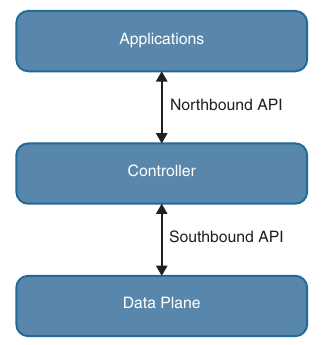

#### Northbound API

- Northbound APIs are often used to communicate from a network controller to it's management software

- For example, Cisco DNA Center has a software Graphical User Interface (GUI) that is used to manage the network controller

- Typically, when a network operator logs into a controller to manage the network, the information that is being passed from the management software is leveraging a Northbound REST-based API

- Best practices suggest that the traffic should be encrypted using TLS between the software and the controller

- Most types of APIs have the ability to use encryption to secure the data in flight

#### Southbound API

- If a network operator makes a change to a switch's configuration in the management software of the controller, these changes are then pushed down to the individual devices by using a Southbound API

- These devices can be routers, switches, or even wireless access points

- APIs interact with the components of a network through the use of a programmatic interface

#### Representational State Transfer (REST) APIs

- An API that uses REST is often referred to a RESTful API

- RESTful APIs use HTTP methods to gather and manipulate data

- Because there is a defined for how HTTP works, it offers a consistent way to interact with APIs from multiple vendors

- REST uses different HTTP functions to interact with the data

- Below are some of the most common HTTP functions and their associated use cases

```
HTTP Function                       Action                                                              Use Case

GET                                 Request data from a destination                                     Viewing a website

POST                                Submits data to a specific destination                              Submitting login credentials

PUT                                 Replaces data in a specific destination                             Updating an NTP server

PATCH                               Appends data to a specific destination                              Adding an NTP server

DELETE                              Removes data from a specific destination                            Removing an NTP server
```

- HTTP functions are similar to the functions that most applications or database use to store or alter data - whether the data is stored in a database or within the application

- These functions are called "CRUD" functions

- CRUD is an acronym that stands for CREATE, READ, UPDATE and DELETE

- For example, in a SQL database, the CRUD functions are used to interact with and manipulate the data stored in the database

- Below are listed the CRUD functions and their associated actions and use cases

```
CRUD Function                           Action                                                          Use Case

CREATE                                  Inserts data into a database or application                     Updating a customer's home address in a database

READ                                    Retrieves data from a database or application                   Pulling up a customer's home address from a database

UPDATE                                  Modifies or replaces data in a database or application          Changing a street address stored in a database

DELETE                                  Removes data from a database or application                     Removing a customer from a database
```

#### API Tools and Resources

- Whether you are trying to learn how APIs interact with applications or controllers, need to test code and outcomes, or want to become a full-time developer, one of the most important pieces of interacting with any software using APIs is testing

- Testing code helps ensure that developers are accomplishing the outcome that was intended when executing the code

- Below are covered some tools and resources related to using APIs and REST functions

- This information will help hone development skills in order to become a more efficient engineer with coding skills

#### Introduction to Postman

- Keep in mind that APIs are software interfaces into an application or controller

- Many APIs require authentication

- This means that such an API is considered just like any other device to which a user needs to authenticate to gain access to utilize the APIs

- A developer which is authenticated has access to making changes using the API, which can impact the application

- This means that if a REST API call is used to delete data, the data will be removed from the application or controller just as if user logged into the device via CLI and deleted it

- It is best practice to use a test lab or the Cisco DevNet sandbox while learning and practicing any of these concepts to avoid accidental impact to a production or lab environment

- Cisco DevNet is discussed later

- Postman is an application that makes it possible to interact with APIs using a console-based approach

- Postman allows for the use of various data types and formats to interact with REST-based APIs

- Below is shown the main Postman application dashboard

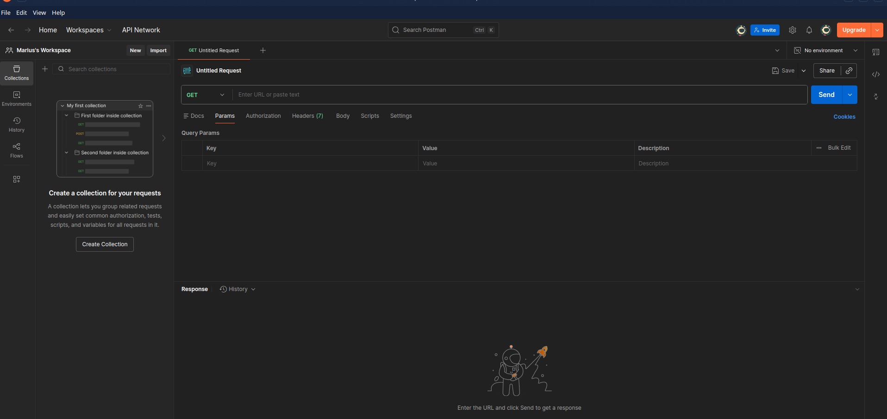

- The Postman application has various sections that you can interact with

- The focus here is to use the Builder portion of the dashboard

- The following sections are the ones that require the most focus and atention:
    
    - History

    - Collections

    - New Tab

    - URL bar

- The History tab shows a list of all the recent API calls made using Postman

- Users have the option to clear their entire history at any time if they want to remove the complete list of API calls that have been made

- This is done by clicking the Clear All link at the top of the Collections window

- Users also have the ability to remove individual API calls from the history by simply hovering the mouse over the API call and clicking the trash can icon in the submenu that pops up

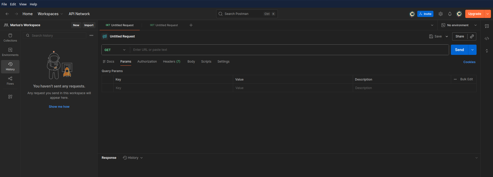

- API calls can be stored in groups, called collections that are specific to a structure that fits the user's needs

- Collections can follow any naming convention and appear as a folder hierarchy

- For example, it's possible to have a collection called DNA-C to store all the Cisco DNA Center API calls

- Saving API calls to a collection helps during testing phases as the API calls can easily be found and sorted

- It is also possible to select a collection to be a favorite by clicking the star icon to the right of the collection name

- Below is shown a collection called TESTING added to favorites


- Tabs provide another very convenient way to work with various API calls

- Each tab can have it's own API call and parameters that are completely independent of any other tab

- For example, a user can have one tab open with API calls that interact with the Cisco DNA Center controller and another tab open that is interacting with a completely different platform, such as a Cisco Nexus switch

- Each tab has it's own URL bar to be able to use a specific API

- Remember that an API call using REST is very much like an HTTP transaction

- Each API call in a RESTful API maps to an individual URL for a particular function

- This means every configuration change or poll to retrieve data a user makes in a REST API has a unique URL - whether it is GET, POST, PUT, PATCH or DELETE function

- Below are shown two different tabs in Postman

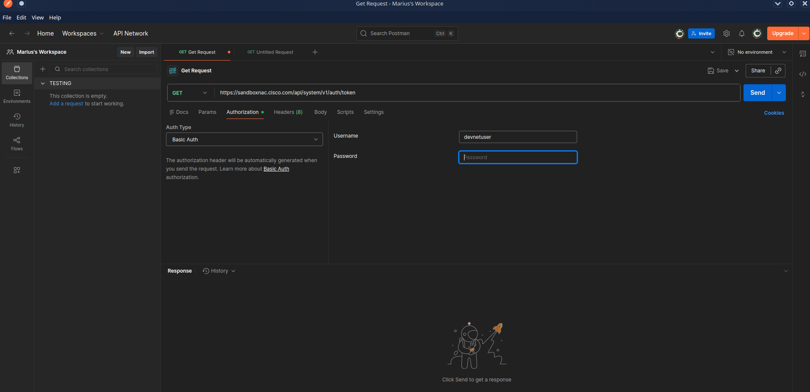

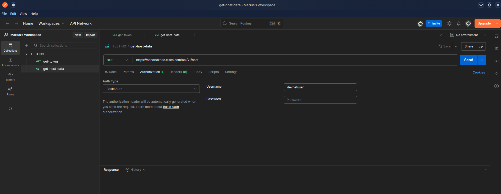

#### Data Formats - XML and JSON

- Now that the Postman dashboard has been shown, it's time to discuss two of the most common data formats that are used with APIs

- The first one is called **Extensible Markup Language (XML)** 

- This format may look familiar, as it is the same format that is commonly used when constructing web services

- XML is a tag-based language, and a tag must begin with a < simbol and end with a > simbol

- For example, a start tag of interface would be represented as <interface>

- Another XML rule is that a section that is started must also be ended

- So if a start tag is called <interface>, the section needs to be closed by using an accompanying end tag

- The end tag must be the same as the string of the start tag preceeded by /

- For example, the end tag for <interface> would be </interface>

- Inside the start tag and end tag, you can use different code and parameters

- Below is shown a snippet of XML output with both start and end tags as well as some configuration parameters

```xml
<users>
  <user>
    <name>root</name>
  </user>
  <user>
    <name>Jason</name>
  </user>
  <user>
    <name>Jamie</name>
  </user>
  <user>
    <name>Luke</name>
  </user>
</users>
```

- Notice that each section has a start tag and an end tag

- The data is structured so that it contains a section called "users", and within that section there are four individual users:

    - root

    - Jason

    - Jamie

    - Luke

- Before and after each username is the start tag <user> and the end tag </user>

- The output also contains start tag <name> and end tag </name>

- These tags are used for each user's name

- If it is necessary to create another section to add another user, you can simply follow the same logic as used in the previous example and build out more XML code

- Remember that one of the key features of XML is that it is readable by both humans and applications

- Indentation of XML sections is part of what makes it so readable

- For instance, if indentation is not used, it is harder to read and follow the sections in XML format

- Although indentation is not required, it is certainly a recommended best practice from a legibility perspective

- Below is shown an XML snippet listing available interfaces on a device

- In this case, the XML code snippet has no indentation, so you can see how much less readable the snippet is than the one from above

```xml
<interfaces>
<interface>
<name>GigabitEthernet1</name>
</interface>
<interface>
<name>GigabitEthernet11</name>
</interface>
<interface>
<name>Loopback100</name>
</interface>
<interface>
<name>Loopback101</name>
</interface>
</interfaces>
```

- The second data format that is important to cover is **JavaScript Object Notation (JSON)**

- Although JSON has not been around as long as XML, it is taking the industry by storm, and some say that it will soon replace XML

- The reason that this data format is gaining popularity, is that it can be argued that JSON is much easier to work with than XML

- It is simple to read and create, and the way the data is structured is much cleaner

- JSON stores all it's information in key/value pairs

- As with XML, JSON is easier to read if the data is indented

- However, even without indentation, JSON is extremely easy to read

- As the name suggests, JSON uses objects for it's format

- Each JSON object starts with a { and ends with a } (these are commonly referred to as curly braces)

- Below is shown how JSON can be used to represent the same username example shown for XML

- You can see that it has four separate key/value pairs, one for each user's name:

```json
{
    "user": "root",
    "father": "Jason",
    "mother": "Jamie",
    "friend": "Luke"
}
```

- In this JSON code snippet, you can see that the first key is user, and the value for that key is a unique username, root

- Now that the XML and JSON data formats have been explained, it is important to cycle back to actually using the REST API and the associated responses and outcomes of doing so

- First we need to look at HTTP response status codes

- Most Internet users have experienced the dreaded "404 Not Found" error when navigating to a website

- However, many users don't know what this error actually means

- Below are listed the most common HTTP status codes as well as the reasons users may receive each one

```
HTTP Status Code                            Result                                  Common Reason for Response Code

200                                         OK                                      Using GET or POST to exchange data with an API

201                                         Created                                 Creating resources by using a REST API call

400                                         Bad Request                             Request failed due to client-side issue

401                                         Unauthorized                            Client not authenticated to access site or API call

403                                         Forbidden                               Access not granted based on supplied credentials

404                                         Not Found                               Page at HTTP URL does not exist or is hidden
```

#### Cisco DNA Center APIs

- The Cisco DNA Center Controller expects all incoming data from the REST API to be in JSON format

- It is also important to note that the HTTP POST function is used to send the credentials to the Cisco DNA Center controller

- Cisco DNA Center uses basic authentication to pass a username and password to the Cisco DNA Center Token API to authenticate users

- This API is used to authenticate a user to the Cisco DNA Center Controller to make additional API calls

- Just as users do when logging in to a device via the CLI, if secured properly, they should be prompted for login credentials

- The same method applies when using an API to authenticate to software

- The key steps necessary to successfully set up the API call in Postman/Bruno are the following:

    1. In the URL bar, enter **https://sandboxdnac.cisco.com/api/system/v1/auth/token** to target the token API

    2. Select HTTP POST operation from the dropdown box

    3. Under the Authorization tab, ensure that type is set to Basic Auth

    4. Enter `devnetuser` as the username and `Cisco123!` as the password

    5. Select the Headers tab and enter Content-Type as the key

    6. Select application/json as value

    7. Click the Send button to pass the credentials to the Cisco DNA Center controller via the Token API

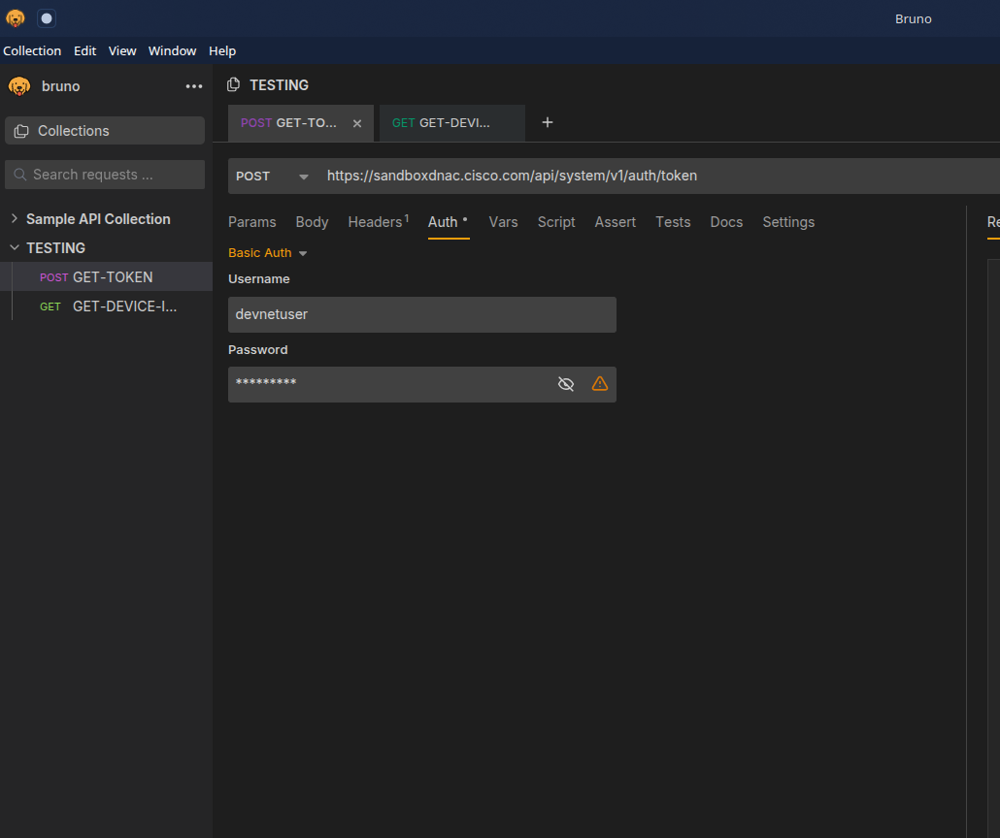

- You need a token for any future API calls to the Cisco DNA Center controller

- When you are successfully authenticated to the Cisco DNA Center controller, you receive a token that contains a string that will be used for authenticating subsequent API calls

- Think of it as a hash that is generated from the supplied login credentials

- The token changes every time an authentication is made to the Cisco DNA Center controller

- It is important to remember that when you are authenticated, the token you receive is usable only for the current authenticated session to the controller

- If another user authenticates via the Token API, he or she will receive a unique token to be able to utilize the API based on his or her login credentials

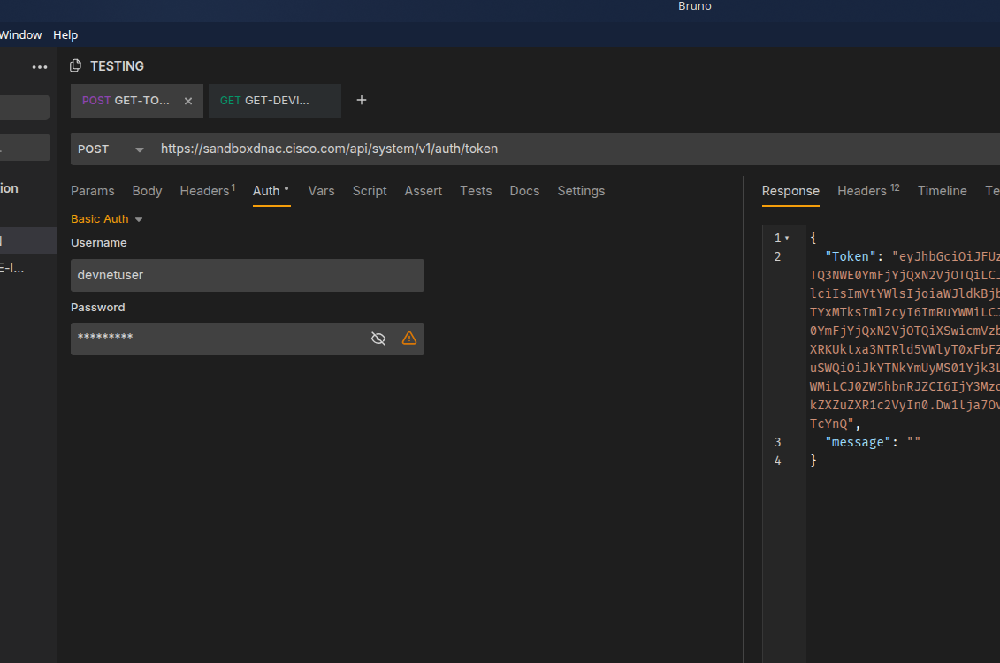

- You can see that the received status code is 200 OK from the Cisco DNA Center controller

- Based on the list from above, you can tell that the API call completed successfully

- In addition you can see how long it took to process the HTTP POST request: 641 ms

- Now we can take a look at some of the other available API calls

- The first API call we can see in this section is the Network Device API, which allows users to retrieve a list of devices that are currently in inventory that are being managed by the Cisco DNA Center Controller

- You need to prepare Postman/Bruno to use the token that was generated when you successfully authenticated to the contoller by following these steps:

    1. Copy the token you received earlier and click a new tab in Postman/Bruno

    2. In the URL bar enter **https://sandboxdnac.cisco.com/api/v1/network-device** in the target URL to target the Network Device API

    3. Select the HTTP GET operation from the dropdown box

    4. In the Headers tab enter Content-Type as the key

    5. Set the application/json as value

    6. Add another key and enter X-Auth-Token

    7. Paste the token as the value

    8. Click Send to pass the token to the Cisco DNA Center controller and perform an HTTP GET to retrieve a device inventory list using the Network Device API

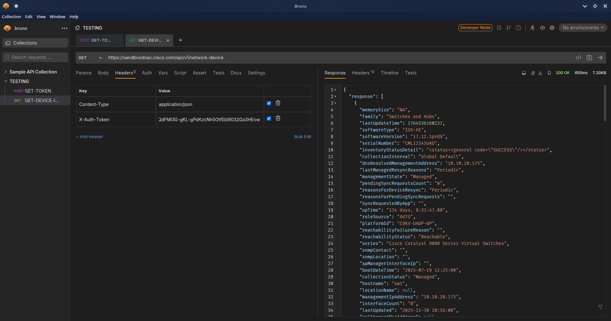

- The token is different from user to user. Remember that a token is unique to each authenticated user

- Response received from the DNA center Network Device API is JSON formated:

```json
{
  "response": [
    {
      "memorySize": "NA",
      "family": "Switches and Hubs",
      "lastUpdateTime": 1764536159105,
      "softwareType": "IOS-XE",
      "softwareVersion": "17.12.1prd9",
      "serialNumber": "CML12345",
      "inventoryStatusDetail": "<status><general code=\"SUCCESS\"/></status>",
      "collectionInterval": "Global Default",
      "dnsResolvedManagementAddress": "10.10.20.176",
      "lastManagedResyncReasons": "Periodic",
      "managementState": "Managed",
      "pendingSyncRequestsCount": "0",
      "reasonsForDeviceResync": "Periodic",
      "reasonsForPendingSyncRequests": "",
      "syncRequestedByApp": "",
      "upTime": "134 days, 8:31:33.00",
      "roleSource": "AUTO",
      "platformId": "C9KV-UADP-8P",
      "reachabilityFailureReason": "",
      "reachabilityStatus": "Reachable",
      "series": "Cisco Catalyst 9000 Series Virtual Switches",
      "snmpContact": "",
      "snmpLocation": "",
      "apManagerInterfaceIp": "",
      "bootDateTime": "2025-07-19 12:24:59",
      "collectionStatus": "Managed",
      "hostname": "sw2",
      "locationName": null,
      "managementIpAddress": "10.10.20.176",
      "interfaceCount": "0",
      "lastUpdated": "2025-11-30 20:55:59",
      "apEthernetMacAddress": null,
      "associatedWlcIp": "",
      "errorCode": null,
      "errorDescription": null,
      "lastDeviceResyncStartTime": "2025-11-30 20:55:24",
      "lineCardCount": "0",
      "lineCardId": "",
      "managedAtleastOnce": true,
      "tagCount": "0",
      "tunnelUdpPort": null,
      "uptimeSeconds": 11689767,
      "vendor": "Cisco",
      "waasDeviceMode": null,
      "type": "Cisco Catalyst 9000 UADP 8 Port Virtual Switch",
      "description": "Cisco IOS Software [Dublin], Catalyst L3 Switch Software (CAT9K_IOSXE), Version 17.12.1prd9, RELEASE SOFTWARE (fc1) Technical Support: http://www.cisco.com/techsupport Copyright (c) 1986-2023 by Cisco Systems, Inc. Compiled Tue 15-Aug-23 16:44 by mcpre",
      "deviceSupportLevel": "Supported",
      "macAddress": "52:54:00:07:29:d0",
      "location": null,
      "role": "ACCESS",
      "instanceUuid": "9e7d73bd-3dce-4581-830f-0e022e0c5e41",
      "instanceTenantId": "6737f2670eb9d40013137d83",
      "id": "9e7d73bd-3dce-4581-830f-0e022e0c5e41"
    }
  ],
  "version": "1.0"
}

(...)
```

- We can see that the response received from the Cisco DNA Center controller has a 200 OK status code, and you can see that the device inventory was received in JSON format

- By now, you should see how powerful APIs can be

- Within a few moments, users are able to gather a tremendous amount of information about the devices currently being managed by the Cisco DNA Center controller

- In the time it takes someone to log in to a device using the CLI and issue all the relevant `show` commands to gather data, an API call can be used to gather that data for the entire network

- APIs give network engineers time to do other things

- When using APIs, it is common to manipulate data using filters and offsets

- Say that a user wants to leverage the Network Device API to gather information only on the second device in the inventory

- This is where the API documentation becomes so valuable

- Most APIs have documentation that explains what they can be used to accomplish

- In Postman/Bruno it is possible to modify the Network Device API URL and add **?limit=1** to the end of the URL to show only a single device in the inventory

- It is also possible to add the **&offset=2** to the end of the URL to state that only the second device in the inventory should be shown

- These query parameters are part of the API and can be invoked using a client like Postman/Bruno as well

- Although it may sound confusing, the limit keyword simply states that a user only wants to retrieve one record from the inventory; the offset command states that the user wants that one record to be the second record in the inventory

- Below is shown how to adjust the Network Devices API URL in Bruno to show information on only the second device in the inventory

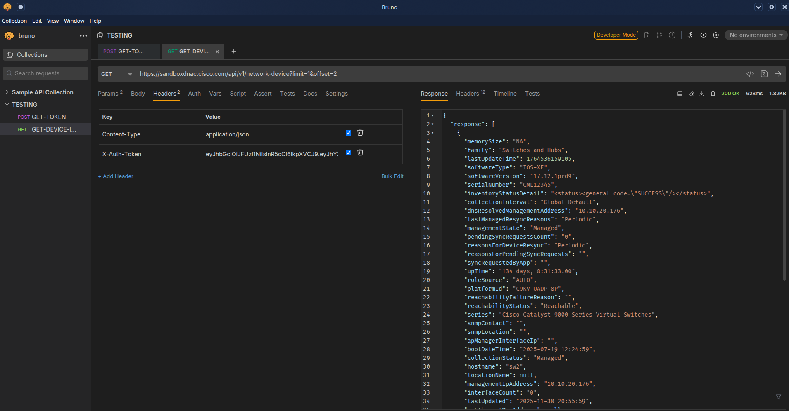

- You can see from the response that the second device is consistent with the output that was initially shown in the first Network Device API call

- This device is a Cisco Catalyst 9000 switch with the MAC address "52:54:00:07:29:d0"

#### Cisco vManage APIs

- Here we will see the various APIs available in the Cisco SD-WAN (specifically, the vManage controller)

- We will also see how to interact with APIs programatically by using Postman/Bruno

- Leveraging Cisco SD-WAN APIs is a bit different from using the Cisco DNA Center APIs, but the two processes are quite similar

- As when using a Cisco DNA Center API, with a Cisco SD-WAN API you need to provide login credentials to the API in order to be able to utilize the API calls

- Some key pieces of information are necessary to successfully set up the API call in Bruno:

    - The URL bar must have the API call to target the Authentication API

    - The HTTP POST operation is used to send the username and password to Cisco vManage

    - The Header Content-Type must be application/x-www-form-urlencoded

    - The body must contain keys with the j_username devnetuser and thej_password Cisco123!

- The steps for connecting to APIs are different for Cisco SD-WAN than for Cisco DNA Center

- Detailed steps for setting up the Postman/Bruno environment for SD-WAN are available on [sd-wan-api-docs](https://developer.cisco.com/sdwan)

- The Cisco DNA Center Postman/Bruno environemnt setup are available at [DNA-center-API-docs](https://developer.cisco.com/learning/tracks/dnacenter-programmability)

- To set up a Postman/Bruno environment you can simply download steps into Postman from DevNet by going to https://developer.cisco.com/sdwan

- By doing so, you can quickly set up an environment that contains all the necessary authentication details and practice with the APIs without having to spend much time getting familiar with the details of Postman/Bruno


- When the Postman/Bruno environment is set up, you click the Send button, the credentials are passed to vManage using the Authentication API

- The response you receive delivers something called a Java Session ID, which is displayed as JSESSIONID

- This is similar to the Cisco DNA Center token from above examples

- This session ID is passed to vManage for all future API calls from this user

- The HTTP status code 200 OK indicates a successful post to vManage with the proper credentials

- Now let's look at another API call that collects an inventory of fabric devices within Cisco vManage

- Using the HTTP GET operation, this API collects the requested information and displays it in Postman/Bruno

- Below you can see a lot from Cisco vManage's response

- You can see the URL for this API in the URL bar, and you can also see the HTTP GET request

- You can also see that the response is in JSON format, which makes the data easy to read and consume

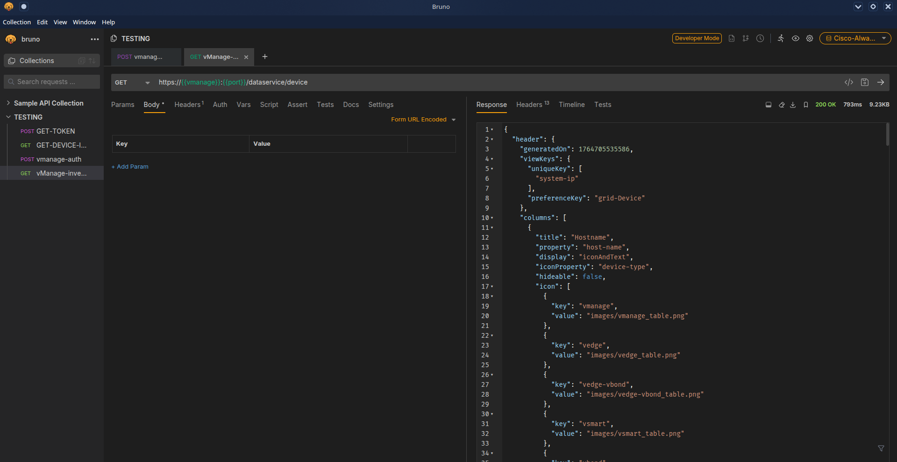

- If you scroll down in the response, you can see a list of devices under the "data" key received from the API call

- This list contains a series of information about each fabric device within Cisco vManage

- Some of the information is as follows:

    - Device ID

    - System IP

    - Host name

    - Reachability

    - Status

    - Device type

    - Site ID

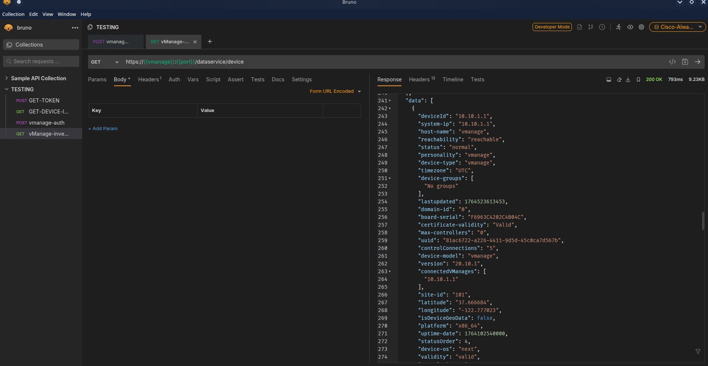

```json
"data": [
    {
      "deviceId": "10.10.1.1",
      "system-ip": "10.10.1.1",
      "host-name": "vmanage",
      "reachability": "reachable",
      "status": "normal",
      "personality": "vmanage",
      "device-type": "vmanage",
      "timezone": "UTC",
      "device-groups": [
        "No groups"
      ],
      "lastupdated": 1764523613453,
      "domain-id": "0",
      "board-serial": "F6963C4202C4B04C",
      "certificate-validity": "Valid",
      "max-controllers": "0",
      "uuid": "81ac6722-a226-4411-9d5d-45c0ca7d567b",
      "controlConnections": "5",
      "device-model": "vmanage",
      "version": "20.10.1",
      "connectedVManages": [
        "10.10.1.1"
      ],
      "site-id": "101",
      "latitude": "37.666684",
      "longitude": "-122.777023",
      "isDeviceGeoData": false,
      "platform": "x86_64",
      "uptime-date": 1764102540000,
      "statusOrder": 4,
      "device-os": "next",
      "validity": "valid",
      "state": "green",
      "state_description": "All daemons up",
      "model_sku": "None",
      "local-system-ip": "10.10.1.1",
      "total_cpu_count": "4",
      "testbed_mode": false,
      "layoutLevel": 1
    }
]
```

- As you can see, a simple API call has the power to gather a significant amount of information

- How the data is used, is up to the person making the API calls and collecting the data

- All the tools, processes and APIs can be leveraged to provide tremendous value to the business - from visibility into the environment to building relevant use cases to be consumed by the business or it's customers

### Data Models and Supporting Protocols

- Here we will see a high level overview of some of the most common data models and tools and how are they leveraged in a programmatic approach

    - Yet Another Next Generation (YANG) modeling language

    - Network Configuration Protocol (NETCONF)

    - RESTCONF

#### YANG Data Models

- SNMP is widely used for fault handling and monitoring

- However, it is not often used for configuration changes

- CLI scripting is used more often than other methods

- YANG data models are an alternative to SNMP MIBs and are becoming the standard for data definition languages

- YANG, which is defined in RFC 6020, uses data models

- Data models are used to describe whatever can be configured on a device, everything that can be monitored on a device, and all the administrative actions that can be executed on a device, such as resetting counters or rebooting the device

- This includes all the notifications that the device is capable of generating

- All these variables can be presented within a YANG model

- Data models are very powerful in that they can create a uniform way to describe data, which can be beneficial across vendors' platforms

- Data models allow network operators to configure, monitor, and interact with network devices holistically across the entire enterprise environment

- YANG models use a tree structure

- Within that structure, the models are similar in format to XML and are constructed in modules

- These modules are hierarchical in nature and contain all the different data and types that make up a YANG device model

- YANG models make a clear distinction between configuration data and state information

- The three structure represents how to reach a specific element of the model, and the elements can be either configurable or not configurable

- Each element has a defined type

- For example, an interface can be configured to be on or off

- However, the operational interface state cannot be changed; for example, if the options are only up or down, it is either up or down, and nothing else is possible

- Below is a simple YANG module taken from RFC 6020

```yang
container food {
    choose snack {
        case sports-arena {
            leaf pretzel {
                type empty;
            }
            lead popcorn {
                type empty;
            }
        }
        case late-night {
            leaf chocolate {
                type enumeration {
                    enum dark;
                    enum milk;
                    enum first-available;
                }
            }
        }
    }
}
```

- The output from above can be read as follows:

- There is food

- Of that food there is a choice of snack

- The snack choices are pretzels and popcorn

- If it is late at night, the snack choices are two different types of chocolate

- A choice must be made to have milk chocolate or dark chocolate, and if the consumer is in a hurry and does not want to wait, the consumer can have the first available chocolate

- Below is shown a network-oriented example that uses the same structure

```yang
list interface {
    key "name";
    leaf name {
        type string;
    }
    leaf speed {
        type enumeration {
            enum 10m,
            enum 100m;
            enum auto
        }
    }
    leaf observed-speed {
        type uint32;
        config false;
    }
}
```

- The YANG model from the above can be read as follows:

- There is a list of interfaces

- Of the available interfaces, there is a specific interface that has three configurable speeds

- Those speeds are 10 Mbps, 100 Mbps and auto, as listed in the leaf named speed

- The leaf named observed-speed cannot be configured due to the config false command

- This is because as the leaf is named, the speeds in the leaf are what was auto-detected (observed); hence, it is not a configurable leaf

- This is because it represents the auto-detected value on the interface, not a configurable value

#### NETCONF

- NETCONF, defined in RFC 4741 and RFC 6241, is an IETF standard protocol that uses YANG data models to communicate with the various devices on the network

- NETCONF runs over SSH, TLS, and (although not common), Simple Object Access Protocol (SOAP)

- Some of the key differences between SNMP and NETCONF are listed below

- One of the most important differences is that SNMP can't distinguish between configuration data and operational data, but NETCONF can

- Another key differentiator is that NETCONF uses paths to describe resources, whereas SNMP uses object identifiers (OIDs)

- A NETCONF path can be similar to interfaces/interface/eth0, which is much more descriptive than you would expect from SNMP

- The following is a list of some of the common use cases for NETCONF:

    - Collecting the status of specific fields

    - Changing the configuration of specific fields

    - Taking administrative actions

    - Sending event notifications

    - Backing up and restoring configurations

    - Testing configurations before finalizing the tranzaction

```
Feature                                 SNMP                                                NETCONF

Resources                               OIDs                                                Paths

Data models                             Defined in MIBs                                     YANG core models

Data modeling language                  SMI                                                 YANG

Management operations                   SNMP                                                NETCONF

Encoding                                BER                                                 Either XML or JSON

Transport stack                         UDP                                                 SSH/TCP
```

- Transactions are all of nothing

- There is no order of operations or sequencing within a transaction

- This means there is no part of the configuration that is done first; the configuration is deployed all at the same time

- Transactions are processed in the same order every time on every device

- Transactions, when deployed run in parallel state and do not have any impact on each other

- Parallel transactions touching different areas of the configuration on a device does not overwrite or interfere with each other

- They also do not impact each other if the same transaction is run against multiple devices

- Below is provided an example of a NETCONF element from RFC 4741

- This NETCONF output can be read as follows: 

- There is an XML list of users named users

- In that list, there are individual users named Dave, Rafael, and Dirk

```xml
<rpc-reply message-id="101">
    xmlns="urn:ietf:params:xml:ns:netconf:base:1.0"
    <data>
        <top xmlns="http://example.com/schema/1.2/config">
            <users>
                <user>
                    <name>Dave</name>
                </user>
                <user>
                    <name>Rafael</name>
                </user>
                <user>
                    <name>Dirk</name>
                </user>
            </users>
        </top>
    </data>
</rpc-reply>
```

- An alternative way of looking at this type of NETCONF output is to simply look at it as though it were a shopping list

- Below is provided an example of the shopping list concept

- It can be read as follows:

- There is a group called beverages

- Of these beverages, there are soft drinks and tea

- The available soft drinks are cola and root beer

- Of the available tea, there is sweetened and unsweetened

```
Beverages
    Soft drinks
        Cola
        Root beer
    Tea
        Sweetened
        Unsweetened
```

- Below we can see how NETCONF uses YANG data models to interact with network devices and then talk back with the management applications

- The dotted lines shows how the devices talking back directly to the management applications, and the solid lines illustrates the NETCONF protocol talking between the management applications and the devices

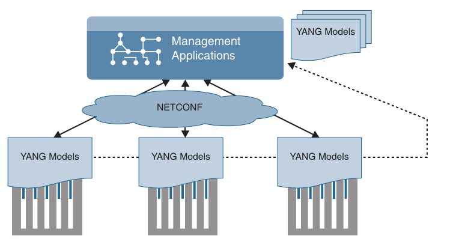

- NETCONF exchanges information called capabilities when the TCP connection has been made

- Capabilities tell the client what the device it's connected to can do

- Furthermore, other information can be gathered by using the common NETCONF operations shown below

```
NETCONF Operation                                               Description

<get>                                                           Requests running configuration and state information of the device

<get-config>                                                    Requests some or all of the configuration from the datastore

<edit-config>                                                   Edits a configuration datastore by using CRUD operations

<copy-config>                                                   Copies the configuration to another datastore

<delete-config>                                                 Deletes the configuration
```

- Information and configurations are stored in datastores

- Datastores can be manipulated by using NETCONF operations listed above

- NETCONF uses Remote Procedure Call (RPC) messages in XML format to send the information between hosts

- Now that we've looked at the basics of NETCONF and XML, let's examine some actual examples of a NETCONF RPC message

- Below is shown an example of an OSPF NETCONF RPC message that provides the OSPF routing configuration of an IOS XE device

```xml
<rpc-reply message-id="urn:uuid:0e2c04cf-9119-4e6a-8c05-238ee7f25208"
xmlns="urn:ietf:params:xml:ns:netconf:base:1.0" xmlns:nc="urn:ietf:params:
xml:ns:netconf:base:1.0">
  <data>
    <native xmlns="http://cisco.com/ns/yang/ned/ios">
      <router>
        <ospf>
          <id>100</id>
          <redistribute>
            <connected>
                <redist-options>
                    <subnets/>
                </redist-options>
            </connected>
          </redistribute>
          <network>
            <ip>10.0.0.0</ip>
            <mask>0.0.255.355</mask>
            <area>0</area>
          </network>
          <network>
            <ip>20.20.0.0</ip>
            <mask>0.0.255.255</mask>
            <area>0</area>
          </network>
          <network>
            <ip>100.100.0.0</ip>
            <mask>0.0.255.255</mask>
            <area>0</area>
          </network>
        </ospf>
      </router>
    </native>
  </data>
</rpc-reply>
```

- The same OSPF router configuration that would be seen in the command-line interface of a Cisco router can be seen using NETCONF

- The data is just structured in XML format rather than what users are accustomed to seeing in the CLI

- It is easy to read the output in these examples because of how legible XML is

- Below is a configuration save example of a network device by leveraging NETCONF

```xml
<?xml version="1.0" encoding="utf-8"?>
<rpc xmlns="urn:ietf:parms:xml:ns:netconf:base:1.0" message-id="">
    <cisco-ia:save-config xmlns:cisco-ia="http://cisco.com/yang/cisco-ia"/>
</rpc>
```

#### RESTCONF

- RESTCONF, defined in RFC 8040 is used to programatically interface with data defined in YANG models while using the datastore concepts defined in NETCONF

- It is a common misconception that RESTCONF is meant to replace NETCONF, but this is not the case

- Both are very common methods used for programmability and data manipulation

- In fact, RESTCONF uses the same YANG models as NETCONF and Cisco IOS XE

- The goal or RESTCONF is to provide a RESTful API experience while leveraging the device abstraction capabilities provided by NETCONF

- RESTCONF supports the following HTTP methods and CRUD operations:

    - GET

    - POST

    - PUT

    - DELETE

    - OPTIONS

- The RESTCONF requests and responses can use either JSON or XML structured data formats

- Below is shown a brief example of a RESTCONF get request on a Cisco router to retrieve the logging severity level that is configured

- This example uses JSON instead of XML

- Notice the HTTP status 200, which indicates that the request was successful

```
RESTCONF GET

.............................

URL: https://10.85.116.59:443/restconf/data/Cisco-IOS-XE-native:native/logging/monitor/severity

Headers: {'Accept-Encoding': 'gzip, deflate', 'Accept': 'application/yang-data+json, application/yang-data.errors+json'}

Body:


RESTCONF RESPONSE

............................

200

{
    "Cisco-IOS-XE-native:severity": "critical"
}
```

#### Cisco DevNet

- Examples and tools discussed are available for use and practice at Cisco DevNet (https://developer.cisco.com)

- Network operators who are looking to enhance or increase their skills with APIs, coding, Python or even controller concepts can find a wealth of help at DevNet

- At DevNet it is easy to find learning labs and content to help solidify current knowledge of network programability 

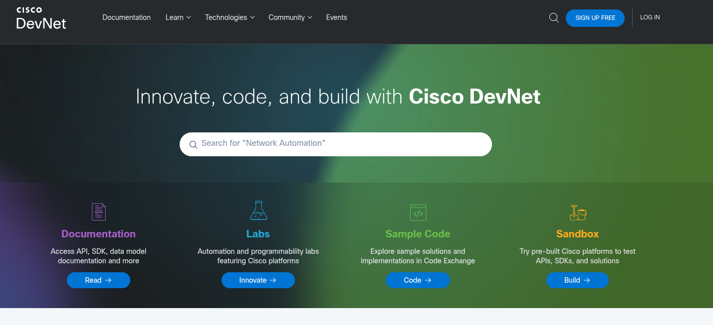

- High level overview of DevNet

- Options for the home page:

    - Documentation

    - Learn

    - Technologies

    - Community

    - Events

##### Documentation

- The documentation page is a single place to get information on API documentation for a variety of solutions such as Cisco DNA center, Cisco SD-WAN, IoT, Collaboration, and more

- The API references provide information on how to programatically interact with these solutions

- This is a great place to start when learning how to interact with devices and software-defined controllers

##### Learn

- The Learn page is where you can navigate the different offerings that DevNet has available

- Under this tab are subsections for guided learning tracks, which guide you through various technologies and the associated API labs

- Some of the labs you interact with are Programming the Cisco Digital Network Architecture (DNA), ACI programming, Getting started with Cisco WebEx teams APIs, and Introduction to DevNet

- When you choose a learning lab and start a module, the website tracks all your progress so you can go away and come back and continue where you left off

- This is helpful to continue your education over the course of multiple days or weeks

##### Technologies

- The Technologies page allows you to pick relevant content based on the technology you want to study and dive directly into the associated labs and training for that technology

- Networking content currently available

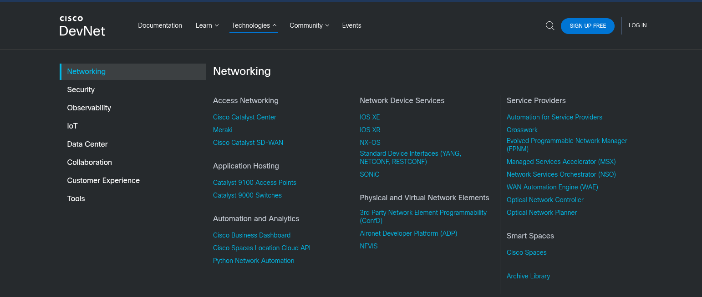

##### Community

- Perhaps one of the most important sections of DevNet is the Community page

- This is where users have access to many different people at various stages of learning

- DevNet ambasadors and evangelists are available to help at various stages of your learning journey

- The Community page puts the latest events and news at your fingertips

- This is also the place to read blogs, sign up for developer forums, and follow DevNet on all major social media platforms

- This is a safe zone for asking questions, simple or complex

- The DevNet community page is the place to start for all things Cisco and Network Programmability

- Below are shown some of the available options for users on the Community page

##### Events

- The DevNet events page, provides a full list of events that have happened in the past or that will be happening in the future

- This is where a user can find the upcoming DevNet Express events as well as conferences where DevNet will be presenting

### GitHub

- One of the most efficient and commonly adopted ways of using version control is by using GitHub

- GitHub is a hosted web-based repository for code

- It has capabilities for bug tracking and task management as well

- Using GitHub is one of the easiest ways to track changes in your files, collaborate with other developers, and share code with the online community

- It is a great place to look for code to get started on programmability

- Often times, other engineers or developers are trying to accomplish similar tasks and have already created and tested the code necessary to do so

- One of the most powerful features of using GitHub is the ability to rate and provide feedback on other developers' code

- Peer review is encouraged in the coding community

- GitHub provides a guide that steps through how to create a repository, start a branch, add comments, and open a pull request

- You can also just start a GitHub project when you are more familiar with the GitHub tool and it's associated processes

- Projects are repositories that contain code files

- GitHub provides a single pane to create, edit, and share code files

- Below is shown a repository that contains three files:

    - ENCORE.txt

    - JSON_Example.txt

    - README.md

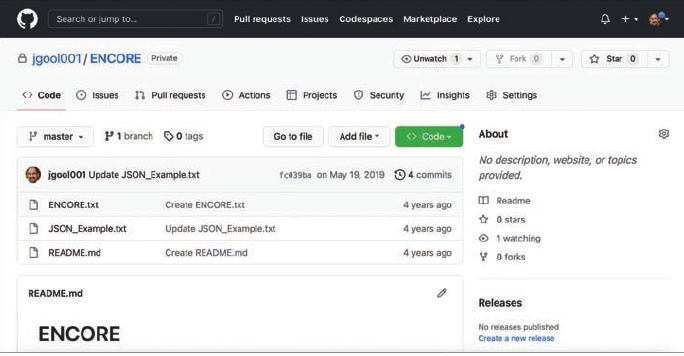

- GitHub also gives a great summary of commit logs, so when you save a change in one of your files or create a new file

- GitHub shows details about it on the main repository page

- If you drill down into one of the files in the repository, you can see how easy it is to edit and save code

- If you drill down into JSON_Example.txt, for example, GitHub shows it's contents and how to edit the file in the repository

- If you click the filename JSON_Example.txt, you can see that the file has seven lines of code and is 77 bytes in size

- Below is shown the content of the JSON_Example.txt file and the options available with the file

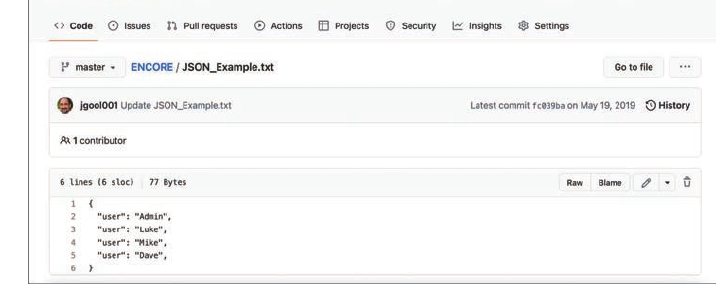

- The pencil allows you to go into editing mode and modify the file content

- This editor is very similar to any other text editor

- You can simply type into the editor or copy and paste files from other files directly into it

- Below we can see the addition of another user called Zuul

- If the code were to be committed, the changes in the file could be saved with the new user added to the file

- Now that the file is available in the repository, other GitHub users and developers can contribute to this code or add and delete lines of code based on the code that was originally created

- For example, if a user has some code to to add a new user via JSON syntax, someone could use that code and simply modify the usernames or add the code to enhance it

- This is the true power of sharing code

### Basic Python Components and Scripts

- **Python** has by a longshot become one of the most common programming languages in therms of network programmability

- Learning to use programming languages can be daunting

- Python is one of the easiest languages to get started with and interpret

- We will see how to build some of the fundamental skills necessary to be able to interpret Python scripts

- When you understand the basics of interpreting what a Python script is designed to do, it will be easier to understand and leverage other scripts that are available

- GitHub has some amazing Python scripts available for download that come with very detailed instructions and documentation

- Now we can leverage the new knowledge gained about APIs, HTTP operations, DevNet, and GitHub

- Below is shown a Python script that sets up the environment to log in to the Cisco DNA Center sandbox

- This script uses the same credentials used with the Token API used earlier in this chapter

- Env_Lab.py

```py
""" Set the environment information needed to access your lab

The provided sample code in this repository will reference this file to get 
the information needed to connect to your lab backend. You provide this info here once
and the scripts in this repository will access it as needed by the lab

(...)

"""

# User Input

# Please select the lab environment that you will be using today
#
#   sandbox - Cisco DevNet Always-On /Reserved sandboxes
#   express - Cisco DevNet Express Lab Backend
#   custom - Your own "Custom" Lab Backend

ENVIRONMENT_IN_USE = "sandbox"

# Set the 'Environment Variables' based on the lab environment in use

if ENVIRONMENT_IN_USE == "sandbox":
    dnac = {
        "host": "sandboxdnac.cisco.com",
        "port": 443,
        "username": "devnetuser",
        "password": "Cisco123!"
    }
```

- The Env_Lab.py python script starts with three quotation marks

- These three quotation marks begin and end a multiline string

- A string is simply one or more alphanumeric characters

- A string can comprise many numbers or letters, depending on the Python version in use

- In the case of this script, the creator used a multiple-line to put additional overall comments into the script

- This is not mandatory, but you can see that comments are helpful

- The # character indicates a comment in the Python script file

- Some comments usually describe the intent of an action within the code

- Comments often appear right above the action they describe

- Some scripts have a comment for each option, and some are not documented very well, if at all

- The comments in the Env_Lab.py indicate that there are three available options for selecting the lab environment to use:

    - **Sandbox**: The line in this python script that says ENVIRONMENT_IN_USE = "sandbox", corresponds with the selection of the sandbox type of lab environments available throug Cisco DevNet

    - In this instance, "sandbox" refers to the always-on and reserved sandboxes that can be accessed through https://developer.cisco.com

    - **Express**: This is the back end that is used for the DevNet Express Events that are held globally at various locations and Cisco office locations

    - **Custom**: This is used in the event that there is already a Cisco DNA Center installed either in a lab or other facility, and it needs to be accessed using this script

- As you can see in the python script, a few variables are used to target the DevNet Cisco DNA Center sandbox specifically:

```
Variable                        Value                                   Description

host                            sandboxdnac.cisco.com                   Cisco DNA Center sandbox URL

port                            443                                     TCP port to access the URL securely (HTTPS)

username                        devnetuser                              Username to log in to Cisco DNA Center sandbox (via API or GUI)

password                        Cisco123!                               Password to log in to Cisco DNA Center sandbox (via API or GUI) 
```

- The variables shown should look familiar as they are similar to the JSON data format

- Remember that JSON uses key/value pairs and is extremely easy to read and interpret

- In the script you can see the key/value pair "username": "devnetuser" 

- The structure used to hold all the key/value pairs in this script is called dictionary

- In this particular python script, the dictionary is named dnac

- The dictionary named dnac contains multiple key/value pairs, and it starts and ends with curly braces ({})

```py
dnac = {
    "host": "sandboxdnac.cisco.com",
    "port": 443,
    "username": "devnetuser",
    "password": "Cisco123!"
}
```

- Dictionaries can be written in multiple different ways

- Whereas above is shown a multi-line dictionary that is easy redable, below is shown the same dictionary written as a single line:

```py
dnac = {"host": "sandboxdnac.cisco.com", "port": 443, "username": "devnetuser", "password": "Cisco123!"}
```

- Notice that the line `ENVIRONMENT_IN_USE = "sandbox"` is used in this script

- Following that line in the script there is a line that states `if ENVIRONMENT_IN_USE = "sandbox":`

- This is called a condition (if statement)

- A logical if question is asked, and depending on the answer, an action happens

- In this exammple, the developer called out to use the sandbox option with the line of code `ENVIRONMENT_IN_USE = "sandbox"` and then used a condition to say that if the environment in use is sandbox, call a dictionary called dnac to provide the sandbox details that are listed in key/value pairs

- Below is shown the two relevant lines of code to illustrate this

- Now let's look at a script that showcases much of the API information that was covered above and also builds on all the basic Python information that has just been provided

- Python script is called get_dnac_devices.py

```py
# specifies what version and interpreter of python will be used
#!/usr/bin/env python3

# Calls dnac dictionary from the Env_Lab.py script covered earlier
from Env_Lab import dnac
# Imports the json module so that python can understand the data format that contains key/value pairs
import json
# Imports requests module which handle HTTP headers and form data
import requests
# Imports urllib3 module which is an HTTP client
import urllib3
# Imports HTTPBasicAuth method from the requests.auth module to handle authentication with username and password
from requests.auth import HTTPBasicAuth
# Imports prettytable components from PrettyTable module to structure return data in table format
from prettytable import PrettyTable

# Puts return data into a easily readable table with the specified column names 
dnac_devices = PrettyTable(["Hostname", "Platform ID", "Software Type", "Software Version", "Series", 
                            "IP address", "Up Time"])

dnac_devices.padding_width = 1

# Silence the insecure warnings due to SSL Certificates

urllib3.disable_warnings(urllib3.exceptions.InsecureRequestWarning)

# Sends specific HTTP headers when issuing HTTP GET to the Network Devices API
headers = {
    "content-type": "application/json",
    "x-auth-token": ""
}


# Get token from DNAC Token API
# This function does an HTTP POST request to the DNAC Token API and uses the
# values built in the key/value pair  formats taken from Env_Lab.py script
# The response is stored as the token that is used to make future API calls
# for the authenticated user
def dnac_login(host, username, password):
    url = f"https://{host}/api/system/v1/auth/token"
    response = requests.request("POST", url, auth=HTTPBasicAuth(username, password),
                                headers=headers, verify=False)

    return response.json()["Token"]

# Get network devices information and add them to the table
def network_device_list(dnac, token):
    url = f"https://{dnac['host']}/api/v1/network-device"
    headers['x-auth-token'] = token
    response = requests.get(url, headers=headers, verify=False)
    data = response.json()
    # print(f"Data is:\n {data}")
    for item in data["response"]:
        dnac_devices.add_row([item['hostname'], item["platformId"], item["softwareType"], item["softwareVersion"], 
                             item["series"], item["managementIpAddress"], item["upTime"]])

login = dnac_login(dnac["host"], dnac["username"], dnac["password"])

network_device_list(dnac, login)

print(dnac_devices)

```

- It might seem like there is a lot going on in the get_dnac_device.py script

- However many of the details have already been explained

- The first section of code tells the Python interpreter what modules this particular script will use

- Think of a module as a collection of actions and instructions

- To better explain the content, comments are inserted throughout the script to help document each section

- Modules help Python understand what it is capable of

- For example, if a developer tried to do a HTTP GET request without having the requests modules imported, it would be difficult for python how to interpret the HTTP call

- Although there are other ways of doing HTTP calls from python, the requests modules greatly simplify the process

- Functions are blocks of code that are built to perform specific actions

- Functions are very structured in nature and can often be reused later on within a Python script

- Some functions are built into Python and do not have to be created

- A great example of this is the print function which can be used to print data to a terminal screen

- You can see the print function at the end of our script

- Remember that in order to execute any API calls to Cisco DNA Center you must be authenticated using the Token API

- The dnac_login function is used to get the token information from the token API, as we have seen in Postman/Bruno earlier, and be used to make requests to any DNA Center API after this

- The network_device_list function ties the Token API to the Network Device API call to retrieve the information from the Cisco DNA Center

- The line that says `headers["x-auth-token"] = token` is mapping the JSON response from the previous function, which is the token, into the header called x-auth-token

- In addition, the URL for the API was changed to network_device, and the response is sending a requests.get to that URL

- This is exactly the same example made with Postman/Bruno earlier

- The final section of the get_dnac_devices function shows code that ties together the dnac dictionary to the dnac_login function

- In addition, the print function takes the response received from the response.get that was send to the network device API, and puts it into the table format that was specified with the name dnac_devices

- The Python script examples from above makes it easy to see the power and easy-to-use nature of Python

- The tools mentioned here, including Bruno and Python are readily available on the Internet for free

- A great way to practice is by using a sandbox environment and just building code and running it to see what can be accomplished

- You are only limited by your imagination and coding skills
