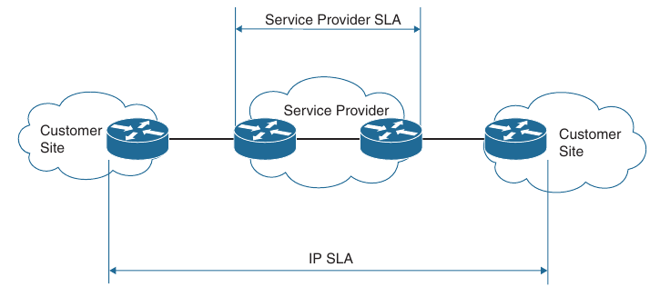
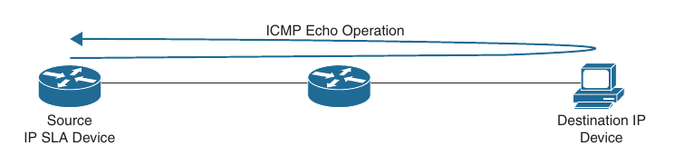
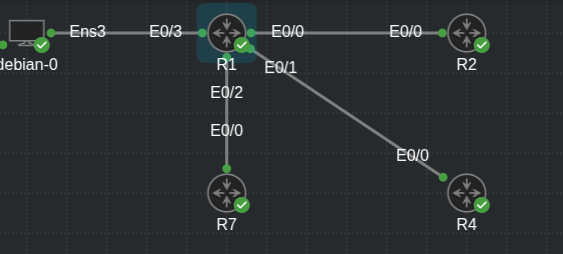

## IP SLA

- IP SLA is a is a tool built into Cisco IOS software that allows for the continuous monitoring of various aspects of the network

- The different types of probes that can be configured to monitor traffic within a network environment include the following:

    - Delay (both round-trip and one-way)

    - Jitter (directional)

    - Packet loss (directional)

    - Packet sequencing (packet ordering)

    - Path (per hop)

    - Connectivity (directional)

    - Server or website download time

    - Voice quality scores

- IP SLA has proven to be a useful tool because it provides a variety of flexible monitoring options

- Typically, any SLA received from a service provider only monitors or guarantees the traffic as it flows across the service provider's network

- This doesn't provide an end-to-end SLA - or visibility for that matter

- However, IP SLA is a robust tool that can help with troubleshooting

- Below is shown a scenario and illustrates why IP SLA provides more visibility than a typical service provider SLA



- There are many options and probes available for IP SLA

- We will focus only on the ICMP and HTTP operations of the IP SLA

- The ICMP echo operation can functionally be thought of as testing reachability by leveraging ICMP echo and echo replies or pings

- Below is illustrated how the ICMP echo operation works in IP SLA



- Topology:



- To configure any IP SLA operation the following command should be used to enter the IP SLA configuration mode:

```
conf t
 ip sla <operation-nr>
```

- Here, the operation number is the configuration for the individual IP SLA probe

- This is necessary because there can be multiple IP SLA instances configured on a single device, all doing different operations or verification tasks

- Configure the IP SLA operation for ICMP echo:

```
conf t
 ip sla 1
  icmp-echo <destnation-ip-address | destination-hostname> source-ip <ip-address | hostname> | source-interface <interface-name>
```

- The next step is to specify how often the ICMP echo operation should run

- It can be done as follows:

```
conf t
 ip sla 1
  frequency <seconds>
```

- Note that many additional optional parameters are available for configuring IP SLA

- Basic setup and scheduling of IP SLA ICMP echo operations

- Config until now:

```
conf t
 ip sla 1
  icmp-echo 192.168.14.4 source-interface l0
  frequency 300
```

- When the IP SLA configuration is complete, an important step is to schedule and activate the IP SLA operation that has been configured

- In order to do this use the following command:

```
conf t
 ip sla schedule <operation-nr> [life [forever | seconds] [start-time hh:mm:ss| month-day | day-month] | pending | now | after hh:mm:ss | ageout seconds] | [recurring]
```

- Example:

```
conf t
 ip sla schedule 1 life forever start-time now
```

- Verifying the configuration

```
R1(config)#do sh ip sla config
IP SLAs Infrastructure Engine-III
Entry number: 1
Owner: 
Tag: 
Operation timeout (milliseconds): 5000
Type of operation to perform: icmp-echo
Target address/Source interface: 192.168.14.4/Loopback0
Type Of Service parameter: 0x0
Request size (ARR data portion): 28
Data pattern: 0xABCDABCD
Verify data: No
Vrf Name: 
Do not fragment: No
Schedule:
   Operation frequency (seconds): 300  (not considered if randomly scheduled)
   Next Scheduled Start Time: Start Time already passed
   Group Scheduled : FALSE
   Randomly Scheduled : FALSE
   Life (seconds): Forever
   Entry Ageout (seconds): never
   Recurring (Starting Everyday): FALSE
   Status of entry (SNMP RowStatus): Active
Threshold (milliseconds): 5000
Distribution Statistics:
   Number of statistic hours kept: 2
   Number of statistic distribution buckets kept: 1
   Statistic distribution interval (milliseconds): 20
Enhanced History:
History Statistics:
   Number of history Lives kept: 0
   Number of history Buckets kept: 15
   History Filter Type: None
```

- Another common use for IP SLA is to monitor HTTP destinations for operation

- This can be done using the HTTP GET operation of IP SLA

- To configure this type of monitoring:

```
conf t
 ip sla <operation-nr>
  http [get | raw] url [name-server <ip-address>] [version <version-nr>] [source-ip <ip-address | hostname>] [source-port <port-number>] | cache [<enable| disable>] [proxy <proxy-url>]
```

- When the probe is configured, this operation needs to be scheduled.

- Config on R1:

```
conf t
 ip sla 2
  http get http://192.168.17.7 source-interface l0
   frequency 90
   exit
  exit
  ip sla schedule 2 start-time now life forever
```

- Verification:

```
R1(config)#do sh ip sla conf 2
IP SLAs Infrastructure Engine-III
Entry number: 2
Type of operation to perform: http
Target address/Source address: 192.168.17.7/0.0.0.0
Target port/Source port: 80/0
Type Of Service parameters: 0x0
Source interface: Loopback0
Vrf Name: 
HTTP Operation: get
HTTP Server Version: 1.0
URL: http://192.168.17.7
Proxy: 
Raw String(s):
Cache Control: enable
Owner: 
Tag: 
Operation timeout (milliseconds): 60000
Schedule:
   Operation frequency (seconds): 90  (not considered if randomly scheduled)
   Next Scheduled Start Time: Start Time already passed
   Group Scheduled : FALSE
   Randomly Scheduled : FALSE
   Life (seconds): Forever
   Entry Ageout (seconds): never
   Recurring (Starting Everyday): FALSE
   Status of entry (SNMP RowStatus): Active
Threshold (milliseconds): 5000
Distribution Statistics:
   Number of statistic hours kept: 2
   Number of statistic distribution buckets kept: 1
   Statistic distribution interval (milliseconds): 20
History Statistics:
   Number of history Lives kept: 0
   Number of history Buckets kept: 15
   History Filter Type: None
```

```
R1#show ip sla statistics 
IPSLAs Latest Operation Statistics

IPSLA operation id: 1
        Latest RTT: 2 milliseconds
Latest operation start time: 20:31:09 UTC Wed Nov 5 2025
Latest operation return code: OK
Number of successes: 5
Number of failures: 0
Operation time to live: Forever


IPSLA operation id: 2
        Latest RTT: NoConnection/Busy/Timeout
Latest operation start time: 20:32:07 UTC Wed Nov 5 2025
Latest operation return code: No connection
Latest DNS RTT: 0 ms
Latest TCP Connection RTT: 0 ms
Latest HTTP Transaction RTT: 0 ms
Number of successes: 0
Number of failures: 1
Operation time to live: Forever
```

- IP SLA 3 - monotor debian HTTP server (apache) - response time:

```
conf t
 ip sla 3
  http get http://192.168.144.11
   frequency 90
 ip sla schedule 3 life forever start-time now
```

```
R1(config)#do sh ip sla stat 3
IPSLAs Latest Operation Statistics

IPSLA operation id: 3
        Latest RTT: 7 milliseconds
Latest operation start time: 20:52:31 UTC Wed Nov 5 2025
Latest operation return code: OK
Latest DNS RTT: 0 ms
Latest TCP Connection RTT: 3 ms
Latest HTTP Transaction RTT: 4 ms
Number of successes: 3
Number of failures: 0
Operation time to live: Forever
```

```
1#sh ip sla configuration 3
IP SLAs Infrastructure Engine-III
Entry number: 3
Type of operation to perform: http
Target address/Source address: 192.168.144.11/0.0.0.0
Target port/Source port: 80/0
Type Of Service parameters: 0x0
Vrf Name: 
HTTP Operation: get
HTTP Server Version: 1.0
URL: http://192.168.144.11
Proxy: 
Raw String(s):
Cache Control: enable
Owner: 
Tag: 
Operation timeout (milliseconds): 60000
Schedule:
   Operation frequency (seconds): 90  (not considered if randomly scheduled)
   Next Scheduled Start Time: Start Time already passed
   Group Scheduled : FALSE
   Randomly Scheduled : FALSE
   Life (seconds): Forever
   Entry Ageout (seconds): never
   Recurring (Starting Everyday): FALSE
   Status of entry (SNMP RowStatus): Active
Threshold (milliseconds): 5000
Distribution Statistics:
   Number of statistic hours kept: 2
   Number of statistic distribution buckets kept: 1
   Statistic distribution interval (milliseconds): 20
History Statistics:
   Number of history Lives kept: 0
   Number of history Buckets kept: 15
   History Filter Type: None
```

- When IP SLA is set up and running appropriately, it can be monitored using CISCO-RTTMON-MIB file with SNMP, and traps can be sent to a NMS via Syslog

- There are many other things that IP SLA can help with, including tracking reachability, monitoring interface states, and manipulating routing based on IP SLA operations
