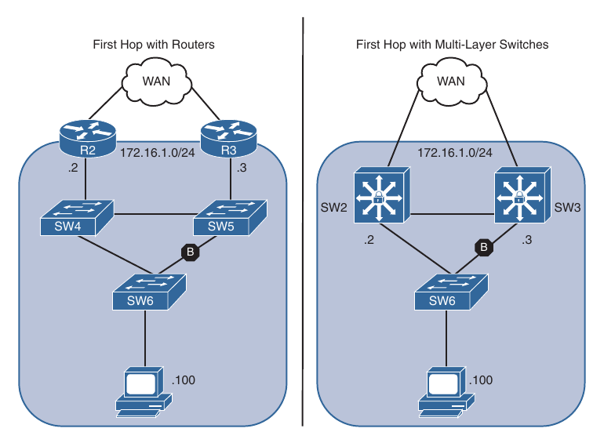
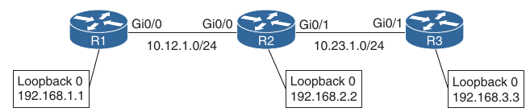
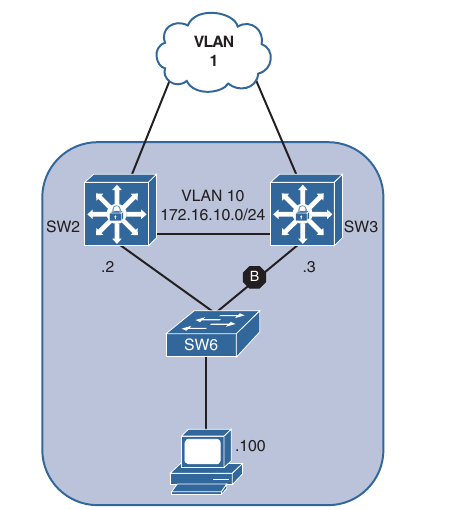
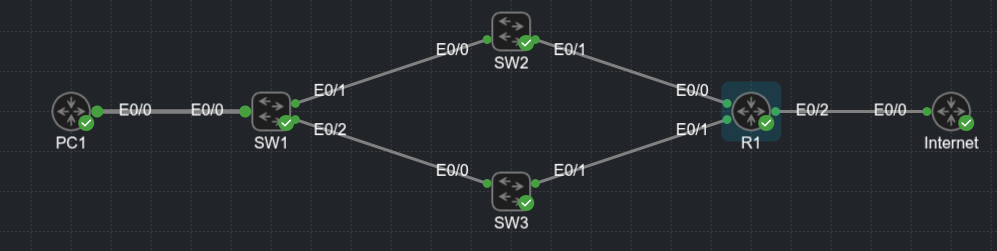

### First-Hop Redundancy Protocols

- Network resiliency is a key component of network design

- Resiliency with Layer 2 forwarding is accomplished by adding multiple Layer 2 switches into the topology

- Resiliency with Layer 3 forwarding is accomplished by adding multiple layer 3 paths or routers

- The concept of resiliency by using multiple Layer 2 switches and routers from the left or by adding resiliency with multiple multilayer switches on the right of the picture below



- In both of the scenarios:

    - Two devices (172.16.1.2 and 172.16.1.3) can be the PC's gateway

    - There are two resilient Layer 2 links that connect SW6 to a switch that can connect the PC to either gateway

- STP is blocking traffic between SW6 and SW5 on the left and and between SW6 and SW3 on the right

- The PC could configure it's gateway as 172.16.1.2, but what happens when that device fails?

- The same problem occur if the other gateway was configured

- How can a host be configured with more than one gateway?

- Some operating systems support the configuration of multiple gateways, and others do not

- Providing gateway accessibility to all devices is very important

- The deployment of first-hop redundancy protocols (FHRPs) solves the problem of hosts configuring multiple gateways

- FHRPs work by creating a virtual IP (VIP) gateway instance that is shared between the Layer 3 devices

- FHRP protocols:

    - Hot Standby Router Protocol (HSRP)

    - Virtual Router Redundancy Protocol (VRRP)

    - Gateway Load Balancing Protocol (GLBP)

#### Object Tracking

- FHRPs are deployed on a network for reliability and high availability to ensure load balancing and failover capability in case of a router failover

- To ensure optimal traffic flow when a WAN link goes down, it would be nice to be able to determine the availability of routes or the interface state to which FHRP route traffic is dirrected

- Object tracking offers a flexible and customizable mechanism for linking with FHRPs and other routing components (for example conditional installation of a static route)

- With this feature, users can track specific objects in the network and take necessary action when any object's state change affects network traffic

- Below we can see a simple topology with 3 routers running EIGRP and avertising their loopback interfaces to EIGRP



- Tracking of routes in the routing table can be set as follows:

```
conf t
 track <object-number> ip route <prefix>/<prefix-length> reachability
```

- Viewing the state of the track object:

```
show track <object-number>
```

- Configuring R1 for tracking the route to the R3's loopback interface:

```
conf t
 track 1 ip route 192.168.3.3/32 reachability
```

```
R1(config)#do sh track 1
Track 1
  IP route 192.168.3.3 255.255.255.255 reachability
  Reachability is Up (EIGRP)
    1 change, last change 00:00:30
  First-hop interface is Ethernet0/0
```

- Tracking of an interface's line protocol can be set as follows:

```
conf t
 track <object-number> interface <interface-id> line-protocol
```

- R2 being configured for tracking the E0/1 (G0/1) interface toward R3

```
conf t
 track 2 interface e0/1 line-protocol 
```

```
R2(config)#do sh track
Track 2
  Interface Ethernet0/1 line-protocol
  Line protocol is Up
    1 change, last change 00:00:08
```

- The line protocol for the interface is up

- Shutting down R2's E0/1 (G0/1) interface should change the tracked object state on R1 and R2 to a down state

- Shutdown on R2's E0/1 interface:

- R2:

```
*Aug 10 08:51:13.971: %TRACK-6-STATE: 2 interface Et0/1 line-protocol Up -> Down
R2(config-if)#
*Aug 10 08:51:13.972: %DUAL-5-NBRCHANGE: EIGRP-IPv4 100: Neighbor 10.23.1.2 (Ethernet0/1) is down: interface down
```

- R1:

```
*Aug 10 08:51:15.824: %TRACK-6-STATE: 1 ip route 192.168.3.3/32 reachability Up -> Down
```

- The tracked state for R1 and R2 changed shortly after the interface was shut down:

- R1:

```
R1#sh track
Track 1
  IP route 192.168.3.3 255.255.255.255 reachability
  Reachability is Down (no ip route)
    2 changes, last change 00:04:13
  First-hop interface is unknown

R1#show ip route | b Gate
Gateway of last resort is not set

      10.0.0.0/8 is variably subnetted, 2 subnets, 2 masks
C        10.12.1.0/30 is directly connected, Ethernet0/0
L        10.12.1.1/32 is directly connected, Ethernet0/0
      192.168.1.0/32 is subnetted, 1 subnets
C        192.168.1.1 is directly connected, Loopback0
      192.168.2.0/32 is subnetted, 1 subnets
D        192.168.2.2 [90/409600] via 10.12.1.2, 00:19:23, Ethernet0/0
```

- R2:

```
R2#sh track
Track 2
  Interface Ethernet0/1 line-protocol
  Line protocol is Down ((hw admin-down))
    2 changes, last change 00:04:42
```

- R1 no longer has the 192.168.3.3 route in the RIB

- R2's E0/1 interface is in shutdown state

- Object tracking works with protocols such as Hot Standby Routing Protocol (HSRP), Virtual Router Redundancy Protocol (VRRP), and Gateway Load Balancing Protocol (GLBP) so that they can take action when the state of an object changes

- FHRP commonly tracks the availability of the WAN interface or the existence of a route learned via that next hop

### Hot Standby Router Protocol

- Hot Standby Router Protocol (HSRP) is a Cisco Proprietary protocol that provides transparent failover of the first-hop device, which typically acts as gateway to thr hosts

- HSRP provides routing redundancy for IP hosts on an Ethernet network configured with a default gateway IP address

- A minimun of two devices are required to enable HSRP: One device acts as the active device and takes care of forwarding the packets, and the other acts as a standby that is ready to take over the role of active device in the event of failure

- On a network segment, a virtual IP address is configured on each HSRP-enabled interface that belong to the same HSRP group

- HSRP elects one of the interfaces to act as the HSRP active router

- Along with the virtual IP address, a virtual MAC address is assigned for the group

- The active router receives and routes the packets destined for the virtual MAC address of the group

- When the HSRP active router fails, the HSRP standby router assumes control of the virtual IP address and virtual MAC address of the group

- The HSRP election selects the router with the highest priority (which defaults to 100)

- In the event of a tie in priority, the router with the highest IP address for the network segment is preferred

- HSRP does not enable preemption by default, so when a router with lower priority becomes active, it does not automatically transfer it's status to a superior router

- HSRP-enabled interfaces send and receive multicast UDP-based hello messages to detect any failure and designate active and standby routers

- If a standby device does not receive a hello message or the active device fails to send a hello message, the standby device with the second-highest priority becomes HSRP active

- The transition of HSRP active between the devices is transparent to all hosts on the segment because the MAC address moves with the virtual IP address

- HSRP has two versions: Version 1 and Version 2

- Differences between the two versions:

- Timers:

    - HSRPv1 does not support milisecond timer values

    - HSRPv2 supports milisecond timer values

- Group range:

    - HSRPv1 - 0 to 255

    - HSRPv2 - 0 to 4095

- Multicast address:

    - HSRPv1: 224.0.0.2

    - HSRPv2: 224.0.0.102

- MAC address range:

    - HSRPv1: 0000.0C07.ACxy - where xy is a hex value representing the HSRP group number

    - HSRPv2: 0000.0C9F.F000 to 0000.0C9F.FFFF

- Below is a topology where SW2 and SW3 are the current gateway devices for VLAN 10, VLAN 1 provides transit routing to the WAN routers



- We can configure a HSRP VIP gateway using the following steps (interface config mode):

    1. Define the HSRP instance ID:

    ```
    conf t
     interface <name>
      standby <instance-id> ip <vip-address>
    ```

    2. (Optional) Configure HSRP router preemption to allow a more preferred router to take the active router status from an inferior active HSRP router

    ```
    conf t
     interface <name>
      standby <instance-id> preempt
    ```

    3. (Optional) Define the HSRP priority for the instance. The priority is a value between 0 and 255

    ```
    conf t
     interface <name>
      standby <instance-id> priority <priority>
    ```

    4. Define the HSRP MAC address (Optional). Most organizations accept the automatically generated MAC address, but in some migration scenarios, the MAC address needs to be statically set to ease transitions when the hosts may have a different MAC address in their ARP table

    ```
    conf t
     interface <name>
      standby <instance-id> mac-address <mac-address>
    ``` 

    5. (Optional) Define the HSRP timers:

    ```
    conf t
     interface <name>
      standby <instance-id> timers [<seconds> | msec <seconds>]
    ```

    - HSRP can poll in intervals of 1 - 254 seconds or 15 to 999 miliseconds

    6. (Optional) Establish the HSRP authentication:

    ```
    conf t 
     interface <name>
      standby <instance-id> authentication [text-password | text text-password | md5 [key-chain <key-chain> | key-string <key-string>]]
    ```

- It is possible to create multiple HSRP instances on the same interface

- Some network architects configure half of the hosts for one instance and the other half of the hosts for a second instance

- Setting different priorities for each instance makes it possible to load balance the traffic across multiple routers

- Below we can see a basic HSRP configuration for VLAN 10 on SW2 and SW3, using the HSRP instance 10 and the VIP gateway instance 172.16.10.1

- Notice that once preemption was enabled, that SW3 became the active speaker, and standby 2 became the standby speaker

- SW2:

```
conf t
 ip routing
 interface Vlan10
  ip address 172.16.10.2 255.255.255.0
  standby version 2
  standby 10 ip 172.16.10.1
  standby 10 preempt
```

- SW3:

```
conf t
 ip routing
 interface Vlan10
  ip address 172.16.10.3 255.255.255.0
  standby version 2
  standby 10 ip 172.16.10.1
  standby 10 preempt
```

- SW2:

```
SW2(config-if)#do sh standby
Vlan10 - Group 10 (version 2)
  State is Standby
    6 state changes, last state change 00:02:08
  Virtual IP address is 172.16.10.1
  Active virtual MAC address is 0000.0c9f.f00a (MAC Not In Use)
    Local virtual MAC address is 0000.0c9f.f00a (v2 default)
  Hello time 3 sec, hold time 10 sec
    Next hello sent in 0.224 secs
  Preemption enabled
  Active router is 172.16.10.3, priority 100 (expires in 9.760 sec)
    MAC address is aabb.cc80.1a00
  Standby router is local
  Priority 100 (default 100)
  Group name is "hsrp-Vl10-10" (default)
  FLAGS: 0/1

SW2#show standby brief 
                     P indicates configured to preempt.
                     |
Interface   Grp  Pri P State   Active          Standby         Virtual IP
Vl10        10   100 P Standby 172.16.10.3     local           172.16.10.1
```

- SW3:

```
SW3(config-if)#do sh standby
Vlan10 - Group 10 (version 2)
  State is Active
    5 state changes, last state change 00:02:54
  Virtual IP address is 172.16.10.1
  Active virtual MAC address is 0000.0c9f.f00a (MAC In Use)
    Local virtual MAC address is 0000.0c9f.f00a (v2 default)
  Hello time 3 sec, hold time 10 sec
    Next hello sent in 2.352 secs
  Preemption enabled
  Active router is local
  Standby router is 172.16.10.2, priority 100 (expires in 10.560 sec)
  Priority 100 (default 100)
  Group name is "hsrp-Vl10-10" (default)
  FLAGS: 0/1

SW3#show standby brief 
                     P indicates configured to preempt.
                     |
Interface   Grp  Pri P State   Active          Standby         Virtual IP
Vl10        10   100 P Active  local           172.16.10.2     172.16.10.1
```

- From the PC:

```
PC1#ping 8.8.8.8
Type escape sequence to abort.
Sending 5, 100-byte ICMP Echos to 8.8.8.8, timeout is 2 seconds:
.!!!!
Success rate is 80 percent (4/5), round-trip min/avg/max = 1/2/4 ms
PC1#trac
PC1#traceroute 8.8.8.8
Type escape sequence to abort.
Tracing the route to 8.8.8.8
VRF info: (vrf in name/id, vrf out name/id)
  1 172.16.10.3 2 msec 3 msec 1 msec
  2 10.2.2.1 3 msec 4 msec 2 msec
  3 10.100.1.2 3 msec 4 msec * 
```

- Setting the standby timers the PC lose only 1 ping when switching the gateway:

```
conf t
 interface vlan 10
  standby 10 timers 1 5
```

- Viewing the HSRP status:

```
show standby [interface] [brief]
```

- LAB topology:



- Specifying an interface restricts the output to a specific interface; this can be useful when troubleshooting large amounts of information

- The `show standby brief` from above on SW2 includes the interfaces and the associated groups that are running HSRP

- The output also includes the local interface's priority, whether preemption is enabled, the current state, the active speaker's address, the standby speaker's address, and the VIP gateway instance for that standby group

- The non-brief iteration of `show standby` command also includes the number of state changes for the HSRP instance, along with the time since the last state change, the timers, and a group name

- HSRP provides the capability to link object tracking to priority

- For example assume that traffic should flow through S2's WAN connection whenever feasible

- Traffic can be routed by SW3 through SW2 and then on SW2's WAN connection; however, making SW2 the VIP gateway streamlines the process

- But when SW2 loses it's link to the WAN, it should move the HSRP active speaker role to SW3

- The configuration is accomplished as follows:

    - Configure a tracked object to SW2's WAN link (interface vlan 1)

    - Change SW2's priority to a value higher than SW3 (in this case 110)

    - Configure SW2 to lower the priority if the tracked object state changes to down

    - Configuration is as follows:

    ```
    conf t
     interface vlan 10
      standby <group-id> track <object-id> decrement <decrement-value>
    ```

    - The decrement value should be high enough so that when it is removed from the priority, the value is lower than the other HSRP router

- The configuration for the object tracking:

- SW2:

```
conf t
 track 1 interface vlan 1 line-protocol
 interface vlan 10
  standby 10 track 1 decrement 20
```

- Verifying the correlation between the HSRP instance and the track object:

```
SW2(config)#do sh stand
Vlan10 - Group 10 (version 2)
  State is Active
    6 state changes, last state change 00:10:52
  Virtual IP address is 172.16.10.1
  Active virtual MAC address is 0000.0c9f.f00a (MAC In Use)
    Local virtual MAC address is 0000.0c9f.f00a (v2 default)
  Hello time 1 sec, hold time 5 sec
    Next hello sent in 0.624 secs
  Preemption enabled
  Active router is local
  Standby router is 172.16.10.3, priority 100 (expires in 5.136 sec)
  Priority 110 (configured 110)
    Track object 1 state Up decrement 20
  Group name is "hsrp-Vl10-10" (default)
```

- Verifying the behaviour when shooting down the vlan 1 interface on SW2:

```
*Aug 10 16:27:12.318: %TRACK-6-STATE: 1 interface Vl1 line-protocol Up -> Down
SW2(config-if)#do wr
Building configuration...

*Aug 10 16:27:13.282: %HSRP-5-STATECHANGE: Vlan10 Grp 10 state Active -> Speak
*Aug 10 16:27:14.321: %LINK-5-CHANGED: Interface Vlan1, changed state to administratively down
*Aug 10 16:27:15.323: %LINEPROTO-5-UPDOWN: Line protocol on Interface Vlan1, changed state to down
SW2(config-if)#
*Aug 10 16:27:19.199: %HSRP-5-STATECHANGE: Vlan10 Grp 10 state Speak -> Standby
SW2(config-if)#
```

- Viewing the standby state

```
SW2#show standby 
Vlan10 - Group 10 (version 2)
  State is Standby
    10 state changes, last state change 00:01:34
  Virtual IP address is 172.16.10.1
  Active virtual MAC address is 0000.0c9f.f00a (MAC Not In Use)
    Local virtual MAC address is 0000.0c9f.f00a (v2 default)
  Hello time 1 sec, hold time 5 sec
    Next hello sent in 0.416 secs
  Preemption enabled
  Active router is 172.16.10.3, priority 100 (expires in 4.192 sec)
    MAC address is aabb.cc80.1a00
  Standby router is local
  Priority 90 (configured 110)
    Track object 1 state Down decrement 20
  Group name is "hsrp-Vl10-10" (default)

SW2#show track 1
Track 1
  Interface Vlan1 line-protocol
  Line protocol is Down ((hw admin-down))
    2 changes, last change 00:02:33
  Tracked by:
    HSRP Vlan10 10
```

