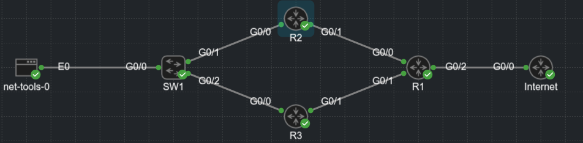
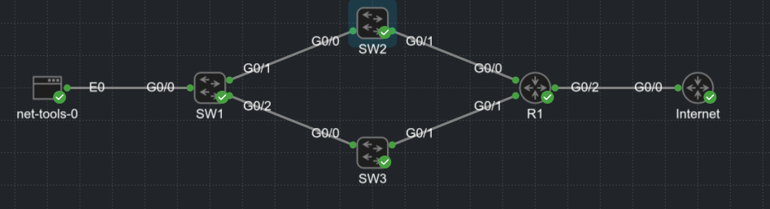

### First-Hop Redundancy Protocols

- Network resiliency is a key component of network design

- Resiliency with Layer 2 forwarding is accomplished by adding multiple Layer 2 switches into the topology

- Resiliency with Layer 3 forwarding is accomplished by adding multiple layer 3 paths or routers

- The concept of resiliency by using multiple Layer 2 switches and routers from the left or by adding resiliency with multiple multilayer switches on the right of the picture below


- In both of the scenarios:

    - Two devices (172.16.1.2 and 172.16.1.3) can be the PC's gateway

    - There are two resilient Layer 2 links that connect SW6 to a switch that can connect the PC to either gateway

- STP is blocking traffic between SW6 and SW5 on the left and and between SW6 and SW3 on the right

- The PC could configure it's gateway as 172.16.1.2, but what happens when that device fails?

- The same problem occur if the other gateway was configured

- How can a host be configured with more than one gateway?

- Some operating systems support the configuration of multiple gateways, and others do not

- Providing gateway accessibility to all devices is very important

- The deployment of first-hop redundancy protocols (FHRPs) solves the problem of hosts configuring multiple gateways

- FHRPs work by creating a virtual IP (VIP) gateway instance that is shared between the Layer 3 devices

- FHRP protocols:

    - Hot Standby Router Protocol (HSRP)

    - Virtual Router Redundancy Protocol (VRRP)

    - Gateway Load Balancing Protocol (GLBP)

#### Object Tracking

- FHRPs are deployed on a network for reliability and high availability to ensure load balancing and failover capability in case of a router failover

- To ensure optimal traffic flow when a WAN link goes down, it would be nice to be able to determine the availability of routes or the interface state to which FHRP route traffic is dirrected

- Object tracking offers a flexible and customizable mechanism for linking with FHRPs and other routing components (for example conditional installation of a static route)

- With this feature, users can track specific objects in the network and take necessary action when any object's state change affects network traffic

- Below we can see a simple topology with 3 routers running EIGRP and avertising their loopback interfaces to EIGRP


- Tracking of routes in the routing table can be set as follows:

```
conf t
 track <object-number> ip route <prefix>/<prefix-length> reachability
```

- Viewing the state of the track object:

```
show track <object-number>
```

- Configuring R1 for tracking the route to the R3's loopback interface:

```
conf t
 track 1 ip route 192.168.3.3/32 reachability
```

```
R1(config)#do sh track 1
Track 1
  IP route 192.168.3.3 255.255.255.255 reachability
  Reachability is Up (EIGRP)
    1 change, last change 00:00:30
  First-hop interface is Ethernet0/0
```

- Tracking of an interface's line protocol can be set as follows:

```
conf t
 track <object-number> interface <interface-id> line-protocol
```

- R2 being configured for tracking the E0/1 (G0/1) interface toward R3

```
conf t
 track 2 interface e0/1 line-protocol 
```

```
R2(config)#do sh track
Track 2
  Interface Ethernet0/1 line-protocol
  Line protocol is Up
    1 change, last change 00:00:08
```

- The line protocol for the interface is up

- Shutting down R2's E0/1 (G0/1) interface should change the tracked object state on R1 and R2 to a down state

- Shutdown on R2's E0/1 interface:

- R2:

```
*Aug 10 08:51:13.971: %TRACK-6-STATE: 2 interface Et0/1 line-protocol Up -> Down
R2(config-if)#
*Aug 10 08:51:13.972: %DUAL-5-NBRCHANGE: EIGRP-IPv4 100: Neighbor 10.23.1.2 (Ethernet0/1) is down: interface down
```

- R1:

```
*Aug 10 08:51:15.824: %TRACK-6-STATE: 1 ip route 192.168.3.3/32 reachability Up -> Down
```

- The tracked state for R1 and R2 changed shortly after the interface was shut down:

- R1:

```
R1#sh track
Track 1
  IP route 192.168.3.3 255.255.255.255 reachability
  Reachability is Down (no ip route)
    2 changes, last change 00:04:13
  First-hop interface is unknown

R1#show ip route | b Gate
Gateway of last resort is not set

      10.0.0.0/8 is variably subnetted, 2 subnets, 2 masks
C        10.12.1.0/30 is directly connected, Ethernet0/0
L        10.12.1.1/32 is directly connected, Ethernet0/0
      192.168.1.0/32 is subnetted, 1 subnets
C        192.168.1.1 is directly connected, Loopback0
      192.168.2.0/32 is subnetted, 1 subnets
D        192.168.2.2 [90/409600] via 10.12.1.2, 00:19:23, Ethernet0/0
```

- R2:

```
R2#sh track
Track 2
  Interface Ethernet0/1 line-protocol
  Line protocol is Down ((hw admin-down))
    2 changes, last change 00:04:42
```

- R1 no longer has the 192.168.3.3 route in the RIB

- R2's E0/1 interface is in shutdown state

- Object tracking works with protocols such as Hot Standby Routing Protocol (HSRP), Virtual Router Redundancy Protocol (VRRP), and Gateway Load Balancing Protocol (GLBP) so that they can take action when the state of an object changes

- FHRP commonly tracks the availability of the WAN interface or the existence of a route learned via that next hop

### Hot Standby Router Protocol

- Hot Standby Router Protocol (HSRP) is a Cisco Proprietary protocol that provides transparent failover of the first-hop device, which typically acts as gateway to thr hosts

- HSRP provides routing redundancy for IP hosts on an Ethernet network configured with a default gateway IP address

- A minimun of two devices are required to enable HSRP: One device acts as the active device and takes care of forwarding the packets, and the other acts as a standby that is ready to take over the role of active device in the event of failure

- On a network segment, a virtual IP address is configured on each HSRP-enabled interface that belong to the same HSRP group

- HSRP elects one of the interfaces to act as the HSRP active router

- Along with the virtual IP address, a virtual MAC address is assigned for the group

- The active router receives and routes the packets destined for the virtual MAC address of the group

- When the HSRP active router fails, the HSRP standby router assumes control of the virtual IP address and virtual MAC address of the group

- The HSRP election selects the router with the highest priority (which defaults to 100)

- In the event of a tie in priority, the router with the highest IP address for the network segment is preferred

- HSRP does not enable preemption by default, so when a router with lower priority becomes active, it does not automatically transfer it's status to a superior router

- HSRP-enabled interfaces send and receive multicast UDP-based hello messages to detect any failure and designate active and standby routers

- If a standby device does not receive a hello message or the active device fails to send a hello message, the standby device with the second-highest priority becomes HSRP active

- The transition of HSRP active between the devices is transparent to all hosts on the segment because the MAC address moves with the virtual IP address

- HSRP has two versions: Version 1 and Version 2

- Differences between the two versions:

- Timers:

    - HSRPv1 does not support milisecond timer values

    - HSRPv2 supports milisecond timer values

- Group range:

    - HSRPv1 - 0 to 255

    - HSRPv2 - 0 to 4095

- Multicast address:

    - HSRPv1: 224.0.0.2

    - HSRPv2: 224.0.0.102

- MAC address range:

    - HSRPv1: 0000.0C07.ACxy - where xy is a hex value representing the HSRP group number

    - HSRPv2: 0000.0C9F.F000 to 0000.0C9F.FFFF

- Below is a topology where SW2 and SW3 are the current gateway devices for VLAN 10, VLAN 1 provides transit routing to the WAN routers


- We can configure a HSRP VIP gateway using the following steps (interface config mode):

    1. Define the HSRP instance ID:

    ```
    conf t
     interface <name>
      standby <instance-id> ip <vip-address>
    ```

    2. (Optional) Configure HSRP router preemption to allow a more preferred router to take the active router status from an inferior active HSRP router

    ```
    conf t
     interface <name>
      standby <instance-id> preempt
    ```

    3. (Optional) Define the HSRP priority for the instance. The priority is a value between 0 and 255

    ```
    conf t
     interface <name>
      standby <instance-id> priority <priority>
    ```

    4. Define the HSRP MAC address (Optional). Most organizations accept the automatically generated MAC address, but in some migration scenarios, the MAC address needs to be statically set to ease transitions when the hosts may have a different MAC address in their ARP table

    ```
    conf t
     interface <name>
      standby <instance-id> mac-address <mac-address>
    ``` 

    5. (Optional) Define the HSRP timers:

    ```
    conf t
     interface <name>
      standby <instance-id> timers [<seconds> | msec <seconds>]
    ```

    - HSRP can poll in intervals of 1 - 254 seconds or 15 to 999 miliseconds

    6. (Optional) Establish the HSRP authentication:

    ```
    conf t 
     interface <name>
      standby <instance-id> authentication [text-password | text text-password | md5 [key-chain <key-chain> | key-string <key-string>]]
    ```

- It is possible to create multiple HSRP instances on the same interface

- Some network architects configure half of the hosts for one instance and the other half of the hosts for a second instance

- Setting different priorities for each instance makes it possible to load balance the traffic across multiple routers

- Below we can see a basic HSRP configuration for VLAN 10 on SW2 and SW3, using the HSRP instance 10 and the VIP gateway instance 172.16.10.1

- Notice that once preemption was enabled, that SW3 became the active speaker, and standby 2 became the standby speaker

- SW2:

```
conf t
 ip routing
 interface Vlan10
  ip address 172.16.10.2 255.255.255.0
  standby version 2
  standby 10 ip 172.16.10.1
  standby 10 preempt
```

- SW3:

```
conf t
 ip routing
 interface Vlan10
  ip address 172.16.10.3 255.255.255.0
  standby version 2
  standby 10 ip 172.16.10.1
  standby 10 preempt
```

- SW2:

```
SW2(config-if)#do sh standby
Vlan10 - Group 10 (version 2)
  State is Standby
    6 state changes, last state change 00:02:08
  Virtual IP address is 172.16.10.1
  Active virtual MAC address is 0000.0c9f.f00a (MAC Not In Use)
    Local virtual MAC address is 0000.0c9f.f00a (v2 default)
  Hello time 3 sec, hold time 10 sec
    Next hello sent in 0.224 secs
  Preemption enabled
  Active router is 172.16.10.3, priority 100 (expires in 9.760 sec)
    MAC address is aabb.cc80.1a00
  Standby router is local
  Priority 100 (default 100)
  Group name is "hsrp-Vl10-10" (default)
  FLAGS: 0/1

SW2#show standby brief 
                     P indicates configured to preempt.
                     |
Interface   Grp  Pri P State   Active          Standby         Virtual IP
Vl10        10   100 P Standby 172.16.10.3     local           172.16.10.1
```

- SW3:

```
SW3(config-if)#do sh standby
Vlan10 - Group 10 (version 2)
  State is Active
    5 state changes, last state change 00:02:54
  Virtual IP address is 172.16.10.1
  Active virtual MAC address is 0000.0c9f.f00a (MAC In Use)
    Local virtual MAC address is 0000.0c9f.f00a (v2 default)
  Hello time 3 sec, hold time 10 sec
    Next hello sent in 2.352 secs
  Preemption enabled
  Active router is local
  Standby router is 172.16.10.2, priority 100 (expires in 10.560 sec)
  Priority 100 (default 100)
  Group name is "hsrp-Vl10-10" (default)
  FLAGS: 0/1

SW3#show standby brief 
                     P indicates configured to preempt.
                     |
Interface   Grp  Pri P State   Active          Standby         Virtual IP
Vl10        10   100 P Active  local           172.16.10.2     172.16.10.1
```

- From the PC:

```
PC1#ping 8.8.8.8
Type escape sequence to abort.
Sending 5, 100-byte ICMP Echos to 8.8.8.8, timeout is 2 seconds:
.!!!!
Success rate is 80 percent (4/5), round-trip min/avg/max = 1/2/4 ms
PC1#trac
PC1#traceroute 8.8.8.8
Type escape sequence to abort.
Tracing the route to 8.8.8.8
VRF info: (vrf in name/id, vrf out name/id)
  1 172.16.10.3 2 msec 3 msec 1 msec
  2 10.2.2.1 3 msec 4 msec 2 msec
  3 10.100.1.2 3 msec 4 msec * 
```

- Setting the standby timers the PC lose only 1 ping when switching the gateway:

```
conf t
 interface vlan 10
  standby 10 timers 1 5
```

- Viewing the HSRP status:

```
show standby [interface] [brief]
```

- LAB topology:


- Specifying an interface restricts the output to a specific interface; this can be useful when troubleshooting large amounts of information

- The `show standby brief` from above on SW2 includes the interfaces and the associated groups that are running HSRP

- The output also includes the local interface's priority, whether preemption is enabled, the current state, the active speaker's address, the standby speaker's address, and the VIP gateway instance for that standby group

- The non-brief iteration of `show standby` command also includes the number of state changes for the HSRP instance, along with the time since the last state change, the timers, and a group name

- HSRP provides the capability to link object tracking to priority

- For example assume that traffic should flow through S2's WAN connection whenever feasible

- Traffic can be routed by SW3 through SW2 and then on SW2's WAN connection; however, making SW2 the VIP gateway streamlines the process

- But when SW2 loses it's link to the WAN, it should move the HSRP active speaker role to SW3

- The configuration is accomplished as follows:

    - Configure a tracked object to SW2's WAN link (interface vlan 1)

    - Change SW2's priority to a value higher than SW3 (in this case 110)

    - Configure SW2 to lower the priority if the tracked object state changes to down

    - Configuration is as follows:

    ```
    conf t
     interface vlan 10
      standby <group-id> track <object-id> decrement <decrement-value>
    ```

    - The decrement value should be high enough so that when it is removed from the priority, the value is lower than the other HSRP router

- The configuration for the object tracking:

- SW2:

```
conf t
 track 1 interface vlan 1 line-protocol
 interface vlan 10
  standby 10 track 1 decrement 20
```

- Verifying the correlation between the HSRP instance and the track object:

```
SW2(config)#do sh stand
Vlan10 - Group 10 (version 2)
  State is Active
    6 state changes, last state change 00:10:52
  Virtual IP address is 172.16.10.1
  Active virtual MAC address is 0000.0c9f.f00a (MAC In Use)
    Local virtual MAC address is 0000.0c9f.f00a (v2 default)
  Hello time 1 sec, hold time 5 sec
    Next hello sent in 0.624 secs
  Preemption enabled
  Active router is local
  Standby router is 172.16.10.3, priority 100 (expires in 5.136 sec)
  Priority 110 (configured 110)
    Track object 1 state Up decrement 20
  Group name is "hsrp-Vl10-10" (default)
```

- Verifying the behaviour when shooting down the vlan 1 interface on SW2:

```
*Aug 10 16:27:12.318: %TRACK-6-STATE: 1 interface Vl1 line-protocol Up -> Down
SW2(config-if)#do wr
Building configuration...

*Aug 10 16:27:13.282: %HSRP-5-STATECHANGE: Vlan10 Grp 10 state Active -> Speak
*Aug 10 16:27:14.321: %LINK-5-CHANGED: Interface Vlan1, changed state to administratively down
*Aug 10 16:27:15.323: %LINEPROTO-5-UPDOWN: Line protocol on Interface Vlan1, changed state to down
SW2(config-if)#
*Aug 10 16:27:19.199: %HSRP-5-STATECHANGE: Vlan10 Grp 10 state Speak -> Standby
SW2(config-if)#
```

- Viewing the standby state

```
SW2#show standby 
Vlan10 - Group 10 (version 2)
  State is Standby
    10 state changes, last state change 00:01:34
  Virtual IP address is 172.16.10.1
  Active virtual MAC address is 0000.0c9f.f00a (MAC Not In Use)
    Local virtual MAC address is 0000.0c9f.f00a (v2 default)
  Hello time 1 sec, hold time 5 sec
    Next hello sent in 0.416 secs
  Preemption enabled
  Active router is 172.16.10.3, priority 100 (expires in 4.192 sec)
    MAC address is aabb.cc80.1a00
  Standby router is local
  Priority 90 (configured 110)
    Track object 1 state Down decrement 20
  Group name is "hsrp-Vl10-10" (default)

SW2#show track 1
Track 1
  Interface Vlan1 line-protocol
  Line protocol is Down ((hw admin-down))
    2 changes, last change 00:02:33
  Tracked by:
    HSRP Vlan10 10
```

### Virtual Router Redundancy Protocol

- Virtual Router Redundancy Protocol (VRRP) is an industry standard and operates similarly to HSRP

- The behavior of VRRP is so close to that of HSRP that the following differences should be noted:

    - The preferred active router controlling the VIP gateway is called the master router. All other VRRP routers are known as backup routers

    - VRRP enables preemption by default

    - The MAC address of the VIP gateway uses the structure 0000.5E00.01xx - where xx reflects the group ID in hex

    - VRRP uses the multicast address 224.0.0.18 for communication

- There are currently 2 versions of VRRP:

    - VRRPv2: Supports IPv4

    - VRRPv3: Supports IPv4 and IPv6

#### Legacy VRRP configuration

- Early VRRP configuration supported only VRRPv2 and was not hierarchical in it's configurations

- Configuration steps or VRRP for older hardware versions (interface config mode):

    1. Define the VRRP instance:

    ```
    conf t
     interface <name>
      vrrp <instance-id> ip <vip-address>
    ```

    2. (Optional) Define VRRP priority. Priority is a value between 0 and 255

    ```
    conf t
     interface <name>
      vrrp <instance-id> priority <priority>
    ```

    3. (Optional) Enable object tracking so that the priority is decremented when the object is false

    ```
    conf t
     interface <name>
      vrrp <instance-id> track <object-id> decrement <decrement-value>
    ```

    - The decrement value should be high enough so that when it is removed from the priority, the value is lower than the other VRRP router

    4. Establish VRRP authentication by using the following command: 

    ```
    conf t
     interface <name>
      vrrp <instance-id> authentication [<text-password> | text <text-password> | md5 {key-chain <key-chain>} {key-string <key-string>}]
    ```

- R2 and R3 are two routers that share a connection to a Layer 2 switch with their G0/0 interfaces, which both are on the 172.16.20.0/24 network

- R2 and R3 use VRRP to create the VIP gateway 172.16.20.1

- VRRP configuration:

- Notice that after the VIP is assigned on R3, R2 preempts R3 (because of the priority) and becomes the master



- R2:

```
conf t
 interface g0/0
  ip address 172.16.20.2 255.255.255.0
  vrrp 20 ip 172.16.20.1
  vrrp 20 priority 110
  vrrp 20 track 1 decrement 20

 vrrp 20 track 1 decrement 20
```

- R3:

```
conf t
 interface g0/0
  ip address 172.16.20.3 255.255.255.0
  vrrp 20 ip 172.16.20.1
  vrrp 20 priority 95
```

- Verifying:

- R2:

```
R2#show vrrp 
GigabitEthernet0/0 - Group 20 
  State is Master  
  Virtual IP address is 172.16.20.1
  Virtual MAC address is 0000.5e00.0114
  Advertisement interval is 1.000 sec
  Preemption enabled
  Priority is 110 
    Track object 1 state Up decrement 20
  Master Router is 172.16.20.2 (local), priority is 110 
  Master Advertisement interval is 1.000 sec
  Master Down interval is 3.570 sec

R2#show vrrp br
R2#show vrrp brief 
Interface          Grp Pri Time  Own Pre State   Master addr     Group addr
Gi0/0              20  110 3570       Y  Master  172.16.20.2     172.16.20.1    

R2#show track 1
Track 1
  Interface Loopback0 line-protocol
  Line protocol is Up
    5 changes, last change 00:07:22
  Tracked by:
    VRRP GigabitEthernet0/0 20
```

- R3:

```
R3#sh vrrp
GigabitEthernet0/0 - Group 20 
  State is Backup  
  Virtual IP address is 172.16.20.1
  Virtual MAC address is 0000.5e00.0114
  Advertisement interval is 1.000 sec
  Preemption enabled
  Priority is 95  
  Master Router is 172.16.20.2, priority is 110 
  Master Advertisement interval is 1.000 sec
  Master Down interval is 3.628 sec (expires in 2.901 sec)

R3#sh
R3#show vrr
R3#show vrrp br
R3#show vrrp brief 
Interface          Grp Pri Time  Own Pre State   Master addr     Group addr
Gi0/0              20  95  3628       Y  Backup  172.16.20.2     172.16.20.1    
```

- The command `show vrrp [brief]` provide an update on the VRRP group, along with other relevant information for troubleshooting

- All the output is very similar with the output for HSRP

#### Hierarchical VRRP configuration

- Used for VRRP v3

- The newer versions of IOS-XE provides configuration of VRRP in a multi-address format that is hierarchical

- The following are the steps to configure hierarchical VRRP:

    1. Enable VRRP V3 on the router:

    ```
    conf t
     fhrp version vrrp v3
    ```

    2. Define the VRRP instance. This places the configuration prompt into the VRRP group for additional configuration

    ```
    conf t
     fhrp version vrrp v3
     interface g0/0
      vrrp <instance-id> address-family [ipv4|ipv6]
    ``` 

    3. (Optional) Change VRRP to version 2 (VRRPv2 and VRRPv3 are not compatible)

    4. Define the gateway VIP(vrrp address-family config mode):

    ```
    conf t
     interface g0/0
     vrrp 20 address-family ipv4
     address <ip-address>
    ```

    5. (Optional) Define the VRRP priority:

    ```
    priority <priority>
    ```

    6. (Optional) Enable object tracking so that the priority is decremented when the object is false:

    ```
    track <object-id> decrement <decrement-value>
    ```

    - The decrement value should be high enough so that when it is removed from the priority, the value is lower than the other VRRP router

- My lab config (lab from above):

- R2:

```
conf t
fhrp version vrrp v3
 interface g0/0
  vrrp 20 address-family ipv4
   priority 110
   track 1 decrement 20
   address 172.16.20.1 primary
   exit-vrrp
```

- R3:

```
fhrp version vrrp v3
 interface g0/0
  vrrp 20 address-family ipv4
   priority 95
   address 172.16.20.1 primary
   exit-vrrp
```

- Showing vrrp state:

- R2:

```
R2#show vrrp

GigabitEthernet0/0 - Group 20 - Address-Family IPv4
  State is MASTER
  State duration 9 mins 47.148 secs
  Virtual IP address is 172.16.20.1
  Virtual MAC address is 0000.5E00.0114
  Advertisement interval is 1000 msec
  Preemption enabled
  Priority is 110
    Track object 1 state UP decrement 20
  Master Router is 172.16.20.2 (local), priority is 110
  Master Advertisement interval is 1000 msec (expires in 592 msec)
  Master Down interval is unknown

R2#sh
R2#show vrrp br
R2#show vrrp brief 
  Interface          Grp  A-F Pri  Time Own Pre State   Master addr/Group addr
  Gi0/0               20 IPv4 110     0  N   Y  MASTER  172.16.20.2(local) 172.16.20.1
```

- R3:

```
R3#show vrrp

GigabitEthernet0/0 - Group 20 - Address-Family IPv4
  State is BACKUP
  State duration 10 mins 41.348 secs
  Virtual IP address is 172.16.20.1
  Virtual MAC address is 0000.5E00.0114
  Advertisement interval is 1000 msec
  Preemption enabled
  Priority is 95
  Master Router is 172.16.20.2, priority is 110
  Master Advertisement interval is 1000 msec (learned)
  Master Down interval is 3628 msec (expires in 2783 msec)

R3#sh
R3#show vrrp br
R3#show vrrp brief 
R3#show vrrp brief 
  Interface          Grp  A-F Pri  Time Own Pre State   Master addr/Group addr
  Gi0/0               20 IPv4  95  3628  N   Y  BACKUP  172.16.20.2 172.16.20.1
```

- Below we can see the configuration for a pair of switches running IOS-XE 16.9.2 for VLAN 22 (172.16.22.0/24)

- The configuration looks similar to the previous VRRP configuration except that it is hierarchical

- Associating parameters like priority and tracking are nested under the VRRP instance

- SW2:

```
conf t
 fhrp version vrrp v3
 interface vlan 22
  ip address 172.16.22.2 255.255.255.0
   vrrp 22 address-family ipv4
    address 172.16.22.1
    track 1 decrement 20
    priority 110
```

- SW3:

```
conf t
 fhrp version vrrp v3
 interface vlan 22
  ip address 172.16.22.3 255.255.255.0
   vrrp 22 address-family ipv4
    address 172.16.22.1
    priority 95
```

- The status of the VRRP routers can be viewed as follows:

```
show vrrp <brief>
```

- The output is identical with that of the legacy VRRP configuration

- VRRP can use one of the physical IP addresses as the virtual IP address (HSRP cannot do it)

### Gateway Load-Balancing Protocol (GLBP)

- As the name suggests, Gateway Load Balancing Protocol (GLBP) provides gateway redundancy and load-balancing capability to a network segment

- It provides redundancy with an active/standby gateway, and it provides load-balancing capability by ensuring that each member of the GLBP group takes care if forwarding the traffic to the appropriate gateway

- The GLBP contains 2 roles:

    - **Active Virtual Gateway (AVG)**: The participating routers elect one AVG per GLBP group to respond to the initial ARP requests for the VIP

    - For example when a local PC sends an ARP request for the VIP, the AVG is responsible for replying to the ARP request with the virtual MAC address of the AVF

    - **Active Virtual Forwarder (AVF)**: The AVF routes traffic received from assigned hosts. A unique virtual MAC address is created and assigned by the AVG to the AVFs

    - The AVF is assigned to a host when the AVG replies to the ARP request to the assigned AVFs virtual MAC address

    - ARP replies are unicast and are not heard by other hosts on that broadcast segment

    - When a host sends traffic to the virtual AVF MAC, the current router is responsible for routing it to the appropriate network

    - The AVFs are also recognized as Fwd instances on the routers

- GLBP supports four active AVFs and one AVG per GLBP group. A router can be an AVG and an AVF at the same time

- In the event of a failure of the AVG, there is not a disruption of traffic due to the AVG role trasferring to a standby AVG device

- In the event of a failure of an AVF, another router takes over the forwarding responsabilities for that AVF, which includes the virtual MAC address for that instance

- The following steps detail how to configure GLBP:

    1. Define the GLBP instance:

    ```
    conf t
     interface <name>
      glbp <instance-id> ip <ip-address>
    ```

    2. (Optional) Configure GLBP preemption to allow for a more preferred router to take the active virtual gateway status from an inferior active GLBP router

    ```
    glbp <instance-id> preempt
    ```

    3. (Optional) Define the GLBP priority to a value between 0 and 255

    ```
    glbp <instance-id> priority <priority>
    ```

    4. (Optional) Define the GLBP timers

    ```
    glbp <instance-id> timers {<hello-seconds> | msec <hello-miliseconds>} {<hold-seconds> | msec <hold-miliseconds>}
    ```

    5. (Optional) Establish GLBP authentication:

    ```
    glbp <instance-id> authentication <text text-password | md5 {key-chain <key-chain> | key-string <key-string>}>
    ```

- SW2 and SW3 configure GLBP for VLAN 30 (172.16.30.0/24) with 172.16.30.1 as the VIP gateway

- Notice that the first syslog message is for the AVG, and the second syslog message is for the first AVF (Fwd 1) for the GLBP pair

- The first syslog message on SW3 is the second AVF (Fwd 2) for the GLBP pair



- Configuration for both switches:

- SW2:

```
conf t
 interface Vlan30
  ip address 172.16.30.2 255.255.255.0
  ip ospf 1 area 0
  glbp 30 ip 172.16.30.1
  glbp 30 priority 110
  glbp 30 preempt
 end
```

- SW3:

```
conf t
 interface Vlan30
  ip address 172.16.30.3 255.255.255.0
  ip ospf 1 area 0
  glbp 30 ip 172.16.30.1
  glbp 30 priority 95
 end
```

- Verifying:

- SW2:

```
SW2#show glbp brief 
Interface   Grp  Fwd Pri State    Address         Active router   Standby router
Vl30        30   -   110 Active   172.16.30.1     local           172.16.30.3
Vl30        30   1   -   Active   0007.b400.1e01  local           -
Vl30        30   2   -   Listen   0007.b400.1e02  172.16.30.3     -

SW2#show glbp 
Vlan30 - Group 30
  State is Active
    1 state change, last state change 00:31:52
  Virtual IP address is 172.16.30.1
  Hello time 3 sec, hold time 10 sec
    Next hello sent in 2.144 secs
  Redirect time 600 sec, forwarder timeout 14400 sec
  Preemption enabled, min delay 0 sec
  Active is local
  Standby is 172.16.30.3, priority 95 (expires in 8.928 sec)
  Priority 110 (configured)
  Weighting 100 (default 100), thresholds: lower 1, upper 100
  Load balancing: round-robin
  Group members:
    5254.001a.801e (172.16.30.3)
    5254.00ec.801e (172.16.30.2) local
  There are 2 forwarders (1 active)
  Forwarder 1
    State is Active
      1 state change, last state change 00:31:41
    MAC address is 0007.b400.1e01 (default)
    Owner ID is 5254.00ec.801e
    Redirection enabled
    Preemption enabled, min delay 30 sec
    Active is local, weighting 100
    Client selection count: 2
  Forwarder 2
    State is Listen
    MAC address is 0007.b400.1e02 (learnt)
    Owner ID is 5254.001a.801e
    Redirection enabled, 598.944 sec remaining (maximum 600 sec)
    Time to live: 14398.944 sec (maximum 14400 sec)
    Preemption enabled, min delay 30 sec
    Active is 172.16.30.3 (primary), weighting 100 (expires in 10.848 sec)
    Client selection count: 1
```

- SW3:

```
SW3#show glbp br
Interface   Grp  Fwd Pri State    Address         Active router   Standby router
Vl30        30   -   95  Standby  172.16.30.1     172.16.30.2     local
Vl30        30   1   -   Listen   0007.b400.1e01  172.16.30.2     -
Vl30        30   2   -   Active   0007.b400.1e02  local           -

SW3#show glbp 
Vlan30 - Group 30
  State is Standby
    1 state change, last state change 00:30:11
  Virtual IP address is 172.16.30.1
  Hello time 3 sec, hold time 10 sec
    Next hello sent in 2.240 secs
  Redirect time 600 sec, forwarder timeout 14400 sec
  Preemption disabled
  Active is 172.16.30.2, priority 110 (expires in 11.328 sec)
  Standby is local
  Priority 95 (configured)
  Weighting 100 (default 100), thresholds: lower 1, upper 100
  Load balancing: round-robin
  Group members:
    5254.001a.801e (172.16.30.3) local
    5254.00ec.801e (172.16.30.2)
  There are 2 forwarders (1 active)
  Forwarder 1
    State is Listen
    MAC address is 0007.b400.1e01 (learnt)
    Owner ID is 5254.00ec.801e
    Time to live: 14399.872 sec (maximum 14400 sec)
    Preemption enabled, min delay 30 sec
    Active is 172.16.30.2 (primary), weighting 100 (expires in 9.952 sec)
  Forwarder 2
    State is Active
      1 state change, last state change 00:30:16
    MAC address is 0007.b400.1e02 (default)
    Owner ID is 5254.001a.801e
    Preemption enabled, min delay 30 sec
    Active is local, weighting 100

```

- The command `show glbp brief` shows high-level details of the GLBP group, including the interface, group, active AVG, standby AVG and the statusses of the AVFs

- The first entry contains a - for the Fwd state, which means that is the entry for the AVG

- The following two entries are for the AVF instances; they identify which device is active for each AVF

- The command `show glbp` displays additional information, including the timers, preemption settings, and statusses for the AVG and the AVFs for the GLBP group 

- Notice that the MAC addresses and interface IP addresses are listed under the group members, which can be used to correlate MAC address identities in other portions of the output

- By default GLBP balances the load of traffic in a round-robin fashion, as highlighted above

- GLBP supports three methods of load-balancing traffic

    - **Round robin**: Uses each virtual forwarder MAC address to sequencially reply for the virtual IP address

    - **Weighted**: Defines weights to each device in the GLBP group to define the ratio of load balancing between the devices. This allows for a larger weight to be assigned to bigger routers that can handle more traffic

    - **Host dependent**: Uses the host MAC address to decide to which virtual forwarder MAC to redirect the packet. This method ensures that the host uses the same virtual MAC address as long as the number of virtual forwarders do not change within the group

- Changing the load-balancing method:

```
conf t
 interface <name>
  glbp <instance-id> load-balancing [host-dependent | weighted | round-robin]
```

- The weighted load-balancing method has the AVG direct traffic to the AVFs based on the percentage of weight a router has over the total weight of all GLBP routers

- Increasing the weight on more capable, bigger routers, allows them to take more traffic than smaller devices

- Setting weight for a router:

```
conf t
 interface <name>
  glbp <instance-id> weighting <weight>
```

- Changing the load-balancing to weighted and setting the weight to 40 on SW2 and 60 on SW3 so that SW2 receives 40% of the traffic and SW3 receives 60% of the traffic:

- SW2:

```
conf t
 interface Vlan30
  ip address 172.16.30.2 255.255.255.0
  ip ospf 1 area 0
  glbp 30 ip 172.16.30.1
  glbp 30 preempt
  glbp 30 weighting 40
  glbp 30 load-balancing weighted
 end
```

- SW3:

```
conf t
 interface Vlan30
  ip address 172.16.30.3 255.255.255.0
  ip ospf 1 area 0
  glbp 30 ip 172.16.30.1
  glbp 30 preempt
  glbp 30 weighting 60
  glbp 30 load-balancing weighted
 end
```

- Viewing the GLBP state:

- SW2:

```
SW2#show glbp 
Vlan30 - Group 30
  State is Active
    1 state change, last state change 01:07:39
  Virtual IP address is 172.16.30.1
  Hello time 3 sec, hold time 10 sec
    Next hello sent in 0.832 secs
  Redirect time 600 sec, forwarder timeout 14400 sec
  Preemption enabled, min delay 0 sec
  Active is local
  Standby is 172.16.30.3, priority 100 (expires in 8.736 sec)
  Priority 100 (default)
  Weighting 40 (configured 40), thresholds: lower 1, upper 40
  Load balancing: weighted
  Group members:
    5254.001a.801e (172.16.30.3)
    5254.00ec.801e (172.16.30.2) local
  There are 2 forwarders (1 active)
  Forwarder 1
    State is Active
      1 state change, last state change 01:07:27
    MAC address is 0007.b400.1e01 (default)
    Owner ID is 5254.00ec.801e
    Redirection enabled
 --More-- 
*Aug 15 08:41:48.869: %SYS-5-CONFIG_I: Configured from console by console
    Preemption enabled, min delay 30 sec
    Active is local, weighting 40
    Client selection count: 1
  Forwarder 2
    State is Listen
    MAC address is 0007.b400.1e02 (learnt)
    Owner ID is 5254.001a.801e
    Redirection enabled, 598.752 sec remaining (maximum 600 sec)
    Time to live: 14398.752 sec (maximum 14400 sec)
    Preemption enabled, min delay 30 sec
    Active is 172.16.30.3 (primary), weighting 60 (expires in 9.280 sec)
    Client selection count: 1

SW2#show glbp b
Interface   Grp  Fwd Pri State    Address         Active router   Standby router
Vl30        30   -   100 Active   172.16.30.1     local           172.16.30.3
Vl30        30   1   -   Active   0007.b400.1e01  local           -
Vl30        30   2   -   Listen   0007.b400.1e02  172.16.30.3     -
```

- SW3:

```
SW3#show glbp 
Vlan30 - Group 30
  State is Standby
    1 state change, last state change 01:07:52
  Virtual IP address is 172.16.30.1
  Hello time 3 sec, hold time 10 sec
    Next hello sent in 0.160 secs
  Redirect time 600 sec, forwarder timeout 14400 sec
  Preemption enabled, min delay 0 sec
  Active is 172.16.30.2, priority 100 (expires in 9.536 sec)
  Standby is local
  Priority 100 (default)
  Weighting 60 (configured 60), thresholds: lower 1, upper 60
  Load balancing: weighted
  Group members:
    5254.001a.801e (172.16.30.3) local
    5254.00ec.801e (172.16.30.2)
  There are 2 forwarders (1 active)
  Forwarder 1
    State is Listen
    MAC address is 0007.b400.1e01 (learnt)
    Owner ID is 5254.00ec.801e
    Time to live: 14397.728 sec (maximum 14400 sec)
    Preemption enabled, min delay 30 sec
    Active is 172.16.30.2 (primary), weighting 40 (expires in 8.320 sec)
  Forwarder 2
    State is Active
      1 state change, last state change 01:07:59
    MAC address is 0007.b400.1e02 (default)
    Owner ID is 5254.001a.801e
    Preemption enabled, min delay 30 sec
    Active is local, weighting 60

SW3#show glbp brief 
Interface   Grp  Fwd Pri State    Address         Active router   Standby router
Vl30        30   -   100 Standby  172.16.30.1     172.16.30.2     local
Vl30        30   1   -   Listen   0007.b400.1e01  172.16.30.2     -
Vl30        30   2   -   Active   0007.b400.1e02  local           -
```

- Configure object tracking with GLBP can be made for weighted load-balancing method (only the weighting is decreased):

- SW2:

```
conf t
 track 1 interface Loopback0 line-protocol
 interface vlan 30
  glbp 30 weighting track 1 decrement 20
```

- SW2 - after turning interface l0 down:

```
SW2(config-if)#do show glbp
Vlan30 - Group 30
  State is Active
    1 state change, last state change 01:16:55
  Virtual IP address is 172.16.30.1
  Hello time 3 sec, hold time 10 sec
    Next hello sent in 1.056 secs
  Redirect time 600 sec, forwarder timeout 14400 sec
  Preemption enabled, min delay 0 sec
  Active is local
  Standby is 172.16.30.3, priority 100 (expires in 9.824 sec)
  Priority 100 (default)
  Weighting 20 (configured 40), thresholds: lower 1, upper 40
    Track object 1 state Down decrement 20
  Load balancing: weighted
  Group members:
    5254.001a.801e (172.16.30.3)
    5254.00ec.801e (172.16.30.2) local
  There are 2 forwarders (1 active)
  Forwarder 1
    State is Active
      1 state change, last state change 01:16:43
    MAC address is 0007.b400.1e01 (default)
    Owner ID is 5254.00ec.801e
    Redirection enabled
    Preemption enabled, min delay 30 sec
    Active is local, weighting 20
    Client selection count: 5
  Forwarder 2
    State is Listen
    MAC address is 0007.b400.1e02 (learnt)
    Owner ID is 5254.001a.801e
    Redirection enabled, 599.840 sec remaining (maximum 600 sec)
    Time to live: 14399.840 sec (maximum 14400 sec)
    Preemption enabled, min delay 30 sec
    Active is 172.16.30.3 (primary), weighting 60 (expires in 11.008 sec)
    Client selection count: 6
```

- GLBP sends hello packets every 3 seconds, using the multicast group 224.0.0.102, using UDP port 3222 as source and destination

- GLBP uses for each AVF a MAC address in the format 0007.B400.01xx <xx> is the AVF ID.

- The AVG is responsible to answer to the ARP (Address Resolution Protocol) requests for the virtual IP address

- Load-sharing is achieved by the AVG replying to ARP requests with different virtual MAC addresses

- A GLBP group allows for up to 4 MAC addresses per group

- AVG is responsible for assigning the virtual MAC addresses for each member in the group

- Other group members request a virtual MAC address after they discover the AVG through hello messages

- A virtual forwarder that is assigned a virtual MAC address by the AVG is known as a primary virtual forwarder

- A virtual forwarder that has learned the virtual MAC address is referred to as secondary virtual forwarder

- Basically the AVF that is on the same entity as the AVG is the primary virtual forwarder, any other AVFs are secondary virtual forwarders

- For redundancy GLBP uses two timers which are communicated through the hello messages (when the AVG fail):

    - The redirect time is the interval during which the AVG continues to redirect hosts to the old virtual MAC address. 

    - The secondary holdtime is the interval during which the virtual forwarder is valid. When the secondary holdtime expires, the virtual forwarder is removed from all gateways in the GLBP group. The expired virtual forwarder number is eligible for reassignment by the AVG

- When the primary AVG fails, an election process is held for which router to become the new AVG.

- The router with the highest priority becomes the new AVG

- If the priority is the same for multiple routers, then the highest IP address is considered as a tie breaker for the election

- GLBP uses a weighting scheme to determine the forwarding capability for each router in the GLBP group

- The GLBP group weithting can be automatically adjusted by tracking the state of an interface within the router

- If the tracking interface goes down, the GLBP group weighting is reduced by the specified value

- Different interfaces can be tracked to decrement the GLBP weighting by varying amounts

- Cisco documentation:

[Documentation-GLBP](https://www.cisco.com/en/US/docs/ios/12_2t/12_2t15/feature/guide/ft_glbp.html#wp1027129)

