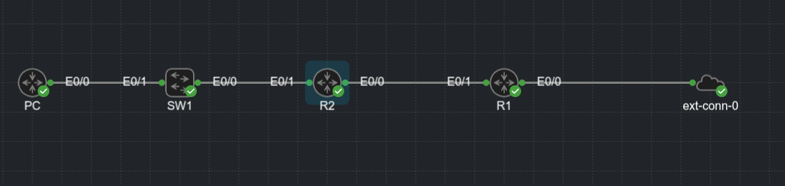
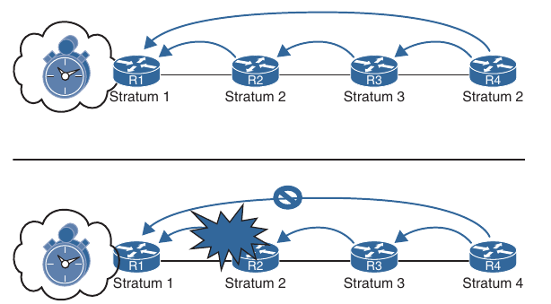
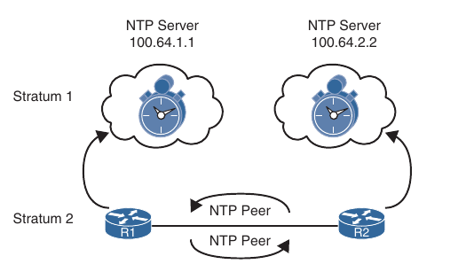
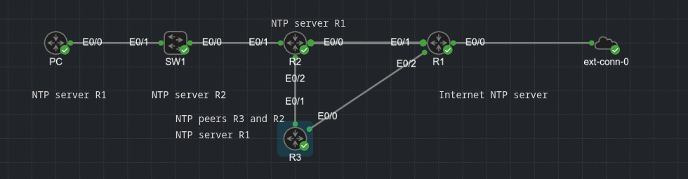

## IP Services

- Time synchronization

- First-Hop Redundancy Protocols

- Network Address Translation (NAT)

### Time synchronization

- A device's system time is used to measure periods of idle time or computation

- Ensuring the time is consistent on a system is important because applications often use the system time to tune internal processes

- From the perspective of managing a network, it is important that the time e synchronized between netwoork devices for several reasons:

    - Managing passwords that change at specific time intervals

    - Encryption key exchanges

    - Checking validity of certificates based on expiration date and time

    - Correlation of security-based events across multiple devices (routers, switches, firewalls, network access control systems, and so on)

    - Troubleshooting network devices and correlating events to identify the root cause of an event

- The rate at which a device maintains time can deviate from device to device

- Even if the time was accurately set on all the devices, the time intervals could be faster on one device than on another device

- Eventually the time will start to drift away from each other 

- Some devices only use a software clock, which is reset when the power is reset

- Other devices use a hardware clock, which can maintain time when the power is reset

### Network Time Protocol

- RFC 958 introduced Network Time Protocol (NTP), which is used to synchronize a set of network clocks in a distributed client/server architecture

- NTP is an UDP-based protocol that connects with servers on port 123

- The client source port is dynamic

- NTP is based on a hierarchical concept of communication 

- At the top of the hierarchy are authoritative devices that operate as an NTP server with an atomic clock

- The NTP client then queries the NTP server for it's time and updates it's time based on the response

- Because NTP is considered an application, the query can occur over multiple hops, requiring NTP clients to identify the time accuracy based on messages with other routers

- The NTP synchronization process is not fast

- In general, an NTP client can synchronize a large time discrepancy to within a couple of seconds of accuracy with a few cycles of polling an NTP server

- However, gaining accuracy of tons of milliseconds requires hours or days of comparisons

- In some ways, the time of the NTP clients drift toward the time of the NTP server

- NTP uses the concept of stratums to identify the accuracy of the time clock source

- NTP servers that are directly attached to an authoritative time source are stratum 1 servers

- An NTP client that queries a stratum 1 server, is considered a stratum 2 client

- The higher the stratum, the greater the chance of deviation in time from the authoritative time source due to the number of time drifts between the NTP stratums

- Below we can see the concept of stratums

- R1 is attached to an atomic clock and considered a stratum 1 server

- R2 is configured to query R1, so it is considered a stratum 2 client

- R3 is configured to query R2, so it is considered a stratum 3 client

- This can continue until stratum 15

- R4 is configured to query R1 over multiple hops, and it is therefore considered a stratum 2 client


#### NTP Configuration

- The configuration of an NTP client is pretty simple

```
conf t
 ntp-server <ip-address> [perfer] [source <interface-id>]
```

- The source interface, which is optional, is used to stipulate the source IP address for queries for that server

- Multiple NTP servers can be configured for redundancy, and adding the optional prefer keyword indicates which NTP server time synchronization should come from

- Cisco devices can act as a server after they have been able to query an NTP server

- For example, Once R2 synchronized time with R1 (a stratum 1 time source), R2 can act as a server to R3

- Configure a device to act as a NTP master with a specific stratum

```
conf t
 ntp master <stratum>
```

- Lab configuration:



- R1 - gets the time from the internet, also does nat for all network

```
conf t
 ip access-list extended NAT
  permit ip 10.0.0.0 0.255.255.255 any
 interface e0/0
  ip address dhcp
  ip nat outside
 interface e0/1
  ip address 10.12.1.1 255.255.255.252
  ip nat inside
 ntp server 193.226.12.21
 ntp master 3 
```

- R1 synchronized with master clock:

```
R1(config)#do sh ntp assoc

  address         ref clock       st   when   poll reach  delay  offset   disp
 ~127.127.1.1     .LOCL.           2      3     16   377  0.000   0.000  1.204
*~193.226.12.21   193.226.12.5     2    191   1024   377 11.973   0.903  3.742
 * sys.peer, # selected, + candidate, - outlyer, x falseticker, ~ configured
```

- R2 - gets the time from R1

```
conf t
 ntp server 10.12.1.1
 ntp master 5
 ip dhcp excluded-address 10.23.1.1 10.23.1.20
 ip dhcp pool LAN
  network 10.23.1.0 255.255.255.0
  default-router 10.23.1.1 
  dns-server 8.8.8.8 
```

- After some time R2 get the time from R1:

```
R2(config)#do sh run | s ntp 
ntp master 5
ntp server 10.12.1.1
R2(config)#do sh ntp assoc

  address         ref clock       st   when   poll reach  delay  offset   disp
*~10.12.1.1       193.226.12.21    3      0     64   377  2.000  -0.001  3.329
 ~127.127.1.1     .LOCL.           4     12     16   377  0.000   0.000  1.204
 * sys.peer, # selected, + candidate, - outlyer, x falseticker, ~ configured
```

- SW1 - get the time from R2

```
conf t
 ntp server 10.23.1.1
 interface vlan 1
  ip address dhcp
```

- PC - gets the time directly from R1

```
conf t
 ntp server 10.12.1.1
```

- PC synchronized with R1:

```
PC#show ntp associations 

  address         ref clock       st   when   poll reach  delay  offset   disp
*~10.12.1.1       193.226.12.21    3      6     64   377  4.000  -0.051  2.932
 * sys.peer, # selected, + candidate, - outlyer, x falseticker, ~ configured
```

- Showing the NTP status:

```
show ntp status
```

- It can show us:

    1. Whether the hardware clock is synchronized with the software clock (that is whether the clock resets during power reset), the stratum reference of the local device, and the reference clock identifier (local or IP address)

    2. The frequency and precission of the clock

    3. The NTP uptime and granularity

    4. The reference time

    5. The clock offset and delay between the client and the lower-level stratum server

    6. Root dispersion (that is, the calculated error of the actual clock attached to the atomic clock) and peer dispersion (the root dispersion plus the estimated time to reach the NTP server)

    7. NTP Loopfilter

    8. Polling interval and time since the last update

- R1:

```
R1#show ntp status 
Clock is synchronized, stratum 3, reference is 193.226.12.21  
nominal freq is 250.0000 Hz, actual freq is 250.0000 Hz, precision is 2**10
ntp uptime is 244500 (1/100 of seconds), resolution is 4000
reference time is EC41F1AD.D84813BD (16:11:25.844 UTC Sat Aug 9 2025)
clock offset is 1.1067 msec, root delay is 12.29 msec
root dispersion is 7.86 msec, peer dispersion is 1.07 msec
loopfilter state is 'CTRL' (Normal Controlled Loop), drift is -0.000000261 s/s
system poll interval is 1024, last update was 223 sec ago.
```

- R2:

```
R2#show ntp status 
Clock is synchronized, stratum 4, reference is 10.12.1.1      
nominal freq is 250.0000 Hz, actual freq is 249.9998 Hz, precision is 2**10
ntp uptime is 194500 (1/100 of seconds), resolution is 4016
reference time is EC41F29F.A6BEF9B2 (16:15:27.651 UTC Sat Aug 9 2025)
clock offset is -0.9335 msec, root delay is 13.28 msec
root dispersion is 17.51 msec, peer dispersion is 6.80 msec
loopfilter state is 'CTRL' (Normal Controlled Loop), drift is 0.000000483 s/s
system poll interval is 1024, last update was 37 sec ago.
```

- SW1:

```
SW1#show ntp status 
Clock is unsynchronized, stratum 5, reference is 10.23.1.1      
nominal freq is 250.0000 Hz, actual freq is 250.0000 Hz, precision is 2**10
ntp uptime is 164700 (1/100 of seconds), resolution is 4000
reference time is EC41F2E4.AD916A50 (16:16:36.678 UTC Sat Aug 9 2025)
clock offset is 0.3811 msec, root delay is 13.27 msec
root dispersion is 19.84 msec, peer dispersion is 3.33 msec
loopfilter state is 'FREQ' (Drift being measured), drift is 0.000000000 s/s
system poll interval is 64, last update was 9 sec ago.
```

- PC:

```
PC#show ntp status 
Clock is synchronized, stratum 4, reference is 10.12.1.1      
nominal freq is 250.0000 Hz, actual freq is 250.0000 Hz, precision is 2**10
ntp uptime is 163700 (1/100 of seconds), resolution is 4000
reference time is EC41F2B1.614672E7 (16:15:45.379 UTC Sat Aug 9 2025)
clock offset is 0.3183 msec, root delay is 13.28 msec
root dispersion is 14.63 msec, peer dispersion is 3.33 msec
loopfilter state is 'CTRL' (Normal Controlled Loop), drift is -0.000000062 s/s
system poll interval is 64, last update was 87 sec ago.
```

- The stratum values increment, along with the reference clock

- In the `show ntp associations` command, the address 127.127.1.1 reflects the local device when configured with the `ntp master <stratum>` command

#### Stratum Preference

- An NTP client can be configured with multiple NTP servers

- The device will use only the NTP server with the lowest stratum

- Below R4 haves two NTP sessions, one with R1 and the other with R3



- R4 will always use R1 for synchronizing it's time because it is a stratum 1 server

- If R2 crashes, preventing R4 from reaching R1, it synchronizes the time with R3 (which may not be different due to time drift) and turns into a stratum 4 time device

- When R2 recovers, R4 synchronizes with R1 and becomes a stratum 2 device again

### NTP Peers

- Within the NTP client architecture, the NTP client changes it's time to the time of the NTP server

- The NTP server does not change it's time to reflect the clients

- Most enterprise organizations (such as university, governments, and pool.ntp.org) use an external NTP server

- A common scenario is to designate two devices to query a different external NTP source and then to peer their local stratum 2 NTP devices

- NTP peers acts as clients and servers to each other, in the sense that they try to blend their time to each other

- The NTP peer model is intended for designs where other devices can act as backup devices for each other and use different primary reference sources

- Below R1 is an NTP client to 100.64.1.1 and R2 is an NTP client to 100.64.2.2

- R1 and R2 are NTP peers, so they query each other and move their time toward each other



- An NTP peer that is configured with an authoritative time source treats it's peer as it's equal and shifts it's clock to synchronize with the peer

- The peers adjust at a maximum rate of two minutes per query, so large discrepancies take some time to correct

- Configuring NTP peers:

```
conf t
 ntp peer <ip-address>
```

- R1 and R2 peer using loopback interfaces

R1:

```
conf t 
 ntp peer 192.168.2.2
```

R2:

```
conf t
 ntp peer 192.168.1.1
```



- Now R3 is the NTP peer with R2

- Additional configuration:

- R2:

```
conf t
 ntp peer 10.224.1.2
```

- R3

```
conf t
 ntp server 10.13.1.1
 ntp peer 10.224.1.1
```

- After the synchronization - R2 and R3:

```
R2#show ntp associations 

  address         ref clock       st   when   poll reach  delay  offset   disp
 ~127.127.1.1     .LOCL.           4     11     16   377  0.000   0.000  1.204
*~10.12.1.1       193.226.12.21    3    293   1024     3  1.000  -0.542 189.46
 ~10.224.1.2      .TIME.          16     85     64     0  0.000   0.000 15937.
 * sys.peer, # selected, + candidate, - outlyer, x falseticker, ~ configured
```

```
R3#show ntp associations 

  address         ref clock       st   when   poll reach  delay  offset   disp
*~10.13.1.1       193.226.12.21    3     60     64     7  2.000  -1.559  2.672
+~10.224.1.1      10.12.1.1        4     86     64    16  2.001  -0.080 940.23
 * sys.peer, # selected, + candidate, - outlyer, x falseticker, ~ configured
```

- R3 chosen the both sources to sync the time with

### NTP Authentication


