## IP Routing Essentials

1. Routing Protocol Overview

2. Path Selection

3. Static Routing

4. Virtual Routing and Forwarding (VRF)

- A router is necessary to transmit packets between network segments

- This chapter explains the process a router uses to insert routes into the routing table from routing protocol databases and the methodologies for selecting a path

- A brief overview of static routing is provided as well

- By the end of this chapter you should have a solid understanding of the routing process on a router

## Routing Protocol Overview

- A router's primary function is to move an IP packet from one network to a different network

- A router learns about nonattached networks through configuration of static routes or through dynamic IP routing protocols

- Dynamic IP routing protocols distribute network topology information between routers and provide updates without intervention when a topology change in the network occurs

- Design requirements or hardware limitations may restrict IP routing to static routes, which do not accomodate topology changes very well and can burden network engineers, depending on the size of the network

- With dynamic routing protocols, routers try to select the best loop-free path on which to forward a packet to it's destination IP address

- A network of interconnected routers and related systems managed under a common network administration is known as an *autonomous system (AS)* or a routing domain

- The Internet is composed of thousands of autonomous systems spanning the globe

- The common dynamic routing protocols found on most routing platforms today are as follows:

    - **Routing Information Protocol Version 2**(RIP v2)

    - **Enhanced Interior Gateway Routing Protocol** (EIGRP)

    - **Open Shortest Path First** (OSPF)

    - **Intermediate System-to-Intermediate System** (IS-IS)

    - **Border Gateway Protocol** (BGP)

- With the exception of BGP, the protocols listed above are designed and optimized for routing within an Autonomous System and are known as Interior Gateway Protocols (IGPs)

- Exterior Gateway Protocols (EGPs) route between Autonomous Systems

- BGP is an EGP protocol but can also be used within an autonomous system

- If BGP exchanges routes within an autonomous system, it is known as *interior BGP (iBGP) session*

- If it exchanges routes between different autonomous systems, it is known as *exterior BGP (eBGP) session*

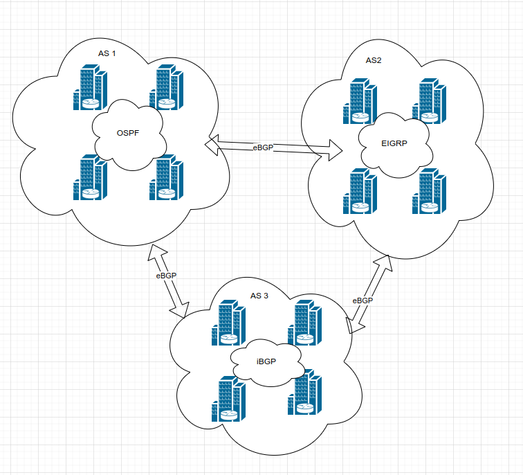

- The above network scheme shows how one or many IGPs as well as iBGP can be running within an autonomous system and how eBGP sessions interconnect the various autonomous systems together

- EGPs and IGPs use different algorithms for path selection as follows in the next sections

### Distance Vector Algorithms

- Distance vector routing protocols, such as RIP, advertise routes as vectors, where distance is a metric (or cost) such as hop count, and vector is the next hop router's IP used to reach the destination:

    - **Distance**: The distance is the route metric to reach the network

    - **Vector**: The vector is the interface or direction to reach the network

- When a router receives routing information from a neighbor, it stores it in a local routing database as it is received, and the distance vector algorithm (such as Bellman-Ford and Ford-Fulkerson algorithms) is used to determine which paths are the best loop-free paths to each reachable destination

- When the best paths are determined, they are installed into the routing table and are advertised to each neighbor router

- Routers running distance vector protocols advertise the routing information to their neighbors from their own perspective, modified from the original route received

- Therefore, a distance vector protocol does not have a complete map of the whole network; instead it's database reflects that a neighbor router knows how to reach the destination network and how far the neighbor router is from the destination network

- The advantage of distance vector protocols is that they require less CPU and memory and can run on low-end routers

- An analogy commonly used to describe distance vector protocols is a road sign at an intersection indicating that the intersection is 2 miles to the west; drivers trust and blindly follow this indication that the destination is 2 miles to the west; drivers trust and blindly follow this information, without really knowing whether there is a shorter or better way to the destination or whether the sign is even correct

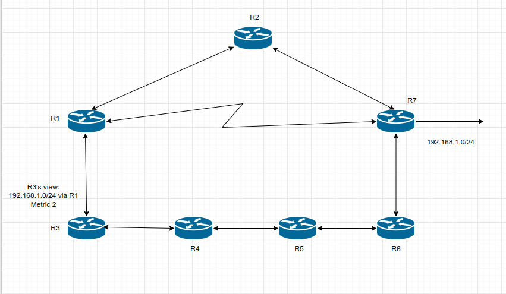

- The above scheme illustrates how a router using a distance vector routing protocol views the network and the direction that R3 needs to go to reach the 192.168.1.0/24 subnet

- A distance vector protocol selects paths purely based on distance

- It does not account for link speeds or other factors

- In the above figure the link between R1-R7 is a serial link with only 64 Kbps of bandwidth, and all other links are 1Gbps Ethernet links

- RIP does not take this into consideration and forwards traffic across this link which will result in packet loss when that link is oversubscribed

### Enhanced Distance Vector Algorithms

- The diffusing update algorithm (DUAL) is an enhanced distance vector algorithm that EIGRP uses to calculate the shortest path to a destination within a network

- EIGRP advertises network information to it's neighbors as other distance vector protocols do, but it haves some enhancements, as it's name suggests

- Enhancements introduced into this algorithm compared to other distance vector algorithms:

    - It offers rapid convergence time for changes in the network topology

    - It sends updates only when there is a change in the network. It does not send full routing table updates in a periodic fashion, as distance vector protocols do

    - It uses hellos and forms neighbor relationships just as link-state protocols do

    - It uses bandwidth, delay, reliability, load, and maximum transmission unit (MTU) size instead of hop count for path calculations

    - It has the option to load balance traffic across equal- or unequal-cost paths

- EIGRP is sometimes referred to as a *hybrid routing protocol* because it has characteristics of both distance vector and link-state protocols, as shown in the preceding list

- EIGRP relies on some more advanced metrics other than hop count (for example bandwidth) for it's best path calculations

- By default, EIGRP advertises the total path delay and minimum bandwidth for a route

- This information is advertised out every direction, as happens with a distance vector routing protocol; however, each router can calculate the best path based on the information provided by it's direct neighbors

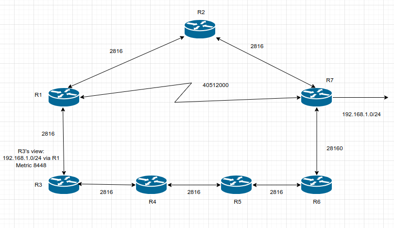

- This topology now includes EIGRP metric calculations for each link

- R3 is trying to forward packets to 192.168.1.0/24 network

- If the routing domain used a distance vector routing protocol, it would take the R3->R1->R7 path, which is only two hops away, rather than the path R3->R1->R2->R7, which is three hops away

- But the R3->R1->R7 path does not support traffic over 64 kbps

- While the R3->R1->R2->R7 path is longer, it provides more bandwidth and does not have as much delay (because of the serialization process on lower-speed interfaces) and is the path selected by EIGRP

### Link-State Algorithms

- A link-state IP routing protocol advertises the link state and link metric for each of it's connected links and directly connected routers to every router in the network

- OSPF and IS-IS are two link-state IP routing protocols commonly used in enterprise and service provider networks

- OSPF advertisements are called *link-state advertisements (LSAs)*, and IS-IS uses *link-state packets (LSPs)* for it's advertisements

- As a router receives an advertisement from a neighbor, it stores the information on the local database called *link-state database (LSDB)* and advertises link-state information on to each of it's neighbor routers exactly as it was received

- The link-state database is essentially flooded throughout the network, unchanged, from router to router, just as the originating router advertises it

- This allows all the routers in the network to have a synchronized and identical map of the network

- Using the complete map of the network, every router runs the Dijkstra shortest path first (SPF) algorithm to calculate the best shortest loop-free paths

- The link-state algorithm then populates the routing table with this information

- Due to having the complete map of the network, link-state protocols usually require more CPU and memory than the distance vector protocols, but they are less prone to routing loops and make better path decisions

- In addition, link-state protocols are equipped with extended capabilities such as opaque LSAs for OSPF and and TLVs (type/length/value) for IS-IS that allow them to support features commonly used by service providers, such as MPLS traffic engineering

- An analogy for link-state protocols is a GPS navigation system

- The GPS navigation system has a complete map and can make the best decision about which way is the shortest and best path to reach a destination

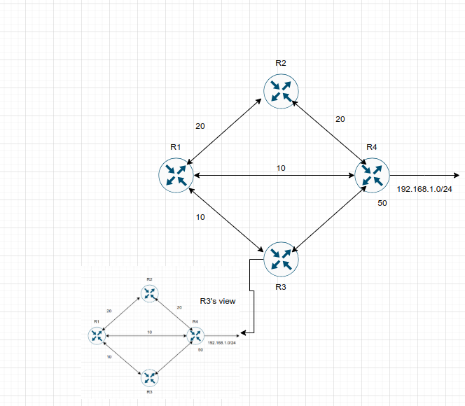

- The above picture illustrates how R3 would view the network to reach 192.168.1.0/24 subnet

- R1 will use the same algorithm as R3 and take the direct link to R4

### Path Vector Algorithm

- A path vector protocol such as BGP is similar to a distance vector protocol; the difference is that instead of looking at the distance to determine the next loop free path, it looks at various BGP path atributes

- BGP path attributes include autonomous system path (AS path), multi-exit discriminator (MED), origin, next hop, local preference, atomic aggregate and aggregator

- More about BGP path atributes are covered later

- A path vector protocol guarantees loop-free paths by keeping a record of each autonomous system that the routing advertisement traverses

- Any time a router receives an advertisement in which it is already part of the AS_Path, the advertisement is rejected because accepting the AS_Path would effectively result in a routing loop

- Loop prevention concept:

    1. R1 (AS1) advertises the 10.1.1.0/24 network to R2 (AS2). R1 adds the AS 1 to the AS_Path during the network advertisement to R2
    
    2. R2 advertises the 10.1.1.0/24 network to R4 and adds AS 2 to the AS_Path during the network advertisement to R4
    
    3. R4 advertises the 10.1.1.0/24 network to R3 and adds AS 4 to the AS_Path during the network advertisement to R3
    
    4. R3 advertises the 10.1.1.0/24 network back to R1 and R2 after adding AS 3 to the AS_Path during the network advertisement
    
    5. As R1 receives the 10.1.1.0/24 network advertisement from R3, it discards the route advertisement because R1 detects it's AS (AS 1) in the AS_Path "3 4 2 1" and considers the advertisement a loop. R2 discards the 10.1.1.0/24 network advertisement from R3 as it detects it's AS (AS 2) in the AS_Path "3 4 2 1" and considers it a loop too.
    
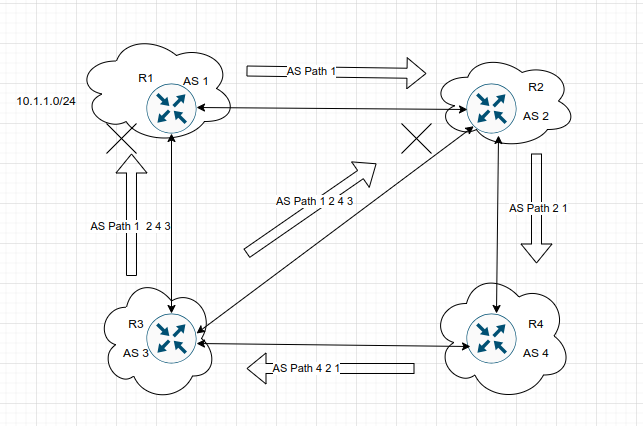

- In the above scheme the advertisement of the 10.1.1.0/24 network towards R3 is not added to be easier to visualize, but the process happens in the other direction as well

- R3 attempts to advertise the 10.1.1.0/24 network to R2 as well

- R2 discards the route because R1 detects it's AS (AS 2) in the AS_Path "3 4 2 1" and considers it a loop as well - even though it did not source the original route

### Path Selection

- A router identifies the path a packet should take by evaluating the prefix length that is programmed in the *Forwarding Information Base (FIB)*

- The FIB is programmed through the routing table, also known as the *routing information base (RIB)*

- The RIB is composed of routes presented from the routing protocol processes

- Path selection has three main components:

    - **Prefix length**: The prefix length represents the number of leading binary bits in the subnet mask that are in the on position
    
    - **Administrative distance**: Administrative distance (AD) is a rating of the trustworthiness of a routing information source
    
    - If a router learns about a route to a destination from more than one routing protocol, and all the routes have the same prefix length, then the AD is compared
    
    - **Metrics**: A metric is a unit of measure used by a routing protocol in the best-path calculation. The metrics vary from one routing protocol to another
    
#### Prefix Length

- Let's look at a scenario in which a router selects a route when the packet destination is within the network range for multiple routes

- Assume that a router has the following routes with various prefix lengths in the routing table:

    - 10.0.3.0/28
    
    - 10.0.3.0/26
    
    - 10.0.3.0/24
    
- Each of these routes, also known as *prefix routes* or simply prefixes, has a different prefix length (subnet mask)

- The routes are considered to be different destinations, and they will be installed into the RIB, also known as the routing table

- The routing table also includes the outgoing interface and the next-hop IP address (unless a prefix is a connected network)

- Routing table of R1:

```
Prefix          IP address range        Next hop        Outgoing Interface
10.0.3.0/28     10.0.3.0-10.0.3.15      10.1.1.1        Gi 1/1
10.0.3.0/26     10.0.3.0-10.0.3.63      10.2.2.2        Gi 2/2
10.0.3.0/24     10.0.3.0-10.0.3.255     10.3.3.3        Gi 3/3
```

- If a packet needs to be forwarded, the route chosen depends on the prefix length, where the longest prefix length is always preferred

- For example, /28 is preferred over /26 and /26 is preferred over /24

- Example:

    - If a packet needs to be forwarded to 10.0.3.14, the router matches all three routes as it fits into all three IP address ranges. But the packet is forwarded to next hop 10.1.1.1 with the outgoing interface Gigabit Ethernet 1/1 because 10.0.3.0/28 has the longest prefix match
    
    - If a packet needs to be forwarded to 10.0.3.42, the router matches 10.0.3.0/24 and 10.0.3.0/26 prefixes. But the packet is forwarded to 10.2.2.2 with the outgoing interface Gigabit Ethernet 2/2 because 10.0.3.0/26 has the lowest prefix match
    
    - If a packet needs to be forwarded to 10.0.3.100, the router matches only 10.0.3.0/24. The packet is forwarded to 10.3.3.3 with the outgoing interface Gigabit Ethernet 3/3
    
- The forwarding decision is a function of the FIB and results from the calculations performed in the RIB. The RIB is calculated through the combination of routing protocol metrics and administrative distance

#### Administrative Distance

- As each routing protocol receive routing updates and other routing information it chooses the best path to any given destination and attempts to install this path into the routing table

- Default ADs for routing protocols:

```
Connected                   0
Static                      1
EIGRP summary route         5
External BGP (eBGP)         20
EIGRP (internal)            90
OSPF                        110
IS-IS                       115
RIP                         120
EIGRP (external)            170
Internal BGP (iBGP)         200
```

- The RIB is programmed from the various routing protocol processes

- Every routing protocol presents the same information to the RIB for insertion: the destination network, the next hop IP address, the AD and metric values

- The RIB accepts or rejects a route based on the following logic:

    - If the route does not exist in the RIB, the route is accepted
    
    - If the route exist in the RIB, the AD must be compared. If the AD of the route already in the RIB is lower than the process of submitting the second route, the route is rejected. Then the routing process is notified
    
    - If the route exists in the RIB, the AD must be compared. If the AD of the route already in the RIB is higher than the routing process submitting the alternate entry, the route is accepted, and the current source protocol is notified of the removal of the entry in the RIB
    
- Another example can be a router that has OSPF, IS-IS and EIGRP running, and all three protocols have learned of the destination 10.3.3.0/24 network with a different best path and metric

- Each of these three protocols attempt to install the route to 10.3.3.0/24 into the routing table 

- Because the prefix length is the same, the next decision point is the AD, where the routing protocol with the lowest AD installs the route into the routing table

- Because the EIGRP internal route has the best AD, it is the one installed into the routing table

```
Routing Protocol        AD          Network         Installs in the RIB
EIGRP                   90          10.3.3.0/24         yes
OSPF                    110         10.3.3.0/24         no
IS-IS                   115         10.3.3.0/24         no
```

- The routing protocol or protocols that failed to install their route into the table (in this example, OSPF and IS-IS) hang on the route and tell the routing table process to report to them if the best path fails so that they can try to reinstall this route

- For example, if the EIGRP route 10.3.3.0/24 installed in the routing table fails for some reason, the routing table process calls OSPF and IS-IS and requests that they reinstall the route in the routing table

- Out of these two protocols, the preferred route is chosen based on AD, which would be OSPF, because of it's lower AD

- Understanding the order of processing from a router is critical because in some scenarios the path with the lowest AD may not always be installed in the RIB

- For example, BGP's path selection process could choose an iBGP path over an eBGP path

- So BGP would present the path with an AD of 200, not 20 to the RIB, which might not preempt a route learned via OSPF that has an AD of 110

- These situations are almost never seen; but remember that it is the best route from the routing protocol presented to the RIB when AD is then compared

- The default AD might not always be suitable for a network; for instance, there might be a requirement to adjust it so that OSPF routes are preferred over EIGRP routes

- However, changing the AD on routing protocols can have severe consequences, such as routing loops and other odd behaviour in a network

- It is recommended that the AD be changed only with extreme caution and only after what needs to be accomplished has been thoroughly thought out

### Metrics

- The logic for selecting the best path for a routing protocol can vary

- Most IGPs prefer internally learned routes over external routes and further prioritize the path with the lowest metric 


#### Equal-Cost Multipathing

- If a routing protocol identifies multiple paths as a best path and supports multiple path entries, the router installs the maximum number of paths allowed per destination

- This is known as *equal-cost multipathing* (ECMP) and provides load sharing across all links

- RIP, EIGRP, OSPF and IS-IS all support ECMP. 

- ECMP provides a mechanism to increase bandwidth across multiple paths by splitting traffic equally across the links

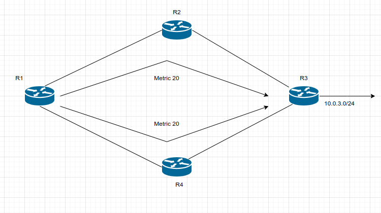

- In the above topology the four routers are running OSPF

- All four routers belong to the same area and use the same interface metric cost

- R1 has two paths with equal cost to reach R3's 10.3.3.0/24 network

- R1 installs both routes into the routing table and forwards traffic across the R1-R2-R3 and R1-R4-R3 path to reach 10.3.3.0/24 network

- The following output confirms that both paths have been installed into the RIB and, because the metrics are identical that the router is using ECMP

```
R1# show ip route

O   10.3.3.0/24     [110/30]    via 10.12.1.2, 00:49:12 GigabitEthernet 0/2
                    [110/30]    via 10.14.1.4, 00:49:51 GigabitEthernet 0/4
```

#### Unequal-Cost Multipathing 

- By default, routing protocols install only routes with the lowest path metric

- However, EIGRP can be configured (not enabled by default) to install multiple routes with different path metrics

- This allows for unequal-cost load balancing across multiple paths

- Traffic is transmitted out of router's interfaces based on that path's metrics in ratio to other the interface's metrics

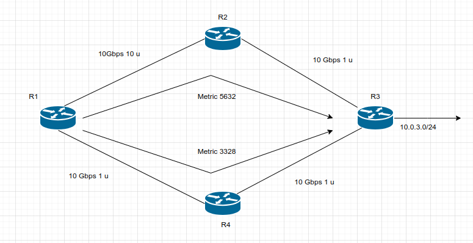

- The above is a topology with four routers running EIGRP

- The delay has been incremented on R1's G0/2 interface from 1u to 10u

- R1 sees two paths with different metrics

- The path from R1 to R3 via R1-R4-R3 has been assigned a path metric of 3328, and the path via R1-R2-R3 has been assigned a path metric of 5632

- Below is the routing table of R1. Notice that metrics are different for each path to the 10.3.3.0/24 network

```
R1# show ip route eigrp

D   10.3.3.0/24     [90/3328] via 10.14.1.4, 00:00:02   GigabitEthernet 0/4
                    [90/5632] via 10.12.1.2, 00:00:02   GigabitEthernet 0/2
```

- The explicit path must be viewed to see the traffic ratios with unequal-cost load balancing

- R1 forwards 71 packets toward R2 for every 120 packets that are forwarded toward R4

```
show ip route 10.3.3.0
```

### Static Routing

- Static routes provide precise control over routing but may create an administrative burden as the number of routers and network segments grow

- Using static routing requires zero network bandwidth because implementing manual route entries does not require communication with other routers

- Unfortunately, because the routers are not communicating, there is no network intelligence

- If a link goes down, other routers will not be aware that the network path is no longer valid

- Situations when static routes are useful:

    - Dynamic routing protocols cannot be used on the router because the limited router CPU or memory
    
    - Routes learned from dynamic routing protocols need to be superseded
    
#### Static Route Types

- Static routes can be classified as one of the following:

    - Directly attached static routes
    
    - Recursive static route
    
    - Fully specified static route
    
#### Directly Attached Static Routes

- Point-to-point (P2P) serial interfaces do not have to worry about maintaining an adjacency table and do not use Address Resolution Protocol (ARP), so static routes can directly reference the outbound interface of a router

- A static route that use only the outbound next-hop interface is known as a *directly attached static route*, and it requires that the outbound interface be in an up state for the route to be installed into the RIB

- Configuring directly attached static routes:

```
conf t
 ip route <network> <subnet-mask> <next-hop-interface-id>
```

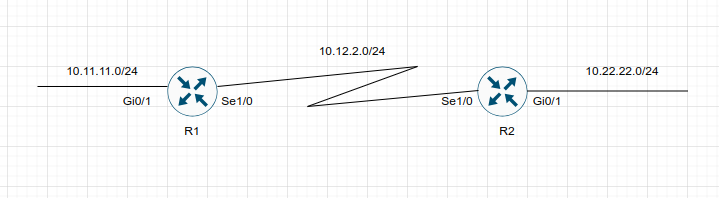

- In the above scheme R1 is connected to R2 using a serial connection

- R1 uses a dirrectly attached static route to the 10.22.22.0/24 network, and R2 uses a directly attached static route to the 10.11.11.0/24 network to allow connectivity between the two remote networks

- Static routes are configured on both routers so that return traffic will have a path back

- Configuration of static routes with serial 1/0 as the exit interface:

- R1:

```
conf t
 ip route 10.22.22.0 255.255.255.0 serial 1/0
```

- R2

```
conf t
 ip route 10.11.11.0 255.255.255.0 serial 1/0
```

- R1 indicates that the 10.22.22.0/24 network is reachable via S1/0 interface, and R2 indicates that the 10.11.11.0/24 network is reachable via the S1/0 interface

- A directly attached static route does not display AD/metric information when looking at the routing table

- Note that the static route displays directly connected with the outbound interface

- R1:

```
show ip route

C   10.11.11.0/24 is directly connected, GigabitEthernet0/1
C   10.12.2.0/24 is directly connected, Serial1/0
S   10.22.22.0/24 is directly connected, Serial1/0
```

- R2:

```
show ip route

S   10.11.11.0/24 is directly connected, Serial1/0
C   10.12.2.0/24 is directly connected, Serial1/0
C   10.22.22.0/24 is directly connected, GigabitEthernet0/1
```

- Configuring a directly attached static route to an interface that uses ARP (that is, Ethernet) causes problems and is not recommended 

- The router must repeat the ARP process for every destination that matches the static route, which consumes CPU and memory 

- Depending on the size of the prefix of the static route and the number of lookups, the configuration can cause system instability

#### Recursive Static Routes

- The forwarding engine on Cisco devices needs to know which interface an outbound packet should use

- A *recursive static route* specifies the IP address of the next-hop address 

- The recursive lookup occurs when the router queries the RIB to locate the route toward the next-hop IP address (connected, static or dynamic) and then cross-references the adjacency table

- Configuring the recursive static routes:

```
conf t
 ip route <network> <subnet-mask> <next-hop-ip>
```

- Recursive static routes require the route's next-hop address to exist in the routing table to install the static route into the RIB

- A recursive static route may not resolve the next-hop forwarding address using the default route (0.0.0.0/0) route. The static route will fail next-hop reachability requirements and will not be inserted into the RIB

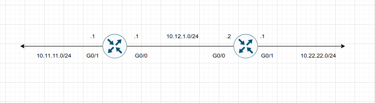

- In the above topology R1 and R2 are connected using the G0/0 port

- R1 uses a recursive static route to the 10.22.22.0/24 network, and R2 uses a recursive static route to the 10.11.11.0/24 network to allow connectivity between these networks

- R1 and R2 configuration:

- R1:

```
conf t
 ip route 10.22.22.0 255.255.255.0 10.12.1.2
```

- R2:

```
conf t
 ip route 10.11.11.0 255.255.255.0 10.12.1.1
```

- Verifying the static route configuration on R1:

```
show ip route

C   10.11.11.0/24 is directly connected, GigabitEthernet0/1
C   10.12.1.0/24 is directly connected, GigabitEthernet0/0
S   10.22.22.0/24   [1/0] via 10.12.1.2
```

- The static route has been configured on R1 for the 10.22.22.0/24 network with the next-hop IP address 10.12.1.2

- Notice that the [AD/Metric] information is present in the output and that the next-hop IP address is displayed

- Cisco supports the configuration of multiple recursive static routes

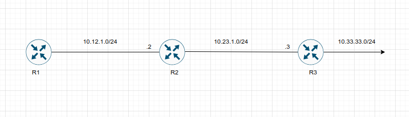

- In the above scheme R1 needs connectivity to the 10.23.1.0/24 network and to the 10.33.33.0/24 network

- R1 could configure the static route to the 10.33.33.0/24 network with a next-hop IP address as either 10.12.1.2 or 10.23.1.3 

- If R1 configured the static route with the 10.23.1.3 next-hop IP address, the router performs a second lookup when building the CEF entry for the 10.33.33.0/24 network

#### Fully Specified Static Routes

- Static route recursion can simplify topologies if a link fails because it may allow the static route to stay installed while it changes to a different outbound interface in the same direction as the destination

- However, problems arise if the recursive lookup resolves to a different interface pointed in the opposite direction

- To correct this issue, the static route configuration should use the outbound interface and the next-hop IP address

- A static route with both an interface and a next-hop IP address is known as a *fully specified static route*

- If the interface is not in an up state, the router removes the static route from the RIB

- Specifying the next-hop address along with the physical interface removes the recursive lookup and does not involve the ARP processing problems that occur when using only the outbound interface

- Configuring fully specified static routes:

```
conf t
 ip route <network> <subnet-mask> <interface-id> <next-hop-ip>
```

- R1:

```
conf t
 ip route 10.22.22.0 255.255.255.0 gigabitethernet0/0 10.12.1.2
```

- R2:

```
conf t
 ip route 10.11.11.0 255.255.255.0 gigabitethernet0/0 10.12.1.1
```

- R1 and R2 use fully specified static routes to connect to the 10.11.11.0/24 and 10.22.22.0/24 networks using the Gi0/0 interface

- Verifying that R1 can only reach the 10.22.22.0/24 network via 10.12.1.2 from the Gi0/0 interface

```
show ip route

C   10.11.11.0/24 is directly connected, GigabitEthernet0/1
C   10.12.1.0/24 is directly connected, GigabitEthernet0/0
S   10.22.22.0/24   [1/0] via 10.12.1.2, GigabitEthernet0/0 
```

#### Floating Static Routing

- The default AD on a static route is 1, but a static route can be configured with an AD value of 1 to 255 for a specific route

- The AD is set on a static route by appending the AD as part of the command structure

- Using a floating static route is a common technique for providing backup connectivity for prefixes learned via dynamic routing protocols

- A floating static route is configured with an AD higher than that of the primary route

- Because the AD is higher than that of the primary route, it is installed in the RIB only when the primary route is withdrawn 

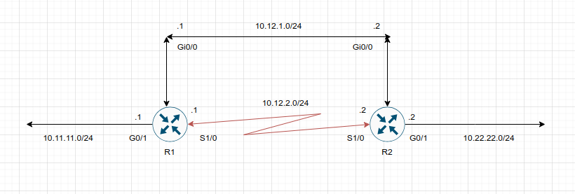

- R1 and R2 are configured with two links. The 10.12.1.0/24 transit network is preferred to the 10.12.2.0/24 network

- Configuring R1 and R2 with floating static routes:

- R1

```
conf t
 ip route 10.22.22.0 255.255.255.0 10.12.1.2 10
 ip route 10.22.22.0 255.255.255.0 serial1/0 210
```

- R2

```
conf t
 ip route 10.11.11.0 255.255.255.0 10.12.1.1 10
 ip route 10.11.11.0 255.255.255.0 serial1/0 210
```

- The static route using the Ethernet link (10.12.1.0/24) has an AD of 10 and the serial link (10.12.2.0/24) has an AD set to 210

- Verifying the routing table of R1:

```
show ip route

C   10.11.11.0/24 is directly connected, GigabitEthernet0/1
C   10.12.1.0/24 is directly connected, GigabitEthernet0/0
C   10.12.2.0/24 is directly connected, Serial 1/0
S   10.22.22.0/24 [10/0] via 10.12.1.2
```

- Notice that the static route across the serial link is not installed into the RIB

- Only the static route for the Ethernet link (10.12.1.0/24) with an AD of 10 is installed into the RIB

- Routing table of R1 after shutting down the G0/0 Ethernet link to simulate a link failure

```
conf t
 interface g0/0
  shutdown
  exit

show ip route

C   10.11.11.0/24 is directly connected, GigabitEthernet0/1
C   10.12.2.0/24 is directly connected, Serial1/0
S   10.22.22.0/24 is directly connected, Serial1/0
```

- The 10.12.1.0/24 network (R1's G0/0) is removed from the RIB

- The floating static route through the 10.12.2.0/24 network (R1's S1/0) is now the best path and is installed into the RIB

- Notice that the AD is not shown for that static route

- Even though the static route's AD is not shown, it is still programmed in the RIB

- Verifying the static route further:

```
show ip route 10.22.22.0

Routing entry for 10.22.22.0/24
    Known via "static", distance 210, metric 0, connected
    Routing Descriptor Blocks:
    *   directly connected, via Serial1/0
        Route metric is 0, traffic share count is 1
```

- The output confirms that the floating static route with AD 210 is currently active in the routing table

#### Static Null Routes

- The null interface is a virtual interface that is always in an up state

- Null interfaces do not forward or receive network traffic and drop all traffic destined toward them without adding overhead to the router's CPU

- Configuring a static route to a null interface provides a method of dropping network traffic without requiring the configuration of an access list

- Creating a static route to a Null0 interface is a common technique to prevent routing loops

- The static route to the Null0 interface used a summarized network range, and routes that are more specific point toward the actual destination

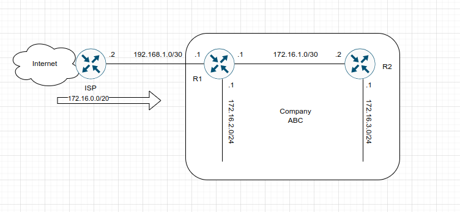

- In the above topology, company ABC has aquired the 172.16.0.0/20 network range from it's service provider

- ABC uses only a portion of the given addresses but keeps the large network block in anticipation of future growth

- The service provider places a static route for the 172.16.0.0/20 network to R1's interface (192.168.1.1)

- R1 uses a static default route pointed toward the service provider (192.168.1.2) and a static route to the 172.16.3.0/24 network via R2 (172.16.1.2)

- Because R2 accesses all other networks through R1, a static default route points toward R1's interface (172.16.1.1)

- If packets are sent to any addresses in the 172.16.0.0/20 range that is not used by company ABC, the packet gets stuck in a loop between R1 and the ISP, consuming additional bandwidth until the packet TTL expires

- For example, a computer on the Internet sends a packet to 172.16.5.5, and the 172.16.5.0/24 network is not allocated on R1 or R2

- The ISP sends the packet to R1 because the 172.16.0.0/20 static route; R1 looks into the RIB, and the longest match for the prefix is the default route back to the ISP, so R1 sends the packet back to the ISP, creating a routing loop

- Routing loop when the packets originate from R2:

```
traceroute 172.16.5.5 source GigabitEthernet 0/2

1 172.16.1.1 0 msec 0 msec 0 msec
2 192.168.1.1 0 msec 0 msec 0 msec
3 192.168.1.2 0 msec 4 msec 0 msec
4 192.168.1.1 0 msec 0 msec 0 msec
5 192.168.1.2 0 msec 0 msec 0 msec
(...)
```

- To prevent the routing loop, a static route is added for the 172.16.0.0/20, pointed to the Null0 interface on R1

- Any packets matching the 172.16.0.0/20 network range that do not have a longer match in R1's RIB are dropped

- Static route configuration for R1 with the newly added null static route:

```
conf t
 ip route 0.0.0.0 0.0.0.0 Gi0/0 192.168.1.2
 ip route 172.16.3.0 255.255.255.0 Gi0/2 172.16.1.2
 ip route 172.16.0.0 255.255.240.0 Null0
```

- Verifying that the null static route has removed the routing loop as intended:

- R2

```
traceroute 172.16.5.5 source GigabitEthernet 0/2

1 172.16.1.1 * * *
2 172.16.1.1 * * *
(...)
```

#### IPv6 Static Routes

- The static routing principles for IPV4 routes are the same for IPv6

- Ensuring that IPv6 routing is enabled on the router:

```
conf t
 ipv6 unicast-routing
```

- Configuring IPv6 static routes:

```
conf t
 ipv6 route <network>/<prefix_length> <next_hop_interfacd_id> | [next_hop_interface_id] <next_ip_address>
```

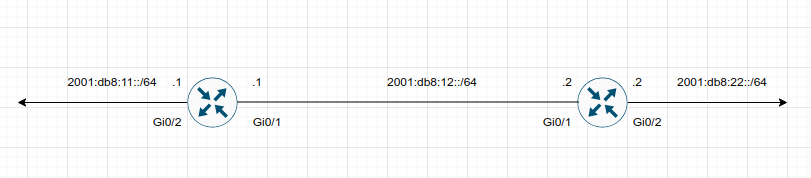

- R1 needs a static route to R2's 2001:db8:22::/64 network, and R2 needs a static route to R1's 2001:db8:11::/64 network

- IPv6 static routing configuration for R1 and R2:

- R1:

```
conf t
 ipv6 unicast-routing
 ipv6 route 2001:db8:22::/64 2001:db8:12::2
```

- R2:

```
conf t
 ipv6 unicast-routing
 ipv6 route 2001:db8:11::/64 2001:db8:12::1
```

- If the next-hop address is an IPv6 link-local address, the static route must be a fully specified static route

- Displaying the IPv6 routing table on R1:

```
show ipv6 route
(...)
C   2001:db8:11::/64    [0/0]
    via GigabitEthernet0/2, directly connected
C   2001:db8:12::/64    [0/0]
    via GigabitEthernet0/1, directly connected
S   2001:db8:22::/64    [1/0]
    via 2001:db8:12::2
```

- Connectivity can be verified with the `ping` or `traceroute` command:

- R1 pings R2's 2001:db8:22::2 interface IP address

```
ping 2001:db8:22::2
```

### Virtual Routing and Forwarding (VRF)

- Virtual routing and forwarding (VRF) is a technology that creates separate virtual routers on a physical router

- Router interfaces, routing tables, and forwarding tables are completely isolated between VRFs, preventing traffic from one VRF from forwarding into another VRF

- All router interfaces belong to the global VRF until they are specifically assigned to a user-defined VRF

- The global VRF is identical to the regular routing table of non-VRF routers

- Every router's VRF maintains a separate routing table; it is possible to allow for overlapping IP address ranges

- VRF creates segmentation between network interfaces, network subinterfaces, IP addresses and routing tables

- Router without VRF:

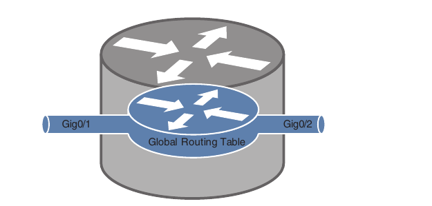

- Router with MGMT VRF:

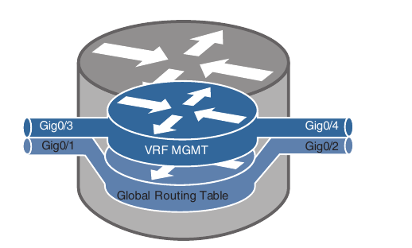

- The above schemes show two routers to help visualize the VRF routing table concept

- One of the routers has no VRFs configured, and the other one has a management VRF instance named MGMT

- Creating multiprotocol VRF instances:

```
conf t
 vrf definition <vrf-name>
```

- Under the VRF definition submode, we can enable address families for IPv4 or IPv6

```
conf t
 vrf definition MGMT
 address-family <ipv4|ipv6>
```

- The VRF instance is then associated to the interface with the following command, under the interface configuration submode:

```
conf t
 interface g0/3
 vrf forwarding <vrf-name> # vrf forwarding MGMT
```

- Steps required to create a VRF and assign it to an interface:

    - **Step 1**: Create a multiprotocol VRF routing table by using the command `vrf definition <vrf-name>`

    - **Step 2**: Initialize the appropriate address family by using the command `address-family <ipv4|ipv6>`

    - The address family can be IPv4, IPv6 or both

    - **Step 3**: Enter the interface configuration submode and specify the interface to be associated with the VRF instance by using the command `interface <interface_id>`

    - **Step 4**: Associate the VRF instance to the interface or subinterface by entering the command `vrf forwarding <vrf-name>` under interface configuration submode

    - **Step 5**: Configure an IP address (IPv4, IPv6 or both) on the interface or subinterface by entering either or both of the following commands:

    ```
    ip address <ip_address> <subnet_mask> [secondary]
    ```

    ```
    ipv6 address <ipv6_address>/<prefix_length> 
    ```

- The following table provides a set of interfaces and IP addresses that overlap between the global routing table and the VRF instance

```
Interface               IP Address      VRF         Global
GigabitEthernet 0/1     10.0.3.1/24     -           yes
GigabitEthernet 0/2     10.0.4.1/24     -           yes
GigabitEthernet 0/3     10.0.3.1/24     MGMT        -     
GigabitEthernet 0/4     10.0.4.1/24     MGMT        -
```

- The configuration for above interfaces and the MGMT VRF is the following:

```
conf t
 interface gi0/1
  ip address 10.0.3.1 255.255.255.0
  no shutdown

 interface gi0/2
  ip address 10.0.4.1 255.255.255.0
  no shutdown

 vrf definition MGMT
  address family ipv4
 
 interface gi0/3
  vrf forwarding MGMT
  ip address 10.0.3.1 255.255.255.0
 
 interface gi0/4
  vrf forwarding MGMT
  ip address 10.0.4.1 255.255.255.0
```

- Viewing the global routing table:

```
show ip route

C   10.0.3.0/24 is directly connected, GigabitEthernet 0/1
L   10.0.3.1/32 is directly connected, GigabitEthernet 0/1
C   10.0.4.0/24 is directly connected, GigabitEthernet 0/2
L   10.0.4.1/32 is directly connected, GigabitEthernet 0/2
```

- Note that the interfaces with the MGMT routing table do not appear with this command

- Verifying the routing table of the MGMT VRF:

```
show ip route vrf MGMT

C   10.0.3.0/24 is directly connected, GigabitEthernet 0/3
L   10.0.3.1/32 is directly connected, GigabitEthernet 0/3
C   10.0.4.0/24 is directly connected, GigabitEthernet 0/4
L   10.0.4.1/32 is directly connected, GigabitEthernet 0/4
```

- The IP addresses in the VRF MGMT instance overlap with the ones configured in the global routing table, but there is no conflict because they are in a different routing table

- VRF instances on a router can be compared to that of virtual local area networks (VLANs) on a switch

- However, instead of relying on Layer 2 technologies such as spanning tree, VRF instances allow for interaction and segmentation with Layer 3 dynamic routing protocols

- Using routing protocols over Layer 2 technologies has some advantages, such as improved network convergence times, dynamic traffic load-sharing, and troubleshooting tools such as ping and traceroute

- `ip vrf` versus `vrf definition`

- The first command only enables VRF for ipv4. It does not have IPv6 support

- The second one enables a multiprotocol VRF. IPv4 and IPv6 support can be enabled with the specific address families

- Converting an `ip vrf` to a `vrf definition` automatically:

```
conf t
 vrf upgrade-cli multi-af-mode common-policies
```

- Note that the above command takes off the IPv6 addresses configured on the interfaces while migrating them as per warning:

```
R1(config)#vrf upgrade-cli multi-af-mode common-policies 
You are about to upgrade to the multi-AF VRF syntax commands.
You will lose any IPv6 addresses configured on interfaces
belonging to upgraded VRFs.

Are you sure ? [yes]: yes
Number of VRFs upgraded: 0
```
