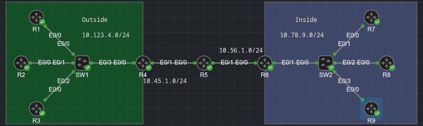

## Network Address Translation (NAT)

- In the early stages of the internet, large network blocks were assigned to organizations (for example, universities, campuses, companies)

- Network engineers started to realize that as more people connected to the internet, the IP address space would become exhausted

- RFC 1918 established common network blocks that should never been seen on the Internet (that is, they are non-globally routed networks):

    - 10.0.0.0/8 accommodates 16777216 hosts

    - 172.16.0.0/2 accommodates 1048576 hosts

    - 192.168.0.0/16 accommodates 65536 hosts

- This address blocks provide large private network blocks for companies to connect their devices together, but how can devices with private network addressing reach servers that are on the public Internet?

- If a packet is sourced from a 192.168.1.1 IP address, the server will not have a route back to the 192.168.1.1 network - because it does not exist on the Internet

- Connectivity is established with Network Address Translation (NAT)

- Basically, NAT enables the internal IP network the internal IP network to appear as publicly routed external network

- A NAT device, typically a router or firewall, modifies the source or destination IP addresses in a packet's header as the packet is received on the outside or inside interface

- NAT can be used in use cases other than just providing Internet connectivity to private networks

- It can also be used to provide connectivity when a company buys another company, and the two companies have overlapping networks (that is, the same network ranges are in use)

- Most routers and switches perform NAT translation only with the IP header adressing and do not translate IP addresses within the payload, for example DNS requests

- Some firewalls have the ability to perform NAT within the payload for certain types of traffic

- Four important terms are related to NAT:

    - **Inside Local**: The actual private IP address assigned to a device on the inside network(s)

    - **Inside Global**: The public IP address that represents one or more inside local IP addresses to the outside

    - **Outside Local**: The IP address of an outside host as it appears to the inside network. The IP address does not have to be reachable by the outside but it is considered private and must be reachable by the inside network

    - **Outside Global**: The public IP address assigned to a host on the outside network. This IP address must be reachable by the outside network

- Three types of NAT are commonly used today:

    - **Static NAT**: Provides a static one-to-one mapping of a local IP address to a global IP address

    - **Pooled NAT**: Provides a dynamic one-to-one mapping of a local IP address to a global IP address

    - **Port Address Translation (PAT)**: Provides a dynamic many-to-one mapping of many local IP addresses to one global IP address. The NAT device needs a mechanism to identify the specific private IP address for the return network traffic

    - The NAT device translates the private IP address and port to a different global IP address and port. The port is unique from any other ports, which enables the NAT device to track the global IP address to local IP addresses based on the unique port mapping

#### NAT topology

- In the below topology, R5 performs the NAT translation; It's G0/0 interface (10.45.1.5) is the outside interface, and it's G0/1 (10.56.1.5) interface is the inside interface

- R1, R2, R3, R7, R8 and R9 all act as either clients or servers



- R1, R2, and R3 all have a static default route toward R4, and R4 has a static default route toward R5

- R7, R8 and R9 all have a static default route toward R6, and a static default route to R5

- R5 contains a static route to the 10.123.4.0/24 network through R4, and a second static route to the 10.78.9.0/24 network through R6

- Routing tables of R1, R5 and R7:

- R1:

```
R1#sh ip route | b Gate
Gateway of last resort is 10.123.4.4 to network 0.0.0.0

S*    0.0.0.0/0 [1/0] via 10.123.4.4
      10.0.0.0/8 is variably subnetted, 2 subnets, 2 masks
C        10.123.4.0/24 is directly connected, Ethernet0/0
L        10.123.4.1/32 is directly connected, Ethernet0/0
```

- R5:

```
R5(config)#do sh ip route | b Gate
Gateway of last resort is not set

      10.0.0.0/8 is variably subnetted, 6 subnets, 2 masks
C        10.45.1.0/24 is directly connected, Ethernet0/0
L        10.45.1.5/32 is directly connected, Ethernet0/0
C        10.56.1.0/24 is directly connected, Ethernet0/1
L        10.56.1.5/32 is directly connected, Ethernet0/1
S        10.78.9.0/24 [1/0] via 10.56.1.6
S        10.123.4.0/24 [1/0] via 10.45.1.4
```

- R7:

```
R7(config)#do sh ip route | b Gate
Gateway of last resort is 10.78.9.6 to network 0.0.0.0

S*    0.0.0.0/0 [1/0] via 10.78.9.6
      10.0.0.0/8 is variably subnetted, 2 subnets, 2 masks
C        10.78.9.0/24 is directly connected, Ethernet0/0
L        10.78.9.7/32 is directly connected, Ethernet0/0
```

- Here we have full connectivity between R1, R2, R3 (outside hosts) and R7, R8, R9 (inside hosts)

- Traceroute from R1 to R7:

```
R1#traceroute 10.78.9.7
Type escape sequence to abort.
Tracing the route to 10.78.9.7
VRF info: (vrf in name/id, vrf out name/id)
  1  * 
    10.123.4.4 3 msec 3 msec
  2 10.45.1.5 2 msec 3 msec 2 msec
  3 10.56.1.6 3 msec 4 msec 2 msec
  4 10.78.9.7 3 msec 2 msec * 
```

- From R9 to R3:

```
R9#traceroute 10.123.4.3
Type escape sequence to abort.
Tracing the route to 10.123.4.3
VRF info: (vrf in name/id, vrf out name/id)
  1 10.78.9.6 2 msec 3 msec 2 msec
  2 10.56.1.5 2 msec 3 msec 1 msec
  3 10.45.1.4 2 msec 2 msec 1 msec
  4 10.123.4.3 2 msec 6 msec * 
```

- IOS-XE routers allow you to log in using telnet and identify the source and destination IP addresses by examining the TCP session details:

```
R7#telnet 10.123.4.1
Trying 10.123.4.1 ... Open


User Access Verification

Username: marius
Password: 

R1>en
R1>enable 
Password: 
R1#
R1#
R1#show tcp brief 
TCB       Local Address               Foreign Address             (state)
78FEF19D20D8  10.123.4.1.23              10.78.9.7.35728             ESTAB
------------  0.0.0.0.23                 *.*                         LISTEN
------------  ::.23                      *.*                         LISTEN
------------  0.0.0.0.22                 *.*                         LISTEN
------------  ::.22                      *.*                         LISTEN
```

- When you are logged in, the command `show tcp brief` displays the source IP address and port, along with destination IP address and port

- The local IP address reflects R1 (10.123.4.1) and the remote address is R7 (10.78.9.7)

- These IP addresses match expectations, and therefore no NAT has occured on R5 for this telnet session

#### Static NAT

- Static NAT involves the translation of a global IP address to a local IP address, based on a static mapping of the global IP address to the local IP address

- There are two types of static NAT:

    - **Inside static NAT**

    - **Outside static NAT**

##### Inside Static NAT

- Inside static NAT involves the mapping of an inside local (private) IP address to an inside global (public) IP address

- In this scenario, the private IP addresses are being hidden from the outside hosts

- Configuring static NAT:

    1. Configure the outside interfaces:

    ```
    conf t
     interface e0/0
      ip nat outside
    ```

    2. Configure the inside interface:

    ```
    conf t
     interface e0/1
      ip nat inside
    ```

    3. Configure the inside NAT:

    ```
    conf t
     ip nat inside source static <inside-local-ip> <inside-global-ip>
    ```

- Inside static NAT configuration on R5 where packets sourced from R7 (10.78.9.7) appear as if they came from 10.45.1.7:

R5:

```
conf t
 interface e0/0
  ip nat outside
 interface e0/1
  ip nat inside

 ip nat inside source static 10.78.9.7 10.45.1.7
```

- Most network engineers assume that the <inside-global-ip> must reside on the outside network

- In this scenario that would be an IP address on the 10.45.1.0/24 network

- First, the <inside-global-ip> should not be associated to the outside interface

- Second, the <inside-global-ip> could be an address for a network that does not exist on the NAT router (example: 10.77.77.77)

- However, all outside routers must have a route for forwarding packets toward the router performing the NAT for that IP address

- Now that the NAT has been configured on R5, R7 initiates again a telnet session to R1:

```
R7#telnet 10.123.4.1
Trying 10.123.4.1 ... Open

User Access Verification

Username: marius
Password: 

R1>enable 
Password: 

R1#show tcp br
TCB       Local Address               Foreign Address             (state)
78FEEAC91978  10.123.4.1.23              10.45.1.7.58667             TIMEWAIT
78FEF19C7D88  10.123.4.1.23              10.45.1.7.41011             ESTAB
------------  0.0.0.0.23                 *.*                         LISTEN
------------  ::.23                      *.*                         LISTEN
------------  0.0.0.0.22                 *.*                         LISTEN
------------  ::.22                      *.*                         LISTEN
```

- When viewing the TCP sessions on R1, the local address remains 10.123.4.1 as expected, but the remote address now reflects 10.45.1.7

- This is a different source IP address than the previous telnet attempt

- The NAT translations table consists of static and dynamic entries

- Displaying the NAT translation table:

```
R5#show ip nat trans
Pro Inside global      Inside local       Outside local      Outside global
tcp 10.45.1.7:41011    10.78.9.7:41011    10.123.4.1:23      10.123.4.1:23
--- 10.45.1.7          10.78.9.7          ---                ---
```

- On the R5's translation table after R7 initiated a telnet session to R1, there are two entries:

    - The first entry is the dynamic entry correlating with the telnet session. The inside global, inside local, outside local and outside global all contain values. The ports in this entry correlates with the ports used for the telnet session above

    - The second entry is the inside static NAT entry that was been configured

- The NAT translation follows these steps:

    1. As traffic enters on R5's e0/1 interface, R5 performs a route lookup for the destination IP address, which points out to e0/0 interface. R5 is aware that e0/0 is an outside NAT interface and that e0/1 is an inside NAT interface and therefore checks the NAT table for an entry

    2. Only the inside static NAT entry exists, so R5 creates a dynamic NAT entry with the packet's destination (10.123.4.1) for the outside local and outside global address

    3. R5 translates (changes) the packet's source IP address from 10.78.9.7 to 10.45.1.7

    4. R1 registers the telnet session as coming from 10.45.1.7 and then transmits a return packet. The packet is forwarded to R4 using the static default route, and R4 forwards the packet using the static default route

    5. As the packet enters R5's e0/0 interface, R5 is aware that e0/0 is an outside NAT interface and checks the NAT table for an entry

    6. R5 correlates the packet's source and destination ports with the first NAT entry, and knows to modify the packet's destination IP address from 10.45.1.7 to 10.78.9.7

    7. R5 routes the packet out of it's G0/1 interface toward R6

- Remember that a static NAT entry is a one-to-one mapping between the inside global and inside local address

- As long as the outside devices can route traffic to the inside global IP address, they can use it to reach the inside local device as well

- R2, with no session to any device in the topology establishes a telnet session to R7, using the inside global IP address 10.45.1.7

- R5 simply creates a second dynamic entry for this new session

- From R7's perspective, is has connected to R2 (10.123.4.2):

```
R2#telnet 10.45.1.7
Trying 10.45.1.7 ... Open


User Access Verification

Username: marius
Password: 

R7>en
R7>enable 
Password: 
R7#
R7#
R7#sh
R7#show ip int br
Interface              IP-Address      OK? Method Status                Protocol
Ethernet0/0            10.78.9.7       YES manual up                    up      
Ethernet0/1            unassigned      YES TFTP   administratively down down    
Ethernet0/2            unassigned      YES TFTP   administratively down down    
Ethernet0/3            unassigned      YES TFTP   administratively down down    
R7#sh
R7#show tc
R7#show tcp b
R7#show tcp brief 
TCB       Local Address               Foreign Address             (state)
7B1866FC92A8  10.78.9.7.23               10.123.4.2.27669            ESTAB
------------  0.0.0.0.23                 *.*                         LISTEN
------------  ::.23                      *.*                         LISTEN
------------  0.0.0.0.22                 *.*                         LISTEN
------------  ::.22                      *.*                         LISTEN
```

- R5:

```
R5#show ip nat translations 
Pro Inside global      Inside local       Outside local      Outside global
tcp 10.45.1.7:23       10.78.9.7:23       10.123.4.2:27669   10.123.4.2:27669
--- 10.45.1.7          10.78.9.7          ---                ---
```

- When R7 also opens a connection towards R1:

```
R5#show ip nat translations 
Pro Inside global      Inside local       Outside local      Outside global
tcp 10.45.1.7:23       10.78.9.7:23       10.123.4.2:27669   10.123.4.2:27669
tcp 10.45.1.7:28324    10.78.9.7:28324    10.123.4.1:23      10.123.4.1:23
--- 10.45.1.7          10.78.9.7          ---                ---
```

##### Outside Static NAT

- Outside static NAT involves the mapping of an inside global (public) IP address to an outside local (private) IP address

- In this scenario, the real external IP addresses are being hidden from the inside hosts

- The steps to configure outside static NAT:

    1. Configure the outside interface:

    ```
    conf t
     interface e0/0
      ip nat outside
    ```

    2. Configure the inside interface:

    ```
    conf t
     interface e0/1
      ip nat inside
    ```

    3. Configure the outside static NAT:

    ```
    conf t
     ip nat outside source static <outside-global-ip> <outside-local-ip> [add-route]
    ```

- The router performs a route lookup first for the <outside-local-ip> address, and a route must exist for that network to forward packets out of the outside interface before NAT occurs

- The optional `add-route` keyword adds the appropriate static route entry automatically 

- Outside static NAT configuration on R5, where packets sent from R6, R7, R8, or R9 to 10.123.4.222 will be sent to R2 (10.123.4.2)

- R5 has already a static route to the 10.123.4.0/24 network, so the `add-route` keyword is not necessary:

- R5:

```
conf t
 interface e0/0
  ip nat outside
 interface e0/1
  ip nat inside

 ip nat outside source static 10.123.4.2 10.123.4.222
```

- (Equivlent with DNAT - static DNAT)

- R6, R7, R8 or R9 could initiate a telnet session to R2's IP address 10.123.4.2 and no NAT translation will occur

- The same routers can inititate a telnet session with R2's outside local Ip address 10.123.4.222; or R2 would initiate a session with any of the inside hosts (R6, R7, R8 or R9) to demonstrate the outside static NAT entry

- R2 establishing a telnet session with R9 (10.78.9.9). From R9's perspective it came from 10.123.4.222

```
R2#telnet 10.78.9.9
Trying 10.78.9.9 ... Open


User Access Verification

Username: marius
Password: 

R9>en
R9>enable 
Password: 

R9#show tcp brief 
TCB       Local Address               Foreign Address             (state)
7DE541C3A708  10.78.9.9.23               10.123.4.222.48757          ESTAB
------------  0.0.0.0.23                 *.*                         LISTEN
------------  ::.23                      *.*                         LISTEN
------------  0.0.0.0.22                 *.*                         LISTEN
------------  ::.22                      *.*                         LISTEN
```

```
R5(config)#do sh ip nat trans
Pro Inside global      Inside local       Outside local      Outside global
--- ---                ---                10.123.4.222       10.123.4.2
--- 10.45.1.7          10.78.9.7          ---                ---
tcp 10.78.9.9:23       10.78.9.9:23       10.123.4.222:48757 10.123.4.2:48757
```

- R8 opens a telnet session with the outside static NAT outside local address (10.123.4.222), but from R2's perspective the source address is R8's address 10.78.9.8:

```
R2#sh tcp br
TCB       Local Address               Foreign Address             (state)
7E8938B632F8  10.123.4.2.23              10.78.9.8.16742             ESTAB
7E89407D6C90  10.123.4.2.64990           10.78.9.9.23                ESTAB
------------  0.0.0.0.23                 *.*                         LISTEN
------------  ::.23                      *.*                         LISTEN
------------  0.0.0.0.22                 *.*                         LISTEN
------------  ::.22                      *.*                         LISTEN
```

```
R5(config)#do sh ip nat trans
Pro Inside global      Inside local       Outside local      Outside global
--- ---                ---                10.123.4.222       10.123.4.2
tcp 10.78.9.8:16742    10.78.9.8:16742    10.123.4.222:23    10.123.4.2:23
tcp 10.78.9.9:23       10.78.9.9:23       10.123.4.222:64990 10.123.4.2:64990
```

- Below is R5's NAT translation table

- Notice that there is a static mapping for R2's inside global address, and there are two dynamic entries for two sessions on R2:

    - The first entry is the outside static NAT entry that was configured

    - The second entry is the telnet session launched from R8 to the 10.123.4.222 IP address

    - The third entry is the telnet session launched from R2 to R9's IP address (10.178.9.9)

- Outside static NAT configuration is not very common and is typically used to overcome the problems caused by duplicate IP/network addresses on a network

#### Pooled NAT

- Static NAT provides a simple method of translating addresses

- A major downfall to the use of static NAT is the number of configuration entries that must be created on the NAT device; in addition the number of global IP addresses must match the number of local IP addresses

- Pooled NAT provides a more dynamic method of providing a one-to-one IP address mapping - but on a dynamic, as-needed basis

- The dynamic NAT translation entry stays in the translation table until traffic flow from the local address to the global address has stopped and the timeout period (24 hours by default) has expired

- The unused global IP address is then returned to the pool to be used again

- Pooled NAT can operate as inside NAT or outside NAT

- The steps for configuring the inside pooled NAT are as follows:

    1. Configure the outside interface:

    ```
    conf t
     interface e0/0
      ip nat outside
    ```

    2. Configure the inside interface:

    ```
    conf t
     interface e0/1
      ip nat inside
    ```

    3. Specify which inside IP addresses are allowed to be NAT-ed by using a standard or extended ACL - named or numbered. Using a user-friendly name may be simplest from an operational support perspective

    4. Define the global pool of IP addresses by using the following command:

    ```
    conf t
     ip nat pool <nat-pool-name> <starting-ip> <ending-ip> prefix-length <prefix-length>
    ```

    5. Configure the inside pooled NAT:

    ```
    conf t
     ip nat inside source list <acl-nr/acl-name> pool <nat-pool-name>
    ```

- Configuration for inside pooled NAT

- Use a NAT pool with IP addresses 10.45.1.10 and 10.45.1.11

- Use a named ACL, ACL-NAT-CAPABLE that allows only packets sourced from the 10.78.9.0/24 network to be eligible for pooled NAT

- R5:

```
conf t
 ip access-list standard ACL-NAT-CAPABLE
  permit 10.78.9.0 0.0.0.255

 ip nat pool R5-OUTSIDE-POOL 10.45.1.10 10.45.1.11 prefix-length 24

 ip nat inside source list ACL-NAT-CAPABLE pool R5-OUTSIDE-POOL
```

- To generate some traffic R7 (10.78.9.7) and R8 (10.78.9.8) ping R1 (10.123.4.1)

R7:

```
R7#ping 10.123.4.1
Type escape sequence to abort.
Sending 5, 100-byte ICMP Echos to 10.123.4.1, timeout is 2 seconds:
!!!!!
Success rate is 100 percent (5/5), round-trip min/avg/max = 1/3/8 ms
```

- R8:

```
R8#ping 10.123.4.1
Type escape sequence to abort.
Sending 5, 100-byte ICMP Echos to 10.123.4.1, timeout is 2 seconds:
!!!!!
Success rate is 100 percent (5/5), round-trip min/avg/max = 2/3/6 ms
```

- In this case, the pings should have created a dynamic inside NAT translation and removed the 10.45.1.10 and 10.45.1.11 bindings 

- There are a total of four translations in the R5's translation table:

```
R5(config)#do sh ip nat trans
Pro Inside global      Inside local       Outside local      Outside global
icmp 10.45.1.10:1      10.78.9.7:1        10.123.4.1:1       10.123.4.1:1
--- 10.45.1.10         10.78.9.7          ---                ---
icmp 10.45.1.11:1      10.78.9.8:1        10.123.4.1:1       10.123.4.1:1
--- 10.45.1.11         10.78.9.8          ---                ---
```

- Two of the entries are for the full flow and specify the protocol, inside global, inside local, outside local and outside global IP addresses

- The other two translations are dynamic one-to-one mappings that could be used as R7 or R8 create additional traffic flows and maintain the existing global IP address

- Based on the mapping before the flow, the additional flows from R8 (10.78.9.8) should be mapped to the global IP address 10.45.1.11

- R8 establishes a telnet session with R2. R2 detects that the remote IP address of the session is 10.45.1.11

```
R8#telnet 10.123.4.2
Trying 10.123.4.2 ... Open


User Access Verification

Username: marius
Password: 

R2>en
R2>enable 
Password: 
R2#sh
R2#show tc
R2#show tcp b
R2#show tcp brief 
TCB       Local Address               Foreign Address             (state)
7E8939A91938  10.123.4.2.23              10.45.1.11.33271            ESTAB
------------  0.0.0.0.23                 *.*                         LISTEN
------------  ::.23                      *.*                         LISTEN
------------  0.0.0.0.22                 *.*                         LISTEN
------------  ::.22                      *.*                         LISTEN
```

```
R5#show ip nat translations 
Pro Inside global      Inside local       Outside local      Outside global
icmp 10.45.1.10:2      10.78.9.7:2        10.123.4.1:2       10.123.4.1:2
--- 10.45.1.10         10.78.9.7          ---                ---
icmp 10.45.1.11:2      10.78.9.8:2        10.123.4.1:2       10.123.4.1:2
icmp 10.45.1.11:3      10.78.9.8:3        10.123.4.1:3       10.123.4.1:3
tcp 10.45.1.11:33271   10.78.9.8:33271    10.123.4.2:23      10.123.4.2:23
tcp 10.45.1.11:60337   10.78.9.8:60337    10.123.4.2:23      10.123.4.2:23
--- 10.45.1.11         10.78.9.8          ---                ---
```

- A downfall to using pooled NAT is that when the pool is exhausted, no additional translation can occur until the global IP address is returned to the pool

- To demonstrate this concept R5 enables debugging for NAT, and R9 tries to establish a telnet session with R1

- R9:

```
R9#telnet 10.123.4.1
Trying 10.123.4.1 ... 
% Destination unreachable; gateway or host down
```

- R5:

```
R5#debug ip nat detailed 
IP NAT detailed debugging is on
R5#
*Aug 16 10:01:52.215: ipnat_find_node cannot the nat node in first lookup
*Aug 16 10:01:52.215: ipnat_find_entry cannot find nat in ipnat_find_node
*Aug 16 10:01:52.215: ipnat_find_node cannot the nat node in first lookup
*Aug 16 10:01:52.215: ipnat_find_entry cannot find nat in ipnat_find_node
*Aug 16 10:01:52.215: NAT: failed to allocate address for 10.78.9.9, list/map ACL-NAT-CAPABLE
*Aug 16 10:01:52.215: NAT*: Can't create new inside entry - forced_punt_flags: 0
*Aug 16 10:01:52.215: ipnat_find_node cannot the nat node in first lookup
*Aug 16 10:01:52.215: ipnat_find_entry cannot find nat in ipnat_find_node
*Aug 16 10:01:52.215: ipnat_find_node cannot the nat node in first lookup
*Aug 16 10:01:52.215: ipnat_find_entry cannot find nat in ipnat_find_node
*Aug 16 10:01:52.215: %IPNAT-4-ADDR_ALLOC_FAILURE: Address allocation failed for 10.78.9.9, pool R5-OUTSIDE-POOL might be exhausted
R5#
*Aug 16 10:01:52.215: NAT: failed to allocate address for 10.78.9.9, list/map ACL-NAT-CAPABLE
*Aug 16 10:01:52.215: NAT: translation failed (A), dropping packet s=10.78.9.9 d=10.123.4.1
*Aug 16 10:01:52.215: ipnat_find_entry cannot find nat in ipnat_find_node
*Aug 16 10:01:52.215: ipnat_find_entry cannot find nat in ipnat_find_node
*Aug 16 10:01:52.215: ipnat_find_entry cannot find nat in ipnat_find_node
```

- The below events illustrate the concept with the NAT translation failing on R5 and the packet being dropped

- The default timeout for NAT translations is 24 hours, but can be changed as follows:

```
conf t
 ip nat translation timeout 3600 <in seconds>
```

- Clearing the dynamic NAT translations:

```
clear ip nat translation [ip-address | *]
```

- This removes all existing translations and could interrupt traffic flow on active sessions as they may be assigned new global IP addresses

- Now R9 should be able to successfully telnet to R1:

```
R9#telnet 10.123.4.1
Trying 10.123.4.1 ... Open


User Access Verification

Username: marius
Password: 

R1>en
R1>enable 
Password: 
R1#sh
R1#show tr
R1#show tc 
R1#show tcp br
R1#show tcp brief 
TCB       Local Address               Foreign Address             (state)
78FEEAC91978  10.123.4.1.23              10.45.1.10.31766            ESTAB
------------  0.0.0.0.23                 *.*                         LISTEN
------------  ::.23                      *.*                         LISTEN
------------  0.0.0.0.22                 *.*                         LISTEN
------------  ::.22                      *.*                         LISTEN
```

- R5:

```
R5#show ip nat translations 
Pro Inside global      Inside local       Outside local      Outside global
tcp 10.45.1.10:31766   10.78.9.9:31766    10.123.4.1:23      10.123.4.1:23
--- 10.45.1.10         10.78.9.9          ---                ---
```

#### Port Address Translation

- Pooled NAT translation simplifies the management of maintaining the one-to-one mapping for NAT (compared to the static NAT)

- But pooled NAT translation still faces the limitation of ensuring the number of global IP addresses is adequate to meet the needs of the local IP addresses

- Port Address Translation (PAT) is an iteration of NAT that allows for a mapping of many local IP addresses to one global IP address

- The NAT device maintains the state of translations by dynamically changing the source ports as a packet leaves the outside interface

- Another therm for PAT is NAT overload

- Configuring PAT involves the following steps:

    1. Configure the outside interface:

    ```
    conf t
     interface e0/0
      ip nat outside
    ```

    2. Configure the inside interface:

    ```
    conf t
     interface e0/1
      ip nat inside
    ```

    3. Specify which traffic can be translated using a standard or extended ACL

    4. Configure Port Address translation:

    ```
    conf t
     ip nat inside source list <acl> [interface <interface> | pool <pool-name>] overload
    ```

    - Specifying an interface involves using the primary IP address assigned to that interface

    - Specifying a NAT pool requires the creation of a NAT pool and involves using those addresses as global addresses

- R5's PAT configuration which allows network traffic sourced from the 10.78.9.0/24 network to be translated on R5's e0/0 interface (10.45.1.5) IP address

```
R5#sh access-lists 
Standard IP access list ACL-NAT-CAPABLE
    10 permit 10.78.9.0, wildcard bits 0.0.0.255 (11 matches)
```

- When a dynamic mapping is in use, the previous NAT command cannot be removed:

```
R5(config)#no ip nat inside source list ACL-NAT-CAPABLE pool R5-OUTSIDE-POOL 
%Dynamic mapping in use, cannot remove
```

- Clearing the entry solves the problem:

```
R5(config)#do clear ip nat trans *
R5(config)#no ip nat inside source list ACL-NAT-CAPABLE pool R5-OUTSIDE-POOL 
```

```
conf t
 ip nat inside source list ACL-NAT-CAPABLE interface e0/0 overload
```

- Now that PAT has been configured, traffic can be generated for testing

- R7, R8 and R9 ping R1, and R7 and R8 establish a telnet session:

```
R5(config)#do sh ip nat trans
Pro Inside global      Inside local       Outside local      Outside global
icmp 10.45.1.5:1024    10.78.9.7:3        10.123.4.1:3       10.123.4.1:1024
icmp 10.45.1.5:1028    10.78.9.7:4        10.123.4.1:4       10.123.4.1:1028
tcp 10.45.1.5:4096     10.78.9.7:29503    10.123.4.1:23      10.123.4.1:23
icmp 10.45.1.5:1025    10.78.9.8:4        10.123.4.1:4       10.123.4.1:1025
icmp 10.45.1.5:1027    10.78.9.8:5        10.123.4.1:5       10.123.4.1:1027
tcp 10.45.1.5:4097     10.78.9.8:51343    10.123.4.2:23      10.123.4.2:23
icmp 10.45.1.5:1026    10.78.9.9:0        10.123.4.1:0       10.123.4.1:1026
```

- From the below NAT translation table you can see that both telnet sessions are coming from the IP address 10.45.1.5 (which is R5's e0/0 interface) IP address

- R7 has a remote port 29503 and R8 has a remote port of 51343

- TCP brief on R2 (after 2 telnet sessions are established):

```
R2#show tcp brief 
TCB       Local Address               Foreign Address             (state)
7E8939A91938  10.123.4.2.23              10.45.1.5.4097              ESTAB
7E8938B64390  10.123.4.2.23              10.45.1.5.4098              ESTAB
------------  0.0.0.0.23                 *.*                         LISTEN
------------  ::.23                      *.*                         LISTEN
------------  0.0.0.0.22                 *.*                         LISTEN
------------  ::.22                      *.*                         LISTEN
```

- Notice that the inside global IP address on the NAT translations is R5's e0/0 interface's IP address, while the inside local IP addresses are different

- In addition notice that the ports for the inside global entries are all unique - especially for the entry to 10.123.4.1, which have an outside local entry for 10.123.4.1:3

- PAT must make the inside global ports unique to maintain the one-to-many mapping for any return traffic

- By taking the ports from the TCP brief sessions on R2, and correlating them to R5's translation table,  you can identify which TCP session belongs to R7 or R8:

```
R5#show ip nat translations 
Pro Inside global      Inside local       Outside local      Outside global
icmp 10.45.1.5:1024    10.78.9.7:3        10.123.4.1:3       10.123.4.1:1024
icmp 10.45.1.5:1028    10.78.9.7:4        10.123.4.1:4       10.123.4.1:1028
tcp 10.45.1.5:4098     10.78.9.7:37418    10.123.4.2:23      10.123.4.2:23
icmp 10.45.1.5:1025    10.78.9.8:4        10.123.4.1:4       10.123.4.1:1025
icmp 10.45.1.5:1027    10.78.9.8:5        10.123.4.1:5       10.123.4.1:1027
tcp 10.45.1.5:4097     10.78.9.8:33640    10.123.4.2:23      10.123.4.2:23
icmp 10.45.1.5:1026    10.78.9.9:0        10.123.4.1:0       10.123.4.1:1026
```

- ICMP traffic use sequence numbers in place of port numbers for NAT entries

#### DNAT with a pool of IP addresses:

- Define inside and outside interfaces

- Define an access list for allowed addresses

- Define a route-map to match your access list

- Use the route map with the ip nat outside command:

```
conf t
 ip access-list standard DNAT-LIST
 10 permit 10.123.4.1

 route-map D-DNAT permit 10 
  match ip address DNAT-LIST

ip nat pool DNAT-POOL 10.123.4.2 10.123.4.3 netmask 255.255.255.0

ip nat outside source route-map D-DNAT pool DNAT-POOL
```

- R2 telnets into R7:

```
R5#show ip nat tr
Pro Inside global      Inside local       Outside local      Outside global
--- ---                ---                10.123.4.2         10.123.4.1
tcp 10.78.9.7:23       10.78.9.7:23       10.123.4.2:56392   10.123.4.1:56392
```

- R1 can telnet into R7 but R2 can't

```
R7#show tcp brief 
TCB       Local Address               Foreign Address             (state)
7B1866FCB060  10.78.9.7.23               10.123.4.3.21073            ESTAB
7B1866039B68  10.78.9.7.23               10.123.4.2.56392            ESTAB
------------  0.0.0.0.23                 *.*                         LISTEN
------------  ::.23                      *.*                         LISTEN
------------  0.0.0.0.22                 *.*                         LISTEN
------------  ::.22                      *.*                         LISTEN
```

```
R5#show ip nat translations 
Pro Inside global      Inside local       Outside local      Outside global
--- ---                ---                10.123.4.3         10.123.4.1
tcp 10.78.9.7:23       10.78.9.7:23       10.123.4.3:21073   10.123.4.1:21073
```

- The choosen addresses are not so good as they overlap

- This NAT method does not support PAT (at least on my router)
