## Introduction to Automation Tools

1. Embedded Event Manager (EEM)

2. Agent-based Automation Tools

3. Agentless Automation Tools

- High-level overview of some of the most common configuration management and automation tools that are available

- Some on-box tools and some common programatic methods of management

### Embedded Event Manager

- **Embedded Event Manager (EEM)** is a very flexible and powerful Cisco IOS tool

- EEM allows engineers to build software applets that can automate many tasks

- EEM also derives some of it's power from the fact that it enables you to custom scripts using Tcl

- Scrips can automatically execute, based on the output of an action or an event on a device

- One of the main benefits of EEM is that it is all contained within the local device

- There is no need to rely on an external scripting engine or monitoring device in most cases

- Below are illustrated some of the EEM event detectors and how they interact with the IOS subsystem

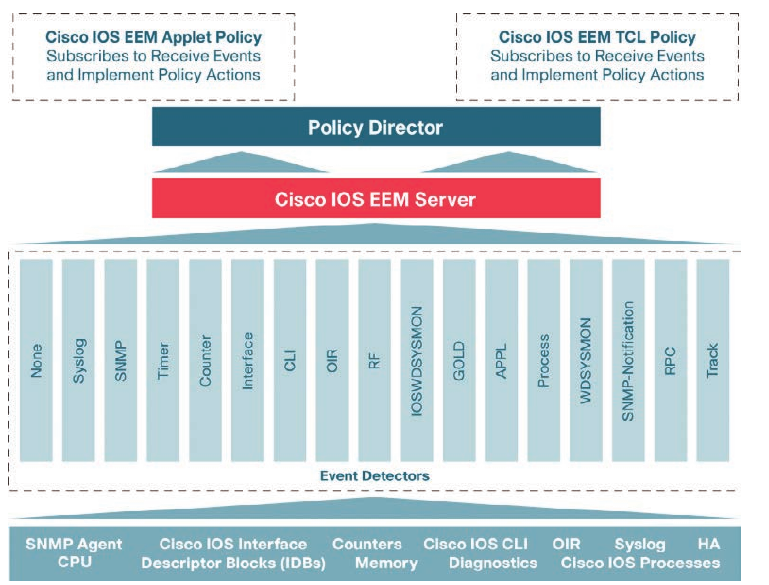

#### EEM Applets

- EEM Applets are composed of multiple building blocks

- Two primary building blocks that make up EEM applets: events and actions

- EEM applets use a similar logic to the if-then statements used in some common programming languages (for instance, if an event happens, then an action is taken)

- The following example shows a very common EEM applet that is monitoring syslog messages on a router

- Below is shown an applet that is looking for a specific syslog message, stating that Loopback0 interface went down

- The specific syslog message is matched using regular expressions 

- This is a very powerful and granular way of matching patterns

- If the specific syslog pattern is matched (an event) at least once, then the following actions will be taken:

    1. The Loopback0 interface will be shut down and brought back up (because of no shutdown and shutdown)

    2. The router will generate a syslog message that says, "I've fallen, and I can't get up"

    3. An email message that includes the output of the `show ip interface loopback 0` command will be sent to the network administrator

```
conf t
 event manager applet LOOP0
  event syslog pattern "Interface Loopback0.* down" period 1
  action 1.0 cli command "enable"
  action 2.0 cli command "configure terminal"
  action 3.0 cli command "interface loopback0"
  action 3.5 syslog msg "Im in interface mode now"
  action 4.0 cli command "shutdown"
  action 5.0 cli command "no shutdown"
  action 5.5 cli command "show interface loopback0"
  action 6.0 syslog msg "I've fallen and I can't get up"
  action 7.0 mail server "10.3.3.3" to "marius@test.com" from "router1@test.com" subject "Loopback0 issues" body "The loopback 0 was bounced. Please monitor accordingly. $_cli_result"
```

- After some modifications:

```
1#show run | s event
event manager applet LOOP0
 event syslog pattern "Interface Loopback0.* down" period 1
 action 1.0 cli command "enable"
 action 2.0 cli command "configure terminal"
 action 3.0 cli command "interface Loopback0"
 action 3.5 syslog msg "Im in interface mode now"
 action 4.0 cli command "shutdown"
 action 4.5 syslog msg "Interface shut down"
 action 5.0 cli command "no shutdown"
 action 5.3 syslog msg "Interface raised up"
 action 5.5 cli command "do show interface loopback 0"
 action 6.0 syslog msg "I've fallen and I can't get up"
 action 6.5 syslog msg "Interface status is: $_cli_result"
 action 7.0 mail server "10.3.3.3" to "marius@test.com" from "router1@test.com" subject "Loopback0 issues" body "The loopback 0 was bounced. Please monitor accordingly. $_cli_result"
```

- Output:

```
R1#conf t
Enter configuration commands, one per line.  End with CNTL/Z.
R1(config)#int l0
R1(config-if)#sh
R1(config-if)#shutdown 
R1(config-if)#
*Dec  6 20:17:25.074: %LINK-5-CHANGED: Interface Loopback0, changed state to administratively down
*Dec  6 20:17:25.370: %HA_EM-6-LOG: LOOP0: Im in interface mode now
*Dec  6 20:17:25.384: %HA_EM-6-LOG: LOOP0: Interface shut down
*Dec  6 20:17:25.406: %HA_EM-6-LOG: LOOP0: Interface raised up
*Dec  6 20:17:25.522: %HA_EM-6-LOG: LOOP0: I've fallen and I can't get up
*Dec  6 20:17:25.523: %HA_EM-6-LOG: LOOP0: Interface status is: 
Loopback0 is up, line protocol is up 
  Hardware is Loopback
  Internet address is 10.1.1.1/32
  MTU 1514 bytes, BW 8000000 Kbit/sec, DLY 5000 usec, 
     reliability 255/255, txload 1/255, rxload 1/255
  Encapsulation LOOPBACK, loopback not set
  Keepalive set (10 sec)
  Last input never, output never, output hang never
  Last clearing of "show interface" counters never
  Input queue: 0/75/0/0 (size/max/drops/flushes); Total output drops: 0
  Queueing strategy: fifo
  Output queue: 0/0 (size/max)
  5 minute input rate 0 bits/sec, 0 packets/sec
  5 minute output rate 0 bits/sec, 0 packets/sec
     0 packets input, 0 bytes, 0 no buffer
     Received 0 broadcasts (0 IP multicasts)
     0 runts, 0 giants, 0 throttles 
     0 input errors, 0 CRC, 0 frame, 0 overrun, 0 ignored, 0 abort
     0 packets output, 0 bytes, 0 underruns
     0 output errors, 0 collisions, 0 interface resets
     0 unknown protocol drops
     0 output buffer failures, 0 output buffers swapped out

R1(config-if)#R1(config-if)#
R1(config-if)#
*Dec  6 20:17:27.396: %LINK-3-UPDOWN: Interface Loopback0, changed state to up
R1(config-if)#
*Dec  6 20:17:37.657: %HA_EM-3-FMPD_SMTP: Error occurred when sending mail to SMTP server: 10.3.3.3 : error in connecting to SMTP server
*Dec  6 20:17:37.658: %HA_EM-3-FMPD_ERROR: Error executing applet LOOP0 statement 7.0
```

- Remember to include the `enable` and `configure terminal` commands at the beginning of actions within an applet

- This is necessary as the applet assumes the user is in exec mode, not privileged exec or config mode

- In addition, if AAA command authorization is being used, it is important to include the `event manager cli session username <username>` command

- Otherwise, the CLI commands in the applet will fail

- It is also a good practice to use decimal labels similar to 1.0, 2.0, and so forth when building applets

- This makes it possible to insert new actions between the other actions in the future

- For example, you could insert an 1.5 action between the 1.0 and 2.0 actions

- Remember that labels are parsed as strings, which means 10.0 would come after 1.0 not 9.0

- Based on the output of the following command you can see the actions taken when the applet is running

```
enable
 debug event manager action cli
```

```
R1#debug event manager action cli 
Debug EEM action cli debugging is on
R1#conf t
Enter configuration commands, one per line.  End with CNTL/Z.
R1(config)#int l0
R1(config-if)#sh
R1(config-if)#shutdown 
R1(config-if)#
*Dec  6 20:35:50.657: %LINK-5-CHANGED: Interface Loopback0, changed state to administratively down
*Dec  6 20:35:50.713: %HA_EM-6-LOG: LOOP0 : DEBUG(cli_lib) : : CTL : cli_open called.
*Dec  6 20:35:50.720: %HA_EM-6-LOG: LOOP0 : DEBUG(cli_lib) : : OUT : **************************************************************************
*Dec  6 20:35:50.721: %HA_EM-6-LOG: LOOP0 : DEBUG(cli_lib) : : OUT : * IOSv is strictly limited to use for evaluation, demonstration and IOS  *
*Dec  6 20:35:50.722: %HA_EM-6-LOG: LOOP0 : DEBUG(cli_lib) : : OUT : * education. IOSv is provided as-is and is not supported by Cisco's      *
*Dec  6 20:35:50.722: %HA_EM-6-LOG: LOOP0 : DEBUG(cli_lib) : : OUT : * Technical Advisory Center. Any use or disclosure, in whole or in part, *
*Dec  6 20:35:50.723: %HA_EM-6-LOG: LOOP0 : DEBUG(cli_lib) : : OUT : * of the IOSv Software or Documentation to any third party for any       *
*Dec  6 20:35:50.724: %HA_EM-6-LOG: LOOP0 : DEBUG(cli_lib) : : OUT : * purposes is expressly prohibited except as otherwise authorized by     *
*Dec  6 20:35:50.724: %HA_EM-6-LOG: LOOP0 : DEBUG(cli_lib) : : OUT : * Cisco in writing.                                                      *
*Dec  6 20:35:50.725: %HA_EM-6-LOG: LOOP0 : DEBUG(cli_lib) : : OUT : **************************************************************************
*Dec  6 20:35:50.726: %HA_EM-6-LOG: LOOP0 : DEBUG(cli_lib) : : OUT : R1>
*Dec  6 20:35:50.727: %HA_EM-6-LOG: LOOP0 : DEBUG(cli_lib) : : IN  : R1>enable
*Dec  6 20:35:50.738: %HA_EM-6-LOG: LOOP0 : DEBUG(cli_lib) : : OUT : R1#
*Dec  6 20:35:50.740: %HA_EM-6-LOG: LOOP0 : DEBUG(cli_lib) : : IN  : R1#configure terminal
*Dec  6 20:35:50.851: %HA_EM-6-LOG: LOOP0 : DEBUG(cli_lib) : : OUT : Enter configuration commands, one per line.  End with CNTL/Z.
*Dec  6 20:35:50.851: %HA_EM-6-LOG: LOOP0 : DEBUG(cli_lib) : : OUT : R1(config)#
*Dec  6 20:35:50.853: %HA_EM-6-LOG: LOOP0 : DEBUG(cli_lib) : : IN  : R1(config)#interface Loopback0
*Dec  
R1(config-if)#6 20:35:50.964: %HA_EM-6-LOG: LOOP0 : DEBUG(cli_lib) : : OUT : R1(config-if)#
*Dec  6 20:35:50.966: %HA_EM-6-LOG: LOOP0: Im in interface mode now
*Dec  6 20:35:50.967: %HA_EM-6-LOG: LOOP0 : DEBUG(cli_lib) : : IN  : R1(config-if)#shutdown
*Dec  6 20:35:50.981: %HA_EM-6-LOG: LOOP0 : DEBUG(cli_lib) : : OUT : R1(config-if)#
*Dec  6 20:35:50.983: %HA_EM-6-LOG: LOOP0: Interface shut down
*Dec  6 20:35:50.984: %HA_EM-6-LOG: LOOP0 : DEBUG(cli_lib) : : IN  : R1(config-if)#no shutdown
*Dec  6 20:35:51.000: %HA_EM-6-LOG: LOOP0 : DEBUG(cli_lib) : : OUT : R1(config-if)#
*Dec  6 20:35:51.002: %HA_EM-6-LOG: LOOP0: Interface raised up
*Dec  6 20:35:51.003: %HA_EM-6-LOG: LOOP0 : DEBUG(cli_lib) : : IN  : 
R1(config-if)#R1(config-if)#do show interface loopback 0
*Dec  6 20:35:51.115: %HA_EM-6-LOG: LOOP0 : DEBUG(cli_lib) : : OUT : Loopback0 is up, line protocol is up 
*Dec  6 20:35:51.116: %HA_EM-6-LOG: LOOP0 : DEBUG(cli_lib) : : OUT :   Hardware is Loopback
*Dec  6 20:35:51.117: %HA_EM-6-LOG: LOOP0 : DEBUG(cli_lib) : : OUT :   Internet address is 10.1.1.1/32
*Dec  6 20:35:51.118: %HA_EM-6-LOG: LOOP0 : DEBUG(cli_lib) : : OUT :   MTU 1514 bytes, BW 8000000 Kbit/sec, DLY 5000 usec, 
*Dec  6 20:35:51.119: %HA_EM-6-LOG: LOOP0 : DEBUG(cli_lib) : : OUT :      reliability 255/255, txload 1/255, rxload 1/255
*Dec  6 20:35:51.119: %HA_EM-6-LOG: LOOP0 : DEBUG(cli_lib) : : OUT :   Encapsulation LOOPBACK, loopback not set
*Dec
R1(config-if)#  6 20:35:51.120: %HA_EM-6-LOG: LOOP0 : DEBUG(cli_lib) : : OUT :   Keepalive set (10 sec)
*Dec  6 20:35:51.121: %HA_EM-6-LOG: LOOP0 : DEBUG(cli_lib) : : OUT :   Last input never, output never, output hang never
*Dec  6 20:35:51.122: %HA_EM-6-LOG: LOOP0 : DEBUG(cli_lib) : : OUT :   Last clearing of "show interface" counters never
*Dec  6 20:35:51.123: %HA_EM-6-LOG: LOOP0 : DEBUG(cli_lib) : : OUT :   Input queue: 0/75/0/0 (size/max/drops/flushes); Total output drops: 0
*Dec  6 20:35:51.124: %HA_EM-6-LOG: LOOP0 : DEBUG(cli_lib) : : OUT :   Queueing strategy: fifo
*Dec  6 20:35:51.124: %HA_EM-6-LOG: LOOP0 : DEBUG(cli_lib) : : OUT :   Output queue: 0/0 (size/max)
*Dec  6 20:35:51.125: %HA
R1(config-if)#_EM-6-LOG: LOOP0 : DEBUG(cli_lib) : : OUT :   5 minute input rate 0 bits/sec, 0 packets/sec
*Dec  6 20:35:51.126: %HA_EM-6-LOG: LOOP0 : DEBUG(cli_lib) : : OUT :   5 minute output rate 0 bits/sec, 0 packets/sec
*Dec  6 20:35:51.127: %HA_EM-6-LOG: LOOP0 : DEBUG(cli_lib) : : OUT :      0 packets input, 0 bytes, 0 no buffer
*Dec  6 20:35:51.128: %HA_EM-6-LOG: LOOP0 : DEBUG(cli_lib) : : OUT :      Received 0 broadcasts (0 IP multicasts)
*Dec  6 20:35:51.129: %HA_EM-6-LOG: LOOP0 : DEBUG(cli_lib) : : OUT :      0 runts, 0 giants, 0 throttles 
*Dec  6 20:35:51.129: %HA_EM-6-LOG: LOOP0 : DEBUG(cli_lib) : : OUT :      0 input errors, 0 CRC, 0 frame, 0 overrun, 0 ignored, 0 abort
*Dec  6 20:35:51.130: %HA_EM-6
R1(config-if)#-LOG: LOOP0 : DEBUG(cli_lib) : : OUT :      0 packets output, 0 bytes, 0 underruns
*Dec  6 20:35:51.131: %HA_EM-6-LOG: LOOP0 : DEBUG(cli_lib) : : OUT :      0 output errors, 0 collisions, 0 interface resets
*Dec  6 20:35:51.132: %HA_EM-6-LOG: LOOP0 : DEBUG(cli_lib) : : CTL : 20+ lines read from cli, debug output truncated
*Dec  6 20:35:51.133: %HA_EM-6-LOG: LOOP0: I've fallen and I can't get up
*Dec  6 20:35:51.134: %HA_EM-6-LOG: LOOP0: Interface status is: 
Loopback0 is up, line protocol is up 
  Hardware is Loopback
  Internet address is 10.1.1.1/32
  MTU 1514 bytes, BW 8000000 Kbit/sec, DLY 5000 usec, 
     reliability 255/255, txload 1/255, rxload 1/255
  Encapsulation LOOP
R1(config-if)#BACK, loopback not set
  Keepalive set (10 sec)
  Last input never, output never, output hang never
  Last clearing of "show interface" counters never
  Input queue: 0/75/0/0 (size/max/drops/flushes); Total output drops: 0
  Queueing strategy: fifo
  Output queue: 0/0 (size/max)
  5 minute input rate 0 bits/sec, 0 packets/sec
  5 minute output rate 0 bits/sec, 0 packets/sec
     0 packets input, 0 bytes, 0 no buffer
     Received 0 broadcasts (0 IP multicasts)
     0 runts, 0 giants, 0 throttles 
     0 input errors, 0 CRC, 0 frame, 0 overrun, 0 ignored, 0 abort
     0 packets output, 0 bytes, 0 underruns
     0 output errors, 0 collisions, 0 interface resets
     0
R1(config-if)# unknown protocol drops
     0 output buffer failures, 0 output buffers swapped out
R1(config-if)#
*Dec  6 20:35:52.990: %LINK-3-UPDOWN: Interface Loopback0, changed state to up
R1(config-if)#
*Dec  6 20:36:03.598: %HA_EM-3-FMPD_SMTP: Error occurred when sending mail to SMTP server: 10.3.3.3 : error in connecting to SMTP server
*Dec  6 20:36:03.600: %HA_EM-3-FMPD_ERROR: Error executing applet LOOP0 statement 7.0
R1(config-if)#
*Dec  6 20:36:03.600: %HA_EM-6-LOG: LOOP0 : DEBUG(cli_lib) : : CTL : cli_close called.
*Dec  6 20:36:03.622: 
*Dec  6 20:36:03.622: tty is now going through its death sequence
```

- For troubleshooting purposes use the following command - to show all the output for the configured actions while the action is being executed

```
enable
 debug event manager all
```

- For instance, it shows the same output as shown above but includes more details on all the other actions

- To specifically troubleshoot the mail configuration and related error messages in an EEM applet, the command `debug event manager action mail` is the most useful as it filters out the other debugging messages that are not necessary when you are trying to troubleshoot the mail configuration

- This allows a user to focus specifically on SMTP errors as shown above

- Another very useful aspect of EEM applets is that the CLI patterns can be matched as events

- This means that when certain commands are entered into the router using the CLI, they can trigger an EEM event within an applet

- Then the configured actions can take place as a result of the CLI pattern being matched

- Below is used another common EEM applet to match the CLI pattern "write mem"

- When the applet is triggered, the following actions are invoked:

    1. The router generates a syslog message that says "Configuration File Changed! TFTP backup successful"

    2. The startup config file is copied to a TFTP server

```
conf t
 event manager environment filename Router.cfg
 event manager environment tftpserver tftp://10.3.3.3/
 event manager applet BACKUP-CONFIG
  event cli pattern "write mem*" sync yes
  action 1.0 cli command "enable"
  action 2.0 cli command "configure terminal"
  action 3.0 cli command "file prompt quiet"
  action 4.0 cli command "end"
  action 5.0 cli command "copy start $tftpserver$servername"
  action 6.0 cli command "configure terminal"
  action 7.0 cli command "no file prompt quiet"
  action 8.0 syslog priority informational msg "Configuration File Changed! TFTP backup successful"
```

- Output:

```
R2#debug event manager action cli 
Debug EEM action cli debugging is on
R2#
R2#
R2#write memory                   

*Dec  6 21:06:25.123: %HA_EM-6-LOG: BACKUP-CONFIG : DEBUG(cli_lib) : : CTL : cli_open called.
*Dec  6 21:06:25.132: %HA_EM-6-LOG: BACKUP-CONFIG : DEBUG(cli_lib) : : OUT : **************************************************************************
*Dec  6 21:06:25.132: %HA_EM-6-LOG: BACKUP-CONFIG : DEBUG(cli_lib) : : OUT : * IOSv is strictly limited to use for evaluation, demonstration and IOS  *
*Dec  6 21:06:25.133: %HA_EM-6-LOG: BACKUP-CONFIG : DEBUG(cli_lib) : : OUT : * education. IOSv is provided as-is and is not supported by Cisco's      *
*Dec  6 21:06:25.134: %HA_EM-6-LOG: BACKUP-CONFIG : DEBUG(cli_lib) : : OUT : * Technical Advisory Center. Any use or disclosure, in whole or in part, *
*Dec  6 21:06:25.134: %HA_EM-6-LOG: BACKUP-CONFIG : DEBUG(cli_lib) : : OUT : * of the IOSv Software or Documentation to any third party for any       *
*Dec  6 21:06:25.135: %HA_EM-6-LOG: BACKUP-CONFIG : DEBUG(cli_lib) : : OUT : * purposes is expressly prohibited except as otherwise authorized by     *
*Dec  6 21:06:25.136: %HA_EM-6-LOG: BACKUP-CONFIG : DEBUG(cli_lib) : : OUT : * Cisco in writing.                                                      *
*Dec  6 21:06:25.136: %HA_EM-6-LOG: BACKUP-CONFIG : DEBUG(cli_lib) : : OUT : **************************************************************************
*Dec  6 21:06:25.137: %HA_EM-6-LOG: BACKUP-CONFIG : DEBUG(cli_lib) : : OUT : R2>
*Dec  6 21:06:25.138: %HA_EM-6-LOG: BACKUP-CONFIG : DEBUG(cli_lib) : : IN  : R2>enable
*Dec  6 21:06:25.149: %HA_EM-6-LOG: BACKUP-CONFIG : DEBUG(cli_lib) : : OUT : R2#
*Dec  6 21:06:25.151: %HA_EM-6-LOG: BACKUP-CONFIG : DEBUG(cli_lib) : : IN  : R2#configure terminal
*Dec  6 21:06:25.262: %HA_EM-6-LOG: BACKUP-CONFIG : DEBUG(cli_lib) : : OUT : Enter configuration commands, one per line.  End with CNTL/Z.
*Dec  6 21:06:25.262: %HA_EM-6-LOG: BACKUP-CONFIG : DEBUG(cli_lib) : : OUT : R2(config)#
*Dec  6 21:06:25.264: %HA_EM-6-LOG: BACKUP-CONFIG : DEBUG(cli_lib) : : IN  : R2(config)#file prompt quiet
*Dec  6 21:06:25.648: %HA_EM-6-LOG: BACKUP-CONFIG : DEBUG(cli_lib) : : OUT : R2(config)#
*Dec  6 21:06:25.650: %HA_EM-6-LOG: BACKUP-CONFIG : DEBUG(cli_lib) : : IN  : R2(config)#end
*Dec  6 21:06:25.659: %SYS-5-CONFIG_I: Configured from console by  on vty0 (EEM:BACKUP-CONFIG)
*Dec  6 21:06:25.662: %HA_EM-6-LOG: BACKUP-CONFIG : DEBUG(cli_lib) : : OUT : R2#
*Dec  6 21:06:25.663: %HA_EM-6-LOG: BACKUP-CONFIG : DEBUG(cli_lib) : : IN  : R2#copy start tftp://10.3.3.3/Router.cfg
*Dec  6 21:06:45.131: %HA_EM-6-LOG: BACKUP-CONFIG : DEBUG(cli_lib) : : CTL : cli_close called.
Building configuration...

*Dec  6 21:06:55.742: 
*Dec  6 21:06:55.742: tty is now going through its death sequence[OK]
R2#
*Dec  6 21:06:59.822: %GRUB-5-CONFIG_WRITING: GRUB configuration is being updated on disk. Please wait...
*Dec  6 21:07:00.764: %GRUB-5-CONFIG_WRITTEN: GRUB configuration was written to disk successfully.
```

- The `file prompt quiet` command disables the IOS confirmation mechanism that asks to confirm a user's actions

- The priority and facility of the syslog messages can be changed to fit any environment's alerting structure

- For example, in the example above, informational is used

- As shown above, there are multiple ways to call out specific EEM environment values

- The first example illustrates that it's possible for a user to use a single line to configure the mail environment and send messages with CLI output results

- Using the EEM environment variables shown in the second example, users can statically set different settings that can be called on from multiple actions instead of calling them out individually on a single line

- Although it is possible to create custom names and values that are arbitrary and can be set to anything, it is good practice to use common and descriptive variables

- Below are listed some of the email variables commonly used in EEM

```
EEM variable                Description                                                                     Example

_email_server               SMTP server IP address or DNS name                                              10.0.0.25 or MAILSRV01

_email_to                   Email address to send mail to                                                   neteng@yourcompany.com

_email_from                 Email address of sending party                                                  no-reply@yourcompany.com

_email_cc                   Email address of additional email receivers                                     helpdesk@yourcompany.com
```

#### EEM and Tcl Scripts

- Using an EEM applet to call Tcl scripts is another very powerful aspect of EEM

- Until now we have seen multiple ways to use EEM applets

- Already seen multiple ways of executing actions, based on the automatic detection of specific events while they are happening

- Now we will see how to call a tcl script from an EEM applet

- Below is shown how to manually execute an EEM applet, that in turn, executes a Tcl script that is locally stored in the device's flash memory

- There are many different ways to use EEM and that manually triggered applets are also very useful tools

- Below is shown an EEM script configured with the `event none` command, which means there is no automatic event that the applet is monitoring, and this applet runs only when it is triggered manually

- To manually run an EEM applet:

```
enable
 event manager run <applet-name>
```

```
conf t
 event manager applet Ping
  event none
  action 1.0 cli command "enable"
  action 2.0 cli command "tclsh flash:/ping.tcl"
```

```
enable
 event manager run Ping
```

```
R3#debug event manager all 
All possible Embedded Event Manager debugging has been turned on
R3#
R3#
R3#event manager run Ping  
R3#
*Dec  6 22:00:11.602: cli_history_entry_add: free_hist_list size=0, hist_list size=7
*Dec  6 22:00:11.603: check_eem_cli_policy_handler: command_string=event manager run Ping
*Dec  6 22:00:11.603: check_eem_cli_policy_handler: num_matches = 0, response_code = 1
*Dec  6 22:00:11.604: fh_fd_none_event_match: parameters = , sync = 1, get_tty = 1, tty_buf = 0
*Dec  6 22:00:11.605: none_conn_tm_alloc: ptp=0x10E19278 
*Dec  6 22:00:11.606: fh_fd_none_event_match: publish_timer=0xE4E77D4, ptp=0x10E19278, max_delay=30000 
*Dec  6 22:00:11.607: none_conn_tm_add: re=0x10E17538, ptp=0x10E19278
*Dec  6 22:00:11.608: fh_fd_none_event_match: re = 0x10E17538, num_matches = 1
*Dec  6 22:00:11.611: fh_server_event_handler XOS_IPC_ASYNC_REQ_MSG: FH_MSG_DETECTOR_POLL
*Dec  6 22:00:11.612: fh_send_server_sig: received a pulse from none on node0/0 with fdid: 16
*Dec  6 22:00:11.613: fh_reg_send_msg_to_fd server sending FH_MSG_SERVER_POLL message to FD:none xos_ipc_sync_send to fdc->eph = 1114128)
*Dec  6 22:00:11.620: fh_reg_send_msg_to_fd server sent FH_MSG_SERVER_POLL message to FD:none event passed to fdc->eph = 1114128 status 0
*Dec  6 22:00:11.621: fh_send_server_sig: received FH_MSG_EVENT_PUBLISH_SYNC
*Dec  6 22:00:11.621: EEM: server processes multi events: esid=1
*Dec  6 22:00:11.622: EEM: server processes multi events: timewin=1, sync_flag=1, ec_index=0, cmp_occ=1
*Dec  6 22:00:11.623: EEM: server processes multi events: get correlate result esid=1
*Dec  6 22:00:11.623: EEM: ctx=1:(1,1,1)
*Dec  6 22:00:11.624: EEM: server processes multi events: corr_res=1, cur_tcnt=1, cmp_tcnt=1
*Dec  6 22:00:11.625: EEM: server processes multi events: schedule an event esid=1, corr_id=2, grpid=1
*Dec  6 22:00:11.626: fh_schedule_callback: fh_schedule_callback: cc=FDD4C28 prev_epc=0; epc=114467F8
*Dec  6 22:00:11.626: EEM server schedules one event: policy_type=applet epc=0x114467F8.
*Dec  6 22:00:11.627: EEM: server processes multi events: clean correlate data in ec: e
R3#sid=1
*Dec  6 22:00:11.636: fh_server_event_handler XOS_IPC_REPLY_MSG
*Dec  6 22:00:11.637: fh_set_epc_pid: EEM callback policy Ping has been scheduled to run. fdid: 16 sn: 1 jobid: 2
*Dec  6 22:00:11.639: fh_io_ipc_msg: received FH_MSG_API_INIT; jobid=14, processid=151, client=4, job name=EEM Callback Thread
*Dec  6 22:00:11.642: fh_server: fh_io_ipc_msg: received msg FH_MSG_EVENT_REQINFO_MULTI from client 4 pclient 2
*Dec  6 22:00:11.646: fh_server: fh_io_ipc_msg: received msg FH_MSG_EVENT_TTYINFO from client 4 pclient 2
*Dec  6 22:00:11.652: Registering tag: <fh_var> id: 1
*Dec  6 22:00:11.653: Pushing tag <fh_publish_event_spec> on to stack
*Dec  6 22:00:11.654: open tag is <fh_publish_event_sp
R3#ec>
*Dec  6 22:00:11.655: Pushing tag <fh_publish_common> on to stack
*Dec  6 22:00:11.655: open tag is <fh_publish_common>
*Dec  6 22:00:11.656: Pushing tag <fh_event_type> on to stack
*Dec  6 22:00:11.657: open tag is <fh_event_type>
*Dec  6 22:00:11.658: Name-Value Pair: Name=(pdir) Value=(_event_type)
*Dec  6 22:00:11.659: Name-Value Pair: Name=(tcl) Value=(event_type)
*Dec  6 22:00:11.660: Pushing tag <fh_var> on to stack
*Dec  6 22:00:11.661: open tag is <fh_var>
*Dec  6 22:00:11.661: Popping tag <fh_var> off stack
*Dec  6 22:00:11.662: close tag is </fh_var>
*Dec  6 22:00:11.663: Popping tag <fh_event_type> off stack
*Dec  6 22:00:11.664: close tag is </fh_event_type>
*Dec  6 22:00:11.6
R3#65: Pushing tag <fh_event_spec_id> on to stack
*Dec  6 22:00:11.666: open tag is <fh_event_spec_id>
*Dec  6 22:00:11.667: Popping tag <fh_event_spec_id> off stack
*Dec  6 22:00:11.667: close tag is </fh_event_spec_id>
*Dec  6 22:00:11.668: Pushing tag <fh_event_name> on to stack
*Dec  6 22:00:11.669: open tag is <fh_event_name>
*Dec  6 22:00:11.670: Name-Value Pair: Name=(pdir) Value=(_event_type_string)
*Dec  6 22:00:11.671: Name-Value Pair: Name=(tcl) Value=(event_type_string)
*Dec  6 22:00:11.672: Pushing tag <fh_var> on to stack
*Dec  6 22:00:11.673: open tag is <fh_var>
*Dec  6 22:00:11.673: Popping tag <fh_var> off stack
*Dec  6 22:00:11.674: close tag is </fh_var>
*Dec  6 22:00:11.675: P
R3#opping tag <fh_event_name> off stack
*Dec  6 22:00:11.676: close tag is </fh_event_name>
*Dec  6 22:00:11.677: Pushing tag <fh_event_severity> on to stack
*Dec  6 22:00:11.677: open tag is <fh_event_severity>
*Dec  6 22:00:11.678: Name-Value Pair: Name=(pdir) Value=(_event_severity)
*Dec  6 22:00:11.679: Name-Value Pair: Name=(tcl) Value=(event_severity)
*Dec  6 22:00:11.680: Pushing tag <fh_var> on to stack
*Dec  6 22:00:11.681: open tag is <fh_var>
*Dec  6 22:00:11.682: Popping tag <fh_var> off stack
*Dec  6 22:00:11.682: close tag is </fh_var>
*Dec  6 22:00:11.683: Popping tag <fh_event_severity> off stack
*Dec  6 22:00:11.684: close tag is </fh_event_severity>
*Dec  6 22:00:11.685: Pushing 
R3#tag <fh_event_sn> on to stack
*Dec  6 22:00:11.686: open tag is <fh_event_sn>
*Dec  6 22:00:11.686: Popping tag <fh_event_sn> off stack
*Dec  6 22:00:11.687: close tag is </fh_event_sn>
*Dec  6 22:00:11.688: Popping tag <fh_publish_common> off stack
*Dec  6 22:00:11.688: close tag is </fh_publish_common>
*Dec  6 22:00:11.689: Pushing tag <fh_fd_publish_none_spec> on to stack
*Dec  6 22:00:11.690: open tag is <fh_fd_publish_none_spec>
*Dec  6 22:00:11.691: Name-Value Pair: Name=(pdir) Value=(_none_argc)
*Dec  6 22:00:11.692: Name-Value Pair: Name=(tcl) Value=(argc)
*Dec  6 22:00:11.693: Pushing tag <fh_var> on to stack
*Dec  6 22:00:11.694: open tag is <fh_var>
*Dec  6 22:00:11.694: Popping tag 
R3#<fh_var> off stack
*Dec  6 22:00:11.695: close tag is </fh_var>
*Dec  6 22:00:11.696: Popping tag <fh_fd_publish_none_spec> off stack
*Dec  6 22:00:11.697: close tag is </fh_fd_publish_none_spec>
*Dec  6 22:00:11.697: Popping tag <fh_publish_event_spec> off stack
*Dec  6 22:00:11.698: close tag is </fh_publish_event_spec>
*Dec  6 22:00:11.699: EEM: policy_dir xml builtin: name:_event_type value:131
*Dec  6 22:00:11.700: EEM: policy_dir xml builtin: name:_event_type_string value:none
*Dec  6 22:00:11.701: EEM: policy_dir xml builtin: name:_event_severity value:severity-normal
*Dec  6 22:00:11.702: EEM: policy_dir xml builtin: name:_none_argc value:0
*Dec  6 22:00:11.712: %HA_EM-6-LOG: Ping : DEBUG
R3#(cli_lib) : : CTL : cli_open called.
*Dec  6 22:00:11.731: %HA_EM-6-LOG: Ping : DEBUG(cli_lib) : : OUT : **************************************************************************
*Dec  6 22:00:11.732: %HA_EM-6-LOG: Ping : DEBUG(cli_lib) : : OUT : * IOSv is strictly limited to use for evaluation, demonstration and IOS  *
*Dec  6 22:00:11.732: %HA_EM-6-LOG: Ping : DEBUG(cli_lib) : : OUT : * education. IOSv is provided as-is and is not supported by Cisco's      *
*Dec  6 22:00:11.733: %HA_EM-6-LOG: Ping : DEBUG(cli_lib) : : OUT : * Technical Advisory Center. Any use or disclosure, in whole or in part, *
*Dec  6 22:00:11.734: %HA_EM-6-LOG: Ping : DEBUG(cli_lib) : : OUT : * of the IOSv Software or Documentation to an
R3#y third party for any       *
*Dec  6 22:00:11.735: %HA_EM-6-LOG: Ping : DEBUG(cli_lib) : : OUT : * purposes is expressly prohibited except as otherwise authorized by     *
*Dec  6 22:00:11.735: %HA_EM-6-LOG: Ping : DEBUG(cli_lib) : : OUT : * Cisco in writing.                                                      *
*Dec  6 22:00:11.736: %HA_EM-6-LOG: Ping : DEBUG(cli_lib) : : OUT : **************************************************************************
*Dec  6 22:00:11.737: %HA_EM-6-LOG: Ping : DEBUG(cli_lib) : : OUT : R3>
*Dec  6 22:00:11.738: %HA_EM-6-LOG: Ping : DEBUG(cli_lib) : : IN  : R3>enable
*Dec  6 22:00:11.744: cli_history_entry_add: free_hist_list size=0, hist_list size=7
*Dec  6 22
R3#:00:11.744: eem_no_scan flag set, skipping scan of command_string=enable
*Dec  6 22:00:11.749: %HA_EM-6-LOG: Ping : DEBUG(cli_lib) : : OUT : R3#
*Dec  6 22:00:11.751: %HA_EM-6-LOG: Ping : DEBUG(cli_lib) : : IN  : R3#tclsh flash:/ping.tcl
*Dec  6 22:00:11.771: cli_history_entry_add: free_hist_list size=0, hist_list size=7
*Dec  6 22:00:11.771: eem_no_scan flag set, skipping scan of command_string=tclsh flash:/ping.tcl
*Dec  6 22:00:12.025: %HA_EM-6-LOG: Ping : DEBUG(cli_lib) : : OUT : couldn't read file "flash:/ping.tcl": File not found
*Dec  6 22:00:12.026: %HA_EM-6-LOG: Ping : DEBUG(cli_lib) : : OUT : 
*Dec  6 22:00:12.027: %HA_EM-6-LOG: Ping : DEBUG(cli_lib) : : OUT : R3#
*Dec  6 22:00:12.029: %HA_EM-6-LOG: Pi
R3#ng : DEBUG(cli_lib) : : CTL : cli_close called.
*Dec  6 22:00:12.036: fh_server: fh_io_ipc_msg: received msg FH_MSG_CALLBACK_DONE from client 4 pclient 2
*Dec  6 22:00:12.037: fh_io_ipc_msg: EEM callback policy Ping has ended with normal exit status of 0x0
*Dec  6 22:00:12.038: fh_reg_send_msg_to_fd server sending FH_MSG_EVENT_PUBLISH_DONE message to FD:none xos_ipc_sync_send to fdc->eph = 1114128)
*Dec  6 22:00:12.039: fh_fd_none_publish_done: rc=0, re=0x10E17538
*Dec  6 22:00:12.040: fh_fd_none_publish_done: rc=0, publish_expired=0
*Dec  6 22:00:12.041:   sid=1, ptp=0x10E19278, connp=0x10DB22D8
*Dec  6 22:00:12.042: none_conn_tm_remove: re=0x10E17538, ptp=0x10E19278
*Dec  6 22:00:12.042: fh_fd_no
R3#ne_conn_tm_free: ptp=0x10E19278
*Dec  6 22:00:12.044: fh_reg_send_msg_to_fd server sent FH_MSG_EVENT_PUBLISH_DONE message to FD:none event passed to fdc->eph = 1114128 status 0
*Dec  6 22:00:12.045: EEM: server decrements in use thread: jobid=2 rule id=3 in use thread=0.
*Dec  6 22:00:12.046: fh_schedule_callback: fh_schedule_callback: cc=FDD4C28 prev_epc=114467F8; epc=0
*Dec  6 22:00:12.046: fh_schedule_policy: prev_epc=0x0; epc=0x0
*Dec  6 22:00:12.047: EEM server schedules scripts
*Dec  6 22:00:12.056: fh_server: fh_io_ipc_msg: received msg FH_MSG_API_CLOSE from client 4 pclient 2
*Dec  6 22:00:12.056: fh_io_ipc_msg: received FH_MSG_API_CLOSE client=4
*Dec  6 22:00:12.065: 
*Dec  6 22:00:12.065
R3#: tty is now going through its death sequence
*Dec  6 22:00:12.067: fh_fd_match_event: re=0x10E17538, policyname=Ping, parameters=,
R3#
*Dec  6 22:00:48.379: ND Update CDP Notification Event for R2 on Gi0/0
*Dec  6 22:00:48.381: fh_fd_nd_event_match: num_matches = 0
```

- Below is the content snippet for the exact content of the ping.tcl script used in the manually triggered EEM applet from above

- Create the tcl file on the flash of the router:

```
R3#tclsh 
R3(tcl)#puts [open "flash:ping.tcl" w+] {
+>(tcl)#foreach address {                
+>(tcl)#10.1.1.1                         
+>(tcl)#10.2.2.2                         
+>(tcl)#10.3.3.3                         
+>(tcl)#} { ping $address }              
+>(tcl)#}
R3(tcl)#tclquit 
R3#
```

- Get the content of the file:

```
R3#more flash:ping.tcl
foreach address {
10.1.1.1
10.2.2.2
10.3.3.3
} { ping $address }
```

- Run the tcl file manually:

```
R3#tclsh flash:ping.tcl
Type escape sequence to abort.
Sending 5, 100-byte ICMP Echos to 10.1.1.1, timeout is 2 seconds:
!!!!!
Success rate is 100 percent (5/5), round-trip min/avg/max = 4/7/15 ms
Type escape sequence to abort.
Sending 5, 100-byte ICMP Echos to 10.2.2.2, timeout is 2 seconds:
!!!!!
Success rate is 100 percent (5/5), round-trip min/avg/max = 3/4/7 ms
Type escape sequence to abort.
Sending 5, 100-byte ICMP Echos to 10.3.3.3, timeout is 2 seconds:
!!!!!
Success rate is 100 percent (5/5), round-trip min/avg/max = 2/2/5 ms
```

- Run the script from event manager:

```
R3#debug event manager all 
All possible Embedded Event Manager debugging has been turned on
R3#event manager run Ping  

*Dec  7 10:48:07.732: cli_history_entry_add: free_hist_list size=0, hist_list size=7
*Dec  7 10:48:07.733: check_eem_cli_policy_handler: command_string=event manager run Ping
*Dec  7 10:48:07.734: check_eem_cli_policy_handler: num_matches = 0, response_code = 1
*Dec  7 10:48:07.735: fh_fd_none_event_match: parameters = , sync = 1, get_tty = 1, tty_buf = 0
*Dec  7 10:48:07.736: none_conn_tm_alloc: ptp=0x10DA9DA8 
*Dec  7 10:48:07.737: fh_fd_none_event_match: publish_timer=0xE4E78D0, ptp=0x10DA9DA8, max_delay=30000 
*Dec  7 10:48:07.737: none_conn_tm_add: re=0x10D551F8, ptp=0x10DA9DA8
*Dec  7 10:48:07.739: fh_fd_none_event_match: re = 0x10D551F8, num_matches = 1
*Dec  7 10:48:07.741: fh_server_event_handler XOS_IPC_ASYNC_REQ_MSG: FH_MSG_DETECTOR_POLL
*Dec  7 10:48:07.742: fh_send_server_sig: received a pulse from none on node0/0 with fdid: 16
*Dec  7 10:48:07.742: fh_reg_send_msg_to_fd server sending FH_MSG_SERVER_POLL message to FD:none xos_ipc_sync_send to fdc->eph = 1114128)
*Dec  7 10:48:07.747: fh_reg_send_msg_to_fd server sent FH_MSG_SERVER_POLL message to FD:none event passed to fdc->eph = 1114128 status 0
*Dec  7 10:48:07.747: fh_send_server_sig: received FH_MSG_EVENT_PUBLISH_SYNC
*Dec  7 10:48:07.748: EEM: server processes multi events: esid=1
*Dec  7 10:48:07.749: EEM: server processes multi events: timewin=1, sync_flag=1, ec_index=0, cmp_occ=1
*Dec  7 10:48:07.750: EEM: server processes multi events: get correlate result esid=1
*Dec  7 10:48:07.750: EEM: ctx=1:(1,1,1)
*Dec  7 10:48:07.751: EEM: server processes multi events: corr_res=1, cur_tcnt=1, cmp_tcnt=1
*Dec  7 10:48:07.752: EEM: server processes multi events: schedule an event esid=1, corr_id=3, grpid=1
*Dec  7 10:48:07.753: fh_schedule_callback: fh_schedule_callback: cc=EEB8B20 prev_epc=0; epc=10731A58
*Dec  7 10:48:07.753: EEM server schedules one event: policy_type=applet epc=0x10731A58.
*Dec  7 10:48:07.754: EEM: server processes multi events: clean correlate data in ec: es
R3#id=1
*Dec  7 10:48:07.762: fh_server_event_handler XOS_IPC_REPLY_MSG
*Dec  7 10:48:07.763: fh_set_epc_pid: EEM callback policy Ping has been scheduled to run. fdid: 16 sn: 2 jobid: 3
*Dec  7 10:48:07.765: fh_io_ipc_msg: received FH_MSG_API_INIT; jobid=15, processid=48, client=5, job name=EEM Callback Thread
*Dec  7 10:48:07.770: fh_server: fh_io_ipc_msg: received msg FH_MSG_EVENT_REQINFO_MULTI from client 5 pclient 2
*Dec  7 10:48:07.775: fh_server: fh_io_ipc_msg: received msg FH_MSG_EVENT_TTYINFO from client 5 pclient 2
*Dec  7 10:48:07.782: Registering tag: <fh_var> id: 1
*Dec  7 10:48:07.783: Pushing tag <fh_publish_event_spec> on to stack
*Dec  7 
R3#10:48:07.784: open tag is <fh_publish_event_spec>
*Dec  7 10:48:07.785: Pushing tag <fh_publish_common> on to stack
*Dec  7 10:48:07.786: open tag is <fh_publish_common>
*Dec  7 10:48:07.787: Pushing tag <fh_event_type> on to stack
*Dec  7 10:48:07.788: open tag is <fh_event_type>
*Dec  7 10:48:07.789: Name-Value Pair: Name=(pdir) Value=(_event_type)
*Dec  7 10:48:07.790: Name-Value Pair: Name=(tcl) Value=(event_type)
*Dec  7 10:48:07.791: Pushing tag <fh_var> on to stack
*Dec  7 10:48:07.792: open tag is <fh_var>
*Dec  7 10:48:07.793: Popping tag <fh_var> off stack
*Dec  7 10:48:07.793: close tag is </fh_var>
*Dec  7 10:48:07.794: Popping tag <fh_event_type> off stack
*Dec  7 10:48:07.795: close tag is </fh_e
R3#vent_type>
*Dec  7 10:48:07.796: Pushing tag <fh_event_spec_id> on to stack
*Dec  7 10:48:07.797: open tag is <fh_event_spec_id>
*Dec  7 10:48:07.798: Popping tag <fh_event_spec_id> off stack
*Dec  7 10:48:07.798: close tag is </fh_event_spec_id>
*Dec  7 10:48:07.799: Pushing tag <fh_event_name> on to stack
*Dec  7 10:48:07.800: open tag is <fh_event_name>
*Dec  7 10:48:07.801: Name-Value Pair: Name=(pdir) Value=(_event_type_string)
*Dec  7 10:48:07.802: Name-Value Pair: Name=(tcl) Value=(event_type_string)
*Dec  7 10:48:07.803: Pushing tag <fh_var> on to stack
*Dec  7 10:48:07.804: open tag is <fh_var>
*Dec  7 10:48:07.805: Popping tag <fh_var> off stack
*Dec  7 10:48:07.805: close tag is </fh
R3#_var>
*Dec  7 10:48:07.806: Popping tag <fh_event_name> off stack
*Dec  7 10:48:07.807: close tag is </fh_event_name>
*Dec  7 10:48:07.808: Pushing tag <fh_event_severity> on to stack
*Dec  7 10:48:07.809: open tag is <fh_event_severity>
*Dec  7 10:48:07.810: Name-Value Pair: Name=(pdir) Value=(_event_severity)
*Dec  7 10:48:07.811: Name-Value Pair: Name=(tcl) Value=(event_severity)
*Dec  7 10:48:07.812: Pushing tag <fh_var> on to stack
*Dec  7 10:48:07.812: open tag is <fh_var>
*Dec  7 10:48:07.813: Popping tag <fh_var> off stack
*Dec  7 10:48:07.814: close tag is </fh_var>
*Dec  7 10:48:07.815: Popping tag <fh_event_severity> off stack
*Dec  7 10:48:07.815: close tag is </fh_event_severity>

R3#*Dec  7 10:48:07.816: Pushing tag <fh_event_sn> on to stack
*Dec  7 10:48:07.817: open tag is <fh_event_sn>
*Dec  7 10:48:07.818: Popping tag <fh_event_sn> off stack
*Dec  7 10:48:07.819: close tag is </fh_event_sn>
*Dec  7 10:48:07.819: Popping tag <fh_publish_common> off stack
*Dec  7 10:48:07.820: close tag is </fh_publish_common>
*Dec  7 10:48:07.821: Pushing tag <fh_fd_publish_none_spec> on to stack
*Dec  7 10:48:07.822: open tag is <fh_fd_publish_none_spec>
*Dec  7 10:48:07.823: Name-Value Pair: Name=(pdir) Value=(_none_argc)
*Dec  7 10:48:07.824: Name-Value Pair: Name=(tcl) Value=(argc)
*Dec  7 10:48:07.825: Pushing tag <fh_var> on to stack
*Dec  7 10:48:07.825: open tag is <fh_var>
*Dec
R3#  7 10:48:07.826: Popping tag <fh_var> off stack
*Dec  7 10:48:07.827: close tag is </fh_var>
*Dec  7 10:48:07.828: Popping tag <fh_fd_publish_none_spec> off stack
*Dec  7 10:48:07.829: close tag is </fh_fd_publish_none_spec>
*Dec  7 10:48:07.829: Popping tag <fh_publish_event_spec> off stack
*Dec  7 10:48:07.830: close tag is </fh_publish_event_spec>
*Dec  7 10:48:07.831: EEM: policy_dir xml builtin: name:_event_type value:131
*Dec  7 10:48:07.832: EEM: policy_dir xml builtin: name:_event_type_string value:none
*Dec  7 10:48:07.833: EEM: policy_dir xml builtin: name:_event_severity value:severity-normal
*Dec  7 10:48:07.835: EEM: policy_dir xml builtin: name:_none_argc value:0
*Dec  7 10:48:07.8
R3#45: %HA_EM-6-LOG: Ping : DEBUG(cli_lib) : : CTL : cli_open called.
*Dec  7 10:48:07.857: %HA_EM-6-LOG: Ping : DEBUG(cli_lib) : : OUT : **************************************************************************
*Dec  7 10:48:07.858: %HA_EM-6-LOG: Ping : DEBUG(cli_lib) : : OUT : * IOSv is strictly limited to use for evaluation, demonstration and IOS  *
*Dec  7 10:48:07.859: %HA_EM-6-LOG: Ping : DEBUG(cli_lib) : : OUT : * education. IOSv is provided as-is and is not supported by Cisco's      *
*Dec  7 10:48:07.859: %HA_EM-6-LOG: Ping : DEBUG(cli_lib) : : OUT : * Technical Advisory Center. Any use or disclosure, in whole or in part, *
*Dec  7 10:48:07.860: %HA_EM-6-LOG: Ping : DEBUG(cli_lib) : : OUT : * of the IOSv S
R3#oftware or Documentation to any third party for any       *
*Dec  7 10:48:07.861: %HA_EM-6-LOG: Ping : DEBUG(cli_lib) : : OUT : * purposes is expressly prohibited except as otherwise authorized by     *
*Dec  7 10:48:07.861: %HA_EM-6-LOG: Ping : DEBUG(cli_lib) : : OUT : * Cisco in writing.                                                      *
*Dec  7 10:48:07.862: %HA_EM-6-LOG: Ping : DEBUG(cli_lib) : : OUT : **************************************************************************
*Dec  7 10:48:07.863: %HA_EM-6-LOG: Ping : DEBUG(cli_lib) : : OUT : R3>
*Dec  7 10:48:07.864: %HA_EM-6-LOG: Ping : DEBUG(cli_lib) : : IN  : R3>enable
*Dec  7 10:48:07.869: cli_history_entry_add: free_hist_list size=0
R3#, hist_list size=7
*Dec  7 10:48:07.870: eem_no_scan flag set, skipping scan of command_string=enable
*Dec  7 10:48:07.876: %HA_EM-6-LOG: Ping : DEBUG(cli_lib) : : OUT : R3#
*Dec  7 10:48:07.877: %HA_EM-6-LOG: Ping : DEBUG(cli_lib) : : IN  : R3#tclsh flash:/ping.tcl
*Dec  7 10:48:07.891: cli_history_entry_add: free_hist_list size=0, hist_list size=7
*Dec  7 10:48:07.892: eem_no_scan flag set, skipping scan of command_string=tclsh flash:/ping.tcl
*Dec  7 10:48:08.001: cli_history_entry_add: free_hist_list size=0, hist_list size=7
*Dec  7 10:48:08.001: eem_no_scan flag set, skipping scan of command_string=ping 10.1.1.1
*Dec  7 10:48:08.415: cli_history_entry_add: free_hist_list size=0, hist_list size=7
*Dec  7 10:4
R3#8:08.416: eem_no_scan flag set, skipping scan of command_string=ping 10.2.2.2
*Dec  7 10:48:08.452: cli_history_entry_add: free_hist_list size=0, hist_list size=7
*Dec  7 10:48:08.453: eem_no_scan flag set, skipping scan of command_string=ping 10.3.3.3
*Dec  7 10:48:08.528: %HA_EM-6-LOG: Ping : DEBUG(cli_lib) : : OUT : Type escape sequence to abort.
*Dec  7 10:48:08.529: %HA_EM-6-LOG: Ping : DEBUG(cli_lib) : : OUT : Sending 5, 100-byte ICMP Echos to 10.1.1.1, timeout is 2 seconds:
*Dec  7 10:48:08.530: %HA_EM-6-LOG: Ping : DEBUG(cli_lib) : : OUT : !!!!!
*Dec  7 10:48:08.530: %HA_EM-6-LOG: Ping : DEBUG(cli_lib) : : OUT : Success rate is 100 percent (5/5), round-trip min/avg/max = 5/79/373 ms
*Dec  7 10:48:08.531
R3#: %HA_EM-6-LOG: Ping : DEBUG(cli_lib) : : OUT : Type escape sequence to abort.
*Dec  7 10:48:08.532: %HA_EM-6-LOG: Ping : DEBUG(cli_lib) : : OUT : Sending 5, 100-byte ICMP Echos to 10.2.2.2, timeout is 2 seconds:
*Dec  7 10:48:08.533: %HA_EM-6-LOG: Ping : DEBUG(cli_lib) : : OUT : !!!!!
*Dec  7 10:48:08.534: %HA_EM-6-LOG: Ping : DEBUG(cli_lib) : : OUT : Success rate is 100 percent (5/5), round-trip min/avg/max = 3/4/6 ms
*Dec  7 10:48:08.535: %HA_EM-6-LOG: Ping : DEBUG(cli_lib) : : OUT : Type escape sequence to abort.
*Dec  7 10:48:08.535: %HA_EM-6-LOG: Ping : DEBUG(cli_lib) : : OUT : Sending 5, 100-byte ICMP Echos to 10.3.3.3, timeout is 2 seconds:
*Dec  7 10:48:08.536: %HA_EM-6-LOG: Ping : DEB
R3#UG(cli_lib) : : OUT : !!!!!
*Dec  7 10:48:08.537: %HA_EM-6-LOG: Ping : DEBUG(cli_lib) : : OUT : Success rate is 100 percent (5/5), round-trip min/avg/max = 1/1/2 ms
*Dec  7 10:48:08.538: %HA_EM-6-LOG: Ping : DEBUG(cli_lib) : : OUT : R3#
*Dec  7 10:48:08.539: %HA_EM-6-LOG: Ping : DEBUG(cli_lib) : : CTL : cli_close called.
*Dec  7 10:48:08.552: fh_server: fh_io_ipc_msg: received msg FH_MSG_CALLBACK_DONE from client 5 pclient 2
*Dec  7 10:48:08.552: fh_io_ipc_msg: EEM callback policy Ping has ended with normal exit status of 0x0
*Dec  7 10:48:08.553: fh_reg_send_msg_to_fd server sending FH_MSG_EVENT_PUBLISH_DONE message to FD:none xos_ipc_sync_send to fdc->eph = 1114128)
*Dec  7 10:48:08.555: fh_fd_n
R3#one_publish_done: rc=0, re=0x10D551F8
*Dec  7 10:48:08.555: fh_fd_none_publish_done: rc=0, publish_expired=0
*Dec  7 10:48:08.556:   sid=1, ptp=0x10DA9DA8, connp=0x10DBD390
*Dec  7 10:48:08.557: none_conn_tm_remove: re=0x10D551F8, ptp=0x10DA9DA8
*Dec  7 10:48:08.558: fh_fd_none_conn_tm_free: ptp=0x10DA9DA8
*Dec  7 10:48:08.560: fh_reg_send_msg_to_fd server sent FH_MSG_EVENT_PUBLISH_DONE message to FD:none event passed to fdc->eph = 1114128 status 0
*Dec  7 10:48:08.561: EEM: server decrements in use thread: jobid=3 rule id=3 in use thread=0.
*Dec  7 10:48:08.562: fh_schedule_callback: fh_schedule_callback: cc=EEB8B20 prev_epc=10731A58; epc=0
*Dec  7 10:48:08.562: fh_schedule_policy: prev_epc=0x0; e
R3#pc=0x0
*Dec  7 10:48:08.563: EEM server schedules scripts
*Dec  7 10:48:08.567: fh_server: fh_io_ipc_msg: received msg FH_MSG_API_CLOSE from client 5 pclient 2
*Dec  7 10:48:08.568: fh_io_ipc_msg: received FH_MSG_API_CLOSE client=5
*Dec  7 10:48:08.582: 
*Dec  7 10:48:08.582: tty is now going through its death sequence
*Dec  7 10:48:08.585: fh_fd_match_event: re=0x10D551F8, policyname=Ping, parameters=,
R3#
*Dec  7 10:48:36.230: ND Update CDP Notification Event for R2 on Gi0/0
*Dec  7 10:48:36.232: fh_fd_nd_event_match: num_matches = 0
R3#
*Dec  7 10:48:59.999: fh_fd_timer_process_async
R3#
*Dec  7 10:49:31.196: ND Update CDP Notification Event for R2 on Gi0/0
*Dec  7 10:49:31.198: fh_fd_nd_event_match: num_matches = 0
R3#
*Dec  7 10:49:59.999: fh_fd_timer_process_async
R3#
*Dec  7 10:50:25.244: ND Update CDP Notification Event for R2 on Gi0/0
*Dec  7 10:50:25.247: fh_fd_nd_event_match: num_matches = 0
```

- The `more` command can be used to view all other text-based files stored in the local flash memory as well

#### EEM summary

- There are many ways to use EEM

- From applets to scripting, the possible use cases can only be limited by an engineer's imagination

- EEM provides on-box monitoring for various different components based on a series of events

- Once an event is detected, an action can take place

- This helps make network monitoring more proactive rather than reactive and can also reduce the load on the network and improve efficiency from the monitoring system because the devices can simply report when there is something wrong instead of continuously asking the devices if there is anything wrong

- Many steps must be taken when onboarding new devices into a network environment

- Often, these steps are very time consuming and repetitive

- Much of the value in using automation and configuration management tools is in moving more quickly than is possible with manual configuration

- In addition, automation help ensure that the level of risk due to human error is significantly reduced through the use of proven and tested automation methods

- A network operations team configuring 1000 devices manually by logging into each device individually is likely to introduce misconfigurations - and the process will be very time-consuming

- The following are some of the most common and repetitive configurations for which network operators leverage automation tools to increase speed and consistency:

    - Device name/IP address

    - Quality of service

    - Access list entries

    - Usernames/passwords

    - SNMP settings

    - Compliance

### Agent-Based Automation Tools

- A number of agent-based tools as well as some of the key concepts to help network operators decide which tool best suits their environment and business use cases

### Puppet

- Puppet is a robust configuration management and automation tool

- Cisco supports the use of Puppet on a variety of devices, such as Catalyst switches, Nexus switches, and the Cisco Unified Computing System (UCS) server platform

- Puppet works with many different vendors and is one of the most commonly used tools for automation

- Puppet can be used during the entire lifecycle of a device, including initial deployment, configuration management, and repurposing and removing devices in a network

- Puppet uses the concept of a puppet server to communicate with devices that have puppet agent (client) installed locally on the device

- Changes and automation tasks are executed within the puppet console and then shared between the puppet server and puppet agents

- These changes or automation tasks are stored in the puppet database (PuppetDB), which can be located on the same puppet server or on a separate box

- This allows the tasks to be saved so they can be pushed out to the puppet agents at a later time

- Below is illustrated the basic communications path between the puppet server and the puppet agents as well as the high-level architecture

- The solid lines shows the primary communications path, and the dotted lines indicate high availability (which is optional)

- With high availability, in the event that the server is unreachable, communications can go over the backup path to the server replica which is a backup server

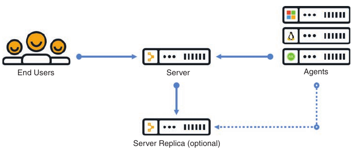

- Puppet alows for the management and communication of multiple device types of the same type

- From a basic operation perspective, puppet agent communicates with the puppet server by using different TCP connections

- Each TCP port uniquely represents a communications path from an agent running on a device or node

- Puppet also has the capability of periodically verify the configurations on devices

- This can be set to any frequency that the network operations team deems necessary

- Then, if a configuration is changed, it can be alerted on as well as automatically put back the previous configuration

- This helps an organization standardize it's device configurations while simultaneously enforcing a specific set of parameters that may be critical to the devices

- There are three installation types with Puppet. Below we can see the scale differences between different instalation options:

```
Installation Type                                   Scale

Monolithic                                          Up to 4000 nodes

Monolithic with compile servers                     4000 to 20000 nodes

Monolithic with compile servers and                 More than 20000 nodes
standalone PE-PostgreSQL
```

- The typical and recommended type of installation is a monolithic installation, which supports up to 4000 nodes

- However, with regard to deployment use cases, it is helpful to understand that Puppet can scale to very large environments

- In these cases, some best practices such as high availability and centralized management may be considered important

- Althgough the architecture is very similar, within large scale deployments, operations staff may need a server of servers (SoS) to manage the distributed puppet servers and also their associated databases; having an SoS greatly simplifies the management of the environments

- In addition, large deployments need compile servers, which are simply load-balanced Puppet servers that help scale the number of agents that can be managed

- Below is shown a large scale enterprise deployment model of Puppet and it's associated components

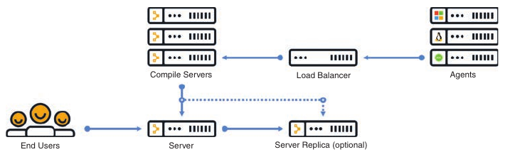

- The structure of Puppet

- Puppet **modules** allow for configuration of practically anything that can be configured manually

- Modules contain the following components:

    - Manifests

    - Templates

    - Files

- **Manifests** are the code that configures the clients or nodes running the puppet agent

- These manifests are pushed to the devices using SSL and require certificates to be installed to ensure the security of the communications between the Puppet server and the Puppet agents

- Puppet has many modules available for many different vendors and device types

- The focus will be on a module called cisco_ios, which contains multiple manifests and leverages SSH to connect to the devices

- Each of these manifests is used to modify the running configuration on Cisco Catalyst devices in some fashion

- Manifests can be saved as individual files and have a file extension .pp

- Below is shown an example of a manyfest file, called NTP_Server.pp, that configures a Network Time Protocol (NTP) server on a Cisco Catalyst device

```
ntp_server ( '1.2.3.4':
    ensure => 'present',
    key => 94,
    prefer => true,
    minpoll => 4,
    maxpoll => 14,
    source_interface => 'Vlan 42',
)
```

- This example shows that the NTP server IP address is configured as 1.2.3.4, and it uses VLAN 42 as the source interface

- The line ensure => 'present' means that the NTP server configuration should be present in the running configuration of the Catalyst IOS device on which the manifest is running

- Remember that Puppet can periodically run to ensure that there is a specific configuration present

- The NTP_Server.pp manifest can run periodically to check for an NTP server configuration

- Puppet leverages a domain-specific language (DSL) as it's programming language

- It is largely based on the Ruby language, which makes it quite simple for network operators to build custom manifests to accomplish their specific configuration tasks without having to be software developers

- Below is shown an manifest file called MOTD.pp that is used to configure a message-of-the-day (MOTD) banner on Catalyst IOS devices

```
banner { 'default',
    motd => 'Unauthorized access not permitted',
}
```

- All the modules and manifests can be found on the Puppet Forge website: https://forge.puppet.com

- Puppet Forge is a community where puppet modules, manifests and code can be shared

- There is no cost to Puppet Forge, and it is a great place to get started with Puppet

- Many of the same modules, manifests and code can also be found on github by searching for Puppet

### Chef

- Chef is an open source configuration management tool that is designed to automate configurations and operations of a network and server environment

- Chef is written in Ruby and Erlang, but when it comes to actually writting code within Chef, Ruby is the language used

- Configuration management tools function in two different types of models: push and pull

- Push models push configuration from a centralized tool or management server, while pull models check in with the server to see if there is any change in the configuration, and if there is, the remote device pull the updated configuration files down to the end device

- Chef is similar to Puppet in several ways:

    - Both have free open source versions available

    - Both have paid enterprise versions available

    - Both manage code that needs to be updated and stored

    - Both manage devices or nodes to be configured

    - Both leverage a pull model

    - Both function as a client/server model

- However, Chef's structure, terminology, and core components are different from those of Puppet

- Below we can see the high level architecture of Chef and the basic communications path between the various areas within thwe Chef environment

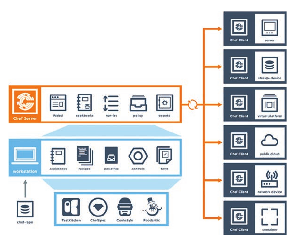

- You can see from the above that Chef leverages a similar client/server functionality to Puppet

- Although the core concepts of Puppet and Chef are similar, the terminology differs

- Whereas Puppet has Modules and Manifests, Chef has cookbooks and recipes

- Below are compared the components of Chef and Puppet and a brief description for them is provided

```
Chef Components                             Puppet Components                                       Description

Chef server                                 Puppet server                                           Server functions

Chef client                                 Puppet agent                                            Client/agent functions

Cookbook                                    Module                                                  Collection of code or files

Recipe                                      Manifest                                                Code being deployed to make configuration changes

Workstation                                 Puppet console                                          Where user interact with configuration management tool and
                                                                                                    create code
```

- Code is created in the Chef workstation

- This code is stored in a file called a recipe

- As mentioned, recipes in Chef are analogous to manifests in Puppet

- Once a receipe is created on the workstation, it must be uploaded to the Chef server in order to be used in the environment, `knife` is the name of the command-line tool used to upload cookbooks to the Chef server

- The command to execute an upload is `knife upload <cookbook-name>` 

- The Chef server can be hosted locally on the workstation, hosted remotely on a server, or hosted in the cloud

- In addition, all the components can be within the same enterprise network

- There are four types of Chef server deployments:

    - **Chef solo**: The Chef server is hosted locally on the workstation

    - **Chef client and server**: This is a typical Chef deployment with distributed components

    - **Hosted Chef**: The Chef server is hosted in the cloud

    - **Private Chef**: All chef components are within the same enterprise network

- Like the Puppet server, the Chef server sits in between the workstation and the nodes

- All cookbooks are stored on the Chef server, and in addition to the cookbooks, the server holds all the tools necessary to transfer the node configurations to the Chef clients

- OHAI, a service that is installed on the nodes, is used to collect the current state of the node to send the information back to the Chef server through the Chef client service

- The Chef server then checks to see if there is any new configuration that needs to be on the node by comparing the information from the OHAI service to the cookbook or recipe

- The Chef client service that runs on the nodes is responsible for all communications to the Chef server

- When a node needs a recipe, the chef client service handles the communication back to the Chef server to signify the node's need for the uploaded configuration or recipe

- Because the nodes can be unique or identical, the recipes can be the same or different for each node

- Below is a recipe file constructed in ruby

- Recipe files have the filename extension .rb

- You can see that the file is easy to read and interpret

```rb

# Cookbook Name:: cisco-cookbook
# Recipe:: demo-install

# (...)

Chef::Log.info('Demo cisco_command_config provider')

cisco_command_config 'loop 42' do
  action: update
  command '
    interface loopback42
     description Peering for AS 42
     ip address 192.168.1.42/24
  '
end

cisco_command_config 'system-switchport-default' do
  command 'no system default switchport'
end

cisco_command_config 'feature bgp' do
  command ' feature bgp'
end

cisco_command_config 'router_bgp_42' do
  action :update
   command '
    router bgp 42
     router-id 192.168.1.42
     address-family ipv4 unicast
      network 1.0.0.0/8
      redistribute static route-map bgp-static

      neighbor 10.1.1.1
      remote as 99
   '
end

cisco_command_config 'route42' do
  action :update
  command ' ip route 10.42.42.42/32 Null0 '
end

# The following test no commands that do not
# exist when enabled
# We need to first configure the port-channel interface
# so that it exists before applying the no commands

cisco_command_config 'port-channel-55-setup' do
  action :update
  command '
    feature bfd
    interface port-channel55
  '
end

cisco_command_config 'port-channel-55' do
  action :update
  command '
    interface port-channel55
     no switchport
     no bfd echo
     no ip redirects
  '
End
```

- With Chef, the kitchen is a place where all recipes and cookbooks can automatically be executed and tested prior to hitting any production nodes

- This is analogous to large companies in the food industries that use test kitchen to make food recipes that will not interfere with other recipes in their production environment

- The kitchen allows not only for testing within the enterprise environment but across many cloud providers and virtualization technologies

- The kitchen also supports many of the common testing frameworks that are used by the Ruby community:

    - Bash Automated Testing System (BATS)

    - Minitest

    - Rspec

    - Serverspec

- Puppet and Chef are often seen as interchangeable because they are very similar

- However, which one you use ultimately depends on the skillset and adoption processes of your network operations

### SaltStack (Agent and Server Mode)

- SaltStack is another configuration management tool, in the same category as Chef and Puppet

- Of course, SaltStack has it's own unique terminology and architecture

- SaltStack is built on Python, and it has Python interface so a user can program directly to SaltStack by using Python code

- However, most of the instructions or states that get sent out to the nodes are written in YAML or a DSL

- These are called Salt formulas

- Formulas can be modified but are designed to work out of the box

- Another key difference from Puppet and Chef is Saltstack's general architecture

- Saltstack uses the concept of systems, which are divided into various categories

- For example, whereas the Puppet architecture has a Puppet server and Puppet agents, SaltStack has masters and minions

- SaltStack can run remote commands to systems in a parallel fashion, which allows for very fast performance

- By default, SaltStack leverages a distributed messaging platform called 0MQ (ZeroMQ) for fast, reliable messaging throughout the network stack

- SaltStack is a event-driven technology that has components called reactors and beacons

- A reactor lives on the master and listen for any type of changes in the node or device that differ from the desired state or configuration

- This changes include the following:

    - Command-line configuration

    - Disk/memory/processor utilization

    - Status of services

- Beacons live on minions (The minions are similar to the Puppet agents running on nodes)

- If a configuration changes on a node, a beacon notifies the reactor on the master

- This process, called remote execution system, helps determine whether the configuration is in the appropriate state on the minions

- These actions are called jobs, and the executed jobs can be stored in an external database for future review or reuse

- Another notable difference between Puppet and SaltStack is that instead of using modules and manifests to control state and send configuration changes, SaltStack uses **pillars** and **grains**

- SaltStack grains are run on the minions to gather system information and report back to the master

- This information is typically gathered by the salt-minion demon (This is analogous to Chef's use of the OHAI service)

- Grains can provide specifics to the master (on request) about the host (such as uptime for example)

- Pillars, on the other hand store data that a minion can retrieve from the master

- Pillars can also have certain minions assigned to them, and other minions that are not assigned to a specific pillar, would not have access to that data

- This means data can be stored for a specific node or set of nodes inside a pillar, and it is completely separate from any other role that is not assigned to this particular pillar

- Confidential or sensitive information that needs to be shared with only specific minions can be secured in this way

- In terms of overall scale and management, SaltStack, much like Puppet and Chef, can scale to very large number of devices

- Like Puppet and Chef, SaltStack also has an enterprise version and a GUI; this GUI is called SinDic, makes it possible to leverage the master of masters

- Below is shown the overall architecture of SaltStack and it's associated components

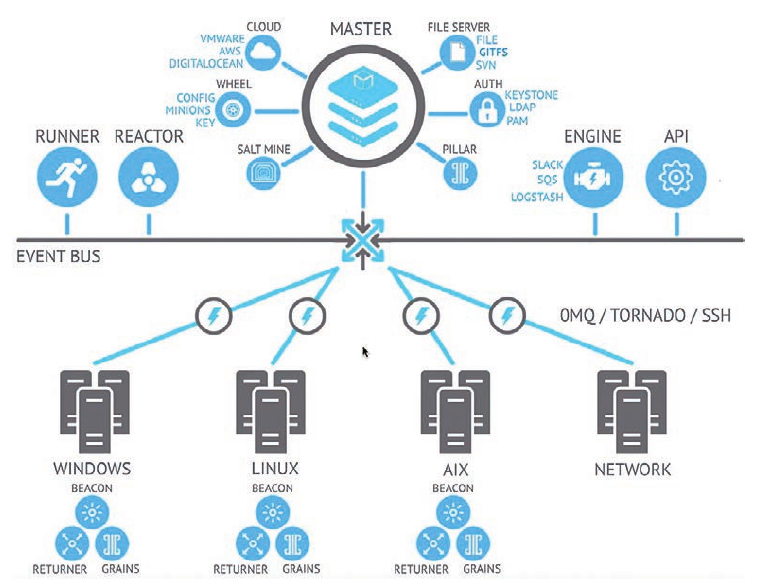

- Like Puppet, SaltStack has it's own DSL

- The SaltStack command structure contains targets, commands and arguments

- The target is the desired system that the command should run

- It is possible to target the system by using the MinionID of a minion

- It is also very common to target all systems with the asterisk (*), which is a wildcard indicating all the systems that are currently managed by SaltStack

- Another possibility is to use a combination of the two; for example, Minion* would grab any system that has a MinionID that starts with the word Minion

- This is called globbing

- The command structure uses the module.function syntax followed by the argument

- An argument provides detail to the module and function that is being called on the command

- Below is shown the correct SaltStack syntax as well as the power of running a command called cmd.run that executes the ad-hoc Linux CLI command `ls -l /etc` across all SaltStack managed nodes and returning the output of the command to the master

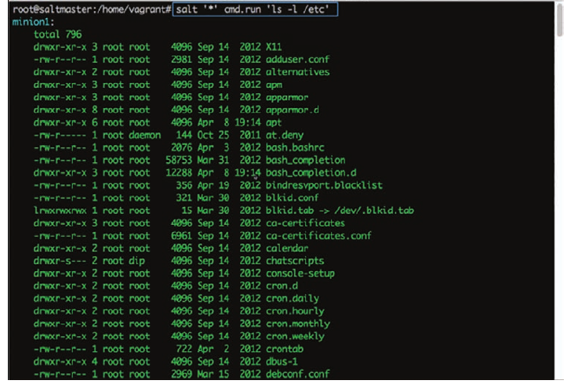

- Imagine that a network operations team is looking to deploy a new feature in the network and needs a list of all IP addresses on all the Linux servers in the environment

- The team could use cmd.run to achieve this

- However, other commands and modules are specifically designed for such use cases

- Rather than having to write up all the ad hoc commands necessary to get the desired outputs from all of the nodes, the team could leverage something like the network.interfaces command to gather much more data from the disparate systems, such as the MAC address, interface names, state, and the IPv4 and IPv6 addressing assigned to these interfaces

- Below we can see an example of output on a Linux host showing this specific use case

- SaltStack can provide some immediate benefits, especially for operations teams that are used to working in the command-line environment on network and server nodes

- A team can easily tie the power of Python scrips into SaltStack to create a very powerful combination

- Other tools use Python as well, but which one to use ultimately comes down to what the operations staff is most comfortable with

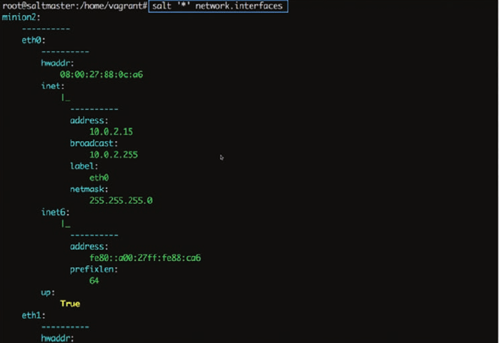

### Agentless Automation Tools

- We will see a variety of agentless tools as well as some of the key concepts to help network operators decide which tool best suits their environment and business use cases

### Ansible

- Ansible is an automation tool that is capable of automating cloud provisioning, deployment of applications, and configuration management

- Ansible has been around for quite some time and was catapulted further into the mainstream when RedHat purchased the company in 2015

- Ansible has grown very popular due to it's simplicity and the fact that it is open source

- Ansible was created with the following concepts in mind:

    - Concurent

    - Secure

    - Highly reliable
    
    - Minimal learning curve

- Unlike the automation tools seen before, Ansible is an agentless tool

- This means that no software or agent needs to be installed in the client devices that are to be managed

- Some consider this to be a major advantage of using Ansible compared to using other products

- Ansible communicates using SSH for a variety of devices, and it can support Windows Remote Management (WinRam) and other transport methods to the clients it manages

- In addition, Ansible does not need an adminsitrative account on the client

- It can use build-in authorization escalation such as `sudo` when it needs to raise the level of administrative control

- Ansible sends all requests from a control station, which could be a laptop or a server sitting on a data center

- The control station is the computer used to run Ansible and issue changes and send requests to the remote hosts

- Below is the ansible workflow

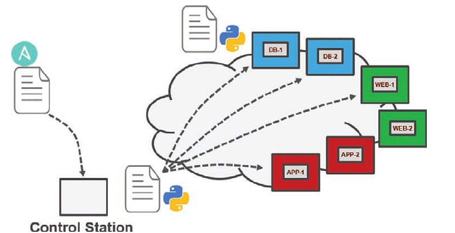

- Administrators, developers, and IT managers like to use Ansible because it allows for easy ramp-up for users who aim to create new projects, and it sets the stage for long-term automation initiatives and processes to further benefit the business

- Automation, by nature, reduces the risk of human error by automatically duplicating known best practices that have been thoroughly tested in an environment

- However, automation can be dangerous if it duplicates a bad process or an errorneous configuration (This applies to any tool, not just Ansible)

- When preparing to automate a task or set of tasks, it is important to start with the desired outcome of the automation, and then it's possible to move on to creating a plan to achieve the outcome

- A methodology commonly used or this process is the PPDIOO (Prepare, Plan, Design, Implement, Operate, Optimize) lifecycle

- Ansible uses **playbooks** to deploy configuration changes or retrieve information from hosts within a network

- An Ansible Playbook is a structured set of instructions - much like the playbooks football players use to make different plays on the field during a game

- An Ansible playbook contains multiple **plays** and each play contains the tasks that each player must accomplish in order for the particular play to be successful

- Below are described the components used by Ansible and provides some commonly used examples of them

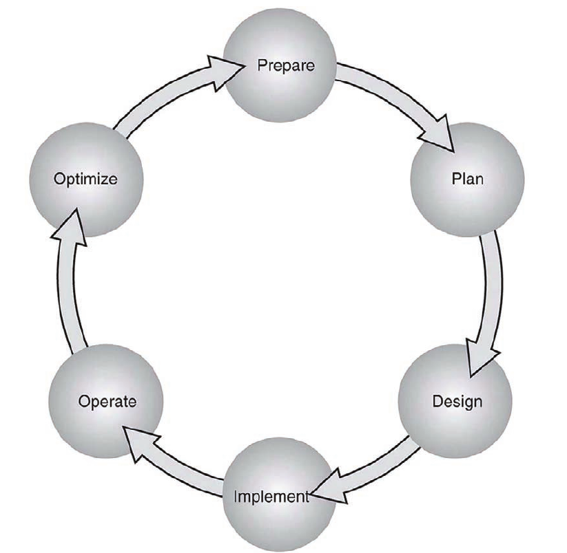

```
Components                      Description                             Use Case

Playbook                        A set of plays for remote systems       Enforcing configuration and/or deployment steps

Play                            A set of tasks applied to a single      Grouping a set of hosts to apply policy and configuration
                                host or a group of hosts                to them

Task                            A call to an Ansible module             Logging in to a device to issue a `show` command to retrieve output
```

- Ansible Playbooks are written using YAML (Yet Another Markup Language)

- Ansible YAML files usually begin with a series of three dashes (---) and end with a series of three periods (...)

- Although this structure is optional, it is common

- YAML files also contain lists and dictionaries

- Below is shown a YAML file that contains a list of musical genres

```
---
# List of music genres
Music:
    - Metal
    - Rock
    - Rap
    - County
...
```

- YAML lists are very easy to read and consume

- As you can see above, it is possible to add comments in YAML by beginning lines with a pound sign (#)

- A YAML file often begin with --- and end with ...; in addition, as you can see above, each line of a list can start with a dash and a space (- ), and identation makes the YAML file readable

- YAML uses dictionaries that are similar to JSON dictionaries as they also use key/value pairs

- A JSON key/value pair appears as "key": "value"

- A YAML key/value pair is similar but does not need the quotation marks -- key: value

- Below is shown a YAML dictionary containing an employee record

```
---
# HR employee record
Employee1:
    Name: John Dough
    Title: Developer
    Nickname: Mr. DBug
```

- Lists and dictionaries can be used together in YAML

- Below is shown a dictionary and a list, both in the same YAML file

```
---
# HR Employee records
-  Employee1:
    Name: John Dough
    Title: Developer
    Nickname: Mr. DBug
    Skills:
        - Python
        - YAML
        - JSON
- Employee2:
    Name: Jane Dough
    Title: Network Architect
    Nickname: Lay DBug
    Skills:
        - CLI
        - Security
        - Automation
...
```

- YAML Lint is a free online tool that you can use to check the format of YAML files to make sure they have valid syntax

- Simply go to https://www.yamllint.com/ and paste the contents of a YAML file into the interpreter and click  Go

- Lint alerts you if there is an error in the file

- Below is shown our dictionary with the formatting cleaned up and the comment removed

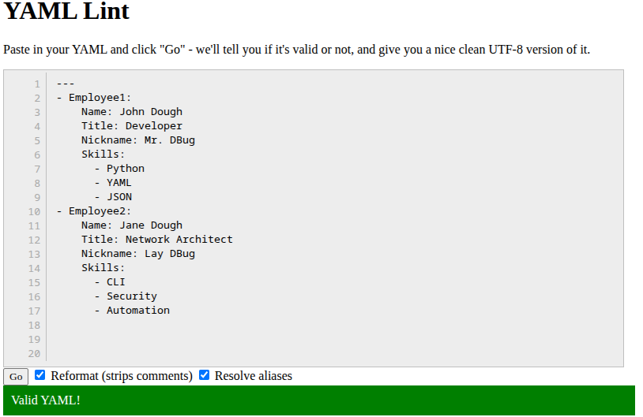

- Ansible has a CLI tool that can be used to run playbooks or  ad hoc CLI commands or targeted hosts

- This tool has very specific commands that you need to use to enable automation

- Below are shown the most common Ansible CLI commands and associated use cases

```
CLI Command                         Use Case

ansible                             Runs modules against targeted hosts

ansible-playbook                    Runs playbooks

ansible-docs                        Provides documentation on syntax and parameters in the CLI

ansible-pull                        Changes Ansible clients from the default push model to the pull model

ansible-vault                       Encrypts YAML files that contain sensitive data
```

- Ansible uses an inventory file to keep track of the hosts it manages

- The inventory can be named group of hosts or a simple list of individual hosts

- A host can belong to multiple groups and can be represented by either an IP address or a resolvable DNS name

- Below is shown the content of the inventory file with the host 192.168.10.1 in two different groups

```
[routers]
192.168.10.1
192.168.20.1

[switches]
192.168.10.25
192.168.10.26

[primary-gateway]
192.168.10.1
```

- Example of Ansible playbooks used to accomplish common tasks

- Imagine using a playbook to deploy interface configuration on a device without having to manually configure it

- You might take this idea a step further and use a playbook to configure an interface and deploy an EIGRP routing process

- Below is shown the content of an Ansible Playbook called ConfigureInterface.yaml, which you can use to configure GigabitEthernet2 interface on a Cisco Router

- By leveraging the ios_config Ansible module, this playbook adds the following configuration to the Gi2 interface on the router:

```
description Configured by ANSIBLE!!!
ip address 10.1.1.1
subnet mask 255.255.255.0
no shutdown
```

- First add into /etc/hosts the names for your hosts - or set dns resolve for them

- Update - not needed - everything can be defined into the hosts file

```
10.15.1.1 R1
10.20.22.2 R2
10.15.1.20 SW1
```

- Create a hosts file:

```
[routers]
R1 ansible_host=10.15.1.1 ansible_user=marius ansible_password=<pass> ansible_become=yes ansible_become_method=enable ansible_become_password=<pass> ansible_network_os=cisco.ios.ios
R2 ansible_host=10.20.22.2 ansible_user=marius ansible_password=<pass> ansible_become=yes ansible_become_method=enable ansible_become_password=<pass> ansible_network_os=cisco.ios.ios

#[switches]
#SW1

```

- Install the needed modules: (in fedora):

```
sudo dnf install python3-paramiko python3-ansible-pylibssh
```

```yaml
---
- name: Configure Cisco router
  hosts: R1
  connection: network_cli
  tasks:
    - name: Configure interface E0/3
      ios_config:
        lines:
          - no shutdown
          - ip address 100.64.1.1 255.255.255.0
          - description Configured with ansible
        parents:
          - interface Ethernet 0/3

```

- To execute this playbook, the ansible-playbook command is used to call the specific playbook YAML file (ConfigureInterface.yaml)

- The important things to note in the output are the PLAY, TASK, and TASK RECAP sections, which list the name of the play and each individual task that gets executed in each play

- The PLAY RECAP section shows the status of the playbook that is executed

- The output shows that one play named CSR1kV-1, was launched followed by a task called Configure Ethernet0/3 interface

- Based on the status ok=1, you know the change was successful, the changed=1 status means that a single change was made on the CSR1KV-1 router

- Real inventory run:

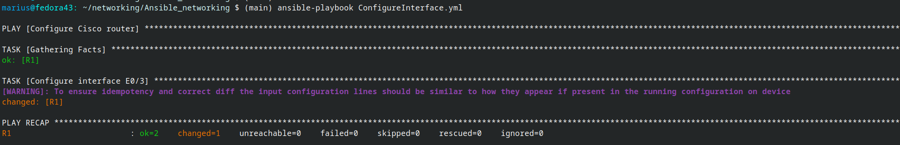

- Building out a playbook can greatly simplify configuration tasks

- Below is an alternative of the ConfigureInterface,yaml playbook named EIGRP_Configuration_Example.yaml, with EIGRP added, along with the ability to save the configuration by issuing a "write memory"

- These tasks are accomplished by leveraging the ios_command module in Ansible

- This playbook adds the following configuration to the CSR1KV-1 router

- On Gi2:

    - description Configured by Ansible

    - ip address 10.1.1.1

    - subnet mask 255.255.255.0

    - no shutdown

- On Gi3:

    - description Configured by Ansible

    - no ip address

    - shutdown

- Global configuration:

```
router eigrp 100
eigrp router-id 1.1.1.1
no auto-summary
network 10.1.1.0 0.0.0.255
```

- Save configuration:

```
write memory
```

```yaml
---
- hosts: R2
  connection: network_cli
  tasks:
    - name: Configure Ethernet0/3 Interface
      ios_config:
        lines:
          - description Configured by Ansible
          - ip address 100.64.0.2 255.255.255.0
          - no shutdown
        parents: interface Ethernet0/3
    - name: Configure Ethernet 0/2
      ios_config:
        lines:
          - description Configured by Ansible
          - no ip address
          - shutdown
        parents: interface Ethernet 0/2
    - name: Config EIGRP 100
      ios_config:
        lines:
          - router eigrp 100
          - eigrp router-id 10.1.1.1
          - no auto-summary
          - network 100.65.0.0 0.0.3.255
    - name: Write Memory
      ios_command:
        commands:
          - write memory

```

- When the playbook is run, the output shows the tasks as they are completed and the status of each one

- Based on the output shown below, you can see that tasks with the following names are completed and the return status changed:

    - Configure GigabitEthernet2 interface

    - Config Gig3

    - Config EIGRP 100

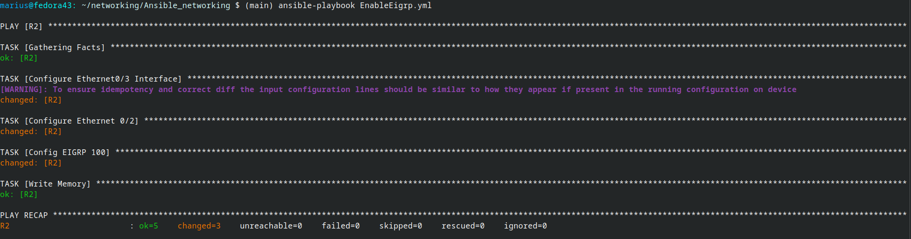

- Furthermore, the Write Memory task completes which is evident from the status ok: [CSR1KV-1]

- At the bottom of the output, notice the PLAY RECAP section, which has the status ok=4 and changed=3

- This means that out of the four tasks, three actually modified the router and made configuration changes, and one task saved the configuration after it was modified

- After the EIGRP_Configuration_Example.yaml has been run against CSR1KV-1, you need to verify the configuration to make sure it was correctly applied

- Below are shown the relevant sections of the startup configuration from R2 to verify the tasks that were applied to the router

```
R2#sh run | s router eigrp
router eigrp 100
 network 100.65.0.0 0.0.3.255
 eigrp router-id 10.1.1.1
R2#
R2#
R2#
R2#sh run int e0/2
Building configuration...

Current configuration : 89 bytes
!
interface Ethernet0/2
 description Configured by Ansible
 no ip address
 shutdown
end

R2#sh run int e0/3
Building configuration...

Current configuration : 101 bytes
!
interface Ethernet0/3
 description Configured by Ansible
 ip address 100.64.0.2 255.255.255.0
end

```

- The last task in the playbook is to issue the `write memory` command, and you can verify that it happened by issuing the `show startup-config` command with some filters to see relevant configuration on the router

- Below is shown the output of the command `show startup-config | s Ethernet0/2|net0/3|router eigrp 100`

```
R2#show startup-config | s Ethernet0/2|net0/3|router eigrp 100
interface Ethernet0/2
 description Configured by Ansible
 no ip address
 shutdown
interface Ethernet0/3
 description Configured by Ansible
 ip address 100.64.0.2 255.255.255.0
router eigrp 100
 network 100.65.0.0 0.0.3.255
 eigrp router-id 10.1.1.1
```

### Puppet Bolt

- Puppet bolt allows you to leverage the power of Puppet without having to install a puppet server of puppet agents on devices or nodes

- Much like Ansible, Puppet Bolt connects to devices by using SSH or WinRM connections

- Puppet bolt is an open source tool that is based on Ruby language and can be installed as a single package

- In Puppet Bolt, tasks can be used for pushing configuration and for managing services, such as starting and stopping services and deploying applications

- Tasks are sharable

- For example, users can visit Puppet Forge to find and share tasks with others in the community

- Tasks are really good for solving problems that don't fit in the traditional model of client/server or puppet server and puppet client

- As mentioned earlier, Puppet is used to ensure configuration on devices and can periodically validate that the change or specific value is indeed configured

- Puppet bolt allows you to execute a change or configuration immediately and then validate it

- There are two ways to use Puppet Bolt:

    - **Orchestrator-driven tasks**: Orchestrator-driven tasks can leverage the Puppet architecture and use services to connect to devices

    - This design is meant for large-scale environments

    - **Standalone tasks**: Standalone tasks are for connecting directly to devices or nodes to execute tasks and do not require any Puppet environment or components to be set up in order to realize the benefits and value of Puppet Bolt

- Individual commands can be run from the command line by using the command `bolt command run <command-name>` followed by a list of devices to run the command against

- In addition to manually running the commands, you can construct scripts that contain multiple commands

- You can construct these scripts in Python, Ruby, and any other scripting language that the devices can interpret

- After a script is built, you can execute it from the command line against the remote devices that need to be configured, using the command `bolt script run <script-name>` followed by the list of devices to run the script against

- Below are shown the available commands for Puppet Bolt

- The Puppet Bolt command line is not the Cisco command line; rather it can be a Linux, OS X, or windows operating system

- Puppet enterprise allow for the use of a GUI to execute tasks

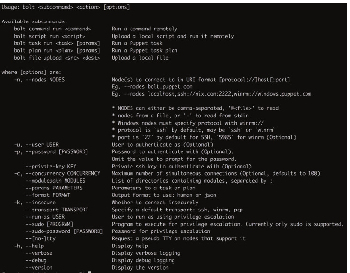

- Puppet Bolt copies the script into a temporary directory on the remote device, executes the script, captures the results, and removes the script from the remote system as if it were never copied there

- This is a really clean way of executing remote commands without leaving residual scripts or files on the remote devices

- Much as the Cisco DNA Center and Cisco vManage APIs, Puppet Bolt tasks use an API to retrieve data between Puppet Bolt and the remote device

- This provides a structure for the data that Puppet Bolt expects to see

- Tasks are part of the Puppet modules and use the naming structure modulename::taskfilename

- Tasks can be called from the command line much like commands and scripts

- You can use the command `bolt task run modulename::taskfilename` to invoke these tasks from the command line

- The modulename::taskfilename naming structure allows the tasks to be shared with other users on Puppet Forge

- A task is commonly accompanied by a metadata file that is in JSON format

- A JSON metadata file contains information about a task, how to run the task, and any comment about how the file is written

- Often, the metadata file is named the same as the task script but with a JSON extension

- This is a standard way of sharing documentation about what a script can do and how is it structured

- You can see this documentation by running the command `bolt task show modulename::taskfilename` at the command line

### SaltStack SSH (Server-Only Mode)

- SaltStack offers an agentless option called Salt SSH that allows users to run Salt commands without having to install a minion on the remote device or node

- This is similar in concept with Puppet Bolt

- The main requirements to use Salt SSH are that the remote system must have SSH enabled and Python installed

- Salt SSH connects to a remote device and installs a Lightweight version of SaltStack in a temporary directory and then can optionally delete the temporary directory upon completion, leaving the remote system clean

- These temporary directories can be left on the remote systems along with any necessary files to run Salt SSH

- This way, the files do not have to be reinstalled on the remote device, which can be useful when time is a consideration

- This is often useful on devices that are using Salt SSH more frequently than other devices in the environment

- Another benefit of using Salt SSH is that it can work in conjunction with the master/minion environment, or it can be used completely agentless across the environment

- By default, Salt SSH uses roster files to store connection information for any host that doesn't have a minion installed

- Below is shown the content structure of this file

- It is easy to interpret the roster files associated with Salt SSH because they are constructed in human-readable form

```
managed:
    host: 192.168.10.1
    user: admin
```

- One of major design considerations when using Salt SSH is that it is considerabily slower than the 0MQ distributed messaging library

- However, Salt SSH is often considered faster than logging in to the system to execute the commands

- By automating daily configuration tasks, it can gain some of the following benefits:

    - Increased agility

    - Reduced opex

    - Streamlined management

    - Reduced human error

### Comparing tools

- Many organizations face lean IT problems and high turnover, and network engineers are being asked to do more with less

- Utilizing some of the presented tools, can help aleviate some of the presure put on the IT staff by offloading some of more tedious, time consuming and repetitive tasks

- A network operator can then focus more on critical mission responsabilities such as network design and growth planning

- A majority of these tools function very similar to one another

- Below is a high level comparison of the tools covered:

```
Factor                  Puppet                  Chef                    Ansible                     SaltStack

Architecture            Puppet servers and      Chef server and         Control station and         Salt master and
                        puppet agents           chef agents             remote hosts                minions

Language                Puppet DSL              Ruby DSL                YAML                        YAML

Terminology             Modules and             Cookbooks and           Playbooks and plays         Pillars and grains
                        manifests               recipes

Support for             yes                     yes                     yes                         yes
large-scale deployments 

Agentless versions      Puppet bolt             N/A                     yes                         Salt SSH
```

- The most important factors in choosing a tool are how the tools are used and the skills of the operations staff who are adopting them

- For instance, if the team is very fluent in ruby, it may make sense to look at Chef

- On the other hand, if the team is very confident at the command line, Ansible or SaltStack may be a good fit

- The best tool for the job depends on the customer, and choosing one requires a thorough understanding of differences between the tools and solid knowledge of what the operations team is confortable with and that will play to their strengths
