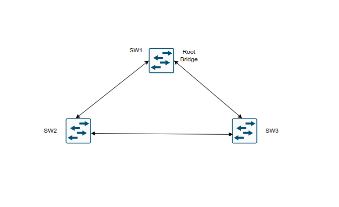
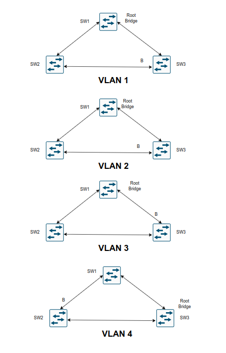
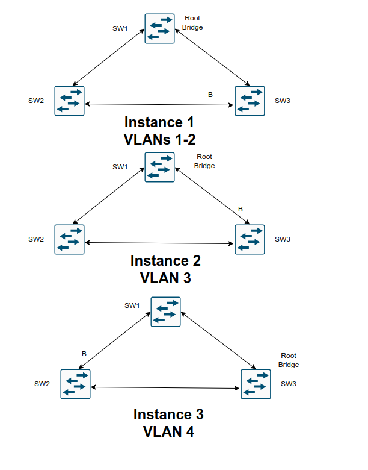
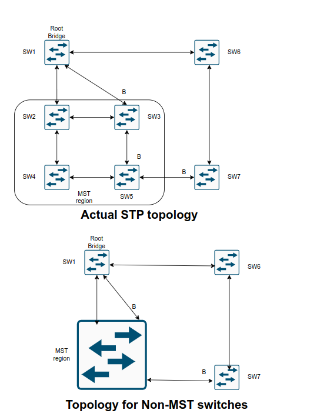

## Multiple Spanning Tree Protocol

1. Benefits and operations of MST

- MST is one of three STP modes supported on Catalyst switches

### Multiple Spanning Tree Protocol

- The original 802.1D standard, much like 802.1Q standard, supported only one STP instance for an entire switch network

- In this situation, referred to as Common Spanning Tree (CST), all VLANs used the same topology, which meant it was not possible to load-share traffic accross links by blocking for specific VLANs on one link and then blocking for other VLANs on alternate links



- Our topology shows 4 VLANs sharing the same topology

- All network traffic from SW2 to SW3 must traverse through SW1

- If VLAN4 contained devices only on SW2 and SW3, the topology could not be tuned with traffic going directly between the two switches

- Cisco developed the Per-VLAN Spanning-Tree (PVST) protocol to allow for an STP topology for each VLAN

- With PVST, the root bridge can be placed on a different switch or can cost ports differently, on a VLAN by VLAN basis

- This allows for a link to be blocked for one VLAN and forwarding for another



- In the above topology all three switches maintain an STP topology for each of the 4 VLANs

- If 10 more VLANs were added to this environment, the switches would have to maintain 14 STP topologies

- With the third STP instance for VLAN 3, the blocking port moves to the SW1 <-> SW3 link due to STP tuning to address the needs of the traffic between SW2 (where servers attach) and SW3 (where clients attach)

- On the fourth STP instance, devices on VLAN 4 reside only on SW2 and SW3, so moving the blocking port to the SW1 <-> SW2 link allows for optimal traffic flow

- Now, in environments with thousands of VLANs, maintaining an STP state for all the VLANs can become a burden to the switch's processors

- The switches must process BPDUs for every VLAN, and when a major trunk link fails, they must compute multiple STP operations to converge the network

- MST provides a blended approach by mapping one or multiple VLANs into a single STP tree called an MST instance (MSTI)



- In the above topology, all three switches maintain three STP topologies for 4 VLANs

- If 10 more VLANs were added to this environment, then the switches would maintain three STP topologies if they were alligned to one of the three existing MSTIs

- VLANs 1 and 2 correlate to one MSTI, VLAN 3 to a second MSTI, and VLAN 4 to a third MSTI

- A grouping of MST switches with the same high-level configuration is known as an MST region

- MST incorporates mechanisms that make an MST region appear as a single virtual switch to external switches as part of a compatibility mechanism



- The above topology demonstrates the concept further, showing the actual STP topology beside the topology perceived by devices outside the MST region

- Normal STP operations would calculate S5 blocking the port toward SW3 using the normal STP operations

- A special note should go toward SW3 blocking the port toward SW1

- Normally SW3 would mark that port as a RP, but because it sees the topology from a larger collective, it is blocking that port rather than blocking the port between SW2 and SW3

- SW7 is also blocking the port towards the MSTP region

- SW7 and SW5 are two physical hops away from the root bridge, but SW5 is part of the MSTP region virtual switch and appears to be one hop away (from SW7's perspective). That is why SW7 places it's port into a blocking state

#### MST Instances (MSTI)

- MST uses a special STP instance called the *internal spanning-tree* (IST), which is always the first instance, instance 0

- The IST runs on all switch port interfaces for switches in the MST region, regardless of the VLANs associated with the ports

- Additional information about the other MSTIs is included (nested) in the IST BPDU that is transmitted through the MSTI region

- This enables the MST to advertise only one set of BPDUs, minimizing STP traffic regardless of the number of instances while providing the necessary information to calculate the STP for other MSTIs

- Cisco supports up to 16 MST instances by default

- The IST is always instance 0, so instances 1 to 15 can support other VLANs

- There is not a special name for instances 1 to 15; they are simply known as MSTIs

#### MST configuration

- **Step 1**: Define MST as the spanning-tree protocol:

```ios
conf t
 spanning-tree mode mst
```

- **Step 2**: (Optional) Define the MST instance priority using one of 2 methods:

	- Method 1:
	
	```ios
	conf t
	 spanning-tree mst instance <number> priority <priority> # in incremets of 4096
	```
	- Method 2:
	
	```ios
	conf t
	 spanning-tree mst instace <number> root <primary | secondary> <diameter <diameter>>
	```

- The `primary` keyword sets the priority to 24567 and the `secondary` keyword sets the priority to 28672

- **Step 3**: Associate VLANs to an MST instance

- By default, all VLANs are associated to the MST 0 instance

- Entering MST configuration submode:

```ios
conf t
 spanning-tree mst configuration
```

- Then the VLANs are assigned to a different MST instance with the following command (in mst configuration mode)

```ios
conf t
spanning-tred mst configuration
 instance <number> vlan <id> # Here can be defined a range or a list of VLANs
```

- **Step 4**: Specify the MST version number

- The MST region number must match for all switches in the same MST region

- Revision is configured with the submode configuration command:

```ios
conf t
 spanning-tree mst configuration
  instance <number> vlan <id>
  revision <version>
```

- **Step 5**: (Optional) Define the MST region name

- MST regions are recognized by switches that share a common name

- By default a region name is an empty string

- Setting the mst region name:

```ios
conf t
 spanning-tree mst configuration
  name <region_name>
```

- Verify the mst configuration on a switch:

```ios
show spanning-tree mst configuration
```

- In the output you will see that all VLANs, except the ones that are assigned to other MST instances are listed, regardless they are configured or not on the switch

#### MST verification

- Getting the relevant Spanning-Tree information:

```ios
show spanning-tree
```

- With this command the VLAN numbers are not shown, only the MST instance numbers are shown

- In addition the priority value of the switch is the MST instance priority plus the switch priority

- A consolidated view of the mst topology can be seen with the following command:

```ios
show spanning-tree mst <instance_nr>
```

- The optional instance number can be included to restrict the output to a specific instance

- With this command the VLANs are displayed next to the STP instance, which simplifies troubleshooting

- The specific MST settings for a interface can be viewed as follows:

```ios
show spanning-tree mst interface <id>
```

- The output of this command includes additional information about optional STP features such as BPDU filter and BPDU guard

#### MST Tuning

- MST supports the tuning of port cost and port priority

- Setting the cost for an interface for a specific MST instance:

```ios
conf t
 interface Gi1/0/11
  spanning-tree mst <instance_nr> cost <cost>
```

- Setting the priority for an interface for a specific MST instance:

```ios
conf t
 interface Gi1/0/11
  spanning-tree mst <instance_nr> port-priority <priority>
```

#### Common MST Misconfigurations


