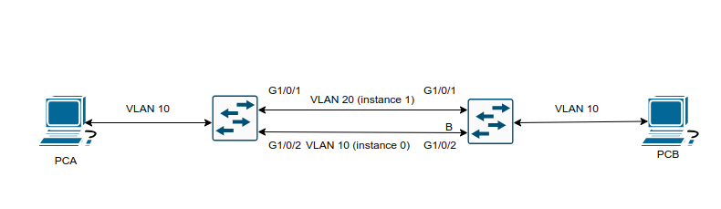
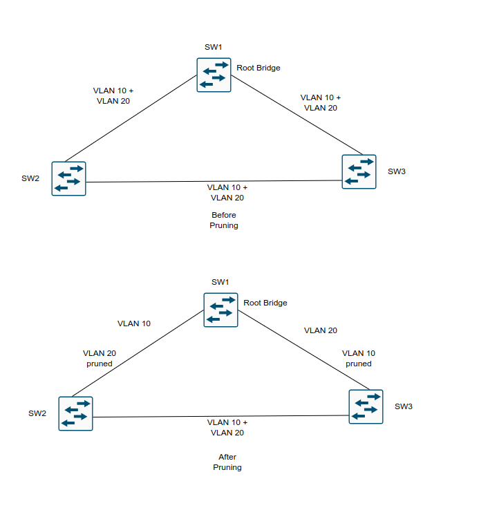
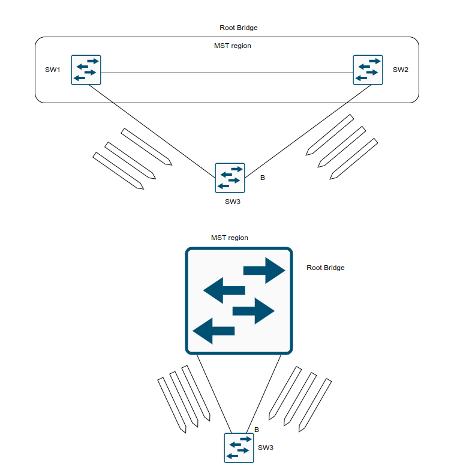

## Multiple Spanning Tree Protocol

1. Benefits and operations of MST

- MST is one of three STP modes supported on Catalyst switches

### Multiple Spanning Tree Protocol

- The original 802.1D standard, much like 802.1Q standard, supported only one STP instance for an entire switch network

- In this situation, referred to as Common Spanning Tree (CST), all VLANs used the same topology, which meant it was not possible to load-share traffic accross links by blocking for specific VLANs on one link and then blocking for other VLANs on alternate links


- Our topology shows 4 VLANs sharing the same topology

- All network traffic from SW2 to SW3 must traverse through SW1

- If VLAN4 contained devices only on SW2 and SW3, the topology could not be tuned with traffic going directly between the two switches

- Cisco developed the Per-VLAN Spanning-Tree (PVST) protocol to allow for an STP topology for each VLAN

- With PVST, the root bridge can be placed on a different switch or can cost ports differently, on a VLAN by VLAN basis

- This allows for a link to be blocked for one VLAN and forwarding for another


- In the above topology all three switches maintain an STP topology for each of the 4 VLANs

- If 10 more VLANs were added to this environment, the switches would have to maintain 14 STP topologies

- With the third STP instance for VLAN 3, the blocking port moves to the SW1 <-> SW3 link due to STP tuning to address the needs of the traffic between SW2 (where servers attach) and SW3 (where clients attach)

- On the fourth STP instance, devices on VLAN 4 reside only on SW2 and SW3, so moving the blocking port to the SW1 <-> SW2 link allows for optimal traffic flow

- Now, in environments with thousands of VLANs, maintaining an STP state for all the VLANs can become a burden to the switch's processors

- The switches must process BPDUs for every VLAN, and when a major trunk link fails, they must compute multiple STP operations to converge the network

- MST provides a blended approach by mapping one or multiple VLANs into a single STP tree called an MST instance (MSTI)


- In the above topology, all three switches maintain three STP topologies for 4 VLANs

- If 10 more VLANs were added to this environment, then the switches would maintain three STP topologies if they were alligned to one of the three existing MSTIs

- VLANs 1 and 2 correlate to one MSTI, VLAN 3 to a second MSTI, and VLAN 4 to a third MSTI

- A grouping of MST switches with the same high-level configuration is known as an MST region

- MST incorporates mechanisms that make an MST region appear as a single virtual switch to external switches as part of a compatibility mechanism


- The above topology demonstrates the concept further, showing the actual STP topology beside the topology perceived by devices outside the MST region

- Normal STP operations would calculate S5 blocking the port toward SW3 using the normal STP operations

- A special note should go toward SW3 blocking the port toward SW1

- Normally SW3 would mark that port as a RP, but because it sees the topology from a larger collective, it is blocking that port rather than blocking the port between SW2 and SW3

- SW7 is also blocking the port towards the MSTP region

- SW7 and SW5 are two physical hops away from the root bridge, but SW5 is part of the MSTP region virtual switch and appears to be one hop away (from SW7's perspective). That is why SW7 places it's port into a blocking state

#### MST Instances (MSTI)

- MST uses a special STP instance called the *internal spanning-tree* (IST), which is always the first instance, instance 0

- The IST runs on all switch port interfaces for switches in the MST region, regardless of the VLANs associated with the ports

- Additional information about the other MSTIs is included (nested) in the IST BPDU that is transmitted through the MSTI region

- This enables the MST to advertise only one set of BPDUs, minimizing STP traffic regardless of the number of instances while providing the necessary information to calculate the STP for other MSTIs

- Cisco supports up to 16 MST instances by default

- The IST is always instance 0, so instances 1 to 15 can support other VLANs

- There is not a special name for instances 1 to 15; they are simply known as MSTIs

#### MST configuration

- **Step 1**: Define MST as the spanning-tree protocol:

```ios
conf t
 spanning-tree mode mst
```

- **Step 2**: (Optional) Define the MST instance priority using one of 2 methods:

	- Method 1:
	
	```ios
	conf t
	 spanning-tree mst instance <number> priority <priority> # in incremets of 4096
	```
	- Method 2:
	
	```ios
	conf t
	 spanning-tree mst instace <number> root <primary | secondary> <diameter <diameter>>
	```

- The `primary` keyword sets the priority to 24567 and the `secondary` keyword sets the priority to 28672

- **Step 3**: Associate VLANs to an MST instance

- By default, all VLANs are associated to the MST 0 instance

- Entering MST configuration submode:

```ios
conf t
 spanning-tree mst configuration
```

- Then the VLANs are assigned to a different MST instance with the following command (in mst configuration mode)

```ios
conf t
spanning-tred mst configuration
 instance <number> vlan <id> # Here can be defined a range or a list of VLANs
```

- **Step 4**: Specify the MST version number

- The MST region number must match for all switches in the same MST region

- Revision is configured with the submode configuration command:

```ios
conf t
 spanning-tree mst configuration
  instance <number> vlan <id>
  revision <version>
```

- **Step 5**: (Optional) Define the MST region name

- MST regions are recognized by switches that share a common name

- By default a region name is an empty string

- Setting the mst region name:

```ios
conf t
 spanning-tree mst configuration
  name <region_name>
```

- Verify the mst configuration on a switch:

```ios
show spanning-tree mst configuration
```

- In the output you will see that all VLANs, except the ones that are assigned to other MST instances are listed, regardless they are configured or not on the switch

#### MST verification

- Getting the relevant Spanning-Tree information:

```ios
show spanning-tree
```

- With this command the VLAN numbers are not shown, only the MST instance numbers are shown

- In addition the priority value of the switch is the MST instance priority plus the switch priority

- A consolidated view of the mst topology can be seen with the following command:

```ios
show spanning-tree mst <instance_nr>
```

- The optional instance number can be included to restrict the output to a specific instance

- With this command the VLANs are displayed next to the STP instance, which simplifies troubleshooting

- The specific MST settings for a interface can be viewed as follows:

```ios
show spanning-tree mst interface <id>
```

- The output of this command includes additional information about optional STP features such as BPDU filter and BPDU guard

- While in mst configuration mode you can view the pending information to be saved as follows:

```
conf t
 spanning-tree mst configuration
 show pending
```

- Just use the show command in mst config mode to view the pending settings:

```
conf t
 spanning-tree mst configuration
 show
```

- While in mst configuration mode you can view the current settings as follows:
```
conf t
 spanning-tree mst configuration
 show current
```

#### MST Tuning

- MST supports the tuning of port cost and port priority

- Setting the cost for an interface for a specific MST instance:

```ios
conf t
 interface Gi1/0/11
  spanning-tree mst <instance_nr> cost <cost>
```

- Setting the priority for an interface for a specific MST instance:

```ios
conf t
 interface Gi1/0/11
  spanning-tree mst <instance_nr> port-priority <priority>
```

#### Common MST Misconfigurations

- Two common misconfigurations for MST regions:

	- VLAN assignment to the IST
	
	- Trunk link prunning
	
- **VLAN assignment to the IST**

- IST operates across all links in the MST region, regardless of the VLAN assigned to the actual port

- The IST topology may not correlate to the access layer and might introduce a blocking port that was not intentional



- In the above sample topology, VLAN 10 is assigned to the IST, and VLAN 20 is assigned to MSTI1

- SW1 and SW2 contain 2 network links between them, with VLAN 10 and VLAN 20

- It appears as if traffic between PCA and PCB would flow across the G1/0/2 interface, as it is an access port assigned to VLAN 10

- However, all interfaces belong to the IST instance

- SW1 is the root bridge, and all of it's ports are designated ports (DPs), so SW2 must block either G1/0/1 or G1/0/2

- SW2 blocks it's G1/0/2 port, based on the port identifier from SW1, which is G1/0/2

- So now SW2 is blocking the G1/0/2 interface for the IST instance, which is the instance that VLAN 10 is mapped to

- Solutions to this scenario:

	- Move VLAN 10 to a MSTI instance other than the IST. If you do this, the switches will build a topology based on the links in use by that MSTI
	
	- Allow the VLANs associated with the IST on all interswitch (trunk) links
	
- **Trunk Link Pruning**

- Pruning of VLANs on a trunk link is a common practice for load balancing

- However it is important that pruning of VLANs does not occur for VLANs in the same MST on different on different network links



- In the above topology in which VLAN 10 and VLAN 20 are throughout the entire topology

- A junior network engineer was pruned VLANs on the trunk links between SW1 and SW2 and SW1 and SW3 to help load balance traffic

- Shortly after implementing the change, users attached to SW1 and SW3 cannot talk to the servers on SW2

- This is because while the VLANs on the trunk links have changed, the MSTI topology has not

- A simple rule to follow is to only prune all the VLANs in the same MSTI for a trunk link

#### MST region boundary

- The topology for all the MST instances is contained within the IST, which operates internally to the MST region

- An *MST region boundary* is any port that connects to a switch in a different MST region or that connects to 802.1D or 802.1W BPDUs

- MSTI never interacts outside the region

- MST switches can detect PVST+ neighbors at MST region boundaries

- Propagating the CST (derived from the IST) at the MST region boundary involves a feature called *PVST simulation mechanism*

- The PVST simulation mechanism sends out PVST+ (and includes RSTP, too) BPDUs (one for each VLAN), using the information from the IST

- To be very explicit, this requires a mapping of one topology (IST) to multiple VLANs (VLANs towards the PVST link)

- The PVST simulation mechanism is required because PVST+/RSTP topologies do not understand the IST BPDU structure

- When the MST boundary receives PVST+ BPDUs, it does not map the VLANs to the appropriate MSTIs

- Instead, the MST boundary maps the PVST+ BPDU from VLAN 1 to the IST instance

- The MST boundary engages the PVST simulation mechanism only when it receives a PVST BPDU on a port

- PVST vs PVST+ 

	- PVST+ supports 802.1Q trunk links, PVST only supports ISL trunks

- Two design considerations when integrating the MST region with a PVST+/RSTP environment:

	- The MST region is the root bridge
	
	- MST region is not the root bridge for any VLAN
	
- **MST region as the Root Bridge**

- Making the MST region the root bridge ensures that all region boundary ports flood the same IST instance BPDU to all VLANs in the PVST topology

- Making the IST instance more preferable than any other switch in the PVST+ topology enables this design

- The MST region appears as a single entity, and the PVST+ switches detect the alternate link and and place it into a blocking state



- The above topology shows the IST instance as the root bridge for all VLANs

- SW1 and SW2 advertise multiple superior BPDUs for each VLAN towards , which is operating as a PVST+ switch

- SW3 is responsible for blocking ports

- SW3 could load balance traffic between the VLANs by setting the STP port cost on a VLAN-by-VLAN basis on each uplink

- **MST Region Not as Root Bridge for Any VLAN**

- In this scenario, the MST region boundary ports can only block or forward for all VLANs 

- Only the VLAN 1 PVST BPDU is used for the IST and that the IST BPDU is a one-to-many translation of IST BPDUs to all PVST BPDUs

- There is not an option to load balance traffic because the IST instance must remain consistent

- If an MST switch detects a better BPDU for a specific VLAN on a boundary port, the switch will use BPDU guard to block that port

- The port will then be placed into a root inconsistent state 

- While this may isolate downstream switches, it is done to ensure a loop free topology; this is called PVST simulation check


