### Multicast - PIM SM and PIM DM

- Multicast requires you to have a working unicast topology

- PIM is purely responsable for sharing multicast state information

- PIM and IGMP

- With multicast, you are subscribing to a particular group, not like ARP in IPv4 which requires traffic inspection to see if the traffic is for the local router or not, and to drop it if not

- All receivers interested for receiving traffic for a multicast group - will receive traffic for that multicast group

- There are two approaches to determining interest:

    - The dense mode approach

    - The sparse mode approach

- The difference between the two is the starting assumption:

- The dense mode assumption is that everyone in the topology is interested in receiving the multicast traffic

- All hosts will receive traffic for a specific multicast group

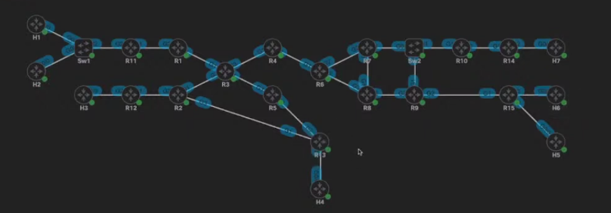

- In PIM DM, the routers that are connected to the receivers need to specifically prune themselves out of the multicast stream

- Routers learn about the interested receivers through IGMP

- PIM SM, starts with the assumption that no-one is interested in receiving the multicast stream

- The receivers "subscribe" to the particular multicast group using IGMP

- The routers connected to the host register it's interest and communicate that using PIM

- Dense Mode is used in cases where sparse mode fails to be able to signal the multicast information - for example with features like Auto-RP

- IGMP is used to signal the interest of the hosts in receiving the multicast traffic

- PIM is used to signal the multicast state information across routers

- ip pim sparse-dense-mode is a hybrid approach to the protocol - the router will run sparse mode on the interface, but for whatever reason the sparse mode fails, it will fall back to PIM dense mode, but will primarily try to use sparse mode whenever possible

- Enabling PIM on routers:

```
conf t
 ! IOS XE
 ip multicast-routing distributed
 ! IOS
 ip multicast-routing

 interface range g1-3,l0
  ip pim sparse-mode ! or ip pim dense-mode ! or ip prim sparse-dense-mode
```

- Configure passive interfaces on routers:

```
conf t
 interface g1
  ip pim passive
```

- **Multicast boundary** - will allow you to set a boundary for how far you want your multicast domain to go (more info later)

- PIM has DR features - so it elects DRs for specific network links

- Multicast route/state types:

- (S,G) - S=Source, G=Group - (192.168.3.3, 239.1.1.1)

- (*,G) - *=Wildcard for any source, G=Group - (*, 239.1.1.1)

- Any source multicast - Multicast where we do not care where the source is

- PIM RP (Rendez-vous Point) is one router that is the root of the multicast (*,G) tree and everything converges out from that group

- The point of the RP is to receive all messages for interesting receivers - configured in all routers in the network

- The hosts interested in receiving the multicast streams will send an IGMP join to the nearest router (gateway)

- The router will convert/send a PIM Join to the rendez-vous point configured - to join that multicast stream - so the RP is responsible to register them

- The RP will gather information about the interested receivers in joining the multicast group, regardless of the source

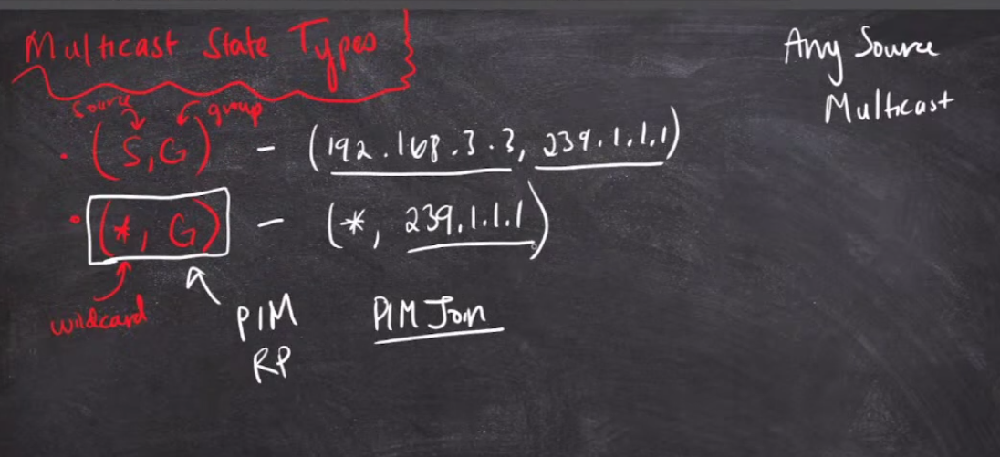

- The RP sends a PIM register to the multicast source once there are interested receivers in receiving the multicast traffic

- PIM Register will populate the (S,G) trees - sources

- PIM Join will populate the (*,G) trees - receivers

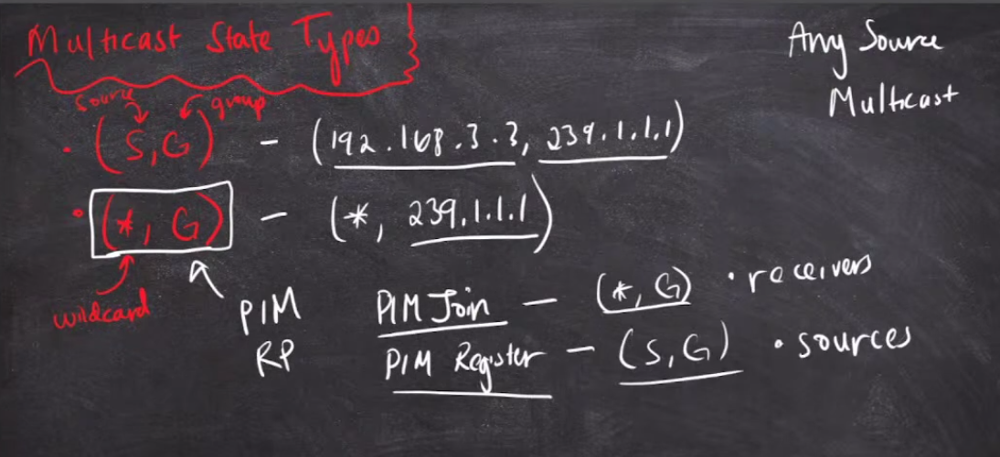

- Verifying the PIM neighbors:

```
show ip pim neighbor
```

- Viewing the multicast routing table:

```
show ip mroute
```

- At first, the RP is going to be in the data path

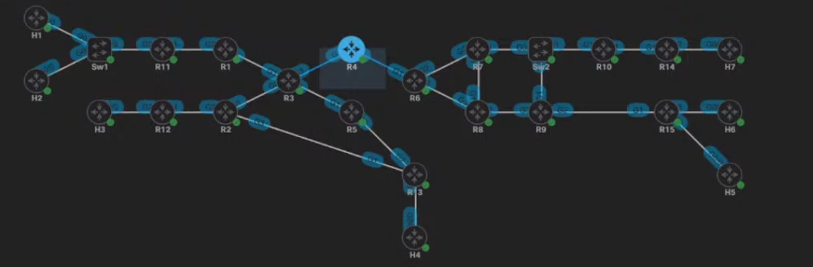

- Statically configure the RP:

```
conf t
 ip pim rp-address 192.168.255.4
```

- It is recommended to use the loopback address as the RP address - to avoid the problems of interfaces going up or down

- The command is also entered on the RP (R4) itself in order to instruct it to function as the RP

- All the routers we enabled the RP's on, create tunnels to the RP address

- The RP creates 2 tunnels - one for encapsulation and one for de-encapsulation of multicast traffic

- Any other routers create only one tunnel to the RP

- Tunnel source is the one closer to the next-hop for the route to the RP address

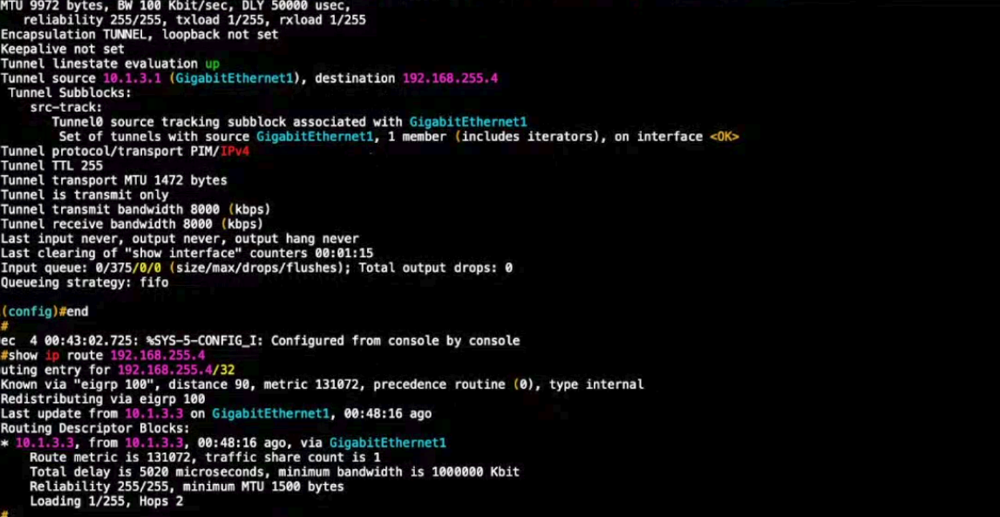

- RPF - reverse path forwarding

- RPF looks at the unicast routing table, and it looks at the outgoing interface for the RP address

- If I send traffic to the RP via g1 interface, I want to receive it back on G1 interface

```
show ip rpf 192.168.255.4
```

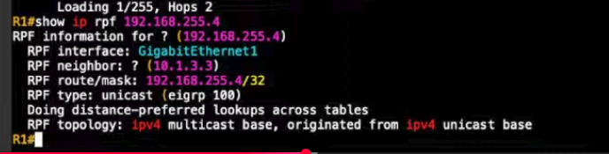

- The interface for RPF has to be PIM-enabled

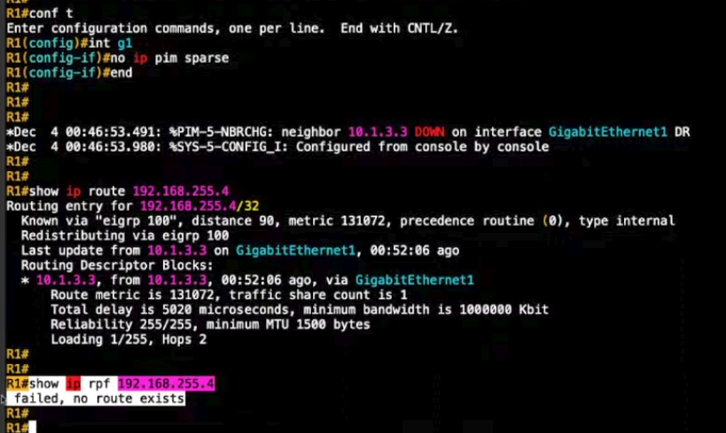

- The problem is that there is not any multicast-capable route to the RP address

- Verify the PIM RP is properly configured:

```
show ip pim rp-mapping
```

### IGMP

- The receivers will be the ones that will use IGMP

- IGMP is used by the receivers to signal the interest in receiving multicast traffic

- Lab to try - stream multicast using VLC

- Join a multicast group from a cisco router:

```
conf t
 interface g0/0
  ip igmp join-group 239.0.12.1
  ip igmp join-group 239.0.124.1
```

- Show group membership:

```
show ip igmp membership
```

- On the router connected to the multicast host:

```
show ip igmp membership
```

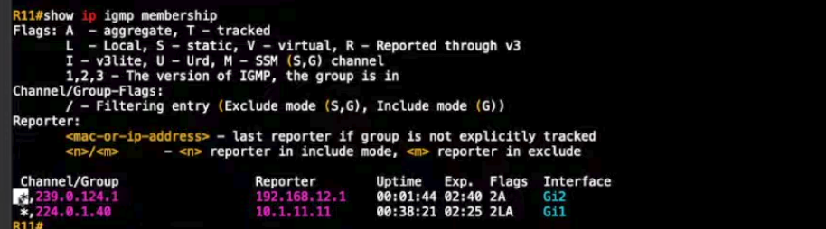

- Reporter is the device sending the IGMP report

- Viewing the multicast routing table:

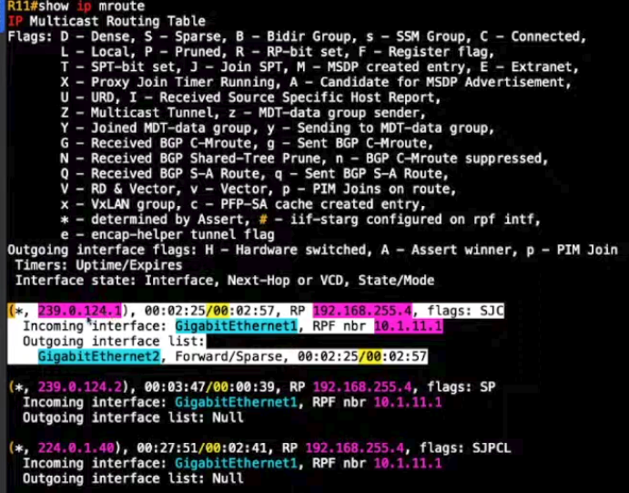

```
show ip mroute
```

- View the rpf table:

```
show ip rpf 192.168.255.4
```

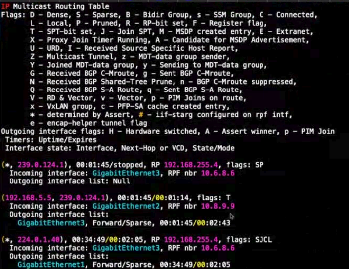

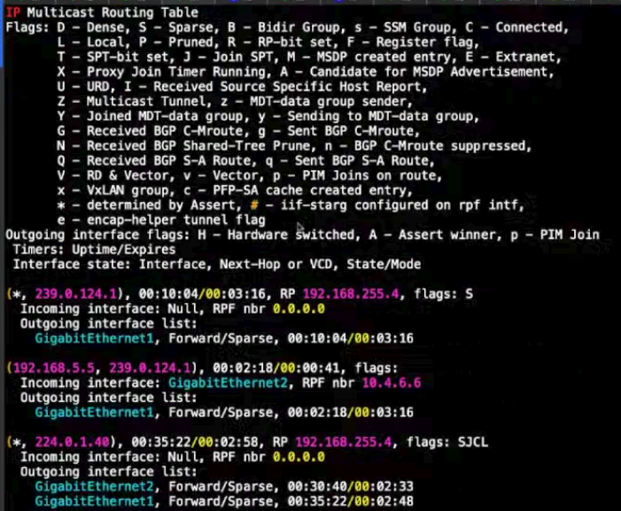

- Ping to multicast group in Cisco routers send only one packet by default

- If you need more, specify the repeat number:

```
ping 239.0.124.1
```

- The replies to pings for multicast have a more verbose form

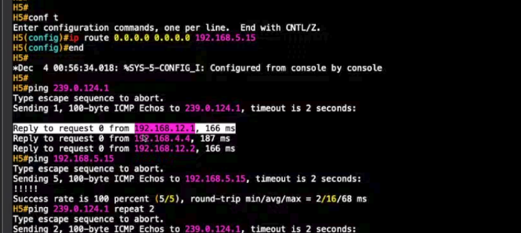

- This is because you will never source an ICMP reply from a multicast address

- The source of the reply will be the IP of the interface that is sending the ICMP replies back to the host

- Dynamically learn the RP address for all routers

- There are three ways to assign the RP:

    - Statically

    - Auto RP

    - Bootstrap Router (BSR)

- Auto RP and Bootstrap Router are dynamic methods of assigning the RP

- Auto RP is a Cisco technology

- BSR is a RFC standard

- **Configuring an Auto RP**

- First remove the statically-configured RP:

```
conf t
 no ip pim rp-address 192.168.255.4
```

- There are two commands:

```
conf t
 ip pim send-rp-announce
 ip pim send-rp-discovery
```

- There are two roles in Auto RP:

    1. The RP itself - candidate RP

    2. The RP mapping agent

- The RP mapping agent is not in the data path and it's role is to decide between the auto RP candidates, who will be the RP, then announce the RP to all routers

- Set the RP announce router (the RP candidate)

```
conf t
 ip pim send-rp-announce l0 scope 255 ?
                                     - group-list <ACL-name/nr>
                                     - interval ! RP announce interval
```

- The scope is the TTL of the RP-announce packet

- Set thw RP mapping agent:

```
conf t
 ip pim send-rp-discovery l0 scope 255 ?
                                      - interval ! RP discovery interval
```

- Things to remember here:

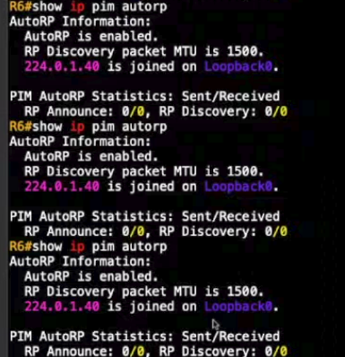

- Sparse mode is enabled, and sparse mode require an RP in order to do any source multicast

- Auto RP is not baked into PIM, BSR is baked into PIM

- Auto RP uses a specific range of multicast groups in order to advertise the mapping agent and the RP

- Auto RP needs an RP - but we are trying to use Auto RP to elect an RP

- Using Sparse mode to elect the RP with Auto RP is imposible, so for this we need to use the PIM sparse-dense-mode

- One way to solve this is to switch to sparse-dense-mode

```
conf t
 interface range g1-2,l0
  ip pim sparse-dense-mode
```

- Switching to dense mode is not an RP, because PIM DM does not use an RP

- The problem with PIM sparse-dense mode is that it will be going to fail to dense mode for any group that does not have an auto RP

- Another way to solve this problem, we can use the following command on all of the routers:

```
conf t
 ip pim auto-rp listener
```

- It will be failing to PIM dense mode only in context of an Auto RP multicast group

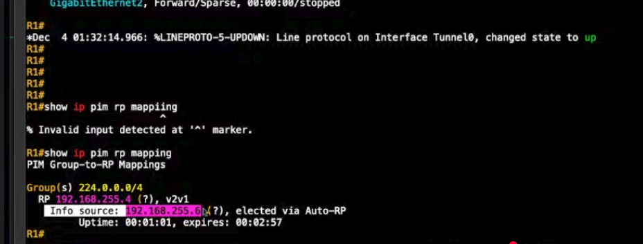

- **Configuring Bootstrap Router (BSR)**

- Take down the current config (R4 - RP):

```
conf t
 no ip send-rp-announce l0
```

- R6 - disable the RP mapping agent

```
conf t
 no ip pim send-rp-discovery l0
```

- BSR is integrated into the PIM standard

- 2 roles in BSR:

- BSR - translates to the RP agent

- RP candidate - translate to RP

- R4 - the RP:

```
conf t
 ip pim rp-candidate l0 ?
                        group-list
                        interval
                        priority - manipulates the preference of RPs
```

- R6 - BSR candidate

```
conf t
 ip pim bsr-candidate l0 <0-32> (mask)
```

- Anycast RP - ties into the RP redundancy

- In case of an link failure we will need to leave the expiration timer to go down

- For this time we still think the RP is up when it is not

- The already existing multicast groups that are bridged, will be working in this time, but new groups will not be able to form

- The best way is to take the RP convergence out of the hands of the BSR

- Phantom RP - give the best subnet mask to an RP so that other routers will prefer it

- Anycast = one to nearest

- Configure the advertisement for how many RPs we want - and advertise the same address - and advertise it into IGP

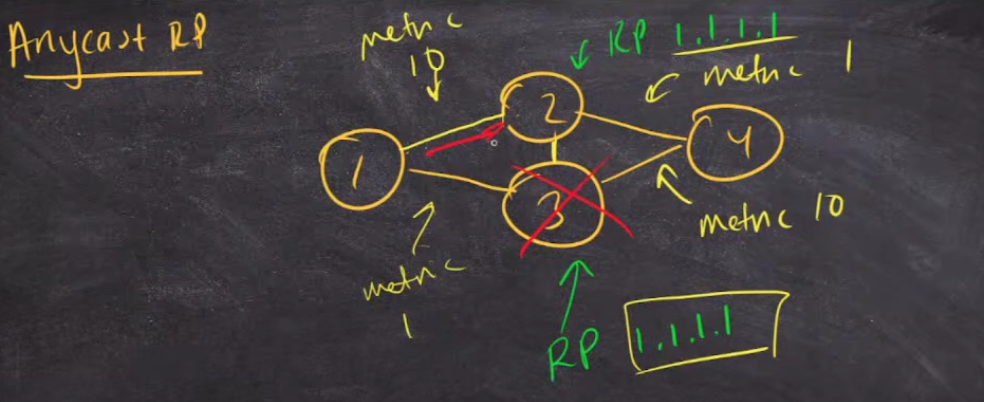

- For anycast RP we need 2 RPs

- R3 - RP candidate

- Anycast IP:

```
conf t
 interface l1
  ip address 3.4.3.4 255.255.255.255
  ip pim sparse
  exit
 router eigrp 100
  network 3.4.3.4 0.0.0.0
```

- R4 - l1

```
conf t
 int l1
  ip address 3.4.3,4 255.255.255.255
  ip pim sparse
  exit
 router eigrp 100
  network 3.4.3.4 0.0.0.0
```

- Set RP candidates - R3 and R4

```
conf t
 ip pim rp-candidate l1
```

- Now we need to coordonate these new RPs

- If we do not coordinate them we will run into a split frame issue because R3 and R4's multicast routing tables are completely independent

- We need to advertise the (S, G) entries to coordinate them

- (*, G) entries can be different

- The protocol for these is MSDP

- The MSDP = Multicast Source Discovery Protocol

- There are two main uses for MSDP:

    - list (inter domain multicast) - the RPs are split into multiple multicast domains

    - intra domain multicast (one multicast into one central administration - as we did until now)

- Configure MSDP - use l0 in our case - to separate us from the anycast RP:

- R3:

```
conf t
 ip msdp peer 192.168.255.4 connect-source l0 
```

- R4:

```
conf t
 ip msdp peer 192.168.255.3 connect-source l0
```

- MSDP takes some time to come up

- Verifying the MSDP peers:

```
show ip msdp peer
```

- Join the group on the hosts - peers (H1, H3, H6):

```
conf t
 interface g0/1
  ip igmp join-group 239.0.236.1
```

- verify the mapping:

```
show ip mroute 239.0.136.1
```

- H2 - our source:

```
ping 239.0.136.1
```

- R11 - set a debug:

```
debug ip pim
debug ip mrouting
```

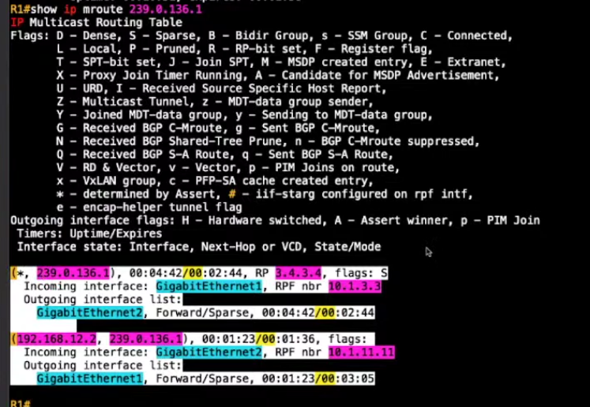

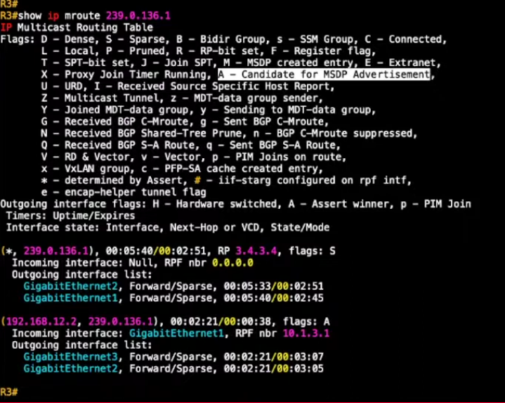 - the (S, G) entry have the "A" flag set

- (S, G) entries expire

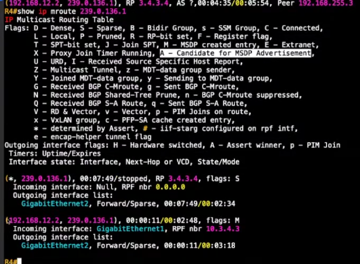

- R4 learns the (S, G) entry for the group via MSDP as advertisement from R3 - so it has the flag M on the route

- SPT switchover:

- Once we bridge the (*, G) and the (S, G) entries, we dont want to keep sending traffic on the (*, G) entry

- Once these groups are bridged together, we start the SPT switchover process

- There are two types of trees:

    - RPT - Rendez-vous point tree (the shared tree) - routed to the RP

    - SPT - Source path tree (the source tree) - routed to the source

- When the SPT and RPT are bridged together, the last hop router (the router connected to the receivers) 

- Now it knows the source of the multicast traffic tree

- Now I want to join the SPT - because the router wants the most efficient path to the traffic source

- The SPT is now routed to the FHR (first hop router)

- Now they send a PIM Join for the (S, G) group

- Now we are looking at the IGP path towards the source of the traffic

- Now they send a prune message for the group - not involved in the group anymore

- SPT threshold - how much time to wait before switching to the SPT tree

```
conf t
 ip pim spt-threshold ? 
                    0
                    infinity - never switch to the source tree
```

- Default is 0 - because it switches over to the source tree as fast as possible


