## Multicast

1. Multicast fundamentals

2. Multicast addressing

3. Internet Group Management Protocol

4. Protocol Independent Multicast

5. Rendezvous Points

- Multicast is deployed in almost any type of network. It allows a source host to send data packets to a group of destination hosts (receivers) in an efficient manner that conserves bandwidth and system resources

- The need for multicast, and the fundamental protocols that are required to understand it's operation, such as IGMP and PIM dense mode/sparse mode and rendezvous points (RPs)

### Multicast Fundamentals

- Tradditional IP communication on a network typically uses one of the following transmission methods:

    - Unicast: One to one

    - Broadcast: One to all

    - Multicast: One to many

- Multicast technology is a technology that optimizes network bandwidth utilization and conserve system resources

- It relies on Internet Group Management Protocol (IGMP) for it's operation on Layer 2 networks and Protocol Indemendent Multicast (PIM) for it's operation in Layer 3 networks

- IGMP operation between the receivers and the local multicast router and how PIM operates between routers

- These two technologies work hand-in-hand to allow multicast traffic to flow from the source to the receivers

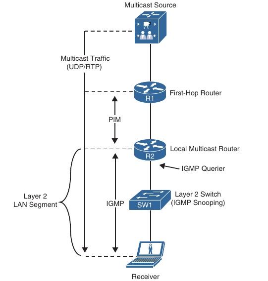

- Below is san example where six stations are watching the same video that is advertised by a server using unicast traffic (one-to-one)

- Each arrow represent a data stream of the same video going to five different hosts

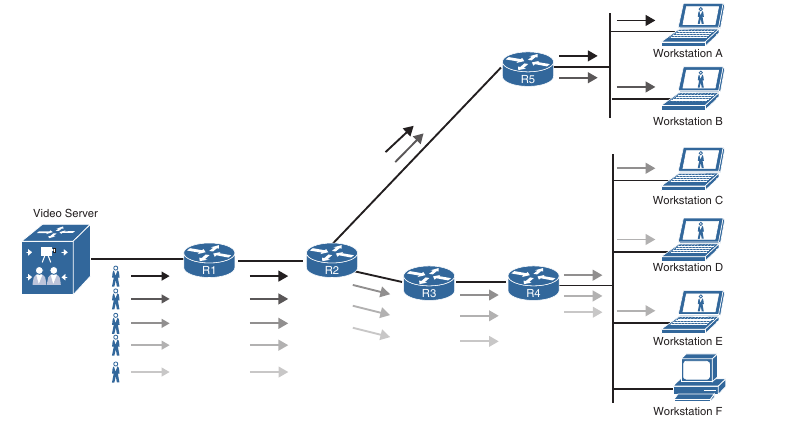

- If each stream is 10 Mbps, the network link between R1 and R2 needs 50 Mbps of bandwidth

- The network link between R2 and R4 requires 30 Mbps of bandwidth, and the link between R2 and R5 requires 20 Mbps of bandwidth

- The server must maintain session state information for all the sessions between the hosts

- The bandwidth and load on the server increase as more receivers request the same video feed

- An alternative method for all five workstations to receive the video is to send it from the server using broadcast traffic (one-to-all)

- An example of how the same video stream is transmitted using IP directed broadcasts

- The load on the server is reduced because it needs to maintain only one session state rather than many

- The same video stream consumes only 10 Mbps of bandwidth

- However this approach does have it's disadvantages:

    - IP directed broadcast functionality is disabled by default on Cisco routers, and enabling it exposes the router to distributed denial-of-service (DDOS) attacks

    - The network interface cards (NICs) of unintended workstations must still process the broadcast packets and sends them to the workstation's CPU, which wastes processor resources. In our scenario, Workstation F is processing unwanted packets

- For these reasons broadcast traffic is generally not recommended

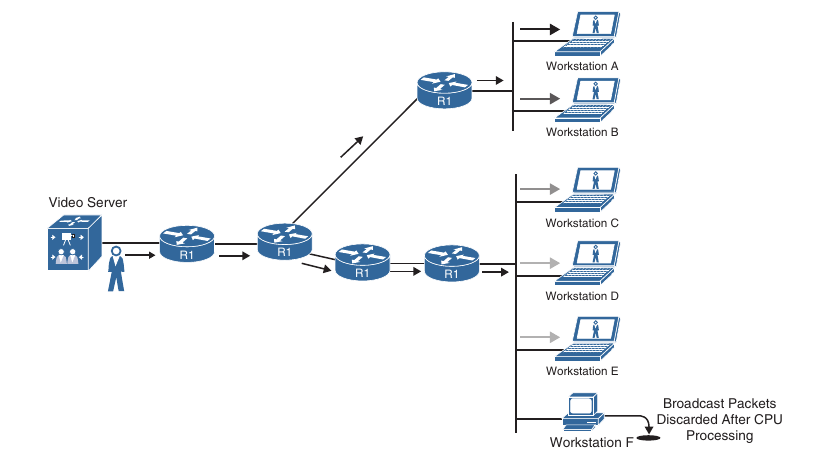

- Multicast traffic provides one-to-many communication, where only one data packet is sent on a link as needed and then is replicated between links and the data forks (splits) on a network device along the multicast distribution tree (MDT)

- The data packets are known as a stream that uses a special destination IP address, known as a group address

- A server for a stream still manages only one session, and network devices selectively request to receive the stream

- Recipient devices of a multicast stream are known as receivers

- Common applications that take advantage of multicast traffic:

    - Cisco TelePresence

    - real-time video

    - IPTV

    - Stock tickers

    - distance learning

    - video/audio conferencing

    - music on hold

    - gaming

- An example of the same video feed using multicast

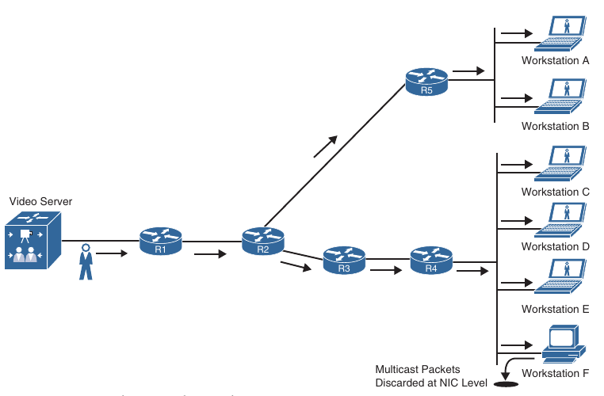

- Each of the network links consumes only 10 Mbps of bandwidth, as much as with broadcast traffic, but only receivers interested in the video stream process the multicast traffic

- Workstation F would drop the traffic at the NIC level because it would not be programmed to accept the multicast traffic

- Workstation F would not receive any multicast traffic if the switch for that network segment enabled Internet Group Management Protocol (IGMP) snooping 

### Multicast Addressing

- The Internet Assigned Numbers Authority (IANA) assigned the IP class D address space 224.0.0.0/4 for multicast addressing

- It includes addressed ranging from 224.0.0.0 to 239.255.255.255. The first 4 bits of this whole range start with 1110

- In the multicast address space, multiple blocks of addressing are reserved for specific purposes:

```
Local network control block                 224.0.0.0 - 224.0.0.255

Internetwork control block                  224.0.1.0 - 224.0.1.255

Ad hoc block I                              224.0.2.0 - 224.0.2.255

Reserved                                    224.1.0.0 - 224.1.255.255

SDP/SAP block                               224.2.0.0 - 224.2.255.255

Ad hoc block II                             224.3.0.0 - 224.4.255.255

Reserved                                    224.5.0.0 - 224.255.255.255

Reserved                                    225.0.0.0 - 231.255.255.255

Source Specific Multicast (SSM) block       232.0.0.0 - 232.255.255.255

GLOP block                                  233.0.0.0 - 233.251.255.255

Ad hoc block III                            233.252.0.0 - 233.255.255.255

Reserved                                    234.0.0.0 - 238.255.255.255

Administratively scoped block               239.0.0.0 - 239.255.255.255
```

- Out of the multicast blocks, the most important are the following:

    - **Local network control block (224.0.0.0/24)**: Addresses on the local network control block are used for protocol control traffic that is not forwarded out a broadcast domain. Examples of this type of multicast control traffic are all hosts in this subnet (224.0.0.1), all routers in this subnet (224.0.0.2), and all PIM routers (224.0.0.13)

    - **Internetwork control block (224.0.1.0/24)**: Addresses in the internetwork control block are used for protocol control traffic that may be forwarded through the Internet. Examples include Network Time Protocol (NTP) (224.0.1.1), Cisco-RP-Announce (224.0.1.39), and Cisco-RP-Discovery (224.0.1.40)

- Some of the well-known local network control block and internetwork control block multicast addresses:

```
224.0.0.0           Base address (reserved)

224.0.0.1           All hosts in this subnet (all-hosts group)

224.0.0.2           All routers in this subnet

224.0.0.5           All OSPF routers (AllSPFRouters)

224.0.0.6           All OSPF DRs (AllDRouters)

224.0.0.9           All RIPv2 routers

224.0.0.10          All EIGRP routers

224.0.0.13          All PIM routers

224.0.0.18          VRRP

224.0.0.22          IGMPv3

224.0.0.102         HSRPv2 and GLBP

224.0.1.1           NTP

224.0.1.39          Cisco-RP-Announce (Auto-RP)

224.0.1.40          Cisco-RP-Discovery (Auto-RP)
```

- **Source Specific Multicast (SSM) block (232.0.0.0/8)**: This is the default range used by SSM. SSM is a PIM extension described in RFC 4607. SSM forward traffic to receivers from only those multicast sources which the receivers have explicitly expressed interest; it is primarry targetted to one-to-many applications

- **GLOP block (233.0.0.0/8)**: Addresses in the GLOP block are globally scopped statically assigned addresses. The assignment is made for domains with a 16-bit autonomous system number (ASN) by mapping the domain's ASN, expressed in octets as X.Y, into the middle two octets of the GLOP block, yielding an an assignment of 233.X.Y.0/24. The mapping and assignment are defined in RFC 3180. Domains with 32-bit ASN may apply for space in Ad hoc block III or can consider using IPv6 multicast addresses

- **Administratively scoped block (239.0.0.0/8)**: These addresses described in RFC 2365, are limited to a local group or organization. These addresses are similar to the reserved IP unicast ranges (such as 10.0.0.0/8), described in RFC 1918 and will not be assigned by the IANA to any other group or protocol. In other words network administrators are free to use multicast addresses in this range inside of their domain, without worrying about conflicting with others elsewhere on the Internet. Even though SSM is assigned to the 232.0.0.0/8 range by default, it is typically deployed in private networks using the 239.0.0.0/8 range

#### Layer 2 Multicast Addresses

- Historically, NICs on a LAN segment could retrieve only packets destined for their burned in MAC address or the broadcast MAC address

- Using this logic can cause burden on routing resources during packet replication for LAN segments

- Another method for multicast traffic was created so that replication of multicast traffic did not require packet manipulation, and a method of using a common destination MAC address was created

- A MAC address is a unique value associated with a NIC that is used to uniquely identify the NIC on a LAN segment

- MAC addresses are 12 digits hexadecimal numbers (48 bit in length), and they are typically stored in 8-bit segments separated by hyphens(-) or colons(:)

- Examples:

    - 00-12-34-56-78-90

    - 00:12:34:56:78:90

- Every multicast group address (IP address) is mapped to a special MAC address that allows Ethenet interfaces to identify multicast packets to a specific group

- A LAN segment can have multiple streams, and a receiver knows which traffic to send to the CPU for processing based on the MAC address assigned to the multicast traffic

- The first 24 bits of a multicast MAC address always start with 01:00:5E. The low-order bit of the first byte is the individual/group bit (I/G) bit, also known as the unicast/multicast bit, it indicates that the frame is a multicast frame, and the 25th bit is always 0

- The lower 23 bits of the multicast MAC address are copied from the lower 23 bits of the multicast group IP address

- An example of mapping the multicast IP address 239.255.1.1 into multicast MAC address 01:00:5E:7F:01:01. The first 25 bits are always fixed; the last 23 bits are copied directly from the multicast IP address vary

```
                                                                239         255     1           1
IP address in binary format:                                11101111.1  1111111.00000001.00000001
MAC address in binary format:             00000001.00000000.01011110.0  1111111.00000001.00000001
                                            1 - multicast bit              7F   .  01    .   01 
                                                                    0 - always 0
```

- Out of the 9 bits from the multicast IP address that are not copied into the multicast MAC address, the high-order bits 1110 are fixed. That leaves 5 bits that are variable that are not transferred into the MAC address

- Because of this there are 32 (2^^5) multicast IP addresses that are not universally unique and could correspond to a single MAC address, in other words, they overlap

- An example of two multicast MAC addresses that overlap because they map to the same multicast MAC address:

    - MAC address 01:00:5E:7F:01:01

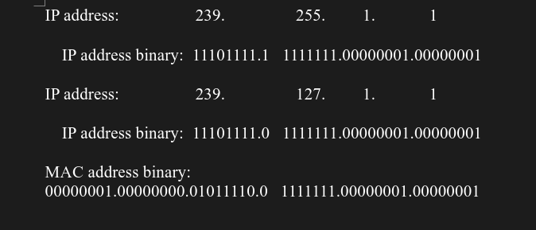

- When a receiver wants to receive a specific multicast feed, it sends an IGMP join using the multicast IP group assigned for that feed

- The receiver programs it's interface to accept the multicast MAC group address that correlates to the group address

- For example, a PC could send a join to 239.255.1.1 and would reprogram it's NIC to receive 01:00:5E:7F:01:01

- If the PC were to receive an OSPF update sent to 224.0.0.5 and it's corresponding multicast MAC address 01:00:5E:00:00:05, it would ignore it and eliminate wasted CPU cycles by avoiding the processing of undesired multicast traffic

### Internet Group Management Protocol (IGMP)

- Internet Group Management Protocol (IGMP) is the protocol that receivers use to join multicast groups and start receiving traffic from these groups

- IGMP must be supported by receivers and the router interfaces facing the receivers

- When a receiver wants to receive multicast traffic from a source, it sends an IGMP join to it's router

- If the router does not have IGMP enabled on the interface the request is ignored

- Three versions of IGMP exist. RFC 1112 defines IGMPv1 which is old and rarely used

- RFC 2236 defines IGMPv2, which is common on most multicast networks, and RFC 3376 defines IGMPv3 which is used by SSM

#### IGMPv2

- IGMPv2 uses the format show below. The message is encapsulated in an IP packet with a protocol number of 2

- Messages are sent with the IP router alert option set, which indicates that the packet should be examined more closely and a time to live (TTL) of 1

- TTL is an 8-bit field in in an IP packet header that is set by the sender of the IP packet and decremented by every router on the route to it's destination

- If the TTL reaches 0 before reaching the destination, the IP packet is discarded

- IGMP packets are sent with a TTL of one so that the packets are processed by the local router and not forwarded by any router

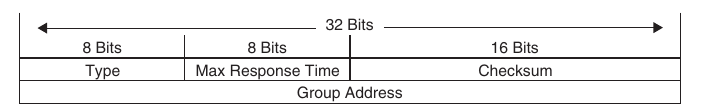

- The IGMP message format fields are defined as follows:

    - **Type**: This field describes 5 different types of IGMP messages used by routers and receivers

    - **Version 2 Membership Report**: (type value 0x16) is a message type also commonly referred to as an IGMP join; it is used by receivers to join a multicast group or to respond to a local router's membership query message

    - **Version 1 Membership Report**: (type value 0x12) is used by receivers for backward compatibility with IGMPv1

    - **Version 2 Leave Group**: (type value 0x17) is used by receivers to indicate they want to stop receiving multicast traffic for a group they joined

    - **General Membership Query**: (type value 0x11) is sent periodically to the all-hosts group address (224.0.0.1) to see wether there are any receivers in the attached subnet. It sets the group address field to 0.0.0.0

    - **Group Specific Query**: (type value 0x11) is sent in response to a leave group message to the group address the receiver requeste to leave. The group address is the destination IP address of the IP packet and the group address field

    - **Max Response Time**: This field is set only in general and group-specific membership query messages (type value 0x11); it specifies the maximum allowed time before sending a responding report in units of one-tenth of a second. In all other messages it is set to 0x00 by the sender and ignored by the receivers

    - **Checksum**: This field is the 16-bit 1s complement of the sum of the IGMP message. This is the standard checksum algorithm used by TCP/IP

    - **Group Address**: This field is set to 0.0.0.0 in general query messages and is set to the group address in group-specific messages. Membership report carry the address of the group being reported in this field; group leave messages carry the address of the group being left in this field

- When a receiver wants to receive a multicast stream, it sends an unsolicited membership report, commonly referred to as an IGMP join, to the local router for the group it wants to join

- The local router then sends this request upstream toward the source using a PIM join message

- When the local router starts receiving the multicast stream, it forwards it downstream to the subnet where the receiver that requested it resides

- IGMP join is not a valid message type in IGMP RFC specification but the therm is commonly used in the field in place of IGMP membership reports because it is easier to say and write

- The router then starts periodically sending general membership query messages to the subnet, to the all hosts group address 224.0.0.1, to see whether any members are in the attached subnet

- The general query message contains a max response time field that is set to 10 seconds by default

- In response to the query receivers set an internal random timer between 0 and 10 seconds (which can change if the max response time is using a non-default value)

- When the timer expires, receivers send membership reports for each group they belong to

- If a receiver receives another receiver's report for one of the groups it belong to while it has a timer running, it stops it's timer for the specified group and does not sent a report; this is meant to supress duplicate reports

- When a receiver wants to leave a group, if it was the last receiver to respond to a query, it sends a leave-group message to the all-routers group address 224.0.0.2. Otherwise, it can leave quietly because there must be another receiver on the subnet

- When the leave group message is received by the router, it follow with a specific membership query to the group multicast address to determine wether there are any receivers interested in the group remaining in the subnet

- If there are none, the router removes the IGMP state for that group

- If there is more than one router in a LAN segment, an IGMP querier election takes place to determine which router will be the querier

- IGMPv2 routers send general membership query messages with their interface address as the source IP address and destined to the 224.0.0.1 multicast IP address

- When an IGMPv2 router receives such as message, it checks the source IP address and compares it to it's own interface IP address

- The router with the lowest interface IP address in the LAN subnet is elected as the IGMP querier

- At this point, all the non-querier routers start a timer that resets each time they receive a membership query report from the querier router

- If the querier router stops sending membership queries for some reason (for instance it is powered down), a new querier election takes place

- A non-querier router waits twice the query interval, which is by default 60 seconds, and if it has heard no queries from the IGMP querier, it triggers IGMP querier election

#### IGMPv3

- In IGMPv2 when a receiver sends a membership report to join a multicast group, it does not specify which source it would like to receive multicast traffic from

- IGMPv3 is an extension of IGPMv2 that adds support for multicast source filtering, which gives the receivers the capability to pick the source they wish to accept multicast traffic from

- IGMPv3 is designed to coexist with IGMPv1 and IGMPv2

- IGMPv3 supports all IGMPv2's IGMP message types and is backward compatible with IGMPv2

- The difference between the two are that IGMPv3 added new fields to the IGMP memberhip query and introduced a new IGMP message type called Version 3 membership report to support source filtering

- IGMPv3 supports applications that explicitly signal sources from which they want to receive traffic

- With IGMPv3, receivers signal membership to a multicast group address using a membership report in the following two modes

    - **Include Mode**: In this mode the receiver announces membership to a multicast group address and provides a list of source addresses (the include list) from which it wants to receive traffic

    - **Exclude Mode**: In this mode, the receiver announces membership to a multicast group address and provides a list of source addresses (the exclude list) from which it does not want to receive traffic. The receiver then receives traffic only from sources whose IP addresses are not listed in the exclude list. To receive traffic from all sources, which is the behaviour of IGMPv2, a receiver use exclude mode membership with an empty exclude list

- IGMPv3 is used to provide source filtering for Source Specific Multicast (SSM)

#### IGMP Snooping

- To optimize forwarding and minimize flooding, switches need a method of sending traffic only to interested receivers

- In the case of unicast traffic, Cisco switches learn about Layer 2 MAC addresses and what ports they belong to by inspecting the Layer 2 MAC address source; they store this information in the MAC address table

- If they receive a Layer 2 frame with a destination MAC address that is not in this table, they treat it as an unknown frame and flood it out all the ports within the same VLAN except the interface the frame was received on

- Uninterested workstations will notice that the destination MAC address in the frame is not theirs and will discard the packet

- SW1 starts with an empty MAC address table

- When workstation A sends a frame, it stores it's source MAC address and interface in the MAC address table and floods the frame it receives out all ports (except the port it receives the frame on)

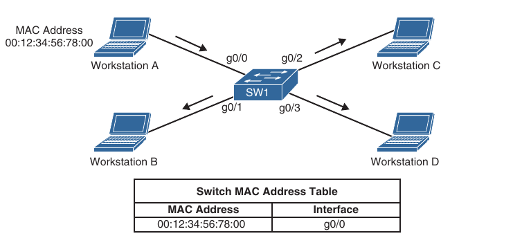

- If any other workstation sends a frame destined to the MAC address of Workstation A, the frame is not flooded anymore because it's already in the MAC address table, and it is sent only to workstation A

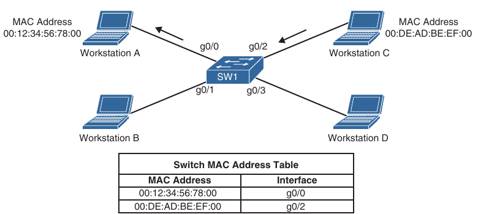

- In the case of multicast traffic, a multicast MAC address is never used as a source MAC address

- Switches treat multicast MAC addresses as unknown frames and flood them out all ports; all workstations then process these frames

- It is then up to the workstations to select interested frames for processing and select the frames that should be discarded

- The flooding of multicast traffic on a switch wastes bandwidth utilization on each LAN segment

- Cisco switches use two methods to reduce multicast flooding on a LAN segment

    - IGMP snooping

    - Static MAC address entries

- IGMP snooping, defined in RFC 4541, is the most widely used method and works by examining IGMP joins 

- When the switch receives a multicast frame destined for a multicast group, it forwards the packets only out of the ports where IGMP joins were received for that specific multicast group

- Workstation A and workstation C sending IGMP joins to 239.255.1.1, which translates to the multicast MAC address 01:00:5E:7F:01:01

- Switch 1 has IGMP snooping enabled and populates the MAC address table with this information

- Even with IGMP snooping enabled, some multicast group are still flooded on all ports (for example 224.0.0.0/24 reserved addresses)

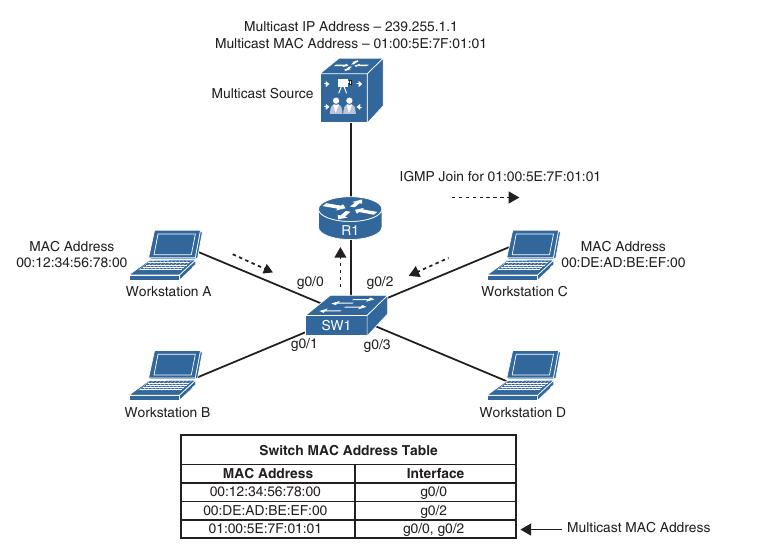

- Above picture illustrates the source sending traffic to 239.255.1.1(01:00:5E:7F:01:01) 

- Switch 1 receives this traffic, and it forwards it out only on g0/0 and g0/2 interfaces because these are the only ports that received IGMP joins for that group

- A multicast static entry can also be manually programmed into the MAC address table, but this is not a scalable solution because it cannot react dynamically to changes; for this reason, it is not a recommended approach

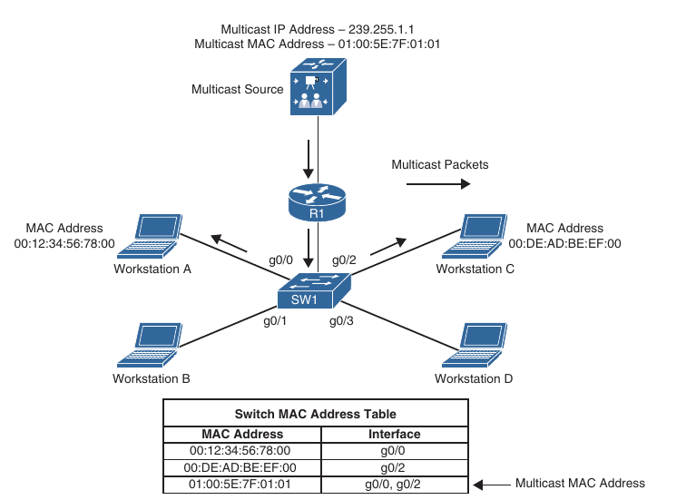

### Protocol Independent Multicast

- Receivers use IGMP to join a multicast group, which is sufficient if the group's source connects to the same router to which the receiver is attached

- A multicast routing protocol is necessary to route the multicast traffic throughout the network so that routers can locate and request multicast streams from other routers

- Multiple multicast routing protocols exist but Cisco fully supports only Protocol Independent Multicast (PIM)

- PIM is a multicast routing protocol that routes multicast traffic between network segments

- PIM can use any of the unicast routing protocols to identify the path between the source and receivers

#### PIM Distribution Trees

- Multicast routers create distribution trees that define the path that IP multicast traffic follows throughout the network to reach the receivers

- The two basic types of multicast distribution trees are source trees, also known as shortest path trees (SPTs), and shared trees

##### Source Trees

- A source tree is a multicast distribution tree where the source is the root of the tree, and branches form a distribution tree throughout the network all the way down to the receivers

- When this tree is built it uses the shortest path throughout the network from the source to the leaves of the tree; for this reason it is also referred to as a shortest path tree (SPT)

- The forwarding state of the SPT is known by the notation (S,G), pronounced "S comma G", where S is the source of the multicast stream (server), and G is the multicast group address

- Using this notation, the SPT state for the below topology is (10.1.1.2,239.1.1.1), where the multicast source S is 10.1.1.2, and the multicast group G is 239.1.1.1, joined by Receivers A and B

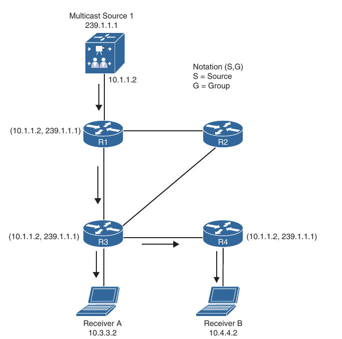

- Because every SPT is routed at the source S, every source sending to a multicast group requires an SPT

##### Shared Trees

- A shared tree is a multicast distribution tree where the root of the shared tree is not the source but a router designated as the rendezvous point (RP)

- For this reason shared trees are also referred to as RP trees (RPTs)

- Multicast traffic is forwarded down the shared tree according to the group address G that the packets are addressed to, regardless of the source address

- For this reason, the forwarding state of the shared tree is referred by the notation (*,G), pronounced "star comma G"

- A shared tree where R2 is the RP and the (*,G) is (*,239.1.1.1)

- In any-source multicast (ASM), the (S,G) state requires a parent (*,G) 

- For this reason in the topology below R1 and R2 are having (*,G) state

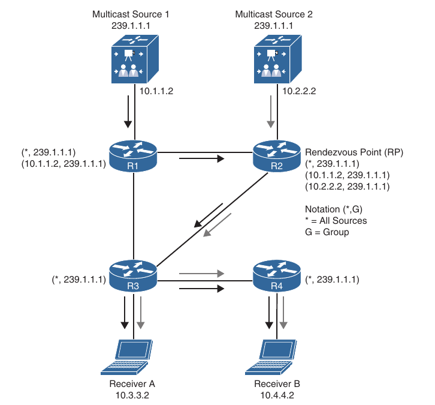

- One of the benefits of shared trees over source trees is that they require fewer multicast entries (for example S,G and *,G)

- For instance as more sources are introduced into the network, sending traffic to the same multicast group, the number of multicast entries for R3 and R4 will always remain the same (*,239.1.1.1)

- The major drawback of the shared trees is that the receivers receive traffic from all the sources sending traffic to the same multicast group

- Even though the receiver's applications can filter out unwanted traffic, this situation still generates a lot of unwanted network traffic wasting bandwidth

- In addition, because shared trees can allow multiple sources in an IP multicast group, there is a potential network security issue because unintended sources could send unwanted packets to receivers

#### PIM Terminology

- A reference topology for some multicast routing terminology


- The common PIM terminology illustrated above:

    - **Reverse Path Forwarding (RPF) interface**: The interface with the lowest-cost path based on Administrative Distance (AD) and metric to the IP address of the source (SPT) or the RP, in case of shared trees. If multiple interfaces have the same cost, the interface with the highest IP address is chosen as the tie breaker. An example of this interface is Te1/0/2 on R5 because it is the shortest path to the source. Another example is Te1/1/1 on R7 because the shortest path to the source was determined to be through R4

    - **RPF neighbor**: The PIM neighbor on the RPF interface. If R7 is using the RPT shared three, the RPF neighbor would be R3, which is the lowest cost path to the RP. If it is using the SPT, R4 would be it's RPF neighbor because it offers the lowest cost to the source

    - **Upstream**: Toward the source of the tree, which could be the actual source in source-based trees or the RP in shared trees. A PIM join travel upstream towards the source

    - **Upstream Interface**: The interface toward the source of the tree. It is also known as the RPF interface or the incoming interface (IIF). An example of an upstream interface is R5's Te0/1/2 interface, which can send PIM joins upstream to it's RPF neighbor

    - **Downstream**: Away from the source of the tree and towards the receivers

    - **Downstream Interface**: Any interface that is used to forward multicast traffic down the tree, also known as an outgoing interface (OIF). An example of a downstream interface is R1's Te0/0/0 interface, which forwards multicast traffic to R3's Te0/0/1 interface

    - **Incoming Interface (IIF)**: The only type of interface that can accept multicast traffic coming from the source, which is the same as the RPF interface. An example of this type of interface is Te0/0/1 interface on R3 because the shortest path to the source is known through this interface

    - **Outgoing Interface (OIF)**: Any interface that is used to forward multicast traffic down the tree, also known as the ownsttream interface

    - **Outgoing Inteface List (OIL)**: A group of OIFs that are forwarding multicast traffic to the same group. An example of this is R1's Te0/0/0 and Te0/0/1 interfaces sending multicast traffic downstream to R3 and R4 for the same multicast group

    - **Last-hop Router (LHR)**: A router that is directly attached to the receivers, also known as a leaf router. It is responsible for sending PIM joins upstream toward the RP or to the source

    - **First-hop Router (FHR)**: A router that is directly attached to the source, also known as a root router. It is responsible for sending register messages to the RP

    - **Multicast Routing Information Base (MRIB)**: A topology table that is also known as the multicast route table (mroute), which derives from the unicast route table and PIM. MRIB contains the source S, group G, incoming interface (IIF), outgoing interfaces (OIFs), and RPF neighbor information for each multicast route as well as other multicast related information

    - **Multicast Forwarding Information Base (MFIB)**: A forwarding table that uses the MRIB to program multicast forwarding information in hardware for faster forwarding

    - **Multicast State**: The multicast traffic forwarding state that is used by a router to forward multicast traffic. The multicast state is composed of the entries found in the mroute table(S, G, IIF, OIF and so on)

- There are currently 5 PIM operating modes:

    - PIM Dense Mode (PIM-DM)

    - PIM Sparse Mode (PIM-SM)

    - PIM Sparse Dense Mode

    - PIM Source Specific Multicast (PIM-SSM)

    - PIM Bidirectional Mode (Bidir-PIM)

- PIM DM and PIM SM are also commonly referred to as Any Source Multicast (ASM)

- All PIM Control Messages use the IP protocol number 103; they are either unicast (that is register and register stop messages) or multicast with a TTL of 1, to the all PIM routers address 224.0.0.13

- List of PIM control messages:

```
Type    Message Type                    Destination                     PIM Protocol

0       Hello                           224.0.0.13(All PIM routers)     PIM-SM, PIM-DM, Bidir-PIM and PIM-SSM

1       Register                        RP address(unicast)             PIM-SM

2       Register-stop                   First-hop router (unicast)      PIM-SM

3       Join/prune                      224.0.0.13 (All PIM routers)    PIM-SM, Bidir-PIM and PIM-SSM

4       Bootstrap                       224.0.0.13 (All PIM routers)    PIM-SM and Bidir-PIM

5       Assert                          224.0.0.13 (All PIM routers)    PIM-SM, PIM-DM and Bidir-Pim

8       Candidate RP advertisement      Bootstrap router (BSR)          PIM-SM and Bidir-PIM
                                        address (unicast to BSR)

9       State refresh                   224.0.0.13 (All PIM routers)    PIM-DM

10      DF election                     224.0.0.13 (All PIM routers)    Bidir-PIM
```

- PIM hello messages are sent by default every 30 seconds out each PIM enabled interface to learn about the neighboring PIM routers on each interface to all PIM routers address

- Hello messages are also a mechanism used to elect a designated router (DR) and negotiate additional capabilities

- All PIM routers must record the hello information received from each PIM neighbor

#### PIM Dense Mode

- PIM routers can be configured for PIM dense mode (PIM-DM) when it is safe to assume that the receivers of a multicast group are located on every subnet within the network - in other words, when the multicast group is densely populated across the network

- For PIM-DM the multicast tree is built by flooding traffic out every interface from the source to every Dense-Mode router in the network

- The tree is grown from the root towards the leaves

- As each router receives traffic for the multicast group, it must decide whether it already has active receivers wanting to receive the multicast traffic

- If so, the router remains quiet and lets the multicast flow continue

- If no receivers have requested the multicast stream on the multicast group on the LHR, the router sends a prune message towards the source

- That branch of the tree is then pruned off so that the unnecessary traffic does not continue

- The resulting tree is a source tree because it is unique from the source to the receivers

- The flood and prune operations of dense mode. The multicast traffic from the source is flooding throughout the entire network

- As each router receives the multicast traffic from it's upstream neighbor via it's RPF interface, it forwards the multicast traffic to all it's PIM-DM neighbors

- This results in some traffic arriving via a non-RPF interface, as in the case of R3 receiving traffic from R2 on it's non-RPF interface

- Packets arriving via non-RPF interface are discarded

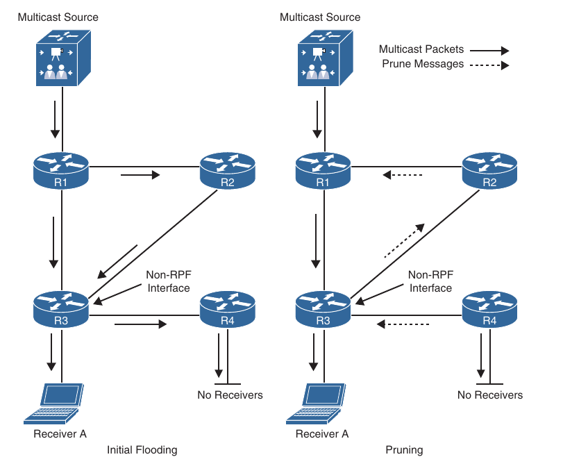

- These non-RPF multicast flows are normal for the initial flooding of multicast traffic and are corrected by the normal PIM-DM flooding mechanism

- The pruning mechanism is used to stop the flow of unwanted traffic

- Prunes (denoted by dashed arrows) are sent out the RPF interface when the router has no downstream members that need the multicast traffic, as is the case for R4, which has no interested receivers and they are also sent out non-RPF interfaces to stop the flow of multicast traffic that is arriving throughout a non-RPF interface from R2, which results in a prune message

- The resulting topology after all unnecessary links have been pruned off

- This result in an SPT from the source to the receiver

- Even though the flow of multicast traffic is no longer reaching most of the routers in the network, the (S,G) state still remains in all routers in the network. This (S,G) state remains until the source stops transmitting

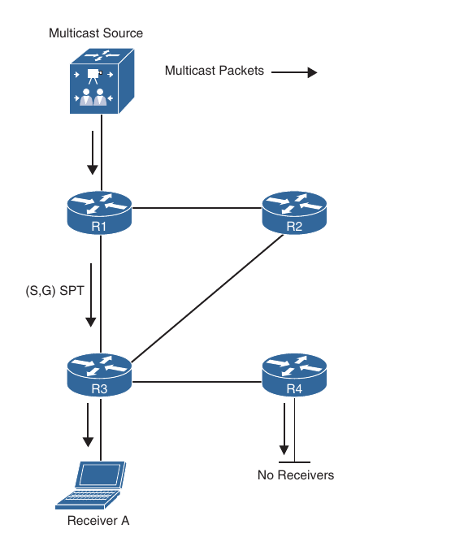

- In PIM-DM prunes expire every 3 minutes. This causes the multicast traffic to be reflooded to all routers just as was done during initial flooding

- This periodic (every 3 minutes) flood and prune behaviour is normal and must be taken into account when a network is designed to use PIM-DM

- PIM-DM is applicable to small networks where there are active receivers on every subnet of the network

- Because this is rarely the case, PIM-DM is not generally recomended for production environments; however, it can be useful for a lab environment because it is easy to set up

#### PIM Sparse Mode

- PIM Sparse Mode (PIM-SM) was designed for networks with multicast application receivers scaterred throughout the network - in other words when the multicast group is sparsely populated across the network

- However, PIM-SM also works well in densely populated networks

- It also assumes that no receivers are interested in multicast traffic unless they explicitly request it

- Just like PIM-DM, PIM-SM uses the unicast routing table to perform RPF checks, and it does not care which routing protocol (including static routes) populates the unicast routing table, therefore it is protocol independent

##### PIM Shared and Source Path Trees

- PIM-SM uses a explicit join model where receivers sent an IGMP join to their locally connected router which is also known as the last-hop router (LHR), and this join causes the LHR to sent a PIM join in the direction of the root of the tree, which is either the RP in the case of a shared tree (RPT) or the first-hop router (FHR) where the source transmitting the multicast streams is connected in the case of an SPT

- A multicast forwarding state is created as the result of these explicit joins; it is very different from the flood and prune or implicit flood behaviour of PIM-DM, where the multicast packet arriving on the router dictates the forwarding state

- A multicast source sending traffic to the FHR. The FHR then sends this multicast traffic to the RP, which takes the multicast source known to the RP

- It also illustrates a receiver sending an IGMP join to the LHR to join the multicast group

- The LHR then sends a PIM join (*,G) to the RP and this forms a shared tree from the RP to the LHR

- The RP then sends a PIM join (S,G) to the FHR, forming a source tree between the source and the RP

- In essence, two trees are created: an SPT from the FHR to the RP (S,G) and a shared tree from the RP to the LHR (*,G)

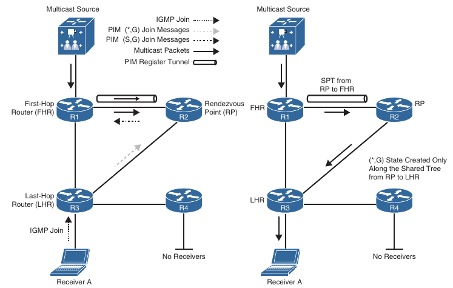

- At this point multicast starts flowing down from the source to the RP and ans from the RP to the LHR and then finally to the receiver

- This is an oversimplified view of how PIM-SM achieves multicast forwarding

##### Shared Tree Join

- Receiver A attached to the LHR joining multicast group G. The LHR knows the IP address of the RP for group G, and then it sends a (*,G) PIM join for this group to the RP

- If the RP were not directly connected, this (*,G) PIM join would travel hop-by-hop to the RP building a branch of the shared tree that would extend from the RP to the LHR

- At this point, group G multicast traffic arriving at the RP can flow down the shared tree to the receiver

##### Source Registration

- As soon as a source for a group G sends a packet, the FHR that is attached to this source is responsible for registering this source with the RP and requesting the RP to build a tree back to that router

- The FHR encapsulates the multicast data from the source in a special PIM-SM message called the register message and unicasts that data to the RP using a unidirectional PIM tunnel

- When the RP receives the register message, it decapsulates the multicast data packet, inside the register message, and if there is no active shared tree because there are no interested receivers, the RP sends a register stop message directly to the registering FHR, without traversing the PIM tunnel, instructing it to stop sending the register messages

- If there is an active shared tree for the group, it forwards the multicast packet down the shared tree and it sends an (S,G) join back the source network S to create a (S,G) SPT

- If there are multiple hops (routers), between the RP and the source, this results in an (S,G) state being created in all the routers along the SPT, including the RP

- There will also be a (*,G) in R1 and all of the routers between the FHR and the RP

- As soon as the SPT is built from the source router to the RP, multicast traffic begins to flow natively from the source S to the RP

- Once the RP begins receiving data natively (that is, down the SPT), from source S it sends a register stop message to the source's FHR to inform it that it can stop sending the unicast register messages

- At this point, multicast traffic from the source is flowing down the SPT to the RP, and from there down the SPT to the RP and, from there down the shared tree (SPT) to the receiver

- The PIM register tunnel from the FHR to the RP remains in an active up/up state even when there are no active multicast streams, and it remains active as long as there is a valid RPF path for the RP

##### PIM SPT Switchover

- PIM-SM allows the LHR to switch from the shared tree to a SPT for a specific source 

- In Cisco routers this is the default behavior, and it happens immediately after the first multicast packet is received from the RP via the shared tree, even if the shortest path to the source is through the RP

- When the LHR receives the first multicast packet from the RP it becomes aware of the IP address of the multicast source

- At this point the LHR checks it's unicast routing table to see which is the shortest path to the source, and it sends a (S,G) PIM join hop-by-hop to the FHR to form an SPT

- Once it receives a multicast packet from the FHR through the SPT, if necessary, it switches the RPF interface to be the one in the direction to the SPT to the FHR, and then it sends a PIM prune message to the RP to shut off the duplicate multicast traffic coming from it through the shared tree

- The shortest path to the source is between R1 and R3; if that link were shut down or not present, the shortest path would be through the RP, in which case a SPT switchover would still take place

- The PIM SPT switchover mechanism can be disabled for all group or for specific groups

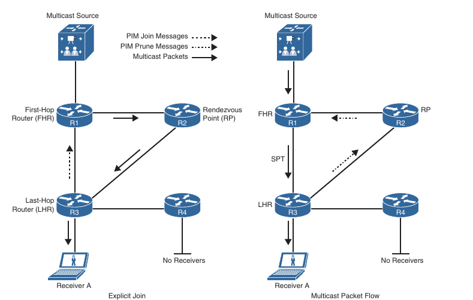

- If the RP has no other interfaces that are interested in the multicast traffic, it sends a PIM prune message in the direction of the FHR

- If there are any routers between the RP and the FHR, this prune message would travel hop-by-hop until it reaches the FHR

##### Designated Routers

- When multiple PIM-SM routers exist on a LAN segment, PIM hello messages are used to elect a designated router (DR) and avoid sending duplicate multicast traffic into the LAN or the RP

- By default, the DR priority value of all PIM routers is 1, and it can be changed to force a particular router to become the DR during the DR election process, where a higher DR priority is preferred

- If a router does not support the DR priority option or if all routers have the same DR priority, the highest IP address on the subnet is used as a tiebreaker

- On an FHR, the designated router is responsible for encapsulating in unicast register messages any multicast packets originated by a source that are destined to the RP

- On an LHR, the designated router is responsible for sending PIM join and prune messages toward the RP and inform it about host group membership, and it is also responsible for performing a PIM STP switchover

- Without DRs, all LHRs on the same LAN segment would be capable of sending PIM joins upstream, which could result in duplicate multicast traffic arriving on the LAN

- On the source side, if multiple FHRs exist on the same LAN, they all send register messages to the RP at the same time

- The default DR hold time is 3.5 times the hello interval, or 105 seconds by default

- If there are no hellos after this interval, a new DR is elected

- To reduce DR failover time, the hello query interval can be reduced to speed up failover with a tradeoff of more control plane traffic and CPU resource utilization on the router

#### Reverse Path Forwarding

- Reverse Path Forwarding (RPF) is an algorithm used to prevent loops and ensure that multicast is arriving on the correct interface

- RPF functions as follows:

    - If a router receives an multicast packet on an interface it uses to send multicast packets to the source, the packet has arrived at the RPF interface

    - If a packet arrives on the RPF interface, a router forwards the packet out the interface present in the outgoing interface list (OIL) of a multicast routing table entry

    - If the packet does not arrive on the RPF interface, the packet is discarded to prevent loops

- PIM uses multicast source trees between the source an the LHR and between the source and the RP

- It also uses multicast shared trees between the RP and the LHRs

- The RPF check is performed differently for each, as follows:

    - If a PIM router has an (S,G) entry present in the multicast routing table (an SPT state), the router performs the RPF check against the IP address of the source for the multicast packet

    - If a PIM router has no explicit source-tree state, this is considered a shared-tree state

    - The router performs the RPF check on the address of the RP, which is known when members join the group

- PIM-SM uses the RPF lookup function to determine where it needs to send joins and prunes

- (S,G) joins (which are SPT states) are sent toward the source 

- (*,G) joins (which are shared tree states) are sent toward the RP

- Topology from the left, a failed RPF check on R3 for the (S,G) entry, because the packet is arriving via a non-RPF interface

- The topology on the right shows the multicast traffic arriving on the correct interface on R3, it is then forwarded out the OIFs

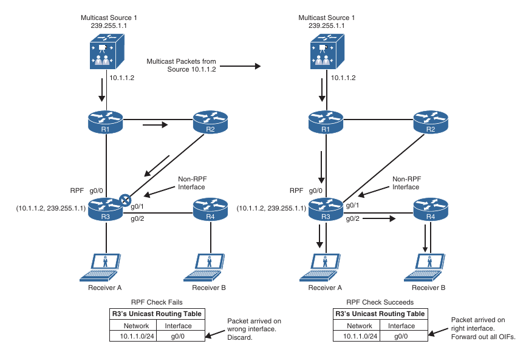

#### PIM Forwarder

- There are certain scenarios in which duplicate multicast packets could flow into a multi-access network

- The PIM assert mechanism stops these dupicate flows

- In the below topology, R2 and R3 both are receiving the same (S,G) traffic via their RPF interfaces and forwarding the packets on to the same LAN segment

- R2 and R3 therefore receive an (S,G) packet via their downstream OIF that is in the OIF of their (S,G) entry

- In other words, they detect multicast traffic for a specific (S,G) coming into their OIF that is also going out the same OIF for the same (S,G) 

- This triggers the assert mechanism

- R2 and R3 both send PIM assert messages into the LAN

- The assert messages sent their administrative distance (AD) and the route metric back to the source to determine which router should forward the multicast traffic to that network segment

- Each router compares it's own values with the received values

- Preference is given to the PIM message with the lowest AD to the source

- If a tie exists, the lowest route metric for the protocol wins; and as a final tie breaker, the highest IP address is used

- The losing router prunes it's interface just as if it had received a prune on this interface, and the wining router is the PIM forwarder for the LAN

- The prune times out after 3 minutes on the losing router and causes it to begin forwarding on the interface again

- This triggers the assert process to repeat

- If the wining router were to go offline, the loser would take over the job of forwarding on to this LAN segment after it's prune timed out

- The PIM forwarder concept applies to PIM-DM and PIM-SM

- It is commonly used by PIM-DM but rarely used by PIM-SM because the only time duplicate packets can end up in a LAN is if there is some sort of routing inconsistency

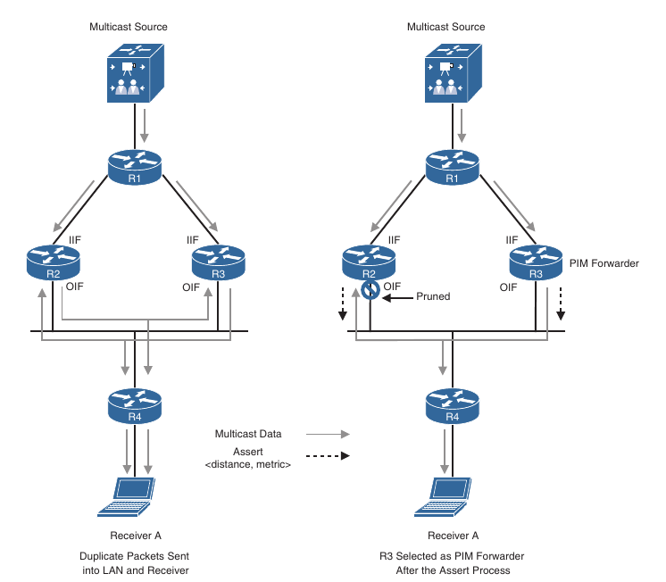

- With the above topology, PIM-SM will not send duplicate flows into the LAN as PIM-DM would because of the way PIM-SM operates

- For example, assuming that R1 is the RP, when R4 sends a PIM join message upstream toward it, it sends it to all PIM routers address 224.0.0.13 and R2 and R3 receive it

- One of the fields of the PIM join messages includes the IP address of the upstream neighbor, also known as the RPF neighbor

- Assuming that R3 is the RPF neighbor, R3 is the only one that will send a PIM join to R1

- R2 will not because the PIM join was not meant for it

- At this point a shared tree exists between R1, R3 and R4 and no traffic dupplication exists

- The below scheme shows how duplicate flows could exist in a LAN using PIM-SM

- On the topology on the left side, R2 and R4 are running the OSPF protocol, and R3 and R4 are running EIGRP

- R4 learns about the RP (R1) through R2, and R5 learns about the RP through R3

- R4's RPF neighbor is R2 and R5's RPF neighbor is R3

- Assuming that receiver A and receiver B join the same group, R4 would send a PIM join to it's upstream neighbor R2, which would in turn send a PIM join to R1

- R5 would send a PIM join to it's upstream neighbor R3, which would send a PIM join to R1

- At this point traffic starts flowing downstream from R1 into R2 and R3 and duplicate packets are sent out into the lan and to the receivers

- At this point the PIM assert mechanism kicks in, R3 is elected as PIM forwarder and and R2's OIF interface is pruned

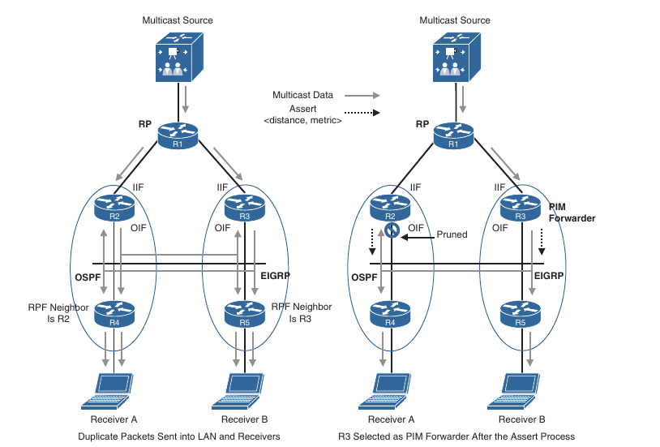

### Rendezvous Points

- In PIM-SM it is mandatory to choose one or more routers to operate as rendezvous points (RPs)

- An RP is a single common root placed at a chosen point of a shared distribution tree

- An RP can be either configured statically on each router or learned through a dynamic mechanism

- A PIM router can be configured to function as an RP either statically in each router in the multicast domain or dynamically by configuring Auto-RP or a PIM bootstrap router (BSR)

- BSR and Auto-RP were not designed to work together and may introduce unnecessary complexities when deployed on the same network

- The recommendation is not to use them concurrentely

#### Static RP

- It is possible to statically configure RP for a multicast group range by configuring the address of the RP on every router in the multicast domain

- Configuring static RPs is relatively simple and can be achieved with one or two lines of configuration on each router

- If the network does not have many different RPs defined or if the RPs does not change very often, this could be the simplest method for defining RPs

- It can also be an attractive option if the network is small

- However, static configuration can increase the administrative overhead in a large and complex network

- Every router must have the same RP address

- This means changing the RP address requires reconfiguring every router

- If several RPs are active for different groups, information about which RP is handling which multicast group must be known by all routers

- To ensure this information is complete, multiple configuration commands may be required

- If a manually configured RP fails, there is no failover procedure for another router to take over the function performed by the failed RP, and this method by itself does not provide any kind of load-splitting

#### Auto-RP

- Auto-RP is a Cisco proprietary mechanism that automates the distribution of group-to-RP mapping on a PIM network

- Auto-RP has the following benefits:

    - It is easy to use multiple RPs within a network to serve different group ranges

    - It allows load-splitting between different RPs

    - It simplifies RP placement according to the locations of group participants

    - It prevents inconsistent manual static RP configurations that might cause connectivity problems

    - Multiple RPs can be used to serve different group ranges or to serve as backups for each-other

    - The Auto-RP mechanism operates using two basic components, candidate RPs (C-RPs) and RP mapping agents (MAs)

##### Candidate RPs

- A C-RP advertises it's wilingness to be an RP via RP announcement messages

- These messages are sent by default every RP announce interval, which is 60 seconds by default, to the reserved well-known multicast group 224.0.1.39 (Cisco-RP-Announce)

- The RP announcement contain the default group range 224.0.0.0/4, the C-RPs address and the hold time which is three times the RP announce interval 

- If there are multiple C-RPs, the C-RP with the highest IP address is preferred

##### RP Mapping Agents

- RP MAs join group 224.0.1.39 to receive RP announcements

- They store the information contained in the announcements in a group-to-RP mapping cache along with hold times

- If multiple RPs advertise the same group range, the C-RP with the highest IP address is elected

- The RP MAs advertise the RP mappings to another well-known multicast group address, 224.0.1.40 (Cisco-RP-Discovery)

- These messages are advertised by default every 60 seconds or when changes are detected

- The MA announcements contain the elected RPs and the group-to-RP mappings

- All PIM-enabled routers join 224.0.1.40 and store the RP mappings in their private cache

- Multiple RP MAs can be configured on the same network to provide redundancy in case of failure

- There is no election mechanism between them, and they act independently of each other; they all advertise identical group-to-RP mapping information to all routers in the PIM domain

- On the below topology shows the Auto-RP mechanism where MA periodically receives the C-RP Cisco RP announcements to build a group-to-RP mapping cache and then periodically multicasts the information to all PIM routers in the network using Cisco RP discovery messages

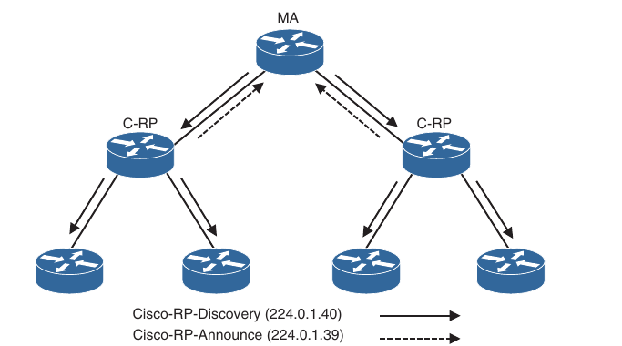

- With Auto-RP, all routers automatically learn RP information, which makes it easier to administer and update RP information

- Auto-RP permits backup RPs to be configured, thus enabling an RP failover mechanism

#### PIM Bootstrap Router

- The bootstrap router (BSR), described in RFC 5059, is a non-proprietary mechanism that provides a fault-tolerant, automated RP discovery and distribution mechanism

- PIM uses the BSR to discover and announce RP set information for each group prefix to all the routers in a PIM domain

- This is the same function accomplished by the Auto-RP, but the BSR is part of the PIM version 2 specification

- The RP set is a group-to-RP mapping that contains the following components:

    - Multicast group range

    - RP priority

    - RP address

    - Hash mask length

    - SM/Bidir flag

- Generally, BSR messages originate on the BSR, and they are flooded hop-by-hop by intermediate routers

- When a bootstrap message is forwarded, it is forwarded out of every PIM-enabled interface that has PIM neighbors (including the one over which the message was received)

- BSR messages use the all-PIM routers address 224.0.0.13 with a TTL of 1

- To avoid a single point of failure, multiple candidate BSRs (C-BSRs) can be deployed in a PIM domain

- All C-BSRs participate in the BSR election process by sending PIM BSR messages containing their BSR priority out all interfaces

- The C-BSR with the highest priority is elected as the BSR and sends BSR messages to all PIM routers in the PIM domain

- If the BSR priorities are equal or if the BSR priority is not configured, the C-BSR with the highest IP address is elected as the BSR

##### Candidate RPs

- A router that is configured as a candidate RP (C-RP) receives the BSR messages, which contains the IP address of the currently active BSR

- Because it knows the IP address of the BSR, it can unicast candidate RP advertisement directly to it (C-RP-Adv) messages directly to it

- A C-RP-Adv message carries a list of group address and group mask field pairs

- This enables a C-RP to specify the group ranges for which it is willing to be the RP

- The active BSR stores all incoming C-RP advertisements in it's group-to-RP mapping cache

- The BSR then sends the entire list of C-RPs from it's group-to-RP mapping cache in BSR messages every 60 seconds by default to all PIM routers in the entire network

- As the routers receive copies of these BSR messages, they update the information in their local group-to-RP mapping caches, and these allows them to have full visibility into IP addresses of all C-RPs in the network

- Unlike with Auto-RP where the mapping agent elects the active RP for a group range and announces the election results to the network, the BSR does not elect the active RP for a group

- Instead it leaves this task to each invididual router in the network

- Each router in the network uses a well-known hashing algorithm to elect the currently active RP for a particular group range

- Because each router is running the same algorithm against the same list of C-RPs, they will all select the same RP for a particular group range

- C-RPs with a lower priority are preferred. If the priorities are the same, the C-RP with the highest IP address is elected as the RP for a particular group range

- Below is illustrated the BSR mechanism, where the elected BSR receives candidate RP advertisement messages, to all candidate RP's in the domain, and it then sends BSR messages with RP set information out all PIM-enabled interfaces, which are flooded hop-by-hop to all routers in the network

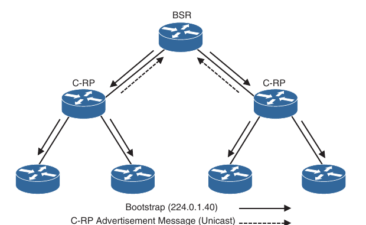

### Multicast Configuration

- Topology:

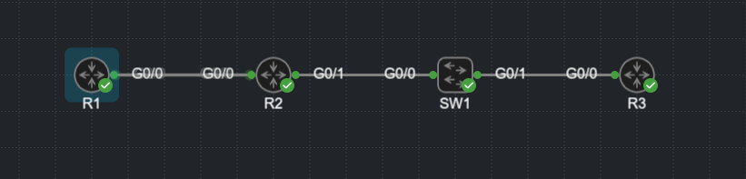

- First set IP addresses and a routing protocol between the devices

- On the switch set an IP address on vlan 1 interface

- On the routers enable pim per interfaces

- Enable multicast routing and set PIM version per interface

- R1:

```
conf t
 ip multicast-routing
 interface g0/1
  ip pim dense-mode
```

- R2:

```
conf t
 ip multicast-routing
 interface range g0/0 - 1
  ip prim dense-mode
```

- SW1:

```
conf t
 ip multicast-routing
 interface vlan 1
  no sh
  ip pim dense-mode     # configuring PIM also enable IGMP
```

- R3:

```
conf t
 ip multicast-routing
  interface g0/0
   ip pim dense-mode
```

- Viewing the PIM neighbors:

- R1:

```
R1(config)#do sh ip pim nei
PIM Neighbor Table
Mode: B - Bidir Capable, DR - Designated Router, N - Default DR Priority,
      P - Proxy Capable, S - State Refresh Capable, G - GenID Capable,
      L - DR Load-balancing Capable
Neighbor          Interface                Uptime/Expires    Ver   DR
Address                                                            Prio/Mode
10.12.1.2         GigabitEthernet0/0       00:08:43/00:01:23 v2    1 / DR S P G
```

- R2:

```
R2(config)#do sh ip pim nei
PIM Neighbor Table
Mode: B - Bidir Capable, DR - Designated Router, N - Default DR Priority,
      P - Proxy Capable, S - State Refresh Capable, G - GenID Capable,
      L - DR Load-balancing Capable
Neighbor          Interface                Uptime/Expires    Ver   DR
Address                                                            Prio/Mode
10.12.1.1         GigabitEthernet0/0       00:09:14/00:01:21 v2    1 / S P G
10.23.1.2         GigabitEthernet0/1       00:07:36/00:01:33 v2    1 / S P G
10.23.1.10        GigabitEthernet0/1       00:08:51/00:01:33 v2    1 / DR S P G
```

- As you can see the switch is also a PIM neighbor, and the DR in this case

- SW1:

```
SW1(config-if)#do sh ip pim nei
PIM Neighbor Table
Mode: B - Bidir Capable, DR - Designated Router, N - Default DR Priority,
      P - Proxy Capable, S - State Refresh Capable, G - GenID Capable,
      L - DR Load-balancing Capable
Neighbor          Interface                Uptime/Expires    Ver   DR
Address                                                            Prio/Mode
10.23.1.2         Vlan1                    00:08:54/00:01:43 v2    1 / S P G
10.23.1.1         Vlan1                    00:10:10/00:01:41 v2    1 / S P G
SW1(config-if)#
```

- R3

```
R3(config-if)#do sh ip pim nei
PIM Neighbor Table
Mode: B - Bidir Capable, DR - Designated Router, N - Default DR Priority,
      P - Proxy Capable, S - State Refresh Capable, G - GenID Capable,
      L - DR Load-balancing Capable
Neighbor          Interface                Uptime/Expires    Ver   DR
Address                                                            Prio/Mode
10.23.1.10        GigabitEthernet0/0       00:00:16/00:01:28 v2    1 / DR S P G
10.23.1.1         GigabitEthernet0/0       00:00:16/00:01:28 v2    1 / S P G
```

- Verifying multicast interfaces:

```
R2#show ip multicast interface 
GigabitEthernet0/0 is up, line protocol is up
  Internet address is 10.12.1.2/24
  Multicast routing: enabled
  Multicast switching: fast
  Multicast packets in/out: 0/0
  Multicast TTL threshold: 0
  Multicast Tagswitching: disabled
GigabitEthernet0/1 is up, line protocol is up
  Internet address is 10.23.1.1/24
  Multicast routing: enabled
  Multicast switching: fast
  Multicast packets in/out: 0/0
  Multicast TTL threshold: 0
  Multicast Tagswitching: disabled
```

- Set the IGMP version on an interface

SW1:

```
conf t
 interface vlan 1
  ip igmp version 3 # (default is v2), if PIM is enabled, IGMP is enabled too
```

- Also set IP IGMP to version 3 on R2's G0/1 and R3's G0/0

```
conf t
 interface g0/1
  ip igmp version 3
```

- Configure a RP address manually:

- R1 + R2 + SW1 + R3:

```
conf t
 ip pim rp-address 10.2.2.2
```

- Doing this will create a tunnel between the router and the RP

```
R1(config)#
*Jul 19 16:27:39.418: %LINEPROTO-5-UPDOWN: Line protocol on Interface Tunnel0, changed state to up
```

```
R1(config)#do sh ip pim rp
Group: 224.0.1.40, RP: 10.2.2.2, uptime 00:04:31, expires never
```

- The RP must be configured on all routers, including the RP itself

- R2:

```
R2(config)#do sh ip int br
Interface                  IP-Address      OK? Method Status                Protocol
GigabitEthernet0/0         10.12.1.2       YES manual up                    up      
GigabitEthernet0/1         10.23.1.1       YES manual up                    up      
GigabitEthernet0/2         unassigned      YES NVRAM  administratively down down    
GigabitEthernet0/3         unassigned      YES NVRAM  administratively down down    
Loopback0                  10.2.2.2        YES manual up                    up      
Tunnel0                    10.12.1.2       YES unset  up                    up      
Tunnel1                    10.2.2.2        YES unset  up                    up      
```

- Extended topology - PIM dense mode:

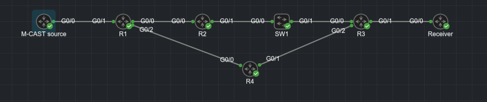

- On the M-CAST source:

```
M-CAST_SOURCE#ping 239.1.1.1 repeat 999999999
Type escape sequence to abort.
Sending 999999999, 100-byte ICMP Echos to 239.1.1.1, timeout is 2 seconds:
```

- On the Receiver:

```
conf t
 interface g0/0
  ip igmp join-group 239.1.1.1
```

- Viewing multicast routing table:

- R3:

```
R3(config)#do sh ip mroute
IP Multicast Routing Table
Flags: D - Dense, S - Sparse, B - Bidir Group, s - SSM Group, C - Connected,
       L - Local, P - Pruned, R - RP-bit set, F - Register flag,
       T - SPT-bit set, J - Join SPT, M - MSDP created entry, E - Extranet,
       X - Proxy Join Timer Running, A - Candidate for MSDP Advertisement,
       U - URD, I - Received Source Specific Host Report, 
       Z - Multicast Tunnel, z - MDT-data group sender, 
       Y - Joined MDT-data group, y - Sending to MDT-data group, 
       G - Received BGP C-Mroute, g - Sent BGP C-Mroute, 
       N - Received BGP Shared-Tree Prune, n - BGP C-Mroute suppressed, 
       Q - Received BGP S-A Route, q - Sent BGP S-A Route, 
       V - RD & Vector, v - Vector, p - PIM Joins on route, 
       x - VxLAN group
Outgoing interface flags: H - Hardware switched, A - Assert winner, p - PIM Join
 Timers: Uptime/Expires
 Interface state: Interface, Next-Hop or VCD, State/Mode

(*, 239.1.1.1), 00:04:40/stopped, RP 0.0.0.0, flags: D
  Incoming interface: Null, RPF nbr 0.0.0.0
  Outgoing interface list:
    GigabitEthernet0/2, Forward/Dense, 00:04:40/stopped
    GigabitEthernet0/0, Forward/Dense, 00:04:40/stopped

(10.20.15.10, 239.1.1.1), 00:01:38/00:01:21, flags: PT
  Incoming interface: GigabitEthernet0/2, RPF nbr 10.34.1.2
  Outgoing interface list:
    GigabitEthernet0/0, Prune/Dense, 00:01:38/00:01:21

(*, 224.0.1.40), 00:12:33/00:02:16, RP 0.0.0.0, flags: DCL
  Incoming interface: Null, RPF nbr 0.0.0.0
  Outgoing interface list:
    GigabitEthernet0/2, Forward/Dense, 00:12:33/stopped
    GigabitEthernet0/0, Forward/Dense, 00:12:33/stopped

```

- R2:

```
R2#show ip mroute 
IP Multicast Routing Table
Flags: D - Dense, S - Sparse, B - Bidir Group, s - SSM Group, C - Connected,
       L - Local, P - Pruned, R - RP-bit set, F - Register flag,
       T - SPT-bit set, J - Join SPT, M - MSDP created entry, E - Extranet,
       X - Proxy Join Timer Running, A - Candidate for MSDP Advertisement,
       U - URD, I - Received Source Specific Host Report, 
       Z - Multicast Tunnel, z - MDT-data group sender, 
       Y - Joined MDT-data group, y - Sending to MDT-data group, 
       G - Received BGP C-Mroute, g - Sent BGP C-Mroute, 
       N - Received BGP Shared-Tree Prune, n - BGP C-Mroute suppressed, 
       Q - Received BGP S-A Route, q - Sent BGP S-A Route, 
       V - RD & Vector, v - Vector, p - PIM Joins on route, 
       x - VxLAN group
Outgoing interface flags: H - Hardware switched, A - Assert winner, p - PIM Join
 Timers: Uptime/Expires
 Interface state: Interface, Next-Hop or VCD, State/Mode

(*, 239.1.1.1), 00:05:08/stopped, RP 0.0.0.0, flags: D
  Incoming interface: Null, RPF nbr 0.0.0.0
  Outgoing interface list:
    GigabitEthernet0/1, Forward/Dense, 00:05:08/stopped
    GigabitEthernet0/0, Forward/Dense, 00:05:08/stopped

(10.20.15.10, 239.1.1.1), 00:02:06/00:00:53, flags: PT
  Incoming interface: GigabitEthernet0/0, RPF nbr 10.12.1.1
  Outgoing interface list:
    GigabitEthernet0/1, Prune/Dense, 00:02:02/00:00:57, A

(*, 224.0.1.40), 00:13:25/00:02:52, RP 0.0.0.0, flags: DCL
  Incoming interface: Null, RPF nbr 0.0.0.0
  Outgoing interface list:
    GigabitEthernet0/1, Forward/Dense, 00:13:25/stopped
    GigabitEthernet0/0, Forward/Dense, 00:13:25/stopped

```

- R1:

```
R1#show ip mroute 
IP Multicast Routing Table
Flags: D - Dense, S - Sparse, B - Bidir Group, s - SSM Group, C - Connected,
       L - Local, P - Pruned, R - RP-bit set, F - Register flag,
       T - SPT-bit set, J - Join SPT, M - MSDP created entry, E - Extranet,
       X - Proxy Join Timer Running, A - Candidate for MSDP Advertisement,
       U - URD, I - Received Source Specific Host Report, 
       Z - Multicast Tunnel, z - MDT-data group sender, 
       Y - Joined MDT-data group, y - Sending to MDT-data group, 
       G - Received BGP C-Mroute, g - Sent BGP C-Mroute, 
       N - Received BGP Shared-Tree Prune, n - BGP C-Mroute suppressed, 
       Q - Received BGP S-A Route, q - Sent BGP S-A Route, 
       V - RD & Vector, v - Vector, p - PIM Joins on route, 
       x - VxLAN group
Outgoing interface flags: H - Hardware switched, A - Assert winner, p - PIM Join
 Timers: Uptime/Expires
 Interface state: Interface, Next-Hop or VCD, State/Mode

(*, 239.1.1.1), 00:05:44/stopped, RP 0.0.0.0, flags: D
  Incoming interface: Null, RPF nbr 0.0.0.0
  Outgoing interface list:
    GigabitEthernet0/2, Forward/Dense, 00:05:44/stopped
    GigabitEthernet0/0, Forward/Dense, 00:05:44/stopped

(10.20.15.10, 239.1.1.1), 00:05:44/00:02:48, flags: PT
  Incoming interface: GigabitEthernet0/1, RPF nbr 0.0.0.0
  Outgoing interface list:
    GigabitEthernet0/0, Prune/Dense, 00:02:38/00:00:21
    GigabitEthernet0/2, Prune/Dense, 00:02:42/00:00:17

(*, 224.0.1.40), 00:14:14/00:02:06, RP 0.0.0.0, flags: DCL
  Incoming interface: Null, RPF nbr 0.0.0.0
  Outgoing interface list:
    GigabitEthernet0/2, Forward/Dense, 00:14:14/stopped
    GigabitEthernet0/0, Forward/Dense, 00:14:14/stopped

```

- R4:

```
R4(config)#do sh ip mroute
IP Multicast Routing Table
Flags: D - Dense, S - Sparse, B - Bidir Group, s - SSM Group, C - Connected,
       L - Local, P - Pruned, R - RP-bit set, F - Register flag,
       T - SPT-bit set, J - Join SPT, M - MSDP created entry, E - Extranet,
       X - Proxy Join Timer Running, A - Candidate for MSDP Advertisement,
       U - URD, I - Received Source Specific Host Report, 
       Z - Multicast Tunnel, z - MDT-data group sender, 
       Y - Joined MDT-data group, y - Sending to MDT-data group, 
       G - Received BGP C-Mroute, g - Sent BGP C-Mroute, 
       N - Received BGP Shared-Tree Prune, n - BGP C-Mroute suppressed, 
       Q - Received BGP S-A Route, q - Sent BGP S-A Route, 
       V - RD & Vector, v - Vector, p - PIM Joins on route, 
       x - VxLAN group
Outgoing interface flags: H - Hardware switched, A - Assert winner, p - PIM Join
 Timers: Uptime/Expires
 Interface state: Interface, Next-Hop or VCD, State/Mode

(*, 239.1.1.1), 00:06:45/stopped, RP 0.0.0.0, flags: D
  Incoming interface: Null, RPF nbr 0.0.0.0
  Outgoing interface list:
    GigabitEthernet0/1, Forward/Dense, 00:06:45/stopped
    GigabitEthernet0/0, Forward/Dense, 00:06:45/stopped

(10.20.15.10, 239.1.1.1), 00:00:41/00:02:18, flags: PT
  Incoming interface: GigabitEthernet0/0, RPF nbr 10.14.1.1
  Outgoing interface list:
    GigabitEthernet0/1, Prune/Dense, 00:00:41/00:02:18

(*, 224.0.1.40), 00:26:28/00:02:05, RP 0.0.0.0, flags: DCL
  Incoming interface: Null, RPF nbr 0.0.0.0
  Outgoing interface list:
    GigabitEthernet0/1, Forward/Dense, 00:25:41/stopped
    GigabitEthernet0/0, Forward/Dense, 00:26:28/stopped

```

- This means that the multicast flow goes via R4 (as expected - shortest path)

- Configuring PIM sparse mode:

- On all routers and the switch move the interfaces into sparse mode

- Configure a static RP on R2's l0 interface, on all the routers, including R2

- R4:

```
conf t
 ip pim rp-address 10.2.2.2
 int range g0/0 - 1
  ip pim sparse-mode
```

- R4's multicast routing table:

```
R4#sh ip mroute 
IP Multicast Routing Table
Flags: D - Dense, S - Sparse, B - Bidir Group, s - SSM Group, C - Connected,
       L - Local, P - Pruned, R - RP-bit set, F - Register flag,
       T - SPT-bit set, J - Join SPT, M - MSDP created entry, E - Extranet,
       X - Proxy Join Timer Running, A - Candidate for MSDP Advertisement,
       U - URD, I - Received Source Specific Host Report, 
       Z - Multicast Tunnel, z - MDT-data group sender, 
       Y - Joined MDT-data group, y - Sending to MDT-data group, 
       G - Received BGP C-Mroute, g - Sent BGP C-Mroute, 
       N - Received BGP Shared-Tree Prune, n - BGP C-Mroute suppressed, 
       Q - Received BGP S-A Route, q - Sent BGP S-A Route, 
       V - RD & Vector, v - Vector, p - PIM Joins on route, 
       x - VxLAN group
Outgoing interface flags: H - Hardware switched, A - Assert winner, p - PIM Join
 Timers: Uptime/Expires
 Interface state: Interface, Next-Hop or VCD, State/Mode

(*, 239.1.1.1), 00:04:47/stopped, RP 10.2.2.2, flags: S
  Incoming interface: GigabitEthernet0/1, RPF nbr 10.34.1.1
  Outgoing interface list:
    GigabitEthernet0/0, Forward/Sparse, 00:04:47/stopped

(10.20.15.10, 239.1.1.1), 00:02:55/00:00:04, flags: PJT
  Incoming interface: GigabitEthernet0/0, RPF nbr 10.14.1.1
  Outgoing interface list:
    GigabitEthernet0/1, Prune/Sparse, 00:02:43/00:00:16

(*, 224.0.1.40), 00:44:01/00:02:34, RP 10.2.2.2, flags: SJCL
  Incoming interface: GigabitEthernet0/1, RPF nbr 10.34.1.1
  Outgoing interface list:
    GigabitEthernet0/0, Forward/Sparse, 00:44:01/00:02:34

```

- Notice the PJT flags on the (S,G) route

- R2:

```
R2#show ip mroute 
IP Multicast Routing Table
Flags: D - Dense, S - Sparse, B - Bidir Group, s - SSM Group, C - Connected,
       L - Local, P - Pruned, R - RP-bit set, F - Register flag,
       T - SPT-bit set, J - Join SPT, M - MSDP created entry, E - Extranet,
       X - Proxy Join Timer Running, A - Candidate for MSDP Advertisement,
       U - URD, I - Received Source Specific Host Report, 
       Z - Multicast Tunnel, z - MDT-data group sender, 
       Y - Joined MDT-data group, y - Sending to MDT-data group, 
       G - Received BGP C-Mroute, g - Sent BGP C-Mroute, 
       N - Received BGP Shared-Tree Prune, n - BGP C-Mroute suppressed, 
       Q - Received BGP S-A Route, q - Sent BGP S-A Route, 
       V - RD & Vector, v - Vector, p - PIM Joins on route, 
       x - VxLAN group
Outgoing interface flags: H - Hardware switched, A - Assert winner, p - PIM Join
 Timers: Uptime/Expires
 Interface state: Interface, Next-Hop or VCD, State/Mode

(*, 239.1.1.1), 00:05:48/00:03:29, RP 10.2.2.2, flags: S
  Incoming interface: Null, RPF nbr 0.0.0.0
  Outgoing interface list:
    GigabitEthernet0/1, Forward/Sparse, 00:05:48/00:03:29
    GigabitEthernet0/0, Forward/Sparse, 00:05:48/00:02:54

(10.20.15.10, 239.1.1.1), 00:04:52/00:02:20, flags: T
  Incoming interface: GigabitEthernet0/0, RPF nbr 10.12.1.1
  Outgoing interface list:
    GigabitEthernet0/1, Forward/Sparse, 00:04:52/00:03:29

(*, 224.0.1.40), 00:33:35/00:02:56, RP 10.2.2.2, flags: SJCL
  Incoming interface: Null, RPF nbr 0.0.0.0
  Outgoing interface list:
    GigabitEthernet0/1, Forward/Sparse, 00:33:35/00:02:31
    GigabitEthernet0/0, Forward/Sparse, 00:33:35/00:02:56
```

- R1:

```
R1#show ip mroute 
IP Multicast Routing Table
Flags: D - Dense, S - Sparse, B - Bidir Group, s - SSM Group, C - Connected,
       L - Local, P - Pruned, R - RP-bit set, F - Register flag,
       T - SPT-bit set, J - Join SPT, M - MSDP created entry, E - Extranet,
       X - Proxy Join Timer Running, A - Candidate for MSDP Advertisement,
       U - URD, I - Received Source Specific Host Report, 
       Z - Multicast Tunnel, z - MDT-data group sender, 
       Y - Joined MDT-data group, y - Sending to MDT-data group, 
       G - Received BGP C-Mroute, g - Sent BGP C-Mroute, 
       N - Received BGP Shared-Tree Prune, n - BGP C-Mroute suppressed, 
       Q - Received BGP S-A Route, q - Sent BGP S-A Route, 
       V - RD & Vector, v - Vector, p - PIM Joins on route, 
       x - VxLAN group
Outgoing interface flags: H - Hardware switched, A - Assert winner, p - PIM Join
 Timers: Uptime/Expires
 Interface state: Interface, Next-Hop or VCD, State/Mode

(*, 239.1.1.1), 00:07:47/stopped, RP 10.2.2.2, flags: SF
  Incoming interface: GigabitEthernet0/0, RPF nbr 10.12.1.2
  Outgoing interface list:
    GigabitEthernet0/2, Forward/Sparse, 00:07:47/stopped

(10.20.15.10, 239.1.1.1), 00:07:27/00:02:02, flags: FT
  Incoming interface: GigabitEthernet0/1, RPF nbr 0.0.0.0
  Outgoing interface list:
    GigabitEthernet0/0, Forward/Sparse, 00:07:27/00:02:30

(*, 224.0.1.40), 00:35:47/00:02:31, RP 10.2.2.2, flags: SJCL
  Incoming interface: GigabitEthernet0/0, RPF nbr 10.12.1.2
  Outgoing interface list:
    GigabitEthernet0/2, Forward/Sparse, 00:35:47/stopped

```

- Receiver:

```
Receiver#sh ip igmp interface 
Global IGMP State Limit : 0 active out of 500 max
GigabitEthernet0/0 is up, line protocol is up
  Internet address is 10.38.1.100/24
  IGMP is enabled on interface
  Current IGMP host version is 2
  Current IGMP router version is 2
  IGMP query interval is 60 seconds
  IGMP configured query interval is 60 seconds
  IGMP querier timeout is 120 seconds
  IGMP configured querier timeout is 120 seconds
  IGMP max query response time is 10 seconds
  Last member query count is 2
  Last member query response interval is 1000 ms
  Inbound IGMP access group is not set
  IGMP activity: 3 joins, 1 leaves
  Multicast routing is enabled on interface
  Multicast TTL threshold is 0
  Multicast designated router (DR) is 10.38.1.100 (this system)
  IGMP querying router is 10.38.1.1  
  Multicast groups joined by this system (number of users):
      224.0.1.40(1)  239.1.1.1(1)
```

- Configuring auto-RP on R2:

- First unset the RP address manually configured

- Then set PIM sparse-dense-mode

R1 + R2 + R3 + SW1

```
conf t
 no ip pim rp-address 10.2.2.2
 interface range g0/0 - 2, l0
  ip pim sparse-dense-mode
```

- R2 - Set it as the auto-RP and auto rp agent:

```
conf t
 ip pim send-rp-announce l0 scope 16
 ip pim send-rp-discovery scope 16
```

- Joining the 239.1.1.1 group from the Receiver

```
conf t
 interface g0/0
  ip igmp join-group 239.1.1.1
```

- Multicast routing tables:

- R1:

```
R1#show ip mroute 
IP Multicast Routing Table
Flags: D - Dense, S - Sparse, B - Bidir Group, s - SSM Group, C - Connected,
       L - Local, P - Pruned, R - RP-bit set, F - Register flag,
       T - SPT-bit set, J - Join SPT, M - MSDP created entry, E - Extranet,
       X - Proxy Join Timer Running, A - Candidate for MSDP Advertisement,
       U - URD, I - Received Source Specific Host Report, 
       Z - Multicast Tunnel, z - MDT-data group sender, 
       Y - Joined MDT-data group, y - Sending to MDT-data group, 
       G - Received BGP C-Mroute, g - Sent BGP C-Mroute, 
       N - Received BGP Shared-Tree Prune, n - BGP C-Mroute suppressed, 
       Q - Received BGP S-A Route, q - Sent BGP S-A Route, 
       V - RD & Vector, v - Vector, p - PIM Joins on route, 
       x - VxLAN group
Outgoing interface flags: H - Hardware switched, A - Assert winner, p - PIM Join
 Timers: Uptime/Expires
 Interface state: Interface, Next-Hop or VCD, State/Mode

(*, 239.1.1.1), 00:01:50/stopped, RP 10.2.2.2, flags: SPF
  Incoming interface: GigabitEthernet0/0, RPF nbr 10.12.1.2
  Outgoing interface list: Null

(10.20.15.10, 239.1.1.1), 00:01:50/00:01:09, flags: PFT
  Incoming interface: GigabitEthernet0/1, RPF nbr 0.0.0.0
  Outgoing interface list: Null

(*, 224.0.1.39), 00:03:54/stopped, RP 0.0.0.0, flags: DC
  Incoming interface: Null, RPF nbr 0.0.0.0
  Outgoing interface list:
    GigabitEthernet0/2, Forward/Sparse-Dense, 00:03:54/stopped
    GigabitEthernet0/0, Forward/Sparse-Dense, 00:03:54/stopped

(10.2.2.2, 224.0.1.39), 00:03:54/00:02:48, flags: PT
  Incoming interface: GigabitEthernet0/0, RPF nbr 10.12.1.2
  Outgoing interface list:
    GigabitEthernet0/2, Prune/Sparse-Dense, 00:03:54/00:02:02, A

(*, 224.0.1.40), 00:07:57/stopped, RP 0.0.0.0, flags: DCL
  Incoming interface: Null, RPF nbr 0.0.0.0
  Outgoing interface list:
    GigabitEthernet0/2, Forward/Sparse-Dense, 00:07:29/stopped
    GigabitEthernet0/0, Forward/Sparse-Dense, 00:07:39/stopped

(10.12.1.2, 224.0.1.40), 00:02:54/00:02:03, flags: LT
  Incoming interface: GigabitEthernet0/0, RPF nbr 10.12.1.2
  Outgoing interface list:
    GigabitEthernet0/2, Forward/Sparse-Dense, 00:02:54/stopped
          
```

- R2:

```
R2#show ip mroute 
IP Multicast Routing Table
Flags: D - Dense, S - Sparse, B - Bidir Group, s - SSM Group, C - Connected,
       L - Local, P - Pruned, R - RP-bit set, F - Register flag,
       T - SPT-bit set, J - Join SPT, M - MSDP created entry, E - Extranet,
       X - Proxy Join Timer Running, A - Candidate for MSDP Advertisement,
       U - URD, I - Received Source Specific Host Report, 
       Z - Multicast Tunnel, z - MDT-data group sender, 
       Y - Joined MDT-data group, y - Sending to MDT-data group, 
       G - Received BGP C-Mroute, g - Sent BGP C-Mroute, 
       N - Received BGP Shared-Tree Prune, n - BGP C-Mroute suppressed, 
       Q - Received BGP S-A Route, q - Sent BGP S-A Route, 
       V - RD & Vector, v - Vector, p - PIM Joins on route, 
       x - VxLAN group
Outgoing interface flags: H - Hardware switched, A - Assert winner, p - PIM Join
 Timers: Uptime/Expires
 Interface state: Interface, Next-Hop or VCD, State/Mode

(*, 239.1.1.1), 00:02:52/stopped, RP 10.2.2.2, flags: SP
  Incoming interface: Null, RPF nbr 0.0.0.0
  Outgoing interface list: Null

(10.20.15.10, 239.1.1.1), 00:02:52/00:02:07, flags: P
  Incoming interface: GigabitEthernet0/0, RPF nbr 10.12.1.1
  Outgoing interface list: Null

(*, 224.0.1.39), 00:04:56/stopped, RP 0.0.0.0, flags: DCL
  Incoming interface: Null, RPF nbr 0.0.0.0
  Outgoing interface list:
    Loopback0, Forward/Sparse-Dense, 00:04:40/stopped
    GigabitEthernet0/1, Forward/Sparse-Dense, 00:04:56/stopped
    GigabitEthernet0/0, Forward/Sparse-Dense, 00:04:56/stopped

(10.2.2.2, 224.0.1.39), 00:04:56/00:02:03, flags: LT
  Incoming interface: Loopback0, RPF nbr 0.0.0.0
  Outgoing interface list:
    GigabitEthernet0/0, Forward/Sparse-Dense, 00:04:40/stopped
    GigabitEthernet0/1, Forward/Sparse-Dense, 00:04:56/stopped

(*, 224.0.1.40), 00:08:11/00:02:44, RP 0.0.0.0, flags: DCL
  Incoming interface: Null, RPF nbr 0.0.0.0
  Outgoing interface list:
    Loopback0, Forward/Sparse-Dense, 00:08:11/stopped
    GigabitEthernet0/1, Forward/Sparse-Dense, 00:07:21/stopped
    GigabitEthernet0/0, Forward/Sparse-Dense, 00:08:11/stopped
```

- Switch:

```
SW1#show ip mroute 
IP Multicast Routing Table
Flags: D - Dense, S - Sparse, B - Bidir Group, s - SSM Group, C - Connected,
       L - Local, P - Pruned, R - RP-bit set, F - Register flag,
       T - SPT-bit set, J - Join SPT, M - MSDP created entry, E - Extranet,
       X - Proxy Join Timer Running, A - Candidate for MSDP Advertisement,
       U - URD, I - Received Source Specific Host Report, 
       Z - Multicast Tunnel, z - MDT-data group sender, 
       Y - Joined MDT-data group, y - Sending to MDT-data group, 
       G - Received BGP C-Mroute, g - Sent BGP C-Mroute, 
       N - Received BGP Shared-Tree Prune, n - BGP C-Mroute suppressed, 
       Q - Received BGP S-A Route, q - Sent BGP S-A Route, 
       V - RD & Vector, v - Vector, p - PIM Joins on route, 
       x - VxLAN group
Outgoing interface flags: H - Hardware switched, A - Assert winner, p - PIM Join
 Timers: Uptime/Expires
 Interface state: Interface, Next-Hop or VCD, State/Mode

(*, 224.0.1.39), 00:05:21/stopped, RP 0.0.0.0, flags: DC
  Incoming interface: Null, RPF nbr 0.0.0.0
  Outgoing interface list:
    Vlan1, Forward/Sparse-Dense, 00:05:21/stopped

(10.2.2.2, 224.0.1.39), 00:01:22/00:01:37, flags: 
  Incoming interface: Null, RPF nbr 0.0.0.0
  Outgoing interface list:
    Vlan1, Forward/Sparse-Dense, 00:01:22/stopped

(*, 224.0.1.40), 00:07:46/stopped, RP 0.0.0.0, flags: DCL
  Incoming interface: Null, RPF nbr 0.0.0.0
  Outgoing interface list:
    Vlan1, Forward/Sparse-Dense, 00:07:46/stopped

(10.23.1.1, 224.0.1.40), 00:04:22/00:02:35, flags: PLT
  Incoming interface: Vlan1, RPF nbr 10.23.1.1
  Outgoing interface list: Null
```

- R3:

```
R3#show ip mroute 
IP Multicast Routing Table
Flags: D - Dense, S - Sparse, B - Bidir Group, s - SSM Group, C - Connected,
       L - Local, P - Pruned, R - RP-bit set, F - Register flag,
       T - SPT-bit set, J - Join SPT, M - MSDP created entry, E - Extranet,
       X - Proxy Join Timer Running, A - Candidate for MSDP Advertisement,
       U - URD, I - Received Source Specific Host Report, 
       Z - Multicast Tunnel, z - MDT-data group sender, 
       Y - Joined MDT-data group, y - Sending to MDT-data group, 
       G - Received BGP C-Mroute, g - Sent BGP C-Mroute, 
       N - Received BGP Shared-Tree Prune, n - BGP C-Mroute suppressed, 
       Q - Received BGP S-A Route, q - Sent BGP S-A Route, 
       V - RD & Vector, v - Vector, p - PIM Joins on route, 
       x - VxLAN group
Outgoing interface flags: H - Hardware switched, A - Assert winner, p - PIM Join
 Timers: Uptime/Expires
 Interface state: Interface, Next-Hop or VCD, State/Mode

(*, 224.0.1.39), 00:05:48/00:02:34, RP 0.0.0.0, flags: DC
  Incoming interface: Null, RPF nbr 0.0.0.0
  Outgoing interface list:
    GigabitEthernet0/2, Forward/Sparse-Dense, 00:05:48/stopped
    GigabitEthernet0/0, Forward/Sparse-Dense, 00:05:48/stopped

(*, 224.0.1.40), 00:07:26/00:02:36, RP 0.0.0.0, flags: DCL
  Incoming interface: Null, RPF nbr 0.0.0.0
  Outgoing interface list:
    GigabitEthernet0/0, Forward/Sparse-Dense, 00:07:11/stopped
```

- R4:

```
R4#show ip mroute 
IP Multicast Routing Table
Flags: D - Dense, S - Sparse, B - Bidir Group, s - SSM Group, C - Connected,
       L - Local, P - Pruned, R - RP-bit set, F - Register flag,
       T - SPT-bit set, J - Join SPT, M - MSDP created entry, E - Extranet,
       X - Proxy Join Timer Running, A - Candidate for MSDP Advertisement,
       U - URD, I - Received Source Specific Host Report, 
       Z - Multicast Tunnel, z - MDT-data group sender, 
       Y - Joined MDT-data group, y - Sending to MDT-data group, 
       G - Received BGP C-Mroute, g - Sent BGP C-Mroute, 
       N - Received BGP Shared-Tree Prune, n - BGP C-Mroute suppressed, 
       Q - Received BGP S-A Route, q - Sent BGP S-A Route, 
       V - RD & Vector, v - Vector, p - PIM Joins on route, 
       x - VxLAN group
Outgoing interface flags: H - Hardware switched, A - Assert winner, p - PIM Join
 Timers: Uptime/Expires
 Interface state: Interface, Next-Hop or VCD, State/Mode

(*, 224.0.1.39), 00:08:35/stopped, RP 0.0.0.0, flags: D
  Incoming interface: Null, RPF nbr 0.0.0.0
  Outgoing interface list:
    GigabitEthernet0/1, Forward/Sparse-Dense, 00:08:35/stopped
    GigabitEthernet0/0, Forward/Sparse-Dense, 00:08:35/stopped

(10.2.2.2, 224.0.1.39), 00:02:41/00:00:18, flags: PT
  Incoming interface: GigabitEthernet0/1, RPF nbr 10.34.1.1
  Outgoing interface list:
    GigabitEthernet0/0, Prune/Sparse-Dense, 00:02:41/00:00:18

(*, 224.0.1.40), 00:10:30/stopped, RP 0.0.0.0, flags: DCL
  Incoming interface: Null, RPF nbr 0.0.0.0
  Outgoing interface list:
    GigabitEthernet0/0, Forward/Sparse-Dense, 00:10:30/stopped

(10.12.1.2, 224.0.1.40), 00:07:35/00:02:20, flags: PLTX
  Incoming interface: GigabitEthernet0/0, RPF nbr 10.14.1.1
  Outgoing interface list: Null
```

- As you can see now the multicast traffic goes through R2

- Configuring BSR and BSR candidate on R2:

- Disable the already-configured auto-RP:

```
conf t
 no ip pim send-rp-announce l0
 no ip pim send-rp-discovery
```

- Configure BSR candidate and BSR on R2:

```
conf t
 ip pim bsr-candidate l0
 interface l0
  ip pim bsr-border
```

- R1:

```
R1#show ip mroute 
IP Multicast Routing Table
Flags: D - Dense, S - Sparse, B - Bidir Group, s - SSM Group, C - Connected,
       L - Local, P - Pruned, R - RP-bit set, F - Register flag,
       T - SPT-bit set, J - Join SPT, M - MSDP created entry, E - Extranet,
       X - Proxy Join Timer Running, A - Candidate for MSDP Advertisement,
       U - URD, I - Received Source Specific Host Report, 
       Z - Multicast Tunnel, z - MDT-data group sender, 
       Y - Joined MDT-data group, y - Sending to MDT-data group, 
       G - Received BGP C-Mroute, g - Sent BGP C-Mroute, 
       N - Received BGP Shared-Tree Prune, n - BGP C-Mroute suppressed, 
       Q - Received BGP S-A Route, q - Sent BGP S-A Route, 
       V - RD & Vector, v - Vector, p - PIM Joins on route, 
       x - VxLAN group
Outgoing interface flags: H - Hardware switched, A - Assert winner, p - PIM Join
 Timers: Uptime/Expires
 Interface state: Interface, Next-Hop or VCD, State/Mode

(*, 239.1.1.1), 00:01:18/stopped, RP 0.0.0.0, flags: D
  Incoming interface: Null, RPF nbr 0.0.0.0
  Outgoing interface list:
    GigabitEthernet0/2, Forward/Sparse-Dense, 00:01:18/stopped
    GigabitEthernet0/0, Forward/Sparse-Dense, 00:01:18/stopped

(10.20.15.10, 239.1.1.1), 00:01:18/00:01:41, flags: PT
  Incoming interface: GigabitEthernet0/1, RPF nbr 0.0.0.0
  Outgoing interface list:
    GigabitEthernet0/0, Prune/Sparse-Dense, 00:01:13/00:01:46
    GigabitEthernet0/2, Prune/Sparse-Dense, 00:01:18/00:01:41

(*, 224.0.1.39), 00:33:43/00:02:06, RP 0.0.0.0, flags: D
  Incoming interface: Null, RPF nbr 0.0.0.0
  Outgoing interface list:
    GigabitEthernet0/2, Forward/Sparse-Dense, 00:33:43/stopped
    GigabitEthernet0/0, Forward/Sparse-Dense, 00:33:43/stopped

(*, 224.0.1.40), 00:37:46/00:02:36, RP 0.0.0.0, flags: DCL
  Incoming interface: Null, RPF nbr 0.0.0.0
  Outgoing interface list:
    GigabitEthernet0/2, Forward/Sparse-Dense, 00:37:18/stopped
    GigabitEthernet0/0, Forward/Sparse-Dense, 00:37:28/stopped
```

- R2:

```
R2#show ip mroute 
IP Multicast Routing Table
Flags: D - Dense, S - Sparse, B - Bidir Group, s - SSM Group, C - Connected,
       L - Local, P - Pruned, R - RP-bit set, F - Register flag,
       T - SPT-bit set, J - Join SPT, M - MSDP created entry, E - Extranet,
       X - Proxy Join Timer Running, A - Candidate for MSDP Advertisement,
       U - URD, I - Received Source Specific Host Report, 
       Z - Multicast Tunnel, z - MDT-data group sender, 
       Y - Joined MDT-data group, y - Sending to MDT-data group, 
       G - Received BGP C-Mroute, g - Sent BGP C-Mroute, 
       N - Received BGP Shared-Tree Prune, n - BGP C-Mroute suppressed, 
       Q - Received BGP S-A Route, q - Sent BGP S-A Route, 
       V - RD & Vector, v - Vector, p - PIM Joins on route, 
       x - VxLAN group
Outgoing interface flags: H - Hardware switched, A - Assert winner, p - PIM Join
 Timers: Uptime/Expires
 Interface state: Interface, Next-Hop or VCD, State/Mode

(*, 239.1.1.1), 00:03:54/stopped, RP 0.0.0.0, flags: D
  Incoming interface: Null, RPF nbr 0.0.0.0
  Outgoing interface list:
    GigabitEthernet0/1, Forward/Sparse-Dense, 00:03:54/stopped
    GigabitEthernet0/0, Forward/Sparse-Dense, 00:03:54/stopped

(10.20.15.10, 239.1.1.1), 00:00:52/00:02:07, flags: PT
  Incoming interface: GigabitEthernet0/0, RPF nbr 10.12.1.1
  Outgoing interface list:
    GigabitEthernet0/1, Prune/Sparse-Dense, 00:00:48/00:02:11, A

(*, 224.0.1.40), 00:39:35/00:02:23, RP 0.0.0.0, flags: DCL
  Incoming interface: Null, RPF nbr 0.0.0.0
  Outgoing interface list:
    Loopback0, Forward/Sparse-Dense, 00:39:35/stopped
    GigabitEthernet0/1, Forward/Sparse-Dense, 00:38:44/stopped
    GigabitEthernet0/0, Forward/Sparse-Dense, 00:39:35/stopped
```

- R4:

```
R4#show ip mroute 
IP Multicast Routing Table
Flags: D - Dense, S - Sparse, B - Bidir Group, s - SSM Group, C - Connected,
       L - Local, P - Pruned, R - RP-bit set, F - Register flag,
       T - SPT-bit set, J - Join SPT, M - MSDP created entry, E - Extranet,
       X - Proxy Join Timer Running, A - Candidate for MSDP Advertisement,
       U - URD, I - Received Source Specific Host Report, 
       Z - Multicast Tunnel, z - MDT-data group sender, 
       Y - Joined MDT-data group, y - Sending to MDT-data group, 
       G - Received BGP C-Mroute, g - Sent BGP C-Mroute, 
       N - Received BGP Shared-Tree Prune, n - BGP C-Mroute suppressed, 
       Q - Received BGP S-A Route, q - Sent BGP S-A Route, 
       V - RD & Vector, v - Vector, p - PIM Joins on route, 
       x - VxLAN group
Outgoing interface flags: H - Hardware switched, A - Assert winner, p - PIM Join
 Timers: Uptime/Expires
 Interface state: Interface, Next-Hop or VCD, State/Mode

(*, 239.1.1.1), 00:04:33/stopped, RP 0.0.0.0, flags: D
  Incoming interface: Null, RPF nbr 0.0.0.0
  Outgoing interface list:
    GigabitEthernet0/1, Forward/Sparse-Dense, 00:04:33/stopped
    GigabitEthernet0/0, Forward/Sparse-Dense, 00:04:33/stopped

(10.20.15.10, 239.1.1.1), 00:01:31/00:01:28, flags: PT
  Incoming interface: GigabitEthernet0/0, RPF nbr 10.14.1.1
  Outgoing interface list:
    GigabitEthernet0/1, Prune/Sparse-Dense, 00:01:31/00:01:28

(*, 224.0.1.40), 00:38:54/00:02:22, RP 0.0.0.0, flags: DCL
  Incoming interface: Null, RPF nbr 0.0.0.0
  Outgoing interface list:
    GigabitEthernet0/0, Forward/Sparse-Dense, 00:38:54/stopped

```

- R3:

```
R3#show ip mroute 
IP Multicast Routing Table
Flags: D - Dense, S - Sparse, B - Bidir Group, s - SSM Group, C - Connected,
       L - Local, P - Pruned, R - RP-bit set, F - Register flag,
       T - SPT-bit set, J - Join SPT, M - MSDP created entry, E - Extranet,
       X - Proxy Join Timer Running, A - Candidate for MSDP Advertisement,
       U - URD, I - Received Source Specific Host Report, 
       Z - Multicast Tunnel, z - MDT-data group sender, 
       Y - Joined MDT-data group, y - Sending to MDT-data group, 
       G - Received BGP C-Mroute, g - Sent BGP C-Mroute, 
       N - Received BGP Shared-Tree Prune, n - BGP C-Mroute suppressed, 
       Q - Received BGP S-A Route, q - Sent BGP S-A Route, 
       V - RD & Vector, v - Vector, p - PIM Joins on route, 
       x - VxLAN group
Outgoing interface flags: H - Hardware switched, A - Assert winner, p - PIM Join
 Timers: Uptime/Expires
 Interface state: Interface, Next-Hop or VCD, State/Mode

(*, 239.1.1.1), 00:05:13/stopped, RP 0.0.0.0, flags: D
  Incoming interface: Null, RPF nbr 0.0.0.0
  Outgoing interface list:
    GigabitEthernet0/2, Forward/Sparse-Dense, 00:05:13/stopped
    GigabitEthernet0/0, Forward/Sparse-Dense, 00:05:13/stopped

(10.20.15.10, 239.1.1.1), 00:02:11/00:00:48, flags: PT
  Incoming interface: GigabitEthernet0/2, RPF nbr 10.34.1.2
  Outgoing interface list:
    GigabitEthernet0/0, Prune/Sparse-Dense, 00:02:11/00:00:48

(*, 224.0.1.40), 00:38:59/00:02:59, RP 0.0.0.0, flags: DCL
  Incoming interface: Null, RPF nbr 0.0.0.0
  Outgoing interface list:
    GigabitEthernet0/0, Forward/Sparse-Dense, 00:38:45/stopped
```
