## Network Access Control

- Here we can see multiple network access control (NAC) technologies, such as 802.1X, MAC Authentication Bypass (MAB), and Web Authentication (WebAuth), as well as next-generation NAC technologies such as TrustSec and MACSec

### 802.1x

- IEEE 802.1x (referred to as Dot1x) is a standard for port-based network access control (PNAC) that provides an authentication mechanism for local area networks (LANs) and wireless local area networks (WLANs)

- 802.1x comprises the following components:

    - **Extensible Authentication Protocol (EAP)**: This message format and framework, defined by RFC 4187, provides an encapsulated transport for authentication parameters

    - **EAP method (also referred to as EAP type)**: Different authentication methods can be used with EAP

    - **EAP over LAN (EAPoL)**: This Layer 2 encapsulation protocol is defined by 802.1x for the transport of EAP messages over IEEE 802 wired and wireless networks

    - **RADIUS protocol**: This is the AAA protocol used by EAP

- 802.1x devices have the following roles:

    - **Supplicant**: Software on the endpoint communicates and provides identity credentials through EAPoL with the authenticator

    - Common 802.1x supplicants include Windows and macOS native supplicants as well as Cisco Secure Client

    - All these supplicants support 802.1x machine and user authentication

    - **Authenticator**: A network access device (NAD) such as a switch or wireless LAN controller (WLC), controls access of the user based on the authentication status of the user or endpoint

    - The authenticator acts as the liaison, taking the Layer 2 EAP-encapsulated packets from the supplicant and encapsulating them into RADIUS packets for delivery to the authentication server

    - **Authentication server**: A RADIUS server performs authentication of the client

    - The authentication server validates the identity of the endpoint and provides the authenticator with an authentication result, such as accept or deny

- 802.1x users and roles can be seen below

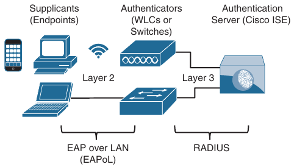

- The EAP identity exchange occur between the supplicant and the authentication server

- The authenticator has no idea what EAP type is in use; it simply takes the EAPoL encapsulated frame from the supplicant and encapsulates it withing the RADIUS packet sent to the authentication server and then opens up the port if the authentication server directs it to

- Therefore, the EAP authentication is completely transparent to the authenticator

- Below is seen the process flow of a successful 802.1x authetication

- Below we can see the following steps being performed:

    1. When the authenticator notices a port coming up, it starts the authentication process by sending periodic EAP request/identity frames

    - The supplicant can also initiate the authentication process by sending an EAPoL-start message to the authenticator

    2. The authenticator relays EAP messages between the supplicant and the authentication server, copying the EAP message in the EAPoL frame to an AV-pair inside the RADIUS packet and vice versa until an EAP method is selected
    
    - Authentication then takes place using the selected EAP method

    3. If authentication is successful, the authentication server returns a RADIUS access-accept message with an ecapsulated EAP-success message, as well as an authorization option such as a downloadable ACL (dACL)

    - When this is done, the authenticator opens the port

### EAP methods

- Many different EAP methods are available, most of them based on Transport Layer Security (TLS)

- Which one to choose depends on the security requirements and the EAP methods supported by the supplicants and the authentication server

- The following are the most commonly used EAP methods:

    - EAP challenge-based authentication method:

        - Extensible Authentication Protocol - Message Digest 5 (EAP-MD5)

    - EAP TLS authentication method:

        - Extensible Authentication Protocol - Transport Layer Security (EAP-TLS)

    - EAP tunelled TLS authentication methods:

        - Extensible Authentication Protocol Flexible Authentication via Secure Tunneling (EAP-FAST)

        - Extensible Authentication Protocol Tunnelled Transport Layer Security (EAP-TTLS)

        - Protected Extensible Authentication Protocol (PEAP)

    - EAP inner authentication methods:

        - EAP Generic Token Card (EAP-GTC)

        - EAP Microsoft Challenge Handshake Authentication Protocol Version 2 (EAP-MSCHAPv2)

        - EAP TLS

- EAP inner authentication methods are tunneled within PEAP, EAP-FAST, and EAP-TTLS, which are also known as *outer or tunneled TLS authentication methods*

- Tunneled TLS authentication methods establish a TLS outer tunnel between the supplicant and the authentication server; after the encrypted tunnel is established, client authentication credentials are negotiated using one of the EAP inner methods within the TLS outer tunnel

- This tunneling authentication method is similar to the way an HTTPS session is established between a web browser and a secure website (such as a bank's website)

- The HTTPS TLS tunnel is formed after the web browser validates the authenticity of the website's certificate (one-way trust), and when the TLS tunnel is established, the user can enter the login credentials on the website through the secure TLS tunnel

- Following is a description of each of the EAP authentication methods:

    - **EAP-MD5**: Uses MD5 message-digest algorithm to hide the credentials in a hash

    - The hash is sent to the authentication server, where it is compared to a local hash to validate the accuracy of the credentials

    - EAP-MD5 does not have a mechanism for mutual authentication; in other words, the authentication server validates the supplicant, but the supplicant does not validate the authentication server to see if it is trustworthy

    - This lack of mutual authentication makes it a poor choice as an authentication method

    - **EAP-TLS**: Uses the TLS Public Key Infrastructure (PKI) certificate authentication mechanism to provide mutual authentication of supplicant to authentication server and authentication server to supplicant

    - With EAP-TLS, both the supplicant and the authentication server must be assigned a digital certificate signed by a certificate authority (CA) that they both trust

    - Because the Supplicant also requires a certificate, this is the most secure authentication method; however it is also the most difficult to deploy due to the administrative burden of having to install a certificate on the supplicant side

    - **PEAP**: in PEAP, only the authentication server requires a certificate, which reduces the administrative burden of implementing EAP

    - PEAP forms an encrypted TLS tunnel between the supplicant and the authentication server

    - After the tunnel has been established, PEAP uses one of the following authentication inner methods to authenticate the supplicant through the outer PEAP TLS tunnel:

        - **PEAP-MSCHAPv2 (PEAPv0)**: Using this inner method, the client's credentials are sent to the server encrypted within an MSCHAPv2 session

        - This is the most common inner method, because it allows for simple transmission of username and password, or even computer name and computer password, to the RADIUS server, which can then authenticate them using Microsoft's Active Directory

        - **EAP-GTC (PEAPv1)**: This inner method was created by Cisco as an alternative to MSCHAPv2 to allow generic authentication to virtually any identity store, including OTP token servers, LDAP, NetIQ eDirectory, and more

        - **EAP-TLS**: This is the most secure EAP authentication method since it is essentially a TLS tunnel within another TLS tunnel

        - It is rarely used due to it's deployment complexity because it requires certificates to be installed on the supplicants

        - **EAP-FAST**: EAP-FAST, which is similar to PEAP, was developed by Cisco Systems as an alternative to PEAP to allow for faster reauthentications and support for faster wireless roaming

        - Just like PEAP, EAP-FAST forms an TLS outer tunnel and then transmits the client authentication credentials within that TLS tunnel

        - A major difference between FAST and PEAP is the FAST's ability to re-authenticate faster using the protected access credentials (PACs)

        - A PAC is similar to a secure cookie, stored locally on the host, as "proof" of a successful authentication

        - EAP-FAST also supports EAP chaining

        - **EAP-TTLS**: EAP-TTLS is similar in functionality to PEAP but is not as widely supported as PEAP

        - One major difference between them is that PEAP only supports EAP inner authentication methods, while EAP-TTLS can support additional inner methods such as legacy Password Authentication Protocol (PAP), Challenge Handshake Authentication Protocol (CHAP), and Microsoft Challenge Handshake Authentication Protocol (MSCHAP)

#### EAP Chaining

- EAP-FAST includes the option of EAP chaining, which supports machine and user authentication inside a single TLS tunnel

- It enables machine and user authentication to be combined into a single overall authentication result

- This allows the assignment of greater privileges or posture assessments to users who connect to the network using corporate-managed devices

### MAC Authentication Bypass (MAB)

- **MAC Authentication Bypass (MAB)** is an access control technique that enables port-based access control using the MAC address of an endpoint, and it is typically used as a fallback mechanism to 802.1x

- A MAB-enabled port can be dynamically enabled or disabled based on the MAC address of the endpoint that connects to it

- Below is illustrated the process flow of a successful MAB authentication

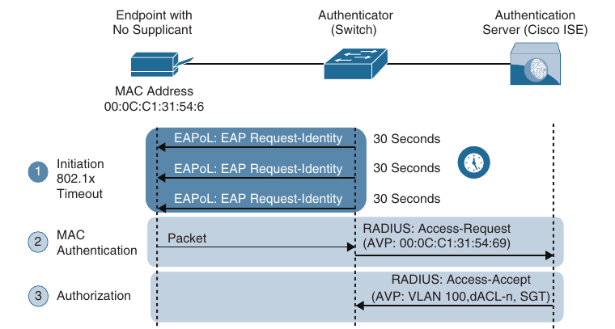

- Steps outlined in the image are the following:

    1. The switch initiates authentication by sending an EAPoL identity request message to the endpint every 30 seconds by default

    - After three timeouts (a period of 90 seconds by default), the switch determines that the endpoint does not have a supplicant and proceeds to authenticate it via MAB

    2. The switch begins MAB by opening the port to accept a single packet from which to learn the source MAC address of the endpoint

    - Packet sent before the port has fallen back to MAB (that is during the IEEE 802.1x timeout phase) are discarded immediately and cannot be used to learn the MAC address

    - After the switch learns the source MAC address, it discards the packet

    - It crafts a RADIUS access-request message using the endpoint's MAC address as the identity

    - The RADIUS server receives the RADIUS access-request message and performs MAC authentication

    3. The RADIUS server determines whether the device should be granted access to the network and, if so, what level of access to provide

    - The RADIUS server sends the RADIUS response (access-accept) to the authenticator, allowing the endpoint to access the network

    - It can also include authorization options such as dACLs, dVLANs, and SGT tags

- If 802.1x is not enabled, the sequence is the same except that MAB authentication starts immediately after linkup, instead of waiting for 802.1x to time out

- MAC addresses can be easily spoofed, which means any endpoint can be configured to use a MAC address other than the burned-in address

- For this reason, MAB authenticated endpoints should be given very restricted access and should only be allowed to communicate to the networks and services that the endpoints are required to speak to

- If the authenticator is a Cisco switch, then many authorization options can be applied as part of the authorization result from the authentication server, including the following:

    - Downloadable ACLs (dACLs)

    - Dynamic VLAN assignment (dVLAN)

    - Security Group Tags (SGT) tags

### Web Authentication (WebAuth)

- In an organization, endpoints that try to connect to the network might not have 802.1x supplicants and might not know the MAC address to perform MAB

- These endpoints can be employees and contractors with misconfigured 802.1x settings that require access to the corporate network or visitors and guests that need access to the Internet

- For these cases, Web Authentication (WebAuth) can be used

- WebAuth, like MAB, can be used as a fallback authentication mechanism for 802.1x

- If both MAB and WebAuth are configured as fallbacks for 802.1x, when 802.1x times out, a switch first attempts to authenticate through MAB, and if it fails, the switch attempts to authenticate with webauth

- With WebAuth, endpoints are presented with a web portal requesting a username and password

- The username and password that are submitted through the web portal are sent from the switch (or wireless controller, firewall, and so on) to the RADIUS server in a standard RADIUS access-request packet

- In a similar way to what occurs with MAB, the switch sends the request on behalf to the endpoint, to the RADIUS server because the endpoint is not authenticating directly to the switch

- Unlike MAB, WebAuth is only for users and not devices because it requires a web browser and manual username and password entry

- There are two types of WebAuth:

    - Local Web Authentication

    - Centralized Web Authentication with Cisco ISE

#### Local Web Authentication

- Local Web Authentication (LWA) is the first form of Web Authentication that was created

- For this type of WebAuth, the switch (or wireless controller) redirects the traffic (HTTP and/or HTTPS) to a locally hosted web portal running on the switch where an end user can enter a username and a password

- When the login credentials are submitted through the web portal, the switch sends a RADIUS access-request message, along with the login credentials to the RADIUS server

- It is important to remember that when the switch sends the login credentials on behalf of the user, it is considered to be LWA

- On Cisco switches, the LWA web portals are not customizable

- Some organizations require that the web portals be customized to match their corporate branding

- For those companies, LWA is not an acceptable solution

- In addition, with the Cisco switches, there is no native support for advanced services such as acceptable use policy (AUP) acceptance pages (for example, a popup requesting acceptance of terms and conditions before access is allowed), password changing capabilities, device registration, and self-registration

- For those advanced capabilities, a centralized web portal is required

- LWA does not support VLAN assignment; it supports only ACL assignment

- It also doesn't support the change of authorization (CoA) feature to apply new policies; therefore, access policies cannot be changed based on posture or profiling state, and even administrative changes cannot be made as a result of malware to quarantine the endpoint

- Cisco switches and a variety of third-party 802.1x-compliant switches have the option to assign a guest VLAN to endpoints that don't have an 802.1x supplicant

- Many production deployments of 802.1x still use this legacy option to provide wired guests access to the Internet; however, it is important to note that guest VLAN and LWA are mutually exclusive

#### Central Web Authentication with Cisco ISE

- Cisco created Centralized Web Authentication (CWA) to overcome LWA's deficiencies

- CWA supports CoA for posture profiling as well as dACL and VLAN authorization options

- CWA also supports all the advanced services, such as client provisioning, posture assessments, acceptable use policies, password changing, self-registration, and device registration

- Just like LWA, CWA is only for endpoints that have a web browser, where the user can manually enter a username and a password

- With CWA, WebAuth and guest VLAN functions remain mutually exclusive

- Authentication with CWA is different from authentication for LWA

- Step details for how CWA authentication takes place:

    1. The endpoint entering the network does not have a configured supplicant or the supplicant is misconfigured

    2. The switch performs MAB, sending the RADIUS access-request to Cisco ISE (the authentication server)

    3. The authentication server (ISE), sends the RADIUS result, including a URL redirection, to the centralized portal on the ISE server itself

    4. The endpoint is assigned and IP address, DNS server, and default gateway using DHCP

    5. The end user opens a browser and enters credentials into the centralized web portal

    - Unlike with LWA, the credentials are stored in ISE and are tied together with the MAB coming from the switch

    6. ISE sends a re-authentication change of authorization (CoA-reauth) to the switch

    7. The switch sends a new MAB request with the same session ID to ISE

    - ISE sends the final authorization result to the switch for the end user, including an authorization option such as downloadable ACL (dACL)

### Enhanced Flexible Authentication (FlexAuth)

- By default, a Cisco switch configured with 802.1x, MAB and WebAuth always attempts 802.1x authentication first, followed by MAB, and finally WebAuth

- If an endpoint that does not support 802.1x tries to connect to the network, it needs to wait for a considerable amount of time before WebAuth is oferred as an authentication option

- Enhanced FlexAuth (also referred to as *Access Session Manager*) addresses this problem by allowing multiple authentication methods concurently (for example, 802.1x and MAB) so that endpoints can be authenticated and brought online more quickly

- Enhanced FlexAuth is a key component of the Cisco Identity-based Networking Services (IBNS) 2.0 integration solutions, which offers authentication, access control, and user policy enforcement

### Cisco Identity-Based Networking Services (IBNS) 2.0

- Cisco IBNS 2.0 is an integrated solution that offers authentication, access control, and user policy enforcement with a common end-to-end access policy that applies to both wired and wireless networks

- It is a combination of the following existing features and products:

    - Enhanced FlexAuth (Access Session Manager)

    - Cisco Common Classification Policy Language (C3PL)

    - Cisco ISE

### Cisco TrustSec

- **Cisco TrustSec** is a next-generation access control enforcement solution developed by Cisco to address the growing operational challenges of traditional network segmentation using VLANs and maintaining firewall rules and ACLs using Security Group Tags (SGT) tags

- TrustSec uses SGT tags to perform ingress tagging and egress filtering to enforce access control policy

- Cisco ISE assigns the SGT tags to users or devices that are successfully authenticated and authored through 802.1x, MAB or WebAuth

- The SGT tag assignment is delivered to the authenticator as an authorization option (in the same way as a dACL)

- After the SGT tag is assigned, an access enforcement policy (allow or drop) based on the SGT tag can be applied at any egress point of the TrustSec network

- SGT tags are referred to as *scalable group tags* in Cisco Software-defined Access (SD-Access)

- SGT tags represent the context of the user, device, use case or function

- This means SGT tags are often named after particular roles or business use cases

- For example, a corporate user with a Mac that successfully authenticates via 802.1x using EAP chaining could be assigned an SGT by ISE named Mac_Corporate

- If the MAC is not compliant with posture requirements because it is not owned by the corporation, then it can be assigned an SGT named Mac_Guest

- Endpoints are not aware of the SGT tag

- The SGT tag is only known and applied in the network infrastructure

- Below is shown a list of default SGT tags on Cisco ISE

- Notice that the SGT tags all have business-relevant names and descriptions

- The SGT name is available on ISE and network devices to create security group policies; what is actually being inserted into a Layer 2 frame SGT tag is a numeric value like the ones shown on the SGT column in decimal and hexadecimal notation

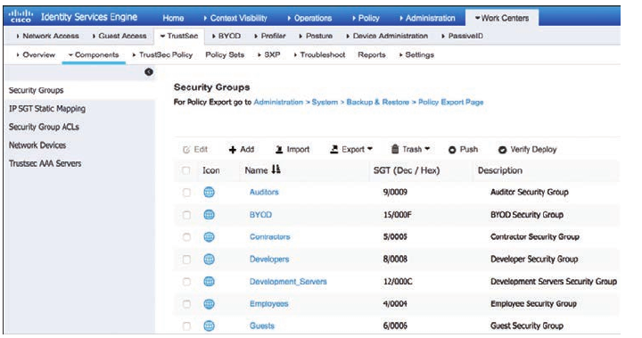

- TrustSec configuration occurs in three phases:

    - Ingress classification

    - Propagation

    - Egress enforcement

#### Ingress classification

- Ingress classification is the process of assigning SGT tags to users, endpoints, or other resources, as they ingress the TrustSec network, and it can happen in one of two ways:

    - **Dynamic Assignment**: The SGT is assigned dynamically and can be downloaded as an authorization option from ISE when authenticating using 802.1x, MAB, or WebAuth

    - **Static Assignment**: In environments such as data center that do not require 802.1x, MAB, or WebAuth authentication, dynamic SGT assignment is not possible

    - In these cases, SGT tags can be statically mapped on SGT-capable network devices

    - Static assignment on a device can be one of the following:

        - IP to SGT tag

        - Subnet to SGT tag

        - VLAN to SGT tag

        - Layer 2 interface to SGT tag

        - Layer 3 logical interface to SGT tag

        - Port to SGT tag

        - Port profile to SGT tag

- As an alternative to assigning an SGT tag to a port, Cisco ISE added the ability to centrally configure a database of IP addresses and their corresponding SGT tags

- Network devices that are SFT capable can download the list from Cisco ISE

#### Propagation

- Propagation is the process of communicating the mappings to the TrustSec network devices that will enforce security group policy based on SGT tags

- There are two methods available for propagating the SGT tag: inline tagging (also referred to as native tagging) and the Cisco-created protocol SGT Exchange Protocol (SXP)

- **Inline tagging**: With inline tagging, a switch inserts the SGT tag inside a frame to allow upstream devices to read and apply policy

- Native tagging is completely independent of any Layer 3 protocol (IPv4 or IPv6), so the frame or packet can preserve the SGT tag throughout the network infrastructure (routers, switches, firewalls, and so on) until it reaches the egress point

- The downside of native tagging is that it is supported only by Cisco network devices with ASIC support for TrustSec

- If a tagged frame is received by a device that does not support native tagging in hardware, the frame is dropped

- Below is seen a Layer 2 frame with a 16-bit SGT value

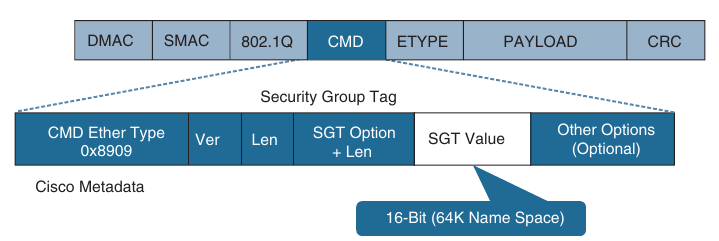

- **SXP propagation**: SXP is a TCP-based peer-to-peer protocol used for network devices that do not support SGT inline tagging in hardware

- Using SXP, IP-to-SGT mappings can be communicated between non-inline tagging switches and other network devices

- Non-inline tagging switches also have an SGT mapping database to check packets against and enforce policy

- The SXP peer that sends IP-to-SGT bindings is called a *speaker*

- The IP-to-SGT binding receiver is called a *listener*

- SXP connections can be single-hop or multi-hop

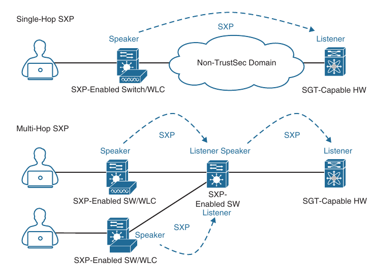

- Below we can see an example of one access switch that supports native tagging

- The packets get tagged on the uplink port and through the infrastructure

- It also shows a switch that is not capable of inline tagging and that uses SXP to update the upstream switch

- In both cases, the upstream switch continues to tag the traffic throughout the infrastructure

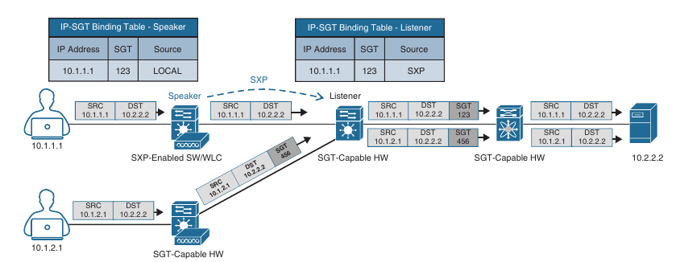

- Below is shown an example where a user authenticates to ISE via 802.1x

- The user is connected to a switch that does not support inline tagging or SXP

- This means an SGT-to-IP binding cannot be assigned to the user on the switch

- The solution is for ISE to assign an SGT to the user by sending a mapping through SXP to an upstream device that supports TrustSec

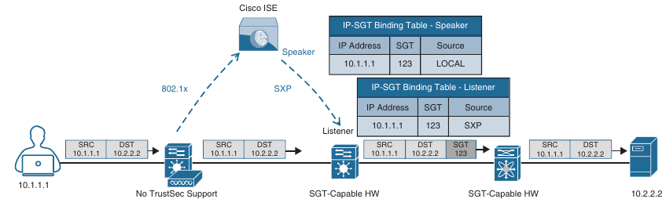

- Cisco ISE also supports assigning the SGT mapping information to an upstream device through pxGrid

#### Egress Enforcement

- After the SGT tags have been assigned (classification) and are being transmitted across the network (propagation), policies can be enforced at the egress point of the TrustSec network

- There are multiple ways to enforce traffic based on the SGT tag, and they can be divided into two major types:

    - **Security Group ACL (SGACL)**: Provides enforcement in routers and switches. Access lists provide filtering based on source and destination SGT tags

    - **Security Group Firewall (SGFW)**: Provides enforcement on Cisco Secure Firewalls. It requires tag-based routes to be defined locally and on the firewall

- Below we can see how SGACL is blocking access to traffic with an SGT value of 123

- Below is also illustrated an SGACL egress policy production matrix from Cisco ISE that allows the defined SGACL enforcements to be visualized

- The left column represents the source SGT tags, and the top row represents the destination SGT tags

- The ACL enforcement is the cell within the matrix where the source and destination SGT tags meet, and the direction is always from source SGT to destination SGT

- For example, the matrix shows that developers (left column) are allowed to communicate to development servers using a permit IP ACL, while all other SGT tags are denied with a deny IP ACL

- Permit IP is the equivlent of permitting all, and deny IP is the equivalent of denying all

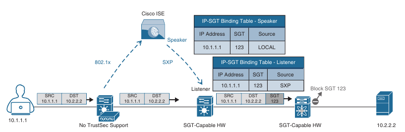

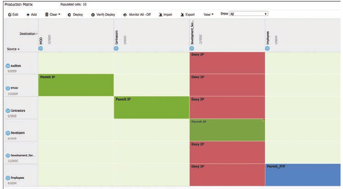

- In addition to permit all and deny all SGACLs, more granular SGACLs are supported

- Above is also shown that all employees trying to communicate with other employees will have a Permit_FTP ACL applied on egress

- Below is shown the SGACL Permit_FTP configuration on Cisco ISE, which is only allowing FTP traffic (TCP port 21) and denying all other traffic

- SGACL policies can be used to provide TrustSec software-defined segmentation capabilities to wired, wireless, and VPN networks, all centrally managed through ISE, as an alternative method to the traditional VLAN-based segmentation

- Below is illustrated an example of TrustSec software-defined segmentation where only developers have access to the development servers, and any other employee trying to access them is blocked

- Notice that traffic is blocked on egress and not on ingress

- This example also illustrates that FTP is the only protocol allowed between employees (even within the same VLAN), while any other type of traffic is blocked

- For the employees connected to the same switch, the switch is acting as the ingress and egress point

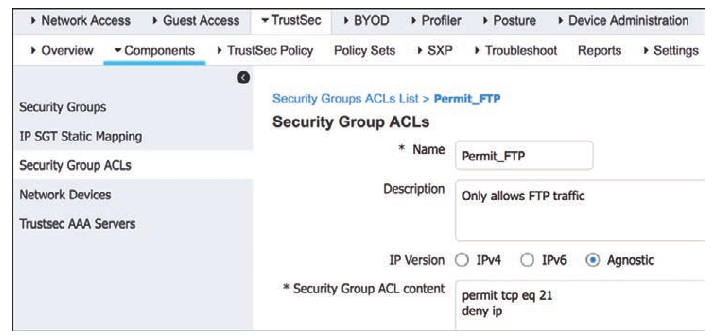

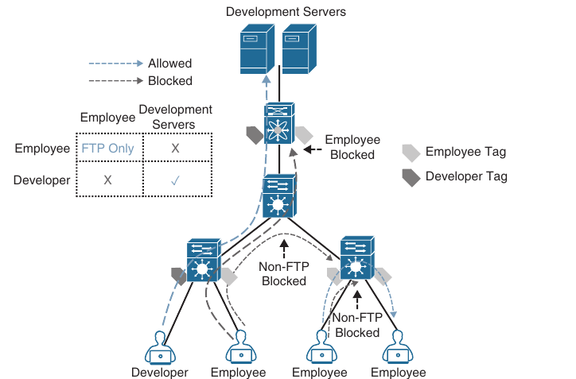

### MACSec

**MACSec** is an IEEE802.1AE standards-based Layer 2 encryption method; this means the traffic is encrypted only on the wire between two MACSec peers and is unencrypted as it is processed internally within the switch

- This allows the switch to look into the inner packets for things like SGT tags to perform packet enforcement or QoS prioritization

- MACSec also leverages onboard ASICs to perform the encryption and decryption rather than having to offload to a crypto engine (as with IPsec)

- MACSec is based on the Ethernet frame format; however, an additional 16-byte MACSec Security Tag field (802.1AE header) and a 16-byte Integrity Check Value (ICV) field are added

- This means that all the devices in the flow of the MACSec communications must support MACSec for these fields to be used and to secure the traffic

- MACSec provides authentication using Galois Message Authentication Code (GMAC) or authenticated encryption using Galois/Counter Mode Advanced Encryption Standard (AES-GCM)

- Below is illustrated the MACSec frame format and how it encrypts the TrustSec SGT tag

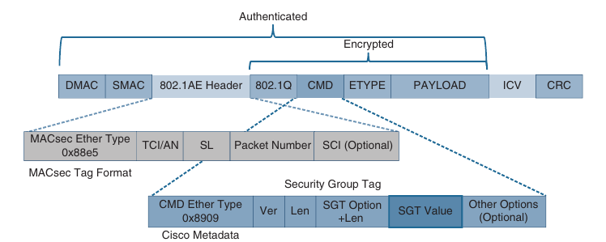

- The MACSec Security Tag fields are as follows:

    - **MACSec EtherType (first two octets)**: Set to 0x88e5, designating the frame as a MACSec frame

    - **TCI/AN (third octet)**: Tag Control Information/Association Number field, designating the version number if confidentiality or integrity is used on it's own

    - **SL (fourth octet)**: Short Length Field, designating the length of the encrypted data

    - **Packet Number (octets 5-8)**: The packet number for replay protection and building of the initialization vector

    - **SCI (octets 9-16)**: Secure Channel Identifier, for clasifying the connection to the virtual port

- Two MACSec keying mechanisms are available:

    - **Security Association Protocol (SAP)**: This is a proprietary Cisco keying protocol used between Cisco switches

    - **MACSec Key Agreement (MKA) protocol**: MKA provides the required session keys and manages the required encryption keys

    - The 802.1AE encryption with MKA is supported between endpoints and the switch as well as between switches

#### Downlink MACSec

- Is the term used to describe the encrypted link between an endpoint and a switch

- The encryption between the endpoint and the switch is handled by the MKA keying protocol

- This requires a MACSec-capable switch and a MACSec-capable supplicant on the endpoint (such as Cisco Secure Client)

- The encryption on the endpoint can may be handled in hardware (if the endpoint possesses the correct hardware) or in software, using the main CPU for encryption and decryption

- The Cisco switch has the ability to force encryption, make encryption optional, or force non-encryption; this setting may be configured manually per port (which is not very common) or dynamically as an authorization option from Cisco ISE (which is much more common)

- If ISE returns an encryption policy with the authorization result, the policy issued by ISE overrides everything set using the switch CLI

#### Uplink MACSec

- *Uplink MACSec* is the term of encrypting a link between switches with 802.1AE

- By default, uplink MACSec uses Cisco proprietary SAP encryption

- The encryption is the same AES-GCM-128 encryption used with both uplink and downlink MACSec

- Uplink MACSec may be achieved manually or dynamically

- Dynamic MACSec requires 802.1x authentication between the switches
