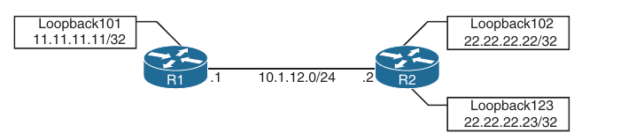

## Network Assurance

1. Network Diagnostic Tools (ping, traceroute, SNMP and syslog)

2. Debugging

3. NetFlow and Flexible NetFow

4. Switched Port Analyzer (SPAN) Technologies

5. IP SLA

6. Cisco DNA Center Assurance

- Operating a network requires a specific set of skills, like routing knowledge, troubleshooting techniques and design experience

- However, depth of skill sets can vary widely, based on years of experience and size and complexity of the networks that network operators are responsible for

- For example, many small networks are very complex, and many very large networks are simple in design and complexity

- Having a foundational skill set in key areas can help with the burden of operating and troubleshooting a network

- Simply put, a network engineer who has experience with a technology will be more familiar with the technology in the event that the issue or challenge comes up again

- Most common tools and techniques used to operate and troubleshoot a network, and some software-defined methods of managing, maintaining and troubleshooting networks

- Basic topology used to illustrate these techniques:



### Network Diagnostic Tools

- Many diagnostic tools are readily available

#### ping

- ping is one of the more useful and underrated troubleshooting tools in any network

- When you're following a troubleshooting flow or logic, it is critical to follow the basics first

- For example, if a BGP peering adjancency is not coming up, it would make sense to check basic reachability between the two peers prior to doing any deep-dive BGP troubleshooting or debugging

- Issues often lie in a lower level of the OSI model; physical layer issues, such as a cable being unplugged, can be found with a quick ping

- The following troubleshooting flow is a quick and basic way to check reachability and try to determine what the issue may be

    - **Step 1**: Gather the facts

    - If you receive a trouble ticket saying that a remote location is down and cannot access the headquarters, it is important to know the IP address information for the remote site router or device

    - For example, using the topology above, say that R2 is unable to reach the Loopback 0 interface on R1

    - R2's IP address of it's Ethernet 0/0 is 10.1.12.2/24

    - **Step 2**: Test reachability using the `ping` command

    - Check to see whether the other end of the link is reachable by issuing `ping 10.1.12.2` command at the command-line interface (CLI)

    - **Step 3**: Record the outcome of the `ping` command and move to the next troubleshooting step

    - If `ping` is successful, then the issue isn't likely related to basic reachability

    - If `ping` is unsuccessful, the next step could be checking something more advanced, such as interface issues, routing issues, access lists, or intermediate firewalls

- Below we can see a successful `ping` between R1 and R2

- This example shows five 100-byte ICMP echo request packets send to 10.1.12.2 with a 2-second timeout

- The result is 5 exclamation points (!!!!!)

- This means that all five pings were successful with the default parameters, and ICMP echo reply packets were received from the destination

- Each ping sent is represented by a single exclamation point (!) or period (.)

- This means that basic reachability has been verified

- The success rate is the percentage of pings that were successful out of the total pings sent

- The round-trip time is measured in a minimum/average/maximum manner

- For example, if five packets were sent, and all five were successful, the success rate was 100%; in this case, the minimum/average/maximum were all 3/4/9 ms

```
R1#ping 10.1.12.2
Type escape sequence to abort.
Sending 5, 100-byte ICMP Echos to 10.1.12.2, timeout is 2 seconds:
!!!!!
Success rate is 100 percent (5/5), round-trip min/avg/max = 3/4/9 ms
R1#
```

- It is important to illustrate what an unsuccessful ping looks like as well

- Below is an unsuccessful ping to R2's E0/0 interface with an IP address of 10.1.12.2

```
R1#ping 10.1.12.2
Type escape sequence to abort.
Sending 5, 100-byte ICMP Echos to 10.1.12.2, timeout is 2 seconds:
.....
Success rate is 0 percent (0/5)
R1#
```

- It is easy to count the number of pings when a low number of them were sent

- The default is five

- However, the parameters mentioned earlier for the `ping` command can be changed and manipulated to aid in troubleshooting

- Below are shown some of the available options for the `ping` command on a Cisco device

- These options can be seen by using the context-sensitive help (?) after the IP address that follows the `ping` command

- More important options are `repeat`, `size`, and `source` options

```
R1#ping 10.1.12.2 ?
  Extended-data  specify extended data pattern
  data           specify data pattern
  df-bit         enable do not fragment bit in IP header
  dscp           Specify DSCP value in ASCII/Numeric for Ingress
  ingress        LAN source interface for Ingress
  repeat         specify repeat count
  size           specify datagram size
  source         specify source address or name
  timeout        specify timeout interval
  tos            specify type of service value
  validate       validate reply data
  <cr>           <cr>
```

- Suppose that while troubleshooting, a network operator wants to make a change to the network and validated that it resolved the issue at hand

- A common way of doing this is to use the `repeat` option for the `ping` command

- Many times, network operators wants to run a continuous or a long ping to see when the destination is reachable

- Below is shown a long ping set with a repeat of 100

- In this case the ping was not working, and then the destination become available - as shown by the periods and exclamation points

```
R1#ping 10.1.12.2 repeat 100 
Type escape sequence to abort.
Sending 100, 100-byte ICMP Echos to 10.1.12.2, timeout is 2 seconds:
..................!!!!!!!!!!!!!!!!!!!!!!!!!!!!!!!!!!!!!!!!!!!!!!!!!!!!!!!!!!!!!!!!!!!!!!!!!!!!!!!!!!
Success rate is 82 percent (82/100), round-trip min/avg/max = 3/4/26 ms
R1#
```

- Another common use for the `ping` command is to send different sizes of packets to a destination

- An example might be to send 1500-byte packets with the DF bit set to make sure there are no MTU issues on the interfaces or to test different quality of service policies that restrict certain packet sizes

- Below is shown a ping destined to R2's E0/0 interface with an IP address 10.1.12.2 and a packet size of 1500 bytes

- The output shows that it was successful

```
R1#ping 10.1.12.2 size 1500
Type escape sequence to abort.
Sending 5, 1500-byte ICMP Echos to 10.1.12.2, timeout is 2 seconds:
!!!!!
Success rate is 100 percent (5/5), round-trip min/avg/max = 3/4/8 ms
```

- It is sometimes important to source pings from the appropriate interface when sending the pings to the destination

- Otherwise, the source IP address used is the outgoing interface

- In this topology there is only one outgoing interface 

- However, if there were multiple outgoing interfaces, the router would check the routing table to determine the best interface to use for the source of the ping

- If a network operator wanted to check a specific path - such as between the Loopback101 interface of R1 and the destination being R2's Loopback102 interface that has IP address 22.22.22.22 - you could use the `source-interface` option of the `ping` command

- Below are shown all options covered thus far `repeat`, `size` and `source-interface` in a single `ping` command

- Multiple options can be used at the same time, as shown here

```
R1#ping 22.22.22.22 source l102 size 1500 repeat 10 
Type escape sequence to abort.
Sending 10, 1500-byte ICMP Echos to 22.22.22.22, timeout is 2 seconds:
Packet sent with a source address of 11.11.11.11 
!!!!!!!!!!
Success rate is 100 percent (10/10), round-trip min/avg/max = 4/4/7 ms
R1#
```

- An extended ping can take advantage of the same options already discussed as well as some more detailed options for troubleshooting

- These options are listed below:

```
Option                          Description

Protocol                        IP, Novell, AppleTalk, CLNS, IPv6, and so on; the default is IP

Target IP address               Destination IP address of ping packets

Repeat Count                    Number of ping packets sent; the default is 5 packets

Datagram Size                   Size of the ping packets; the default is 100 bytes

Timeout is seconds              How much an echo reply response is waited for

Extended commands               Yes or No to use extended commands; the default is No, but if Yes is used, more options become available

Source Address or               IP address of the source interface or the interface name
Interface

Type of Service (ToS)           The Type of Service to be used for each probe; 0 is the default

Set DF bit in IP header         Sets the Do Not Fragment bit in the IP header; the default is No

Data Pattern                    The data pattern used in the ping packets; the default is 0xABCD

Loose, Strict, Record,          The options set for the ping packets:
Timestamp, Verbose              Loose: Specifies hops that ping packets should traverse
                                Strict: Same as Loose with the exception that packets can only traverse specified hops
                                Record: Displays IP addresses of first nine hops that the ping packes traverse
                                Timestamp: Displays the round-trip time to the destination for each ping
                                Verbose: Default option that is automatically selected with any and all other options
```

- If Source Interface is used, the interface name must be spelled out and not abbreviated (for example, Ethernet0/0 rather than E0/0 or Eth0/0)

- Otherwise, you will receive the following error:

```
Source address or interface: Loop0  
Translating "Loop0"...domain server (255.255.255.255)

% Invalid source. Must use same-VRF IP address or full interface name without spaces (e.g. Serial0/1)
```

- Using the same topology as above, let's now look at an extended ping sent from R1's Loopback0 interface, destined to R2's Loopback 123 interface

- List of extended options used:

```
IP

Repeat count of 1

Datagram size of 1500 bytes

Timeout of 1 second

Source Inteface of Loopback 0 

Type of service of 184

Setting the DF bit in the IP header

Data pattern 0xABBA

Timestamp and default of Verbose
```

```
R1#ping 
Protocol [ip]: 
Target IP address: 22.22.22.22
Repeat count [5]: 1
Datagram size [100]: 1500 
Timeout in seconds [2]: 1
Extended commands [n]: y
Ingress ping [n]: 
Source address or interface: Loopback0
DSCP Value [0]: 184 
%Type 0..63 or ef, af11-13, af21-23, af31-33, af41-43, or cs1-7

DSCP Value [0]: ef 
Set DF bit in IP header? [no]: yes
Validate reply data? [no]: 
Data pattern [0x0000ABCD]: 0xABBA
Loose, Strict, Record, Timestamp, Verbose[none]: Timestamp, Verbose
% No such option - "Timestamp, Verbose"Loose, Strict, Record, Timestamp, Verbose[none]: Timestamp
Number of timestamps [ 9 ]: 
Loose, Strict, Record, Timestamp, Verbose[TV]: Verbose
Loose, Strict, Record, Timestamp, Verbose[T]: 
Sweep range of sizes [n]: 
Type escape sequence to abort.
Sending 1, 1500-byte ICMP Echos to 22.22.22.22, timeout is 1 seconds:
Packet sent with a source address of 11.11.11.11 
Packet sent with the DF bit set
Packet has data pattern 0x0000ABBA
Packet has IP options:  Total option bytes= 40, padded length=40
 Timestamp: Type 0.  Overflows: 0 length 40, ptr 5
  >>Current pointer<<
  Time= 00:00:00.000 UTC (00000000)
  Time= 00:00:00.000 UTC (00000000)
  Time= 00:00:00.000 UTC (00000000)
  Time= 00:00:00.000 UTC (00000000)
  Time= 00:00:00.000 UTC (00000000)
  Time= 00:00:00.000 UTC (00000000)
  Time= 00:00:00.000 UTC (00000000)
  Time= 00:00:00.000 UTC (00000000)
  Time= 00:00:00.000 UTC (00000000)

!
Success rate is 100 percent (1/1), round-trip min/avg/max = 10/10/10 ms
```

- Above is shown an extended ping using all these options and the output received from the tool on the command line

- A repeat count of 1 is used in this example just to make the output more legible

- Usually, this is 5 at the minimum or a higher number, depending on what is being diagnosed

- Most common interface MTU settings are set to 1500 bytes

- Setting the MTU in an extended ping and setting the DF bit in the IP header can help determine if whether there are MTU settings in the path that are not set appropriately

- A good example of when to use this is with tunneling

- It is important to account for the overhead of the tunnel technology, which can vary based on the tunnel technology being used

- Specifying a Type of Service of 184 in decimal translates to Expedited Forwarding (EF) or per-hop behavior (PHB)

- This behavior can be useful when testing real-time quality of service (QoS) policies in a network environment

- However, some service providers do not honor pings or ICMP traffic marked with different PHBs

- Setting Data Patterns can help with troubleshooting framing errors, line coding, or clock signalling issues on serial interfaces

- Service providers often ask network operators to send all 0s (0x0000) or all 1s (0xffff) during testing, depending on the issues they suspect

- Finally, a timestamp is set in this example, in addition to the default Verbose output

- This gives a clock timestamp of when the destination sent an echo reply message back to the source

- `ping` and `extended ping` are very useful and powerful troubleshooting tools that you are likely to use daily

- The information gained from using the `ping` command can help lead network operations staff where an issue may exist within the network environment

- More often than not, `ping` is used as a quick verification to perform or narrow down the root cause of a network issue that is causing reachability problems

#### Traceroute

- **traceroute** is another common troubleshooting tool

- **traceroute** is often use to troubleshoot when trying to determine where traffic is failing as well as what path traffic takes throughout the network

- **traceroute** shows the IP addresses or DNS names of the hops between the source and destination

- It also shows how long it takes to reach the destination at each hop, measured in miliseconds

- This tool is frequently used when more than one path is available to the destination or when there is more than one hop to the destination

- Using the same topology from above, we can see a traceroute from R1 to R2's Loopback 102 address of 22.22.22.22

- That traceroute is successful

- The output shows that the traceroute to 22.22.22.22 was sent to the next hop of 10.1.12.2 and was successful

- Three probes were sent and the last one timed out

```
R1#traceroute 22.22.22.22
Type escape sequence to abort.
Tracing the route to 22.22.22.22
VRF info: (vrf in name/id, vrf out name/id)
  1 10.1.12.2 5 msec 3 msec * 
```

- Below is an unsuccessful traceroute 

- There are many reasons for unsuccessful traceroutes; however, one of the most common is a missing route or down interface

- Below is illustrated a failed traceroute due to a missing route or mistyped destination

- Notice that when a timeout was occured, traceroute displays an asterisk

- By default, traceroute tries up to 30 times/hops before completing

```
R1#traceroute 22.22.22.23
Type escape sequence to abort.
Tracing the route to 22.22.22.23
VRF info: (vrf in name/id, vrf out name/id)
  1  *  *  * 
  2  *  *  * 
  3  *  *  * 
  4  *  *  * 
  5  *  *  * 
  6  *  *  * 
  7  *  *  * 
  8  *  *  * 
  9  *  *  * 
 10  *  *  * 
 11  *  *  * 
 12  *  *  * 
 13  *  *  * 
 14  *  *  * 
 15  *  *  * 
 16  *  *  * 
 17  *  *  * 
 18  *  *  * 
 19  *  *  * 
 20  *  *  * 
 21  *  *  * 
 22  *  *  * 
 23  *  *  * 
 24  *  *  * 
 25  *  *  * 
 26  *  *  * 
 27  *  *  * 
 28  *  *  * 
 29  *  *  * 
 30  *  *  * 
```

- Below is shown the R1's routing table

- This output shows that R1 has a /32 host route to 22.22.22.22 using OSPF

- However, there is no route to 22.22.22.23/32, which is why the traceroute is failing

```
R1#sh ip route 
Codes: L - local, C - connected, S - static, R - RIP, M - mobile, B - BGP
       D - EIGRP, EX - EIGRP external, O - OSPF, IA - OSPF inter area 
       N1 - OSPF NSSA external type 1, N2 - OSPF NSSA external type 2
       E1 - OSPF external type 1, E2 - OSPF external type 2
       i - IS-IS, su - IS-IS summary, L1 - IS-IS level-1, L2 - IS-IS level-2
       ia - IS-IS inter area, * - candidate default, U - per-user static route
       o - ODR, P - periodic downloaded static route, H - NHRP, l - LISP
       a - application route
       + - replicated route, % - next hop override, p - overrides from PfR

Gateway of last resort is not set

      10.0.0.0/8 is variably subnetted, 2 subnets, 2 masks
C        10.1.12.0/24 is directly connected, GigabitEthernet0/0
L        10.1.12.1/32 is directly connected, GigabitEthernet0/0
      11.0.0.0/32 is subnetted, 1 subnets
C        11.11.11.11 is directly connected, Loopback0
      22.0.0.0/32 is subnetted, 1 subnets
O        22.22.22.22 [110/2] via 10.1.12.2, 00:27:56, GigabitEthernet0/0
```

- Furthermore, if a less specific route is added to R1 that points to 22.0.0.0/8 or 22.0.0.0 255.0.0.0, the traceroute returns a "host unreachable" message

- This is because there is a route to the next hop, (R2- 10.1.12.2), but once the traceroute gets to R2, there is no interface or route to 22.22.22.23/32, and the traceroute fails

- Below is shown this scenario

```
R1(config)#ip route 22.0.0.0 255.0.0.0 10.1.12.2

R1#traceroute 22.22.22.23
Type escape sequence to abort.
Tracing the route to 22.22.22.23
VRF info: (vrf in name/id, vrf out name/id)
  1 10.1.12.2 4 msec 4 msec 6 msec
  2 10.1.12.2 !H  !H  * 
```

- If a new loopback interface were added to R2 with the IP address 22.22.22.23 255.255.255.0, the traceroute would be successful

- Below is shown the new Loopback123 interface configured on R2

- Note that the response from above includes !H, which means R1 received an ICMP "destination host unreachable" message from R2

- This is what happens when there is not a route present to the IP address

```
conf t
 interface Loopback123
  ip address 22.22.22.23 255.255.255.255
  ip ospf 1 area 0
```

- Now that the new Lopback 123 interface is configured on R2, it is important to cycle back and rerun the traceroute from R1 to the 22.22.22.23 address to see if it is successful

- Below is shown a successful traceroute from R1 to Loopback123 on R2

```
R1#traceroute 22.22.22.23
Type escape sequence to abort.
Tracing the route to 22.22.22.23
VRF info: (vrf in name/id, vrf out name/id)
  1 10.1.12.2 7 msec 6 msec * 
```

- Another great benefit of `traceroute` is that is has options available, much like the `ping` command
