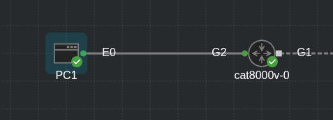

## Network Device Access Control and Infrastructure Security

1. Access Control Lists (ACLs)

2. Terminal Lines and Password Protection

3. Authentication, Authorization, and Accounting (AAA)

4. Zone-Based Firewall (ZBFW)

5. Control Plane Policing (CoPP)

6. Device Hardening

### Access Control Lists (ACLs)

- **Access control lists** (also known as ACLs or access-lists) are sequential lists of access control entries (ACEs) that perform permit or deny packet classification, based on predefined conditional matching statemets

- Packet classification starts at top (lowest sequence) and proceeds down (higher sequence) until a matching pattern is identified

- When a match is found, the appropriate action (permit or deny) is taken, and processing stops

- At the end of every ACL is an implicit deny ACE, which denies all packets that did not match earlier in the ACL

- Access lists applied on Layer 3 interfaces are sometimes referred to as router ACLs (RACLs)

- ACLs can be used to provide packet classification for a variety of features, such as quality of service (QoS), Network Address Translation (NAT), or network identification within routing protocols

- ACLs that can be used for packet filtering:

    - **Numbered standard ACLs**: These ACLs define packets based solely on the source network, and they use numbered entries 1-99 and 1300-1999

    - **Numbered extended ACLs**: These ACLs define packets baded on source, destination, protocol, port, or a combination of other packet attributes, and they use numbered entries 100 - 199 and 2000 - 2699

    - **Named ACLs**: These ACLs allow standard and extended ACLs to be given names instead of numbers and are generally preferred because the name can be correlated to the functionality of the ACL

    - **Port ACLs (PACLs)**: These ACLs can use standard, extended, named, and named extended MAC ACLs to filter traffic on Layer 2 switch ports

    - **VLAN ACLs (VACLs)**: These ACLs can use standard, extended, named, and named extended MAC ACLs to filter traffic on VLANs

- ACLs use wildcard masks instead of subnet masks to classify packets that are being evaluated

- For example, to match all packets with the IP address 192.168.1.0 and the subnet mask 255.255.255.0, an ACL would use an inverted subnet mask, better known as an wildcard mask, of 0.0.0.255 to match the three octets exactly, while all the bits of the last octet could be any value between 0 and 255

- All that is required to convert a subnet mask into a wildcard mask is to substract the subnet mask from 255.255.255.255

- The following shows a subnet mask 255.255.128.0 being converted into a wildcard mask by substracting it from 255.255.255.255

- The end result is a 0.0.127.255 wildcard mask:

```
    255.    255.    255.    255
-   255.    255.    128.    0           Subnet mask
    ----------------------------
    0.      0.      127.    255         Wildcard mask
```

- ACLs have no effect until they are applied to an interface

- Therefore, the next step after creating an ACL is to apply it to an interface

- In addition to the interface, you have to specify the direction (in or out) in which the ACL needs to be applied

- Cisco routers allow only one inbound ACL to and one outbound ACL per interface

- ACLs can be used for various other services in addition to applying to interfaces, such as route maps, class maps, NAT, SNMP, virtual terminal (vty lines), or traffic classification techniques

#### Numbered Standard ACLs

- The process of defining a numbered standard ACL for IOS-XE devices is as follows:

    1. Define the ACL:

    ```
    conf t
     access-list <acl-number> [ deny | permit ] <source> <source-wildcard>
    ```

    - The ACL number can be 1-99 or 1300-1999

    2. Apply the ACL to an interface:

    ```
    conf t
     interface <name>
      ip access-group <acl-nr> <in|out>
    ```

- The keyword `any` and `host` can be used as abbreviation for <source> <source-wildcard>

- Using the keyword `any` is the equivalent of specifying 0.0.0.0 255.255.255.255, which matches all packets

- For example, `access-list 1 permit 0.0.0.0 255.255.255.255` is equivalent to `access-list 1 permit any`

- The keyword `host` is used to match a specific host

- It is equivalent of having specified a host IP address followed by a wildcard mask of 0.0.0.0

- For example: `access-list 1 permit 192.168.1.1 0.0.0.0` is equivalent to `access-list 1 permit host 192.168.1.1`

- The source and source-wildcard reflect a matching pattern for the network prefix that is being matched

- Below are provided standard ACE entries from within the ACL configuration mode and specifies the networks that would match with a standard ACL

```
ACE entry                                                           Networks

permit any                                                          Permits all networks

permit 172.16.0.0 0.0.255.255                                       Permits all networks in the 172.16.0.0/16 range

permit host 192.168.1.1                                             Permits only the 192.168.1.1/32 network
```

- Below we can see how a numbered standard ACL is created and applied to an interface to deny traffic from the 172.16.0.0/24 subnet and from host 192.168.1.1/32 while allowing all other traffic coming into interface G0/1

- Notice that the last ACE in the ACL permits all traffic (permit any)

- If this ACE is not included, all traffic will be dropped because of the implicit deny (deny any) at the end of every ACL

- R1:

```
conf t
 access-list 1 deny 172.16.0.0 0.0.0.255
 access-list 1 deny host 192.168.1.1
 access-list 1 permit any

 interface g0/1
  ip access-group 1 in
```

#### Numbered Extended ACLs

- The process of defining numbered extended ACL is as follows:

    1. Define the ACL as follows:

    ```
    conf t
     access-list <number> [deny|permit] <protocol> <source> <source-wildcard> <destination> <destination-wildcard> [protocol-options] <log | log-input> 
    ```

    - The ACL number can be 100-199 or 2000-2699

    2. Apply the ACL to an interface:

    ```
    conf t
     interface <name>
      ip access-group <acl-nr> <in|out>
    ```

- As with standard ACLs, `source` `source-wildcard` and `destination` `destination-wildcard` can be defined to match a single host with the `host` keyword or match any subnet with the `any` keyword

- The `protocol-options` keyword differs based on the protocol specified by the ACE

- For example, when TCP or UDP protocols are defined, eq, lt, and gt (equal to, less than, and greater than) keywords become available to specift ports to be matched as well as more granular options such as SYN and ACK

- Below we can see how a numbered extended ACL is created and applied to an interface to block all telnet and ICMP traffic as well as deny all IP traffic from host 10.1.2.2 to host 10.1.2.1

- Notice how telnet's TCP port is being matched with the eq keyword

```
conf t
 access-list 100 deny tcp any any eq 23
 access-list 100 deny icmp any any
 access-list 100 deny ip host 10.1.2.2 host 10.1.2.1
 access-list 100 permit ip any any

 interface g0/1
  ip access-group 100 in
```

#### Named ACLs

- Named ACLs allow for ACLs to be named, which makes administering ACLs much easier, as long as proper ACL naming conventions are followed

- They function the same way as standard and extended ACLs; the only difference is in the CLI syntax used to create them

- To create and apply a named ACL, follow these steps:

    1. Define the ACL using the following commands:

    ```
    conf t
     ip access-list <standard|extended> <acl-nr|acl-name>
    ```

    - Entering this command places the CLI in ACL configuration mode

    2. Configure the specific ACE in ACL configuration mode:

    ```
      [sequence] <permit|deny> <source> <source-wildcard> ...
    ```

    3. Apply the ACL to an interface:

    ```
    conf t
     interface <name>
      ip access-group <acl-nr|acl-name> <in|out>
    ```

- Notice in step 1 that the CLI for named ACLs starts with `ip` instead of just `access-list` and that the standard and extended ACL keywords need to be explicitly defined

- Below is shown how named standard and extended ACLs are created and applied to an interface

- The numbered ACLs in the examples below are included as a reference for easy comparison to named ACLs

- Named standard ACLs:

```
conf t
 ip access-list standard STANDARD_ACL
  deny 172.16.0.0 0.0.255.255
  deny host 192.168.1.1
  permit any
  exit
 interface g0/1
  ip access-group STANDARD_ACL in 
```

- Numbered standard ACL:

```
conf t
 access-list 1 deny 172.16.0.0 0.0.255.255
 access-list 1 deny host 192.168.1.1
 access-list 1 permit any
 interface g0/1
  ip access-group 1 in
```

- Named Extended ACL:

```
conf t
 ip access-list extended EXTENDED_ACL
  deny tcp any any eq 23
  deny icmp any any
  deny ip host 10.1.2.2 host 10.1.2.1
  permit ip any any
  exit
 interface g0/1
  ip access-group EXTENDED_ACL in
```

- Numbered extended ACL:

```
conf t
 access-list 100 deny tcp any any eq 23
 access-list 100 deny icmp any any
 access-list 100 deny ip host 10.1.2.2 host 10.1.2.1
 access-list 100 permit ip any any
 interface g0/1
  ip access-group 100 in
```

#### Port ACLs (PACLs) and VLAN ACLs (VACLs)

- Layer 2 Cisco switches support access-lists that can be applied on Layer 2 ports as well as VLANs

- Access lists applied to Layer 2 ports are called *port access control lists* (PACLs), and access-lists applied to VLANs are called *VLAN access control lists* (VACLs)

##### PACLs

- The CLI syntax for configuring PACLs that are used to filter Layer 3 traffic is the same as the syntax for RACLs on an IOS XE router; the only difference is that PACLs also support Layer 2 MAC-address based filtering, which uses different CLI syntax

- PACLs can be standard, extended, or named IPv4 ACLs for Layer 3, and they can be named MAC address ACLs for Layer 2

- PACLs have a few restrictions that vary from platform to platform

- The following are some of the most common restrictions:

    - PACLs only support filtering incoming traffic on an interface (no outbound filtering support)

    - PACLs cannot filter Layer 2 control packets, such as CDP, VTP, DTP, PAgP, UDLD and STP

    - PACLs are supported only in hardware

    - PACLs do not support ACLs to filter IPv6, ARP, or Multiprotocol Label Switching (MPLS) traffic

- An IPv4 PACL is applied to an interface with the following procedure:

```
conf t
 ip access-group <acl-name/nr> in
```

- Below we can see a PACL applied to a Layer 2 interface G0/1 to block ICMP, telnet traffic, and host 10.1.2.2 access to host 10.1.2.1

```
conf t
 ip access-list extended PACL
  deny tcp any any eq 23
  deny icmp any any
  deny ip host 10.1.2.2 host 10.1.2.1
  permit ip any any
 interface g0/1
  switchport
  ip access-group PACL in
```

- MAC access list applied to an interface:

```
conf t
 mac access-list extended MACL
  permit 11:22:13:11:11:12 11:22:13:11:11:14 any
  deny any any

 interface g0/1
  mac access-list MACL in
```

##### VACLs

- VACLs can filter traffic that is bridged within a VLAN or that is routed into or out of a VLAN

- These are the steps to create and apply VACLs:

    1. Define a vlan access map:

    ```
    conf t
     vlan access-map <name> <sequence>
    ```

    - A VLAN access map consists on one or more VLAN access map sequences where each VLAN access map sequence is composed on one match and one action statement

    2. Configure the match statement by using the following command:

    ```
      match ip address <acl-nr|acl-name> mac address <acl-name>
    ```

    - The match statement supports standard, extended, or named IPv4 ACLs as well as named MAC address ACLs as the matching criteria

    - Configure the action statement, by using the command:

    ```
      action <forward|drop|log>
    ```

    - The action statement specifies the action to be taken when a match occurs, which could be to forward or drop traffic

    - Only dropped traffic can be logged using the `log` keyword

    4. Apply the VACL:

    ```
    conf t
     vlan filter <vlan-access-map-name> vlan-list <vlan-list>
    ```

    - VLAN-list can be a single VLAN, a range of VLANs (such as 5-30), or a comma-separated list of multiple VLANs (such as 1,2-4,6)

- Below is shown a VLAN access map applied to vlan 20 to drop ICMP and telnet traffic and allow other traffic

- Notice that the named ACLs ICMP and TELNET, only include ACEs with a permit statement

- The reason is that ACLs are used as matching criteria only by the VLAN access maps, while the VLAN access maps are configured with the action to drop the matched traffic

```
conf t
 ip access-list extended ICMP
  permit icmp any any

 ip access-list extended TELNET
  permit tcp any any eq 23

 ip access-list extended OTHER
  permit ip any any

 vlan access-map VACL_20 10
  match ip address ICMP
  action drop

 vlan access-map VACL_20 20
  match ip address TELNET
  action drop log

 vlan access-map VACL_20 30
  march ip address OTHER
  action forward
 
 vlan filter VACL_20 vlan-list 20
```

- Verification:

```
SW1(config)#do sh vlan access-map
Vlan access-map "VMAP1"  10
  Match clauses:
    ip   address: PACL
  Action:
    forward
Vlan access-map "VACL_20"  10
  Match clauses:
    ip   address: ICMP
  Action:
    drop
Vlan access-map "VACL_20"  20
  Match clauses:
    ip   address: TELNET
  Action:
    drop log
Vlan access-map "VACL_20"  30
  Match clauses:
    ip   address: OTHER
  Action:
    forward

SW1(config)#do sh vlan filter
VLAN Map VACL_20 is filtering VLANs:
  20
```

#### PACL, VACL and RACL interaction

- When a PACL, a VACL, and an RACL are all configured in the same VLAN, the ACLs are applied in a specific order, depending on whether the incoming traffic needs to be bridged or routed:

- Bridged traffic processed in order (within the same VLAN)

    1. Inbound PACL on the switch port (for example, VLAN 10)

    2. Inbound VACL on the VLAN (for example, VLAN 10)

    3. Outbound VACL on the VLAN (for example, VLAN 10)

- Routed traffic processing in order (across VLANs):

    1. Inbound PACL on the port (for example, VLAN 10)

    2. Inbound VACL on the port (for example, VLAN 10)

    3. Inbound ACL on the SVI (for example, SVI 10)

    4. Outbound ACL on the SVI (for example, SVI 20)

    5. Outbound VACL on the VLAN (for example, VLAN 20)

- Outbound PACLs are not supported

- Downloadable ACLs (dACLs) are another form of PACL that can be assigned dynamically by a RADIUS authentication server, such as Cisco ISE

- After successful network access authentication, if a PACL is configured on a switch port and a dACL is assigned by Cisco ISE on the same switch port, the dACL overwrites the PACL

### Terminal Lines and Password Protection

- Password protection to control or restrict access to the CLI to protect the router from unauthorized local access is the most common type of security that needs to be implemented

- There are three basic methods to gain access to the CLI of an IOS XE device:

    - **Console port (cty line)**: On any IOS XE device, this line appears in configuration as `line con 0` and in the output of the command `show line` as *cty*. The console port is mainly used for local system access using a console terminal

    - **Auxiliary port (aux) line**: This line appears in the configuration as `line aux 0`. The aux port is mainly used for remote access into the device through a modem

    - **Virtual terminal (vty) lines**: These lines are displayed by default in the configuration as `line vty 0 4`

    - They are used solely for Telnet and SSH connections

    - They are virtual because they are logical lines with no physical interface associated with them

- Below is shown the default configuration for the cty, aux, and vty lines on a Cisco IOS XE device:

```
SW1#show run | s line
line con 0
 logging synchronous
line aux 0
line vty 0 4
 logging synchronous
 login
line vty 5 1023
 logging synchronous
 login
```

- Each of these types of terminal lines should be password protected

- There are three ways to add password protection to the lines:

    - **Using a password configured directly on the line**: Not recommended

    - **Using username-based authentication**: Recommended as a fallback

    - **Using an AAA server**: Highly recommended

#### Password Types

- The following five password types are available in Cisco IOS XE; they are mentioned in the order of evolution:

    - **Type 0 passwords**: These passwords are the most insecure because they are not encrypted or hashed, and they are visible in the device configuration in plaintext

    - The command `enable password` is an example of a command that uses a type 0 password

    - Type 0 passwords are not recommended to be used

    - **Type 7 passwords**: These passwords use a Cisco proprietary Vigenere cypher encryption algorithm which is a very weak encryption algorithm

    - There are multiple online password utilities online that can decrypt type 7 encrypted passwords in less than a second

    - Type 7 encryption is enabled by the command `service password-encryption` for commands that use type 0 passwords such as `enable password`, `username password`, and `line password` commands

    - Type 7 passwords are not recommended to be used

    - **Type 5 passwords**: These password uses the MD5 hashing algorithm with password salting

    - This makes them much stronger than type 0 or type 7 passwords, but they are also very easy to crack

    - The command `enable secret` is an example of a command that use a type 5 password

    - Type 5 passwords are not recommended to be used

    - **Type 8 passwords**: These passwords use the Password-Based Key Derivation Function 2 (PBKDF2) with a SHA-256 hashed secret and password salting

    - They are considered to be uncrackable and recommended to be used

    - **Type 9 passwords**: These passwords use the scrypt hashing algorithm and password salting

    - Just like type 8 passwords, they are considered to be uncrackable, and Cisco recommends that they be used

- Type 4 passwords are available in a limited number of Cisco IOS XE releases based on the Cisco IOS XE 15 code base

- They were not mentioned in the preceeding list because they should never be used due to a security flaw in the implementation (security advisory cisco-sa-20130318-type4)

- Type 4 passwords were deprecated, and type 8 and 9 password hashing was introduced

- Types 8 and 9 are the recommended password types to use, where type 9 is recommended by Cisco

#### Password Encryption

- The `service password-encryption` command in global configuration mode is used to encrypt type 0 passwords in the configuration (for example, BGP passwords) over a plain-text session such as telnet in an effort to prevent unauthorized users from viewing the password

- For example, if someone executed the command `show running-config` during a telnet session, a protocol analyzer would be able to display the password

- However, if the command `service password-encryption` were used, the password would be encrypted even during the same plaintext telnet session

- Password configured prior to configure the command `service password-encryption` are not encrypted and must be reentered into the configuration

- Password encryption is applied to all type 0 passwords, including authentication key passwords; cty, aux, and vty line passwords; and BGP neighbor passwords

- The command `service password-encryption` is primarily useful for keeping unauthorized individuals from viewing a password in a configuration file

- Unfortunately, the command `service password-encryption` encrypts passwords with type 7 encryption, which is easily reversible

- Using plaintext password authentication should be avoided if a more secure option exists, such as username-based authentication instead of passwords.

#### Username and Password Authentication

- Now we know how to create encrypted or hashed passwords that can be used to authenticate a user; however, user identification can best be achieved with a combination of a username and a password

- Username accounts can be used for several applications, such as console, aux and vty lines

- To establish a username and password login authentication system, you can create usernames on a device for all device users or groups

- Usernames configured from global configuration mode are stored in the device's configuration

- The login accounts created can be assigned different `privilege levels` and passwords

- There are three different ways to configure a username on IOS XE:

    1. WIth a plain text password:

    ```
    conf t
     username [username] password [password]
    ```

    2. With type 5 hashing password:

    ```
    conf t
     username [username] secret [password]
    ```

    3. Using type 5, type 8 or type 9 encryption:

    ```
    conf t
     username [username] algorithm-type <md5 | sha256 | scrypt> secret [password]
    ```

- Of the three username commands, the command from point 3 (above) is the recommended one because it allows for the highest level of password hashing (type 8 and type 9)

- If type 8 or type 9 passwords are not supported, a software upgrade is recommended

#### Configuring Line Local Password Authentication

- To enable password authentication on a line, the following two commands are required under line configuration mode:

    ```
    conf t
     line vty/con/aux <num>
      password <password>
      login
    ```

- Below a password is configured for all users attempting to connect to the cty, vty and aux lines:

```
conf t
 line con 0
  password My.C0n5ole.P@s5
  login

 line aux 0
  password My.AuX.P@s5
  login

 line vty 0 97
  password My.vTy.P@s5
```

- Notice that the passwords are shown in clear text (type 0)

- They can be encrypted with type 7 encryption using the command `service password-encryption`, however type 7 passwords are easy to decrypt

- For this reason, it is not recommended to use line local password authentication

-  Verifying Line Local Password Authentication

- Below is shown an example in which the console line password is being used

- All that is required to test the password is to log off the console and log back in again using the configured console password

- When you are performing this test, an alternate connection into the router, such as a telnet connection, should be established just in case there is a problem logging back into the router using the console

```
CAT8k#show run | s line
line con 0
 password ...
 logging synchronous
 login
 stopbits 1
line aux 0
 password ...
 login
line vty 0 4
 password ...
 logging synchronous
 login
 transport input ssh
line vty 5 97
 password ...
 logging synchronous
 login
 transport input ssh
```

####  Configuring Line Local Username and Password Authentication

- Configuration steps:

    - The command `username` in global configuration mode:

    ```
    conf t
     username <username> <password|secret|algorithm-type ...> <password> 
    ```

    - The command `login local` under the line configuration mode to enable username-based authentication at login

    ```
    conf t
     line con 0
      login local
    ```

Example:

```
conf t
 username marius algorithm-type sha256 secret <mysecret>
 line con 0
  no password
  login local
```

- Username-based authentication for the aux and cty lines is only supported in combination with AAA for some IOS XE releases

- Below are shown three usernames configured with password types 0, 5 and 9

- Notice that the type 0 user password is shown in plain text, while type 5 and type 9 user passwords are hashed

```
show running-config
 username type0 password ...
 username type5 secret 5 ...
 username type9 secret 9 ...
```

#### Verifying Line Local Username and Password Authentication

- Below is shown user type5 establishing a telnet session from PC into R1 using username-based authentication:

- Topology:



```
PC1:~# telnet -l type5 10.1.1.1
Connected to 10.1.1.1

Entering character mode
Escape character is '^]'.


User Access Verification

Username: type5
Password: 
CAT8k>
```

#### Privilege Levels and Role-Based Access Control (RBAC)

- The Cisco IOS XE CLI by default includes 3 privilege levels, each of which defines what commands are available to a user:

    - **Privilege level 0**: Includes the `disable`, `enable`, `exit`, `help`, and `logout` commands

    - **Privilege level 1**: Also known as user EXEC mode. The command in this mode includes a greater-than sign (R1>)

    - From this mode it is not possible to make configuration changes; in other words, the command `configure terminal` is not available

    - **Privilege level 15**: Also known as Privileged EXEC mode

    - This is the highest privilege level, where all CLI commands are available

    - The command prompt in this mode includes a hash sign (R1#)

- Additional privilege levels ranging from 2 to 14 can also be configured to provide customized access control

- Assigning or changing the commands available for a privilege level:

```
conf t
 privilege [mode] level <level> <command-string>
```

- Example:

```
conf t
 privilege exec level 5 configure terminal
 privilege configure level 5 interface
```

- For example, to allow a group of users to configure only specific interface configuration commands while not allowing them access to additional configuration options, a custom privilege level can be created to allow only specific interface configuration commands and share the login information for that level with the group of users

- Below is shown a configuration where user noc is created along with the type 9 (scrypt) secret password cisco123

- Notice that the privilege level is also configured to level 5 as part of the `username` command

- In this particular case, a user logging in into the router, using the username and password noc and cisco123 would be placed into privilege level 5 and would be allowed to go into any interface of the router, and shut it down, unshut it, and configure an ip address on it, which are the only commands allowed under privilege level 5 in interface configuration mode

```
conf t
 username noc privilege 5 algorithm-type scrypt secret cisco123
 privilege exec level 5 configure terminal
 privilege interface level 5 shutdown
 privilege interface level 5 no shutdown
 privilege interface level 5 ip address
```

#### Verifying Privilege Levels

- When you set the privilege level for a command with multiple keywords, the commands starting with the first keyword also have the specified access level

- For example, if you set the `no shutdown` command to level 5, the `no` command and the `no shutdown` command are automatically set to privilege level 5, unless you set them individually to different levels

- This is necessary because you can't execute the `no shutdown` command unless you have access to the `no` command

- Below is shows how the configuration would look like in running-config:

```
CAT8k#sh run | i privileg
username noc privilege 5 secret 9 $9$sEmUaefTsiioPE$CIQXv4ZvC1SS8TjjQG.uklZO52mBDfMdtiQNtYbuaog
privilege interface level 5 shutdown
privilege interface level 5 ip address
privilege interface level 5 ip
privilege interface level 5 no shutdown
privilege interface level 5 no ip address
privilege interface level 5 no ip
privilege interface level 5 no
privilege exec level 5 configure terminal
privilege exec level 5 configure
```

- Let's verify that only the commands set for privilege level 5 are those specified by the `privilege <level>` commands:

```
PC1:~# telnet -l noc 10.1.1.1
Connected to 10.1.1.1

Entering character mode
Escape character is '^]'.


User Access Verification

Username: noc
Password: 
CAT8k#
CAT8k#sh
CAT8k#show pri
CAT8k#show privilege 
Current privilege level is 5
CAT8k#?

...
interface g3
 ip address 10.100.1.1 255.255.255.0
 no shutdown
```

- While using the local authentication and privilege levels on the device provides adequate security, it can be cumbersome to manage on every device, and inconsistent configuration across the network is very likely

- To simplify device access control and maintain consistency, a more scalable and consistent approach is to use the authentication, authorization and accounting (AAA) framework

- This can be accomplished using an AAA server such as Cisco ISE, or a RADIUS or TACACS+ server

- AAA can be used by network devices to authorize users, authorize commands, and provide accounting information

- Because the configuration is centralized on the AAA servers, access control policies are applied consistently across the network, however, it is still recommended to use local authentication as a fallback mechanism in case the AAAA servers become unavailable

#### Controlling Access to VTY Lines with ACLs

- Access to the VTY lines of an Cisco IOS XE device can be further secured by applying inbound ACLs on them, allowing access only from a restricted set of IP addresses

- Outbound vty connection from an IOS XE device can also be controlled by applying outbound ACLs to vtys

- A best practice is to only allow IP addresses that are part of an internal or trusted network to access the VTY lines

- Extreme care is necessary when allowing IP addresses from external or public networks such as the Internet

- To apply a standard or extended ACL to a vty line, proceed as follows:

```
conf t
 line vty 0 97
  access-class <acl-nr|acl-name> <in|out>
```

- The `in` key applies an inbound ACL and the `out` key applies an outbound ACL

#### Verify Access to VTY lines with ACLs

- Below, we can see R1 using telnet to get into R2 before and after applying an ACL to the vty lines:

- PC1 has IP address 10.1.1.11 and R1 has IP address 10.1.1.1

- The ACL being applied to R1's VTY line is meant to block vty access into it from R1

```
PC1:~# telnet 10.1.1.1
Connected to 10.1.1.1

Entering character mode
Escape character is '^]'.


User Access Verification

Username: noc
Password: 
CAT8k#
CAT8k#
```

R1:

```
conf t
 access-list 1 deny 10.1.1.11
 access-list 1 permit any
 line vty 0 97
  access-class 1 in
```

```
PC1:~# telnet 10.1.1.1
telnet: can't connect to remote host (10.1.1.1): Connection refused
PC1:~# 
```

```
CAT8k#show run | s line vty
line vty 0 4
 access-class 1 in
 logging synchronous
 login local
 transport input all
line vty 5 97
 access-class 1 in
 logging synchronous
 login local
 transport input all
```

#### Controlling Access to vty Lines using Password Input

- Another way to control what types of protocols are allowed to access the vty lines is:

```
conf t
 line vty 0 97
  transport input <all|none|telnet|ssh>
```

- Transport input command keywords:

```
Keyword                                                     Description

all                                                         Allows telnet and SSH

none                                                        Blocks telnet and SSH

telnet                                                      Allows telnet only

ssh                                                         Allows SSH only

telnet ssh                                                  Allows telnet and ssh
```

- Below are shown the VTY lines from 0 to 4 configured with different transport input keywords

- Keep in mind that vty lines are evaluated from top (vty 0) onward, and each vty line accepts only one user

```
conf t
 line vty 0
  transport input all

 line vty 1
  transport input none

 line vty 2
  transport input telnet

 line vty 3
  transport input ssh

 line vty 4
  transport input telnet ssh
```

- The AUX port should be provisioned with the `transport input none` command to block reverse telnet into the AUX port

#### Verifying Access to vty lines Using Transport Input

- Above we have saw how telnet sessions are assigned to different vty lines on R1

- R1 is configured based on the configuration shown above, which only allows telnet sessions to vty 0 (input all), vty 2 (input telnet), and vty 4 (input telnet ssh)

```
CAT8k#show line 
   Tty Line Typ     Tx/Rx    A Modem  Roty AccO AccI  Uses  Noise Overruns  Int
*     0    0 CTY              -    -      -    -    -     0      0    0/0      -
      1    1 AUX   9600/9600  -    -      -    -    -     0      0    0/0      -
    434  434 VTY              -    -      -    -    1     2      0    0/0      -
    435  435 VTY              -    -      -    -    1     0      0    0/0      -
    436  436 VTY              -    -      -    -    1     0      0    0/0      -
    437  437 VTY              -    -      -    -    1     0      0    0/0      -
    438  438 VTY              -    -      -    -    1     0      0    0/0      -
    439  439 VTY              -    -      -    -    1     0      0    0/0      -
    440  440 VTY              -    -      -    -    1     0      0    0/0      -
    441  441 VTY              -    -      -    -    1     0      0    0/0      -
    442  442 VTY              -    -      -    -    1     0      0    0/0      -
    443  443 VTY              -    -      -    -    1     0      0    0/0      -
    444  444 VTY              -    -      -    -    1     0      0    0/0      -
    445  445 VTY              -    -      -    -    1     0      0    0/0      -
    446  446 VTY              -    -      -    -    1     0      0    0/0      -
    447  447 VTY              -    -      -    -    1     0      0    0/0      -
    448  448 VTY              -    -      -    -    1     0      0    0/0      -
    449  449 VTY              -    -      -    -    1     0      0    0/0      -
    450  450 VTY              -    -      -    -    1     0      0    0/0      -
    451  451 VTY              -    -      -    -    1     0      0    0/0      -
    452  452 VTY              -    -      -    -    1     0      0    0/0      -
    453  453 VTY              -    -      -    -    1     0      0    0/0      -
   Tty Line Typ     Tx/Rx    A Modem  Roty AccO AccI  Uses  Noise Overruns  Int

    454  454 VTY              -    -      -    -    1     0      0    0/0      -
    455  455 VTY              -    -      -    -    1     0      0    0/0      -
    456  456 VTY              -    -      -    -    1     0      0    0/0      -
    457  457 VTY              -    -      -    -    1     0      0    0/0      -
    458  458 VTY              -    -      -    -    1     0      0    0/0      -
    459  459 VTY              -    -      -    -    1     0      0    0/0      -
    460  460 VTY              -    -      -    -    1     0      0    0/0      -
    461  461 VTY              -    -      -    -    1     0      0    0/0      -
    462  462 VTY              -    -      -    -    1     0      0    0/0      -
    463  463 VTY              -    -      -    -    1     0      0    0/0      -
    464  464 VTY              -    -      -    -    1     0      0    0/0      -
    465  465 VTY              -    -      -    -    1     0      0    0/0      -
    466  466 VTY              -    -      -    -    1     0      0    0/0      -
    467  467 VTY              -    -      -    -    1     0      0    0/0      -
    468  468 VTY              -    -      -    -    1     0      0    0/0      -
    469  469 VTY              -    -      -    -    1     0      0    0/0      -
    470  470 VTY              -    -      -    -    1     0      0    0/0      -
    471  471 VTY              -    -      -    -    1     0      0    0/0      -
    472  472 VTY              -    -      -    -    1     0      0    0/0      -
    473  473 VTY              -    -      -    -    1     0      0    0/0      -
    474  474 VTY              -    -      -    -    1     0      0    0/0      -
    475  475 VTY              -    -      -    -    1     0      0    0/0      -
   Tty Line Typ     Tx/Rx    A Modem  Roty AccO AccI  Uses  Noise Overruns  Int

    476  476 VTY              -    -      -    -    1     0      0    0/0      -
    477  477 VTY              -    -      -    -    1     0      0    0/0      -
    478  478 VTY              -    -      -    -    1     0      0    0/0      -
    479  479 VTY              -    -      -    -    1     0      0    0/0      -
    480  480 VTY              -    -      -    -    1     0      0    0/0      -
    481  481 VTY              -    -      -    -    1     0      0    0/0      -
    482  482 VTY              -    -      -    -    1     0      0    0/0      -
    483  483 VTY              -    -      -    -    1     0      0    0/0      -
    484  484 VTY              -    -      -    -    1     0      0    0/0      -
    485  485 VTY              -    -      -    -    1     0      0    0/0      -
    486  486 VTY              -    -      -    -    1     0      0    0/0      -
    487  487 VTY              -    -      -    -    1     0      0    0/0      -
    488  488 VTY              -    -      -    -    1     0      0    0/0      -
    489  489 VTY              -    -      -    -    1     0      0    0/0      -
    490  490 VTY              -    -      -    -    1     0      0    0/0      -
    491  491 VTY              -    -      -    -    1     0      0    0/0      -
    492  492 VTY              -    -      -    -    1     0      0    0/0      -
    493  493 VTY              -    -      -    -    1     0      0    0/0      -
    494  494 VTY              -    -      -    -    1     0      0    0/0      -
    495  495 VTY              -    -      -    -    1     0      0    0/0      -
    496  496 VTY              -    -      -    -    1     0      0    0/0      -
    497  497 VTY              -    -      -    -    1     0      0    0/0      -
   Tty Line Typ     Tx/Rx    A Modem  Roty AccO AccI  Uses  Noise Overruns  Int

    498  498 VTY              -    -      -    -    1     0      0    0/0      -
    499  499 VTY              -    -      -    -    1     0      0    0/0      -
    500  500 VTY              -    -      -    -    1     0      0    0/0      -
    501  501 VTY              -    -      -    -    1     0      0    0/0      -
    502  502 VTY              -    -      -    -    1     0      0    0/0      -
    503  503 VTY              -    -      -    -    1     0      0    0/0      -
    504  504 VTY              -    -      -    -    1     0      0    0/0      -
    505  505 VTY              -    -      -    -    1     0      0    0/0      -
    506  506 VTY              -    -      -    -    1     0      0    0/0      -
    507  507 VTY              -    -      -    -    1     0      0    0/0      -
    508  508 VTY              -    -      -    -    1     0      0    0/0      -
    509  509 VTY              -    -      -    -    1     0      0    0/0      -
    510  510 VTY              -    -      -    -    1     0      0    0/0      -
    511  511 VTY              -    -      -    -    1     0      0    0/0      -
    512  512 VTY              -    -      -    -    1     0      0    0/0      -
    513  513 VTY              -    -      -    -    1     0      0    0/0      -
    514  514 VTY              -    -      -    -    1     0      0    0/0      -
    515  515 VTY              -    -      -    -    1     0      0    0/0      -
    516  516 VTY              -    -      -    -    1     0      0    0/0      -
    517  517 VTY              -    -      -    -    1     0      0    0/0      -
    518  518 VTY              -    -      -    -    1     0      0    0/0      -
    519  519 VTY              -    -      -    -    1     0      0    0/0      -
   Tty Line Typ     Tx/Rx    A Modem  Roty AccO AccI  Uses  Noise Overruns  Int

    520  520 VTY              -    -      -    -    1     0      0    0/0      -
    521  521 VTY              -    -      -    -    1     0      0    0/0      -
    522  522 VTY              -    -      -    -    1     0      0    0/0      -
    523  523 VTY              -    -      -    -    1     0      0    0/0      -
    524  524 VTY              -    -      -    -    1     0      0    0/0      -
    525  525 VTY              -    -      -    -    1     0      0    0/0      -
    526  526 VTY              -    -      -    -    1     0      0    0/0      -
    527  527 VTY              -    -      -    -    1     0      0    0/0      -
    528  528 VTY              -    -      -    -    1     0      0    0/0      -
    529  529 VTY              -    -      -    -    1     0      0    0/0      -
    530  530 VTY              -    -      -    -    1     0      0    0/0      -
    531  531 VTY              -    -      -    -    1     0      0    0/0      -

Line(s) not in async mode -or- with no hardware support: 
2-433
```

- Telneting to R1:

```
PC1:~# telnet 10.1.1.1
Connected to 10.1.1.1

Entering character mode
Escape character is '^]'.


User Access Verification

Username: noc
Password: 
CAT8k#
```

- Verifying the lines when the telnet session is active:

```
CAT8k#show line 
   Tty Line Typ     Tx/Rx    A Modem  Roty AccO AccI  Uses  Noise Overruns  Int
*     0    0 CTY              -    -      -    -    -     0      0    0/0      -
      1    1 AUX   9600/9600  -    -      -    -    -     0      0    0/0      -
*   434  434 VTY              -    -      -    -    -     3      0    0/0      -
    435  435 VTY              -    -      -    -    -     0      0    0/0      -
    436  436 VTY              -    -      -    -    -     0      0    0/0      -
    437  437 VTY              -    -      -    -    -     0      0    0/0      -
    438  438 VTY              -    -      -    -    -     0      0    0/0      -
    439  439 VTY              -    -      -    -    -     0      0    0/0      -
    440  440 VTY              -    -      -    -    -     0      0    0/0      -
    441  441 VTY              -    -      -    -    -     0      0    0/0      -
    442  442 VTY              -    -      -    -    -     0      0    0/0      -
    443  443 VTY              -    -      -    -    -     0      0    0/0      -
    444  444 VTY              -    -      -    -    -     0      0    0/0      -
    445  445 VTY              -    -      -    -    -     0      0    0/0      -
    446  446 VTY              -    -      -    -    -     0      0    0/0      -
    447  447 VTY              -    -      -    -    -     0      0    0/0      -
    448  448 VTY              -    -      -    -    -     0      0    0/0      -
    449  449 VTY              -    -      -    -    -     0      0    0/0      -
    450  450 VTY              -    -      -    -    -     0      0    0/0      -
    451  451 VTY              -    -      -    -    -     0      0    0/0      -
    452  452 VTY              -    -      -    -    -     0      0    0/0      -
    453  453 VTY              -    -      -    -    -     0      0    0/0      -
   Tty Line Typ     Tx/Rx    A Modem  Roty AccO AccI  Uses  Noise Overruns  Int

    454  454 VTY              -    -      -    -    -     0      0    0/0      -
    455  455 VTY              -    -      -    -    -     0      0    0/0      -
    456  456 VTY              -    -      -    -    -     0      0    0/0      -
    457  457 VTY              -    -      -    -    -     0      0    0/0      -
    458  458 VTY              -    -      -    -    -     0      0    0/0      -
    459  459 VTY              -    -      -    -    -     0      0    0/0      -
    460  460 VTY              -    -      -    -    -     0      0    0/0      -
    461  461 VTY              -    -      -    -    -     0      0    0/0      -
    462  462 VTY              -    -      -    -    -     0      0    0/0      -
    463  463 VTY              -    -      -    -    -     0      0    0/0      -
    464  464 VTY              -    -      -    -    -     0      0    0/0      -
    465  465 VTY              -    -      -    -    -     0      0    0/0      -
    466  466 VTY              -    -      -    -    -     0      0    0/0      -
    467  467 VTY              -    -      -    -    -     0      0    0/0      -
    468  468 VTY              -    -      -    -    -     0      0    0/0      -
    469  469 VTY              -    -      -    -    -     0      0    0/0      -
    470  470 VTY              -    -      -    -    -     0      0    0/0      -
    471  471 VTY              -    -      -    -    -     0      0    0/0      -
    472  472 VTY              -    -      -    -    -     0      0    0/0      -
    473  473 VTY              -    -      -    -    -     0      0    0/0      -
    474  474 VTY              -    -      -    -    -     0      0    0/0      -
    475  475 VTY              -    -      -    -    -     0      0    0/0      -
   Tty Line Typ     Tx/Rx    A Modem  Roty AccO AccI  Uses  Noise Overruns  Int

    476  476 VTY              -    -      -    -    -     0      0    0/0      -
    477  477 VTY              -    -      -    -    -     0      0    0/0      -
    478  478 VTY              -    -      -    -    -     0      0    0/0      -
    479  479 VTY              -    -      -    -    -     0      0    0/0      -
    480  480 VTY              -    -      -    -    -     0      0    0/0      -
    481  481 VTY              -    -      -    -    -     0      0    0/0      -
    482  482 VTY              -    -      -    -    -     0      0    0/0      -
    483  483 VTY              -    -      -    -    -     0      0    0/0      -
    484  484 VTY              -    -      -    -    -     0      0    0/0      -
    485  485 VTY              -    -      -    -    -     0      0    0/0      -
    486  486 VTY              -    -      -    -    -     0      0    0/0      -
    487  487 VTY              -    -      -    -    -     0      0    0/0      -
    488  488 VTY              -    -      -    -    -     0      0    0/0      -
    489  489 VTY              -    -      -    -    -     0      0    0/0      -
    490  490 VTY              -    -      -    -    -     0      0    0/0      -
    491  491 VTY              -    -      -    -    -     0      0    0/0      -
    492  492 VTY              -    -      -    -    -     0      0    0/0      -
    493  493 VTY              -    -      -    -    -     0      0    0/0      -
    494  494 VTY              -    -      -    -    -     0      0    0/0      -
    495  495 VTY              -    -      -    -    -     0      0    0/0      -
    496  496 VTY              -    -      -    -    -     0      0    0/0      -
    497  497 VTY              -    -      -    -    -     0      0    0/0      -
   Tty Line Typ     Tx/Rx    A Modem  Roty AccO AccI  Uses  Noise Overruns  Int

    498  498 VTY              -    -      -    -    -     0      0    0/0      -
    499  499 VTY              -    -      -    -    -     0      0    0/0      -
    500  500 VTY              -    -      -    -    -     0      0    0/0      -
    501  501 VTY              -    -      -    -    -     0      0    0/0      -
    502  502 VTY              -    -      -    -    -     0      0    0/0      -
    503  503 VTY              -    -      -    -    -     0      0    0/0      -
    504  504 VTY              -    -      -    -    -     0      0    0/0      -
    505  505 VTY              -    -      -    -    -     0      0    0/0      -
    506  506 VTY              -    -      -    -    -     0      0    0/0      -
    507  507 VTY              -    -      -    -    -     0      0    0/0      -
    508  508 VTY              -    -      -    -    -     0      0    0/0      -
    509  509 VTY              -    -      -    -    -     0      0    0/0      -
    510  510 VTY              -    -      -    -    -     0      0    0/0      -
    511  511 VTY              -    -      -    -    -     0      0    0/0      -
    512  512 VTY              -    -      -    -    -     0      0    0/0      -
    513  513 VTY              -    -      -    -    -     0      0    0/0      -
    514  514 VTY              -    -      -    -    -     0      0    0/0      -
    515  515 VTY              -    -      -    -    -     0      0    0/0      -
    516  516 VTY              -    -      -    -    -     0      0    0/0      -
    517  517 VTY              -    -      -    -    -     0      0    0/0      -
    518  518 VTY              -    -      -    -    -     0      0    0/0      -
    519  519 VTY              -    -      -    -    -     0      0    0/0      -
   Tty Line Typ     Tx/Rx    A Modem  Roty AccO AccI  Uses  Noise Overruns  Int

    520  520 VTY              -    -      -    -    -     0      0    0/0      -
    521  521 VTY              -    -      -    -    -     0      0    0/0      -
    522  522 VTY              -    -      -    -    -     0      0    0/0      -
    523  523 VTY              -    -      -    -    -     0      0    0/0      -
    524  524 VTY              -    -      -    -    -     0      0    0/0      -
    525  525 VTY              -    -      -    -    -     0      0    0/0      -
    526  526 VTY              -    -      -    -    -     0      0    0/0      -
    527  527 VTY              -    -      -    -    -     0      0    0/0      -
    528  528 VTY              -    -      -    -    -     0      0    0/0      -
    529  529 VTY              -    -      -    -    -     0      0    0/0      -
    530  530 VTY              -    -      -    -    -     0      0    0/0      -
    531  531 VTY              -    -      -    -    -     0      0    0/0      -

Line(s) not in async mode -or- with no hardware support: 
2-433
```
