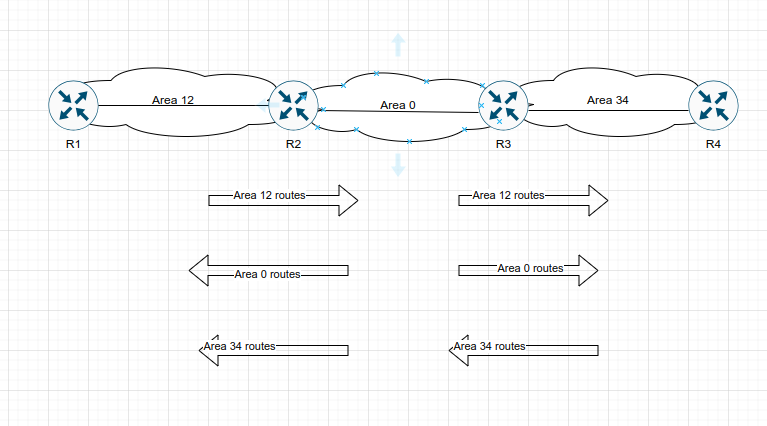
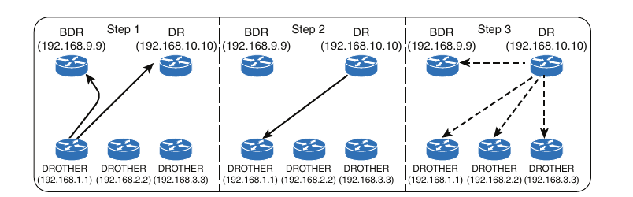

## OSPF

1. OSPF Fundamentals

2. OSPF Configuration

3. Default Route Advertisement

4. Common OSPF Optimizations

- OSPF is a nonproprietary Interior Gateway Protocol (IGP) that overcomes the deficiencies of other distance vector routing protocols and distributing routing information within a single OSPF routing domain

- OSPF introduces the concept of variable-length subnet masking (VLSM), which supports classless routing, summarization, authentication, and external route tagging

- There are two main versions of OSPF in production networks today:

    - **OSPF Version 2 (OSPF V2)**: Defined in RFC 2328 and supports IPv4

    - **OSPF Version 3 (OSPF V3)**: Defined in RFC 5340 and modifies the original structure to support IPv6

- **Advanced OSPF**: Explain the function of segmenting the OSPF domain into smaller areas to support larger topologies

- **OSPF V3**: Explains how OSPF can be used for routing IPv6 packets

### OSPF Fundamentals

- OSPF sends to neighboring routers link-state advertisements (LSAs) that contains the link state and link metric

- The received LSAs are stored in a local database called the link-state database (LSDB), and they are flooded throughout the OSPF routing domain just as the advertising router advertised them

- All OSPF routers maintain a synchronized identical copy of the LSDB for the same area

- The LSDB provides the topology of the network, in essence providing for the router a complete map of the network

- All OSPF routers run the Dijikstra shortest path first (SPF) algorithm to construct a loop free topology of shortest paths

- OSPF dynamically detects topology changes within the network and calculates loop-free paths in a short amount of time with minimal routing protocol traffic

- Each router sees itself as the root or top of the SPF tree (SPT), and the SPT contains all network destinations within the OSPF domain

- The SPT differs for each OSPF router, but the LSDB used to calculate the SPT is identical for all OSPF routers


- The above scheme shows a simple OSPF topology and the SPT from R1 and R4's perspective

- Notice that the local router's perspective will always be the root (top of the tree)

- There is a difference in connectivity to the 10.3.3.0/24 network from R1's SPT and R4's SPT

- From R1's perspective, the serial link between R3 and R4 is missing; from R4's perspective, the Ethernet link between R1 and R3 is missing

- The SPTs give the illusion that no redundancy exists in the networks, but remember that the SPT shows the shortest path to reach a network and is built from the LSDB, which contains all the links for an area

- During a topology change, the SPT is rebuilt and may change

- OSPF provides scalability for the routing table by using multiple OSPF areas within the routing domain

- Each OSPF area provides a collection of connected networks and hosts that are grouped together

- OSPF uses a two-tier hierarchical architecturem where Area 0 is a special area known as the backbone, to which all other areas must connect

- In other words, Area 0 provides transit connectivity between nonbackbone areas

- Nonbackbone areas advertise routes into the backbone and the backbone then advertises routes into other non-backbone areas



- The above scheme shows the route advertisement into other areas. Area 12 routes are advertised into Area 0 and then into Area 34

- Area 34 routes are advertised to Area 0 and then into Area 12

- Area 0 routes are advertised to all other OSPF areas

- The exact topology of the area is invisible from outside the area while still providing connectivity of routers outside the area

- This means that routers outside the area do not have a complete topological map of the area, which reduces OSPF traffic in that area

- When you segment an OSPF routing domain into multiple areas, it is no longer true that all OSPF routers will have identical LSDBs; however all routers within the same area will have will have identical area LSDBs

- The reduction in routing traffic uses less router memory and resources and therefore provides scalability

- This will be explained in detail later on. For now we will focus on core OSPF concepts. Area 0 is used as a reference area

- A router can run multiple OSPF processes. Each process maintains it's own unique database, and routes learned in one OSPF process are not available to a different OSPF process without redistribution of routes between processes

- The OSPF process numbers are locally significant and do not have to match among routers

- Running OSPF process number 1 in one router and running OSPF process number 1234 on the second router will still allow the two routers to become neighbors

#### Inter-Router Communication

- OSPF runs directly over IPv4, using it's own protocol 89, which is reserved for OSPF by the Internet Assigned Numbers Authority (IANA)

- OSPF uses multicast where possible to reduce unnecessary traffic 

- The two OSPF multicast addresses are as follows:

    - **AllSPFRouters**: IPv4 address 224.0.0.5 or MAC address 01:00:5e:00:00:05. All routers running OSPF should be able to receive these packets

    - **AllDRouters**: IPv4 address 224:0.0.6 or MAC address 01:00:5e:00:00:06. Communication with Designated Routers (DRs) uses this address

- Within the OSPF protocol, five types of packets are communicated:

    1. **Hello**: These packets are for discovering and maintaining neighbors. Packets are sent out periodically on all OSPF interfaces to discover new neighbors while ensuring that other adjacent neighbors are still online

    2. **Database Description (DBD or DDP)**: These packets are for summarizing database contents. Packets are exchanged when an OSPF adjacency is first being formed. These packets are used to discribe the contents of the LSDB

    3. **Link-state request (LSR)**: These packets are for database downloads. When a router thinks that part of LSDB is stale, it may request a portion of neighbor's database by using this packet type

    4. **Link-state update (LSU)**: These packets are for database updates. This is an explicit LSA for a specific network link and normally is sent in direct response to LSR

    5. **Link-state ack (LSAck)**: These packets are for flooding acknowledgements. These packets are sent in response to the flooding of LSAs, thus making flooding a reliable transport feature

#### OSPF Hello Packets

- OSPF hello packets are responsible for discovering and maintaining neighbors. In most instances, a router sends Hello packets to AllSPFRouters address (224.0.0.5) 

- Below is the list with the data present in an OSPF Hello packet:

    - **Router ID**: A unique 32-bit ID within an OSPF domain

    - **Authentication options**: A field that allows secure communication between OSPF routers to prevent malicious activity. Options are none, plain text, or Message Digest 5 (MD5) authentication

    - **Area ID**: The OSPF area that the OSPF interface belongs to. It is a 32-bit number that can be written in dotted-decimal format (0.0.1.0) or decimal(256)

    - **Interface address mask**: The network mask for the primary IP address for the interface out which the hello is sent

    - **Interface Priority**: The router interface priority for DR elections

    - **Hello Interval**: The time span, in seconds, that a router sends out hello packets on the interface

    - **Dead Interval**: The time span, in seconds, that a router waits to hear a hello from the neighbor router before it declares that router down

    - **Designated Router and Backup Designated Router**: The IP address of the DR and backup DR (BDR) for the network link

    - **Active neighbor**: A list of OSPF neighbors seen on the network segment. A router must have received a hello from the neighbor within the dead interval

##### Router ID

- The OSPF Router ID (RID) is a 32-bit number that uniquely identifies an OSPF router

- In some OSPF output commands, *neighbor ID* refers to the RID; the terms are synonymous

- The RID must be unique for each OSPF process in an OSPF domain and must be unique between OSPF processes on a router

##### Neighbors

- An OSPF neighbor is a router that shares a common OSPF-enabled network link

- OSPF routers discover other neighbors via the OSPF hello packets

- An adjacent OSPF neighbor is an OSPF neighbor that shares a synchronized OSPF database between the two neighbors

- Each OSPF process maintains a table for adjacent OSPF neighbors and the state of each router

- OSPF neighbor states:

    - **Down**: This is the initial state of the neighbor relationship. It indicates that the router has not received any OSPF hello packets

    - **Attempt**: This state is relevant to NBMA (non broadcast multi access) networks that do not support broadcast and require explicit neighbor configuration. This state indicates that no information has been received recently, but the router is still attempting communication

    - **Init**: This state indicates that a hello packet has been received from another router, but bidirectional communication has not been established

    - **2-Way**: Bidirectional communication has been established. If a DR and BDR is needed, the election occurs during this state

    - **ExStart**: This is the first state in forming an adjacency. Routers identify which router will be the master or slave for LSDB synchronization

    - **Exchange**: During this state, routers are exchanging link states by using DBD packets

    - **Loading**: LSR packets are sent to the neighbor, asking for the more recent LSAs that have been discovered (but not received) in the Exchange state

    - **Full**: Neighboring routers are fully adjacent

##### Designated Router and Backup Designated Router

- Multi-access networks such as Ethernet (LANs) and Frame Relay allow more than 2 routers to exist on a network segment

- Such a setup could cause scalability problems with OSPF as the number of routers on a segment increases

- Additional routers flood more LSAs on the segment, and OSPF traffic becomes excessive as OSPF neighbor adjacencies increase

- If four routers share the same multi-access network, six OSPF adjacencies form, along with six occurences of database flooding on a network


- The above scheme shows a simple four-router physical topology and the adjacencies established

- The number of edges formula, *n(n-1) /2*, where n is the number of routers, is used to identify the number of sessions in a full-mesh topology

- If 5 routers were present on a segment, 5x(5-1) / 2 = 10, then 10 OSPF adjacencies would exist for that segment

- Continuing the logic, adding one additional router would make 15 OSPF adjacencies on a network segment

- Having so many adjacencies per segment consume more bandwidth, more CPU processing, and more memory to maintain each of the neighbor states

- The LSAs increase exponentially with the number of routers on a network segment

- OSPF overcomes this inefficiency by creating a pseudonode (virtual router) to manage the adjacency state with all other routers on that broadcast network segment

- A router on the broadcast segment, known as the *designated router (DR)* assumes the role of the pseudonode

- The DR reduces the number of OSPF adjacencies on a multi-access network segment because routers only form a full OSPF adjacency with the DR and not each other

- The DR is responsive for flooding updates to all OSPF routers on that segment as the updates occur


- The above scheme demonstrates how using a DR simplifies a four-router topology with only three neighbor adjacencies

- If the DR were to fail, OSPF would need to form new adjacencies, invoking all new LSAs and could potentially cause a temporary loss of routes

- In the event of DR failure a *backup designated router (BDR)* becomes the new DR; then an election occurs to replace the BDR

- To minimize transition time, the BDR also forms full OSPF adjacencies with all OSPF routers on that segment

- The DR/BDR process distributes LSAs in the following manner:

    1. All OSPF routers (DR, BDR and DROTHER) on a segment form full OSPF adjacencies with the DR and BDR

    2. As an OSPF router learns a new route, it sends the updated LSA to the AllDRouters (224.0.0.6) address, which only the DR and BDR receive and process

    3. The DR sends a unicast acknowledgement to the router that sent the initial LSA update

    4. The DR floods the LSA to all routers on the segment via AllSPFRouters (224.0.0.5) address



### OSPF Configuration

- The configuration process for OSPF resides mostly under the OSPF process, but some OSPF options go directly under the interface configuration submode

- Defining and initializing the OSPF process:

```
conf t
 router ospf <process-id>
```

Example:

```
conf t
 router ospf 50
```

- The OSPF process ID is locally signinficant but is generally kept the same for operational consistency

- OSPF is enabled on an interface using two methods:

    1. An OSPF network statement

    2. Interface-specific configuration

#### OSPF Network Statement

- The OSPF network statement identifies the interface that the OSPF process will use and the area that those interfaces participate in

- The network statements match against the primary IPv4 address and netmask associated with an interface

- A common misconception is that the network statement advertises the networks into OSPF; in reality, though, the network statement is selecting and enabling OSPF on the interface

- The interface is then advertised into OSPF through the LSA

- The network statement uses a wildcard mask, which allows the configuration to be as specific or vague as necessary

- The selection of interfaces within the OSPF process is accomplished by using the following command:

```
network <ip address> <wildcard-mask> area <area-id>
```

Example:

```
conf t
 router ospf 1
  network 3.3.3.3 0.0.0.0 area 0
```

- The concept is similar to the configuration of Enhanced Interior Gateway Routing Protocol (EIGRP), except that the OSPF area is specified

- If an IP address for an interface matches two network statements, with different areas, the most explicit network statement (that is the longest match) preempts the other network statements for area allocation

- The corresponding network for the OSPF-enabled interface is added to the OSPF LSDB under the corresponding OSPF area in which the interface participates

- Secondary connected networks are added to the LSDB only if the secondary IP address matches a network statement associated with the same area

- The following scenarios explain potential use cases of the network statement for a router with four interfaces

IP addresses and interfaces:

```
Interface                   IP Address
GigabitEthernet0/0          10.0.0.10/24
GigabitEthernet0/1          10.0.10.10/24
GigabitEthernet0/2          192.0.0.10/24
GigabitEthernet0/3          192.10.0.10/24
```

- Enabling OSPF on Area 0 for the interfaces that explicitly match the IP addresses:

```
conf t
 router ospf 1
  network 10.0.0.10 0.0.0.0 area 0
  network 10.0.10.10 0.0.0.0 area 0
  network 192.0.0.10 0.0.0.0 area 0
  network 192.10.0.10 0.0.0.0 area 0
```

- OSPF configuration for Area 0, using network statements that match the subnets configured on the interfaces

- If you set the last octet of the IP address to 0 and change the wildcard mask to 255, the network statements match all IP addresses within the /24 network

```
conf t
 router ospf 1
  network 10.0.0.0 0.0.0.255 area 0
  network 10.0.10.0 0.0.0.255 area 0
  network 192.0.0.0 0.0.0.255 area 0
  network 192.10.0.0 0.0.0.255 area 0
```

- OSPF configuration for Area 0, using network statements for interfaces that are within the 10.0.0.0/8 and 192.0.0.0/8 network ranges and will result in OSPF being enabled on all four interfaces

```
conf t
 router ospf 1
  network 10.0.0.0 0.255.255.255 area 0
  network 192.0.0.0 0.255.255.255 area 0
```

- OSPF configuration for Area 0 to enable OSPF on all interfaces

```
conf t
 router ospf 1
  network 0.0.0.0 255.255.255.255 area 0
```

#### Interface-Specific Configuration

- The second method for enabling OSPF on an interface, is to configure it specifically on an interface as follows:

```
conf t
 interface gi0/1
  ip ospf <process-id> area <area-id> [secondaries none]
```

Example:

```
conf t
 interface gi0/1
  ip ospf 1 area 0
```

- This method also adds secondary connected networks to the LSDB unless the `secondaries none` option is used

- This method provides explicit control for enabling OSPF; however, the configuration is not centralized and increases in complexity as the number of interfaces on the routers increases

- If a hybrid configuration exists on a router, interface-specific settings take precedence over the network statement with the assignment of the areas

```
conf t
 interface Gi0/0
  ip address 10.0.0.1 255.255.255.0
  ip ospf 1 area 0
```

#### Statically Setting the Router ID

- By default, the RID is dynamically allocated using the highest IP address of any `up` loopback interfaces

- If there are no `up` loopback interfaces, the highest IP address of any active `up` physical interfaces becomes the RID when the OSPF process initializes

- The OSPF process selects the RID when the OSPF process initializes, and it does not change until the process restarts

- Interface changes (such as addition/removal of IP addresses) on a router are detected when the OSPF process restarts, and the RID changes accordingly

- The OSPF tolology is built on the RID. Setting a static RID helps with troubleshooting and reduces LSAs when a RID changes in an OSPF environment

- The RID is four octets in length but generally represents an IPv4 address that resides on the router for operational simplicity; however this is not a requirement

- Assigning the router ID manually:

```
conf t
 router ospf 1
  router-id <router-id>
```

- Clearing the OSPF process on a router so that OSPF can use the new router ID

```
clear ip ospf process
```

#### Passive Interfaces

- Enabling an interface with OSPF is the quickest way to advertise a network segment to other OSPF routers

- However, it may be easy for someone to plug in an unauthorized OSPF router on an OSPF-enabled network segment and introduce false routes, thus causing havoc on the network

- Making the network interface passive still adds the network segment into the LSDB but prohibits the interface for forming OSPF adjacencies

- A *passive interface* does not send out OSPF hellos and does not process any received OSPF packets

- Making the interface passive:

```
conf t
 router ospf 1
  passive-interface <interface-id>
```

- Making all interfaces passive by default:

```
conf t
 router ospf 1
  passive-interface default
```

- Allow an interface to process OSPF packets after all interfaces have been configured as passive:

```
conf t
 router ospf 1
  no passive-interface g0/0
```

#### Requirements for Neighbor Adjacency

- The following list of requirements must be met for an OSPF neighborship to be formed:

    - RID must be unique between the two devices. They should be unique for the entire OSPF routing domain to prevent errors

    - The interfaces must share a common subnet. OSPF uses the interface's primary IP address when sending out OSPF hellos. The network mask (netmask) in the hello packet is used to extract the network ID of the hello packet

    - The MTUs (maximum transmission unit) on the interfaces must match. The OSPF protocol does not support fragmentation, so the MTUs on the interfaces should match

    - The area ID must match for the segment

    - The DR enablement must match for the segment

    - OSPF hello and dead timers must match for the segment

    - Authentification type and credentials (if any) must match for the segment

    - Area type flags must match for the segment (for example, Stub, NSSA)

#### Sample Topology and Configuration


- Above is a topology example for a basic OSPF configuration

- All four routers have loopback IP addresses that match their RIDs (R1 equals 192.168.1.1, R2 equals 192.168.2.2, and so on)

- On R1 and R2, OSPF is enabled on all interfaces with one command, R3 uses specific network-based statements, and R4 uses interface specific commands

- R1 and R2 set the Gi0/2 interface as passive, and R3 and R4 make all interfaces passive by default but make Gi0/1 active

- Configuration for all four routers:

- R1:

```
conf t
 interface loopback 0
  ip address 192.168.1.1 255.255.255.255
 interface gi0/1
  ip address 10.123.4.1 255.255.255.0
 interface gi0/2
  ip address 10.1.1.1 255.255.255.0

 router ospf 1
  router-id 192.168.1.1
  passive-interface gi0/2
  network 0.0.0.0 255.255.255.255 area 0
```

- R2:

```
conf t
 interface loopback 0
  ip address 192.168.2.2 255.255.255.255
 interface gi0/1
  ip address 10.123.4.2 255.255.255.0
 interface gi0/2
  ip address 10.2.2.2 255.255.255.0

 router ospf 1
  router-id 192.168.2.2
  passive-interface gi0/2
  network 0.0.0.0 255.255.255.255 area 0
```

R3:

```
conf t
 interface loopback 0
  ip address 192.168.3.3 255.255.255.255
 interface gi0/1
  ip address 10.123.4.3 255.255.255.0
 interface gi0/2
  ip address 10.3.3.3 255.255.255.0

 router ospf 1
  router-id 192.168.3.3
  passive-interface default
  no passive-interface gi0/1
  network 10.3.3.3 0.0.0.0 area 0
  network 10.123.4.3 0.0.0.0 area 0
  network 192.168.3.3 0.0.0.0 area 0
```

- R4:

```
conf t
 interface loopback 0
  ip address 192.168.4.4 255.255.255.255
  ip ospf 1 area 0
 interface gi0/1
  ip address 10.123.4.4 255.255.255.0
  ip ospf 1 area 0
 interface gi0/2
  ip address 10.4.4.4 255.255.255.0
  ip ospf 1 area 0

 router ospf 1
  router-id 192.168.4.4
  passive-interface default
  no passive-interface gi0/1
```

#### Confirmation of Interfaces

- It is a good practice to verify that the correct interfaces are running OSPF after making changes to the OSPF configuration

- Display the OSPF-enabled interfaces:

```
show ip ospf interface [brief | interface-id]
```

- R1:

```
R1#show ip ospf interface 
Loopback0 is up, line protocol is up 
  Internet Address 192.168.1.1/32, Interface ID 7, Area 0
  Attached via Network Statement
  Process ID 1, Router ID 192.168.1.1, Network Type LOOPBACK, Cost: 1
  Topology-MTID    Cost    Disabled    Shutdown      Topology Name
        0           1         no          no            Base
  Loopback interface is treated as a stub Host
GigabitEthernet0/2 is up, line protocol is up 
  Internet Address 10.1.1.1/24, Interface ID 4, Area 0
  Attached via Network Statement
  Process ID 1, Router ID 192.168.1.1, Network Type BROADCAST, Cost: 10
  Topology-MTID    Cost    Disabled    Shutdown      Topology Name
        0           1        no          no            Base
  Transmit Delay is 1 sec, State DR, Priority 1
  Designated Router (ID) 192.168.1.1, Interface address 10.1.1.1
  No backup designated router on this network
  Timer intervals configured, Hello 10, Dead 40, Wait 40, Retransmit 5
    oob-resync timeout 40
    No Hellos (Passive interface) 
  Supports Link-local Signaling (LLS)
  Cisco NSF helper support enabled
  IETF NSF helper support enabled
  Can be protected by per-prefix Loop-Free FastReroute
  Can be used for per-prefix Loop-Free FastReroute repair paths
  Not Protected by per-prefix TI-LFA
  Index 1/2/2, flood queue length 0
  Next 0x0(0)/0x0(0)/0x0(0)
  Last flood scan length is 0, maximum is 0
  Last flood scan time is 0 msec, maximum is 0 msec
  Neighbor Count is 0, Adjacent neighbor count is 0 
  Suppress hello for 0 neighbor(s)
GigabitEthernet0/1 is up, line protocol is up 
  Internet Address 10.123.4.1/24, Interface ID 3, Area 0
  Attached via Network Statement
  Process ID 1, Router ID 192.168.1.1, Network Type BROADCAST, Cost: 10
  Topology-MTID    Cost    Disabled    Shutdown      Topology Name
        0           1        no          no            Base
  Transmit Delay is 1 sec, State DROTHER, Priority 1
  Designated Router (ID) 192.168.4.4, Interface address 10.123.4.4
  Backup Designated router (ID) 192.168.3.3, Interface address 10.123.4.3
  Old designated Router (ID) 192.168.3.3, Interface address 10.123.4.3
  Flush timer for old DR LSA due in 00:01:41
  Timer intervals configured, Hello 10, Dead 40, Wait 40, Retransmit 5
    oob-resync timeout 40
    Hello due in 00:00:07
  Supports Link-local Signaling (LLS)
  Cisco NSF helper support enabled
  IETF NSF helper support enabled
  Can be protected by per-prefix Loop-Free FastReroute
  Can be used for per-prefix Loop-Free FastReroute repair paths
  Not Protected by per-prefix TI-LFA
  Index 1/1/1, flood queue length 0
  Next 0x0(0)/0x0(0)/0x0(0)
  Last flood scan length is 0, maximum is 1
  Last flood scan time is 0 msec, maximum is 0 msec
  Neighbor Count is 3, Adjacent neighbor count is 2 
    Adjacent with neighbor 192.168.3.3  (Backup Designated Router)
    Adjacent with neighbor 192.168.4.4  (Designated Router)
  Suppress hello for 0 neighbor(s)
```

- Output of `show ip ospf interface brief`:

- R1:

```
R1#show ip ospf interface brief 
Interface    PID   Area            IP Address/Mask    Cost  State Nbrs F/C
Lo0          1     0               192.168.1.1/32     1     LOOP  0/0
Gi0/2        1     0               10.1.1.1/24        1     DR    0/0
Gi0/1        1     0               10.123.4.1/24      1     DROTH 2/3
```

- R2:

```
R2#show ip ospf interface brief 
Interface    PID   Area            IP Address/Mask    Cost  State Nbrs F/C
Lo0          1     0               192.168.2.2/32     1     LOOP  0/0
Gi0/2        1     0               10.2.2.2/24        1     DR    0/0
Gi0/1        1     0               10.123.4.2/24      1     DROTH 2/3
```

- R3:

```
R3#show ip ospf interface brief 
Interface    PID   Area            IP Address/Mask    Cost  State Nbrs F/C
Lo0          1     0               192.168.3.3/32     1     LOOP  0/0
Gi0/1        1     0               10.123.4.3/24      1     BDR   3/3
Gi0/2        1     0               10.3.3.3/24        1     DR    0/0
```

- R4:

```
R4#show ip ospf interface brief 
Interface    PID   Area            IP Address/Mask    Cost  State Nbrs F/C
Lo0          1     0               192.168.4.4/32     1     LOOP  0/0
Gi0/2        1     0               10.4.4.4/24        1     DR    0/0
Gi0/1        1     0               10.123.4.4/24      1     DR    3/3
```

- OSPF Interface Columns:

	- Interface: Interfaces with OSPF enabled

	- PID: OSPF process ID associated with this interface

	- Area: The area that this interface is associated with

	- IP Address/Mask: The IP address and subnet mask for the interface

	- Cost: The cost metric assigned to an interface that is used to calculate a path metric

	- State: The current interface state, which could be DR, BDR, DROTHER, LOOP, or Down

	- Nbrs F: The number of neighbor OSPF routers for a segment that are fully adjacent

	- Nbrs C: The number of neighbor OSPF routers that have been detected and are in a 2-Way state

- The DROTHER is a router on the DR-enabled segment that is not the DR or the BDR; it is simply the other router

- DROTHERS does not establish full adjacency with other DROTHERs

#### Verification of OSPF Neighbor Adjacencies

- Viewing the OSPF neighbor table

```
show ip ospf neighbor [detail]
```

- Example output:

- R1:

```
R1#show ip ospf neighbor 

Neighbor ID     Pri   State           Dead Time   Address         Interface
192.168.2.2       1   2WAY/DROTHER    00:00:37    10.123.4.2      GigabitEthernet0/1
192.168.3.3       1   FULL/BDR        00:00:31    10.123.4.3      GigabitEthernet0/1
192.168.4.4       1   FULL/DR         00:00:35    10.123.4.4      GigabitEthernet0/1
```

- R2:

```
R2#show ip ospf neighbor 

Neighbor ID     Pri   State           Dead Time   Address         Interface
192.168.1.1       1   2WAY/DROTHER    00:00:36    10.123.4.1      GigabitEthernet0/1
192.168.3.3       1   FULL/BDR        00:00:32    10.123.4.3      GigabitEthernet0/1
192.168.4.4       1   FULL/DR         00:00:33    10.123.4.4      GigabitEthernet0/1
```

- R3:

```
R3#show ip ospf neighbor 

Neighbor ID     Pri   State           Dead Time   Address         Interface
192.168.1.1       1   FULL/DROTHER    00:00:34    10.123.4.1      GigabitEthernet0/1
192.168.2.2       1   FULL/DROTHER    00:00:37    10.123.4.2      GigabitEthernet0/1
192.168.4.4       1   FULL/DR         00:00:33    10.123.4.4      GigabitEthernet0/1
```

- R4:

```
R4#show ip ospf neighbor 

Neighbor ID     Pri   State           Dead Time   Address         Interface
192.168.1.1       1   FULL/DROTHER    00:00:37    10.123.4.1      Ethernet0/1
192.168.2.2       1   FULL/DROTHER    00:00:31    10.123.4.2      Ethernet0/1
192.168.3.3       1   FULL/BDR        00:00:37    10.123.4.3      Ethernet0/1
```

- The neighbor states on R1 identify R3 as the BDR and R4 as the DR. R3 and R4 idenfify R1 and R2 as DROTHER in the output

- Overview of the fields in the neighbors table:

	- Neighbor ID: The router ID (RID) of the neighboring router

	- Pri: The priority of the neighbor's interface, which is used for DR/BRD elections

	- State: The first field is the neighbor state. The second field is the DR/BDR or DROTHER role if the interface requires a DR. For non-DR network links, the second field shows just a hyphen (-)

	- Dead Time: The time left until the router is declared unreachable

	- Address: The primary IP address for the OSPF neighbor

	- Interface: The local interface to which the OSPF neighbor is attached

#### Verification of OSPF Routes

- The next step is to verify the OSPF routes installed into the IP routing table

- Show the OSPF routes installed into the Routing Information Base (RIB):

```
show ip route ospf
```

- Verifying the OSPF routes on R1:

```
R1#show ip route ospf
Codes: L - local, C - connected, S - static, R - RIP, M - mobile, B - BGP
       D - EIGRP, EX - EIGRP external, O - OSPF, IA - OSPF inter area 
       N1 - OSPF NSSA external type 1, N2 - OSPF NSSA external type 2
       E1 - OSPF external type 1, E2 - OSPF external type 2, m - OMP
       n - NAT, Ni - NAT inside, No - NAT outside, Nd - NAT DIA
       i - IS-IS, su - IS-IS summary, L1 - IS-IS level-1, L2 - IS-IS level-2
       ia - IS-IS inter area, * - candidate default, U - per-user static route
       H - NHRP, G - NHRP registered, g - NHRP registration summary
       o - ODR, P - periodic downloaded static route, l - LISP
       a - application route
       + - replicated route, % - next hop override, p - overrides from PfR
       & - replicated local route overrides by connected

Gateway of last resort is not set

      10.0.0.0/8 is variably subnetted, 7 subnets, 2 masks
O        10.2.2.0/24 [110/2] via 10.123.4.2, 00:37:39, GigabitEthernet0/1
O        10.3.3.0/24 [110/2] via 10.123.4.3, 00:37:39, GigabitEthernet0/1
O        10.4.4.0/24 [110/2] via 10.123.4.4, 00:37:43, GigabitEthernet0/1
      192.168.2.0/32 is subnetted, 1 subnets
O        192.168.2.2 [110/2] via 10.123.4.2, 00:37:39, GigabitEthernet0/1
      192.168.3.0/32 is subnetted, 1 subnets
O        192.168.3.3 [110/2] via 10.123.4.3, 00:37:39, GigabitEthernet0/1
      192.168.4.0/32 is subnetted, 1 subnets
O        192.168.4.4 [110/2] via 10.123.4.4, 00:37:43, GigabitEthernet0/1
```

- In the output, where two sets of numbers are in the brackets (for example [110/2]), the first number is the administrative distance (AD), which is 110 by default for OSPF, and the second number is the metric of the path used for that network

- The output for R2, R3 and R4 would be similar with the output for R1

- The terms `path cost` and `path metric` are synonymous from OSPFs perspective

### Default Route Advertisement

- OSPF supports advertising the default route into the OSPF domain

- Advertising the default route underneath the OSPF process:

```
conf t
 router ospf 1
  default-information originate <always> <metric metric-value> <metric-type metric-type> 
```

- If a default route does not exist in a routing table, the `always` optional keyword advertises a default route even if a default route does not exist in the RIB

- In addition, the route metric can be changed with the `metric <metric-value>` option, and the metric type can be changed with the `metric-type <type-value>` option

- In the below example R1 has a static route to a firewall that is connected to the Internet. To provide connectivity to other parts of the network (for example R2 and R3), R1 advertises a default route into OSPF


- Configuration on R1:

```
conf t
 ip route 0.0.0.0 0.0.0.0 100.64.1.2
 router ospf 1
  network 10.0.0.0 0.255.255.255 area 0
  default-information originate
```

- Notice that R1 has a static default route to the firewall (100.64.1.2) to satisfy the requirement of having a default route in the RIB

- Routing tables of R2 and R3. Notice that R1 advertises the OSPF route as an external OSPF route

- R2:

```
show ip route | begin Gateway

(...)
O*E2	0.0.0.0/0 [110/1] via 10.12.1.1, 00:02:56, GigabitEthernet0/1
(...)
```

- R3:

```
show ip route | begin Gateway

(...)
O*E2	0.0.0.0/0 [110/1] via 10.23.1.2, 00:02:56, GigabitEthernet0/1
(...)
```

### Common OSPF Optimizations

- Almost every network requires tunning based on the equipment, technical requirements, or a variety of other factors

- The following sections explain the common concepts for tuning an OSPF network

#### Link Costs

- Interface cost is an essential component of Dijikstra's SPF calculation because the shortest path metric is based on the cummulative interface cost (that is, metric) from the router to the destination

- OSPF assigns the OSPF link cost (that is, metric) for an interface by using the formula: 

Cost = Reference Bandwidth/Interface Bandwidth

- The default reference bandwidth is 100 Mbps

- OSPF cost for common network interface types using the default reference bandwidth:

```
Interface Type				OSPF Cost
T1							64
Ethernet					10
FastEthernet				1
GigabitEthernet				1
10 GigabitEthernet			1
```

- Notice that there is no differenciation in the link cost associated with a FastEthernet interface and a 10 GigabitEthernet interface

- Changing the reference bandwidth to a higher value allows for differentiation of cost between higher-speed interfaces

- Making the value too high could cause issues because low-bandwidth interfaces would not be destinguishable

- The OSPF LSA metric field is 16 bits, and the interface cost cannot exceed 65535

- Changing the reference bandwidth for all OSPF interfaces associated with that process:

```
conf t
 router ospf 1
  auto-cost reference-bandwidth <bandwidth-in-mbps>
```

- If the reference bandwidth is changed on one router, the reference bandwidth should be changed on all OSPF routers to ensure that SPF uses the same logic to prevent routing loops

- It is a best practice to set the same reference bandwidth for all OSPF routers

- Setting the OSPF cost manually per interface:

```
conf t
 interface g0/1
  ip ospf cost <1-65535>
```

- While the interface cost is limited to 65535 because of LSA field limitations, the path metric can exceed a 16-bit value (65535) because all the link metrics are calculated locally

#### Failure Detection

- A secondary function of OSPF hello packets is to ensure that adjacent OSPF neighbors are still healthy and available

- OSPF sends hello packets at set intervals, based on the hello timer

- OSPF uses a second timer called the *OSPF dead interval timer*, which defaults to four times the hello timer

- Upon receipt of a hello packet from a neighboring router, the OSPF dead timer resets to the initial value and then starts to decrement again

- If a router does not receive a hello before the OSPF dead interval timer reaches 0, the neighbor state is changed to down

- The OSPF router immediately sends out the appropriate LSA, reflecting the topology change, and the SPF algorithm processes on all routers within the area

##### Hello Timer

- The default OSPF hello timer interval varies based on the OSPF network type

- OSPF allows modification to the hello timer interval with values between 1 and 65535 seconds

- Changing the hello timer interval modifies the default dead interval, too

- Modifying the OSPF hello timer interval on an OSPF-enabled interface:

```
conf t
 interface gi0/1
  ip ospf hello-interval <1 - 65535>
```

##### Dead Interval Timer

- The dead interval timer can be changed to a value between 1 and 65535 seconds

- Modifying the OSPF dead interval timer on an OSPF-enabled interface:

```
conf t
 interface gi0/1
  ip ospf dead-interval <1 - 65535>
```

- Always make sure that the dead interval timer setting is greater than the hello timer setting to ensure that the dead interval timer does not reach 0 between hello packets