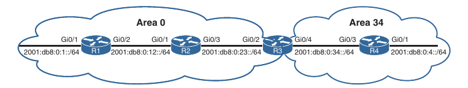

## OSPFv3

1. OSPFv3 Fundamentals

2. OPSFv3 Configurations

3. IPv4 Support in OSPFv3

- OSPF version 3 (OSPFv3), the latest version of the OSPF protocol includes support for both IPv4 and IPv6 address families

- OSPFv3 is not backward compatible with OSPFv2 but the base mechanisms are the same

### OSPFv3 Fundamentals

- OSPFv3 vs OSPFv2:

	- **Support for multiple address families**: OSPFv3 supports IPv4 and IPv6 address families

	- **New LSA types**: New LSA types created to carry IPv6 prefixes

	- **Removal of addressing semantics**: The IP prefix information is no longer present in the OSPF packet header. Instead it is carried as LSA payload information, making the protocol essentially address-family independent, much like IS-IS. OSPFv3 uses the therm "link" instead of "network" because the SPT calculations are per link instead of per subnet

	- **LSA flooding**: OSPFv3 includes new link state type field that is used to determine the flooding scope of the LSA, as well as handling the unknown LSA types

	- **Packet format**: OSPFv3 runs directly over IPv6, and the number of fields in the packet header has been reduced

	- **Router ID**: The router ID is used to identify neighbors, regardless of the network type in OSPFv3. You must always manually assign the router ID for the OSPFv3 process

	- **Authentication**: Neighbor authentication has been removed from the OSPF protocol and is now performed through IPsec extension headers in the IPv6 packet

	- **Neighbor Adjacencies**: OSPFv3 inter-router communication is handled by IPv6 link-local addressing. Neighbors are not automatically detected over non-broadcast multi access (NBMA) interfaces. A neighbor must be manually specified using the link-local address. IPv6 allow for multiple subnets to be assigned to a single interface, and OSPFv3 allows for neighbor adjacency to form even if the two routers do not share a common subnet

	- **Multiple instances**: OSPFv3 packets include an instance ID field that may be used to manipulate which routers on a network segment are allowed to form adjacencies

- RFC 5340 shows the differences between OSPFv2 and OSPFv3 in depth

#### OSPFv3 Link-State Advertisement

- OSPFv3 packets use IP protocol number 89 and routers communicate with each-other using the local interface's IPv6 link-local address

- The link state database is organized differently in Version 3 than in Version 2

- LSAs modification in OSPFv3:

	- Modified structure of the router LSA (type 1)

	- Network summary LSA (type 3) renamed to interarea prefix LSA

	- ASBR summary LSA (type 4) renamed to interarea router LSA

	- The router LSA is only responsible for announcing interface parameters such as interface type (point-to-point, broadcast, NBMA, point-to-multipoint and virtual links) and metric (cost)

	- IP addressing information is advertised into two new LSA types:

		- Intra-area prefix LSA (contains global prefix information)

		- Link-local LSA (contains link-local information)

- The OSPF Dijikstra calculation is used to determine the shortest path tree (SPT) only advertises the router and network LSAs

- Advertising the IP address information using the new LSA types eliminates the need for OSPF to perform the full shortest path first (SPF) thee calculations every time a new address prefix is added or changed on an interface

- The OSPFv3 link state database (LSDB) creates a shortest path topology tree based on links instead of networks

- OSPFv3 LSA types description:

	- LS type: 0x2001, Name: Router, Description: Every router generates router LSAs that describes the state and cost of the router's interfaces to the area

	- LS type: 0x2002, Name: Network, Description: A designated router generates network LSAs to announce all of the routers attached to the link, including itself

	- LS type: 0x2003, Name: Interarea Prefix, Description: Area border routers generate interarea prefix LSAs to describe routes to IPv6 address prefixes that belong to other areas

	- LS typw: 0x2004, Name: Intra-area router, Description: Area border routers generate interarea router LSAs to announce the addresses of autonomous system boundary routers in other areas 

	- LS type: 0x4005, Name: AS external, Description: Autonomous system boundary routers advertise AS external LSAs to announce default routes or routes learned through redistribution from other protocols

	- LS type: 0x2007, Name: NSSA, Description: Autonomous system boundary routers that are located in a no-so-stubby area advertise NSSA LSAs for routers redistributed into the area

	- LS type: 0x0008, Name: Link, Description: The link LSA maps all the global unicast address prefixes associated with an interface to the link local interface IP address of the router

	- LS type: 0x2009, Name: Intra-area Prefix, Description: The intra-area prefix LSA is used to advertise one ore more IPv6 prefixes that are associated with a router, stub or transit network segment

#### OSPFv3 Communication

- OSPFv3 packets use protocol ID 89, and routers communicate with each-other using the local interface's IPv6 link-local address as the source

- Depending on the packet type, the destination address is a unicast link-local address or a multicast link-local scoped address:

	- FF02::5: OSPFv3 AllSPFRouters

	- FF02::6: OSPFv3 AllDRouters designated router (DR)

- All routers use the AllSPFRouters multicast address FF02::5 to send OSPF hello messages to routers on the same link

- The hello messages are used for neighbor discovery and detecting either a neighbor relationship is down

- The DR and BDR also uses this address to send link-state update and flooding acknowledgement messages to all routers

- NonDR/BDR routers send update or link-state acknowledgement message to the DR and BRD by using the AllDRouters address FF02::6

- OSPFv3 uses the same five packet types and logic as OSPFv2

- Name, address and purpose of all OSPFv3 packet types:

	- **Hello packet**: Source: Link-local address, Destination: FF02::5, Description: Discover and maintain neighbors

					Source: Link-local address, Destination: Link-local address, Description: Initial adjacency forming, immediate hello

	- **Database description**: Source: Link-local address, Destination: Link-local address, Description: Summarize database contents

	- **Link-state request**: Source: Link-local address, Destination: Link-local address, Description: Database information request

	- **Link-state update**: Source: Link-local address, Destination: Link-local address, Description: Initial adjacency forming in response to a link-state request
						Source: Link-local address(from DR), Destination: FF02::5 (all routers), Description: Link-state update

						Source: Link-local address(from non-DR), Destination: FF02::6 (DR/BDR), Description: Database update

	- **Link-state acknowledgement**: Source: Link-local address, Destination: Link-local address, Description: Initial adjacency forming, in response to link-state update

						Source: Link-local address(from DR), Destination: FF02::5, Description: Flooding acknowledgement

						Source: Link-local address(from non-DR), Destination: FF02::6, Description: Flooding acknowledgement

### OSPFv3 Configuration

- Steps for conviguring OSPFv3:

	- **Step 1**: Initialize the routing process. Prerequisite, enable ipv6 routing:

	```
	conf t
	 ipv6 unicast-routing
	 router ospfv3 <process-id>
	```

	- **Step 2**: Define the router ID:

	```
	conf t
	 router ospfv3 1
	  router-id <id>
	```

	- The router ID is a 32-bit value that does not need to match an IPv4 address (can be decimal or dotted-decimal format)

	- It can be any number, as long as the value is unique to the OSPF domain

	- OSPFv3 uses the same algorithm as OSPFv2 for dinamically locating the RID. If there are not any IPv4 addresses configured on the router, the RID is set to 0.0.0.0 and does not allow adjacencies to form

	- **Step 3**: (Optional) Initialize the address family:

	```
	conf t
	 router ospfv3 1
	  address-family <ipv4 | ipv6> unicast
	```

	- The appropriate address family is enabled automatically when OSPFv3 is enabled on an interface

	- **Step 4**: Enable OSPFv3 under an interface:

	```
	conf t
	 interface g0/1
	  ospfv3 <process-id> ipv6 area <area-id> # or for ipv4:
	  ospfv3 <process-id> ipv4 area <area-id>
	```

- OSPFv3 configuration topology:



- In our topology Area 0 consists of R1, R2 and R3, and Area 34 contains R3 and R4. R3 is the ABR

- R1:

```
conf t
 interface Loopback0
  ipv6 address 2001:DB8::1/128
  ospfv3 1 ipv6 area 0
!
 interface GigabitEthernet0/1
  ipv6 address FE80::1 link-local
  ipv6 address 2001:DB8:0:1::1/64
  ospfv3 1 ipv6 area 0
!
 interface GigabitEthernet0/2
  ipv6 address FE80::1 link-local
  ipv6 address 2001:DB8:0:12::1/64
  ospfv3 1 ipv6 area 0
!
router ospfv3 1
  router-id 192.168.1.1
```

- R2:

```
conf t
 interface Loopback0
  ipv6 address 2001:DB8::2/128
  ospfv3 1 ipv6 area 0
!
 interface GigabitEthernet0/1
  ipv6 address FE80::2 link-local
  ipv6 address 2001:DB8:0:12::2/64
  ospfv3 1 ipv6 area 0
!
 interface GigabitEthernet0/3
  ipv6 address FE80::2 link-local
  ospfv3 1 ipv6 area 0
!
 router ospfv3 1
  router-id 192.168.2.2
```

- R3:

```
conf t
 interface Loopback0
  ipv6 address 2001:DB8::3/128
  ospfv3 1 ipv6 area 0
!
 interface GigabitEthernet0/2
  ipv6 address FE80::3 link-local
  ipv6 address 2001:DB8:0:23::3/64
  ospfv3 1 ipv6 area 0
!
 interface GigabitEthernet0/4
  ipv6 address FE80::3 link-local
  ipv6 address 2001:DB8:0:34::3/64
  ospfv3 1 ipv6 area 34
!
 router ospfv3 1
  router-id 192.168.3.3
```

- R4:

```
conf t
 interface Loopback0
  ipv6 address 2001:DB8::4/128
  ospfv3 1 ipv6 area 34
!
 interface GigabitEthernet0/1
  ipv6 address FE80::4 link-local
  ipv6 address 2001:DB8:0:4::4/64
  ospfv3 1 ipv6 area 34
!
 interface GigabitEthernet0/3
  ipv6 address FE80::4 link-local
  ipv6 address 2001:DB8:0:34::4/64
  ospfv3 1 ipv6 area 34
!
 router ospfv3 1
  router-id 192.168.4.4
```

#### Route filtering in OSPFv3

- On R3, the ABR:

```
conf t
 ipv6 prefix-list TEST seq 10 deny 2001:DB8::4/128
 ipv6 prefix-list TEST seq 15 deny 2001:DB8:0:4::/64
 ipv6 prefix-list TEST seq 20 permit ::/0 le 128

 router ospfv3 1
  router-id 3.3.3.3
 !
  address-family ipv6 unicast
   area 0 filter-list prefix TEST in
  exit-address-family
```

#### OSPFv3 Verification

- Verification commands in OSPFv3 are very similar to those of OSPFv2

- These commands usually replace `ip ospf` with `ospfv3 ipv6`

- Verifying interfaces, neighborship and the routing table in OSPFv3:

```
show ipv6 protocols

show ospfv3 ipv6 neighbor #or
show ipv6 ospf neighbor

show ospfv3 interface <id> #or
show ipv6 ospf interface <id>

show ospfv3 interface brief

show ipv6 route ospf
```

#### Passive Interface

- OSPFv3 supports the ability to mark an interface as passive

- The command is placed under the OSPFv3 process or under the address family configuration 

- Placing the command under the OSPFv3 process applies the setting for both address families

- Marking an interface as passive:

```
conf t
 router ospfv3 1
  passsive-interface <id>
```

- Marking all interfaces as passive:

```
conf t
 router ospfv3 1
  passive-interface default
```

- Enabling a specific interface marked as passive:

```
conf t
 router ospfv3 1
  no passive-interface <id>
```

- Verifying the passive interfaces:

```
show ospfv3 interface <id>

show ospfv3 interface <id> | include Passive
```

#### Summarization

- The ability to summarize IPv6 routes is as important as summarizing IPv4 routes (it may even be more important due to hardware scale limitation)

- Summarizing the Area 0 router's loopback addresses (2001:db8::1/128, 2001:db8::2/128, 2001:db8::3/128) removes three routes from the routing table

- A common mistake with summarization of IPv6 addresses is to confuse hex with decimal

- We tipically perform summarization logic in decimal, as the first and the third digit in an octet should not be confused as decimal values

- Example: IPv6 address 2001::1/128 is not 20 and 1. The number 2001::1 is 32 and 1

- Summarization of OSPFv3 routes follow the same rules as OSPFv2 and must occur on the ABRs

- In our topology R3 summarizes the three loopback addresses into 2001:db8:0:0::/65

- Configuring OSPFv3 area summarization:

```
conf t
 router ospfv3 1
  address-family ipv6
   area <id> range <prefix/prefix-length>
```

- R3:

```
conf t
 router ospfv3 1
  address-family ipv6
   area 0 range 2001:db8:0:0::/65
```

