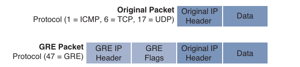
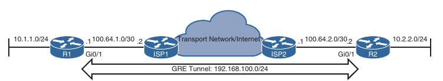
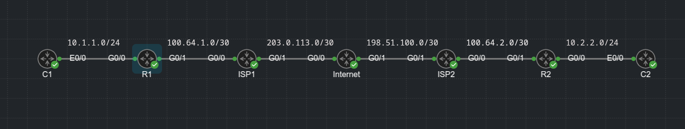

## Overlay Tunnels

- Generic Routing Encapsulation (GRE) Tunnels

- IPsec Fundamentals

- Cisco Location/ID Separation Protocol (LISP)

- Virtual Extensible Local Area Network (VXLAN)

- An *overlay* network is a logical or virtual network built over a physical transport network referred to as underlay network

- Overlay networks are used to overcome shortcommings of traditional networks by enabling network virtualization, segmentation, and security to make traditional networks more manageable, flexible, secure (by means of encryption), and scalable

- Examples of overlay tunneling technologies:

    - Generic Routing Encapsulation (GRE)

    - IP Security (IPsec)

    - Location ID/Separation Protocol (LISP)

    - Virtual Extensible LANs (VXLANs)

    - Multiprotocol Label Switching (MPLS)

- A Virtual Private Network (VPN) is an overlay network that allows private networks to communicate with each other across an untrusted network, such as the internet

- VPN data sent across an unsecure network needs to be encrypted to ensure that the data is not viewed or tampered with by an attacker

- The most common VPN encryption algorithm used is IP Security (IPsec)

- Private networks typically use RFC 1918 address space (10.0.0.0/8, 172.16.0.0/12 and 192.168.0.0/16), which are not routable across the internet

- To be able to create VPNs between private networks, a tunneling overlay technology is necessary, and the most commonly used one is GRE

- MPLS tunneling is not supported across the Internet unless it is tunneled within another tunneling protocol, such as GRE, which then can be encrypted with IPsec (MPLS over GRE and IPsec)

- A key takeaway from this is that an overlay tunnel can be built over another overlay tunnel

- Different combinations of overlay tunneling and encryption technologies opened the door to next-generation overlay fabric networks such as:

    - Software-Defined WAN (SD-WAN)

    - Software-Defined Access (SD-Access)

    - Application Centric Infrastructure (ACI)

    - Cisco Virtual Technology System (VTS)

### Generic Routing Encapsulation (GRE) Tunnels

- GRE is a tunneling protocol that provides connectivity to a wide variety of network-layer protocols by encapsulating and forwarding packets over an IP-based network

- GRE was originally created to provide transport for non-routable legacy protocols such as Internetwork Packet Exchange (IPX) across an IP network and is now more commonly used as an overlay for IPv4 and IPv6

- GRE tunnel use-cases:

    - Used to tunnel traffic through a firewall or an ACL

    - Used to connect discontiguous networks

    - GRE can be used as a networking duct tape for bad routing designs

    - Their most important application is that they can be used to create VPNs

- When a router encapsulates a packet for a GRE tunnel, it adds new header information (known as encapsulation) to the packet which contains the remote endpoint IP address as the destination

- The new IP header information allows the packet to be router between the two tunnel endpoints without inspection of the packet's payload

- After the packet reaches the remote endpoint, the GRE headers are removed (known as de-encapsulation), and the original packet is forwarded out the remote router

- An IP packet before and after GRE encapsulation:



- GRE tunnels support IPv4 or IPv6 addresses as the underlay or overlay network

#### GRE Tunnel Configuration

- Below is a topology where R1 and R2 are using their respective ISP routers as their default gateways to reach the Internet

- This allows R1 and R2 to reach each-other's internet-facing interfaces (G0/1 on both) to form a GRE tunnel over the Internet

- For this case, the Internet, represented by 100.64.0.0/16 is the transport (underlay) network, and 192.168.100.0/24 is the GRE tunnel (overlay network)



- CML lab:



- Routing table of R1 before the GRE tunnel is created. Notice that there is a default route pointing to ISP1

- R1's routing table:

```
R1#show ip route | b Gate
Gateway of last resort is 100.64.1.1 to network 0.0.0.0

S*    0.0.0.0/0 [1/0] via 100.64.1.1
      10.0.0.0/8 is variably subnetted, 2 subnets, 2 masks
C        10.1.1.0/24 is directly connected, GigabitEthernet0/0
L        10.1.1.1/32 is directly connected, GigabitEthernet0/0
      100.0.0.0/8 is variably subnetted, 3 subnets, 2 masks
C        100.64.1.0/30 is directly connected, GigabitEthernet0/1
L        100.64.1.2/32 is directly connected, GigabitEthernet0/1
O        100.64.2.0/30 [110/4] via 100.64.1.1, 00:02:31, GigabitEthernet0/1
      198.51.100.0/30 is subnetted, 1 subnets
O        198.51.100.0 [110/3] via 100.64.1.1, 00:03:45, GigabitEthernet0/1
      203.0.113.0/30 is subnetted, 1 subnets
O        203.0.113.0 [110/2] via 100.64.1.1, 00:04:26, GigabitEthernet0/1
```

- R2's routing table:

```
R2#show ip route | b Gate
Gateway of last resort is 100.64.2.1 to network 0.0.0.0

S*    0.0.0.0/0 [1/0] via 100.64.2.1
      10.0.0.0/8 is variably subnetted, 2 subnets, 2 masks
C        10.2.2.0/24 is directly connected, GigabitEthernet0/0
L        10.2.2.1/32 is directly connected, GigabitEthernet0/0
      100.0.0.0/8 is variably subnetted, 3 subnets, 2 masks
O        100.64.1.0/30 [110/4] via 100.64.2.1, 00:02:57, GigabitEthernet0/1
C        100.64.2.0/30 is directly connected, GigabitEthernet0/1
L        100.64.2.2/32 is directly connected, GigabitEthernet0/1
      198.51.100.0/30 is subnetted, 1 subnets
O        198.51.100.0 [110/2] via 100.64.2.1, 00:02:57, GigabitEthernet0/1
      203.0.113.0/30 is subnetted, 1 subnets
O        203.0.113.0 [110/3] via 100.64.2.1, 00:02:57, GigabitEthernet0/1
```

- R1 can ping the public-facing interface on R2:

```
R1#ping 100.64.2.2 source g0/1
Type escape sequence to abort.
Sending 5, 100-byte ICMP Echos to 100.64.2.2, timeout is 2 seconds:
Packet sent with a source address of 100.64.1.2 
!!!!!
Success rate is 100 percent (5/5), round-trip min/avg/max = 6/7/12 ms
```

- C1 can't reach the network behind R2:

```
C1(config)#do ping 10.2.2.100
Type escape sequence to abort.
Sending 5, 100-byte ICMP Echos to 10.2.2.100, timeout is 2 seconds:
.....
Success rate is 0 percent (0/5)
```

- Steps to configure an GRE tunnel on R1:

    1. Create a tunnel interface:
    
    ```
    conf t
     interface tunnel <number>
    ```

    2. Identify the local source IP, or local source interface of the tunnel:

    ```
    tunnel source {ip-address | interface-id}
    ```

    - The tunnel source interface indicates the interface that will be used for encapsulation and de-encapsulation of the GRE tunnel

    - The tunnel source can be a physical interface or a loopback interface

    - A loopback interface can provide reachability if one of the transport interfaces fail

    3. Identify the remote destination IP address:

    ```
    tunnel destination <ip-address>
    ```

    - The tunnel destination is the remote router's underlay IP address toward which the local router sends GRE packets

    4. Allocate an IP address on to the interface:

    ```
    ip address <ip-address> <subnet-mask>
    ```

    5. (Optional) Define the tunnel bandwidth. Virtual interfaces do not have the concept of latency and need to have a reference bandwidth configured so that routing protocols that use bandwidth for best-path calculation can make intelligent decision. Bandwidth can also be used for Quality of Service (QoS) configuration on the interface

    - Configuring bandwidth per interface:

    ```
    bandwidth [1 - 10000000]
    ```

    6. (Optional) Specify a GRE tunnel keepalive. Tunnel interfaces are GRE point-to-point (P2P) by default and the line protocol enters an up state when the router detects that a route to the tunnel destination exist in the routing table 

    - If the tunnel destination is not in the routing table, the tunnel interface (line protocol) enters a down state

    - Tunnel keepalives ensure that bidirectional communication exists between the tunnel endpoints to keep the line protocol up. Otherwise the router must rely on routing protocol timers to detect a dead remote endpoint

    - Configuring keepalive:

    ```
    keepalive [<seconds> [<retries>]]
    ```

    - The default timer is 10 seconds with 3 retries

    7. (Optional) Define the IP maximum transmission unit (MTU) for the tunnel interface. The GRE tunnel adds a minimum of 24 bytes to the packet size to accomodate the headers that are added to the packet

    - Specifying the IP MTU on the tunnel interface has the router perform the fragmentation in advance of the host having to detect and specify the packet MTU

    - Configuring IP MTU:

    ```
    ip mtu <mtu>
    ```

- Below we can see the encapsulation overhead of various tunnel techniques. The header size may change depending on the configuration options used

- A good approach is to set the ip mtu to 1400

```
Tunnel type                             Tunnel header size

GRE without IPsec                       24 bytes
DES/3DES IPsec (transport mode)         18-25 bytes
DES/3DES IPsec (tunnel mode)            38-45 bytes
GRE + DES/3DES                          42/49 bytes
GRE + AES + SHA1                        62/77 bytes
```

- R1 configuration:

```
conf t
 interface Tunnel1
  bandwidth 4000
  ip address 10.50.1.1 255.255.255.252
  ip mtu 1400
  keepalive 5 3
  tunnel source GigabitEthernet0/1
  tunnel destination 100.64.2.2
 end

 router ospf 50
  network 10.1.1.0 0.0.0.255 area 1
  network 10.50.1.0 0.0.0.3 area 0
```

- R2 configuration:

```
conf t
 interface Tunnel1
  bandwidth 4000
  ip address 10.50.1.2 255.255.255.252
  ip mtu 1400
  keepalive 5 3
  tunnel source GigabitEthernet0/1
  tunnel destination 100.64.1.2
 end

router ospf 50
 network 10.2.2.0 0.0.0.255 area 2
 network 10.50.1.0 0.0.0.3 area 0
```

- Ping from C1 to C2:

```
C1#ping 10.2.2.100
Type escape sequence to abort.
Sending 5, 100-byte ICMP Echos to 10.2.2.100, timeout is 2 seconds:
!!!!!
Success rate is 100 percent (5/5), round-trip min/avg/max = 4/5/6 ms
```

- Routing table on R1 for the tunnel interface:

```
R1#sh ip route ospf 50 | b Gate
Gateway of last resort is 100.64.1.1 to network 0.0.0.0

      10.0.0.0/8 is variably subnetted, 5 subnets, 3 masks
O IA     10.2.2.0/24 [110/26] via 10.50.1.2, 00:09:19, Tunnel1
```

- R2:

```
R2#show ip route ospf 50 | b Gate
Gateway of last resort is 100.64.2.1 to network 0.0.0.0

      10.0.0.0/8 is variably subnetted, 5 subnets, 3 masks
O IA     10.1.1.0/24 [110/26] via 10.50.1.1, 00:10:20, Tunnel1
```

- With this configuration R1 and R2 become direct OSPF neighbors over the GRE tunnel and learns each-other's routes

```
R1#show ip ospf neighbor 

Neighbor ID     Pri   State           Dead Time   Address         Interface
10.50.1.2         0   FULL/  -        00:00:39    10.50.1.2       Tunnel1

R2#show ip ospf nei

Neighbor ID     Pri   State           Dead Time   Address         Interface
10.50.1.1         0   FULL/  -        00:00:39    10.50.1.1       Tunnel1
```

- The default static routes are pointing to their respective ISP routers

- Now that the tunnel is configured we can verify the state of the tunnel interface:

```
R1#show int tunnel 1 
Tunnel1 is up, line protocol is up 
  Hardware is Tunnel
  Internet address is 10.50.1.1/30
  MTU 17916 bytes, BW 4000 Kbit/sec, DLY 50000 usec, 
     reliability 255/255, txload 1/255, rxload 1/255
  Encapsulation TUNNEL, loopback not set
  Keepalive set (5 sec), retries 3
  Tunnel linestate evaluation up
  Tunnel source 100.64.1.2 (GigabitEthernet0/1), destination 100.64.2.2
   Tunnel Subblocks:
      src-track:
         Tunnel1 source tracking subblock associated with GigabitEthernet0/1
          Set of tunnels with source GigabitEthernet0/1, 1 member (includes iterators), on interface <OK>
  Tunnel protocol/transport GRE/IP
    Key disabled, sequencing disabled
    Checksumming of packets disabled
  Tunnel TTL 255, Fast tunneling enabled
  Tunnel transport MTU 1476 bytes
  Tunnel transmit bandwidth 8000 (kbps)
  Tunnel receive bandwidth 8000 (kbps)
  Last input 00:00:05, output 00:00:01, output hang never
  Last clearing of "show interface" counters 01:05:27
  Input queue: 0/75/0/0 (size/max/drops/flushes); Total output drops: 0
  Queueing strategy: fifo
  Output queue: 0/0 (size/max)
  5 minute input rate 0 bits/sec, 0 packets/sec
  5 minute output rate 0 bits/sec, 0 packets/sec
     310 packets input, 22528 bytes, 0 no buffer
     Received 0 broadcasts (14 IP multicasts)
     0 runts, 0 giants, 0 throttles 
     0 input errors, 0 CRC, 0 frame, 0 overrun, 0 ignored, 0 abort
     568 packets output, 45408 bytes, 0 underruns
     0 output errors, 0 collisions, 0 interface resets
     0 unknown protocol drops
     0 output buffer failures, 0 output buffers swapped out
```

- R2:

```
R2#sh int tunnel 1
Tunnel1 is up, line protocol is up 
  Hardware is Tunnel
  Internet address is 10.50.1.2/30
  MTU 17916 bytes, BW 4000 Kbit/sec, DLY 50000 usec, 
     reliability 255/255, txload 1/255, rxload 1/255
  Encapsulation TUNNEL, loopback not set
  Keepalive set (5 sec), retries 3
  Tunnel linestate evaluation up
  Tunnel source 100.64.2.2 (GigabitEthernet0/1), destination 100.64.1.2
   Tunnel Subblocks:
      src-track:
         Tunnel1 source tracking subblock associated with GigabitEthernet0/1
          Set of tunnels with source GigabitEthernet0/1, 1 member (includes iterators), on interface <OK>
  Tunnel protocol/transport GRE/IP
    Key disabled, sequencing disabled
    Checksumming of packets disabled
  Tunnel TTL 255, Fast tunneling enabled
  Tunnel transport MTU 1476 bytes
  Tunnel transmit bandwidth 8000 (kbps)
  Tunnel receive bandwidth 8000 (kbps)
  Last input 00:00:01, output 00:00:00, output hang never
  Last clearing of "show interface" counters 01:02:53
  Input queue: 0/75/0/0 (size/max/drops/flushes); Total output drops: 0
  Queueing strategy: fifo
  Output queue: 0/0 (size/max)
  5 minute input rate 0 bits/sec, 0 packets/sec
  5 minute output rate 0 bits/sec, 0 packets/sec
     327 packets input, 23660 bytes, 0 no buffer
     Received 0 broadcasts (21 IP multicasts)
     0 runts, 0 giants, 0 throttles 
     0 input errors, 0 CRC, 0 frame, 0 overrun, 0 ignored, 0 abort
     559 packets output, 44684 bytes, 0 underruns
     0 output errors, 0 collisions, 0 interface resets
     0 unknown protocol drops
     0 output buffer failures, 0 output buffers swapped out
```

- Notice that the output includes the tunnel source and destination addresses, keepalive values (if any), the tunnel line protocol state, and the fact that it is a GRE/IP tunnel

```
R1#show interfaces tunnel 1 | i Tunnel.*is|Keepalive|Tunnel s|Tunnel p
Tunnel1 is up, line protocol is up 
  Keepalive set (5 sec), retries 3
  Tunnel source 100.64.1.2 (GigabitEthernet0/1), destination 100.64.2.2
  Tunnel protocol/transport GRE/IP
```

- Routing table of R1 with the tunnel interface up, after forming an OSPF adjacency with R2 over the GRE tunnel:

```
R1#show ip route | b Gate
Gateway of last resort is 100.64.1.1 to network 0.0.0.0

S*    0.0.0.0/0 [1/0] via 100.64.1.1
      10.0.0.0/8 is variably subnetted, 5 subnets, 3 masks
C        10.1.1.0/24 is directly connected, GigabitEthernet0/0
L        10.1.1.1/32 is directly connected, GigabitEthernet0/0
O IA     10.2.2.0/24 [110/26] via 10.50.1.2, 00:15:29, Tunnel1
C        10.50.1.0/30 is directly connected, Tunnel1
L        10.50.1.1/32 is directly connected, Tunnel1
      100.0.0.0/8 is variably subnetted, 3 subnets, 2 masks
C        100.64.1.0/30 is directly connected, GigabitEthernet0/1
L        100.64.1.2/32 is directly connected, GigabitEthernet0/1
O        100.64.2.0/30 [110/4] via 100.64.1.1, 00:15:47, GigabitEthernet0/1
      198.51.100.0/30 is subnetted, 1 subnets
O        198.51.100.0 [110/3] via 100.64.1.1, 00:17:23, GigabitEthernet0/1
      203.0.113.0/30 is subnetted, 1 subnets
O        203.0.113.0 [110/2] via 100.64.1.1, 00:17:23, GigabitEthernet0/1
```

- Notice that R1 learns the 10.2.2.0/24 network directly from R2 via tunnel 1 interface, and it is installed as an OSPF inter-area (IA) route

- Verifying that the trafic from 10.1.1.0 network to the 10.2.2.0 network takes tunnel 1 interface as the next hop:

```
C1#traceroute 10.2.2.100
Type escape sequence to abort.
Tracing the route to 10.2.2.100
VRF info: (vrf in name/id, vrf out name/id)
  1 10.1.1.1 2 msec 2 msec 3 msec
  2 10.50.1.2 7 msec 7 msec 11 msec
  3 10.2.2.100 5 msec 7 msec * 
```

```
C2#traceroute 10.1.1.100
Type escape sequence to abort.
Tracing the route to 10.1.1.100
VRF info: (vrf in name/id, vrf out name/id)
  1 10.2.2.1 3 msec 3 msec 2 msec
  2 10.50.1.1 6 msec 8 msec 7 msec
  3 10.1.1.100 4 msec 6 msec * 
```

```
R1#traceroute 10.2.2.1 source 10.1.1.1
Type escape sequence to abort.
Tracing the route to 10.2.2.1
VRF info: (vrf in name/id, vrf out name/id)
  1 10.50.1.2 11 msec 9 msec * 
```

- Notice that from R1's perspective, the network is only one hop away

- The traceroute does not display all the hops in the underlay

- In the same fashion, the packet's time-to-live (TTL) is encapsulated as part of payload

- The original TTL decreases only by one for the GRE tunnel, regardless the number of hops in the transport network

- During GRE encapsulation, the default GRE TTL value is 255

- Changing the GRE TTL value:

```
conf t
 interface tunnel 1
  tunnel ttl <1 - 255>
```

#### Problems with Overlay Networks: Recursive Routing

- Recursive routing and outbound interface selection are two common problems with tunnels on overlay networks

- Explicit care must be taken when using a routing protocol on a network tunnel

- If a router tries to reach the remote router's encapsulating interface (transport IP address) via the tunnel (overlay network) problems will occur

- This is a common issue when the transport network is advertised into the same routing protocol that runs on the overlay network

- For example, say a network administrator accidentally adds the 100.64.0.0/16 Internet facing interfaces to OSPF on R1 and R2

- If the ISP routers are not running OSPF, an adjanceny does not form but R1 and R2 advertise the internet-facing IP addresses to each other via the GRE tunnel via OSPF, and since they would be more specific than the configured default static routes, they would be preferred and installed into the routing table.

- The routers would then try to use the tunnel to reach the tunnel endpoint address, which is not possible

- This scenario is known as **recursive routing**

- A router detects recursive routing and generates a syslog message

- The tunnel is brought down, which terminates the OSPF adjacencies, and then R1 and R2 find each other by using the default route again

- The tunnel is re-established, OSPF forms an adjacency, and the problem repeats over and over again

- R1:

```
R1(config)#router ospf 50
R1(config-router)#network 100.64.1.0 0.0.0.3 a 1
R1(config-router)#
*Aug 17 19:30:06.650: %OSPF-5-ADJCHG: Process 50, Nbr 10.50.1.2 on Tunnel1 from FULL to DOWN, Neighbor Down: Dead timer expired
R1(config-router)#
*Aug 17 19:30:39.988: %OSPF-5-ADJCHG: Process 50, Nbr 10.50.1.2 on Tunnel1 from LOADING to FULL, Loading Done
R1(config-router)#
*Aug 17 19:30:44.997: %ADJ-5-PARENT: Midchain parent maintenance for IP midchain out of Tunnel1 - looped chain attempting to stack
R1(config-router)#
*Aug 17 19:30:49.063: %TUN-5-RECURDOWN: Tunnel1 temporarily disabled due to recursive routing
*Aug 17 19:30:49.065: %LINEPROTO-5-UPDOWN: Line protocol on Interface Tunnel1, changed state to down
*Aug 17 19:30:49.072: %OSPF-5-ADJCHG: Process 50, Nbr 10.50.1.2 on Tunnel1 from FULL to DOWN, Neighbor Down: Interface down or detached
R1(config-router)#no network 100.64.1.0 0.0.0.3 a 1 
R1(config-router)#
*Aug 17 19:31:54.070: %LINEPROTO-5-UPDOWN: Line protocol on Interface Tunnel1, changed state to up
R1(config-router)#
*Aug 17 19:31:59.999: %OSPF-5-ADJCHG: Process 50, Nbr 10.50.1.2 on Tunnel1 from LOADING to FULL, Loading Done
R1(config-router)#
```
- R2:

```
*Aug 17 19:29:32.100: %ADJ-5-PARENT: Midchain parent maintenance for IP midchain out of Tunnel1 - looped chain attempting to stack
R2(config)#router ospf 50
*Aug 17 19:29:35.445: %TUN-5-RECURDOWN: Tunnel1 temporarily disabled due to recursive routing
*Aug 17 19:29:35.446: %LINEPROTO-5-UPDOWN: Line protocol on Interface Tunnel1, changed state to down
*Aug 17 19:29:35.454: %OSPF-5-ADJCHG: Process 50, Nbr 10.50.1.1 on Tunnel1 from FULL to DOWN, Neighbor Down: Interface down or detached
R2(config)#router ospf 50
R2(config-router)#network 100.64.2.0 0.0.0.3 a 2   
R2(config-router)#
*Aug 17 19:30:40.457: %LINEPROTO-5-UPDOWN: Line protocol on Interface Tunnel1, changed state to up
*Aug 17 19:30:40.554: %OSPF-5-ADJCHG: Process 50, Nbr 10.50.1.1 on Tunnel1 from LOADING to FULL, Loading Done
R2(config-router)#
*Aug 17 19:30:50.507: %ADJ-5-PARENT: Midchain parent maintenance for IP midchain out of Tunnel1 - looped chain attempting to stack
R2(config-router)#
*Aug 17 19:30:55.457: %TUN-5-RECURDOWN: Tunnel1 temporarily disabled due to recursive routing
*Aug 17 19:30:55.458: %LINEPROTO-5-UPDOWN: Line protocol on Interface Tunnel1, changed state to down
*Aug 17 19:30:55.465: %OSPF-5-ADJCHG: Process 50, Nbr 10.50.1.1 on Tunnel1 from FULL to DOWN, Neighbor Down: Interface down or detached
R2(config-router)#no network 100.64.2.0 0.0.0.3 a 2
R2(config-router)#
*Aug 17 19:32:00.471: %LINEPROTO-5-UPDOWN: Line protocol on Interface Tunnel1, changed state to up
*Aug 17 19:32:00.572: %OSPF-5-ADJCHG: Process 50, Nbr 10.50.1.1 on Tunnel1 from LOADING to FULL, Loading Done
```

- Recursive routing problems are remediated by preventing the tunnel endpoint address from being advertised across the tunnel network

- For our issue, removing the tunnel endpoint interfaces (Internet-facing interfaces) from OSPF would stabilize the topology
