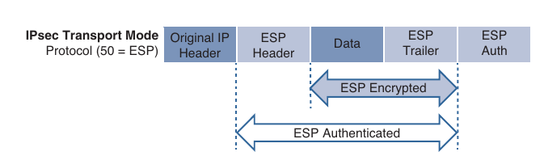
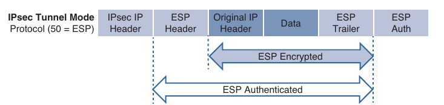
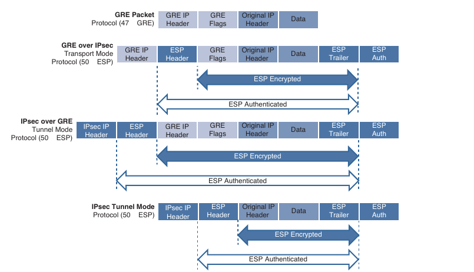
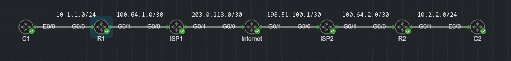

## IPsec fundamentals

- IPsec is a framework of open standards for creating highly secure virtual private networks (VPNs) using various protocols and technologies for secure communication across unsecure networks, such as the Internet

- IPsec tunnels provide the security services as listed below:

```
Security service                        Description                                     Methods used

Peer Authentication                     Verifies the identity of the VPN                Pre-Shared Key (PSK)
                                        peer through authentication                     Digital certificates

Data confidentiality                    Protects data from eavesdropping attacks        Data Encryption Standard (DES)
                                        through encryption algorithms. Changes          Triple DES (3DES)
                                        plaintext into encrypted cyphertext             Advanced Encryption Standard (AES)
                                                                                        The use of DES and 3DES is not recommended

Data integrity                          Prevents man-in-the-middle (MITM) attacks       Hash Message Authentication Code (HMAC)
                                        by ensuring that data has not been tampered     - Message Digest 5 (MD5) algorithm
                                        with during it's transit across an unsecure     - Secure Hash Algorithm (SHA-1, SHA-2)
                                        network                                         The use of MD5 is not recommended

Replay detection                        Prevents MITM attacks where an attacker         Every packet si marked with a unique sequence number
                                        captures VPN traffic and replays it back        A VPN device keeps track of the sequence number and does
                                        to a VPN peer with the intention of building    not accept a packet with a sequence number it has already
                                        an illegitimate VPN tunnel                      processes
```

- IPsec uses two different packet headers to deliver the security services mentioned above

    - Authentication header

    - Encapsulating Security Payload (ESP)

### Authentication Header (AH)

- The IP Authentication Header provides data integrity, authentication, and protection from hackers replaying packets

- The authentication header ensures that the original data packet (before encapsulation) has not been modified during transport on the public network

- It created a digital signature similar to a checksum to ensure that the packet has not been modified, using protocol number 51 located in the IP header

- The authentication header does not support encryption (data confidentiality) and NAT traversal (NAT-T), and for this reason it's use is not recommended, unless authentication is all it's desired

### Encapsulating Security Payload (ESP)

- Encapsulation Security Payload (ESP) provides data confidentiality, authentication, and protection from hackers replaying packets

- Typically, payload refers to the actual data minus any headers, but in the context of ESP, the payload is the portion of the original packet that is encapsulated within the IPsec headers

- ESP ensures that the original payload (before encapsulation) maintains data confidentiality by encrypting the payload and adding a new set of headers during transport across a public network

- ESP uses the protocol number 50, located in the IP header

- Unlike the authentication header, ESP provides data confidentiality and supports NAT-T

- Traditional IPsec provides two modes for packet transport:

    - **Tunnel Mode**: Encrypts the entire original packet and adds a new set of IPsec headers. These new headers are used to route the packet and also provide overlay functions

    - **Transport Mode**: Encrypts and authenticates only the packet payload. This mode does not provide overlay functions and routes based on the original IP headers

- Below we can see an original packet, an IPsec packet in transport mode, and an IPsec packet in tunnel mode






- IPsec supports the following encryption, hashing, and keying methods to provide security services:

    - **Data Encryption Standard (DES)**: A 56-bit symmetric data encryption algorithm that can encrypt the data sent over a VPN. This algorithm is very weak and should be avoided

    - **Triple DES (3DES)**: A data encryption algorithm that runs the DES algorithm 3 times with 3 different 56-bit keys. Using this algorithm is no longer recommended. The more advanced and more efficient AES should be used instead

    - **Advanced Encryption Standard (AES)**: A symmetric encryption algorithm used for data encryption that was developed to replace DES and 3DES. AES supports key lengths of 128 bits, 192 bits or 256 bits and is based on Rijndael algorithm

    - **Message Digest 5 (MD5)**: A one-way, 128-bit hash algorithm used for data authentication. Cisco devices use MD5 HMAC, which provides an additional layer of protection against MiTM attacks. Using this algorithm is no longer recommended, and SHA should be used instead

    - **Secure Hash Algorithm (SHA)**: A one-way, 160-bit hash algorithm used for data authentication. Cisco devices use the SHA1-HMAC, which provides additional protection against MiTM attacks

    - **Diffle-Hellman (DH)**: An asymmetric key exchange protocol that enables two peers to establish a secret key used by encryption algorithms such as AES over an unsecure communication channel. A DH group refers to the length of the key (modulus size) to use a DH key exchange. For example group 1 uses 768 bits, group 2 uses 1024, and group 5 uses 1536, where the larger the modulus, the more secure it is. The purpose of DH is to generate shared secret symmetric keys that are used by the two VPN peers for symmetrical algorithms, such as AES. The DH eschange itself is asymmetrical and CPU intensive, and the resulting shared secret keys that are generated are symmetrical. Cisco recommends avoiding DH groups 1, 2 and 5 and instead use DH groups 14 and higher

    - **RSA Signatures**: A public-key (digital certificate) cryptographic system used to mutually authenticate the peers

    - **Pre-Shared Key**: A security mechanism in which a locally configured key is used as a credential to mutually authenticate the peers

### Transform Sets

- A transform set is a combination of security protocols and algorithms

- During the IPsec SA negotiation, the peers agree to use a particular transform set for protecting a particular data flow

- When such a transform set is found, it is selected and applied to the IPsec SAs on both peers

- The allowed transform sets combination

```
Transform type                          Transform                               Description

Authentication Header transform         ah-md5-hmac                             Authentication Header with the MD5 algorithm (not recommended)
(only one allowed)

                                        ah-sha-hmac                             Authentication Header with the SHA authentication algorithm

                                        ah-sha256-hmac                          Authentication Header with the 256-bit AES authentication algorithm

                                        ah-sha384-hmac                          Authentication Header with the 384-bit AES authentication algorithm

                                        ah-sha512-hmac                          Authentication Header with the 512-bit AES authentication algorithm

ESP encryption transform                esp-aes                                 ESP with the 128-bit AES encryption algorithm
(only one allowed)
                                        esp-gcm                                 ESP with either 128-bit (default) or a 256-bit encryption algorithm
                                        esp-gmac

                                        esp-aes192                              ESP with the 192-bit AES encryption algorithm

                                        esp-aes256                              ESP with the 256-bit AES encryption algorithm

                                        esp-des                                 ESP with 56-bit and 168-bit DES encryption (no longer recommended)
                                        esp-3des

                                        esp-null                                ESP with null encryption algorithm

                                        esp-seal                                ESP with the 160-bit SEAL encryption algorithm

ESP authentication transform            esp-md5-hmac                            ESP with the MD5 (HMAC variant) authentication algorithm (no longer)
(only one allowed)                                                              recommended

                                        esp-sha-hmac                            ESP with the SHA (HMAC variant) authentication algorithm

IP compression transform                comp-lzs                                IP compression with the Lempel-Zis-Stac (LZS) algorithm
```

- The authentication header and ESP algorithms cannot be specified on the same transform set in Cisco IOS-XE releases

### Internet Key Exchange (IKE)

- Internet Key Exchange (IKE) is a protocol that performs authentication between two endpoints to establish security associations (SAs), also known as IKE tunnels

- These security associations, or tunnels, are used to carry control plane and data plane traffic for IPsec

- There are two versions of IKE: IKEv1 (specified in RFC 2709) and IKEv2 (specified in RFC 7296)

- IKEv2 was developed to overcome the limitations of IKEv1 and provides many improvements over IKEv1's implementation

- For example, it supports EAP (certificate-based authentication), has anti-DoS capabilities and needs fewer messages to establish an IPsec SA

- Understanding IKEv1 is still important because some legacy infrastructures have not yet migrated to IKEv2 or have devices or features that don't support IKEv2

#### IKEv1

- Internet Security Association Key Management Protocol (ISAKMP) is a framework for authentication and key exchange between two peers to establish, modify and tear down SAs

- It is designed to support many different kinds of key exchanges

- ISAKMP uses UDP port 500 for communication between peers

- IKE is the implementation of ISAKMP using the Oakley and Skeme key exchange techniques

- Oakley provides perfect forward secrecy (PFS) for keys, identity protection, and authentication

- Skeme provides anonymity, repudiability, and quick key refreshment

- For Cisco platforms, IKE is analogous to ISAKMP, and the two therms are used interchangeabily

- IKEv1 provides two phases of key negotiation for IKE and IPsec SA establishement:

    - **Phase 1**: Establishes a bidirectional SA between two IKE peers, known as ISAKMP SA. Because the SA is unidirectional, once it is established, either peer may initiate negotiations for phase 2

    - **Phase 2**: Establishes unidirectional IPsec SA, leveraging the ISAKMP SA established in phase 1 of the negotiation

- Phase 1 negotiation can occur using main mode (MM) or aggresive mode (AM). The peer that initiates the SA is known as the initiator, and the other peer is known as the receiver

- Main mode consists of six message exchanges and tries to protect all information during the negotiation so that no information is exposed to eavesdropping

    - **MM1** - this is the first message that the initiator sends to a responder. One or multiple SA proposals are offered, and the responder needs to match one of them for this phase to succeed

    - The SA proposals include different combinations of the following:

        - **Hash Algorithms**: MD5 or SHA

        - **Encryption Algorithms**: DES (bad), 3DES (better but not recommended), or AES (best)

        - **Authentication Key**: Pre-Shared key or digital certificates

        - **Diffie-Hellman (DH) group**: Group 1, 2, 5 and so on

        - **Lifetime**: How long until this IKE phase 1 tunnel must be torn down (default is 24 hours). This is the only parameter that does not have to exactly match with the other peer to be accepted. If the lifetime is different, the pers agree to use the smallest lifetime between them

    - **MM2**: This message is sent from the responder to the initiator with the SA proposal that it matches

    - **MM3**: In this message, the initiator starts the DH key exchange. This is based on the DH group the responder matches in the proposal

    - **MM4**: The responder sends it's own key to the initiator. At this point, encryption keys have been shared, and encryption is established for IPsec SA

    - **MM5**: The initiator starts authentication by sending the peer router it's IP address

    - **MM6**: The responder sends a similar packet and authenticates the session. At this point the ISAKMP SA is established

- When main mode is used, the identities of the two IKE peers are hidden

- Although this mode of operation is very secure, it takes longer than aggresive mode to complete the negotiation

- Aggresive mode consists of a three-message exchange and takes less time to negotiate keys between peers; however it does not offer the same level of encryption security provided by main mode negotiation, and the identities of the two peers trying to establish a security association are exposed to eavesdropping

- These are three aggresive mode messages:

    - **AM1**: In this message the initiator sends all the information contained in MM1 through MM3 and MM5

    - **AM2**: This message sends all the same information contained in MM2, MM4 and MM6

    - **AM3**: This message sends the authentication that is contained in MM5

- Main mode is slower than aggresive mode, but main mode is more secure and more flexible because it can offer an IKE peer more security proposals than aggresive mode

- Aggresive mode is less flexible and not as secure, but it is much faster

- Phase 2 uses the existing bidirectional IKE SA to securely exchange messages to establish one or more IPsec SAs between the two peers

- Unlike the IKE SA, which is a single bidirectional SA, a simple IPsec SA negotiation results in two unidirectional IPsec SAs, one on each peer

- The method used to establish the IPsec SA is known as quick mode

- Quick mode uses a three-message exchange:

    - **QM1**: The initiator (which could be either peer) can start multiple IPsec SAs in a single exchange message. This message includes agreed-upon algorithms for encryption and integrity decided as part of phase 1, as well as what traffic is to be encrypted or secured

    - **QM2**: This message from the responder has matching IPsec parameters

    - **QM3**: After this message, there should be two unidirectional IPsec SAs between the two peers

- Perfect forward secrecy (PFS) is an additional function for phase 2 that is recommended but is optional because it requires additional DH exchanges that require additional CPU cycles

- The goal of this function is to create greater resistance to crypto attacks and maintain the privacy of the IPsec tunnels by deriving session keys independently of any session key

- This way, a compromised key does not compromise future keys

- Based on the minimum number of messages that aggresive, main and quick modes may produce for IPsec SAs to be established between two peers the following can be derived:

    - Main mode uses six messages, and quick mode uses three, for a total of nine messages

    - Aggresive mode uses three messages, and quick mode uses three, for a total of six messages

#### IKEv2

- IKEv2 is an evolution of IKEv1 that includes many changes and improvements that simplify it and make it more efficient

- One of the major changes has to do with the way the SAs are established

- In IKEv2, communications consist of request and response pairs called exchanges and some time just called request/response pairs

- The first exchange, IKE_SA_INIT, negotiates cryptographic algorithms, exchanges nonces, and performs Diffie-Hellman exchange

- This is the equivalent of IKEv1's first two pair of messages, MM1 to MM4 but done as a single request/response pair

- The second exchange, IKE_AUTH, authenticates the previous messages and exchanges identities and certificates

- Then it establishes an IKE SA and a child SA (the IPsec SA)

- This equivalent to IKEv1's MM5 to MM6 as well as QM1 and QM2 but done as a single request/response pair

- It takes a total of four messages to bring up the bidirectional IKE SA and the unidirectional IPsec SAs, as opposed to six with IKEv1 aggresive mode or nine with main mode

- If additional IPsec SAs are required in IKEv2, it uses just two messages (a request/response pair) with a CREATE_CHILD_SA exchange, whereas IKEv1 would require three messages with quick mode

- Since the IKEv2 SA exchanges are completely different from those of IKEv1, they are incompatible with each other

- Below are some of the major differences between IKEv1 and IKEv2:

```
IKEv1                                           IKEv2

- Exchange modes:

Main mode                                       IKE Security Association Initialization
                                                (SA_INIT)

Aggresive mode                                  IKE_Auth

Quick mode                                      CREATE_CHILD_SA

Minimum number of messages needed to establish IPsec SAs:

Nine with main mode                             Four

Six with aggresive mode

- Supported Authentication Methods:

Pre-Shared Key (PSK)                            Pre-Shared Key

Digital RSA Certificate (RSA-SIG)               Digital RSA Certificate (RSA-SIG)

Public key                                      Elliptic Curve Digital Signature Certificate (ECDSA-SIG)

Both peers must use the same                    Asymmetric authentication is supported
authentication method
                                                Authentication method can be specified during the IKE_AUTH exchange

- Next generation encryption (NGE):

Not supported                                   AES-GCM (Galois/Counter Mode) mode

                                                SHA-256

                                                SHA-384

                                                SHA-512

                                                HMAC-SHA-256

                                                Elliptic Curve Diffie-Hellman (ECDH)

                                                ECDH-384

                                                ECDSA-384

- Attack protection:

MITM protection                                 MITM protection

Eavesdropping protection                        Eavesdropping protection

                                                Anti-DoS protection
```

- For more information: RFC7296

- Additional details about some of the new IKEv2 changes and improvements:

    - **Increased efficiency**: The exchanges are restructured to be lighter, so fewer messages and less bandwidth are required to establish SAs as compared to using IKEv1

    - **Elliptic Curve Digital Signature Algorithm (ECDSA-SIG)**: This is a newer alternative to public keys that is more efficient. It was introduced with IKEv1 late, as part of the RFC 4754, and has seen little acceptance there, but it is widely deployed with IKEv2

    - **Extensible Authentication Protocol (EAP)**: The addition of EAP mode made IKEv2 the perfect solution for remote access VPNs

    - **Next Generation Encryption (NGE)**: Security threads as well as cryptography to counteract these threats are continuously evolving. Old cryptography algorithms and key sizes no longer provide adequate protection from modern security threats and should be replaced. Next Generation Encryption (NGE) offer the best technologies for future-proof cryptography that meets the security and scalability requirements of the next two decades

    - **Asymmetric authentication**: IKEv2 removes the requirement to specify the authentication method and introduces the ability to specify the authentication method in the IKE_AUTH exchange. As a result each peer is able to choose it's method of authentication. This allows for asymmetric authentication to occur, so the peers can use different authentication methods

    - **Anti-DoS**: IKEv2 detects whether an IPsec router is under attack and prevents consumption of resources

- More about next generation cryptography:

[Cisco-ng-encryption](https://sec.cloudapps.cisco.com/security/center/resources/next_generation_cryptography)

### IPsec VPNs

- VPNs allows private networks to communicate with each other across an untrusted network such as the Internet; they should communicate in a secure manner

- Below are the currently available IPsec VPN security solutions, each of which has benefits and is customized to meet specific deployment requirements:

|Features and benefits      | Site-to-site IPsec VPN    | Cisco DMVPN                   | Cisco GetVPN  | FlexVPN       | Remote Access VPN  |
| ------------------------- | ------------------------- | -------------------------     | ------------- | ------------- | -----------------  |
| Product interoperability  | Multivendor               |   Cisco Only                  | Cisco Only    | Cisco Only    | Cisco Only         |
| Key exchange              | IKEv1 and IKEv2           | IKEv1 and IKEv2(optional)     | IKEv1 and v2  | IKEv2 only    | TLS/DTLS and IKEv2 |
| Scale                     | Low                       | Thousands for hub and spoke   | Thousands     | Thousands     | Thousands          |
| Topology                  | Hub and spoke, meshing    | Hub and spoke, on demand spoke| Hub and spoke | Hub and spoke | Remote access      | 
| Routing                   | Not supported             | Supported                     | Supported     | Supported     | Supported          |
| QoS                       | Supported                 | Supported                     | Supported     | Native support| Supported          |
| Multicast                 | Not supported             | Tunneled                      | Natively supp | Tunneled      | Not supported      |
| Private IP addressing     | Supported                 | Supported                     | Requires DMVPN| Supported     | Supported          |
| Non-IP protocols          | Not supported             | Not supported                 | Not supported | Not supported | Not supported      |
| High availability         | Stateless failover        | Routing                       | Routing       | Routing-IKEv2 dyn | Not supported  |
| Encapsulation             | Tunneled IPsec            | Tunneled IPsec                | Tunnel-less IPsec| Tunneled IPsec | Tunneled IPsec/TLS|
| Transport network         | Any                       | Any                           | Private WAN/MPLS| Any         | Any                |

#### Site-to-Site (LAN-to-LAN) IPsec VPNs

- Site-to-Site IPsec VPNs are the most versatile solution for site-to-site encryption because they allow for multivendor interoperability

- They are very dificult to manage in large networks

#### Cisco Dynamic Multipoint VPN (DMVPN)

- Simplifies configuration for hub-and-spoke and spoke-to-spoke VPNs

- It accomplishes this by combining multipoint GRE (mGRE) tunnels, IPsec, and Next Hop Resolution Protocol (NHRP)

#### Cisco Group Encrypted Transport VPN (GETVPN)

- Developed specifically for enterprises to build any-to-any tunnel-less VPNs (where the original IP header is used) across service provider MPLS networks or private WANs

- It does this without affecting any of the existing MPLS private WAN network services (such as multicast and QoS)

- Moreover encryption over private networks addresses regulatory-compliance guidelines such as those in the Health Insurance Portability and Accountability Act (HIPAA), Sarbalines-Oxley Act, the Payment Card Industry Data Security Standard (PCI DSS), and the Gramm-Leach-Bliley Act (GLBA)

#### Cisco FlexVPN

- FlexVPN is Cisco's implementation of the IKEv2 standard, featuring a unified VPN solution that combines site-to-site, remote access, hub-and-spoke topologies and partial meshes (spoke-to-spoke direct)

- FlexVPN offers a simple but modular framework that extensively uses virtual access interfaces while remaining compatible with legacy VPN implementations using crypto maps

#### Remote VPN Access

- Remote VPN access allows remote users to securely VPN into a corporate network

- It is supported on IOS with FlexVPN (IKEv2 only) and on ASA 5500-X and FirePOWER firewalls

### Site-to-Site IPsec configuration

- The GRE tunnels configuration allows for traffic between private sites to flow over the Internet

- The problem with GRE is that it offers no encryption, authentication, or associated security services, so it is highly susceptible to attacks

- One solution is to encrypt the traffic going over the GRE tunnel with IPsec

- Configuration and verification of the following site-to-site (also known as LAN-to-LAN) IPsec solutions:

    - Site-to-site GRE over IPsec with Pre-Shared key

    - Site-to-site static virtual tunnel interfaces (VTIs) over IPsec with Pre-Shared key

- VTI over IPsec encapsulates IPv4 or IPv6 traffic without the need for an additional GRE header, while GRE over IPsec encapsulates traffic with GRE and a new IP header before encapsulating the resulting GRE/IP packet in IPsec transport mode

- A comparison of GRE packet encapsulation and IPsec tunnel mode with a VTI



#### Site-to-Site GRE over IPsec

- There are two different ways to encrypt traffic over a GRE tunnel:

    - Using crypto maps

    - Using tunnel IPsec profiles

- Crypto maps should not be used for tunnel protection because they have many limitations that are resolved with IPsec profiles, including the following:

    - Crypto maps cannot natively support the use of MPLS

    - Configuration can become overly complex

    - Crypto ACLs are commonly misconfigured

    - Crypto ACL entries can consume excessive amounts of TCAM space

- Even though crypto maps are no longer recommended for tunnels, they are still widely deployed and should be understood

- The steps to enable IPsec over GRE using crypto maps are the following:

    1. Configure a crypto ACL to classify VPN traffic:

    ```
    conf t
     ip access-list extended <name> permit gre host <tunnel-source-ip> host <tunnel-destination-ip>
    ```
    - This ACL identifies traffic that needs to be protected with IPsec

    - It is used to match all traffic that passes through the GRE tunnel

    2. Configure an ISAKMP policy for IKE SA:

    ```
    conf t
     crypto isakmp policy <priority>
    ```

    - Within the ISAKMP policy configuration mode, encryption, hash, authentication, and the DH group can be specified:

    ```
     encryption {des | 3des | aes | aes 192 | aes 256}

     hash {sha | sha256 | sha384 | md5}

     authentication {rsa-sig | rsa-encr | pre-share}

     group {1 | 2 | 5 | 14 | 15 | 16 | 19 | 20 | 24}
    ```

    - The keyword `priority` uniquely identifies the IKE policy and assigns a priority to the policy, where 1 is the highest priority

    - The des and 3des encryption algorithms are no longer recommended

    - DES is the default encryption used, so it is recommended to choose one of the AES encryption algorithms

    - MD5 hash is no longer recommended. The default is SHA

    - Authentication allows for public keys {rsa-encr}, digital certificates {rsa-sig}, or PSK {pre-share} to be used

    - The group command indicates the DH group, where 1 is the default

    - It is recommended to choose one of the DH groups higher than 14

    - The following DH groups are available:

        - 1: 768-bit DH (no longer recommended)

        - 2: 1024-bit DH (no longer recommended)

        - 5: 1536-bit DH (no longer recommended)

        - 14: The 2048-bit DH group

        - 15: The 3072-bit DH group

        - 16: The 4096-bit DH group

        - 19: The 256-bit ECDH group

        - 20: The 384-bit ECDH group

        - 24: The 2048-bit DH/DSA group

    3. Configure PSK:

    ```
    conf t
     crypto isakmp key <keystring> address <peer-address> <mask>
    ```

    - The keystring should match on both peers

    - For peer-address mask, the value 0.0.0.0 0.0.0.0 can be used to allow a match against any peer

    4. Create a transform set and enter transform set configuration mode, and then set the transport or tunnel mode:

    ```
    conf t
     crypto ipsec transform-set <transform-set-name> <transform1> <transform2> <transform3>
      mode <transport | tunnel>
    ```

    - During the IPsec SA negotiation, the peers agree to use a particular transform set for protecting a particular data flow

    - `mode` indicates the IPsec tunnel mode to be either tunnel or transport

    5. Configure a crypto map and enter crypto map configuration mode:

    ```
    conf t
     crypto map <crypto-map-name> <seq-nr> [ipsec-isakmp]
    ```

    - Specify the crypto ACL to be matched, the IPsec peer, and the transform set to be negotiated:

    ```
      match address <acl-name>
      set peer {hostname | ip-address}
      set transform-set <transport-set-name1> [<transport-set-name2> <transport-set-name3> ... <transport-set-name6>]
    ```
    
    - ACL-name is the crypto ACL defined in step 1, which determines the traffic that should be protected by IPsec

    - The command `set peer` can be repeated for multiple remote peers

    - The command `set transform-set` specify the transport sets to be negotiated 

    - List multiple transform sets in priority order (highest priority first)

    6. Apply the crypto map to the outside interface:

    ```
    conf t
     interface g0/1
      crypto map <map-name>
    ```

- CML lab (same one with the GRE tunnel)



- The GRE tunnel is up and running

- R1:

```
conf t
 ip access-list extended GRE-IN-IPSEC
  permit gre any any

 crypto isakmp policy 10
  encryption aes 256
  authentication pre-share
  hash sha256
  group 16

 crypto isakmp key S3creT124 address 0.0.0.0 0.0.0.0

 crypto ipsec transform-set IPSEC-TUNNEL esp-sha256-hmac esp-aes
  mode tunnel

 crypto map IPSEC-GRE 10 ipsec-isakmp
  match address GRE-IN-IPSEC
  set peer 100.64.2.2
  set transform-set IPSEC-TUNNEL

 interface g0/1
  crypto map IPSEC-GRE
```

R2:

```
conf t
 ip access-list extended GRE-IN-IPSEC
  permit gre any any

 crypto isakmp policy 10
  encryption aes 256
  authentication pre-share
  hash sha256
  group 16

 crypto isakmp key S3creT124 address 0.0.0.0 0.0.0.0

 crypto ipsec transform-set IPSEC-TUNNEL esp-sha256-hmac esp-aes
  mode tunnel

 crypto map IPSEC-GRE ipsec-isakmp
  match address GRE-IN-IPSEC
  set peer 100.64.1.2
  set transform-set IPSEC-TUNNEL

 interface g0/0
  crypto map IPSEC-GRE 
```

- Verifying the SAs:

```
R1#show crypto ipsec sa 

interface: GigabitEthernet0/1
    Crypto map tag: IPSEC-GRE, local addr 100.64.1.2

   protected vrf: (none)
   local  ident (addr/mask/prot/port): (0.0.0.0/0.0.0.0/47/0)
   remote ident (addr/mask/prot/port): (0.0.0.0/0.0.0.0/47/0)
   current_peer 100.64.2.2 port 500
     PERMIT, flags={origin_is_acl,}
    #pkts encaps: 161, #pkts encrypt: 161, #pkts digest: 161
    #pkts decaps: 161, #pkts decrypt: 161, #pkts verify: 161
    #pkts compressed: 0, #pkts decompressed: 0
    #pkts not compressed: 0, #pkts compr. failed: 0
    #pkts not decompressed: 0, #pkts decompress failed: 0
    #send errors 0, #recv errors 0

     local crypto endpt.: 100.64.1.2, remote crypto endpt.: 100.64.2.2
     plaintext mtu 1438, path mtu 1500, ip mtu 1500, ip mtu idb GigabitEthernet0/1
     current outbound spi: 0x1C571515(475469077)
     PFS (Y/N): N, DH group: none

     inbound esp sas:
      spi: 0xA356B762(2740369250)
        transform: esp-aes esp-sha256-hmac ,
        in use settings ={Tunnel, }
        conn id: 1, flow_id: SW:1, sibling_flags 80000040, crypto map: IPSEC-GRE
        sa timing: remaining key lifetime (k/sec): (4306712/3295)
        IV size: 16 bytes
        replay detection support: Y
        Status: ACTIVE(ACTIVE)

     inbound ah sas:

     inbound pcp sas:

     outbound esp sas:
      spi: 0x1C571515(475469077)
        transform: esp-aes esp-sha256-hmac ,
        in use settings ={Tunnel, }
        conn id: 2, flow_id: SW:2, sibling_flags 80000040, crypto map: IPSEC-GRE
        sa timing: remaining key lifetime (k/sec): (4306712/3295)
        IV size: 16 bytes
        replay detection support: Y
        Status: ACTIVE(ACTIVE)

     outbound ah sas:

     outbound pcp sas:
```

- R2:

```
R2#show crypto ipsec sa 

interface: GigabitEthernet0/0
    Crypto map tag: IPSEC-GRE, local addr 100.64.2.2

   protected vrf: (none)
   local  ident (addr/mask/prot/port): (0.0.0.0/0.0.0.0/47/0)
   remote ident (addr/mask/prot/port): (0.0.0.0/0.0.0.0/47/0)
   current_peer 100.64.1.2 port 500
     PERMIT, flags={origin_is_acl,}
    #pkts encaps: 198, #pkts encrypt: 198, #pkts digest: 198
    #pkts decaps: 197, #pkts decrypt: 197, #pkts verify: 197
    #pkts compressed: 0, #pkts decompressed: 0
    #pkts not compressed: 0, #pkts compr. failed: 0
    #pkts not decompressed: 0, #pkts decompress failed: 0
    #send errors 0, #recv errors 0

     local crypto endpt.: 100.64.2.2, remote crypto endpt.: 100.64.1.2
     plaintext mtu 1438, path mtu 1500, ip mtu 1500, ip mtu idb GigabitEthernet0/0
     current outbound spi: 0xA356B762(2740369250)
     PFS (Y/N): N, DH group: none

     inbound esp sas:
      spi: 0x1C571515(475469077)
        transform: esp-aes esp-sha256-hmac ,
        in use settings ={Tunnel, }
        conn id: 1, flow_id: SW:1, sibling_flags 80004040, crypto map: IPSEC-GRE
        sa timing: remaining key lifetime (k/sec): (4176816/3223)
        IV size: 16 bytes
        replay detection support: Y
        Status: ACTIVE(ACTIVE)

     inbound ah sas:

     inbound pcp sas:

     outbound esp sas:
      spi: 0xA356B762(2740369250)
        transform: esp-aes esp-sha256-hmac ,
        in use settings ={Tunnel, }
        conn id: 2, flow_id: SW:2, sibling_flags 80004040, crypto map: IPSEC-GRE
        sa timing: remaining key lifetime (k/sec): (4176816/3223)
        IV size: 16 bytes
        replay detection support: Y
        Status: ACTIVE(ACTIVE)

     outbound ah sas:

     outbound pcp sas:
```

- R1:

```
R1#show crypto isakmp sa 
IPv4 Crypto ISAKMP SA
dst             src             state          conn-id status
100.64.1.2      100.64.2.2      QM_IDLE           1001 ACTIVE

IPv6 Crypto ISAKMP SA
```

- R2:

```
R2#show crypto isakmp sa
IPv4 Crypto ISAKMP SA
dst             src             state          conn-id status
100.64.1.2      100.64.2.2      QM_IDLE           1001 ACTIVE

IPv6 Crypto ISAKMP SA
```

- The steps to enable IPsec-over-GRE using IPsec profiles:

    1. Configure an ISAKMP policy for IKE SA:

    ```
    conf t
     crypto isakmp policy <priority>
    ```

    - Withing the ISAKMP policy configuration mode, encryption, hash, authentication, and DH group can be specified:

    ```
      encryption {des | 3des | aes | aes 192 | aes 256}

      hash {sha | sha256 | sha384 | md5}

      authentication {rsa-sig | rsa-encr | pre-share}

      group {1 | 2 | 5 | 14 | 15 | 16 | 19 | 20 | 24}
    ```

    2. Configure PSK:

    ```
    conf t
     crypto isakmp key <keystring> addresss <ip-address> <subnet-mask>
    ```

    - Keystring should match on both peers

    3. Create a transform-set and enter transform-set configuration mode:

    ```
    conf t
     crypto ipsec transform-set <transform-set-name> <transport-set1> <transport-set2> <transform-set3> ...
    ```

    - In the transform-set configuration mode set the tunnel mode:

    ```
     mode {transport | tunnel}
    ```

    - During the IPsec SA negotiation, the peers agree to use a particular transform set for protecting a particular data flow

    - `mode` indicates the IPsec tunnel mode to be either tunnel or transport

    - To avoid duble encapsulation (from GRE and IPsec), transport mode should be chosen

    4. Create an IPsec profile and enter IPsec profile configuration mode:

    ```
    conf t
     crypto ipsec profile <ipsec-profile-name>
    ```

    - Specify the transport sets to be negotiated:

    ```
      set transport-set <transport-set-name> [transform-set1... transport-set6] 
    ```

    - List multiple transform sets in priority order (highest priority first)

    5. Apply the IPsec profile to a tunnel interface:

    ```
    conf t
     interface tunnel 1
      tunnel-protection ipsec profile <profile-name>
    ```

    