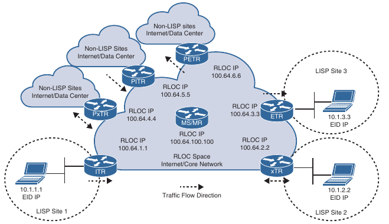
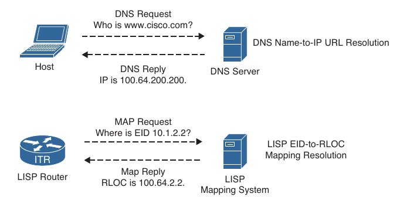
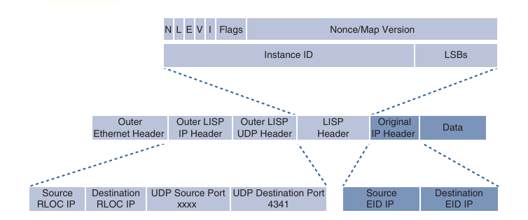
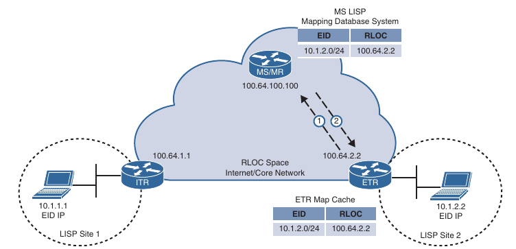
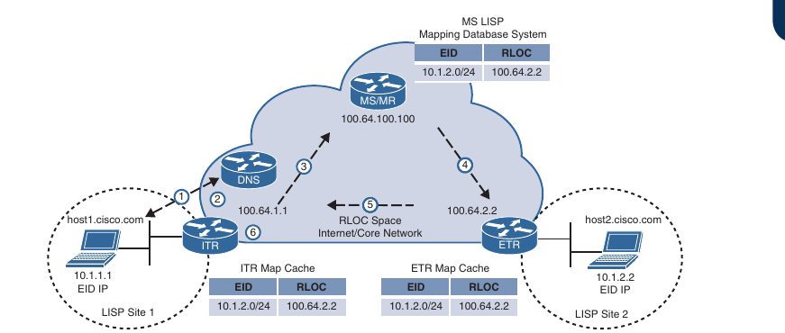
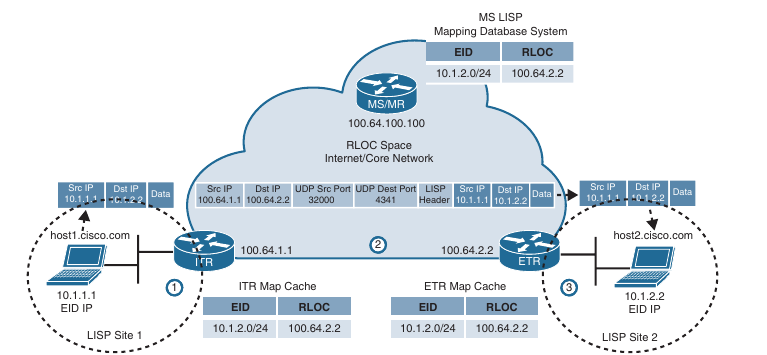
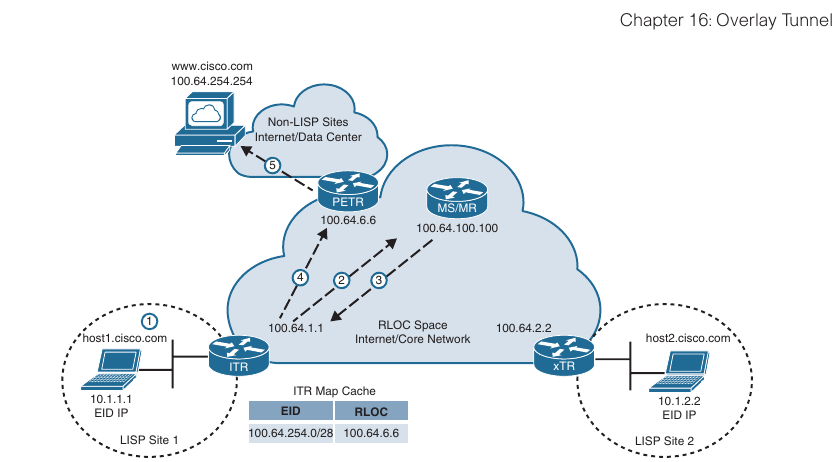
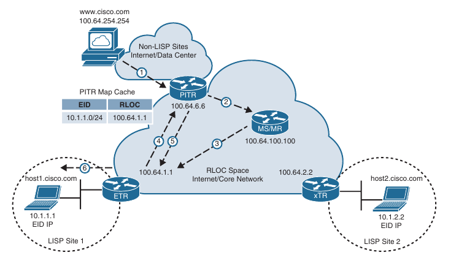

## Cisco Location/ID Separation Protocol (LISP)

- The rapid grouth of the default-free zone (DFZ), also known as the Internet Routing table, led to the development of Cisco Location/ID Separation Protocol (LISP)

- LISP is a routing architecture and a data and control plane protocol that was created to address routing scalability problems on the Internet:

    - **Aggregation Issues**: Many routes on the Internet Routing Table are provider-independent routes that are non-aggregable, and this is a part of the reason the Internet Routing Table is so large and still growing

    - **Traffic Engineering**: A common practice for ingress traffic engineering into a site is to inject more specific routes into the Internet, which exacerbates the Internet Routing Table aggregation/scalability problems

    - **Multihoming**: Proper multihoming to the Internet requires a full Internet Routing Table (800000 + IPv4 routes)

    - If a small site requires multihoming, a powerful router is needed to handle the full routing table (with large memory, powerful CPUs, more TCAM, more power, cooling and so on), which can be cost-prohibitive for deployment across smaller sites

    - **Routing Instability**: Internet route instability, also known as route churn causes intensive router CPU and memory consumption, which also requires powerfull routers

- Even though LISP was created to address the routing scalability problems of the Internet, it is also being implemented in other types of environments, such as data centers, campus networks, branches, next-gen WANs, and service provider cores

- In addition, it can also serve for applications or use cases such as mobility, network virtualization, Internet of Things (IOT), IPv4 to IPv6 transition, and traffic engineering

- Definitions of basic LISP terminology

- Definitions of LISP architecture components:

    - **Endpoint identifier (EID)**: An EID is the IP address of an endpoint within a LISP site. EIDs are the same IP addresses in use today on endpoints (IPv4 or IPv6), and they operate in the same way

    - **LISP site**: This is a name of a site where LISP routers and EIDs reside

    - **Ingress Tunnel Router (ITR)**: ITRs are LISP routers that LISP-encapsulate IP packets coming from EIDs that are destined outside the LISP site

    - **Egress Tunnel Router (ETR)**: ETRs are LISP routers that de-encapsulate LISP-encapsulated IP packets coming from sites outside the LISP site and destined to EIDs within the LISP site

    - **Tunnel router (xTR)**: xTR refers to routers that perform ITR and ETR (which is most routers)

    - **Proxy ITR (PITR)**: PITRs are just like ITRs but for non-LISP sites that send traffic to EID destinations

    - **Proxy ETR (PETR)**: PETRs act just like ETRs but for EIDs that send traffic to destinations at non-LISP sites

    - **Proxy xTR (PxTR)**: PxTR refers to a router that performs PITR and PETR functions

    - **LISP router**: A LISP router is a router that performs the functions of any or all of the following: ITR, ETR, PITR and/or PETR

    - **Routing locator (RLOC)**: An RLOC is an IPv4 or IPv6 address of an ETR that is Internet facing or network core facing

    - **Map Server (MS)**: This is a network device (typically a router) that learns EID-to-prefix mapping entries from an ETR and stores them in a local EID-to-RLOC mapping database

    - **Map Resolver (MR)**: This is a network device (typically a router) that receives LISP-encapsulated map requests from an ITR and finds the appropriate ETR to answer these requests by consulting the map server

    - **Map Resolver/Map server (MS/MR)**: When MS and MR functions are implemented on the same device, the device is referred to as an MS/MR

### LISP Architecture and Protocols

- The following are the three LISP main components:

    - LISP routing architecture

    - LISP control plane protocol

    - LISP data plane protocol

#### LISP Routing Architecture

- In traditional routing architectures, an endpoint's IP address represents the endpoint's identity and location

- If the location of the endpoint changes, it's IP address also changes

- LISP separates IP addresses into endpoint identifiers (EIDs) and routing locators (RLOCs)

- This way endpoints can roam from site to site, and the only thing that changes is their RLOC; the EID remains the same

#### LISP Control Plane

- The control plane operates in a very similar manner to the Domain Name System (DNS)

- Just as DNS can resolve a domain name into an IP address, LISP can resolve an EID to an RLOC by sending map requests to the MR

- This make it a very efficient and scalable routing protocol because it is based on a pull model, where only the routing information that is necessary (as opossed to the push model of the traditional routing protocols, such as BGP and OSPF, that push all the routes to the routers, including unnecessary ones)

#### LISP Data Plane

- ITRs LISP-encapsulate IP packets received from EIDs in an outer IP/UDP header with source and destination addresses in the RLOC space; in other words, they perform IP in IP/UDP encapsulation

- The original IP header and data are preserved; this is referred to as the inner header

- Between the outer UDP header and the inner header, a LISP shim header is included is included to encode information necessary to enable forwarding plane functionality, such as network virtualization

- Description of the most relevant header fields (more info on RFC 6830):

    - **Outer LISP IP header**: This IP header is added by an ITR to encapsulate the EID IP addresses 

    - **Outer LISP UDP header**: The UDP header contains a source port that is tactically selected by an ITR to prevent traffic from one LISP site to another from taking exactly the same path, even if there are equal-cost multipath (ECMP) links to the destination; in other words, it improves load sharing by preventing polarization. The destination UDP port used by the LISP data plane is 4341

    - **Instance ID**: This field is a 24-bit value that is used to provide device- and path-level network virtualization. In other words, it enables VPN and VRFs for virtualization and segmentation much as VPN IDs do in MPLS networks. This is useful in preventing IP address duplication within a LISP site or just as a secure boundary between multiple organizations

    - **Original IP header**: This is the IP header as received by an EID

- Because EIDs and RLOCs can be either IPv4 or IPv6 addresses, the LISP data plane supports the following encapsulation combinations:

    - IPv4 RLOCs encapsulating IPv4 EIDs

    - IPv4 RLOCs encapsulating IPv6 EIDs

    - IPv6 RLOCs encapsulating IPv4 EIDs

    - IPv6 RLOCs encapsulating IPv6 EIDs

### LISP operation

- LISP operational components:

    - Map registration and map notify

    - Map request and map reply

    - LISP data path

    - Proxy ETR

    - Proxy ITR

#### Map Registration and Notification

- When setting up LISP, the ETR routers need to be configured with the EID prefixes within the LISP site that will be registered with the MS

- Any subnets attached to the ETR, that are not configured as EID prefixes will be forwarded natively using traditional routing

- MAP registration process steps:

    1. The ETR sends a MAP register message to the MS to register it's associated EID prefix (10.2.2.0/24). In addition to the EID prefix, the message includes the RLOC IP address 100.64.2.2 to be used by the MS when forwarding map requests (re-formatted as encapsulated map requests) received through the map-ping database system

    - An ETR by default responds to MAP request messages, but in a map register message it may request that the MS answer MAP requests on it's behalf by setting the proxy map reply flag (P-bit) in the message

    2. The MS sends a map notify message to the ETR to confirm that the map register has been received and processed. A map notify message uses UDP port 4342 for both source and destination

#### Map Request and Reply

- When an endpoint in a LISP site is trying to communicate to an endpoint outside the LISP site, the ITR needs to perform a series of steps to be able to route the traffic appropriately

- Traditional routing is used within a LISP site; for example an IGP, such as OSPF can be configured

- For this reason, when the endpoint in LISP Site 1 wants to communicate with the endpoint on LISP Site 2, the typical routing steps to achive this are followed until the ITR is reached

- When the ITR is reached, LISP comes into play

- Map request and reply process:

    1. The endpoint at LISP site 1 (host 1) sends a DNS request to resolve the IP address of the endpoint in LISP site 2 (host2.cisco.com)

    - The DNS server replies with the IP address (10.2.2.2), which is the destination EID

    - host1 sends IP packets with destination IP 10.2.2.2 to it's default gateway, which in our case is the ITR router

    - If host1 was not directly connected to the ITR, the IP packets would be forwarded through the LISP site as normal IP packets using traditional routing, until they reached the ITR

    2. The ITR receives the packets from host 1 destined to 10.1.2.2. It performs a FIB lookup and evaluates the following forwarding rules:

        - Did the packet match a default route, because there was no route found for 10.2.2.2 in the routing table?

            - If yes, continue to the next step

            - If no, forward the packet natively using the matched route

        - Is the source IP a registered EID in the local map cache?

            - If yes, continue to the next step

            - If no, forward the packet natively

    3. The ITR sends an encapsulated map request to the MR for 10.2.2.2

    - A map request message uses the UDP destination port 4342, and the source IP is chosen by the ITR

    4. Because the MR and MS functionality is configured on the same device, the MS mapping database system forwards the map request to the authoritative (source of truth) ETR

    - If the MR and MS functions were on different devices, the MR would forward the encapsulated map request packet to the MS as received from the ITR, and the MS would then forward the MAP request packet to the ETR

    5. The ETR sends to the ITR a map reply message that includes an EID-to-RLOC 10.1.2.2 -> 100.64.2.2

    - The map reply message uses the UDP source port 4342, and the destination port is the one chosen by the ITR in the map request message

    - An ETR may also request that the MS answer the map requests on it's behalf by setting the proxy map reply flag (P-bit) in the map register message

    6. The ITR installs the EID-to-RLOC mapping in it's local ARP cache and programs the FIB; it is now ready to forward LISP traffic

#### LISP Data Path

- After the ITR receives the EID-to-RLOC mapping from the ETR (or MS if the ETR requested a proxy map reply), it is ready to send data from host1 to host2

- Data path for a packet originating on host1 as it traverses the RLOC space and arrives at the destination

- The encapsulation and de-encapsulation process of a LISP packet:

    1. The ITR receives a packet from EID host1 (10.1.1.1) to EID host2 (10.1.2.2)

    2. The ITR performs a FIB lookup and finds a match

    - It encapsulates the EID packet and adds an outer header with the RLOC IP address from the ITR as the source IP address and RLOC IP address of the ETR as the destination IP address

    - The packet is then forwarded using UDP destination port 4341 with a tactically selected source port in case ECMP load balancing is necessary

    3. ETR receives the encapsulated packet and de-encapsulates it to forward it to host2

##### Proxy ETR (PETR)

- A proxy ETR (PETR) is a router connected to a non-LISP site (such as data center or the Internet), that is used when a LISP site needs to communicate to a non-LISP site

- Since the PETR is connected to non-LISP sites, a PETR does not register any EID addresses with the mapping database system

- When an ITR sends a map request and the EID is not registered in the mapping database system, the mapping database system sends a negative map reply to the ITR

- When the ITR receives a negative map reply, it forwards the LISP-encapsulated traffic to the PETR

- For this to happen, the ITR must be configured to send traffic to the PETRs RLOC for any destinations for which a negative MAP reply is received

- When the mapping database system receives a map request for a non-LISP destination, it calculates the shortest prefix that matches the requested destination but that does not match any LISP EIDs

- The calculated non-LISP prefix is included in the negative map reply so that the ITR can add this prefix to it's map cache and FIB

- From that point forward, the ITR can send traffic that matches that non-LISP prefix directly to the PETR

- Proxy ETR process:

- Steps to describe the proxy ETR process:

    1. host1 performs a DNS lookup for www.cisco.com 

    - It gets a response from the DNS server with the IP address 100.64.254.254 and starts forwarding packets to the ITR with destination IP address 100.64.254.254

    2. The ITR sends a map request to the MR for 100.64.254.254

    3. The mapping database system responds with a negative map reply that includes a calculated non-LISP prefix for the ITR to add it to it's mapping cache and the FIB

    4. The ITR can now start sending LISP-encapsulated packets to the PETR

    5. The PETR de-encapsulates the traffic and sends it to www.cisco.com

##### Proxy ITR (PITR)

- PITRs receive traffic destined to LISP EIDs from non-LISP sites

- PITRs behave in the same way as ITRs: They resolve the mapping for the destination EID and encapsulate and forward the traffic to the destination RLOC

- PITRs send map request messages to the MR even when the source of the traffic is coming from a non-LISP site (that is when the traffic is not originating on an EID)

- In this situation, an ITR behaves differently because an ITR checks whether the source is registered in the local map cache as an EID before sending a map request message to the MR

- If the source isn't registered as an EID, the traffic is not eligible for LISP encapsulation, and traditional forwarding rules apply

- The proxy ITR process:

- Steps in the proxy ITR process:

    1. Traffic from www.cisco.com is received by the PITR with the destination IP address of 10.1.1.1 from host1.cisco.com

    2. The PITR sends a map request to the MR for 10.1.1.1

    3. The mapping database system forwards the map request to the ETR

    4. The ETR sends a map reply to the PITR with the EID-to-RLOC mapping 10.1.1.1 -> 100.64.1.1

    5. The PITR LISP-encapsulates the packets and starts forwarding them to the ETR

    6. The ETR receives the LISP-encapsulated packets, de-encapsulates them and sends them to host1

- When duplicate EID IP addresses exist in the database, the `eid-table` command (or instance ID) field in the LISP headers can be used to refer to which RLOC to send the traffic

- More information on the LISP configuration and operation:

[Cisco-docs-LISP](https://www.cisco.com/c/en/us/td/docs/ios-xml/ios/iproute_lisp/command/ip-lisp-cr-book/ip-lisp-cr-book_chapter_01010.html)
