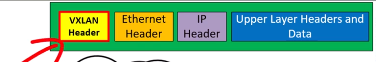
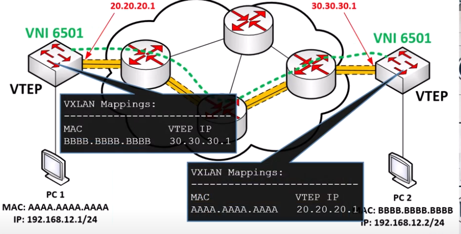

## Virtusl Extensible Local Area Network (VXLAN)

- Server virtualization has placed increased demands on the lwgacy network infrastructure

- A bare-metal server now has multiple virtual machines (VMs) and containers, each with it's own MAC address

- This has led to a number of problems with traditional Layer 2 networks, such as the following:

    - The 12-bit VLAN ID yelds 4000 VLANs, which are insufficient for server virtualization

    - Large MAC address tables are needed due to hundreds of thousands of VMs and containers attached to the network

    - STP blocks links to avoid loops, and this results in a large number of disabled links, which is unacceptable

    - ECMP is not supported

    - Host mobility is difficult to implement

- VXLAN is an overlay data plane encapsulation scheme that was developed to address the various issues seen in traditional Layer 2 networks

- It extends Layer 2 and Layer 3 overlay networks over a Layer 3 underlay network, using MAC-in-IP/UDP tunneling

- Each overlay is termed a VXLAN **segment**

- The Internet Assigned Numbers Authority (IANA) assigned to VXLAN the UDP destination port 4789

- There may be some older/prestandard implementations of VXLAN that are using the UDP destination port 8472

- The reason for this discrepancy is that when VXLAN was first implemented in Linux, the VXLAN UDP destination port had not yet been officially assigned, and Linux decided to use port 8472 because many vendors at that time were using UDP destination port 8472

- Later, IANA assigned port 4789 for VXLAN, and to avoid breaking some existing deployments, some Linux distributions decided to leave port 8472 as the default value

- Be sure to check which is the right port to use when dealing with multiple vendor interoperability situations


- Unlike the VLAN ID, which has only 12 bits and allows for 4000 VLANs, VXLAN has a 24-bit VXLAN Network Identifier (VNI), which allows for up to 16 million VXLAN segments (most commonly known as overlay networks), to coexist within the same infrastructure

- The VNI is located in the VXLAN shim header that encapsulates the original inner MAC frame originated by an endpoint

- The VNI is used to provide segmentation for Layer 2 and Layer 3 traffic

- To facilitate the discovery of VNIs over the underlay Layer 3 network, virtual tunnel endpoints (VTEPs) are used

- VTEPs are entities that originate or terminate VXLAN tunnels

- They map Layer 2 and Layer 3 packets to the VNI to be used in the overlay network

- Each VTEP has two interfaces:

    - **Local LAN interfaces**: These interfaces on the local LAN segment provide bridging between local hosts


    - **IP interface**: This is a core-facing interface for VXLAN. The IP interface's IP address helps identify the VTEP in the network

    - It is also used for VXLAN traffic encapsulation and de-encapsulation

- The VXLAN VTEP with IP interface and the local LAN interface:


- Devices that are not capable of supporting VXLAN and need to use traditional VLAN segmentation can be connected to VXLAN segments by using a VXLAN gateway

- A VXLAN gateway is a VTEP device that combines a VXLAN segment and a classic VLAN segment into one common Layer 2 domain

- The VXLAN standard defines VXLAN as a data plane protocol, but it does not define a VXLAN control plane; it was left open to be used with any control plane

- Currently four different VXLAN control and data planes are supported by Cisco devices:

    - VXLAN with Multicast Underlay

    - VXLAN with static unicast VXLAN tunnels

    - VXLAN with MP-BGP EVPN control plane

    - VXLAN with LISP control plane

- MP-BGP EVPN and Multicast are the most popular control planes used in data centers and private cloud environments

- For campus environments, VXLAN with a LISP control plane is the preferred choice

- Cisco Software-Defined Access (SD-Access) is an example of implementation of VXLAN with the LISP control plane

- An interesting fact is that the VXLAN specification originated from a Layer-2 LISP specification (draft-smith-lisp-layer2-00) that aimed to introduce Layer 2 segmentation support to LISP

- The VXLAN specification introduced the term VXLAN in liew of Layer-2 LISP and didn't port over some of the fields from the Layer 2 LISP specification into the VXLAN specification

- The minor differences between the Layer 2 LISP specification and the VXLAN specification headers are the following:


- Fields that were not ported over from Layer 2 LISP into VXLAN were reserved for future use

- As you can see above, LISP encapsulation is only capable of performing IP-in-IP/UDP encapsulation, which allows it to support Layer 3 overlays only, while VXLAN encapsulation is capable of encapsulating the original Ethernet header to perform MAC-in-IP encapsulation, which allows it to support Layer 2 and Layer 3 overlays


## What is VXLAN?

- What problems does VXLAN solve?

- When should it be deployed?

- VXLAN solves some of the scalability problems involved with Layer 2 infrastructures

- Virtually all networks (big or small) are subdivided in small virtual LANs (VLANs) - these are layer 2 subdivisions of networks into segments

- Each VLAN will typically be assigned it's own IP address subnet

- VLANs are identified within a network using their VLAN ID

- VLAN IDs in a 802.1Q frame header is a 12-bit number


- VLAN ID values range from 0 to 4095

- The problem arise when we apply VLANs to cloud infrastructures and large datacenters

- The demand for more VLANs has increased with the rise of certralized server infrastructure, the rise of cloud computing and the virtualization of physical server resources into multiple VMs or containers

- In this case 4096 VLANs are not enough anymore

- In some situations we should deliver hundreds of thousands or milions of layer 2 domains

- VXLAN is used in this case

- Another used for VXLAN - to avoid the need for Spanning Tree Protocol to block redundant links

- Traditional Layer 2 switches require the use of some type of Spanning Tree Protocol

- This is a protocol that is used to ensure that a Layer 2 topology will not create any Layer 2 loops

- STP will block some of the interfaces of the switches to prevent Layer 2 loops

- This is vital for a Layer 2 network to function

- As the scale of the network increases, the number of idle links due to spanning tree blocking them increases

- In datacenters, with 25, 40, or 100 Gbps links - imagine them just sitting idle

- This is a huge waste of bandwidth and money

- The use of VXLAN also solves the ineficiency introduced by Spanning Tree, and ensure that no links remain idle

- The third problem that VXLAN solve has to do with MAC address table sizes


- You may run multiple servers or containers on the same physical server 

- In this case the switches serving that servers will have to learn hundreds of MAC addresses and will have to populate their MAC address tables accordingly

- Switches will have to learn many MAC addresses on a single switch port


- This situation will result in the accumulation of enormous ammount of MAC addresses in the MAC address tables of each on of these switches

- This is likely to be due to the large number of virtual devices that the MAC addresses being exchanged will very quickly overhelm the capacity of the switch's memory

- What is VXLAN, what does it look like?

- VXLAN is a network virtualization technology used to extend Layer 2 networks over Layer 3 networks


- At the very heart of VXLAN is the concept of an overlay and an underlay network

- VXLAN creates an overlay network by encapsulating ethernet frames within UDP packets


- This allows for creation of virtual layer 2 networks over a layer 3 network

- The underlay network's principal function is to transfer packets from point A to point B in a network

- It operates exclusively at layer 3 without any layer 2 involvement

- By using Layer 3 we can implement an IGP like OSPF or EIGRP so we can distribute traffic across that whole infrastructure

- Overlay and underlay networks essentially operate independently 

- The overlay network is virtual and it depends on the underlay network but modifications on the overlay network do not impact the underlay network

- You can add/remove links in the underlay network as long as your routing protocol can reach the destination, that way the overlay network will remain unaffected

- VXLAN essentially provides the flexibility to span virtual networks across different physical locations making it easier to manage and move virtual machines without being constraint by the physical network topology

- VXLAN was born out of necessity, the need to overcome the scalability issues involved with more traditional layer 2 networks

- VXLAN is an open standard described in RFC 7342

### VNIs, VTEPs and VXLAN architecture

- What is a VNI?

- VNI = VXLAN Network Identifier

- Similar functions to VLANs

- Uniquely identifies a Layer 2 segment or domain

- VNI is represented using a 24-bit number - resulting in over 16 million values

- Compare to 12-bit VLAN ID - over 4000 values - this is a huge increase

- VXLAN actually encapsulates Layer 2 frames within UDP datagrams

- When this is done, there is an extra VXLAN header that is added to the frame

- The VNI value is contained within the VXLAN header

- What is a VTEP?

- VTEP = VXLAN Tunnel EndPoint

- This is the device at which VXLAN encapsulation and de-encapsulation takes place

- This device is connected to the underlay network 

- It creates the tunneling mechanism for VXLAN

- VXLAN was created primarly for use in datacenters and cloud-based infrastructure, where there are many virtual machines and containers

- VTEPs can be either software-based or hardware-based

- Software-based VTEPs are those software switches that are typically used within an hypervisor that host the end virtual devices

- Hypervisors have software switches dealing with the network connectivity for the virtual machines and containers that it hosts


- Switch exists only as software process connecting VMs and containers

- The software switch can be a VTEP

- VTEP can also be hardware-based


- They can be configured within a hardware switch 

- In that case, the location at which encapsulation and de-encapsulation take place is in the hardware switch itself

- The VTEP functionality is something that you enable and configure within your hardware or software switch

- Configuration using Cisco switches -> hardware VTEPs configuration

- The configuration principles are the same for software VTEPs as well


- In the topology - the entire topology is logically operating as a huge layer 2 switch, that can be segmented into millions of layer 2 segments

- Let's say that we want to create 3 VNIs, three segments, to be interconnected over this topology


- Each VTEP will have 2 interfaces that are involved in the process of tunneling:

    - VTEP IP interface: Physical layer 3 interface connected to the Underlay network. As long as IP connectivity is available between VTEP IP interfaces, then we can have VXLAN connectivity

    - VNI interfaces: Logical interfaces that correspond to the VNIs being terminated on VTEP. These are similar to switched virtual interfaces (SVIs)

- VNI interfaces - SW1:

    - VNI 6501

    - VNI 6503

- A VTEP can be configured with multiple VNI interfaces

- Each of these VNI interfaces, is associated with the same VTEP IP interface

- Multiple VNIs are tunneled through the same physical interface, much like a trunk

- Each VNI configured in a VTEP, essentially creates a separate layer 2 segment


- Data which is encapsulated in an IP packet, which is then encapsulated into an Ethernet frame

- This frame is a Layer 2 entity, and it is then encapsulated into a UDP datagram

- Before adding a UDP header, we first add a VXLAN header

- The VXLAN header is 8 bytes in length


- First byte contains a flags field, where the I flag (the 5th bit), must always be set to 1 for any valid VNI

- The other 7 bits of the first byte, are reserved fields for future use and must be set to 0 on transmission, and also be ignored by the receiving VTEP

- The next 24 bits are also reserved for future use

- Then it comes the VNI field itself, this is a 24-bit field. Here the value of the VNI is stored

- For the duration of the transmission of the frame, over the VXLAN infrastructure, this is the field that tells the VTEPs to which VNI this frame belongs

- It is added upon encapsulation at ingress on the source VTEP and it is read and removed upon egress on the destination VTEP

- The last byte at the end of the VXLAN header, which is also reserved

### VXLAN - Encapsulation, Headers and Packet Transmission Process

- VXLAN overcomes the limitations of the more traditional Ethernet VLANs defined by IEEE 802.1Q standard

- VXLAN header and the encapsulation process that takes place when layer 2 segments are spanned across a VXLAN infrastructure



- This header is appended to the conventional ethernet header before it is encapsulated into an UDP datagram

- It contains the VNI to which the frame belongs

- To be able to send the VXLAN frame to the destination VTEP, it must be encapsulated into an UDP datagram, with an IP header with the IP addresses belonging to the underlay network, then continued with the layer 2 technology used for that transport (Ethernet, etc.)


- The communication process between two hosts that are communicating over a vxlan network


- The underlay network can be anything - the Internet, an MPLS network, etc. As long as the layer 3 connectivity between the VTEPs can be made


- PC1, sending the frame is completely unaware of the vxlan infrastructure


- Once the frame reaches the switch, it is encapsulated with a VXLAN header and send across the layer 3 network until it reaches it's destination

- VXLAN haves a mapping process on which the destination VTEP is mapped with the destination IP address, which then is added to the packet

- The contents of the packet is unknown to the underlay network and it essentially doesn't care because it just tunnels that packet to the appropriate destination VTEP

- Once the packet reaches the destination VTEP, the outer IP and UDP headers are removed


- The VXLAN header and the VTEP is read, in order to place the frame on the correct VNI

- The frame then is placed into the appropriate layer 2 segment

- The process of how the source VTEP looks up the destination VTEPs IP address based on the destination MAC address

- There are several technologies that allow us to achieve this mapping

- First, you can statically configure unicast VXLAN tunnels

- Using a Multicast Underlay network

- Multi-protocol BGP (MP-BGP) with Ethernet VPN (EXPN)

- Location/ID Separation Protocol (LISP)

### VXLAN - Control Plane Operations

- When PC1 sends a frame to PC2, when the source VTEP receives the frame, it does two things:

    - It knows to which VNI this frame belongs, because the switch has been configured so that the specific local VLAN corresponds with the VNI 6501. So in the VXLAN header that the VTEP adds to the frame, it populates it with the appropriate VNI

    - It encapsulates the whole frame with the VXLAN header within an UDP datagram. This datagram is then encapsulated into an IP packet

- The source IP address is that of the local VTEP

- Challenge: How does this VTEP know what destination IP address to put in the IP header?

- How does it know which other VTEP to connect to get to the intended destination?

- It must use a mapping process to map the destination MAC of the original frame with the destination VTEP IP

- Hosts on a traditional layer 2 network use the ARP protocol to map the IP address of a device with a MAC address

- Once PC1 wants to communicate to PC2, it knows the IP address of PC2 but it does not know the MAC address associated with PC2

- It (PC1) sends out an ARP request 

- That ARP request reaches local VTEP

- That VTEP will add an VXLAN header with the associated VNI and will encapsulate that ARP request into an UDP datagram

- That encapsulated ARP request is then forwarded to all other VTEPs that share the same VNI

- The source VTEP sends the encapsulated ARP request to the remote VTEP and all othef VTEPs on VNI 6501

- The destination VTEP will send the ARP request on the network segment that this VNI is part of

- PC2 sees that ARP request and responds

- The ARP reply is encapsulated using the same mechanism and send back to the originating VTEP, and then is decapsulated and sent to PC1

- Now PC1 can populate the destination MAC address of the ethernet frame, and it sends it along it's way

- Now the switch goes to the dataplane process of adding the VXLAN header, and being tunneled through the VXLAN topology to the appropriate remote VTEP into it's intended destination

- All this process is also used by VTEPs to populate their VXLAN mappings, so they know where to find both PC1 and PC2



- The mapping process can be achieved using manually configured mappings, it can be achieved with a multicast underlay, it can be achieved using Multiprotocol BGP with EVPN (Ethernet VPN), or can be achieved using LISP

### VXLAN - Basic Configuration on Cisco Nexus Switches


- VXLAN is supported on Nexus switches and on some other Cisco switches as 9K series Catalyst switches, and some 3K Catalyst switches with appropriate IOS-XE versions

- We assume that VTEP1 is able to reach VTEP2 using their IP addresses in the underlay network (20.20.20.1 to 30.30.30.1)

- **Static Ingress Replication**: Any broadcast or multicast traffic received by a VTEP will be forwarded to a manually configured static list of VXLAN peers

- Configure the interfaces connected to underlay network for VXLAN:

- VTEP1:

```
conf t
 interface e0/1
  no switchport
  ip address 20.20.20.1/24
```

- VTEP2:

```
conf t
 interface e0/1
  no switchport
  ip address 30.30.30.1/24
```

- VXLAN requires configuring a loopback interface. Will be used to terminate the VXLAN tunnels itself:

- VTEP1:

```
conf t
 interface l0
  ip address 1.1.1.1/32
```

- VTEP2:

```
conf t
 interface l0
  ip address 2.2.2.2/32
```

- We should make sure that 1.1.1.1 is able to ping 2.2.2.2 on the underlay network

- Create the VNIs:

- VTEP1:

```
conf t
 vlan 10
  vn-segment 6501
  exit
 
 interface e0/2
  switchport access vlan 10
```

- VTEP2:

```
conf t
 vlan 10
  vn-segment 6501

 interface e0/2
  switchport access vlan 10
```

- Now we must create the VXLAN interface. In nexus terminology this is called Network Virtual Interface (NVE)

- NVE = Network Virtualization Edge

- VTEP 1 - Configure NVE interface:

```
conf t
 interface nve 1
  no shutdown
  source interface loopback 0
  member vni 6501
  ingress-replication protocol static
   peer-ip 2.2.2.2
```

- VTEP 2 - configure NVE interface:

```
conf t
 interface nve 1
  no shutdown
   source interface loopback 0
   member vni 6501
   ingress-replication protocol static
    peer-ip 1.1.1.1
```

### VXLAN - Spine and Leaf Architecture

- VXLAN in datacenters or cloud deployments:


- VXLAN topology as seen from inside:


- We call the switches on the underlay network spine switches

- Our VTEPs, which are on the edge of the network, are leaf switches


- Prerequisite: Each leaf is connected to ALL spine switches

- This optimizes East-West traffic: Communication between devices connected to leaf switches

- In the VXLAN topology the term spine and leaf are used more loosly to refer to the role devices play in the topology

- We ca view the VXLAN topology as a giant access switch, which countless of ports, each connected to a VNI


- Topology-VXLAN-config:


- VTEP1 config - CSR1000V:

```
bridge-domain 10 
 member vni 6001
 member GigabitEthernet2 service-instance 1
  remote circuit id 1
!
interface Loopback0
 ip address 10.1.1.1 255.255.255.255
!
interface GigabitEthernet1
 ip address 10.12.1.1 255.255.255.252
 negotiation auto
 no mop enabled
 no mop sysid
!
interface GigabitEthernet2
 no ip address
 negotiation auto
 no mop enabled
 no mop sysid
 service instance 1 ethernet
  encapsulation dot1q 10
  rewrite ingress tag pop 1 symmetric
 !
!
interface GigabitEthernet3
 no ip address
 shutdown
 negotiation auto
 no mop enabled
 no mop sysid
!         
interface GigabitEthernet4
 no ip address
 shutdown
 negotiation auto
 no mop enabled
 no mop sysid
!
interface nve1
 no ip address
 source-interface Loopback0
 vxlan udp port 4789
 member vni 6001
  ingress-replication 10.2.2.2
 !
 no mop enabled
 no mop sysid
!
router ospf 1
 network 10.1.1.1 0.0.0.0 area 0
 network 10.12.1.0 0.0.0.3 area 0
!
```

- VTEP2- CSR1000V

```
bridge-domain 10 
 member vni 6001
 member GigabitEthernet2 service-instance 1
!
interface Loopback0
 ip address 10.2.2.2 255.255.255.255
!         
interface GigabitEthernet1
 ip address 10.22.22.1 255.255.255.252
 ip ospf 1 area 0
 negotiation auto
 no mop enabled
 no mop sysid
!
interface GigabitEthernet2
 no ip address
 negotiation auto
 no mop enabled
 no mop sysid
 service instance 1 ethernet
  encapsulation dot1q 10
  rewrite ingress tag pop 1 symmetric
 !
!
interface GigabitEthernet3
 no ip address
 shutdown
 negotiation auto
 no mop enabled
 no mop sysid
!         
interface GigabitEthernet4
 no ip address
 shutdown
 negotiation auto
 no mop enabled
 no mop sysid
!
interface nve1
 no ip address
 source-interface Loopback0
 member vni 6001
  ingress-replication 10.1.1.1
 !
 no mop enabled
 no mop sysid
!
router ospf 1
 network 10.2.2.2 0.0.0.0 area 0
!
```

- Verification VTEP1:

```
VTEP1#show bridge-domain 10 
Bridge-domain 10 (2 ports in all)
State: UP                    Mac learning: Enabled
Aging-Timer: 300 second(s)
Maximum address limit: 65536
    GigabitEthernet2 service instance 1
    vni 6001
   AED MAC address    Policy  Tag       Age  Pseudoport
   0   5254.00BD.800A forward dynamic   99   GigabitEthernet2.EFP1
   0   5254.00B9.800A forward dynamic   100  nve1.VNI6001, VxLAN 
                                             src: 10.1.1.1 dst: 10.2.2.2


VTEP1#show nve vni 
Interface  VNI        Multicast-group VNI state  Mode  BD    cfg vrf                      
nve1       6001       N/A             Up         L2DP  10    CLI N/A
```

- Verification VTEP2:

```
VTEP2#show bridge-domain 10
Bridge-domain 10 (2 ports in all)
State: UP                    Mac learning: Enabled
Aging-Timer: 300 second(s)
Maximum address limit: 65536
    GigabitEthernet2 service instance 1
    vni 6001
   AED MAC address    Policy  Tag       Age  Pseudoport
   0   5254.00BD.800A forward dynamic   203  nve1.VNI6001, VxLAN 
                                             src: 10.2.2.2 dst: 10.1.1.1
   0   5254.00B9.800A forward dynamic   204  GigabitEthernet2.EFP1


VTEP2#show nve vni 
Interface  VNI        Multicast-group VNI state  Mode  BD    cfg vrf                      
nve1       6001       N/A             Up         L2DP  10    CLI N/A                      
```

- CSR router info:

```
VTEP1#show version 
Cisco IOS XE Software, Version 17.03.08a
Cisco IOS Software [Amsterdam], Virtual XE Software (X86_64_LINUX_IOSD-UNIVERSALK9-M), Version 17.3.8a, RELEASE SOFTWARE (fc3)
Technical Support: http://www.cisco.com/techsupport
Copyright (c) 1986-2023 by Cisco Systems, Inc.
Compiled Fri 20-Oct-23 15:48 by mcpre


Cisco IOS-XE software, Copyright (c) 2005-2023 by cisco Systems, Inc.
All rights reserved.  Certain components of Cisco IOS-XE software are
licensed under the GNU General Public License ("GPL") Version 2.0.  The
software code licensed under GPL Version 2.0 is free software that comes
with ABSOLUTELY NO WARRANTY.  You can redistribute and/or modify such
GPL code under the terms of GPL Version 2.0.  For more details, see the
documentation or "License Notice" file accompanying the IOS-XE software,
or the applicable URL provided on the flyer accompanying the IOS-XE
software.


ROM: IOS-XE ROMMON

VTEP1 uptime is 1 hour, 40 minutes
Uptime for this control processor is 1 hour, 41 minutes
System returned to ROM by reload
System image file is "bootflash:packages.conf"
Last reload reason: reload


This product contains cryptographic features and is subject to United
States and local country laws governing import, export, transfer and
use. Delivery of Cisco cryptographic products does not imply
third-party authority to import, export, distribute or use encryption.
Importers, exporters, distributors and users are responsible for
compliance with U.S. and local country laws. By using this product you
agree to comply with applicable laws and regulations. If you are unable
to comply with U.S. and local laws, return this product immediately.

A summary of U.S. laws governing Cisco cryptographic products may be found at:
http://www.cisco.com/wwl/export/crypto/tool/stqrg.html

If you require further assistance please contact us by sending email to
export@cisco.com.

License Level: ax
License Type: N/A(Smart License Enabled)
Next reload license Level: ax

The current throughput level is 1000 kbps 


Smart Licensing Status: UNREGISTERED/No Licenses in Use

cisco CSR1000V (VXE) processor (revision VXE) with 1104920K/3075K bytes of memory.
Processor board ID 9SVJOZ6W44O
Router operating mode: Autonomous
4 Gigabit Ethernet interfaces
32768K bytes of non-volatile configuration memory.
3012036K bytes of physical memory.
6188032K bytes of virtual hard disk at bootflash:.

Configuration register is 0x2102
```

- Adding more hosts:

```
VTEP2#show bridge-domain 10
Bridge-domain 10 (2 ports in all)
State: UP                    Mac learning: Enabled
Aging-Timer: 300 second(s)
Maximum address limit: 65536
    GigabitEthernet2 service instance 1
    vni 6001
   AED MAC address    Policy  Tag       Age  Pseudoport
   0   622C.B1B6.9392 forward dynamic   197  nve1.VNI6001, VxLAN 
                                             src: 10.2.2.2 dst: 10.1.1.1
   0   5254.00BD.800A forward dynamic   263  nve1.VNI6001, VxLAN 
                                             src: 10.2.2.2 dst: 10.1.1.1
   0   5254.008D.6328 forward dynamic   274  nve1.VNI6001, VxLAN 
                                             src: 10.2.2.2 dst: 10.1.1.1
   0   5254.00B9.800A forward dynamic   256  GigabitEthernet2.EFP1

```

