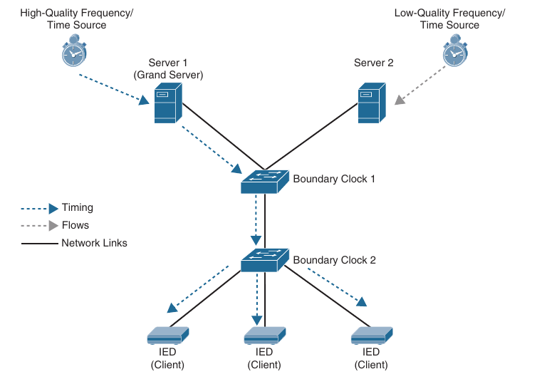
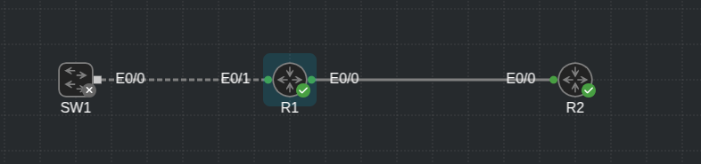

## Precision Time Protocol (PTP)

- IEEE 1588-2002 defined **Precision Time Protcol (PTP)** as a mechanism to provide time synchronization for networked measurement and control systems

- This mechanism was designed to synchronize network clocks on devices that are distributed throughout the network

- PTP was updated in IEEE 1588-2008 (known as PTPv2) and is not backward compatible with regular PTP

- Industrial networks are extremely sensitive to time drift and justified the creation of PTP

- PTP is also an attractive feature because it requires minimal bandwidth and overhead to function

- PTP offers more precisse and accurate time, which is crucial for some of the new devices that work on packet-based networks

- An example of this could be energy providers

- They need to provide accurate usage measurement for peak and off-peak billing rates

- PTP can dynamically adjust the time clocks in the network

- This capability allows the distributed devices to stay synchronized with one another in the event of packet delay

- This packet delay can arise due to intermitent moments of congestion and interface buffering as well as any kind of memory delay

- Memory leak can impact packets and cause latency when a device such as a switch looks up MAC addresses in the MAC address table while verifying the CRC field in the packet

- Packets coming out of the local memory of the device could potentially be forwarded with varying latency impacting network time

- PTP can address these concerns by adjusting the distributed clocks on the devices to accomodate for these scenarios

- This adjustment is achieved through a series of PTPv2 message exchanges between other devices

- These messages are then measured to look at the delay received in each direction between devices

- This delay is an average that is run on all the received and transmitted messages to come up with the calculation

- Transparent clocks are the mechanism used to make these calculations

- Transparent clocks connect to the PTP server and PTP client clocks

- Other devices point to these clocks to reduce the latency of getting time from the PTP server clock

- The two PTPv2 message types are *Event* and *General* messages

- The General Events are not timestamped and are used to build the client/server topology

- The General message types are:

    - **Announce**: Used to determine which Grand Master is selected Best Master

    - **Follow_Up**: Used to convey a captured timestamp of a transmitted SYNC message

    - **Delay_Response**: Used to measure the delay between IEEE 1588 devices

    - **Pdelay_Response_Follow_Up**: Uaed between IEEE 1588 devices to measure the delay on an incoming link

    - **Management**: Used between management devices and clocks

    - **Signalling**: Used by clocks to deliver how messages are sent

- The Announce message is used to set up the client/server topology or hierarchy, similar to hello packets; whereas Follow_Up and Delay_Response messages are used to synchronize ordinary and boundary clocks

- A boundary clock is a device that is between the areas of the network that can exchange these messages with other devices that are closer to them, like a geographic hierarchy

- The Event message types consist of:

    - **Sync**: Used to convey time

    - **Delay_Request**: Used to measure delay from downstream devices

    - **Pdelay_Request**: Used to initiate and measure delay

    - **Pdelay_Response**: Used to respond and measure delay

- These message types are critical because they contain the timestamps indicating when the data packets are passing through the ingress or egress of an interface

- These timestamps are used to calculate the delay seen between the messages

- Sync and Delay_Request messages are used to synchronize ordinary and boundary clocks as well; whereas Pdelay_Request, Pdelay_Response and Pdelay_Response_Follow_Up messages are used to measure the link delay between the devices

- Similar to NTP, there is the concept of a server and client along with redundancy capabilities

- If the primary server is down, the clients will redirect to the secondary server

- Below is a high-level view of a network using PTP



### PTP Configuration

- The configuration of PTP is slightly different than that of NTP

- There are multiple options

- You can configure PTP globally to pass the PTPv2 packets as multicast traffic in *Forward* mode, which will synchronize all switch ports with the Grand Server, which is the most accurate clock in the environment

- However, as an alternative, PTP can be configured to be in *Boundary* mode

- A requirement for Per Port PTP, the switch must be in boundary mode

- By default, after PTP is enabled, it is enabled on all Fast Ethernet and Gigabit Ethernet Ports

- Below are listed the default PTP settings on a Cisco IE2000 switch

```
Feature                                                                         Default setting

PTP Boundary Mode                                                               Disabled

PTP Forward Mode                                                                Disabled

PTP Transparent Mode                                                            Enabled

PTP Priority1 and PTP Priority2                                                 Default Priority is 128

PTP Announce Interval                                                           2 Seconds

PTP Announce Timeout                                                            8 Seconds

PTP Delay Request Interval                                                      32 Seconds

PTP Sync Interval                                                               1 Second

PTP Sync Limit                                                                  50.000 Nanoseconds
```

- Below is the configuration for PTP boundary mode on SW1 and End-to-End Transparent mode on SW2

- Keep in mind that after PTP is enabled in boundary mode, all enabled ports on connecting switches will automatically have PTP enabled

- This is evident by the **Port State FAULTY: FALSE** line in the output of SW2

- In contrast if the Port State reads **Port State Faulty: TRUE**, then there is an issue with SW2 communicating with SW1

- SW1:

```
conf t
 ptp mode boundary
```

```
SW1# show ptp clock
PTP CLOCK INFO
PTP Device Type: Boundary clock
PTP Device Profile: Default Profile
Clock Identity: 0x00:60:5C:FF:FE:18:8C:00
Clock Domain: 0
Number of PTP ports: 10
Priority1: 128
Priority2: 128
Clock Quality:
Class: 248
Accuracy: Unknown
Offset (log variance): N/A
Offset From Master(ns): 0
Mean Path Delay(ns): 0
Steps Removed: 0
Local clock time: 01:40:15 UTC March 15 2023
```

- SW2:

- (as transparent mode is enabled by default, no config needed)

```
SW1# show ptp clock
PTP CLOCK INFO
PTP Device Type: Boundary clock
PTP Device Profile: Default Profile
Clock Identity: 0x00:60:5C:FF:FE:18:8C:00
Clock Domain: 0
Number of PTP ports: 10
Priority1: 128
Priority2: 128
Clock Quality:
Class: 248
Accuracy: Unknown
Offset (log variance): N/A
Offset From Master(ns): 0
Mean Path Delay(ns): 0
Steps Removed: 0
Local clock time: 01:40:15 UTC March 15 2023
```

```
SW2# show ptp port fa1/1
PTP PORT DATASET: FastEthernet1/1
Port identity: clock identity: 0x00:0A:F3:FF:FE:15:A8:00
Port identity: port number: 1
PTP version: 2
Port state FAULTY: FALSE
Sync fault limit: 500000000
```

- The PTP features and configuration options may vary depending on the device type and product family

- PTP routers - IOL




- R1: PTP boundary mode:

```
conf t
 ptp clock boundary domain 1 profile default 
```

- Verify:

```
R1#show ptp clock running 


                      PTP Boundary Clock [Domain 1]  

         State          Ports          Pkts sent      Pkts rcvd      Redundancy Mode

         FREERUN        0              3090           3023           Hot standby
```

- R2: Transparent mode:

```
conf t
 ptp clock transparent domain 1 profile default
```

```
R2#show ptp clock running 


                      PTP Transparent Clock [Domain 1]  

         State          Ports          Pkts sent      Pkts rcvd      Redundancy Mode

         -              0              2090           2023           -
```
